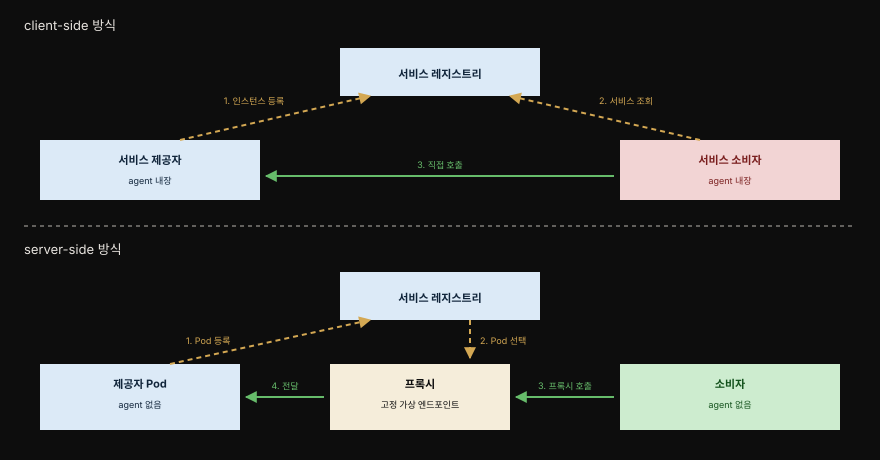
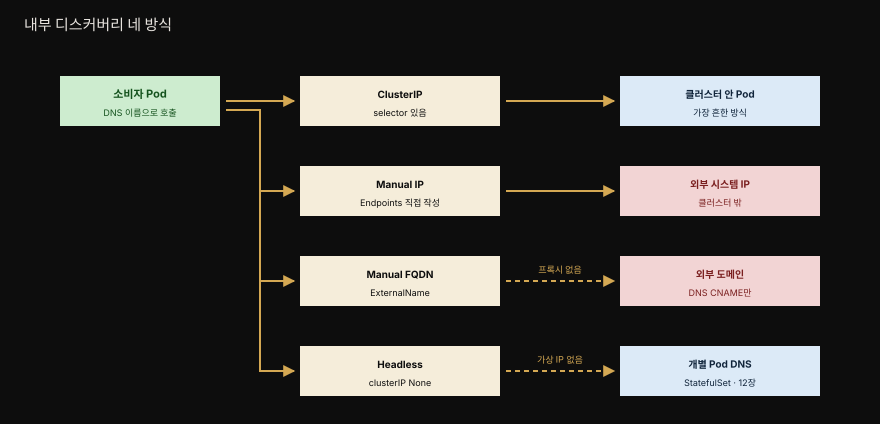
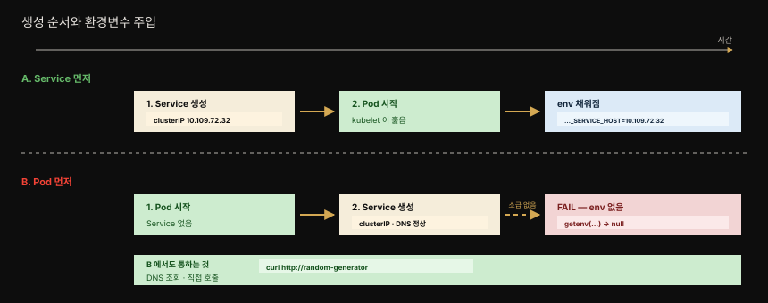
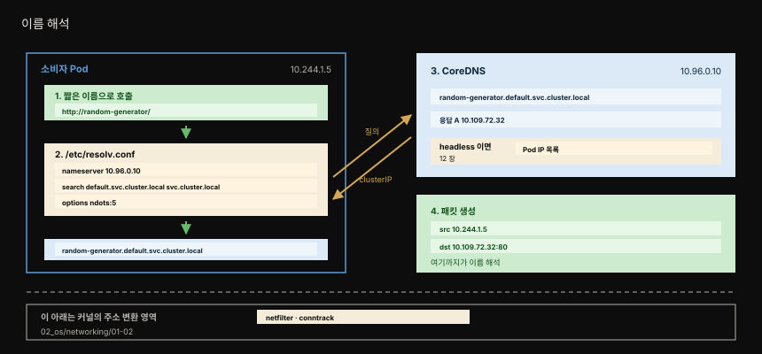
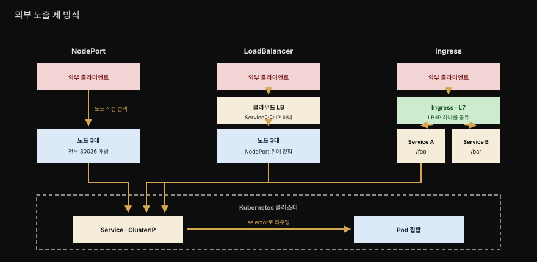

# Service Discovery — 고정 엔드포인트로 동적 Pod를 찾기
---
> 『Kubernetes Patterns』 13장 정독. **Service Discovery**는 서비스를 제공하는 인스턴스에 소비자가 접근할 안정된 엔드포인트를 제공하는 패턴입니다. 
>
> 스케줄러가 Pod를 동적으로 배치하고 탄력적으로 스케일하므로, 소비자는 바뀌는 Pod IP 대신 고정 엔드포인트를 부릅니다. 소비자·제공자가 클러스터 안이냐 밖이냐에 따라 Kubernetes가 여러 메커니즘을 제공합니다.


## 핵심 요약

> 클러스터 이전 시대의 서비스 디스커버리는 client-side였습니다. Kubernetes는 이를 server-side로 옮겨, 소비자는 고정 엔드포인트만 부르고 등록·조회·로드밸런싱은 플랫폼이 처리합니다.



앰버 점선이 등록과 조회이고 초록 실선이 실제 호출입니다. 두 그림의 결정적 차이는 소비자 상자 안의 "agent 내장"이 아래에서 "agent 없음"으로 바뀐 부분입니다.

Kubernetes 이전 시대에 가장 흔한 디스커버리 방식은 client-side였습니다. 

- 소비자가 여러 인스턴스로 스케일된 다른 서비스를 불러야 할 때, 소비자 쪽에 레지스트리를 뒤져 인스턴스 하나를 고르는 discovery agent가 있었습니다. 
- 소비자 안에 내장된 형태(ZooKeeper 클라이언트·Consul 클라이언트·Ribbon)거나 같은 위치에 배치된 별도 프로세스가 레지스트리를 조회하는 형태였습니다.

Kubernetes 이후로는 배치·헬스체크·자가 치유·자원 격리 같은 분산 시스템의 비기능 책임이 플랫폼으로 내려왔고, 서비스 디스커버리와 로드밸런싱도 같은 길을 갔습니다. 

- SOA의 정의를 그대로 쓰면 제공자 인스턴스는 여전히 레지스트리에 등록해야 하고 소비자는 레지스트리 정보를 얻어야 합니다. 
- 다만 **Kubernetes 세계에서는 그 모두가 무대 뒤에서 일어나므로**, 소비자는 Pod로 구현된 서비스 인스턴스를 동적으로 발견하는 고정 가상 Service 엔드포인트를 부르기만 하면 됩니다.

패턴 자체는 단순해 보이지만 구현 메커니즘은 여럿입니다. 소비자가 클러스터 안이냐 밖이냐, 제공자가 클러스터 안이냐 밖이냐에 따라 갈립니다.


## 학습 목표

> 이 편을 읽고 나면 다음을 설명할 수 있습니다.

1. client-side와 server-side 디스커버리의 차이를 설명하고 Kubernetes가 후자임을 압니다.
2. ClusterIP Service를 환경변수와 DNS로 찾는 두 방법을 알고, 환경변수의 시간 의존 문제를 설명할 수 있습니다.
3. ClusterIP Service의 특성 다섯 가지를 압니다.
4. selector 없는 Service로 외부 목적지를 클러스터 추상으로 감싸는 법을 설명할 수 있습니다.
5. NodePort의 네 가지 특성과 각각의 트레이드오프를 판단할 수 있습니다.
6. NodePort·LoadBalancer·Ingress가 서로 쌓이는 구조를 설명할 수 있습니다.
7. headless Service가 왜 StatefulSet에 유용한지 압니다.


## 문제 — 동적 Pod를 어떻게 찾나

> 앱이 먼저 나가는 연결은 추가 설정이 필요 없습니다. 문제는 반대 방향, 외부 자극을 기다리는 장기 실행 서비스입니다.

Kubernetes에 배포된 앱은 대개 혼자 존재하지 않고 클러스터 안의 다른 서비스나 밖의 시스템과 상호작용합니다. 그 상호작용은 서비스 내부에서 시작될 수도 있고 외부 자극으로 시작될 수도 있습니다.

내부에서 시작하는 상호작용은 대개 폴링 소비자로 이루어집니다. 시작 직후든 나중이든 앱이 다른 시스템에 접속해 데이터를 주고받기 시작합니다. Pod 안의 앱이 파일 서버에 닿아 파일을 소비하거나, 메시지 브로커에 접속해 메시지를 주고받거나, 관계형 DB나 키-값 저장소를 읽고 쓰는 경우가 전형입니다.

여기서 결정적인 구분은 **Pod 안의 앱이 어느 시점에 나가는 연결을 스스로 열기로 결정한다**는 점입니다. 이 시나리오에는 외부 자극이 없고 Kubernetes에 추가 설정도 필요 없습니다. 7장 Batch Job이나 8장 Periodic Job의 패턴을 구현할 때 이 기법을 자주 씁니다.

문제는 반대 방향입니다. Kubernetes 워크로드에서 가장 흔한 use case는 외부 자극을 기다리는 장기 실행 서비스이고, 대개 클러스터 안 다른 Pod나 외부 시스템에서 들어오는 HTTP 연결의 형태입니다. 이런 경우 소비자에게는 **스케줄러가 동적으로 배치하고 때로 탄력적으로 스케일하는 Pod를 발견할 메커니즘**이 필요합니다.

동적 Pod의 엔드포인트를 우리가 직접 추적·등록·조회해야 한다면 그것만으로도 큰 부담입니다. 그래서 Kubernetes가 여러 메커니즘으로 Service Discovery 패턴을 구현합니다.


## 내부 디스커버리 — ClusterIP Service

> Service 리소스가 같은 기능을 제공하는 Pod 집합에 안정된 진입점을 줍니다. 소비자는 그 진입점을 환경변수나 DNS로 찾습니다.



네 방식 모두 소비자에게는 같은 Service 이름으로 보입니다. 오른쪽 목적지만 다를 뿐입니다.

웹 애플리케이션을 Kubernetes에서 돌린다고 해 보겠습니다. replica 몇 개짜리 Deployment를 만들면 스케줄러가 적당한 노드에 Pod를 배치하고, 각 Pod는 시작 전에 클러스터 내부 IP를 하나씩 받습니다. 다른 Pod의 클라이언트 서비스가 이 웹 앱 엔드포인트를 소비하려 해도 **제공자 Pod들의 IP를 미리 알 쉬운 방법이 없습니다.**

Kubernetes Service 리소스가 이 문제를 다룹니다. 같은 기능을 제공하는 Pod 모음에 항구적이고 안정된 진입점을 줍니다. 가장 쉽게 만드는 방법은 `kubectl expose`로, Pod 하나나 Deployment·ReplicaSet의 여러 Pod에 대한 Service를 만들어 줍니다. 이 명령은 clusterIP라 불리는 가상 IP 주소를 만들고 리소스에서 Pod selector와 포트 번호를 끌어와 Service 정의를 구성합니다. 다만 정의를 완전히 통제하려면 직접 만듭니다.

```yaml
apiVersion: v1
kind: Service
metadata:
  name: random-generator
spec:
  selector:
    app: random-generator   # 1. Pod 라벨과 매칭되는 selector
  ports:
    - port: 80              # 2. 이 Service에 접속할 포트
      targetPort: 8080      # 3. Pod가 듣고 있는 포트
      protocol: TCP
```

- 이 정의는 `random-generator`라는 이름의 Service를 만듭니다. 이름은 나중에 디스커버리에 쓰이므로 중요합니다. 타입은 기본값인 `ClusterIP`이고, 포트 80으로 TCP 연결을 받아 `app: random-generator` selector에 맞는 모든 Pod의 8080 포트로 보냅니다. 
- **Pod가 언제 어떻게 만들어졌는지는 상관없습니다.** selector에 맞기만 하면 어떤 Pod든 라우팅 대상이 됩니다.

여기서 기억할 핵심은 둘입니다. Service가 만들어지면 clusterIP가 배정되는데 이 IP는 이름 그대로 Kubernetes 클러스터 안에서만 접근됩니다. 그리고 **Service 정의가 존재하는 한 그 IP는 바뀌지 않습니다.**

### 두 가지 찾는 방법

그렇다면 클러스터 안의 다른 앱은 동적으로 할당된 clusterIP를 어떻게 알아낼까요. 두 가지 방법이 있습니다.

**환경변수를 통한 디스커버리.** Kubernetes가 Pod를 시작할 때, 그 시점까지 존재하던 모든 Service의 상세 정보가 환경변수로 채워집니다. 포트 80을 듣는 `random-generator` Service라면 새로 시작하는 Pod에 이런 변수가 주입됩니다.

```
{SERVICE_NAME}_SERVICE_HOST=<clusterIP>       # 예) RANDOM_GENERATOR_SERVICE_HOST=10.109.72.32
{SERVICE_NAME}_SERVICE_PORT=<port>            # 예) RANDOM_GENERATOR_SERVICE_PORT=80
```

`_SERVICE_HOST`·`_SERVICE_PORT`만 고정이고, 앞자리 `{SERVICE_NAME}`은 **Service 이름을 대문자로 바꾸고 하이픈을 언더스코어로 치환한 값**입니다.

| Service 이름 | `{SERVICE_NAME}` |
|---|---|
| `random-generator` | `RANDOM_GENERATOR` |
| `payment-api` | `PAYMENT_API` |
| `db` | `DB` |

- 그 Pod에서 도는 앱은 소비하려는 Service의 이름을 알고 있으므로 이 환경변수를 읽도록 코딩하면 됩니다. 어떤 언어로 쓴 앱에서도 쓸 수 있는 단순한 메커니즘이고, 개발·테스트 목적으로 클러스터 밖에서 흉내 내기도 쉽습니다.

이 메커니즘의 주된 문제는 **Service 생성에 대한 시간 의존**입니다. 환경변수는 이미 돌고 있는 Pod에 주입할 수 없으므로, Service 좌표는 Kubernetes에서 Service가 만들어진 *뒤에* 시작한 Pod에만 들어갑니다. 그래서 그 Service에 의존하는 Pod를 시작하기 전에 Service를 먼저 정의해야 하고, 그러지 못했다면 Pod를 재시작해야 합니다.



같은 두 작업을 순서만 바꿔 실행한 결과입니다. 소급 주입이 불가능한 까닭은 Kubernetes의 제약이 아니라 운영체제의 성질입니다. 리눅스에서 환경변수는 `execve` 시점에 커널이 프로세스 메모리로 복사하고, 그 뒤로는 밖에서 바꿔 넣을 방법이 없습니다. 그래서 Pod를 재시작해 `execve`를 다시 하게 만드는 것이 유일한 해결입니다. 다만 Case B에서도 clusterIP·iptables 규칙·DNS 등록은 전부 정상이므로 **네트워크 자체는 멀쩡하고, 끊긴 것은 주소를 알아내는 경로 하나뿐입니다.**

**DNS 조회를 통한 디스커버리.** Kubernetes는 모든 Pod가 자동으로 쓰도록 설정되는 DNS 서버를 돌립니다. 새 Service가 만들어지면 모든 Pod가 즉시 쓸 수 있는 새 DNS 항목이 자동 등록됩니다. 클라이언트가 접근할 Service의 이름을 안다면 이런 FQDN으로 닿을 수 있습니다.

```
random-generator.default.svc.cluster.local
```

각 마디의 뜻은 이렇습니다.[^dns]

- `random-generator` — Service 이름
- `default` — namespace 이름
- `svc` — Service 리소스임을 나타냅니다
- `cluster.local` — 클러스터 고유 접미사

원한다면 클러스터 접미사를 생략할 수 있습니다. 같은 namespace에서 접근한다면 namespace도 생략할 수 있습니다.

DNS 방식에는 환경변수 방식의 단점이 없습니다. **Service가 정의되는 즉시 DNS 서버가 모든 Pod에 대해 모든 Service의 조회를 허용하기 때문입니다.** 다만 포트 번호가 비표준이거나 소비자가 모르는 값이라면 그것을 찾기 위해 환경변수를 여전히 써야 할 수 있습니다.

### ClusterIP의 다른 특성

다른 타입들이 그 위에 쌓이는 기반이므로 `type: ClusterIP` Service의 성질을 짚어 둘 만합니다.[^svc]

| 특성 | 내용 |
|------|------|
| **다중 포트** | 하나의 Service 정의가 여러 소스·타깃 포트를 지원합니다. Pod가 8080에서 HTTP, 8443에서 HTTPS를 지원하면 Service 둘을 만들 필요 없이 하나로 80과 443을 노출할 수 있습니다 |
| **세션 어피니티** | 새 요청이 오면 기본적으로 Service가 접속할 Pod를 무작위로 고릅니다. `sessionAffinity: ClientIP`로 바꾸면 같은 클라이언트 IP에서 온 요청이 같은 Pod에 붙습니다 |
| **readiness probe** | Pod에 readiness 검사가 정의돼 있고 그것이 실패하면, 라벨 selector가 그 Pod에 맞더라도 Service 엔드포인트 목록에서 제외됩니다(4장) |
| **가상 IP** | clusterIP는 안정적이지만 **어떤 네트워크 인터페이스에도 대응하지 않고 실재하지 않습니다** |
| **clusterIP 지정** | Service 생성 시 `.spec.clusterIP`로 쓸 IP를 지정할 수 있습니다. 권장되지는 않지만 특정 IP로 설정된 레거시 앱을 다루거나 기존 DNS 항목을 재사용하고 싶을 때 유용합니다 |

가상 IP 항목은 조금 더 볼 만합니다. 모든 노드에서 도는 kube-proxy가 새 Service를 집어 노드의 iptables를 갱신하는데, 이 가상 IP로 향하는 패킷을 잡아 선택된 Pod IP로 바꾸는 규칙을 넣습니다.

이 규칙이 **어디에서** 걸리는지가 "실재하지 않는다"는 말의 뜻을 결정합니다. 규칙은 패킷을 받는 쪽이 아니라 **보내는 쪽 노드**에서 걸립니다. 소비자 Pod가 clusterIP로 패킷을 쏘면 그 Pod가 떠 있는 노드의 iptables가 곧바로 목적지 주소를 선택된 Pod의 실제 IP로 바꾸고(DNAT), 그제야 패킷이 그 Pod가 있는 노드로 향합니다. 즉 **가상 IP를 목적지로 가진 패킷은 노드 밖으로 나가지 않습니다.** 그 주소를 가진 기계도 인터페이스도 클러스터 어디에 없고, 오직 각 노드 커널의 규칙 테이블 안에서만 의미를 갖습니다.

여기서 `ping`이 통하지 않는 이유도 따라 나옵니다. **iptables 규칙에는 ICMP 규칙이 추가되지 않고 Service 정의에 명시된 프로토콜(TCP·UDP 등)만 들어갑니다.** ping이 쏘는 ICMP 패킷에는 가로채 치환할 규칙이 없으므로 커널은 이 주소를 모르는 목적지로 취급하고, 응답할 주체가 없어 무응답이 됩니다. 정상인 Service도 `ping`은 언제나 실패하므로 이것으로 장애를 진단하면 안 됩니다.



이름 하나가 실제 Pod에 닿기까지를 이어 붙이면 이렇습니다. 소비자가 짧은 이름을 부르면 `/etc/resolv.conf`에 적힌 DNS 서버에 질의해 clusterIP를 얻습니다. 이 파일에는 Service 목록이 아니라 **DNS 서버의 위치와 `search` 접미사만** 들어 있어, Service를 아무리 만들어도 파일은 바뀌지 않습니다. 그래서 부를 때마다 물어보는 DNS 방식에는 앞서 본 시간 의존이 없습니다.

clusterIP를 목적지로 만들어진 패킷은 같은 노드의 커널에서 kube-proxy가 넣어둔 규칙 체인에 걸립니다. 규칙은 확률 기반으로 백엔드 Pod 하나를 고르고 목적지를 그 Pod의 실제 IP·targetPort로 바꾸며, 변환 내역을 conntrack에 남깁니다. 응답이 돌아올 때 그 기록을 보고 소스 주소를 다시 clusterIP로 되돌리므로 **소비자는 자기가 부른 주소에서 응답이 온 것으로 봅니다.** 제공자 Pod 쪽은 반대로 clusterIP를 한 번도 보지 못하고 자기 IP로 온 평범한 요청으로 받습니다.

세션 어피니티에도 한계가 있습니다. Kubernetes Service는 **L4 전송 계층 로드밸런싱**을 수행하므로 네트워크 패킷 내부를 들여다볼 수 없고, HTTP 쿠키 기반 세션 어피니티 같은 애플리케이션 수준 로드밸런싱은 불가능합니다.


## 수동 디스커버리 — selector 없는 Service

> selector를 생략하고 Endpoints를 직접 만들면 외부 목적지를 Kubernetes 추상 뒤에 감쌀 수 있습니다.

selector를 가진 Service를 만들면 Kubernetes가 매칭되고 서비스 준비가 된 Pod 목록을 endpoint 리소스 목록으로 추적합니다. 앞의 Service라면 `kubectl get endpoints random-generator`로 만들어진 엔드포인트를 전부 확인할 수 있습니다.

클러스터 안 Pod로 연결을 돌리는 대신 외부 IP와 포트로 돌릴 수도 있습니다. Service 정의에서 `selector`를 생략하고 endpoint 리소스를 수동으로 만들면 됩니다.

```yaml
apiVersion: v1
kind: Service
metadata:
  name: external-service
spec:
  type: ClusterIP
  ports:
    - protocol: TCP
      port: 80
```

그다음 Service와 **같은 이름**의 endpoint 리소스를 정의하고 타깃 IP와 포트를 담습니다.[^eps]

```yaml
apiVersion: v1
kind: Endpoints
metadata:
  name: external-service   # 1. 이 엔드포인트에 접근하는 Service와 이름이 같아야 합니다
subsets:
  - addresses:
      - ip: 1.1.1.1
        - ip: 2.2.2.2
    ports:
      - port: 8080
```

이 Service도 클러스터 안에서만 접근되며 앞의 것들과 똑같이 환경변수나 DNS 조회로 소비할 수 있습니다. 차이는 **엔드포인트 목록이 수동으로 관리되고 그 값이 대개 클러스터 밖 IP를 가리킨다**는 점입니다.

외부 리소스 연결이 이 메커니즘의 가장 흔한 용도지만 유일한 용도는 아닙니다. Endpoints는 Pod의 IP는 담을 수 있지만 **다른 Service의 가상 IP는 담지 못합니다.**

이 방식의 좋은 점 하나는 **Service 정의를 지우지 않고도 selector를 넣었다 뺐다 하며 외부·내부 제공자를 가리킬 수 있다**는 것입니다. 정의를 지우면 Service IP 주소가 바뀌기 때문입니다. 덕분에 실제 제공자 구현을 온프렘에서 Kubernetes로 옮기는 동안에도 소비자는 처음 가리키던 같은 Service IP를 계속 쓸 수 있고 클라이언트는 영향을 받지 않습니다.

같은 수동 목적지 설정 범주에 Service 타입이 하나 더 있습니다.

```yaml
apiVersion: v1
kind: Service
metadata:
  name: database-service
spec:
  type: ExternalName
  externalName: my.database.example.com
  ports:
    - port: 80
```

이 정의에도 `selector`가 없지만 타입이 `ExternalName`이라는 점이 구현 관점에서 중요한 차이입니다. 이 Service 정의는 `externalName`이 가리키는 내용에 **DNS로만** 매핑됩니다. 더 정확히는 `database-service.<namespace>.svc.cluster.local`이 이제 `my.database.example.com`을 가리킵니다. IP를 가진 프록시를 거치지 않고 DNS CNAME으로 외부 엔드포인트의 별칭을 만드는 방식입니다. 근본적으로는 이것도 클러스터 밖에 위치한 엔드포인트에 Kubernetes 추상을 제공하는 또 하나의 방법입니다.


## 외부에서의 디스커버리 — NodePort·LoadBalancer·Ingress

> 지금까지의 가상 IP는 클러스터 안에서만 접근됩니다. 외부 클라이언트가 Pod에 닿는 방법은 셋이고, 뒤로 갈수록 강력하고 복잡합니다.



세 방식은 나란한 선택지가 아니라 서로 쌓이는 층입니다. LoadBalancer는 NodePort 위에 서고, Ingress는 Service 앞에 서서 여러 Service를 하나로 묶습니다.

지금까지 다룬 디스커버리 메커니즘은 전부 Pod나 외부 엔드포인트를 가리키는 가상 IP를 쓰고, 그 가상 IP 자체는 클러스터 안에서만 접근됩니다. 그러나 Kubernetes 클러스터는 세상과 단절돼 돌지 않습니다. Pod에서 외부 리소스로 연결하는 것 말고도, 그 반대가 아주 흔히 필요합니다. **외부 애플리케이션이 Pod가 제공하는 엔드포인트에 닿으려는 경우**입니다.

### NodePort

클러스터 밖으로 Service를 노출하는 첫 방법은 `type: NodePort`입니다.

```yaml
apiVersion: v1
kind: Service
metadata:
  name: random-generator
spec:
  type: NodePort         # 1. 모든 노드에 포트를 엽니다
  selector:
    app: random-generator
  ports:
    - port: 80
      targetPort: 8080
      nodePort: 30036    # 2. 고정 포트를 지정하거나, 생략하면 무작위로 배정받습니다
      protocol: TCP
```

앞과 마찬가지로 `app: random-generator` selector에 맞는 Pod를 서비스하고 포트 80으로 연결을 받아 선택된 Pod의 8080으로 보냅니다. 여기에 더해 이 정의는 **모든 노드에 30036 포트를 예약하고** 들어오는 연결을 Service로 전달합니다. 이 예약 덕분에 Service는 가상 IP로 내부에서도, 모든 노드의 전용 포트로 외부에서도 접근됩니다.

좋아 보이지만 단점이 있습니다. 특징을 넷으로 나누어 봅니다.

- **포트 번호** — `nodePort: 30036`처럼 특정 포트를 고르는 대신 Kubernetes가 자기 범위 안에서 빈 포트를 고르게 둘 수 있습니다.
- **방화벽 규칙** — 모든 노드에 포트를 여는 방식이므로, 외부 클라이언트가 노드 포트에 접근하도록 방화벽 규칙을 추가로 설정해야 할 수 있습니다.
- **노드 선택** — 외부 클라이언트는 클러스터의 아무 노드에나 연결할 수 있습니다. 다만 그 노드가 사용 불가 상태라면 **다른 건강한 노드로 접속하는 것은 클라이언트 앱의 책임입니다.** 그래서 건강한 노드를 고르고 장애 조치를 수행하는 로드밸런서를 노드 앞에 두는 편이 좋습니다.
- **Pod 선택** — 클라이언트가 노드 포트로 연결을 열면 무작위로 고른 Pod로 라우팅되는데, 그 Pod는 연결이 열린 노드에 있을 수도 다른 노드에 있을 수도 있습니다. `externalTrafficPolicy: Local`을 Service 정의에 추가하면 이 추가 홉을 피하고 연결이 열린 노드의 Pod를 강제로 고르게 할 수 있습니다. 다만 이 옵션을 켜면 **다른 노드의 Pod에는 연결할 수 없으므로**, 모든 노드에 Pod가 있게 하거나(예: daemon service) 건강한 Pod가 있는 노드를 클라이언트가 알게 해야 합니다.

소스 주소에도 특이점이 있습니다. `NodePort`를 쓰면 **클라이언트 주소가 소스 NAT됩니다.** 클라이언트 IP를 담은 패킷의 소스 IP가 노드의 내부 주소로 대체된다는 뜻입니다. 클라이언트 앱이 노드 1에 패킷을 보내면 노드 1이 소스 주소를 자기 노드 주소로 바꾸고 목적지 주소를 Pod 주소로 바꿔 Pod가 있는 노드 2로 전달합니다. Pod가 그 패킷을 받았을 때 소스 주소는 원래 클라이언트의 주소가 아니라 노드 1의 주소입니다. 이를 막으려면 앞서 말한 `externalTrafficPolicy: Local`을 걸어 노드 1에 있는 Pod로만 트래픽을 보냅니다.[^etp]

### LoadBalancer

`type: NodePort` Service가 모든 노드에 포트를 열어 `type: ClusterIP` 위에 쌓이는 것을 봤습니다. 이 방식의 한계는 클라이언트 앱이 건강한 노드를 고르도록 여전히 로드밸런서가 필요하다는 점이고, `LoadBalancer` 타입이 그 한계를 다룹니다.

일반 Service를 만들고 모든 노드에 포트를 여는 것에 더해, **클라우드 제공자의 로드밸런서를 써서 서비스를 외부에 노출합니다.**

```yaml
apiVersion: v1
kind: Service
metadata:
  name: random-generator
spec:
  type: LoadBalancer
  clusterIP: 10.0.171.239     # 1. clusterIP와 loadBalancerIP는 가능할 때 Kubernetes가 배정합니다
  loadBalancerIP: 78.11.24.19
  selector:
    app: random-generator
  ports:
    - port: 80
      targetPort: 8080
status:                        # 2. status 필드는 Kubernetes가 관리하며 Ingress IP를 넣습니다
  loadBalancer:
    ingress:
      - ip: 146.148.47.155
```

이 타입은 **클라우드 제공자가 Kubernetes를 지원하고 로드밸런서를 프로비저닝할 때만 동작합니다.** 정의가 자리를 잡으면 외부 클라이언트 앱이 로드밸런서로 연결을 열고, 로드밸런서가 노드를 골라 Pod를 찾아냅니다.

로드밸런서 프로비저닝과 서비스 디스커버리가 정확히 어떻게 수행되는지는 클라우드 제공자마다 다릅니다. 로드밸런서 주소를 정의하게 해 주는 곳도 있고 아닌 곳도 있으며, 소스 주소를 보존하는 메커니즘을 제공하는 곳도 있고 그것을 로드밸런서 주소로 대체하는 곳도 있습니다. 선택한 클라우드 제공자의 구체적 구현을 확인해야 합니다.

### Ingress — 애플리케이션 계층 디스커버리

지금까지의 메커니즘과 달리 **Ingress는 Service 타입이 아니라 별도의 Kubernetes 리소스**입니다. Service 앞에 서서 스마트 라우터이자 클러스터 진입점 역할을 합니다. 일반적으로 외부에서 닿을 수 있는 URL을 통한 HTTP 기반 접근, 로드밸런싱, TLS 종료, 이름 기반 가상 호스팅을 제공하며 다른 특화된 구현도 있습니다. **동작하려면 클러스터에 Ingress 컨트롤러가 하나 이상 돌고 있어야 합니다.**

```yaml
apiVersion: networking.k8s.io/v1
kind: Ingress
metadata:
  name: random-generator
spec:
  defaultBackend:
    service:
      name: random-generator
      port:
        number: 8080
```

Kubernetes가 도는 인프라와 Ingress 컨트롤러 구현에 따라, 이 정의는 외부에서 접근 가능한 IP를 할당하고 `random-generator` Service를 80 포트로 노출합니다. 그런데 이것만으로는 `type: LoadBalancer` Service와 크게 다르지 않습니다. 그쪽도 Service 정의마다 외부 IP를 하나씩 요구합니다.

**Ingress의 진짜 힘은 외부 로드밸런서와 IP 하나를 재사용해 여러 Service를 서비스함으로써 인프라 비용을 줄이는 데서 나옵니다.**[^ingress] HTTP URI 경로에 따라 IP 하나를 여러 Service로 라우팅하는 단순한 fan-out 설정은 이렇게 생겼습니다.

```yaml
apiVersion: networking.k8s.io/v1
kind: Ingress
metadata:
  name: random-generator
  annotations:
    nginx.ingress.kubernetes.io/rewrite-target: /
spec:
  rules:                          # 1. 요청 경로에 따라 요청을 배분하는 전용 규칙
    - http:
        paths:
          - path: /               # 2. 모든 요청을 random-generator Service로
            pathType: Prefix
            backend:
              service:
                name: random-generator
                port:
                  number: 8080
          - path: /cluster-status # 3. 다만 이 경로만 다른 Service로
            pathType: Exact
            backend:
              service:
                name: cluster-status
                port:
                  number: 80
```

Ingress 컨트롤러 구현이 저마다 다르므로, 보통의 Ingress 정의 외에 컨트롤러가 어노테이션으로 전달받는 추가 설정을 요구할 수 있습니다. 위 정의는 로드밸런서를 프로비저닝하고 외부 IP를 얻어 서로 다른 두 경로 아래 두 Service를 서비스합니다.

Ingress는 Kubernetes에서 **가장 강력하면서 동시에 가장 복잡한** 서비스 디스커버리 메커니즘입니다. 같은 IP 주소 아래 여러 서비스를 노출하고 모든 서비스가 같은 L7 프로토콜(대개 HTTP)을 쓸 때 가장 유용합니다.

### Headless Service

Service 타입이 하나 더 있습니다. **headless service는 전용 IP 주소를 요청하지 않습니다.**[^headless] Service의 `spec` 안에 `clusterIP: None`을 지정해 만듭니다. headless service에서는 백킹 Pod가 내부 DNS 서버에 추가되며, 12장 Stateful Service에서 설명한 대로 **StatefulSet에 Service를 구현할 때 가장 유용합니다.**

이 장의 목록 안에서 headless가 놓인 자리를 짚어 둘 만합니다. 앞의 여섯 방식은 모두 여러 Pod를 가상 IP 하나 뒤로 **뭉쳐 감추는** 일을 합니다. 소비자는 누가 응답했는지 모르고 알 필요도 없습니다. headless만 그 감추기를 끕니다. 가상 IP가 없으니 kube-proxy가 만들 iptables 규칙도 없고, Pod를 무작위로 고르는 단계 자체가 사라집니다.

감추기가 손해가 되는 경우가 있기 때문입니다. Kafka 클라이언트는 파티션 리더가 어느 브로커인지 알고 **그 브로커를 지목해** 접속해야 하는데, 이때 Service의 무작위 선택은 기능이 아니라 방해입니다. 11장 Stateless Service의 replica처럼 서로 동일하고 교체 가능한 인스턴스에는 감추는 편이 이득이지만, 12장 Stateful Service처럼 Pod마다 정체성이 다르면 반대가 됩니다. Pod별 DNS 레코드 형식과 governing Service 링크 규칙은 [12장](./12-01.Stateful%20Service%20%E2%80%94%20StatefulSet%EC%9C%BC%EB%A1%9C%20%EC%83%81%ED%83%9C%EB%A5%BC%20first-class%EB%A1%9C.md)이 정본입니다.

### OpenShift Routes — Ingress의 사촌

Red Hat OpenShift는 널리 쓰이는 엔터프라이즈 Kubernetes 배포판입니다. Kubernetes와 완전히 호환되면서 추가 기능을 제공하는데, 그중 하나가 Ingress와 몹시 닮은 Routes입니다. 실제로 차이를 알아채기 어려울 정도입니다. 우선 **Routes가 Kubernetes에 Ingress 객체가 도입되기 전에 나왔으므로** Ingress의 선조 격이라고 볼 수 있습니다.

그래도 기술적 차이는 남아 있습니다.

- Route는 OpenShift에 통합된 HAProxy 로드밸런서가 자동으로 집어 가므로 **별도의 Ingress 컨트롤러를 설치할 필요가 없습니다.**
- Service로 가는 구간에 재암호화나 패스스루 같은 추가 TLS 종료 모드를 쓸 수 있습니다.
- 트래픽을 나누는 가중치 백엔드를 여러 개 쓸 수 있습니다.
- 와일드카드 도메인을 지원합니다.

그렇게 말했지만 OpenShift에서도 Ingress를 쓸 수 있으므로 선택의 여지가 있습니다.


## 정리 — 무엇을 언제 쓰나

> 클러스터 안에서 동적 Pod를 발견하는 일은 언제나 Service 리소스로 이루어집니다. 외부 디스커버리는 그 Service 추상 위에 쌓입니다.

클러스터 안에서 동적 Pod를 발견하는 일은 **언제나 Service 리소스로** 이루어집니다. 선택한 옵션에 따라 구현만 달라집니다. Service 추상은 가상 IP 주소·iptables·DNS 레코드·환경변수 같은 저수준 상세를 설정하는 고수준 클라우드 네이티브 방식입니다.

클러스터 밖에서의 서비스 디스커버리는 이 Service 추상 위에 쌓이며 **Service를 바깥세상에 노출하는 데 집중합니다.** `NodePort`가 노출의 기본을 제공하지만 고가용 설정에는 플랫폼 인프라 제공자와의 통합이 필요합니다.

원서 Table 13-1을 단순한 것에서 복잡한 것 순으로 옮기면 다음과 같습니다.

| 이름 | 설정 | 클라이언트 위치 | 요약 |
|------|------|----------------|------|
| ClusterIP | `type: ClusterIP` + `.spec.selector` | 내부 | 가장 흔한 내부 디스커버리 메커니즘 |
| Manual IP | `type: ClusterIP` + `kind: Endpoints` | 내부 | 외부 IP 디스커버리 |
| Manual FQDN | `type: ExternalName` + `.spec.externalName` | 내부 | 외부 FQDN 디스커버리 |
| Headless Service | `type: ClusterIP` + `.spec.clusterIP: None` | 내부 | 가상 IP 없는 DNS 기반 디스커버리 |
| NodePort | `type: NodePort` | 외부 | 비-HTTP 트래픽에 선호 |
| LoadBalancer | `type: LoadBalancer` | 외부 | 지원되는 클라우드 인프라 필요 |
| Ingress | `kind: Ingress` | 외부 | L7·HTTP 기반 스마트 라우팅 메커니즘 |

책은 여기서 끝나지 않는다고 덧붙입니다. **Knative** 프로젝트가 Kubernetes 위에 새 프리미티브를 도입해 고급 서빙과 이벤팅을 돕고 있습니다.


## Spring 앱에서 Service를 부르는 법

> DNS 이름을 그대로 쓰면 됩니다. 클라이언트 사이드 로드밸런싱 라이브러리는 Kubernetes에서 불필요해집니다.

Spring Boot 앱이 클러스터 안 다른 서비스를 부를 때는 DNS 이름을 그대로 씁니다. `RestClient`나 `WebClient`의 base URL을 `http://random-generator/`(같은 namespace)나 `http://random-generator.default.svc.cluster.local/`로 두면 kube-proxy가 알아서 건강한 Pod로 L4 로드밸런싱합니다.

여기서 과거 Netflix Ribbon 같은 클라이언트 사이드 로드밸런싱 라이브러리가 Kubernetes에서 불필요해집니다. **그 책임이 플랫폼으로 내려갔기 때문입니다.** 본문의 "client-side에서 server-side로"라는 이동을 Spring 진영에서 체감하는 지점이 바로 여기입니다.

환경변수 방식은 시간 의존 문제 때문에 Spring 앱에서 base URL을 하드코딩하는 근거로 삼지 않는 편이 안전합니다. Service가 앱보다 늦게 생기면 환경변수가 비어 있으므로, DNS 이름을 설정값(`application.yml`)으로 주입하는 편이 견고합니다.

참고로 Spring Cloud Kubernetes의 [DiscoveryClient 구현](https://docs.spring.io/spring-cloud-kubernetes/reference/discovery-client.html)은 Kubernetes Service·Endpoints를 Spring의 `DiscoveryClient` 추상으로 노출해, 기존 Spring Cloud 디스커버리 코드를 그대로 쓰게 해 줍니다. 책 범위 밖의 내용입니다.

세션 어피니티의 한계도 Spring 개발자에게 직접 걸립니다. ClusterIP Service는 L4 로드밸런싱만 하므로 HTTP 쿠키 기반 스티키 세션이 불가능합니다. `sessionAffinity: ClientIP`로 같은 클라이언트 IP를 같은 Pod에 붙일 수는 있지만 여러 클라이언트가 같은 NAT 뒤에 있으면 뭉뚱그려집니다. 쿠키 기반 스티키 세션이 필요하면 L7을 이해하는 Ingress 컨트롤러 레벨에서 해결해야 하며, 이것이 11장 Stateless Service에서 "세션은 외부화하라"고 한 이유와 이어집니다.


## 능동 회상

> 먼저 스스로 답해 본 뒤 아래 정답 절에서 맞춰 봅니다. 정답은 이 절 다음에 번호 순서대로 있습니다.

1. client-side 디스커버리와 server-side 디스커버리의 차이는 무엇인가요?
2. 앱이 먼저 나가는 연결을 여는 경우 Kubernetes에 추가 설정이 필요 없는 이유는 무엇인가요?
3. clusterIP를 앱이 아는 두 방법은 무엇이고 각각의 문제는 무엇인가요?
4. Service의 IP를 `ping`할 수 없는 이유는 무엇인가요?
5. ClusterIP Service가 HTTP 쿠키 기반 세션 어피니티를 못 하는 이유는 무엇인가요?
6. selector 없는 Service와 Endpoints를 직접 만들면 무엇이 가능해지나요?
7. Endpoints에 담을 수 없는 것은 무엇인가요?
8. `ExternalName` 타입이 앞의 방식들과 구현상 다른 점은 무엇인가요?
9. NodePort에서 클라이언트 IP가 가려지는 이유와 그 해결책은 무엇인가요?
10. `externalTrafficPolicy: Local`을 걸면 무엇을 얻고 무엇을 잃나요?
11. Ingress의 진짜 힘은 어디에서 나오나요?
12. headless Service는 무엇이고 어디에 쓰나요?


## 정답

> 위 회상 질문의 답입니다. 번호가 대응합니다.

**1.** client-side에서는 소비자 쪽에 discovery agent가 있어 레지스트리를 조회하고 인스턴스를 골라 직접 호출합니다. ZooKeeper 클라이언트·Consul 클라이언트·Ribbon이 그런 agent였습니다. server-side에서는 그 모두가 무대 뒤에서 일어나고 소비자는 고정 가상 Service 엔드포인트만 부릅니다. 등록·조회·로드밸런싱의 책임이 플랫폼으로 내려간 것입니다.

**2.** 그 시나리오에는 외부 자극이 없기 때문입니다. Pod 안의 앱이 어느 시점에 스스로 나가는 연결을 열기로 결정하고 목적지를 이미 알고 있으므로, Kubernetes가 발견을 도와줄 일이 없습니다.

**3.** 환경변수와 DNS입니다. 환경변수는 Pod 시작 시점에 그때까지 존재한 Service 정보만 주입되므로, 이미 도는 Pod에는 넣을 수 없고 Service보다 먼저 뜬 Pod는 정보를 못 받습니다. 이 시간 의존을 피하려면 Service를 먼저 정의하거나 Pod를 재시작해야 합니다. DNS는 Service가 정의되는 즉시 모든 Pod가 조회할 수 있어 이 문제가 없습니다. 다만 포트가 비표준이면 포트 번호를 얻기 위해 환경변수를 여전히 쓸 수 있습니다.

**4.** kube-proxy가 iptables에 넣는 규칙에 ICMP 규칙이 포함되지 않고 Service 정의에 명시된 프로토콜(TCP·UDP 등)만 들어가기 때문입니다. `ping`은 ICMP를 쓰므로 통하지 않습니다. clusterIP 자체가 어떤 네트워크 인터페이스에도 대응하지 않는 가상 IP라는 점도 함께 기억할 만합니다.

**5.** Kubernetes Service가 L4 전송 계층 로드밸런싱을 수행하기 때문입니다. 네트워크 패킷 내부를 들여다볼 수 없으므로 애플리케이션 수준 라우팅이 불가능합니다. `sessionAffinity: ClientIP`로 클라이언트 IP 기준 어피니티는 걸 수 있지만 쿠키 기반은 L7을 이해하는 Ingress 컨트롤러 레벨에서 해결해야 합니다.

**6.** 클러스터 안 Pod가 아니라 외부 IP와 포트로 연결을 돌릴 수 있습니다. 이 방식의 이점은 Service 정의를 지우지 않고 selector를 넣었다 뺐다 할 수 있다는 것입니다. 정의를 지우면 Service IP가 바뀌므로, 이 방식이면 제공자 구현을 온프렘에서 Kubernetes로 옮기는 동안에도 클라이언트가 같은 IP를 계속 쓸 수 있습니다.

**7.** 다른 Service의 가상 IP입니다. Pod의 IP는 담을 수 있습니다.

**8.** 프록시도 IP도 만들지 않고 **DNS로만** 매핑된다는 점입니다. `database-service.<namespace>.svc.cluster.local`이 `my.database.example.com`을 가리키는 CNAME 별칭이 됩니다.

**9.** 클라이언트 주소가 소스 NAT되기 때문입니다. 클라이언트가 노드 1에 패킷을 보내면 노드 1이 소스 주소를 자기 주소로 바꾸고 Pod가 있는 노드 2로 전달하므로, Pod가 보는 소스 주소는 원래 클라이언트가 아니라 노드 1입니다. `externalTrafficPolicy: Local`을 걸어 그 노드에 있는 Pod로만 트래픽을 보내면 막을 수 있습니다.

**10.** 추가 홉과 IP 마스킹을 피합니다. 대신 다른 노드의 Pod로는 연결할 수 없게 되므로, 모든 노드에 Pod가 있게 하거나(daemon service 등) 건강한 Pod가 있는 노드를 클라이언트가 알아야 합니다.

**11.** 외부 로드밸런서와 IP 하나를 재사용해 여러 Service를 서비스함으로써 인프라 비용을 줄이는 데서 나옵니다. Service 하나를 노출하는 것만이라면 `type: LoadBalancer`와 크게 다르지 않습니다.

**12.** `clusterIP: None`으로 만들어 전용 IP를 요청하지 않는 Service입니다. 백킹 Pod가 내부 DNS 서버에 직접 등록되어 개별 Pod에 접근할 수 있습니다. StatefulSet에 Service를 구현할 때 가장 유용합니다(12장).


## 실무 적용

- **클러스터 내부 호출은 DNS 이름을 씁니다.** 환경변수는 시간 의존 문제가 있으니 base URL은 DNS 이름을 설정으로 주입합니다.
- **외부 목적지도 Service로 감쌉니다.** Manual IP나 ExternalName으로 외부 DB·API를 Kubernetes 추상 뒤에 두면, 나중에 클러스터 내부로 이관해도 클라이언트가 안 바뀝니다.
- **노출 방식은 최소 복잡도로 고릅니다.** 비-HTTP면 NodePort, 단일 HTTP Service면 LoadBalancer, 여러 HTTP Service를 한 IP로 묶으려면 Ingress입니다.
- **Ingress로 비용을 줄입니다.** Service마다 LoadBalancer를 두면 외부 IP가 늘어납니다. Ingress 하나로 여러 Service를 경로 기반 라우팅하면 IP와 LB를 아낍니다.
- **소스 IP가 필요하면 externalTrafficPolicy를 확인합니다.** NodePort·LoadBalancer의 소스 NAT로 클라이언트 IP가 가려질 수 있습니다.
- **NodePort 앞에는 로드밸런서를 둡니다.** 건강한 노드 선택과 장애 조치를 클라이언트에 맡기지 않습니다.
- **StatefulSet에는 headless Service를 씁니다.** 개별 Pod에 안정 DNS가 필요하기 때문입니다(12장).


## 체크리스트

- [ ] 클러스터 내부 호출에 Pod IP가 아니라 Service DNS 이름을 쓰는가?
- [ ] base URL을 환경변수가 아니라 설정으로 주입해 시간 의존을 피했는가?
- [ ] 외부 목적지를 Service(Manual IP·ExternalName)로 감싸 이관 여지를 남겼는가?
- [ ] 노출 방식(NodePort·LoadBalancer·Ingress)이 프로토콜과 개수에 맞는가?
- [ ] 여러 HTTP Service를 Ingress 하나로 묶어 IP·LB 비용을 줄였는가?
- [ ] 소스 IP가 필요한 경우 `externalTrafficPolicy: Local`을 고려했는가?
- [ ] `externalTrafficPolicy: Local`을 걸었다면 모든 노드에 Pod가 배치되는가?
- [ ] StatefulSet이라면 headless Service를 썼는가?


## 면접 관점

**Q. Kubernetes의 서비스 디스커버리는 client-side입니까 server-side입니까?**
server-side입니다. 소비자는 고정 Service 엔드포인트만 부르고 인스턴스의 등록·조회·로드밸런싱은 플랫폼이 뒤에서 처리합니다. 과거 client-side에서는 소비자에 discovery agent를 내장했는데, 그 책임이 플랫폼으로 내려간 것입니다.

**Q. ClusterIP를 앱이 아는 두 방법과 각자의 문제는 무엇인가요?**
환경변수와 DNS입니다. 환경변수는 Pod 시작 시점에 주입되므로 Service보다 먼저 뜬 Pod에는 들어가지 않습니다. 이 시간 의존 때문에 Service를 먼저 정의하거나 Pod를 재시작해야 합니다. DNS는 Service 정의 즉시 모든 Pod가 조회할 수 있어 권장됩니다.

**Q. NodePort·LoadBalancer·Ingress의 차이는 무엇인가요?**
서로 쌓이는 층입니다. NodePort는 모든 노드에 포트를 열며 비-HTTP 트래픽에 선호됩니다. LoadBalancer는 그 위에 클라우드 LB를 얹어 건강한 노드 선택을 대신 처리하지만 Service마다 외부 IP를 소비합니다. Ingress는 Service 타입이 아닌 별도 리소스로 L7 스마트 라우터 역할을 하며, IP와 LB 하나에 여러 HTTP Service를 경로 기반으로 묶어 비용을 줄입니다.

**Q. selector 없는 Service는 무엇에 씁니까?**
외부 목적지를 Kubernetes 추상으로 감쌉니다. Endpoints를 수동 지정하면 외부 IP를 가리키고(Manual IP), ExternalName이면 DNS CNAME 별칭을 만듭니다(Manual FQDN). 핵심 이점은 Service 정의를 지우지 않고 제공자를 바꿀 수 있다는 것입니다. 정의를 지우면 Service IP가 바뀌므로, 이 방식이면 온프렘에서 Kubernetes로 이관하는 동안 클라이언트가 같은 IP를 계속 씁니다.

**Q. NodePort에서 클라이언트 IP가 보존되지 않는 이유는 무엇인가요?**
소스 NAT 때문입니다. 클라이언트가 노드 1로 보낸 패킷의 소스 주소를 노드 1이 자기 주소로 바꾸고 Pod가 있는 노드 2로 전달하므로, Pod가 보는 소스는 원래 클라이언트가 아닙니다. `externalTrafficPolicy: Local`을 걸면 그 노드의 Pod로만 보내 이를 막지만, 다른 노드의 Pod로는 갈 수 없어 모든 노드에 Pod가 있어야 합니다.

**Q. headless Service는 왜 씁니까?**
`clusterIP: None`으로 가상 IP를 요청하지 않고 백킹 Pod를 DNS에 직접 등록해 개별 Pod에 접근하게 합니다. StatefulSet처럼 Pod마다 정체성이 다른 경우에 유용합니다.


## 참고 자료

- 《Kubernetes Patterns, Second Edition》 Ch13. Service Discovery (Bilgin Ibryam·Roland Huß, O'Reilly)
- [Service와 EndpointSlice 개념 노트](../../kubernetes/04_networking/04-04.Service%EC%99%80%20EndpointSlice.md)
- [Ingress와 Gateway API 개념 노트](../../kubernetes/04_networking/04-06.Ingress%EC%99%80%20Gateway%20API.md)
- [Service 기초 (Kubernetes in Action)](../kubernetes-in-action/11-01.Service%20%EA%B8%B0%EC%B4%88%20%E2%80%94%20%ED%8C%8C%EB%93%9C%20%ED%86%B5%EC%8B%A0%C2%B7ClusterIP%C2%B7%EC%84%B8%EC%85%98%20%EC%96%B4%ED%94%BC%EB%8B%88%ED%8B%B0.md)
- [Knative — Kubernetes 위의 서빙·이벤팅](https://knative.dev/)

[^dns]: Kubernetes — Service와 Pod의 DNS 이름 규칙.
<https://kubernetes.io/docs/concepts/services-networking/dns-pod-service/>

[^svc]: Kubernetes — Service의 타입과 가상 IP 동작.
<https://kubernetes.io/docs/concepts/services-networking/service/>

[^eps]: 책 이후의 변화 — `Endpoints`는 Kubernetes 1.33에서 deprecated 되었고 `EndpointSlice`가 후속입니다. 엔드포인트를 여러 조각으로 나눠 담아 대규모 Service의 전파 부담을 줄입니다. 수동 작성 시 `Endpoints`도 계속 동작하며 컨트롤 플레인이 EndpointSlice로 미러링합니다. 상세는 [Service와 EndpointSlice 개념 노트](../../kubernetes/04_networking/04-04.Service%EC%99%80%20EndpointSlice.md).
<https://kubernetes.io/docs/concepts/services-networking/endpoint-slices/>

[^etp]: Kubernetes — externalTrafficPolicy와 소스 IP 보존.
<https://kubernetes.io/docs/tutorials/services/source-ip/>

[^ingress]: Kubernetes — Ingress 리소스와 경로 기반 fan-out.
<https://kubernetes.io/docs/concepts/services-networking/ingress/>

[^headless]: Kubernetes — headless Service.
<https://kubernetes.io/docs/concepts/services-networking/service/#headless-services>
