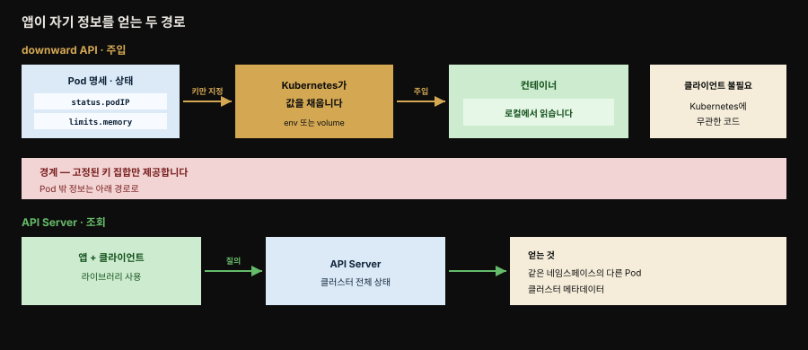
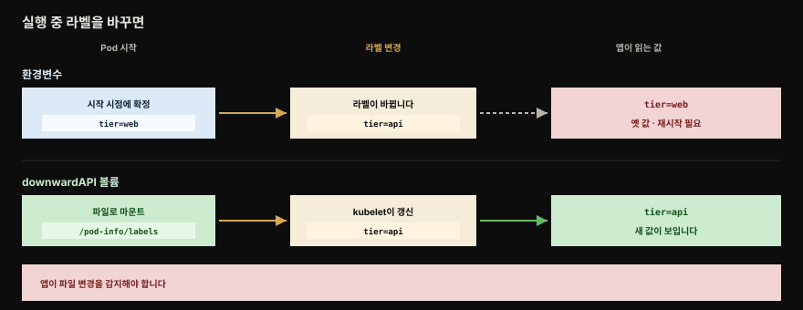

# Self Awareness — downward API로 자기 메타데이터 얻기

> 『Kubernetes Patterns』 14장 정독. **Self Awareness**는 앱이 자기 자신에 대한 정보를 필요로 할 때 Kubernetes의 **downward API**로 introspection과 메타데이터 주입을 제공하는 패턴입니다. Pod 이름·IP·호스트명·리소스 한계·라벨·어노테이션을 환경변수나 파일로 받아, 앱은 Kubernetes API 클라이언트 없이 로컬에서 값을 읽으며 Kubernetes-agnostic으로 남습니다.



위쪽이 downward API 경로입니다. 관심 있는 키만 지정하면 Kubernetes가 값을 채워 컨테이너에 넣어 주고 앱은 로컬에서 읽습니다. 아래쪽은 API Server를 직접 조회하는 경로이며, 가운데 붉은 띠가 두 경로를 가르는 경계입니다.


## 핵심 요약

> 앱이 자기 정보를 알아야 할 때, Kubernetes API 클라이언트를 들이지 않고 해결하는 방법입니다.

대부분의 use case에서 클라우드 네이티브 앱은 무상태이고 일회용이며 다른 앱과 관련된 정체성을 갖지 않습니다. 그러나 이런 종류의 앱조차 때로는 자기 자신과 자기가 도는 환경에 대한 정보를 필요로 합니다. 필요해지는 정보는 성격이 셋으로 갈립니다.

1. **런타임에만 알 수 있는 정보** — Pod 이름, Pod IP 주소, 앱이 놓인 노드의 호스트명이 여기 해당합니다.
2. **Pod 수준에 정의된 정적 정보** — 특정 리소스 requests와 limits가 그 예입니다.
3. **실행 중 바뀔 수 있는 동적 정보** — 사용자가 언제든 고칠 수 있는 어노테이션과 라벨입니다.

downward API는 이 메타데이터를 **환경변수와 파일**로 컨테이너에 전달합니다. ConfigMap·Secret에서 애플리케이션 관련 데이터를 넘길 때 쓰던 것과 같은 메커니즘입니다. 다만 이 경우 데이터를 우리가 만들지 않습니다. **관심 있는 키만 지정하면 Kubernetes가 값을 동적으로 채웁니다.**

핵심은 메타데이터가 Pod 안으로 주입되어 로컬에서 사용 가능해진다는 점입니다. 앱은 클라이언트를 써서 Kubernetes API와 상호작용할 필요가 없고 **Kubernetes-agnostic**으로 남을 수 있습니다.

참조에는 두 종류가 있습니다. `fieldRef`는 Pod 수준 메타데이터를 참조하고, `resourceFieldRef`는 컨테이너의 리소스 명세를 참조합니다. 주입 방식도 둘로 갈리는데, 환경변수는 시작 시점에 값이 고정되는 반면 downwardAPI 볼륨은 실행 중 변경을 반영합니다.


## 학습 목표

> 이 편을 읽고 나면 다음을 설명할 수 있습니다.

1. 앱이 자기 정보를 필요로 하는 세 가지 성격의 정보를 구분하고 각각의 예를 들 수 있습니다.
2. downward API가 ConfigMap·Secret과 같은 메커니즘이면서 무엇이 다른지 설명할 수 있습니다.
3. 앱이 Kubernetes-agnostic으로 남는다는 것이 무엇을 뜻하는지 말할 수 있습니다.
4. `fieldRef`와 `resourceFieldRef`가 각각 어떤 메타데이터를 참조하는지 구분하고 주요 키를 들 수 있습니다.
5. 환경변수 주입과 downwardAPI 볼륨의 차이를 실행 중 변경 반영 관점에서 설명할 수 있습니다.
6. 볼륨을 써도 재시작이 필요할 수 있는 이유를 말할 수 있습니다.
7. downward API의 한계와 API Server 조회로 넘어가야 하는 경계를 판단할 수 있습니다.


## 문제 — 앱이 자기 정보를 알아야 할 때

> 무상태 앱이라도 자기가 도는 환경을 알아야 하는 순간이 있고, 그 정보는 런타임에야 정해집니다.

책은 구체적인 use case를 넷 듭니다.

1. 컨테이너에 주어진 리소스에 따라 애플리케이션 **스레드풀 크기를 조정**하고 싶을 수 있습니다.
2. 같은 이유로 **가비지 컬렉션 알고리즘이나 메모리 할당**을 바꾸고 싶을 수 있습니다.
3. 로그를 남기거나 중앙 서버로 메트릭을 보낼 때 **Pod 이름과 호스트명**을 쓰고 싶을 수 있습니다.
4. 같은 네임스페이스에서 특정 라벨을 가진 **다른 Pod를 발견해 클러스터형 앱으로 묶고** 싶을 수 있습니다.

이런 용도를 위해 Kubernetes가 downward API를 제공합니다.


## 해법 — downward API

> 컨테이너만의 요구는 아니며, 다른 플랫폼에도 비슷한 메커니즘이 있습니다. Kubernetes의 방식이 그중 더 우아합니다.

앞서 설명한 요구와 그 해법은 컨테이너에만 특유한 것이 아닙니다. 리소스의 메타데이터가 변하는 동적 환경이라면 어디에나 존재합니다. AWS는 EC2 인스턴스에서 질의해 인스턴스 자신의 메타데이터를 가져올 수 있는 Instance Metadata·User Data 서비스를 제공합니다. AWS ECS도 컨테이너가 질의해 컨테이너 클러스터 정보를 얻는 API를 제공합니다.

Kubernetes의 접근은 그보다 더 우아하고 쓰기 쉽습니다.

### fieldRef — Pod 수준 메타데이터

환경변수로 메타데이터를 요청하는 것이 얼마나 쉬운지 책의 Example 14-1이 보입니다.[^downward]

```yaml
apiVersion: v1
kind: Pod
metadata:
  name: random-generator
spec:
  containers:
  - image: k8spatterns/random-generator:1.0
    name: random-generator
    env:
    - name: POD_IP
      valueFrom:
        fieldRef:                        # Pod 자신의 속성에서 값을 가져옵니다
          fieldPath: status.podIP        # Pod 시작 시점에 값이 생깁니다
    - name: MEMORY_LIMIT
      valueFrom:
        resourceFieldRef:                # 컨테이너 리소스 명세를 참조합니다
          containerName: random-generator
          resource: limits.memory        # 실제 limit 선언은 여기 없습니다
```

`fieldRef`로 Pod 수준 메타데이터에 접근합니다. `fieldRef.fieldPath`에 쓸 수 있는 키는 다음과 같으며, **환경변수와 downwardAPI 볼륨 양쪽에서** 모두 사용 가능합니다.

| 키 | 설명 |
|----|------|
| `spec.nodeName` | Pod를 호스팅하는 노드의 이름 |
| `status.hostIP` | Pod를 호스팅하는 노드의 IP 주소 |
| `metadata.name` | Pod 이름 |
| `metadata.namespace` | Pod가 실행되는 네임스페이스 |
| `status.podIP` | Pod IP 주소 |
| `spec.serviceAccountName` | Pod가 사용하는 ServiceAccount |
| `metadata.uid` | Pod의 고유 ID |
| `metadata.labels['key']` | Pod의 해당 라벨 키의 값 |
| `metadata.annotations['key']` | Pod의 해당 어노테이션 키의 값 |

### resourceFieldRef — 컨테이너 리소스 스펙

`fieldRef`와 마찬가지로 `resourceFieldRef`를 써서 Pod에 속한 컨테이너의 리소스 명세에 특유한 메타데이터에 접근합니다. 이 메타데이터는 컨테이너에 특유하므로 `resourceFieldRef.container`로 어느 컨테이너인지 지정하며, 환경변수로 쓸 때는 기본적으로 현재 컨테이너가 쓰입니다.

`resourceFieldRef.resource`에 가능한 키는 다음과 같습니다.

| 키 | 설명 |
|----|------|
| `requests.cpu` | 컨테이너의 CPU request |
| `limits.cpu` | 컨테이너의 CPU limit |
| `requests.memory` | 컨테이너의 메모리 request |
| `limits.memory` | 컨테이너의 메모리 limit |
| `requests.hugepages-<size>` | 컨테이너의 hugepages request (예: `requests.hugepages-1Gi`) |
| `limits.hugepages-<size>` | 컨테이너의 hugepages limit (예: `limits.hugepages-1Gi`) |
| `requests.ephemeral-storage` | 컨테이너의 ephemeral-storage request |
| `limits.ephemeral-storage` | 컨테이너의 ephemeral-storage limit |

리소스 선언 자체는 2장 Predictable Demands에서 설명합니다.

### 환경변수와 downwardAPI 볼륨

사용자는 Pod가 돌고 있는 동안에도 라벨이나 어노테이션 같은 특정 메타데이터를 바꿀 수 있습니다. 여기서 두 주입 방식이 갈립니다.



Pod를 재시작하지 않는 한 **환경변수는 그런 변경을 반영하지 못합니다.** 반면 downwardAPI 볼륨은 라벨과 어노테이션의 갱신을 반영할 수 있습니다. 게다가 앞서 본 개별 필드에 더해, downwardAPI 볼륨은 `metadata.labels`와 `metadata.annotations` 참조로 **모든** 라벨과 어노테이션을 파일에 담을 수 있습니다.

책의 Example 14-2가 그 사용법을 보입니다.

```yaml
apiVersion: v1
kind: Pod
metadata:
  name: random-generator
spec:
  containers:
  - image: k8spatterns/random-generator:1.0
    name: random-generator
    volumeMounts:
    - name: pod-info
      mountPath: /pod-info        # downward API 값을 파일로 마운트합니다
  volumes:
  - name: pod-info
    downwardAPI:
      items:
      - path: labels              # 모든 라벨이 name=value 형식으로 줄마다 담깁니다
        fieldRef:                 # 라벨이 바뀌면 이 파일도 갱신됩니다
          fieldPath: metadata.labels
      - path: annotations         # 어노테이션도 같은 형식입니다
        fieldRef:
          fieldPath: metadata.annotations
```

볼륨을 쓰면 Pod가 도는 중에 메타데이터가 바뀌어도 볼륨 파일에 반영됩니다. 다만 **바뀐 데이터를 감지하고 다시 읽는 것은 여전히 소비하는 애플리케이션의 몫입니다.** 앱에 그런 기능이 구현돼 있지 않다면 결국 Pod 재시작이 필요할 수 있습니다.


## downward API의 경계

> 앱이 자기 정보를 알아야 하는 일은 흔하고, Kubernetes는 침습적이지 않은 introspection 수단을 줍니다. 다만 그 범위에는 끝이 있습니다.

downward API의 단점 하나는 참조할 수 있는 **키의 수가 고정**되어 있다는 점입니다. 앱이 더 많은 데이터를, 특히 다른 리소스나 클러스터 관련 메타데이터를 필요로 한다면 API Server에 질의해야 합니다.

이 기법은 실제로 많은 앱이 씁니다.

- 같은 네임스페이스에서 특정 라벨이나 어노테이션을 가진 다른 Pod를 발견한 뒤, 발견한 Pod들과 클러스터를 구성하고 상태를 동기화합니다.
- 모니터링 앱이 관심 있는 Pod를 발견한 뒤 그 Pod들의 계측을 시작합니다.

여러 언어의 클라이언트 라이브러리가 이 Kubernetes API Server 상호작용을 도와, downward API가 제공하는 범위를 넘는 자기 참조 정보를 얻게 해 줍니다. 정리하면 downward API가 자기 정보를 얻는 저비용 경로이고, API Server 조회는 이웃과 클러스터 정보를 얻는 본격 경로입니다.


## 심화 학습

> 원서 14장 밖에서 보강한 내용입니다. 출처를 링크로 남깁니다.

### 컨테이너 인지 리소스 튜닝

`resourceFieldRef`로 `limits.memory`와 `limits.cpu`를 환경변수로 받아 JVM과 Spring 튜닝에 쓰는 것이 downward API의 대표 활용입니다.

다만 현대 JVM에서는 주의할 점이 있습니다. JDK 10 이상은 cgroup 한계를 스스로 인식하며 `-XX:+UseContainerSupport`가 기본으로 켜져 있습니다. 그래서 힙을 `-Xmx`로 하드코딩하기보다 `-XX:MaxRAMPercentage`로 컨테이너 메모리 한계의 비율을 지정하는 편이 견고합니다.

그럼에도 downward API는 여전히 유용합니다. 쓰임새는 둘로 정리됩니다.

1. **앱 레벨 풀 크기 결정** — Tomcat의 max-threads나 커넥션 풀 크기를 `limits.cpu`에 비례해 정합니다. JVM이 알아서 해 주지 않는 영역입니다.
2. **관측 데이터 태깅** — 메트릭과 로그에 Pod 이름과 노드 이름을 붙입니다.

Spring Boot에서는 downward API가 주입한 환경변수를 `@Value("${POD_NAME}")`이나 `Environment.getProperty`로 읽습니다. 그 값을 `management.metrics.tags`에 넣으면 Micrometer가 내보내는 모든 메트릭에 Pod 식별자가 붙습니다. 다중 인스턴스 대시보드에서 인스턴스를 구분할 수 있게 되는 것입니다.

> JVM의 컨테이너 인식은 [UseContainerSupport](https://docs.oracle.com/en/java/javase/17/docs/specs/man/java.html) 문서에서 확인할 수 있습니다. 책 범위 밖의 내용이며, downward API로 받은 한계값과 JVM 자체 인식은 서로 보완합니다.


## 능동 회상

> 먼저 스스로 답해 본 뒤 아래 정답 절에서 맞춰 봅니다. 정답은 이 절 다음에 번호 순서대로 있습니다.

1. 무상태 앱이 자기 정보를 필요로 하는 경우, 그 정보는 성격상 셋으로 갈립니다. 각각 무엇이고 예를 들어 보세요.
2. 책이 든 downward API의 구체적 use case 네 가지는 무엇인가요?
3. 이런 요구가 컨테이너에만 있는 것이 아니라는 근거로 책이 든 예는 무엇인가요?
4. downward API는 ConfigMap·Secret과 같은 메커니즘이라고 하는데, 결정적으로 무엇이 다른가요?
5. "앱이 Kubernetes-agnostic으로 남는다"는 것은 구체적으로 무슨 뜻인가요?
6. `fieldRef`로 참조할 수 있는 키를 다섯 개 이상 들어 보세요.
7. `resourceFieldRef`는 무엇을 참조하며, 어느 컨테이너인지는 어떻게 지정하나요? 환경변수로 쓸 때의 기본값은 무엇인가요?
8. 사용자가 실행 중 라벨을 바꾸면 환경변수는 어떻게 되나요? 새 값을 보려면 무엇이 필요한가요?
9. downwardAPI 볼륨은 개별 필드 말고 무엇을 더 담을 수 있나요? 파일 형식은 어떻게 되나요?
10. 볼륨을 썼는데도 Pod 재시작이 필요할 수 있는 이유는 무엇인가요?
11. downward API의 단점은 무엇이며, 그 한계를 넘으려면 어디로 가야 하나요?
12. API Server를 직접 조회하는 앱들이 실제로 무엇을 하나요?


## 정답

> 위 회상 질문의 답입니다. 번호가 대응합니다.

**1.** 첫째는 런타임에만 알 수 있는 정보로 Pod 이름·Pod IP 주소·앱이 놓인 노드의 호스트명입니다. 둘째는 Pod 수준에 정의된 정적 정보로 특정 리소스 requests와 limits입니다. 셋째는 실행 중 바뀔 수 있는 동적 정보로 사용자가 고칠 수 있는 라벨과 어노테이션입니다.

**2.** 컨테이너에 주어진 리소스에 따라 스레드풀 크기를 조정하는 것, 같은 이유로 GC 알고리즘이나 메모리 할당을 바꾸는 것, 로깅이나 중앙 서버로 메트릭을 보낼 때 Pod 이름과 호스트명을 쓰는 것, 같은 네임스페이스에서 특정 라벨을 가진 다른 Pod를 발견해 클러스터형 앱으로 묶는 것입니다.

**3.** AWS의 Instance Metadata·User Data 서비스입니다. EC2 인스턴스에서 질의해 인스턴스 자신의 메타데이터를 가져올 수 있습니다. AWS ECS도 컨테이너가 질의해 컨테이너 클러스터 정보를 얻는 API를 제공합니다. 리소스 메타데이터가 변하는 동적 환경이라면 어디에나 있는 요구입니다.

**4.** 데이터를 **누가 만드느냐**가 다릅니다. ConfigMap·Secret에서는 우리가 값을 만들어 넣지만, downward API에서는 관심 있는 키만 지정하고 **Kubernetes가 값을 동적으로 채웁니다.** 전달 통로가 환경변수와 파일이라는 점은 같습니다.

**5.** 메타데이터가 Pod 안으로 주입되어 로컬에서 사용 가능해지므로, 앱이 클라이언트 라이브러리를 써서 Kubernetes API와 상호작용할 필요가 없다는 뜻입니다. 앱 코드에 Kubernetes 의존이 들어가지 않습니다.

**6.** 다음 아홉 개입니다. 이 키들은 환경변수와 볼륨 양쪽에서 쓸 수 있습니다.

- `spec.nodeName` — 노드 이름
- `status.hostIP` — 노드 IP
- `metadata.name` — Pod 이름
- `metadata.namespace` — 네임스페이스
- `status.podIP` — Pod IP
- `spec.serviceAccountName` — ServiceAccount
- `metadata.uid` — Pod 고유 ID
- `metadata.labels['key']` · `metadata.annotations['key']` — 특정 라벨·어노테이션 값

**7.** Pod에 속한 컨테이너의 리소스 명세를 참조합니다. 이 메타데이터는 컨테이너에 특유하므로 `resourceFieldRef.container`로 어느 컨테이너인지 지정하며, 환경변수로 쓸 때는 기본적으로 현재 컨테이너가 쓰입니다. 가능한 키는 `requests.cpu`·`limits.cpu`·`requests.memory`·`limits.memory`와 hugepages·ephemeral-storage의 request·limit입니다.

**8.** 환경변수는 시작 시점에 값이 확정되므로 그 변경을 반영하지 못하고 옛 값을 그대로 유지합니다. 새 값을 보려면 Pod를 재시작해야 합니다.

**9.** `metadata.labels`와 `metadata.annotations` 참조로 **모든** 라벨과 어노테이션을 파일에 담을 수 있습니다. 형식은 줄마다 `name=value`이며, 라벨이나 어노테이션이 바뀌면 그 파일이 갱신됩니다.

**10.** 파일이 갱신되는 것과 앱이 새 값을 쓰는 것은 별개이기 때문입니다. 바뀐 데이터를 감지하고 다시 읽는 것은 소비하는 애플리케이션의 몫이며, 그런 기능이 구현돼 있지 않으면 결국 재시작이 필요합니다.

**11.** 참조할 수 있는 **키의 수가 고정**되어 있다는 점입니다. 앱이 더 많은 데이터를, 특히 다른 리소스나 클러스터 관련 메타데이터를 필요로 하면 API Server에 직접 질의해야 합니다. 여러 언어의 클라이언트 라이브러리가 이를 돕습니다.

**12.** 같은 네임스페이스에서 특정 라벨이나 어노테이션을 가진 다른 Pod를 발견해 그들과 클러스터를 구성하고 상태를 동기화합니다. 모니터링 앱은 관심 있는 Pod를 발견한 뒤 계측을 시작합니다.


## 실무 적용

- **자기 메타데이터는 downward API로, API 클라이언트를 피합니다.** Pod 이름·IP·리소스 한계는 downward API로 받아 앱을 Kubernetes-agnostic으로 유지합니다.
- **실행 중 바뀌는 라벨·어노테이션은 볼륨으로 받습니다.** 환경변수는 시작 시점 고정이라 변경을 못 봅니다. 볼륨을 쓰되 앱이 파일 변경을 감지하는지 확인합니다.
- **리소스 한계로 앱 레벨 풀을 튜닝합니다.** `limits.cpu`·`limits.memory`를 읽어 스레드풀·커넥션 풀 크기를 조정합니다. JVM 힙은 컨테이너 인식(MaxRAMPercentage)에 맡기는 편이 견고합니다.
- **메트릭·로그에 Pod 식별자를 태깅합니다.** Pod 이름·노드 이름을 downward API로 받아 다중 인스턴스 관측성에 씁니다.
- **자기 밖 정보가 필요하면 API Server로 갑니다.** downward API의 고정 키를 넘는 요구(이웃 Pod 발견, 클러스터 메타데이터)는 클라이언트 라이브러리로 API Server를 조회합니다.


## 체크리스트

- [ ] 자기 Pod 메타데이터를 API 클라이언트 없이 downward API로 받는가?
- [ ] 실행 중 바뀔 수 있는 라벨·어노테이션을 환경변수가 아니라 볼륨으로 받는가?
- [ ] 볼륨을 쓴다면 앱이 파일 변경을 감지·재읽기하는가?
- [ ] 리소스 한계를 읽어 앱 레벨 풀을 튜닝하는가?(JVM 힙은 컨테이너 인식에 위임)
- [ ] 메트릭·로그에 Pod 이름·노드 이름을 태깅해 인스턴스를 구분하는가?
- [ ] downward API의 고정 키를 넘는 정보는 API Server 조회로 처리하는가?


## 면접 관점

> 위 능동 회상이 학습 점검이라면, 여기는 실제 면접 답변에 가까운 형태로 다듬은 다섯 문항입니다.

**Q. downward API가 무엇이고 왜 유용합니까?**
Pod 메타데이터와 컨테이너 리소스 정보를 환경변수나 파일로 컨테이너에 주입하는 메커니즘입니다. ConfigMap·Secret과 같은 전달 통로를 쓰지만 값을 우리가 만들지 않고 관심 있는 키만 지정하면 Kubernetes가 채운다는 점이 다릅니다. 핵심 이점은 앱이 Kubernetes API 클라이언트 없이 로컬에서 값을 읽어 Kubernetes-agnostic으로 남는다는 것입니다.

**Q. fieldRef와 resourceFieldRef의 차이는 무엇인가요?**
`fieldRef`는 Pod 수준 메타데이터를 참조하며 `spec.nodeName`·`status.podIP`·`metadata.name`·`metadata.namespace`·라벨·어노테이션 등이 여기 해당합니다. `resourceFieldRef`는 컨테이너의 리소스 명세를 참조해 `requests.cpu`·`limits.memory` 같은 값을 가져옵니다. 후자는 컨테이너에 특유하므로 `container` 필드로 대상을 지정하며, 환경변수로 쓸 때는 현재 컨테이너가 기본입니다.

**Q. 환경변수 주입과 볼륨 주입은 무엇이 다릅니까?**
환경변수는 Pod 시작 시점에 값이 확정되므로 실행 중 라벨이나 어노테이션이 바뀌어도 반영하지 못합니다. 새 값을 보려면 재시작해야 합니다. downwardAPI 볼륨은 파일로 마운트되어 변경이 파일에 반영되며 `metadata.labels` 참조로 모든 라벨을 `name=value` 형식으로 담을 수도 있습니다. 다만 그 파일을 감지해 다시 읽는 것은 앱의 책임입니다. 그 로직이 없으면 볼륨이라도 재시작이 필요합니다.

**Q. downward API로 안 되는 것은 무엇인가요?**
참조할 수 있는 키의 수가 고정되어 있다는 것이 단점입니다. 자기 Pod 밖의 정보인 다른 리소스나 클러스터 관련 메타데이터는 얻을 수 없습니다. 그런 요구가 있으면 클라이언트 라이브러리로 API Server를 직접 조회해야 합니다.

**Q. 리소스 한계를 앱에서 읽어 무엇에 쓰나요?**
스레드풀 크기를 조정하거나 GC 알고리즘·메모리 할당을 바꾸는 데 씁니다. 다만 JDK 10 이상은 `UseContainerSupport`로 cgroup 한계를 스스로 인식하므로 힙은 `-XX:MaxRAMPercentage`에 맡기는 편이 견고합니다. downward API는 JVM이 대신 해 주지 않는 앱 레벨 풀 크기 결정과, 메트릭·로그에 Pod 식별자를 태깅하는 용도에서 여전히 유용합니다.


## 참고 자료

- 《Kubernetes Patterns, Second Edition》 Ch14. Self Awareness (Bilgin Ibryam·Roland Huß, O'Reilly)
- [K8s 환경변수와 Spring 설정 주입 개념 노트](../../kubernetes/02_configuration/02-01.K8s%20%ED%99%98%EA%B2%BD%EB%B3%80%EC%88%98%EC%99%80%20Spring%20%EC%84%A4%EC%A0%95%20%EC%A3%BC%EC%9E%85.md)
- [Secret과 Downward API (Kubernetes in Action)](../kubernetes-in-action/08-03.Secret%EA%B3%BC%20Downward%20API.md)
- [Kubernetes 공식 문서 — Downward API: Available Fields](https://kubernetes.io/docs/concepts/workloads/pods/downward-api/)

[^downward]: Kubernetes — downward API의 fieldRef·resourceFieldRef 참조 가능 필드.
<https://kubernetes.io/docs/concepts/workloads/pods/downward-api/>
