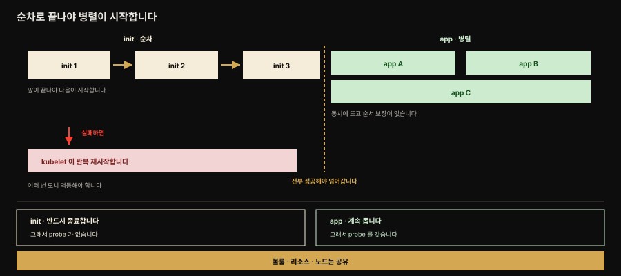
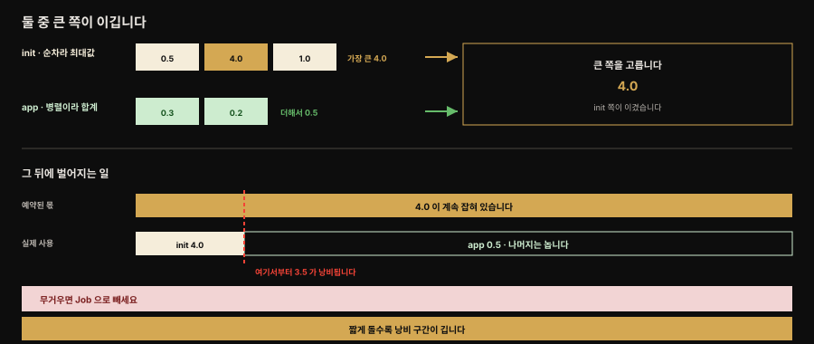

# Init Container — 초기화를 앱과 분리해 별도 생애주기로

> 『Kubernetes Patterns』 15장 정독. **Init Container**는 초기화 관련 작업을 메인 애플리케이션 컨테이너와 분리해 별도 생애주기를 주는 패턴입니다. 초기화 로직이 필요한 여러 패턴의 토대가 되는 근본 개념입니다. Java 클래스의 생성자가 객체 안에서 가장 먼저·한 번만 실행되듯, init container는 Pod 수준에서 앱 컨테이너보다 먼저 실행됩니다.



책의 Figure 15-1이 보이는 흐름입니다. 왼쪽 init 컨테이너들은 화살표를 따라 **하나씩** 돌고, 앞의 것이 성공해야 다음이 시작합니다. 점선 경계를 넘어야 비로소 앱 컨테이너들이 뜨는데 이들 사이에는 순서 보장이 없습니다. **순서에 의존하는 초기화를 init 쪽에 두어야 하는 이유가 이 그림 하나로 설명됩니다.**

아래쪽 두 상자가 성격 차이입니다. init은 반드시 종료해야 하므로 probe가 없고, 앱은 계속 돌기 때문에 probe를 갖습니다. 그럼에도 둘은 같은 Pod라 볼륨·리소스·노드를 공유합니다.


## 핵심 요약

> 초기화는 여러 언어에 공통된 관심사입니다. Java에서는 생성자(또는 static 블록)로 객체 초기화를 하며 생성자는 객체 안에서 가장 먼저·한 번만 실행되고 전제조건 검증·필드 초기화를 맡습니다. init container는 이와 비슷하되 클래스 수준이 아니라 **Pod 수준**입니다.

이 패턴은 Pod 안 컨테이너를 **init container**와 **application container** 두 그룹으로 나눕니다. 모든 init container는 **순차로 하나씩** 실행되고 전부 성공적으로 종료해야 앱 컨테이너가 시작됩니다. 앱 컨테이너는 그 뒤 **병렬로 임의 순서**로 뜹니다.

init container는 보통 작고 빠르게 완료되도록 기대됩니다. 의존을 기다리는 용도라면 오래 걸릴 수 있습니다. 여기에는 liveness·readiness·startupProbe가 없는데, 반드시 종료해야 하는 컨테이너라 지속 실행을 전제한 probe가 의미를 갖지 못하기 때문입니다. 실패하면 kubelet이 그 init을 성공할 때까지 반복 재시작하므로 **멱등(idempotent)** 하게 만드는 것이 좋습니다.

같은 Pod라 볼륨·리소스 한계·보안 설정을 공유하고 같은 노드에 배치됩니다. 스케줄링에 쓰이는 유효 Pod 리소스는 `max(init 최대값, init이 아닌 컨테이너 합계)`로 계산되어, 큰 init container는 짧게 돌아도 그 값이 스케줄링을 지배합니다. init/앱을 나누는 이유는 **생애주기·목적·작성자가 다르기 때문**입니다 — 앱 엔지니어는 앱 로직을, 배포 엔지니어는 초기화를 맡아 관심사를 분리하고 재사용합니다.


## 학습 목표

> 이 편을 읽고 나면 다음을 설명할 수 있습니다.

- init container를 Java 생성자에 빗대어 그 실행 보장을 설명합니다.
- init container와 앱 컨테이너의 실행 순서가 순차와 병렬로 갈리는 것을 압니다.
- init container에 probe가 없는 이유와 실패했을 때 벌어지는 일, 멱등성이 중요한 이유를 설명합니다.
- 유효 Pod 리소스 계산식과 그것이 리소스 효율에 미치는 영향을 압니다.
- init container와 sidecar, 그리고 admission webhook의 차이를 구분합니다.


## 본문 정리

### 문제 — Pod 수준의 초기화

초기화는 널리 퍼진 관심사입니다. Java에서 setup이 필요한 객체를 만들 때 생성자(또는 static 블록)를 씁니다. 생성자는 객체 안에서 가장 먼저 실행되고 런타임이 한 번만 실행하도록 보장하며 필수 파라미터 검증과 필드 초기화를 맡습니다.

init container는 비슷하되 Java 클래스 수준이 아니라 **Pod 수준**입니다. 메인 앱을 이루는 컨테이너들이 시작 전에 충족해야 할 전제가 있을 수 있습니다 — 파일시스템 권한 설정, DB 스키마 준비, 시드 데이터 설치 같은 것들입니다. 이 초기화 로직은 앱 이미지에 넣을 수 없는 도구·라이브러리를 요구하거나, 보안상 앱 이미지에 없어야 할 권한을 필요로 할 수 있습니다. 또는 외부 의존이 충족될 때까지 앱 시작을 미루고 싶을 수도 있습니다. 이 모든 경우에 init container가 초기화를 앱 본연의 임무에서 분리합니다.

### 해법 — 두 그룹의 컨테이너

init container는 Pod 정의의 일부이며 Pod 안 컨테이너를 두 그룹으로 나눕니다. 모든 init container는 순차로 하나씩 실행되고 전부 성공 종료해야 앱 컨테이너가 시작됩니다 — Java 클래스의 생성자 지시문이 객체 초기화를 돕는 것과 같은 의미입니다. 앱 컨테이너는 병렬로 실행되고 시작 순서는 임의입니다.

init container는 보통 작고 빠르게 완료되도록 기대됩니다. 예외는 의존을 기다리느라 시작을 미루는 경우로, 그때는 의존이 충족될 때까지 종료하지 않을 수 있습니다.

실패했을 때의 동작은 원서 서술을 공식 문서로 한 번 다듬어야 합니다. 원서는 "`RestartNever`로 표시되지 않은 한 Pod 전체가 재시작된다"고 적는데, **`RestartNever`라는 값은 실제로 없습니다.** Pod의 `restartPolicy` 필드가 받는 값은 `Always`·`OnFailure`·`Never`입니다. 공식 문서의 서술은 이렇습니다.

- init container가 실패하면 **kubelet이 그 init container를 성공할 때까지 반복 재시작합니다.**
- 다만 Pod의 `restartPolicy`가 `Never`이면, 기동 중 init container 실패는 **Pod 전체가 실패한 것으로** 처리됩니다.

어느 쪽이든 같은 init 로직이 여러 번 실행될 수 있다는 결론은 같습니다. 그래서 부작용을 막으려면 **멱등하게** 만드는 것이 좋습니다.

init container는 앱 컨테이너와 같은 능력을 갖습니다. 같은 Pod에 속하므로 리소스 한계와 볼륨, 보안 설정을 공유하고 같은 노드에 배치됩니다.

다만 생애주기와 헬스 체크, 리소스 처리의 의미가 조금 다릅니다. init container에는 **liveness·readiness·startupProbe가 없습니다.** 모든 init이 성공적으로 종료해야 앱 시작 프로세스가 이어지는 구조라, 지속 실행 중인 컨테이너를 감시하는 probe가 들어설 자리가 없습니다.

> **예외가 하나 생겼습니다.** 공식 문서는 이 규칙을 "일반 init container, 즉 sidecar container를 제외한 것"으로 한정합니다. **네이티브 사이드카**는 `initContainers`에 `restartPolicy: Always`를 붙인 것인데, 완료되지 않고 Pod 생애 내내 돌기 때문에 probe를 지원합니다. `SidecarContainers` 피처 게이트는 v1.29부터 기본 활성이고 v1.33에서 stable이 됐습니다. 원서는 2023년 기준이라 이 구분이 없습니다. 뒤 심화 학습에서 다시 다룹니다.

### 유효 Pod 리소스 계산

init container는 스케줄링·오토스케일·쿼터 관리를 위한 Pod 리소스 계산 방식에 영향을 줍니다. 컨테이너 실행 순서(먼저 init이 순차, 그다음 앱이 병렬) 때문에, 유효 Pod 수준 request/limit은 다음 두 값의 **최대값**이 됩니다.

- init container request/limit 중 가장 높은 값 (**어떤 자원에 limit이 없으면 그것을 가장 높은 limit으로 칩니다**)
- **init이 아닌 모든 컨테이너**(앱 컨테이너와 사이드카) 값의 합계

여기에 **pod overhead**(런타임이 Pod 자체에 쓰는 몫)가 더해진 것이 최종 유효 값입니다.

> **"사이드카 포함"과 pod overhead는 원서에 없습니다.** 원서는 "모든 앱 컨테이너의 합계"라고만 적습니다. 사이드카는 `initContainers`에 선언되지만 리소스 계산에서는 **init 쪽 최대값이 아니라 앱 쪽 합계로 넘어간다**는 뜻이라, 사이드카를 쓰는 Pod에서는 이 구분이 그대로 스케줄링 결과를 바꿉니다.
>
> 한 가지 주의할 것이 있습니다. **공식 문서 두 페이지가 서로 다르게 적고 있습니다.** [Init Containers](https://kubernetes.io/docs/concepts/workloads/pods/init-containers/) 페이지는 아직 *"the sum of all app containers"* 라고만 하고, [Sidecar Containers](https://kubernetes.io/docs/concepts/workloads/pods/sidecar-containers/) 페이지가 *"the sum of pod overhead and the higher of … the sum of all non-init containers(app and sidecar containers)"* 로 적습니다. 두 페이지 모두 "고칠 때 양쪽을 함께 고치라"는 주석을 달고 있는데 실제로는 한쪽만 갱신된 상태입니다. 사이드카를 쓴다면 **뒤쪽 서술이 실제 동작**입니다.



위쪽이 계산 과정입니다. init은 순차라 동시에 자원을 쓰지 않으니 **최대값**을 쓰고, 앱은 병렬로 도니 **합계**를 씁니다. 둘을 비교해 큰 쪽이 유효 Pod 값이 되는데, 그림에서는 init의 4.0이 앱 합계 0.5를 눌렀습니다.

아래쪽이 그 결과입니다. 예약된 몫은 계속 4.0인데 init이 끝난 뒤 실제로 도는 것은 0.5뿐이라, 붉은 선 오른쪽 구간 내내 3.5가 놀고 있습니다. init이 짧을수록 이 구간이 길어진다는 점이 역설적입니다.

결과적으로 큰 리소스를 요구하는 init container와 작은 앱 컨테이너가 있으면, 스케줄링에 영향을 주는 Pod 수준 값이 init container의 높은 값에 지배됩니다. 이는 리소스 효율이 낮습니다 — init이 잠깐만 돌고 대부분의 시간 노드에 여유가 있어도, 그 용량을 다른 Pod가 쓸 수 없습니다.

### 예시와 관련 기법

관심사 분리 덕에 컨테이너를 단일 목적으로 유지할 수 있습니다. 앱 컨테이너는 애플리케이션 엔지니어가 만들어 앱 로직에만 집중하고, init container는 배포 엔지니어가 만들어 설정과 초기화에만 집중합니다.

원서의 Example 15-1이 그 구도를 보입니다. 앱 컨테이너는 파일을 서빙하는 HTTP 서버인데, **그 파일이 어디서 오는지에 대해 아무 가정도 하지 않습니다.** 파일을 채워 넣는 일은 Git 저장소를 클론하는 것이 유일한 목적인 init container가 맡습니다.

```yaml
apiVersion: v1
kind: Pod
metadata:
  name: www
  labels:
    app: www
spec:
  initContainers:
  - name: download
    image: bitnami/git
    command:
    - git
    - clone
    - https://github.com/mdn/beginner-html-site-scripted
    - /var/lib/data          # 외부 Git 저장소를 마운트된 디렉터리로 클론합니다
    volumeMounts:
    - mountPath: /var/lib/data
      name: source           # init container 와 앱 컨테이너가 함께 쓰는 볼륨
  containers:
  - name: run
    image: centos/httpd
    ports:
    - containerPort: 80
    volumeMounts:
    - mountPath: /var/www/html
      name: source           # 같은 볼륨을 앱이 서빙 경로로 마운트합니다
  volumes:
  - emptyDir: {}             # 노드에서 데이터 공유에 쓰는 빈 디렉터리
    name: source
```

같은 Pod에 속하니 두 컨테이너가 같은 볼륨에 접근할 수 있습니다. 그 통로로 클론한 파일이 init에서 앱으로 넘어갑니다.

저자도 밝히듯 ConfigMap이나 PersistentVolume으로 같은 효과를 낼 수 있습니다. 여기서 굳이 이 방식을 택한 것은 init container가 볼륨을 공유하는 전형적 사용 패턴을 보이기 위해서입니다.

> **디버깅 팁.** init container의 결과를 확인하려면 앱 컨테이너의 command를 임시로 더미 `sleep` 명령으로 바꿔 두면 상황을 살펴볼 시간이 생깁니다. init이 실패했거나 설정이 없거나 깨져서 앱이 못 뜨는 경우에 특히 유용합니다. 아래처럼 두면 한 시간 동안 `kubectl exec -it <pod> sh`로 들어가 마운트된 볼륨을 확인할 수 있습니다.
>
> ```yaml
> command:
> - /bin/sh
> - "-c"
> - "sleep 3600"
> ```

**init vs sidecar(16장)** — sidecar로도 비슷한 효과를 낼 수 있지만 sidecar 방식은 어느 컨테이너가 먼저 실행될지 알 수 없고 나란히 계속 실행되는 용도입니다. 보장된 초기화와 지속적 데이터 갱신이 둘 다 필요하면 init과 sidecar를 함께 씁니다.

**다른 초기화 기법.** Admission controller와 admission webhook은 API Server로 가는 요청을 가로채 **오브젝트가 저장되기 전에** 리소스를 검증하거나 변형합니다. mutating webhook은 커스텀 기본값을 강제하도록 리소스를 바꾸고, validating webhook은 정책에 맞지 않는 리소스를 거부합니다.

init container와는 활동하는 **시점**이 다릅니다. webhook은 리소스가 만들어지는 순간에 개입하고 init container는 Pod가 시작될 때 활동합니다.

쓰는 사람도 갈립니다. init container는 Kubernetes에 배포하는 **개발자**가 쓰고, webhook은 **관리자와 프레임워크**가 초기화 과정을 통제하는 데 씁니다.

Istio가 둘을 함께 쓰는 좋은 예입니다. Pod 정의가 만들어지는 시점에 mutating webhook으로 sidecar와 init container를 자동 주입하고, 그 Pod가 뜰 때 init container가 iptables 규칙을 걸어 Envoy 프록시를 요청 경로에 끼워 넣습니다. 트래픽 리디렉션에는 권한 상승이 필요한데, 그 작업을 앱 컨테이너에서 떼어 두는 편이 보안상 안전합니다.


## 심화 학습

### Spring Boot 앱의 DB 마이그레이션 순서 (Spring 관점)

init container의 전형적 실무는 **DB 스키마 마이그레이션을 앱 시작 전에 완료**하는 것입니다. Spring Boot 앱은 Flyway나 Liquibase를 임베드해 부팅 시점에 마이그레이션을 돌리기도 하는데, replica 여럿이 동시에 뜨면 마이그레이션이 경합합니다.

init container로 분리하면 앱 컨테이너가 시작되기 전에 스키마가 준비됨을 보장할 수 있습니다. 다만 **replica마다 init이 돈다는 점은 그대로**라, 경합 자체는 마이그레이션 도구의 락(Flyway의 `flyway_schema_history` 테이블 락)이나 멱등성에 여전히 기댑니다. 본문의 "init container를 멱등하게"가 여기서 그대로 적용됩니다.

또 다른 활용은 앱 이미지에 넣기 싫은 도구를 init에 두는 것입니다. 예를 들어 앱 이미지는 JRE만 담아 작게 유지하고 git·curl·마이그레이션 CLI 같은 무거운 도구는 init container 이미지에 두어 관심사와 공격 표면을 분리합니다.

> 참고: [네이티브 사이드카 컨테이너](https://kubernetes.io/docs/concepts/workloads/pods/sidecar-containers/)는 `initContainers`에 `restartPolicy: Always`를 붙여, init 순서 보장과 앱과 나란한 지속 실행을 하나로 묶습니다. `SidecarContainers` 피처 게이트가 **v1.29부터 기본 활성**이고 **v1.33에서 stable**입니다(원서 범위 밖). 본문의 "init과 sidecar를 함께"가 이 기능으로 더 매끄럽게 풀립니다.

### 유효 리소스 계산이 스케줄링을 왜곡하는 지점

`max(init 최대, 앱 합계)` 계산은 무거운 init을 둔 Pod에서 함정이 됩니다. 예를 들어 앱이 CPU 0.5코어면 충분한데 init이 데이터 로딩으로 4코어를 요구하면, 스케줄러는 이 Pod를 4코어 여유가 있는 노드에만 배치합니다 — init이 끝나고 앱만 0.5코어를 쓰는 대부분의 시간에도 그 4코어가 예약된 것처럼 취급됩니다. 이를 피하려면 무거운 초기화를 별도 Job(7장)으로 빼거나, init container의 리소스 요청을 실제 필요에 맞게 낮추는 것을 고려합니다.


## 능동 회상

> 먼저 스스로 답해 본 뒤 아래 정답 절에서 맞춰 봅니다. 정답은 이 절 다음에 번호 순서대로 있습니다.

1. Init Container 패턴이 무엇을 가능하게 하나요? 한 문장으로 말해 보세요.
2. Java 생성자와 init container 는 무엇이 같고 어느 수준에서 다른가요?
3. Java 생성자가 보장하는 것 두 가지는 무엇인가요?
4. 앱 컨테이너가 시작 전에 충족해야 할 전제의 예를 세 가지 들어 보세요.
5. 초기화 로직을 앱 이미지에 넣지 *못하는* 이유 두 가지는 무엇인가요?
6. init container 와 앱 컨테이너의 실행 방식은 각각 어떻게 다른가요?
7. init container 가 오래 걸려도 괜찮은 경우는 언제인가요?
8. init container 가 실패하면 무슨 일이 일어나나요? `restartPolicy` 가 `Never` 면 무엇이 달라지나요?
9. init container 를 멱등하게 만들어야 하는 이유는 무엇인가요?
10. init container 가 앱 컨테이너와 공유하는 것은 무엇인가요?
11. init container 에 probe 가 없는 이유는 무엇인가요? 예외가 있다면 무엇인가요?
12. 유효 Pod request/limit 은 어떻게 계산되나요? 두 후보값을 말해 보세요.
13. init 그룹은 왜 합계가 아니라 최대값을 쓰나요?
14. 무거운 init 과 가벼운 앱을 함께 두면 어떤 비효율이 생기나요?
15. Example 15-1 에서 init 과 앱은 무엇을 통해 데이터를 주고받나요?
16. 그 예제의 앱 컨테이너가 "아무 가정도 하지 않는다"는 것은 무슨 뜻인가요?
17. init container 결과를 디버깅하는 요령은 무엇인가요?
18. init container 와 sidecar 는 어떻게 다른가요? 둘을 함께 쓰는 경우는 언제인가요?
19. admission controller 와 admission webhook 은 각각 무엇인가요? 두 webhook 종류는 무엇인가요?
20. init container 와 admission webhook 의 가장 큰 차이는 무엇인가요?
21. Istio 는 이 장의 기법들을 어떻게 조합해 쓰나요?
22. 왜 초기화를 앱 컨테이너 안 스크립트로 처리하지 않고 굳이 컨테이너를 둘로 나누나요?


## 정답

> 위 회상 질문의 답입니다. 번호가 대응합니다.

**1.** 초기화 관련 작업에 **메인 앱 컨테이너와 구별되는 별도 생애주기**를 줌으로써 관심사 분리를 가능하게 합니다.

**2.** 둘 다 본체가 돌기 전에 준비를 마친다는 점이 같습니다. 다른 것은 **수준**입니다. 생성자는 Java 클래스 수준에서 객체를 초기화하고, init container 는 **Pod 수준**에서 앱 컨테이너를 준비시킵니다.

**3.** 객체 안에서 **가장 먼저** 실행된다는 것과, 관리 런타임이 **한 번만** 실행하도록 보장한다는 것입니다. 여기에 더해 필수 파라미터 같은 전제조건 검증과 인스턴스 필드 초기화에도 씁니다.

**4.** 파일시스템의 특별한 권한 설정, DB 스키마 준비, 애플리케이션 시드 데이터 설치입니다.

**5.** 첫째, 초기화에 필요한 **도구와 라이브러리를 앱 이미지에 넣을 수 없는** 경우입니다. 둘째, 보안상 앱 이미지에 그 **초기화 작업을 수행할 권한이 없어야** 하는 경우입니다.

**6.** init container 는 **순차로 하나씩** 실행되고 전부 성공적으로 종료해야 다음 단계로 넘어갑니다. 앱 컨테이너는 그 뒤 **병렬로 실행**되며 시작 순서는 임의입니다.

**7.** **외부 의존이 충족되기를 기다리느라 Pod 시작을 미루는** 용도로 쓸 때입니다. 그 경우 의존이 만족될 때까지 종료하지 않을 수 있습니다.

**8.** kubelet 이 그 init container 를 **성공할 때까지 반복 재시작**합니다. 다만 Pod 의 `restartPolicy` 가 `Never` 이면 기동 중 init 실패는 **Pod 전체가 실패한 것으로** 처리됩니다. (원서는 여기서 `RestartNever` 라고 적지만 그런 값은 존재하지 않습니다.)

**9.** 실패 시 같은 init 로직이 **여러 번 실행될 수 있기** 때문입니다. 두 번 돌아도 부작용이 없어야 안전합니다.

**10.** 같은 Pod 에 속하므로 **리소스 한계·볼륨·보안 설정**을 공유하고 **같은 노드**에 배치됩니다.

**11.** 모든 init 이 **성공적으로 종료해야** 앱 시작 프로세스가 이어지는 구조라, 지속 실행 중인 컨테이너를 감시하는 probe 가 의미를 갖지 못하기 때문입니다. 예외는 **네이티브 사이드카**(피처 게이트 `SidecarContainers`, v1.29 부터 기본 활성 · v1.33 stable)로, `initContainers` 에 `restartPolicy: Always` 를 붙여 완료되지 않고 계속 도는 것이라 probe 를 지원합니다.

**12.** 다음 두 값 중 **더 큰 쪽**에 **pod overhead** 를 더한 값입니다. 하나는 **모든 init container 중 가장 높은** request/limit 값이고, 다른 하나는 **init 이 아닌 모든 컨테이너**(앱 컨테이너와 사이드카) 값의 **합계**입니다. 사이드카는 `initContainers` 에 선언되지만 이 계산에서는 앱 쪽 합계로 넘어갑니다.

**13.** init container 는 **순차로 실행**되어 동시에 자원을 쓰지 않기 때문입니다. 반대로 앱 컨테이너는 병렬로 동시에 도니 합계를 씁니다.

**14.** 스케줄링에 쓰이는 Pod 수준 값이 **init 의 높은 값에 지배**됩니다. init 이 잠깐만 돌고 그 뒤로는 노드에 여유가 생겨도 그 용량을 **다른 Pod 가 쓸 수 없습니다.** init 이 짧을수록 낭비 구간이 길어지는 역설이 생깁니다.

**15.** **`emptyDir` 볼륨**입니다. init 이 Git 저장소를 클론해 볼륨에 채우면 앱(httpd)이 같은 볼륨을 서빙 경로로 마운트해 읽습니다.

**16.** 그 컨테이너는 **범용 HTTP 서빙 기능만** 제공하고, 서빙할 파일이 어디서 오는지에 대해 전제를 두지 않는다는 뜻입니다. 덕분에 파일 공급 방식이 바뀌어도 앱 컨테이너는 그대로 재사용됩니다.

**17.** 앱 컨테이너의 command 를 임시로 **더미 `sleep` 명령**(예: `sleep 3600`)으로 바꿔 둡니다. 그러면 앱이 못 뜨는 상황에서도 `kubectl exec -it <pod> sh` 로 들어가 마운트된 볼륨과 설정을 들여다볼 시간이 생깁니다.

**18.** sidecar 로도 비슷한 효과를 낼 수 있지만 **어느 컨테이너가 먼저 실행될지 알 수 없고**, sidecar 는 나란히 **지속 실행**하는 용도입니다. **보장된 초기화와 지속적 데이터 갱신이 둘 다** 필요하면 init 과 sidecar 를 함께 씁니다.

**19.** admission controller 는 API Server 로 가는 모든 요청을 **오브젝트 저장 전에** 가로채 변형·검증하는 플러그인 집합인데, kube-apiserver 바이너리에 컴파일돼 있고 관리자가 기동 시 설정하므로 유연하지 않습니다. 그래서 나온 것이 **admission webhook** 으로, HTTP 콜백을 수행하는 외부 admission controller 입니다. **mutating webhook** 은 커스텀 기본값을 강제하도록 리소스를 바꾸고 **validating webhook** 은 정책에 맞지 않는 리소스를 거부합니다.

**20.** init container 는 **Kubernetes 에 배포하는 개발자**가 쓰고, admission webhook 은 **관리자와 여러 프레임워크**가 컨테이너 초기화 과정을 통제·변경하는 데 씁니다. 활동 시점도 각각 Pod 시작 시점과 리소스 생성 시점으로 다릅니다.

**21.** Pod 정의가 만들어지는 시점에 **mutating admission webhook** 으로 sidecar 와 init container 를 자동 주입합니다. 그리고 그 Pod 가 뜰 때 **init container** 가 iptables 규칙을 걸어 Envoy 프록시를 애플리케이션의 요청 경로에 끼워 넣습니다. 트래픽 리디렉션에 권한 상승이 필요하므로 그 작업을 앱에서 떼어 두는 편이 보안상 안전합니다.

**22.** 두 그룹의 **생애주기·목적·작성자가 다르기** 때문입니다. init 이 단계별로 진행하며 앞 단계의 성공을 보장해 주므로 각 시점에서 이전 초기화가 끝났음을 확신할 수 있는데, 병렬로 도는 앱 컨테이너는 그런 보장을 주지 못합니다. 나눠 두면 초기화 전용·앱 전용 컨테이너를 각각 만들어 **다른 맥락에서 재사용**할 수도 있습니다.


## 실무 적용

- **순서가 보장되어야 할 초기화는 init container로 뺍니다.** 스키마 준비·권한 설정·의존 대기처럼 앱보다 먼저 끝나야 하는 일입니다.
- **init container를 멱등하게 만듭니다.** 실패하면 kubelet이 그 init을 성공할 때까지 반복 재시작하므로, 같은 로직이 여러 번 돌아도 안전해야 합니다.
- **앱 이미지에 넣기 싫은 도구·권한을 init으로 격리합니다.** git·마이그레이션 CLI·권한 상승 작업을 앱 이미지에서 분리해 공격 표면을 줄입니다.
- **무거운 init의 리소스 영향을 확인합니다.** 유효 Pod 리소스가 init의 큰 값에 지배되면 스케줄링·효율이 나빠집니다. 필요하면 Job으로 빼거나 요청을 낮춥니다.
- **보장된 초기화 + 지속 갱신이 필요하면 init과 sidecar를 함께 씁니다.**
- **디버깅은 sleep 트릭으로 합니다.** 앱 command를 임시로 `sleep 3600`으로 바꿔 볼륨·설정을 살펴봅니다.


## 체크리스트

- [ ] 순서가 보장되어야 할 초기화를 init container로 분리했는가?
- [ ] init container가 멱등한가?(재시작 시 다시 돌아도 안전한가)
- [ ] init container에 probe를 넣으려 하지 않았는가?(init엔 probe가 없음)
- [ ] 앱 이미지에 넣기 싫은 도구·권한을 init으로 격리했는가?
- [ ] 무거운 init이 유효 Pod 리소스를 지배해 스케줄링을 왜곡하지 않는가?
- [ ] init에서 앱으로 데이터를 넘길 때 공유 볼륨(emptyDir 등)을 썼는가?


## 면접 관점

- **init container를 Java에 비유하면?** — 클래스의 생성자입니다. 객체(Pod) 안에서 가장 먼저·한 번만 실행되고 앱 로직(앱 컨테이너)이 돌기 전에 전제조건을 준비합니다.
- **init container와 앱 컨테이너의 실행 순서 차이는?** — init은 순차로 하나씩 실행되고 전부 성공 종료해야 하며 앱은 그 뒤 병렬로 임의 순서로 시작됩니다. 순서 보장이 필요하면 init으로, 나란한 지속 실행이면 sidecar로 갑니다.
- **init container에 probe가 없는 이유는?** — 모든 init이 성공 종료해야 앱 시작이 이어지기 때문입니다. liveness/readiness/startupProbe는 지속 실행 컨테이너를 위한 것이라 init에는 의미가 없습니다.
- **유효 Pod 리소스는 어떻게 계산됩니까?** — `max(init 컨테이너 최대값, init이 아닌 컨테이너 합계)`에 pod overhead를 더한 값입니다. 두 번째 항의 "init이 아닌"에는 앱 컨테이너와 **네이티브 사이드카**가 함께 들어갑니다. 큰 init은 짧게 돌아도 그 값이 스케줄링을 지배해 리소스 효율을 낮출 수 있습니다.
- **init container와 admission webhook의 차이는?** — init은 Pod 시작 시점에 활동하며 개발자가 씁니다. admission webhook은 리소스 생성 시점에 검증·변형하며 관리자·프레임워크가 씁니다(예: Istio가 webhook으로 init·sidecar를 자동 주입).


## 참고 자료

- 《Kubernetes Patterns, Second Edition》 Ch15. Init Container (Bilgin Ibryam·Roland Huß, O'Reilly)
- [분산 프리미티브 — init container = 생성자 비유](./01-01.%EB%B6%84%EC%82%B0%20%ED%94%84%EB%A6%AC%EB%AF%B8%ED%8B%B0%EB%B8%8C%20%E2%80%94%20OOP%C2%B7Java%20%EA%B0%9C%EB%85%90%EC%9D%84%20Kubernetes%EB%A1%9C.md)
- [멀티 컨테이너·init·네이티브 사이드카 (Kubernetes in Action)](../kubernetes-in-action/05-03.%EB%A9%80%ED%8B%B0%20%EC%BB%A8%ED%85%8C%EC%9D%B4%EB%84%88%C2%B7init%C2%B7%EB%84%A4%EC%9D%B4%ED%8B%B0%EB%B8%8C%20%EC%82%AC%EC%9D%B4%EB%93%9C%EC%B9%B4%EC%99%80%20%EC%82%AD%EC%A0%9C.md)
- [Kubernetes 공식 문서 — Init Containers](https://kubernetes.io/docs/concepts/workloads/pods/init-containers/)
