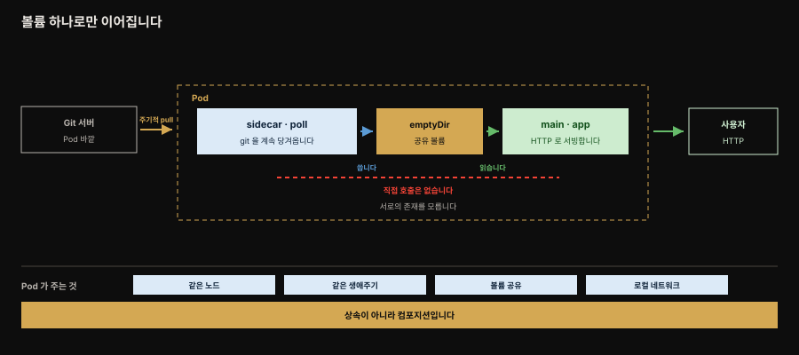
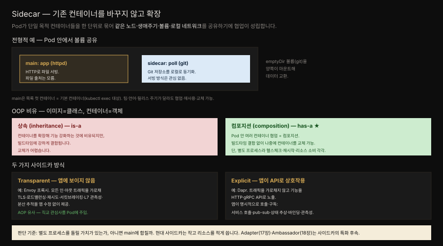

# Sidecar — 기존 컨테이너를 바꾸지 않고 확장

> 『Kubernetes Patterns』 16장 정독. **Sidecar**는 기존 컨테이너를 변경하지 않고 그 기능을 확장·강화하는 컨테이너입니다. 단일 목적 컨테이너들이 긴밀히 협업하게 하는 근본 컨테이너 패턴이며 특화 후속인 Adapter(17장)·Ambassador(18장)의 토대입니다.



책의 Figure 16-1이 보이는 구도입니다. Pod 안에서 sidecar가 바깥 Git 서버의 데이터를 당겨와 공유 볼륨에 쓰고, main이 같은 볼륨을 다른 경로로 마운트해 그것을 서빙합니다.

주목할 것은 **두 컨테이너 사이에 직접 호출이 없다**는 점입니다. 붉은 점선이 그 자리인데, 서로를 부르지 않고 볼륨 하나만 사이에 둡니다. 그래서 서버는 파일 출처를 모르고 동기화기는 그 파일이 어떻게 쓰이는지 모릅니다. 이 무지가 두 컨테이너를 각각 다른 앱에서 재사용할 수 있게 만듭니다.


## 핵심 요약

> 컨테이너는 하나의 문제를 잘 푸는 단일 Linux 프로세스처럼 동작하고 교체 가능성과 재사용을 염두에 두고 만들어집니다. HTTP 호출 클라이언트를 직접 짜지 않고 기존 것을 쓰듯, 웹 서버 컨테이너를 새로 만들지 않고 기존 것을 씁니다. 하지만 단일 목적 재사용 컨테이너를 쓰려면 컨테이너 기능을 확장하고 협업하게 하는 방법이 필요합니다 — 그것이 sidecar입니다.

Pod는 여러 컨테이너를 한 단위로 묶어 **같은 노드 배치와 같은 생애주기, 볼륨 공유, 로컬 네트워크 통신**을 가능케 합니다. sidecar는 이 Pod에 컨테이너를 넣어 다른 컨테이너의 동작을 확장·강화하는 시나리오입니다.

전형적 예가 HTTP 서버와 Git 동기화기입니다. 서버는 파일이 어디서 오는지 모르고 동기화기는 그 파일이 어떻게 쓰이는지 모릅니다. 둘은 볼륨 하나로만 이어집니다.

OOP 비유로 이미지는 클래스, 컨테이너는 객체입니다. 컨테이너를 확장하는 일은 빌드타임에 강하게 묶이는 **상속**(is-a)이 아니라, 런타임에 갈아 끼울 수 있는 **컴포지션**(has-a)에 해당합니다.

sidecar를 쓰는 방식은 둘로 갈립니다.

**transparent**는 앱에 보이지 않게 동작합니다. Envoy처럼 모든 트래픽을 가로채 TLS·로드밸런싱·관측성을 제공합니다. **explicit**은 앱이 API로 직접 상호작용하는 방식입니다. Dapr처럼 기능을 HTTP·gRPC로 노출합니다.


## 학습 목표

> 이 편을 읽고 나면 다음을 설명할 수 있습니다.

- sidecar가 무엇이고 Pod의 어떤 성질 위에 서는 패턴인지 설명합니다.
- main 컨테이너와 helper 컨테이너의 관계, main이 기본 컨테이너인 이유를 압니다.
- 상속과 컴포지션의 OOP 비유를 들어 sidecar가 왜 컴포지션인지 설명합니다.
- transparent sidecar와 explicit sidecar의 차이를 Envoy와 Dapr 예로 구분합니다.
- sidecar를 별도 프로세스로 둘지 main에 합칠지 판단하는 기준을 압니다.


## 본문 정리

### 문제 — 단일 목적 컨테이너를 어떻게 협업시키나

컨테이너는 인기 있는 패키징 기술로, 앱을 통일된 방식으로 빌드·배포·실행하게 합니다. 컨테이너는 고유한 런타임·릴리스 주기·API·소유 팀을 가진 기능 단위의 자연스러운 경계입니다. 제대로 된 컨테이너는 단일 Linux 프로세스처럼 하나의 문제를 잘 풀고 교체 가능성과 재사용을 염두에 둡니다 — 기존 특화 컨테이너를 활용해 앱을 더 빨리 만들 수 있게 합니다.

오늘날 HTTP 호출에 클라이언트 라이브러리를 직접 짜지 않고 기존 것을 쓰듯, 웹사이트 서빙에 웹 서버 컨테이너를 새로 만들지 않고 기존 것을 씁니다. 이 접근은 바퀴를 재발명하지 않게 하고 더 적은 수의 고품질 컨테이너 생태계를 만듭니다. 하지만 단일 목적 재사용 컨테이너를 쓰려면 컨테이너 기능을 확장하고 협업하게 하는 방법이 필요합니다. sidecar가 이 협업을 기술합니다.

### 해법 — Pod 위의 협업

1장에서 본 대로 Pod 프리미티브가 여러 컨테이너를 한 단위로 묶습니다. 런타임에 Pod는 그 자체로 컨테이너이되, 다른 모든 컨테이너보다 먼저 `pause` 명령으로 시작하는 일시정지 프로세스입니다 — 앱 컨테이너들이 Pod 생애 동안 상호작용에 쓰는 Linux 네임스페이스를 붙들고 있을 뿐입니다.

Pod는 배포 단위로서 소속 컨테이너에 런타임 제약을 줍니다. 모든 컨테이너가 같은 노드에 배포되고 같은 Pod 생애주기를 공유하며 볼륨을 공유하고 로컬 네트워크·호스트 IPC로 통신할 수 있습니다. 이것이 사람들이 컨테이너 그룹을 Pod에 넣는 이유입니다. sidecar(Sidekick이라고도)는 다른 컨테이너의 동작을 확장·강화하려 Pod에 컨테이너를 넣는 시나리오를 가리킵니다.

전형적 예는 HTTP 서버와 Git 동기화기입니다. 서버는 HTTP로 파일을 서빙하는 데만 집중하고 그 파일이 어디서 오는지 모릅니다. 동기화기는 Git 서버에서 로컬 파일시스템으로 데이터를 맞추는 것만 목표로 하고, 동기화된 뒤 무슨 일이 벌어지는지 신경 쓰지 않습니다.

```yaml
apiVersion: v1
kind: Pod
metadata:
  name: web-app
spec:
  containers:
  - name: app                    # HTTP 로 파일을 서빙하는 메인 컨테이너
    image: centos/httpd
    volumeMounts:
    - mountPath: /var/www/html
      name: git
  - name: poll                   # 나란히 돌며 Git 에서 데이터를 당겨오는 sidecar
    image: bitnami/git
    volumeMounts:
    - mountPath: /var/lib/data
      name: git
    env:
    - name: GIT_REPO
      value: https://github.com/mdn/beginner-html-site-scripted
    command: [ "sh", "-c" ]
    args:
    - |
      git clone $(GIT_REPO) .
      while true; do
        sleep 60
        git pull
      done
    workingDir: /var/lib/data
  volumes:
  - emptyDir: {}                 # 둘이 데이터를 주고받는 공유 위치
    name: git
```

두 컨테이너가 같은 `emptyDir`을 각자 다른 경로로 마운트합니다. sidecar 쪽은 `/var/lib/data`에 클론해 두고 60초마다 `git pull`을 돌리고, 앱 쪽은 같은 볼륨을 `/var/www/html`로 마운트해 그것을 서빙합니다. **한쪽이 채우고 다른 쪽이 읽는 통로가 볼륨 하나뿐**이라는 점이 이 패턴의 핵심입니다.

둘이 협업하며 똑같이 중요하다고 볼 수도 있지만, sidecar 패턴에는 **main 컨테이너와 그것을 강화하는 helper 컨테이너**라는 구분이 있습니다. 보통 main을 `containers` 목록의 첫 자리에 두는데, 그것이 기본 컨테이너가 되어 `kubectl exec` 같은 명령의 대상이 됩니다.

이 단순한 패턴이 런타임 협업을 가능하게 하면서 동시에 두 컨테이너의 관심사를 분리합니다. 팀도 언어도 릴리스 주기도 다를 수 있고, HTTP 서버와 Git 동기화기 각각을 다른 앱에서 재사용하거나 교체할 수 있습니다.

### 상속 vs 컴포지션

앞서 이미지는 클래스, 컨테이너는 객체에 비유했습니다. 이 비유를 이으면, 컨테이너를 확장해 기능을 강화하는 것은 OOP의 **상속**과 비슷하고 Pod에서 여러 컨테이너가 협업하는 것은 **컴포지션**과 비슷합니다. 둘 다 코드 재사용을 주지만 상속은 컨테이너 사이를 더 강하게 결합하고 "is-a" 관계를 나타냅니다.

반면 Pod의 컴포지션은 "has-a" 관계이고 더 유연합니다 — 빌드타임에 컨테이너를 결합하지 않아 나중에 Pod 정의에서 컨테이너를 갈아 끼울 수 있습니다. 컴포지션에서는 여러 컨테이너(프로세스)가 main 앱 컨테이너처럼 각각 실행·헬스체크·재시작되고 리소스를 소비합니다. 현대 sidecar는 작고 리소스를 적게 쓰지만 별도 프로세스를 돌릴 가치가 있는지 아니면 main에 합치는 게 나은지 판단해야 합니다.

### transparent vs explicit

sidecar 사용에는 두 지배적 방식이 있습니다.



두 방식의 차이가 **트래픽 경로**에서 드러납니다. 위쪽 transparent는 바깥에서 오는 트래픽이 sidecar를 *통과해* 앱에 닿습니다. 아래쪽 explicit은 트래픽이 sidecar를 *지나치고*, 대신 앱이 아래로 내려가 sidecar API를 부릅니다. 화살표 방향이 반대인 것이 이 둘을 가르는 지점입니다.

- **Transparent** — 앱에 보이지 않습니다. Envoy 프록시가 예로, main 컨테이너 옆에서 돌며 네트워크를 추상화해 TLS·로드밸런싱·자동 재시도·서킷 브레이킹·전역 rate limiting·L7 트래픽 관측성·분산 추적을 제공합니다. sidecar를 투명하게 붙이고 모든 인·아웃 트래픽을 가로채 이 기능들을 앱에 제공합니다. main 컨테이너를 건드리지 않고 직교 능력을 Pod에 도입하는 것이 **관점 지향 프로그래밍(AOP)** 과 비슷합니다.
- **Explicit** — 앱이 잘 정의된 API로 상호작용합니다. Dapr가 예로, Pod에 주입되어 신뢰성 있는 서비스 호출·pub-sub·외부 시스템 바인딩·상태 추상·관측성·분산 추적을 제공합니다. Envoy와의 주 차이는 Dapr가 모든 트래픽을 가로채지 않는다는 점입니다 — 기능을 HTTP·gRPC API로 노출하고 앱이 명시적으로 호출·구독합니다.


## 심화 학습

### Java/Spring 관점 — is-a보다 has-a

sidecar의 컴포지션 우위는 Spring 개발자에게 익숙한 원칙입니다. "상속보다 컴포지션"은 이펙티브 자바의 고전 항목으로, 강결합과 취약한 기반 클래스 문제를 피하려 위임을 권합니다.

Kubernetes의 sidecar는 이 원칙을 **프로세스와 컨테이너 수준**으로 끌어올린 것입니다. 앱 이미지를 상속으로 확장해 빌드타임에 묶는 대신, 별도 컨테이너를 Pod에 조합해 런타임에 갈아 끼울 수 있게 합니다.

transparent sidecar가 AOP에 비유되는 것도 Spring 진영에 와닿습니다. Spring AOP가 트랜잭션·로깅·보안 같은 횡단 관심사를 비즈니스 코드에 손대지 않고 프록시로 주입하듯, Envoy sidecar는 TLS·재시도·관측성을 앱 코드에 손대지 않고 트래픽 가로채기로 주입합니다. 서비스 메시(Istio)가 이 방식으로 마이크로서비스 간 통신 정책을 앱과 무관하게 강제합니다.

> **참고 — 네이티브 사이드카.** 이 장이 설명하는 sidecar는 `containers` 목록에 나란히 두는 일반 컨테이너입니다. 그 방식에는 **시작·종료 순서 보장이 없다**는 약점이 있습니다.
>
> Kubernetes는 이를 위해 [네이티브 사이드카](https://kubernetes.io/docs/concepts/workloads/pods/sidecar-containers/)를 도입했습니다. `initContainers`에 `restartPolicy: Always`를 준 컨테이너를 sidecar로 취급하는 방식으로, **init container의 특수한 경우**로 구현됐습니다. `SidecarContainers` 피처 게이트는 **v1.29부터 기본 활성**입니다(원서는 2023년 기준이라 이 기능을 다루지 않습니다).
>
> 얻는 것은 생애주기 보장입니다. sidecar가 앱 컨테이너보다 **먼저** 시작하고, 종료 시에는 kubelet이 **앱 컨테이너가 완전히 멈출 때까지 sidecar 종료를 미룹니다.** 앱이 마지막 요청을 처리하는 동안 프록시나 로그 수집기가 먼저 죽어 버리는 사고를 막아 줍니다.

### 별도 프로세스로 둘지 판단하는 기준

본문은 "별도 프로세스를 돌릴 가치가 있는가, 아니면 main에 합칠까"를 판단하라고 합니다. 판단 축은 넷입니다.

| 축 | 물어볼 것 |
|----|----------|
| 재사용성 | 그 기능을 다른 앱에서도 쓰는가 |
| 소유권 | 팀·언어·릴리스 주기가 다른가 |
| 격리 | 권한 상승이 필요해 앱과 떼는 편이 안전한가 |
| 리소스 비용 | 별도 프로세스의 오버헤드가 이득보다 큰가 |

Git 동기화나 프록시, 로그 수집처럼 재사용성과 격리 이득이 크면 sidecar로 뺍니다. 반대로 앱과 뗄 수 없이 붙은 소소한 로직이면 main에 합치는 편이 낫습니다.


## 능동 회상

> 먼저 스스로 답해 본 뒤 아래 정답 절에서 맞춰 봅니다. 정답은 이 절 다음에 번호 순서대로 있습니다.

1. sidecar 를 한 문장으로 정의해 보세요. 이 패턴의 특화 후속 둘은 무엇인가요?
2. "제대로 된 컨테이너"의 성질을 원서는 무엇에 빗대나요?
3. 재사용 가능한 단일 목적 컨테이너를 쓰려면 무엇이 추가로 필요한가요?
4. 런타임에 Pod 자체는 무엇인가요? 무슨 일을 하나요?
5. Pod 가 소속 컨테이너에 거는 런타임 제약 네 가지는 무엇인가요?
6. sidecar 의 다른 이름은 무엇인가요?
7. HTTP 서버와 Git 동기화기 예에서 각자 무엇을 알고 무엇을 모르나요?
8. 두 컨테이너는 무엇을 통해 데이터를 주고받나요? 서로를 직접 호출하나요?
9. main 컨테이너를 목록 첫 자리에 두는 이유는 무엇인가요?
10. 이 패턴이 관심사 분리 측면에서 무엇을 가능하게 하나요?
11. 이미지와 컨테이너를 OOP 로 비유하면 각각 무엇인가요?
12. 상속과 컴포지션은 각각 어떤 관계이며 sidecar 는 어느 쪽인가요?
13. 컴포지션이 더 유연한 이유는 무엇인가요?
14. 컴포지션의 대가는 무엇인가요?
15. transparent sidecar 는 어떻게 동작하나요? Envoy 가 제공하는 기능을 들어 보세요.
16. transparent sidecar 가 AOP 에 비유되는 이유는 무엇인가요?
17. explicit sidecar 는 어떻게 동작하나요? Dapr 가 제공하는 기능은 무엇인가요?
18. Dapr 와 Envoy 의 결정적 차이는 무엇인가요?
19. sidecar 로 뺄지 main 에 합칠지 판단하는 축 네 가지는 무엇인가요?
20. 네이티브 사이드카는 어떻게 선언하나요? 어느 버전부터 기본 활성인가요?
21. 네이티브 사이드카가 주는 생애주기 보장 두 가지는 무엇인가요?
22. init container 와 sidecar 는 어떻게 다른가요?


## 정답

> 위 회상 질문의 답입니다. 번호가 대응합니다.

**1.** **기존 컨테이너를 변경하지 않고 그 기능을 확장·강화하는 컨테이너**입니다. 특화 후속 패턴은 **Adapter**(17장)와 **Ambassador**(18장)입니다.

**2.** **단일 Linux 프로세스**에 빗댑니다. 하나의 문제를 풀되 잘 풀고, 교체 가능성과 재사용을 염두에 두고 만들어집니다.

**3.** 컨테이너의 **기능을 확장하는 방법**과 컨테이너 사이의 **협업 수단**입니다. sidecar 패턴이 바로 그 협업을 기술합니다.

**4.** Pod 도 그 자체로 **컨테이너**입니다. 다른 모든 컨테이너보다 먼저 문자 그대로 `pause` 명령으로 시작하는 일시정지 프로세스이며, 하는 일이라고는 앱 컨테이너들이 Pod 생애 동안 상호작용에 쓰는 **Linux 네임스페이스를 붙들고 있는** 것뿐입니다.

**5.** 넷입니다.

- 모든 컨테이너가 **같은 노드**에 배포됩니다.
- **같은 Pod 생애주기**를 공유합니다.
- **볼륨을 공유**할 수 있습니다.
- **로컬 네트워크나 호스트 IPC**로 통신할 수 있습니다.

**6.** **Sidekick** 이라고도 부릅니다.

**7.** HTTP 서버는 파일을 HTTP 로 서빙하는 데만 집중하고 **그 파일이 어디서 어떻게 오는지 모릅니다.** Git 동기화기는 Git 서버에서 로컬 파일시스템으로 데이터를 맞추는 것만 목표로 하고 **동기화된 뒤 무슨 일이 벌어지는지 신경 쓰지 않습니다.**

**8.** **공유 볼륨**(예제에서는 `emptyDir`)을 통해서만 주고받습니다. 서로를 직접 호출하지 않습니다. 각자 같은 볼륨을 다른 경로로 마운트할 뿐입니다.

**9.** 첫 컨테이너가 **기본 컨테이너**가 되기 때문입니다. `kubectl exec` 처럼 컨테이너를 지정하지 않는 명령의 대상이 됩니다.

**10.** 두 컨테이너가 **팀·프로그래밍 언어·릴리스 주기**가 달라도 됩니다. 또 각각을 다른 앱에서 **재사용하거나 교체**할 수 있습니다. 단일 컨테이너로 쓰든 다른 컨테이너와 조합하든 자유롭습니다.

**11.** 컨테이너 **이미지가 클래스**, **컨테이너가 객체**입니다.

**12.** 컨테이너를 확장해 기능을 강화하는 것은 **상속**(is-a)에, Pod 에서 여러 컨테이너가 협업하는 것은 **컴포지션**(has-a)에 대응합니다. sidecar 는 **컴포지션**입니다.

**13.** **빌드타임에 컨테이너를 결합하지 않기** 때문입니다. 나중에 Pod 정의에서 컨테이너를 갈아 끼울 수 있습니다. 반면 상속은 컨테이너 사이를 더 강하게 결합합니다.

**14.** 여러 컨테이너(프로세스)가 main 앱 컨테이너와 마찬가지로 각각 **실행되고 헬스 체크되고 재시작되며 리소스를 소비**합니다. 현대 sidecar 가 작고 가볍긴 하지만, 별도 프로세스를 돌릴 값어치가 있는지 판단해야 합니다.

**15.** main 컨테이너 옆에서 돌면서 **들어오고 나가는 모든 트래픽을 가로채** 네트워크를 추상화합니다. Envoy 는 TLS, 로드밸런싱, 자동 재시도, 서킷 브레이킹, 전역 rate limiting, L7 트래픽 관측성, 분산 추적 등을 제공합니다. 앱은 sidecar 가 붙었다는 사실을 모릅니다.

**16.** main 컨테이너를 **건드리지 않고 직교하는 능력을 Pod 에 도입**하기 때문입니다. Spring AOP 가 트랜잭션·로깅·보안 같은 횡단 관심사를 비즈니스 코드 수정 없이 프록시로 주입하는 것과 같은 구조입니다.

**17.** 트래픽을 가로채지 않고 기능을 **HTTP·gRPC API 로 노출**하면 앱이 그것을 명시적으로 호출하거나 구독합니다. Dapr 는 신뢰성 있는 서비스 호출, pub-sub, 외부 시스템 바인딩, 상태 추상, 관측성, 분산 추적을 제공합니다.

**18.** **Dapr 는 앱을 드나드는 네트워크 트래픽을 가로채지 않는다**는 점입니다. Envoy 는 가로채서 투명하게 처리하고, Dapr 는 API 를 노출해 앱이 알고 부릅니다.

**19.** 넷입니다.

- **재사용성** — 그 기능을 다른 앱에서도 쓰는가
- **소유권** — 팀·언어·릴리스 주기가 다른가
- **격리** — 권한 상승이 필요해 떼는 편이 안전한가
- **리소스 비용** — 별도 프로세스의 오버헤드가 이득보다 큰가

**20.** `initContainers` 에 넣되 그 컨테이너에 **`restartPolicy: Always`** 를 줍니다. init container 의 특수한 경우로 구현됐으며, `SidecarContainers` 피처 게이트는 **v1.29 부터 기본 활성**입니다.

**21.** sidecar 가 앱 컨테이너보다 **먼저 시작**하고, 종료 시에는 kubelet 이 **앱 컨테이너가 완전히 멈출 때까지 sidecar 종료를 미룹니다.** 일반 컨테이너 sidecar 에는 이 순서 보장이 없습니다.

**22.** init container 는 앱보다 **먼저 순차 실행되고 종료해야** 하며 초기화를 보장합니다. sidecar 는 앱과 **나란히 지속 실행**되며 일반 컨테이너로 두면 시작 순서 보장이 없습니다. 보장된 초기화와 지속 협업이 둘 다 필요하면 함께 쓰거나, 네이티브 사이드카로 한 번에 해결합니다.


## 실무 적용

- **재사용·격리 이득이 크면 sidecar로 분리합니다.** 프록시·로그 수집·Git 동기화처럼 여러 앱이 쓰거나 권한이 다른 기능입니다.
- **상속(빌드타임 결합)보다 컴포지션(런타임 조합)을 택합니다.** 앱 이미지에 기능을 굽지 말고 별도 컨테이너로 Pod에 조합해 교체 여지를 남깁니다.
- **횡단 관심사는 transparent sidecar로 앱과 분리합니다.** TLS·재시도·관측성은 Envoy 같은 프록시로 주입해 앱 코드를 건드리지 않습니다.
- **앱이 능동적으로 쓸 기능은 explicit sidecar로 노출합니다.** pub-sub·상태 추상처럼 앱이 호출·구독할 기능은 Dapr처럼 API로 제공합니다.
- **main을 목록 첫 컨테이너로 둡니다.** 기본 컨테이너가 되어 `kubectl exec` 등의 대상이 됩니다.
- **별도 프로세스 비용을 저울질합니다.** 현대 sidecar는 가볍지만 각각 헬스체크·재시작·리소스를 소비하므로, 이득이 오버헤드를 넘는지 확인합니다.


## 체크리스트

- [ ] 분리하려는 기능이 재사용·격리·소유권 측면에서 sidecar로 뺄 만한가?
- [ ] 앱 이미지에 기능을 굽지 않고 별도 컨테이너로 조합(컴포지션)했는가?
- [ ] 횡단 관심사(TLS·재시도·관측성)를 transparent sidecar로 앱과 분리했는가?
- [ ] 앱이 능동적으로 쓸 기능은 explicit sidecar의 API로 노출했는가?
- [ ] main 컨테이너를 목록 첫 자리에 두었는가?
- [ ] sidecar와 main이 공유할 데이터에 볼륨(emptyDir 등)을 썼는가?
- [ ] 별도 프로세스의 리소스·복잡도 비용이 이득을 넘지 않는가?


## 면접 관점

- **sidecar 패턴이 성립하는 Pod의 성질은?** — 같은 노드 배치, 같은 생애주기, 볼륨 공유, 로컬 네트워크·IPC 통신입니다. 이 성질 위에서 helper 컨테이너가 main의 동작을 확장할 수 있습니다.
- **sidecar를 OOP로 비유하면 상속입니까 컴포지션입니까?** — 컴포지션(has-a)입니다. 상속(is-a)은 빌드타임에 강결합되지만 Pod의 컴포지션은 빌드타임 결합 없이 나중에 컨테이너를 교체할 수 있어 더 유연합니다.
- **transparent와 explicit sidecar의 차이는?** — transparent(Envoy)는 앱에 보이지 않게 모든 트래픽을 가로채 TLS·로드밸런싱·관측성을 제공하며 AOP와 비슷합니다. explicit(Dapr)은 트래픽을 가로채지 않고 기능을 HTTP·gRPC API로 노출해 앱이 명시적으로 호출·구독합니다.
- **sidecar를 쓸지 main에 합칠지 어떻게 판단합니까?** — 재사용성·소유권(팀·언어·릴리스 주기)·격리(권한 분리)·리소스 비용을 저울질합니다. 재사용·격리 이득이 크면 sidecar로, 앱과 뗄 수 없는 소소한 로직이면 합칩니다.
- **init container와 sidecar는 어떻게 다릅니까?** — init은 앱보다 먼저 순차 실행되고 종료해야 하며 초기화를 보장합니다. sidecar는 앱과 나란히 지속 실행되며 시작 순서 보장이 없습니다(네이티브 사이드카는 예외). 보장된 초기화 + 지속 협업이 둘 다 필요하면 함께 씁니다.


## 참고 자료

- 《Kubernetes Patterns, Second Edition》 Ch16. Sidecar (Bilgin Ibryam·Roland Huß, O'Reilly)
- [분산 프리미티브 — 컨테이너=객체, 컴포지션 비유](./01-01.%EB%B6%84%EC%82%B0%20%ED%94%84%EB%A6%AC%EB%AF%B8%ED%8B%B0%EB%B8%8C%20%E2%80%94%20OOP%C2%B7Java%20%EA%B0%9C%EB%85%90%EC%9D%84%20Kubernetes%EB%A1%9C.md)
- [멀티 컨테이너·init·네이티브 사이드카 (Kubernetes in Action)](../kubernetes-in-action/05-03.%EB%A9%80%ED%8B%B0%20%EC%BB%A8%ED%85%8C%EC%9D%B4%EB%84%88%C2%B7init%C2%B7%EB%84%A4%EC%9D%B4%ED%8B%B0%EB%B8%8C%20%EC%82%AC%EC%9D%B4%EB%93%9C%EC%B9%B4%EC%99%80%20%EC%82%AD%EC%A0%9C.md)
- [Kubernetes 공식 문서 — Sidecar Containers](https://kubernetes.io/docs/concepts/workloads/pods/sidecar-containers/)
