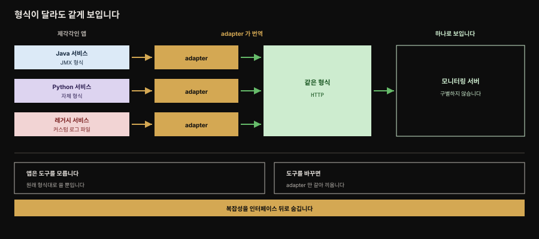
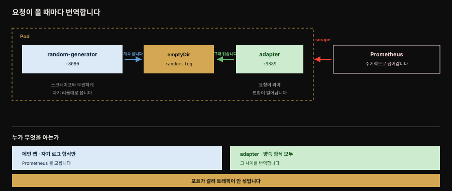

# Adapter — 이질적 시스템을 통일 인터페이스로

> 『Kubernetes Patterns』 17장 정독. **Adapter**는 이질적인 컨테이너 시스템을 외부가 소비할 수 있는 일관되고 표준화·정규화된 형식으로 맞추는 패턴입니다. Sidecar(16장)의 특화로 그 성질을 모두 물려받되, 앱에 대한 adapted access를 제공하는 단일 목적을 갖습니다. 뒤이어 오는 Ambassador(18장)와 짝을 이루는 두 사이드카 변형 중 inbound 쪽입니다.



책의 Figure 17-1이 보이는 구도입니다. 왼쪽 세 서비스는 색이 다 다릅니다. Java는 JMX로, Python은 자체 형식으로, 레거시는 커스텀 로그 파일로 각자 다르게 말합니다.

가운데 adapter들이 그것을 하나의 형식으로 번역하면, 오른쪽 모니터링 서버에는 셋이 **구별되지 않습니다.** 이 수렴이 이 패턴의 전부입니다. 아래 두 상자가 그 대가로 얻는 것인데, 앱은 모니터링 도구를 모른 채로 남고 도구를 바꿔도 adapter만 갈아 끼우면 됩니다.


## 핵심 요약

> 컨테이너는 서로 다른 라이브러리·언어로 쓰인 앱을 통일된 방식으로 패키징·실행하게 합니다. 여러 팀이 다른 기술로 이질적 컴포넌트의 분산 시스템을 만드는 것이 흔한데, 이 이질성은 다른 시스템이 모든 컴포넌트를 통일된 방식으로 다뤄야 할 때 어려움이 됩니다. Adapter는 시스템의 복잡성을 숨기고 통일된 접근을 제공해 이를 풉니다.

대표 예는 **모니터링**입니다. 언어마다 메트릭 노출 형식이 다르면 단일 모니터링 도구가 통일된 뷰를 얻기 어렵습니다. Adapter는 각 앱 컨테이너의 메트릭을 하나의 표준 형식·프로토콜로 내보내 이를 해결합니다 — Java 메트릭을 HTTP로 노출하는 adapter, Python 메트릭을 HTTP로 노출하는 또 다른 adapter를 두면, 모니터링 도구에는 모두 공통 정규 형식의 HTTP로 보입니다.

구체적인 예를 보면 이렇습니다. random-generator 앱이 난수 생성에 걸린 시간을 커스텀 로그 파일에 기록하면, adapter 컨테이너가 `emptyDir` 볼륨으로 그 로그를 읽어 작은 HTTP 서버를 통해 Prometheus 형식으로 내보냅니다. **메인 앱은 Prometheus를 전혀 몰라도 됩니다.**

로깅 정규화에도 같은 패턴을 씁니다. 제각각인 로그 형식을 다듬고 Self Awareness 패턴으로 컨텍스트를 보강해 중앙 수집기에 넘깁니다. Adapter는 이질적 시스템의 복잡성을 통일 인터페이스 뒤로 숨기는 **reverse proxy**로 동작합니다.


## 학습 목표

> 이 편을 읽고 나면 다음을 설명할 수 있습니다.

- Adapter가 이질적 시스템을 통일 인터페이스로 맞추는 목적을 설명합니다.
- 모니터링 예에서 adapter가 커스텀 로그를 Prometheus 형식으로 바꾸는 흐름을 압니다.
- 메인 앱이 모니터링 도구를 모른 채로 남는 것이 왜 이득인지 설명합니다.
- Adapter가 Sidecar의 특화이며 reverse proxy로 동작한다는 점을 압니다.
- Adapter와 Ambassador가 방향에서 어떻게 대칭인지 구분합니다.


## 본문 정리

### 문제 — 이질성이 통일된 소비를 막는다

컨테이너는 다른 라이브러리·언어로 쓰인 앱을 통일된 방식으로 패키징·실행하게 합니다. 오늘날 여러 팀이 서로 다른 기술을 써서 이질적 컴포넌트로 이뤄진 분산 시스템을 만드는 것이 흔합니다. 이 이질성은 모든 컴포넌트가 다른 시스템에 의해 통일된 방식으로 다뤄져야 할 때 어려움을 낳습니다. Adapter는 시스템의 복잡성을 숨기고 통일된 접근을 제공해 이 문제를 풉니다.

### 해법 — 모니터링 예

분산 시스템을 성공적으로 운영·지원하는 주요 전제는 상세한 모니터링과 알림입니다. 여러 서비스로 이뤄진 분산 시스템을 모니터링하려면 외부 도구가 모든 서비스에서 메트릭을 폴링해 기록하려 할 것입니다.

하지만 다른 언어로 쓰인 서비스는 같은 능력이 없고 모니터링 도구가 기대하는 같은 형식으로 메트릭을 노출하지 못할 수 있습니다. 전체 시스템의 통일된 뷰를 기대하는 단일 모니터링 솔루션으로 이런 이질적 앱을 모니터링하는 것은 도전입니다. Adapter로는 다양한 앱 컨테이너의 메트릭을 하나의 표준 형식·프로토콜로 내보내 통일된 모니터링 인터페이스를 제공할 수 있습니다. adapter 컨테이너가 로컬에 저장된 메트릭 정보를 모니터링 서버가 이해하는 외부 형식으로 번역합니다.

이 접근에서는 Pod로 표현된 각 서비스가 메인 앱 컨테이너 외에, 커스텀 앱별 메트릭을 읽어 모니터링 도구가 이해하는 일반 형식으로 노출할 줄 아는 또 다른 컨테이너를 갖습니다. Java 기반 메트릭을 HTTP로 내보내는 adapter 하나와, 다른 Pod에서 Python 기반 메트릭을 HTTP로 노출하는 또 다른 adapter를 둘 수 있습니다. 모니터링 도구에는 모든 메트릭이 HTTP로, 공통 정규 형식으로 보입니다.

### 구체적 구현 — Prometheus exporter

random-generator 앱에 adapter를 더해 봅니다. 앱은 적절히 설정되면 난수 생성기와 그 생성에 걸린 시간을 담은 로그 파일을 씁니다. 이 시간을 Prometheus로 모니터링하고 싶은데, 로그 형식이 Prometheus가 기대하는 형식과 맞지 않고 Prometheus 서버가 값을 scrape할 수 있도록 HTTP 엔드포인트로 이 정보를 제공해야 합니다.

이 용도에 adapter가 완벽히 맞습니다. 사이드카 컨테이너가 작은 HTTP 서버를 띄우고, 요청이 올 때마다 커스텀 로그 파일을 읽어 Prometheus가 이해하는 형식으로 변환하면 됩니다.

```yaml
apiVersion: apps/v1
kind: Deployment
metadata:
  name: random-generator
spec:
  replicas: 1
  selector:
    matchLabels:
      app: random-generator
  template:
    metadata:
      labels:
        app: random-generator
    spec:
      containers:
      - image: k8spatterns/random-generator:1.0
        name: random-generator          # 난수 생성 서비스를 8080 에 노출하는 메인 앱
        env:
        - name: LOG_FILE
          value: /logs/random.log       # 생성 시간 정보가 쌓이는 로그 파일
        ports:
        - containerPort: 8080
          protocol: TCP
        volumeMounts:
        - mountPath: /logs
          name: log-volume              # adapter 와 공유하는 디렉터리
      - image: k8spatterns/random-generator-exporter
        name: prometheus-adapter        # 9889 로 내보내는 Prometheus exporter
        env:
        - name: LOG_FILE
          value: /logs/random.log       # 메인 앱이 쓰는 바로 그 파일을 읽습니다
        ports:
        - containerPort: 9889
          protocol: TCP
        volumeMounts:
        - mountPath: /logs
          name: log-volume              # 같은 볼륨을 adapter 에도 마운트
      volumes:
      - name: log-volume
        emptyDir: {}                    # 노드 파일시스템을 통해 파일을 공유합니다
```



읽는 순서는 이렇습니다. 메인 앱이 `/logs/random.log`에 타이밍 정보를 남기면, `prometheus-adapter`가 **같은 파일**을 읽어 9889 포트로 Prometheus 형식을 내놓습니다. 둘을 잇는 것은 `log-volume`이라는 `emptyDir` 하나뿐입니다.

그림에서 눈여겨볼 것은 **두 동작의 리듬이 다르다**는 점입니다. 앱은 스크레이프와 무관하게 자기 리듬대로 로그를 쓰고, 변환은 Prometheus가 요청을 보낸 **그 순간에** 일어납니다. 미리 변환해 두는 것이 아닙니다. 포트도 8080과 9889로 갈려 서비스 트래픽과 메트릭 수집이 섞이지 않습니다.

이 구성의 값어치는 **메인 앱이 Prometheus를 전혀 모르는 채로** 남는다는 데 있습니다. 앱은 자기 형식대로 로그를 쓸 뿐이고, 모니터링 도구에 맞추는 일은 전적으로 adapter가 집니다.

### 또 다른 활용 — 로깅 정규화

이 패턴의 또 다른 쓰임은 로깅입니다. 컨테이너마다 다른 형식·상세도로 로그를 남길 수 있는데, adapter가 그 정보를 정규화하고 정제하며 Self Awareness 패턴(14장)으로 컨텍스트 정보를 보강한 뒤, 중앙 로그 수집기가 가져갈 수 있게 만듭니다.

### 논의 — Sidecar의 특화

Adapter는 16장 Sidecar 패턴의 특화입니다. 이질적 시스템에 대한 **reverse proxy**로서, 그 복잡성을 통일된 인터페이스 뒤로 숨깁니다. 일반적인 Sidecar와 다른 별개의 이름을 씀으로써 이 패턴의 목적을 더 정확히 전달합니다. 다음 장의 Ambassador는 반대 방향 — 바깥세상으로의 프록시입니다.


## 심화 학습

### Spring Boot Actuator가 있으면 Adapter가 덜 필요한 이유 (Spring 관점)

Adapter의 모니터링 예는 앱이 **Prometheus 형식을 스스로 노출하지 못할 때** 빛납니다. Spring Boot 진영에서는 이 문제가 상당 부분 앱 내부에서 해결됩니다 — Spring Boot Actuator + Micrometer의 `micrometer-registry-prometheus`를 넣으면 앱이 직접 `/actuator/prometheus` 엔드포인트로 Prometheus 형식 메트릭을 노출합니다. 이 경우 별도 adapter 컨테이너가 필요 없습니다.

그러면 Adapter는 언제 쓸까요. **Micrometer를 넣을 수 없는 앱**을 모니터링할 때입니다. 소스를 고칠 수 없는 서드파티 바이너리, 손대기 어려운 레거시 시스템, 다른 언어로 쓰여 Prometheus 클라이언트가 없는 컴포넌트가 여기 해당합니다.

이때 exporter를 adapter 사이드카로 붙이면 앱을 건드리지 않고 Prometheus 생태계에 편입할 수 있습니다. Node Exporter, JMX Exporter, Redis Exporter 같은 공식·커뮤니티 exporter들이 정확히 이 Adapter 패턴의 구현체입니다.

> 참고: Spring Boot의 [Prometheus 노출](https://docs.spring.io/spring-boot/reference/actuator/metrics.html#actuator.metrics.export.prometheus)은 앱 내장 방식이고 [Prometheus exporter 목록](https://prometheus.io/docs/instrumenting/exporters/)은 Adapter 사이드카 방식입니다(둘 다 책 범위 밖 참고).

### reverse proxy로서의 Adapter — 방향의 의미

Adapter가 "reverse proxy"라 불리는 것은 방향 때문입니다. 이 표현은 **원서가 직접 쓰는 말**입니다. 일반적인 forward proxy는 클라이언트를 대신해 **나가는** 요청을 다루지만, reverse proxy는 서버 앞에 서서 **들어오는** 요청을 받아 뒤의 이질적 백엔드로 중계합니다.

Adapter도 마찬가지입니다. 모니터링 서버나 로그 수집기 같은 외부 소비자의 요청을 받아, 뒤에 있는 앱별 형식을 통일 형식으로 바꿔 응답합니다. 그래서 **inbound** 입니다.

이 방향이 다음 장 Ambassador와 정확히 대칭입니다. Ambassador는 **outbound** 로, 앱이 바깥으로 나가는 요청을 프록시합니다. 두 패턴을 방향이라는 같은 축에 놓고 외우면 헷갈리지 않습니다.

> 한 가지 짚어 둘 것이 있습니다. 원서는 Adapter를 **"reverse proxy"라고 직접 부르지만**, Ambassador에 대해서는 "바깥세상으로의 프록시"·"smart proxy"라고만 하고 **forward proxy라는 표현은 쓰지 않습니다.** 아래로 이어지는 forward/reverse 대칭은 두 패턴을 한 축으로 묶어 기억하려고 이 노트가 붙인 정리이니, 절반은 저자의 말이고 절반은 해석이라는 점을 구분해 두면 좋습니다.


## 능동 회상

> 먼저 스스로 답해 본 뒤 아래 정답 절에서 맞춰 봅니다. 정답은 이 절 다음에 번호 순서대로 있습니다.

1. Adapter 패턴을 한 문장으로 정의해 보세요.
2. Adapter 는 어느 패턴의 특화이며 무엇을 물려받나요? 무엇이 다른가요?
3. 컨테이너가 푸는 문제와 그것이 오히려 만드는 문제는 각각 무엇인가요?
4. 분산 시스템을 운영·지원하는 주요 전제로 원서가 드는 것은 무엇인가요?
5. 여러 언어로 쓰인 서비스를 하나의 모니터링 도구로 보려 할 때 생기는 어려움은 무엇인가요?
6. Adapter 는 그 어려움을 어떻게 푸나요?
7. Java 서비스와 Python 서비스가 있을 때 각각 어떻게 처리되나요? 모니터링 도구에는 어떻게 보이나요?
8. random-generator 예제에서 앱은 무엇을 어디에 기록하나요?
9. 그 정보를 Prometheus 로 보려 할 때 걸리는 문제 두 가지는 무엇인가요?
10. adapter 사이드카는 그 문제를 어떻게 해결하나요?
11. 예제에서 메인 앱과 adapter 는 각각 어느 포트를 쓰나요?
12. 두 컨테이너는 무엇을 통해 로그 파일을 공유하나요?
13. 변환은 언제 일어나나요? 미리 해 두나요?
14. 이 구성이 주는 가장 큰 이득은 무엇인가요?
15. Adapter 의 또 다른 활용처는 무엇인가요? 그때 어떤 패턴과 함께 쓰나요?
16. Adapter 가 reverse proxy 라 불리는 이유는 무엇인가요?
17. 원서가 Sidecar 와 다른 별개의 이름을 쓰는 이유는 무엇인가요?
18. Adapter 와 Ambassador 는 어떻게 대칭인가요?
19. Spring Boot 앱에는 왜 Adapter 가 대개 불필요한가요?
20. 그렇다면 Adapter 를 써야 하는 경우는 언제인가요? 실제 구현체의 예를 들어 보세요.


## 정답

> 위 회상 질문의 답입니다. 번호가 대응합니다.

**1.** **이질적인 컨테이너 시스템을 외부가 소비할 수 있는 일관되고 표준화·정규화된 형식에 맞추는** 패턴입니다.

**2.** **Sidecar**(16장)의 특화입니다. Sidecar 의 모든 성질을 물려받되, **앱에 대한 adapted access 를 제공한다는 단일 목적**을 갖는다는 점이 다릅니다.

**3.** 컨테이너는 서로 다른 라이브러리와 언어로 쓰인 앱을 **통일된 방식으로 패키징·실행**하게 해 줍니다. 그런데 여러 팀이 서로 다른 기술을 쓰다 보니 이질적 컴포넌트로 이뤄진 분산 시스템이 흔해졌고, 이 이질성은 **다른 시스템이 모든 컴포넌트를 통일된 방식으로 다뤄야 할 때** 어려움이 됩니다.

**4.** **상세한 모니터링과 알림**을 제공하는 것입니다.

**5.** 다른 언어로 쓰인 서비스는 **같은 능력을 갖지 않고**, 모니터링 도구가 기대하는 **같은 형식으로 메트릭을 노출하지 못할 수 있습니다.** 전체 시스템의 통일된 뷰를 기대하는 단일 솔루션에게 이것은 난제입니다.

**6.** 다양한 앱 컨테이너의 메트릭을 **하나의 표준 형식·프로토콜로 내보내** 통일된 모니터링 인터페이스를 제공합니다. adapter 컨테이너가 로컬에 저장된 메트릭 정보를 모니터링 서버가 이해하는 외부 형식으로 번역합니다.

**7.** Java 기반 메트릭을 HTTP 로 내보내는 adapter 하나를 두고, 다른 Pod 에는 Python 기반 메트릭을 HTTP 로 노출하는 또 다른 adapter 를 둡니다. 모니터링 도구에는 **모든 메트릭이 HTTP 로, 공통 정규 형식으로** 보입니다.

**8.** 난수 생성기와 **그 생성에 걸린 시간**을 담은 로그 파일을 씁니다. 예제에서는 `/logs/random.log` 입니다.

**9.** 첫째, **로그 형식이 Prometheus 가 기대하는 형식과 맞지 않습니다.** 둘째, Prometheus 서버가 값을 scrape 할 수 있도록 **HTTP 엔드포인트로 제공**해야 합니다.

**10.** 사이드카 컨테이너가 **작은 HTTP 서버를 띄우고**, 요청이 올 때마다 커스텀 로그 파일을 읽어 **Prometheus 가 이해하는 형식으로 변환**합니다.

**11.** 메인 앱은 **8080**, adapter 는 **9889** 입니다. 포트가 갈려 있어 서비스 트래픽과 메트릭 수집이 섞이지 않습니다.

**12.** **`emptyDir` 볼륨**(예제의 `log-volume`)입니다. 양쪽 컨테이너가 이 볼륨을 `/logs` 에 마운트해 같은 파일을 봅니다.

**13.** **요청이 올 때마다** 일어납니다. 미리 변환해 두지 않습니다. 반면 메인 앱은 스크레이프와 무관하게 자기 리듬대로 로그를 계속 씁니다.

**14.** **메인 앱이 Prometheus 를 전혀 모르는 채로** 분리된 모니터링이 가능하다는 점입니다. 앱은 자기 형식대로 쓸 뿐이고 도구에 맞추는 일은 adapter 가 전담합니다.

**15.** **로깅**입니다. 컨테이너마다 다른 형식과 상세도로 남긴 로그를 adapter 가 정규화하고 정제하며, **Self Awareness 패턴**(14장)으로 컨텍스트 정보를 보강한 뒤 중앙 로그 수집기가 가져갈 수 있게 만듭니다.

**16.** **방향** 때문입니다. forward proxy 가 클라이언트를 대신해 나가는 요청을 다루는 것과 달리, reverse proxy 는 서버 앞에서 **들어오는 요청**을 받아 뒤의 이질적 백엔드로 중계합니다. Adapter 도 외부 소비자의 요청을 받아 뒤의 앱별 형식을 통일 형식으로 바꿔 응답하므로 inbound 입니다. ("reverse proxy" 는 원서가 직접 쓰는 표현입니다.)

**17.** 일반적인 Sidecar 라는 이름보다 **이 패턴의 목적을 더 정확히 전달**하기 위해서입니다.

**18.** Adapter 는 **inbound** 로 앱의 출력을 외부 소비자에게 통일해 보이고, Ambassador 는 **outbound** 로 앱이 바깥세상에 접근하는 것을 프록시합니다. 방향이라는 같은 축에서 정반대입니다.

**19.** Spring Boot Actuator 와 Micrometer 의 `micrometer-registry-prometheus` 를 넣으면 **앱이 직접 `/actuator/prometheus` 로 Prometheus 형식을 노출**하기 때문입니다. 이 경우 별도 adapter 컨테이너가 필요 없습니다.

**20.** **Micrometer 를 넣을 수 없는 앱**을 모니터링할 때입니다. 소스를 못 고치는 서드파티 바이너리, 레거시 시스템, Prometheus 클라이언트가 없는 다른 언어의 컴포넌트가 그렇습니다. Node Exporter, JMX Exporter, Redis Exporter 같은 공식·커뮤니티 exporter 들이 이 패턴의 실제 구현체입니다.


## 실무 적용

- **소스를 못 고치는 앱의 메트릭을 표준화할 때 Adapter를 씁니다.** 서드파티·레거시·타 언어 컴포넌트에 exporter 사이드카를 붙여 Prometheus 형식으로 노출합니다.
- **Spring 앱은 Actuator + Micrometer로 앱 내장 노출을 우선합니다.** 앱을 고칠 수 있으면 별도 adapter 없이 `/actuator/prometheus`로 직접 노출하는 편이 단순합니다.
- **메인 앱이 모니터링 도구를 모르게 유지합니다.** adapter가 형식 변환을 전담해 메인 앱은 비즈니스 로직·자기 로그 형식에만 집중합니다.
- **공유 데이터는 emptyDir 볼륨으로 넘깁니다.** 메인이 쓴 로그를 adapter가 읽도록 같은 볼륨을 양쪽에 마운트합니다.
- **로그 정규화에도 Adapter를 씁니다.** 형식·상세도가 제각각인 로그를 정규화·정제하고 Self Awareness로 컨텍스트를 보강해 중앙 수집기에 넘깁니다.


## 체크리스트

- [ ] 모니터링·로깅 대상 앱이 표준 형식을 스스로 노출하지 못하는가?(그렇다면 Adapter 후보)
- [ ] 앱을 고칠 수 있다면 Actuator/Micrometer 같은 앱 내장 노출을 먼저 고려했는가?
- [ ] adapter가 형식 변환을 전담해 메인 앱이 모니터링 도구를 모르는가?
- [ ] 메인과 adapter가 공유 데이터를 emptyDir 볼륨으로 주고받는가?
- [ ] 여러 이질적 서비스가 adapter를 거쳐 공통 정규 형식으로 보이는가?
- [ ] 로그 정규화라면 Self Awareness로 컨텍스트를 보강했는가?


## 면접 관점

- **Adapter 패턴이 무엇입니까?** — 이질적인 컨테이너 시스템을 외부가 소비할 수 있는 일관되고 정규화된 형식으로 맞추는 패턴입니다. Sidecar의 특화로, 앱에 대한 adapted access를 제공하는 단일 목적을 갖습니다.
- **모니터링에서 Adapter는 어떻게 동작합니까?** — adapter 사이드카가 앱의 커스텀 메트릭·로그를 읽어 모니터링 도구가 이해하는 표준 형식(예: Prometheus)으로 HTTP 엔드포인트에 노출합니다. 메인 앱은 모니터링 도구를 전혀 모른 채로 남습니다.
- **Adapter와 Sidecar의 관계는?** — Adapter는 Sidecar의 특화입니다. 이질적 시스템의 복잡성을 통일 인터페이스 뒤로 숨기는 reverse proxy로 동작하며 별개 이름을 써서 목적을 더 정확히 전달합니다.
- **Adapter와 Ambassador는 어떻게 다릅니까?** — 방향이 반대입니다. Adapter는 inbound — 앱의 출력을 외부 소비자에게 통일해 보입니다. Ambassador는 outbound — 앱이 외부에 접근하는 것을 프록시합니다.
- **Spring Boot 앱에도 Adapter가 필요합니까?** — 대개 불필요합니다. Actuator + Micrometer로 앱이 직접 Prometheus 형식을 노출하기 때문입니다. Adapter는 소스를 못 고치는 서드파티·레거시·타 언어 컴포넌트에 씁니다.


## 참고 자료

- 《Kubernetes Patterns, Second Edition》 Ch17. Adapter (Bilgin Ibryam·Roland Huß, O'Reilly)
- [Sidecar — Adapter의 부모 패턴](./16-01.Sidecar%20%E2%80%94%20%EA%B8%B0%EC%A1%B4%20%EC%BB%A8%ED%85%8C%EC%9D%B4%EB%84%88%EB%A5%BC%20%EB%B0%94%EA%BE%B8%EC%A7%80%20%EC%95%8A%EA%B3%A0%20%ED%99%95%EC%9E%A5.md)
- [모니터링과 트러블슈팅 개념 노트](../../kubernetes/09_operations/09-01.%EB%AA%A8%EB%8B%88%ED%84%B0%EB%A7%81%EA%B3%BC%20%ED%8A%B8%EB%9F%AC%EB%B8%94%EC%8A%88%ED%8C%85.md)
- [멀티 컨테이너·init·네이티브 사이드카 (Kubernetes in Action)](../kubernetes-in-action/05-03.%EB%A9%80%ED%8B%B0%20%EC%BB%A8%ED%85%8C%EC%9D%B4%EB%84%88%C2%B7init%C2%B7%EB%84%A4%EC%9D%B4%ED%8B%B0%EB%B8%8C%20%EC%82%AC%EC%9D%B4%EB%93%9C%EC%B9%B4%EC%99%80%20%EC%82%AD%EC%A0%9C.md)
- [Prometheus Exporters (공식)](https://prometheus.io/docs/instrumenting/exporters/)
