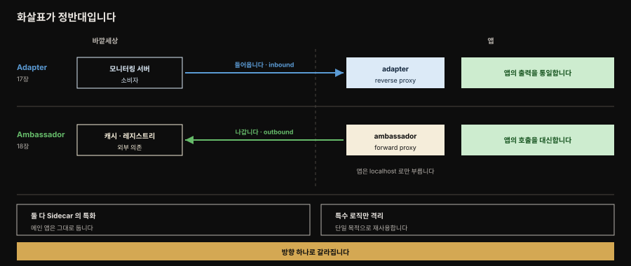
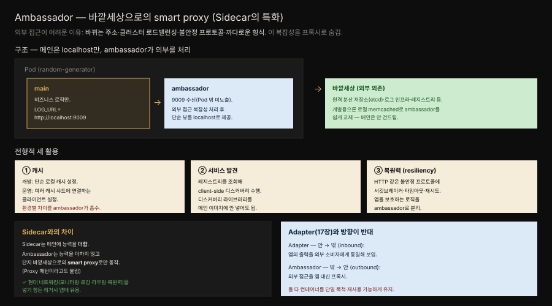

# Ambassador — 바깥세상으로의 smart proxy

> 『Kubernetes Patterns』 18장 정독. **Ambassador**는 외부 복잡성을 숨기고 Pod 밖 서비스에 접근하는 통일된 인터페이스를 제공하는 특화 사이드카입니다. 프록시로 동작해 메인 컨테이너가 외부 의존에 직접 접근하는 것을 분리(decouple)합니다. Sidecar(16장)의 특화이자 Adapter(17장)와 방향이 반대인, 구조 패턴 카테고리를 마무리하는 편입니다.



두 패턴을 한 그림에 겹쳐 두면 이름 혼동이 사라집니다. 가운데 세로선 왼쪽이 바깥세상, 오른쪽이 앱입니다.

위 줄 **Adapter**의 화살표는 바깥에서 앱 쪽으로 **들어옵니다.** 모니터링 서버가 요청하면 어댑터가 앱의 출력을 통일해 응답하는 reverse proxy입니다. 아래 줄 **Ambassador**의 화살표는 앱에서 바깥으로 **나갑니다.** 앱이 캐시나 레지스트리를 부르려 할 때 앰배서더가 그 호출을 대신하는 forward proxy입니다.

기억할 것은 화살표 방향 하나입니다. 나머지는 둘이 같습니다. 어느 쪽이든 Sidecar의 특화이고, 메인 앱은 손대지 않은 채 특수 로직만 별도 컨테이너로 격리합니다.


## 핵심 요약

> 컨테이너화된 서비스는 홀로 존재하지 않고 접근이 까다로운 다른 서비스에 자주 접근해야 합니다. 어려운 이유는 동적으로 바뀌는 주소, 클러스터 인스턴스의 로드밸런싱 필요, 불안정한 프로토콜, 까다로운 데이터 형식 등입니다. 이상적으로 컨테이너는 단일 목적·재사용 가능해야 하는데, 비즈니스 기능을 제공하면서 외부 서비스를 특수한 방식으로 소비하는 컨테이너는 책임이 둘 이상이 됩니다.

외부 서비스 소비에는 컨테이너에 넣고 싶지 않은 특수 디스커버리 라이브러리가 필요하거나, 다른 종류의 디스커버리 방법으로 서비스를 갈아 끼우고 싶을 수 있습니다. 바깥세상의 다른 서비스에 접근하는 로직을 **추상화하고 격리**하는 것이 Ambassador의 목표입니다.

ambassador 컨테이너가 외부 서비스 접근의 복잡성을 숨기고 메인 앱 컨테이너에는 **localhost로 단순한 뷰**를 제공합니다. 원서가 드는 활용은 셋입니다.

| 활용 | 무엇을 흡수하는가 |
|------|----------------|
| **캐시** | 개발에서는 로컬 캐시, 운영에서는 여러 샤드에 연결하는 클라이언트 설정 |
| **서비스 발견** | 레지스트리를 조회하는 client-side 디스커버리 |
| **복원력** | 불안정한 프로토콜에 대비한 서킷브레이커·타임아웃·재시도 |

Sidecar와의 차이는 ambassador가 메인 앱에 능력을 **더하지 않는다**는 점입니다. 단지 바깥세상으로의 **smart proxy**로만 동작해서, 이 패턴을 Proxy 패턴이라고 부르기도 합니다.


## 학습 목표

> 이 편을 읽고 나면 다음을 설명할 수 있습니다.

- Ambassador가 외부 접근의 복잡성을 프록시로 숨기는 목적을 설명합니다.
- 메인 앱이 localhost로 ambassador와 통신하며 외부 의존과 분리되는 구조를 압니다.
- 캐시와 서비스 발견과 복원력, 세 가지 활용을 들 수 있습니다.
- Ambassador가 Sidecar와 달리 능력을 더하지 않고 프록시로만 동작한다는 점을 설명합니다.
- Adapter와 Ambassador가 방향에서 어떻게 대칭인지 구분합니다.


## 본문 정리

### 문제 — 외부 접근이 컨테이너에 두 번째 책임을 준다

컨테이너화된 서비스는 홀로 존재하지 않고 신뢰성 있게 접근하기 어려운 다른 서비스에 자주 접근해야 합니다. 어려움의 원인은 동적으로 바뀌는 주소, 클러스터 서비스 인스턴스의 로드밸런싱 필요, 불안정한 프로토콜, 까다로운 데이터 형식일 수 있습니다. 이상적으로 컨테이너는 단일 목적이고 다른 맥락에서 재사용 가능해야 합니다. 그러나 비즈니스 기능을 제공하면서 외부 서비스를 특수한 방식으로 소비하는 컨테이너는 하나 이상의 책임을 갖게 됩니다.

외부 서비스 소비에는 우리 컨테이너에 넣고 싶지 않은 특수 서비스 디스커버리 라이브러리가 필요할 수 있습니다. 또는 다른 종류의 디스커버리 라이브러리·방법으로 다른 종류의 서비스를 갈아 끼우고 싶을 수 있습니다. 바깥세상의 다른 서비스에 접근하는 로직을 추상화하고 격리하는 이 기법이 Ambassador 패턴의 목표입니다.

### 해법 — localhost 뒤의 ambassador

패턴을 보이기 위해 앱의 캐시를 예로 듭니다. 개발 환경에서 로컬 캐시 접근은 단순한 설정일 수 있지만 운영 환경에서는 캐시의 여러 샤드에 연결할 수 있는 클라이언트 설정이 필요할 수 있습니다. 두 번째 예는 레지스트리에서 조회해 client-side 서비스 디스커버리를 수행하는 서비스 소비입니다. 세 번째 예는 HTTP 같은 불안정 프로토콜로 서비스를 소비하는 것으로, 앱을 보호하려 서킷브레이커 로직·타임아웃·재시도를 써야 합니다.

이 모든 경우에 ambassador 컨테이너가 외부 서비스 접근의 복잡성을 숨기고 메인 앱 컨테이너에 localhost로 단순한 뷰와 접근을 제공합니다.



책의 Figure 18-1과 18-2를 나란히 놓은 것입니다. 위는 운영, 아래는 개발인데 **왼쪽 메인 앱 상자가 두 줄에서 완전히 동일합니다.** 부르는 주소도 똑같은 localhost입니다.

바뀌는 것은 붉은 점선이 가리키는 가운데 하나뿐입니다. 메인 앱은 로컬 포트에서 수신하는 ambassador 컨테이너에 연결할 뿐이고, 그 뒤에서 데이터 접근이 etcd 같은 **완전 분산 원격 저장소**로 위임됩니다. 개발 목적이라면 그 ambassador를 memcached 같은 **로컬 인메모리 저장소**로 쉽게 갈아 끼웁니다.

환경별 차이가 **앱 이미지에도 앱 코드에도 스미지 않는다**는 것이 이 패턴이 파는 값입니다.

Example 18-1은 REST 서비스와 나란히 도는 ambassador입니다. REST 서비스는 응답을 반환하기 전에 생성한 데이터를 고정 URL `http://localhost:9009`로 보내 로깅합니다.

```yaml
apiVersion: v1
kind: Pod
metadata:
  name: random-generator
  labels:
    app: random-generator
spec:
  containers:
  - image: k8spatterns/random-generator:1.0
    name: main                          # 난수를 생성하는 REST 서비스가 메인 앱입니다
    env:
    - name: LOG_URL
      value: http://localhost:9009      # localhost 로 ambassador 와 통신합니다
    ports:
    - containerPort: 8080
      protocol: TCP
  - image: k8spatterns/random-generator-log-ambassador
    name: ambassador                    # 9009 에서 수신 · Pod 밖으로 노출되지 않습니다
```

ambassador 프로세스가 그 포트에서 수신해 데이터를 처리합니다. 이 예에서는 콘솔에 출력만 하지만, 데이터를 완전한 로깅 인프라로 전달하는 더 정교한 일도 할 수 있습니다.

주목할 것은 **REST 서비스가 로그 데이터에 무슨 일이 일어나는지 전혀 상관하지 않는다**는 점입니다. 앱은 `LOG_URL`로 보낼 뿐이고, 그 뒤를 어떻게 처리할지는 ambassador의 몫입니다. 그래서 메인 컨테이너를 건드리지 않고 Pod 정의만 고쳐 ambassador를 갈아 끼울 수 있습니다.

ambassador가 수신하는 9009는 **Pod 밖으로 노출되지 않습니다.** localhost 통신 전용이라 외부에 열 이유가 없습니다.

### 논의 — Sidecar이되 능력을 더하지 않는다

높은 수준에서 Ambassador는 Sidecar 패턴입니다. ambassador와 sidecar의 주된 차이는, ambassador가 메인 앱에 추가 능력을 **더하지 않는다**는 점입니다. 대신 단지 바깥세상으로의 smart proxy로 동작합니다(이 패턴은 때로 Proxy 패턴이라고도 불립니다). 이 패턴은 모니터링·로깅·라우팅·복원력 같은 현대 네트워킹 개념으로 수정·확장하기 어려운 레거시 앱에 유용합니다.

Ambassador의 이점은 Sidecar와 비슷합니다 — 둘 다 컨테이너를 단일 목적·재사용 가능하게 유지합니다. 이 패턴으로 앱 컨테이너는 비즈니스 로직에 집중하고 외부 서비스 소비의 책임과 세부를 다른 특화 컨테이너에 위임할 수 있습니다. 특화되고 재사용 가능한 ambassador 컨테이너를 만들어 다른 앱 컨테이너와 조합할 수도 있습니다.


## 심화 학습

### 서비스 메시가 Ambassador를 플랫폼화한다 (관점 확장)

Ambassador의 세 활용(디스커버리·로드밸런싱·복원력)은 **서비스 메시**가 사이드카 프록시로 플랫폼 차원에서 제공하는 기능과 정확히 겹칩니다. Istio·Linkerd가 각 Pod에 주입하는 Envoy 사이드카는 개별 앱이 직접 만들던 ambassador를 표준화·자동화한 것으로 볼 수 있습니다 — 서킷브레이킹·재시도·타임아웃·mTLS·트래픽 라우팅을 앱 코드 없이 프록시가 처리합니다.

다만 결이 다릅니다. 책의 Ambassador는 **앱마다 손으로 만드는 특화 프록시**입니다. 그 앱만의 캐시 클라이언트이고 그 앱만의 로그 전달자입니다. 반면 서비스 메시는 **모든 앱에 일괄 적용하는 범용 프록시**입니다.

16장에서 본 transparent sidecar가 서비스 메시의 데이터 플레인이고, Ambassador는 그 개념의 앱별 수제 버전인 셈입니다.

그래서 소속도 갈립니다. Envoy는 앱이 모르는 transparent 쪽이지만, 책의 Ambassador 예는 앱이 `LOG_URL=http://localhost:9009`처럼 **ambassador의 존재를 알고 명시적으로 부르는** explicit 쪽에 가깝습니다.

> 참고: [Istio의 사이드카 프록시 아키텍처](https://istio.io/latest/docs/ops/deployment/architecture/)가 Ambassador 개념의 플랫폼 구현입니다(책 범위 밖). 책은 서킷브레이커·타임아웃·재시도를 ambassador가 "직접" 구현하는 것으로 설명하는데, 서비스 메시는 이를 프록시 정책 설정으로 대체합니다.

### Adapter vs Ambassador — 같은 축, 반대 방향

Adapter(17장)와 Ambassador(18장)는 둘 다 Sidecar의 특화지만 방향이 정반대입니다.

| | 방향 | 하는 일 | 프록시 종류 |
|---|------|--------|-----------|
| **Adapter** | inbound | 앱의 출력을 외부 소비자에게 통일된 형식으로 보입니다 | reverse proxy |
| **Ambassador** | outbound | 앱이 외부 의존에 나가는 접근을 대신 처리합니다 | forward proxy |

한 줄로 줄이면 Adapter는 "밖에서 우리를 어떻게 보나"를 다루고, Ambassador는 "우리가 밖을 어떻게 부르나"를 다룹니다. 이 방향 축 하나로 두 패턴을 대칭으로 묶어 두면 이름이 헷갈리지 않습니다.

목표는 둘 다 같습니다. 컨테이너를 단일 목적으로 재사용 가능하게 유지하고, 특수 로직을 별도 컨테이너로 격리하는 것입니다.


## 능동 회상

> 먼저 스스로 답해 본 뒤 아래 정답 절에서 맞춰 봅니다. 정답은 이 절 다음에 번호 순서대로 있습니다.

1. Ambassador 패턴을 한 문장으로 정의해 보세요.
2. 외부 서비스에 신뢰성 있게 접근하기 어려운 이유 네 가지는 무엇인가요?
3. 외부 서비스를 특수한 방식으로 소비하는 컨테이너에 생기는 문제는 무엇인가요?
4. 특수 디스커버리 라이브러리를 메인 컨테이너에 넣고 싶지 않은 이유는 무엇인가요?
5. Ambassador 패턴의 목표를 원서 표현으로 말해 보세요.
6. 원서가 드는 세 가지 활용은 각각 무엇을 흡수하나요?
7. ambassador 는 메인 앱에 무엇을 제공하나요? 어떤 통로를 쓰나요?
8. 운영과 개발에서 캐시 접근이 어떻게 달라지나요? 무엇이 바뀌고 무엇이 그대로인가요?
9. Example 18-1 에서 REST 서비스는 무엇을 어디로 보내나요?
10. 그 데이터를 받은 ambassador 는 무엇을 하나요? 더 정교하게 하면 무엇을 할 수 있나요?
11. REST 서비스는 로그 데이터의 운명에 관심이 있나요? 그것이 무엇을 가능하게 하나요?
12. ambassador 가 수신하는 포트는 Pod 밖으로 노출되나요? 왜 그런가요?
13. Ambassador 와 Sidecar 의 주된 차이는 무엇인가요?
14. Ambassador 를 달리 부르는 이름은 무엇인가요?
15. 이 패턴이 특히 유용한 앱 유형은 무엇인가요? 왜 그런가요?
16. Ambassador 의 이점을 Sidecar 와 견주어 말해 보세요.
17. Adapter 와 Ambassador 는 방향에서 어떻게 갈리나요? 각각 어떤 프록시인가요?
18. 두 패턴의 공통 목표는 무엇인가요?
19. 서비스 메시는 Ambassador 와 어떤 관계인가요? 결이 어떻게 다른가요?
20. 책의 Ambassador 예는 transparent 와 explicit 중 어느 쪽에 가깝나요? 근거는 무엇인가요?


## 정답

> 위 회상 질문의 답입니다. 번호가 대응합니다.

**1.** **외부 복잡성을 숨기고 Pod 밖 서비스에 접근하는 통일된 인터페이스를 제공하는 특화 사이드카**입니다. 프록시로 동작해 메인 컨테이너가 외부 의존에 직접 접근하는 것을 분리합니다.

**2.** **동적으로 바뀌는 주소**, 클러스터로 묶인 서비스 인스턴스의 **로드밸런싱 필요**, **불안정한 프로토콜**, **까다로운 데이터 형식**입니다.

**3.** **책임이 하나를 넘습니다.** 비즈니스 기능도 제공하면서 외부 서비스 소비의 특수한 방식까지 떠안게 되어, 컨테이너가 단일 목적이고 다른 맥락에서 재사용 가능해야 한다는 원칙에서 멀어집니다.

**4.** 그 라이브러리가 **우리 컨테이너에 들어오는 것 자체를 원치 않기** 때문입니다. 또 다른 종류의 디스커버리 라이브러리나 방법으로 **다른 종류의 서비스를 갈아 끼우고 싶을** 수도 있습니다.

**5.** **바깥세상의 다른 서비스에 접근하는 로직을 추상화하고 격리하는 것**입니다.

**6.** **캐시**는 개발의 단순 설정과 운영의 여러 샤드 연결이라는 환경 차이를 흡수합니다. **서비스 발견**은 레지스트리 조회로 수행하는 client-side 디스커버리를 흡수합니다. **복원력**은 HTTP 같은 불안정 프로토콜에 대비한 서킷브레이커·타임아웃·재시도를 흡수합니다.

**7.** 외부 서비스 접근의 복잡성을 숨긴 **단순한 뷰와 접근**을 제공합니다. 통로는 **localhost** 입니다. 메인 앱은 로컬 포트로만 부르면 됩니다.

**8.** 운영에서는 ambassador 가 etcd 같은 **완전 분산 원격 저장소**로 위임합니다. 개발에서는 memcached 같은 **로컬 인메모리 저장소**를 씁니다.

**바뀌는 것은 ambassador 컨테이너뿐**입니다. 메인 앱 컨테이너와 그것이 부르는 localhost 주소는 두 환경에서 똑같습니다.

**9.** 응답을 반환하기 **전에** 생성한 데이터를 고정 URL **`http://localhost:9009`** 로 보내 로깅합니다.

**10.** 이 예에서는 **콘솔에 출력만** 합니다. 더 정교하게 만들면 데이터를 **완전한 로깅 인프라로 전달**할 수도 있습니다.

**11.** **관심이 없습니다.** 로그 데이터에 무슨 일이 일어나는지 REST 서비스에는 상관없습니다. 그래서 **메인 컨테이너를 건드리지 않고 Pod 정의만 재구성해** ambassador 를 쉽게 교체할 수 있습니다.

**12.** **노출되지 않습니다.** localhost 통신 전용이라 Pod 밖에 열 이유가 없습니다.

**13.** ambassador 는 메인 앱에 **추가 능력을 더하지 않는다**는 점입니다. Sidecar 가 기능을 확장·강화하는 것과 달리, ambassador 는 단지 바깥세상으로의 **smart proxy** 로만 동작합니다.

**14.** **Proxy 패턴**이라고도 불립니다.

**15.** **레거시 앱**입니다. 모니터링·로깅·라우팅·복원력 같은 현대 네트워킹 개념으로 **수정하거나 확장하기 어려운** 앱 앞에 ambassador 를 두면, 앱을 고치지 않고 그 능력을 붙일 수 있습니다.

**16.** Sidecar 와 비슷합니다. 둘 다 컨테이너를 **단일 목적으로 재사용 가능하게** 유지합니다. 앱 컨테이너는 비즈니스 로직에 집중하고 외부 서비스 소비의 책임과 세부는 특화 컨테이너에 위임하며, 그 ambassador 를 다른 앱 컨테이너와 조합해 재사용할 수도 있습니다.

**17.** **Adapter 는 inbound** 로, 앱의 출력을 외부 소비자에게 통일된 형식으로 보이는 **reverse proxy** 입니다. **Ambassador 는 outbound** 로, 앱이 외부 의존에 나가는 접근을 대신 처리하는 **forward proxy** 입니다. 한 줄로 줄이면 Adapter 는 "밖에서 우리를 어떻게 보나", Ambassador 는 "우리가 밖을 어떻게 부르나" 입니다.

**18.** 컨테이너를 **단일 목적으로 재사용 가능하게 유지**하고 **특수 로직을 별도 컨테이너로 격리**하는 것입니다. 둘 다 Sidecar 의 특화입니다.

**19.** 서비스 메시는 Ambassador 개념을 **플랫폼화**한 것입니다. Istio·Linkerd 가 각 Pod 에 주입하는 Envoy 사이드카가 서킷브레이킹·재시도·타임아웃·mTLS·트래픽 라우팅을 앱 코드 없이 처리합니다. 결의 차이는 이렇습니다. 책의 Ambassador 는 **앱마다 손으로 만드는 특화 프록시**이고, 서비스 메시는 **모든 앱에 일괄 적용하는 범용 프록시**입니다.

**20.** **explicit 쪽**에 가깝습니다. 앱이 `LOG_URL=http://localhost:9009` 처럼 **ambassador 의 존재를 알고 명시적으로 부르기** 때문입니다. 반면 Envoy 는 앱이 모르는 채 트래픽을 가로채는 transparent 쪽입니다.


## 실무 적용

- **외부 접근 로직을 메인 앱에서 격리할 때 Ambassador를 씁니다.** 캐시 샤딩·디스커버리·복원력 로직을 별도 컨테이너로 빼 앱을 비즈니스 로직에 집중시킵니다.
- **환경별 차이를 ambassador로 흡수합니다.** 개발은 로컬 memcached, 운영은 분산 etcd처럼, 메인을 안 바꾸고 ambassador만 교체합니다.
- **디스커버리 라이브러리를 메인 이미지에 넣지 않습니다.** ambassador가 레지스트리 조회·client-side 디스커버리를 전담합니다.
- **레거시 앱에 현대 네트워킹을 더할 때 유용합니다.** 소스를 못 고치는 앱 앞에 ambassador를 두어 모니터링·라우팅·복원력을 붙입니다.
- **범용 정책이면 서비스 메시를 고려합니다.** 서킷브레이커·재시도·mTLS를 앱마다 손으로 만들 게 아니라 모든 앱에 일괄 적용하려면 Istio/Linkerd가 이 패턴을 플랫폼화합니다.
- **ambassador 포트는 Pod 밖으로 노출하지 않습니다.** localhost 통신용이므로 외부에 열 필요가 없습니다.


## 체크리스트

- [ ] 외부 접근 복잡성(주소 변경·로드밸런싱·불안정 프로토콜·형식)을 메인 앱에서 격리했는가?
- [ ] 메인 앱이 ambassador와 localhost로 통신하는가?
- [ ] 환경별 차이(개발/운영)를 ambassador 교체로 흡수하는가?
- [ ] 디스커버리·복원력 라이브러리를 메인 이미지에서 빼 ambassador에 두었는가?
- [ ] ambassador 수신 포트가 Pod 밖으로 노출되지 않는가?
- [ ] 범용·전사 정책이라면 서비스 메시가 더 맞지 않은지 검토했는가?


## 면접 관점

- **Ambassador 패턴이 무엇입니까?** — 외부 접근 복잡성을 숨기고 Pod 밖 서비스에 접근하는 통일된 인터페이스를 제공하는 특화 사이드카입니다. 메인 앱이 localhost로 ambassador와 통신하며 외부 의존과 직접 결합되지 않습니다.
- **Ambassador가 Sidecar와 다른 점은?** — Sidecar는 메인 앱에 능력을 더하지만 Ambassador는 능력을 더하지 않고 단지 바깥세상으로의 smart proxy로만 동작합니다(Proxy 패턴). 그래서 레거시 앱에 현대 네트워킹을 붙일 때 유용합니다.
- **Ambassador의 대표 활용 셋은?** — 캐시(환경별 샤딩 흡수), 서비스 발견(레지스트리 조회·client-side 디스커버리), 복원력(서킷브레이커·타임아웃·재시도)입니다.
- **Adapter와 Ambassador의 차이는?** — 방향이 반대입니다. Adapter는 inbound로 앱의 출력을 외부에 통일해 보이고 Ambassador는 outbound로 앱의 외부 접근을 프록시합니다. 둘 다 Sidecar의 특화입니다.
- **Ambassador와 서비스 메시의 관계는?** — 서비스 메시(Istio/Linkerd)는 Ambassador 개념을 플랫폼화한 것입니다. 앱마다 손으로 만드는 특화 프록시 대신, 모든 앱에 사이드카 프록시(Envoy)를 일괄 주입해 디스커버리·복원력·mTLS를 앱 코드 없이 제공합니다.


## 참고 자료

- 《Kubernetes Patterns, Second Edition》 Ch18. Ambassador (Bilgin Ibryam·Roland Huß, O'Reilly)
- [Adapter — 방향이 반대인 짝 패턴](./17-01.Adapter%20%E2%80%94%20%EC%9D%B4%EC%A7%88%EC%A0%81%20%EC%8B%9C%EC%8A%A4%ED%85%9C%EC%9D%84%20%ED%86%B5%EC%9D%BC%20%EC%9D%B8%ED%84%B0%ED%8E%98%EC%9D%B4%EC%8A%A4%EB%A1%9C.md)
- [Sidecar — Ambassador의 부모 패턴](./16-01.Sidecar%20%E2%80%94%20%EA%B8%B0%EC%A1%B4%20%EC%BB%A8%ED%85%8C%EC%9D%B4%EB%84%88%EB%A5%BC%20%EB%B0%94%EA%BE%B8%EC%A7%80%20%EC%95%8A%EA%B3%A0%20%ED%99%95%EC%9E%A5.md)
- [Service Discovery — client-side 디스커버리 맥락](./13-01.Service%20Discovery%20%E2%80%94%20%EA%B3%A0%EC%A0%95%20%EC%97%94%EB%93%9C%ED%8F%AC%EC%9D%B8%ED%8A%B8%EB%A1%9C%20%EB%8F%99%EC%A0%81%20Pod%EB%A5%BC%20%EC%B0%BE%EA%B8%B0.md)
- [Istio 사이드카 아키텍처 (공식)](https://istio.io/latest/docs/ops/deployment/architecture/)
