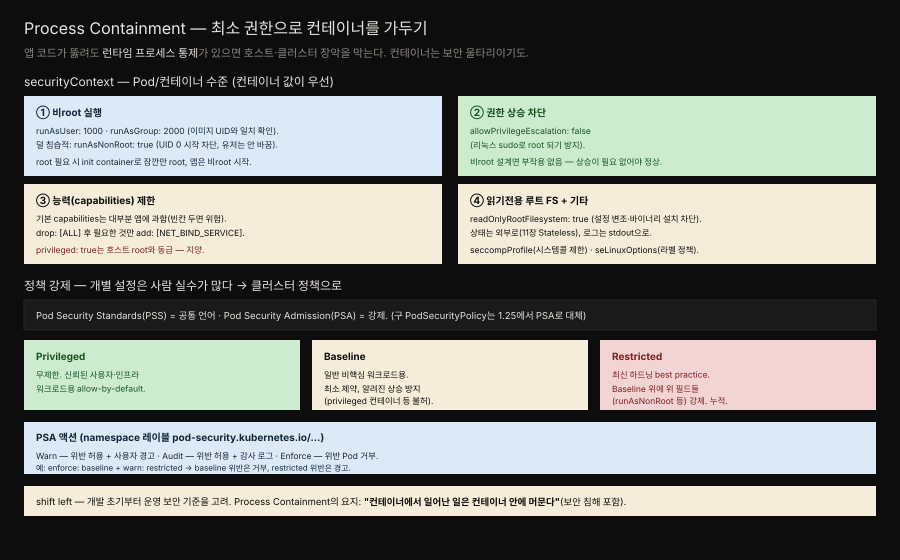

# 23장 · Process Containment — 최소 권한으로 컨테이너를 가두기

> Security 카테고리의 첫 패턴입니다. 컨테이너 안에서 도는 프로세스를 실행에 꼭 필요한 최소 권한으로 묶어, 코드가 뚫려도 피해가 컨테이너 경계를 넘지 못하게 합니다.




## 핵심 요약

> Process Containment는 최소 권한 원칙(least privilege)을 컨테이너 런타임에 적용하는 패턴입니다.

애플리케이션 코드는 언제든 뚫릴 수 있습니다. 의존 라이브러리의 취약점, 역직렬화 버그, 주입 공격 — 완벽히 막을 방법은 없습니다. 그렇다면 방어의 무게 중심은 "뚫리지 않기"가 아니라 "뚫려도 번지지 않기"로 옮겨가야 합니다. 컨테이너는 격리 단위이자 보안 울타리이기도 한데, 기본 설정만으로는 그 울타리가 낮습니다. root로 도는 프로세스, 무제한 리눅스 capabilities, 쓰기 가능한 루트 파일시스템 — 이런 기본값 위에서 앱이 뚫리면 공격자는 컨테이너를 발판 삼아 호스트 노드, 나아가 클러스터 전체로 이동할 수 있습니다.

Process Containment는 `securityContext`로 이 권한을 하나씩 깎아내립니다. 비root로 실행하고 권한 상승을 막고 능력을 최소한만 남기고 루트 파일시스템을 읽기 전용으로 만듭니다. 그리고 개별 설정은 사람이 빠뜨리기 쉬우므로, 클러스터 관리자가 Pod Security Standards와 Pod Security Admission으로 namespace 단위에서 강제합니다.


## 학습 목표

> 이 장을 읽고 나면 다음을 설명할 수 있어야 합니다.

- `securityContext`의 주요 필드(`runAsNonRoot`, `allowPrivilegeEscalation`, `capabilities`, `readOnlyRootFilesystem`)가 각각 무엇을 막는지 설명할 수 있습니다.
- 개별 Pod 설정과 클러스터 정책(PSS/PSA)의 역할 분담을 구분할 수 있습니다.
- Pod Security Standards의 세 프로필(Privileged/Baseline/Restricted)이 누적 관계임을 이해합니다.
- Pod Security Admission의 세 액션(enforce/warn/audit)이 어떻게 조합되는지 압니다.
- Spring 앱을 비root 컨테이너로 안전하게 실행하는 설정을 작성할 수 있습니다.


## 본문 정리

### 문제 — 컨테이너는 기본적으로 권한이 과하다

컨테이너 런타임의 기본값은 편의를 위해 관대합니다. 많은 이미지가 root(UID 0)로 프로세스를 시작하고 리눅스 커널이 프로세스에 부여하는 capabilities도 앱에 필요한 것보다 훨씬 넓습니다. 문제는 이 관대함이 공격 표면이 된다는 점입니다. 앱이 원격 코드 실행에 노출되면, root 권한과 넓은 capabilities를 그대로 물려받은 공격자가 컨테이너 밖으로 나가려 시도할 수 있습니다.

책은 이 지점을 분명히 합니다. 컨테이너 격리는 완전한 방어벽이 아니라 여러 겹 중 한 겹일 뿐이고 그 한 겹을 두껍게 만드는 일이 Process Containment입니다. 요지는 한 문장으로 압축됩니다 — "컨테이너에서 일어난 일은 컨테이너 안에 머물러야 한다", 보안 침해까지 포함해서.

### 해결 — securityContext로 권한을 깎는다

`securityContext`는 Pod 수준과 컨테이너 수준 양쪽에 지정할 수 있고 겹치면 컨테이너 수준 값이 우선합니다. 주요 필드는 네 갈래입니다.

**비root 실행.** `runAsUser`와 `runAsGroup`으로 특정 UID/GID를 지정하되, 이미지가 그 UID에서 동작하도록 만들어졌는지 확인해야 합니다. 더 간편하고 덜 침습적인 방법은 `runAsNonRoot: true`입니다. 이 설정은 유저 ID를 바꾸지는 않지만 컨테이너가 UID 0으로 시작하려 하면 아예 실행을 거부합니다. 만약 초기화 과정에서 잠깐 root가 필요하다면, init container에서만 root로 준비 작업을 하고(15장 Init Container) 앱 컨테이너는 비root로 시작하는 조합이 정석입니다.

**권한 상승 차단.** `allowPrivilegeEscalation: false`는 컨테이너 안 프로세스가 리눅스의 setuid 같은 메커니즘으로 자신보다 높은 권한을 얻는 것을 막습니다. 애초에 비root로 설계했다면 권한 상승이 필요할 일이 없으므로, 이 설정은 부작용 없이 방어선을 하나 더 세웁니다.

**능력(capabilities) 제한.** 리눅스는 root의 권한을 여러 capability로 쪼개 놓았습니다. 컨테이너 런타임이 기본으로 부여하는 capability 집합은 대부분의 앱에게 과합니다. 정석은 `drop: [ALL]`로 전부 떨군 뒤, 정말 필요한 것만 `add`로 되돌리는 것입니다. 예를 들어 1024 미만 포트에 바인딩해야 하면 `NET_BIND_SERVICE`만 더합니다. 반대편 극단인 `privileged: true`는 컨테이너를 사실상 호스트 root와 동급으로 만들어 격리를 통째로 무력화하므로 지양해야 합니다.

**읽기 전용 루트 파일시스템.** `readOnlyRootFilesystem: true`는 컨테이너의 루트 파일시스템에 쓰기를 막습니다. 공격자가 설정을 변조하거나 악성 바이너리를 설치하지 못하게 하는 강력한 방어입니다. 앱이 정말 써야 하는 임시 경로만 `emptyDir` 볼륨으로 따로 마운트하면 됩니다. 여기에 어울리는 설계가 상태를 컨테이너 밖으로 빼는 것(11장 Stateless)이고 로그는 파일 대신 stdout으로 흘리면 파일시스템에 쓸 이유 자체가 줄어듭니다. 이 밖에 `seccompProfile`(허용 시스템콜을 제한)과 `seLinuxOptions`(SELinux 라벨 정책)로 더 조일 수 있습니다.

### 정책 강제 — 개별 설정을 사람에게 맡기지 않는다

`securityContext` 필드를 매니페스트마다 손으로 채우는 방식은 사람 실수에 취약합니다. 한 팀이 빠뜨리면 그 Pod가 곧 약한 고리가 됩니다. 그래서 클러스터 관리자는 이 기준을 정책으로 끌어올립니다.

**Pod Security Standards(PSS)**는 세 개의 프로필로 이루어진 공통 언어입니다. 세 프로필은 누적 관계입니다. **Privileged**는 제약이 사실상 없으며 신뢰된 인프라 워크로드용입니다. **Baseline**은 알려진 권한 상승을 막는 최소한의 제약으로, 일반적인 비핵심 워크로드에 적당합니다. **Restricted**는 최신 하드닝 모범 사례를 강제하며 Baseline 위에 `runAsNonRoot` 같은 앞서 본 필드들을 얹습니다.

**Pod Security Admission(PSA)**은 이 표준을 실제로 강제하는 어드미션 컨트롤러입니다. namespace에 레이블(`pod-security.kubernetes.io/…`)을 붙여 세 가지 액션을 겁니다 — **enforce**는 위반 Pod를 거부하고 **warn**은 허용하되 사용자에게 경고하며 **audit**는 허용하되 감사 로그를 남깁니다. 이 셋은 조합할 수 있어서 예컨대 `enforce: baseline`에 `warn: restricted`를 함께 걸면 Baseline 위반은 거부하면서 Restricted 위반은 경고만 하는 점진적 도입이 가능합니다. 참고로 예전의 PodSecurityPolicy는 1.25에서 제거되었고 이 PSS/PSA가 그 자리를 대신합니다.

이 모든 것을 관통하는 태도가 shift left입니다. 보안 기준을 배포 직전이 아니라 개발 초기부터 고려해, 개발자가 처음부터 비root·최소 권한으로 컨테이너를 만들게 하는 것입니다.


## 심화 학습

### Spring 앱을 비root 컨테이너로 — 실전 설정

Spring Boot 앱은 대부분 특권이 필요 없으므로 Process Containment와 잘 맞습니다. 기본 UID 8080 이상 포트를 쓰면 `NET_BIND_SERVICE`조차 필요 없습니다. 전형적인 안전 설정은 다음과 같습니다.

```yaml
spec:
  securityContext:
    runAsNonRoot: true
    runAsUser: 1000
    fsGroup: 1000
  containers:
    - name: app
      image: registry.example.com/order-service:1.4.0
      securityContext:
        allowPrivilegeEscalation: false
        readOnlyRootFilesystem: true
        capabilities:
          drop: ["ALL"]
      volumeMounts:
        - name: tmp
          mountPath: /tmp
  volumes:
    - name: tmp
      emptyDir: {}
```

여기서 한 가지 실무 함정은 `readOnlyRootFilesystem: true`와 JVM의 조합입니다. JVM은 임시 파일을 `/tmp`에 만들고(예: `java.io.tmpdir`), Spring Boot 실행형 JAR도 내장 톰캣이 작업 디렉토리를 쓰려 할 수 있습니다. 루트를 읽기 전용으로 잠그면 이 경로들이 막히므로, 위처럼 `/tmp`를 `emptyDir`로 따로 마운트해줘야 합니다. Buildpacks나 Jib으로 이미지를 만들면 비root 유저가 기본으로 설정되는 경우가 많아 이 패턴을 적용하기 수월합니다. 이미지 하드닝의 공식 안내는 [Docker의 비root 실행 권고](https://docs.docker.com/build/building/best-practices/#user)와 [Spring Boot 컨테이너 이미지 가이드](https://docs.spring.io/spring-boot/reference/packaging/container-images/index.html)를 참고할 수 있습니다.

### securityContext와 PSS의 관계 — 선언과 강제

`securityContext`가 "이 Pod는 이렇게 제한하겠다"는 개별 선언이라면, PSS/PSA는 "이 namespace의 모든 Pod는 최소 이만큼 제한돼야 한다"는 강제입니다. 둘은 경쟁 관계가 아니라 층위가 다릅니다. 개발자는 자기 워크로드에 맞게 `securityContext`를 세밀하게 짜고 플랫폼 팀은 PSA로 최소선을 깝니다. Restricted 프로필을 enforce로 건 namespace라면, `runAsNonRoot`나 capabilities drop을 빠뜨린 Pod는 애초에 생성이 거부됩니다. 개별 선언이 정책의 바닥을 통과하지 못하면 배포 자체가 안 되는 구조입니다. RBAC이 "누가 API로 무엇을 할 수 있나"를 다룬다면(26장 Access Control), Process Containment는 "생성된 Pod의 프로세스가 무엇을 할 수 있나"를 다뤄, 둘이 서로 다른 지점에서 심층 방어를 이룹니다.


## 실무 적용

- **모든 앱 컨테이너에 `runAsNonRoot: true`를 기본으로 답니다.** root가 꼭 필요한 예외만 명시적으로 두고 그 이유를 주석이나 문서로 남깁니다.
- **`securityContext`의 4대 필드를 세트로 적용합니다** — 비root, 권한 상승 차단, capabilities drop ALL, 읽기 전용 루트 FS. 넷을 함께 걸어야 방어가 촘촘해집니다.
- **읽기 전용 루트 FS를 켤 때 필요한 쓰기 경로만 `emptyDir`로 엽니다.** JVM 앱은 최소 `/tmp`를 확인합니다.
- **namespace에 PSA 레이블을 겁니다.** 신규 환경은 처음부터 `enforce: baseline` + `warn: restricted`로 시작해, 점진적으로 Restricted enforce로 올립니다.
- **이미지 빌드 단계에서부터 비root 유저를 설정합니다.** 런타임 설정만 믿지 말고 Dockerfile/Buildpacks에서 `USER`를 지정합니다.


## 체크리스트

- [ ] 앱 컨테이너가 root가 아닌 UID로 실행되는가? (`runAsNonRoot: true`)
- [ ] `allowPrivilegeEscalation: false`가 걸려 있는가?
- [ ] capabilities를 `drop: [ALL]` 후 필요한 것만 add 했는가?
- [ ] `privileged: true`를 쓴 컨테이너가 없는가? 있다면 정당한 이유가 문서화됐는가?
- [ ] 루트 파일시스템이 읽기 전용이고 쓰기 경로만 명시적으로 열려 있는가?
- [ ] namespace에 PSA 레이블(enforce/warn/audit)이 설정돼 있는가?
- [ ] 이미지 빌드 시점에 비root 유저가 지정돼 있는가?


## 면접 관점

**Q. Kubernetes Secret이 아니라 컨테이너 프로세스 자체를 제한하는 게 왜 필요한가요?**
Secret 보호나 네트워크 격리는 특정 자원에 대한 방어이지만 앱 코드가 원격 코드 실행에 뚫리면 공격자는 컨테이너 프로세스의 권한을 그대로 물려받습니다. 이때 프로세스가 root이고 capabilities가 넓으면 공격자는 호스트 노드로 탈출을 시도할 수 있습니다. Process Containment는 이 "뚫린 뒤"의 피해 범위를 컨테이너 안으로 가두는 마지막 겹입니다. 심층 방어에서 각 겹은 서로를 대체하지 않고 보완합니다.

**Q. `runAsUser: 1000`과 `runAsNonRoot: true`의 차이는 무엇인가요?**
`runAsUser: 1000`은 프로세스를 특정 UID로 실행하도록 강제하지만 그 UID가 이미지에 존재하고 필요한 파일 접근 권한을 갖는지 확인해야 하는 부담이 있습니다. `runAsNonRoot: true`는 UID를 바꾸지 않는 대신 UID 0으로 시작하려는 컨테이너를 거부합니다. 이미지가 이미 비root 유저로 만들어졌다면 후자가 덜 침습적이고 실수가 적습니다.

**Q. Pod Security Standards의 세 프로필은 어떤 관계인가요?**
Privileged → Baseline → Restricted 순으로 제약이 강해지는 누적 관계입니다. Baseline은 알려진 권한 상승을 막는 최소선이고 Restricted는 그 위에 `runAsNonRoot`, capabilities drop 같은 하드닝을 더한 것입니다. PSA로 namespace에 enforce/warn/audit를 조합해 걸어, 점진적으로 강한 프로필로 이행할 수 있습니다.


## 참고 자료

- Bilgin Ibryam·Roland Huß, *Kubernetes Patterns, 2nd Edition*, 23장 Process Containment (O'Reilly, 2023)
- [Kubernetes 공식 — Pod Security Standards](https://kubernetes.io/docs/concepts/security/pod-security-standards/)
- [Kubernetes 공식 — Pod Security Admission](https://kubernetes.io/docs/concepts/security/pod-security-admission/)
- [Kubernetes 공식 — securityContext 설정](https://kubernetes.io/docs/tasks/configure-pod-container/security-context/)
- [Spring Boot — 컨테이너 이미지 가이드](https://docs.spring.io/spring-boot/reference/packaging/container-images/index.html)
- 개념 노트: [RBAC과 보안](../../kubernetes/07_security/07-01.RBAC%EA%B3%BC%20%EB%B3%B4%EC%95%88.md)
- 정독 노트: [11장 Stateless Service](./11-01.Stateless%20Service%20%E2%80%94%20%EB%8F%99%EC%9D%BC%C2%B7%EA%B5%90%EC%B2%B4%20%EA%B0%80%EB%8A%A5%ED%95%9C%20replica%EB%A1%9C%20%EC%88%98%ED%8F%89%20%ED%99%95%EC%9E%A5.md) · [15장 Init Container](./15-01.Init%20Container%20%E2%80%94%20%EC%B4%88%EA%B8%B0%ED%99%94%EB%A5%BC%20%EC%95%B1%EA%B3%BC%20%EB%B6%84%EB%A6%AC%ED%95%B4%20%EB%B3%84%EB%8F%84%20%EC%83%9D%EC%95%A0%EC%A3%BC%EA%B8%B0%EB%A1%9C.md) · [24장 Network Segmentation](./24-01.Network%20Segmentation%20%E2%80%94%20%ED%86%B5%EC%8B%A0%EC%9D%84%20%ED%95%84%EC%9A%94%ED%95%9C%20%EA%B2%BD%EB%A1%9C%EB%A7%8C%20%EB%82%A8%EA%B8%B0%EA%B8%B0.md)
