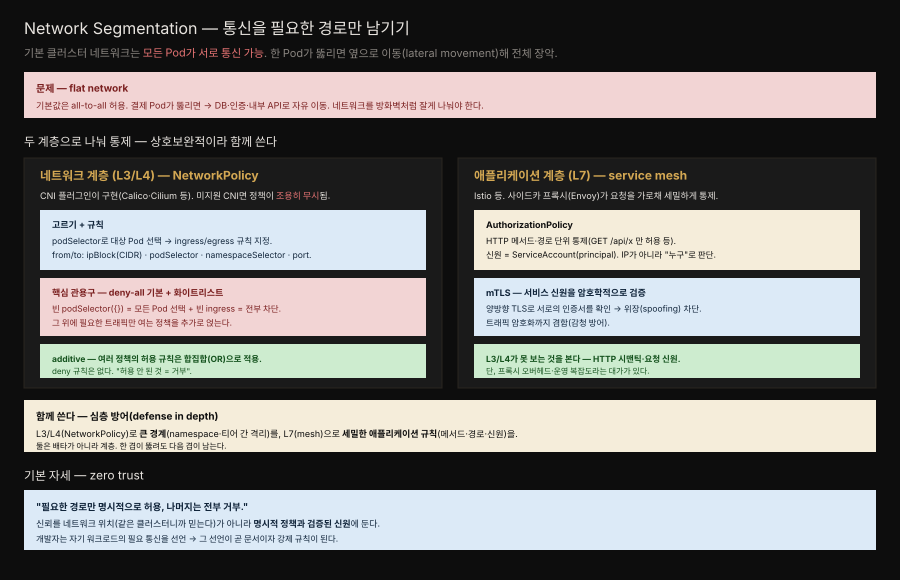

# 24장 · Network Segmentation — 통신을 필요한 경로만 남기기

> flat한 클러스터 네트워크를 방화벽처럼 잘게 나눠, Pod 사이 통신을 정말 필요한 경로만 남기는 패턴입니다. 한 Pod가 뚫려도 공격자가 옆으로 번지지 못하게 막습니다.




## 핵심 요약

> Network Segmentation은 기본이 all-to-all인 클러스터 네트워크에 경계를 세워, 승인된 경로만 통신을 허용하는 패턴입니다.

Kubernetes 클러스터의 기본 네트워크 모델은 평평합니다. 별도 설정이 없으면 어느 Pod든 다른 어느 Pod에나 직접 접속할 수 있습니다. 개발 편의로는 좋지만 보안으로는 위험합니다. 인터넷에 노출된 프론트엔드 Pod 하나가 뚫리면, 공격자는 그 자리에서 데이터베이스·인증 서비스·내부 API로 자유롭게 이동(lateral movement)할 수 있습니다.

Network Segmentation은 이 평면을 두 계층에서 나눕니다. 네트워크 계층(L3/L4)에서는 NetworkPolicy로 IP와 포트 단위 경계를 긋고 애플리케이션 계층(L7)에서는 service mesh(Istio 등)의 AuthorizationPolicy로 HTTP 메서드·경로·서비스 신원 단위의 세밀한 규칙을 겁니다. 두 계층은 배타적이지 않고 서로를 보완하며 함께 쓰여 심층 방어를 이룹니다.


## 학습 목표

> 이 장을 읽고 나면 다음을 설명할 수 있어야 합니다.

- 기본 클러스터 네트워크가 왜 보안상 위험한지(lateral movement) 설명할 수 있습니다.
- NetworkPolicy가 L3/L4에서 무엇을 selector와 규칙으로 통제하는지 압니다.
- deny-all 기본 정책 위에 화이트리스트를 얹는 관용구를 작성할 수 있습니다.
- NetworkPolicy의 additive 성질과 CNI 의존성을 이해합니다.
- service mesh의 L7 통제(AuthorizationPolicy, mTLS)가 NetworkPolicy로 못 하는 것을 어떻게 채우는지 설명할 수 있습니다.


## 본문 정리

### 문제 — flat network는 lateral movement의 통로다

기본 클러스터 네트워크에서 모든 Pod는 서로에게 라우팅 가능합니다. 이 구조에서 단 하나의 Pod가 침해되면 공격자의 시야에 클러스터 전체가 들어옵니다. 결제 Pod가 뚫렸다고 해봅시다. flat network라면 공격자는 그 Pod에서 곧장 데이터베이스에 접속을 시도하고 내부 인증 서비스를 두드리고 다른 팀의 API를 스캔할 수 있습니다. 침해의 시작점 하나가 클러스터 전체 침해로 번지는 것입니다. 방어의 출발점은 네트워크를 방화벽처럼 잘게 나눠, 각 워크로드가 자기 일에 필요한 경로만 갖게 하는 것입니다.

### 해결 (1) — 네트워크 계층 L3/L4: NetworkPolicy

**NetworkPolicy**는 Kubernetes 리소스로, IP 주소와 포트 수준(L3/L4)에서 Pod 간 트래픽을 통제합니다. 한 가지 중요한 전제가 있습니다 — NetworkPolicy는 CNI 플러그인이 실제로 구현합니다. Calico, Cilium 같은 지원 CNI에서는 동작하지만 NetworkPolicy를 지원하지 않는 CNI를 쓰면 정책을 만들어도 **조용히 무시**됩니다. 정책을 걸었다고 안심하기 전에 CNI가 이를 강제하는지 확인해야 합니다.

정책의 골격은 두 부분입니다. `podSelector`로 이 정책을 적용할 대상 Pod를 고르고 `ingress`(들어오는)와 `egress`(나가는) 규칙으로 허용할 트래픽을 지정합니다. 규칙의 출발지/목적지는 `ipBlock`(CIDR), `podSelector`, `namespaceSelector`, 그리고 `port`의 조합으로 표현합니다. 예컨대 "app=backend 라벨을 가진 Pod로 들어오는 트래픽 중, app=frontend 라벨 Pod에서 오는 8080 포트만 허용"처럼 씁니다.

핵심 관용구는 **deny-all 기본 정책 + 화이트리스트**입니다. 빈 `podSelector: {}`는 namespace의 모든 Pod를 선택하고 여기에 빈 `ingress` 규칙을 주면 그 Pod들로 들어오는 모든 트래픽이 차단됩니다. 이렇게 바닥에 "전부 거부"를 깔아둔 뒤, 필요한 통신만 여는 정책을 추가로 얹습니다. 여기서 NetworkPolicy의 성질이 중요합니다 — 정책은 **additive**입니다. deny 규칙은 존재하지 않고 여러 정책의 허용 규칙이 합집합(OR)으로 적용됩니다. 그래서 "허용된 것 외에는 모두 거부"라는 화이트리스트 모델이 자연스럽게 성립합니다.

### 해결 (2) — 애플리케이션 계층 L7: service mesh

NetworkPolicy는 IP와 포트까지만 봅니다. "이 요청이 GET인지 POST인지", "누가 보낸 요청인지"는 알지 못합니다. 이 빈틈을 **service mesh**(Istio 등)가 채웁니다. mesh는 각 Pod 옆에 사이드카 프록시(Envoy)를 붙여(16장 Sidecar) 모든 트래픽을 가로채고 애플리케이션 계층(L7)에서 통제합니다.

**AuthorizationPolicy**는 HTTP 시맨틱 단위로 규칙을 겁니다. "GET /api/orders 만 허용", "특정 ServiceAccount(principal)에서 온 요청만 허용" 같은 규칙이 가능합니다. 판단 기준이 IP가 아니라 "누가"(신원)로 올라가는 것이 L3/L4와의 결정적 차이입니다.

그 신원을 뒷받침하는 것이 **mTLS**(상호 TLS)입니다. mesh는 서비스 간 통신에서 양쪽이 서로의 인증서를 검증하게 만들어, 다른 서비스를 위장(spoofing)하려는 시도를 차단합니다. 덤으로 트래픽이 암호화되므로 클러스터 내부 감청에도 방어가 됩니다. 다만 이 모든 것은 프록시 오버헤드와 운영 복잡도라는 대가를 동반하므로, mesh 도입은 그 비용을 감당할 가치가 있는지 판단한 뒤에 결정합니다.

### 두 계층을 함께 — 심층 방어

두 계층은 선택지가 아니라 층위입니다. NetworkPolicy(L3/L4)로 namespace나 티어 간의 큰 경계를 긋고 service mesh(L7)로 그 안에서 메서드·경로·신원 단위의 세밀한 규칙을 겁니다. 한 겹이 뚫려도 다음 겹이 남는 defense in depth입니다.

이 모두를 관통하는 자세가 zero trust입니다. 신뢰의 근거를 "같은 클러스터에 있으니 믿는다"는 네트워크 위치가 아니라, 명시적으로 선언된 정책과 암호학적으로 검증된 신원에 둡니다. 개발자는 자기 워크로드가 필요로 하는 통신 경로를 선언하고 그 선언 자체가 문서이자 강제 규칙이 됩니다.


## 심화 학습

### NetworkPolicy 예시 — deny-all 후 프론트만 허용

Spring 백엔드가 프론트엔드에서 오는 트래픽만 받게 하는 전형적인 두 정책 조합입니다. 먼저 namespace에 deny-all을 깔고 그 위에 필요한 경로를 엽니다.

```yaml
# ① 기본 거부 — namespace의 모든 Pod로 들어오는 트래픽 차단
apiVersion: networking.k8s.io/v1
kind: NetworkPolicy
metadata:
  name: default-deny-ingress
spec:
  podSelector: {}
  policyTypes: ["Ingress"]
---
# ② 화이트리스트 — backend는 frontend에서 오는 8080만 허용
apiVersion: networking.k8s.io/v1
kind: NetworkPolicy
metadata:
  name: allow-frontend-to-backend
spec:
  podSelector:
    matchLabels:
      app: backend
  policyTypes: ["Ingress"]
  ingress:
    - from:
        - podSelector:
            matchLabels:
              app: frontend
      ports:
        - protocol: TCP
          port: 8080
```

두 정책의 허용 규칙이 합집합으로 적용되므로, backend Pod는 오직 frontend에서 오는 8080만 받고 나머지는 모두 거부됩니다. NetworkPolicy의 정확한 필드 의미는 [Kubernetes 공식 NetworkPolicy 문서](https://kubernetes.io/docs/concepts/services-networking/network-policies/)에서 확인할 수 있습니다.

### Spring 관점 — 경계는 네트워크가, 인가는 앱이

Spring 애플리케이션은 대개 Spring Security로 인증·인가를 처리합니다. 그렇다면 네트워크 세그멘테이션은 왜 또 필요할까요. Spring Security는 애플리케이션에 도달한 요청을 처리하지만 애초에 그 요청이 backend까지 도달하는 것 자체를 막지는 못합니다. NetworkPolicy는 요청이 프로세스에 닿기 전 네트워크 계층에서 차단하므로, 앱 인증 로직에 버그가 있어도 승인되지 않은 발신지는 아예 연결조차 못 합니다.

여기서 두 계층이 각자의 자리를 가집니다. NetworkPolicy와 mesh mTLS가 "어디서 온 누구인가"라는 굵은 경계를, Spring Security가 "이 사용자가 이 리소스에 권한이 있나"라는 애플리케이션 인가를 담당합니다. 서비스 간 신원을 mesh가 mTLS로 보장하면, Spring 앱은 그 신원을 신뢰의 출발점으로 삼아 더 세밀한 도메인 인가에 집중할 수 있습니다. 서비스가 바깥 세계로 나가는 트래픽을 정돈하는 Ambassador 패턴(18장)과 결이 통하는데, 그쪽이 아웃바운드 프록시라면 Network Segmentation은 인바운드·아웃바운드 경로 전체에 대한 정책적 통제입니다.


## 실무 적용

- **각 namespace에 deny-all ingress 정책을 먼저 깝니다.** 화이트리스트는 그 위에 얹습니다 — 바닥이 열려 있으면 정책 하나 빠뜨렸을 때 그대로 뚫립니다.
- **CNI가 NetworkPolicy를 지원하는지 먼저 확인합니다.** 미지원 CNI에서는 정책이 조용히 무시되므로, 실제로 차단되는지 테스트로 검증합니다.
- **egress도 통제합니다.** ingress만 막으면 침해된 Pod가 외부로 데이터를 유출하는 경로가 열려 있습니다.
- **큰 경계는 NetworkPolicy, 세밀한 규칙은 mesh로 나눕니다.** mesh 도입은 프록시 오버헤드를 감안해 판단합니다.
- **정책을 코드로 관리합니다.** NetworkPolicy 매니페스트를 Git에 두면 "누가 누구와 통신하는가"가 곧 리뷰 가능한 문서가 됩니다.


## 체크리스트

- [ ] namespace에 deny-all ingress 기본 정책이 있는가?
- [ ] 각 워크로드의 필요한 통신만 화이트리스트로 열려 있는가?
- [ ] egress 정책으로 나가는 트래픽도 통제하는가?
- [ ] 사용 중인 CNI가 NetworkPolicy를 실제로 강제하는가?
- [ ] L7 통제가 필요한 서비스에 mesh(AuthorizationPolicy/mTLS)가 적용됐는가?
- [ ] 정책 매니페스트가 Git으로 버전 관리되는가?


## 면접 관점

**Q. 기본 Kubernetes 네트워크가 보안상 위험한 이유는 무엇인가요?**
기본 클러스터 네트워크는 flat해서 모든 Pod가 서로 직접 통신할 수 있습니다. 이 구조에서는 인터넷에 노출된 Pod 하나가 침해되면 공격자가 그 자리에서 데이터베이스·내부 API 등으로 자유롭게 이동(lateral movement)할 수 있습니다. 침해의 시작점 하나가 클러스터 전체 침해로 번지므로, 네트워크를 세그먼트로 나눠 각 워크로드가 필요한 경로만 갖게 해야 합니다.

**Q. NetworkPolicy의 deny-all 관용구는 어떻게 만드나요?**
빈 `podSelector: {}`로 namespace의 모든 Pod를 선택하고 빈 `ingress` 규칙을 주면 그 Pod들로 들어오는 모든 트래픽이 차단됩니다. NetworkPolicy는 additive라 deny 규칙이 없고 허용 규칙만 합집합으로 쌓이므로, 바닥에 deny-all을 깔고 그 위에 필요한 통신만 여는 화이트리스트 모델이 성립합니다.

**Q. NetworkPolicy와 service mesh의 AuthorizationPolicy는 무엇이 다른가요?**
NetworkPolicy는 L3/L4에서 IP와 포트 단위로 통제하고 CNI가 구현합니다. AuthorizationPolicy는 mesh의 사이드카 프록시가 L7에서 HTTP 메서드·경로, 그리고 ServiceAccount 신원 단위로 통제하며 mTLS로 신원을 검증합니다. 판단 기준이 IP에서 "누구"로 올라간다는 것이 핵심 차이입니다. 둘은 배타적이 아니라 상호보완적이라, 큰 경계는 NetworkPolicy로 세밀한 규칙은 mesh로 나눠 심층 방어를 이룹니다.


## 참고 자료

- Bilgin Ibryam·Roland Huß, *Kubernetes Patterns, 2nd Edition*, 24장 Network Segmentation (O'Reilly, 2023)
- [Kubernetes 공식 — Network Policies](https://kubernetes.io/docs/concepts/services-networking/network-policies/)
- [Istio — Authorization Policy](https://istio.io/latest/docs/reference/config/security/authorization-policy/)
- [Istio — Mutual TLS](https://istio.io/latest/docs/concepts/security/#mutual-tls-authentication)
- 개념 노트: [NetworkPolicy](../../kubernetes/04_networking/04-07.NetworkPolicy.md) · [RBAC과 보안](../../kubernetes/07_security/07-01.RBAC%EA%B3%BC%20%EB%B3%B4%EC%95%88.md)
- 정독 노트: [16장 Sidecar](./16-01.Sidecar%20%E2%80%94%20%EA%B8%B0%EC%A1%B4%20%EC%BB%A8%ED%85%8C%EC%9D%B4%EB%84%88%EB%A5%BC%20%EB%B0%94%EA%BE%B8%EC%A7%80%20%EC%95%8A%EA%B3%A0%20%ED%99%95%EC%9E%A5.md) · [18장 Ambassador](./18-01.Ambassador%20%E2%80%94%20%EB%B0%94%EA%B9%A5%EC%84%B8%EC%83%81%EC%9C%BC%EB%A1%9C%EC%9D%98%20smart%20proxy.md) · [26장 Access Control](./26-01.Access%20Control%20%E2%80%94%20RBAC%EC%9C%BC%EB%A1%9C%20%EB%88%84%EA%B0%80%20%EB%AC%B4%EC%97%87%EC%9D%84%20%ED%95%A0%20%EC%88%98%20%EC%9E%88%EB%8A%94%EC%A7%80.md)
