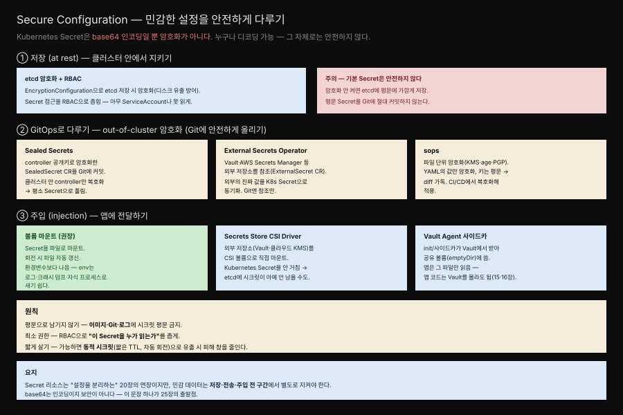

# 25장 · Secure Configuration — 민감한 설정을 안전하게 다루기

> 비밀번호·토큰·인증서 같은 민감한 설정을 저장·배포·주입 전 구간에서 안전하게 다루는 패턴입니다. Kubernetes Secret이 그 자체로는 안전하지 않다는 사실에서 출발합니다.

## 핵심 요약

> Secure Configuration은 민감한 데이터를 저장·전송·주입의 전 구간에서 별도로 지키는 패턴입니다.

20장 Configuration Resource에서 본 Kubernetes Secret은 설정을 앱에서 분리하는 좋은 도구지만 오해를 부르기 쉽습니다. Secret의 값은 base64로 인코딩될 뿐 암호화되지 않습니다. base64는 누구나 디코딩할 수 있으니 보안 장치가 아니라 단지 인코딩입니다. 이 한 문장이 25장의 출발점입니다 — Secret이라는 이름만 믿고 민감 데이터를 안전하다고 여기면 안 됩니다.

Secure Configuration은 세 축에서 이 데이터를 지킵니다. 저장(at rest)에서는 etcd 암호화와 RBAC으로, GitOps 흐름에서는 out-of-cluster 암호화(Sealed Secrets·External Secrets·sops)로 평문이 Git에 남지 않게, 주입(injection)에서는 볼륨 마운트·CSI Driver·Vault 사이드카로 앱에 안전하게 전달합니다.

## 학습 목표

> 이 장을 읽고 나면 다음을 설명할 수 있어야 합니다.

- Kubernetes Secret이 base64 인코딩일 뿐 암호화가 아니라는 점과 그 함의를 설명할 수 있습니다.
- etcd 암호화와 RBAC이 저장 단계에서 무엇을 지키는지 압니다.
- Sealed Secrets·External Secrets·sops가 GitOps에서 각각 어떻게 평문 노출을 막는지 구분할 수 있습니다.
- 볼륨 마운트가 환경변수보다 안전한 이유를 설명할 수 있습니다.
- Secrets Store CSI Driver와 Vault 사이드카 주입의 동작을 이해합니다.

## 본문 정리

### 문제 — Secret은 base64일 뿐 암호화가 아니다

Kubernetes Secret은 데이터를 base64로 인코딩해 저장합니다. base64는 이진 데이터를 텍스트로 옮기는 인코딩 방식이지 암호화가 아니므로, 값을 손에 넣은 사람은 누구나 곧바로 디코딩해 원본을 읽을 수 있습니다. 게다가 기본 설정에서는 이 값이 etcd에 평문에 가깝게 저장되고 Secret에 접근 권한이 있는 주체라면 API로 읽어낼 수 있습니다. "Secret"이라는 이름이 주는 안전하다는 인상과 실제 보호 수준 사이에 큰 간극이 있는 셈입니다.

### 해결 (1) — 저장: etcd 암호화 + RBAC

첫 번째 축은 클러스터 안에서 지키는 것입니다. `EncryptionConfiguration`을 설정하면 etcd에 저장될 때 Secret이 실제로 암호화되어, 누군가 etcd 디스크나 백업을 손에 넣어도 값을 바로 읽지 못합니다. 여기에 RBAC으로 "이 Secret을 누가 읽을 수 있는가"를 좁힙니다(26장 Access Control). 아무 ServiceAccount나 Secret을 읽지 못하게 접근 주체를 최소한으로 제한하는 것입니다. 그리고 원칙 하나가 분명합니다 — 평문 Secret을 Git에 절대 커밋하지 않습니다.

### 해결 (2) — GitOps: out-of-cluster 암호화

GitOps로 설정을 관리하려면 Secret도 Git에 두고 싶어집니다. 하지만 평문을 올릴 수는 없으니, 클러스터 밖에서 암호화된 형태로 Git에 올리는 방법이 필요합니다. 책은 세 가지 접근을 소개합니다.

**Sealed Secrets**는 클러스터에 설치한 controller의 공개키로 Secret을 암호화해 `SealedSecret`이라는 커스텀 리소스로 만듭니다. 이 암호화된 CR은 안전하게 Git에 커밋할 수 있고 클러스터 안의 controller만이 자신의 개인키로 이를 복호화해 평범한 Secret으로 풀어냅니다. 공개키로 잠그고 클러스터 안에서만 열리므로, Git 저장소가 노출돼도 값은 지켜집니다.

**External Secrets Operator**는 진짜 값을 클러스터가 아니라 외부 저장소(HashiCorp Vault, AWS Secrets Manager 등)에 두고 `ExternalSecret` CR로 그 저장소를 참조합니다. Operator는 외부 저장소의 값을 읽어 Kubernetes Secret으로 동기화합니다. Git에는 "어느 외부 시크릿을 가리키는가"라는 참조만 남고 실제 값은 남지 않습니다.

**sops**는 파일 단위 암호화 도구입니다. KMS·age·PGP 같은 키로 YAML 파일의 값 부분만 암호화하고 키 이름은 평문으로 남깁니다. 그래서 diff에서 어떤 필드가 바뀌었는지 구조는 읽히면서 값은 보호됩니다. CI/CD 파이프라인에서 복호화한 뒤 클러스터에 적용하는 흐름으로 씁니다.

### 해결 (3) — 주입: 앱에 전달하기

세 번째 축은 지켜온 시크릿을 앱에 전달하는 방법입니다.

**볼륨 마운트**가 권장 방식입니다. Secret을 파일로 마운트하면, 시크릿이 회전(rotation)될 때 마운트된 파일이 자동으로 갱신됩니다. 환경변수보다 나은 이유가 분명합니다 — 환경변수는 로그, 크래시 덤프, 자식 프로세스 등으로 의도치 않게 새어 나가기 쉽습니다. 파일 마운트는 그런 유출 경로가 좁습니다.

**Secrets Store CSI Driver**는 외부 저장소(Vault, 클라우드 KMS)를 CSI 볼륨으로 직접 마운트합니다. 이 경우 Kubernetes Secret을 아예 거치지 않을 수 있어, 시크릿이 etcd에 남지 않게 만들 수도 있습니다. 외부 저장소가 진실의 원천이고 클러스터는 그것을 잠깐 마운트할 뿐입니다.

**Vault Agent 사이드카 주입**은 init container나 사이드카가 Vault에서 값을 받아 공유 볼륨(`emptyDir`)에 쓰고 앱은 그 파일만 읽는 구조입니다(15장 Init Container·16장 Sidecar). 앱 코드는 Vault의 존재를 몰라도 되며 시크릿 조달의 책임이 사이드카로 분리됩니다.

### 원칙 — 평문 금지, 최소 권한, 짧게 살기

세 축을 관통하는 원칙은 셋입니다. 첫째, 평문으로 남기지 않습니다 — 이미지·Git·로그 어디에도 시크릿 평문이 있어서는 안 됩니다. 둘째, 최소 권한입니다 — RBAC으로 각 Secret을 읽을 수 있는 주체를 좁게 유지합니다. 셋째, 짧게 살게 합니다 — 가능하면 짧은 TTL로 자동 회전되는 동적 시크릿을 써서, 유출되더라도 피해가 유효한 시간 창을 줄입니다.

## 심화 학습

### Spring 관점 — 볼륨 마운트와 설정 바인딩

Spring Boot는 시크릿을 여러 방식으로 받을 수 있는데, Secure Configuration의 권장과 잘 맞는 방법은 볼륨 마운트입니다. Secret을 파일로 마운트하면 Spring이 그 경로를 설정 소스로 읽게 만들 수 있습니다. 예를 들어 `spring.config.import=optional:configtree:/etc/secrets/`를 쓰면 마운트된 디렉토리의 각 파일을 프로퍼티로 바인딩합니다. 이 방식은 환경변수로 시크릿을 넘기는 것보다 유출 경로가 좁고 시크릿 회전 시 파일이 갱신되므로 재배포 없이 반영할 여지도 생깁니다.

여기서 20장과의 연결이 분명해집니다. 20장 Configuration Resource가 "설정을 앱에서 분리한다"는 큰 그림이라면, 25장은 그중 민감한 설정을 어떻게 안전하게 분리하고 전달하는가에 대한 심화입니다. 일반 설정은 ConfigMap으로, 민감 설정은 Secret에 더해 이 장의 세 축으로 지킵니다. 외부 시크릿 관리는 [HashiCorp Vault의 Kubernetes 통합 문서](https://developer.hashicorp.com/vault/docs/platform/k8s)와 [External Secrets Operator 문서](https://external-secrets.io/latest/)에서 구체적인 설정을 확인할 수 있습니다.

### 왜 환경변수가 아니라 파일인가

시크릿을 환경변수로 넘기는 것은 흔하지만 위험이 따릅니다. 환경변수는 프로세스 정보로 노출되기 쉽고 앱이 크래시할 때 덤프에 통째로 찍히거나, 디버깅 로그에 환경 전체가 출력되면서 새기도 합니다. 자식 프로세스를 fork하면 그 환경변수가 그대로 상속되는 것도 문제입니다. 반면 파일로 마운트한 시크릿은 명시적으로 읽어야만 접근되고 파일 권한으로 접근을 제어할 수 있으며 크래시 덤프나 로그에 자동으로 딸려 나가지 않습니다. 그래서 책은 볼륨 마운트를 기본 권장으로 두고 환경변수 주입은 유출 경로가 더 넓다는 점을 분명히 합니다.

## 실무 적용

- **base64를 보안으로 착각하지 않습니다.** Secret 값은 누구나 디코딩할 수 있으므로, etcd 암호화·RBAC·out-of-cluster 암호화를 반드시 함께 씁니다.
- **etcd 암호화(`EncryptionConfiguration`)를 켭니다.** 켜지 않으면 백업 유출만으로 시크릿이 노출됩니다.
- **GitOps라면 평문 Secret을 커밋하지 않습니다.** Sealed Secrets·External Secrets·sops 중 팀 환경에 맞는 것을 고릅니다.
- **시크릿은 환경변수보다 볼륨 마운트로 주입합니다.** 회전 자동 반영과 유출 경로 축소를 동시에 얻습니다.
- **가능하면 동적 시크릿을 씁니다.** 짧은 TTL로 회전되면 유출 시 피해 창이 줄어듭니다.

## 체크리스트

- [ ] etcd 저장 암호화(`EncryptionConfiguration`)가 켜져 있는가?
- [ ] Secret 접근이 RBAC으로 최소 주체로 좁혀져 있는가?
- [ ] Git에 평문 Secret이 커밋된 적이 없는가? (Sealed/External/sops 사용)
- [ ] 시크릿이 환경변수가 아니라 볼륨 마운트로 주입되는가?
- [ ] 시크릿이 이미지·로그에 평문으로 남지 않는가?
- [ ] 회전 가능한 동적 시크릿을 검토했는가?

## 면접 관점

**Q. Kubernetes Secret은 안전한가요?**
그 자체로는 안전하지 않습니다. Secret의 값은 base64로 인코딩될 뿐 암호화되지 않아 누구나 디코딩할 수 있고 기본 설정에서는 etcd에 평문에 가깝게 저장됩니다. 안전하게 쓰려면 etcd 저장 암호화, RBAC 접근 제한, 그리고 GitOps에서는 out-of-cluster 암호화를 함께 적용해야 합니다.

**Q. GitOps로 Secret을 관리할 때 평문 노출을 어떻게 막나요?**
세 가지 접근이 있습니다. Sealed Secrets는 controller 공개키로 암호화한 CR을 Git에 커밋하고 클러스터 안 controller만 복호화합니다. External Secrets Operator는 진짜 값을 Vault 같은 외부 저장소에 두고 참조만 Git에 두어 Secret으로 동기화합니다. sops는 파일 값만 암호화해 diff 구조는 읽히게 하면서 값을 보호합니다.

**Q. 시크릿을 환경변수 대신 볼륨 마운트로 주입하는 이유는 무엇인가요?**
환경변수는 로그·크래시 덤프·자식 프로세스 상속 등으로 의도치 않게 새기 쉽습니다. 볼륨 마운트는 유출 경로가 좁고 파일 권한으로 접근을 제어할 수 있으며 시크릿이 회전될 때 마운트된 파일이 자동 갱신되는 이점까지 있습니다.

## 참고 자료

- Bilgin Ibryam·Roland Huß, *Kubernetes Patterns, 2nd Edition*, 25장 Secure Configuration (O'Reilly, 2023)
- [Kubernetes 공식 — Secret at rest 암호화](https://kubernetes.io/docs/tasks/administer-cluster/encrypt-data/)
- [Sealed Secrets (Bitnami Labs)](https://github.com/bitnami-labs/sealed-secrets)
- [External Secrets Operator](https://external-secrets.io/latest/)
- [Secrets Store CSI Driver](https://secrets-store-csi-driver.sigs.k8s.io/)
- 정독 노트: [20장 Configuration Resource](./20-01.Configuration%20Resource%20%E2%80%94%20ConfigMap%EA%B3%BC%20Secret%EC%9C%BC%EB%A1%9C%20%EC%84%A4%EC%A0%95%20%EB%B6%84%EB%A6%AC.md) · [15장 Init Container](./15-01.Init%20Container%20%E2%80%94%20%EC%B4%88%EA%B8%B0%ED%99%94%EB%A5%BC%20%EC%95%B1%EA%B3%BC%20%EB%B6%84%EB%A6%AC%ED%95%B4%20%EB%B3%84%EB%8F%84%20%EC%83%9D%EC%95%A0%EC%A3%BC%EA%B8%B0%EB%A1%9C.md) · [16장 Sidecar](./16-01.Sidecar%20%E2%80%94%20%EA%B8%B0%EC%A1%B4%20%EC%BB%A8%ED%85%8C%EC%9D%B4%EB%84%88%EB%A5%BC%20%EB%B0%94%EA%BE%B8%EC%A7%80%20%EC%95%8A%EA%B3%A0%20%ED%99%95%EC%9E%A5.md)
