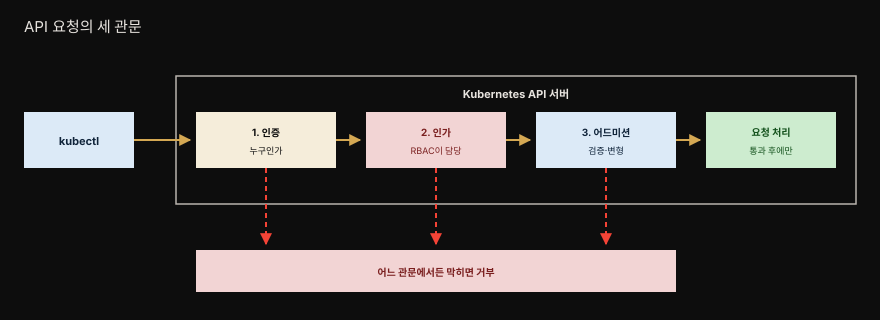
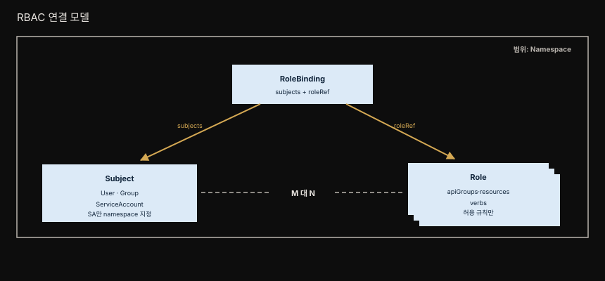
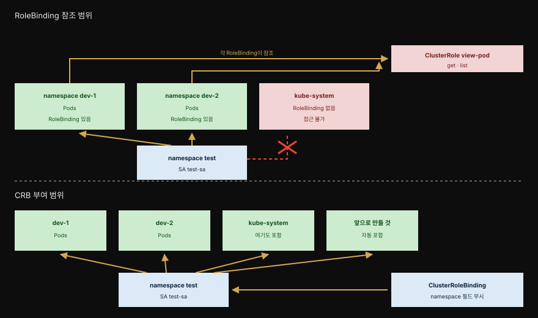

# 26장 · Access Control — RBAC으로 "누가 무엇을 할 수 있는지"

> API 서버 요청이 "누가 무엇을 할 수 있는가"를 통제하는 패턴입니다. Kubernetes는 이를 RBAC(Role-Based Access Control)으로 구현하며 Security 카테고리의 마지막 겹을 이룹니다.



앰버 화살표가 통과 경로이고 붉은 점선이 거부 경로입니다. 세 관문을 모두 지난 요청만 실제로 처리됩니다.


## 핵심 요약

> Access Control은 모든 API 요청을 인증·인가·어드미션 세 단계로 거르며 그중 인가를 RBAC이 담당하는 패턴입니다.

보안의 핵심에는 두 개념이 있습니다. **인증(Authentication)**은 어떤 동작의 주체가 *누구*인지 식별하고 허가받지 않은 행위자의 접근을 막습니다. **인가(Authorization)**는 리소스에 대해 *무엇*을 하도록 허용되는지 권한을 판정합니다.

책은 인증을 짧게만 다룹니다. 여러 신원 관리 기법을 Kubernetes에 통합하는 일이라 주로 관리자의 관심사이기 때문입니다. 개발자에게 더 중요한 것은 인가입니다. 클러스터에서 누가 어떤 동작을 수행할 수 있고 애플리케이션의 어느 부분에 접근할 수 있는지가 여기서 갈립니다.

이것이 왜 절실한지 보여 주는 사건이 있습니다. 2022년 보안 연구자들이 설정 오류로 인터넷에 노출된 Kubernetes 인스턴스를 거의 100만 개 발견했습니다. 잘못 설정된 접근 권한은 권한 상승과 배포 실패로 이어집니다. 높은 권한을 가진 배포는 다른 배포의 설정과 리소스를 읽거나 고칠 수 있어 클러스터 전체가 위험해집니다.

여기에 더해, Kubernetes 네이티브 애플리케이션이 CRD로 자기 서비스를 제공하는 흐름이 커지면서 접근 제어는 더 중요해졌습니다. 27장 Controller와 28장 Operator 같은 패턴은 클러스터 전역 리소스의 상태를 관찰하기 위해 높은 권한을 요구합니다. 그만큼 세밀한 접근 관리와 제약이 필요합니다.


## 학습 목표

> 이 장을 읽고 나면 다음을 설명할 수 있어야 합니다.

1. API 요청의 세 단계가 각각 무엇을 하는지 설명할 수 있습니다.
2. 인증 전략에 어떤 것들이 있는지 알고, 그 평가 순서가 고정돼 있지 않다는 점을 압니다.
3. subject의 세 종류를 구분하고 각각이 API에서 어떻게 표현되는지 설명할 수 있습니다.
4. ServiceAccount 토큰이 projected volume으로 마운트되는 방식과 그 이점을 압니다.
5. Role과 ClusterRole, RoleBinding과 ClusterRoleBinding의 범위 차이를 판단할 수 있습니다.
6. ClusterRole aggregation이 무엇을 푸는지 설명할 수 있습니다.
7. RBAC이 권한 상승을 어떻게 막는지 압니다.
8. `kubectl auth can-i`로 권한을 확인할 수 있습니다.


## 세 관문 — 인증, 인가, 어드미션

> Kubernetes API 서버로 가는 모든 요청은 세 단계를 차례로 통과해야 합니다. 어느 하나라도 막히면 요청은 거기서 끝납니다.

### 인증 — 누구인가

인증은 주로 관리자의 관심사지만 어떤 선택지가 있는지는 알아 둘 만합니다. Kubernetes가 제공하는 플러그형 인증 전략은 다음과 같습니다.[^authn]

| 전략 | 동작 |
|------|------|
| **Bearer Token(OIDC)** | OpenID Connect 토큰을 `Authorization` 헤더에 실어 보내면 API 서버가 검증합니다 |
| **클라이언트 인증서(X.509)** | 클라이언트가 TLS 인증서를 제시하고 API 서버가 검증합니다 |
| **인증 프록시** | 커스텀 프록시가 중개자로서 클라이언트 신원을 확인한 뒤 접근을 허용합니다 |
| **정적 토큰 파일** | 표준 파일에 저장된 토큰을 제시하면 파일에서 일치 항목을 찾습니다 |
| **웹훅 토큰 인증** | 토큰을 외부 웹훅으로 전달해 검증받습니다. 외부 커스텀 서비스를 쓸 수 있다는 점이 Bearer Token과 다릅니다 |

여러 인증 플러그인을 동시에 쓸 수 있습니다. Bearer Token이 요청을 인증하면 클라이언트 인증서는 검사하지 않고 그 반대도 마찬가지입니다. 다만 **전략의 평가 순서는 고정돼 있지 않아 무엇이 먼저 검사될지 알 수 없습니다.** 하나가 성공하면 그 시점에 평가가 멈추고 요청은 다음 단계로 넘어갑니다.

### 인가 — 무엇을 할 수 있는가

Kubernetes는 RBAC을 표준 접근 관리 방식으로 제공합니다. 인가 플러그인은 교체가 쉬워서 기본 RBAC 대신 ABAC(속성 기반 접근 제어), 웹훅, 커스텀 권한자에게 위임하는 방식으로 바꿀 수 있습니다.

ABAC 방식은 JSON을 한 줄에 하나씩 담은 정책 파일을 요구합니다. 문제는 변경할 때마다 서버를 다시 읽어들여야 한다는 점입니다. 이 정적인 성격 때문에 ABAC은 일부 경우에만 쓰이고, 거의 모든 클러스터가 기본 RBAC을 씁니다.

### 어드미션 — 검증과 변형

어드미션 컨트롤러는 API 서버로 오는 요청을 가로채 추가 동작을 취하는 기능입니다. 할 수 있는 일은 셋입니다. 정책 강제, 검증 수행, 그리고 들어오는 리소스의 수정입니다.

기능의 폭이 넓습니다. 특정 리소스에 기본값을 넣는 것(PersistentVolume의 기본 스토리지 클래스 같은)부터, 외부 웹훅을 호출해 검증하는 것(Pod에 허용되는 자원 한계 같은)까지 걸칩니다. 이 외부 웹훅은 전용 리소스로 설정하며 검증용은 `ValidatingWebhookConfiguration`, 갱신용은 `MutatingWebhookConfiguration`입니다.


## Subject — 누가 요청하는가

> 요청에 결부된 신원이 subject입니다. 사람 사용자와 워크로드 신원인 ServiceAccount 두 종류가 있고, 둘 다 그룹으로 묶일 수 있습니다.

### 사용자는 리소스가 아닙니다

Kubernetes의 다른 개체와 달리 **사람 사용자는 API의 명시적 리소스로 정의되지 않습니다.** 이 설계 결정 때문에 API 호출로 사용자를 관리할 수 없습니다. 인증과 사용자 subject로의 매핑은 외부 사용자 관리 시스템이 담당하며 일반적인 Kubernetes API 기구 바깥에서 일어납니다.

인증에 성공하면 각 컴포넌트가 subject 정보를 추출해 동일한 사용자 표현을 만들고 실제 API 요청에 덧붙입니다. 그 표현은 쉼표로 구분된 목록입니다.

```
alice,4bc01e30-406b-4514,"system:authenticated,developers","scopes:openid"
```

- 사용자명 — `alice`
- 고유 사용자 ID(UID) — `4bc01e30-406b-4514`
- 소속 그룹 목록 — `system:authenticated,developers`
- 추가 정보를 담은 키-값 쌍 — `scopes:openid`

여기서 `scopes:openid`는 신원 확인에 OIDC가 쓰였음을 뜻합니다. 특정 사용자명은 Kubernetes 내부용으로 예약돼 있고 `system:` 접두사로 구분됩니다. 예를 들어 `system:anonymous`는 익명 요청을 나타냅니다. 충돌을 피하려면 `system:` 접두사로 사용자나 그룹을 직접 만들지 않는 편이 좋습니다.

내부 컴포넌트가 서로 통신할 때 쓰는 기본 사용자명은 다음과 같습니다.

| 사용자명 | 용도 |
|----------|------|
| `system:anonymous` | API 서버로 오는 익명 요청 |
| `system:apiserver` | API 서버 자신 |
| `system:kube-proxy` | kube-proxy 서비스의 프로세스 신원 |
| `system:kube-controller-manager` | 컨트롤러 매니저의 사용자 에이전트 |
| `system:kube-scheduler` | 스케줄러의 사용자 |

### ServiceAccount — 워크로드의 신원

외부 사용자의 관리와 인증은 클러스터 설정에 따라 제각각이지만, **Pod의 워크로드 신원 관리는 Kubernetes API의 표준화된 일부이고 모든 클러스터에서 일관됩니다.**

ServiceAccount는 클러스터 안의 비인간 행위자를 대표하며 워크로드 신원으로 쓰입니다. Pod와 연결되어 Pod 안에서 도는 프로세스가 API 서버와 통신하게 해 줍니다. 사람 사용자를 인증하는 방법이 여럿인 것과 달리, ServiceAccount는 항상 OpenID Connect 핸드셰이크와 JSON Web Token으로 신원을 증명합니다.

API 서버는 ServiceAccount를 `system:serviceaccount:<namespace>:<name>` 형식의 사용자명으로 인증합니다. `default` namespace의 `random-sa`라면 사용자명은 `system:serviceaccount:default:random-sa`가 됩니다.

ServiceAccount는 평범한 Kubernetes 리소스입니다.

```yaml
apiVersion: v1
kind: ServiceAccount
metadata:
  name: random-sa                  # 1. ServiceAccount 이름
  namespace: default
automountServiceAccountToken: false # 2. 토큰 자동 마운트 여부 (기본 true)
```

모든 namespace에는 `default`라는 이름의 ServiceAccount가 있어, 연결된 ServiceAccount를 지정하지 않은 Pod를 식별하는 데 쓰입니다.

### 토큰은 projected volume으로 들어옵니다

각 ServiceAccount에는 Kubernetes 백엔드가 완전히 관리하는 JWT가 딸려 있습니다. Pod와 연결된 ServiceAccount의 토큰은 모든 Pod의 파일시스템에 자동으로 마운트됩니다. Kubernetes가 생성되는 Pod마다 자동으로 붙이는 부분입니다.

```yaml
apiVersion: v1
kind: Pod
metadata:
  name: random
spec:
  serviceAccountName: default                              # 1. ServiceAccount 이름 지정
  containers:
    volumeMounts:
      - mountPath: /var/run/secrets/kubernetes.io/serviceaccount  # 2. 토큰이 마운트되는 디렉토리
        name: kube-api-access-vzfp7                        # 3. 자동 생성 볼륨의 임의 이름
        readOnly: true
  volumes:
    - name: kube-api-access-vzfp7
      projected:                                           # 4. projected 볼륨이 토큰을 직접 주입
        defaultMode: 420
        sources:
          - serviceAccountToken:
              expirationSeconds: 3600                      # 5. 토큰 만료 시간
              path: token                                  # 6. 토큰을 담을 파일 이름
```

projected 볼륨은 Secret과 ConfigMap 볼륨 같은 여러 볼륨 소스를 한 디렉토리로 합쳐 줍니다. 이 볼륨 타입 덕분에 ServiceAccount 토큰을 `serviceAccountToken` 하위 타입으로 Pod 파일시스템에 직접 매핑할 수 있고, 이점이 몇 가지 따라옵니다.[^projected]

- 토큰의 중간 표현이 필요 없어져 공격 표면이 줄어듭니다.
- 만료 시간을 걸 수 있고, 만료되면 Kubernetes 토큰 컨트롤러가 회전시킵니다.
- 주입된 토큰이 그 Pod의 생존 기간 동안만 유효해 무단 열람 위험이 더 줄어듭니다.

Kubernetes 1.24 이전에는 이 토큰을 Secret으로 표현해 `secret` 볼륨 타입으로 직접 마운트했습니다. 수명이 길고 회전이 없다는 단점이 있었습니다. 지금도 ServiceAccount의 토큰을 담는 Secret을 수동으로 만들 수는 있습니다.

```yaml
apiVersion: v1
kind: Secret
type: kubernetes.io/service-account-token   # 1. ServiceAccount 토큰을 담는 특수 타입
metadata:
  name: random-sa
  annotations:
    kubernetes.io/service-account.name: "random-sa"  # 2. 토큰을 넣을 ServiceAccount 참조
```

Kubernetes가 토큰과 검증용 공개 키를 이 Secret에 채웁니다. 이 Secret의 생애주기는 ServiceAccount에 묶여, ServiceAccount를 지우면 Secret도 함께 지워집니다.

ServiceAccount 리소스에는 자격 증명 관련 필드가 둘 더 있습니다.

- **imagePullSecrets** — 프라이빗 레지스트리에서 이미지를 받을 때 쓸 pull secret을 ServiceAccount 최상위 필드에 붙여 둡니다. 그 ServiceAccount와 연결된 Pod가 만들어질 때 pull secret이 자동으로 명세에 주입되므로 Pod마다 수동으로 적을 필요가 없습니다.
- **secrets** — 그 ServiceAccount의 Pod가 마운트할 수 있는 Secret을 제한합니다. `kubernetes.io/enforce-mountable-secrets` 어노테이션을 `true`로 두면 목록에 적힌 Secret만 마운트가 허용됩니다.

### 그룹

사용자와 ServiceAccount 모두 하나 이상의 그룹에 속할 수 있습니다. 그룹은 인증 시스템이 요청에 붙이며, 그룹 구성원 전체에게 권한을 주는 데 씁니다. 그룹 이름은 앞의 사용자 표현에서 봤듯 평범한 문자열입니다.

그룹은 신원 공급자가 자유롭게 정의하고 관리할 수 있습니다. 여기에 더해 Kubernetes에 암묵적으로 정의된 그룹이 있고 이름에 `system:` 접두사가 붙습니다.

| 그룹 | 용도 |
|------|------|
| `system:unauthenticated` | 인증되지 않은 모든 요청에 배정 |
| `system:authenticated` | 인증된 사용자에게 배정 |
| `system:masters` | 구성원이 API 서버에 무제한 접근 |
| `system:serviceaccounts` | 클러스터의 모든 ServiceAccount |
| `system:serviceaccounts:<namespace>` | 해당 namespace의 모든 ServiceAccount |


## Role과 RoleBinding

> Role이 무엇을 할 수 있는지 정의하고, RoleBinding이 그것을 subject에 연결합니다. 둘 사이는 다대다 관계입니다.



RoleBinding 하나가 subject 목록과 Role 하나를 잇습니다. 한 subject가 여러 Role을 가질 수 있고 한 Role이 여러 subject에 적용될 수 있는 M 대 N 관계이며, 그 연결을 만드는 것이 RoleBinding입니다. Role과 RoleBinding은 모두 특정 namespace에 묶여 그 namespace의 리소스에만 적용됩니다.

Role은 리소스 묶음에 허용되는 동작 집합을 정의합니다. Pod 가져오기, Secret 삭제, ConfigMap 갱신, ServiceAccount 생성 같은 것들입니다.

```yaml
apiVersion: rbac.authorization.k8s.io/v1
kind: Role
metadata:
  name: developer-ro      # 1. 참조에 쓰이는 Role 이름
  namespace: default      # 2. 이 Role이 적용되는 namespace
rules:
  - apiGroups:
      - ""                # 3. 빈 문자열은 core API 그룹
    resources:            # 4. 규칙이 적용되는 core 리소스 목록
      - pods
      - services
    verbs:                # 5. 이 Role과 연결된 subject에게 허용되는 동작
      - get
      - list
      - watch
```

요청이 이 Role로 접근을 얻으려면 규칙 **하나만 일치하면 됩니다.** 각 `rule`은 세 필드로 기술됩니다.

- **apiGroups** — 단일 값이 아니라 목록입니다. 와일드카드로 여러 API 그룹의 모든 리소스를 지정할 수 있기 때문입니다. 빈 문자열(`""`)은 Pod와 Service 같은 주요 리소스가 속한 core API 그룹을 뜻합니다.
- **resources** — 접근을 허용할 리소스입니다. 각 항목은 설정된 `apiGroups` 중 적어도 하나에 속해야 합니다.
- **verbs** — HTTP 메서드와 비슷한 동작입니다. CRUD 연산과 컬렉션 대상 동작(`list`, `deletecollection`)이 있습니다.

`watch` verb에 주목할 만합니다. 리소스 변경 이벤트에 접근하게 해 주며 `get`으로 직접 읽는 것과는 별개입니다. **이 verb는 Operator가 자기가 관리하는 리소스의 현재 상태 알림을 받는 데 결정적입니다.** 27장과 28장이 이 주제를 더 다룹니다.

verb와 HTTP 메서드의 대응은 이렇습니다.

| Verb | HTTP 메서드 |
|------|------------|
| `get`, `watch`, `list` | GET |
| `create` | POST |
| `patch` | PATCH |
| `update` | PUT |
| `delete`, `deletecollection` | DELETE |

이 Role을 RoleBinding으로 subject에 연결합니다.

```yaml
apiVersion: rbac.authorization.k8s.io/v1
kind: RoleBinding
metadata:
  name: dev-rolebinding
subjects:                              # 1. Role에 연결할 subject 목록
  - kind: User                         # 2. alice라는 사람 사용자 참조
    name: alice
    apiGroup: "rbac.authorization.k8s.io"
  - kind: ServiceAccount               # 3. contractor라는 ServiceAccount
    name: contractor
    apiGroup: ""
roleRef:
  kind: Role                           # 4. 앞서 정의한 developer-ro Role 참조
  name: developer-ro
  apiGroup: rbac.authorization.k8s.io
```

subject 종류마다 `apiGroup` 값이 다릅니다. User와 Group은 `rbac.authorization.k8s.io`를 쓰고, ServiceAccount는 core API 그룹에 속하므로 빈 문자열(`""`)을 씁니다. **ServiceAccount만 `namespace` 필드를 가질 수 있다는 점이 특이합니다.** 덕분에 다른 namespace의 Pod에도 접근 권한을 줄 수 있습니다.

### 와일드카드는 편하지만 위험합니다

Role의 `rule` 요소는 모두 `*` 와일드카드를 허용합니다.

```yaml
rules:
  - apiGroups:
      - ""
      - "networking.k8s.io"
    resources:
      - "*"       # 1. 나열된 API 그룹의 모든 리소스
    verbs:
      - "*"       # 2. 그 리소스에 대한 모든 동작
```

와일드카드를 쓰면 규칙을 빠르게 설정할 수 있지만 **권한 상승이라는 보안 위험이 따라옵니다.** 이런 넓은 권한은 보안 구멍을 만들고, 사용자가 클러스터를 위협하거나 원치 않는 변경을 일으킬 동작을 수행하게 합니다. 와일드카드를 쓴다면 그 목록에는 와일드카드 하나만 두어야 합니다.

### 권한 상승 방지

RBAC 서브시스템은 Role과 RoleBinding(그리고 ClusterRole과 ClusterRoleBinding)을 관리합니다. RBAC 리소스를 제어할 권한을 가진 사용자가 자기 권한을 스스로 올리는 것을 막기 위해 다음 제약이 걸립니다.[^escalation]

- 사용자는 **자기가 이미 그 Role의 모든 권한을 갖고 있을 때만** Role을 갱신할 수 있습니다. 또는 `rbac.authorization.k8s` API 그룹의 모든 리소스에 `escalate` verb를 쓸 권한이 있어야 합니다.
- RoleBinding에도 비슷한 제약이 걸립니다. 참조하는 Role이 부여하는 모든 권한을 사용자가 갖고 있거나, RBAC 리소스에 `bind` verb 허용이 있어야 합니다.


## ClusterRole과 ClusterRoleBinding

> ClusterRole은 클러스터 전역에 적용되는 Role입니다. 어떤 binding으로 부여하느냐에 따라 실제 범위가 완전히 달라집니다.



같은 ClusterRole이라도 RoleBinding으로 참조하면 그 binding을 건 namespace에만 미치고, ClusterRoleBinding으로 부여하면 모든 namespace에 한 번에 미칩니다.

ClusterRole의 용도는 크게 둘입니다.

- **클러스터 전역 리소스 보호** — CustomResourceDefinition이나 StorageClass 같은 리소스입니다. 대개 cluster-admin 수준에서 관리되며 추가 접근 제어가 필요합니다.
- **여러 namespace가 공유하는 전형적인 Role 정의** — RoleBinding은 같은 namespace의 Role만 참조할 수 있습니다. ClusterRole을 쓰면 "모든 리소스 읽기 전용" 같은 범용 접근 제어 Role을 정의해 여러 RoleBinding에서 재사용할 수 있습니다.

```yaml
apiVersion: rbac.authorization.k8s.io/v1
kind: ClusterRole
metadata:
  name: view-pod    # 1. namespace 선언이 없는 ClusterRole 이름
rules:
  - apiGroups:      # 2. 모든 Pod에 읽기 동작을 허용하는 규칙
      - ""
    resources:
      - pods
    verbs:
      - get
      - list
```

Kubernetes는 바로 쓸 수 있는 사용자 대면 ClusterRole을 기본 제공합니다.

| ClusterRole | 용도 |
|-------------|------|
| `view` | namespace 안 대부분의 리소스 읽기. 단 Role·RoleBinding·Secret은 제외 |
| `edit` | namespace 안 대부분의 리소스 읽기와 수정. 단 Role·RoleBinding은 제외 |
| `admin` | Role과 RoleBinding을 포함한 namespace 내 모든 리소스의 완전한 제어 |
| `cluster-admin` | 클러스터 전역 리소스를 포함한 모든 namespace 리소스의 완전한 제어 |

### Aggregation — 작은 ClusterRole을 합치기

두 ClusterRole의 권한을 합쳐야 할 때가 있습니다. 두 ClusterRole을 각각 참조하는 RoleBinding을 여러 개 만드는 방법도 있지만, **aggregation**이 더 우아합니다.

aggregation을 쓰려면 `rules` 필드를 비우고 `aggregationRule` 필드에 라벨 셀렉터 목록을 채웁니다. 그러면 그 셀렉터에 맞는 라벨을 가진 다른 ClusterRole들의 규칙이 합쳐져, 이 ClusterRole의 `rules` 필드를 채웁니다.[^aggregation]

```yaml
apiVersion: rbac.authorization.k8s.io/v1
kind: ClusterRole
metadata:
  name: view
  labels:
    rbac.authorization.k8s.io/aggregate-to-edit: "true"   # 1. edit Role에 포함될 자격을 노출
aggregationRule:
  clusterRoleSelectors:
    - matchLabels:
        rbac.authorization.k8s.io/aggregate-to-view: "true"  # 2. 이 셀렉터에 맞는 ClusterRole을 흡수
rules: []                                                 # 3. Kubernetes가 관리하는 필드
```

`aggregationRule`을 설정하면 `rules` 필드의 소유권을 Kubernetes에 넘기는 셈입니다. 수동으로 고쳐도 선택된 ClusterRole들의 규칙으로 계속 덮어써집니다.

기본 `view` 역할이 실제로 이 방식으로 동작합니다. `rbac.authorization.k8s.io/aggregate-to-view` 라벨이 붙은 더 구체적인 ClusterRole들을 주워 담습니다. 동시에 `view` 자신에게 `aggregate-to-edit` 라벨이 붙어 있어 `edit` 역할이 `view`의 규칙을 포함하게 됩니다. **중첩이 가능해 권한 규칙의 상속 사슬을 만들 수 있다**는 뜻입니다.

기본 사용자 대면 ClusterRole이 전부 이 기법을 쓰므로, 커스텀 리소스의 권한 모델을 표준 ClusterRole(`view`·`edit`·`admin`)에 손쉽게 끼워 넣을 수 있습니다. 해당 aggregation 라벨을 붙이기만 하면 됩니다.

### ClusterRoleBinding — 편리하지만 넓습니다

ClusterRoleBinding의 스키마는 RoleBinding과 비슷하되 `namespace` 필드를 무시합니다. 여기 정의된 규칙은 클러스터의 모든 namespace에 적용됩니다.

```yaml
apiVersion: rbac.authorization.k8s.io/v1
kind: ClusterRoleBinding
metadata:
  name: test-sa-crb
subjects:                    # 1. test namespace의 test-sa ServiceAccount를 연결
  - kind: ServiceAccount
    name: test-sa
    namespace: test
roleRef:                     # 2. view-pod ClusterRole의 규칙을 모든 namespace에 허용
  kind: ClusterRole
  name: view-pod
  apiGroup: rbac.authorization.k8s.io
```

ClusterRoleBinding은 새로 만들어지는 namespace에도 권한을 자동으로 부여해 편리합니다. 그러나 **namespace마다 개별 RoleBinding을 쓰는 편이 대체로 낫습니다.** 권한을 더 세밀하게 통제할 수 있고, 이 추가 수고를 들이면 `kube-system` 같은 특정 namespace를 무단 접근에서 제외할 수 있습니다.

책은 못을 박습니다. ClusterRoleBinding은 Node·Namespace·CustomResourceDefinition, 심지어 ClusterRoleBinding 자체 같은 클러스터 전역 리소스를 관리하는 **관리 작업에만** 써야 합니다.

### 권한을 확인하는 법

RBAC 객체가 많아지면 API 서버의 인가 판단을 이해하기 어려워집니다. Access Review API가 인가 서브시스템에 권한을 질의하게 해 줍니다. 가장 쉬운 입구가 `kubectl auth can-i`입니다.[^canri]

```bash
kubectl auth can-i \
    list pods --namespace dev-1 --as system:serviceaccount:test:test-sa
```

이 명령은 "예" 또는 "아니오"를 돌려줍니다. 내부적으로는 SubjectAccessReview 타입의 리소스가 만들어지고, 인가 컨트롤러가 그 리소스의 `status` 섹션을 검사 결과로 갱신합니다.

`kubectl auth can-i`는 특정 권한을 확인하기엔 좋지만 번거롭고, 한 subject가 클러스터 전체에서 가진 권한을 한눈에 보여 주지는 못합니다. 그럴 때 쓰는 도구가 있습니다. **rakkess**는 `kubectl` 플러그인으로 설치해 `kubectl access-matrix`로 실행하며, subject가 특정 리소스에 수행할 수 있는 동작을 행렬로 보여 줍니다. **KubiScan**은 RBAC 설정에서 위험한 권한을 찾아 스캔합니다.


## 무엇을 언제 쓰나

> 정의 객체를 어떻게 조합할지가 RBAC의 실제 어려움입니다. 책이 주는 판단 기준을 그대로 옮깁니다.

| 하고 싶은 것 | 조합 |
|-------------|------|
| 특정 namespace의 리소스를 보호 | Role + RoleBinding. ServiceAccount는 같은 namespace에 없어도 되므로 다른 namespace의 Pod에도 권한을 줄 수 있습니다 |
| 같은 접근 규칙을 여러 namespace에서 재사용 | 공유 규칙을 정의한 ClusterRole + 각 namespace의 RoleBinding |
| 기존 ClusterRole을 확장 | `aggregationRule`을 가진 새 ClusterRole을 만들고 `rules`에 권한을 더합니다 |
| 특정 종류의 모든 리소스에 모든 namespace에서 접근 부여 | ClusterRole + ClusterRoleBinding |
| CRD 같은 클러스터 전역 리소스 접근 관리 | ClusterRole + ClusterRoleBinding |

책이 장을 닫으며 남기는 일반 조언은 셋입니다.

**와일드카드 권한을 피합니다.** 최소 권한 원칙을 따르는 것이 권고입니다. 의도치 않은 동작을 막으려면 Role과 ClusterRole을 정의할 때 와일드카드를 피합니다. 드물게(예: 한 API 그룹의 모든 리소스를 보호할 때) 말이 될 때가 있지만, "와일드카드 금지"를 일반 정책으로 세우고 근거가 충분한 예외에만 완화하는 편이 좋습니다.

**cluster-admin ClusterRole을 피합니다.** 높은 권한을 가진 ServiceAccount는 어떤 리소스에든 동작을 수행할 수 있습니다. 권한을 수정하거나 어느 namespace의 Secret이든 열람하는 것이 가능해져 심각한 보안 문제로 이어집니다. 책의 표현을 그대로 옮기면, **Pod에는 절대로 cluster-admin ClusterRole을 할당하지 마십시오.**

**ServiceAccount 토큰을 자동 마운트하지 않습니다.** 기본적으로 ServiceAccount 토큰은 컨테이너 파일시스템의 `/var/run/secrets/kubernetes.io/serviceaccount/token`에 마운트됩니다. 그런 Pod가 침해되면 공격자는 그 Pod에 연결된 ServiceAccount의 권한으로 API 서버와 대화할 수 있습니다. 많은 애플리케이션은 업무에 그 토큰이 필요 없으므로, `automountServiceAccountToken`을 `false`로 두어 마운트를 피합니다.


## Spring 관점 — 앱이 API 서버를 부를 때만 필요합니다

> 대부분의 Spring 애플리케이션은 Kubernetes API를 직접 호출하지 않습니다. 그렇다면 토큰을 들고 있을 이유도 없습니다.

비즈니스 로직만 처리하는 앱이라면 default ServiceAccount의 토큰조차 자동 마운트할 필요가 없어, `automountServiceAccountToken: false`로 아예 꺼 두는 것이 안전합니다. 앱이 클러스터 API를 몰라도 되는데 자격을 들고 있을 이유가 없기 때문입니다.

반대로 Spring Cloud Kubernetes로 ConfigMap을 감시하거나 Operator 성격의 컨트롤러를 Spring으로 구현해 커스텀 리소스를 다룬다면 API 접근이 필요합니다. 이 경우 전용 ServiceAccount를 만들고 그 앱이 실제로 읽고 쓰는 리소스에 대한 최소 권한만 Role로 정의해 부여합니다. "ConfigMap을 감시한다"면 `configmaps`에 대한 `get`·`list`·`watch`만 주면 되고 그 이상은 필요 없습니다.

여기서 Access Control이 Security 카테고리 전체를 어떻게 마무리하는지 드러납니다. 앞선 세 패턴은 각각 다른 지점을 지켰습니다.

- Process Containment(23장) — 프로세스의 권한
- Network Segmentation(24장) — 통신 경로
- Secure Configuration(25장) — 시크릿의 접근

Access Control은 그 모두를 조작하는 API 접근 자체를 지킵니다. 특히 25장에서 "Secret을 누가 읽는가"를 RBAC으로 좁힌다고 했는데, 그 RBAC의 실체가 바로 이 장의 Role과 RoleBinding입니다.

책은 마지막으로 이렇게 정리합니다. 애플리케이션이 API 서버와 직접 상호작용하지 않더라도, 애플리케이션을 설치하고 다른 Kubernetes 서버와 연결하는 과정이 있으므로 Access Control은 여전히 운영을 지키는 가치 있는 패턴입니다.


## 능동 회상

> 먼저 스스로 답해 본 뒤 아래 정답 절에서 맞춰 봅니다. 정답은 이 절 다음에 번호 순서대로 있습니다.

1. API 요청이 거치는 세 관문은 무엇이고 각각 무엇을 하나요?
2. 여러 인증 전략을 동시에 쓸 때 주의할 점은 무엇인가요?
3. 사람 사용자가 Kubernetes API의 리소스로 정의되지 않는다는 사실이 무엇을 뜻하나요?
4. ServiceAccount의 사용자명은 어떤 형식인가요?
5. ServiceAccount 토큰이 projected volume으로 마운트되면서 얻은 이점 셋은 무엇인가요?
6. Role의 `rule`을 이루는 세 필드는 무엇인가요? 요청이 접근을 얻으려면 규칙이 몇 개 일치해야 하나요?
7. `watch` verb가 `get`과 별개로 존재하는 것이 왜 중요한가요?
8. subject 세 종류 중 `namespace` 필드를 가질 수 있는 것은 무엇이고, 그것이 무엇을 가능하게 하나요?
9. RBAC은 권한 상승을 어떻게 막나요?
10. 같은 ClusterRole을 RoleBinding으로 쓸 때와 ClusterRoleBinding으로 쓸 때 무엇이 달라지나요?
11. ClusterRole aggregation은 무엇을 푸는 기능인가요?
12. 특정 ServiceAccount가 어떤 동작을 할 수 있는지 확인하는 명령은 무엇인가요?


## 정답

> 위 회상 질문의 답입니다. 번호가 대응합니다.

**1.** 인증·인가·어드미션입니다. 인증은 요청자가 누구인지 식별합니다. 인가는 그 신원이 요청한 동작을 할 자격이 있는지 판정합니다. 어드미션은 통과한 요청을 검증하거나 변형합니다. 세 관문을 모두 지난 뒤에야 요청이 처리됩니다.

**2.** 전략의 평가 순서가 고정돼 있지 않아 무엇이 먼저 검사될지 알 수 없다는 점입니다. 하나가 성공하면 그 시점에 평가가 멈추고 요청이 다음 단계로 넘어갑니다.

**3.** API 호출로 사용자를 관리할 수 없다는 뜻입니다. 인증과 사용자 subject로의 매핑은 외부 사용자 관리 시스템이 일반적인 Kubernetes API 기구 바깥에서 처리합니다. 반면 Pod의 워크로드 신원인 ServiceAccount는 API의 표준화된 일부여서 모든 클러스터에서 일관됩니다.

**4.** `system:serviceaccount:<namespace>:<name>` 형식입니다. `default` namespace의 `random-sa`라면 `system:serviceaccount:default:random-sa`가 됩니다.

**5.** 토큰의 중간 표현이 사라져 공격 표면이 줄어듭니다. 만료 시간을 걸면 토큰 컨트롤러가 회전시킵니다. 주입된 토큰은 그 Pod의 생존 기간 동안만 유효합니다.

**6.** `apiGroups`·`resources`·`verbs` 셋입니다. 규칙은 **하나만 일치하면** 그 Role로 접근이 허용됩니다.

**7.** `watch`는 리소스 변경 이벤트에 접근하게 해 주며 `get`으로 직접 읽는 것과 별개이기 때문입니다. Operator가 자기가 관리하는 리소스의 현재 상태 알림을 받으려면 이 verb가 반드시 필요합니다.

**8.** ServiceAccount입니다. ServiceAccount는 core API 그룹에 속해 `apiGroup`이 빈 문자열이고, 유일하게 `namespace` 필드를 가질 수 있어 다른 namespace의 Pod에도 접근 권한을 줄 수 있습니다.

**9.** 두 가지 제약을 겁니다. 사용자는 자기가 이미 그 Role의 모든 권한을 갖고 있을 때만 Role을 갱신할 수 있고, 아니면 `rbac.authorization.k8s` API 그룹에 `escalate` verb 권한이 있어야 합니다. RoleBinding도 비슷해서 참조하는 Role의 모든 권한을 갖고 있거나 `bind` verb 허용이 있어야 합니다.

**10.** 권한이 미치는 범위가 달라집니다. RoleBinding으로 참조하면 그 binding을 건 namespace에만 미치므로 `kube-system` 같은 민감한 namespace를 제외할 수 있습니다. ClusterRoleBinding으로 부여하면 모든 namespace에 한 번에 적용되고 나중에 만들어지는 namespace에도 자동으로 미칩니다.

**11.** 여러 ClusterRole의 권한을 합치는 문제입니다. `rules`를 비우고 `aggregationRule`에 라벨 셀렉터를 두면, 그 셀렉터에 맞는 ClusterRole들의 규칙이 합쳐져 `rules`를 채웁니다. 중첩이 가능해 상속 사슬을 만들 수 있고, 기본 `view`·`edit`·`admin`이 이 방식으로 동작하므로 커스텀 리소스의 권한을 표준 역할에 끼워 넣을 수 있습니다.

**12.** `kubectl auth can-i`입니다. `--as system:serviceaccount:<ns>:<name>`으로 대상을 지정하면 "예" 또는 "아니오"를 돌려줍니다. 내부적으로 SubjectAccessReview 리소스가 만들어지고 인가 컨트롤러가 결과를 채웁니다. 전체 조망이 필요하면 rakkess의 `kubectl access-matrix`나 KubiScan을 씁니다.


## 실무 적용

- **워크로드마다 전용 ServiceAccount를 만듭니다.** default 공유를 피하고 각 워크로드의 권한을 독립적으로 관리합니다.
- **최소 권한으로 시작합니다.** 필요한 verb와 리소스만 부여합니다. 넓힌 권한은 거의 좁혀지지 않습니다.
- **와일드카드는 일반 금지로 두고 예외만 허용합니다.** 쓴다면 그 목록에 와일드카드 하나만 둡니다.
- **Pod에는 cluster-admin을 절대 부여하지 않습니다.** 어느 namespace의 Secret이든 열람 가능해집니다.
- **API를 호출하지 않는 앱은 토큰 마운트를 끕니다.** `automountServiceAccountToken: false`로 불필요한 자격을 제거합니다.
- **공용 ClusterRole + namespace별 RoleBinding으로 재사용합니다.** 범위를 각 namespace로 격리해 `kube-system`을 제외할 수 있습니다.
- **기존 역할 확장에는 aggregation을 씁니다.** RoleBinding을 여러 개 만드는 것보다 깔끔하고 상속 사슬을 만들 수 있습니다.
- **배포 전 `kubectl auth can-i`로 확인합니다.** 의도한 권한만 열렸는지 실제로 물어봅니다.


## 체크리스트

- [ ] 각 워크로드가 default가 아닌 전용 ServiceAccount를 쓰는가?
- [ ] Role/ClusterRole이 필요한 verb·리소스만 담고 있는가? (와일드카드 지양)
- [ ] Pod에 cluster-admin이 부여되지 않았는가?
- [ ] ClusterRoleBinding이 관리 목적에만 쓰였는가? namespace별 RoleBinding으로 대체할 수 있는가?
- [ ] API를 호출하지 않는 앱은 토큰 자동 마운트가 꺼져 있는가?
- [ ] default ServiceAccount에 불필요하게 강한 권한이 붙어 있지 않은가?
- [ ] Secret을 읽는 주체가 RBAC으로 최소한으로 좁혀져 있는가? (25장 연계)
- [ ] `kubectl auth can-i`로 의도한 권한만 열렸는지 확인했는가?


## 면접 관점

**Q. Kubernetes API 요청은 어떤 단계를 거쳐 처리되나요?**
세 단계입니다. 인증에서 요청자가 누구인지 확립합니다. 인가에서 그 신원이 이 동작을 할 자격이 있는지 판단합니다. 어드미션에서 통과한 요청을 검증하거나 변형합니다. RBAC은 이 중 인가 단계를 담당하며, 세 관문을 모두 통과한 요청만 실제로 처리됩니다.

**Q. Role과 ClusterRole, RoleBinding과 ClusterRoleBinding은 어떻게 다른가요?**
Role은 namespace 범위의 권한 정의입니다. ClusterRole은 클러스터 범위이거나 Node·CRD 같은 클러스터 전역 리소스까지 다루는 정의입니다.

부여 쪽도 범위가 갈립니다. RoleBinding은 특정 namespace의 subject에 부여하며 ClusterRole을 참조해도 범위는 그 namespace로 한정됩니다. ClusterRoleBinding은 모든 namespace에 걸쳐 부여하고 새로 만들어지는 namespace에도 자동 적용됩니다. 그래서 공용 ClusterRole 하나를 namespace별 RoleBinding으로 재사용하는 것이 권장되는 관용구입니다.

**Q. RBAC에서 deny 규칙으로 특정 접근을 막을 수 있나요?**
없습니다. RBAC은 허용 규칙만 존재하고 부여된 권한들의 합집합으로 결정되며 아무것도 부여되지 않으면 기본 거부입니다. 특정 접근을 막고 싶으면 애초에 그 권한을 부여하지 않으면 됩니다. namespace 단위로 제외하고 싶다면 ClusterRoleBinding 대신 namespace별 RoleBinding을 씁니다.

**Q. ServiceAccount는 무엇이고 왜 전용으로 만들어야 하나요?**
ServiceAccount는 Pod가 API 서버에 접근할 때 쓰는 워크로드의 신원이며 `system:serviceaccount:<namespace>:<name>` 형식의 사용자명으로 인증됩니다. 지정하지 않으면 namespace의 default가 쓰이는데, default를 여러 워크로드가 공유하면 권한 경계가 흐려지고 default에 붙은 권한을 모든 Pod가 상속받습니다. 워크로드마다 전용 ServiceAccount를 만들어 최소 권한만 부여하면 권한을 워크로드 단위로 격리할 수 있습니다.

**Q. ClusterRole aggregation은 어떤 문제를 푸나요?**
여러 ClusterRole의 권한을 합치는 문제입니다. `rules`를 비우고 `aggregationRule`에 라벨 셀렉터를 두면 그 셀렉터에 맞는 ClusterRole들의 규칙이 자동으로 합쳐집니다. 기본 `view`·`edit`·`admin` 역할이 이 기법으로 동작하므로, 커스텀 리소스용 ClusterRole에 aggregation 라벨만 붙이면 표준 역할의 권한 모델에 자연스럽게 편입됩니다. 중첩도 가능해 상속 사슬을 만들 수 있습니다.

**Q. 어떤 subject가 특정 동작을 할 수 있는지 어떻게 확인하나요?**
`kubectl auth can-i list pods --namespace dev-1 --as system:serviceaccount:test:test-sa`처럼 물으면 "예"나 "아니오"를 돌려줍니다. 내부적으로 SubjectAccessReview 리소스가 만들어지고 인가 컨트롤러가 `status`에 결과를 채웁니다. 한 subject의 전체 권한을 조망하려면 rakkess의 `kubectl access-matrix`를, 위험한 권한을 찾으려면 KubiScan을 씁니다.


## 참고 자료

- Bilgin Ibryam·Roland Huß, *Kubernetes Patterns, 2nd Edition*, 26장 Access Control (O'Reilly, 2023)
- [Kubernetes 공식 — RBAC Authorization](https://kubernetes.io/docs/reference/access-authn-authz/rbac/)
- [Kubernetes 공식 — Service Accounts 관리](https://kubernetes.io/docs/reference/access-authn-authz/service-accounts-admin/)
- [Kubernetes 공식 — Admission Controllers](https://kubernetes.io/docs/reference/access-authn-authz/admission-controllers/)
- [rakkess — 접근 권한 행렬 조회](https://github.com/corneliusweig/rakkess) · [KubiScan — 위험 권한 스캐너](https://github.com/cyberark/KubiScan)

[^authn]: Kubernetes — Authenticating의 인증 전략 목록.
<https://kubernetes.io/docs/reference/access-authn-authz/authentication/>

[^projected]: Kubernetes — projected 볼륨의 serviceAccountToken 소스.
<https://kubernetes.io/docs/concepts/storage/projected-volumes/#serviceaccounttoken>

[^escalation]: Kubernetes — RBAC의 권한 상승 방지와 부트스트래핑.
<https://kubernetes.io/docs/reference/access-authn-authz/rbac/#privilege-escalation-prevention-and-bootstrapping>

[^aggregation]: Kubernetes — ClusterRole aggregation.
<https://kubernetes.io/docs/reference/access-authn-authz/rbac/#aggregated-clusterroles>

[^canri]: Kubernetes — `kubectl auth can-i`로 접근 권한 확인.
<https://kubernetes.io/docs/reference/access-authn-authz/authorization/#checking-api-access>

---

- 개념 노트: [RBAC과 보안](../../kubernetes/07_security/07-01.RBAC%EA%B3%BC%20%EB%B3%B4%EC%95%88.md)
- 운영 축: [Kubernetes: Up and Running 14장 — RBAC](../kubernetes-up-and-running/14-01.RBAC%20%E2%80%94%20%EC%9D%B8%EA%B0%80%EB%A5%BC%20%EC%84%A4%EA%B3%84%ED%95%98%EA%B3%A0%20%EC%9A%B4%EC%98%81%ED%95%98%EB%8A%94%20%EB%B2%95.md) — 만든 권한을 검증·버전관리·복구하는 쪽. `auth reconcile`, 내장 롤 자동 복원, `can-i --subresource`, JIT 그룹
- 정독 노트: [23장 Process Containment](./23-01.Process%20Containment%20%E2%80%94%20%EC%B5%9C%EC%86%8C%20%EA%B6%8C%ED%95%9C%EC%9C%BC%EB%A1%9C%20%EC%BB%A8%ED%85%8C%EC%9D%B4%EB%84%88%EB%A5%BC%20%EA%B0%80%EB%91%90%EA%B8%B0.md) · [25장 Secure Configuration](./25-01.Secure%20Configuration%20%E2%80%94%20%EB%AF%BC%EA%B0%90%ED%95%9C%20%EC%84%A4%EC%A0%95%EC%9D%84%20%EC%95%88%EC%A0%84%ED%95%98%EA%B2%8C%20%EB%8B%A4%EB%A3%A8%EA%B8%B0.md) · [27장 Controller](./27-01.Controller%20%E2%80%94%20Observe-Analyze-Act%EB%A1%9C%20%EC%83%81%ED%83%9C%EB%A5%BC%20%EC%A1%B0%EC%A0%95%ED%95%98%EA%B8%B0.md) · [28장 Operator](./28-01.Operator%20%E2%80%94%20CRD%EB%A1%9C%20%EB%8F%84%EB%A9%94%EC%9D%B8%20%EC%A7%80%EC%8B%9D%EC%9D%84%20%EC%9E%90%EB%8F%99%ED%99%94%ED%95%98%EA%B8%B0.md)
