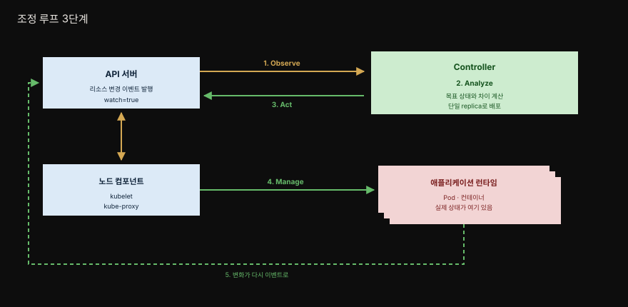

# 27장 · Controller — Observe-Analyze-Act로 상태를 조정하기

> Advanced 카테고리의 첫 패턴입니다. Kubernetes를 코드 수정 없이 확장하는 표준 메커니즘으로, 리소스를 감시하고 현재 상태를 목표 상태에 끊임없이 맞추는 조정(reconciliation) 프로세스입니다.

## 핵심 요약

> Controller는 Kubernetes 리소스를 원하는 상태로 능동적으로 감시·유지하는 조정 프로세스입니다.

Kubernetes의 심장은 사실 컨트롤러 무리입니다. 이들이 애플리케이션의 현재 상태를 선언된 목표 상태와 끊임없이 맞추기 때문에, Kubernetes는 본질적으로 분산 상태 관리자로 볼 수 있습니다. 우리가 Deployment의 `replicas`를 3으로 바꾸면 "Pod를 만들어라"라고 명령하는 게 아니라 "이 컴포넌트는 3개여야 한다"는 목표를 선언할 뿐이고 나머지는 컨트롤러가 알아서 조정합니다.

Controller 패턴의 매력은 이 조정 메커니즘을 우리도 재사용할 수 있다는 데 있습니다. 내장 컨트롤러가 표준 리소스를 다루듯, 커스텀 컨트롤러를 이벤트 기반으로 native하게 끼워 넣어 플랫폼을 확장할 수 있습니다. Kubernetes 코드를 건드리지 않고도 우리 use case에 맞는 동작을 더하는 것입니다. 그 확장이 더 정교해지면 다음 장의 Operator가 됩니다.

## 학습 목표

> 이 장을 읽고 나면 다음을 설명할 수 있어야 합니다.

- 선언적 API와 상태 조정(state reconciliation)의 관계를 설명할 수 있습니다.
- Observe-Analyze-Act 조정 루프의 세 단계를 각각 설명할 수 있습니다.
- Controller와 Operator를 무엇이 가르는지(커스텀 리소스 사용 여부) 압니다.
- 컨트롤러가 데이터를 저장할 때 label·annotation·ConfigMap·CRD 중 무엇이 적합한지 판단할 수 있습니다.
- 컨트롤러가 Singleton Service와 Ambassador 같은 다른 패턴을 어떻게 활용하는지 이해합니다.

## 본문 정리

### 문제 — Kubernetes를 깨지 않고 확장하기

Kubernetes는 강력하지만 범용 오케스트레이션 플랫폼이라 모든 애플리케이션 use case를 덮지는 못합니다. 그렇다고 Kubernetes 코드를 고쳐 우리 요구를 넣는 것은 플랫폼을 깨뜨리고 유지보수를 불가능하게 만듭니다. 다행히 Kubernetes는 검증된 빌딩 블록 위에 특정 use case를 우아하게 얹을 수 있는 자연스러운 확장점을 제공합니다.

그 확장점의 뿌리가 선언적·리소스 중심 API입니다. 선언적 접근은 "어떻게 하라"가 아니라 "목표 상태가 어때야 하는가"를 기술합니다. 리소스 상태가 바뀌면 Kubernetes는 이벤트를 만들어 관심 있는 리스너들에게 뿌리고 리스너들은 리소스를 수정·삭제·생성하며 반응합니다. 이 반응이 또 다른 이벤트를 낳고 다른 컨트롤러가 그것을 받아 자기 동작을 수행합니다. 목표 상태와 현재 상태가 다를 때 이를 맞춰가는 이 전체 과정이 상태 조정입니다.

### 해결 — Observe-Analyze-Act 조정 루프

컨트롤러는 반응적(reactive)입니다. 시스템의 이벤트에 반응해 자기 동작을 수행하며 그 핵심은 끝없이 도는 조정 루프입니다. 루프는 세 단계로 이루어집니다.

**Observe(감시).** 관찰 대상 리소스가 바뀔 때 Kubernetes가 발행하는 이벤트를 지켜봐 실제 상태를 발견합니다.

**Analyze(판단).** 목표 상태와의 차이를 판단합니다. "지금 Pod가 몇 개 부족한가?" 같은 계산입니다.

**Act(행동).** 실제 상태를 목표 상태로 밀어붙이는 조작을 수행합니다. 그리고 이 행동이 만든 변화가 다시 이벤트가 되어 Observe로 돌아옵니다.

가장 익숙한 예가 ReplicaSet 컨트롤러입니다. ReplicaSet 리소스 변화를 감시하고(Observe), 몇 개의 Pod가 돌아야 하는지 분석하고(Analyze), Pod 정의를 API 서버에 제출합니다(Act). 그러면 Kubernetes 백엔드가 요청된 Pod를 노드에서 시작시킵니다.

### 진화 — Controller에서 Operator로

컨트롤러는 Kubernetes 컨트롤 플레인의 일부지만 일찍이 플랫폼을 커스텀 동작으로 확장하는 표준 메커니즘이 되었습니다. 여기서 더 정교한 세대가 태어난 것이 Operator입니다. 조정 컴포넌트는 복잡도에 따라 두 부류로 나뉩니다.

**Controller**는 표준 Kubernetes 리소스를 감시·조작하는 단순한 조정 프로세스입니다. 플랫폼 동작을 강화하거나 새 기능을 더하며 대개 클러스터 사용자에게는 보이지 않게 동작합니다. **Operator**는 CRD(CustomResourceDefinition)를 다루는 정교한 조정으로, 복잡한 애플리케이션 도메인 로직을 캡슐화하고 전체 생애주기를 관리합니다. 둘을 가르는 경계는 "커스텀 리소스를 쓰는가"입니다.

### 설계 고려 — 동시성과 데이터 저장

여러 컨트롤러가 같은 리소스를 동시에 건드리면 충돌이 납니다. 이를 막기 위해 컨트롤러는 Singleton Service 패턴(10장)을 씁니다. 대부분 단일 replica의 Deployment로 배포되고 Kubernetes가 리소스 수준에서 낙관적 잠금(optimistic locking)을 걸어 동시성 문제를 예방합니다. 결국 컨트롤러는 백그라운드에서 영원히 도는 애플리케이션일 뿐입니다.

컨트롤러가 목표 상태를 어디에 저장할지도 판단이 필요합니다. **Label**은 백엔드에 인덱싱되어 쿼리에서 효율적으로 검색되므로, selector 같은 기능이 필요할 때 씁니다(단, 영숫자와 문법 제약이 있습니다). **Annotation**은 인덱싱되지 않으므로, 쿼리 키로 쓰지 않는 비식별 임의 메타데이터에 적합하고 내부 성능에 영향을 주지 않습니다. 더 큰 목표 상태 정의가 필요하면 **ConfigMap**을 쓸 수 있지만 커스텀 목표 상태 명세에는 **CRD**가 훨씬 낫습니다. 다만 CRD 등록에는 cluster-level 권한이 필요하므로, 그 권한이 없으면 ConfigMap이 차선입니다.

### 예시 — 셸 스크립트 컨트롤러

책은 셸 스크립트 하나로 된 컨트롤러를 예로 듭니다. 이 컨트롤러는 ConfigMap을 감시하다가, `k8spatterns.io/podDeleteSelector` 어노테이션이 붙은 ConfigMap이 바뀌면 그 selector에 맞는 Pod들을 삭제합니다. Deployment 같은 상위 리소스가 뒤를 받치고 있으면 삭제된 Pod가 재시작되면서 바뀐 설정을 집어 올립니다.

동작의 핵심은 `watch=true` 쿼리 파라미터입니다. 이 파라미터는 API 서버에게 HTTP 연결을 닫지 말고 이벤트가 생길 때마다 응답 채널로 보내라고 지시합니다(hanging GET). 스크립트는 도착하는 이벤트를 하나씩 읽어 처리합니다. 흥미로운 점은 스크립트가 `localhost:8001`로 API 서버에 접속한다는 것인데, 이는 Ambassador 컨테이너(18장)를 같은 Pod에 함께 배포해 `localhost:8001`을 실제 Kubernetes Service로 프록시하기 때문입니다.

## 심화 학습

### Spring 개발자에게 — Operator SDK의 Java 지원

컨트롤러는 Kubernetes가 Go로 쓰였고 완전한 Go 클라이언트 라이브러리가 있어 Go로 작성되는 경우가 많습니다. 하지만 책은 분명히 합니다 — API 서버에 요청을 보낼 수 있으면 어떤 언어로도 컨트롤러를 쓸 수 있습니다. Spring/Java 개발자라면 [Fabric8 Kubernetes Client](https://github.com/fabric8io/kubernetes-client)나 공식 [Java client](https://github.com/kubernetes-client/java)로 리소스를 watch하며 조정 루프를 구현할 수 있습니다. 다음 장에서 볼 Operator SDK의 Java Operator Plugin(Quarkus 런타임 기반)도 같은 흐름을 프레임워크로 받쳐줍니다.

주목할 대응은 조정 루프가 Spring의 이벤트 기반 사고와 닮았다는 점입니다. `@EventListener`로 애플리케이션 이벤트에 반응하듯, 컨트롤러는 리소스 lifecycle 이벤트에 반응합니다. 차이는 Spring 이벤트가 대개 한 프로세스 안의 동기 흐름인 반면, 컨트롤러는 클러스터 전체에 걸친 비동기 이벤트 스트림을 다룬다는 것입니다.

### 비동기의 대가 — 디버깅

컨트롤러가 가능한 이유는 Kubernetes 아키텍처가 고도로 모듈화되고 이벤트 기반이기 때문입니다. 이 구조는 자연스럽게 느슨하게 결합된 비동기 확장점으로 이어지고 Kubernetes 자체와 확장 사이에 정확한 기술적 경계를 만듭니다. 그러나 비동기의 대가도 있습니다. 이벤트 흐름이 늘 직선적이지 않아 디버깅이 어렵고 특정 상황을 살펴보려고 브레이크포인트로 모든 것을 멈추기가 곤란합니다. 또한 연결이 언제든 끊길 수 있으므로, 프로덕션급 컨트롤러는 이벤트만 지켜보는 게 아니라 때때로 API 서버에서 전체 현재 상태를 조회해 새 base로 삼아야 합니다. 예시 스크립트가 이벤트 루프가 끊길 수 있는 것처럼, 견고함은 별도의 노력을 요구합니다.

## 실무 적용

- **컨트롤러는 단일 replica로 배포합니다.** Singleton Service로 동시 조정 충돌을 막고 낙관적 잠금에 기댑니다.
- **데이터 저장 위치를 목적에 맞게 고릅니다.** selector가 필요하면 label, 임의 메타데이터는 annotation, 구조화된 목표 상태는 CRD(권한 없으면 ConfigMap)를 씁니다.
- **프로덕션 컨트롤러는 주기적 전체 조회로 base를 갱신합니다.** watch 스트림만 믿으면 끊긴 이벤트를 놓칩니다.
- **API 접근은 Ambassador로 단순화합니다.** 사이드카 프록시가 `localhost`로 API를 노출하면 컨트롤러 로직이 인증·엔드포인트를 몰라도 됩니다.
- **실무에서는 프레임워크를 씁니다.** 셸 스크립트는 개념 학습용이고 실제로는 Kubebuilder나 Operator SDK로 에러 처리·재시도를 갖춥니다.

## 체크리스트

- [ ] 컨트롤러가 단일 replica로 배포되어 동시 조정이 방지되는가?
- [ ] 조정 루프가 Observe-Analyze-Act 세 단계를 명확히 갖는가?
- [ ] 목표 상태 데이터가 label/annotation/ConfigMap/CRD 중 적절한 곳에 저장되는가?
- [ ] watch 연결이 끊길 때 재시작하고 전체 상태를 재조회하는 로직이 있는가?
- [ ] API 접근에 적절한 권한을 가진 ServiceAccount가 붙어 있는가?
- [ ] 비동기 흐름을 추적할 로깅·관측 수단이 마련돼 있는가?

## 면접 관점

**Q. Kubernetes에서 "선언적"이라는 게 컨트롤러와 어떻게 연결되나요?**
선언적 API에서 우리는 "어떻게 하라"가 아니라 "목표 상태가 어때야 하는가"만 기술합니다. Deployment의 `replicas`를 바꾸면 Pod 생성을 명령하는 게 아니라 목표 개수를 선언할 뿐입니다. 실제로 그 상태를 만드는 것은 컨트롤러입니다. 컨트롤러는 조정 루프를 돌며 현재 상태를 목표 상태에 맞추므로, 선언적 API가 성립하려면 그 뒤에 조정하는 컨트롤러가 반드시 있어야 합니다.

**Q. 조정 루프의 세 단계를 설명해 주세요.**
Observe는 리소스 변화 이벤트를 감시해 실제 상태를 발견하고 Analyze는 목표 상태와의 차이를 판단하며 Act는 실제 상태를 목표로 밀어붙이는 조작을 수행합니다. Act가 만든 변화가 다시 이벤트가 되어 Observe로 돌아오는 끝없는 순환입니다. ReplicaSet 컨트롤러가 ReplicaSet 변화를 감시하고 필요한 Pod 수를 계산해 Pod 정의를 제출하는 것이 전형적인 예입니다.

**Q. Controller와 Operator의 차이는 무엇인가요?**
Controller는 표준 Kubernetes 리소스를 감시·조작하는 단순한 조정 프로세스이고 Operator는 CRD를 다루며 복잡한 애플리케이션 도메인 로직을 캡슐화하는 정교한 조정입니다. 둘을 가르는 경계는 커스텀 리소스(CRD)를 사용하는지 여부입니다. Operator는 is-a 관계로 Controller의 특성을 모두 가지면서 CRD를 더한 것입니다.

## 참고 자료

- Bilgin Ibryam·Roland Huß, *Kubernetes Patterns, 2nd Edition*, 27장 Controller (O'Reilly, 2023)
- [Kubernetes 공식 — Controllers](https://kubernetes.io/docs/concepts/architecture/controller/)
- [Kubernetes 공식 — Writing Controllers 가이드라인](https://github.com/kubernetes/community/blob/master/contributors/devel/sig-api-machinery/controllers.md)
- [stakater/Reloader — ConfigMap/Secret 변경 감시 컨트롤러](https://github.com/stakater/Reloader)
- 개념 노트: [Operator 패턴](../../kubernetes/08_extending/08-01.Operator%20%ED%8C%A8%ED%84%B4.md)
- 정독 노트: [14장 Self Awareness](./14-01.Self%20Awareness%20%E2%80%94%20downward%20API%EB%A1%9C%20%EC%9E%90%EA%B8%B0%20%EB%A9%94%ED%83%80%EB%8D%B0%EC%9D%B4%ED%84%B0%20%EC%96%BB%EA%B8%B0.md) · [18장 Ambassador](./18-01.Ambassador%20%E2%80%94%20%EB%B0%94%EA%B9%A5%EC%84%B8%EC%83%81%EC%9C%BC%EB%A1%9C%EC%9D%98%20smart%20proxy.md) · [28장 Operator](./28-01.Operator%20%E2%80%94%20CRD%EB%A1%9C%20%EB%8F%84%EB%A9%94%EC%9D%B8%20%EC%A7%80%EC%8B%9D%EC%9D%84%20%EC%9E%90%EB%8F%99%ED%99%94%ED%95%98%EA%B8%B0.md)
