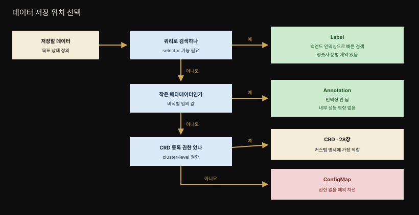
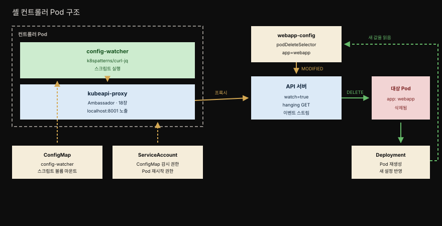

# 27장 · Controller — Observe-Analyze-Act로 상태를 조정하기

> Advanced 카테고리의 첫 패턴입니다. Kubernetes를 코드 수정 없이 확장하는 표준 메커니즘으로, 리소스를 감시하고 현재 상태를 목표 상태에 끊임없이 맞추는 조정(reconciliation) 프로세스입니다.


앰버 화살표가 관찰 방향이고 초록 화살표가 조작과 되먹임입니다. 점선이 실제 상태의 변화가 다시 이벤트가 되어 돌아오는 경로이며, 이 순환에는 끝이 없습니다.


## 핵심 요약

> Controller는 Kubernetes 리소스를 원하는 상태로 능동적으로 감시·유지하는 조정 프로세스입니다.

Kubernetes의 심장은 사실 컨트롤러 무리입니다. 이들이 애플리케이션의 현재 상태를 선언된 목표 상태와 끊임없이 맞추기 때문에, Kubernetes는 본질적으로 분산 상태 관리자로 볼 수 있습니다. 우리가 Deployment의 `replicas`를 3으로 바꾸면 "Pod를 만들어라"라고 명령하는 게 아니라 "이 컴포넌트는 3개여야 한다"는 목표를 선언할 뿐이고 나머지는 컨트롤러가 알아서 조정합니다.

Controller 패턴의 매력은 이 조정 메커니즘을 우리도 재사용할 수 있다는 데 있습니다. 내장 컨트롤러가 표준 리소스를 다루듯, 커스텀 컨트롤러를 이벤트 기반으로 native하게 끼워 넣어 플랫폼을 확장할 수 있습니다. Kubernetes 코드를 건드리지 않고도 우리 use case에 맞는 동작을 더하는 것입니다. 그 확장이 더 정교해지면 다음 장의 Operator가 됩니다.


## 학습 목표

> 이 장을 읽고 나면 다음을 설명할 수 있어야 합니다.

1. 선언적 API와 상태 조정(state reconciliation)의 관계를 설명할 수 있습니다.
2. Observe-Analyze-Act 조정 루프의 세 단계를 각각 설명할 수 있습니다.
3. Controller와 Operator를 무엇이 가르는지 압니다.
4. 컨트롤러가 데이터를 저장할 때 label·annotation·ConfigMap·CRD 중 무엇이 적합한지 판단할 수 있습니다.
5. `watch=true`와 hanging GET이 무엇을 하는지 설명할 수 있습니다.
6. 컨트롤러가 Singleton Service와 Ambassador 같은 다른 패턴을 어떻게 활용하는지 이해합니다.
7. 프로덕션급 컨트롤러가 이벤트 감시만으로 부족한 이유를 말할 수 있습니다.


## 문제 — Kubernetes를 깨지 않고 확장하기

> 선언적 리소스 중심 API가 확장의 뿌리입니다. 상태 변화가 이벤트를 낳고, 그 이벤트에 반응하는 자리가 곧 확장점입니다.

Kubernetes는 강력하지만 범용 오케스트레이션 플랫폼이라 모든 애플리케이션 use case를 덮지는 못합니다. 그렇다고 Kubernetes 코드를 고쳐 우리 요구를 넣는 것은 플랫폼을 깨뜨리고 유지보수를 불가능하게 만듭니다. 다행히 Kubernetes는 검증된 빌딩 블록 위에 특정 use case를 우아하게 얹을 수 있는 자연스러운 확장점을 제공합니다.

그 확장점의 뿌리가 선언적·리소스 중심 API입니다. 선언적 접근은 명령적(imperative) 접근과 달리 "어떻게 하라"를 말하지 않고 목표 상태가 어떤 모습이어야 하는지를 기술합니다. Deployment를 확장할 때 우리는 "새 Pod를 만들어라"라고 Kubernetes에게 지시하지 않습니다. 대신 Deployment 리소스의 `replicas` 속성을 API를 통해 원하는 수로 바꿉니다.

그러면 새 Pod는 누가 만드는가. 컨트롤러가 내부적으로 합니다. 리소스 상태에 변화가 생길 때마다 Kubernetes는 이벤트를 만들어 관심 있는 리스너 전부에게 뿌립니다. 리스너들은 리소스를 수정·삭제·생성하며 반응하고, 그 반응이 또 다른 이벤트를 낳습니다. 예컨대 Pod 생성 이벤트가 그렇습니다. 이 이벤트는 다시 다른 컨트롤러가 주워 자기 동작을 수행하는 재료가 됩니다.

이 전체 과정을 상태 조정(state reconciliation)이라고 부릅니다. 목표 상태는 우리가 원하는 replica 수이고 현재 상태는 실제로 도는 인스턴스 수입니다. 둘이 어긋날 때 그 차이를 좁혀 목표에 다시 도달시키는 것이 컨트롤러의 일입니다.

이 각도에서 보면 Kubernetes는 본질적으로 분산 상태 관리자입니다. 컴포넌트 인스턴스의 목표 상태를 주면, 무언가 바뀌더라도 그 상태를 유지하려 시도합니다.


## 해결 — Observe-Analyze-Act 조정 루프

> 컨트롤러는 반응적입니다. 이벤트에 반응해 실제 상태를 발견하고, 차이를 판단하고, 그 차이를 줄이는 조작을 수행합니다.

Kubernetes에는 ReplicaSet·DaemonSet·StatefulSet·Deployment·Service 같은 표준 리소스를 관리하는 내장 컨트롤러 모음이 딸려 옵니다. 이들은 컨트롤 플레인 노드에 배포되는 controller manager의 일부로 돌아갑니다. 독립 프로세스일 수도 있고 Pod일 수도 있습니다. 이 컨트롤러들은 서로의 존재를 모릅니다. 각자 끝없는 조정 루프를 돌며 자기 리소스의 실제 상태와 목표 상태를 감시하고 그에 맞게 행동할 뿐입니다.

내장 컨트롤러 외에도 Kubernetes의 이벤트 기반 아키텍처는 커스텀 컨트롤러를 native하게 끼워 넣게 해 줍니다. 커스텀 컨트롤러는 내부 컨트롤러와 똑같은 방식으로 상태 변경 이벤트에 반응해 동작을 더합니다. 컨트롤러의 공통된 성격은 반응적(reactive)이라는 것입니다. 시스템의 이벤트에 반응해 자기 몫의 행동을 합니다.

높은 수준에서 이 조정 과정은 세 단계로 이루어집니다.

1. **Observe(감시)** — 감시 대상 리소스가 바뀔 때 Kubernetes가 발행하는 이벤트를 지켜봐 실제 상태를 발견합니다.
2. **Analyze(판단)** — 목표 상태와의 차이를 판단합니다.
3. **Act(행동)** — 실제 상태를 목표 상태로 몰고 가는 조작을 수행합니다.

가장 익숙한 예가 ReplicaSet 컨트롤러입니다. 세 단계가 이렇게 대응합니다.

- ReplicaSet 리소스의 변화를 감시합니다.
- 몇 개의 Pod가 돌아야 하는지 분석합니다.
- Pod 정의를 API 서버에 제출합니다.

그러면 Kubernetes 백엔드가 요청된 Pod를 노드에서 시작시킵니다. Act가 만든 변화는 다시 이벤트가 되어 Observe로 돌아옵니다.

### 진화 — Controller에서 Operator로

컨트롤러는 Kubernetes 컨트롤 플레인의 일부지만, 일찍이 플랫폼을 커스텀 동작으로 확장하는 표준 메커니즘이 되었습니다. 복잡한 애플리케이션 생애주기 관리까지 가능해지면서 더 정교한 세대가 태어났고 그것이 Operator입니다. 진화와 복잡도의 관점에서 능동적 조정 컴포넌트는 두 부류로 나뉩니다.

| 부류 | 다루는 리소스 | 성격 |
|------|-------------|------|
| **Controller** | 표준 Kubernetes 리소스 | 단순한 조정 프로세스. 플랫폼 동작을 강화하거나 새 기능을 더하며 대개 클러스터 사용자에게 보이지 않습니다 |
| **Operator** | CustomResourceDefinition(CRD) | 정교한 조정 프로세스. 복잡한 애플리케이션 도메인 로직을 캡슐화하고 전체 생애주기를 관리합니다 |

둘을 가르는 경계는 커스텀 리소스를 쓰는지 여부입니다. 이 분류는 개념을 단계적으로 소개하기 위한 것이고, 이 장은 더 단순한 컨트롤러에 집중합니다. CRD와 Operator는 28장에서 다룹니다.

### 동시성 — Singleton Service

여러 컨트롤러가 같은 리소스를 동시에 건드리면 충돌이 납니다. 이를 막기 위해 컨트롤러는 Singleton Service 패턴(10장)을 씁니다. 대부분 단일 replica의 Deployment로 배포되고, Kubernetes가 리소스 수준에서 낙관적 잠금(optimistic locking)을 걸어 리소스 객체를 바꿀 때 생기는 동시성 문제를 예방합니다. 결국 컨트롤러는 백그라운드에서 영원히 도는 애플리케이션일 뿐입니다.

Kubernetes 자체가 Go로 쓰였고 완전한 Go 클라이언트 라이브러리도 Go로 되어 있어 많은 컨트롤러가 Go로 작성됩니다. 하지만 Kubernetes API 서버에 요청을 보낼 수만 있으면 어떤 프로그래밍 언어로도 컨트롤러를 쓸 수 있습니다. 이 장 뒤에서 순수 셸 스크립트로 된 컨트롤러를 봅니다.


## 데이터를 어디에 저장할 것인가

> 컨트롤러는 리소스 정의의 어느 필드든 감시하고 그에 따라 행동할 수 있지만, metadata와 ConfigMap이 이 목적에 가장 적합합니다.



가장 단순한 형태의 컨트롤러는 Kubernetes가 자기 리소스를 관리하는 방식을 확장합니다. 표준 리소스에 작동하며 내부 컨트롤러와 비슷한 일을 하지만 클러스터 사용자에게는 보이지 않습니다. 컨트롤러 데이터를 어디에 둘지 고를 때 고려할 사항은 셋입니다.

**Label**은 리소스 metadata의 일부로 어떤 컨트롤러든 감시할 수 있습니다. 백엔드 데이터베이스에 인덱싱되어 쿼리에서 효율적으로 검색됩니다. selector 같은 기능이 필요할 때 label을 씁니다. Service나 Deployment의 Pod를 매칭하는 경우가 그렇습니다. 한계는 영숫자 위주의 제한된 이름과 값만 쓸 수 있다는 점입니다.[^labels]

**Annotation**은 label의 훌륭한 대안입니다. 값이 label의 문법 제약에 맞지 않으면 label 대신 annotation을 써야 합니다. annotation은 인덱싱되지 않으므로 컨트롤러 쿼리의 키로 쓰지 않는 비식별 정보에 적합합니다.[^annotations] 임의의 metadata에 label보다 annotation을 선호하면 Kubernetes 내부 성능에 나쁜 영향을 주지 않는다는 이점도 따라옵니다.

**ConfigMap**은 label이나 annotation에 잘 맞지 않는 추가 정보가 필요할 때 목표 상태 정의를 담는 그릇이 됩니다. 컨트롤러가 이 ConfigMap을 감시하고 읽습니다. 다만 커스텀 목표 상태 명세를 설계하는 데는 CRD가 훨씬 낫고 권장됩니다. CRD 등록에는 클러스터 수준의 상승된 권한이 필요하므로, 그 권한이 없다면 ConfigMap이 여전히 최선의 대안입니다.

### 참고할 만한 실제 컨트롤러

책이 이 패턴의 구현 사례로 꼽는 비교적 단순한 컨트롤러들입니다.

- **jenkins-x/exposecontroller** — Service 정의를 감시하다가 metadata에 `expose`라는 annotation이 붙은 것을 발견하면 그 Service를 외부에서 접근할 수 있도록 Ingress 객체를 자동으로 만듭니다. Service가 삭제되면 Ingress 객체도 없앱니다. 현재는 아카이브된 프로젝트지만 단순한 컨트롤러 구현 예로는 여전히 좋습니다.
- **stakater/Reloader** — ConfigMap과 Secret 객체의 변화를 감시하다가 연관된 워크로드를 롤링 업그레이드합니다. 대상은 Deployment·DaemonSet·StatefulSet 등입니다. ConfigMap을 감시해 새 설정으로 스스로를 갱신하지 못하는 애플리케이션에 이 컨트롤러를 쓸 수 있습니다. Pod가 ConfigMap을 환경변수로 소비할 때나, 재시작 없이는 빠르고 안정적으로 자기를 갱신하지 못하는 애플리케이션일 때 특히 그렇습니다.
- **Flatcar Linux Update Operator** — Node 리소스 객체에 특정 annotation이 붙는 것을 감지하면 Flatcar Container Linux로 돌아가는 Kubernetes 노드를 재부팅합니다.


## 예제 — 셸 스크립트 컨트롤러

> ConfigMap을 감시하다가 어노테이션에 맞는 Pod를 삭제해 설정을 다시 읽게 만드는 컨트롤러입니다. 셸 스크립트 하나로 이루어져 개념이 그대로 드러납니다.



컨트롤러 Pod 안에 컨테이너가 둘 들어간다는 점과, 메인 컨테이너가 `localhost:8001`로 API에 닿는 경로가 이 예제의 핵심 구조입니다.

이 컨트롤러는 ConfigMap 리소스의 변화를 감시합니다. 감시 대상 ConfigMap에 `k8spatterns.io/podDeleteSelector` 어노테이션을 붙여 두면, ConfigMap이 바뀔 때 그 label selector에 해당하는 Pod가 전부 삭제됩니다. 이 Pod들이 Deployment나 ReplicaSet 같은 상위 리소스로 뒷받침되고 있다면, 삭제된 Pod는 재시작되면서 바뀐 설정을 집어 올립니다.

감시 대상 ConfigMap은 이렇게 생겼습니다. 웹 애플리케이션에 환영 메시지를 제공하는 용도입니다.

```yaml
apiVersion: v1
kind: ConfigMap
metadata:
  name: webapp-config
  annotations:
    k8spatterns.io/podDeleteSelector: "app=webapp"   # 1. 재시작할 Pod를 고르는 selector
data:
  message: "Welcome to Kubernetes Patterns !"
```

### watch=true와 hanging GET

컨트롤러 스크립트의 핵심은 조정 루프이고, 그 루프는 ConfigMap 생애주기 이벤트를 듣습니다.

```bash
namespace=${WATCH_NAMESPACE:-default}                        # 1. 감시할 namespace
base=http://localhost:8001                                   # 2. 같은 Pod 안 프록시로 API 접근
ns=namespaces/$namespace

curl -N -s $base/api/v1/${ns}/configmaps?watch=true | \       # 3. ConfigMap 이벤트 감시 루프
while read -r event
do
    # ...
done
```

동작의 핵심은 `watch=true` 쿼리 파라미터입니다. 이 파라미터는 API 서버에게 HTTP 연결을 닫지 말고 이벤트가 생기는 대로 응답 채널로 보내라고 지시합니다.[^watch] 이런 기법을 hanging GET 또는 Comet이라고 부릅니다. 루프는 도착하는 개별 이벤트를 하나씩 읽어 처리합니다.

`WATCH_NAMESPACE` 환경변수는 컨트롤러가 ConfigMap 갱신을 감시할 namespace를 지정합니다. 이 값은 컨트롤러 자신의 Deployment 서술자에서 설정하며, 예제에서는 14장 Self Awareness의 Downward API를 써서 컨트롤러가 배포된 namespace를 그대로 감시하게 합니다.[^downward]

```yaml
env:
  - name: WATCH_NAMESPACE
    valueFrom:
      fieldRef:
        fieldPath: metadata.namespace
```

### 루프 안에서 하는 일

루프 본문은 이벤트에서 필요한 값을 뽑아 selector로 바꾼 뒤 Pod를 지웁니다.

```bash
curl -N -s $base/api/v1/${ns}/configmaps?watch=true | \
while read -r event
do
  type=$(echo "$event"        | jq -r '.type')                # 1. 이벤트 타입과 ConfigMap 이름 추출
  config_map=$(echo "$event"  | jq -r '.object.metadata.name')
  annotations=$(echo "$event" | jq -r '.object.metadata.annotations')

  if [ "$annotations" != "null" ]; then
    selector=$(echo $annotations | \                          # 2. podDeleteSelector 어노테이션 추출
      jq -r "\
        to_entries                                          |\
        .[]                                                 |\
        select(.key == \"k8spatterns.io/podDeleteSelector\") |\
        .value                                              |\
         @uri                                                \
      ")
  fi

  if [ $type = "MODIFIED" ] && [ -n "$selector" ]; then       # 3. 갱신 + 어노테이션 있으면 Pod 조회
    pods=$(curl -s $base/api/v1/${ns}/pods?labelSelector=$selector | \
           jq -r .items[].metadata.name)

    for pod in $pods; do                                      # 4. selector에 맞는 Pod 전부 삭제
      curl -s -X DELETE $base/api/v1/${ns}/pods/$pod
    done
  fi
done
```

`jq` 표현식이 하는 일은 어노테이션 값을 Pod selector로 바꾸는 것입니다. `to_entries`가 `{ "a": "b" }` 같은 JSON 객체를 `{ "key": "a", "value": "b" }` 형태의 배열로 바꾸고, `.[]`가 항목을 하나씩 고르고, `select`가 키가 일치하는 것만 남깁니다. 마지막으로 `.value`를 뽑아 `@uri`로 변환합니다. 결과적으로 `k8spatterns.io/podDeleteSelector: "app=webapp"`는 URI에 쓸 수 있는 `app%3Dwebapp`가 됩니다.

selector를 얻으면 그것으로 삭제할 Pod를 직접 고릅니다. 먼저 selector에 맞는 Pod를 전부 조회하고, 그다음 API 호출로 하나씩 지웁니다.

### 왜 localhost:8001인가

스크립트가 API 서버에 `localhost`로 접속한다는 점이 눈에 걸립니다. 이 스크립트를 API 컨트롤 플레인 노드에 직접 배포하지는 않을 텐데 어떻게 localhost를 쓸 수 있을까요.

여기서 또 다른 패턴이 등장합니다. 이 스크립트를 Ambassador 컨테이너(18장)와 함께 하나의 Pod에 배포하기 때문입니다. Ambassador가 8001 포트를 localhost에 노출하고 그것을 실제 Kubernetes Service로 프록시합니다. 컨트롤러 Deployment는 컨테이너 둘로 Pod를 만듭니다.

- **kubeapi-proxy** — Kubernetes API를 localhost 8001 포트에 노출하는 Ambassador 컨테이너입니다. `k8spatterns/kubeapi-proxy` 이미지는 로컬 `kubectl`을 설치하고 적절한 CA와 토큰을 마운트해 `kubectl proxy`를 띄운 Alpine Linux입니다.
- **config-watcher** — 방금 만든 ConfigMap에 담긴 스크립트를 실행하는 메인 컨테이너입니다. `curl`과 `jq`가 설치된 Alpine 기반 이미지를 씁니다.

```yaml
apiVersion: apps/v1
kind: Deployment
# ....
spec:
  template:
    # ...
    spec:
      serviceAccountName: config-watcher-controller   # 1. 감시·재시작 권한을 가진 ServiceAccount
      containers:
        - name: kubeapi-proxy                         # 2. API를 localhost로 프록시하는 Ambassador
          image: k8spatterns/kubeapi-proxy
        - name: config-watcher                        # 3. 도구를 갖추고 스크립트를 마운트하는 메인 컨테이너
          image: k8spatterns/curl-jq
          # ...
          command:                                    # 4. 컨트롤러 스크립트를 부르는 시작 명령
            - "sh"
            - "/watcher/config-watcher-controller.sh"
          volumeMounts:                               # 5. 스크립트를 담은 ConfigMap 볼륨
            - mountPath: "/watcher"
              name: config-watcher-controller
      volumes:
        - name: config-watcher-controller             # 6. ConfigMap 기반 볼륨을 메인 컨테이너에 마운트
          configMap:
            name: config-watcher-controller
```

컨트롤러 스크립트 자체는 `config-watcher-controller` ConfigMap에 저장되어 있어 나중에 쉽게 고칠 수 있습니다. 예제에서는 간결함을 위해 liveness·readiness 검사와 자원 제한 선언을 생략했습니다. ConfigMap을 감시할 수 있는 `config-watcher-controller` ServiceAccount도 필요하며 전체 보안 설정은 예제 저장소에 있습니다.

이 셸 스크립트 컨트롤러는 물론 프로덕션급이 아닙니다. 이벤트 루프가 언제든 멈출 수 있습니다. 그래도 군더더기 없이 기본 개념을 드러내 보여 줍니다.


## Spring·Java 개발자 관점

> 조정 루프는 Spring의 이벤트 기반 사고와 닮았습니다. 다른 점은 경계가 프로세스가 아니라 클러스터라는 것입니다.

컨트롤러가 Go로 작성되는 경우가 많은 것은 Kubernetes 자체가 Go로 쓰였고 완전한 Go 클라이언트 라이브러리가 있기 때문입니다. 하지만 책은 분명히 합니다. API 서버에 요청을 보낼 수 있으면 어떤 언어로도 컨트롤러를 쓸 수 있습니다.

Spring이나 Java 개발자라면 [Fabric8 Kubernetes Client](https://github.com/fabric8io/kubernetes-client)나 공식 [Java client](https://github.com/kubernetes-client/java)로 리소스를 watch하며 조정 루프를 구현할 수 있습니다. 28장에서 볼 Operator SDK의 Java Operator Plugin도 같은 흐름을 프레임워크로 받쳐 줍니다.

주목할 대응은 조정 루프가 Spring의 이벤트 기반 사고와 닮았다는 점입니다. `@EventListener`로 애플리케이션 이벤트에 반응하듯, 컨트롤러는 리소스 lifecycle 이벤트에 반응합니다. 차이는 범위입니다. Spring 이벤트는 대개 한 프로세스 안의 동기 흐름인 반면, 컨트롤러는 클러스터 전체에 걸친 비동기 이벤트 스트림을 다룹니다.


## 비동기의 대가 — 디버깅과 견고함

> 느슨한 결합은 공짜가 아닙니다. 이벤트 흐름이 직선적이지 않아 추적이 어렵고, 연결은 언제든 끊깁니다.

컨트롤러가 가능한 이유는 Kubernetes 아키텍처가 고도로 모듈화되고 이벤트 기반이기 때문입니다. 이 구조는 자연스럽게 느슨하게 결합된 비동기 확장점으로 이어지고, Kubernetes 자체와 우리 확장 사이에 정확한 기술적 경계를 만듭니다.

그러나 대가가 따릅니다. 비동기라서 디버깅이 어렵습니다. 이벤트 흐름이 늘 직선적이지 않기 때문입니다. 결과적으로 특정 상황을 살펴보려고 컨트롤러에 브레이크포인트를 걸어 모든 것을 멈추기가 곤란합니다.

견고함도 별도의 노력을 요구합니다. 이런 식으로 이벤트를 감시하는 것은 그리 견고하지 않습니다. 연결은 언제든 끊길 수 있으므로 루프를 재시작하는 방법이 있어야 합니다. 또한 이벤트를 놓칠 수 있습니다. 그래서 프로덕션급 컨트롤러는 이벤트만 지켜보는 게 아니라 때때로 API 서버에서 전체 현재 상태를 조회해 새 base로 삼아야 합니다. 예제 스크립트는 패턴을 보이는 목적에는 충분하지만 그 이상은 아닙니다.


## 능동 회상

> 먼저 스스로 답해 본 뒤 아래 정답 절에서 맞춰 봅니다. 정답은 이 절 다음에 번호 순서대로 있습니다.

1. Kubernetes에서 "선언적"이라는 성질이 컨트롤러의 존재와 어떻게 연결되나요?
2. 조정 루프의 세 단계를 ReplicaSet 컨트롤러에 대응시켜 설명해 보세요.
3. Controller와 Operator를 가르는 경계는 무엇인가요?
4. 컨트롤러를 단일 replica로 배포하는 이유는 무엇인가요?
5. label과 annotation은 각각 언제 쓰나요? 무엇이 둘을 가르나요?
6. label·annotation으로 부족할 때 ConfigMap과 CRD 중 무엇을 고르나요?
7. `watch=true`는 API 서버에 무엇을 지시하나요? 이 기법을 무엇이라 부르나요?
8. 컨트롤러 스크립트가 `localhost:8001`로 API에 접속할 수 있는 이유는 무엇인가요?
9. 프로덕션급 컨트롤러가 이벤트 감시만으로 부족한 이유는 무엇인가요?
10. 비동기 이벤트 기반 구조가 주는 이점과 대가를 각각 하나씩 말해 보세요.


## 정답

> 위 회상 질문의 답입니다. 번호가 대응합니다.

**1.** 선언적 API에서 우리는 "어떻게 하라"가 아니라 목표 상태가 어때야 하는지만 기술합니다. Deployment의 `replicas`를 바꾸면 Pod 생성을 명령하는 게 아니라 목표 개수를 선언할 뿐입니다. 실제로 그 상태를 만드는 것은 컨트롤러입니다. 따라서 선언적 API가 성립하려면 그 뒤에 조정하는 컨트롤러가 반드시 있어야 합니다.

**2.** Observe는 리소스 변화 이벤트를 감시해 실제 상태를 발견합니다. Analyze는 목표 상태와의 차이를 판단합니다. Act는 실제 상태를 목표로 밀어붙이는 조작을 수행합니다. ReplicaSet 컨트롤러라면 ReplicaSet 리소스 변화를 감시한 뒤 몇 개의 Pod가 돌아야 하는지 분석하고 Pod 정의를 API 서버에 제출합니다. Act가 만든 변화는 다시 이벤트가 되어 Observe로 돌아옵니다.

**3.** 커스텀 리소스(CRD)를 사용하는지 여부입니다. Controller는 표준 Kubernetes 리소스를 감시·조작하는 단순한 조정 프로세스이고, Operator는 CRD를 다루며 복잡한 애플리케이션 도메인 로직을 캡슐화하는 정교한 조정입니다.

**4.** 여러 컨트롤러가 같은 리소스를 동시에 건드리는 것을 막기 위해서입니다. Singleton Service 패턴(10장)을 적용해 대부분 단일 replica Deployment로 배포하고, Kubernetes가 리소스 수준에서 낙관적 잠금을 걸어 동시성 문제를 예방합니다.

**5.** label은 백엔드에 인덱싱되어 쿼리에서 효율적으로 검색되므로 selector 같은 기능이 필요할 때 씁니다. 다만 영숫자 위주의 문법 제약이 있습니다. annotation은 인덱싱되지 않으므로 쿼리 키로 쓰지 않는 비식별 임의 메타데이터에 적합하고, 값이 label의 문법 제약에 맞지 않을 때도 annotation을 씁니다. 임의 메타데이터에 annotation을 선호하면 내부 성능에도 영향을 주지 않습니다.

**6.** 커스텀 목표 상태 명세를 설계하는 데는 CRD가 훨씬 낫고 권장됩니다. 다만 CRD 등록에는 클러스터 수준의 상승된 권한이 필요하므로, 그 권한이 없다면 ConfigMap이 최선의 대안입니다.

**7.** HTTP 연결을 닫지 말고 이벤트가 생기는 대로 응답 채널로 보내라고 지시합니다. 이 기법을 hanging GET 또는 Comet이라고 부릅니다. 루프는 도착하는 개별 이벤트를 하나씩 읽어 처리합니다.

**8.** 스크립트가 Ambassador 컨테이너(18장)와 같은 Pod에 배포되기 때문입니다. `kubeapi-proxy` 컨테이너가 8001 포트를 localhost에 노출하고 그것을 실제 Kubernetes Service로 프록시합니다. 덕분에 컨트롤러 로직은 인증이나 엔드포인트 주소를 몰라도 됩니다.

**9.** 연결이 언제든 끊길 수 있고 그 사이 이벤트를 놓칠 수 있기 때문입니다. 그래서 프로덕션급 컨트롤러는 이벤트만 지켜보는 게 아니라 때때로 API 서버에서 전체 현재 상태를 조회해 새 base로 삼아야 하고, 루프가 끊겼을 때 재시작하는 방법도 갖춰야 합니다.

**10.** 이점은 Kubernetes 자체와 확장 사이에 정확한 기술적 경계가 생겨 느슨하게 결합된다는 것입니다. 대가는 디버깅이 어렵다는 것입니다. 이벤트 흐름이 늘 직선적이지 않아 브레이크포인트로 모든 것을 멈추고 특정 상황을 살펴보기가 곤란합니다.


## 실무 적용

- **컨트롤러는 단일 replica로 배포합니다.** Singleton Service로 동시 조정 충돌을 막고 낙관적 잠금에 기댑니다.
- **데이터 저장 위치를 목적에 맞게 고릅니다.** selector가 필요하면 label, 임의 메타데이터는 annotation, 구조화된 목표 상태는 CRD를 쓰고 권한이 없으면 ConfigMap으로 갑니다.
- **프로덕션 컨트롤러는 주기적 전체 조회로 base를 갱신합니다.** watch 스트림만 믿으면 끊긴 이벤트를 놓칩니다.
- **API 접근은 Ambassador로 단순화합니다.** 사이드카 프록시가 `localhost`로 API를 노출하면 컨트롤러 로직이 인증과 엔드포인트를 몰라도 됩니다.
- **감시할 namespace는 Downward API로 주입합니다.** 컨트롤러가 자기가 배포된 namespace를 그대로 감시하게 하면 설정이 하나 줄어듭니다.
- **실무에서는 프레임워크를 씁니다.** 셸 스크립트는 개념 학습용이고 실제로는 Kubebuilder나 Operator SDK로 에러 처리·재시도를 갖춥니다.


## 체크리스트

- [ ] 컨트롤러가 단일 replica로 배포되어 동시 조정이 방지되는가?
- [ ] 조정 루프가 Observe-Analyze-Act 세 단계를 명확히 갖는가?
- [ ] 목표 상태 데이터가 label/annotation/ConfigMap/CRD 중 적절한 곳에 저장되는가?
- [ ] watch 연결이 끊길 때 재시작하고 전체 상태를 재조회하는 로직이 있는가?
- [ ] API 접근에 적절한 권한을 가진 ServiceAccount가 붙어 있는가?
- [ ] 감시 대상 namespace가 하드코딩되지 않고 주입되는가?
- [ ] 비동기 흐름을 추적할 로깅·관측 수단이 마련돼 있는가?


## 면접 관점

**Q. Kubernetes에서 "선언적"이라는 게 컨트롤러와 어떻게 연결되나요?**
선언적 API에서 우리는 "어떻게 하라"가 아니라 "목표 상태가 어때야 하는가"만 기술합니다. Deployment의 `replicas`를 바꾸면 Pod 생성을 명령하는 게 아니라 목표 개수를 선언할 뿐입니다. 실제로 그 상태를 만드는 것은 컨트롤러입니다. 컨트롤러는 조정 루프를 돌며 현재 상태를 목표 상태에 맞추므로, 선언적 API가 성립하려면 그 뒤에 조정하는 컨트롤러가 반드시 있어야 합니다.

**Q. 조정 루프의 세 단계를 설명해 주세요.**
Observe는 리소스 변화 이벤트를 감시해 실제 상태를 발견합니다. Analyze는 목표 상태와의 차이를 판단합니다. Act는 실제 상태를 목표로 밀어붙이는 조작을 수행합니다. Act가 만든 변화가 다시 이벤트가 되어 Observe로 돌아오는 끝없는 순환입니다. ReplicaSet 컨트롤러가 ReplicaSet 변화를 감시하고 필요한 Pod 수를 계산해 Pod 정의를 제출하는 것이 전형적인 예입니다.

**Q. Controller와 Operator의 차이는 무엇인가요?**
Controller는 표준 Kubernetes 리소스를 감시·조작하는 단순한 조정 프로세스이고, Operator는 CRD를 다루며 복잡한 애플리케이션 도메인 로직을 캡슐화하는 정교한 조정입니다. 둘을 가르는 경계는 커스텀 리소스(CRD)를 사용하는지 여부입니다. Operator는 is-a 관계로 Controller의 특성을 모두 가지면서 CRD를 더한 것입니다.

**Q. 컨트롤러가 API 서버의 이벤트를 받는 방식을 설명해 주세요.**
`watch=true` 쿼리 파라미터를 붙여 요청하면 API 서버가 HTTP 연결을 닫지 않고 이벤트가 생기는 대로 응답 채널로 보냅니다. hanging GET 또는 Comet이라 부르는 기법입니다. 컨트롤러는 이 스트림에서 개별 이벤트를 하나씩 읽어 처리합니다. 다만 연결이 끊길 수 있어 프로덕션에서는 주기적으로 전체 상태를 조회해 base를 새로 잡아야 합니다.

**Q. 컨트롤러를 배포할 때 Ambassador 패턴이 왜 등장하나요?**
컨트롤러 로직이 Kubernetes API에 접근하려면 인증 토큰과 CA, 엔드포인트 주소를 다뤄야 합니다. Ambassador 컨테이너를 같은 Pod에 두면 그 컨테이너가 `kubectl proxy`로 API를 `localhost:8001`에 노출하고 실제 Service로 프록시합니다. 덕분에 컨트롤러 본체는 평범한 localhost HTTP 호출만 하면 되고 인증 관심사에서 벗어납니다.


## 참고 자료

- Bilgin Ibryam·Roland Huß, *Kubernetes Patterns, 2nd Edition*, 27장 Controller (O'Reilly, 2023)
- [Kubernetes 공식 — Controllers](https://kubernetes.io/docs/concepts/architecture/controller/)
- [Kubernetes 공식 — Writing Controllers 가이드라인](https://github.com/kubernetes/community/blob/master/contributors/devel/sig-api-machinery/controllers.md)
- [stakater/Reloader — ConfigMap/Secret 변경 감시 컨트롤러](https://github.com/stakater/Reloader)
- [jq 매뉴얼 — to_entries·select](https://jqlang.github.io/jq/manual/)

[^watch]: Kubernetes — API 개념의 efficient detection of changes(watch).
<https://kubernetes.io/docs/reference/using-api/api-concepts/#efficient-detection-of-changes>

[^labels]: Kubernetes — Labels and Selectors의 문법·문자 집합 제약.
<https://kubernetes.io/docs/concepts/overview/working-with-objects/labels/#syntax-and-character-set>

[^annotations]: Kubernetes — Annotations는 식별·선택에 쓰지 않는 메타데이터를 담습니다.
<https://kubernetes.io/docs/concepts/overview/working-with-objects/annotations/>

[^downward]: Kubernetes — Downward API로 Pod 필드를 환경변수에 노출합니다.
<https://kubernetes.io/docs/tasks/inject-data-application/environment-variable-expose-pod-information/>

---

- 개념 노트: [Operator 패턴](../../kubernetes/08_extending/08-01.Operator%20%ED%8C%A8%ED%84%B4.md)
- 정독 노트: [14장 Self Awareness](./14-01.Self%20Awareness%20%E2%80%94%20downward%20API%EB%A1%9C%20%EC%9E%90%EA%B8%B0%20%EB%A9%94%ED%83%80%EB%8D%B0%EC%9D%B4%ED%84%B0%20%EC%96%BB%EA%B8%B0.md) · [18장 Ambassador](./18-01.Ambassador%20%E2%80%94%20%EB%B0%94%EA%B9%A5%EC%84%B8%EC%83%81%EC%9C%BC%EB%A1%9C%EC%9D%98%20smart%20proxy.md) · [28장 Operator](./28-01.Operator%20%E2%80%94%20CRD%EB%A1%9C%20%EB%8F%84%EB%A9%94%EC%9D%B8%20%EC%A7%80%EC%8B%9D%EC%9D%84%20%EC%9E%90%EB%8F%99%ED%99%94%ED%95%98%EA%B8%B0.md)
