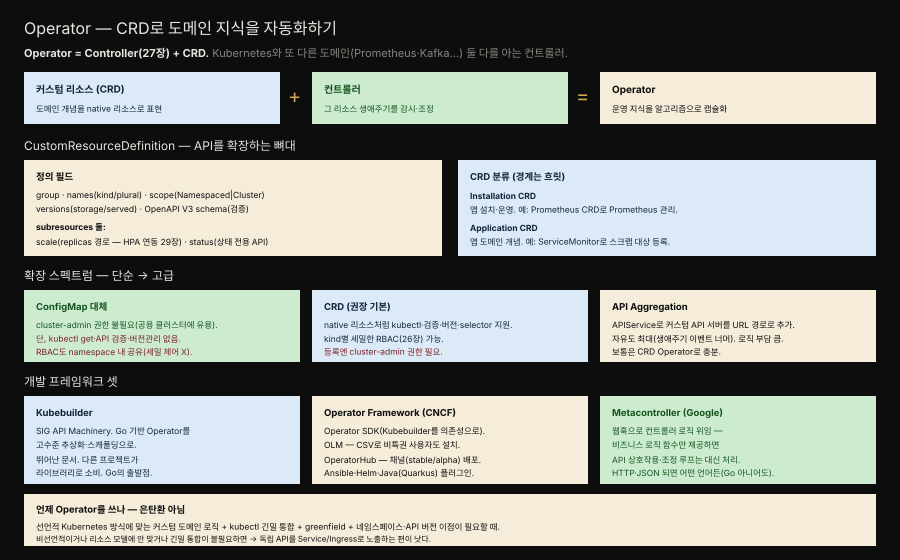
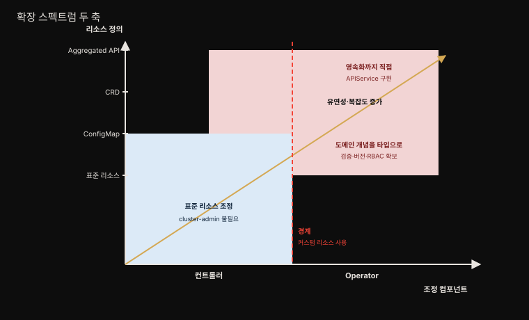
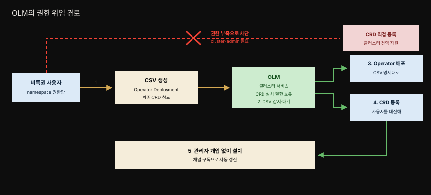
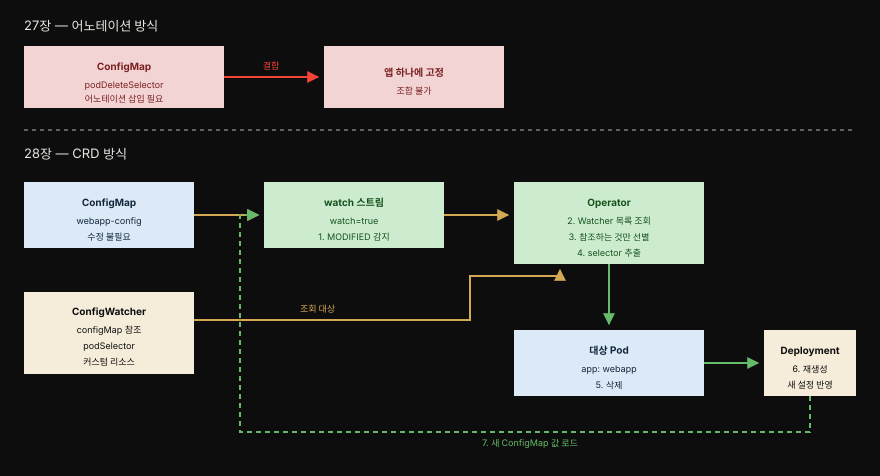

# 28장 · Operator — CRD로 도메인 지식을 자동화하기

> Controller 패턴을 CRD로 확장한 것입니다. 특정 애플리케이션의 운영 지식을 알고리즘적·자동화된 형태로 캡슐화해, 보통 사람이 해야 할 운영 작업을 코드로 대신합니다.



앰버 화살표가 선언이 반영되는 방향이고, 초록 화살표가 Operator의 조작과 되먹임입니다. 3번 watch에서 7번 status 기록까지가 27장의 Observe-Analyze-Act 루프에 해당합니다.


## 핵심 요약

> Operator는 CRD를 써서 운영 지식을 캡슐화하는 컨트롤러입니다. 한 문장으로, Operator = Controller + CRD입니다.

27장에서 커스텀 컨트롤러로 플랫폼을 확장하는 법을 봤습니다. 하지만 순수 컨트롤러에는 한계가 있습니다. Kubernetes 고유 리소스만 감시하고 관리할 수 있기 때문입니다. 때로는 새로운 도메인 개념 자체를 플랫폼에 추가하고 싶습니다. 예를 들어 Prometheus를 모니터링 수단으로 쓰면서, 다른 Kubernetes 리소스를 정의하듯 `Prometheus`라는 리소스로 모니터링 설정을 기술할 수 있다면 어떨까요.

이것이 CustomResourceDefinition(CRD)이 필요한 지점입니다. CRD는 Kubernetes API를 확장해 커스텀 리소스를 native 리소스처럼 다루게 합니다.[^crd] 커스텀 리소스와 그것에 작동하는 컨트롤러가 합쳐지면 Operator 패턴이 됩니다.

Jimmy Zelinskie의 정의가 이를 잘 압축합니다.

> Operator는 Kubernetes와 또 다른 도메인 둘 다를 이해하는 Kubernetes 컨트롤러다. 두 영역의 지식을 결합해, 보통 두 도메인을 아는 인간 운영자가 해야 할 작업을 자동화한다.

여기서 "두 도메인"이 핵심입니다. Kafka Operator는 Kubernetes를 알아야 하고 동시에 Kafka의 브로커 롤링 순서도 알아야 합니다. 그 둘을 다 아는 사람이 손으로 하던 절차가 곧 Operator에 담기는 운영 지식입니다.


## 학습 목표

> 이 장을 읽고 나면 다음을 설명할 수 있어야 합니다.

1. Operator가 Controller와 CRD의 결합이라는 점을, 27장의 조정 루프와 연결해 설명할 수 있습니다.
2. CRD의 주요 정의 필드가 각각 무엇을 결정하는지 말할 수 있습니다.
3. scale·status 서브리소스가 왜 따로 존재하는지, 없으면 무엇이 불가능한지 설명할 수 있습니다.
4. Installation CRD와 Application CRD를 예시로 구분할 수 있습니다.
5. 표준 리소스에서 API Aggregation까지의 확장 스펙트럼을 두 축으로 그릴 수 있습니다.
6. CRD 대신 ConfigMap을 쓸 때 무엇을 얻고 무엇을 잃는지 판단 근거와 함께 말할 수 있습니다.
7. Kubebuilder·Operator Framework·Metacontroller의 역할 차이와 OLM이 푸는 문제를 설명할 수 있습니다.


## 왜 Controller만으로는 부족한가

> 순수 컨트롤러는 Kubernetes 내장 리소스만 다룹니다. 도메인 개념 자체를 플랫폼의 일급 시민으로 만들려면 새로운 리소스 타입이 필요합니다.

27장의 컨트롤러는 확장의 좋은 출발점이지만, 확장 범위가 넓어지면 힘이 부족해집니다. 감시하고 관리할 수 있는 대상이 Kubernetes가 이미 아는 리소스로 묶여 있기 때문입니다.

모니터링을 예로 들어 보겠습니다. Prometheus를 도입하기로 정했다면, 우리가 진짜 원하는 것은 이런 모습입니다.

- 모니터링 설정과 배포 상세를 `Prometheus`라는 리소스 하나로 기술합니다. Deployment나 Service를 정의하듯이 말입니다.
- 감시 대상 Service를 가리키는 리소스도 따로 둡니다. label selector로 "이 라벨이 붙은 Service를 스크랩하라"고 선언하는 식입니다.

이걸 ConfigMap 한 덩어리에 밀어 넣을 수도 있습니다. 그러나 그 순간 Kubernetes는 그 내용이 무엇인지 모르는 상태가 됩니다. `kubectl get prometheus`로 조회할 수 없고, 필드를 잘못 적어도 API 서버가 잡아 주지 않습니다. 도메인 개념을 플랫폼이 *이해하는* 타입으로 올려야 이런 것들이 따라옵니다.

CoreOS의 Prometheus Operator가 실제로 이 방식으로 구현돼 있습니다. 커스텀 리소스로 Prometheus를 Kubernetes에 매끄럽게 통합한 사례입니다.


## CustomResourceDefinition — API를 확장하는 뼈대

> CRD는 새 리소스 타입을 API 서버에 등록합니다. 등록된 커스텀 리소스는 다른 리소스와 똑같이 API로 관리되고 etcd에 저장됩니다.

CRD로 우리는 Kubernetes 플랫폼 위에서 도메인 개념을 관리할 수 있습니다. 커스텀 리소스는 다른 리소스처럼 Kubernetes API를 통해 관리되고, 결국 백엔드 저장소인 etcd에 저장됩니다. 앞의 Prometheus 시나리오도 이렇게 정의합니다.

```yaml
apiVersion: apiextensions.k8s.io/v1
kind: CustomResourceDefinition
metadata:
  name: prometheuses.monitoring.coreos.com   # 1. 이름
spec:
  group: monitoring.coreos.com               # 2. 속한 API 그룹
  names:
    kind: Prometheus                         # 3. 인스턴스를 식별하는 kind
    plural: prometheuses                     # 4. 목록 조회에 쓰는 복수형
  scope: Namespaced                          # 5. 클러스터 전역 vs 네임스페이스 한정
  versions:                                  # 6. 이 CRD가 제공하는 버전 목록
    - name: v1                               # 7. 지원 버전의 이름
      storage: true                          # 8. 백엔드 저장에 쓰는 버전 (정확히 하나)
      served: true                           # 9. REST API로 제공할지 여부
      schema:
        openAPIV3Schema: ....                # 10. 검증용 OpenAPI V3 스키마
```

각 필드가 결정하는 것은 다음과 같습니다.

| 필드 | 무엇을 결정하나 | 주의점 |
|------|----------------|--------|
| `group` | 리소스가 속한 API 그룹. URL 경로와 RBAC의 `apiGroups`에 그대로 쓰입니다 | 도메인 형태로 짓습니다 |
| `names.kind` | 이 리소스의 인스턴스를 식별하는 이름 | 매니페스트의 `kind`가 됩니다 |
| `names.plural` | 복수형 생성 규칙. 목록을 지정할 때 씁니다 | `kubectl get <plural>`로 조회됩니다 |
| `scope` | 클러스터 전역이냐 네임스페이스 한정이냐 | 한번 정하면 바꾸기 번거롭습니다 |
| `versions` | 제공 버전 목록 | **정확히 하나**만 `storage: true`여야 합니다 |
| `versions[].served` | 그 버전을 REST API로 제공할지 | 구버전을 저장은 유지하되 제공만 끌 수 있습니다 |
| `schema.openAPIV3Schema` | 커스텀 리소스 검증 규칙 | 단순한 경우 생략 가능합니다 |

스키마는 생략할 수 있지만, 프로덕션급 CRD에는 제공하는 편이 좋습니다. 설정 오류를 이른 시점에 잡아 주기 때문입니다.

### 서브리소스 — scale과 status

CRD는 `spec.subresources`로 두 가지 서브리소스를 가질 수 있습니다.[^subresource] 서브리소스는 하나의 리소스 타입 안에서 추가 기능을 제공하는 별도의 API 엔드포인트입니다.

```yaml
kind: CustomResourceDefinition
# ...
spec:
  subresources:
    status: {}
    scale:
      specReplicasPath: .spec.replicas          # 1. 선언된 replica 수의 JSON 경로
      statusReplicasPath: .status.replicas      # 2. 실제 동작 중인 replica 수의 경로
      labelSelectorPath: .status.labelSelector  # 3. 활성 replica를 세기 위한 selector 경로
```

**scale**은 이 CRD가 replica 수를 어떻게 관리하는지 선언합니다. 원하는 replica 수가 적힌 경로, 실제로 돌고 있는 수가 담긴 경로, 그리고 커스텀 리소스 인스턴스의 복제본을 찾는 label selector 경로를 지정합니다. label selector는 보통 선택 사항이지만, 이 커스텀 리소스를 HorizontalPodAutoscaler(29장)와 함께 쓰려면 **반드시 필요합니다**. 이 서브리소스가 없으면 커스텀 리소스는 오토스케일 대상이 될 수 없습니다.

**status**는 리소스의 `status` 필드만 갱신하는 새로운 API 호출을 열어 줍니다. 두 가지 효과가 있습니다.

- 이 API 호출에는 권한을 따로 걸 수 있습니다. 상태 보고 권한과 명세 수정 권한을 분리할 수 있다는 뜻입니다.
- Operator가 *실제* 상태를 반영할 수 있습니다. 이 실제 상태는 `spec`에 *선언된* 상태와 다를 수 있고, 사실 다른 것이 정상입니다.

커스텀 리소스를 통째로 갱신할 때 함께 보낸 `status` 섹션은 무시됩니다. 표준 Kubernetes 리소스와 같은 동작입니다.

### 정의한 뒤에는 그냥 리소스입니다

CRD를 정의하고 나면 커스텀 리소스를 만드는 일은 평범합니다.

```yaml
apiVersion: monitoring.coreos.com/v1
kind: Prometheus
metadata:
  name: prometheus
spec:
  serviceMonitorSelector:
    matchLabels:
      team: frontend
  resources:
    requests:
      memory: 400Mi
```

`metadata` 섹션의 형식과 검증 규칙은 다른 Kubernetes 리소스와 똑같습니다. `spec`에는 CRD 고유의 내용이 들어가고, Kubernetes는 CRD에 적힌 검증 규칙으로 이 내용을 검사합니다.

다만 커스텀 리소스만으로는 쓸모가 없습니다. 리소스에 의미를 주려면 능동적으로 작동하는 컴포넌트가 필요합니다. 리소스의 lifecycle을 감시하며 그 안의 선언대로 행동하는 27장의 그 컨트롤러 말입니다. 이 결합이 Operator입니다.


## CRD 분류 — Installation과 Application

> Operator가 무엇을 하느냐를 기준으로 CRD는 크게 둘로 나뉩니다. 다만 경계는 흐릿합니다.

| 분류 | 목적 | 예시 |
|------|------|------|
| **Installation CRD** | Kubernetes 플랫폼에 애플리케이션을 설치하고 운영합니다 | Prometheus CRD — Prometheus 자체를 설치·관리합니다 |
| **Application CRD** | 애플리케이션 고유의 도메인 개념을 표현합니다 | ServiceMonitor CRD — 스크랩할 Kubernetes Service를 등록합니다 |

Application CRD는 애플리케이션을 Kubernetes에 깊이 통합시킵니다. Kubernetes와 애플리케이션 고유의 도메인 동작을 결합하는 방식이기 때문입니다. Prometheus Operator의 경우, `ServiceMonitor`로 스크랩 대상이 등록되면 Operator가 그에 맞춰 Prometheus 서버 설정을 조정해 줍니다.

두 범주의 경계는 흐릿합니다. 하나의 Operator가 여러 종류의 CRD에 작동할 수 있고, Prometheus Operator가 정확히 그런 경우입니다. 분류는 이해를 돕는 축이지 배타적인 구분이 아닙니다.


## 확장 스펙트럼 — 표준 리소스에서 API Aggregation까지

> 확장 방식은 두 축으로 놓입니다. 리소스 정의를 얼마나 자유롭게 하느냐와 조정 컴포넌트가 얼마나 정교하냐입니다. 오른쪽 위로 갈수록 유연하지만 복잡해집니다.



붉은 점선이 컨트롤러와 Operator를 가르는 경계이고, 앰버 대각선이 유연성과 복잡도가 함께 올라가는 방향입니다.

책의 Figure 28-1은 컨트롤러와 Operator의 분류를 2차원으로 그립니다. 세로축은 **리소스 정의** 수준이고, 아래에서 위로 표준 리소스 → ConfigMap → CustomResourceDefinition → Aggregated API 순으로 올라갑니다. 가로축은 **조정 컴포넌트**로, 왼쪽이 컨트롤러이고 오른쪽이 Operator입니다. 대각선을 따라 유연성과 복잡도가 함께 증가합니다. 컨트롤러와 Operator를 가르는 경계선은 커스텀 리소스를 쓰느냐입니다.

우리 분류에서 Operator는 CRD를 사용하는 컨트롤러라는 is-a 관계입니다. 이 구분조차 다소 모호하며 중간 형태들이 존재합니다.

### 중간 지점 — ConfigMap을 CRD 대신 쓰기

중간 형태의 대표가 ConfigMap을 CRD 대체물로 쓰는 컨트롤러입니다. 기본 Kubernetes 리소스로는 부족한데 CRD 생성은 여의치 않은 상황에서 훌륭한 절충안이 됩니다. ConfigMap의 내용 안에 도메인 로직을 캡슐화하는 방식입니다.

CRD를 등록하려면 cluster-admin 권한이 필요한데, ConfigMap은 그것 없이 쓸 수 있습니다. 어떤 클러스터 환경에서는 CRD 등록 자체가 불가능하기도 합니다. OpenShift Online 같은 공개 클러스터가 그렇습니다.

CRD를 ConfigMap으로 바꿔도 Observe-Analyze-Act라는 개념은 그대로 쓸 수 있습니다. 잃는 것은 다음과 같습니다.

| 항목 | CRD | ConfigMap |
|------|-----|-----------|
| 도구 지원 | `kubectl get`으로 조회됩니다 | 없습니다 |
| 검증 | API 서버 수준에서 검증됩니다 | 없습니다 |
| API 버전 관리 | 지원합니다 | 없습니다 |
| status 필드 모델링 | 원하는 대로 정의합니다 | 영향력이 거의 없습니다 |
| RBAC 세밀도 | kind별로 개별 조정합니다(26장) | 네임스페이스 내 모든 ConfigMap이 같은 권한을 공유합니다 |

마지막 행이 특히 중요합니다. 도메인 설정을 전부 ConfigMap에 캡슐화하면 kind 기반의 세밀한 RBAC 보안이 성립하지 않습니다. 한 네임스페이스의 ConfigMap은 권한 설정을 통째로 공유하기 때문입니다.

구현 관점에서도 차이가 있습니다. 컨트롤러를 표준 Kubernetes 오브젝트로 한정하면 선택한 클라이언트 라이브러리에 이미 모든 타입이 들어 있습니다. CRD의 경우에는 타입 정보를 기본으로 얻지 못합니다. 스키마 없는(schemaless) 방식으로 CRD 리소스를 다루거나, CRD 정의에 담긴 OpenAPI 스키마를 바탕으로 커스텀 타입을 직접 정의해야 합니다. 타입이 있는 CRD의 지원 수준은 클라이언트 라이브러리와 프레임워크에 따라 다릅니다.

### 가장 높은 자유도 — API Aggregation

Operator에는 더 고급 확장 훅이 하나 더 있습니다. Kubernetes가 관리하는 CRD로 문제 도메인을 표현하기에 부족할 때, aggregation layer로 Kubernetes API를 확장할 수 있습니다.[^aggregation] 직접 구현한 `APIService` 리소스를 새 URL 경로로 API에 추가하는 방식입니다.

```yaml
apiVersion: apiregistration.k8s.io/v1beta1
kind: APIService
metadata:
  name: v1alpha1.sample-api.k8spatterns.io
spec:
  group: sample-api.k8spatterns.io
  service:
    name: custom-api-server
  version: v1alpha1
```

Service와 Pod 구현 외에도 Pod가 실행될 ServiceAccount를 설정하는 보안 구성이 추가로 필요합니다. 설정이 끝나면 `https://<api server ip>/apis/sample-api.k8spatterns.io/v1alpha1/namespaces/<ns>/...` 로 오는 모든 요청이 우리 커스텀 Service 구현으로 전달됩니다.

여기서 앞의 CRD와 결정적으로 갈립니다. CRD는 Kubernetes가 커스텀 리소스를 완전히 관리해 주지만, API Aggregation에서는 **요청 처리와 리소스 영속화를 우리 Service가 직접 책임집니다**. 자유도는 최대여서 리소스 lifecycle 이벤트를 감시하는 수준을 넘어설 수 있습니다. 대신 구현할 로직도 훨씬 많아집니다. 전형적인 use case라면 평범한 CRD를 다루는 Operator로 충분한 경우가 많습니다.


## 개발 프레임워크 셋

> Operator 개발을 돕는 주요 프로젝트는 셋입니다. 각각 겨냥하는 지점이 다릅니다.

### Kubebuilder

Kubebuilder는 Kubernetes 자체의 SIG API Machinery에서 개발하는 프로젝트로, CRD를 통해 Kubernetes API를 만드는 프레임워크이자 라이브러리입니다.[^kubebuilder] SIG(Special Interest Group)는 Kubernetes 커뮤니티가 기능 영역을 조직하는 단위입니다.

Kubernetes 프로그래밍의 일반적인 측면까지 다루는 뛰어난 문서를 갖추고 있습니다. 초점은 Golang 기반 Operator를 만드는 데 있습니다. Kubernetes API 위에 고수준 추상화를 얹어 부담을 덜어 주는 방식입니다. 제공하는 것은 다음과 같습니다.

- 새 프로젝트의 스캐폴딩
- 하나의 Operator가 여러 CRD를 감시하는 구성
- 다른 프로젝트가 Kubebuilder를 라이브러리로 소비하는 경로
- Golang 너머의 언어와 플랫폼으로 지원을 넓히는 플러그인 아키텍처

### Operator Framework

Operator Framework는 CNCF 프로젝트로, 여러 하위 컴포넌트로 이루어집니다.

- **Operator SDK** — 클러스터에 접근하는 고수준 API와 Operator 프로젝트를 시작하는 스캐폴딩을 제공합니다.
- **Operator Lifecycle Manager(OLM)** — Operator와 그 CRD의 릴리스·업데이트를 관리합니다. 일종의 "Operator를 위한 Operator"입니다.
- **Operator Hub** — 커뮤니티가 만든 Operator를 공유하는 공개 카탈로그입니다.

Kubebuilder와의 관계에는 흥미로운 역사가 있습니다. 2019년 1판에서 저자들은 두 프로젝트의 기능 중복이 커서 언젠가 병합될 것이라고 추측했습니다. 실제로는 다른 전략이 선택됐습니다. 겹치는 부분을 전부 Kubebuilder로 옮기고, Operator SDK가 Kubebuilder를 의존성으로 사용하는 방식입니다. 저자들은 이를 커뮤니티 주도 오픈소스 프로젝트의 자정 작용을 보여 주는 좋은 사례로 꼽습니다.

정리하면 Operator SDK는 Kubebuilder 위에 세워져 있습니다. Golang으로 작성된 Operator의 스캐폴딩과 관리에는 Kubebuilder를 직접 사용하고, 그 플러그인 시스템의 이점을 받아 다른 기술 기반의 Operator도 만들 수 있습니다. 2023년 기준으로 SDK가 제공하는 플러그인은 다음과 같습니다.

- Ansible playbook 기반 Operator
- Helm Chart 기반 Operator
- Quarkus 런타임을 사용하는 Java 기반 Operator

프로젝트를 스캐폴딩할 때 SDK는 OLM·Operator Hub 연동에 필요한 훅도 함께 넣어 줍니다.

### OLM이 푸는 문제 — CSV와 비특권 사용자



위쪽 붉은 점선이 막힌 경로이고, 아래 실선이 OLM을 거쳐 우회하는 실제 설치 경로입니다.

OLM이 왜 필요한지는 CRD의 권한 구조에서 나옵니다. CRD 리소스는 **클러스터 전역으로만 등록**할 수 있고 cluster-admin 권한을 요구합니다. 일반 Kubernetes 사용자는 자신에게 허용된 네임스페이스는 마음껏 다룰 수 있지만, 클러스터 관리자와의 상호작용 없이는 Operator를 사용할 수 없다는 뜻입니다.

OLM은 이 상호작용을 매끄럽게 만듭니다. CRD를 설치할 권한을 가진 서비스 계정으로 백그라운드에 상주하는 클러스터 서비스입니다. 동작 순서는 이렇습니다.

1. OLM과 함께 ClusterServiceVersion(CSV)이라는 전용 CRD가 등록됩니다.[^olm]
2. CSV에 Operator의 Deployment와 그 Operator가 연관된 CRD 정의 참조를 함께 명시합니다.
3. CSV가 생성되면 OLM의 한 부분이 해당 CRD와 의존 CRD들이 등록되기를 기다립니다.
4. 등록이 확인되면 OLM이 CSV에 명시된 Operator를 배포합니다.
5. OLM의 다른 부분이 **비특권 사용자를 대신해** 이 CRD들을 등록해 줍니다.

결과적으로 일반 클러스터 사용자도 자기 Operator를 설치할 수 있게 됩니다. 권한 위임을 우아하게 푸는 방식입니다.

Operator Hub는 배포 쪽을 담당합니다. Operator의 CSV에서 이름·아이콘·설명 같은 메타데이터를 뽑아 친숙한 웹 UI로 보여 줍니다. 여기에 **channels** 개념이 더해집니다. "stable"이나 "alpha" 같은 서로 다른 스트림을 제공하고, 사용자는 원하는 성숙도의 채널을 구독해 자동 업데이트를 받습니다.

### Metacontroller

Metacontroller는 나머지 둘과 성격이 사뭇 다릅니다.[^metacontroller] 커스텀 컨트롤러를 작성할 때 반복되는 공통 부분을 API로 캡슐화해 Kubernetes를 확장합니다. Kubernetes Controller Manager와 비슷하게 여러 컨트롤러를 돌리지만, 그 컨트롤러들이 하드코딩돼 있지 않고 Metacontroller 고유의 CRD로 동적으로 정의된다는 점이 다릅니다. 실제 컨트롤러 로직을 제공하는 서비스를 호출하는 위임형 컨트롤러인 셈입니다.

다른 각도에서 보면 선언적 동작(declarative behavior)입니다. CRD가 새로운 타입을 Kubernetes API에 저장하게 해 준다면, Metacontroller는 표준 리소스든 커스텀 리소스든 그 *동작*을 선언적으로 정의하게 해 줍니다.

Metacontroller로 컨트롤러를 정의할 때 우리가 제공하는 것은 비즈니스 로직만 담긴 함수 하나입니다. 나머지는 Metacontroller가 맡습니다.

1. Kubernetes API와의 모든 상호작용을 처리합니다.
2. 우리를 대신해 조정 루프를 돌립니다.
3. 웹훅으로 우리 함수를 호출합니다. 호출 시 CRD 이벤트를 기술하는, 형식이 잘 정의된 payload가 전달됩니다.
4. 함수가 값을 반환하면, 그 값이 생성하거나 삭제할 Kubernetes 리소스의 정의가 됩니다.

이 위임 구조 덕분에 HTTP와 JSON을 이해하는 어떤 언어로든 함수를 작성할 수 있습니다. Kubernetes API나 그 클라이언트 라이브러리에 의존할 필요가 없습니다. 함수를 두는 위치도 자유롭습니다. Kubernetes 위에 둘 수도 있고 외부의 FaaS 제공자에 둘 수도 있습니다.

단순한 자동화나 오케스트레이션으로 Kubernetes를 확장하려 하고 추가 기능이 필요 없다면, 특히 비즈니스 로직을 Go가 아닌 언어로 구현하고 싶다면 Metacontroller를 살펴볼 만합니다. StatefulSet, Blue-Green Deployment, Indexed Job, Service per Pod를 Metacontroller만으로 구현한 컨트롤러 예제들이 공개돼 있습니다.


## 예제 — ConfigWatcher Operator

> 27장의 셸 스크립트 컨트롤러를 CRD 기반으로 바꿉니다. 어노테이션 의존을 걷어내면 결합이 풀립니다.



위쪽이 27장의 어노테이션 방식이고 아래쪽이 28장의 CRD 방식입니다. 아래에서 ConfigMap 박스에 "수정 불필요"가 붙은 것이 이 전환의 핵심입니다.

책은 27장의 예제를 확장해 `ConfigWatcher` 타입의 CRD를 도입합니다. 이 CRD의 인스턴스는 감시할 ConfigMap 참조와, 그 ConfigMap이 바뀌었을 때 재시작할 Pod를 명시합니다.

이 전환으로 얻는 것이 둘 있습니다.

- **ConfigMap이 Pod에 대한 의존을 갖지 않게 됩니다.** 27장 방식은 트리거 어노테이션을 넣으려고 ConfigMap 자체를 수정해야 했습니다. CRD로 분리하면 ConfigMap을 건드릴 필요가 없습니다.
- **조합이 자유로워집니다.** 어노테이션 기반에서는 하나의 ConfigMap을 하나의 애플리케이션에만 연결할 수 있었습니다. CRD를 쓰면 ConfigMap과 Pod의 임의 조합이 가능합니다.

커스텀 리소스는 이렇게 생겼습니다.

```yaml
apiVersion: k8spatterns.io/v1
kind: ConfigWatcher
metadata:
  name: webapp-config-watcher
spec:
  configMap: webapp-config   # 1. 감시할 ConfigMap 참조
  podSelector:               # 2. 재시작할 Pod를 결정하는 label selector
    app: webapp
```

`configMap` 속성은 감시할 ConfigMap의 이름을 참조합니다. `podSelector` 필드는 재시작할 Pod를 식별하는 라벨과 값의 모음입니다.

이 커스텀 리소스의 타입은 CRD로 정의합니다. 여기에는 앞에서 생략했던 OpenAPI V3 스키마의 실제 모습이 담겨 있습니다.

```yaml
apiVersion: apiextensions.k8s.io/v1
kind: CustomResourceDefinition
metadata:
  name: configwatchers.k8spatterns.io
spec:
  scope: Namespaced              # 1. 네임스페이스에 속합니다
  group: k8spatterns.io          # 2. 전용 API 그룹
  names:
    kind: ConfigWatcher          # 3. 이 CRD의 고유 kind
    singular: configwatcher      # 4. kubectl 같은 도구에서 쓰는 라벨
    plural: configwatchers
  versions:
    - name: v1                   # 5. 초기 버전
      storage: true
      served: true
      schema:
        openAPIV3Schema:         # 6. 이 CRD의 OpenAPI V3 스키마 명세
          type: object
          properties:
            configMap:
              type: string
              description: "Name of the ConfigMap"
            podSelector:
              type: object
              description: "Label selector for Pods"
              additionalProperties:
                type: string
```

Operator가 이 타입의 커스텀 리소스를 관리하려면 적절한 권한을 가진 ServiceAccount를 Operator의 Deployment에 붙여야 합니다. 여기서 26장 Access Control이 다시 등장합니다. 아래 Role은 ConfigWatcher 리소스의 모든 인스턴스에 대해 모든 API 작업을 허용합니다.

```yaml
apiVersion: rbac.authorization.k8s.io/v1
kind: Role
metadata:
  name: config-watcher-crd
rules:
  - apiGroups:
      - k8spatterns.io
    resources:
      - configwatchers
      - configwatchers/finalizers
    verbs: [ get, list, create, update, delete, deletecollection, watch ]
```

조정 루프는 27장의 스크립트를 확장합니다. ConfigMap이 갱신됐을 때 특정 어노테이션을 확인하는 대신, ConfigWatcher kind의 모든 리소스를 조회해 수정된 ConfigMap이 그중 어딘가의 `configMap` 값으로 등장하는지 검사합니다.

```bash
curl -Ns $base/api/v1/${ns}/configmaps?watch=true | \        # 1. ConfigMap 변경 감시 스트림
while read -r event
do
  type=$(echo "$event" | jq -r '.type')
  if [ $type = "MODIFIED" ]; then                            # 2. MODIFIED 이벤트만 처리
    watch_url="$base/apis/k8spatterns.io/v1/${ns}/configwatchers"
    config_map=$(echo "$event" | jq -r '.object.metadata.name')
    watcher_list=$(curl -s $watch_url | jq -r '.items[]')     # 3. 설치된 ConfigWatcher 전체 조회
    watchers=$(echo $watcher_list | \                         # 4. 이 ConfigMap을 참조하는 것만 추출
               jq -r "select(.spec.configMap == \"$config_map\") | .metadata...")
    for watcher in watchers; do                               # 5. selector로 해당 Pod 삭제
      label_selector=$(extract_label_selector $watcher)
      delete_pods_with_selector "$label_selector"
    done
  fi
done
```

label selector를 계산하는 로직과 Pod 삭제 구현은 지면상 생략돼 있습니다. 전체 구현은 책의 Git 저장소에 있습니다.

이 Operator는 동작하기는 하지만 셸 스크립트 기반이라 단순하며 엣지 케이스와 에러 상황을 다루지 않습니다. 프로덕션급 사례는 Operator Hub에서 찾는 편이 낫습니다.


## Spring·Java 개발자 관점

> Java 진영에도 성숙한 Operator 사례가 있습니다. 조정 루프의 구조는 27장과 같고, 언어만 바뀝니다.

책이 꼽는 Java 대표 사례는 [Strimzi Operator](https://strimzi.io/)입니다. Apache Kafka 같은 복잡한 메시징 시스템을 Kubernetes에서 관리하는 Java 기반 Operator입니다. 실무에서 Kafka를 운영해 본 개발자라면 브로커 롤링 업데이트, 토픽 관리, 인증 설정이 얼마나 손이 많이 가는지 알 것입니다. Strimzi는 그 운영 지식을 `Kafka`·`KafkaTopic`·`KafkaUser` 같은 CRD와 컨트롤러로 캡슐화해, 사람이 밟던 절차를 선언으로 바꿉니다.

직접 만들어 본다면 Operator SDK의 [Java Operator Plugin](https://github.com/operator-framework/java-operator-sdk)이 출발점입니다. 2023년 기준으로는 아직 초기 단계의 시도입니다. 배우기에 가장 좋은 입구는 완전히 동작하는 Operator를 만드는 과정을 설명한 공식 튜토리얼입니다. Quarkus 런타임 기반이라 Spring과는 스택이 다릅니다. 그래도 CRD를 정의하고 reconciler를 구현하는 흐름 자체는 27장의 조정 루프 그대로입니다.

Golang 사례도 참고할 만합니다. etcd Operator는 etcd 키-값 저장소를 관리하면서 백업·복구 같은 운영 작업을 자동화합니다.

권한 설정은 어느 언어에서든 같습니다. Operator가 커스텀 리소스를 관리하려면 적절한 권한을 가진 ServiceAccount를 Role·RoleBinding으로 붙여 줘야 합니다.


## 언제 쓰고 언제 쓰지 말아야 하나

> Operator는 은탄환이 아닙니다. 쓰기 전에 use case가 Kubernetes 패러다임에 맞는지 따져 봐야 합니다.

많은 경우 표준 리소스로 작동하는 순수 컨트롤러로 충분합니다. CRD 등록에 필요한 cluster-admin 권한이 없어도 된다는 이점이 있습니다. 대신 보안과 검증에서는 한계를 안습니다.

Operator가 잘 맞는 것은 선언적 Kubernetes 방식에 어울리는 커스텀 도메인 로직을 모델링할 때입니다. 구체적인 판단 기준은 다음과 같습니다.

| 상황 | 판단 | 이유 |
|------|------|------|
| kubectl 같은 기존 도구와 긴밀히 통합하고 싶습니다 | Operator 적합 | 커스텀 리소스가 native 리소스처럼 조회·조작됩니다 |
| greenfield 프로젝트라 처음부터 설계할 수 있습니다 | Operator 적합 | 리소스 모델을 도메인에 맞춰 설계할 여지가 있습니다 |
| 리소스 경로·API 그룹·API 버전·네임스페이스의 이점이 필요합니다 | Operator 적합 | Kubernetes가 이 개념들을 그대로 제공합니다 |
| watch·인증·역할 기반 인가·메타데이터 selector 같은 좋은 클라이언트 지원이 필요합니다 | Operator 적합 | API 서버가 이 기능을 이미 갖추고 있습니다 |
| 위 조건에 맞지만 리소스의 구현·영속화 방식에 더 큰 자유가 필요합니다 | 커스텀 API Server 검토 | CRD로는 영속화 방식을 바꿀 수 없습니다 |
| use case가 선언적이지 않습니다 | Operator 부적합 | 조정 루프 자체가 선언적 모델을 전제합니다 |
| 관리할 데이터가 Kubernetes 리소스 모델에 맞지 않습니다 | Operator 부적합 | 억지로 맞추면 양쪽 다 나빠집니다 |
| 플랫폼과의 긴밀한 통합이 필요 없습니다 | Operator 부적합 | 독립 API를 만들어 Service나 Ingress로 노출하는 편이 낫습니다 |

저자들이 덧붙이는 경고가 하나 있습니다. Kubernetes 확장점을 모든 문제의 황금 망치로 여기지는 말라는 것입니다. Kubernetes 공식 문서에도 컨트롤러·Operator·API Aggregation·커스텀 API 구현 중 무엇을 고를지 다루는 장이 따로 있습니다.


## 능동 회상

> 먼저 스스로 답해 본 뒤 아래 정답 절에서 맞춰 봅니다. 정답은 이 절 다음에 번호 순서대로 있습니다.

1. Operator와 Controller를 가르는 단 하나의 기준은 무엇인가요?
2. CRD의 `versions` 목록에서 반드시 지켜야 하는 제약은 무엇인가요?
3. scale 서브리소스가 없으면 무엇을 할 수 없나요?
4. status 서브리소스가 여는 API 호출은 왜 따로 필요한가요?
5. Installation CRD와 Application CRD의 차이를 Prometheus 예로 설명해 보세요.
6. ConfigMap을 CRD 대신 쓸 때 얻는 것 하나와 잃는 것 넷은 무엇인가요?
7. CRD와 API Aggregation의 결정적 차이는 무엇인가요?
8. OLM은 어떤 권한 문제를 푸나요?
9. Kubebuilder와 Operator SDK는 결국 어떤 관계로 정리됐나요?
10. Metacontroller를 쓰면 왜 Go가 아닌 언어로도 컨트롤러를 만들 수 있나요?
11. 27장의 어노테이션 방식을 ConfigWatcher CRD로 바꾸면 무엇이 좋아지나요?


## 정답

> 위 회상 질문의 답입니다. 번호가 대응합니다.

**1.** 커스텀 리소스(CRD)를 사용하는지 여부입니다. Operator는 is-a 관계로 Controller의 특성을 전부 가지면서 CRD를 더한 것입니다.

**2.** 정확히 하나의 버전만 `storage: true`여야 합니다. 백엔드에 정의를 저장할 때 쓰는 버전이기 때문입니다. `served`는 여러 버전에 켤 수 있습니다.

**3.** HorizontalPodAutoscaler(29장)와 함께 쓸 수 없습니다. HPA 연동에는 label selector 경로가 필수인데, 이것이 scale 서브리소스에서 지정됩니다.

**4.** 두 가지 이유입니다. 상태 갱신에만 별도로 권한을 걸 수 있고, `spec`에 선언된 상태와 다를 수 있는 *실제* 상태를 Operator가 반영할 수 있습니다. 리소스를 통째로 갱신할 때 보낸 `status`는 무시됩니다.

**5.** Installation CRD는 애플리케이션을 설치·운영하기 위한 것으로 `Prometheus` CRD가 여기 해당합니다. Application CRD는 애플리케이션 고유의 도메인 개념을 표현하며 `ServiceMonitor`가 그렇습니다. 다만 경계는 흐릿하고 하나의 Operator가 둘 다 다룰 수 있습니다.

**6.** 얻는 것은 cluster-admin 권한 없이 쓸 수 있다는 점입니다. 잃는 것은 `kubectl get` 같은 도구 지원, API 서버 수준의 검증, API 버전 관리, status 필드 모델링의 자유입니다. 여기에 kind별 세밀한 RBAC도 불가능해집니다. 한 네임스페이스의 ConfigMap이 권한 설정을 공유하기 때문입니다.

**7.** 리소스를 누가 관리하느냐입니다. CRD는 Kubernetes가 커스텀 리소스를 완전히 관리하지만, API Aggregation에서는 요청 처리와 영속화를 우리가 만든 커스텀 Service가 직접 책임집니다. 자유도가 크지만 구현할 로직도 훨씬 많아집니다.

**8.** CRD는 클러스터 전역으로만 등록되고 cluster-admin 권한을 요구합니다. 그래서 일반 사용자는 관리자 개입 없이 Operator를 쓸 수 없습니다. OLM은 CRD 설치 권한을 가진 서비스로 상주하다가, CSV를 매개로 비특권 사용자를 대신해 CRD를 등록하고 Operator를 배포해 줍니다.

**9.** 병합될 것이라던 1판의 예측과 달리, 겹치는 부분을 전부 Kubebuilder로 옮기고 Operator SDK가 Kubebuilder를 의존성으로 사용하는 방식으로 정리됐습니다. SDK는 그 위에 OLM·Operator Hub 연동과 Ansible·Helm·Java 플러그인을 더한 상위 도구입니다.

**10.** Metacontroller가 Kubernetes API 상호작용과 조정 루프를 대신 돌리고, 웹훅으로 우리 함수를 호출하기 때문입니다. 우리는 비즈니스 로직 함수만 제공하면 되므로 HTTP와 JSON만 이해하면 언어를 가리지 않습니다. Kubernetes 클라이언트 라이브러리 의존도 없습니다.

**11.** ConfigMap이 Pod에 대한 의존을 갖지 않게 됩니다. 트리거 어노테이션을 넣으려고 ConfigMap을 수정할 필요가 없기 때문입니다. 또한 어노테이션 방식에서는 하나의 ConfigMap을 하나의 애플리케이션에만 연결할 수 있었지만, CRD에서는 ConfigMap과 Pod의 임의 조합이 가능합니다.


## 실무 적용

- **CRD에는 OpenAPI V3 스키마를 붙입니다.** 프로덕션급이라면 검증으로 설정 오류를 조기에 잡습니다.
- **HPA 연동이 필요하면 scale 서브리소스를 정의합니다.** 이것이 없으면 커스텀 리소스를 오토스케일할 수 없습니다.
- **status 서브리소스로 실제 상태와 선언 상태를 분리합니다.** 상태 갱신 권한도 따로 통제할 수 있습니다.
- **CRD와 ConfigMap을 상황으로 고릅니다.** cluster-admin 권한이 없거나 공개 클러스터라면 ConfigMap이 현실적 차선입니다.
- **Operator의 ServiceAccount에 최소 권한 Role을 붙입니다.** 관리하는 CRD 종류에 대해서만 권한을 부여합니다(26장).
- **비특권 사용자가 설치할 Operator라면 OLM과 CSV를 검토합니다.** 클러스터 관리자 개입 없이 설치 경로가 열립니다.
- **바퀴를 다시 만들지 않습니다.** Kubebuilder나 Operator SDK로 스캐폴딩하고, 기존 Operator는 Operator Hub에서 먼저 찾습니다.


## 체크리스트

- [ ] Operator가 CRD와 그것을 조정하는 컨트롤러를 모두 갖추고 있는가?
- [ ] CRD에 검증용 OpenAPI V3 스키마가 정의돼 있는가?
- [ ] `versions` 중 정확히 하나만 `storage: true`인가?
- [ ] 오토스케일이 필요한 경우 scale 서브리소스와 label selector 경로가 있는가?
- [ ] 실제 상태 보고가 필요하면 status 서브리소스를 열었는가?
- [ ] Operator의 ServiceAccount에 필요한 CRD 권한만 최소로 부여됐는가?
- [ ] CRD 등록 권한(cluster-admin)이 없는 환경이라면 ConfigMap 대안 또는 OLM 경로를 검토했는가?
- [ ] use case가 선언적 Kubernetes 방식에 실제로 맞는지 판단했는가?
- [ ] 리소스 영속화 방식까지 직접 통제해야 하는가? 그렇다면 API Aggregation을 검토했는가?


## 면접 관점

**Q. Operator와 Controller의 관계를 설명해 주세요.**
Operator는 is-a 관계로 Controller의 특성을 모두 가지면서 CRD를 더한 것입니다. Controller가 표준 Kubernetes 리소스를 조정한다면, Operator는 CRD로 정의한 커스텀 리소스를 조정해 특정 애플리케이션의 운영 지식을 캡슐화합니다. Operator = Controller + CRD로 요약할 수 있고, Kubernetes와 또 다른 도메인 둘 다를 아는 컨트롤러입니다.

**Q. CRD 대신 ConfigMap을 쓰면 무엇을 잃나요?**
가장 큰 이점은 cluster-admin 권한 없이 쓸 수 있다는 것입니다. 대신 네 가지를 잃습니다. `kubectl get` 같은 도구 지원, API 서버 수준의 검증, API 버전 관리, 그리고 status 필드를 자유롭게 모델링할 자유입니다. 여기에 kind별 세밀한 RBAC도 불가능해집니다. 한 네임스페이스의 모든 ConfigMap이 같은 권한 설정을 공유하기 때문입니다. 그래서 가능하면 CRD가 권장되고 권한 제약이 있을 때만 ConfigMap이 차선입니다.

**Q. Kubebuilder와 Operator SDK는 어떤 관계인가요?**
원래 둘은 기능이 많이 겹쳐 병합이 예상됐습니다. 실제로는 겹치는 부분을 Kubebuilder로 모으고 Operator SDK가 Kubebuilder를 의존성으로 쓰는 방식으로 정리됐습니다. Kubebuilder는 Go 기반 API 생성 프레임워크입니다. Operator SDK는 그 위에 OLM·Operator Hub 통합과 Ansible·Helm·Java 플러그인을 더한 상위 도구입니다.

**Q. OLM은 왜 필요한가요?**
CRD는 클러스터 전역으로만 등록할 수 있고 cluster-admin 권한을 요구합니다. 그래서 일반 사용자는 자기 네임스페이스를 자유롭게 다룰 수 있어도 클러스터 관리자와의 상호작용 없이는 Operator를 쓸 수 없습니다. OLM은 CRD 설치 권한을 가진 클러스터 서비스로 상주하며, CSV에 Operator Deployment와 연관 CRD 참조를 적어 두면 CRD 등록을 기다렸다가 Operator를 배포하고 비특권 사용자를 대신해 CRD를 등록해 줍니다.

**Q. CRD와 API Aggregation은 어떤 기준으로 고르나요?**
기준은 리소스의 구현과 영속화를 직접 통제해야 하는가입니다. CRD는 Kubernetes가 커스텀 리소스를 완전히 관리해 주므로 대부분의 use case에 충분합니다. Kubernetes가 관리하는 CRD로 문제 도메인을 표현하기 부족하고 요청 처리·영속화 방식까지 직접 정해야 할 때만 `APIService`로 커스텀 API 서버를 붙입니다. 자유도는 크지만 구현할 로직이 훨씬 많아지므로 기본값은 CRD입니다.


## 참고 자료

- Bilgin Ibryam·Roland Huß, *Kubernetes Patterns, 2nd Edition*, 28장 Operator (O'Reilly, 2023)
- [Kubernetes 공식 — Custom Resources와 CRD](https://kubernetes.io/docs/concepts/extend-kubernetes/api-extension/custom-resources/)
- [Kubebuilder Book](https://book.kubebuilder.io/)
- [Operator Framework](https://operatorframework.io/) · [OperatorHub.io](https://operatorhub.io/)
- [Strimzi — Kafka Operator (Java)](https://strimzi.io/)
- [Java Operator SDK](https://github.com/operator-framework/java-operator-sdk)
- [Metacontroller](https://metacontroller.github.io/metacontroller/)

[^crd]: Kubernetes — Extend the Kubernetes API with CustomResourceDefinitions.
<https://kubernetes.io/docs/tasks/extend-kubernetes/custom-resources/custom-resource-definitions/>

[^subresource]: Kubernetes — CustomResourceDefinition의 status·scale 서브리소스.
<https://kubernetes.io/docs/tasks/extend-kubernetes/custom-resources/custom-resource-definitions/#status-subresource>

[^aggregation]: Kubernetes — Kubernetes API Aggregation Layer.
<https://kubernetes.io/docs/concepts/extend-kubernetes/api-extension/apiserver-aggregation/>

[^olm]: Operator Lifecycle Manager — ClusterServiceVersion.
<https://olm.operatorframework.io/docs/concepts/crds/clusterserviceversion/>

[^kubebuilder]: The Kubebuilder Book — Kubernetes API를 CRD로 만드는 프레임워크.
<https://book.kubebuilder.io/introduction>

[^metacontroller]: Metacontroller — 웹훅으로 컨트롤러 로직을 위임하는 확장 API.
<https://metacontroller.github.io/metacontroller/intro.html>

---

- 개념 노트: [Operator 패턴](../../kubernetes/08_extending/08-01.Operator%20%ED%8C%A8%ED%84%B4.md)
- 정독 노트: [27장 Controller](./27-01.Controller%20%E2%80%94%20Observe-Analyze-Act%EB%A1%9C%20%EC%83%81%ED%83%9C%EB%A5%BC%20%EC%A1%B0%EC%A0%95%ED%95%98%EA%B8%B0.md) · [26장 Access Control](./26-01.Access%20Control%20%E2%80%94%20RBAC%EC%9C%BC%EB%A1%9C%20%EB%88%84%EA%B0%80%20%EB%AC%B4%EC%97%87%EC%9D%84%20%ED%95%A0%20%EC%88%98%20%EC%9E%88%EB%8A%94%EC%A7%80.md) · [29장 Elastic Scale](./29-01.Elastic%20Scale%20%E2%80%94%20%EB%B6%80%ED%95%98%EC%97%90%20%EB%A7%9E%EC%B6%B0%20%EC%84%B8%20%EC%B0%A8%EC%9B%90%EC%9C%BC%EB%A1%9C%20%EC%9E%90%EB%8F%99%20%ED%99%95%EC%9E%A5.md)
