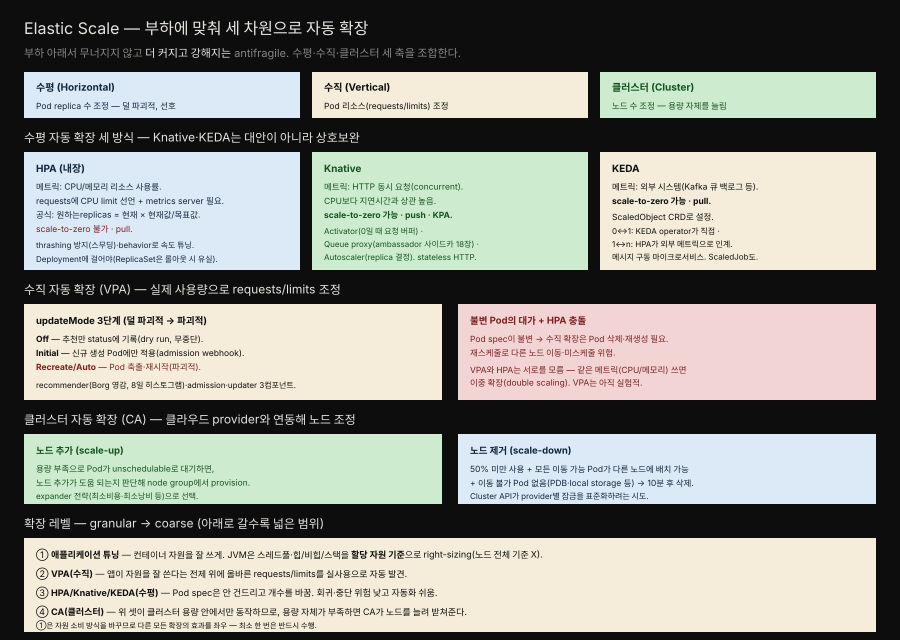

# 29장 · Elastic Scale — 부하에 맞춰 세 차원으로 자동 확장

> 애플리케이션을 여러 차원에서 자동 확장하는 패턴입니다. Pod 개수(수평), Pod 리소스(수직), 클러스터 노드 수를 부하에 따라 스스로 조정해, 부하 아래서 오히려 더 강해지는 antifragile을 지향합니다.

## 핵심 요약

> Elastic Scale은 수평·수직·클러스터 세 차원의 스케일링을 부하 기반으로 자동화하는 패턴입니다.

정확히 몇 개의 replica가 필요하고 컨테이너에 얼마의 리소스를 줘야 하는지는 미리 알기 어렵습니다. 많은 워크로드가 시간에 따라 변하는 계절성을 띠기 때문입니다. Kubernetes는 이 판단을 사람에게만 맡기지 않고 외부 부하와 용량 이벤트를 감시·분석해 스스로 스케일링하게 해줍니다.

방법은 세 차원입니다. 수평 확장은 Pod replica 수를 조정하고(HPA·Knative·KEDA), 수직 확장은 실행 중인 컨테이너의 리소스를 조정하며(VPA), 클러스터 확장은 노드 수 자체를 바꿉니다(CA). 이 확장들은 애플리케이션 튜닝부터 클러스터 용량까지 여러 레벨로 층을 이루고 아래 레벨이 위 레벨의 효과를 좌우합니다. 이렇게 외부 스트레스에 맞서 시스템이 더 커지고 강해지는 성질이 antifragile입니다.

## 학습 목표

> 이 장을 읽고 나면 다음을 설명할 수 있어야 합니다.

- 수평·수직·클러스터 세 스케일링 차원을 구분할 수 있습니다.
- HPA·Knative·KEDA의 메트릭·scale-to-zero·push/pull 차이를 설명할 수 있습니다.
- VPA의 세 updateMode(Off/Initial/Recreate·Auto)와 불변 Pod의 제약을 압니다.
- Cluster Autoscaler의 노드 추가·제거 조건을 이해합니다.
- 확장 레벨의 순서(애플리케이션 튜닝 → VPA → HPA → CA)와 상호 관계를 설명할 수 있습니다.

## 본문 정리

### 수평 자동 확장 — HPA

가장 직관적인 자동 확장은 **HorizontalPodAutoscaler(HPA)**로 Pod 수를 늘리고 줄이는 것입니다. HPA는 Kubernetes에 내장돼 있어 별도 설치가 필요 없지만 두 가지 전제가 있습니다 — 대상 Deployment가 CPU에 대한 `resources.requests`를 선언해야 하고 리소스 사용량을 집계하는 metrics server가 켜져 있어야 합니다.

HPA 컨트롤러는 계속 두 단계를 반복합니다. 대상 Pod들의 메트릭을 Metrics API에서 가져오고 현재 값과 목표 값을 비교해 필요한 replica 수를 계산합니다. 공식은 단순합니다 — `원하는 replicas = 현재 replicas × (현재 메트릭 값 / 목표 메트릭 값)`. 단일 Pod의 CPU가 목표 50%인데 90%라면 replica가 두 배로 늘어나는 식입니다. 실제 구현은 여러 Pod, 여러 메트릭 타입, 요동치는 값을 고려해 더 복잡하며 여러 메트릭이 지정되면 각각을 평가해 그중 가장 큰 값을 택합니다.

메트릭은 세 종류입니다. **표준 메트릭**(CPU·메모리, requests 값 기준), **커스텀 메트릭**(Prometheus 등 어댑터가 제공하는 Object/Pod 타입), **외부 메트릭**(클러스터 밖 자원, 예컨대 큐 깊이)입니다. 설정에서 조심할 점도 있습니다. HPA는 thrashing(요동)을 막으려 스케일업 시 초기화 중인 Pod의 높은 CPU를 무시하고 스케일다운 시 설정된 시간 창의 최고 권고값을 택합니다. 그리고 HPA는 Deployment가 롤아웃 때 새 ReplicaSet을 만들면서 HPA 정의를 복사하지 않으므로, ReplicaSet이 아니라 상위 Deployment에 걸어야 합니다.

### 수평 자동 확장 — Knative와 KEDA

HPA에는 결정적 한계가 있습니다 — 0개로 줄이는 scale-to-zero가 안 됩니다. 아무도 안 쓰는 워크로드도 최소 자원을 계속 씁니다. 이를 채우는 두 add-on이 Knative와 KEDA인데, 둘은 대안이 아니라 서로 다른 use case를 덮는 상호보완 관계라 함께 쓸 수 있습니다.

**Knative**는 HTTP 애플리케이션에 특화됩니다. CPU·메모리가 실제 사용과 간접적으로만 상관되는 HTTP 워크로드에서는, Pod당 동시 요청(concurrent requests) 수가 훨씬 나은 메트릭입니다. 지연시간과의 상관이 CPU보다 높기 때문입니다. Knative는 자체 Knative Pod Autoscaler(KPA)로 scale-to-zero를 지원하며 세 컴포넌트가 함께 움직입니다 — **Activator**(0으로 줄었을 때 들어온 첫 요청을 버퍼링하고 최소 1개로 깨움), **Queue proxy**(Pod에 주입되는 ambassador 사이드카(18장)로 동시 요청 메트릭을 수집), **Autoscaler**(그 데이터로 replica 수를 결정). Knative는 push 방식입니다.

**KEDA**(Kubernetes Event-Driven Autoscaling)는 외부 시스템의 메트릭으로 스케일하는 pull 방식입니다. 예컨대 Kafka 토픽의 메시지 백로그를 보고 소비자 Pod 수를 조정합니다. 핵심은 `ScaledObject` 커스텀 리소스로, KEDA operator가 이를 감지하면 자동으로 HPA를 만듭니다. 스케일링을 두 구간으로 나눠, 0↔1(활성화)은 KEDA operator가 직접 하고 1↔n은 HPA가 외부 메트릭으로 인계합니다. 큐에서 일을 당겨오는 메시지 구동 마이크로서비스에 잘 맞으며 `ScaledJob`으로 Kubernetes Job을 외부 워크로드 유무에 따라 자동 트리거할 수도 있습니다.

### 수직 자동 확장 — VPA

수평 확장이 stateless 서비스에 덜 파괴적이라 대개 선호되지만 stateful 서비스나 리소스 요구를 실부하에 맞춰야 할 때는 수직 확장이 유용합니다. **Vertical Pod Autoscaler(VPA)**는 실제 사용량 피드백으로 컨테이너의 requests/limits 조정을 자동화합니다.

VPA의 성격은 `updateMode`로 갈립니다. **Off**는 recommender가 권고값을 status에 기록만 하고 적용하지 않는 dry run으로, 중단 없이 적정 크기를 탐색합니다. **Initial**은 admission Controller가 새로 생성되는 Pod에만 권고를 적용합니다(실행 중 Pod는 재시작하지 않지만 새 Pod의 스케줄링 위치가 바뀔 수 있어 부분적으로 파괴적). **Recreate·Auto**는 updater가 실행 중 Pod를 축출·재시작해 권고를 적용하므로 파괴적이며 2023년 기준 Auto는 Recreate와 동일하게 동작합니다. VPA는 recommender(Google Borg에서 영감받아 기본 8일치 사용량으로 히스토그램을 만들어 고백분위 값 선택)·admission·updater 세 컴포넌트로 이루어집니다.

VPA의 근본 제약은 Kubernetes가 불변 Pod를 다룬다는 데서 옵니다. 수평 확장은 이 불변성 덕에 단순하지만 수직 확장은 리소스를 바꾸려면 Pod 삭제·재생성이 필요해 스케줄링에 영향을 주고 중단을 부를 수 있습니다. 또 하나의 문제는 VPA와 HPA가 서로를 모른다는 것입니다. HPA가 CPU·메모리 같은 리소스 메트릭을 쓰는데 VPA가 같은 값에 영향을 주면, 수평과 수직이 동시에 일어나는 이중 확장(double scaling)이 생길 수 있습니다.

### 클러스터 자동 확장 — CA

**Cluster Autoscaler(CA)**는 Pod가 아니라 노드를 스케일합니다. 클라우드 provider와 연동해 피크 때 노드를 추가하고 유휴 때 노드를 줄여 인프라 비용을 낮춥니다. 노드 추가는 어떤 Pod가 용량 부족으로 unschedulable 상태로 대기할 때, 노드를 추가하면 그 Pod가 배치될 수 있는지 판단해 node group에서 새 머신을 프로비저닝합니다(여러 node group이 후보면 expander 전략으로 최소 비용·최소 낭비 등을 골라 택합니다). 노드 제거는 더 까다로워서, 노드의 요청 자원 합이 할당 가능 용량의 50% 미만이고 이동 가능한 모든 Pod가 다른 노드에 배치될 수 있으며(스케줄링 시뮬레이션으로 확인), PodDisruptionBudget이나 local storage 때문에 못 옮기는 Pod가 없어야 합니다. 이 조건이 기본 10분간 유지되면 노드를 삭제합니다.

### 확장 레벨 — granular에서 coarse로

책은 확장 기법을 세밀한 것에서 큰 것 순으로 정리합니다. ① **애플리케이션 튜닝**은 가장 granular한 레벨로, 컨테이너에 할당된 자원을 잘 쓰도록 앱 자체를 조율합니다. Java 런타임이라면 스레드 풀과 힙·비힙·스택 크기를 노드 전체가 아니라 컨테이너에 할당된 자원 기준으로 right-sizing하는 것입니다. ② **VPA(수직)**는 앱이 자원을 잘 쓴다는 전제 위에 올바른 requests/limits를 실사용으로 찾습니다. ③ **HPA/Knative/KEDA(수평)**는 Pod spec을 건드리지 않고 개수만 바꿔 회귀·중단 위험이 낮고 자동화가 쉽습니다. ④ **CA(클러스터)**는 위 셋이 클러스터 용량 안에서만 동작하므로, 용량 자체가 부족할 때 노드를 늘려 받쳐줍니다. 특히 ①은 자원 소비 방식을 바꿔 다른 모든 확장의 효과를 좌우하므로, 프로덕션 전에 최소 한 번은 반드시 수행해야 합니다.

## 심화 학습

### Spring/JVM 앱의 애플리케이션 튜닝 — 확장의 토대

확장 레벨의 첫 단계인 애플리케이션 튜닝은 Spring/JVM 개발자에게 가장 직접적으로 와닿습니다. 책이 지적하는 핵심은 JVM이 기본적으로 컨테이너에 할당된 자원이 아니라 노드 전체 용량을 기준으로 판단하려는 경향이 있었다는 점입니다. 힙 크기를 잘못 잡으면 컨테이너의 메모리 한도를 넘어 OutOfMemory로 죽고 이때는 수평 확장으로도 구제되지 않습니다. 컨테이너 자원에 맞춰 힙과 스레드 풀을 정하는 것이 그래서 확장의 토대입니다.

다행히 최신 JVM(JDK 10+)은 컨테이너 인식이 기본이라 `-XX:MaxRAMPercentage` 같은 옵션으로 컨테이너 메모리에 비례해 힙을 잡을 수 있습니다. 스레드 풀은 컨테이너가 받는 CPU share에 맞춰야 하며 책은 Netflix의 [Adaptive Concurrency Limits 라이브러리](https://github.com/Netflix/concurrency-limits)를 소개합니다. 이 라이브러리는 앱이 자기 자신을 프로파일링해 동시성 한계를 동적으로 계산하는 일종의 in-app 오토스케일링으로, 수동 튜닝의 필요를 줄입니다. Spring Boot 앱을 컨테이너로 올릴 때 이 첫 단계를 건너뛰면, 그 위의 HPA·VPA를 아무리 정교하게 걸어도 자원을 제대로 못 쓰는 앱에서는 효과가 반감됩니다.

### 세 오토스케일러를 어떻게 고르나 — 메트릭이 부하와 상관되는가

HPA·Knative·KEDA 선택의 가장 중요한 기준은 메트릭이 replica 수와 직접(가능하면 선형) 상관되는가입니다. HTTP 초당 쿼리나 CPU는 Pod를 늘리면 Pod당 부하가 내려가 상관이 성립합니다. 반면 메모리는 위험합니다 — 서비스가 일정 메모리를 쓸 때 Pod를 더 띄운다고 메모리가 줄지 않으므로(앱이 클러스터링돼 메모리를 분산·해제하지 않는 한), HPA가 메모리를 줄이려 계속 Pod를 늘려 상한까지 도달하는 원치 않는 동작을 할 수 있습니다.

실무 선택은 이렇게 갈립니다. 안정적 트래픽의 웹 앱이나 배치 처리는 HPA로 충분하고 급격히 스케일하는 서버리스 성격의 HTTP 앱은 Knative가, 메시지 큐를 소비하는 마이크로서비스는 KEDA가 맞습니다. TPS나 실무에서 Kafka 소비자를 운영한다면 KEDA의 `ScaledObject`로 컨슈머 랙에 따라 Pod를 늘리는 구성이 자연스럽고 이는 Batch Job 패턴(7장)과도 성격이 통합니다 — 일이 있을 때만 자원을 쓰고 유휴 시엔 0으로 내려갑니다.

## 실무 적용

- **확장에 앞서 애플리케이션을 먼저 튜닝합니다.** JVM 힙·스레드 풀을 컨테이너 자원 기준으로 맞추지 않으면 상위 오토스케일러의 효과가 반감됩니다.
- **HPA는 상위 Deployment에 겁니다.** ReplicaSet에 걸면 롤아웃 때 HPA 정의가 유실됩니다.
- **메트릭은 replica 수와 상관되는 것을 고릅니다.** 메모리처럼 Pod를 늘려도 줄지 않는 메트릭은 폭주를 부릅니다.
- **HTTP는 Knative, 큐 구동은 KEDA를 검토합니다.** scale-to-zero가 필요하면 내장 HPA만으로는 부족합니다.
- **VPA와 HPA를 같은 메트릭에 동시 적용하지 않습니다.** 이중 확장을 피하려면 역할을 분리합니다(예: VPA는 Off 모드로 권고만).
- **클러스터 용량 탄력이 필요하면 CA를 켭니다.** Pod 스케일링은 용량 안에서만 동작하므로 CA가 그 경계를 넓혀줍니다.

## 체크리스트

- [ ] 컨테이너에 CPU `resources.requests`가 선언되고 metrics server가 켜져 있는가? (HPA 전제)
- [ ] HPA가 ReplicaSet이 아니라 상위 Deployment에 걸려 있는가?
- [ ] 선택한 오토스케일 메트릭이 replica 수와 직접 상관되는가?
- [ ] scale-to-zero가 필요한 워크로드에 Knative나 KEDA를 검토했는가?
- [ ] VPA와 HPA가 같은 메트릭에서 충돌하지 않는가?
- [ ] JVM 앱의 힙·스레드 풀이 컨테이너 자원 기준으로 튜닝됐는가?

## 면접 관점

**Q. HPA·Knative·KEDA는 무엇으로 구분하나요?**
메트릭·scale-to-zero·push/pull로 구분합니다. HPA는 CPU·메모리 리소스 사용률을 pull 방식으로 보고 scale-to-zero가 안 됩니다. Knative는 HTTP 동시 요청을 push 방식으로 보고 scale-to-zero가 되며 stateless HTTP에 특화됩니다. KEDA는 Kafka 큐 백로그 같은 외부 메트릭을 pull 방식으로 보고 scale-to-zero가 되며 메시지 구동 워크로드에 맞습니다. 셋은 배타적이 아니라 상호보완적입니다.

**Q. 수직 확장(VPA)이 수평 확장보다 까다로운 이유는 무엇인가요?**
Kubernetes가 불변 Pod를 다루기 때문입니다. 수평 확장은 이 불변성 덕에 Pod를 그대로 두고 개수만 바꾸면 되지만 수직 확장은 리소스를 바꾸려면 Pod를 삭제하고 재생성해야 해 스케줄링에 영향을 주고 서비스 중단을 부를 수 있습니다. 또 VPA와 HPA가 서로를 몰라 같은 메트릭을 쓰면 이중 확장이 일어날 수 있어, 대개 VPA는 Off 모드로 권고만 받는 식으로 조심스럽게 씁니다.

**Q. HPA에서 메모리를 메트릭으로 쓰면 왜 위험한가요?**
메모리는 Pod 수와 직접 상관되지 않기 때문입니다. 서비스가 일정 메모리를 쓸 때 Pod를 더 띄운다고 개별 Pod의 메모리가 줄어들지 않습니다(앱이 클러스터링돼 메모리를 분산·해제하지 않는 한). 그러면 HPA가 메모리를 낮추려 계속 Pod를 늘려 상한까지 도달하는 원치 않는 동작을 합니다. 그래서 replica 수와 직접, 가능하면 선형으로 상관되는 메트릭(CPU, 동시 요청 등)을 골라야 합니다.

## 참고 자료

- Bilgin Ibryam·Roland Huß, *Kubernetes Patterns, 2nd Edition*, 29장 Elastic Scale (O'Reilly, 2023)
- [Kubernetes 공식 — Horizontal Pod Autoscaling](https://kubernetes.io/docs/tasks/run-application/horizontal-pod-autoscale/)
- [Kubernetes 공식 — Vertical Pod Autoscaler](https://github.com/kubernetes/autoscaler/tree/master/vertical-pod-autoscaler)
- [Knative Autoscaling](https://knative.dev/docs/serving/autoscaling/) · [KEDA](https://keda.sh/)
- [Netflix — Adaptive Concurrency Limits](https://github.com/Netflix/concurrency-limits)
- 개념 노트: [오토스케일링](../../kubernetes/05_scheduling/05-03.%EC%98%A4%ED%86%A0%EC%8A%A4%EC%BC%80%EC%9D%BC%EB%A7%81.md)
- 이 책의 앞 편: [Predictable Demands](./02-01.Predictable%20Demands%20%E2%80%94%20%EC%9E%90%EC%9B%90%20%EC%9A%94%EA%B5%AC%EB%A5%BC%20%EC%84%A0%EC%96%B8%ED%95%B4%20%EC%8A%A4%EC%BC%80%EC%A4%84%EB%9F%AC%EC%97%90%20%EC%95%8C%EB%A6%AC%EA%B8%B0.md) — requests·limits로 초기 자원 프로파일을 손으로 잡는 단계
- 정독 노트: [07장 Batch Job](./07-01.Batch%20Job%20%E2%80%94%20%EC%9C%A0%ED%95%9C%ED%95%9C%20%EC%9E%91%EC%97%85%EC%9D%84%20%EC%99%84%EB%A3%8C%EA%B9%8C%EC%A7%80%20%EC%95%88%EC%A0%95%EC%A0%81%EC%9C%BC%EB%A1%9C.md) · [12장 Stateful Service](./12-01.Stateful%20Service%20%E2%80%94%20StatefulSet%EC%9C%BC%EB%A1%9C%20%EC%83%81%ED%83%9C%EB%A5%BC%20first-class%EB%A1%9C.md) · [18장 Ambassador](./18-01.Ambassador%20%E2%80%94%20%EB%B0%94%EA%B9%A5%EC%84%B8%EC%83%81%EC%9C%BC%EB%A1%9C%EC%9D%98%20smart%20proxy.md)
