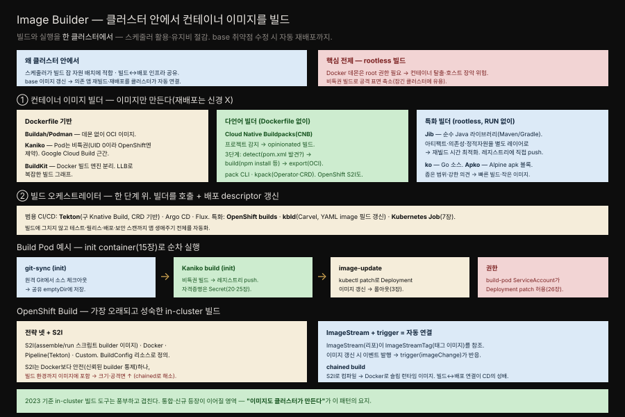

# 30장 · Image Builder — 클러스터 안에서 이미지를 빌드하기

> 이 책의 마지막 패턴입니다. 지금까지의 패턴이 클러스터에서 앱을 *운영*하는 이야기였다면, 이 장은 앱 이미지를 *빌드*하는 일마저 클러스터 안으로 가져옵니다.

## 핵심 요약

> Image Builder는 컨테이너 이미지를 클러스터 밖이 아니라 Kubernetes 클러스터 안에서 빌드하는 패턴입니다.

고전적 방식은 이미지를 클러스터 밖에서 빌드해 레지스트리에 push하고 Deployment 디스크립터에서 참조하는 것입니다. 하지만 클러스터 안에서 빌드하면 이점이 있습니다. 회사 정책이 허락한다면 빌드와 실행을 한 클러스터에서 하는 편이 유지비를 줄이고 용량 계획을 단순하게 합니다. 게다가 빌드는 본질적으로 자유로운 컴퓨팅 자원을 찾는 스케줄링 문제인데, Kubernetes의 정교한 스케줄러가 여기에 딱 맞습니다.

CD로 가면 이점이 더 분명해집니다. 빌드와 실행이 같은 인프라를 공유하므로, 예컨대 모든 앱이 쓰는 base 이미지에서 보안 취약점이 발견돼 고치면, 클러스터가 빌드와 배포를 둘 다 알기에 base가 바뀔 때 의존 앱들을 자동 재배포할 수 있습니다. 이 장은 그 in-cluster 빌드를 어떤 도구로, 어떤 구조로 하는지 훑습니다.

## 학습 목표

> 이 장을 읽고 나면 다음을 설명할 수 있어야 합니다.

- 클러스터 안에서 이미지를 빌드하는 이점(스케줄러 활용, 빌드-배포 자동 연결)을 설명할 수 있습니다.
- rootless 빌드가 왜 in-cluster 빌드의 핵심 전제인지 압니다.
- 컨테이너 이미지 빌더와 빌드 오케스트레이터의 계층 차이를 구분할 수 있습니다.
- Build Pod가 init container로 어떻게 순차 빌드-배포를 구성하는지 설명할 수 있습니다.
- OpenShift S2I와 chained build, ImageStream trigger의 관계를 이해합니다.

## 본문 정리

### 핵심 전제 — rootless 빌드

클러스터 안에서 빌드하면 클러스터가 빌드 과정을 완전히 통제하므로, 잠재적 취약점을 막기 위해 더 높은 보안 기준이 필요합니다. 그 방법이 root 권한 없이 빌드하는 **rootless 빌드**입니다. 왜 중요할까요. Docker는 클라이언트-서버 구조로, 백그라운드 데몬이 네트워크·볼륨 관리를 위해 root 권한을 요구합니다. 이는 보안 위험인데, 신뢰할 수 없는 프로세스가 컨테이너를 탈출해 호스트 전체를 장악할 수 있기 때문입니다. 이 우려는 컨테이너를 실행할 때뿐 아니라 빌드할 때도 적용됩니다. 빌드도 Docker 데몬이 임의 명령을 실행하는 컨테이너 안에서 일어나기 때문입니다. 그래서 이 장의 대부분 도구는 비특권 모드로 이미지를 빌드해 공격 표면을 줄입니다.

### 컨테이너 이미지 빌더

첫 계층은 이미지만 만드는 도구들로, 재배포는 신경 쓰지 않습니다. 이미지를 어떻게 명세하고 빌드하는지에 따라 셋으로 나뉩니다.

**Dockerfile 기반.** 익숙한 Dockerfile 포맷을 씁니다. **Buildah/Podman**은 Docker 데몬 없이 OCI 호환 이미지를 만듭니다. **Kaniko**는 Kubernetes에서 빌드 컨테이너로 도는 것을 의도한 도구로, Google Cloud Build의 근간입니다. 빌드 컨테이너 안에서 Kaniko는 여전히 UID 0으로 돌지만 그 Pod 자체는 비특권이며 이 때문에 컨테이너에서 root 실행을 막는 OpenShift 같은 클러스터에서는 못 씁니다. **BuildKit**은 Docker가 빌드 엔진을 분리한 프로젝트로, LLB(Low-Level Build) 포맷으로 복잡한 빌드 그래프를 표현합니다.

**다언어 빌더.** 많은 개발자는 이미지가 어떻게 만들어지는지보다 자기 앱이 이미지로 패키징되기만 하면 됩니다. 이 use case를 덮는 것이 다언어 빌더입니다. **Cloud Native Buildpacks(CNB)**는 프로젝트를 감지해 opinionated 빌드 흐름을 고릅니다. lifecycle은 크게 세 단계입니다 — detect(각 buildpack이 자기가 맞는지 판단, Java buildpack은 `pom.xml`을 보고 손을 듦), build(살아남은 buildpack이 최종 아티팩트를 만듦, Node.js는 `npm install`), export(최종 OCI 이미지로 push). CNB는 `pack` CLI로 로컬에서 실행하거나, `kpack`처럼 Operator와 CRD로 클러스터 안에서 돌릴 수 있습니다. OpenShift의 Source-to-Image(S2I)도 같은 계열입니다.

**특화 빌더.** 좁은 범위에 강한 의견을 가진 도구로, 모두 rootless 빌드를 하고 Dockerfile의 RUN 없이 애플리케이션 아티팩트로 이미지 레이어를 만들어 레지스트리에 직접 push합니다. **Jib**은 순수 Java 라이브러리로 Maven/Gradle과 잘 통합되며 Java 아티팩트·의존성·정적 자원을 각각 별도 레이어로 만들어 재빌드 시간을 최적화합니다. **ko**는 Go 소스용, **Apko**는 Alpine의 apk 패키지를 빌딩 블록으로 씁니다. 강한 의견 덕에 빌드 시간과 이미지 크기를 최적화할 수 있습니다.

### 빌드 오케스트레이터

한 단계 위의 계층은 이미지 빌더를 호출하면서 빌드 이후 작업까지 다루는 오케스트레이터입니다. **Tekton**(Knative Build가 분리·발전한 것으로 CRD 기반), **Argo CD**, **Flux** 같은 범용 CI/CD가 앱의 빌드·테스트·릴리스·배포·보안 스캔을 아우릅니다. 특화 오케스트레이터로는 **OpenShift builds**, **kbld**(Carvel 도구셋의 일부로 YAML의 image 필드를 빌드된 이미지 좌표로 갱신), 그리고 표준 **Kubernetes Job**(7장)이 있습니다.

### Build Pod — 최소 구성으로 본 빌드-배포

책은 in-cluster 빌드의 핵심 재료를 드러내기 위해 Pod 하나로 완전한 빌드-배포 사이클을 구성합니다. 순차 실행을 보장하려고 init container(15장)를 씁니다. 세 단계입니다.

**① git-sync(init).** 원격 Git 저장소에서 소스를 체크아웃해 공유 `emptyDir` 볼륨에 저장합니다. 빌드가 클러스터 안에서 일어나므로 소스를 어떻게든 빌드 컨테이너로 올려야 하는데, 그 방법이 이 init container입니다.

**② Kaniko build(init).** 소스가 완전히 받아진 뒤에 시작되도록 다시 init container로 둡니다. Kaniko는 일반 Dockerfile을 쓰고 완전히 비특권으로 돌며 만든 이미지를 원격 Docker 레지스트리에 push합니다. push 자격증명은 Kubernetes Secret에서 가져옵니다(20·25장). Docker 레지스트리 인증은 `kubectl create secret docker-registry`로 편하게 만들 수 있습니다.

**③ image-update(main container).** 만들어진 이미지로 기존 Deployment를 갱신합니다. `kubectl patch`로 Deployment의 이미지 필드를 새 이미지 이름으로 바꾸면, 롤아웃이 트리거되어 재배포됩니다(3장 Declarative Deployment). 이 모든 작업의 전제는 Pod에 붙은 `build-pod` ServiceAccount가 Deployment를 patch할 권한을 갖는 것입니다(26장 Access Control).

### OpenShift Build — 가장 성숙한 in-cluster 빌드

Red Hat OpenShift는 Kubernetes에 통합 레지스트리·SSO 등과 함께 native 이미지 빌드 기능을 더한 엔터프라이즈 배포판입니다. OpenShift build는 클러스터에 통합된 최초의 이미지 빌드 방식으로, 네 전략을 지원합니다 — **Source-to-Image(S2I)**(언어별 builder 이미지로 소스에서 실행 아티팩트 생성), **Docker build**, **Pipeline build**(내부 Tekton), **Custom build**. 모든 빌드 정보는 `BuildConfig` 리소스에 정의합니다.

S2I builder 이미지는 두 필수 스크립트를 가진 표준 컨테이너 이미지입니다 — `assemble`(빌드 시작 시 호출되어 소스를 컴파일하고 아티팩트를 적절한 위치에 배치)과 `run`(이미지의 엔트리포인트). CNB와 비슷하지만 lifecycle이 더 단순합니다. S2I는 신뢰된 builder 이미지가 빌드를 통제해 Docker build보다 안전하지만 생성된 이미지에 빌드 환경 전체가 포함돼 크기와 공격 표면이 커지는 단점이 있습니다. 이를 해소하는 것이 **chained build**로, S2I가 컴파일한 결과물을 두 번째 Docker build가 받아 슬림한 런타임 이미지를 만듭니다.

이 자동 연결의 핵심이 **ImageStream**과 **trigger**입니다. ImageStream은 하나 이상의 이미지를 참조하는 리소스로, 실제 태그된 이미지를 ImageStreamTag에 매핑합니다. 이 추상화가 필요한 이유는, 레지스트리에서 이미지가 갱신될 때 이벤트를 발행할 수 있어서입니다. 빌드·배포 컨트롤러가 이 이벤트를 듣고 새 빌드나 배포를 트리거합니다. `imageChange` trigger는 ImageStreamTag 변화에 반응해 다른 이미지를 재빌드하거나 Pod를 재배포합니다. 이렇게 여러 빌드를 엮고 이미지 갱신 시 자동 재배포하는 것이 CD의 성배에 다가서는 길입니다.

## 심화 학습

### Spring Boot 이미지 빌드 — Buildpacks와 Jib

이 장의 도구 중 Spring/Java 개발자가 가장 자주 마주치는 둘이 Cloud Native Buildpacks와 Jib입니다. 실은 Spring Boot 자체가 이 둘을 빌드 플러그인으로 내장합니다. `mvn spring-boot:build-image`는 CNB를 써서 Dockerfile 없이 Spring Boot 앱을 OCI 이미지로 만들고 `mvn com.google.cloud.tools:jib-maven-plugin:build`는 Jib으로 레이어를 최적화해 레지스트리에 직접 push합니다. 둘 다 rootless이고 Dockerfile을 요구하지 않아, 23장 Process Containment에서 본 비root 컨테이너 관행과도 자연스럽게 맞물립니다(Buildpacks·Jib은 비root 유저를 기본으로 설정하는 경우가 많습니다).

두 도구의 결이 다릅니다. Buildpacks는 프로젝트를 감지해 런타임·JDK·최적화를 opinionated하게 골라주므로 "어떻게 빌드할지 신경 쓰기 싫은" 개발자에게 맞고 Jib은 Java 아티팩트·의존성·정적 자원을 별도 레이어로 나눠 코드만 바뀌었을 때 재빌드가 빠릅니다. 의존성이 자주 안 바뀌는 Spring 앱에서 Jib의 레이어 분리는 CI 빌드 시간을 눈에 띄게 줄입니다.

### 왜 클러스터 안에서 — 빌드와 배포의 경계 지우기

책이 강조하는 in-cluster 빌드의 진짜 가치는 빌드와 배포 사이의 경계가 사라진다는 데 있습니다. 밖에서 빌드하면 "이미지를 만든다"와 "그 이미지를 배포한다"가 서로 다른 시스템의 일이지만 안에서 빌드하면 클러스터가 둘을 모두 알아 연결할 수 있습니다. OpenShift의 ImageStream trigger가 그 전형으로, 빌드가 앱 이미지를 갱신하면 자동으로 재배포가 일어납니다. base 이미지 취약점 시나리오가 이 가치를 잘 보여줍니다 — base를 고치면 그것에 의존하는 모든 앱 이미지가 재빌드되고 재빌드된 이미지가 다시 배포까지 이어지는 연쇄가 클러스터 안에서 자동으로 돕니다. 다만 이 장이 다룬 도구 지형은 2023년 기준 풍부하고 서로 겹쳐 있어 통합과 신규 등장이 계속될 영역이라는 점도 저자들은 분명히 합니다.

## 실무 적용

- **가능하면 rootless 빌더를 씁니다.** Kaniko·Buildah·Jib·Buildpacks로 특권 없는 빌드를 해 공격 표면을 줄입니다.
- **Spring 앱은 Buildpacks나 Jib을 우선 검토합니다.** Dockerfile 없이 rootless 이미지를 만들 수 있고 Spring Boot에 플러그인으로 내장돼 있습니다.
- **의존성이 자주 안 바뀌면 Jib의 레이어 분리를 활용합니다.** 코드만 바뀔 때 재빌드가 빨라집니다.
- **빌드 자격증명은 Secret으로 주입합니다.** 레지스트리 인증 정보를 이미지나 매니페스트에 평문으로 두지 않습니다(25장).
- **빌드 Pod의 ServiceAccount에 최소 권한만 줍니다.** Deployment patch가 필요하면 그 권한만 부여합니다(26장).
- **실무는 오케스트레이터를 씁니다.** Build Pod는 학습용이고 실제로는 Tekton이나 OpenShift Build로 순차·재시도·트리거를 갖춥니다.

## 체크리스트

- [ ] 빌드가 비특권(rootless) 모드로 수행되는가?
- [ ] 사용 클러스터가 root 실행을 막는다면 Kaniko 대신 적절한 빌더를 골랐는가?
- [ ] 레지스트리 push 자격증명이 Secret으로 안전하게 주입되는가?
- [ ] 빌드 Pod의 ServiceAccount에 최소 권한만 부여됐는가?
- [ ] Spring 앱이라면 Buildpacks/Jib 같은 rootless 빌더를 검토했는가?
- [ ] 빌드-배포 자동 연결(trigger)이 필요한 경우 오케스트레이터로 구성됐는가?

## 면접 관점

**Q. 컨테이너 이미지를 클러스터 안에서 빌드하면 어떤 이점이 있나요?**
빌드는 자유로운 자원을 찾는 스케줄링 문제라 Kubernetes 스케줄러가 잘 맞고 빌드와 실행을 한 클러스터에서 하면 유지비와 용량 계획이 단순해집니다. 결정적으로 CD 관점에서 빌드와 배포가 같은 인프라를 공유해, base 이미지 취약점을 고치면 의존 앱을 자동 재빌드·재배포하는 연쇄를 클러스터가 알아서 처리할 수 있습니다.

**Q. in-cluster 빌드에서 rootless가 왜 중요한가요?**
클러스터 안에서 빌드하면 클러스터가 빌드 과정을 완전히 통제하므로 보안 기준이 높아야 합니다. Docker 데몬은 네트워크·볼륨 관리를 위해 root 권한이 필요한데, 이는 신뢰할 수 없는 프로세스가 컨테이너를 탈출해 호스트를 장악할 위험을 낳습니다. 빌드도 컨테이너 안에서 임의 명령을 실행하므로 같은 위험이 있어, 비특권 빌드로 공격 표면을 줄이는 것이 핵심 전제입니다.

**Q. OpenShift의 ImageStream과 trigger는 어떤 역할을 하나요?**
ImageStream은 이미지를 참조하는 추상화로, 이미지가 갱신될 때 이벤트를 발행할 수 있게 해줍니다. trigger(예: imageChange)는 그 이벤트에 반응해 다른 이미지를 재빌드하거나 Pod를 재배포합니다. 이 둘로 chained build(S2I 컴파일 + Docker 슬림 런타임)를 엮고 이미지 갱신 시 자동 재배포를 구성할 수 있어, 빌드와 배포의 경계를 지우는 CD에 다가섭니다.

## 참고 자료

- Bilgin Ibryam·Roland Huß, *Kubernetes Patterns, 2nd Edition*, 30장 Image Builder (O'Reilly, 2023)
- [Kaniko — 클러스터 내 이미지 빌드](https://github.com/GoogleContainerTools/kaniko)
- [Cloud Native Buildpacks](https://buildpacks.io/) · [Jib](https://github.com/GoogleContainerTools/jib)
- [Spring Boot — 컨테이너 이미지 빌드](https://docs.spring.io/spring-boot/reference/packaging/container-images/index.html)
- [Tekton](https://tekton.dev/) · [OpenShift Builds](https://docs.openshift.com/container-platform/latest/cicd/builds/understanding-image-builds.html)
- 정독 노트: [15장 Init Container](./15-01.Init%20Container%20%E2%80%94%20%EC%B4%88%EA%B8%B0%ED%99%94%EB%A5%BC%20%EC%95%B1%EA%B3%BC%20%EB%B6%84%EB%A6%AC%ED%95%B4%20%EB%B3%84%EB%8F%84%20%EC%83%9D%EC%95%A0%EC%A3%BC%EA%B8%B0%EB%A1%9C.md) · [20장 Configuration Resource](./20-01.Configuration%20Resource%20%E2%80%94%20ConfigMap%EA%B3%BC%20Secret%EC%9C%BC%EB%A1%9C%20%EC%84%A4%EC%A0%95%20%EB%B6%84%EB%A6%AC.md) · [26장 Access Control](./26-01.Access%20Control%20%E2%80%94%20RBAC%EC%9C%BC%EB%A1%9C%20%EB%88%84%EA%B0%80%20%EB%AC%B4%EC%97%87%EC%9D%84%20%ED%95%A0%20%EC%88%98%20%EC%9E%88%EB%8A%94%EC%A7%80.md)
