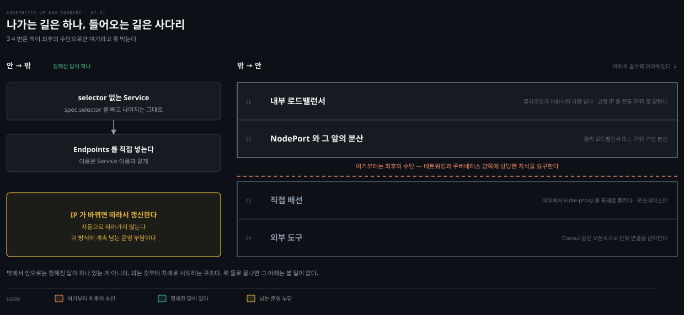

# 7장 · Service Discovery — DNS가 못 하는 일과 바깥을 잇는 법

## 핵심 요약

> 이 장이 매달린 하나의 생각은 **"디스커버리의 어려움은 주소를 찾는 데 있는 게 아니라, 주소가 계속 바뀐다는 데 있다"** 입니다.

Kubernetes는 Pod를 배치하고 다시 세우고 부하에 따라 개수를 바꿉니다. 전통적인 네트워크 인프라는 이 정도의 동적임을 전제로 만들어지지 않았습니다. 그래서 인터넷의 표준 디스커버리 수단인 DNS가 클러스터 안에서는 어긋납니다.

**이 노트는 얇습니다.** 이 장이 가르치는 것의 대부분은 `write/` 안에 이미 있고 일부는 이 책보다 깊게 정리돼 있습니다. 그래서 겹치는 설명을 반복하는 대신, 이 책이 새로 주는 넷만 남겼습니다. DNS가 왜 부족한지에 대한 논증, Service 없이 찾는 원시적 방법, 클러스터 바깥과 잇는 두 방향, 그리고 readiness가 엔드포인트에 반영되는 것을 눈으로 보는 실습입니다. 나머지가 어디 있는지는 맨 아래 위임 표에 적어 두었습니다.


## 학습 목표

> 이 편을 읽고 나면 다음을 설명할 수 있습니다.

1. DNS가 서비스 디스커버리 수단으로 부족한 이유를 네 가지로 나눠 설명할 수 있습니다.
2. Service 오브젝트 없이 label selector만으로 디스커버리를 흉내 낼 수 있고, 그것이 왜 원시적인지 압니다.
3. 클러스터 바깥과 잇는 두 방향을 구분하고, 밖에서 안으로 잇는 네 사다리를 순서대로 고를 수 있습니다.
4. readiness 상태 변화가 엔드포인트 목록에 반영되는 과정을 직접 관찰할 수 있습니다.


## DNS로는 왜 부족한가

> DNS는 인터넷을 위해 만들어진 좋은 시스템이지만, 그 설계 전제가 클러스터의 동적임과 어긋납니다.


DNS는 **비교적 안정적인 이름 해석**과 **넓고 효율적인 캐싱**을 전제로 설계됐습니다. 두 전제 모두 클러스터 안에서는 깨집니다. 책은 그 결과를 네 갈래로 나눕니다.

**첫째, 클라이언트가 옛 주소를 붙잡습니다.** 많은 시스템이 이름을 한 번 조회한 뒤 다시 조회하지 않아서, 이미 사라진 IP로 계속 요청을 보냅니다. TTL을 짧게 잡고 클라이언트가 얌전히 굴어도 이름 해석이 바뀐 시점과 클라이언트가 그것을 알아채는 시점 사이에는 자연스러운 지연이 남습니다.

**둘째, 레코드 개수에 한계가 있습니다.** 일반적인 DNS 질의가 돌려줄 수 있는 정보의 양과 종류에는 자연스러운 한계가 있습니다. 책은 단일 이름에 A 레코드가 20~30개를 넘어가면 깨지기 시작한다고 적습니다. 복제본이 수십 개인 서비스라면 곧 닿는 벽입니다.

**셋째, SRV는 어렵습니다.** SRV 레코드가 일부 문제를 풀어 주지만 쓰기가 여간 까다롭지 않습니다.

**넷째, 라운드로빈은 로드밸런싱이 아닙니다.** 클라이언트가 여러 IP를 받았을 때 대개 첫 번째 주소를 집고, 순서를 섞는 일은 DNS 서버에 맡깁니다. 목적에 맞게 만들어진 로드밸런싱을 이것으로 대신할 수 없습니다.

> **책 밖 보강 — Java의 "기본값"은 조건부입니다.** 책은 Java를 이름을 다시 조회하지 않는 예로 듭니다. JDK 공식 문서를 보면 `networkaddress.cache.ttl`의 기본값은 **보안 관리자가 설치된 경우에만 `-1`(영구 캐시)** 이고, 보안 관리자가 없으면 **구현에 따라 다릅니다.**[^jdk-net] 보안 관리자는 Java 17에서 제거 예정으로 폐기됐으므로 요즘 배포에서는 대개 후자입니다. 책의 지적이 향하는 문제 자체는 그대로 유효하지만, "Java는 기본적으로 영구 캐시한다"고 외워 두면 정확하지 않습니다. JVM 쪽 설정값을 다루는 곳은 [11-03](../kubernetes-in-action/11-03.%EC%97%94%EB%93%9C%ED%8F%AC%EC%9D%B8%ED%8A%B8%C2%B7DNS%C2%B7%ED%86%A0%ED%8F%B4%EB%A1%9C%EC%A7%80%C2%B7readiness.md)입니다.

Kubernetes가 이 문제를 푸는 방식은 DNS를 버리는 것이 아닙니다. **cluster IP라는 가상 IP를 하나 만들어 그것을 고정시키고, 그 고정된 값에 DNS 이름을 붙입니다.** 뒤에서 Pod가 아무리 바뀌어도 이름이 가리키는 IP는 그대로이므로, 클라이언트가 캐싱해도 문제가 되지 않습니다. 캐싱을 막는 대신 캐싱해도 되는 대상을 만든 셈입니다.


## Service 오브젝트가 하는 일

> 책의 한 줄 정의는 이렇습니다. Service 오브젝트는 **이름 붙은 label selector**를 만드는 방법입니다.

책은 `kubectl run`이 Deployment를 만드는 쉬운 방법이듯 `kubectl expose`가 Service를 만드는 쉬운 방법이라고 소개합니다. 이 명령은 Deployment 정의에서 label selector와 포트를 **함께 끌어옵니다.**

> **버전 차이**: `kubectl run`이 Deployment를 만든다는 설명은 이 책이 쓰인 시점보다 앞선 동작입니다. kubectl 1.18에서 generator가 제거되면서 `kubectl run`은 **Pod 하나만** 만듭니다. 그래서 아래 예제도 `kubectl run`이 아니라 `kubectl create deployment`를 씁니다. `kubectl expose`에 대한 설명은 그대로 유효합니다.

```bash
kubectl create deployment alpaca-prod \
  --image=gcr.io/kuar-demo/kuard-amd64:blue --port=8080
kubectl scale deployment alpaca-prod --replicas 3
kubectl expose deployment alpaca-prod
kubectl get services -o wide
```

여기서 함께 보이는 `kubernetes` Service는 사용자가 만든 것이 아닙니다. Pod 안에서 Kubernetes API를 찾아 부를 수 있도록 자동으로 만들어집니다.

Service의 나머지 개념은 이 노트에서 다시 설명하지 않습니다. Service 타입별 트레이드오프, DNS 이름 규칙, Endpoints와 EndpointSlice, readiness가 엔드포인트를 거르는 원리는 아래 위임 표의 문서들이 더 깊게 다룹니다.


## Service 없이 찾기

> Service는 label selector 위에 세워져 있습니다. 그렇다면 Service 오브젝트 없이 API만으로도 디스커버리를 흉내 낼 수 있습니다.

Pod에 붙은 라벨과 IP는 그냥 조회하면 나옵니다.

```bash
# 모든 Pod의 IP와 라벨
kubectl get pods -o wide --show-labels

# 라벨로 걸러서
kubectl get pods -o wide --selector=app=alpaca-prod
```

> **원문 정오**: 원서는 이 명령을 `--selector=app=alpaca`로 적고 출력의 LABELS 열도 `app=alpaca`로 보여 줍니다. 그런데 같은 장에서 Pod를 만든 명령은 `kubectl create deployment alpaca-prod`이고, 이 명령이 붙이는 라벨은 `app=alpaca-prod`입니다. 원서대로 치면 결과가 0건입니다. 원서 안에서도 표기가 섞여 있어, readiness 절 뒤의 port-forward 예제는 `-l app=alpaca-prod`로 바뀝니다. 위 명령은 실제로 동작하는 쪽으로 맞췄습니다.

이것만으로 디스커버리의 기본은 갖춘 셈입니다. 라벨로 원하는 Pod 집합을 지목합니다. 그 Pod들을 가져와 IP를 꺼내면 끝입니다.

저자는 이 방법을 처음부터 "rudimentary"라고 부릅니다. 그리고 곧바로 한계를 짚습니다. **써야 할 라벨 집합을 계속 맞춰 두는 일이 까다롭습니다.** 그래서 Service 오브젝트가 만들어졌습니다. 동작은 하지만 이름과 라벨의 정합을 사람이 계속 책임져야 한다는 뜻으로 읽힙니다.

이 절이 실무에서 쓸모 있는 지점은 따로 있습니다. **Service가 있는데도 트래픽이 안 가는 상황을 진단할 때**, 같은 selector로 Pod를 직접 조회해 보면 문제가 selector 쪽인지 엔드포인트 쪽인지 한 번에 갈립니다.


## 바깥과 잇기 — 두 방향

> 방향이 둘이고 난이도가 다릅니다. 안에서 밖으로 나가는 쪽은 정리된 답이 있고, 밖에서 안으로 들어오는 쪽은 사다리를 타야 합니다.



**클러스터 안에서 바깥 리소스로** 나가는 경우는 selector 없는 Service로 감쌉니다. `spec.selector` 필드를 빼고 metadata와 ports는 그대로 두면, DNS를 통한 디스커버리는 평소처럼 동작하면서 실제 트래픽은 외부 리소스로 흐릅니다.

selector가 없으면 엔드포인트가 자동으로 붙지 않으므로 직접 넣어 줍니다. 대개 데이터베이스 서버의 IP처럼 고정된 주소라 한 번만 넣으면 됩니다.

```yaml
apiVersion: v1
kind: Endpoints
metadata:
  # 이 이름은 Service 이름과 같아야 합니다
  name: my-database-server
subsets:
  - addresses:
      # 실제 서버 IP로 바꿉니다
      - ip: 1.2.3.4
    ports:
      # 노출할 포트로 바꿉니다
      - port: 1433
```

그 IP가 바뀌면 엔드포인트 리소스를 따라서 갱신해야 합니다. 자동으로 따라가지 않는다는 점이 이 방식의 운영 부담입니다.

> **버전 차이**: 위 매니페스트의 `v1 Endpoints`는 책이 쓰인 시점의 API입니다. 현재 Kubernetes 공식 Service 문서는 이 절을 **"Endpoints (deprecated)"** 로 표기하고 EndpointSlice를 현행 메커니즘으로 둡니다.[^k8s-svc] 책의 방식이 당장 동작하지 않는다는 뜻은 아니지만, 새로 작성한다면 EndpointSlice 쪽을 확인하는 편이 좋습니다. 폐기 버전 번호는 접근 가능한 1차 자료에서 확인하지 못해 적지 않았습니다. EndpointSlice 자체는 [11-03](../kubernetes-in-action/11-03.%EC%97%94%EB%93%9C%ED%8F%AC%EC%9D%B8%ED%8A%B8%C2%B7DNS%C2%B7%ED%86%A0%ED%8F%B4%EB%A1%9C%EC%A7%80%C2%B7readiness.md)과 [개념 노트 04-04](../../kubernetes/04_networking/04-04.Service%EC%99%80%20EndpointSlice.md)가 다룹니다.

**바깥 리소스에서 클러스터 안으로** 들어오는 방향은 책이 "다소 더 까다롭다"고 말합니다. 정해진 답이 하나 있는 게 아니라 가능한 것부터 차례로 시도하는 구조입니다.

1. **내부 로드밸런서**: 클라우드 제공자가 지원하면 가장 쉽습니다. 가상 사설망 안에 살면서 고정 IP로 클러스터에 트래픽을 넣어 줍니다. 그 IP를 전통적인 DNS로 외부 리소스에 알려 주면 끝납니다.
2. **NodePort와 그 앞의 분산**: 내부 로드밸런서를 쓸 수 없으면 NodePort로 노드들의 IP에 서비스를 노출합니다. 그다음 물리 로드밸런서가 그 노드들로 트래픽을 보내게 하거나, DNS 기반 로드밸런싱으로 노드 사이에 분산합니다.
3. **직접 배선**: 둘 다 안 되면 외부 리소스에서 kube-proxy를 통째로 돌리고 그 머신이 클러스터의 DNS 서버를 쓰도록 설정하는 방법이 있습니다. 책은 이것을 제대로 세팅하기가 상당히 어렵다고 못 박고, 온프레미스 환경에서만 고려하라고 합니다.
4. **외부 도구**: HashiCorp Consul 같은 오픈소스로 클러스터 안팎의 연결을 관리하는 선택지도 있습니다.

책이 3번과 4번에 붙이는 단서를 그대로 옮기면 이렇습니다. 이런 선택지는 **네트워킹과 Kubernetes 양쪽에 상당한 지식을 요구하며 오직 최후의 수단으로만 여겨야 합니다.**


## 실습 — readiness가 엔드포인트에 반영되는 것 보기

> 이 장에서 가장 손으로 해 볼 만한 부분입니다. 명령은 제가 적고 실행은 직접 해 보시기 바랍니다.

Deployment에 readiness probe를 붙입니다. 2초마다 검사하고, 세 번 연속 실패하면 준비되지 않은 것으로, 한 번 성공하면 다시 준비된 것으로 봅니다.

```yaml
readinessProbe:
  httpGet:
    path: /ready
    port: 8080
  periodSeconds: 2
  initialDelaySeconds: 0
  failureThreshold: 3
  successThreshold: 1
```

터미널 두 개를 씁니다. 하나는 Pod로 port-forward를 걸어 두고, 다른 하나에서 엔드포인트를 지켜봅니다.

```bash
# 터미널 1 — kuard 디버그 페이지 열기
ALPACA_POD=$(kubectl get pods -l app=alpaca-prod \
  -o jsonpath='{.items[0].metadata.name}')
kubectl port-forward $ALPACA_POD 48858:8080

# 터미널 2 — 엔드포인트 변화 지켜보기
kubectl get endpoints alpaca-prod --watch
```

브라우저에서 `http://localhost:48858`을 열고 Readiness Probe 절의 **Fail** 링크를 누릅니다. 서버가 500번대를 돌려주기 시작하고, 세 번 실패한 뒤 그 서버가 엔드포인트 목록에서 빠집니다. **Succeed**를 누르면 한 번의 성공만으로 다시 들어옵니다.

이 실습의 요점은 숫자가 아니라 **readiness가 트래픽 라우팅을 실시간으로 바꾼다**는 사실을 눈으로 확인하는 것입니다. 책은 여기서 우아한 종료로 이야기를 잇습니다. 서버가 "더는 트래픽을 받고 싶지 않다"고 알리고, 기존 연결이 닫히기를 기다린 뒤, 깔끔하게 빠져나가는 순서입니다.

`--watch`는 엔드포인트 전용 기능이 아닙니다. Kubernetes 오브젝트가 시간에 따라 어떻게 바뀌는지 보는 일반적인 방법이라, 다른 리소스를 진단할 때도 그대로 씁니다.


## 면접에서 받을 만한 질문

> 이 노트가 남긴 델타만 묻습니다. ClusterIP·NodePort·headless·ExternalName·readiness 같은 공통 주제는 위임 표의 문서들이 각자 질문 세트를 갖고 있습니다.

1. DNS를 서비스 디스커버리 수단으로 그대로 쓰기 어려운 이유를 네 가지로 드세요. 그중 복제본 수가 늘어날 때 가장 먼저 부딪히는 것은 무엇인가요?
2. Kubernetes는 클라이언트의 DNS 캐싱을 막지 않고도 그 문제를 무력화했습니다. 어떤 방법인가요?
3. Service 오브젝트 없이 디스커버리를 흉내 내려면 무엇을 쓰나요? 저자가 그것을 원시적이라고 보는 근거는 무엇인가요?
4. 외부 리소스를 클러스터 안 서비스에 연결할 때 어떤 순서로 시도하나요? 마지막 두 선택지에 저자가 붙이는 단서는 무엇인가요?
5. selector를 뺀 Service를 만들면 엔드포인트는 어떻게 되나요? 그 뒤 운영자가 계속 책임져야 하는 일은 무엇인가요?

### 정답

1. 클라이언트가 한 번 조회한 IP를 붙잡아 사라진 주소로 계속 요청하고, 단일 이름의 A 레코드가 20~30개를 넘으면 깨지기 시작하며, SRV는 문제를 풀지만 쓰기가 까다롭고, 클라이언트가 대개 첫 IP만 집어 라운드로빈이 로드밸런싱을 대신하지 못합니다. 복제본이 늘어날 때 먼저 닿는 벽은 **A 레코드 개수 한계**입니다.
2. 캐싱을 막는 대신 **캐싱해도 되는 대상**을 만들었습니다. cluster IP라는 가상 IP를 고정해 두고 거기에 DNS 이름을 붙이므로, 뒤의 Pod가 바뀌어도 이름이 가리키는 값은 그대로입니다.
3. label selector와 API를 직접 씁니다(`kubectl get pods --selector=...`로 IP를 꺼냄). 동작은 하지만 **써야 할 라벨 집합을 계속 맞춰 두는 책임이 사람에게 남아** 원시적입니다. 실무에서는 Service가 있는데 트래픽이 안 갈 때 selector 문제인지 엔드포인트 문제인지 가르는 진단 수단으로 유용합니다.
4. 내부 로드밸런서 → NodePort와 그 앞의 물리 LB·DNS 분산 → 외부에서 kube-proxy를 돌려 직접 배선 → Consul 같은 외부 도구 순입니다. 뒤의 둘에는 **네트워킹과 Kubernetes 양쪽에 상당한 지식이 필요하며 최후의 수단으로만 여기라**는 단서가 붙고, 직접 배선은 온프레미스로 한정합니다.
5. 엔드포인트가 자동으로 붙지 않으므로 **직접 만들어 넣어야** 합니다. 대상 IP가 바뀌면 엔드포인트 리소스를 따라서 갱신하는 일이 계속 남습니다. 다만 현재 공식 문서는 Endpoints를 폐기 대상으로 표기하므로 새로 만든다면 EndpointSlice 쪽을 확인합니다.


## 이 장을 어디로 위임했는가

> 이 노트가 얇은 이유입니다. 아래 주제는 이미 정리돼 있어 여기서 반복하지 않았습니다.

| 이 장이 다루는 것 | 읽을 곳 |
|---|---|
| Service 타입별 트레이드오프 (headless 포함) | [networking 05-02.Service 5유형](../networking-and-kubernetes/05-02.Service%205%EC%9C%A0%ED%98%95%20%E2%80%94%20ClusterIP%EC%97%90%EC%84%9C%20LoadBalancer%EA%B9%8C%EC%A7%80.md) |
| ClusterIP·세션 어피니티·DNS 이름 해석 | [in-action 11-01.Service 기초](../kubernetes-in-action/11-01.Service%20%EA%B8%B0%EC%B4%88%20%E2%80%94%20%ED%8C%8C%EB%93%9C%20%ED%86%B5%EC%8B%A0%C2%B7ClusterIP%C2%B7%EC%84%B8%EC%85%98%20%EC%96%B4%ED%94%BC%EB%8B%88%ED%8B%B0.md) |
| NodePort·LoadBalancer·externalTrafficPolicy | [in-action 11-02.외부 노출](../kubernetes-in-action/11-02.%EC%99%B8%EB%B6%80%20%EB%85%B8%EC%B6%9C%20%E2%80%94%20NodePort%C2%B7LoadBalancer%C2%B7%ED%8A%B8%EB%9E%98%ED%94%BD%20%EC%A0%95%EC%B1%85.md) |
| Endpoints·EndpointSlice·A/SRV/CNAME·readiness 원리 | [in-action 11-03.엔드포인트·DNS·토폴로지·readiness](../kubernetes-in-action/11-03.%EC%97%94%EB%93%9C%ED%8F%AC%EC%9D%B8%ED%8A%B8%C2%B7DNS%C2%B7%ED%86%A0%ED%8F%B4%EB%A1%9C%EC%A7%80%C2%B7readiness.md) |
| 환경변수 디스커버리와 생성 순서 함정 | [patterns 13-01.Service Discovery](../kubernetes-patterns/13-01.Service%20Discovery%20%E2%80%94%20%EA%B3%A0%EC%A0%95%20%EC%97%94%EB%93%9C%ED%8F%AC%EC%9D%B8%ED%8A%B8%EB%A1%9C%20%EB%8F%99%EC%A0%81%20Pod%EB%A5%BC%20%EC%B0%BE%EA%B8%B0.md) |
| kube-proxy와 iptables 규칙 (원서 Figure 7-1) | [networking 04-01.Kubernetes 네트워킹 모델](../networking-and-kubernetes/04-01.Kubernetes%20%EB%84%A4%ED%8A%B8%EC%9B%8C%ED%82%B9%20%EB%AA%A8%EB%8D%B8%20%E2%80%94%20Pod%20IP%C2%B7%EB%A0%88%EC%9D%B4%EC%95%84%EC%9B%83%C2%B7Probe.md) |
| Service와 EndpointSlice 개념 정리 | [개념 노트 04-04](../../kubernetes/04_networking/04-04.Service%EC%99%80%20EndpointSlice.md) |

환경변수 줄이 특히 그렇습니다. 이 책은 Service가 Pod보다 먼저 만들어져야 한다는 사실만 적는데, `13-01`은 그것이 Kubernetes의 제약이 아니라 `execve` 시점에 커널이 환경변수를 프로세스 메모리로 복사하는 운영체제의 성질 때문이라는 데까지 내려갑니다. 같은 주제를 더 얕게 다시 쓰는 대신 그쪽으로 넘깁니다.


## 참고 자료

- 원서: 《Kubernetes: Up and Running, 3rd Edition》 Chapter 7. Service Discovery (O'Reilly)
- [Kubernetes 공식 문서 — Service](https://kubernetes.io/docs/concepts/services-networking/service/)
- [JDK Networking Properties](https://docs.oracle.com/en/java/javase/21/docs/api/java.base/java/net/doc-files/net-properties.html)

[^jdk-net]: Oracle — JDK Networking Properties. `networkaddress.cache.ttl`의 기본값은 보안 관리자가 설치된 경우 `-1`(영구), 없으면 구현에 따라 다릅니다. <https://docs.oracle.com/en/java/javase/21/docs/api/java.base/java/net/doc-files/net-properties.html>

[^k8s-svc]: Kubernetes — Service. 목차에 "Endpoints (deprecated)" 절이 있습니다(2026-08-17 조회). <https://kubernetes.io/docs/concepts/services-networking/service/#endpoints>


## 관련 문서

> 같은 주제를 다른 축에서 다루는 노트입니다.

- [Kubernetes Patterns 13-01.Service Discovery](../kubernetes-patterns/13-01.Service%20Discovery%20%E2%80%94%20%EA%B3%A0%EC%A0%95%20%EC%97%94%EB%93%9C%ED%8F%AC%EC%9D%B8%ED%8A%B8%EB%A1%9C%20%EB%8F%99%EC%A0%81%20Pod%EB%A5%BC%20%EC%B0%BE%EA%B8%B0.md) — 디스커버리를 패턴으로 정리한 정본. 환경변수 함정은 이쪽이 정본입니다
- [Kubernetes in Action 11-03](../kubernetes-in-action/11-03.%EC%97%94%EB%93%9C%ED%8F%AC%EC%9D%B8%ED%8A%B8%C2%B7DNS%C2%B7%ED%86%A0%ED%8F%B4%EB%A1%9C%EC%A7%80%C2%B7readiness.md) — Endpoints·DNS 레코드·readiness의 내부 동작
- [이 시리즈 16장 — Integrating Storage](./16-01.Integrating%20Storage%20%E2%80%94%20%EB%B3%B5%EC%A0%9C%ED%95%98%EC%A7%80%20%EC%95%8A%EB%8A%94%20%EC%84%A0%ED%83%9D%EC%A7%80%EC%99%80%20MySQL%20%EC%8B%B1%EA%B8%80%ED%84%B4%20%EB%9E%A9.md) — 같은 책이 이 방식의 한계를 뒤에서 못 박습니다. 가져온 외부 서비스에는 **헬스 체킹이 없습니다**
- [Kubernetes: Up and Running 정독 인덱스](./README.md) — 이 시리즈의 MOC
