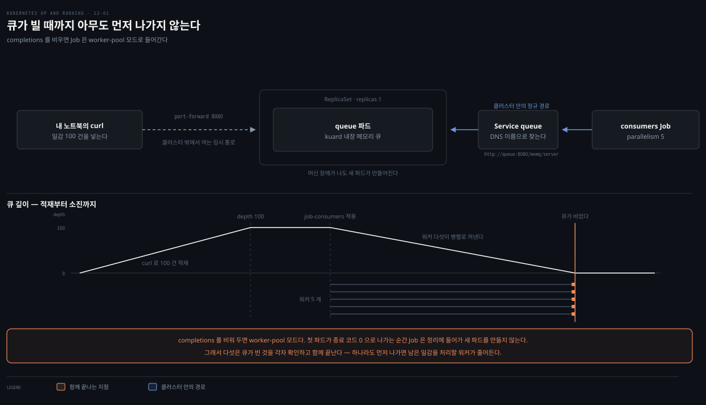

# 12장 · Jobs — 끝나는 일과 work queue 랩

## 핵심 요약

> 이 장이 매달린 하나의 생각은 **"Pod는 계속 살아 있으려 하지만 Job은 끝나려 한다"** 는 것입니다.

일반 Pod는 종료 코드와 무관하게 계속 재시작합니다. 데이터베이스 마이그레이션을 그렇게 돌리면 끝난 작업을 무한히 반복해 DB를 계속 다시 채웁니다. Job은 Pod가 **성공적으로 끝나는 것**(예를 들어 종료 코드 0)을 목표로 삼는 오브젝트라 이런 일회성 작업을 맡습니다.

**이 노트는 랩 중심입니다.** Job의 개념은 `write/`에 이미 여섯 편이 있고 일부는 이 책보다 촘촘합니다. 그래서 개념은 이 책이 설명한 만큼만 간결히 싣고, 분량의 절반을 이 책만의 **kuard work queue 랩**에 씁니다. 더 깊은 설명이 필요한 지점은 맨 아래 위임 표가 가리킵니다.


## 학습 목표

> 이 편을 읽고 나면 다음을 할 수 있습니다.

1. Job이 일반 Pod와 무엇이 다른지, 왜 마이그레이션 같은 작업에 필요한지 설명할 수 있습니다.
2. `completions`와 `parallelism` 조합으로 갈리는 세 가지 Job 패턴을 구분할 수 있습니다.
3. `restartPolicy`를 `OnFailure`로 둘 때와 `Never`로 둘 때 실패한 Pod가 어떻게 달라지는지 설명할 수 있습니다.
4. kuard로 work queue를 세우고 병렬 컨슈머 Job으로 비우는 실습을 직접 돌릴 수 있습니다.


## Job은 무엇이 다른가

> Job 오브젝트는 명세의 템플릿에 정의된 Pod를 만들고 관리하며, 그 Pod들이 성공적으로 완료될 때까지 책임집니다.

차이는 종료를 대하는 태도에 있습니다. 일반 Pod는 종료 코드가 무엇이든 계속 재시작합니다. Job이 만든 Pod는 성공 종료를 향해 달리고, 도달하면 그대로 끝납니다.

여기에 눈여겨볼 세부가 하나 있습니다. **Job은 자기가 만든 Pod를 식별할 라벨을 스스로 고릅니다.** DaemonSet·ReplicaSet·Deployment처럼 라벨로 Pod 집합을 가리는 컨트롤러에서 Pod가 여러 오브젝트에 걸쳐 재사용되면 예상치 못한 동작이 생깁니다. Job은 시작과 끝이 있어 사용자가 많이 만들게 되고, 그만큼 고유한 라벨을 고르기가 어렵고 또 중요해집니다. 그래서 Job이 자동으로 고유 라벨을 붙입니다. 고급 시나리오에서는 이 자동 동작을 끄고 라벨과 셀렉터를 직접 지정할 수 있습니다. 책이 드는 예는 실행 중인 Job을 그것이 관리하는 Pod를 죽이지 않고 교체하는 경우입니다.


## 세 가지 Job 패턴

> `completions`와 `parallelism`을 어떻게 조합하느냐가 패턴을 가릅니다. 원서 Table 12-1을 옮깁니다.

| 유형 | 쓰는 상황 | 동작 | completions | parallelism |
|------|----------|------|:---:|:---:|
| One shot | 데이터베이스 마이그레이션 | Pod 하나가 성공 종료까지 한 번 실행 | 1 | 1 |
| Parallel fixed completions | 여러 Pod가 정해진 양의 일을 나눠 처리 | 하나 이상의 Pod가 목표 횟수에 도달할 때까지 반복 실행 | 1+ | 1+ |
| Work queue: parallel jobs | 여러 Pod가 중앙 work queue에서 꺼내 처리 | 하나 이상의 Pod가 한 번씩 성공 종료까지 실행 | 1 | 2+ |

세 번째 유형의 Behavior 칸만 보면 One shot과 구분이 잘 안 됩니다. 차이는 본문에 있습니다. **워커 Job은 큐가 빌 때까지 각 일감을 처리합니다.** 즉 Pod 하나하나는 "한 번 돌고 성공 종료"지만, 그 한 번 안에서 큐를 계속 비우다가 더 꺼낼 것이 없을 때 끝납니다.

이 표는 진입점입니다. 조합별 실제 동작을 더 촘촘히 보려면 [in-action 18-02](../kubernetes-in-action/18-02.Job%20%EB%B3%91%EB%A0%AC%C2%B7%EC%8B%A4%ED%8C%A8%C2%B7%EC%99%84%EB%A3%8C%20%EB%AA%A8%EB%93%9C.md)가 일곱 가지 조합을 나열합니다. 이 책보다 세분돼 있습니다.


## 실패했을 때 — restartPolicy 두 값의 차이

> 같은 실패인데 `restartPolicy` 값에 따라 클러스터에 남는 흔적이 전혀 달라집니다. 이 장에서 가장 실무적인 대목입니다.

**`OnFailure`로 두면** kubelet이 같은 Pod를 그 자리에서 다시 시작합니다. 계속 실패하면 `CrashLoopBackOff` 상태가 되고, Kubernetes는 노드 자원을 갉아먹는 크래시 루프를 피하려고 재시작 전에 잠시 기다립니다. 중요한 것은 **이 과정이 전부 노드의 kubelet 안에서 끝나고 Job은 관여하지 않는다**는 점입니다. Pod 하나가 재시작 횟수를 쌓아 갑니다.

```bash
kubectl get pod -l job-name=oneshot
# NAME            READY   STATUS             RESTARTS   AGE
# oneshot-3ddk0   0/1     CrashLoopBackOff   4          3m
```

**`Never`로 두면** kubelet이 재시작하지 않고 그 Pod를 실패로 선언합니다. 그러면 Job이 그것을 알아채고 **대체 Pod를 새로 만듭니다.** 결과적으로 실패한 Pod가 하나씩 쌓입니다.

```bash
kubectl get pod -l job-name=oneshot
# oneshot-0wm49   0/1   Error     0   1m
# oneshot-6h9s2   0/1   Error     0   39s
# oneshot-hkzw0   1/1   Running   0   6s
# oneshot-k5swz   0/1   Error     0   28s
# oneshot-m1rdw   0/1   Error     0   19s
# oneshot-x157b   0/1   Error     0   57s
```

조심하지 않으면 클러스터에 "쓰레기"가 잔뜩 생깁니다. 그래서 책은 `OnFailure`를 권합니다. 재시작이 한 Pod 안에서 일어나므로 실패한 Pod가 늘어나지 않습니다. 다만 흔적이 사라지는 것은 아니어서 `RESTARTS` 횟수는 그대로 쌓입니다.

> **버전 차이**: 원서는 두 번째 예제를 `kubectl get pod -l job-name=oneshot -a`로 적습니다. `-a`(`--show-all`)는 현재 kubectl에 **없습니다.** 로컬 v1.34.1에서 `kubectl get --help`를 확인하면 `-A, --all-namespaces`만 있습니다. 지금은 플래그 없이도 실패한 Pod가 그대로 보이므로 위 명령에서 뺐습니다.


## work queue 랩 — kuard로 직접 돌려보기

> 이 책만의 자산입니다. 큐 데몬을 세우고 일감을 넣고 병렬 컨슈머로 비우는 흐름을 끝까지 돌려 봅니다. 명령은 제가 적고 실행은 직접 해 보시기 바랍니다.



kuard에는 메모리 기반 work queue가 내장돼 있습니다. 이 인스턴스 하나를 조율자로 세웁니다. **ReplicaSet으로 감싸는 이유는** 머신 장애가 나도 새 Pod가 만들어지게 하려는 것입니다.

```bash
# 1) 큐 데몬 — replicas 1 짜리 ReplicaSet (rs-queue.yaml)
kubectl apply -f rs-queue.yaml

# 2) 브라우저로 들여다볼 통로를 열어 둔다. "MemQ Server" 탭에서 큐 상태가 보인다
kubectl port-forward rs/queue 8080:8080
```

다음으로 Service를 붙입니다. 생산자와 소비자가 **DNS로 큐를 찾게** 하려는 목적입니다.

```bash
kubectl apply -f service-queue.yaml
```

이제 일감을 넣습니다. 앞서 열어 둔 `port-forward`를 통해 `curl`로 큐 API를 직접 두드립니다.

```bash
# keygen 이라는 큐를 만든다
curl -X PUT localhost:8080/memq/server/queues/keygen

# 일감 100건을 적재한다
for i in work-item-{0..99}; do
  curl -X POST localhost:8080/memq/server/queues/keygen/enqueue -d "$i"
done

# 큐 상태 확인 — depth 가 100 이면 적재 완료
curl 127.0.0.1:8080/memq/server/stats
```

마지막이 컨슈머 Job입니다. kuard를 소비자 모드로 돌려 큐에서 일감을 꺼내 키를 만들고, 큐가 비면 스스로 빠져나가게 합니다.

```yaml
apiVersion: batch/v1
kind: Job
metadata:
  labels:
    app: message-queue
    component: consumer
    chapter: jobs          # 아래 정리 명령이 이 라벨로 잡는다
  name: consumers
spec:
  parallelism: 5           # completions 는 두지 않는다
  template:
    metadata:
      labels:
        app: message-queue
        component: consumer
        chapter: jobs
    spec:
      containers:
      - name: worker
        image: "gcr.io/kuar-demo/kuard-amd64:blue"
        imagePullPolicy: Always
        command: ["/kuard"]
        args:
        - "--keygen-enable"
        - "--keygen-exit-on-complete"
        - "--keygen-memq-server=http://queue:8080/memq/server"
        - "--keygen-memq-queue=keygen"
      restartPolicy: OnFailure
```

**`completions`를 비워 둔 것이 이 랩의 핵심입니다.** 그러면 Job이 worker-pool 모드로 들어갑니다. 첫 Pod가 종료 코드 0으로 빠져나가는 순간 Job은 정리 단계로 접어들고 새 Pod를 더 만들지 않습니다. 뒤집어 말하면 **일이 다 끝나기 전에는 어떤 워커도 먼저 나가면 안 된다**는 뜻입니다. 모두가 큐가 빈 것을 확인하고 함께 마무리합니다.

```bash
kubectl apply -f job-consumers.yaml
kubectl get pods          # consumers-* 다섯 개가 병렬로 뜬다

# 실습이 끝나면 라벨 하나로 전부 정리한다
kubectl delete rs,svc,job -l chapter=jobs
```

정리 명령이 라벨 하나로 끝나는 이유는 이 랩의 매니페스트 넷(`job-parallel`·`rs-queue`·`service-queue`·`job-consumers`)이 모두 `chapter: jobs` 라벨을 달고 있기 때문입니다. 앞의 one-shot 예제와 뒤의 CronJob 예제에는 이 라벨이 없어 저 명령으로 지워지지 않습니다. 실습용 리소스에 공통 라벨을 심어 두는 습관은 이 랩 밖에서도 쓸모가 있는데, **넣은 것에만 걸린다**는 점은 같이 기억해야 합니다.


## CronJob

> 일정한 간격으로 Job을 돌리고 싶으면 CronJob이 그때마다 새 Job 오브젝트를 만들어 줍니다.

```yaml
apiVersion: batch/v1
kind: CronJob
metadata:
  name: example-cron
spec:
  schedule: "0 */5 * * *"   # 다섯 시간마다
  jobTemplate:
    spec:
      template:
        spec:
          containers:
          - name: batch-job
            image: my-batch-image
          restartPolicy: OnFailure
```

`spec.schedule`이 표준 cron 형식을 받습니다. 현재 상태는 `kubectl describe cronjob <이름>`으로 봅니다.

> **원문 정오**: 원서는 이 파일을 `job-cronjob.yaml`로 저장하라고 해 놓고 바로 다음 문장에서 `kubectl create -f cron-job.yaml`로 만들라고 합니다. 파일명이 어긋나 그대로 따라 하면 실패합니다.

책은 CronJob을 여기까지만 다룹니다. `concurrencyPolicy`나 `startingDeadlineSeconds` 같은 운영 옵션은 [patterns 08-01](../kubernetes-patterns/08-01.Periodic%20Job%20%E2%80%94%20CronJob%EC%9C%BC%EB%A1%9C%20%EC%8B%9C%EA%B0%84%20%EC%B6%95%EC%9D%84%20%EB%8D%94%ED%95%98%EB%8B%A4.md)가 다룹니다.


## 이 장의 개념은 어디에 있는가

> Job은 이 저장소에서 이미 여러 축으로 정리돼 있습니다. 깊이 들어갈 때 펼칠 곳을 적어 둡니다.

| 더 알고 싶은 것 | 읽을 곳 |
|---|---|
| Job 실행·상태·`suspend`·자동 삭제(`ttlSecondsAfterFinished`) | [in-action 18-01.Job 기초](../kubernetes-in-action/18-01.Job%20%EA%B8%B0%EC%B4%88%20%E2%80%94%20%EC%8B%A4%ED%96%89%C2%B7%EC%83%81%ED%83%9C%C2%B7suspend%C2%B7%EC%9E%90%EB%8F%99%EC%82%AD%EC%A0%9C.md) |
| `completions`×`parallelism` 일곱 조합, `backoffLimit`, Indexed 모드 | [in-action 18-02.Job 병렬·실패·완료 모드](../kubernetes-in-action/18-02.Job%20%EB%B3%91%EB%A0%AC%C2%B7%EC%8B%A4%ED%8C%A8%C2%B7%EC%99%84%EB%A3%8C%20%EB%AA%A8%EB%93%9C.md) |
| work queue의 coarse·fine 분할, Job 파드 간 통신, 사이드카 종료 | [in-action 18-03.work queue·pod 통신·sidecar·CronJob](../kubernetes-in-action/18-03.work%20queue%C2%B7pod%20%ED%86%B5%EC%8B%A0%C2%B7sidecar%C2%B7CronJob.md) |
| 배치 작업을 패턴으로 볼 때의 설계 판단 | [patterns 07-01.Batch Job](../kubernetes-patterns/07-01.Batch%20Job%20%E2%80%94%20%EC%9C%A0%ED%95%9C%ED%95%9C%20%EC%9E%91%EC%97%85%EC%9D%84%20%EC%99%84%EB%A3%8C%EA%B9%8C%EC%A7%80%20%EC%95%88%EC%A0%95%EC%A0%81%EC%9C%BC%EB%A1%9C.md) |
| CronJob 운영 옵션과 시간 축 설계 | [patterns 08-01.Periodic Job](../kubernetes-patterns/08-01.Periodic%20Job%20%E2%80%94%20CronJob%EC%9C%BC%EB%A1%9C%20%EC%8B%9C%EA%B0%84%20%EC%B6%95%EC%9D%84%20%EB%8D%94%ED%95%98%EB%8B%A4.md) |
| 배치 워크로드 개념 정리 | [개념 노트 01-02.배치 워크로드](../../kubernetes/01_workloads/01-02.%EB%B0%B0%EC%B9%98%20%EC%9B%8C%ED%81%AC%EB%A1%9C%EB%93%9C.md) |


## 참고 자료

- 원서: 《Kubernetes: Up and Running, 3rd Edition》 Chapter 12. Jobs (O'Reilly)
- [Kubernetes 공식 문서 — Job](https://kubernetes.io/docs/concepts/workloads/controllers/job/)
- [Kubernetes 공식 문서 — CronJob](https://kubernetes.io/docs/concepts/workloads/controllers/cron-job/)


## 관련 문서

> 같은 주제를 다른 축에서 다루는 노트입니다.

- [Kubernetes in Action 18-03](../kubernetes-in-action/18-03.work%20queue%C2%B7pod%20%ED%86%B5%EC%8B%A0%C2%B7sidecar%C2%B7CronJob.md) — 같은 work queue를 다른 구성으로 실습합니다. 이 노트의 kuard 랩과 나란히 보면 좋습니다
- [Kubernetes Patterns 07-01.Batch Job](../kubernetes-patterns/07-01.Batch%20Job%20%E2%80%94%20%EC%9C%A0%ED%95%9C%ED%95%9C%20%EC%9E%91%EC%97%85%EC%9D%84%20%EC%99%84%EB%A3%8C%EA%B9%8C%EC%A7%80%20%EC%95%88%EC%A0%95%EC%A0%81%EC%9C%BC%EB%A1%9C.md) — 배치를 패턴 축에서 본 정리
- [Kubernetes: Up and Running 정독 인덱스](./README.md) — 이 시리즈의 MOC
