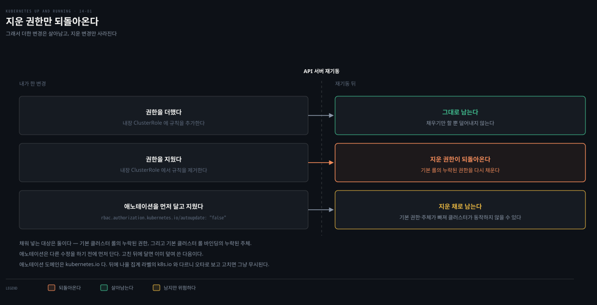

# 14장 · RBAC — 인가를 설계하고 운영하는 법

---

## 핵심 요약

> 이 장 전체가 매달린 하나의 생각은 **"권한은 한 번 설계하고 끝나는 것이 아니라, 클러스터가 계속 되돌리려 드는 상태를 사람이 붙잡아 두는 일"** 이라는 것입니다.

RBAC 자체는 단순합니다. 신원과 리소스와 동사를 조합해 규칙을 만듭니다. 바인딩은 그 규칙을 누군가에게 붙입니다. 이 장은 앞선 절반을 딱 그 설명에 씁니다. 나머지 절반은 전혀 다른 곳으로 갑니다. 만들어 둔 권한이 API 서버 재기동 때 조용히 되돌아가는 문제, Git으로 그 권한을 되돌리는 방법, 역할이 많아질 때 복사 대신 라벨로 합치는 집계, 사람이 늘어날 때 개인 대신 그룹에 붙이는 전략입니다.

이 노트가 형제 노트와 갈리는 지점도 거기입니다. Role과 ClusterRole의 차이 같은 공통 개념은 짧게 짚고 링크로 넘기고, 이 책에만 있는 운영 도구에 분량을 씁니다. `kubectl auth reconcile`, 내장 롤의 자동 복원과 그 차단 방법, `can-i --subresource`, 익명 접근 차단 플래그, 그리고 임시 권한을 주는 JIT 그룹입니다.

저자가 마지막에 남기는 조언도 이 관점입니다. RBAC은 나중에 덧붙이기보다 처음부터 깔아 두는 편이 훨씬 쉽습니다. 테스트 인프라와 같은 성격이라고 말합니다.


## 학습 목표

> 이 장을 읽고 나면 다음을 설명할 수 있어야 합니다.

1. 하나의 API 요청이 인증과 인가를 어떤 순서로 통과하고, 거부될 때 무엇이 돌아오는지 설명할 수 있습니다.
2. Role·ClusterRole·RoleBinding·ClusterRoleBinding 네 리소스가 만드는 범위 조합을 판단할 수 있습니다.
3. 내장 ClusterRole을 수정한 변경이 왜 사라지는지 설명하고, 그것을 막는 애노테이션을 쓸 수 있습니다.
4. `kubectl auth can-i`와 `kubectl auth reconcile`로 권한을 검증하고 Git으로 관리할 수 있습니다.
5. ClusterRole 집계와 그룹 바인딩이 각각 어떤 규모 문제를 푸는지 구분할 수 있습니다.


## 인증과 인가 — 요청이 거치는 두 관문

> 모든 요청은 신원을 확립하는 인증을 먼저 지나고, 그 신원으로 무엇을 할 수 있는지 따지는 인가를 그다음에 지납니다.


인증은 요청을 보낸 쪽이 누구인지 확정합니다. 결과가 "신원 없음"이어도 인증은 끝난 것입니다. 신원이 없는 요청에는 `system:unauthenticated` 그룹이 붙습니다. 이 점이 뒤에 나오는 익명 접근 문제의 출발점이 됩니다.

여기서 눈여겨볼 설계 판단이 하나 있습니다. **Kubernetes는 자체 신원 저장소를 갖고 있지 않습니다.** 사용자 목록을 자기 안에 두는 대신 외부 신원 소스를 끌어다 쓰는 데 집중합니다. 그래서 "Kubernetes에 사용자를 만든다"는 말은 성립하지 않고, 어떤 인증 제공자를 붙였느냐가 곧 사용자가 누구인지를 결정합니다.

인가는 세 가지의 조합으로 판정합니다. 요청자의 신원, 리소스, 그리고 수행하려는 동사입니다. 여기서 리소스는 사실상 HTTP 경로를 뜻합니다. 셋의 조합이 허용된 규칙과 맞으면 요청이 진행되고, 맞지 않으면 HTTP 403이 돌아옵니다.

### RBAC만으로는 막지 못하는 것

저자는 이 장을 시작하면서 경계를 먼저 긋습니다. 클러스터 안에서 임의의 코드를 실행할 수 있는 사람은 사실상 클러스터 전체의 root 권한을 얻을 수 있습니다. 올바른 RBAC 설정은 그런 공격을 더 어렵고 비싸게 만드는 방어의 한 겹일 뿐입니다.

그래서 서로 신뢰하지 않는 테넌트를 한 클러스터에 태우는 상황이라면 RBAC 위에 격리가 더 필요합니다. 책이 지목하는 방법은 하이퍼바이저로 격리된 컨테이너나 컨테이너 샌드박스입니다.

> **원문 정오**: 이 대목의 원서 문장은 `RBAC by itself is sufficient to protect you` 입니다. 그러나 바로 다음 문장이 "클러스터의 Pod를 반드시 격리해야 한다"로 이어지고, 문단 전체가 RBAC의 한계를 말하고 있어 앞뒤가 맞지 않습니다. 문맥상 `insufficient`(충분하지 않다)가 맞습니다. 원문 그대로 읽으면 보안 권고가 정반대로 뒤집히므로, 이 노트는 문맥에 맞는 뜻으로 정리했습니다.


## 신원 — 사용자 계정과 서비스 어카운트

> Kubernetes는 신원을 두 갈래로 나눕니다. 자기가 만들고 관리하는 서비스 어카운트와, 그 밖의 모든 사용자 계정입니다.

**서비스 어카운트**: Kubernetes 자신이 생성하고 관리하며, 대체로 클러스터 안에서 도는 컴포넌트에 연결됩니다.

**사용자 계정**: 그 외 전부입니다. 실제 사람뿐 아니라 클러스터 밖에서 도는 지속적 배포 서비스 같은 자동화도 여기 들어갑니다.

인증 제공자는 범용 인터페이스로 붙습니다. 각 제공자는 사용자 이름과, 선택적으로 그 사용자가 속한 그룹 집합을 공급합니다. 책이 드는 제공자는 다섯 가지입니다.

| 인증 제공자 | 비고 |
|------------|------|
| HTTP Basic Authentication | 대체로 폐기된 방식 |
| x509 클라이언트 인증서 | |
| 호스트의 정적 토큰 파일 | |
| 클라우드 인증 제공자 | Azure Active Directory, AWS IAM 등 |
| 인증 웹훅 | |

관리형 Kubernetes는 대개 인증을 대신 설정해 줍니다. 직접 인증을 구성한다면 API 서버 플래그를 알맞게 잡아야 합니다.

### 신원은 쪼개서 씁니다

책이 분명하게 요구하는 원칙이 있습니다. **애플리케이션마다 다른 신원을 씁니다.** 구체적으로는 세 축으로 갈립니다.

- 운영 프론트엔드와 운영 백엔드는 서로 다른 신원을 가집니다
- 운영 신원 전체는 개발 신원과 구분됩니다
- 클러스터가 다르면 신원도 다릅니다

여기에 조건이 하나 더 붙습니다. 이 신원들은 모두 사람과 공유하지 않는 기계 신원이어야 합니다. 구현 수단은 Kubernetes 서비스 어카운트이거나, 신원 시스템이 제공하는 Pod 신원 제공자입니다.

책은 이 원칙을 못 박기만 하고 이유를 달지 않습니다. 아래 두 가지는 책 밖 해석입니다. 신원 하나가 여러 애플리케이션에 걸쳐 있으면 그 신원이 털렸을 때 피해 범위를 좁힐 수 없습니다. 어느 애플리케이션이 어떤 권한을 실제로 쓰는지 사후에 가려낼 수도 없습니다.

> 서비스 어카운트 토큰이 Pod에 어떤 방식으로 주입되는지, 토큰 모델이 어떻게 바뀌어 왔는지는 이 책이 다루지 않습니다. 그 내용은 [Kubernetes Patterns 26-01](../kubernetes-patterns/26-01.Access%20Control%20%E2%80%94%20RBAC%EC%9C%BC%EB%A1%9C%20%EB%88%84%EA%B0%80%20%EB%AC%B4%EC%97%87%EC%9D%84%20%ED%95%A0%20%EC%88%98%20%EC%9E%88%EB%8A%94%EC%A7%80.md)과 개념 노트 [07-01.RBAC과 보안](../../kubernetes/07_security/07-01.RBAC%EA%B3%BC%20%EB%B3%B4%EC%95%88.md)에 있습니다.


## Role과 Binding — 네 리소스의 범위 조합

> 역할은 추상적인 능력의 묶음이고, 바인딩은 그 묶음을 신원에 붙이는 행위입니다. 각각 네임스페이스판과 클러스터판이 있어 네 리소스가 됩니다.


책의 정의는 짧습니다. **역할(role)** 은 추상적인 능력의 집합입니다. 예를 들어 `appdev` 역할은 Pod와 Service를 생성하는 능력을 나타낼 수 있습니다. **역할 바인딩(role binding)** 은 그 역할을 하나 이상의 신원에 할당하는 것입니다. `appdev` 역할을 사용자 `alice`에게 바인딩하면 Alice가 Pod와 Service를 만들 수 있게 됩니다.

Kubernetes에서는 이 개념이 두 쌍으로 나뉩니다. 한 쌍은 네임스페이스에 매인 Role과 RoleBinding이고, 다른 쌍은 클러스터에 매인 ClusterRole과 ClusterRoleBinding입니다. 뒤쪽 쌍은 앞쪽과 거의 같고 범위만 클러스터입니다.

Role에는 제약이 둘 있습니다. 네임스페이스 리소스이므로 그 네임스페이스 안의 능력만 나타냅니다. 그리고 CustomResourceDefinition처럼 네임스페이스에 속하지 않는 리소스에는 쓸 수 없습니다. RoleBinding으로 역할을 묶으면 권한은 Role과 RoleBinding이 함께 들어 있는 그 네임스페이스 안에서만 생깁니다.

> **책 밖 보강**: 위 도식의 점선, 즉 ClusterRole을 RoleBinding으로 묶어 범위를 한 네임스페이스로 좁히는 조합은 이 책이 다루지 않습니다. 책은 두 쌍을 "거의 같고 범위만 다르다"고만 적습니다. 그러나 같은 권한 묶음을 여러 네임스페이스에서 재사용할 때 실제로 가장 많이 쓰는 형태라 도식과 치트시트에 넣었습니다. 이 조합의 설명은 개념 노트 [07-01.RBAC과 보안](../../kubernetes/07_security/07-01.RBAC%EA%B3%BC%20%EB%B3%B4%EC%95%88.md) §2가 갖고 있습니다.

### 책의 예제

Pod와 Service를 만들고 고칠 수 있게 하는 Role입니다.

```yaml
kind: Role
apiVersion: rbac.authorization.k8s.io/v1
metadata:
  namespace: default
  name: pod-and-services
rules:
- apiGroups: [""]
  resources: ["pods", "services"]
  verbs: ["create", "delete", "get", "list", "patch", "update", "watch"]
```

> **원문 정오**: 원서 PDF는 `verbs:` 줄이 페이지 오른쪽 여백에서 잘려 `"watch` 에서 끝납니다. 닫는 `"]` 가 유실된 것이며 내용이 빠진 것은 아닙니다. 위 예제는 닫는 괄호를 복원한 형태입니다.

이 Role을 사용자 `alice`에게 묶는 RoleBinding입니다. 같은 바인딩이 그룹 `mydevs`도 함께 묶습니다.

```yaml
apiVersion: rbac.authorization.k8s.io/v1
kind: RoleBinding
metadata:
  namespace: default
  name: pods-and-services
subjects:
- apiGroup: rbac.authorization.k8s.io
  kind: User
  name: alice
- apiGroup: rbac.authorization.k8s.io
  kind: Group
  name: mydevs
roleRef:
  apiGroup: rbac.authorization.k8s.io
  kind: Role
  name: pod-and-services
```

> **원문 정오는 아니지만 읽을 때 걸리는 지점**: Role의 이름은 `pod-and-services`(단수 pod)이고 RoleBinding의 이름은 `pods-and-services`(복수 pods)입니다. 서로 다른 오브젝트라 이름이 달라도 문제는 없지만, `roleRef.name`이 가리키는 것은 단수 쪽인 `pod-and-services`입니다. 예제를 옮겨 쓸 때 한 글자 차이로 바인딩이 실패할 수 있습니다.

### 동사는 HTTP 메서드에 대응합니다

역할은 리소스와 동사의 짝으로 정의됩니다. 동사는 대략 HTTP 메서드에 대응합니다. 다음은 원서 Table 14-1을 옮긴 것입니다.

| 동사 | HTTP 메서드 | 설명 |
|------|------------|------|
| `create` | POST | 새 리소스를 만듭니다 |
| `delete` | DELETE | 기존 리소스를 지웁니다 |
| `get` | GET | 리소스 하나를 가져옵니다 |
| `list` | GET | 리소스 모음을 나열합니다 |
| `patch` | PATCH | 부분 변경으로 기존 리소스를 고칩니다 |
| `update` | PUT | 완전한 객체로 기존 리소스를 고칩니다 |
| `watch` | GET | 리소스의 스트리밍 변경을 감시합니다 |
| `proxy` | GET | 스트리밍 WebSocket 프록시로 리소스에 접속합니다 |

> **책 밖 보강**: `get`과 `list`가 둘 다 GET에 대응한다는 사실은 표에 있지만, 그 함의는 책이 짚지 않습니다. RBAC 동사는 서로 독립이라 `get`을 줘도 `list`가 따라오지 않습니다. 목록 조회가 필요하면 `list`를 규칙에 따로 적어야 합니다.

> 와일드카드 동사의 위험, RBAC이 권한 상승을 막는 방식은 이 책이 다루지 않습니다. [Kubernetes Patterns 26-01](../kubernetes-patterns/26-01.Access%20Control%20%E2%80%94%20RBAC%EC%9C%BC%EB%A1%9C%20%EB%88%84%EA%B0%80%20%EB%AC%B4%EC%97%87%EC%9D%84%20%ED%95%A0%20%EC%88%98%20%EC%9E%88%EB%8A%94%EC%A7%80.md)에 정리돼 있습니다.


## 내장 롤과 자동 복원

> 역할을 직접 설계하는 일은 품이 많이 듭니다. Kubernetes가 내장 롤을 여럿 제공하는데, 그것을 고치면 재기동 때 되돌아간다는 함정이 붙어 있습니다.



내장 클러스터 롤은 이렇게 볼 수 있습니다.

```bash
kubectl get clusterroles
```

대부분은 스케줄러 같은 시스템 신원을 위한 것입니다. 그중 넷은 일반 최종 사용자를 위해 설계됐습니다.

- `cluster-admin`: 클러스터 전체에 대한 완전한 접근을 줍니다
- `admin`: 하나의 네임스페이스 전체에 대한 완전한 접근을 줍니다
- `edit`: 최종 사용자가 네임스페이스 안의 리소스를 고칠 수 있게 합니다
- `view`: 네임스페이스에 대한 읽기 전용 접근을 줍니다

이미 설정된 바인딩은 `kubectl get clusterrolebindings`로 확인합니다.

### edit과 view의 실제 경계는 더 좁습니다

책의 한 줄 설명은 이 네 롤을 고르는 데 부족합니다. 공식 문서를 보면 `edit`과 `view`에 보안상 중요한 단서가 붙어 있습니다.[^k8s-rbac]

`edit`은 네임스페이스 안의 Secret에 접근할 수 있고 그 네임스페이스의 어떤 서비스 어카운트로든 Pod를 띄울 수 있습니다. 결국 그 네임스페이스에 있는 모든 서비스 어카운트의 API 권한을 얻는 통로가 됩니다. 반대로 `view`는 Secret을 볼 수 **없습니다.** Secret 내용을 읽으면 서비스 어카운트 자격증명에 닿아 같은 권한 상승이 일어나기 때문입니다.

"읽기 전용이니 안전하다"는 판단은 `view`에서만 성립하고, "편집만 준 것"이라는 판단은 `edit`에서 성립하지 않습니다. 책 밖 보강이지만 실제 권한 부여에서 갈리는 지점이라 옮겨 둡니다.

### 고친 내장 롤은 되돌아갑니다

API 서버는 기동할 때마다 자기 코드에 정의된 기본 ClusterRole들을 설치합니다. 그래서 내장 클러스터 롤을 고쳐 두면 그 수정은 한시적입니다. 업그레이드 같은 이유로 API 서버가 재기동되면 변경이 덮여 씁니다.

이것을 막으려면 다른 수정을 하기 **전에** 먼저 애노테이션을 답니다. 대상 내장 ClusterRole에 `rbac.authorization.kubernetes.io/autoupdate` 애노테이션을 `false`로 붙이면 API 서버가 그 ClusterRole을 덮어쓰지 않습니다.

공식 문서는 이 동작을 조금 더 정확하게 적습니다. API 서버는 기동할 때마다 기본 클러스터 롤에서 **누락된 권한**을, 기본 클러스터 롤 바인딩에서 **누락된 주체**를 채웁니다.[^k8s-rbac] 그래서 권한을 지운 변경은 되돌아오고, 클러스터가 새 릴리스의 권한 변화를 따라가게 됩니다. 애노테이션을 끄면 기본 권한과 주체가 빠진 채로 남아 클러스터가 동작하지 않을 수 있다는 경고도 함께 붙어 있습니다.

> **도메인이 헷갈리는 지점**: 자동 복원 차단 애노테이션은 `rbac.authorization.kubernetes.io/autoupdate`로 `kubernetes.io` 도메인을 쓰고, 뒤에 나올 집계 라벨은 `rbac.authorization.k8s.io/aggregate-to-edit`로 `k8s.io` 도메인을 씁니다. 같은 `rbac.authorization` 접두어에 도메인만 다릅니다. 오타로 보여 고치면 애노테이션이 그냥 무시되므로 원문 그대로 씁니다. 공식 문서에서 두 표기를 각각 확인했습니다.[^k8s-rbac]

### 익명 사용자에게 열린 문

책이 경고 상자로 못 박는 내용입니다. API 서버는 기본적으로 `system:unauthenticated` 사용자가 API 디스커버리 엔드포인트에 접근하도록 허용하는 클러스터 롤을 설치합니다. 공개 인터넷 같은 적대적 환경에 노출된 클러스터에서 이것은 나쁜 선택이며, 저자는 이 노출을 통한 심각한 보안 취약점이 최소한 한 번은 있었다고 적습니다.

공개 인터넷이나 그 밖의 적대적 환경에서 Kubernetes 서비스를 돌린다면 API 서버에 `--anonymous-auth=false` 플래그를 거는지 확인해야 합니다.[^k8s-rbac]


## RBAC 관리 기법 — 검증과 소스 관리

> 잘못 설정된 RBAC은 보안 문제로 이어집니다. 책은 그 위험을 줄이는 도구 둘을 제시합니다. 권한을 미리 물어보는 명령과, RBAC을 Git에 넣는 명령입니다.

### can-i로 권한을 물어봅니다

`kubectl auth can-i`는 특정 사용자가 특정 동작을 할 수 있는지 시험합니다. 클러스터를 구성하면서 설정을 검증할 때 쓰고, 사용자가 오류나 버그를 신고할 때 자기 접근 권한을 확인하도록 시킬 때도 씁니다.

가장 단순한 형태는 동사와 리소스를 받습니다.

```bash
# 지금 kubectl 사용자가 Pod를 만들 수 있는지
kubectl auth can-i create pods

# 서브리소스도 물어볼 수 있다
kubectl auth can-i get pods --subresource=log
```

> **원문 정오**: 원서의 두 번째 예제는 `--subresource=logs`(복수)입니다. Pod 로그의 서브리소스 이름은 `log`(단수)이며, RBAC 규칙에서도 `pods/log`로 씁니다. 공식 문서의 `can-i` 예제 역시 `--subresource=log`입니다.[^kubectl-cani] 복수로 쓰면 존재하지 않는 서브리소스를 묻게 되어 결과가 의도와 달라집니다.

### RBAC을 Git에 넣습니다

RBAC 리소스도 다른 리소스와 마찬가지로 YAML로 표현됩니다. 텍스트 표현이니 버전 관리에 넣는 것이 자연스럽고, 그러면 책임 추적과 감사와 롤백이 가능해집니다.

여기서 `kubectl apply` 대신 전용 명령을 씁니다.

```bash
# 파일의 롤·바인딩을 클러스터 현재 상태와 조정한다
kubectl auth reconcile -f some-rbac-config.yaml

# 적용하기 전에 무엇이 바뀔지만 본다
kubectl auth reconcile -f some-rbac-config.yaml --dry-run=client
```

왜 `apply`가 아니라 `reconcile`일까요. 공식 문서는 이 명령이 규칙과 주체를 **의미를 이해한 채로 병합**하기 때문에 RBAC 리소스에는 `apply`보다 이쪽이 낫다고 적습니다.[^kubectl-reconcile] 하는 일은 셋입니다.

- 빠진 오브젝트와 거기 필요한 네임스페이스를 만듭니다
- 기존 롤에는 입력에 있는 권한을 더합니다
- 기존 바인딩에는 입력에 있는 주체를 더합니다

여분을 걷어내는 일은 기본 동작이 아닙니다. `--remove-extra-permissions`와 `--remove-extra-subjects`를 줄 때만 일어납니다.

> **원문 보강**: 책은 `--dry-run` 플래그만 언급합니다. 현재 `kubectl auth reconcile`의 `--dry-run`은 `none`·`server`·`client` 중 하나를 받는 문자열 옵션이며 기본값은 `none`입니다.[^kubectl-reconcile] 값 없이 `--dry-run`만 주던 옛 형태와 다르므로 위 예제에는 값을 붙였습니다.


## 고급 — 집계와 그룹

> 사용자나 역할이 많아지면 규모의 문제가 생깁니다. 역할 쪽 답이 집계이고, 사람 쪽 답이 그룹입니다.


### 집계 — 역할을 복사하지 않고 합칩니다

다른 역할들을 조합한 역할이 필요할 때가 있습니다. 한 ClusterRole의 규칙을 다른 ClusterRole로 복사하는 방법이 있지만 복잡하고 실수하기 쉽습니다. 한쪽이 바뀌어도 다른 쪽에 자동으로 반영되지 않기 때문입니다.

그래서 Kubernetes RBAC은 집계 규칙을 지원합니다. 집계 역할은 구성 역할들의 능력을 모두 합치고, 구성 역할 중 어느 하나가 바뀌면 그 변경이 집계 역할로 자동 전파됩니다.

합칠 대상은 라벨 셀렉터로 고릅니다. ClusterRole의 `aggregationRule` 필드가 `clusterRoleSelectors` 필드를 담고, 그것이 라벨 셀렉터입니다. 셀렉터에 걸리는 모든 ClusterRole이 집계 ClusterRole의 `rules` 배열로 동적으로 모입니다.

> **원문 정오**: 원서 산문은 이 필드를 `clusterRoleSelector`(단수)로 적습니다. 실제 필드명은 `clusterRoleSelectors`(복수)이며, 같은 절의 YAML 예제와 공식 문서가 모두 복수입니다.[^k8s-rbac] 산문만 보고 옮겨 적으면 필드가 무시됩니다.

책이 권하는 방식은 잘게 나눈 클러스터 롤을 여럿 만들고 그것들을 합쳐 상위 롤을 만드는 것입니다. 내장 클러스터 롤이 바로 그렇게 정의돼 있습니다. 내장 `edit` 롤의 모습입니다.

```yaml
apiVersion: rbac.authorization.k8s.io/v1
kind: ClusterRole
metadata:
  name: edit
  ...
aggregationRule:
  clusterRoleSelectors:
  - matchLabels:
      rbac.authorization.k8s.io/aggregate-to-edit: "true"
...
```

`edit` 롤은 `rbac.authorization.k8s.io/aggregate-to-edit` 라벨이 `true`인 모든 ClusterRole의 합으로 정의된다는 뜻입니다.

> **원문 정오**: 이 절의 원서 문장에 `propogated` 표기가 있습니다. `propagated`의 오탈자입니다. 뜻에는 영향이 없습니다.

> **원문 보강 — GitOps에서 걸리는 함정**: 공식 문서는 집계 ClusterRole 매니페스트에서 `rules` 필드를 **아예 빼라고** 경고합니다.[^k8s-rbac] 컨트롤 플레인이 집계 롤의 `rules`를 덮어쓰는데, 매니페스트에 `rules`를 두면 빈 리스트여도 server-side apply에서 그 필드의 소유권을 주장하게 됩니다. 그러면 이후 apply가 필드 관리자 충돌로 실패하거나, GitOps 컨트롤러처럼 충돌을 강제로 무시하는 경우 집계된 규칙을 반복해서 지우고 컨트롤 플레인이 다시 채우는 상태가 됩니다. 앞 절의 `kubectl auth reconcile`과 같은 맥락에서 실제로 부딪히는 문제라 함께 적어 둡니다.

### 그룹 — 개인이 아니라 팀에 붙입니다

여러 조직의 많은 사람이 비슷한 접근 권한을 가질 때는 개인 신원마다 바인딩을 추가하는 대신 그룹으로 역할을 관리하는 편이 낫습니다. 그룹을 Role이나 ClusterRole에 바인딩하면 그 그룹의 구성원 누구나 해당 역할의 리소스와 동사에 접근하게 됩니다. 개인에게 권한을 주려면 그 사람을 그룹에 넣으면 됩니다.

책이 드는 이유는 세 갈래입니다.

첫째로 큰 조직에서 클러스터 접근은 개인이 아니라 소속 팀 단위로 정의됩니다. 프론트엔드 운영 팀에 속한 사람은 프론트엔드 리소스를 보고 고칠 권한이 필요하고 백엔드 리소스는 읽기만 필요할 수 있습니다. 그룹에 권한을 주면 팀과 능력의 연결이 분명해집니다. 개인에게 역할을 주면 각 팀에 필요한 최소 권한이 무엇인지 알아보기 훨씬 어려워집니다. 한 사람이 여러 팀에 속할 때 특히 그렇습니다.

둘째는 단순함과 일관성입니다. 누가 팀에 들어오거나 나갈 때 그룹에서 넣고 빼는 한 번의 조작으로 끝납니다. 개인 신원의 바인딩을 일일이 지우는 방식이면 너무 적게 지워 불필요한 접근이 남거나 너무 많이 지워 일을 못 하게 만들 수 있습니다.

둘째의 효과가 하나 더 있습니다. 유지할 그룹 역할 바인딩이 한 벌뿐이므로, 팀원 전원이 같은 권한을 갖도록 맞추는 데 따로 품을 들이지 않아도 됩니다.

셋째는 그룹이 Kubernetes 밖에서도 쓰인다는 점입니다. 같은 그룹이 시설 출입이나 문서 접근이나 머신 로그인 관리에도 쓰이는 경우가 많습니다. 그 그룹을 Kubernetes 접근 제어에도 쓰면 관리가 크게 단순해집니다.

책은 여기에 짧은 주석을 답니다. 많은 클라우드 제공자가 자사 IAM 플랫폼과의 통합을 지원해서, 그 플랫폼의 사용자와 그룹을 Kubernetes RBAC과 함께 쓸 수 있습니다. 관리형 클러스터를 쓴다면 그룹의 출처는 대개 이쪽이 됩니다.

### JIT — 서 있는 권한을 없앱니다

많은 그룹 시스템이 "just in time"(JIT) 접근을 지원합니다. 상시 권한을 주는 대신, 한밤중 호출 같은 사건에 대응해 사람을 그룹에 일시적으로만 넣는 방식입니다.

효과가 둘입니다. 특정 시점에 누가 접근 권한을 가졌는지 감사할 수 있게 되고, 신원이 탈취되더라도 그 신원이 평소에는 운영 인프라에 닿지 못하게 됩니다.

그룹을 ClusterRole에 바인딩할 때는 주체의 종류를 `Group`으로 둡니다.

```yaml
...
subjects:
- apiGroup: rbac.authorization.k8s.io
  kind: Group
  name: my-great-groups-name
...
```

마지막으로 중요한 사실이 있습니다. **Kubernetes 안에는 그룹이라는 강한 개념이 없습니다.** 그룹은 인증 제공자가 공급합니다. Kubernetes가 아는 것은 하나의 신원이 하나 이상의 그룹에 속할 수 있고 그 그룹들을 바인딩으로 Role이나 ClusterRole에 연결할 수 있다는 것뿐입니다. 그래서 그룹 설계는 Kubernetes 밖에서 끝내고 와야 합니다.


## 결정 치트시트

> 이 장의 판단 기준을 압축한 표입니다.

| 상황 | 선택 | 이유 |
|------|------|------|
| 한 네임스페이스 안의 권한만 필요 | Role + RoleBinding | 범위가 좁을수록 사고 반경이 작습니다 |
| 같은 권한 묶음을 여러 네임스페이스에서 재사용 | ClusterRole + RoleBinding | 정의는 한 번, 적용 범위는 네임스페이스로 좁힙니다 |
| Node·PV·CRD 같은 비네임스페이스 리소스 | ClusterRole 필수 | Role은 비네임스페이스 리소스에 쓸 수 없습니다 |
| 클러스터 전역 권한 | ClusterRole + ClusterRoleBinding | 전 네임스페이스에 걸리므로 마지막 수단입니다 |
| 사람이 여럿이고 팀 단위로 움직임 | 그룹에 바인딩 | 입퇴사를 한 번의 조작으로 처리합니다 |
| 상시 권한이 부담스러움 | JIT 그룹 | 사건이 있을 때만 임시로 넣습니다 |
| 상위 역할을 구성하고 싶음 | 집계 규칙 | 복사와 달리 하위 변경이 자동 전파됩니다 |
| 내장 롤을 고쳐야 함 | 먼저 `autoupdate: false` | 순서를 지키지 않으면 재기동 때 되돌아갑니다 |
| RBAC을 Git으로 관리 | `kubectl auth reconcile` | 규칙과 주체를 의미 단위로 병합합니다 |
| 권한이 맞는지 확인 | `kubectl auth can-i` | 추측하지 않고 클러스터에 직접 묻습니다 |


## 실습 — kind로 확인하기

> 이 절은 책 밖 보강입니다. 원서에는 실습 절차가 없어 로컬 kind 클러스터에서 확인할 수 있는 형태로 구성했습니다. 명령은 직접 실행해 보시기 바랍니다.

먼저 `can-i`가 무엇을 답하는지 봅니다. `--as`로 다른 신원을 가장해 물어볼 수 있어 설정 검증에 쓰기 좋습니다.

```bash
# 현재 사용자 기준
kubectl auth can-i create pods

# 특정 서비스 어카운트를 가장해서
kubectl auth can-i list pods --as=system:serviceaccount:default:default

# 지금 신원이 가진 것을 전부 나열
kubectl auth can-i --list --namespace=default
```

다음으로 내장 롤의 집계 구조를 눈으로 확인합니다. `edit` 롤에는 `rules`가 채워져 있지만 매니페스트에는 `aggregationRule`만 있다는 점을 봅니다.

```bash
# edit 롤의 집계 규칙
kubectl get clusterrole edit -o jsonpath='{.aggregationRule}'

# 그 라벨이 붙은 하위 롤들
kubectl get clusterroles -l rbac.authorization.k8s.io/aggregate-to-edit=true
```

자동 복원은 애노테이션 확인으로 대신합니다. 내장 롤을 실제로 고치는 실습은 클러스터를 망가뜨릴 수 있어 권하지 않습니다.

```bash
# 내장 롤에 붙어 있는 autoupdate 애노테이션
kubectl get clusterrole view -o jsonpath='{.metadata.annotations}'
```

마지막으로 `reconcile`의 미리보기입니다. 앞의 Role·RoleBinding 예제를 파일로 저장한 뒤 실행합니다.

```bash
kubectl auth reconcile -f rbac-example.yaml --dry-run=client
```


## 면접 대비

### 한 줄 정의

"Kubernetes RBAC이란 인증으로 확정된 신원에 대해 어떤 리소스에 어떤 동사를 허용할지 규칙으로 정의하고, 바인딩으로 그 규칙을 신원에 연결하는 인가 방식입니다."

### 핵심 포인트 3가지

1. 인가는 신원과 리소스와 동사의 조합으로 판정하며, 통과하지 못하면 HTTP 403이 돌아옵니다.
2. 범위는 리소스 종류가 아니라 바인딩이 결정합니다. ClusterRole을 RoleBinding으로 묶으면 그 네임스페이스로 범위가 좁혀집니다.
3. 내장 롤을 고친 변경은 API 서버 재기동 때 되돌아가며, `rbac.authorization.kubernetes.io/autoupdate: false`를 먼저 붙여야 유지됩니다.

### 자주 묻는 질문

**Q. Role과 ClusterRole은 언제 갈라 쓰나요?**
A. 대상 리소스가 네임스페이스에 속하는지가 1차 기준입니다. Node나 PersistentVolume이나 CRD는 Role로 다룰 수 없어 ClusterRole이어야 합니다. 네임스페이스 리소스라도 같은 권한 묶음을 여러 네임스페이스에서 재사용한다면 ClusterRole로 정의하고 각 네임스페이스에서 RoleBinding으로 묶는 편이 관리가 쉽습니다.

**Q. RBAC만 잘 짜면 멀티테넌시가 안전한가요?**
A. 아닙니다. 클러스터 안에서 임의 코드를 실행할 수 있으면 사실상 클러스터 root를 얻을 수 있습니다. RBAC은 공격을 어렵고 비싸게 만드는 한 겹이고, 서로 신뢰하지 않는 테넌트를 태우려면 하이퍼바이저 격리 컨테이너나 샌드박스로 Pod 자체를 격리해야 합니다.

**Q. RBAC을 왜 `apply` 대신 `auth reconcile`로 적용하나요?**
A. `apply`는 필드 단위로 덮어쓰지만 `reconcile`은 규칙과 주체를 의미 단위로 병합합니다. 기존 롤에는 권한을 더하고 기존 바인딩에는 주체를 더하며, 여분 제거는 별도 플래그를 줄 때만 일어납니다. 그래서 여러 곳에서 관리되는 RBAC을 안전하게 수렴시킬 수 있습니다.

**Q. 개인 대신 그룹에 바인딩하면 무엇이 좋아지나요?**
A. 접근 권한이 소속 팀 단위로 정의되므로 최소 권한을 판단하기 쉬워집니다. 입퇴사도 그룹 가감 한 번으로 끝나 바인딩을 과소·과다 삭제하는 실수가 사라집니다. 다만 그룹 자체는 Kubernetes가 아니라 인증 제공자가 공급합니다.


## 핵심 개념 체크리스트

- [ ] 인증과 인가의 경계를 설명하고, 신원 없는 요청에 무엇이 붙는지 말할 수 있는가?
- [ ] Kubernetes가 신원 저장소를 내장하지 않는 이유와 그 결과를 설명할 수 있는가?
- [ ] 네 리소스의 조합 중 "ClusterRole + RoleBinding"이 무엇을 위한 것인지 말할 수 있는가?
- [ ] `get`과 `list`가 둘 다 GET인데도 따로 적어야 하는 이유를 아는가?
- [ ] `edit` 롤이 사실상 그 네임스페이스의 서비스 어카운트 권한까지 준다는 점을 설명할 수 있는가?
- [ ] 내장 롤 수정이 사라지는 조건과 그것을 막는 순서를 말할 수 있는가?
- [ ] 집계 롤 매니페스트에 `rules`를 두면 안 되는 이유를 설명할 수 있는가?
- [ ] JIT 그룹이 무엇을 줄이는지 한 문장으로 말할 수 있는가?


## 참고 자료

- 원서: 《Kubernetes: Up and Running, 3rd Edition》 Chapter 14. Role-Based Access Control for Kubernetes (O'Reilly)
- [Kubernetes 공식 문서 — RBAC Authorization](https://kubernetes.io/docs/reference/access-authn-authz/rbac/)
- [kubectl auth can-i 레퍼런스](https://kubernetes.io/docs/reference/kubectl/generated/kubectl_auth/kubectl_auth_can-i/)
- [kubectl auth reconcile 레퍼런스](https://kubernetes.io/docs/reference/kubectl/generated/kubectl_auth/kubectl_auth_reconcile/)

[^k8s-rbac]: Kubernetes — RBAC Authorization. 자동 복원 애노테이션·사용자 대상 기본 롤·집계 ClusterRole의 `rules` 주의·`--anonymous-auth=false` 근거. <https://kubernetes.io/docs/reference/access-authn-authz/rbac/>

[^kubectl-cani]: Kubernetes — kubectl auth can-i. `--subresource` 플래그 설명과 `--subresource=log` 예제. <https://kubernetes.io/docs/reference/kubectl/generated/kubectl_auth/kubectl_auth_can-i/>

[^kubectl-reconcile]: Kubernetes — kubectl auth reconcile. 의미 인식 병합·`--dry-run` 허용값·`--remove-extra-permissions` 근거. <https://kubernetes.io/docs/reference/kubectl/generated/kubectl_auth/kubectl_auth_reconcile/>


## 관련 문서

> 같은 주제를 다른 축에서 다루는 노트입니다. 축이 갈리므로 겹치는 개념은 이쪽에서 반복하지 않았습니다.

- [08_cloud/kubernetes — 07-01.RBAC과 보안](../../kubernetes/07_security/07-01.RBAC%EA%B3%BC%20%EB%B3%B4%EC%95%88.md) — RBAC이 클러스터 보안 전체에서 어디쯤인지. Admission·PSS·NetworkPolicy·Secret·Audit과의 관계
- [Kubernetes Patterns — 26-01.Access Control](../kubernetes-patterns/26-01.Access%20Control%20%E2%80%94%20RBAC%EC%9C%BC%EB%A1%9C%20%EB%88%84%EA%B0%80%20%EB%AC%B4%EC%97%87%EC%9D%84%20%ED%95%A0%20%EC%88%98%20%EC%9E%88%EB%8A%94%EC%A7%80.md) — 권한 설계 판단. subject 세 종류, 서비스 어카운트 토큰, 와일드카드 위험, 권한 상승 방지
- [Kubernetes: Up and Running 정독 인덱스](./README.md) — 이 시리즈의 MOC
