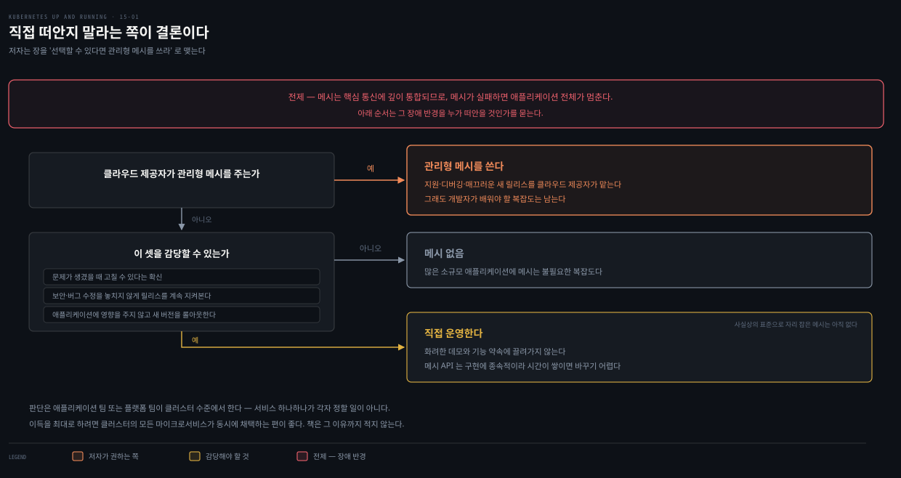

# 15장 · Service Meshes — 쓸 것인가를 먼저 따진다

## 핵심 요약

> 이 장이 매달린 하나의 생각은 **"서비스 메시는 능력을 더하는 만큼 장애 반경도 넓히므로, 도입은 기능 비교가 아니라 운영 각오의 문제"** 라는 것입니다.

이 장은 앞선 장들과 결이 다릅니다. YAML도 `kubectl` 명령도 도판도 없습니다. 저자는 메시가 무엇을 해 주는지 설명한 뒤 곧바로 **"정말 필요한가"** 를 묻고, 메시 고르기를 다루는 절을 "당신에게 맞는 메시가 결국 메시 없음일 수도 있다"로 닫습니다. 클라우드 네이티브 다이어그램에서 메시가 필수처럼 그려지는 것에 대해 **그렇지 않다**고 못 박는 데서 시작하는 장입니다.

**이 노트는 판단 축에 섭니다.** 메시가 무슨 기능을 하는지, 사이드카·컨트롤 플레인 구조가 어떤지, 구현체가 어떻게 다른지는 `write/`에 이미 정리돼 있고 이 책보다 촘촘합니다. 그래서 이 책만의 두 축에 분량을 씁니다. 코어 네트워킹으로 왜 부족한지에 대한 **API 설계 논증**, 그리고 도입을 말리는 쪽의 **판단 기준**입니다.

## 학습 목표

> 이 편을 읽고 나면 다음을 설명할 수 있습니다.

1. 메시 API가 왜 Kubernetes 코어 안이 아니라 밖에서 자랐는지 API 설계 관점에서 설명할 수 있습니다.
2. 메시가 더하는 세 가지 능력을 들고, 각각이 앱 코드에서 무엇을 덜어내는지 말할 수 있습니다.
3. 사이드카가 개발자 손을 거치지 않고 Pod에 들어가는 경로를 설명할 수 있습니다.
4. 메시 도입을 보류해야 할 근거를 장애 반경과 운영 부담으로 제시할 수 있습니다.

## 코어 네트워킹은 왜 부족한가

> Kubernetes에 이미 Service와 Ingress가 있는데 왜 네트워킹 계층에 능력과 복잡도를 더 넣어야 할까요. 답은 API가 감당해야 했던 호환 범위에 있습니다.

저자의 진단은 이렇습니다. **코어의 네트워킹은 애플리케이션을 오직 목적지로만 압니다.** Service와 Ingress 모두 label selector로 특정 Pod 집합에 트래픽을 보내지만, 그 너머로 더 해 주는 일은 비교적 적습니다. Ingress가 HTTP 로드밸런서로서 조금 더 나아가긴 합니다.

그런데 여기서 Ingress가 걸린 벽이 이 장의 핵심 논증입니다. **서로 다른 기존 구현체를 폭넓게 아우르는 공통 API를 정의해야 한다는 과제가 Ingress API의 능력을 제한했습니다.** 베어메탈 네트워크 장비부터, 클라우드 네이티브 개발을 염두에 두지 않고 만들어진 퍼블릭 클라우드 API까지 전부 호환되어야 하는 HTTP 라우팅 API가 어떻게 진정으로 클라우드 네이티브할 수 있겠느냐는 것입니다.

그래서 저자는 이렇게 정리합니다. **메시 API가 Kubernetes 코어 밖에서 발달한 것은 바로 이 과제의 결과입니다.** Ingress API가 바깥세상의 HTTP(S) 트래픽을 클라우드 네이티브 애플리케이션 안으로 들여오는 역할을 맡고, 클러스터 안쪽에서는 기존 인프라와의 호환 의무에서 풀려난 메시 API가 추가 능력을 제공하는 구도입니다.

이 각도가 기존 노트와 다릅니다. [networking 05-03](../networking-and-kubernetes/05-03.Ingress%EC%99%80%20Service%20Mesh%20%E2%80%94%20L7%EC%9D%98%20%EB%91%90%20%EC%B8%B5.md)은 "기본 클러스터에는 평문 통신·서비스별 모니터링·빈약한 배포 전략이라는 빈칸이 있다"는 **기능 결핍**에서 출발합니다. 이 책은 같은 결론에 **표준화 제약**이라는 다른 길로 도착합니다.

## 메시가 더하는 세 가지

> 저자가 드는 능력은 셋입니다. 각각을 자세히 보려면 위임 표의 문서로 가고, 여기서는 이 책이 강조한 결만 짚습니다.

**암호화와 신원**입니다. Pod 간 트래픽 암호화는 마이크로서비스 보안의 핵심인데, 인증서 처리와 트래픽 암호화는 복잡하고 제대로 하기 어렵습니다. 개별 개발 팀에 맡기면 아예 빼먹거나 엉성하게 넣습니다. 엉성한 암호화는 신뢰성을 해치고 최악에는 실질적 보안을 전혀 주지 못합니다. 메시를 깔면 클러스터의 모든 Pod 사이 트래픽에 암호화가 자동으로 붙습니다. 덤으로 mTLS는 클라이언트 인증서로 **신원**을 더해, 앱이 모든 네트워크 클라이언트가 누구인지 안전하게 알게 합니다.

> **원문 정오**: 이 절의 제목이 원서에 `Mutal TLS`로 적혀 있습니다. `Mutual`의 오타이며 본문은 `Mutual Transport Layer Security`로 바르게 씁니다. 또 도입부는 세 능력을 "network encryption and **authorization**"이라 적는데 절 제목은 "Encryption and **Authentication**"입니다. 본문 설명이 클라이언트 인증서로 신원을 확인하는 쪽이므로 인증(authentication)이 문맥에 맞습니다.

**트래픽 셰이핑**입니다. 설계도에는 마이크로서비스마다 상자가 하나씩이지만 실제로는 특정 마이크로서비스의 **인스턴스가 여럿** 도는 경우가 많습니다. 버전이 갈리는 것은 그다음 이야기입니다. 버전 X에서 Y로 롤아웃하는 도중에는 두 버전이 동시에 돌고, 그보다 오래 가는 실험도 있습니다. 사내에서 먼저 써 보는 도그푸딩이라면 버전 Y를 일부 사용자에게 하루에서 일주일 남짓, 길면 그 이상 돌립니다. 개발자가 실제 트래픽의 대체로 1% 이하만 실험 백엔드로 보내거나, 50대 50 A/B 실험으로 어느 쪽이 효과적인지 통계 모델을 세우는 일도 여기 듭니다.

저자가 짚는 요점은 실험이 **어려워서 덜 쓰인다**는 것입니다. 메시는 실험을 메시 자체에 내장해 이 문턱을 낮춥니다. 실험용 코드를 짜거나 새 인프라에 앱을 통째로 또 배포하는 대신, 파라미터를 선언적으로 정의하면(트래픽 10%는 버전 Y, 90%는 X) 메시가 구현해 줍니다.

**내부 관찰**입니다. 여러 마이크로서비스에 걸친 요청 하나를 이어 붙이기는 어렵고, 애초에 필요한 정보가 수집됐다는 보장도 없습니다. 메시는 Pod 간 모든 통신에 관여하므로 요청이 어디로 갔는지 알고 완전한 추적을 되맞출 정보를 갖고 있습니다. 개발자는 여러 마이크로서비스로 흩어진 요청 다발 대신 **사용자 경험을 정의하는 하나의 집계된 요청**을 봅니다. 게다가 메시는 클러스터 전체에 한 번 구현되므로, 어느 팀이 만든 서비스든 같은 방식으로 추적되고 모니터링 데이터가 서비스 전반에 일관됩니다.

## 어떻게 끼어드는가

> 메시가 앱 트래픽을 투명하게 가로채려면 메시의 일부가 모든 Pod 안에 있어야 합니다. 그 일을 개발자에게 시키지 않는 것이 설계의 관건입니다.

대부분의 구현이 **사이드카 컨테이너**를 메시 안의 모든 Pod에 더합니다. 사이드카가 앱 Pod와 같은 네트워크 스택에 앉으므로 `iptables`나, 더 최근에는 **eBPF** 같은 도구로 앱 컨테이너에서 나가는 트래픽을 들여다보고 가로채 메시로 넣을 수 있습니다.

컨테이너 이미지를 고치라고 요구하면 마찰이 크고 메시 버전을 중앙에서 관리하기도 어려워집니다. 그런데 **모든 개발자에게 Pod 정의에 컨테이너 이미지를 하나 추가하라고 요구하는 것도 거의 그만큼 마찰**입니다. 그래서 대부분의 구현이 **mutating admission controller**에 기댑니다. Pod를 만드는 REST API 요청이 먼저 이 어드미션 컨트롤러로 라우팅되고, 컨트롤러가 Pod 정의에 사이드카를 더합니다. 이 컨트롤러는 클러스터 관리자가 설치하므로 클러스터 전체에 메시가 투명하고 일관되게 적용됩니다.

동작을 제어하는 쪽도 필요합니다. 실험 라우팅 규칙이나 메시 안 서비스의 접근 제한 같은 것입니다. Kubernetes의 다른 모든 것과 마찬가지로 이 정의는 JSON·YAML로 선언합니다. 구현체들은 **CRD**로 기본 설치에 없는 특화 리소스를 클러스터에 더하는데, 그 커스텀 리소스는 대체로 **메시 구현에 단단히 묶여 있습니다.**

> **버전 차이 — 표준화 노력은 끝났습니다.** 책은 여러 메시가 함께 구현할 벤더 중립 표준으로 **SMI(Service Mesh Interface)** 를 "CNCF에서 진행 중인 노력"이라 소개합니다. 그러나 CNCF 프로젝트 페이지에 따르면 SMI는 2020년 3월 19일 CNCF에 받아들여졌다가 **2023년 9월 25일 Archived 단계로 옮겨졌습니다.**[^smi] 뒤에 나올 Open Service Mesh도 마찬가지로 아카이브됐습니다.[^osm] 책이 기대한 표준화는 그 형태로는 실현되지 않았습니다.

## 정말 필요한가

> 이 장에서 가장 값진 대목입니다. 저자는 앞에서 설명한 장점에 끌려 바로 설치하려는 독자를 붙잡아 세웁니다.

출발점은 이것입니다. **서비스 메시는 애플리케이션 설계에 복잡도를 더하는 분산 시스템입니다.** 그리고 마이크로서비스의 핵심 통신에 깊이 통합됩니다. 그래서 **메시가 실패하면 애플리케이션 전체가 멈춥니다.**

여기서 도입 전에 확인해야 할 것이 셋 나옵니다.

1. **문제가 생겼을 때 고칠 수 있다는 확신**이 있어야 합니다.
2. 최신 보안·버그 수정을 놓치지 않도록 **메시의 소프트웨어 릴리스를 계속 지켜볼** 준비가 되어야 합니다.
3. 수정이 나왔을 때 **애플리케이션에 영향을 주지 않고 새 버전을 롤아웃**할 준비가 되어야 합니다.

이 추가 운영 부담 때문에 저자는 **많은 소규모 애플리케이션에 메시는 불필요한 복잡도**라고 못 박습니다.

관리형 서비스로 Kubernetes를 쓰면서 그쪽이 메시도 제공한다면 이야기가 낫습니다. 지원·디버깅·매끄러운 새 릴리스를 클라우드 제공자가 맡아 주니 훨씬 쉽습니다. 그래도 **개발자가 배워야 할 복잡도는 남습니다.**

마지막으로 이 판단의 단위가 중요합니다. 비용과 이득을 저울질하는 일은 **애플리케이션 팀 또는 플랫폼 팀이 클러스터 수준에서** 해야 합니다. 그리고 이득을 최대로 하려면 **클러스터의 모든 마이크로서비스가 동시에 채택**하는 편이 좋다고 저자는 덧붙입니다. 책은 그 이유까지 적지는 않습니다.

## 어느 메시를 고를 것인가

> 저자는 landscape를 훑은 뒤 곧바로 "고르지 않는 법"으로 답합니다.

아직 사실상의 표준으로 자리 잡은 메시는 없습니다. 구체적 통계를 얻기는 어렵지만 가장 인기 있는 것은 **Istio**로 보인다는 것이 저자의 관찰입니다. 그 외 오픈소스로 **Linkerd**, **Consul Connect**, **Open Service Mesh** 등이 있고, **AWS App Mesh** 같은 상용 메시도 있습니다.

그럼 개발자나 클러스터 관리자는 어떻게 골라야 할까요. 저자의 답은 이렇습니다. **당신에게 가장 좋은 메시는 클라우드 제공자가 주는 그것일 가능성이 높습니다.** 이미 복잡한 클러스터 운영자의 임무에 메시 운영까지 얹는 것은 대체로 불필요합니다.

그 선택지가 없다면 조사를 하되 **화려한 데모와 기능 약속에 끌려가지 말라**고 합니다. 메시는 인프라 깊은 곳에 살아서 어떤 실패든 가용성에 크게 영향을 줍니다. 게다가 **메시 API는 구현에 종속적인 경향이 있어**, 그 위에서 애플리케이션을 개발한 시간이 쌓이면 선택을 바꾸기 어렵습니다.

그리고 이 절은 이렇게 닫힙니다. 결국 **당신에게 맞는 메시가 메시 없음일 수도 있습니다.**

다만 장 전체의 마지막 말은 조금 다릅니다. 저자는 Summary에서 메시가 보안과 유연성을 더하는 강력한 기능을 담고 있음을 먼저 인정한 뒤, 동시에 클러스터 운영에 복잡도를 더하고 **또 하나의 장애 원인**이 된다고 적습니다. 그리고 이렇게 맺습니다. **선택할 수 있다면 관리형 메시를 쓰십시오** — 운영 세부는 다른 누군가가 책임지면서 애플리케이션은 메시의 능력에 접근할 수 있게 하라는 것입니다. "메시 없음"이 이 장의 최종 결론은 아니고, 직접 떠안지 말라는 쪽이 결론에 가깝습니다.

> 구현체별 비교(컨트롤 플레인 언어, 프록시, 기능 차이)는 [networking 05-03](../networking-and-kubernetes/05-03.Ingress%EC%99%80%20Service%20Mesh%20%E2%80%94%20L7%EC%9D%98%20%EB%91%90%20%EC%B8%B5.md) §3이 네 종을 나란히 놓고 다룹니다. 라이브러리 대신 메시를 고를지에 대한 조건별 판단은 [istio-in-action 01-01](../istio-in-action/01-01.%EC%84%9C%EB%B9%84%EC%8A%A4%20%EB%A9%94%EC%8B%9C%EB%8A%94%20%EB%AC%B4%EC%97%87%EC%9D%84%20%EC%9D%B8%ED%94%84%EB%9D%BC%EB%A1%9C%20%EB%B0%80%EC%96%B4%EB%83%88%EB%8A%94%EA%B0%80.md)의 결정 치트시트가 여섯 행으로 정리해 두었습니다.

## 면접에서 받을 만한 질문

> 이 노트가 남긴 판단 축만 묻습니다. 메시의 기능·구조·구현 비교는 위임 표의 문서들이 각자 질문을 갖고 있습니다.

1. Kubernetes에 이미 Service와 Ingress가 있는데 서비스 메시 API가 왜 코어 밖에서 발달했나요?
2. 사이드카가 개발자의 손을 거치지 않고 모든 Pod에 들어가는 경로를 설명해 보세요. 그 방식이 아니면 무엇이 문제인가요?
3. 저자가 서비스 메시 도입 **전에 갖춰져 있어야 한다**고 든 조건 셋은 무엇인가요? 그 조건이 왜 도입을 미룰 근거가 되나요?
4. 메시를 고를 때 "화려한 데모에 끌리지 말라"는 조언의 실질적 근거는 무엇인가요?

### 정답

1. 코어 네트워킹은 애플리케이션을 **목적지로만** 압니다. 특히 Ingress API는 베어메탈 장비부터 클라우드 네이티브를 염두에 두지 않고 만들어진 퍼블릭 클라우드 API까지 **폭넓게 호환되는 공통 API**여야 했고, 그 과제가 능력을 제한했습니다. 메시 API는 그 호환 의무에서 자유로운 **클러스터 안쪽**을 맡아 코어 밖에서 자랐습니다.
2. **mutating admission controller**입니다. Pod 생성 REST 요청이 먼저 이 컨트롤러로 가고, 컨트롤러가 Pod 정의에 사이드카를 더합니다. 클러스터 관리자가 설치하므로 전체에 일관되게 적용됩니다. 이 방식이 아니면 개발자가 컨테이너 이미지를 고치거나 Pod 정의에 이미지를 직접 추가해야 하는데, 둘 다 마찰이 크고 메시 버전을 중앙에서 관리하기 어려워집니다.
3. 셋은 **전제조건**입니다. 문제가 생겼을 때 고칠 수 있다는 확신, 보안·버그 수정 릴리스를 계속 지켜볼 준비, 그리고 수정이 나왔을 때 애플리케이션에 영향 없이 새 버전을 롤아웃할 준비입니다. 이것이 미룰 근거가 되는 까닭은 메시가 **분산 시스템**이고 마이크로서비스의 핵심 통신에 깊이 통합돼 **실패하면 앱 전체가 멈추기** 때문입니다. 세 가지를 못 갖춘 채 들이면 장애 대응 없이 장애 원인만 늘어납니다. 저자는 이 부담 때문에 소규모 애플리케이션에는 메시가 불필요한 복잡도라고 못 박습니다.
4. 메시는 인프라 깊은 곳에 있어 실패가 가용성에 크게 영향을 주고, **메시 API가 구현 종속적**이라 그 위에서 개발한 시간이 쌓이면 나중에 바꾸기 어렵습니다. 데모에서 보이는 기능보다 장애 대응과 잠금 비용이 판단의 축이어야 합니다.

## 이 장을 어디로 위임했는가

> 이 노트가 판단 축만 다루는 이유입니다. 아래 주제는 이미 정리돼 있습니다.

| 더 알고 싶은 것 | 읽을 곳 |
|---|---|
| 메시가 더하는 기능 일곱 가지, 게이트웨이·사이드카·컨트롤 플레인 3부 구조 | [networking 05-03](../networking-and-kubernetes/05-03.Ingress%EC%99%80%20Service%20Mesh%20%E2%80%94%20L7%EC%9D%98%20%EB%91%90%20%EC%B8%B5.md) §3 |
| Istio·Consul·App Mesh·Linkerd 구현 비교 | [networking 05-03](../networking-and-kubernetes/05-03.Ingress%EC%99%80%20Service%20Mesh%20%E2%80%94%20L7%EC%9D%98%20%EB%91%90%20%EC%B8%B5.md) §3 |
| 사이드카 주입을 실제로 돌려 보기 (Linkerd `proxy-injector`) | [networking 05-03](../networking-and-kubernetes/05-03.Ingress%EC%99%80%20Service%20Mesh%20%E2%80%94%20L7%EC%9D%98%20%EB%91%90%20%EC%B8%B5.md) §4 |
| 라이브러리 대신 메시를 고를 조건 (폴리글랏·브라운필드·API 게이트웨이) | [istio-in-action 01-01](../istio-in-action/01-01.%EC%84%9C%EB%B9%84%EC%8A%A4%20%EB%A9%94%EC%8B%9C%EB%8A%94%20%EB%AC%B4%EC%97%87%EC%9D%84%20%EC%9D%B8%ED%94%84%EB%9D%BC%EB%A1%9C%20%EB%B0%80%EC%96%B4%EB%83%88%EB%8A%94%EA%B0%80.md) 결정 치트시트 |
| 배포와 릴리스를 가르는 실습 | [istio-in-action 02-01](../istio-in-action/02-01.%EB%B0%B0%ED%8F%AC%EC%99%80%20%EB%A6%B4%EB%A6%AC%EC%8A%A4%EB%A5%BC%20%EA%B0%80%EB%A5%B4%EB%8A%94%20%EC%B2%AB%20%EC%8B%A4%EC%8A%B5.md) |
| Ingress 자체의 규칙과 한계, Gateway API로의 이행 | [in-action 13-01.Gateway API](../kubernetes-in-action/13-01.Gateway%20API%20%EA%B0%9C%EB%85%90%EA%B3%BC%20Gateway%20%EB%B0%B0%ED%8F%AC.md) |

## 참고 자료

- 원서: 《Kubernetes: Up and Running, 3rd Edition》 Chapter 15. Service Meshes (O'Reilly)
- [CNCF — Service Mesh Interface (SMI)](https://www.cncf.io/projects/service-mesh-interface-smi/)
- [Open Service Mesh 저장소](https://github.com/openservicemesh/osm)

[^smi]: CNCF — Service Mesh Interface (SMI). 2020년 3월 19일 CNCF 승인, 2023년 9월 25일 Archived 단계로 이동 (2026-08-17 조회). <https://www.cncf.io/projects/service-mesh-interface-smi/>

[^osm]: Open Service Mesh 저장소 README. "The OSM project has been officially archived by the CNCF." 저장소도 2023년 7월 11일 읽기 전용으로 전환됐습니다 (2026-08-17 조회). <https://github.com/openservicemesh/osm>

## 관련 문서

> 같은 주제를 다른 축에서 다루는 노트입니다.

- [networking 05-03.Ingress와 Service Mesh — L7의 두 층](../networking-and-kubernetes/05-03.Ingress%EC%99%80%20Service%20Mesh%20%E2%80%94%20L7%EC%9D%98%20%EB%91%90%20%EC%B8%B5.md) — 메시의 기능·구조·구현 비교와 Linkerd 실습. 기능 축의 정본입니다
- [istio-in-action 01-01.서비스 메시는 무엇을 인프라로 밀어냈는가](../istio-in-action/01-01.%EC%84%9C%EB%B9%84%EC%8A%A4%20%EB%A9%94%EC%8B%9C%EB%8A%94%20%EB%AC%B4%EC%97%87%EC%9D%84%20%EC%9D%B8%ED%94%84%EB%9D%BC%EB%A1%9C%20%EB%B0%80%EC%96%B4%EB%83%88%EB%8A%94%EA%B0%80.md) — 라이브러리와 메시를 가르는 조건별 판단
- [Kubernetes: Up and Running 정독 인덱스](./README.md) — 이 시리즈의 MOC
