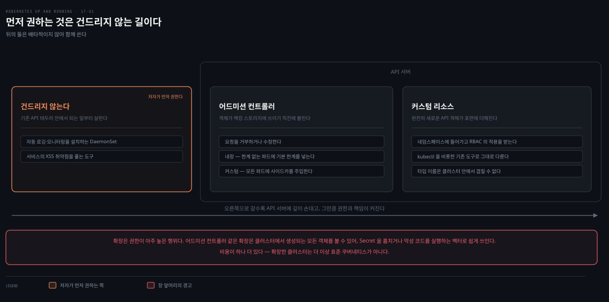

# 17장 · Extending Kubernetes — 어드미션·커스텀 리소스와 인증서 없는 검증 랩

## 핵심 요약

> 이 장은 **API 서버를 어떻게 늘릴 것인가**를 다룹니다. 늘리는 자리는 둘입니다. 요청을 가로채는 **어드미션 컨트롤러**, 그리고 객체 타입 자체를 늘리는 **커스텀 리소스**입니다.

저자가 장을 여는 문제 의식은 긴장 관계입니다. 클러스터 안에 오케스트레이션할 유용한 도구는 끝없이 많은데, 그걸 다 코어 API에 넣으면 API가 한없이 번져 나갑니다. 그 둘 사이를 푼 답이 확장성이고, 그 확장성이 오퍼레이터 패턴 같은 새 관리 방식을 낳았다는 것입니다. 장은 CNI·CSI·CRI는 다루지 않습니다. 그쪽은 이 책의 독자인 최종 사용자보다 클러스터 제공자가 **더 흔히** 쓰는 확장점이라는 이유입니다. 최종 사용자는 손대지 않는다고 잘라 말하지는 않습니다.

**이 노트는 델타와 랩에 섭니다.** CRD 뼈대·컨트롤러 조정 루프·오퍼레이터·Kubebuilder는 이미 `write/`에 이 책보다 두껍게 정리돼 있어 아래 위임 표로 넘깁니다. 여기에 남기는 것은 **웹훅이 실제로 주고받는 것**, **커스텀 리소스의 세 쓰임**, **확장이 고권한 행위라는 경고**, 그리고 **책의 실습이 지금은 그대로 돌지 않는다**는 사실입니다. 마지막 항목이 이 장에서 가장 큰 수확이라, 랩을 통째로 현행 문법으로 다시 세웠습니다.


## 학습 목표

> 이 편을 읽고 나면 다음을 할 수 있습니다.

1. 클러스터를 확장하는 세 자리를 구분하고 각각이 무엇을 할 수 있는지 말할 수 있습니다.
2. 어드미션 웹훅이 API 서버와 주고받는 것이 무엇인지 설명할 수 있습니다.
3. 커스텀 리소스를 세 쓰임으로 분류하고 각각에 컨트롤러가 필요한지 판단할 수 있습니다.
4. CRD를 세우고 인증서 없이 검증 정책을 붙여 볼 수 있습니다.


## 확장은 고권한 행위입니다

> 장의 앞머리에 있는 경고입니다. 기술적 절차보다 이 말이 먼저 나온다는 점이 중요합니다.

클러스터를 확장하는 일은 **권한이 아주 높은 행위**입니다. 클러스터 관리자 권한이 있어야 하므로, 임의의 사용자나 임의의 코드에 내줄 성질의 능력이 아닙니다. 저자는 관리자 자신도 서드파티 도구를 설치할 때 신중하고 성실해야 한다고 덧붙입니다.

이유가 구체적입니다. **어드미션 컨트롤러 같은 확장은 클러스터에서 생성되는 모든 객체를 볼 수 있고, 그래서 Secret을 훔치거나 악성 코드를 실행하는 벡터로 쉽게 쓰일 수 있습니다.** 확장점의 위치를 생각하면 당연한 귀결입니다. 어드미션은 객체가 저장되기 직전에 요청 전체를 받아 보는 자리이니, 그 자리에 코드를 앉힌다는 건 클러스터로 들어오는 모든 것을 열람할 권한을 준다는 뜻입니다.

두 번째 비용도 짚습니다. 확장한 클러스터는 **더 이상 표준 Kubernetes가 아닙니다.** 여러 클러스터를 운영한다면 설치된 확장까지 포함해 경험의 일관성을 유지하는 도구를 만들어 두는 것이 값집니다.


## 클러스터를 확장하는 세 자리

> 이 장의 지도입니다. 오른쪽으로 갈수록 API 서버에 깊이 손대고, 그만큼 권한과 책임이 커집니다.



첫째는 **API 서버를 아예 건드리지 않는** 길입니다. 저자가 확장에 뛰어들기 전에 먼저 고려해 보라고 권하는 쪽입니다. 자동 로깅·모니터링을 설치하는 DaemonSet, 서비스의 XSS 취약점을 훑는 도구 같은 것들이 여기 듭니다. 기존 Kubernetes API의 테두리 안에서 가능한 일이 무엇인지 먼저 살펴보라는 것입니다.

둘째가 **어드미션 컨트롤러**입니다. 객체가 백킹 스토리지에 쓰이기 **직전**에 호출되어 요청을 거부하거나 수정합니다. 일부는 API 서버에 내장돼 있습니다. 한계가 지정되지 않은 Pod에 기본 한계를 넣어 주는 limit range 컨트롤러가 그 예입니다. 많은 시스템이 커스텀 어드미션 컨트롤러로 모든 Pod에 사이드카를 자동 주입해 "마법 같은" 경험을 만듭니다.

셋째가 **커스텀 리소스**입니다. 완전히 새로운 API 객체가 Kubernetes API 표면에 더해집니다. 이 새 객체는 네임스페이스에 들어갑니다. RBAC의 적용을 받고 `kubectl`을 비롯한 기존 도구로 그대로 다룹니다. 둘은 배타적이지 않아서 함께 쓸 수 있습니다.

> API 서버 요청이 인증·인가를 거쳐 어드미션에 이르고 etcd에 저장되기까지의 전체 흐름은 [RBAC과 보안](../../kubernetes/07_security/07-01.RBAC%EA%B3%BC%20%EB%B3%B4%EC%95%88.md)에 그림과 함께 정리돼 있습니다. in-tree 플러그인과 웹훅의 구분도 그쪽이 정본입니다.


## 웹훅이 주고받는 것

> 웹훅을 **등록**하는 법은 이미 정리돼 있습니다. 여기서는 등록된 웹훅이 실제로 무엇을 받고 무엇을 돌려주는지를 남깁니다.

어드미션 웹훅은 **평범한 HTTP 애플리케이션**입니다. API 서버는 Kubernetes Service 객체를 통하거나 임의의 URL로 웹훅에 접속합니다. 여기서 따라 나오는 사실 하나가 실무에서 의외로 중요합니다. **어드미션 컨트롤러는 클러스터 밖에서 돌아도 됩니다.** 저자는 Azure Functions나 AWS Lambda 같은 클라우드 제공자의 FaaS를 예로 듭니다.

웹훅 코드가 요청을 받으면 그 안에는 `AdmissionReview` 타입의 객체가 들어 있습니다. 요청에 대한 메타데이터와 요청 본문 자체를 함께 담고 있습니다. 등록할 때 리소스 한 종류와 동작 하나(`CREATE`)만 걸어 두었다면 메타데이터를 살필 필요 없이 리소스 본문으로 바로 들어가면 됩니다.

**검증**이면 판정만 돌려주면 됩니다. 통과시키지 않을 요청에는 거부한다는 JSON 본문을 반환합니다. **기본값 채우기**는 절차가 하나 더 붙습니다. `ValidatingWebhookConfiguration` 대신 `MutatingWebhookConfiguration`으로 등록하고, 저장되기 전에 요청 객체를 바꾸도록 **JSON Patch 객체**를 제공해야 합니다.

책이 싣는 조각은 `paths` 필드가 비어 있으면 `/index.html` 하나를 넣어 주는 예입니다.

```typescript
if (needsPatch(loadtest)) {
    const patch = [
        { 'op': 'add', 'path': '/spec/paths', 'value': ['/index.html'] }
    ]
    response['patch'] = Buffer.from(JSON.stringify(patch))
        .toString('base64');
    response['patchType'] = 'JSONPatch';
}
```

패치는 **base64로 인코딩해서** `patch` 필드에 담고 `patchType`을 `JSONPatch`로 알립니다. 등록 쪽은 YAML의 `kind`만 바꾸면 되므로, 검증 웹훅을 만들어 두었다면 기본값 채우기는 그 위에 얹는 작업이 됩니다.

> **읽을 때 헷갈리는 지점**: 책은 이 조각을 "검증 어드미션 컨트롤러에 더할 수 있는" 코드라고 소개해 놓고 곧바로 `MutatingWebhookConfiguration`으로 등록하라고 합니다. 모순처럼 보이지만 그렇지 않습니다. **HTTP 서버는 하나로 두고 등록만 둘로 하는** 구성입니다. 같은 엔드포인트를 검증용으로 한 번, 변환용으로 한 번 등록합니다. 실무에서 흔한 배치이고, 그래서 "`kind` 필드만 바꿔 저장하라"는 말이 성립합니다. 다만 **패치는 변환 등록을 타고 들어온 요청에만 의미가 있습니다.** 검증 경로로 들어온 요청에 패치를 돌려줘도 적용되지 않습니다.


## 랩 — CRD를 세우고 검증을 붙이기

> **책의 랩은 지금 그대로는 한 줄도 돌지 않습니다.** 그래서 현행 문법으로 다시 세웠습니다. 아래 출력은 로컬 kind 클러스터에서 실제로 받은 것입니다(클라이언트 `kubectl` v1.34.1, 서버 v1.35.0). 아래의 거부 메시지는 모두 **API 서버가** 돌려준 것이므로 기준은 서버 버전입니다. 명령은 제가 적고 실행은 직접 해 보시기 바랍니다.


### 먼저 책이 왜 안 도는지 확인합니다

책의 CRD 매니페스트를 그대로 넣어 봅니다.

```bash
kubectl apply --dry-run=server -f loadtest-resource.yaml
# error: resource mapping not found for name: "loadtests.beta.kuar.com" namespace: ""
# from "loadtest-resource.yaml": no matches for kind "CustomResourceDefinition"
# in version "apiextensions.k8s.io/v1beta1"
# ensure CRDs are installed first
```

> **버전 차이**: 원서가 쓰는 세 API가 모두 `v1beta1`인데, 셋 다 Kubernetes 1.22에서 제거됐습니다. `apiextensions.k8s.io`(CRD), `admissionregistration.k8s.io`(웹훅 설정), `certificates.k8s.io`(CSR) 전부 지금은 `v1`만 제공됩니다. `kubectl api-versions | grep -E 'apiextensions|admissionregistration|certificates'`가 이 클러스터에서 `v1` 세 줄만 돌려줍니다. 제공 버전 목록은 서버가 정하므로 이것도 서버(v1.35.0) 기준입니다.

### 스키마 필수에 부딪힙니다

`apiVersion`만 `v1`으로 바꿔서 다시 넣어 봅니다.

```bash
kubectl apply --dry-run=server -f loadtest-resource.yaml
# The CustomResourceDefinition "loadtests.beta.kuar.com" is invalid:
# spec.versions[0].schema.openAPIV3Schema: Required value
```

> **버전 차이**: 이건 문법 치환으로 넘길 수 있는 차이가 아니라 **책의 주장 하나가 뒤집힌 지점**입니다. 원서는 "커스텀 리소스의 스키마를 정의하지 않았다"고 밝히면서, OpenAPI 명세를 줄 수는 있지만 **단순한 리소스 타입에는 그 복잡도가 대체로 값하지 않는다**고 적습니다. `v1` CRD에서는 그 선택지가 없습니다. 구조적 스키마가 필수입니다. 책의 의도에 가장 가까운 탈출구는 `x-kubernetes-preserve-unknown-fields: true`로 하위 필드를 열어 두는 것이고, 이건 통과합니다. 즉 "스키마를 안 쓴다"가 아니라 "스키마를 쓰되 안을 비워 둔다"로 바뀌었습니다.

스키마를 채워 넣으면 등록됩니다. `metadata.name`이 `<복수형>.<API 그룹>` 형식이어야 한다는 규칙은 그대로입니다. 이름이 이 패턴을 따르고 클러스터 안에서 이름이 겹칠 수 없으므로, 두 CRD가 같은 리소스를 정의하는 일이 구조적으로 막힙니다.

```yaml
apiVersion: apiextensions.k8s.io/v1
kind: CustomResourceDefinition
metadata:
  name: loadtests.beta.kuar.com    # <복수형>.<그룹> 이어야 합니다
spec:
  group: beta.kuar.com
  scope: Namespaced
  names:
    plural: loadtests
    singular: loadtest
    kind: LoadTest
    shortNames: [lt]
  versions:
  - name: v1
    served: true                   # API 서버가 이 버전을 제공하는가
    storage: true                  # 저장에 쓰는 버전 — 딱 하나만 true
    schema:
      openAPIV3Schema:
        type: object
        properties:
          spec:
            type: object
            required: [service, scheme, requestsPerSecond]
            properties:
              service:           { type: string }
              scheme:            { type: string }
              requestsPerSecond: { type: integer }
              paths:
                type: array
                items: { type: string }
```

```bash
kubectl apply -f crd.yaml
# customresourcedefinition.apiextensions.k8s.io/loadtests.beta.kuar.com created

kubectl get lt          # shortNames 로 조회됩니다
# No resources found in default namespace.
```

타입은 섰는데 인스턴스가 없습니다. 하나 만들어 봅니다.

```bash
kubectl apply -f loadtest.yaml
# loadtest.beta.kuar.com/my-loadtest created

kubectl get pods -l app=loadtest
# No resources found in default namespace.
```

**아무 일도 일어나지 않습니다.** 저자가 못 박는 대목이 여기입니다. 커스텀 리소스는 필요한 인프라의 **절반**일 뿐입니다. CRUD API로 데이터를 다룰 수는 있지만, `LoadTest` 객체가 정의됐을 때 반응해 실제 부하 테스트를 띄우는 컨트롤러가 클러스터에 없기 때문입니다. 나머지 절반은 커스텀 리소스를 계속 지켜보다가 필요에 따라 만들고 고치고 지우는 코드입니다.

### 스키마가 잡는 것과 못 잡는 것

스키마는 타입을 지킵니다.

```bash
kubectl apply --dry-run=server -f bad-type.yaml
# The LoadTest "my-loadtest" is invalid: spec.requestsPerSecond: Invalid value:
# "string": spec.requestsPerSecond in body must be of type integer: "string"
```

그런데 의미는 못 지킵니다. 초당 요청 수가 **음수**이고 scheme이 `gopher`인 객체가 스키마를 그대로 통과합니다.

```bash
kubectl apply --dry-run=server -f bad-semantic.yaml
# loadtest.beta.kuar.com/bad-loadtest created (server dry run)
```

책이 짚는 그대로입니다. **일반적으로 API 스키마만으로는 API 객체를 검증하기에 부족합니다.** 스키마는 필수 필드가 있는지, 모르는 필드가 섞였는지 같은 기본 검증에 쓰이고, `scheme`이 유효한 값인지 `requestsPerSecond`가 0이 아닌 양수인지는 다른 장치가 필요합니다.

### 인증서 없이 검증을 붙입니다

책이 여기서 꺼내는 답은 검증 어드미션 웹훅입니다. 그리고 그 웹훅을 세우려면 **인증서를 발급받아야 합니다.** API 서버가 접근하는 웹훅은 HTTPS로만 접근되기 때문입니다. 책은 그 절차를 넷으로 밟습니다. 개인 키와 CSR을 만드는 Go 프로그램을 싣고, 그 CSR을 `CertificateSigningRequest`로 API 서버에 보냅니다. `kubectl certificate approve`로 승인한 뒤, 승인된 인증서를 `jq`로 뽑아 `server.crt`로 내려받습니다. 저자도 이 대목 끝에 "휴!"를 붙여 두었습니다.

**검증이 목적이라면 이 왕복 전체가 지금은 불필요합니다.** `ValidatingAdmissionPolicy`가 CEL 식으로 같은 일을 합니다. 웹훅도 인증서도 서버도 필요 없습니다. 정책 자체가 API 서버 안에서 평가됩니다. 책이 나온 뒤에 들어온 기능이라 원서에는 없습니다. Kubernetes 1.30에서 stable이 됐습니다.[^vap]

```yaml
apiVersion: admissionregistration.k8s.io/v1
kind: ValidatingAdmissionPolicy
metadata:
  name: loadtest-validator
spec:
  failurePolicy: Fail
  matchConstraints:
    resourceRules:
    - apiGroups:   ["beta.kuar.com"]
      apiVersions: ["v1"]
      operations:  ["CREATE", "UPDATE"]
      resources:   ["loadtests"]
  validations:
  - expression: "object.spec.requestsPerSecond > 0"
    message: "requestsPerSecond 는 0 보다 커야 합니다"
  - expression: "object.spec.scheme in ['http', 'https']"
    message: "scheme 은 http 또는 https 여야 합니다"
---
apiVersion: admissionregistration.k8s.io/v1
kind: ValidatingAdmissionPolicyBinding
metadata:
  name: loadtest-validator-binding
spec:
  policyName: loadtest-validator
  validationActions: [Deny]
  matchResources:
    namespaceSelector: {}
```

두 검증식이 책의 웹훅이 하던 일과 정확히 같습니다. 아까 통과했던 객체를 다시 넣어 봅니다.

```bash
kubectl apply --dry-run=server -f bad-semantic.yaml
# The loadtests "bad-loadtest" is invalid: : ValidatingAdmissionPolicy
# 'loadtest-validator' with binding 'loadtest-validator-binding' denied request:
# requestsPerSecond 는 0 보다 커야 합니다
```

정상 객체는 그대로 통과합니다. `scheme`만 틀린 경우에는 두 번째 메시지가 돌아옵니다.

> **함정**: `ValidatingAdmissionPolicy`만 만들고 `ValidatingAdmissionPolicyBinding`을 만들지 않으면 **아무 일도 일어나지 않습니다.** 오류도 경고도 없이 그냥 통과합니다. 바인딩을 지우고 같은 객체를 다시 넣었더니 `created (server dry run)`이 돌아왔습니다. 공식 문서도 "정책이 효력을 가지려면 최소한 `ValidatingAdmissionPolicy`와 그에 대응하는 `ValidatingAdmissionPolicyBinding`이 정의돼야 한다"고 못 박습니다.[^vap] 정책은 규칙을 정의할 뿐이고, 그 규칙을 어느 범위에 어떤 강도로 적용할지는 바인딩이 정합니다. 정책을 썼는데 안 걸린다면 바인딩부터 확인해야 합니다.

변환은 이야기가 다릅니다. 기본값을 채워 넣는 일은 여전히 변환 웹훅의 몫이고, 그러려면 책이 밟은 인증서 절차가 필요합니다. 실무에서는 그 발급을 손으로 하지 않고 cert-manager 같은 도구에 맡기는 쪽이 표준입니다.

> **버전 차이**: 책의 CSR 매니페스트를 현행 `certificates.k8s.io/v1`으로 올리면 `spec.signerName: Required value`로 거부됩니다. `v1`부터 어느 서명자에게 요청하는지 명시해야 합니다. 웹훅 설정 쪽도 필수 필드가 늘어 `webhooks[0].sideEffects: Required value`와 `webhooks[0].admissionReviewVersions: Required value`가 함께 나옵니다. 책의 웹훅 YAML은 `apiVersion`만 고쳐서는 통과하지 못합니다.


## 커스텀 리소스의 세 쓰임

> 커스텀 리소스가 다 같지 않다는 것이 이 절의 요지입니다. 세 쓰임은 **컨트롤러가 필요한가**, 필요하다면 **어디까지 하는가**로 갈립니다.

**그냥 데이터(Just Data)** 가 가장 쉬운 쓰임입니다. API 서버를 정보의 저장과 조회에만 씁니다. 저자가 곧바로 붙이는 단서가 중요합니다. **API 서버를 애플리케이션 데이터 저장소로 쓰면 안 됩니다.** 앱을 위한 키/값 저장소로 설계된 물건이 아니기 때문입니다. API 확장은 애플리케이션의 배포나 런타임을 관리하는 데 도움이 되는 **제어·설정 객체**여야 합니다.

카나리 배포 설정이 예로 나옵니다. 트래픽의 10%를 실험용 백엔드로 보내라는 것 같은 정보입니다. 이론상 ConfigMap에도 담을 수 있지만 ConfigMap은 본질적으로 타입이 없어서, 더 강하게 타입이 잡힌 확장 객체가 명확성과 편의를 주는 경우가 있습니다. 이 쓰임은 **컨트롤러가 필요 없습니다.** 다만 형식이 올바른지 확인하는 검증·변환 어드미션 컨트롤러는 있을 수 있습니다. 카나리 예라면 비율의 합이 100%인지 검사하는 식입니다.

**컴파일러(Compilers)** 는 한 단계 복잡합니다. 확장 객체가 더 높은 수준의 추상을 나타냅니다. 그것이 낮은 수준의 Kubernetes 객체들의 조합으로 "컴파일"됩니다. 이 장의 `LoadTest`가 바로 이 패턴입니다. 사용자는 `loadtest`라는 고수준 개념으로 소비합니다. 실체는 Pod와 서비스의 모음으로 배포됩니다.

그러려면 현재의 `LoadTest`들을 지켜보다가 컴파일된 표현을 만들고 없어진 것은 지우는 컨트롤러가 클러스터 어딘가에서 돌아야 합니다. 다음에 나오는 오퍼레이터와의 차이가 여기서 갈립니다. **컴파일된 추상에는 온라인 헬스 유지가 없습니다.** 그 책임은 아래 수준 객체(Pod 같은)로 위임됩니다.

**오퍼레이터(Operators)** 는 확장이 만든 자원을 **온라인으로, 능동적으로** 관리합니다. 저자의 표현으로는 이 확장도 고수준 추상을 낮은 표현으로 컴파일하는 경우가 **대체로** 많습니다. 거기에 데이터베이스의 스냅샷 백업이나 새 버전이 나왔을 때의 업그레이드 알림 같은 온라인 기능을 함께 제공합니다.

컨트롤러가 확장 API만 지켜보는 게 아니라 확장이 제공하는 애플리케이션의 **실행 상태**까지 감시합니다. 그러면서 건강하지 않은 데이터베이스를 고치거나 스냅샷을 뜨거나 장애 시 스냅샷에서 복구하는 조치를 취합니다. 저자의 평가는 분명합니다. 세 쓰임 중 **가장 복잡하지만 가장 강력**하다는 것입니다. 배포뿐 아니라 헬스 체크와 복구까지 책임지는 "자율 주행" 추상을 사용자에게 준다고 적습니다.

세 쓰임을 가르는 기준을 한 줄로 줄이면 이렇습니다. 컨트롤러가 **없으면** 그냥 데이터, 있되 **만들고 지우기만** 하면 컴파일러, **살아 있는 동안 계속 돌보면** 오퍼레이터입니다.

> 실제 오퍼레이터가 어떻게 생겼는지는 [MySQL Operator](../../kubernetes/08_extending/08-02.MySQL%20Operator.md)를 비롯해 `08_extending`에 다섯 편이 있습니다. 설계 관점은 [patterns 28-01](../kubernetes-patterns/28-01.Operator%20%E2%80%94%20CRD%EB%A1%9C%20%EB%8F%84%EB%A9%94%EC%9D%B8%20%EC%A7%80%EC%8B%9D%EC%9D%84%20%EC%9E%90%EB%8F%99%ED%99%94%ED%95%98%EA%B8%B0.md)가 정본입니다.


## 컨트롤러를 어떻게 짜는가

> 이 장이 컨트롤러 구현에 대해 남기는 것은 짧지만 실용적인 경고 하나입니다.

가장 단순한 컨트롤러는 `for` 루프를 돌면서 새 커스텀 객체를 반복해서 폴링합니다. 그에 맞춰 실제 리소스를 만들거나 지웁니다. 저자는 이 방식이 **비효율적**이라고 못 박습니다. 폴링 주기가 불필요한 지연을 더하기 때문입니다. 폴링 자체의 오버헤드도 API 서버에 불필요한 부하를 **얹을 수 있습니다**. 지연 쪽은 단정하고 부하 쪽에는 여지를 남긴 문장입니다.

더 나은 길은 API 서버의 **watch API**입니다. 변경이 일어날 때 스트림으로 알려 주므로 지연과 오버헤드를 함께 없앱니다. 다만 여기에 단서가 붙습니다. **이 API를 버그 없이 올바르게 쓰는 일이 복잡합니다.** 그래서 저자는 watch를 쓰려면 `client-go` 라이브러리가 노출하는 **Informer 패턴** 같은 잘 지원되는 메커니즘을 쓰라고 강하게 권합니다.

확장을 처음 시작하는 일이 벅차고 지치는 경험일 수 있다는 것도 인정하면서, **Kubebuilder** 프로젝트를 부트스트랩 자료로 소개합니다.

장은 생태계 이야기로 닫힙니다. 저자가 꼽는 Kubernetes의 큰 "초능력" 중 하나가 **생태계**이고, 그 생태계를 굴리는 가장 중요한 동력이 **API의 확장성**이라는 것입니다. 클러스터를 자기 것으로 만들려고 직접 확장을 설계하든, 유틸리티나 클러스터 서비스나 오퍼레이터 형태의 기성 확장을 가져다 쓰든, API 확장이 **신뢰할 수 있는 애플리케이션을 빠르게 개발할 환경을 짓는 열쇠**라고 정리합니다. 이 노트가 앞에서 옮긴 고권한 경고와 나란히 놓고 읽을 만한 대목입니다. 확장은 생태계를 여는 열쇠이면서 동시에 클러스터를 남의 코드에 여는 문이기도 합니다.

> `watch=true`와 hanging GET이 실제로 어떻게 동작하는지, 조정 루프를 어떻게 짜는지는 [patterns 27-01](../kubernetes-patterns/27-01.Controller%20%E2%80%94%20Observe-Analyze-Act%EB%A1%9C%20%EC%83%81%ED%83%9C%EB%A5%BC%20%EC%A1%B0%EC%A0%95%ED%95%98%EA%B8%B0.md)에 셸 스크립트 컨트롤러 예제와 함께 있습니다. Kubebuilder·Operator Framework·OLM·Metacontroller 비교는 [patterns 28-01](../kubernetes-patterns/28-01.Operator%20%E2%80%94%20CRD%EB%A1%9C%20%EB%8F%84%EB%A9%94%EC%9D%B8%20%EC%A7%80%EC%8B%9D%EC%9D%84%20%EC%9E%90%EB%8F%99%ED%99%94%ED%95%98%EA%B8%B0.md)에 있습니다.


## 면접에서 받을 만한 질문

> 이 노트가 남긴 델타와 랩만 묻습니다. CRD 뼈대·컨트롤러·오퍼레이터 개념은 위임 표의 문서들이 각자 질문을 갖고 있습니다.

1. 어드미션 컨트롤러를 설치하는 일이 왜 높은 권한을 요구하나요? 구체적으로 무엇이 위험한가요?
2. CRD에 스키마를 정의하면 검증이 끝나나요? 스키마가 못 잡는 것은 무엇인가요?
3. 커스텀 리소스를 만들었는데 아무 일도 일어나지 않습니다. 무엇이 빠졌나요?
4. 검증 웹훅과 변환 웹훅은 코드 관점에서 무엇이 다른가요?
5. 커스텀 리소스의 세 쓰임을 컨트롤러의 역할로 구분해 보세요.

### 정답

1. 확장에는 **클러스터 관리자 권한**이 필요합니다. 어드미션 컨트롤러는 클러스터에서 **생성되는 모든 객체를 볼 수 있는** 자리에 앉으므로, Secret을 훔치거나 악성 코드를 실행하는 벡터로 쓰일 수 있습니다. 서드파티 확장 설치에 신중해야 하는 이유입니다.
2. 끝나지 않습니다. 스키마는 **타입과 필드의 존재**를 지킵니다. `requestsPerSecond`가 양수인지, `scheme`이 `http`나 `https` 중 하나인지 같은 **의미 수준의 제약**은 못 잡습니다. 실제로 음수와 `gopher`가 스키마를 통과했습니다. 그래서 검증 어드미션이 따로 필요합니다.
3. **컨트롤러**입니다. 커스텀 리소스는 필요한 인프라의 절반일 뿐입니다. CRUD API로 데이터는 다뤄지지만, 그 객체를 지켜보다 실제 리소스를 만들고 지우는 코드가 없으면 데이터만 저장됩니다.
4. 검증은 **판정만** 돌려주면 됩니다. 변환은 요청 객체를 저장 전에 바꿔야 하므로 **JSON Patch 객체를 base64로 인코딩해 `patch` 필드에 담고 `patchType`을 `JSONPatch`로** 알려야 합니다. 등록도 `MutatingWebhookConfiguration`으로 따로 해야 합니다.
5. 컨트롤러가 **없으면 그냥 데이터**, 있되 **만들고 지우기만 하면 컴파일러**, **실행 상태까지 계속 돌보면 오퍼레이터**입니다. 컴파일러에는 온라인 헬스 유지가 없고 그 책임이 아래 수준 객체로 위임됩니다.


## 이 장을 어디로 위임했는가

> 이 노트가 델타와 랩만 다루는 이유입니다. 아래 주제는 이미 정리돼 있습니다.

| 더 알고 싶은 것 | 읽을 곳 |
|---|---|
| CRD 뼈대·서브리소스·확장 스펙트럼·API Aggregation·Kubebuilder·OLM | [patterns 28-01](../kubernetes-patterns/28-01.Operator%20%E2%80%94%20CRD%EB%A1%9C%20%EB%8F%84%EB%A9%94%EC%9D%B8%20%EC%A7%80%EC%8B%9D%EC%9D%84%20%EC%9E%90%EB%8F%99%ED%99%94%ED%95%98%EA%B8%B0.md) |
| 조정 루프·`watch=true`·hanging GET·컨트롤러 예제 | [patterns 27-01](../kubernetes-patterns/27-01.Controller%20%E2%80%94%20Observe-Analyze-Act%EB%A1%9C%20%EC%83%81%ED%83%9C%EB%A5%BC%20%EC%A1%B0%EC%A0%95%ED%95%98%EA%B8%B0.md) |
| API 서버 요청 흐름·in-tree 플러그인과 웹훅의 구분 | [RBAC과 보안](../../kubernetes/07_security/07-01.RBAC%EA%B3%BC%20%EB%B3%B4%EC%95%88.md) |
| 어드미션이 RBAC과 어떻게 맞물리는가 | [patterns 26-01](../kubernetes-patterns/26-01.Access%20Control%20%E2%80%94%20RBAC%EC%9C%BC%EB%A1%9C%20%EB%88%84%EA%B0%80%20%EB%AC%B4%EC%97%87%EC%9D%84%20%ED%95%A0%20%EC%88%98%20%EC%9E%88%EB%8A%94%EC%A7%80.md) |
| 오퍼레이터 패턴 개론 | [08-01 Operator 패턴](../../kubernetes/08_extending/08-01.Operator%20%ED%8C%A8%ED%84%B4.md) |
| 실물 오퍼레이터 다섯 편(MySQL·PostgreSQL·Redis·Kafka·Redpanda) | [08-02 MySQL Operator](../../kubernetes/08_extending/08-02.MySQL%20Operator.md) 외 |


## 참고 자료

- 원서: 《Kubernetes: Up and Running, 3rd Edition》 Chapter 17. Extending Kubernetes (O'Reilly)
- [Kubernetes 공식 문서 — Validating Admission Policy](https://kubernetes.io/docs/reference/access-authn-authz/validating-admission-policy/)
- [Kubernetes 공식 문서 — Custom Resources](https://kubernetes.io/docs/concepts/extend-kubernetes/api-extension/custom-resources/)
- [Kubernetes 공식 문서 — Deprecated API Migration Guide (v1.22)](https://kubernetes.io/docs/reference/using-api/deprecation-guide/#v1-22)

[^vap]: Kubernetes — Validating Admission Policy. 페이지 머리말이 `Kubernetes v1.30 [stable]` 이고, 본문은 정책이 효력을 가지려면 바인딩이 함께 정의돼야 한다고 적습니다 (2026-08-18 조회). <https://kubernetes.io/docs/reference/access-authn-authz/validating-admission-policy/>


## 관련 문서

> 같은 주제를 다른 축에서 다루는 노트입니다.

- [Kubernetes Patterns 28-01.Operator](../kubernetes-patterns/28-01.Operator%20%E2%80%94%20CRD%EB%A1%9C%20%EB%8F%84%EB%A9%94%EC%9D%B8%20%EC%A7%80%EC%8B%9D%EC%9D%84%20%EC%9E%90%EB%8F%99%ED%99%94%ED%95%98%EA%B8%B0.md) — CRD·오퍼레이터 설계 축의 정본
- [RBAC과 보안](../../kubernetes/07_security/07-01.RBAC%EA%B3%BC%20%EB%B3%B4%EC%95%88.md) — 어드미션이 요청 흐름의 어디에 앉는지
- [Kubernetes: Up and Running 정독 인덱스](./README.md) — 이 시리즈의 MOC
