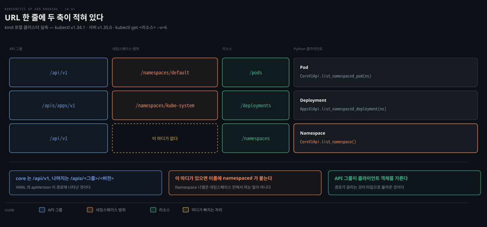
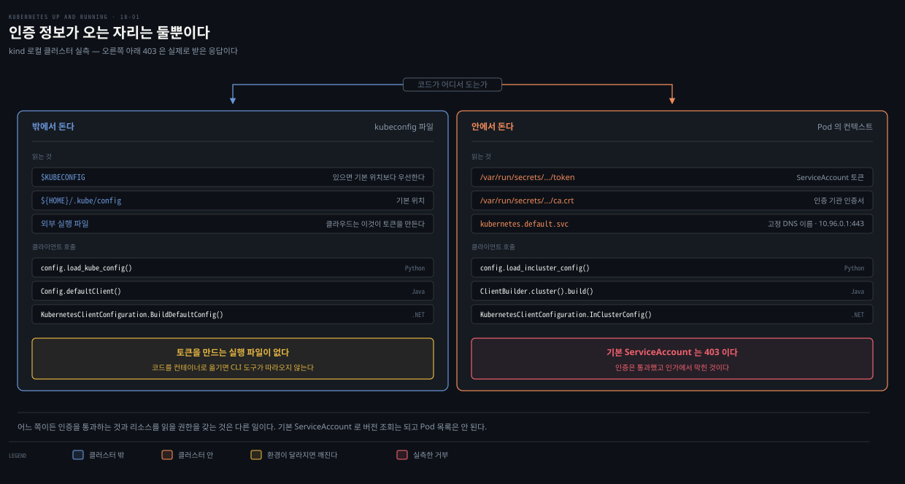
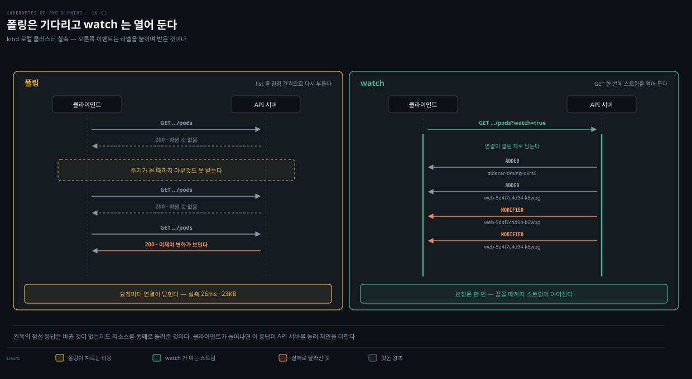

# 18장 · Accessing Kubernetes — 클라이언트가 감추는 HTTP와 원서 코드 실증 랩

---

## 핵심 요약

> 이 장은 **선언적 YAML 바깥에서 API를 다루는 법**을 다룹니다. 저자가 첫 문단에서 못 박는 사실 하나가 장 전체를 떠받칩니다. API 서버는 결국 HTTP(S) 서버이고, 세 클라이언트는 전부 그것을 그렇게 봅니다.

그래서 이 노트는 클라이언트 코드를 옮겨 적는 대신 **그 아래의 HTTP를 먼저 엽니다.** URL 한 줄만 봐도 메서드 이름이 왜 그렇게 생겼는지, API 그룹이 왜 클라이언트 객체를 가르는지, watch가 왜 폴링과 다른 물건인지가 한꺼번에 풀립니다. 클라이언트가 감추는 것을 먼저 보고 나면 세 언어의 차이는 이름 표 한 장으로 줄어듭니다.

**그리고 이 장의 코드는 지금 상태가 좋지 않습니다.** 원서의 Python 예제를 그대로 실행해 봤더니 watch·logs·exec·port-forward 넷이 예외로 죽었습니다. 산문에 적힌 메서드 이름 둘은 클라이언트에 존재하지 않습니다. 패치 절은 "JSON Patch를 쓰겠다"고 선언해 놓고 Python 예제만 다른 포맷으로 나갑니다. 원문을 고쳐 싣지 않고, 무엇을 넣었더니 무엇이 돌아왔는지를 옆에 적었습니다.


## 학습 목표

> 이 편을 읽고 나면 다음을 할 수 있습니다.

1. Kubernetes API의 URL 하나를 보고 API 그룹과 네임스페이스 범위를 읽어낼 수 있습니다.
2. 그 URL이 세 클라이언트에서 각각 어떤 이름으로 나타나는지 대응시킬 수 있습니다.
3. 코드가 클러스터 안에서 도는지 밖에서 도는지에 따라 인증 정보가 어디서 오는지 말할 수 있습니다.
4. create·replace·patch를 고르고, 세 패치 포맷이 HTTP에서 무엇으로 구분되는지 설명할 수 있습니다.
5. 폴링 대신 watch를 써야 하는 이유를 지연과 부하로 나눠 말할 수 있습니다.

랩은 살아 있는 로컬 kind 클러스터에서 돌렸습니다. 클라이언트 `kubectl` v1.34.1, 서버 v1.35.0, Python 클라이언트 36.0.3입니다. 아래 출력은 전부 실제로 받은 것이고, 명령은 직접 돌려 보실 수 있게 적었습니다.


## 클라이언트 라이브러리가 대신해 주는 것

> API 서버가 그냥 HTTP 서버라면 생 HTTP 클라이언트를 써도 되지 않느냐는 질문에 저자가 넷으로 답합니다.

첫째는 **읽히는 이름**입니다. 여러 HTTP 호출이 `readNamespacedPod(...)` 같은 뜻이 있는 API로 감싸집니다. 둘째는 **타입이 잡힌 객체 모델**입니다. `Deployment` 같은 타입이 정적 타입 검사를 받으므로 버그가 줄어듭니다.

셋째가 더 중요합니다. 클라이언트는 **Kubernetes 고유의 능력**을 구현합니다. kubeconfig 파일이나 Pod의 환경에서 인가 정보를 읽어 오는 일이 여기 듭니다. 넷째는 **RESTful하지 않은 부분**입니다. port-forward, logs, watch는 REST의 틀에 들어가지 않아 따로 구현돼 있습니다.

생태계 대부분이 Go로 쓰였기 때문에 Go 클라이언트가 가장 풍부합니다. 저자는 Go 클라이언트의 문서와 예제가 이미 많다는 이유로 이 장에서 Python·Java·.NET을 다룹니다. Go를 쓰는 실무 코드가 어떻게 생겼는지는 별도 노트가 맡습니다.

### 생성된 코드라서 따라오는 것

Kubernetes API의 리소스와 함수 집합은 거대합니다. API 그룹마다 리소스가 다르고 리소스마다 연산이 다릅니다. 이걸 언어마다 손으로 쓰는 일은 저자의 표현으로 "방대하고 틀림없이 지루한" 작업입니다.

그래서 클라이언트는 **거꾸로 도는 컴파일러 같은** 코드 생성기가 만듭니다. 입력은 OpenAPI로 표현된 Kubernetes API 명세입니다. GitHub에 올라 있는 그 명세는 4메가바이트가 넘습니다. 공식 클라이언트는 전부 같은 코드 생성 로직에서 나옵니다.

여기서 실무적인 결론 하나가 따라옵니다. **생성된 클라이언트 코드는 직접 고쳐도 소용이 없습니다.** 다음번에 API를 다시 생성하면 덮여 버리기 때문입니다. 클라이언트에서 오류를 찾으면 고칠 자리는 둘 중 하나입니다. 명세 자체가 틀렸으면 OpenAPI 명세를, 생성된 코드가 틀렸으면 코드 생성기를 고칩니다.

### kubectl로 되는 게 코드로는 안 될 때

`kubectl`과 API 사이에 1대1 대응이 있다고 기대하기 쉽지만 그렇지 않습니다. `kubectl get pods`처럼 API에 직접 대응되는 명령도 있고, 더 복잡한 기능은 여러 번의 API 호출과 `kubectl` 쪽 로직으로 이뤄집니다.

이 경계는 계속 서버 쪽으로 움직여 왔습니다. Deployment의 롤아웃은 예전에 클라이언트에 있던 기능입니다. `kubectl apply`도 서버 사이드 apply로 옮겨 갔습니다. 그래도 클라이언트에 남은 기능이 여전히 많습니다. 그 기능은 언어마다 다시 구현해야 합니다. 저자가 적는 것은 `kubectl`과의 대등함이 언어마다 다르다는 것까지입니다. 그중 Java 클라이언트는 특히 두꺼워서 `kubectl` 기능 상당수를 흉내 낸다고 덧붙입니다.

찾는 기능이 클라이언트에 없을 때 쓸 수 있는 방법이 있습니다. `kubectl` 명령에 `--v=10`을 붙이면 API 서버와 주고받은 HTTP 요청과 응답이 전부 찍힙니다. 이 로그로 `kubectl`이 무엇을 하는지 되짚을 수 있습니다. 다음 절이 그 트릭에서 시작합니다.


## 랩 1 — API 서버가 HTTP 서버라는 것을 직접 봅니다

> 저자의 첫 주장을 눈으로 확인하는 자리입니다. 여기서 얻은 URL이 이 노트의 나머지를 전부 설명합니다.



아래 랩은 전부 이 두 줄로 만든 대상 위에서 돕니다. 이 절부터 마지막 랩까지 같은 네임스페이스와 Deployment를 씁니다.

```bash
kubectl create namespace ch18-lab
kubectl create deployment web --image=nginx:alpine --replicas=1 -n ch18-lab
POD=$(kubectl get pod -n ch18-lab -l app=web -o jsonpath='{.items[0].metadata.name}')
```

`--v=10`은 친절하게도 `curl` 명령 형태로 요청을 찍어 줍니다. 그대로 복사해 쓸 수 있는 형태입니다.

```bash
kubectl get pods --v=10
# curl -v -XGET
#   -H "Accept: application/json;as=Table;v=v1;g=meta.k8s.io,…,application/json"
#   -H "User-Agent: kubectl/v1.34.1 (darwin/arm64) kubernetes/93248f9"
#   'https://127.0.0.1:57455/api/v1/namespaces/default/pods?limit=500'
```

### 두 축이 URL에 그대로 남아 있습니다

리소스 종류를 바꿔 가며 URL만 뽑아 보면 규칙이 드러납니다.

```bash
kubectl get pods        --v=6 2>&1 | grep -oE "https://[^ ]*"
# https://127.0.0.1:57455/api/v1/namespaces/default/pods?limit=500

kubectl get deployments -n kube-system --v=6 2>&1 | grep -oE "https://[^ ]*"
# https://127.0.0.1:57455/apis/apps/v1/namespaces/kube-system/deployments?limit=500

kubectl get namespaces  --v=6 2>&1 | grep -oE "https://[^ ]*"
# https://127.0.0.1:57455/api/v1/namespaces?limit=500
```

세 줄의 차이가 이 장이 "프로그래밍할 때 중요해진다"고 말한 두 개념입니다.

**API 그룹**이 첫째입니다. core 그룹은 `/api/v1`로, 나머지 그룹은 `/apis/<그룹>/<버전>`으로 갈립니다. Deployment가 `apps/v1`에 있다는 사실이 경로에 그대로 적혀 있습니다. YAML의 `apiVersion` 필드에서 보던 값입니다.

**네임스페이스 범위**가 둘째입니다. 네임스페이스에 속한 리소스는 경로에 `/namespaces/<이름>/`이 끼어들고, 클러스터 수준 리소스는 그 마디가 없습니다. Namespace 자체가 클러스터 수준이라 `/api/v1/namespaces`로 끝납니다.

### 같은 URL을 손으로 부릅니다

`kubectl proxy`는 인증을 대신 붙여 주는 로컬 프록시를 띄웁니다. 토큰을 손으로 만들지 않고 API를 두드려 볼 수 있습니다.

```bash
kubectl proxy --port=8899 &
curl -s -o /dev/null -w "http %{http_code}  time=%{time_total}s  size=%{size_download}B\n" \
  "http://127.0.0.1:8899/api/v1/namespaces/ch18-lab/pods"
# http 200  time=0.026609s  size=23045B
```

26밀리초 만에 23킬로바이트를 받고 연결이 닫혔습니다. 이 평범함이 뒤의 watch 절에서 대조군이 됩니다.


## 인증 — 출처는 둘뿐입니다

> API 서버가 아무나 들여보낸다면 안전하지 않을 것이므로, 프로그래밍의 첫 단계는 연결하고 자신을 밝히는 일입니다.



API 서버가 본질적으로 HTTP 서버이므로 인증 방식도 HTTP의 것입니다. 초기 Kubernetes는 사용자와 비밀번호를 쓰는 HTTP 기본 인증을 썼지만, 저자의 표현으로 더 현대적인 인증 기반에 밀려 폐기됐습니다.

클라이언트가 인증 정보를 얻는 자리는 둘뿐입니다. **kubeconfig 파일**과 **Pod의 컨텍스트**입니다.

### 클러스터 밖에서 돌 때

클러스터 밖에서 도는 코드는 kubeconfig가 필요합니다. 클라이언트는 기본적으로 `${HOME}/.kube/config`를 찾습니다. `$KUBECONFIG` 환경변수가 있으면 그쪽이 기본 위치보다 **우선**합니다.

```python
config.load_kube_config()          # Python
```

```java
ApiClient client = Config.defaultClient();   // Java
Configuration.setDefaultApiClient(client);
```

```csharp
var config = KubernetesClientConfiguration.BuildDefaultConfig();  // .NET
var client = new Kubernetes(config);
```

저자가 주석으로 붙인 주의가 실무에서 자주 걸립니다. 많은 클라우드 제공자는 **외부 실행 파일**로 토큰을 만듭니다. 그 실행 파일은 대개 제공자의 CLI 도구를 깔 때 함께 들어옵니다. 코드를 컨테이너에 넣어 다른 곳에서 돌리면 그 실행 파일이 없어 인증이 실패합니다. 코드가 도는 환경에도 같은 도구가 있어야 합니다.

### 클러스터 안에서 돌 때

Pod 안에서 도는 코드는 그 Pod에 딸린 ServiceAccount를 씁니다. 필요한 토큰과 인증 기관 인증서는 Pod가 만들어질 때 볼륨으로 들어옵니다. 실제로 열어 보면 파일 셋입니다.

```bash
kubectl exec -n ch18-lab "$POD" -- ls -1 /var/run/secrets/kubernetes.io/serviceaccount/
# ca.crt
# namespace
# token
```

API 서버 주소도 찾을 필요가 없습니다. 클러스터 안에서는 고정된 DNS 이름으로 항상 접근할 수 있고, 환경변수로도 들어옵니다.

```bash
kubectl exec -n ch18-lab "$POD" -- sh -c 'env | grep ^KUBERNETES_SERVICE | sort'
# KUBERNETES_SERVICE_HOST=10.96.0.1
# KUBERNETES_SERVICE_PORT=443
# KUBERNETES_SERVICE_PORT_HTTPS=443
```

필요한 데이터가 전부 Pod 안에 있으므로 kubeconfig가 필요 없습니다. 클라이언트는 자기 컨텍스트에서 설정을 조립합니다. 호출 이름만 다릅니다. Python은 `config.load_incluster_config()`, Java는 `ClientBuilder.cluster().build()`, .NET은 `KubernetesClientConfiguration.InClusterConfig()`입니다.

### 기본 ServiceAccount로는 거의 아무것도 못 합니다

저자가 붙인 두 번째 주석입니다. Pod에 딸리는 기본 ServiceAccount는 부여받은 역할이 최소라, 기본값 그대로면 Pod 안의 코드가 API로 할 수 있는 일이 거의 없습니다. 인가 오류가 나면 필요한 역할을 가진 전용 ServiceAccount로 바꾸라고 권합니다.

Pod 안에서 직접 확인해 봤습니다. 토큰을 붙여 자기 네임스페이스의 Pod 목록을 읽는 요청입니다.

```bash
kubectl exec -n ch18-lab "$POD" -- sh -c '
  D=/var/run/secrets/kubernetes.io/serviceaccount
  wget -qO- --no-check-certificate \
    --header="Authorization: Bearer $(cat $D/token)" \
    "https://kubernetes.default.svc/api/v1/namespaces/$(cat $D/namespace)/pods"'
# wget: server returned error: HTTP/1.1 403 Forbidden
```

403입니다. 인증은 통과했고 인가에서 막혔습니다. RBAC 쪽에서 같은 것을 물어보면 판정이 갈립니다.

```bash
kubectl auth can-i list pods -n ch18-lab --as=system:serviceaccount:ch18-lab:default
# no
kubectl auth can-i get /version --as=system:serviceaccount:ch18-lab:default
# yes
```

버전 조회는 되고 Pod 목록은 안 됩니다. 인증된 사용자면 누구나 갖는 디스커버리 권한은 있지만, 리소스를 읽을 권한은 없다는 뜻입니다. 이 상태에서 클라이언트를 붙이면 코드가 아니라 권한을 의심해야 합니다.

> 어떤 Role을 만들어 어떻게 묶을지는 [14-01 RBAC](./14-01.RBAC%20%E2%80%94%20%EC%9D%B8%EA%B0%80%EB%A5%BC%20%EC%84%A4%EA%B3%84%ED%95%98%EA%B3%A0%20%EC%9A%B4%EC%98%81%ED%95%98%EB%8A%94%20%EB%B2%95.md)이 정본입니다. 이 노트는 "왜 403이 나오는가"까지만 다룹니다.


## 세 클라이언트가 같은 URL을 부르는 이름

> 앞 절에서 뽑은 URL 세 개를 세 언어로 옮기면 이 장의 코드 대부분이 설명됩니다.

클라이언트가 전부 같은 OpenAPI 명세에서 생성되므로 이름 짓는 규칙도 같습니다. 언어의 관례에 맞춰 표기만 바뀝니다.

| HTTP | Python | Java | .NET |
|---|---|---|---|
| `GET /api/v1/namespaces/{ns}/pods` | `CoreV1Api.list_namespaced_pod(ns)` | `CoreV1Api.listNamespacedPod(ns).execute()` | `client.CoreV1.ListNamespacedPod(ns)` |
| `GET /api/v1/namespaces` | `CoreV1Api.list_namespace()` | `CoreV1Api.listNamespace().execute()` | `client.CoreV1.ListNamespace()` |
| `POST /api/v1/namespaces/{ns}/pods` | `CoreV1Api.create_namespaced_pod(ns, pod)` | `CoreV1Api.createNamespacedPod(pod).execute()` | `client.CoreV1.CreateNamespacedPod(...)` |
| `GET /apis/apps/v1/namespaces/{ns}/deployments` | `AppsV1Api.list_namespaced_deployment(ns)` | `AppsV1Api.listNamespacedDeployment(ns).execute()` | `client.AppsV1.ListNamespacedDeployment(ns)` |

읽는 법은 이렇습니다. **경로에 `/namespaces/{ns}/`가 끼면 메서드 이름에 `namespaced`가 들어갑니다.** 클러스터 수준 리소스는 그 조각이 없어 `list_namespace`가 됩니다. Namespace를 나열하는 일은 네임스페이스 안에서 하는 일이 아니기 때문입니다.

**API 그룹은 클라이언트 객체를 가릅니다.** `apps/v1`의 리소스를 다루려면 그 그룹을 아는 객체를 따로 만듭니다. Python과 Java는 `AppsV1Api`라는 별도 클래스이고, .NET은 클라이언트의 `AppsV1` 속성입니다. 경로가 `/apis/apps/v1`로 갈리는 것이 타입으로 올라온 셈입니다.

> **원문 정오**: 원서 본문 산문은 Pod 나열을 `api.list_namespaced_pods('default')`, Namespace 나열을 `api.list_namespaces()`라고 적습니다. **둘 다 존재하지 않는 메서드입니다.** 같은 절의 코드 블록은 단수형으로 올바르게 적혀 있어 산문 쪽만 틀렸습니다. 실행하면 이렇게 됩니다.
>
> ```
> AttributeError: 'CoreV1Api' object has no attribute 'list_namespaced_pods'
> AttributeError: 'CoreV1Api' object has no attribute 'list_namespaces'
> ```

> **버전 차이**: 원서 Java 예제는 `V1PodList list = api.listNamespacedPod("default");`로 값을 바로 받습니다. 현행 Java 클라이언트는 유창한 요청 빌더를 돌려주므로 `.execute()`를 붙여야 합니다. 공식 예제도 `api.listPodForAllNamespaces().execute()` 형태입니다.[^javaex] 원서 .NET 예제의 `client.ListNamespacedPod("default")`도 현행에서는 `client.CoreV1.ListNamespacedPod("default")`로 그룹 속성을 거칩니다.[^netex]

객체를 조립하는 쪽은 원서 코드가 지금도 그대로 돕니다. Python 예제를 그대로 넣어 서버 dry-run까지 보냈더니 통과했습니다.

```python
container = client.V1Container(name="myapp", image="my_cool_image:v1")
pod = client.V1Pod(
    metadata=client.V1ObjectMeta(name="myapp"),
    spec=client.V1PodSpec(containers=[container]),
)
api.create_namespaced_pod("ch18-lab", pod, dry_run="All")
# 통과 — name=myapp
```


## create · replace · patch — 선언과 실제가 갈리는 자리

> 리소스를 바꾸는 동사가 셋인데 의미가 조금씩 다릅니다. 그리고 이 절이 원서에서 가장 어긋난 자리입니다.

저자의 정의는 짧습니다. **create**는 새 리소스를 만듭니다. 이미 있으면 실패합니다. **replace**는 기존 리소스를 보지 않고 통째로 교체하므로 완전한 리소스를 줘야 합니다. **patch**는 바뀌지 않은 부분을 건드리지 않고 고칩니다. 이때 바꾸려는 리소스 대신 전용 Patch 리소스를 보냅니다.

고르는 기준도 붙어 있습니다. 패치는 복잡할 수 있어서 많은 경우 그냥 replace가 쉽습니다. 다만 **큰 리소스**에서는 패치가 네트워크 대역폭과 API 서버 처리 양쪽에서 훨씬 효율적입니다. 그리고 **여러 주체가 리소스의 서로 다른 부분을 동시에 패치**해도 쓰기 충돌을 걱정하지 않아도 됩니다.

### 세 패치 포맷은 HTTP에서 헤더 한 줄입니다

Kubernetes가 받는 패치 포맷은 셋입니다. JSON Patch와 JSON Merge Patch는 다른 데서도 쓰이는 RFC 표준이고, strategic merge patch는 Kubernetes가 만든 포맷입니다.

셋의 구분은 요청 헤더에 그대로 있습니다. `kubectl patch`의 `--type`을 바꿔 가며 확인하면 URL은 같고 `Content-Type`만 달라집니다.

```bash
kubectl patch deployment web -n ch18-lab --type=json  -p '[{"op":"replace","path":"/spec/replicas","value":3}]' --dry-run=server --v=9
# -H "Content-Type: application/json-patch+json"

kubectl patch deployment web -n ch18-lab --type=merge -p '{"spec":{"replicas":3}}' --dry-run=server --v=9
# -H "Content-Type: application/merge-patch+json"

kubectl patch deployment web -n ch18-lab           -p '{"spec":{"replicas":3}}' --dry-run=server --v=9
# -H "Content-Type: application/strategic-merge-patch+json"
```

포맷을 틀리면 서버가 바로 잡아냅니다. JSON Patch는 연산의 **배열**이어야 하는데 객체를 보내면 이렇습니다.

```bash
curl -s -X PATCH -H "Content-Type: application/json-patch+json" \
  -d '{"spec":{"replicas":3}}' \
  "http://127.0.0.1:8899/apis/apps/v1/namespaces/ch18-lab/deployments/web?dryRun=All"
# "message": "error decoding patch: json: cannot unmarshal object into Go value of type []handlers.jsonPatchOp",
# "reason": "BadRequest", "code": 400
```

### 원서가 쓰겠다고 한 포맷과 실제로 나가는 포맷이 다릅니다

저자는 "가장 이해하기 쉬우니 이 예제들에서는 JSON Patch를 쓰겠다"고 선언합니다. Java와 .NET 예제는 실제로 JSON Patch 문자열을 만들어 씁니다. Python 예제만 다릅니다. Deployment 객체를 읽어 필드를 바꾸고 그 객체를 통째로 `body`에 넣습니다.

무엇이 나가는지 소켓 직전에서 가로채 봤습니다.

```python
# [A] 원서 Python 예제 그대로 — body 가 Deployment 객체
dep.spec.replicas = 3
apps.patch_namespaced_deployment(name="web", namespace="ch18-lab", body=dep, dry_run="All")
#    실제로 나간 Content-Type: application/strategic-merge-patch+json

# [B] 진짜 JSON Patch — body 가 연산 배열
apps.patch_namespaced_deployment(name="web", namespace="ch18-lab",
    body=[{"op": "replace", "path": "/spec/replicas", "value": 3}], dry_run="All")
#    실제로 나간 Content-Type: application/json-patch+json
```

둘 다 성공하지만 서버가 받는 포맷이 다릅니다. 원인은 Python 클라이언트 안에 있습니다. 헤더를 고르는 코드가 `application/json-patch+json`을 기본으로 잡아 놓고, 전송 직전에 본문이 리스트가 아니면 조용히 바꿔 버립니다. 현행 master는 두 조건을 한 줄로 합쳐 두었을 뿐 동작은 같습니다.

```python
# kubernetes/client/rest.py — 클라이언트 36.0.3
if headers['Content-Type'] == 'application/json-patch+json':
    if not isinstance(body, list):
        headers['Content-Type'] = 'application/strategic-merge-patch+json'
```

> **원문 정오**: 원서는 세 언어 예제를 "이 셋에서 replicas를 3으로 패치했다"고 한 문장으로 묶습니다. 실제로는 **같은 절 안에서 Python만 다른 패치 포맷으로 나갑니다.** 원서가 틀렸다기보다 클라이언트가 조용히 바꾸는 동작을 저자가 짚지 않은 쪽에 가깝습니다. 결과가 같아 보여서 더 위험합니다. 배열을 넘겼는지 객체를 넘겼는지에 따라 서버에서 벌어지는 병합 방식이 달라집니다.

> **원문 정오**: .NET 예제는 앞 문장에서 Deployment를 패치한다고 해 놓고 `client.PatchNamespacedPod(...)`를 부릅니다. 같은 조각에서 변수도 어긋나 `jsonPatch`로 선언한 것을 `patchStr`로 씁니다. Java 예제도 `jsonPatch`를 선언하고 `new V1Patch(jsonPatchStr)`로 씁니다.


## polling 대신 watch

> Kubernetes 리소스는 원하는 상태를 적어 둔 것이므로, 그 상태를 실제로 만들려면 변화를 지켜보는 프로그램이 필요합니다.



가장 쉬운 방법은 폴링입니다. 앞서 본 list 호출을 60초 같은 일정 간격으로 계속 부르는 방식입니다. 짜기는 쉽지만 클라이언트와 API 서버 양쪽에 비용을 물립니다.

저자가 드는 비용이 둘입니다. 첫째는 **지연**입니다. 직전 폴링이 끝난 직후에 일어난 변화는 다음 주기가 올 때까지 기다립니다. 둘째는 **API 서버 부하**입니다. 바뀌지 않은 리소스를 반복해서 돌려주기 때문입니다. 클라이언트가 많아지면 서버가 감당하지 못하고 지연이 더해집니다.

그래서 API는 watch, 곧 이벤트 기반 의미론도 제공합니다. 관심 있는 변화를 등록해 두면 서버가 변화가 생길 때 알려 줍니다. 실제로는 클라이언트가 **hanging GET**을 겁니다. 이 요청을 떠받치는 TCP 연결이 watch가 살아 있는 동안 열린 채 유지되고, 서버는 변화가 생길 때마다 그 스트림에 응답을 쓰되 스트림을 닫지 않습니다.

### 스트림이 닫히지 않는 것을 직접 봅니다

앞 절의 평범한 GET은 26밀리초에 끝났습니다. 같은 경로에 `watch=true`만 붙이면 성질이 바뀝니다.

```bash
curl -sN "http://127.0.0.1:8899/api/v1/namespaces/ch18-lab/pods?watch=true" &
kubectl label pod -n ch18-lab -l app=web probe=one --overwrite
kubectl label pod -n ch18-lab -l app=web probe=two --overwrite
```

```bash
event #1: type=ADDED     kind=Pod  name=sidecar-timing-dxrs5
event #2: type=ADDED     kind=Pod  name=web-5d4f7c4d94-k6wbg
event #3: type=MODIFIED  kind=Pod  name=web-5d4f7c4d94-k6wbg
event #4: type=MODIFIED  kind=Pod  name=web-5d4f7c4d94-k6wbg
```

현재 상태가 `ADDED`로 먼저 흘러나오고, 그 뒤에는 제가 라벨을 붙일 때마다 `MODIFIED`가 도착했습니다. 요청은 한 번뿐이고 연결은 제가 끊을 때까지 열려 있었습니다. 프로그램 관점에서는 반복해서 도는 `while` 루프가 콜백 모음으로 바뀝니다.

> **원문 정오**: 원서 Python watch 예제는 그대로 두면 돌지 않습니다. `w.stream(v1.list_namespaced_pods, "some-namespace")`에서 `v1`은 정의된 적이 없고, 메서드 이름도 앞서 본 복수형 오류입니다. 실행하면 `NameError: name 'v1' is not defined`가 납니다. 앞줄에서 만든 `api`를 쓰고 이름을 단수형으로 고치면 그대로 돕니다.

> **원문 정오**: 원서 Java watch 예제는 컴파일되지 않습니다. 변수를 `Watch<V1Namespace>`로 선언해 놓고 타입 토큰은 `Watch.Response<V1Pod>`를 넘깁니다. `listNamespacedPodCall(...)` 인자 목록은 `Boolean.TRUE);`로 닫혀 있어 괄호가 맞지 않고, 뒤따르는 `System.out.printf(...)`에는 세미콜론이 없습니다. 인쇄 사고로 보이지만 그대로 옮겨 적으면 시간을 씁니다.

> 이 watch 위에 재시도와 캐시를 얹은 것이 Informer이고, 그것으로 조정 루프를 짜는 법은 [patterns 27-01](../kubernetes-patterns/27-01.Controller%20%E2%80%94%20Observe-Analyze-Act%EB%A1%9C%20%EC%83%81%ED%83%9C%EB%A5%BC%20%EC%A1%B0%EC%A0%95%ED%95%98%EA%B8%B0.md)이 정본입니다. 원서 17장도 watch를 직접 쓰지 말고 Informer를 쓰라고 권합니다.


## logs · exec · port-forward — 셋이 같은 부류가 아닙니다

> 저자는 이 셋을 "RESTful하지 않은" 한 부류로 묶습니다. HTTP를 열어 보면 셋 중 하나는 다른 쪽에 붙습니다.

원서의 설명부터 옮깁니다. 이 셋은 REST의 틀에 들어가지 않아 클라이언트마다 따로 구현해야 하고, 그래서 언어 사이의 일관성이 떨어집니다. 저자는 각 언어의 구현을 배우는 것 말고는 방법이 없다고 적습니다.

로그는 두 가지 중 하나를 고릅니다. 현재 상태의 스냅샷을 받거나, 새 로그가 생기는 대로 흘려받습니다. 후자가 `kubectl logs -f`에 해당하고 API 서버로 연결을 열어 둡니다. exec은 그 아래에서 WebSocket 연결을 만듭니다. WebSocket이 있어야 `stdin`·`stdout`·`stderr` 세 스트림이 한 HTTP 연결 위에 공존할 수 있기 때문입니다.

### 열어 보면 셋이 둘로 갈립니다

`--v=8`을 붙여 실제로 무엇이 오가는지 봤습니다.

```bash
kubectl logs -n ch18-lab "$POD" --tail=1 --v=6
# GET https://…/api/v1/namespaces/ch18-lab/pods/web-…/log?container=nginx&tailLines=1

kubectl logs -n ch18-lab "$POD" -f --v=6
# GET https://…/api/v1/namespaces/ch18-lab/pods/web-…/log?container=nginx&follow=true
```

로그는 스트리밍이어도 **평범한 GET**입니다. 프로토콜 승격이 없고 쿼리 파라미터 `follow=true` 하나가 붙을 뿐입니다. watch의 `watch=true`와 같은 결의 설계입니다.

exec은 다릅니다.

```bash
kubectl exec -n ch18-lab "$POD" --v=8 -- ls /usr/share/nginx
# Response status="101 Switching Protocols"
#   Connection: Upgrade
#   Upgrade: websocket
#   Sec-Websocket-Protocol: v5.channel.k8s.io
```

`101 Switching Protocols`가 돌아오고 연결이 WebSocket으로 승격됩니다. `v5.channel.k8s.io`라는 서브프로토콜이 세 스트림을 한 연결에 다중화하는 규약입니다. port-forward도 같은 방식으로 승격하되 서브프로토콜이 다릅니다.

```bash
kubectl port-forward -n ch18-lab "$POD" 18080:80 --v=8
#   Upgrade: websocket
#   Sec-Websocket-Protocol: SPDY/3.1+portforward.k8s.io
```

그러니 저자의 세 묶음은 HTTP 관점에서 **로그 하나와 승격하는 둘**로 갈립니다. 이 구분이 실무에서 쓸모가 있습니다. 프록시나 인그레스가 중간에 있으면 승격하는 둘만 깨지고 로그는 멀쩡한 상황이 생기기 때문입니다.

서브프로토콜 이름이 exec과 port-forward에서 다르다는 점이 눈에 걸립니다. 원서 .NET port-forward 예제가 `"v4.channel.k8s.io"`를 상수로 넘기는 것을 보면 exec이 협상한 `v5`와 어긋난 낡은 값처럼 읽힙니다. 그렇지 않습니다. 두 서브리소스에 직접 핸드셰이크를 걸어 보면 갈립니다.

```bash
# portforward 서브리소스에 서브프로토콜만 바꿔 가며 업그레이드 요청
#   v4.channel.k8s.io            → 101 Switching Protocols
#   SPDY/3.1+portforward.k8s.io  → 101 Switching Protocols
#   v5.channel.k8s.io            → 403 Forbidden
```

`v5`는 exec·attach 계열에만 있고 port-forward에는 없습니다. **원서의 `v4`가 맞습니다.** 채널 프로토콜은 클러스터 버전이 아니라 서브리소스가 정하므로, exec에서 본 값을 port-forward에 옮겨 쓰면 거부당합니다.


## 원서 코드의 오류 목록

> 이 장에서 발견한 것을 한자리에 모읍니다. 앞에서 교훈이 있는 것은 본문에 병기했고, 여기에 나머지를 더했습니다. 이 표가 원서의 모든 결함을 담았다고 보증하지는 않습니다.

판정 근거는 셋입니다. **실행**은 Python 클라이언트 36.0.3으로 kind 클러스터에 실제로 보낸 결과, **공식**은 각 클라이언트의 공식 저장소 문서·소스와 대조한 결과, **원문**은 원서 안에서 앞뒤가 어긋나 외부 확인이 필요 없는 것입니다.

| 자리 | 원서 | 실제 | 근거 |
|---|---|---|---|
| API 접근 절 산문 | `api.list_namespaced_pods('default')` | 그런 메서드 없음. `list_namespaced_pod` | 실행 |
| API 접근 절 산문 | `api.list_namespaces()` | 그런 메서드 없음. `list_namespace` | 실행 |
| watch · Python | `w.stream(v1.list_namespaced_pods, …)` | `v1` 미정의 + 메서드명 오류 | 실행 |
| logs · Python | `api = …` 뒤에 `api_instance.read_namespaced_pod_log` | 변수명 불일치 | 실행 |
| exec · Python | `stream(...)` | `kubernetes.stream`에서 가져와야 함 | 실행 |
| port-forward · Python | `portforward(...)` | `kubernetes.stream`에서 가져와야 함 | 실행 |
| patch 절 | 세 예제가 모두 JSON Patch라고 서술 | Python만 strategic merge로 나감 | 실행 |
| patch · .NET | Deployment를 패치한다며 `PatchNamespacedPod` 호출 | 리소스 종류 불일치 | 원문 |
| patch · .NET | `jsonPatch` 선언 후 `patchStr` 사용 | 변수명 불일치 | 원문 |
| patch · Java | `jsonPatch` 선언 후 `new V1Patch(jsonPatchStr)` | 변수명 불일치 | 원문 |
| watch · Java | `Watch<V1Namespace>` + `TypeToken<Watch.Response<V1Pod>>` | 타입 불일치 | 원문 |
| watch · Java | 인자 목록이 `Boolean.TRUE);`로 닫힘, `printf` 뒤 세미콜론 없음 | 컴파일 불가 | 원문 |
| watch · .NET | `ListNamespacedPodWithHttpMessagesAsync("default", watch: true` 와 뒤따르는 `using (` | 괄호가 둘 다 미종결 | 원문 |
| 인증·exec·port-forward · .NET | `InClusterConfig()` 1곳과 `BuildConfigFromConfigFile()` 3곳 | 세미콜론 누락 4곳 | 원문 |
| list · Java | `V1PodList list = api.listNamespacedPod("default")` | 현행은 `.execute()` 필요 | 공식[^javaex] |
| list · .NET | `client.ListNamespacedPod("default")` | 현행은 `client.CoreV1.…` | 공식[^netex] |
| watch 절 도입 | "the Kuberentes API also provides watch" | 철자 오류 | 원문 |
| 도입부 | "there are a high-quality clients" | 문법 오류 | 원문 |
| kubectl x 절 | server-side apply를 "this chapter"에서 다루겠다고 예고 | 이 장에서 끝내 다루지 않음 | 원문 |

객체를 조립하는 예제와 인증 예제는 지금도 그대로 돕니다. 오류가 몰린 곳은 **여러 언어를 나란히 옮겨 적은 자리**입니다.


## 면접에서 받을 만한 질문

> URL과 실측에서 나온 것만 묻습니다. 조정 루프와 오퍼레이터는 위임 표의 문서가 각자 질문을 갖고 있습니다.

1. `/api/v1/namespaces/default/pods`와 `/apis/apps/v1/namespaces/default/deployments`의 차이를 읽어 보세요.
2. 클라이언트 메서드가 `list_namespaced_pod`와 `list_namespace`로 갈리는 이유는 무엇인가요?
3. Pod 안에서 도는 코드는 인증 정보를 어디서 얻나요? 403이 나오면 무엇을 의심해야 하나요?
4. 폴링 대신 watch를 쓰면 무엇이 좋아지나요? HTTP 수준에서는 무엇이 다른가요?
5. 패치 포맷 셋은 HTTP에서 어떻게 구분되나요?
6. 클라이언트 라이브러리에서 버그를 찾았습니다. 어디를 고쳐야 하나요?

### 정답

1. 앞은 **core 그룹**이라 `/api/v1`로 시작하고, 뒤는 `apps` 그룹이라 `/apis/apps/v1`로 시작합니다. 둘 다 `/namespaces/{ns}/`가 있으므로 네임스페이스에 속한 리소스입니다. YAML의 `apiVersion`이 경로에 그대로 나타난 것입니다.
2. **네임스페이스 범위**가 이름에 남기 때문입니다. Pod는 네임스페이스 안에 있어 경로에 `/namespaces/{ns}/`가 끼고 이름에 `namespaced`가 붙습니다. Namespace는 클러스터 수준이라 그 조각이 없습니다.
3. Pod가 만들어질 때 볼륨으로 들어온 **ServiceAccount 토큰과 CA 인증서**입니다. `/var/run/secrets/kubernetes.io/serviceaccount/`에 `token`·`ca.crt`·`namespace` 세 파일이 있고, API 서버는 고정 DNS 이름으로 찾습니다. 403이면 인증이 아니라 **인가**가 막은 것이므로, 기본 ServiceAccount의 최소 권한을 의심하고 필요한 Role을 가진 전용 ServiceAccount로 바꿉니다.
4. **지연**과 **API 서버 부하**가 함께 줄어듭니다. 폴링은 직전 주기 직후의 변화를 다음 주기까지 기다리게 하고, 바뀌지 않은 리소스를 반복해서 돌려받습니다. HTTP 수준에서는 `watch=true`를 붙인 **hanging GET**이고, TCP 연결이 열린 채로 남아 서버가 변화마다 스트림에 써 넣습니다.
5. 같은 PATCH URL에 **`Content-Type` 헤더**만 다릅니다. `application/json-patch+json`, `application/merge-patch+json`, `application/strategic-merge-patch+json`입니다. JSON Patch에 연산 배열이 아닌 객체를 보내면 400과 함께 디코딩 오류가 돌아옵니다.
6. 클라이언트 코드 대부분이 **생성물**이라 거기서 고치면 다음 생성 때 덮입니다. 명세가 틀렸으면 **OpenAPI 명세**를, 생성된 코드가 틀렸으면 **코드 생성기**를 고칩니다.


## 이 장을 어디로 위임했는가

> 이 노트가 HTTP와 실증에 서는 이유입니다. 아래 주제는 이미 정리돼 있습니다.

| 더 알고 싶은 것 | 읽을 곳 |
|---|---|
| watch 위의 조정 루프·Informer·컨트롤러 예제 | [patterns 27-01](../kubernetes-patterns/27-01.Controller%20%E2%80%94%20Observe-Analyze-Act%EB%A1%9C%20%EC%83%81%ED%83%9C%EB%A5%BC%20%EC%A1%B0%EC%A0%95%ED%95%98%EA%B8%B0.md) |
| CRD·어드미션 웹훅·확장이 고권한인 이유 | [17-01 Extending Kubernetes](./17-01.Extending%20Kubernetes%20%E2%80%94%20%EC%96%B4%EB%93%9C%EB%AF%B8%EC%85%98%C2%B7%EC%BB%A4%EC%8A%A4%ED%85%80%20%EB%A6%AC%EC%86%8C%EC%8A%A4%EC%99%80%20%EC%9D%B8%EC%A6%9D%EC%84%9C%20%EC%97%86%EB%8A%94%20%EA%B2%80%EC%A6%9D%20%EB%9E%A9.md) |
| ServiceAccount에 Role을 설계하고 묶는 법 | [14-01 RBAC](./14-01.RBAC%20%E2%80%94%20%EC%9D%B8%EA%B0%80%EB%A5%BC%20%EC%84%A4%EA%B3%84%ED%95%98%EA%B3%A0%20%EC%9A%B4%EC%98%81%ED%95%98%EB%8A%94%20%EB%B2%95.md) |
| 오퍼레이터 패턴과 CRD 설계 | [patterns 28-01](../kubernetes-patterns/28-01.Operator%20%E2%80%94%20CRD%EB%A1%9C%20%EB%8F%84%EB%A9%94%EC%9D%B8%20%EC%A7%80%EC%8B%9D%EC%9D%84%20%EC%9E%90%EB%8F%99%ED%99%94%ED%95%98%EA%B8%B0.md) |


## 참고 자료

- 원서: 《Kubernetes: Up and Running, 3rd Edition》 Chapter 18. Accessing Kubernetes from Common Programming Languages (O'Reilly)
- [kubernetes-client/python](https://github.com/kubernetes-client/python) — `CoreV1Api` 메서드 목록과 `rest.py`
- [kubernetes-client/java](https://github.com/kubernetes-client/java) · [kubernetes-client/csharp](https://github.com/kubernetes-client/csharp)
- [Kubernetes 공식 문서 — API Concepts](https://kubernetes.io/docs/reference/using-api/api-concepts/) — watch·패치 포맷·리소스 버전

[^javaex]: kubernetes-client/java 공식 예제 `Example.java` 가 `V1PodList list = api.listPodForAllNamespaces().execute();` 형태를 씁니다 (2026-08-23 조회). <https://github.com/kubernetes-client/java/blob/master/examples/examples-release-latest/src/main/java/io/kubernetes/client/examples/Example.java>

[^netex]: kubernetes-client/csharp 공식 예제 `PodList.cs` 가 `client.CoreV1.ListNamespacedPod("default")` 형태를 씁니다 (2026-08-23 조회). <https://github.com/kubernetes-client/csharp/blob/master/examples/simple/PodList.cs>


## 관련 문서

> 같은 주제를 다른 축에서 다루는 노트입니다.

- [Kubernetes Patterns 27-01.Controller](../kubernetes-patterns/27-01.Controller%20%E2%80%94%20Observe-Analyze-Act%EB%A1%9C%20%EC%83%81%ED%83%9C%EB%A5%BC%20%EC%A1%B0%EC%A0%95%ED%95%98%EA%B8%B0.md) — watch 위에 조정 루프를 얹는 축
- [17-01 Extending Kubernetes](./17-01.Extending%20Kubernetes%20%E2%80%94%20%EC%96%B4%EB%93%9C%EB%AF%B8%EC%85%98%C2%B7%EC%BB%A4%EC%8A%A4%ED%85%80%20%EB%A6%AC%EC%86%8C%EC%8A%A4%EC%99%80%20%EC%9D%B8%EC%A6%9D%EC%84%9C%20%EC%97%86%EB%8A%94%20%EA%B2%80%EC%A6%9D%20%EB%9E%A9.md) — API를 늘리는 축
- [Kubernetes: Up and Running 정독 인덱스](./README.md) — 이 시리즈의 MOC
