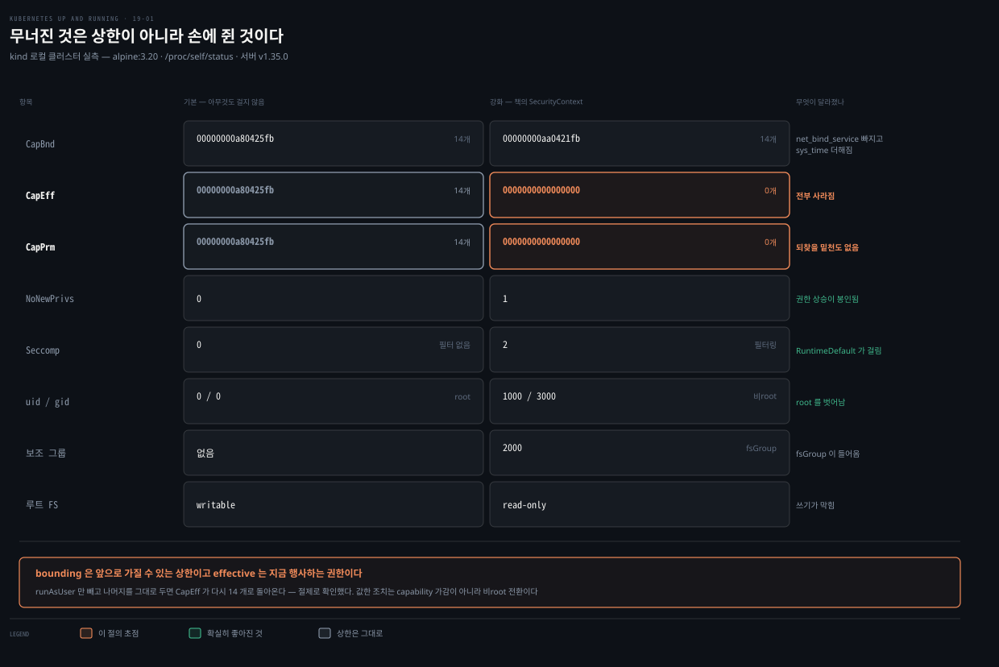
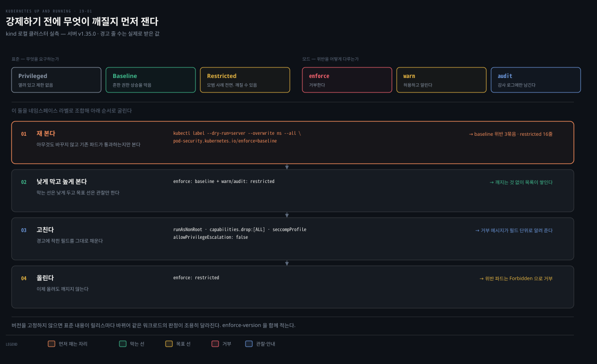
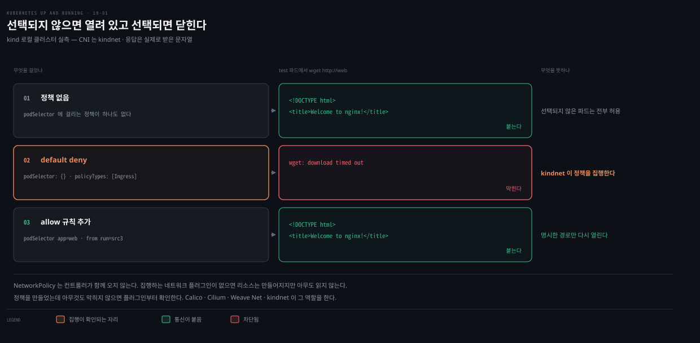

# 19장 · Securing Applications — 죽은 실습 이미지와 /proc 로 다시 세운 랩

## 핵심 요약

> 이 장은 **Pod 수준에 점진적으로 얹는 보안 API**를 훑습니다. 저자가 앞에 세우는 두 개념이 장 전체를 꿴다고 보면 됩니다. 여러 겹으로 막는 **방어 깊이**, 그리고 필요한 것만 주는 **최소 권한**입니다.

**이 노트는 델타와 랩에 섭니다.** seccomp·AppArmor·capability·샌드박싱·이미지 공급망은 형제 정독본 [Container Security](../container-security/README.md)가 이 책보다 훨씬 두껍게 다룹니다. 개념을 여기서 다시 쓰면 중복 더미가 되므로 맨 아래 위임 표로 넘깁니다.

여기 남기는 것은 **운영 관점의 절차**와 **이 장의 랩이 지금 어떤 상태인가**입니다. 후자가 이번 편의 가장 큰 수확입니다. 이 장의 실습 이미지는 **둘 다 죽었습니다.** 책 전체가 쓰는 `kuard` 데모 이미지는 익명 접근이 막혔고, 이 장의 주인공인 `amicontained`는 레지스트리 도메인 자체가 사라졌습니다.

그래서 랩을 `/proc`으로 다시 세웠습니다. 외부 의존이 하나도 없고, 다시 재 보니 **책의 도구가 못 보여 주던 것**이 나왔습니다. SecurityContext를 걸었을 때 실제로 무너지는 것은 책이 보여 주는 bounding 집합이 아니라 **effective 집합**입니다.


## 학습 목표

> 이 편을 읽고 나면 다음을 할 수 있습니다.

1. 컨테이너가 실제로 어떤 권한을 받았는지 도구 없이 `/proc`에서 직접 읽을 수 있습니다.
2. capability의 bounding 집합과 effective 집합을 구분해 무엇이 줄었는지 말할 수 있습니다.
3. Pod Security 표준을 강제하기 전에 기존 워크로드가 깨질지 미리 잴 수 있습니다.
4. AppArmor 설정이 어노테이션에서 필드로 옮겨간 것을 알고 현행 문법을 씁니다.
5. NetworkPolicy를 default deny에서 시작해 필요한 경로만 여는 순서로 세울 수 있습니다.

랩은 살아 있는 로컬 kind 클러스터에서 돌렸습니다. 클라이언트 `kubectl` v1.34.1, 서버 v1.35.0, 노드는 Debian 12 · containerd 2.2.0 · arm64, CNI는 kindnet입니다. 아래 출력은 전부 실제로 받은 것입니다.

```bash
kubectl create ns ch19-lab
```


## 두 개념이 장을 꿰고 있습니다

> 기술 절차보다 이 둘이 먼저 나옵니다. 나머지 API는 전부 이 둘을 실행하는 수단입니다.

**방어 깊이**는 Kubernetes를 포함한 컴퓨팅 시스템 전반에 보안 통제를 여러 겹으로 두는 것입니다. **최소 권한**은 워크로드가 동작하는 데 필요한 자원에만 접근을 주는 것입니다. 저자가 붙이는 단서가 중요합니다. 이 둘은 도달하는 목적지가 아니라, 끊임없이 변하는 시스템 지형에 **계속 적용하는 것**입니다.

저자가 장을 여는 문제 의식도 솔직합니다. Kubernetes에는 보안 API가 많이 실려 있지만, 그게 곧 문제입니다. API가 여럿이고 **하나하나 선언적으로 옵트인해야** 합니다. 그래서 이 API들을 쓰는 일이 번거롭고 뒤얽혀서, 원하는 보안 목표에 도달하기가 어렵다고 적습니다.


## 책의 실습 이미지가 둘 다 죽었습니다

> 이 절이 이 노트의 출발점입니다. 책을 펴고 따라 하려는 사람이 첫 명령에서 막힙니다.

### kuard — 책 전체가 쓰는 데모 이미지

이 장의 거의 모든 예제가 `gcr.io/kuar-demo/kuard-amd64:blue`를 씁니다. 그대로 띄워 봤습니다.

```bash
kubectl run kuard --image=gcr.io/kuar-demo/kuard-amd64:blue -n ch19-lab
kubectl get pod kuard -n ch19-lab
# NAME    READY   STATUS             RESTARTS   AGE
# kuard   0/1     ImagePullBackOff   0          25s
```

원인을 레지스트리에서 직접 확인했습니다. 익명 토큰 요청이 거부됩니다.

```bash
curl -s "https://gcr.io/v2/token?scope=repository:kuar-demo/kuard-amd64:pull&service=gcr.io"
# {"errors":[{"code":"DENIED","message":"Unauthenticated request. Unauthenticated
#  requests do not have permission \"artifactregistry.repositories.downloadArtifacts\"
#  on resource \"projects/kuar-demo/loc…
```

**이게 제 환경 문제가 아니라는 것을 대조군으로 확정했습니다.** 같은 `gcr.io`의 다른 공개 저장소는 익명으로 잘 열립니다. 클러스터의 이미지 pull 자체도 멀쩡합니다.

| 대상 | 익명 접근 | 뜻 |
|---|---|---|
| `gcr.io/kuar-demo/kuard-amd64` | 401 | 이 프로젝트만 막힘 |
| `gcr.io/kuar-demo/kuard-arm64` | 401 | 아키텍처 문제가 아님 |
| `gcr.io/google-containers/pause` | 200 | gcr.io 전반은 정상 |
| `docker.io/nginx:alpine` | pull 성공 | 클러스터 네트워크 정상 |

메시지가 원인을 정확히 말해 줍니다. `kuar-demo`가 Artifact Registry로 옮겨간 뒤, 익명 사용자에게 `downloadArtifacts` 권한이 없습니다. 저자들이 의도적으로 닫았는지 이관 과정의 설정 누락인지는 밖에서 알 수 없습니다.

### amicontained — 이 장의 주인공

이 장의 핵심 실습은 `amicontained`라는 도구를 Pod 안에서 돌려 실제로 어떤 보안 통제가 걸렸는지 보는 것입니다. 이쪽은 더 나쁩니다.

```bash
kubectl get pod amicontained -n ch19-lab -o jsonpath='{.status.containerStatuses[0].state}'
# failed to resolve reference "r.j3ss.co/amicontained:v0.4.9":
# dial tcp: lookup r.j3ss.co on 192.168.65.254:53: no such host
```

**도메인이 아예 없습니다.** 호스트에서 조회해도 같습니다.

```bash
python3 -c "import socket; socket.gethostbyname('r.j3ss.co')"
# socket.gaierror: [Errno 8] nodename nor servname provided, or not known
```

GitHub 컨테이너 레지스트리의 미러도 익명으로는 403입니다. 그래서 이 실습은 책에 적힌 대로는 재현할 방법이 없습니다.


## 랩 — amicontained 없이 `/proc`으로 직접 잽니다

> 도구가 사라졌다고 실습까지 버릴 필요는 없습니다. `amicontained`가 읽던 곳을 직접 읽으면 됩니다.



`amicontained`가 하는 일은 마법이 아닙니다. 컨테이너 안에서 `/proc`을 읽어 사람이 읽기 좋게 찍어 줄 뿐입니다. capability는 `/proc/self/status`의 `CapBnd`·`CapEff`, seccomp 모드는 같은 파일의 `Seccomp`, AppArmor 프로파일은 `/proc/self/attr/current`에 있습니다. 그러니 알파인 이미지 하나면 같은 것을 볼 수 있습니다.

### 아무것도 걸지 않은 기본 상태

```bash
kubectl run probe-default --image=alpine:3.20 -n ch19-lab --restart=Never --command -- sh -c '
  echo "AppArmor: $(cat /proc/self/attr/current 2>/dev/null || echo unavailable)"
  grep -E "^(CapBnd|CapEff|Seccomp):" /proc/self/status
  echo "uid=$(id -u) gid=$(id -g)"
  touch /probe-write 2>/dev/null && echo "rootfs: writable" || echo "rootfs: read-only"'
```

```bash
kubectl logs probe-default -n ch19-lab
# AppArmor: unavailable
# CapEff:  00000000a80425fb
# CapBnd:  00000000a80425fb
# Seccomp: 0
# uid=0 gid=0
# rootfs: writable
```

`Seccomp: 0`은 필터가 없다는 뜻입니다. 책의 `amicontained`가 `Seccomp: disabled`라고 찍던 것과 같은 사실입니다. `uid=0`은 **컨테이너가 root로 돌고 있다**는 뜻이고, 루트 파일시스템에 쓰기도 됩니다.

### 책의 SecurityContext를 그대로 건 상태

책의 Example 19-3과 같은 설정을 겁니다. Pod 수준에 `runAsNonRoot`·`runAsUser`·`runAsGroup`·`fsGroup`·`seccompProfile`을 두고, 컨테이너 수준에 capability 가감과 나머지를 둡니다.

```yaml
spec:
  securityContext:
    runAsNonRoot: true
    runAsUser: 1000
    runAsGroup: 3000
    fsGroup: 2000
    seccompProfile:
      type: RuntimeDefault
  containers:
    - image: alpine:3.20
      name: probe
      securityContext:
        capabilities:
          add: ["SYS_TIME"]
          drop: ["NET_BIND_SERVICE"]
        allowPrivilegeEscalation: false
        readOnlyRootFilesystem: true
        privileged: false
```

```bash
kubectl logs probe-hardened -n ch19-lab
# AppArmor: unavailable
# CapEff:  0000000000000000
# CapBnd:  00000000aa0421fb
# Seccomp: 2
# uid=1000 gid=3000 groups=3000 2000
# rootfs: read-only
```

### 책의 도구가 못 보여 주던 것

두 출력을 나란히 놓으면 이렇습니다. 비트마스크를 이름으로 풀어 함께 적었습니다.

| 항목 | 기본 | 강화 후 | 무엇이 달라졌나 |
|---|---|---|---|
| `CapBnd` | `a80425fb` · 14개 | `aa0421fb` · 14개 | `net_bind_service` 빠지고 `sys_time` 더해짐 |
| `CapEff` | `a80425fb` · 14개 | `0000000000000000` · **0개** | 전부 사라짐 |
| `CapPrm` | `a80425fb` · 14개 | `0000000000000000` · 0개 | 되찾을 밑천도 없음 |
| `NoNewPrivs` | `0` | `1` | 권한 상승 자체가 봉인됨 |
| `Seccomp` | `0` (없음) | `2` (필터링) | RuntimeDefault 프로파일이 걸림 |
| uid / gid | `0` / `0` | `1000` / `3000` | root를 벗어남 |
| 보조 그룹 | 없음 | `2000` | `fsGroup`이 들어옴 |
| 루트 FS | 쓰기 가능 | 읽기 전용 | |

비트마스크는 눈으로 읽히지 않으므로 노드에서 풀어 확인했습니다.

```bash
docker exec k8s-lab-control-plane capsh --decode=00000000a80425fb
# cap_chown,cap_dac_override,cap_fowner,cap_fsetid,cap_kill,cap_setgid,cap_setuid,
# cap_setpcap,cap_net_bind_service,cap_net_raw,cap_sys_chroot,cap_mknod,
# cap_audit_write,cap_setfcap

docker exec k8s-lab-control-plane capsh --decode=00000000aa0421fb
# …cap_setpcap,cap_net_raw,cap_sys_chroot,cap_sys_time,cap_mknod,…
#   ↑ cap_net_bind_service 가 빠지고 cap_sys_time 이 들어왔습니다
```

**핵심은 `CapEff` 줄입니다.** 책의 `amicontained` 출력은 `BOUNDING`만 찍습니다. 그것만 보면 capability는 14개에서 14개로 거의 그대로이고, 하나 빼고 하나 더한 사소한 변화처럼 읽힙니다. 실제로 무너진 것은 **effective 집합**입니다. 14개에서 0개가 됐습니다.

이유는 `runAsUser: 1000`입니다. bounding 집합은 "이 프로세스가 앞으로 가질 수 있는 상한"이고, effective 집합은 "지금 실제로 행사하는 권한"입니다. 비root 사용자로 시작하면 커널이 effective 집합을 비웁니다. 상한은 그대로여도 손에 쥔 것은 없는 상태입니다.

주장을 그대로 두지 않고 변수를 하나만 움직여 확인했습니다. capability 가감과 나머지 설정은 그대로 두고 `runAsUser`만 뺐습니다.

| 절제 | capability 가감 | uid | `CapBnd` | `CapEff` |
|---|---|---|---|---|
| `runAsUser` 뺌 | 동일 | `0` | `aa0421fb` | `aa0421fb` · 14개 그대로 |
| `runAsUser` 1000 | 동일 | `1000` | `aa0421fb` | `0000000000000000` |

capability 설정이 양쪽 같은데 `CapEff`만 갈렸습니다. 원인은 `runAsUser`가 맞습니다.

그러니 최소 권한 관점에서 값한 조치는 capability를 한두 개 가감하는 쪽이 아니라 **비root로 돌리는 쪽**입니다. 책이 `runAsNonRoot`를 첫 필드로 두는 이유도 여기 닿습니다. 컨테이너 런타임이 **컨테이너 안의 root 프로세스와 호스트의 root를 뒤섞는** 데서 많은 설정 오류와 익스플로잇이 나온다는 것입니다. 같은 이야기인데 책이 고른 도구가 그 효과를 가려 버렸습니다.

> AppArmor가 `unavailable`인 것은 이 환경의 한계입니다. macOS의 Docker Desktop이 띄우는 리눅스 VM에는 AppArmor가 없어서, 책이 보여 주는 `docker-default (enforce)`를 여기서는 재현할 수 없습니다. capability와 seccomp는 그대로 관측됩니다.


## Pod Security — 강제하기 전에 재는 법

> SecurityContext를 Pod마다 손으로 채우는 일은 규모가 커지면 성립하지 않습니다. 이 절이 그 문제를 네임스페이스 단위로 푸는 방법입니다.



먼저 정리해 둘 것이 있습니다. 예전의 `PodSecurityPolicy`는 **검증과 변형을 둘 다** 했습니다. 후계자인 Pod Security는 **검증만** 합니다. 변형을 더 알고 싶으면 **20장을 보라**고 저자가 안내합니다. 이 시리즈에서는 변형 웹훅이 실제로 무엇을 주고받는지를 [17장](./17-01.Extending%20Kubernetes%20%E2%80%94%20%EC%96%B4%EB%93%9C%EB%AF%B8%EC%85%98%C2%B7%EC%BB%A4%EC%8A%A4%ED%85%80%20%EB%A6%AC%EC%86%8C%EC%8A%A4%EC%99%80%20%EC%9D%B8%EC%A6%9D%EC%84%9C%20%EC%97%86%EB%8A%94%20%EA%B2%80%EC%A6%9D%20%EB%9E%A9.md)이 다룹니다.

### 세 표준과 세 모드, 그리고 버전 핀

표준은 셋입니다. **Privileged**는 열려 있고 제한이 없습니다. **Baseline**은 흔한 권한 상승을 막으면서 도입은 쉽게 합니다. **Restricted**는 보안 모범 사례를 폭넓게 강제하며, 저자가 "워크로드가 깨질 수 있다"고 미리 경고합니다.

모드도 셋입니다. **enforce**는 위반한 Pod를 거부합니다. **warn**은 허용하되 사용자에게 경고를 띄웁니다. **audit**은 감사 로그에 남깁니다. 셋은 배타적이지 않아 한 네임스페이스에 함께 걸 수 있습니다. 여기서 롤아웃 전략이 나옵니다.

```yaml
apiVersion: v1
kind: Namespace
metadata:
  name: baseline-ns
  labels:
    pod-security.kubernetes.io/enforce: baseline          # 낮은 표준으로 막고
    pod-security.kubernetes.io/enforce-version: v1.22
    pod-security.kubernetes.io/audit: restricted          # 높은 표준으로 관찰만
    pod-security.kubernetes.io/audit-version: v1.22
    pod-security.kubernetes.io/warn: restricted
    pod-security.kubernetes.io/warn-version: v1.22
```

낮은 표준으로 강제해 두고 높은 표준으로는 경고와 감사만 받습니다. 무엇이 깨질지 목록을 모은 뒤 고치고, 그다음에 강제 수준을 올립니다. 버전 핀은 표준 자체가 릴리스마다 바뀌기 때문에 있습니다. 고정해 두지 않으면 클러스터를 올렸을 때 판정이 조용히 달라집니다.

### 켜기 전에 클러스터 전체를 미리 재 봅니다

이 장에서 실무적으로 가장 값한 명령입니다. 라벨을 서버 dry-run으로만 붙여 보면, 실제로 바꾸지 않은 채 기존 Pod들이 그 표준을 통과하는지 알려 줍니다.

```bash
kubectl label --dry-run=server --overwrite ns --all \
  pod-security.kubernetes.io/enforce=baseline
```

```bash
# namespace/default labeled (server dry run)
# Warning: existing pods in namespace "kube-system" violate the new PodSecurity
#          enforce level "baseline:latest"
# Warning: etcd-k8s-lab-control-plane (and 3 other pods): host namespaces,
#          hostPath volumes, hostPort, probe or lifecycle host
# Warning: kindnet-fs4cf (and 2 other pods): non-default capabilities,
#          host namespaces, hostPath volumes
# Warning: kube-proxy-7xj7z (and 2 other pods): host namespaces, hostPath volumes, privileged
# namespace/kube-system labeled (server dry run)
```

> **버전 차이**: 출력 형태가 원서와 다릅니다. 원서는 위반 Pod마다 한 줄씩 찍습니다. 지금은 네임스페이스 단위 머리말 경고가 먼저 나오고, 위반 Pod는 `(and 3 other pods)`처럼 **묶여서** 나옵니다. 표준 이름도 `baseline:latest`로 버전까지 함께 찍습니다. 위반 Pod 이름을 전수로 얻으려면 이 출력만으로는 부족합니다.

표준을 `restricted`로 올려 같은 명령을 돌리면 경고가 훨씬 늘어납니다. 제 클러스터에서는 16줄이 나왔고, `kube-system`뿐 아니라 평범한 실습 네임스페이스까지 걸렸습니다.

```bash
kubectl label --dry-run=server --overwrite ns --all \
  pod-security.kubernetes.io/enforce=restricted 2>&1 | grep -c "^Warning:"
# 16
```

### 강제가 실제로 막습니다

```bash
kubectl create ns ch19-psa
kubectl label ns ch19-psa pod-security.kubernetes.io/enforce=restricted
kubectl run blocked --image=nginx:alpine -n ch19-psa --restart=Never
# Error from server (Forbidden): pods "blocked" is forbidden:
# violates PodSecurity "restricted:latest": allowPrivilegeEscalation != false
# (container "blocked" must set securityContext.allowPrivilegeEscalation=false),
# unrestricted capabilities (container "blocked" must set
# securityContext.capabilities.drop=["ALL"]), runAsNonRoot != true …
```

거부 메시지가 **무엇을 고쳐야 하는지 필드 단위로** 알려 줍니다. 이 점이 Pod Security를 실제로 굴릴 만하게 만듭니다. 위 랩에서 만든 강화 Pod의 설정이 그대로 이 요구사항을 채웁니다.

> **버전 차이**: 원서는 "Pod Security는 Kubernetes v1.23 기준 베타 기능이며 바뀔 수 있다"고 경고합니다. **v1.25에서 stable이 됐습니다.**[^psa] 같은 릴리스에서 `PodSecurityPolicy`가 제거됐다는 원서의 예고도 그대로 맞았습니다. 이 클러스터에는 해당 API가 없습니다.

```bash
kubectl api-resources | grep -i podsecuritypolicy
# (출력 없음)
```


## AppArmor는 어노테이션에서 필드로 옮겨갔습니다

> 원서 Example 19-3이 쓰는 문법이 지금은 폐기 예정입니다. 아직 동작하지만 경고가 붙습니다.

원서는 AppArmor 프로파일을 Pod 어노테이션으로 겁니다. 그대로 넣어 보면 서버가 답을 줍니다.

```bash
kubectl apply --dry-run=server -f apparmor-annotation.yaml
# Warning: metadata.annotations[container.apparmor.security.beta.kubernetes.io/probe]:
#          deprecated since v1.30; use the "appArmorProfile" field instead
# pod/apparmor-annotation created (server dry run)
```

현행 문법은 `securityContext` 안의 필드입니다. Pod 수준과 컨테이너 수준 양쪽에 둘 수 있습니다.

```yaml
spec:
  securityContext:
    appArmorProfile:
      type: RuntimeDefault      # Unconfined · RuntimeDefault · Localhost
```

```bash
kubectl apply --dry-run=server -f apparmor-field.yaml
# pod/apparmor-field created (server dry run)      ← 경고 없음
```

어노테이션이 아직 거부되지는 않으므로 책을 그대로 따라 해도 당장은 돕니다. 다만 경고를 무시하고 남겨 두면 언젠가 조용히 효력을 잃습니다. `seccompProfile`은 이미 필드라 원서 문법이 그대로 유효합니다.


## RuntimeClass — 선언만으로는 안 됩니다

> 원서가 짧게 지나가는 자리인데, 실제로 넣어 보면 왜 짧게 지나갈 수밖에 없는지가 드러납니다.

컨테이너 런타임은 CRI로 갈아 끼울 수 있고, 런타임마다 격리 강도가 다릅니다. Kata Containers·Firecracker·gVisor가 중첩 가상화나 정교한 syscall 필터링 같은 서로 다른 격리 기제를 씁니다. `RuntimeClass`는 그중 어느 것으로 돌릴지 워크로드가 고르게 해 주는 API입니다.

원서의 예제를 그대로 넣어 봤습니다.

```bash
kubectl apply --dry-run=server -f kuard-pod-runtimeclass.yaml   # runtimeClassName: firecracker
# Error from server (Forbidden): pods "rc-test" is forbidden:
# pod rejected: RuntimeClass "firecracker" not found
```

원서도 주석으로 "RuntimeClass는 클러스터 관리자가 설정해야 하고 노드 선택이나 톨러레이션이 필요할 수 있다"고 적어 둡니다. 다만 **설정되지 않은 클러스터에서 지정하면 Pod가 아예 거부된다**는 것까지는 보여 주지 않습니다. 오타 하나로 워크로드가 뜨지 않을 수 있는 자리라 실측해 둘 값이 있습니다.

```bash
kubectl get runtimeclass
# No resources found
```

격리 기제 셋이 각각 무엇을 어떻게 막는지는 [Container Security 08-01](../container-security/08-01.%EC%BB%A8%ED%85%8C%EC%9D%B4%EB%84%88%20%EA%B2%A9%EB%A6%AC%20%EA%B0%95%ED%99%94%20%E2%80%94%20%EC%83%8C%EB%93%9C%EB%B0%95%EC%8B%B1%EC%9D%98%20%EC%84%B8%20%EA%B0%88%EB%9E%98.md)가 정본입니다.


## NetworkPolicy — kindnet에서도 강제됩니다

> 원서 랩 중 유일하게 이미지만 바꾸면 그대로 재현되는 절입니다. 로컬 kind에서는 안 될 거라고 넘겨짚기 쉬운 자리라 확인해 둡니다.



먼저 원서가 짚는 성질을 옮깁니다. NetworkPolicy는 **컨트롤러가 함께 오지 않습니다.** 리소스를 만들 수는 있지만, 이를 집행하는 네트워크 플러그인이 없으면 아무 일도 일어나지 않습니다. Calico·Cilium·Weave Net 같은 플러그인이 그 역할을 합니다.

판정 규칙도 세 줄로 요약됩니다. 하나라도 정책에 선택되면 그때부터 인그레스와 이그레스를 **명시하지 않은 것은 차단**됩니다. 여러 정책에 걸리면 **더해집니다**. 어떤 정책에도 선택되지 않은 Pod는 **트래픽이 허용**됩니다. 저자가 "일부러 그렇게 정했다"고 밝히는 것은 이 마지막 규칙입니다. 새 워크로드를 들이기 쉽게 하려는 선택입니다.

### 세 단계로 확인합니다

```bash
kubectl create deployment web --image=nginx:alpine -n ch19-lab
kubectl expose deployment web --port=80 -n ch19-lab
```

정책이 없을 때는 그냥 붙습니다.

```bash
kubectl run src --image=busybox:1.36 -n ch19-lab --restart=Never --rm -i \
  --command -- wget -q -O- --timeout=5 http://web
# <!DOCTYPE html>
# <html>
# <head>
# <title>Welcome to nginx!</title>
```

default deny를 겁니다. `podSelector: {}`가 네임스페이스의 모든 Pod를 고른다는 뜻입니다.

```yaml
apiVersion: networking.k8s.io/v1
kind: NetworkPolicy
metadata:
  name: default-deny-ingress
spec:
  podSelector: {}
  policyTypes: [Ingress]
```

```bash
kubectl run src2 --image=busybox:1.36 -n ch19-lab --restart=Never --rm -i \
  --command -- wget -q -O- --timeout=5 http://web
# wget: download timed out
```

**막힙니다.** kindnet이 NetworkPolicy를 집행한다는 뜻입니다. 이제 필요한 경로만 엽니다.

```yaml
spec:
  podSelector:
    matchLabels:
      app: web
  ingress:
    - from:
        - podSelector:
            matchLabels:
              run: src3
```

```bash
kubectl run src3 --image=busybox:1.36 -n ch19-lab --restart=Never --rm -i \
  --command -- wget -q -O- --timeout=5 http://web
# <!DOCTYPE html>
```

선택자에 쓴 `run: src3`은 `kubectl run`이 자동으로 붙이는 라벨입니다. 지금도 그대로 붙습니다.

```bash
kubectl get pod labelcheck -n ch19-lab -o jsonpath='{.metadata.labels}'
# {"run":"labelcheck"}
```

정책을 계층으로 나눠 설계하는 관점은 [patterns 24-01](../kubernetes-patterns/24-01.Network%20Segmentation%20%E2%80%94%20%ED%86%B5%EC%8B%A0%EC%9D%84%20%ED%95%84%EC%9A%94%ED%95%9C%20%EA%B2%BD%EB%A1%9C%EB%A7%8C%20%EB%82%A8%EA%B8%B0%EA%B8%B0.md)가 정본입니다.


## ServiceAccount 토큰은 기본으로 들어옵니다

> 짧지만 놓치기 쉬운 절입니다. 18장에서 본 in-cluster 인증의 반대편입니다.

Kubernetes는 네임스페이스마다 `default` ServiceAccount를 만들고, 그것을 모든 Pod의 기본 계정으로 씁니다. 그 계정의 토큰은 **자동으로 각 Pod에 마운트됩니다.** 애플리케이션이 Kubernetes API를 쓸 일이 없다면 이건 그냥 열려 있는 문입니다.

```yaml
apiVersion: v1
kind: ServiceAccount
metadata:
  name: default
automountServiceAccountToken: false
```

저자가 못 박는 단서가 있습니다. 이 설정은 **네임스페이스마다** 해 줘야 합니다. 기본 계정 하나 고친다고 클러스터 전체가 닫히지 않습니다.

토큰이 실제로 어디에 어떤 파일로 들어오는지, 그 토큰으로 API를 부르면 무엇이 돌아오는지는 [18장 §인증](./18-01.Accessing%20Kubernetes%20%E2%80%94%20%ED%81%B4%EB%9D%BC%EC%9D%B4%EC%96%B8%ED%8A%B8%EA%B0%80%20%EA%B0%90%EC%B6%94%EB%8A%94%20HTTP%EC%99%80%20%EC%9B%90%EC%84%9C%20%EC%BD%94%EB%93%9C%20%EC%8B%A4%EC%A6%9D%20%EB%9E%A9.md)에서 실측해 두었습니다.


## 원서 정오와 버전 차이

> 이 장에서 확인한 것을 모읍니다. 근거는 **실행**(kind 클러스터·레지스트리 직접 조회), **공식**(Kubernetes 문서), **원문**(원서 안에서 앞뒤가 어긋나 외부 확인이 필요 없는 것)입니다.

| 자리 | 원서 | 실제 | 근거 |
|---|---|---|---|
| 장 전체 | `gcr.io/kuar-demo/kuard-*` 를 실습 이미지로 씀 | 익명 pull 거부(401). 대조군 gcr 저장소는 200 | 실행 |
| SecurityContext 랩 | `r.j3ss.co/amicontained:v0.4.9` | 도메인 DNS 없음. ghcr 미러도 익명 403 | 실행 |
| Example 19-3 | AppArmor 를 `container.apparmor.security.beta…` 어노테이션으로 | v1.30 부터 폐기 예정. 현행은 `securityContext.appArmorProfile` | 실행 |
| Pod Security 경고문 | "v1.23 기준 베타" | v1.25 에서 stable | 공식[^psa] |
| dry-run 평가 출력 | 위반 Pod 마다 한 줄 | 네임스페이스 머리말 + Pod 묶음(`and N other pods`) + `level:version` 표기 | 실행 |
| NetworkPolicy 랩 | `kubectl expose pod kuard …` 출력을 `pod/kuard created` 로 적음 | `service/<이름> exposed` 가 맞음 | 실행 |
| Capabilities 설명 | "This follows the **principal** of least privilege" | `principle`. 같은 장 도입부는 맞게 씀 | 원문 |
| ServiceAccount 절 | "following the least privilege **principal**" | `principle` | 원문 |
| SecurityContext 필드 설명 | 표제어를 `fsgroup` 으로 | YAML 과 API 는 `fsGroup` | 원문 |
| Pod Security 절 | 변형을 더 알려면 **20장**을 보라고 안내 | 맞음. 이 노트가 17장으로 바꿔 적었던 것을 정정 | 원문 |
| Baseline 표준 설명 | "Most common privilege escalation while enabling easier onboarding" | 동사가 빠져 무엇을 한다는 것인지가 문장에 없음 | 원문 |
| RuntimeClass 절 | 관리자 설정이 필요하다고만 언급 | 없는 클래스를 지정하면 Pod 가 `Forbidden` 으로 거부됨 | 실행 |

`amicontained` 출력이 bounding 집합만 보여 주는 것은 원서의 오류가 아니라 도구의 성질입니다. 다만 그 때문에 `runAsUser`의 실제 효과가 본문에서 드러나지 않으므로 위 랩에서 따로 짚었습니다.


## 면접에서 받을 만한 질문

> 이 노트가 남긴 델타와 랩만 묻습니다. seccomp·capability·샌드박싱 개념은 위임 표의 문서들이 각자 질문을 갖고 있습니다.

1. 컨테이너에 실제로 어떤 권한이 걸렸는지 도구 없이 확인하려면 무엇을 보나요?
2. capability의 bounding 집합과 effective 집합은 어떻게 다른가요? 비root로 돌리면 어느 쪽이 변하나요?
3. Pod Security 표준을 운영 클러스터에 처음 켤 때 순서를 어떻게 잡나요?
4. Pod Security 라벨에 버전을 고정하는 이유는 무엇인가요?
5. NetworkPolicy를 만들었는데 아무것도 막히지 않습니다. 무엇을 의심해야 하나요?
6. Pod Security와 PodSecurityPolicy의 결정적인 차이 하나를 말해 보세요.

### 정답

1. `/proc/self/status`의 `CapBnd`·`CapEff`·`Seccomp`와 `/proc/self/attr/current`입니다. capability 비트마스크, seccomp 모드(`0`은 없음, `2`는 필터링), AppArmor 프로파일이 각각 그 자리에 있습니다.
2. **bounding**은 앞으로 가질 수 있는 상한이고, **effective**는 지금 행사하는 권한입니다. 비root로 돌리면 bounding은 거의 그대로인데 effective가 **0이 됩니다.** 실측에서 14개에서 0개로 떨어졌습니다.
3. 낮은 표준을 `enforce`로 걸고 높은 표준을 `warn`·`audit`으로 함께 겁니다. 그전에 `kubectl label --dry-run=server`로 클러스터 전체를 미리 평가해 무엇이 깨질지 목록을 얻습니다. 고친 뒤에 강제 수준을 올립니다.
4. **표준의 내용이 릴리스마다 바뀌기 때문입니다.** 고정해 두지 않으면 클러스터를 업그레이드했을 때 같은 워크로드의 판정이 조용히 달라집니다.
5. **집행하는 네트워크 플러그인이 없을 가능성**입니다. NetworkPolicy는 컨트롤러가 함께 오지 않아서, 리소스는 만들어지지만 아무도 읽지 않습니다. 그리고 어떤 정책에도 선택되지 않은 Pod는 애초에 전부 허용입니다.
6. PSP는 **검증과 변형**을 둘 다 했고, Pod Security는 **검증만** 합니다. 기본값을 채워 넣으려면 어드미션 웹훅을 따로 만들어야 합니다.


## 이 장을 어디로 위임했는가

> 이 노트가 델타와 랩만 다루는 이유입니다. 아래 주제는 이미 정리돼 있습니다.

| 더 알고 싶은 것 | 읽을 곳 |
|---|---|
| capability·syscall·권한의 바닥 원리 | [Container Security 02-01](../container-security/02-01.Linux%20%EC%8B%9C%EC%8A%A4%ED%85%9C%20%EC%BD%9C%C2%B7%EA%B6%8C%ED%95%9C%C2%B7capability%20%E2%80%94%20%EC%BB%A8%ED%85%8C%EC%9D%B4%EB%84%88%20%EB%B3%B4%EC%95%88%EC%9D%98%20%EB%B0%94%EB%8B%A5.md) |
| 샌드박싱 세 갈래 — gVisor·Kata·Firecracker | [Container Security 08-01](../container-security/08-01.%EC%BB%A8%ED%85%8C%EC%9D%B4%EB%84%88%20%EA%B2%A9%EB%A6%AC%20%EA%B0%95%ED%99%94%20%E2%80%94%20%EC%83%8C%EB%93%9C%EB%B0%95%EC%8B%B1%EC%9D%98%20%EC%84%B8%20%EA%B0%88%EB%9E%98.md) |
| 설정 하나로 격리가 무너지는 사례 | [Container Security 09-01](../container-security/09-01.%EC%BB%A8%ED%85%8C%EC%9D%B4%EB%84%88%20%EA%B2%A9%EB%A6%AC%20%EA%B9%A8%EB%9C%A8%EB%A6%AC%EA%B8%B0%20%E2%80%94%20%EC%84%A4%EC%A0%95%20%ED%95%98%EB%82%98%EB%A1%9C%20%EB%AC%B4%EB%84%88%EC%A7%80%EB%8A%94%20%EA%B2%BD%EA%B3%84.md) |
| seccomp 프로파일 운영과 런타임 이상 탐지 | [Container Security 13-01](../container-security/13-01.%EC%BB%A8%ED%85%8C%EC%9D%B4%EB%84%88%20%EB%9F%B0%ED%83%80%EC%9E%84%20%EB%B3%B4%ED%98%B8%20%E2%80%94%20%EC%A0%95%EC%83%81%EC%9D%84%20%EC%A0%95%EC%9D%98%ED%95%B4%20%EC%9D%B4%EC%83%81%EC%9D%84%20%EC%9E%A1%EB%8B%A4.md) |
| 네트워크 보안을 계층별로 나누기 | [Container Security 10-01](../container-security/10-01.%EC%BB%A8%ED%85%8C%EC%9D%B4%EB%84%88%20%EB%84%A4%ED%8A%B8%EC%9B%8C%ED%81%AC%20%EB%B3%B4%EC%95%88%20%E2%80%94%20%EA%B3%84%EC%B8%B5%EB%B3%84%EB%A1%9C%20%EB%82%98%EB%88%A0%20%EB%A7%89%EA%B8%B0.md) · [patterns 24-01](../kubernetes-patterns/24-01.Network%20Segmentation%20%E2%80%94%20%ED%86%B5%EC%8B%A0%EC%9D%84%20%ED%95%84%EC%9A%94%ED%95%9C%20%EA%B2%BD%EB%A1%9C%EB%A7%8C%20%EB%82%A8%EA%B8%B0%EA%B8%B0.md) |
| 최소 권한으로 컨테이너를 가두는 패턴 | [patterns 23-01](../kubernetes-patterns/23-01.Process%20Containment%20%E2%80%94%20%EC%B5%9C%EC%86%8C%20%EA%B6%8C%ED%95%9C%EC%9C%BC%EB%A1%9C%20%EC%BB%A8%ED%85%8C%EC%9D%B4%EB%84%88%EB%A5%BC%20%EA%B0%80%EB%91%90%EA%B8%B0.md) |
| 이미지 공급망 보안과 스캔 운영 | [Container Security 06-02](../container-security/06-02.%EC%9D%B4%EB%AF%B8%EC%A7%80%20%EA%B3%B5%EA%B8%89%EB%A7%9D%20%EB%B3%B4%EC%95%88%20%E2%80%94%20%EB%B9%8C%EB%93%9C%EB%B6%80%ED%84%B0%20%EB%B0%B0%ED%8F%AC%EA%B9%8C%EC%A7%80.md) |
| CIS 벤치마크와 CSPM 이 각각 무엇을 점검하는가 | [Container Security 14-01](../container-security/14-01.%EC%BB%A8%ED%85%8C%EC%9D%B4%EB%84%88%EC%99%80%20OWASP%20Top%2010%20%E2%80%94%20%EC%9B%B9%20%EB%A6%AC%EC%8A%A4%ED%81%AC%EB%A5%BC%20%EC%BB%A8%ED%85%8C%EC%9D%B4%EB%84%88%20%EB%8C%80%EC%9D%91%EC%9C%BC%EB%A1%9C%20%EC%9E%87%EB%8B%A4.md) |
| `kube-bench` 를 실제로 돌리는 절차 | **이 시리즈에 정리된 곳이 없습니다.** 원서 §Security Benchmark Tools 를 직접 보시기 바랍니다 |
| ServiceAccount 에 Role 을 설계하고 묶기 | [14-01 RBAC](./14-01.RBAC%20%E2%80%94%20%EC%9D%B8%EA%B0%80%EB%A5%BC%20%EC%84%A4%EA%B3%84%ED%95%98%EA%B3%A0%20%EC%9A%B4%EC%98%81%ED%95%98%EB%8A%94%20%EB%B2%95.md) |
| 서비스 메시의 mTLS 와 접근 정책 | [15-01 Service Meshes](./15-01.Service%20Meshes%20%E2%80%94%20%EC%93%B8%20%EA%B2%83%EC%9D%B8%EA%B0%80%EB%A5%BC%20%EB%A8%BC%EC%A0%80%20%EB%94%B0%EC%A7%84%EB%8B%A4.md) |


## 참고 자료

- 원서: 《Kubernetes: Up and Running, 3rd Edition》 Chapter 19. Securing Applications in Kubernetes (O'Reilly)
- [Kubernetes 공식 문서 — Pod Security Admission](https://kubernetes.io/docs/concepts/security/pod-security-admission/)
- [Kubernetes 공식 문서 — Pod Security Standards](https://kubernetes.io/docs/concepts/security/pod-security-standards/)
- [Kubernetes 공식 문서 — Restrict a Container's Access to Resources with AppArmor](https://kubernetes.io/docs/tutorials/security/apparmor/)
- [Kubernetes 공식 문서 — Network Policies](https://kubernetes.io/docs/concepts/services-networking/network-policies/)

[^psa]: Kubernetes — Pod Security Admission. 페이지 머리말이 `FEATURE STATE: Kubernetes v1.25 [stable]` 이고, PodSecurityPolicy 를 대체한다고 적습니다 (2026-08-23 조회). <https://kubernetes.io/docs/concepts/security/pod-security-admission/>


## 관련 문서

> 같은 주제를 다른 축에서 다루는 노트입니다.

- [Container Security 정독 인덱스](../container-security/README.md) — 이 장 개념의 정본이 모여 있는 곳
- [18-01 Accessing Kubernetes](./18-01.Accessing%20Kubernetes%20%E2%80%94%20%ED%81%B4%EB%9D%BC%EC%9D%B4%EC%96%B8%ED%8A%B8%EA%B0%80%20%EA%B0%90%EC%B6%94%EB%8A%94%20HTTP%EC%99%80%20%EC%9B%90%EC%84%9C%20%EC%BD%94%EB%93%9C%20%EC%8B%A4%EC%A6%9D%20%EB%9E%A9.md) — ServiceAccount 토큰의 반대편
- [Kubernetes: Up and Running 정독 인덱스](./README.md) — 이 시리즈의 MOC
