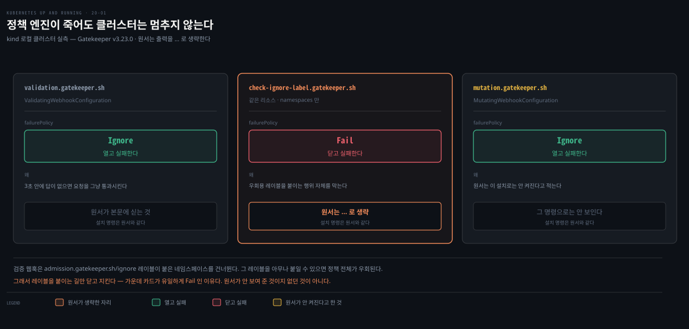
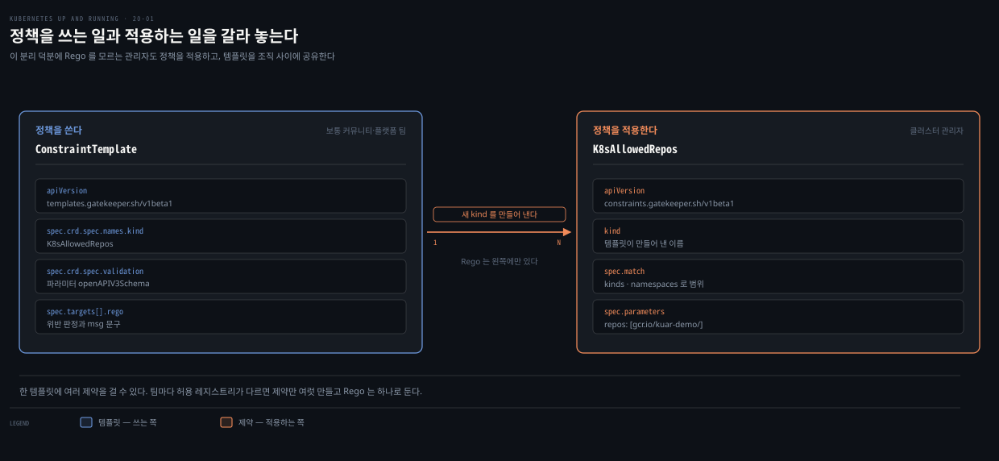
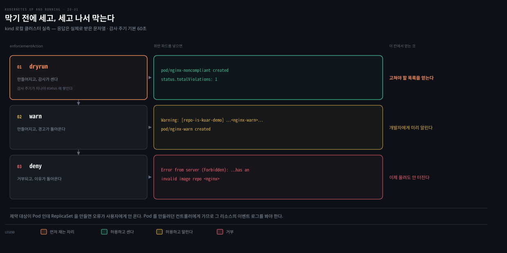

# 20장 · Policy and Governance — Gatekeeper 로 만들기 전에 막고 만든 뒤에 세는 법

## 핵심 요약

> 이 장은 **리소스가 만들어지기 전에** 조직의 규칙을 강제하는 문제를 다룹니다. 저자가 먼저 하는 일은 RBAC과 선을 긋는 것입니다. RBAC은 "누가 무엇에 접근하는가"를 정하지, **리소스 안의 특정 필드를 제한할 만큼 세밀하지 않습니다.**

`write/`에 정책 엔진을 다룬 노트가 없어 이 편은 델타가 아니라 신규 주제입니다. 다만 어드미션 웹훅의 기제는 [17장](./17-01.Extending%20Kubernetes%20%E2%80%94%20%EC%96%B4%EB%93%9C%EB%AF%B8%EC%85%98%C2%B7%EC%BB%A4%EC%8A%A4%ED%85%80%20%EB%A6%AC%EC%86%8C%EC%8A%A4%EC%99%80%20%EC%9D%B8%EC%A6%9D%EC%84%9C%20%EC%97%86%EB%8A%94%20%EA%B2%80%EC%A6%9D%20%EB%9E%A9.md)이 이미 다루므로 여기서는 **그 위에 Gatekeeper가 무엇을 얹는가**만 봅니다.

랩은 실제로 설치해서 돌렸습니다. 원서가 쓴 Helm 명령은 그대로 통했습니다. 확실히 달라진 것은 **변형**입니다. 원서가 "이 설치 절차로는 켜지지 않는다"며 베타라고 적은 기능이 지금은 표준 설치에 들어 있습니다.

이 편이 남기는 것은 **정책이 무엇을 보고 무엇을 안 보는가**입니다. 원서가 "준수한다"며 만드는 Pod가 **정책은 통과하고 이미지를 못 당겨 죽습니다.** Rego가 이미지 문자열의 접두사만 보기 때문입니다. 그 이미지가 왜 안 당겨지는지는 [19장](./19-01.Securing%20Applications%20%E2%80%94%20%EC%A3%BD%EC%9D%80%20%EC%8B%A4%EC%8A%B5%20%EC%9D%B4%EB%AF%B8%EC%A7%80%EC%99%80%20proc%20%EB%A1%9C%20%EB%8B%A4%EC%8B%9C%20%EC%84%B8%EC%9A%B4%20%EB%9E%A9.md)이 이미 밝혔고, 여기서는 그 사실이 **정책 통과와 아무 상관이 없다**는 쪽만 봅니다.


## 학습 목표

> 이 편을 읽고 나면 다음을 할 수 있습니다.

1. RBAC으로 못 막는 것이 무엇인지 예를 들어 말할 수 있습니다.
2. ConstraintTemplate과 Constraint를 왜 둘로 나눴는지 설명할 수 있습니다.
3. 정책을 deny로 켜기 전에 dryrun과 감사로 영향 범위를 잴 수 있습니다.
4. 정책 통과와 워크로드 동작이 별개라는 것을 구분할 수 있습니다.

랩은 로컬 kind 클러스터에서 돌렸습니다. `kubectl` v1.34.1, 서버 v1.35.0, Gatekeeper v3.23.0(Helm 차트 `gatekeeper-3.23.0`)입니다.

```bash
kubectl create ns ch20-lab
```


## RBAC이 못 막는 자리

> 이 절이 장의 출발점입니다. 정책 엔진을 왜 따로 두는지가 여기서 갈립니다.

Kubernetes에는 이미 정책이라 불리는 것이 여럿 있습니다. NetworkPolicy는 Pod가 어떤 서비스와 엔드포인트에 붙을 수 있는지를 정하고, PodSecurityPolicy는 Pod의 보안 요소를 세밀하게 통제했습니다. 둘 다 **네트워크나 컨테이너 런타임을 설정하는** 물건입니다.

저자가 던지는 질문이 여기서 나옵니다. 리소스가 **만들어지기도 전에** 정책을 강제하고 싶다면 어떻게 하는가. 그리고 곧바로 예상 질문을 받습니다. 그건 RBAC이 하는 일 아닌가.

**아닙니다.** RBAC은 리소스 안의 **특정 필드**가 설정되는 것을 막을 만큼 세밀하지 않습니다. 저자가 드는 실제 사례들이 그 차이를 보여 줍니다.

- 모든 컨테이너는 특정 레지스트리에서만 와야 합니다.
- 모든 Pod에 부서명과 연락처 레이블이 있어야 합니다.
- 모든 Pod에 CPU와 메모리 한계가 설정돼야 합니다.
- 모든 Ingress 호스트명이 클러스터 안에서 유일해야 합니다.
- 어떤 서비스는 인터넷에 노출돼서는 안 됩니다.
- 컨테이너가 특권 포트를 열어서는 안 됩니다.

"Pod를 만들 수 있는가"는 RBAC이 답하지만, "그 Pod의 `image` 필드가 무엇으로 시작하는가"는 답하지 못합니다. 그 자리를 어드미션 웹훅이 채웁니다.

저자가 함께 못 박는 운영 조건이 하나 더 있습니다. 관리자가 정책을 정의하고 감사하는 일이 **개발자의 배포를 방해해서는 안 됩니다.** 위반이 생기면 개발자가 스스로 고칠 수 있도록 **피드백과 시정 방법**이 돌아가야 한다는 것입니다. 이 조건이 뒤에 나오는 dryrun과 감사의 존재 이유입니다.

> 어드미션이 요청 흐름의 어디에 앉는지, 웹훅이 API 서버와 무엇을 주고받는지는 [17장](./17-01.Extending%20Kubernetes%20%E2%80%94%20%EC%96%B4%EB%93%9C%EB%AF%B8%EC%85%98%C2%B7%EC%BB%A4%EC%8A%A4%ED%85%80%20%EB%A6%AC%EC%86%8C%EC%8A%A4%EC%99%80%20%EC%9D%B8%EC%A6%9D%EC%84%9C%20%EC%97%86%EB%8A%94%20%EA%B2%80%EC%A6%9D%20%EB%9E%A9.md)이 정본입니다. 이 편은 그 위에 Gatekeeper가 얹는 것만 다룹니다.


## 설치 — 원서 명령은 통하지만 결과가 다릅니다

> 원서의 Helm 명령이 지금도 그대로 돕니다. 달라진 것은 그 명령이 만들어 내는 것입니다.



```bash
helm repo add gatekeeper https://open-policy-agent.github.io/gatekeeper/charts
helm install gatekeeper/gatekeeper --name-template=gatekeeper \
  --namespace gatekeeper-system --create-namespace
# NAME: gatekeeper
# STATUS: deployed
```

```bash
kubectl get pods -n gatekeeper-system
# gatekeeper-audit-7ccd4f8f47-ppwhw                1/1  Running
# gatekeeper-controller-manager-5f8bf68c7b-gjzb6   1/1  Running
# gatekeeper-controller-manager-5f8bf68c7b-nw84c   1/1  Running
# gatekeeper-controller-manager-5f8bf68c7b-xpmrm   1/1  Running
```

파드 구성은 원서와 같습니다. 감사 하나에 컨트롤러 셋입니다. 웹훅에서 갈립니다.

### 웹훅은 셋인데, 원서가 안 보여 준 것과 없던 것은 다릅니다

| 웹훅 | 어디에 | 대상 | `failurePolicy` |
|---|---|---|---|
| `validation.gatekeeper.sh` | ValidatingWebhookConfiguration | 거의 모든 리소스 | `Ignore` — 열고 실패 |
| `check-ignore-label.gatekeeper.sh` | 같은 곳 | `namespaces` 만 | **`Fail`** — 닫고 실패 |
| `mutation.gatekeeper.sh` | **MutatingWebhookConfiguration** | Pod 등 | `Ignore` |

> **읽을 때 헷갈리는 지점**: 원서는 `kubectl get validatingwebhookconfiguration -o yaml` 출력을 싣고 `timeoutSeconds: 3` 다음을 `...`로 **명시적으로 생략**합니다. 그러니 "원서에는 웹훅이 하나뿐"이라고 읽으면 안 됩니다. 두 번째 웹훅은 원서보다 앞선 버전의 차트에도 이미 있었습니다. 그리고 세 번째는 애초에 **다른 리소스 종류**라 그 명령으로는 보이지 않습니다.

`failurePolicy: Ignore`는 원서가 짚는 그대로입니다. Gatekeeper 서비스가 3초 안에 답하지 않으면 요청이 그냥 통과합니다. 정책 엔진이 죽어도 클러스터가 멈추지 않게 하는 선택입니다.

두 번째 웹훅이 새로 생긴 것이고, 이쪽만 **`Fail`**입니다. 대상은 네임스페이스 생성과 수정뿐입니다. 이유를 짐작하기 어렵지 않습니다. 첫 번째 웹훅은 `admission.gatekeeper.sh/ignore` 레이블이 붙은 네임스페이스를 건너뜁니다. 그 레이블을 아무나 붙일 수 있으면 정책 전체를 우회할 수 있습니다. 그 레이블을 붙이는 행위 자체를 닫고 지키는 것이 두 번째 웹훅입니다.

대상 리소스 목록도 달라졌습니다. 원서는 `resources: ['*']` 한 줄인데, 지금은 서브리소스가 열거돼 있습니다.

```bash
kubectl get validatingwebhookconfiguration gatekeeper-validating-webhook-configuration \
  -o jsonpath='{.webhooks[0].rules[0].resources}'
# ["*","pods/ephemeralcontainers","pods/exec","pods/log","pods/eviction",
#  "pods/portforward","pods/proxy","pods/attach","pods/binding","pods/resize",
#  "deployments/scale","replicasets/scale","statefulsets/scale",
#  "replicationcontrollers/scale","services/proxy","nodes/proxy","services/status"]
```

> **버전 차이**: 원서는 "이 장의 설치 절차는 변형을 켜지 않는다"고 못 박고, 변형은 **베타**라고 적습니다. 지금은 표준 Helm 설치가 `mutation.gatekeeper.sh` 웹훅을 함께 세웁니다. 차트 값도 `disableMutation: false`가 기본입니다. 변형을 원치 않으면 **꺼야 하는** 쪽으로 기본값이 뒤집혔습니다.


## 정책은 둘로 나뉩니다

> ConstraintTemplate과 Constraint를 왜 굳이 둘로 나눴는지가 이 절의 요지입니다.



Gatekeeper의 바닥에는 **Open Policy Agent**가 있습니다. 정책 평가를 전부 OPA가 맡고 admit이나 deny를 돌려줍니다. OPA는 **Rego**라는 자체 질의 언어만 씁니다.

여기서 Gatekeeper의 설계 의도가 나옵니다. 저자의 표현으로 핵심 원칙 중 하나가 **Rego의 내부 동작을 클러스터 관리자에게서 감추고** 대신 Kubernetes CRD 형태의 구조화된 API를 내놓는 것입니다. 그래서 둘로 나뉩니다.

**ConstraintTemplate**은 Rego와 파라미터 스키마를 담습니다. 정책을 *쓰는* 쪽입니다. 새 CRD 종류(`K8sAllowedRepos`)를 만들어 냅니다.

```yaml
apiVersion: templates.gatekeeper.sh/v1beta1
kind: ConstraintTemplate
metadata:
  name: k8sallowedrepos
spec:
  crd:
    spec:
      names:
        kind: K8sAllowedRepos          # 이 이름이 곧 Constraint 의 kind 가 됩니다
      validation:
        openAPIV3Schema:
          properties:
            repos: { type: array, items: { type: string } }
  targets:
    - target: admission.k8s.gatekeeper.sh
      rego: |
        package k8sallowedrepos
        violation[{"msg": msg}] {
          container := input.review.object.spec.containers[_]
          satisfied := [good | repo = input.parameters.repos[_] ; good = startswith(container.image, repo)]
          not any(satisfied)
          msg := sprintf("container <%v> has an invalid image repo <%v>, allowed repos are %v",
                         [container.name, container.image, input.parameters.repos])
        }
        violation[{"msg": msg}] {          # 같은 규칙을 initContainers 에도 건다
          container := input.review.object.spec.initContainers[_]
          satisfied := [good | repo = input.parameters.repos[_] ; good = startswith(container.image, repo)]
          not any(satisfied)
          msg := sprintf("container <%v> has an invalid image repo <%v>, allowed repos are %v",
                         [container.name, container.image, input.parameters.repos])
        }
```

**두 번째 규칙을 빠뜨리면 initContainer 로 우회됩니다.** 원서가 규칙을 둘 둔 이유가 그것이고, 본문도 "containers 와 initContainers 를 평가한다"고 적습니다.

**Constraint**는 그 템플릿을 파라미터와 범위로 인스턴스화합니다. 정책을 *적용하는* 쪽입니다. Rego를 한 줄도 몰라도 됩니다.

```yaml
apiVersion: constraints.gatekeeper.sh/v1beta1
kind: K8sAllowedRepos                  # 템플릿이 만들어 낸 종류
metadata:
  name: repo-is-kuar-demo
spec:
  enforcementAction: deny
  match:
    kinds:
      - apiGroups: [""]
        kinds: ["Pod"]
    namespaces: ["ch20-lab"]           # 원서는 default 를 겨냥합니다
  parameters:
    repos:
      - "gcr.io/kuar-demo/"
```

이 분리가 값하는 이유는 **파라미터화된 정책을 조직 사이에 공유**할 수 있기 때문입니다. 템플릿은 커뮤니티가 쓰고, 각 조직은 자기 파라미터로 인스턴스만 만듭니다. Gatekeeper 프로젝트가 정책 라이브러리를 따로 유지하는 것도 이 때문입니다.

> 원서는 Constraint의 `namespaces`를 `default`로 둡니다. 저는 기존 실습 리소스를 지키려고 `ch20-lab`으로 좁혔습니다. 정책의 범위를 좁게 잡는 습관은 그 자체로 안전 장치입니다.


## 켜는 순서 — deny 로 시작하지 않습니다

> `enforcementAction`이 셋인 이유가 이 절에 있습니다. 정책은 켜는 것보다 **켜기 전에 재는 것**이 어렵습니다.



`enforcementAction`은 `deny`·`dryrun`·`warn` 셋을 받습니다. 저자가 경고를 하나 붙입니다. 제약은 **CREATE와 UPDATE에서만** 평가됩니다. 이미 돌고 있는 워크로드는 다시 평가되지 않습니다.

여기서 실무의 함정이 나옵니다. 정책을 켜 두면 당장은 아무 일도 없다가, Deployment를 1에서 2로 늘리는 순간 ReplicaSet이 새 Pod를 만들려다 거부당합니다. 그래서 저자는 **`dryrun`으로 먼저 걸고 감사로 확인한 뒤에** `deny`로 올리라고 못 박습니다.

### deny — 거부하고 이유를 돌려줍니다

```bash
kubectl run nginx-noncompliant --image=nginx -n ch20-lab --restart=Never
# Error from server (Forbidden): admission webhook "validation.gatekeeper.sh"
# denied the request: [repo-is-kuar-demo] container <nginx-noncompliant> has an
# invalid image repo <nginx>, allowed repos are ["gcr.io/kuar-demo/"]
```

메시지가 **무엇이 왜 막혔는지와 허용 목록까지** 돌려줍니다. 이 문구는 ConstraintTemplate의 `msg`가 정한 것이라 관리자가 조직에 맞게 바꿀 수 있습니다.

> **함정**: 제약의 대상이 Pod인데 ReplicaSet처럼 Pod를 *만들어 내는* 리소스를 생성하면, 오류가 사용자에게 돌아오지 않습니다. Pod를 만들려던 **컨트롤러**에게 갑니다. 그 경우 해당 리소스의 이벤트 로그를 봐야 합니다.

### dryrun + 감사 — 막지 않고 셉니다

```bash
kubectl patch k8sallowedrepos repo-is-kuar-demo --type=merge \
  -p '{"spec":{"enforcementAction":"dryrun"}}'
kubectl run nginx-noncompliant --image=nginx -n ch20-lab --restart=Never
# pod/nginx-noncompliant created      ← 이번엔 만들어집니다
```

감사는 주기적으로 돕니다. 기본 주기는 60초입니다.

```bash
kubectl get deploy gatekeeper-audit -n gatekeeper-system \
  -o jsonpath='{.spec.template.spec.containers[0].args}'
# --audit-interval=60 · --audit-from-cache=false · --audit-chunk-size=500
```

주기가 지나면 제약의 `status`에 위반 목록이 쌓입니다.

```bash
kubectl get constraint repo-is-kuar-demo -o yaml
# status:
#   auditTimestamp: "2026-08-23T07:10:15Z"
#   totalViolations: 1
#   violations:
#   - enforcementAction: dryrun
#     kind: Pod
#     name: nginx-noncompliant
#     message: container <nginx-noncompliant> has an invalid image repo <nginx>,
#              allowed repos are ["gcr.io/kuar-demo/"]
```

### warn — 만들되 알립니다

중간 단계가 하나 더 있습니다. 생성은 허용하되 경고를 돌려줍니다.

```bash
kubectl patch k8sallowedrepos repo-is-kuar-demo --type=merge \
  -p '{"spec":{"enforcementAction":"warn"}}'
kubectl run nginx-warn --image=nginx -n ch20-lab --restart=Never
# Warning: [repo-is-kuar-demo] container <nginx-warn> has an invalid image repo
#          <nginx>, allowed repos are ["gcr.io/kuar-demo/"]
# pod/nginx-warn created
```

`dryrun`과 달리 사용자가 **그 자리에서** 봅니다. 감사 주기를 기다릴 필요가 없습니다. 저자가 앞에서 내건 "배포를 막지 않으면서 피드백은 준다"는 조건에 잘 맞는 모드입니다.

저자가 못 박는 순서는 둘입니다. **`dryrun`으로 목록을 얻고 고친 뒤에 `deny`로 올립니다.** `warn`을 그 사이에 끼우는 것은 원서가 시킨 것이 아니라 제 판단입니다.

> 감사 결과를 조회했는데 `totalViolations: 0`이고 `auditTimestamp`가 낡았다면 아직 주기가 안 돈 것입니다. 랩에서 감사 파드가 한 번 재시작하면서 타임스탬프가 6분간 멈춘 적이 있는데, 원인은 확인하지 못했습니다.


## 정책 통과와 동작은 별개입니다

> 이 랩에서 가장 값한 관측입니다. 원서를 그대로 따라 하면 저절로 드러납니다.

원서는 정책이 잘 도는지 보이려고 **준수하는 Pod**를 만듭니다. 이미지는 `gcr.io/kuar-demo/kuard-amd64:blue`입니다. 그대로 해 봤습니다.

```bash
kubectl run kuard --image=gcr.io/kuar-demo/kuard-amd64:blue -n ch20-lab --restart=Never
# pod/kuard created                    ← 정책은 통과했습니다

kubectl get pod kuard -n ch20-lab
# NAME    READY   STATUS             RESTARTS   AGE
# kuard   0/1     ImagePullBackOff   0          3m50s
```

**정책은 통과하고 파드는 죽습니다.** 이 이미지가 익명으로는 더 이상 당겨지지 않기 때문입니다([19장](./19-01.Securing%20Applications%20%E2%80%94%20%EC%A3%BD%EC%9D%80%20%EC%8B%A4%EC%8A%B5%20%EC%9D%B4%EB%AF%B8%EC%A7%80%EC%99%80%20proc%20%EB%A1%9C%20%EB%8B%A4%EC%8B%9C%20%EC%84%B8%EC%9A%B4%20%EB%9E%A9.md)에서 레지스트리 응답까지 확인했습니다).

여기서 정책 엔진의 성질이 드러납니다. 위 Rego는 `startswith(container.image, repo)`를 볼 뿐입니다. **문자열의 접두사만 봅니다.** 그 이미지가 실재하는지, 당겨지는지, 서명됐는지는 검사 범위 밖입니다.

그러니 "정책을 통과했다"를 "안전하다"나 "동작한다"로 읽으면 안 됩니다. 레지스트리 허용 목록은 **출처를 좁히는** 장치이지 **이미지를 검증하는** 장치가 아닙니다. 이미지 자체의 취약점과 서명은 다른 계층이 맡습니다.

> 이미지 공급망을 실제로 검증하는 방법은 [Container Security 06-02](../container-security/06-02.%EC%9D%B4%EB%AF%B8%EC%A7%80%20%EA%B3%B5%EA%B8%89%EB%A7%9D%20%EB%B3%B4%EC%95%88%20%E2%80%94%20%EB%B9%8C%EB%93%9C%EB%B6%80%ED%84%B0%20%EB%B0%B0%ED%8F%AC%EA%B9%8C%EC%A7%80.md)가 정본입니다.


## 변형 — 막는 대신 고쳐 줍니다

> 검증이 "안 된다"고 돌려준다면, 변형은 "이렇게 바꿔서 통과시켰다"고 합니다.

원서는 이 절을 조심스럽게 씁니다. 변형은 **베타**이고, 이 장의 설치 절차로는 켜지지 않으니 프로젝트 문서를 보라고 안내합니다. 지금은 다릅니다. 표준 설치에 이미 들어 있어 그대로 해 보면 됩니다.

원서의 예제를 `apiVersion`까지 그대로 넣었습니다. 랩에서는 `match`에 `namespaces: ["ch20-lab"]`만 덧붙여 범위를 좁혔습니다.

```yaml
apiVersion: mutations.gatekeeper.sh/v1alpha1
kind: Assign
metadata:
  name: demo-image-pull-policy
spec:
  applyTo:
    - groups: [""]
      kinds: ["Pod"]
      versions: ["v1"]
  match:
    scope: Namespaced
    kinds:
      - apiGroups: ["*"]
        kinds: ["Pod"]
    excludedNamespaces: ["system"]
  location: "spec.containers[name:*].imagePullPolicy"
  parameters:
    assign:
      value: Always
```

```bash
kubectl run mutate-test --image=nginx -n ch20-lab --restart=Never
kubectl get pod mutate-test -n ch20-lab -o jsonpath='{.spec.containers[0].imagePullPolicy}'
# Always                              ← 기본값이면 IfNotPresent 입니다
```

동작합니다. 다만 저장된 형태가 넣은 것과 다릅니다.

```bash
kubectl get assign demo-image-pull-policy -o jsonpath='{.apiVersion}'
# mutations.gatekeeper.sh/v1
```

> **버전 차이**: `v1alpha1`로 넣어도 받아 주지만 저장 버전은 `v1`입니다. 변형 API가 알파에서 정식으로 승격했다는 뜻입니다. 원서의 "베타 상태이고 바뀔 수 있다"는 단서는 이제 유효하지 않습니다.

저자가 붙이는 순서 주의는 지금도 그대로입니다. **변형 어드미션이 검증 어드미션보다 먼저** 돕니다. 그러니 변형이 채워 넣을 값을 전제로 검증 제약을 써야 합니다. 순서를 거꾸로 잡으면 변형이 고쳐 줄 것을 검증이 먼저 막습니다.


## 리소스 사이를 비교하려면 캐시가 필요합니다

> 제약 하나가 다른 리소스를 들여다봐야 하는 경우입니다. 기본으로는 안 됩니다.

Gatekeeper는 기본적으로 **평가 중인 리소스 안의 필드만** 봅니다. "Ingress 호스트명이 클러스터 안에서 유일한가" 같은 정책은 다른 리소스를 봐야 하므로 따로 설정해야 합니다.

```yaml
apiVersion: config.gatekeeper.sh/v1alpha1
kind: Config
metadata:
  name: config
  namespace: "gatekeeper-system"
spec:
  sync:
    syncOnly:
      - { group: "", version: "v1", kind: "Namespace" }
      - { group: "", version: "v1", kind: "Pod" }
```

Rego 쪽에서는 캐시된 것을 `data.inventory`로, 지금 평가 중인 요청을 `input`으로 구분해 씁니다. 저자가 붙이는 단서가 운영상 중요합니다. **필요한 리소스만 캐시하라**는 것입니다. 수백 수천 개를 OPA에 올려 두면 메모리를 더 먹고 **보안상 함의도 생깁니다**. 정책 엔진이 클러스터 리소스의 사본을 들고 있게 되기 때문입니다.

Gatekeeper는 Prometheus 형식으로 지표도 냅니다. 감사 위반 총계, `enforcementAction`별 제약 수, 감사 소요 시간이 나옵니다. 저자는 정책 준수를 **외부 모니터링 시스템에서 감시하고 알림을 걸라**고 권합니다.


## 원서 정오와 버전 차이

> 이 장에서 확인한 것을 모읍니다. **실행**은 kind 클러스터에 실제로 설치해 받은 결과, **원문**은 원서 안에서 확인되는 것입니다.

| 자리 | 원서 | 실제 | 근거 |
|---|---|---|---|
| 설치 결과 | 웹훅 설정 출력을 `...`로 생략 | 같은 리소스에 웹훅이 둘. 두 번째는 원서보다 앞선 차트에도 있었음 | 원문 |
| 웹훅 대상 | `resources: ['*']` | `*` 에 더해 서브리소스 16종 열거 | 실행 |
| 변형 절 | 베타이며 이 설치 절차로는 안 켜짐 | 표준 Helm 설치에 포함. 차트 기본값이 `disableMutation: false` | 실행 |
| 변형 API | `mutations.gatekeeper.sh/v1alpha1` | 받아 주되 저장 버전은 `v1` | 실행 |
| 준수 Pod 예제 | `gcr.io/kuar-demo/kuard-amd64:blue` 로 통과를 보임 | 정책은 통과하고 `ImagePullBackOff` | 실행 |
| 정책 동기 | PodSecurityPolicy 를 현행 정책 수단으로 나열 | PSP 는 v1.25 에서 제거됨. 원서 19장이 이미 예고 | 원문 |

`failurePolicy: Ignore`와 `admission.gatekeeper.sh/ignore` 레이블 동작, 감사 흐름, ConstraintTemplate·Constraint 문법은 원서 그대로 유효했습니다.


## 면접에서 받을 만한 질문

> 이 편이 다룬 범위만 묻습니다. 어드미션 웹훅 기제는 17장이, 컨테이너 보안 통제는 19장이 각자 질문을 갖고 있습니다.

1. RBAC이 있는데 정책 엔진을 따로 두는 이유는 무엇인가요?
2. ConstraintTemplate과 Constraint를 나눈 이유는 무엇인가요?
3. 운영 클러스터에 새 정책을 켤 때 순서를 어떻게 잡나요?
4. 제약을 켰는데 아무것도 안 막힙니다. 무엇을 의심해야 하나요?
5. 레지스트리 허용 정책을 통과한 이미지는 안전한가요?

### 정답

1. RBAC은 **리소스 안의 특정 필드**를 제한할 만큼 세밀하지 않습니다. "Pod를 만들 수 있는가"는 답하지만 "그 Pod의 `image`가 무엇으로 시작하는가"는 답하지 못합니다.
2. 템플릿은 **Rego와 파라미터 스키마**를 담고, 제약은 그것을 **파라미터와 범위로 인스턴스화**합니다. 이 분리 덕분에 Rego를 모르는 관리자도 정책을 적용할 수 있고, 파라미터화된 정책을 조직 사이에 공유할 수 있습니다.
3. **`dryrun`으로 먼저 걸고 감사로 위반 목록을 얻습니다.** 고친 뒤에 `deny`로 올립니다. 제약은 CREATE와 UPDATE에서만 평가되므로, 켜 둔 직후에는 조용하다가 스케일링 순간에 터질 수 있습니다.
4. 셋을 봅니다. `enforcementAction`이 `dryrun`인지, 대상 네임스페이스에 `admission.gatekeeper.sh/ignore` 레이블이 붙었는지, 그리고 **Gatekeeper가 3초 안에 답했는지**입니다. `failurePolicy`가 `Ignore`라 응답이 늦으면 그냥 통과합니다.
5. **아닙니다.** 정책은 이미지 문자열의 **접두사만** 봅니다. 실재하는지도 보지 않아서, 허용 목록을 통과한 이미지가 `ImagePullBackOff`로 죽는 일이 실제로 벌어집니다. 취약점과 서명은 다른 계층이 맡습니다.


## 이 장을 어디로 위임했는가

> 인접 주제가 이미 정리돼 있는 곳입니다.

| 더 알고 싶은 것 | 읽을 곳 |
|---|---|
| 어드미션 웹훅이 API 서버와 주고받는 것·`AdmissionReview`·JSON Patch | [17-01 Extending Kubernetes](./17-01.Extending%20Kubernetes%20%E2%80%94%20%EC%96%B4%EB%93%9C%EB%AF%B8%EC%85%98%C2%B7%EC%BB%A4%EC%8A%A4%ED%85%80%20%EB%A6%AC%EC%86%8C%EC%8A%A4%EC%99%80%20%EC%9D%B8%EC%A6%9D%EC%84%9C%20%EC%97%86%EB%8A%94%20%EA%B2%80%EC%A6%9D%20%EB%9E%A9.md) |
| 웹훅 없이 CEL 로 검증하는 `ValidatingAdmissionPolicy` | [17-01 §랩](./17-01.Extending%20Kubernetes%20%E2%80%94%20%EC%96%B4%EB%93%9C%EB%AF%B8%EC%85%98%C2%B7%EC%BB%A4%EC%8A%A4%ED%85%80%20%EB%A6%AC%EC%86%8C%EC%8A%A4%EC%99%80%20%EC%9D%B8%EC%A6%9D%EC%84%9C%20%EC%97%86%EB%8A%94%20%EA%B2%80%EC%A6%9D%20%EB%9E%A9.md) |
| Pod Security 표준으로 같은 일을 하는 법과 그 한계 | [19-01 §Pod Security](./19-01.Securing%20Applications%20%E2%80%94%20%EC%A3%BD%EC%9D%80%20%EC%8B%A4%EC%8A%B5%20%EC%9D%B4%EB%AF%B8%EC%A7%80%EC%99%80%20proc%20%EB%A1%9C%20%EB%8B%A4%EC%8B%9C%20%EC%84%B8%EC%9A%B4%20%EB%9E%A9.md) |
| RBAC 설계와 운영 | [14-01 RBAC](./14-01.RBAC%20%E2%80%94%20%EC%9D%B8%EA%B0%80%EB%A5%BC%20%EC%84%A4%EA%B3%84%ED%95%98%EA%B3%A0%20%EC%9A%B4%EC%98%81%ED%95%98%EB%8A%94%20%EB%B2%95.md) · [patterns 26-01](../kubernetes-patterns/26-01.Access%20Control%20%E2%80%94%20RBAC%EC%9C%BC%EB%A1%9C%20%EB%88%84%EA%B0%80%20%EB%AC%B4%EC%97%87%EC%9D%84%20%ED%95%A0%20%EC%88%98%20%EC%9E%88%EB%8A%94%EC%A7%80.md) |
| 이미지 자체를 검증하는 계층 | [Container Security 06-02](../container-security/06-02.%EC%9D%B4%EB%AF%B8%EC%A7%80%20%EA%B3%B5%EA%B8%89%EB%A7%9D%20%EB%B3%B4%EC%95%88%20%E2%80%94%20%EB%B9%8C%EB%93%9C%EB%B6%80%ED%84%B0%20%EB%B0%B0%ED%8F%AC%EA%B9%8C%EC%A7%80.md) |
| Rego 언어 자체 | **이 시리즈에 정리된 곳이 없습니다.** OPA 공식 문서를 보시기 바랍니다 |


## 참고 자료

- 원서: 《Kubernetes: Up and Running, 3rd Edition》 Chapter 20. Policy and Governance for Kubernetes Clusters (O'Reilly)
- [Gatekeeper 공식 문서](https://open-policy-agent.github.io/gatekeeper/website/docs/)
- [Gatekeeper 정책 라이브러리](https://open-policy-agent.github.io/gatekeeper-library/website/)
- [Open Policy Agent — Rego](https://www.openpolicyagent.org/docs/latest/policy-language/)


## 관련 문서

> 같은 주제를 다른 축에서 다루는 노트입니다.

- [17-01 Extending Kubernetes](./17-01.Extending%20Kubernetes%20%E2%80%94%20%EC%96%B4%EB%93%9C%EB%AF%B8%EC%85%98%C2%B7%EC%BB%A4%EC%8A%A4%ED%85%80%20%EB%A6%AC%EC%86%8C%EC%8A%A4%EC%99%80%20%EC%9D%B8%EC%A6%9D%EC%84%9C%20%EC%97%86%EB%8A%94%20%EA%B2%80%EC%A6%9D%20%EB%9E%A9.md) — 어드미션 기제의 정본
- [19-01 Securing Applications](./19-01.Securing%20Applications%20%E2%80%94%20%EC%A3%BD%EC%9D%80%20%EC%8B%A4%EC%8A%B5%20%EC%9D%B4%EB%AF%B8%EC%A7%80%EC%99%80%20proc%20%EB%A1%9C%20%EB%8B%A4%EC%8B%9C%20%EC%84%B8%EC%9A%B4%20%EB%9E%A9.md) — 죽은 이미지의 근거와 Pod Security
- [Kubernetes: Up and Running 정독 인덱스](./README.md) — 이 시리즈의 MOC
