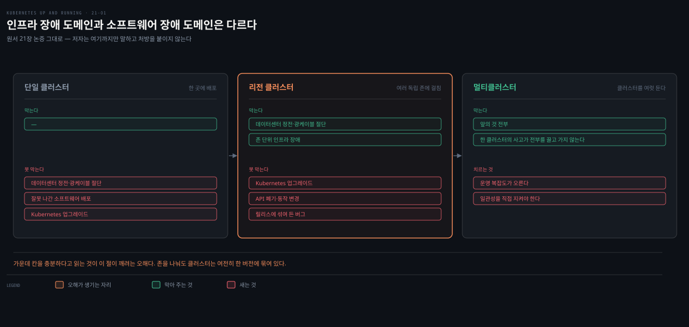
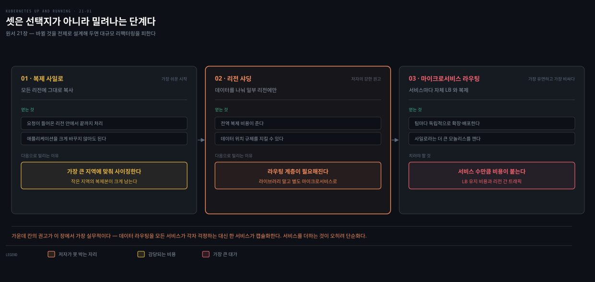

# 21장 · Multicluster — 늘리기 전에 갖출 것과 늘린 뒤 갈리는 세 모델

## 핵심 요약

> 이 장은 **클러스터를 여러 개 굴리는 판단**을 다룹니다. 저자가 던지는 질문이 솔직합니다. 클러스터 하나 운영하기도 복잡한데 왜 그 복잡도를 더 지느냐는 것입니다.

답은 "대부분의 애플리케이션에게 이미 현실"이라는 것입니다. 저자는 이유가 많다고 적으면서 **적어도 하나에는 걸릴 것**이라고 합니다. 그중 셋을 듭니다. **복원력**, **지역 친화성**, **사용자 격리**입니다. 그중 하나가 특히 뒤통수를 칩니다. 리전 클러스터를 쓰면 인프라 장애는 견디지만, **Kubernetes 자체가 단일 장애점으로 남습니다.**

**이 노트는 델타에 섭니다.** 일관성 모델(강한 일관성·최종 일관성·자기가 쓴 것 읽기)은 [DDIA 정독본](../../../05_data/book/designing-data-intensive-applications/06-03.%EB%B3%B5%EC%A0%9C%20%EC%A7%80%EC%97%B0%20%EB%AC%B8%EC%A0%9C%EC%99%80%20%EC%9D%BC%EA%B4%80%EC%84%B1%20%EB%B3%B4%EC%9E%A5.md)이 이 책보다 훨씬 두껍게 갖고 있습니다. 여기서 다시 쓰지 않고 위임합니다.

남기는 것은 **Kubernetes 맥락에서만 나오는 판단**입니다. 리전 클러스터로 왜 부족한가, 클러스터를 늘리기 전에 무엇이 갖춰져 있어야 하는가, 트래픽을 DNS에서 가를 것인가 anycast로 가를 것인가, 그리고 배치 모델 셋이 각각 무엇을 얻고 무엇을 치르는가입니다.

**이 장에는 실습이 없습니다.** 명령도 YAML도 한 줄 나오지 않는 판단 중심 장이라, 이 노트도 실측 대신 판단 기준으로 채웠습니다.

## 학습 목표

> 이 편을 읽고 나면 다음을 할 수 있습니다.

1. 리전 클러스터가 막아 주는 것과 못 막는 것을 구분해 말할 수 있습니다.
2. 클러스터를 늘리기 전에 갖춰야 할 기반 네 가지를 댈 수 있습니다.
3. GeoDNS와 anycast를 장애 대응 관점에서 비교할 수 있습니다.
4. 복제 사일로·리전 샤딩·마이크로서비스 라우팅 중 어디에 설지 고를 수 있습니다.

## 리전 클러스터로도 부족한 이유

> 저자가 논증을 한 겹 더 밀고 들어가는 자리입니다. 여기가 이 장에서 가장 값합니다.

출발점은 단순합니다. 클라우드든 온프레미스든 **데이터센터 하나는 대체로 단일 장애 도메인**입니다. 저자가 드는 예가 구체적입니다. 광케이블을 과녁 삼은 사냥꾼, 얼음 폭풍으로 인한 정전, 그리고 그냥 잘못 나간 소프트웨어 배포입니다. 한 곳에만 배포한 애플리케이션은 통째로 죽을 수 있습니다.

여기까지는 예상 가능합니다. 그래서 클라우드에서는 **리전 클러스터**를 씁니다. 여러 독립 존에 걸쳐 있어서 앞의 인프라 문제에는 견딥니다. 저자도 "그러면 충분해 보이고, 실제로 충분할 수도 있다"고 인정합니다. 그다음 문장이 반전입니다.

**Kubernetes 자체가 단일 장애점이 될 수 있습니다.** 어떤 클러스터든 특정 Kubernetes 버전에 묶여 있고(저자의 예로 1.21.3), **그 클러스터를 업그레이드하다가 애플리케이션이 깨지는 일이 충분히 가능합니다.** Kubernetes는 때때로 API를 폐기하거나 동작을 바꿉니다. 그런 변경은 드물고 커뮤니티가 미리 알리려 애쓰지만, 테스트를 아무리 해도 릴리스에 버그가 섞여 들기도 합니다.

저자의 결론이 확률로 나옵니다. 어느 한 이슈가 내 애플리케이션에 영향을 줄 가능성은 낮지만, **대부분의 애플리케이션 수명(수 년)에 걸쳐 보면 언젠가 영향받을 확률이 높습니다.** 그리고 대부분의 애플리케이션에게 그건 받아들일 만한 위험이 아닙니다.

이 논증이 중요한 이유가 있습니다. 리전 클러스터는 **인프라 장애 도메인**을 나눠 주지만 **소프트웨어 장애 도메인**은 나눠 주지 않습니다.

> 여기서 저자가 멈춘다는 점을 적어 둡니다. 원서는 "그러니 클러스터마다 버전을 다르게 굴려라"고 **권하지 않습니다.** 오히려 다음 절에서 버전 스큐를 피해야 할 것으로 다룹니다. 이 장이 하는 말은 여기까지입니다 — 단일 클러스터는 소프트웨어 수준에서 여전히 한 덩어리다.

### 나머지 두 동인

**지역 친화성**입니다. 게임 서버는 플레이어 가까이 있어야 지연이 줄고 경험이 좋아집니다. 그리고 법·규제가 **데이터를 특정 지리적 범위 안에 두라**고 요구하는 경우가 있습니다. 클러스터는 언제나 어떤 장소에 묶여 있으므로, 지리 요구가 곧 클러스터 여럿을 뜻하게 됩니다.

**사용자 격리**입니다. 한 클러스터 안에서도 격리 수단은 여럿입니다. 네임스페이스, RBAC, 그리고 노드 풀입니다. 노드 풀은 저자가 괄호로 풀어 두었듯 **서로 다른 능력이나 워크로드를 위해 조직한 노드의 모음**입니다. 그래도 클러스터는 여전히 **대체로 하나의 협력 공간**입니다. 다른 팀이 실수로라도 내 애플리케이션에 영향을 줄 위험을 감수하느니 클러스터를 나눠 관리하는 복잡도를 택하는 팀이 있습니다.

## 클러스터를 늘리기 전에 갖출 것

> 저자가 배치 모델보다 **먼저** 놓는 절입니다. 순서 자체가 주장입니다.

논지는 한 줄로 요약됩니다. **부실한 기반은 클러스터 수만큼 곱해집니다.** 저자의 표현으로 인프라의 근본 문제를 고치는 일은 클러스터가 열 개면 **열 배 어렵습니다.** 그리고 여기에 이차 효과가 붙습니다. 클러스터 하나를 더하는 데 큰 수고가 들면, **정작 더해야 할 때 더하기를 꺼리게 됩니다.**

### 자동화가 첫째입니다

가장 중요한 것이 자동화인데, 범위가 둘입니다. 애플리케이션을 배포하는 자동화, 그리고 **클러스터 자체를 만들고 관리하는 자동화**입니다. 후자를 빠뜨리기 쉽습니다.

클러스터가 하나면 정의상 자기 자신과 일관됩니다. 늘리는 순간 **버전 스큐**가 생깁니다. 저자가 예로 드는 것만 이렇습니다.

- Kubernetes 버전
- 모니터링·로깅 에이전트 버전
- 컨테이너 런타임처럼 기본적인 것까지도

저자가 그 결과를 표현하는 방식이 인상적입니다. 인프라의 차이는 시스템을 **"더 이상해지게"** 만듭니다. 한 클러스터에서 얻은 지식이 다른 클러스터로 옮겨 가지 않고, 문제가 특정 장소에서 무작위처럼 보이게 터집니다.

그래서 나오는 지시가 단호합니다. **GUI나 CLI 도구로 클러스터를 만들지 마십시오.** "나는 항상 이렇게 만든다"고 생각하기 쉽습니다. 경험은 그게 사실이 아니라고 가르쳤다는 것이 저자의 답입니다. 모든 변경을 소스 컨트롤과 CI/CD로 밀어 넣는 일은 처음엔 번거롭습니다. 그래도 안정된 기반이 상당한 배당을 돌려줍니다. 저자는 **일관성을 얻는 유일한 길이 자동화**라고까지 적습니다. 코드형 인프라의 값어치는 **다음 장에서 길게 다룬다**고 넘깁니다.

애플리케이션 이전에 들어가는 기반 구성요소도 마찬가지입니다. 모니터링·로깅·보안 스캐너는 어떤 애플리케이션보다 먼저 있어야 하고, Helm 같은 IaC 도구로 관리하며 자동화로 배포해야 합니다.

### 나머지 셋은 "한 곳에서 정의하기"입니다

| 갖출 것 | 왜 | 못 할 때 |
|---|---|---|
| **단일 신원 체계** | 모두가 모든 클러스터에 같은 신원으로 접근 | 인증서 공유 같은 위험한 습관이 생김 |
| **중앙 접근 제어** | RBAC 역할·바인딩을 클러스터 밖 한 곳에 | 한 클러스터에 권한을 남기거나 빼먹음 |
| **중앙 정책 정의** | 정책을 한 곳에 두고 준수 상태를 한 대시보드로 | 클러스터마다 준수 여부를 따로 확인 |

신원은 인증서 기반 인증도 되지만 저자는 **전역 신원 공급자와의 통합**을 강하게 권합니다. Azure Active Directory를 비롯한 OpenID Connect 호환 공급자입니다. 이런 공급자는 **대부분** 2단계 인증 같은 추가 통제도 함께 줍니다.

접근 제어는 사정이 갈립니다. 대부분의 클라우드에서는 클라우드 기반 RBAC을 쓸 수 있어서, 역할과 바인딩이 클러스터가 아니라 중앙에 저장됩니다. 온프레미스는 더 복잡합니다. Azure Arc 같은 해법이 있지만 그런 서비스가 없는 환경이라면, **RBAC을 소스 컨트롤에 정의하고 IaC로 전 클러스터에 적용**하는 것이 차선입니다.

정책도 같은 구조입니다. 한 곳에서 정의하고 한 대시보드에서 보는 것이 목표이고, 온프레미스에서는 선택지가 제한적이라 IaC로 그 간극을 메웁니다.

> 정책을 실제로 어떻게 정의하고 강제하는지는 [20장](./20-01.Policy%20and%20Governance%20%E2%80%94%20Gatekeeper%20%EB%A1%9C%20%EB%A7%8C%EB%93%A4%EA%B8%B0%20%EC%A0%84%EC%97%90%20%EB%A7%89%EA%B3%A0%20%EB%A7%8C%EB%93%A0%20%EB%92%A4%EC%97%90%20%EC%84%B8%EB%8A%94%20%EB%B2%95.md)이 다룹니다. 이 절은 그것을 **어디에 두는가**만 봅니다.

## 사용자는 DNS부터 도착합니다

> 트래픽을 어떻게 가를지가 배치 모델보다 먼저 정해집니다. 장애 때 트래픽을 옮길 수 있느냐가 여기서 갈리기 때문입니다.

접근은 도메인 이름에서 시작합니다. 그러니 멀티클러스터 부하 분산 전략의 출발점은 **DNS 조회**이고, 그 조회가 부하 분산의 첫 선택입니다.

### GeoDNS — 익숙하지만 장애에 약합니다

전통적인 방식에서는 이 DNS 조회로 트래픽을 특정 위치에 보냅니다. **GeoDNS**입니다. 조회가 돌려주는 IP가 클라이언트의 물리적 위치에 묶이고, 대개 가장 가까운 리전 클러스터를 가리킵니다.

저자가 짚는 단점이 둘입니다.

**첫째는 캐싱입니다.** DNS는 인터넷 곳곳에 캐시되고, TTL을 설정할 수는 있지만 **성능을 위해 TTL을 무시하는 곳이 많습니다.** 정상 운영에서는 DNS가 대체로 안정적이라 큰 문제가 아닙니다. 문제는 **트래픽을 옮겨야 할 때**입니다. 데이터센터 장애 때문에 다른 클러스터로 돌려야 하는 급한 상황에서, 캐시된 조회가 **장애 지속 시간과 영향 범위를 상당히 늘립니다.**

**둘째는 오판입니다.** GeoDNS는 클라이언트 IP로 물리적 위치를 **추측**합니다. 서로 다른 지역에 있는 클라이언트들이 **같은 방화벽 IP로 나가면** 자주 헷갈리고 엉뚱한 위치를 고릅니다.

### anycast — IP 하나를 여러 곳에서 광고합니다

대안이 **anycast**입니다. 단일 정적 IP를 인터넷 여러 위치에서 코어 라우팅 프로토콜로 광고합니다. IP 하나가 머신 하나에 대응한다고 생각하기 쉽지만, anycast에서는 그 IP가 가상 IP이고 **네트워크 위치에 따라 다른 곳으로 라우팅**됩니다.

여기서 결정적인 차이가 나옵니다. 트래픽이 **지리적 거리가 아니라 네트워크 성능 기준의 "가장 가까운" 위치**로 갑니다. 저자의 평가는 anycast가 대체로 더 나은 결과를 낸다는 것이고, 단서는 **모든 환경에서 쓸 수 있는 것은 아니라는** 점입니다. 온프레미스라면 GeoDNS가 유일한 선택일 수 있습니다.

### TCP냐 HTTP냐

마지막 고려 사항이 부하 분산이 **어느 계층에서** 일어나는가입니다. 앞의 논의는 TCP 수준이었습니다. 웹 애플리케이션이라면 HTTP 계층에서 가르는 편이 이점이 큽니다.

프로토콜을 아는 부하 분산기는 클라이언트 통신의 세부를 봅니다. 브라우저에 심어 둔 **쿠키를 기준으로 분산 결정**을 내릴 수 있고, TCP 연결의 바이트 흐름이 아니라 **HTTP 요청 하나하나를 보므로** 더 똑똑한 라우팅이 가능합니다.

어느 쪽을 고르든 결과는 같은 모양으로 수렴합니다. 전역 DNS 엔드포인트가 **리전별 IP 모음**으로 매핑되고, 그 IP들은 대개 Kubernetes Service나 Ingress의 IP입니다. 거기 닿은 뒤부터는 애플리케이션 설계가 흐름을 정합니다.

> anycast가 실제 클라우드에서 어떻게 제공되는지는 [networking 06-02](../networking-and-kubernetes/06-02.GCP%C2%B7Azure%EC%99%80%203%EC%82%AC%20%EB%B9%84%EA%B5%90%20%E2%80%94%20%EA%B0%99%EC%9D%80%20%EB%AC%B8%EC%A0%9C%2C%20%EB%8B%A4%EB%A5%B8%20%EA%B8%B0%EB%B3%B8%EA%B0%92.md)에 3사 비교로 정리돼 있습니다.

## 상태가 판을 가릅니다

> 이 절의 개념은 형제 노트가 훨씬 두껍게 갖고 있습니다. 여기서는 **멀티클러스터 맥락에서 왜 먼저 정해야 하는지**만 남깁니다.

부하 분산이 정리되면 다음 관문이 상태입니다. 상태가 없거나 전부 읽기 전용이면 할 일이 거의 없습니다. 클러스터마다 따로 배포하고 위에 부하 분산기를 얹으면 끝입니다. 대부분은 그렇지 않습니다.

저자가 문제를 한 문장으로 압축합니다. **"내가 쓴 것을 내가 읽을 수 있는가?"** 당연히 "예"여야 할 것 같지만 달성이 어렵습니다. 컴퓨터로 주문을 넣고 **곧바로 휴대폰으로 확인**하는 손님을 생각하면 이유가 보입니다. 두 기기가 서로 다른 네트워크를 타고 **완전히 다른 클러스터**에 닿을 수 있습니다.

강한 일관성과 최종 일관성의 거래는 저자가 이렇게 정리합니다. 강한 일관성은 추론하기 쉽지만 **비쌉니다.** 쓰기 시점에 복제를 보장하느라 노력이 훨씬 들고, 복제가 불가능할 때 **쓰기가 더 많이 실패하며**, 동시 트랜잭션 수용량이 훨씬 낮습니다. 최종 일관성은 싸고 쓰기 부하를 훨씬 많이 견디지만 개발자에게 복잡하고 **엣지 조건이 최종 사용자에게 노출**됩니다.

그리고 축이 둘로 끝나지 않습니다. **요청마다 클라이언트가 일관성 수준을 고르게 해 주는** 시스템도 있습니다. 저자가 드는 예가 둘입니다. Azure Cosmos DB는 **제한된 일관성**을 구현해, 최종 일관성 시스템에서 데이터가 얼마나 낡을 수 있는지에 어느 정도 보장을 줍니다. Google Cloud Spanner는 **성능을 얻는 대가로 낡은 읽기를 감수하겠다**고 클라이언트가 선언할 수 있게 합니다.

멀티클러스터 관점에서 진짜 중요한 것은 그다음 단서입니다. **많은 스토리지가 동시성 모델을 하나만 지원합니다.** 여럿을 지원하는 것도 스토리지를 만들 때 지정해야 합니다. 그리고 이 선택은 애플리케이션 설계에 큰 영향을 주며 **바꾸기 어렵습니다.** 그래서 일관성 모델 결정이 멀티 환경 설계의 **첫 단계**여야 한다는 것입니다.

> **저자의 권고**: 복제되는 상태 저장 스토리지를 배포하고 관리하는 일은 **도메인 전문성을 가진 전담 팀**이 필요한 복잡한 작업입니다. 클라우드 기반 스토리지를 쓰라고 강하게 권합니다. 온프레미스라면 그 스토리지에 전문성을 가진 회사에 맡기는 쪽입니다. **자체 팀을 꾸리는 것이 말이 되는 시점은 규모가 아주 커졌을 때뿐**입니다.

일관성 모델 자체의 원리, 자기가 쓴 것 읽기를 어떻게 보장하는지, 선형성이 무엇인지는 DDIA 정독본이 정본입니다. 아래 위임 표가 가리킵니다.

## 배치 모델 셋

> 셋은 나란한 선택지가 아니라 **성장에 따라 밀려나는 단계**에 가깝습니다.

### 복제 사일로 — 가장 단순합니다

애플리케이션을 모든 리전에 그대로 복사합니다. 각 인스턴스가 정확한 복제본이고 어느 클러스터에서 돌든 똑같이 생겼습니다. 위에 부하 분산기가 요청을 뿌리고 상태가 필요한 곳에는 데이터 복제를 구현해 두었으므로, 애플리케이션은 크게 바뀔 필요가 없습니다. 다만 고른 일관성 모델에 따라 **데이터가 리전 사이에서 빨리 복제되지 않는다는 사실을 다뤄야** 합니다. 저자가 리팩터링이 필요 없다고 말하는 것은 **특히 강한 일관성을 골랐을 때**입니다.

각 리전이 자기 사일로입니다. 필요한 데이터가 리전 안에 다 있고, 요청이 그 리전에 들어오면 **그 클러스터의 컨테이너들만으로 끝까지 처리**합니다. 복잡도가 낮은 대신 효율을 치릅니다.

효율이 어떻게 깎이는지가 구체적입니다. 세계 여러 지역에 배포해 지연을 줄이려는 애플리케이션을 생각하면, 어떤 지역은 인구가 많고 어떤 지역은 적습니다. **모든 사일로가 똑같으면 가장 큰 지역에 맞춰 사이징해야 합니다.** 결과적으로 작은 지역의 복제본 대부분이 크게 과잉 프로비저닝되고 비용 효율이 낮아집니다.

작은 지역만 줄이면 되지 않느냐는 반론에 저자가 단서를 붙입니다. **병목이나 다른 요구사항 때문에 항상 되는 것은 아닙니다.** 최소 세 개의 복제본을 유지해야 하는 경우 같은 것입니다.

기존 단일 클러스터 애플리케이션을 멀티로 옮길 때는 이 방식이 가장 쉽습니다. 다만 **초기에는 감당되지만 결국 리팩터링을 요구하는 비용**이 딸려 온다는 것을 알고 시작하라는 것이 저자의 당부입니다.

### 리전 샤딩 — 모든 데이터를 모든 곳에 두지 않습니다

규모가 커지면 사일로의 아픈 곳이 드러납니다. 모든 데이터를 전역 복제하는 일이 점점 비싸지고 낭비가 됩니다. 신뢰성을 위한 복제는 좋지만, **애플리케이션의 모든 데이터가 모든 클러스터에 함께 있어야 할 이유는 없습니다.** 대부분의 사용자는 소수 지역에서만 접근합니다.

여기에 규제가 겹칩니다. 국적이나 다른 조건에 따라 **사용자 데이터를 어디에 저장할 수 있는지에 외부 제약**이 생깁니다. 둘이 합쳐지면 리전 데이터 샤딩을 생각하게 됩니다.

저자의 예가 표로 나옵니다. 여섯 리전 클러스터(A~F)에 데이터를 세 샤드(1·2·3)로 나눕니다.

| 샤드 | A | B | C | D | E | F |
|---|---|---|---|---|---|---|
| 1 | ✓ | | | ✓ | | |
| 2 | | ✓ | | | ✓ | |
| 3 | | | ✓ | | | ✓ |

각 샤드가 두 리전에 있어 중복성은 확보되지만, **각 클러스터는 데이터의 3분의 1만 서빙할 수 있습니다.** 그래서 데이터에 접근할 때마다 **요청이 로컬 샤드로 갈지 리전을 건너갈지 판단하는 라우팅 계층**이 필요해집니다.

여기서 저자가 강하게 권하는 것이 하나 있습니다. 이 데이터 라우팅을 **메인 애플리케이션에 링크되는 클라이언트 라이브러리로 구현하고 싶어지겠지만, 별도 마이크로서비스로 만들라**는 것입니다.

이유가 역설적이라 기억할 만합니다. 마이크로서비스를 하나 더 들이는 것이 복잡도를 더하는 것처럼 보이지만, 실제로는 **단순하게 만드는 추상**을 들이는 것입니다. 모든 서비스가 데이터 라우팅을 각자 걱정하는 대신, **한 서비스가 그 관심사를 캡슐화**하고 나머지는 그냥 데이터 서비스에 접근합니다.

### 마이크로서비스 라우팅 — 사일로를 깨뜨립니다

저자가 사일로를 다시 비판하는데, 각도가 비용이 아니라 **유연성**입니다. 사일로를 만드는 것은 **더 큰 규모에서 모놀리스를 다시 만드는 일**입니다. 컨테이너와 Kubernetes가 깨뜨리려 한 바로 그것입니다. 게다가 애플리케이션 안의 모든 마이크로서비스가 **같은 시점에 같은 수의 리전으로 확장하도록 강제**됩니다.

작고 자족적인 애플리케이션이면 말이 됩니다. 서비스가 커지고 **여러 애플리케이션이 공유하기 시작하면** 문제가 됩니다. 클러스터가 배포 단위이고 CI/CD가 거기 묶여 있으면, **모든 팀이 같은 롤아웃 절차와 일정을 따르도록 강제**됩니다. 그게 안 맞는 팀에게도 그렇습니다.

저자의 예가 선명합니다. 서른 개 클러스터에 배포된 아주 큰 애플리케이션이 있고, 개발 중인 작고 새로운 애플리케이션이 있습니다. 새 팀에게 곧바로 큰 애플리케이션의 규모에 도달하라고 강요하는 것은 말이 안 되는데, **설계가 너무 경직되면 정확히 그런 일이 벌어집니다.**

대안은 애플리케이션 안의 **각 마이크로서비스를 공개 서비스처럼 설계**하는 것입니다. 실제로 공개될 일이 없더라도 **자체 글로벌 부하 분산기**를 갖고 **자체 데이터 복제를 관리**합니다. 서비스끼리는 서로 독립이고, 한 서비스가 다른 서비스를 부르면 외부 부하와 똑같이 분산됩니다. 이 추상이 서면 각 팀이 단일 클러스터에서 하듯 **독립적으로 확장하고 배포**합니다.

대가도 분명합니다. 모든 마이크로서비스에 이걸 다 하면 팀에 상당한 부담이 됩니다. **서비스마다 부하 분산기를 유지하는 비용**과 **리전 간 네트워크 트래픽** 비용도 늘어납니다. 저자의 마무리가 이 장 전체의 태도입니다. 복잡도와 성능 사이의 거래이고, **어디에 서비스 경계를 두고 어디를 사일로로 묶을지는 애플리케이션마다 판단**해야 합니다. 그리고 이 설계는 애플리케이션이 자라면서 바뀔 것이므로, **바뀔 것을 전제로 설계**해 두면 대규모 리팩터링을 피할 수 있습니다.

## 면접에서 받을 만한 질문

> 이 장이 주는 판단만 묻습니다. 일관성 모델의 원리는 DDIA 정독본이 자기 질문을 갖고 있습니다.

1. 리전 클러스터를 쓰는데도 멀티클러스터가 필요한 이유는 무엇인가요?
2. 클러스터를 늘리기 전에 무엇이 갖춰져 있어야 하나요?
3. GeoDNS의 약점은 무엇인가요? 언제 특히 아픈가요?
4. 복제 사일로의 비용은 무엇인가요?
5. 리전 샤딩에서 데이터 라우팅을 클라이언트 라이브러리로 만들면 안 되는 이유는?

### 정답

1. 리전 클러스터는 **인프라 장애 도메인**은 나눠 주지만 **Kubernetes 자체**는 여전히 단일 장애점입니다. 클러스터는 특정 버전에 묶여 있고, 업그레이드가 애플리케이션을 깨뜨릴 수 있습니다. 수 년 단위로 보면 언젠가 겪을 확률이 높습니다.
2. **자동화**가 첫째이고 범위가 애플리케이션 배포와 **클러스터 생성·관리** 둘입니다. 나머지 셋은 한 곳에서 정의하는 것 — **단일 신원 체계**, **중앙 RBAC**, **중앙 정책**입니다. GUI나 CLI로 클러스터를 만들지 않는 것이 그 시작입니다.
3. 둘입니다. **캐싱** — TTL을 무시하는 곳이 많아, 장애 때 트래픽을 옮기려 할 때 장애 시간이 늘어납니다. **오판** — 여러 지역의 클라이언트가 같은 방화벽 IP로 나가면 위치를 틀리게 고릅니다.
4. **과잉 프로비저닝**입니다. 모든 사일로가 똑같으면 가장 큰 지역에 맞춰 사이징해야 하므로, 작은 지역의 복제본이 크게 남습니다. 병목이나 최소 복제본 수 같은 제약 때문에 줄이는 것이 항상 가능하지도 않습니다.
5. 라이브러리로 만들면 **모든 서비스가 각자 데이터 라우팅을 걱정**하게 됩니다. 별도 마이크로서비스로 두면 그 관심사가 **한 곳에 캡슐화**되고 나머지는 데이터 서비스만 부르면 됩니다. 서비스 하나를 더하는 것이 오히려 단순화입니다.

## 이 장을 어디로 위임했는가

> 이 노트가 판단만 다루는 이유입니다.

| 더 알고 싶은 것 | 읽을 곳 |
|---|---|
| 복제 지연과 자기가 쓴 것 읽기 보장 | [DDIA 06-03](../../../05_data/book/designing-data-intensive-applications/06-03.%EB%B3%B5%EC%A0%9C%20%EC%A7%80%EC%97%B0%20%EB%AC%B8%EC%A0%9C%EC%99%80%20%EC%9D%BC%EA%B4%80%EC%84%B1%20%EB%B3%B4%EC%9E%A5.md) |
| 복제 개요와 단일 리더 구조 | [DDIA 06-01](../../../05_data/book/designing-data-intensive-applications/06-01.%EB%B3%B5%EC%A0%9C%20%EA%B0%9C%EC%9A%94%EC%99%80%20%EB%8B%A8%EC%9D%BC%20%EB%A6%AC%EB%8D%94.md) |
| 강한 일관성의 엄밀한 정의(선형성) | [DDIA 10-01](../../../05_data/book/designing-data-intensive-applications/10-01.%EC%84%A0%ED%98%95%EC%84%B1.md) |
| 클라우드 3사의 부하 분산과 anycast 제공 방식 | [networking 06-02](../networking-and-kubernetes/06-02.GCP%C2%B7Azure%EC%99%80%203%EC%82%AC%20%EB%B9%84%EA%B5%90%20%E2%80%94%20%EA%B0%99%EC%9D%80%20%EB%AC%B8%EC%A0%9C%2C%20%EB%8B%A4%EB%A5%B8%20%EA%B8%B0%EB%B3%B8%EA%B0%92.md) |
| GeoDNS 를 포함한 확장 설계 전반 | [system-design — 0부터 수백만 사용자까지 확장](../../../03_architecture/book/system-design/0%EB%B6%80%ED%84%B0%20%EC%88%98%EB%B0%B1%EB%A7%8C%20%EC%82%AC%EC%9A%A9%EC%9E%90%EA%B9%8C%EC%A7%80%20%ED%99%95%EC%9E%A5.md) |
| 정책을 실제로 정의하고 강제하는 법 | [20-01 Policy and Governance](./20-01.Policy%20and%20Governance%20%E2%80%94%20Gatekeeper%20%EB%A1%9C%20%EB%A7%8C%EB%93%A4%EA%B8%B0%20%EC%A0%84%EC%97%90%20%EB%A7%89%EA%B3%A0%20%EB%A7%8C%EB%93%A0%20%EB%92%A4%EC%97%90%20%EC%84%B8%EB%8A%94%20%EB%B2%95.md) |

## 참고 자료

- 원서: 《Kubernetes: Up and Running, 3rd Edition》 Chapter 21. Multicluster Application Deployments (O'Reilly)

## 관련 문서

> 같은 주제를 다른 축에서 다루는 노트입니다.

- [DDIA 정독 인덱스](../../../05_data/book/designing-data-intensive-applications/README.md) — 일관성과 복제의 정본
- [20-01 Policy and Governance](./20-01.Policy%20and%20Governance%20%E2%80%94%20Gatekeeper%20%EB%A1%9C%20%EB%A7%8C%EB%93%A4%EA%B8%B0%20%EC%A0%84%EC%97%90%20%EB%A7%89%EA%B3%A0%20%EB%A7%8C%EB%93%A0%20%EB%92%A4%EC%97%90%20%EC%84%B8%EB%8A%94%20%EB%B2%95.md) — 정책을 한 곳에서 정의하는 수단
- [Kubernetes: Up and Running 정독 인덱스](./README.md) — 이 시리즈의 MOC
