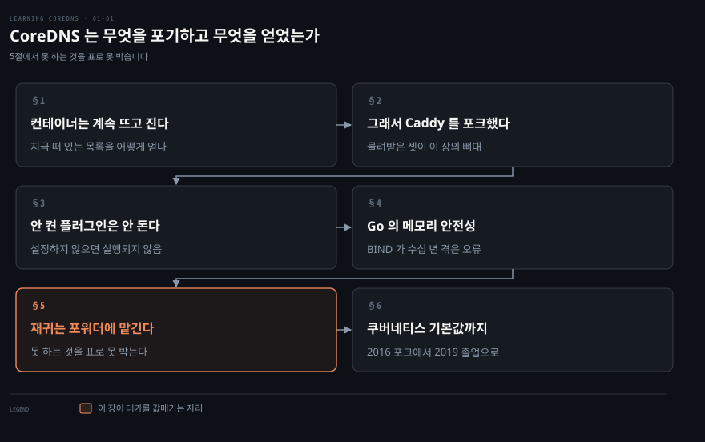
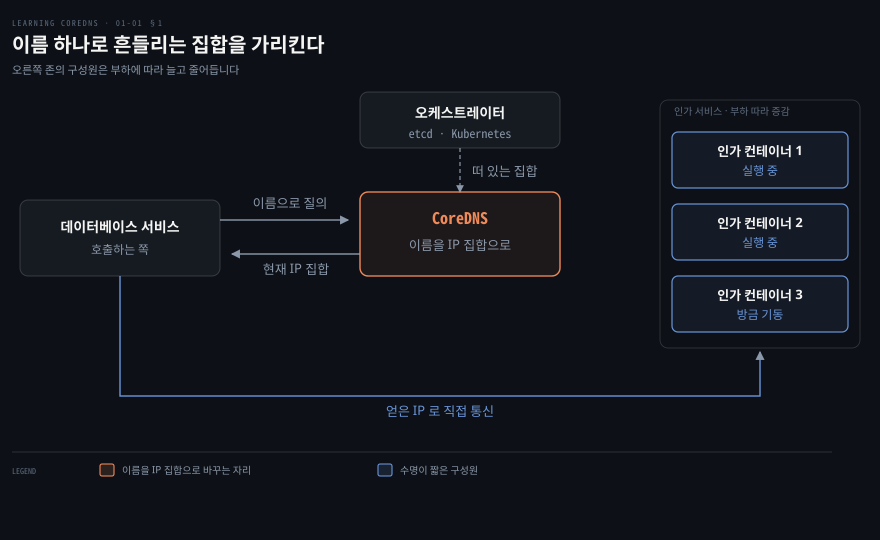
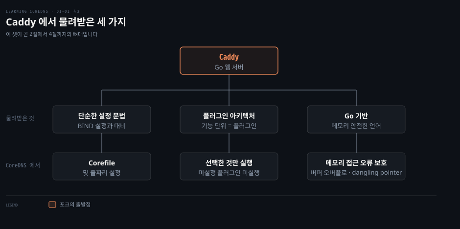
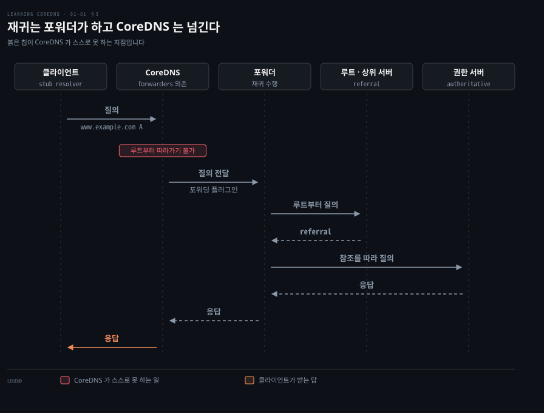
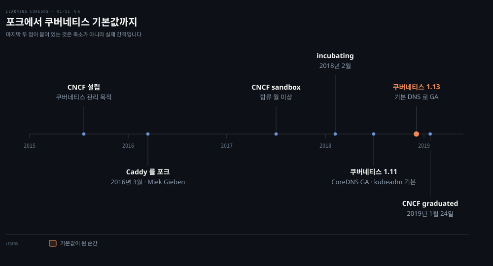

# CoreDNS는 무엇을 포기하고 무엇을 얻었는가

---

> CoreDNS는 전통 DNS 서버의 기능을 다 갖추는 대신 컨테이너 오케스트레이터와 말이 통하는 쪽을 골랐습니다. 원서 1장은 그 교환의 대차대조표입니다.

## 핵심 요약

> 이 장 전체가 매달린 하나의 생각은 **CoreDNS가 DNS 서버를 더 잘 만든 결과가 아니라, 컨테이너 환경의 서비스 디스커버리를 풀려고 기능을 덜어낸 서버**라는 것입니다.

이 노트는 그 덜어냄을 세 걸음으로 다시 세웠습니다. 원서는 서버의 계보부터 열지만, 여기서는 그 서버가 풀려는 문제부터 놓습니다. 컨테이너가 부하에 따라 뜨고 지는 환경에서는 "지금 떠 있는 목록"을 호출자가 미리 들고 있을 수 없습니다. 그다음 Miek Gieben이 Caddy를 포크해 얻은 세 가지가 그 문제에 어떻게 맞아떨어지는지 봅니다. 마지막으로 완전 재귀를 포기했다는 사실을 저자가 BIND와의 대조표로 못 박습니다.

값을 매기면 이렇습니다. 얻은 것은 etcd나 쿠버네티스 같은 오케스트레이터와 직접 통신하는 능력이고, 내준 것은 완전 재귀와 동적 업데이트입니다. 쿠버네티스 1.13이 CoreDNS를 기본 DNS로 삼으면서 이 교환은 사실상 표준이 됐습니다.


## 학습 목표

이 내용을 읽고 나면:

1. CoreDNS가 풀려는 문제가 왜 전통 DNS 서버의 문제와 다른지 설명할 수 있습니다.
2. Caddy에서 물려받은 세 가지가 각각 CoreDNS의 어떤 성질이 되었는지 짝지어 말할 수 있습니다.
3. 플러그인을 설정하지 않는 것이 왜 속도와 보안 양쪽에 걸리는지 근거와 함께 말할 수 있습니다.
4. CoreDNS가 완전 재귀를 못 한다는 말의 뜻을 질의 경로로 그려 설명할 수 있습니다.
5. 표 1-1의 여섯 항목을 근거로 CoreDNS와 BIND 중 무엇을 쓸지 판단할 수 있습니다.

아래는 이 문서 전체를 읽는 순서로 이은 지도입니다. 칸마다 절 번호와 그 절이 답하는 질문 하나를 적었습니다. 색이 붙은 칸이 이 장이 대가를 값매기는 자리입니다.




## 이 문서가 다루지 않는 것

> 1장은 개론이라 이론과 설정이 거의 없습니다. 이미 정리된 노트가 있는 주제는 링크로 넘깁니다.

- DNS 프로토콜 기초와 재귀의 상세 → 원서 2장, 그리고 [02_os OS 네트워크 로드맵 §6 DNS Resolver](../../../02_os/networking/roadmap.md)
- 쿠버네티스 안에서 CoreDNS를 배치하고 설정하는 법 → 원서 6장, 그리고 [DNS와 CoreDNS](../../kubernetes/04_networking/04-05.DNS%EC%99%80%20CoreDNS.md)
- Corefile 문법과 플러그인별 설정 → 원서 3장
- 클러스터 DNS를 패킷과 정책 관점에서 본 것 → [NetworkPolicy와 DNS](../networking-and-kubernetes/04-03.NetworkPolicy%EC%99%80%20DNS%20%E2%80%94%20%ED%81%B4%EB%9F%AC%EC%8A%A4%ED%84%B0%20%EC%95%88%EC%9D%98%20%EB%B0%A9%ED%99%94%EB%B2%BD%EA%B3%BC%20%EC%9D%B4%EB%A6%84.md)
- 질의를 보내는 쪽의 동작, 곧 `resolv.conf`·ndots·search domain → [DNS 필터링 차단](../../../02_os/networking/01-03.DNS%20%ED%95%84%ED%84%B0%EB%A7%81%20%EC%B0%A8%EB%8B%A8%20%E2%80%94%20NXDOMAIN%C2%B7DoH%C2%B7%EC%9A%B0%ED%9A%8C%20%EB%A7%88%EC%B0%B0.md)

남는 것은 **저자가 왜 이런 서버를 만들었다고 말하는가**입니다. 기능 목록이 아니라 기능을 덜어낸 판단과 그 대가가 이 노트의 몫입니다.


## 1. 컨테이너는 계속 뜨고 지는데 상대를 어떻게 찾는가

> 인가 서비스의 컨테이너가 부하에 따라 늘고 줄면 호출자는 지금 떠 있는 것들의 IP를 미리 알 수 없습니다. 저자는 이 물음의 답으로 DNS를 꺼냅니다.



저자는 컨테이너를 아주 가볍고 효율적인 가상머신으로 생각하라고 권합니다. 가상머신이 하이퍼바이저를 통해 하나의 하드웨어를 나눠 쓴다면, 컨테이너는 같은 OS 커널 아래에서 돌면서 가상머신에 준하는 격리를 제공합니다. 크기가 훨씬 작고 기동과 정지가 훨씬 빠릅니다.

이 빠름이 곧 문제를 만듭니다. 마이크로서비스 구조에서는 복잡한 애플리케이션 하나가 작고 명확한 기능 단위 여럿으로 쪼개집니다. 저자가 드는 예는 사용자 인증을 맡는 마이크로서비스와 그 사용자의 인가를 맡는 마이크로서비스입니다. 애플리케이션 전체로 보면 수십에서 수백 개가 네트워크로 서로 이야기합니다.

각 마이크로서비스는 컨테이너 하나 또는 여럿으로 제공됩니다. 기동과 정지가 워낙 빠르니 애플리케이션이나 상위 오케스트레이터가 수요에 맞춰 컨테이너를 동적으로 늘리고 줄입니다. 그래서 저자가 던지는 질문이 이것입니다. 데이터베이스 서비스 컨테이너가 특정 사용자의 검색 허용 여부를 물으려고 인가 서비스를 호출해야 하는데, 인가 컨테이너가 부하에 따라 뜨고 지는 중이라면 실행 중인 인가 컨테이너 목록을 어떻게 얻을까요.

답은 대개 DNS입니다. 컨테이너 사이 통신은 거의 언제나 IP 기반이고, 개발자는 수십 년 동안 자원의 IP 주소를 찾는 데 DNS를 써 왔습니다. 그러니 특정 서비스를 제공하는 컨테이너를 식별하는 데 DNS를 쓰는 것은 자연스러운 선택입니다.

CoreDNS가 빛나는 자리가 바로 여기라고 저자는 못 박습니다. 유연하고 안전한 DNS 서버라는 성질에 더해, 쿠버네티스를 포함한 여러 컨테이너 오케스트레이션 시스템과 직접 통합됩니다. 저자가 아마도 가장 큰 이점일 것이라며 꼽는 것도 etcd나 쿠버네티스 같은 컨테이너 기반 시설과 통신하는 능력입니다.


## 2. 그래서 Caddy를 포크했다

> Miek Gieben은 2016년에 CoreDNS 초판을 썼습니다. 출발점은 다른 DNS 서버가 아니라 Caddy라는 Go 기반 웹 서버였습니다.



DNS 서버의 뿌리가 웹 서버라는 말은 처음 들으면 어색합니다. 이미 DNS 서버를 한 번 만들어 본 사람이 왜 남의 웹 서버를 가져다 고쳤는지가 이 절의 물음입니다.

계보를 짚으면 그 어색함이 풀립니다. Miek Gieben은 CoreDNS 이전에 SkyDNS라는 DNS 서버와 Go DNS라는 Go 언어 DNS 함수 라이브러리를 만들었습니다. SkyDNS의 주 목적도 후속인 CoreDNS와 마찬가지로 서비스 디스커버리 지원이었습니다. 그런데 그는 Caddy라는 Go 기반 웹 서버의 아키텍처를 높이 샀고, DNS 서버를 처음부터 새로 짜는 대신 Caddy를 포크했습니다.

포크로 물려받은 것은 셋입니다. 단순한 설정 문법, 강력한 플러그인 기반 아키텍처, 그리고 Go라는 토대입니다. 이 셋이 이어지는 세 절의 뼈대입니다.

첫째인 설정 문법부터 봅니다. CoreDNS의 설정 파일은 Corefile이라 부릅니다. BIND 설정 파일 문법과 견주면 Corefile은 개운할 만큼 단순합니다. 기본적인 CoreDNS 서버의 Corefile은 대개 몇 줄이면 끝나고, 상대적으로 말해 읽기 쉽습니다.

나머지 둘은 각각 3절과 4절이 맡습니다. 플러그인 아키텍처는 "켠 것만 돈다"는 성질로, Go 기반은 "메모리 접근 오류가 없다"는 성질로 이어집니다.


## 3. 안 켠 플러그인은 코드가 돌지 않는다

> CoreDNS는 DNS 기능을 플러그인으로 제공합니다. 필요 없는 플러그인은 설정하지 않고, 설정하지 않으면 그 코드는 실행되지 않습니다.

저자가 드는 플러그인은 넷입니다.

- **캐싱용**: 응답을 캐시합니다.
- **포워딩용**: 질의를 다른 서버로 넘깁니다.
- **주 서버 설정용**: 파일에서 존 데이터를 읽습니다.
- **보조 서버 설정용**: 보조 DNS 서버를 구성합니다.

플러그인마다 설정이 간단한 것도 이점입니다. 다만 저자가 더 무게를 싣는 곳은 그다음 문장입니다. 필요 없는 플러그인은 설정하지 않습니다. 설정하지 않은 플러그인의 코드는 실행되지 않습니다. 그래서 CoreDNS가 더 빠르고 더 안전해집니다.

이 한 문장이 두 가지를 동시에 말합니다. 실행되지 않는 코드는 CPU를 쓰지 않으니 속도가 붙습니다. 실행되지 않는 코드는 공격 표면이 되지 않으니 안전해집니다. 기능을 켜는 만큼만 위험을 지는 구조입니다.

플러그인을 만드는 일도 꽤 쉽다고 저자는 적습니다. 이것이 중요한 이유는 둘입니다. 하나는 CoreDNS의 기능을 넓히고 싶을 때 직접 플러그인을 쓸 수 있다는 것이고, 그 방법은 원서 9장이 다룹니다. 다른 하나는 새 플러그인을 쓰는 일이 대단한 기술이 아니어서 이미 많이 만들어졌고 지금도 계속 만들어지고 있다는 사실입니다. 필요한 기능을 이미 누군가 만들어 뒀을 수 있습니다.


## 4. Go의 메모리 안전성이 DNS 서버에서 갖는 무게

> Go는 메모리 안전한 언어라 버퍼 오버플로나 dangling pointer 같은 메모리 접근 오류로부터 보호됩니다. 인터넷에 열린 DNS 서버에서 이 성질은 특히 무겁습니다.

저자가 이 대목에 힘을 주는 이유는 위협의 성격에 있습니다. DNS 서버는 인터넷에 있는 누구나 접근할 수 있는 서비스입니다. 악의를 가진 쪽이 버퍼 오버플로를 악용하면 DNS 서버를 죽이거나, 더 나아가 그 밑의 운영체제를 장악할 수도 있습니다.

이것이 가상의 걱정이 아니라는 근거로 저자는 BIND를 듭니다. 수십 년의 역사 동안 BIND에서 나온 심각한 취약점 가운데 상당수가 메모리 접근 오류에서 비롯됐습니다. CoreDNS를 쓰면 그 부류를 걱정하지 않아도 된다는 것이 저자의 결론입니다.

읽을 때 범위를 넓히지 않는 편이 낫습니다. 저자가 지운다고 말한 것은 메모리 접근 오류라는 한 부류이지 취약점 전체가 아닙니다. 설정 실수나 논리 결함은 언어가 막아 주지 않습니다.


## 5. CoreDNS가 못 하는 것

> 집필 시점 최신 버전 기준으로 CoreDNS는 완전 재귀를 지원하지 않습니다. 루트부터 참조를 따라 내려가는 일은 포워더라 불리는 다른 DNS 서버에 맡깁니다.



완전 재귀는 세 걸음으로 이뤄집니다. DNS 이름 공간의 루트에서 시작해 루트 DNS 서버에 질의합니다. 돌아온 참조를 따라 다음 서버로 내려갑니다. 권한 있는 DNS 서버 가운데 하나가 답을 줄 때까지 그 내려감을 반복합니다. CoreDNS는 이 일을 스스로 하지 못합니다. 대신 그 일을 대신해 줄 다른 DNS 서버에 의존하며 이 서버를 보통 포워더라 부릅니다. 재귀와 포워더의 자세한 이야기는 원서 2장이 맡습니다.

CoreDNS가 자기 몫으로 남기는 것은 질의를 받고 넘기고 되돌려 주는 일입니다. 도식에서 붉은 칩이 붙은 지점이 CoreDNS가 스스로 밟지 못하는 구간입니다.

> **노트의 읽기**: 이 한계가 클러스터 안에서 잘 드러나지 않는 이유는 클러스터 이름을 CoreDNS가 직접 답하고 바깥 이름만 포워더로 나가기 때문입니다. 원서 1장은 여기까지 말하지 않으며, 실제 배치에서 그 경계가 어디인지는 [DNS와 CoreDNS](../../kubernetes/04_networking/04-05.DNS%EC%99%80%20CoreDNS.md)가 다룹니다.

저자는 아직 판단이 서지 않는 독자를 위해 CoreDNS와 BIND의 기능 차이를 표로 정리합니다.

| 기능 | CoreDNS | BIND |
|------|---------|------|
| 완전 재귀 | 없음 | 있음 |
| 동적 업데이트 | 없음 | 있음 |
| 쿠버네티스 연동 | 있음 | 없음 |
| Amazon Route 53 연동 | 있음 | 없음 |
| DNSSEC 지원 | 제한적 | 완전 |
| DNS over TLS(DoT) 지원 | 있음 | 없음 |

표를 위아래로 갈라 읽으면 성격이 드러납니다. 앞의 두 줄은 전통 DNS 서버가 오래 갖춰 온 기능이고 CoreDNS는 둘 다 갖고 있지 않습니다. 뒤의 네 줄은 컨테이너와 클라우드 쪽 기능이며 여기서는 방향이 뒤집힙니다. 이 표가 곧 이 장이 값매기는 교환입니다.

낯선 용어가 있어도 걱정하지 말라고 저자는 덧붙입니다. 이후 장에서 모두 다룬다는 예고입니다.


## 6. 쿠버네티스 기본값이 되기까지

> CoreDNS는 2017년 CNCF에 제출돼 2019년 1월에 졸업했고, 그 직전인 2018년 12월에 쿠버네티스 1.13이 CoreDNS를 기본 DNS 서버로 삼았습니다.



CoreDNS를 쓰기로 정했다 해도 한 가지가 남습니다. 클러스터의 이름 해석을 통째로 맡겨도 되는지를 무엇을 보고 판단할까요? 저자가 그 물음에 내미는 답은 성능 수치가 아니라 소속과 기본값입니다.

쿠버네티스는 원래 구글에서 만들어졌고 2015년에 오픈소스 프로젝트로 전환됐습니다. 새로 공개된 쿠버네티스를 관리하려고 구글은 리눅스 재단과 손잡고 클라우드 네이티브 컴퓨팅 재단, 줄여서 CNCF를 세웠습니다.

> **원문 정오**: 오픈소스 전환 연도는 2015년이 아니라 2014년입니다. 쿠버네티스 공식문서는 "Google open sourced the Kubernetes project in 2014"라고 적습니다.[^k8sopen] CNCF 설립이 2015년이라 저자가 두 시점을 하나로 붙인 것으로 보입니다. 이 노트의 연표 도식은 2015년 칸에 CNCF 설립만 두어 잘못된 날짜를 그리지 않았습니다.

CNCF는 클라우드 기반 애플리케이션을 짓는 데 중요한 여러 기술의 집이 됐습니다. 메트릭 수집과 알림을 맡는 프로메테우스, 서비스 프록시인 Envoy가 그런 예입니다. CNCF가 관리하는 프로젝트는 성숙도 단계를 밟습니다. 초기 단계 프로젝트를 위한 sandbox, 수용이 늘고 있는 프로젝트를 위한 incubating, 넓게 채택할 만큼 성숙한 프로젝트를 위한 graduated 순서입니다.

CoreDNS는 2017년에 CNCF에 제출됐고 2019년 1월에 graduated로 올라섰습니다. 쿠버네티스 환경에서 CoreDNS가 얼마나 결정적인지 보여 주는 증거로 저자가 드는 것은 기본값 채택입니다. CoreDNS는 2018년 12월에 릴리스된 쿠버네티스 1.13부터 쿠버네티스에 실려 나오는 기본 DNS 서버가 됐습니다. 거의 모든 새 쿠버네티스 설치와 함께 CoreDNS가 깔리게 된 지금, 저자는 설치 기반이 폭발하리라 내다봅니다.

연표에서 눈여겨볼 것은 마지막 두 점의 간격입니다. 쿠버네티스 1.13 릴리스와 CNCF 졸업 발표 사이는 52일입니다. 도식의 그 좁은 간격은 축소한 것이 아니라 실제 간격입니다.


## 심화 학습

> 원서는 2019년에 나왔습니다. 표 1-1의 여섯 줄 가운데 지금도 그대로인 것과 범위가 달라진 것을 공식 자료로 확인했습니다.

- **완전 재귀는 지금도 없습니다.** CoreDNS 공식 플러그인 목록에 루트부터 시작하는 재귀 해석기는 없고, `forward` 플러그인은 상류 리졸버로 DNS 메시지를 프록시한다고만 적혀 있습니다.[^plugins] 여섯 해가 지나도 이 지적은 유효합니다.
- **암호화 전송은 넓어졌습니다.** 표는 DoT만 적었지만 지금은 `https`(DoH)와 `https3`(DoH3), `quic` 플러그인이 함께 있습니다.[^plugins] 그 줄은 방향이 맞고 범위만 좁게 적힌 셈입니다.
- **DNSSEC이 제한적인 이유도 그대로입니다.** `dnssec` 플러그인은 서빙하는 데이터에 즉석 서명을 붙이는 기능이지 검증기가 아닙니다.[^plugins]
- **CNCF 단계 날짜는 공식 발표가 더 자세합니다.** 프로젝트 생성이 2016년 3월, sandbox 합류가 2017년, incubating 승격이 2018년 2월, 졸업이 2019년 1월 24일입니다.[^cncf] 발표문은 sandbox 합류에 월을 적지 않았으므로 여기서도 연도까지만 적습니다. 원서는 양 끝만 적었습니다.
- **쿠버네티스 1.13 발표문은 CoreDNS를 GA로 졸업한 기능으로 못 박습니다.** "CoreDNS as the default DNS"가 그 문장입니다.[^k8s113]

원서가 든 예 가운데 Envoy와 프로메테우스가 CNCF에 있다는 서술은 이 장의 논지와 별개로 읽어도 됩니다. 저자가 그것을 든 이유는 CNCF가 어떤 성격의 집인지 보이기 위해서입니다.


## 결정 치트시트

> 1장만으로도 가를 수 있는 판단을 모았습니다. 근거는 표 1-1과 본문이며, DNSSEC 행만 심화 학습의 플러그인 문서를 함께 씁니다.

| 상황 | 선택 | 이유 |
|------|------|------|
| 쿠버네티스 클러스터 안에서 서비스 이름을 풀어야 한다 | CoreDNS | 오케스트레이터와 직접 연동되고 1.13부터 기본값 |
| 인터넷 이름을 스스로 끝까지 해석해야 한다 | CoreDNS 단독으로는 안 됨 | 완전 재귀 미지원, 포워더를 따로 둬야 함 |
| 동적 업데이트로 존 데이터를 갱신해야 한다 | BIND 쪽 | 표 1-1의 동적 업데이트가 없음 |
| DNSSEC 검증까지 필요하다 | CoreDNS 단독으로는 부족 | 지원이 제한적이고 즉석 서명 중심 |
| 설정을 짧게 유지하고 필요한 기능만 켜고 싶다 | CoreDNS | 안 켠 플러그인은 코드가 실행되지 않음 |
| 인터넷에 직접 열리는 권한 서버를 세운다 | CoreDNS가 유리 | 메모리 접근 오류 부류를 언어가 막아 줌 |


## 적용 관점

> 이 장은 개론이라 지금 바꿀 것이 많지 않습니다. 하나만 고른다면 내가 쓰는 클러스터의 DNS를 눈으로 확인하는 일입니다.

**한 가지 실행**: 다음에 클러스터를 열 때 `kube-system` 네임스페이스에서 DNS를 맡은 워크로드가 무엇인지 확인하고, 그것이 읽는 Corefile을 열어 몇 줄인지 세어 봅니다. 저자가 "대개 몇 줄이면 끝난다"고 적은 주장을 내 손으로 검증하는 것이 이 장을 착지시키는 가장 짧은 방법입니다.

```bash
kubectl -n kube-system get deploy
kubectl -n kube-system get configmap -o name
```

Spring 애플리케이션 쪽에서 보면 이 장은 이름 해석의 서버 편을 설명합니다. 클러스터 안의 Spring 앱이 다른 서비스를 호출할 때 그 이름을 IP로 바꾸는 주체가 CoreDNS입니다. 이 장은 그 주체가 왜 정적 목록이 아니라 오케스트레이터와 붙어 있는 서버인지를 말합니다. 반대편인 클라이언트 동작, 곧 `resolv.conf`와 ndots와 JVM DNS 캐시는 [02_os OS 네트워크 로드맵 §6](../../../02_os/networking/roadmap.md)이 맡습니다.


## 면접에서 받을 만한 질문

> 자답한 뒤 아래 정답과 맞춰 봅니다.

1. CoreDNS를 한 줄로 정의해 보십시오.
2. CoreDNS는 왜 처음부터 새로 짜지 않고 웹 서버를 포크해 만들어졌습니까.
3. "플러그인을 설정하지 않으면 더 안전하다"는 말은 무슨 뜻입니까.
4. CoreDNS가 완전 재귀를 지원하지 않는다는 것은 실무에서 무엇을 뜻합니까.
5. 컨테이너 환경에서 서비스 디스커버리에 DNS를 쓰는 이유는 무엇입니까.
6. CoreDNS와 BIND 중 하나를 골라야 한다면 어떤 기준으로 가르겠습니까.


## 정답 (자답 후 펼치기)

### 정답 1 — 한 줄 정의

CoreDNS는 컨테이너 환경, 특히 쿠버네티스가 관리하는 환경에서 서비스 디스커버리 기능을 받치는 데 흔히 쓰이는 DNS 서버 소프트웨어입니다.

### 정답 2 — 포크의 이유

Miek Gieben이 Caddy라는 Go 기반 웹 서버의 아키텍처를 높이 샀기 때문입니다. 포크 덕분에 CoreDNS는 단순한 설정 문법과 플러그인 기반 아키텍처, Go라는 토대를 한꺼번에 물려받았습니다.

### 정답 3 — 설정하지 않은 플러그인

CoreDNS는 필요 없는 플러그인을 설정하지 않고, 설정하지 않은 플러그인의 코드는 실행되지 않습니다. 실행되지 않는 코드는 CPU도 쓰지 않고 공격 표면도 되지 않으므로 속도와 보안이 함께 좋아집니다.

### 정답 4 — 완전 재귀 미지원

루트 DNS 서버부터 시작해 권한 서버에 닿을 때까지 참조를 따라가는 일을 CoreDNS가 스스로 하지 못한다는 뜻입니다. 그래서 그 일을 대신할 포워더를 따로 두어야 하며, 클러스터 바깥 이름은 결국 포워더를 거쳐 해석됩니다.

### 정답 5 — 왜 DNS인가

컨테이너 사이 통신이 거의 언제나 IP 기반이고, 개발자가 수십 년 동안 자원의 IP를 찾는 데 DNS를 써 왔기 때문입니다. 이미 있는 관행 위에 올리는 편이 새 메커니즘을 만드는 것보다 자연스럽습니다.

### 정답 6 — 가르는 기준

무엇을 못 해도 되는지로 가릅니다. 완전 재귀와 동적 업데이트가 필요하면 BIND 쪽이고, 쿠버네티스나 Route 53 연동과 DoT가 필요하면 CoreDNS입니다. 표 1-1의 여섯 줄이 그 기준을 그대로 보여 줍니다.


## 핵심 개념 체크리스트

- [ ] CoreDNS가 무엇이고 어떤 환경을 겨냥해 만들어졌는지 한 문장으로 말할 수 있는가?
- [ ] Caddy에서 물려받은 세 가지를 각각의 결과와 짝지어 댈 수 있는가?
- [ ] 플러그인을 켜지 않는 것이 왜 보안 이점인지 설명할 수 있는가?
- [ ] 완전 재귀의 정의를 루트와 참조와 권한 서버라는 말로 설명할 수 있는가?
- [ ] 표 1-1의 여섯 항목을 앞의 둘과 뒤의 넷으로 갈라 그 성격 차이를 말할 수 있는가?
- [ ] CoreDNS가 쿠버네티스 기본값이 된 시점과 CNCF 졸업 시점을 댈 수 있는가?


## 관련 문서

- [Learning CoreDNS 정독 인덱스](./README.md) — 이 책의 장별 진행 상황
- [DNS와 CoreDNS](../../kubernetes/04_networking/04-05.DNS%EC%99%80%20CoreDNS.md) — 쿠버네티스 공식문서 기준 운영 관점 SSOT
- [NetworkPolicy와 DNS](../networking-and-kubernetes/04-03.NetworkPolicy%EC%99%80%20DNS%20%E2%80%94%20%ED%81%B4%EB%9F%AC%EC%8A%A4%ED%84%B0%20%EC%95%88%EC%9D%98%20%EB%B0%A9%ED%99%94%EB%B2%BD%EA%B3%BC%20%EC%9D%B4%EB%A6%84.md) — 같은 주제를 패킷과 정책 관점에서
- [DNS 필터링 차단](../../../02_os/networking/01-03.DNS%20%ED%95%84%ED%84%B0%EB%A7%81%20%EC%B0%A8%EB%8B%A8%20%E2%80%94%20NXDOMAIN%C2%B7DoH%C2%B7%EC%9A%B0%ED%9A%8C%20%EB%A7%88%EC%B0%B0.md) — 질의를 보내는 쪽에서 본 DNS
- [OS 네트워크 딥다이브 로드맵](../../../02_os/networking/roadmap.md) — resolver 클라이언트 측 범위의 SSOT


## 참고 자료

- 원서: 《Learning CoreDNS: Configuring DNS for Cloud Native Environments》 1장 Introduction
- 서지: John Belamaric·Cricket Liu, O'Reilly, 2019년, ISBN 978-1492047964 (출간 월은 판매처마다 9월·11월로 갈려 연도까지만 적습니다)
- [CoreDNS 플러그인 목록](https://coredns.io/plugins/) — 현재 제공되는 플러그인의 1차 자료
- [Kubernetes 1.13 릴리스 발표](https://kubernetes.io/blog/2018/12/03/kubernetes-1-13-release-announcement/) — CoreDNS 기본값 승격
- [CNCF CoreDNS 졸업 발표](https://www.cncf.io/announcements/2019/01/24/coredns-graduation/) — 성숙도 단계별 날짜

[^plugins]: CoreDNS 공식 플러그인 목록 — `forward`는 상류 리졸버 프록시, `dnssec`은 즉석 서명, `https`·`https3`·`quic`은 암호화 전송 서버 옵션. <https://coredns.io/plugins/> (2026-09-02 조회)

[^cncf]: CNCF, "CoreDNS Graduates" — "The project was created in March 2016 by Miek Gieben", "CoreDNS later joined the Cloud Native Sandbox in 2017", "became an Incubating project in February 2018". 본문 dateline 이 "January 24, 2018"로 적혀 있으나 URL 과 "first project of 2019 to graduate" 서술로 보아 2019년이 맞습니다. <https://www.cncf.io/announcements/2019/01/24/coredns-graduation/> (2026-09-02 조회)

[^k8sopen]: Kubernetes 공식문서 Overview — "Google open sourced the Kubernetes project in 2014." <https://kubernetes.io/docs/concepts/overview/> (2026-09-02 조회)

[^k8s113]: Kubernetes 1.13 릴리스 발표 — "Notable features graduating in this release include: simplified cluster management with kubeadm, Container Storage Interface (CSI), and CoreDNS as the default DNS." <https://kubernetes.io/blog/2018/12/03/kubernetes-1-13-release-announcement/> (2026-09-02 조회)
