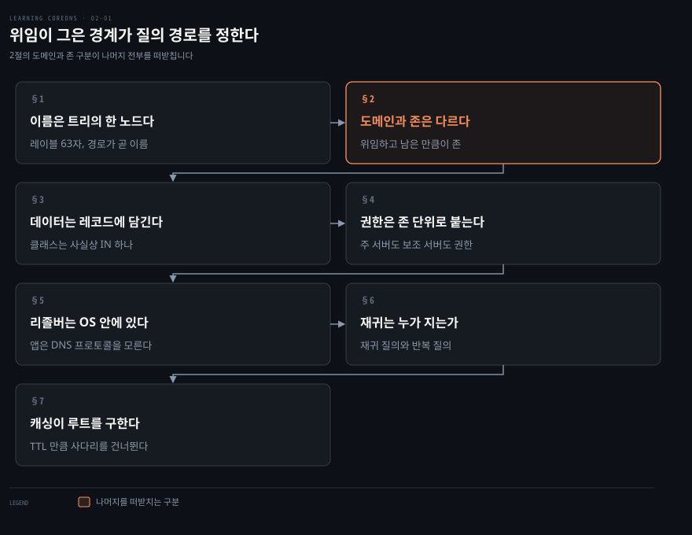
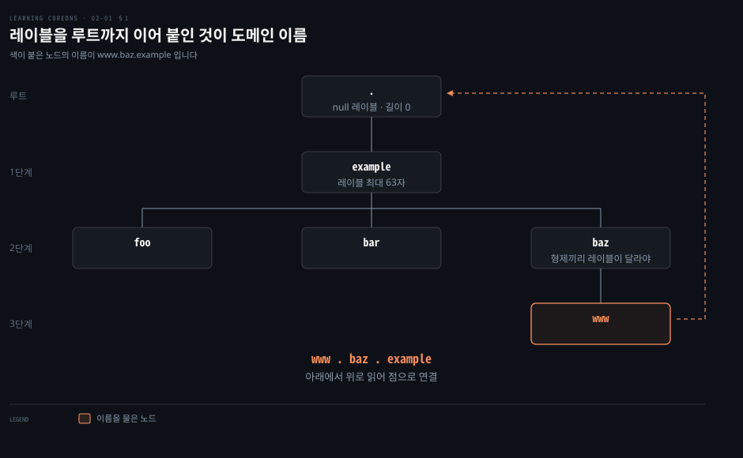
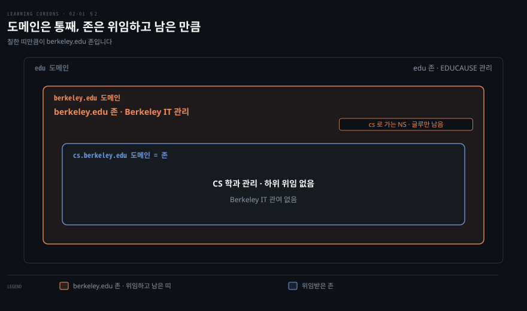
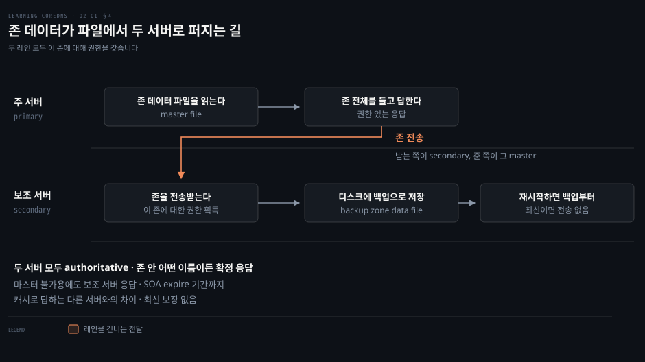
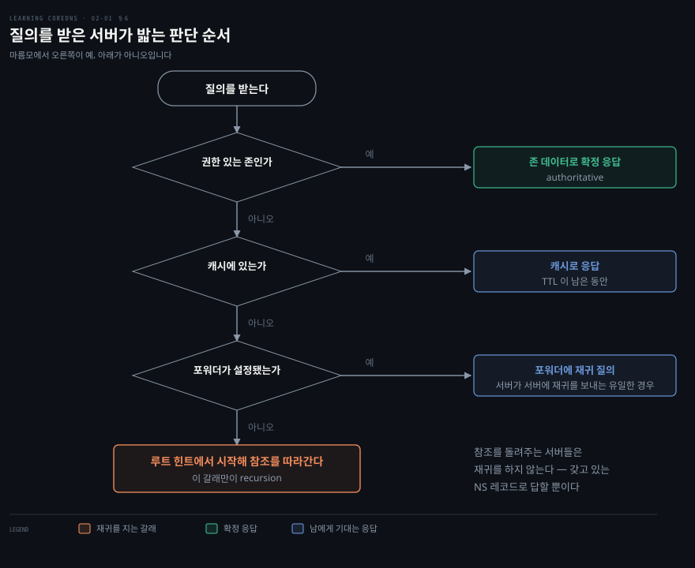
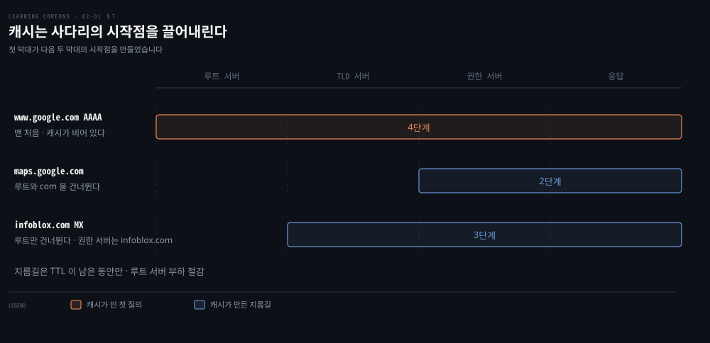

# 위임이 그은 경계가 질의 경로를 정한다

---

> DNS 이론에서 가장 자주 뭉개지는 것이 도메인과 존의 차이인데, 이 하나가 권한이 어디까지인지와 질의가 어디로 흐르는지를 동시에 정합니다.

## 핵심 요약

> 이 절 전체가 매달린 하나의 생각은 **위임이 그은 경계가 곧 권한의 경계이자 질의가 갈아타는 지점**이라는 것입니다.

저자는 최소한의 DNS 이론만 주겠다고 선언하고 시작합니다. 그 최소한이 무엇인지 보면 순서가 드러납니다. 먼저 이름이 트리의 어디에 있는지를 세웁니다. 그다음 그 트리를 조직끼리 나눠 갖는 방법인 위임을 놓습니다. 마지막으로 나눠 가진 조각인 존에 권한과 데이터를 붙입니다.

그러고 나면 질의 경로가 저절로 따라옵니다. 어떤 서버도 트리 전체를 갖고 있지 않으므로, 답을 찾는 일은 경계를 만날 때마다 다음 서버를 가리키는 참조를 받아 옮겨 타는 일이 됩니다. 캐싱은 그 갈아타기를 몇 정거장 건너뛰게 해 주는 장치입니다.


## 학습 목표

이 내용을 읽고 나면:

1. 도메인 이름이 왜 오른쪽 끝에서부터 읽히는지 트리 구조로 설명할 수 있습니다.
2. 도메인과 존의 차이를 위임이라는 한 단어로 갈라 말할 수 있습니다.
3. 주 서버와 보조 서버가 각각 존 데이터를 어디서 얻는지, 그럼에도 왜 둘 다 권한을 갖는지 설명할 수 있습니다.
4. 재귀 질의와 반복 질의를 구분하고, 재귀의 부담을 누가 지는지 말할 수 있습니다.
5. 캐싱이 해석 경로의 어느 구간을 줄이는지 예를 들어 설명할 수 있습니다.

아래는 이 문서 전체를 읽는 순서로 이은 지도입니다. 앞의 세 절이 재료입니다. 가운데 두 절이 그 재료를 들고 있는 주체이고, 마지막 두 절이 실제 질의가 흐르는 경로입니다.




## 이 문서가 다루지 않는 것

> 2장 후반부인 레코드 타입 사전과 존 파일 읽기는 다음 편이 맡습니다. 이미 정리된 노트가 있는 주제는 링크로 넘깁니다.

- A·AAAA·CNAME·MX·NS·SRV·PTR·SOA 각각의 필드와 의미 → 원서 2장 후반부, 다음 편 `02-02`
- 존 데이터 파일의 문법과 주석 달린 예제 → 원서 2장 후반부
- 참조를 따라가는 질의의 실제 왕복 순서 → [CoreDNS는 무엇을 포기하고 무엇을 얻었는가](./01-01.CoreDNS%EB%8A%94%20%EB%AC%B4%EC%97%87%EC%9D%84%20%ED%8F%AC%EA%B8%B0%ED%95%98%EA%B3%A0%20%EB%AC%B4%EC%97%87%EC%9D%84%20%EC%96%BB%EC%97%88%EB%8A%94%EA%B0%80.md) §5의 시퀀스 도식
- 질의를 보내는 쪽의 설정, 곧 `resolv.conf`·ndots·search domain → [OS 네트워크 로드맵 §6](../../../02_os/networking/roadmap.md)

남는 것은 **이름과 경계와 권한이라는 뼈대**입니다. 뒤에 나오는 Corefile 문법과 쿠버네티스 연동이 전부 이 뼈대 위에 얹히므로, 여기서 흐릿하게 넘어가면 나중에 되돌아와야 합니다.


## 1. 이름은 트리의 한 노드다

> 레이블 하나는 형제와만 구분됩니다. 이름공간 전체에서 한 노드를 가리키려면 루트까지의 레이블을 점으로 이어 붙여야 합니다.



`www.baz.example` 이라는 이름을 처음 보면 왼쪽부터 읽게 됩니다. DNS 는 이 이름을 오른쪽 끝에서부터, 그러니까 루트에서부터 읽습니다. 왜 그런지는 이름이 어디서 나오는지를 봐야 풀립니다.

저자는 DNS 를 이름을 다른 데이터에 대응시키는 이름 체계로 정의합니다. 대응 대상은 IP 주소와 메일 라우팅 정보를 비롯해 여럿입니다. 그냥 이름 체계가 아니라 인터넷의 표준 이름 체계이고, 세계에서 가장 큰 분산 데이터베이스 가운데 하나입니다.

이 분산 데이터베이스로 들어가는 색인이 도메인 이름입니다. 이메일 주소에서는 `@` 오른쪽에, URL 에서는 `://` 다음부터 그다음 `/` 앞까지가 도메인 이름입니다. 저자가 드는 예는 `cricket@foo.example` 의 `foo.example` 과 `http://www.bar.example/` 의 `www.bar.example` 입니다.

도메인 이름은 이름공간의 노드를 가리킵니다. 이름공간은 루트 노드를 맨 위에 둔 뒤집힌 트리입니다. 각 노드는 자식을 얼마든지 가질 수 있습니다. 노드마다 최대 63자의 ASCII 레이블을 갖고, 루트 노드만 길이가 0인 null 레이블을 갖습니다. 그 밖의 제약은 많지 않습니다. 한 노드의 자식들은 서로 다른 레이블을 가져야 한다는 정도입니다. 저자는 이것을 자기 아이들에게 서로 다른 이름을 지어 주는 일에 견줍니다.

여기서 앞의 물음이 풀립니다. 레이블은 그 노드를 형제와 구분할 뿐이므로, 이름공간 전체에서 노드 하나를 특정하려면 다른 식별자가 필요합니다. 그 식별자가 도메인 이름이고, 노드에서 루트까지 올라가는 경로 위의 레이블을 점으로 이어 붙인 것입니다. 오른쪽 끝이 루트에 가까운 쪽인 이유가 이것입니다.

한때 트리의 잎은 개별 호스트를 뜻했지만 지금은 점점 덜 그렇습니다. 도메인 이름이 가리킬 수 있는 것을 저자는 넷으로 듭니다.

- **웹사이트**: `www.google.com` 처럼 여러 호스트가 함께 서비스할 수 있습니다.
- **메일 목적지**: `gmail.com` 역시 여러 호스트가 받을 수 있습니다.
- **호스트 하나에 묶이지 않는 자원**: FTP 서비스 같은 것입니다.
- **이들의 조합**: `infoblox.com` 은 웹사이트이자 메일 목적지이며 그 밖의 것이기도 합니다.


## 2. 도메인과 존은 다르다

> 도메인은 특정 노드 아래의 서브트리 전체이고, 존은 그 도메인에서 남에게 위임해 준 서브도메인을 뺀 나머지입니다.



이 둘을 섞어 쓰면 나중에 존 데이터 파일을 열었을 때 왜 하위 이름이 거기 없는지 설명하지 못합니다. 용어 두 개를 외우는 문제가 아니라 관리 책임이 어디서 끊기는지의 문제입니다.

도메인은 이름공간의 특정 서브트리에 속한 노드들의 묶음입니다. 그 꼭대기 노드가 도메인을 식별하고, 도메인 이름도 같습니다. 그래서 `foo.example` 이라고 쓸 때는 노드를 말하는지 도메인을 말하는지 문맥을 밝혀야 한다고 저자는 짚습니다.

도메인은 보통 특정 조직이 관리합니다. 구글이 `google.com` 을, Infoblox 가 `infoblox.com` 을, UC 버클리가 `berkeley.edu` 를 관리하는 식입니다. 관리한다는 말은 자기 도메인 안에 새 노드를 만들고 거기에 데이터를 붙일 수 있다는 뜻입니다.

때로는 그 일부를 다른 조직에 맡기고 싶어집니다. 저자가 드는 예에서 버클리의 IT 부서는 컴퓨터과학과가 `berkeley.edu` 의 일부를 스스로 운영할 만하다고 판단합니다. 중앙을 거쳐 변경을 요청하게 하는 번거로움을 없애려는 것입니다. 이때 IT 부서는 `berkeley.edu` 의 서브도메인인 `cs.berkeley.edu` 를 만들어 컴퓨터과학과에 **위임**합니다.

위임 뒤에 `berkeley.edu` 도메인에는 `cs.berkeley.edu` 안의 정보 자체가 아니라 **그 정보를 어디서 찾을 수 있는지**만 남습니다. IT 부서는 `cs.berkeley.edu` 와 그 아래 노드를 더 이상 통제하지 않습니다.

그러면 IT 부서가 여전히 통제하는 `berkeley.edu` 와 그 아래 노드들을 뭐라고 불러야 할까요. 그것이 `berkeley.edu` **존**입니다. 존은 도메인에서 다른 곳에 위임된 서브도메인을 뺀 것입니다. 위임이 없다면 도메인과 존은 같은 노드를 담습니다. `cs.berkeley.edu` 아래로 더 위임하지 않는 한, `cs.berkeley.edu` 도메인과 `cs.berkeley.edu` 존은 사실상 같습니다.

위쪽도 마찬가지입니다. `edu` 도메인은 EDUCAUSE 라는 비영리 단체가 운영하며 `berkeley.edu`, `umich.edu` 를 비롯한 수많은 서브도메인을 전 세계 교육기관에 위임합니다. 그러고 남아 직접 관리하는 것이 `edu` 존입니다.


## 3. 데이터는 리소스 레코드에 담긴다

> 여기까지는 색인인 도메인 이름과 칸막이인 존만 있고 데이터가 없습니다. 데이터는 리소스 레코드라는 단위에 들어갑니다.

DNS 가 분산 데이터베이스라면 데이터는 어디 있을까요? 저자가 스스로 던지는 이 물음이 이 절의 자리입니다.

리소스 레코드에는 클래스와 타입이 있습니다. 클래스는 DNS 를 여러 종류의 네트워크에서 이름 서비스로 쓰려고 만든 구분인데, 실제로는 인터넷과 TCP/IP 네트워크에서만 쓰이므로 인터넷을 뜻하는 `IN` 클래스 하나만 쓰입니다. 타입은 저장되는 데이터의 형식과 용도를 함께 정합니다.

저자가 가장 흔한 것으로 꼽는 `IN` 클래스 레코드 타입은 일곱입니다.

| 타입 | 이름 | 하는 일 |
|------|------|--------|
| `A` | IPv4 주소 | 도메인 이름을 IPv4 주소 하나에 대응시킵니다 |
| `AAAA` | IPv6 주소 | 도메인 이름을 IPv6 주소 하나에 대응시킵니다 |
| `CNAME` | 별칭 | 도메인 이름(별칭)을 다른 도메인 이름(정규 이름)에 대응시킵니다 |
| `MX` | 메일 익스체인저 | 메일 목적지의 메일 서버를 지정합니다 |
| `NS` | 네임 서버 | 존의 네임 서버를 지정합니다 |
| `PTR` | 포인터 | IP 주소를 도메인 이름으로 되돌립니다 |
| `SOA` | 권한 시작 | 존의 매개변수를 제공합니다 |

타입마다 정해진 형식의 레코드 고유 데이터가 필요합니다. 이것을 줄여 RDATA 라 부릅니다. `A` 레코드의 RDATA 는 32비트 IPv4 주소 하나입니다. 존 데이터 파일이나 도구 출력에서는 보통 `192.168.0.1` 같은 점으로 나눈 옥텟으로 표기됩니다. `AAAA` 는 128비트 주소 하나를 받고 `2001:db8:ac10:fe01::1` 처럼 콜론으로 나눈 16진 표기를 씁니다. 저자는 이 발음을 "쿼드 A"라고 일러 줍니다.

이 일곱 말고도 타입은 수십 가지가 있고, `A`·`AAAA` 보다 RDATA 형식이 복잡한 것도 많습니다. 그 상세는 2장 후반부가 맡습니다.


## 4. 권한은 존 단위로 붙는다

> 존 데이터를 파일에서 읽으면 주 서버, 다른 서버에서 전송받으면 보조 서버입니다. 출처가 달라도 둘 다 그 존에 대해 권한을 갖습니다.



"이 답이 맞다"고 말할 자격이 어디서 나오는지는 서버의 성능이나 위치와 관계가 없습니다. 그 자격은 존 데이터를 갖고 있느냐에서 나오고, 갖게 된 경로는 두 갈래입니다.

DNS 서버의 주된 책임은 둘이라고 저자는 정리합니다. 도메인 이름에 대한 질의에 답하는 일과, 도메인 이름에 대해 다른 DNS 서버에 질의하는 일입니다.

첫 번째 책임부터 봅니다. 서버는 존 데이터 파일에서 존을 읽어 들일 수 있습니다. 이 파일은 마스터 파일이라고도 부르며, 존 하나의 완전한 서술을 담습니다. 그 존 안 모든 도메인 이름에 붙은 모든 레코드가 들어 있다는 뜻입니다. 이렇게 파일에서 읽는 서버가 그 존의 **주 서버**입니다.

다른 경로는 존 전송입니다. 다른 DNS 서버에서 존 데이터를 받아 오는 서버가 그 존의 **보조 서버**이고, 전송해 준 쪽이 그 보조 서버의 **마스터 서버**입니다. 보조 서버는 받은 존 데이터를 디스크에 저장해 두기도 하는데 이것을 백업 존 데이터 파일이라 부릅니다.

백업이 쓸모 있는 자리는 재시작입니다. 보조 서버는 백업 데이터를 먼저 읽어 들인 다음 그것이 마스터의 버전과 견주어 최신인지 확인합니다. 최신이면 존 전송이 필요 없습니다. 마스터 서버가 불가용이어도 보조 서버는 답할 데이터를 갖고 있습니다.

두 서버 모두 그 존에 대해 **권한을 갖는다**고 말합니다. 존 안의 어떤 도메인 이름에 대한 질의든 확정적으로 답할 수 있다는 뜻입니다. 저자가 바로 뒤에 붙이는 단서가 이 말의 경계를 정합니다. 다른 서버들은 캐시된 답을 갖고 있을 수 있는데, 그 답은 여전히 유효할 수도 아닐 수도 있습니다.

서버 하나가 여러 존에 대해 동시에 권한을 가질 수 있고, 어떤 존에는 주 서버이면서 다른 존에는 보조 서버일 수 있습니다. 인터넷 서비스 제공자와 DNS 호스팅 업체는 수십만 개 존에 권한을 갖는 서버를 운영하기도 합니다.


## 5. 리졸버는 OS 안에 있다

> 리졸버는 대개 별도 프로그램이 아니라 운영체제에 들어 있는 기능입니다.

애플리케이션은 DNS 프로토콜을 직접 말하지 않는데도 이름이 풀립니다. 그 사이를 누가 메우는지 모르면 이름 해석이 실패했을 때 어디를 봐야 할지 정하지 못합니다.

리졸버는 DNS 의 클라이언트 쪽 절반입니다. DNS 서버와 달리 별개의 소프트웨어가 아닌 경우가 많고, 윈도우나 macOS X, iOS 같은 운영체제에 기능으로 들어 있습니다. 유닉스 계열에서는 표준 공유 C 라이브러리인 libc 나 glibc 의 일부인 경우가 많다고 저자는 각주에 덧붙입니다. 아주 단순한 인터넷 장치도 대개 펌웨어에 리졸버를 품고 있습니다.

하는 일은 번역과 왕복입니다. 애플리케이션이 도메인 이름에 대해 요청하면 그것을 DNS 질의로 옮기고, 서버에 보낸 뒤 응답을 기다립니다. 합리적인 시간 안에 응답이 오지 않으면 같은 서버에 다시 보내거나 다른 서버에 질의합니다. 저자가 적는 그 시간은 보통 1초에서 길어야 몇 초입니다. 응답이 오면 자료구조로 풀어 애플리케이션에 돌려줍니다. 최근 받은 답을 캐시하는 리졸버도 있습니다.

리졸버가 있어서 좋은 점을 저자는 한 문장으로 정리합니다. DNS 데이터가 필요한 모든 애플리케이션이 DNS 프로토콜을 말할 필요가 없어집니다. 그 프로토콜이 딱히 친절하지 않기 때문입니다. 애플리케이션은 `getaddrinfo()` 나 `gethostbyname()` 같이 잘 정의된 라이브러리 함수로 필요한 정보를 요청하고 곧바로 받아 씁니다.

다만 리졸버 혼자로는 쓸모가 크지 않습니다. 제 역할을 하려면 DNS 서버가 필요하고, 그 협력의 이름이 다음 절의 해석입니다.


## 6. 재귀는 누가 지는가

> 재귀는 질의를 받은 첫 서버 하나가 지는 일입니다. 참조를 돌려주는 나머지 서버들은 재귀를 하지 않습니다.



재귀라는 말은 흔히 "DNS 가 알아서 찾아 준다" 정도로 뭉뚱그려집니다. 그렇게 두면 그 수고를 누가 지는지가 보이지 않습니다.

해석은 리졸버와 DNS 서버가 협력해 분산 데이터베이스에 저장된 답을 찾아내는 과정입니다. 쉬운 경우가 있습니다. 리졸버가 보낸 질의를 받은 서버가 마침 그 이름을 담은 존에 권한을 갖고 있으면 곧바로 답합니다. 권한이 없을 때부터 복잡해집니다.

기본적으로 해석은 이름공간의 꼭대기에서 아래로 내려갑니다. 이름공간이 뒤집힌 트리이므로 꼭대기에서 출발하면 어느 노드에든 닿을 수 있고, 질의에 담긴 도메인 이름이 각 노드에서 어느 가지로 갈지 알려 줍니다.

다만 서버에는 어디서 시작할지 알려 줄 힌트가 필요합니다. 루트에서 시작해야 한다는 것은 분명합니다. 문제는 루트 존에 권한을 가진 서버가 어디인지입니다. 그것을 알려 주는 것이 **루트 힌트**입니다. 보통 서버에 컴파일되어 들어 있거나 파일에 담겨 있습니다. 힌트의 내용은 루트 존에 권한을 가진 서버들의 도메인 이름을 담은 `NS` 레코드이며, 각 `NS` 레코드에는 그 서버의 IPv4·IPv6 주소를 담은 `A`·`AAAA` 레코드가 딸립니다.

```bash
;
; FORMERLY NS.INTERNIC.NET
;
.                               3600000           NS        A.ROOT-SERVERS.NET.
A.ROOT-SERVERS.NET.             3600000           A         198.41.0.4
A.ROOT-SERVERS.NET.             3600000           AAAA      2001:503:ba3e::2:30
;
; FORMERLY NS1.ISI.EDU
;
.                               3600000           NS        B.ROOT-SERVERS.NET.
B.ROOT-SERVERS.NET.             3600000           A         199.9.14.201
B.ROOT-SERVERS.NET.             3600000           AAAA      2001:500:200::b
```

이 발췌의 주소 가운데 하나는 지금 유효하지 않습니다. 그 이야기는 심화 학습에서 하고, 여기서는 원서가 실은 값을 그대로 둡니다.

이 발췌는 루트 서버 열세 대 가운데 둘만 보여 줍니다. 두 `NS` 레코드 맨 앞의 점 하나는 루트 존을 가리킵니다. 루트 서버 도메인 이름 끝의 점은 그 이름을 이름공간의 루트에 못 박는 표시이며, 저자는 이것을 `/etc/hosts` 같은 경로 앞의 슬래시가 파일시스템 루트를 가리키는 것에 견줍니다. `3600000` 은 레코드의 TTL 값입니다.

서버는 루트 서버 아무 곳에나 질의를 보내 해석을 시작할 수 있습니다. 그 루트 서버는 질의에 담긴 이름의 존에 권한이 없을 가능성이 높습니다. 그래도 그 이름이 속한 최상위 존에 권한을 가진 서버들은 알고 있습니다. 그 목록을 **참조**로 돌려주며, 참조에는 최상위 존의 `NS` 레코드가 더 들어 있습니다. 서버는 그 최상위 존 서버에 다시 질의합니다. 참조를 따라가다 마침내 그 이름에 권한을 가진 서버에 닿으면 참조가 아니라 답을 받습니다.

여기서 이 절의 물음이 풀립니다. 첫 서버가 밟은 이 과정, 그러니까 루트에서 시작해 답을 받을 때까지 참조를 따라가는 일이 **재귀**입니다. 참조를 돌려준 나머지 서버들은 재귀를 하지 않습니다. 루트 서버는 첫 서버를 대신해 최상위 존 서버에 질의해 주지 않고, 자기 권한 존 데이터에 이미 있는 `NS` 레코드로 답할 뿐입니다.

이 비대칭은 질의의 종류에서 나옵니다. 리졸버는 대체로 서버에 **재귀 질의**를 보냅니다. 서버끼리는 기본적으로 비재귀 질의, 곧 **반복 질의**를 주고받습니다. 재귀 질의를 받아들인다는 것은 답을 만들기까지 필요한 일을 다 하겠다는 뜻입니다. 참조를 여러 단계 따라가는 것까지 포함합니다. 반대로 비재귀 질의를 받은 서버는 질의한 서버가 다음 걸음을 뗄 수 있도록 참조만 돌려주면 됩니다.

서버가 다른 서버에 재귀 질의를 보내는 경우가 하나 있습니다. 첫 서버가 두 번째 서버를 **포워더**로 쓰도록 설정된 경우입니다. 포워더를 쓰도록 설정된 서버는 질의를 받으면 먼저 자기 권한 존 데이터와 캐시에서 답을 찾고, 없으면 포워더로 질의를 넘깁니다. 포워더는 인터넷에 직접 연결되지 않은 서버가 인터넷 이름을 해석할 수 있게 하는 데 자주 쓰입니다. 내부 서버들이 인터넷 연결이 있는 서버를 포워더로 지정하는 식입니다.

저자가 각주로 붙이는 단서를 같이 기억해 두면 헷갈리지 않습니다. 용어가 거꾸로라는 것입니다. 질의를 넘기는 쪽이 포워더라 불려야 말이 되는데, 실제로는 넘겨받는 쪽이 포워더입니다.


## 7. 캐싱이 루트를 구한다

> 모든 재귀가 루트에서 시작하면 해석이 오래 걸리고 루트 서버가 질의에 파묻힙니다. TTL 이 남은 동안 캐시가 그 시작점을 아래로 끌어내립니다.



루트 서버는 열세 대뿐입니다. 모든 재귀 해석이 거기서 시작해야 한다면 그 열세 대가 버텨 낼까요. 저자가 이 절을 여는 자리가 이 물음입니다.

실제로는 재귀 질의를 처리하는 대부분의 서버가 루트 서버에 그리 자주 질의하지 않습니다. 응답에 담긴 리소스 레코드를 캐시하기 때문입니다. 루트 힌트 파일에서 봤듯 리소스 레코드에는 TTL 값이 딸려 있고, 이 값이 재귀 서버에게 그 레코드를 얼마나 오래 캐시해도 되는지 알려 줍니다.

저자가 드는 예가 구체적입니다. `www.google.com` 의 `AAAA` 레코드를 풀려고 `google.com` 서버까지 내려간 재귀 서버는 그 길에 세 가지를 알게 됩니다.

- `com` 에 권한을 가진 서버들의 도메인 이름과 IPv4·IPv6 주소
- `google.com` 에 권한을 가진 서버들의 도메인 이름과 주소
- `www.google.com` 의 IPv6 주소

곧이어 같은 서버가 `maps.google.com` 질의를 받으면 루트 서버와 `com` 서버 질의를 건너뛰고 `google.com` 서버부터 물을 수 있습니다. 루트와 `com` 서버의 질의 부하가 줄고 해석 시간도 상당히 짧아집니다. 같은 이치로 `infoblox.com` 의 `MX` 레코드 해석은 `com` 서버에서 시작할 수 있어, 적어도 루트 서버 왕복 한 번을 아낍니다.

> **노트의 읽기**: 도식의 가로축은 시간이 아니라 해석 사다리의 단계입니다. 세 막대의 시작점이 다른 것이 곧 캐시가 한 일이고, 그 차이는 TTL 이 살아 있는 동안만 유지됩니다.


## 심화 학습

> 원서는 2019년에 나왔습니다. 이 절의 사실 가운데 지금 확인해 둘 만한 셋을 공식 자료로 대조했습니다.

- **"루트 서버 열세 대"는 식별자 수이지 장비 수가 아닙니다.** 저자도 이 절 각주에서 스스로 정정합니다. 열세 대 각각이 애니캐스트로 하나의 IP 를 공유하는 분산 서버 그룹이며, 그래도 과부하가 날 수는 있다는 단서입니다. 지금 규모를 확인해 두면 감각이 잡힙니다. 루트 서버 시스템 공식 사이트는 `"The 13 root name servers are operated by 12 independent organisations"` 라고 적습니다. 같은 페이지가 2026년 9월 2일 기준 인스턴스를 `"2005"` 로 밝힙니다.[^rootservers] 캐싱이 부하를 줄인다는 논지는 그대로입니다.
- **클래스가 `IN` 하나만 쓰인다는 서술에도 예외가 붙습니다.** 이것 역시 저자가 각주로 먼저 짚고, 2장 후반부에서 ChaosNet 의 `CH` 와 Hesiod 의 `HS` 를 이름까지 들어 설명합니다. 실물이 어디 있는지만 덧붙이면 됩니다. CoreDNS 의 `chaos` 플러그인 문서는 `"chaos allows for responding to TXT queries in the CH class"` 라고 적습니다.[^chaos] 서버 버전이나 작성자 정보를 `version.bind` 같은 특수 이름으로 물을 때 쓰는 클래스입니다.
- **루트 힌트의 B 서버 주소는 지금 유효하지 않습니다.** 원서 발췌의 `199.9.14.201` 과 `2001:500:200::b` 는 그 뒤 다시 바뀌었습니다. InterNIC 이 배포하는 `named.root` 의 2026년 8월 26일 갱신본을 보면 알 수 있습니다. 거기 실린 값은 `170.247.170.2` 와 `2801:1b8:10::b` 입니다.[^namedroot] 원서 표기는 집필 시점에는 맞았고, 이 항목은 저자의 오류가 아니라 루트 힌트가 갱신을 요구하는 자료라는 사실의 실례입니다. 6절 코드 블록은 원서 그대로 두었으니 실제 설정에 옮길 때는 반드시 현행 파일을 받아 쓰십시오.

`gethostbyname()` 은 저자가 예로 든 두 함수 가운데 오래된 쪽입니다. 지금 새로 짜는 코드에서는 `getaddrinfo()` 를 씁니다. 원서가 둘을 나란히 든 것은 리졸버가 애플리케이션에 어떤 모습으로 보이는지를 설명하려는 것이지 둘 중 하나를 권한 것이 아닙니다.


## 결정 치트시트

> 이 절의 개념이 실제 판단으로 바뀌는 자리를 모았습니다. 근거는 모두 본문입니다.

| 상황 | 판단 | 이유 |
|------|------|------|
| 하위 이름을 다른 팀이 직접 관리하게 하고 싶다 | 서브도메인을 만들어 위임한다 | 위임하면 상위에는 "어디서 찾는지"만 남고 통제가 넘어간다 |
| 존 파일에 하위 이름이 안 보인다 | 그 하위가 위임됐는지 먼저 본다 | 존은 도메인에서 위임분을 뺀 것이라 위임된 이름은 파일에 없다 |
| 같은 존을 여러 서버가 답하게 하고 싶다 | 한 대를 주 서버로 두고 나머지를 보조 서버로 | 둘 다 권한을 가지며 마스터가 죽어도 보조가 답한다 |
| 인터넷에 직접 연결되지 않은 내부 서버가 외부 이름을 풀어야 한다 | 인터넷 연결이 있는 서버를 포워더로 지정한다 | 포워더는 이 용도로 자주 쓰인다 |
| 응답이 최신인지 확신해야 한다 | 권한 있는 서버에 직접 묻는다 | 캐시된 답은 여전히 유효할 수도 아닐 수도 있다 |
| 해석이 느리다 | 캐시가 비어 있는지, TTL 이 너무 짧은지 본다 | 캐시가 시작점을 끌어내리는 만큼 왕복이 줄어든다 |


## 적용 관점

> 이 절은 이론이라 코드로 바꿀 것이 적습니다. 하나만 고른다면 내가 쓰는 이름이 어느 존에 속하는지 눈으로 확인하는 일입니다.

**한 가지 실행**: 다음에 이름 해석 문제를 만나면 그 이름의 어느 지점에서 위임이 일어나는지부터 확인합니다. `dig +trace` 로 참조를 따라가 보면 이 절의 사다리가 그대로 나오고, 어느 단계에서 끊기는지가 곧 어느 조직의 존이 문제인지가 됩니다.

```bash
dig +trace www.example.com
```

쿠버네티스 위의 Spring 애플리케이션 쪽에서 보면 이 절은 클러스터 이름과 바깥 이름이 왜 다른 경로로 풀리는지를 설명합니다. 클러스터 이름은 CoreDNS 가 권한을 가진 존이라 곧바로 답이 나오고, 바깥 이름은 권한도 캐시도 없으므로 포워더로 넘어갑니다. 6절 도식의 세 번째 마름모가 그 갈림길입니다. 반대편인 클라이언트 설정은 [OS 네트워크 로드맵 §6](../../../02_os/networking/roadmap.md)이 맡습니다.


## 면접에서 받을 만한 질문

> 자답한 뒤 아래 정답과 맞춰 봅니다.

1. 도메인과 존의 차이를 한 문장으로 말해 보십시오.
2. 도메인 이름이 왜 오른쪽 끝부터 읽히는지 설명해 보십시오.
3. 주 서버와 보조 서버 중 어느 쪽이 더 믿을 만합니까.
4. 재귀 질의와 반복 질의는 무엇이 다릅니까.
5. 루트 힌트가 없으면 무슨 일이 벌어집니까.
6. 캐싱이 없다면 DNS 는 어떻게 달라집니까.


## 정답 (자답 후 펼치기)

### 정답 1 — 도메인과 존

도메인은 어떤 노드 아래의 서브트리 전체이고, 존은 그 도메인에서 다른 곳에 위임한 서브도메인을 뺀 나머지입니다. 위임이 없으면 둘은 같은 노드를 담습니다.

### 정답 2 — 이름을 읽는 방향

도메인 이름은 노드에서 루트까지 올라가는 경로 위의 레이블을 점으로 이어 붙인 것이기 때문입니다. 왼쪽이 가장 깊은 노드이고 오른쪽 끝이 루트에 가장 가깝습니다.

### 정답 3 — 주 서버와 보조 서버

어느 쪽도 더 믿을 만하지 않습니다. 존 데이터를 얻은 경로가 파일이냐 존 전송이냐로 갈릴 뿐, 둘 다 그 존에 대해 권한을 가지며 존 안의 어떤 이름이든 확정적으로 답합니다.

### 정답 4 — 재귀 질의와 반복 질의

재귀 질의를 받아들인 서버는 답을 만들 때까지 필요한 일을 다 해야 하고 참조를 여러 단계 따라가는 것까지 포함합니다. 반복 질의를 받은 서버는 참조만 돌려주면 됩니다. 리졸버는 보통 재귀 질의를, 서버끼리는 기본적으로 반복 질의를 씁니다.

### 정답 5 — 루트 힌트가 없다면

재귀를 어디서 시작할지 모릅니다. 루트에서 시작해야 한다는 것은 알지만 루트 존에 권한을 가진 서버가 어디인지를 알 수 없기 때문입니다. 루트 힌트는 그 서버들의 `NS` 레코드와 딸린 `A`·`AAAA` 레코드입니다.

### 정답 6 — 캐싱이 없다면

모든 재귀 해석이 루트 서버에서 시작해야 합니다. 해석 시간이 길어지고 루트 서버가 질의에 파묻힙니다. 캐싱은 TTL 이 남은 동안 사다리의 시작점을 아래로 끌어내려 왕복을 줄입니다.


## 핵심 개념 체크리스트

- [ ] 이름공간이 왜 뒤집힌 트리인지, 루트 레이블이 무엇인지 말할 수 있는가?
- [ ] 도메인과 존을 위임이라는 한 단어로 갈라 설명할 수 있는가?
- [ ] 리소스 레코드의 클래스와 타입이 각각 무엇을 정하는지 구분할 수 있는가?
- [ ] 주 서버·보조 서버·마스터 서버 셋의 관계를 그릴 수 있는가?
- [ ] 재귀를 지는 주체가 누구이고 참조를 주는 쪽은 왜 재귀가 아닌지 말할 수 있는가?
- [ ] 포워더를 쓰는 서버가 질의를 받았을 때 무엇을 먼저 보는지 순서대로 댈 수 있는가?
- [ ] 캐싱이 줄이는 것이 무엇인지 예로 설명할 수 있는가?


## 관련 문서

- [Learning CoreDNS 정독 인덱스](./README.md) — 이 책의 장별 진행 상황
- [CoreDNS는 무엇을 포기하고 무엇을 얻었는가](./01-01.CoreDNS%EB%8A%94%20%EB%AC%B4%EC%97%87%EC%9D%84%20%ED%8F%AC%EA%B8%B0%ED%95%98%EA%B3%A0%20%EB%AC%B4%EC%97%87%EC%9D%84%20%EC%96%BB%EC%97%88%EB%8A%94%EA%B0%80.md) — 1장이 예고한 재귀와 포워더가 이 편에서 풀립니다
- [DNS와 CoreDNS](../../kubernetes/04_networking/04-05.DNS%EC%99%80%20CoreDNS.md) — 쿠버네티스 공식문서 기준 운영 관점
- [OS 네트워크 딥다이브 로드맵 §6](../../../02_os/networking/roadmap.md) — 질의를 보내는 쪽의 SSOT
- [DNS 필터링 차단](../../../02_os/networking/01-03.DNS%20%ED%95%84%ED%84%B0%EB%A7%81%20%EC%B0%A8%EB%8B%A8%20%E2%80%94%20NXDOMAIN%C2%B7DoH%C2%B7%EC%9A%B0%ED%9A%8C%20%EB%A7%88%EC%B0%B0.md) — 이 경로를 막는 쪽에서 본 DNS


## 참고 자료

- 원서: 《Learning CoreDNS: Configuring DNS for Cloud Native Environments》 2장 A DNS Refresher 전반부
- 서지: John Belamaric·Cricket Liu, O'Reilly, 2019년, ISBN 978-1492047964
- [루트 서버 시스템](https://root-servers.org/) — 식별자 수와 실제 인스턴스 수의 1차 자료
- [CoreDNS chaos 플러그인](https://coredns.io/plugins/chaos/) — `CH` 클래스가 실제로 쓰이는 자리
- 저자가 더 깊은 DNS 이론으로 가리키는 책은 《DNS and BIND》입니다

[^rootservers]: 루트 서버 시스템 공식 사이트 — "The 13 root name servers are operated by 12 independent organisations", "As of 2026-09-02T07:24:20Z, the root server system consists of 2005 operational instances operated by the 12 independent root server operators". <https://root-servers.org/> (2026-09-02 조회)

[^namedroot]: InterNIC 루트 힌트 파일 `named.root` — "last update: August 26, 2026", "B.ROOT-SERVERS.NET. 3600000 A 170.247.170.2", "B.ROOT-SERVERS.NET. 3600000 AAAA 2801:1b8:10::b". <https://www.internic.net/domain/named.root> (2026-09-02 조회)

[^chaos]: CoreDNS `chaos` 플러그인 문서 — "chaos allows for responding to TXT queries in the CH class". <https://coredns.io/plugins/chaos/> (2026-09-02 조회)
