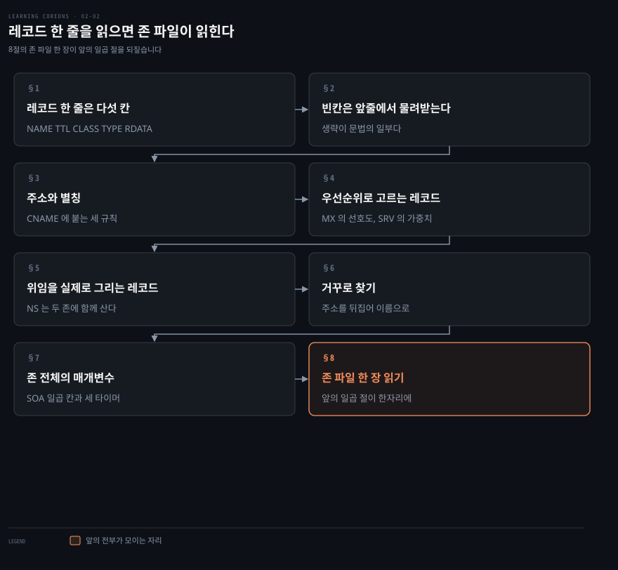
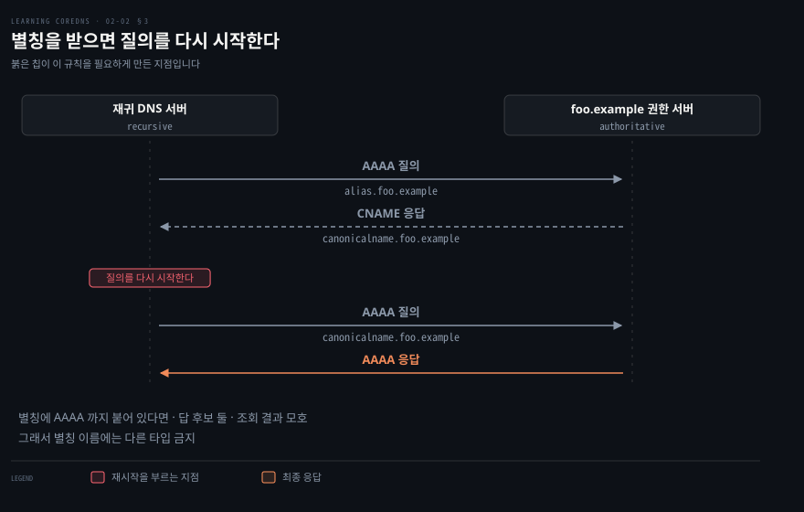
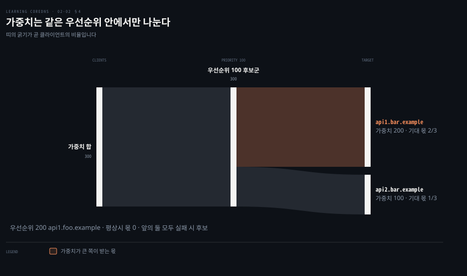
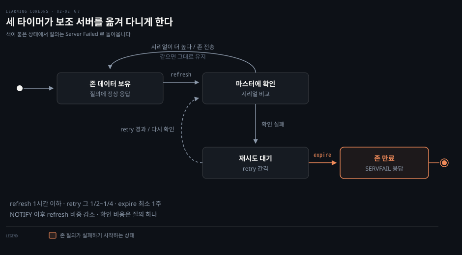

# 레코드 한 줄을 읽으면 존 파일이 읽힌다

---

> 리소스 레코드는 타입마다 다르게 생긴 것 같지만 한 줄의 골격은 모두 같습니다. 그 골격과 생략 규칙을 알면 처음 보는 존 파일도 읽힙니다.

## 핵심 요약

> 이 절 전체가 매달린 하나의 생각은 **레코드 한 줄이 `[NAME] [TTL] [CLASS] TYPE RDATA` 라는 다섯 칸이고, 타입마다 달라지는 것은 마지막 칸 하나뿐**이라는 것입니다.

앞의 네 칸은 모든 타입이 공유합니다. 게다가 앞의 셋은 생략할 수 있고, 생략하면 앞줄에서 물려받습니다. 처음 보는 존 파일이 어지러워 보이는 이유가 대개 이 생략 때문입니다.

마지막 칸인 RDATA 만 타입별로 다릅니다. 주소를 담는 타입이 있습니다. 다른 이름을 담는 타입이 있고, 우선순위를 함께 담는 타입이 있습니다. 이 노트는 그 RDATA 를 타입별로 훑은 뒤 마지막에 존 파일 한 장을 통째로 읽습니다.


## 학습 목표

이 내용을 읽고 나면:

1. 마스터 파일 형식의 다섯 칸을 대고, 어느 칸이 생략 가능한지 말할 수 있습니다.
2. NAME 과 TTL 이 생략됐을 때 무엇을 물려받는지 예제 줄을 보고 짚을 수 있습니다.
3. 별칭에 다른 타입을 붙이지 못하는 이유를 재귀 서버의 동작으로 설명할 수 있습니다.
4. MX 의 선호도와 SRV 의 우선순위·가중치가 각각 무엇을 고르는지 구분할 수 있습니다.
5. SOA 의 세 타이머가 보조 서버를 어떤 상태로 옮기는지 순서대로 말할 수 있습니다.

아래는 이 문서 전체를 읽는 순서로 이은 지도입니다. 앞의 두 절이 모든 타입에 공통인 문법입니다. 가운데 다섯 절이 타입별 RDATA 이고, 마지막 절이 그 전부가 한 파일에 모인 모습입니다.




## 이 문서가 다루지 않는 것

> 2장 전반부인 이름공간·위임·권한·재귀·캐싱은 앞 편이 맡습니다.

- 도메인과 존의 차이, 위임, 권한, 재귀와 캐싱 → [위임이 그은 경계가 질의 경로를 정한다](./02-01.%EC%9C%84%EC%9E%84%EC%9D%B4%20%EA%B7%B8%EC%9D%80%20%EA%B2%BD%EA%B3%84%EA%B0%80%20%EC%A7%88%EC%9D%98%20%EA%B2%BD%EB%A1%9C%EB%A5%BC%20%EC%A0%95%ED%95%9C%EB%8B%A4.md)
- Corefile 에서 이 존 파일을 어떻게 읽어 들이는지 → 원서 3장
- 존 데이터를 파일이 아닌 곳(호스트 테이블·Git·데이터베이스)에서 관리하는 법 → 원서 4장
- 쿠버네티스가 서비스를 어떤 레코드로 표현하는지 → 원서 6장

남는 것은 **레코드 한 줄의 문법과 타입별 RDATA** 입니다.


## 1. 레코드 한 줄은 다섯 칸이다

> 존 데이터 파일에 레코드가 적히는 형식을 마스터 파일 형식이라 부르고, 그 일반 형태는 다섯 칸입니다.

앞 편의 루트 힌트 발췌에서 이미 `NS`·`A`·`AAAA` 레코드를 봤습니다. 그때는 표처럼 읽고 넘어갔습니다. 그 줄들이 왜 그렇게 생겼는지 모르면 직접 쓸 때 어디에 무엇을 적어야 할지 정하지 못합니다.

마스터 파일 형식은 리소스 레코드가 존 데이터 파일에 나타나는 형식입니다. 주 서버가 존 데이터를 이 형식으로 읽고, 보조 서버도 백업 존 데이터 파일을 읽을 때 같은 형식을 씁니다.

```bash
[NAME] [TTL] [CLASS] TYPE RDATA
```

대괄호가 붙은 앞의 세 칸은 생략할 수 있습니다. 타입과 RDATA 만 반드시 있어야 합니다.

`A` 나 `AAAA` 같은 타입 표기는 정확히는 **타입 니모닉**이라 부릅니다. 리소스 레코드 타입마다 고유한 니모닉이 있습니다. 회선 위에서는 니모닉이 숫자 타입 코드로 번역되지만, 사람에게는 니모닉이 훨씬 외우기 쉽습니다.


## 2. 빈칸은 앞줄에서 물려받는다

> NAME 과 TTL 을 생략하면 가장 최근에 지정된 값을 물려받습니다. 존 파일이 처음에 어지러워 보이는 이유가 대개 이 생략입니다.

존 파일을 처음 열면 어떤 줄은 이름으로 시작하고 어떤 줄은 공백으로 시작합니다. 이 차이를 모르면 그 레코드가 무엇에 붙은 것인지 읽어 낼 수 없습니다.

NAME 칸에는 이 레코드가 붙는 도메인 이름이 들어갑니다. 점으로 끝나는 완전한 도메인 이름일 수도 있습니다. 점으로 끝나지 않는 상대 도메인 이름일 수도 있습니다. 상대 이름은 현재 origin 이 뒤에 붙은 것으로 해석되며, origin 의 기본값은 그 파일이 기술하는 존의 도메인 이름입니다. `foo.example` 의 존 파일을 쓰면서 이름마다 `foo.example` 을 치지 않아도 되니 편합니다.

origin 자체를 가리키려면 NAME 칸에 `@` 를 씁니다. 뒤에 점을 붙이지 않습니다. 루트를 가리키는 점 하나 `.` 도 쓸 수 있지만, 루트 존 데이터 파일이나 루트 힌트 파일을 편집할 때가 아니면 NAME 칸에 쓸 일이 잘 없습니다.

NAME 을 아예 생략하면 그 줄은 반드시 공백으로 시작해야 합니다. 그리고 그 레코드는 **가장 최근에 지정된 도메인 이름**에 붙습니다.

```bash
@                3600    IN   A   10.0.0.1   # foo.example 에 붙는다. @ 가 origin
foo.example.     3600    IN   A   10.0.0.2   # 역시 foo.example 에 붙는다
www              3600    IN   A   10.0.0.3   # www.foo.example 에 붙는다
                 3600    IN   A   10.0.0.4   # 역시 www.foo.example 에 붙는다
```

TTL 칸은 그 레코드의 time-to-live 값이고, 재귀 서버가 레코드를 얼마나 오래 캐시할 수 있는지를 좌우합니다. 회선 위에서는 32비트 정수 초입니다. 초로 적어도 되지만 이제는 배율 표기도 쓸 수 있습니다. `s` 는 초, `m` 은 분, `h` 는 시간, `d` 는 일, `w` 는 주여서 `1d`·`30m`·`1h30m` 처럼 적습니다. 하루가 86400초라는 것을 외우느라 머리를 쓰지 않아도 된다고 저자는 덧붙입니다.

TTL 을 적지 않으면 가장 최근에 지정된 TTL 을 물려받습니다.

```bash
@                3600    IN   A   10.0.0.1   # TTL 3600초, 곧 한 시간
                 1h      IN   A   10.0.0.2   # 같은 값
www              1h30m   IN   A   10.0.0.3   # 한 시간 30분, 곧 90분
                         IN   A   10.0.0.4   # 앞 레코드의 TTL 이므로 90분
```

> **원문 정오**: 원서의 마지막 줄 주석은 `TTL from precious record` 로 적혀 있습니다. `previous` 의 오타이며 의미는 "앞 레코드의 TTL" 입니다. 위 블록에는 뜻으로 옮겨 두었습니다.

CLASS 칸은 앞 편에서 봤듯 거의 항상 `IN` 이므로 `IN` 이 기본값입니다. 다른 클래스로 ChaosNet 의 `CH` 와 Hesiod 의 `HS` 가 있지만 쓰이는 것을 보기 어렵습니다. 그 클래스들이 맡으려던 기능이 자리를 잡지 못했기 때문입니다.


## 3. 주소와 별칭

> `A` 와 `AAAA` 는 이름을 주소 하나에 대응시키고, `CNAME` 은 이름을 다른 이름에 대응시킵니다. 마지막 것에만 규칙이 셋 붙습니다.



주소를 주는 타입은 규칙이 거의 없어서 금방 끝납니다. 문제는 별칭입니다. 별칭에 다른 레코드를 붙이면 왜 안 되는지 모르면, 나중에 존 파일이 로드되지 않는 이유를 찾지 못합니다.

`A` 레코드는 붙은 도메인 이름을 IPv4 주소 하나에 대응시킵니다. RDATA 는 점으로 나눈 옥텟 표기의 IPv4 주소 하나입니다. 한 이름을 여러 주소에 대응시키려면 `A` 레코드를 여러 개 붙이면 됩니다.

```bash
www.foo.example.      300   IN   A   10.0.0.1

www   1h   IN   A   10.0.0.1
      1h   IN   A   10.0.1.1
```

`AAAA` 도 같은 방식이고 담는 것만 IPv6 주소입니다. RDATA 는 표준 콜론 구분 16진 표기입니다.

```bash
www   30m    IN   AAAA   2001:db8:42:1:1
      30m    IN   AAAA   2001:db8:42:2:1
```

> **원문 정오**: 여기 쓰인 `2001:db8:42:1:1` 은 그룹이 다섯뿐이라 유효한 IPv6 주소가 아닙니다. `::` 가 빠졌고, 원서가 6절에서 이 주소를 `2001:0db8:0042:0001:0000:0000:0000:0001` 로 펼치는 것을 보면 의도한 값은 `2001:db8:42:1::1` 입니다. 8절의 완성된 존 파일에서는 저자가 `2001:db8:42:1::1` 처럼 `::` 를 제대로 씁니다. 위 블록은 원서 표기를 그대로 옮긴 것이니 실제 파일에 쓸 때는 `::` 를 넣으십시오.

`CNAME` 은 한 도메인 이름에서 다른 도메인 이름으로 별칭을 만듭니다. 레코드는 **별칭인 쪽**에 붙고, RDATA 는 별칭이 가리키는 정규 이름입니다. 정규 이름이라는 말에서 `CNAME` 이라는 이름이 나왔습니다.

```bash
alias.foo.example.       1d   IN   CNAME    canonicalname.foo.example.
```

여기에 규칙이 셋 붙습니다.

1. **별칭인 도메인 이름에는 다른 타입의 레코드를 붙일 수 없습니다.** 이유는 DNS 서버가 `CNAME` 을 처리하는 방식에 있습니다. 재귀 서버가 `alias.foo.example` 의 `AAAA` 를 찾으면 권한 서버에서 위 `CNAME` 을 받습니다. 그러면 재귀 서버는 질의를 다시 시작해 이번에는 `canonicalname.foo.example` 의 `AAAA` 를 찾습니다. 별칭에 `AAAA` 를 직접 붙이는 것이 허용된다면 `alias.foo.example` 의 `AAAA` 조회 결과가 모호해집니다.
2. **존의 도메인 이름은 `CNAME` 을 가질 수 없습니다.** 앞 규칙의 따름정리입니다. 존의 이름은 정의상 `SOA` 레코드를 가져야 하기 때문입니다.
3. **별칭이 또 다른 별칭을 가리킬 수는 있습니다.** 다만 루프를 만들지 않도록 조심해야 하고, 사슬을 너무 길게 만들어도 안 됩니다. 재귀 서버는 따라갈 `CNAME` 개수를 보통 제한합니다.


## 4. 우선순위로 고르는 레코드

> `MX` 는 선호도 하나로 순서를 정하고, `SRV` 는 우선순위로 후보군을 고른 뒤 가중치로 그 안을 나눕니다.



메일 서버가 여럿일 때 어느 것을 먼저 두드릴지, API 서버가 여럿일 때 트래픽을 어떻게 나눌지는 이름만으로 정해지지 않습니다. 그래서 이 두 타입은 RDATA 에 숫자를 함께 싣습니다.

`MX` 레코드는 특정 도메인 이름 앞으로 온 메일을 어디로 보낼지 정합니다. 메일 전송 에이전트는 `user@domain.name` 앞으로 온 메시지를 받으면 어디로 보낼지 정해야 합니다. `domain.name` 의 `A` 나 `AAAA` 를 볼 수도 있지만, 인터넷의 전송 에이전트는 `MX` 를 먼저 찾습니다. `MX` 가 없으면 `A`·`AAAA` 로 돌아가는 경우가 많습니다.

`MX` 는 메일 익스체인저의 도메인 이름과 그에 딸린 선호도 값을 지정합니다. 선호도는 부호 없는 16비트라 십진으로 0에서 65535 사이입니다. 표기에서는 선호도가 메일 익스체인저보다 앞에 옵니다.

```bash
foo.example.     3d   IN   MX     10 mail.isp.net.
```

주소가 아니라 이름을 적을 수 있는 것이 편리하다고 저자는 짚습니다. 요즘은 자체 메일 서버 대신 이메일 호스팅 서비스를 쓰는 조직이 많고, 그 서비스가 메일 서버 주소를 바꿀 때마다 따라다니고 싶지는 않기 때문입니다.

선호도는 한 이름이 `MX` 를 여럿 가질 때만 의미가 있습니다. 전송 에이전트는 찾은 `MX` 들을 선호도가 낮은 쪽부터 정렬해 가장 낮은 값의 익스체인저에 먼저 배달을 시도합니다. 더 높은 값은 낮은 값 전부를 시도한 뒤에만 시도할 수 있습니다. 그래서 백업 메일 서버를 둘 수 있습니다.

```bash
@   3d   IN   MX   0 mail.foo.example.
    3d   IN   MX   10 mail.isp.net.
```

`SRV` 는 `MX` 가 이메일에 해 준 일을 거의 모든 서비스로 넓힙니다. 도메인 이름과 그 서비스를 실제로 제공하는 서버 사이에 한 겹을 두는 것입니다.

`SRV` 는 붙는 도메인 이름의 형식이 정해져 있다는 점이 특이합니다.

```bash
_service._protocol.domainname
```

첫 레이블은 밑줄 뒤에 서비스의 상징적 이름을 붙인 것입니다. 두 번째 레이블은 밑줄 뒤에 프로토콜의 상징적 이름을 붙인 것으로, 사용자 데이터그램 프로토콜인 UDP 나 전송 제어 프로토콜인 TCP 가 옵니다. 뒤의 도메인 이름은 아무 이름이나 됩니다. 클라이언트는 셋을 이어 붙여 새 도메인 이름을 만들고 그 이름의 `SRV` 를 조회합니다. 밑줄을 쓴 것은 기존 도메인 이름과 부딪힐 가능성을 줄이려고 일부러 고른 것입니다.

`SRV` 의 RDATA 는 네 칸입니다.

- **Priority**: 부호 없는 16비트. `MX` 의 선호도처럼 동작합니다. 클라이언트는 값이 가장 낮은 대상부터 붙어 보고, 더 높은 값은 낮은 값 전부를 시도한 뒤에만 시도합니다.
- **Weight**: 부호 없는 16비트. 우선순위가 같은 대상이 둘 이상이면 가중치에 비례해 나눠 붙습니다. 같은 우선순위 대상들의 가중치를 모두 더한 뒤 각자 자기 몫만큼 받습니다.
- **Port**: 부호 없는 16비트. 서비스가 도는 포트입니다. 이미 TCP 80에 웹 서버가 있으면 API 서버를 다른 포트에 올리고 `SRV` 로 유도할 수 있습니다.
- **Target**: 그 서비스를 제공하는 서버의 도메인 이름입니다. 이 이름은 `A` 나 `AAAA` 를 하나 이상 가져야 합니다.

가중치가 같으면 절반씩 나눠 갖습니다. 저자의 두 번째 예제는 우선순위가 섞인 경우입니다.

```bash
api.bar.example.   60   IN   SRV    100    200   80     api1.bar.example.
                   60   IN   SRV    100    100   8080   api2.bar.example.
                   60   IN   SRV    200    100   8080   api1.foo.example.
```

앞의 둘은 우선순위가 같은 100이고 가중치가 200과 100이라 2 대 1 로 나눕니다. 마지막 줄은 우선순위가 200이라 평상시 몫이 없습니다. 앞의 둘이 모두 붙지 않을 때만 후보가 됩니다.


## 5. 위임을 실제로 그리는 레코드

> `NS` 는 존의 네임 서버를 지정합니다. 대부분의 타입과 달리 같은 `NS` 세트가 두 존에 함께 삽니다.

앞 편에서 위임을 개념으로 배웠습니다. 그런데 그 위임이 파일 안에서 어떤 줄로 적히는지는 보지 않았습니다. 그 줄을 못 찾으면 위임이 실제로 걸렸는지 확인할 방법이 없습니다. 그 줄이 `NS` 입니다.

`NS` 의 RDATA 는 그 레코드가 붙은 존에 권한을 가진 DNS 서버의 도메인 이름입니다. 아래 한 줄은 `foo.example` 에 권한을 가진 서버가 `ns1.foo.example` 에서 돈다고 말합니다.

```bash
foo.example.       1d   IN   NS   ns1.foo.example.
```

특이한 것은 이 레코드가 사는 자리입니다. 대부분의 타입과 달리 어떤 도메인 이름에 붙은 `NS` 는 보통 두 존에 함께 나타납니다. 그 이름을 가진 존과 그 존의 부모 존입니다. 위 레코드는 `foo.example` 존에도 있고 `example` 존에도 있습니다.

같은 레코드가 두 곳에서 하는 일은 다릅니다.

| 어느 존에 | 하는 일 |
|-----------|--------|
| 부모인 `example` 존 | `foo.example` 서브존을 그 서버들에 **위임**합니다. `example` 존 권한 서버는 `foo.example` 안의 이름을 질의받을 때마다 이 `NS` 들을 돌려주며, 그것이 곧 참조입니다 |
| 자신인 `foo.example` 존 | 권한 서버가 응답에 자기 `NS` 목록을 실어 보내므로, 두 존의 `NS` 세트가 다르면 재귀 서버가 결국 권한 존 쪽을 배워 씁니다. 주 서버가 NOTIFY 를 어디로 보낼지 정하는 데도 쓰이고, 동적 갱신을 보내려는 클라이언트에게 목적지를 알려 주기도 합니다 |

부모 존에 있는 `NS` 세트는 보통 하나가 아니라 여럿입니다.

```bash
foo.example.       1d   IN   NS   ns1.foo.example.
                   1d   IN   NS   ns2.foo.example.
                   1d   IN   NS   ns1.isp.net.
```


## 6. 거꾸로 찾기

> 주소를 이름으로 되돌리려면 주소를 뒤집어 특수 이름공간에 붙인 도메인 이름을 만들고, 그 이름의 `PTR` 을 조회합니다.

이름에서 주소를 찾는 일은 간단합니다. `A` 나 `AAAA` 를 보면 됩니다. 반대 방향은 그렇게 되지 않습니다. 저자는 로깅이나 클라이언트 신원의 약한 확인을 예로 들며 주소를 이름으로 되돌리는 일을 어떻게 하느냐고 묻습니다.

DNS 가 이 문제를 푼 방법은 특수 이름공간을 두는 것입니다. 둘입니다. `in-addr.arpa` 는 IPv4 주소를, `ip6.arpa` 는 IPv6 주소를 역매핑합니다.

`in-addr.arpa` 아래 레이블은 IPv4 주소의 네 옥텟을 **역순으로** 놓은 것입니다. 그래서 `10.0.0.1` 을 되돌리려면 `1.0.0.10.in-addr.arpa` 의 `PTR` 을 조회합니다. `PTR` 의 형식은 아주 단순해서 RDATA 가 도메인 이름 하나뿐입니다.

```bash
1.0.0.10.in-addr.arpa.    1d   IN    PTR    host.foo.example.
```

가장 중요한 옥텟을 뒤에 두는 것이 왜 말이 되는지는 위임을 생각하면 풀립니다. 이렇게 두면 `32.128.in-addr.arpa` 도메인이 IPv4 네트워크 `128.32/16` 에 대응합니다. 그 대역은 UC 버클리 소유이므로, `in-addr.arpa` 운영자가 `32.128.in-addr.arpa` 를 버클리의 담당자에게 통째로 위임할 수 있습니다.

IPv6 도 같은 방식이고 이름만 훨씬 깁니다. IPv6 주소의 16진수 32자리를 전부 역순으로 쓰고 자리마다 점을 찍은 뒤 `.ip6.arpa` 를 붙입니다. `2001:db8:42:1:1` 은 먼저 `2001:0db8:0042:0001:0000:0000:0000:0001` 로 펼쳐진 다음 아래 이름이 됩니다.

```bash
1.0.0.0.0.0.0.0.0.0.0.0.0.0.0.0.1.0.0.0.2.4.0.0.8.b.d.0.1.0.0.2.ip6.arpa.
 1d   IN     PTR   host-v6.foo.example.
```

> **원문 정오**: 원서는 이 대목에서 `"encoding the most significant hexadecimal digit of the address first makes delegation easier"` 라고 적습니다. 앞의 IPv4 설명에서는 같은 이유를 `"Putting the most significant octet of the IPv4 address last"` 라고 썼으니 `first` 가 아니라 `last` 여야 합니다. 바로 위 예제가 그것을 확인해 줍니다. 이름은 최하위 자리 `1` 로 시작하고, 최상위 세 그룹인 `2001:0db8:0042` 를 뒤집은 `2.4.0.0.8.b.d.0.1.0.0.2` 로 끝납니다. 마지막 레이블 `2` 가 주소 전체에서 가장 앞자리입니다.


## 7. 존 전체의 매개변수

> `SOA` 는 존 하나에 하나뿐이며 존의 도메인 이름에 붙습니다. RDATA 일곱 칸 가운데 다섯이 존 전송과 부정 캐싱을 좌우합니다.



`SOA` 는 일곱 칸이나 되는데다 이름만 봐서는 무엇을 하는 칸인지 알기 어렵습니다. 저자도 이 일곱을 늘 기억하지는 못하는 관리자를 위해 주석을 쓰라고 권할 정도입니다.

```bash
foo.example.     1d   IN   SOA   ns1.foo.example.       root.foo.example.   (
     2019050600     ; Serial number
     1h             ; Refresh interval
     15m            ; Retry interval
     7d             ; Expiration interval
     30m )          ; Default and negative-caching TTL
```

첫 줄 끝의 `(` 와 마지막 줄의 `)` 는 그 사이의 줄바꿈을 무시하라고 서버에 알립니다. 이 문법은 어떤 타입에도 합법이지만, 괄호를 쓰지 않은 `SOA` 를 보기는 드뭅니다. `;` 로 시작해 줄 끝까지 가는 주석도 존 파일 어디에서나 쓸 수 있습니다.

일곱 칸은 성격이 셋으로 갈립니다.

**사람이 읽는 둘.** MNAME 은 관례상 그 존의 주 DNS 서버 도메인 이름입니다. RNAME 은 관례상 존 책임자의 이메일 주소인데 형식이 조금 특이해서 `@` 가 점으로 바뀝니다. `cricket@foo.example` 은 `cricket.foo.example.` 이 됩니다.

이 둘은 대개 사람이 읽고 소프트웨어는 무시합니다. 다른 관리자가 이 존에 문제를 겪으면 RNAME 을 찾아 메일을 보내는 식입니다. 예외는 둘입니다. 일부 소프트웨어는 MNAME 으로 동적 갱신을 어디로 보낼지 정합니다. 그리고 보조 서버는 보통 MNAME 에 적힌 주 서버에는 NOTIFY 를 보내지 않습니다.

**존 전송을 좌우하는 넷.** 존 전송과 주 서버·보조 서버·마스터 서버의 관계는 [앞 편 §4](./02-01.%EC%9C%84%EC%9E%84%EC%9D%B4%20%EA%B7%B8%EC%9D%80%20%EA%B2%BD%EA%B3%84%EA%B0%80%20%EC%A7%88%EC%9D%98%20%EA%B2%BD%EB%A1%9C%EB%A5%BC%20%EC%A0%95%ED%95%9C%EB%8B%A4.md)에서 다뤘습니다. 여기서는 그 전송을 언제 하느냐만 봅니다. 시리얼 번호는 어떤 권한 서버가 들고 있는 존의 버전을 나타냅니다. 나머지 셋은 타이머입니다.

refresh 간격마다 보조 서버는 마스터에게 마스터 쪽 시리얼이 더 높은지 확인합니다. 더 높으면 존 전송으로 최신 사본을 요청합니다. 확인이 어떤 이유로든 실패하면 retry 간격으로 계속 확인합니다. retry 는 보통 refresh 보다 짧습니다. 확인이 expire 기간 내내 실패하면 보조 서버는 자기 존 데이터가 낡았다고 보고 존을 만료시킵니다. 만료된 뒤에는 그 존의 질의에 Server Failed 응답 코드로 답합니다.

값을 정하는 감각도 저자가 일러 줍니다. NOTIFY 가 생긴 뒤로 refresh 의 비중은 다소 줄었습니다. 그래도 한 시간 이하 정도로 두는 것이 좋습니다. 보조 서버의 확인 비용이 질의 하나로 아주 낮기 때문입니다. retry 는 보통 refresh 의 절반이나 4분의 1 로 둡니다. expire 는 결과가 꽤 심각하므로 길게 둡니다. 보조 서버가 마스터와 통신하지 못한다는 것을 알아채고 손쓸 시간을 줘야 하기 때문이며, 저자들은 실무에서 보통 최소 일주일로 잡습니다.

**부정 응답을 좌우하는 하나.** 마지막 칸인 부정 캐싱 TTL 은 다른 서버가 이 존 권한 서버의 부정 응답을 얼마나 오래 캐시해도 되는지 알려 줍니다. 부정 응답은 둘입니다. 그런 도메인 이름이 없다는 것과, 이름은 있지만 요청한 타입의 레코드가 없다는 것입니다. 권한 서버는 부정 응답에 존의 `SOA` 를 실어 보내 재귀 서버가 캐시 기간을 알 수 있게 합니다.

부정 캐싱은 존재하지 않는 이름이나 레코드를 묻는 질의가 권한 서버에 쏟아지는 것을 막아 줍니다. 다만 너무 높게 잡으면 존에 갓 추가한 도메인 이름의 해석을 방해할 수 있습니다.


## 8. 존 파일 한 장 읽기

> 앞의 일곱 절이 한 파일에 모이면 이렇게 생겼습니다. 저자가 가상의 `foo.example` 존으로 보여 주는 완성본입니다.

낱개 레코드를 다 봤어도 파일 한 장을 통째로 만나면 다시 막힙니다. 어느 줄이 무엇에 붙었는지, 왜 그 순서인지가 한눈에 안 잡히기 때문입니다.

```bash
@   1d    IN   SOA    ns1.foo.example.    root.foo.example.      (
    2019050800 ; Serial number
    1h             ; Refresh interval
    15m            ; Retry interval
    7d             ; Expiration interval
    10m            ; Negative-caching TTL

          IN   NS ns1.foo.example.
          IN   NS ns2.foo.example.
          IN   MX 0   mail.foo.example.
          IN   MX 10 mta.isp.net.
          IN   A 192.168.1.1
          IN   AAAA 2001:db8:42:1::1

www    5m IN   CNAME @

ns1       IN   A      192.168.1.53
          IN   AAAA   2001:db8:42:1::53
ns2       IN   A      192.168.2.53
          IN   AAAA   2001:db8:42:2::53

mail      IN   A      192.168.1.25
          IN   AAAA   2001:db8:42:1::25
_http._tcp.www      IN   SRV   0 0 80 foo.example.
_https._tcp.www     IN   SRV   0 0 443 foo.example.
```

> **원문 정오**: 원서의 이 예제는 `10m ; Negative-caching TTL` 뒤에 닫는 괄호 `)` 가 없습니다. 바로 앞 절의 Example 2-17 에는 `30m )` 로 제대로 붙어 있으므로 누락이며, 이대로는 괄호가 닫히지 않아 서버가 파일을 읽지 못합니다. 위 블록은 원서 표기를 그대로 옮겼으니 옮겨 쓸 때 `)` 를 넣으십시오.

파일은 대개 그렇듯 `SOA` 로 시작합니다. `SOA` 는 `@`, 곧 이 파일의 origin 에 붙었고 origin 은 기본값인 `foo.example` 입니다. 그 아래 공백으로 시작하는 줄들이 전부 같은 이름에 붙는다는 것이 2절의 상속 규칙입니다.

두 `NS` 는 `foo.example` 의 권한 서버로 `ns1`·`ns2` 를 지정합니다. 저자는 이 둘이 주로 `ns1`·`ns2` 자신이 NOTIFY 를 어디로 보낼지 정하는 데 쓰인다고 짚습니다. 동적 갱신 목적지를 찾는 소프트웨어가 쓰기도 합니다. 실제로 위임을 하는 짝은 `example` 존에 따로 있어야 합니다.

두 `MX` 는 `mail.foo.example` 과 `mta.isp.net` 을 메일 익스체인저로 지정합니다. 선호도가 0과 10이므로 `mta.isp.net` 이 백업일 가능성이 큽니다.

`foo.example` 에 직접 붙은 `A` 와 `AAAA` 는 웹 서버의 주소입니다. 이렇게 두면 사용자가 `http://www.foo.example/` 대신 `http://foo.example/` 만 쳐도 됩니다.

`CNAME` 은 `www.foo.example` 을 `foo.example` 의 별칭으로 만듭니다. 이제 둘 중 무엇을 쳐도 같은 웹 서버로 가고, 주소가 바뀌어도 관리자는 한 곳만 고치면 됩니다. 별칭은 HTTP 에만 걸리는 것이 아니므로 `someuser@www.foo.example` 로 메일을 보낼 수도 있습니다.

이어지는 여섯 줄은 `ns1`·`ns2`·`mail` 의 IPv4·IPv6 주소입니다. 이 조직이 네트워크를 듀얼 스택으로 만들어 두었다는 뜻이고, 저자는 독자에게도 그러라고 권합니다.

마지막 두 `SRV` 는 HTTP 와 HTTPS 트래픽을 `foo.example` 로 보냅니다. Target 이 `www.foo.example` 이 아니라 `foo.example` 인 것을 눈여겨보라고 저자는 짚습니다. `www.foo.example` 은 별칭이므로 `SRV` 의 RDATA 에 들어가면 안 됩니다. `MX` 도 마찬가지입니다.


## 결정 치트시트

> 존 파일을 쓰거나 읽을 때 바로 쓰는 판단을 모았습니다. 근거는 모두 본문입니다.

| 상황 | 판단 | 이유 |
|------|------|------|
| 존의 이름 자체를 다른 이름의 별칭으로 만들고 싶다 | 할 수 없다 | 존의 이름은 정의상 `SOA` 를 가져야 하므로 `CNAME` 을 가질 수 없다 |
| 별칭에 `MX` 나 `TXT` 를 붙이고 싶다 | 붙이지 않는다 | 별칭에 다른 타입이 붙으면 조회 결과가 모호해진다 |
| 백업 메일 서버를 두고 싶다 | `MX` 를 하나 더 두고 선호도를 크게 준다 | 낮은 값 전부를 시도한 뒤에만 높은 값을 시도한다 |
| 같은 서비스 서버 둘에 트래픽을 2 대 1 로 주고 싶다 | 우선순위를 같게, 가중치를 200과 100으로 | 가중치는 같은 우선순위 안에서 합 대비 몫으로 나뉜다 |
| 웹 서버가 이미 80을 쓰는데 API 를 같은 이름으로 노출하고 싶다 | `SRV` 에 다른 포트를 적는다 | Port 칸이 서비스가 도는 포트를 지정한다 |
| 존 데이터를 자주 바꾼다 | refresh 를 한 시간 이하로 | 확인 비용이 질의 하나라 값싸다 |
| 보조 서버가 마스터와 끊겨도 한동안 버티게 하고 싶다 | expire 를 길게, 최소 일주일 | 만료되면 그 존 질의가 전부 Server Failed 가 된다 |
| 없는 이름을 묻는 질의가 쏟아진다 | 부정 캐싱 TTL 을 올린다 | 다만 갓 추가한 이름의 해석이 늦어지는 대가가 있다 |
| `SRV` 나 `MX` 의 대상에 별칭을 적고 싶다 | 적지 않는다 | 저자가 마지막 예제에서 직접 짚는 금지 사항이다 |


## 적용 관점

> 이 절은 문법이라 손으로 확인하는 것이 가장 빠릅니다.

**한 가지 실행**: 다음에 이름 해석을 확인할 때 `dig` 로 타입을 하나 지정해 보고, 돌아온 응답의 ANSWER 섹션을 이 노트의 다섯 칸으로 읽어 봅니다. 응답도 마스터 파일 형식으로 출력되므로 NAME·TTL·CLASS·TYPE·RDATA 가 그대로 보입니다.

```bash
dig +noall +answer www.example.com A
dig +noall +answer example.com SOA
```

쿠버네티스 위의 Spring 애플리케이션 쪽에서 보면 이 절의 타입 가운데 `SRV` 가 특히 눈에 들어옵니다. 헤드리스 서비스가 파드마다 이름을 주고 포트를 함께 알려 주는 구조가 `_service._protocol.name` 형식과 그 Port 칸을 그대로 쓰기 때문입니다. 쿠버네티스가 이 형식을 어떻게 채우는지는 원서 6장이 다룹니다.


## 면접에서 받을 만한 질문

> 자답한 뒤 아래 정답과 맞춰 봅니다.

1. 마스터 파일 형식의 다섯 칸을 순서대로 대 보십시오.
2. 존 파일에서 공백으로 시작하는 줄은 무슨 뜻입니까.
3. 별칭인 도메인 이름에 다른 타입 레코드를 붙이면 왜 안 됩니까.
4. `MX` 의 선호도와 `SRV` 의 우선순위·가중치는 무엇이 다릅니까.
5. 같은 `NS` 레코드가 두 존에 있는 이유는 무엇입니까.
6. `SOA` 의 expire 가 지나면 보조 서버는 어떻게 동작합니까.


## 정답 (자답 후 펼치기)

### 정답 1 — 다섯 칸

`[NAME] [TTL] [CLASS] TYPE RDATA` 입니다. 앞의 셋은 생략할 수 있고 타입과 RDATA 만 반드시 있어야 합니다.

### 정답 2 — 공백으로 시작하는 줄

NAME 을 생략했다는 뜻입니다. 그 레코드는 가장 최근에 지정된 도메인 이름에 붙습니다. TTL 도 생략됐다면 가장 최근에 지정된 TTL 을 물려받습니다.

### 정답 3 — 별칭에 다른 타입을 못 붙이는 이유

재귀 서버가 별칭의 어떤 타입을 조회하면 `CNAME` 을 받고 정규 이름으로 질의를 다시 시작하기 때문입니다. 별칭에 그 타입이 직접 붙어 있으면 어느 쪽을 답으로 삼아야 할지 모호해집니다.

### 정답 4 — 선호도와 우선순위·가중치

`MX` 의 선호도는 순서만 정합니다. 낮은 값부터 시도하고 실패해야 다음으로 넘어갑니다. `SRV` 는 우선순위로 같은 방식의 순서를 정한 뒤, 우선순위가 같은 대상들 사이에서 가중치 비율로 클라이언트를 나눕니다.

### 정답 5 — `NS` 가 두 존에 있는 이유

부모 존의 `NS` 는 자식 존을 위임하고 참조를 만드는 데 쓰입니다. 자식 존 자신의 `NS` 는 권한 응답에 실려 재귀 서버가 최종적으로 배워 쓰는 목록이 되고, NOTIFY 목적지와 동적 갱신 목적지를 정하는 데도 쓰입니다.

### 정답 6 — expire 이후

보조 서버는 자기 존 데이터가 낡았다고 보고 존을 만료시킵니다. 그 뒤로는 그 존에 대한 질의에 Server Failed 응답 코드로 답합니다.


## 핵심 개념 체크리스트

- [ ] 마스터 파일 형식의 다섯 칸과 생략 가능한 셋을 말할 수 있는가?
- [ ] `@` 와 점 하나와 상대 이름이 각각 무엇을 가리키는지 구분할 수 있는가?
- [ ] `CNAME` 에 붙는 세 규칙과 그 이유를 댈 수 있는가?
- [ ] `SRV` 의 RDATA 네 칸을 대고 각각이 무엇을 정하는지 말할 수 있는가?
- [ ] 같은 `NS` 세트가 두 존에서 하는 일의 차이를 말할 수 있는가?
- [ ] IPv4 와 IPv6 의 역방향 이름을 각각 만들어 볼 수 있는가?
- [ ] `SOA` 일곱 칸을 성격 셋으로 갈라 설명할 수 있는가?


## 관련 문서

- [Learning CoreDNS 정독 인덱스](./README.md) — 이 책의 장별 진행 상황
- [위임이 그은 경계가 질의 경로를 정한다](./02-01.%EC%9C%84%EC%9E%84%EC%9D%B4%20%EA%B7%B8%EC%9D%80%20%EA%B2%BD%EA%B3%84%EA%B0%80%20%EC%A7%88%EC%9D%98%20%EA%B2%BD%EB%A1%9C%EB%A5%BC%20%EC%A0%95%ED%95%9C%EB%8B%A4.md) — 이 편의 앞 절반
- [DNS와 CoreDNS](../../kubernetes/04_networking/04-05.DNS%EC%99%80%20CoreDNS.md) — 쿠버네티스가 이 레코드들을 어떻게 채우는지


## 참고 자료

- 원서: 《Learning CoreDNS: Configuring DNS for Cloud Native Environments》 2장 A DNS Refresher 후반부
- 서지: John Belamaric·Cricket Liu, O'Reilly, 2019년, ISBN 978-1492047964
- 저자가 더 깊은 DNS 이론으로 가리키는 책은 《DNS and BIND》입니다
