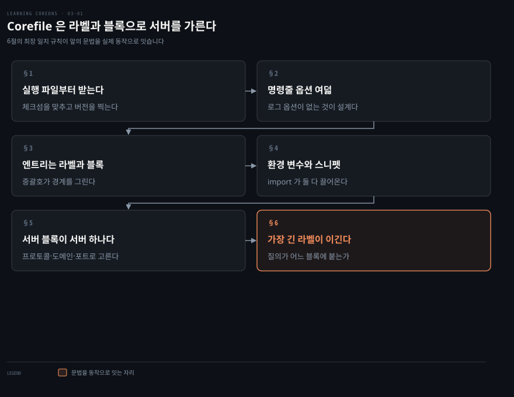
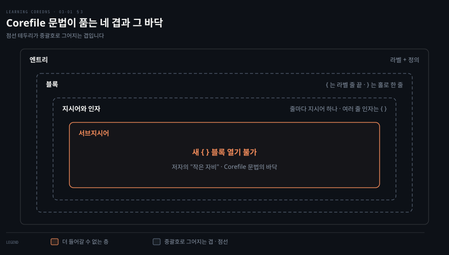
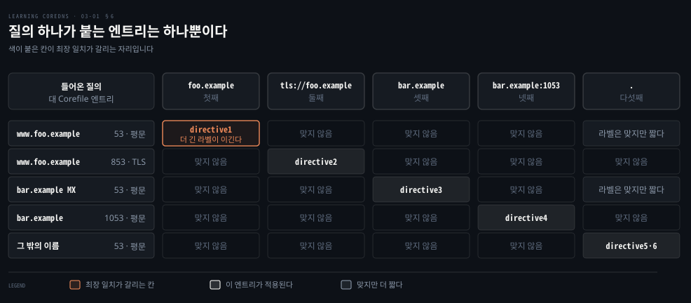

# Corefile은 라벨로 서버를 가른다

---

> CoreDNS 설정은 중괄호 몇 겹이 전부입니다. 그 겹의 맨 바깥에 붙는 라벨이 프로토콜과 포트와 도메인을 한꺼번에 골라, 들어온 질의가 어느 서버로 갈지 정합니다.

## 핵심 요약

> 이 절 전체가 매달린 하나의 생각은 **서버 블록의 라벨 하나가 CoreDNS 안의 서버 하나를 정의하고, 질의는 그중 가장 긴 라벨에 붙는다**는 것입니다.

1장에서 저자는 Corefile 이 개운할 만큼 단순하다고 말했습니다. 3장 전반부가 그 말의 근거입니다. 문법에 있는 것은 라벨과 중괄호와 지시어뿐이고, 중첩은 네 겹에서 끝납니다.

그 단순한 문법 위에서 라벨이 세 가지를 한꺼번에 고릅니다. 프로토콜과 포트와 도메인 이름입니다. 셋이 모두 맞아야 그 서버 블록이 적용되고, 도메인 이름이 여러 라벨에 맞으면 가장 구체적인 것이 이깁니다. 이 규칙이 뒤에 나올 모든 설정의 바탕입니다.


## 학습 목표

이 내용을 읽고 나면:

1. CoreDNS 실행 파일을 받아 무결성을 확인하고 버전을 찍어 볼 수 있습니다.
2. 명령줄 옵션의 쓰임을 대고, 로그 옵션이 없는 것이 왜 설계인지 설명할 수 있습니다.
3. Corefile 의 엔트리·라벨·블록·지시어·서브지시어를 중첩 순서대로 짚을 수 있습니다.
4. 서버 블록 라벨이 프로토콜·도메인·포트 셋을 어떻게 함께 지정하는지 쓸 수 있습니다.
5. 질의 하나가 여러 라벨에 맞을 때 어느 엔트리가 이기는지 판정할 수 있습니다.

아래는 이 문서 전체를 읽는 순서로 이은 지도입니다. 앞의 두 절이 실행 파일과 명령줄입니다. 가운데 두 절이 Corefile 문법이고, 마지막 두 절이 서버 블록과 질의가 그 블록에 붙는 규칙입니다.




## 이 문서가 다루지 않는 것

> 플러그인 하나하나의 문법과 완성된 서버 설정 예시는 다음 편이 맡습니다.

- `root`·`file`·`secondary`·`forward`·`cache`·`errors`·`log` 플러그인의 문법 → 원서 3장 후반부, 다음 편 `03-02`
- 캐싱 전용·주 서버·보조 서버의 완성된 Corefile → 원서 3장 후반부
- 존 데이터를 파일 아닌 곳에서 관리하는 법 → 원서 4장
- 존 파일 자체의 문법 → [레코드 한 줄을 읽으면 존 파일이 읽힌다](./02-02.%EB%A0%88%EC%BD%94%EB%93%9C%20%ED%95%9C%20%EC%A4%84%EC%9D%84%20%EC%9D%BD%EC%9C%BC%EB%A9%B4%20%EC%A1%B4%20%ED%8C%8C%EC%9D%BC%EC%9D%B4%20%EC%9D%BD%ED%9E%8C%EB%8B%A4.md)

남는 것은 **설정 파일의 골격과 질의가 그 골격에 붙는 규칙**입니다.


## 1. 실행 파일부터 받는다

> CoreDNS 는 단일 실행 파일이라 받아서 풀면 끝입니다. 다만 받은 뒤 체크섬을 맞춰 보는 절차가 저자의 안내에 들어 있습니다.

설정을 쓰기 전에 실행 파일이 있어야 하는데, 어느 빌드를 받아야 할지부터 막힙니다. CoreDNS 는 프로세서 종류별로 빌드가 나뉘어 있기 때문입니다.

가장 쉬운 길은 coredns.io 에서 시작하는 것입니다. 눈에 띄는 Download 버튼이 있고, 누르면 CoreDNS GitHub 저장소의 실행 파일 내려받는 자리로 바로 갑니다. 직접 빌드하고 싶으면 그 페이지 아래쪽 링크에서 소스를 zip·tar·GZIP 중 골라 받을 수 있습니다.

파일을 고를 때 알아 둘 이름이 몇 있습니다.

- **Darwin** 은 macOS X 입니다.
- 원서가 적은 **AMD** 는 벤더 이름이 아니라 아키텍처 이름 `amd64` 를 가리킵니다. 인텔 CPU 도 같은 빌드를 씁니다.
- 프로세서 빌드가 여럿입니다. AMD, ARM, 64비트 ARM, PowerPC, IBM 의 S/390 이 있습니다.
- Windows 는 그냥 마이크로소프트 윈도우입니다.

받은 뒤에는 같은 이름에 `.sha256` 이 붙은 체크섬 파일을 함께 받아 대조합니다. 값이 다르면 내려받기가 깨졌을 수 있다고 저자는 적습니다.

```bash
shasum -a 256 coredns_1.4.0_darwin_amd64.tgz
tar -zxvf coredns_1.4.0_darwin_amd64.tgz
coredns -version
```

리눅스에서는 `sha256sum` 을 쓰면 됩니다. 압축을 풀면 `coredns` 실행 파일이 현재 작업 디렉터리에 떨어지고, 원하는 곳으로 옮기면 됩니다. `-version` 을 붙여 실행했을 때 아래 같은 출력이 나오면 제대로 동작하는 것입니다.

```bash
CoreDNS-1.4.0
darwin/amd64, go1.12, 8dcc7fc
```


## 2. 명령줄 옵션 여덟

> 옵션은 여덟뿐이고, 그 목록에 **없는 것**이 하나 눈에 띕니다. 로그를 어디로 보낼지 정하는 옵션이 없습니다.

설정 파일을 쓰기 전에 명령줄로 무엇을 정할 수 있는지 알아야 합니다. 목록이 짧아서 금방 끝나는데, 빠진 항목 하나가 설계 의도를 드러냅니다.

| 옵션 | 하는 일 |
|------|--------|
| `-conf` | 설정 파일 경로. 기본값은 `coredns` 작업 디렉터리의 `Corefile` |
| `-cpu` | `coredns` 가 쓸 수 있는 최대 CPU 비율. 기본값 100%. `50` 이나 `50%` 로 적음 |
| `-dns.port` | 질의를 받을 포트. 기본값은 표준 DNS 포트인 53 |
| `-help` | 사용법을 표시 |
| `-pidfile` | 프로세스 ID 를 쓸 파일 경로. 기본값 없음 |
| `-plugins` | 실행 파일에 컴파일된 플러그인 목록 표시. 직접 빌드하지 않았다면 in-tree 플러그인 전부 |
| `-quiet` | 초기화 출력을 억제 |
| `-version` | 버전 출력 |

저자는 `-cpu` 에 경고를 붙여 둡니다. 이 옵션은 폐기됐으며 새 버전에서는 지원되지 않을 수 있다는 것입니다.

목록에 없는 것이 더 중요합니다. 로그를 어디로 보낼지 제어하는 옵션이 없습니다. 저자는 이것이 개발자들의 **의도적 선택**이라고 짚습니다. CoreDNS 는 기본적으로 표준 출력으로 로그를 내보내고, 그 로그를 어떻게 관리할지는 다른 소프트웨어에 맡깁니다.

> **노트의 읽기**: 표준 출력으로 흘려보내고 수집은 바깥에 맡기는 것은 컨테이너 로깅의 기본 형태입니다. 컨테이너 환경을 겨냥한 서버라는 1장의 이야기와 겹쳐 읽히는 자리인데, 원서가 그렇게 잇지는 않습니다.


## 3. 엔트리는 라벨과 정의로 이뤄진다

> Corefile 은 엔트리 하나 이상으로 이뤄지고, 엔트리는 라벨과 정의로 나뉩니다. 중괄호가 그 경계를 그립니다.



문법이 단순하다는 말은 자주 듣지만, 어디까지 중첩할 수 있는지를 모르면 남의 Corefile 을 읽다 길을 잃습니다. 겹의 개수를 먼저 세어 두는 편이 낫습니다.

> **노트의 읽기**: 도식이 세는 네 겹은 문법이 품는 관계이지 중괄호의 깊이가 아닙니다. 중괄호가 실제로 그리는 깊이는 서버 블록과 여러 줄 인자 둘이고, 재사용 스니펫을 쓰면 셋이 됩니다. 원서는 겹을 세지 않으며 이 셈은 노트가 붙인 것입니다.

```bash
# 여기부터가 "엔트리"다
label {
    definition
}
```

엔트리가 하나뿐인 Corefile 이 아니라면 정의는 중괄호로 감싸야 합니다. CoreDNS 에게 각 엔트리의 경계를 알려 주기 위해서입니다. 여는 중괄호는 라벨로 시작하는 줄의 **끝**에 와야 하고, 닫는 중괄호는 한 줄에 **홀로** 있어야 합니다. 중괄호 안의 텍스트를 블록이라 부릅니다.

관례상 정의는 탭으로 들여쓰지만 강제는 아닙니다. 주석은 `#` 로 시작해 줄 끝까지 갑니다.

엔트리는 라벨을 여럿 가질 수 있고, 그때는 공백으로 나눕니다. 라벨 목록이 길어 여러 줄에 걸치면 마지막 줄을 뺀 각 줄의 끝 라벨이 쉼표로 끝나야 합니다.

```bash
label1, label2,
label3, label4,
label5 {
    definition
}
```

정의는 지시어와 선택적 인자로 이뤄집니다. 정의의 각 줄은 지시어로 시작하고 그 뒤에 인자가 0개 이상 붙습니다. 인자 목록이 여러 줄에 걸치면 그 줄들을 중괄호로 감싸야 하는데, 여는 중괄호는 지시어 첫 줄 끝에, 닫는 중괄호는 마지막 줄에 홀로 둡니다.

```bash
label {
    directive1 arg1 arg2
    directive2 {
        arg3
        arg4
    }
}
```

여기까지는 인자만 여러 줄로 늘어놓은 것입니다. 그 자리에 지시어가 또 들어갈 수도 있습니다.

```bash
label {
    directive1 arg1 arg2
    directive2 {
        subdirective arg3 arg4
        arg5
    }
}
```

> **원문 정오**: 위 규칙을 적는 원서 문장은 `"the closing curly brace along on the last line"` 인데 `along` 은 `alone` 의 오타입니다. 같은 규칙을 처음 적은 앞 문단은 `"must appear alone on a line"` 으로 제대로 적혀 있습니다.

지시어 안에는 서브지시어가 올 수 있습니다. 조건은 줄을 시작해야 한다는 것이고, 서브지시어도 자기 인자를 가질 수 있습니다. 그리고 여기가 바닥입니다. **서브지시어는 새 중괄호 블록을 시작할 수 없습니다.** 저자는 이것을 작은 자비라고 부릅니다.


## 4. 환경 변수와 스니펫, 그리고 import

> 같은 설정을 여러 번 쓰지 않게 해 주는 장치가 셋 있습니다. 환경 변수 치환, 재사용 스니펫, 그리고 파일을 끌어오는 `import` 입니다.

설정이 길어지면 같은 덩어리를 반복해서 적게 됩니다. 그러면 한 곳만 고치고 다른 곳을 놓치는 사고가 납니다. 왜 그 반복을 줄여야 하는지가 이 절의 셋을 쓰는 이유입니다.

Corefile 은 환경 변수 참조를 담을 수 있습니다. 참조는 값으로 펼쳐져 라벨이나 지시어나 인자가 되고, 그것들의 일부가 되기도 합니다. 환경 변수 이름은 중괄호로 감쌉니다.

```bash
label_{$ENV_VAR_1} {
    directive {$ENV_VAR_2}
}
```

> **원문 정오**: 원서 산문은 `"The name of the environment variable must be enclosed in curly braces"` 라고만 적습니다. 예제를 보면 중괄호 안에 `$` 가 함께 들어가 `{$ENV_VAR_1}` 입니다. 산문대로 `{ENV_VAR_1}` 이라 쓰면 치환되지 않으므로 `$` 를 빠뜨리지 않아야 합니다.

윈도우식 `%ENV_VAR%` 문법도 쓸 수 있다고 저자는 덧붙이면서, 그걸 누가 쓰냐고 한마디 답니다.

설정의 한 구간을 Corefile 안에서 여러 번 재사용할 생각이면 **재사용 스니펫**으로 정의합니다. 이름을 괄호 안에 적고 스니펫 자체를 중괄호로 감쌉니다. 저자가 굳이 "이게 공식 이름이다"라고 괄호를 치는 대목입니다.

```bash
(snippet1) {
    label1 {
        directive1 arg1
        directive2 arg2 arg3
    }
}
```

넣을 때는 `import` 지시어에 괄호를 뗀 이름을 붙입니다. 같은 `import` 로 파일도 끌어올 수 있습니다. 인자로 경로 이름이나 Glob 패턴을 받습니다.

```bash
import snippet1
import common.conf
import config/*.conf
```


## 5. 서버 블록이 CoreDNS의 서버 하나다

> CoreDNS 에서 가장 흔한 엔트리가 서버 블록입니다. 서버 블록 하나가 CoreDNS 안의 서버 하나를 정의합니다.

"서버 하나"라는 말이 처음에는 잘 안 잡힙니다. 프로세스는 하나인데 그 안에 서버가 여럿이라는 뜻이라, 무엇이 그 서버들을 가르는지 모르면 설정을 읽어도 어떤 질의가 어디로 가는지 알 수 없습니다.

서버 블록은 특정 도메인 이름에 대한 질의가 특정 포트와 특정 프로토콜로 들어왔을 때 그것을 어떻게 처리할지 정하는 설정입니다. 가장 단순한 형태에서 라벨은 그냥 도메인 이름입니다.

```bash
foo.example {
    # 지시어가 여기 들어간다
}
```

이 블록은 `foo.example` 로 끝나는 모든 도메인 이름 질의에 적용됩니다. 단, `bar.foo.example` 처럼 더 구체적인 서버 블록이 따로 있으면 그쪽이 우선합니다. 모든 질의에 적용하려면 루트를 라벨로 씁니다.

라벨은 세 가지를 함께 지정합니다.

| 라벨 부분 | 고르는 것 | 표기 |
|-----------|----------|------|
| 접두사 | 프로토콜. 기본은 평문 DNS | `tls://` 는 DoT, `grpc://` 는 gRPC 위의 DNS |
| 도메인 이름 | 어떤 이름에 적용할지. 루트면 전부 | `foo.example`, `.` |
| 콜론 뒤 포트 | 어느 포트로 들어온 질의인지. 기본은 UDP·TCP 53 | `.:1053` |

여러 도메인에 같은 지시어를 걸고 싶으면 라벨을 나열합니다.

```bash
foo.example bar.example {
    # 지시어가 여기 들어간다
}

.:1053 {
    # 비표준 포트로 듣는다
}

tls://foo.example {
    # DoT 로 듣는다
}

grpc://bar.example {
    # gRPC 위의 DNS 로 듣는다
}
```


## 6. 가장 긴 라벨이 이긴다

> 질의가 들어오면 CoreDNS 는 Corefile 에서 맞는 서버 블록을 찾습니다. 프로토콜과 포트와 도메인 이름이 모두 맞아야 하고, 도메인 이름이 여러 라벨에 맞으면 가장 긴 것이 이깁니다.



앞 절까지는 블록을 어떻게 쓰는지였고, 이제 그 블록이 언제 발동하는지가 남았습니다. 이 규칙을 모르면 블록을 여럿 써 놓고도 왜 엉뚱한 쪽이 걸리는지 못 짚습니다.

CoreDNS 가 질의를 처리하는 방식은 DNS 서버 중에서도 좀 특이하다고 저자는 말합니다. 굳이 견주자면 BIND 의 다중 뷰 처리와 닮았다는 것입니다.

질의를 받으면 CoreDNS 는 Corefile 을 살펴 적용할 서버 블록을 찾습니다. 어떤 서버 블록이 그 질의에 적용되려면 셋이 라벨과 맞아야 합니다. 질의가 들어온 프로토콜과 포트, 그리고 질의에 담긴 도메인 이름입니다. 도메인 이름이 여러 라벨에 맞는 경우에는 **가장 긴, 곧 가장 구체적인 일치가 이깁니다.**

저자가 드는 예제 Corefile 은 엔트리가 다섯입니다.

```bash
foo.example        { }   # 첫째
tls://foo.example  { }   # 둘째
bar.example        { }   # 셋째
bar.example:1053   { }   # 넷째
.                  { }   # 다섯째
```

여기에 질의를 넣어 보면 규칙이 눈에 들어옵니다. 포트 53으로 들어온 `www.foo.example` 질의는 첫째에 맞습니다. 같은 이름이라도 DoT 기본 포트인 853으로 TLS 를 타고 들어오면 둘째에 맞습니다. `bar.example` 의 `MX` 질의는 포트 53이면 셋째, 포트 1053이면 넷째입니다. 그리고 포트 53에 평문으로 들어온 나머지 이름들이 다섯째에 걸립니다.

도식에서 색이 붙은 칸이 이 절의 요점입니다. `www.foo.example` 는 `foo.example` 에도 맞고 `.` 에도 맞습니다. 둘 다 라벨로서 유효한데 더 긴 쪽이 이깁니다.

> **노트의 읽기**: 도식의 "맞지 않음" 칸 가운데 넷째 행 다섯째 열을 눈여겨보면 규칙이 하나 더 보입니다. `.` 은 모든 이름에 맞지만 기본 포트인 53으로만 듣습니다. 그래서 1053으로 들어온 질의는 이름이 맞아도 그 엔트리에 걸리지 않습니다. 원서는 이 조합을 따로 설명하지 않지만 본문의 세 조건에서 따라 나옵니다.


## 심화 학습

> 원서는 CoreDNS 1.4.0 기준입니다. 명령줄 옵션은 그 뒤 바뀐 부분이 있어 현재 소스로 대조했습니다.

- **`-cpu` 는 지금 없습니다.** 저자가 붙인 폐기 경고가 실현됐습니다. CoreDNS 의 `coremain/run.go` 가 등록하는 플래그는 `conf`·`plugins`·`pidfile`·`version`·`quiet` 와 포트 관련 둘뿐이고, `cpu` 라는 이름의 플래그는 등록되지 않습니다.[^coremain]
- **짧은 포트 별칭 `-p` 가 생겼습니다.** 같은 파일이 `flag.StringVar(&dnsserver.Port, "p", dnsserver.DefaultPort, "Default port")` 로 `-dns.port` 와 같은 변수를 가리키는 한 글자 별칭을 등록합니다.[^coremain] 원서 목록에는 없는 항목입니다.
- **`-help` 는 사라진 것이 아닙니다.** 위 목록에 `help` 가 없는 것은 Go 의 `flag` 패키지가 자동으로 제공하기 때문이며, 등록 코드에 따로 적을 필요가 없습니다. `-cpu` 와 달리 이 항목은 지금도 동작합니다.
- **`-pidfile` 은 그대로 있습니다.** `flag.StringVar(&caddy.PidFile, "pidfile", "", "Path to write pid file")` 이 지금도 그 자리에 있습니다.[^coremain] 변수 이름이 `caddy.PidFile` 인 것이 눈에 띄는데, Corefile 파싱에 Caddy 코드를 쓴다는 3장 도입부의 서술이 플래그 등록 코드에서까지 드러나는 자리입니다.

버전 표기와 체크섬 절차는 지금도 그대로 쓸 수 있습니다. 다만 본문의 `coredns_1.4.0_darwin_amd64.tgz` 같은 파일 이름은 예시일 뿐이라 실제로는 받는 시점의 버전으로 바뀝니다.


## 결정 치트시트

> 3장 전반부만으로 가를 수 있는 판단을 모았습니다. 근거는 모두 본문입니다.

| 상황 | 판단 | 이유 |
|------|------|------|
| 같은 설정을 여러 도메인에 걸고 싶다 | 라벨을 나열한다 | 엔트리 하나가 라벨을 여럿 가질 수 있다 |
| 같은 설정 덩어리를 파일 안에서 반복한다 | 재사용 스니펫으로 빼고 `import` | 한 곳만 고치면 된다 |
| 설정을 환경별로 바꿔야 한다 | 환경 변수 참조 `{$VAR}` | 라벨·지시어·인자 어디에도 펼쳐진다 |
| 표준 포트를 못 쓴다 | 라벨에 `:포트` 를 붙인다 | 라벨이 포트까지 함께 고른다 |
| 같은 도메인을 평문과 DoT 로 다르게 처리하고 싶다 | 블록을 둘로 나누고 한쪽에 `tls://` | 프로토콜도 라벨의 일부다 |
| 블록 여럿이 겹치는데 어느 쪽이 걸릴지 모르겠다 | 가장 긴 라벨을 찾는다 | 도메인 이름이 여러 라벨에 맞으면 최장 일치가 이긴다 |
| 로그를 파일로 남기고 싶다 | CoreDNS 옵션으로는 안 된다 | 기본적으로 표준 출력으로 내보내고 관리는 바깥에 맡기는 설계다 |


## 적용 관점

> 문법은 손으로 한 번 돌려 보는 것이 가장 빠릅니다.

**한 가지 실행**: 비표준 포트로 서버 블록 하나를 띄우고, 같은 이름을 두 블록에 걸쳐 놓은 뒤 어느 쪽이 걸리는지 직접 확인합니다. 최장 일치 규칙을 읽는 것과 눈으로 보는 것은 다릅니다.

```bash
coredns -conf ./Corefile -dns.port 1053
coredns -plugins
```

쿠버네티스 위의 Spring 애플리케이션 쪽에서 보면 이 절은 클러스터의 CoreDNS ConfigMap 을 읽을 수 있게 해 줍니다. 그 파일이 바로 Corefile 이고, 대개 루트 라벨 `.` 하나에 지시어 여럿이 들어간 형태입니다. 클러스터 이름과 바깥 이름이 왜 다르게 처리되는지는 그 블록 안의 지시어가 정하는데, 그 지시어들이 다음 편의 주제입니다.


## 면접에서 받을 만한 질문

> 자답한 뒤 아래 정답과 맞춰 봅니다.

1. Corefile 의 문법은 어디에서 왔습니까.
2. 서버 블록이란 무엇을 정의하는 것입니까.
3. 서버 블록이 어떤 질의에 적용되려면 무엇이 맞아야 합니까.
4. 같은 도메인 이름이 여러 라벨에 맞으면 어느 것이 이깁니까.
5. CoreDNS 에 로그 목적지를 정하는 옵션이 없는 이유는 무엇입니까.
6. 재사용 스니펫과 `import` 는 어떤 관계입니까.


## 정답 (자답 후 펼치기)

### 정답 1 — Corefile 문법의 출처

Caddyfile 의 문법을 따릅니다. CoreDNS 가 설정을 파싱할 때 실제로 Caddy 코드를 쓰기 때문입니다.

### 정답 2 — 서버 블록이 정의하는 것

CoreDNS 안의 서버 하나입니다. 특정 도메인 이름에 대한 질의가 특정 포트와 특정 프로토콜로 들어왔을 때 어떻게 처리할지를 정합니다.

### 정답 3 — 적용 조건

셋이 라벨과 맞아야 합니다. 질의가 들어온 프로토콜, 들어온 포트, 그리고 질의에 담긴 도메인 이름입니다.

### 정답 4 — 여러 라벨에 맞을 때

가장 긴, 곧 가장 구체적인 일치가 이깁니다. `www.foo.example` 는 `foo.example` 과 `.` 둘 다에 맞지만 `foo.example` 이 적용됩니다.

### 정답 5 — 로그 옵션이 없는 이유

개발자들의 의도적 선택입니다. CoreDNS 는 기본적으로 표준 출력으로 로그를 내보내고, 그 로그의 관리는 다른 소프트웨어에 맡깁니다.

### 정답 6 — 스니펫과 import

스니펫은 이름을 괄호에 넣어 정의한 재사용 가능한 설정 덩어리이고, `import` 는 그것을 끌어다 넣는 지시어입니다. 같은 `import` 로 파일 경로나 Glob 패턴을 받아 파일을 끌어올 수도 있습니다.


## 핵심 개념 체크리스트

- [ ] 실행 파일을 받은 뒤 무결성을 확인하는 절차를 댈 수 있는가?
- [ ] 명령줄 옵션 목록에 로그 목적지 옵션이 없는 이유를 말할 수 있는가?
- [ ] 여는 중괄호와 닫는 중괄호가 각각 어느 위치에 와야 하는지 아는가?
- [ ] 서브지시어가 못 하는 일 하나를 댈 수 있는가?
- [ ] 서버 블록 라벨이 함께 고르는 셋을 말할 수 있는가?
- [ ] 질의 하나를 주면 어느 엔트리에 붙는지 판정할 수 있는가?


## 관련 문서

- [Learning CoreDNS 정독 인덱스](./README.md) — 이 책의 장별 진행 상황
- [위임이 그은 경계가 질의 경로를 정한다](./02-01.%EC%9C%84%EC%9E%84%EC%9D%B4%20%EA%B7%B8%EC%9D%80%20%EA%B2%BD%EA%B3%84%EA%B0%80%20%EC%A7%88%EC%9D%98%20%EA%B2%BD%EB%A1%9C%EB%A5%BC%20%EC%A0%95%ED%95%9C%EB%8B%A4.md) — 이 설정이 다루는 개념의 바탕
- [레코드 한 줄을 읽으면 존 파일이 읽힌다](./02-02.%EB%A0%88%EC%BD%94%EB%93%9C%20%ED%95%9C%20%EC%A4%84%EC%9D%84%20%EC%9D%BD%EC%9C%BC%EB%A9%B4%20%EC%A1%B4%20%ED%8C%8C%EC%9D%BC%EC%9D%B4%20%EC%9D%BD%ED%9E%8C%EB%8B%A4.md) — Corefile 이 읽어 들일 존 파일의 문법
- [DNS와 CoreDNS](../../kubernetes/04_networking/04-05.DNS%EC%99%80%20CoreDNS.md) — 쿠버네티스의 CoreDNS ConfigMap 관점


## 참고 자료

- 원서: 《Learning CoreDNS: Configuring DNS for Cloud Native Environments》 3장 Configuring CoreDNS 전반부
- 서지: John Belamaric·Cricket Liu, O'Reilly, 2019년, ISBN 978-1492047964
- [CoreDNS `coremain/run.go`](https://raw.githubusercontent.com/coredns/coredns/master/coremain/run.go) — 현재 등록되는 명령줄 플래그의 1차 자료

[^coremain]: CoreDNS `coremain/run.go` — `flag.StringVar(&conf, "conf", ...)`, `flag.BoolVar(&plugins, "plugins", ...)`, `flag.StringVar(&caddy.PidFile, "pidfile", ...)`, `flag.BoolVar(&version, "version", ...)`, `flag.BoolVar(&dnsserver.Quiet, "quiet", ...)`, `flag.StringVar(&dnsserver.Port, serverType+".port", ...)`, `flag.StringVar(&dnsserver.Port, "p", ...)`. `cpu` 라는 이름의 플래그는 등록되지 않습니다. <https://raw.githubusercontent.com/coredns/coredns/master/coremain/run.go> (2026-09-02 조회)
