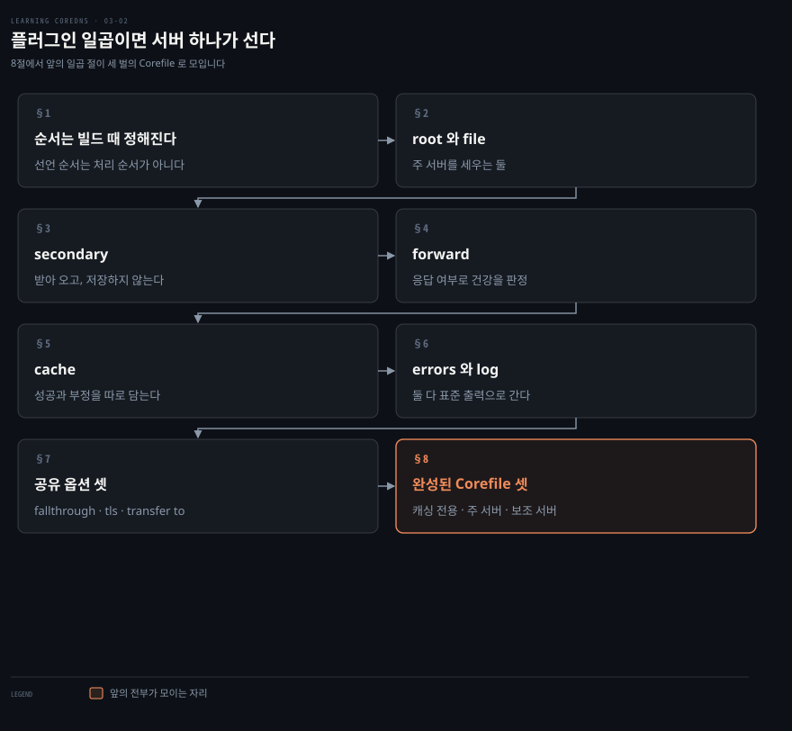
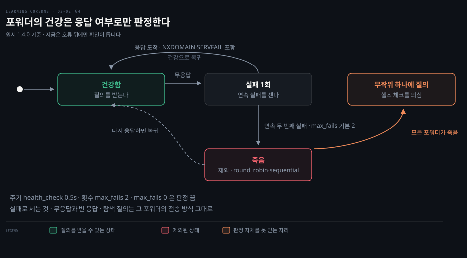
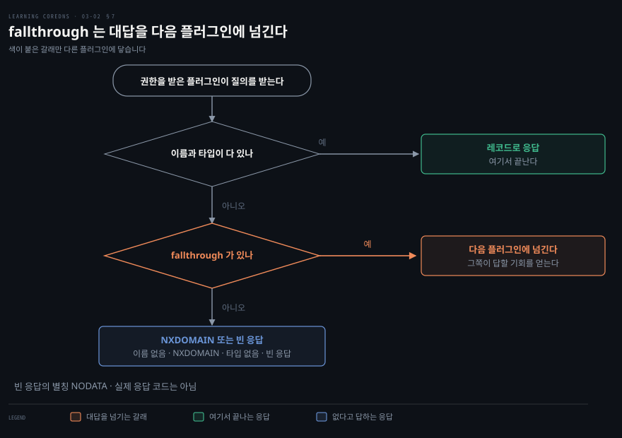
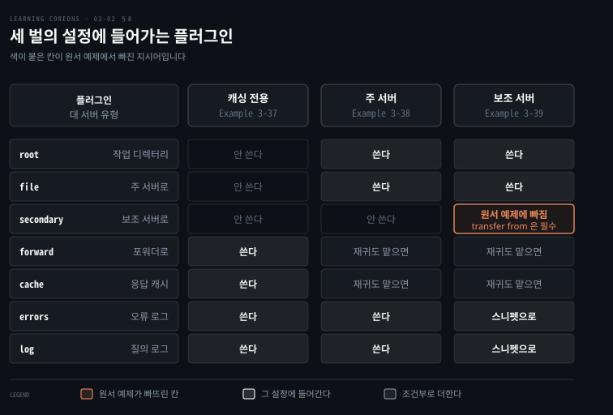

# 플러그인 일곱이면 서버 하나가 선다

---

> 서버 블록 안에 무엇을 적느냐가 그 서버가 하는 일입니다. 기본 플러그인 일곱이면 권한 서버와 캐싱 서버를 모두 세울 수 있습니다.

## 핵심 요약

> 이 절 전체가 매달린 하나의 생각은 CoreDNS 의 기능이 전부 플러그인이고, 그것이 요청을 처리하는 순서는 내가 정하지 않는다는 것입니다.

앞 편에서 라벨이 어느 질의를 받을지 정했다면, 여기서는 그 질의를 어떻게 처리할지가 정해집니다. 처리를 맡는 것이 플러그인이고, 저자가 고른 기본 일곱이면 쓸 만한 서버가 하나 섭니다.

여기서 걸려 넘어지기 쉬운 것이 순서입니다. Corefile 에 지시어를 어느 순서로 적든 처리 순서는 바뀌지 않습니다. 그 순서는 CoreDNS 를 빌드할 때 이미 정해져 있습니다.


## 학습 목표

이 내용을 읽고 나면:

1. 플러그인 처리 순서가 어디서 정해지는지 말하고 그 정본이 어느 파일인지 댈 수 있습니다.
2. `root`·`file`·`secondary` 로 주 서버와 보조 서버를 세우는 Corefile 을 쓰고, 지금 버전에서 나가는 전송을 어디에 적는지 말할 수 있습니다.
3. `forward` 가 포워더의 건강을 어떻게 판정하는지 상태로 설명하고, 원서와 지금 버전의 헬스 체크 차이를 비교할 수 있습니다.
4. `cache` 의 성공 캐시와 부정 캐시를 구분하고 프리페치의 조건을 말할 수 있습니다.
5. `fallthrough` 가 무엇을 넘기는지 질의 처리 흐름 위에서 짚을 수 있습니다.

아래는 이 문서 전체를 읽는 순서로 이은 지도입니다. 1절이 모든 플러그인에 걸리는 전제입니다. 2절부터 6절까지가 기본 일곱이고, 7절이 공유 옵션, 8절이 그 전부가 모인 설정 셋입니다.




## 이 문서가 다루지 않는 것

> 쿠버네티스 연동을 비롯한 고급 플러그인은 뒤 장들이 맡습니다.

- 존 데이터를 파일 아닌 곳에서 관리하는 법 → 원서 4장
- 쿠버네티스와 이어지는 플러그인 → 원서 6장
- 요청과 응답을 고쳐 쓰는 `template`·`rewrite` → 원서 7장
- Corefile 문법과 서버 블록 라벨 → [Corefile은 라벨로 서버를 가른다](./03-01.Corefile%EC%9D%80%20%EB%9D%BC%EB%B2%A8%EB%A1%9C%20%EC%84%9C%EB%B2%84%EB%A5%BC%20%EA%B0%80%EB%A5%B8%EB%8B%A4.md)

남는 것은 기본 플러그인 일곱과 그것으로 세우는 서버 세 벌입니다.


## 1. 순서는 빌드 때 정해진다

> Corefile 에 지시어를 어느 순서로 적든 처리 순서는 바뀌지 않습니다. 그 순서는 CoreDNS 를 빌드할 때 고정됩니다.

플러그인을 배우기 전에 이것을 모르면 나중에 왜 안 되는지 못 찾습니다. 설정 파일을 위아래로 바꿔 봐도 동작이 그대로이기 때문입니다.

저자가 별도 상자로 강조하는 내용입니다. 요청에 대해 플러그인이 동작하는 순서는 **컴파일 시점에 고정**됩니다. 서버 블록에 지시어가 어떤 순서로 나타나든 상관없이, 요청은 CoreDNS 를 빌드할 때 정해진 고정 순서로 각 플러그인을 지납니다. 기본 빌드의 순서는 CoreDNS 저장소의 `plugin.cfg` 에서 볼 수 있습니다.

CoreDNS 가 응답을 만드는 방식을 정하는 설정 지시어가 곧 플러그인입니다. DNS 기능을 구현한 소프트웨어 모듈입니다. 저자가 이 절에서 고른 것은 일곱인데, 몇 개 존에 권한을 갖고 포워더를 쓰며 그 응답을 캐시하는 서버 하나를 세우기에 충분한 만큼입니다.

원서는 순서가 고정이라는 사실까지만 말하므로 `plugin.cfg` 를 직접 열어 채웁니다. 머리말은 그 순서를 두고 `Ordering is VERY important.` 라고 대문자로 강조합니다. 이어서 모든 플러그인이 요청 처리 중에 자기 아래 플러그인들의 영향을 받되, 자기 위의 플러그인이 무엇을 하는지는 신경 써서는 안 된다고 적습니다.[^plugincfg]

이 일곱이 요청을 만나는 실제 순서는 `root`·`errors`·`log`·`cache`·`file`·`secondary`·`forward` 입니다.[^plugincfg] 아래 표는 저자가 설명한 순서라 이것과 다릅니다. `cache` 가 `forward` 보다 앞에 있으므로 캐시에 답이 있으면 포워더까지 가지 않고 끝납니다.

| 플러그인 | 하는 일 |
|----------|--------|
| `root` | CoreDNS 의 작업 디렉터리를 정합니다 |
| `file` | 파일에서 존 데이터를 읽어 그 존의 주 서버가 됩니다 |
| `secondary` | 마스터 DNS 서버에서 존 데이터를 받아 보조 서버가 됩니다 |
| `forward` | 질의를 포워더 하나 이상으로 넘깁니다 |
| `cache` | 질의에 대한 응답을 캐시합니다 |
| `errors` | 오류를 로그로 남깁니다 |
| `log` | 받은 질의를 하나씩 로그로 남깁니다 |


## 2. root 와 file — 주 서버 만들기

> `root` 는 존 데이터 파일을 찾을 디렉터리를 정하고, `file` 은 그 파일을 읽어 서버를 그 존의 주 서버로 만듭니다.

주 서버를 세우는 데 지시어 둘이면 되는데, 그 둘 사이에 순서가 아니라 **경로**의 관계가 있습니다. 이걸 놓치면 존 파일 이름만 적고 서버가 못 찾는 상황을 만납니다.

`root` 는 CoreDNS 의 현재 작업 디렉터리를 지정한다고 저자는 적습니다. 존 데이터 파일을 비롯한 것들을 여기서 찾습니다. CoreDNS 가 그 디렉터리의 파일을 읽을 수 있어야 하는 것은 당연한 전제입니다. 다만 현재 문서로 보면 이 디렉터리를 모든 플러그인이 따르지는 않습니다. 문서는 `root` 를 존중하는 플러그인으로 `file`·`tls`·`dnssec` 셋을 듭니다.[^root] 소스를 보면 4장의 `auto` 도 상대 경로 디렉터리에 `root` 를 붙입니다. 그래서 프로세스의 작업 디렉터리를 바꾸는 것이라기보다, 일부 플러그인이 상대 경로를 풀 때 쓰는 기준이라고 읽는 편이 정확합니다.

`file` 은 서버 블록의 존, 또는 지정한 존 목록에 대해 서버를 주 서버로 설정합니다. 주 서버는 존을 기술한 존 데이터 파일에서 데이터를 읽으므로 `file` 은 그 파일 이름을 인자로 받습니다.

```bash
file DBFILE [ZONES...] {
    transfer to ADDRESS...
    reload DURATION
}
```

`ZONES` 를 생략하면 그 파일은 서버 블록에 지정된 존의 데이터 파일로 읽힙니다. 지정하면 서버 블록의 존을 덮어씁니다. 다만 지정한 존은 서버 블록의 존 **안에** 들어야 합니다. 그러지 않으면 서버가 그 존에 대한 질의를 아예 받지 못합니다. 여러 존이 존 데이터 파일 하나를 공유한다면 그 파일은 상대 도메인 이름을 담아야 합니다.

`transfer to` 하위 지시어는 이 서버에서 보조 서버로 나가는 존 전송을 허용합니다. 인자로는 IPv4·IPv6 주소, CIDR(Classless Inter-Domain Routing, `10.0.0.0/8` 처럼 접두사 길이를 붙인) 표기의 네트워크, 그리고 모든 주소를 뜻하는 와일드카드 `*` 를 받습니다. 개별 주소를 인자로 준 경우 CoreDNS 는 존이 바뀔 때 그 서버들에 알립니다. NOTIFY 메시지를 쓰는 것입니다.

> **원문 정오**: 원서는 이 대목을 `"You can use multiple transfer from subdirectives in a single file directive"` 로 적습니다. `file` 플러그인의 하위 지시어는 `transfer to` 이고 `transfer from` 은 `secondary` 쪽에 있으므로, 여기서는 `transfer to` 가 맞습니다. 바로 위 문법 블록이 그것을 확인해 줍니다.

> **버전 차이**: 원서의 `transfer to` 하위 지시어는 CoreDNS 1.8.0 에서 빠졌습니다. 1.8.0 릴리스 노트는 나가는 존 전송을 하려는 플러그인이 이제 `transfer` 플러그인을 쓴다고 적습니다(`"plugins wanting to perform outgoing zone transfers now use this plugin: *file*, *auto*, *secondary* and *kubernetes* are converted"`).[^n180] 그래서 이 절과 3절의 `transfer to` 예제를 지금 버전에 그대로 넣으면 알 수 없는 하위 지시어라는 오류로 CoreDNS 가 뜨지 않습니다. 지금은 같은 서버 블록에 `transfer { to * }` 를 따로 둡니다.

`reload` 하위 지시어는 존 데이터 파일을 주기적으로 확인해 `SOA` 의 시리얼 번호가 올랐는지 보게 합니다. 올랐으면 존을 다시 읽습니다. 인자는 확인 간격이고 정수 뒤에 `s`·`m`·`h` 를 붙입니다. `0` 으로 두면 주기 확인이 꺼집니다.

```bash
foo.example {
    file db.foo.example {
        transfer to 10.0.0.1
    }
}

. {
    file db.template.example bar.example baz.example {
        transfer to *
    }
}
```


## 3. secondary — 받아 오고, 저장하지 않는다

> `secondary` 는 마스터에서 존을 받아 오게 합니다. 다만 CoreDNS 는 그 존을 디스크에 남기지 않습니다.

2장([위임이 그은 경계가 질의 경로를 정한다](./02-01.%EC%9C%84%EC%9E%84%EC%9D%B4%20%EA%B7%B8%EC%9D%80%20%EA%B2%BD%EA%B3%84%EA%B0%80%20%EC%A7%88%EC%9D%98%20%EA%B2%BD%EB%A1%9C%EB%A5%BC%20%EC%A0%95%ED%95%9C%EB%8B%A4.md) §4)에서 보조 서버는 받은 존 데이터를 백업 파일로 남겨 두기도 한다고 배웠습니다. CoreDNS 는 그러지 않습니다. 이 차이를 모르면 재시작 직후 보조 존이 왜 한동안 비어 있는지 설명하지 못합니다.

존을 지정하는 방식은 `file` 과 같습니다. 서버 블록에서 물려받거나 지시어의 인자로 적습니다.

```bash
secondary [ZONES...] {
    transfer from ADDRESS
    transfer to ADDRESS
}
```

`transfer from` 은 이 존을 받아 올 마스터 DNS 서버의 IPv4·IPv6 주소를 지정합니다. 마스터를 여럿 시도하게 하려면 `transfer from` 을 여러 번 씁니다. `transfer to` 는 `file` 에서와 똑같이 동작해, 어느 보조 서버가 이 CoreDNS 에서 존을 받아 갈 수 있는지를 정합니다.

여기서 저자가 특별히 짚는 것이 둘 있습니다. CoreDNS 서버는 보조 존의 데이터를 백업 존 데이터 파일에 저장하지 않습니다. 그래서 CoreDNS 가 재시작할 때마다 모든 보조 존을 마스터에서 다시 전송받아야 합니다. 그리고 증분 존 전송, 곧 IXFR 을 지원하지 않습니다. 전송은 언제나 존 전체를 담습니다. 보조 존이 여럿인 서버를 재시작하면 전체 전송이 한꺼번에 몰릴 수 있다는 것은 이 두 사실에서 노트가 끌어낸 추론입니다.

현재 문서도 두 사실을 그대로 적습니다. 받아 온 존은 `"*not committed* to disk (a violation of the RFC)"` 이고, 받는 방식은 AXFR 입니다.[^secondary] 다만 이것은 받는 쪽에 한한 이야기입니다. 1.8.0 부터 나가는 전송을 맡는 `transfer` 플러그인은 IXFR 요청을 받으면, 존이 바뀌었을 때 AXFR 로 대신 답합니다.

```bash
foo.example {
    secondary {
        transfer from 10.0.0.1
        transfer from 10.0.1.1
    }
}

. {
    secondary bar.example {
        transfer from 10.0.0.1
        transfer to *
    }
}
```


## 4. forward — 포워더와 헬스 체크

> `forward` 는 어떤 이름의 질의를 어느 포워더로 넘길지 정합니다. 그리고 그 포워더가 살아 있는지를 대역 안에서 스스로 확인합니다.



포워더를 여럿 적어 두면 하나가 죽었을 때 알아서 넘어갈 것 같은데, 무엇을 죽음으로 보는지 모르면 왜 죽은 서버로 계속 가는지 못 짚습니다.

기본 문법은 두 인자입니다.

```bash
forward FROM TO...
```

질의가 `FROM` 의 도메인 이름에 맞으면, 곧 그 도메인 안에 들면 CoreDNS 는 `TO` 로 지정한 서버들로 질의를 넘깁니다. 포워더를 IP 주소로만 적으면 평문 DNS 로 넘깁니다. 엔트리 라벨과 비슷하게 프로토콜 접두사를 붙일 수 있어서, `tls://` 는 DoT 를 받는 포워더를, `dns://` 는 전통적인 DNS 포워더를 가리킵니다. 포워더는 최대 15개까지 설정할 수 있습니다. 지금 버전은 여기에 `quic://`(DoQ)와 `https://`(DoH)도 받습니다.[^fwd]

```bash
# foo.example 질의는 10.0.0.1 로 넘긴다
foo.example {
    forward foo.example 10.0.0.1
}

# 나머지 전부는 Google Public DNS 로 DoT 를 타고 넘긴다
. {
    forward . tls://8.8.8.8 tls://8.8.4.4
}
```

건강 확인은 대역 안에서 이뤄집니다. CoreDNS 는 각 포워더에 0.5초마다 루트의 `NS` 레코드를 재귀 질의로 물어봅니다. 이 탐색 질의는 그 포워더에 설정된 전송 방식을 그대로 탑니다. 위 예제라면 `10.0.0.1` 에는 평문으로, `8.8.8.8` 과 `8.8.4.4` 에는 DoT 로 갑니다.

판정 기준이 느슨한 것이 이 절의 요점입니다. 포워더가 응답하기만 하면 건강한 것으로 셉니다. 그 응답이 `NXDOMAIN` 같은 부정 응답이든 `SERVFAIL` 같은 DNS 오류든 상관없습니다. 응답이 아예 없거나 빈 응답이 연속 두 번 오면 그때 죽은 것으로 표시합니다. 그리고 어떤 이유로든 모든 포워더가 죽어 보이면 CoreDNS 는 헬스 체크 장치 자체가 고장 났다고 보고 무작위로 고른 포워더에 질의합니다.

> **버전 차이**: 원서는 헬스 체크를 0.5초마다 늘 도는 것으로 설명합니다. 현재 `forward` 문서는 다르게 적습니다. 헬스 체크는 오류를 감지했을 때 시작해 그 포워더가 건강하지 않은 동안만 0.5초 간격으로 돌고, 건강해지면 멈춥니다(`"When it detects an error a health check is performed ... Once healthy we stop health checking (until the next error)"`). 건강의 기준도 `"Any response that is not a network error (REFUSED, NOTIMPL, SERVFAIL, etc) is taken as a healthy upstream"` 입니다.[^fwd] 응답만 오면 건강하다는 원서의 요점은 그대로이고, 빈 응답을 실패로 치는 것도 소스 주석(`"Dial timeouts and empty replies are considered fails"`)에 남아 있습니다.[^health] 달라진 것은 체크가 늘 도느냐입니다.

> **노트의 읽기**: 도식에서 죽은 포워더가 다시 건강해지는 경로는 원서가 문장으로 적지 않습니다. 다만 "응답하기만 하면 건강한 것으로 센다"는 판정 기준과 헬스 체크가 계속 돈다는 서술에서 따라 나옵니다.

확장 문법은 그 판정과 그 밖의 것들을 손보게 해 줍니다.

```bash
forward FROM TO... {
    except IGNORED_NAMES...
    force_tcp
    prefer_udp
    expire DURATION
    max_fails INTEGER
    health_check DURATION
    policy random|round_robin|sequential
    tls CERT KEY CA
    tls_servername NAME
}
```

`except` 는 `FROM` 에 지정한 도메인의 서브도메인 가운데 넘기지 **않을** 것을 지정합니다. `max_fails` 는 죽었다고 보기까지 필요한 연속 **헬스 체크** 실패 횟수로 기본값이 2이고, `0` 으로 두면 절대 죽었다고 표시하지 않습니다. `health_check` 는 확인 주기이며 기본값이 0.5초입니다. 지금 버전에서 이 주기는 위 버전 차이 상자처럼 오류 뒤에 도는 확인 루프의 간격입니다. `expire` 는 재사용하려고 들고 있던 TCP·TLS 연결을 언제 버릴지 정하며 기본값이 10초입니다.

`force_tcp` 와 `prefer_udp` 는 전송 방식을 강제합니다. 평소 CoreDNS 는 질의를 받은 것과 같은 프로토콜로 넘깁니다. `force_tcp` 는 UDP 로 받은 질의도 TCP 로 넘기게 하고, `prefer_udp` 는 그 반대입니다. 저자는 TCP 강제가 캐시 오염 공격에 대한 저항을 높이거나 방화벽 규칙을 짜기 쉽게 만들 수 있다고 덧붙입니다. 각주에는 단서가 하나 더 있습니다. UDP 로 넘긴 질의가 잘린 응답을 받으면 CoreDNS 가 알아서 TCP 로 다시 시도합니다.

`policy` 는 포워더 여럿을 무슨 순서로 물을지 정합니다.

| 값 | 동작 |
|----|------|
| `random` | 무작위로 하나를 고릅니다 |
| `round_robin` | 처음 물을 대상을 라운드 로빈으로 돌립니다. 첫 질의는 첫째부터, 다음 질의는 둘째부터 시작합니다 |
| `sequential` | 언제나 적힌 순서대로 갑니다. 매 질의가 첫째부터 시작합니다 |

저자는 `round_robin` 과 `sequential` 항목에만 죽은 포워더를 건너뛴다고 적습니다. `random` 에는 그 문장이 없습니다. 원서는 기본값을 적지 않는데, 현재 문서는 `"The default is random"` 이라고 밝힙니다.[^fwd]


## 5. cache — 성공과 부정을 따로 담는다

> `cache` 는 서버 블록마다 따로 설정합니다. 지시어를 적기만 해도 기본값으로 동작하고, 하위 지시어 셋으로 더 조일 수 있습니다.

캐시는 켜 두면 알아서 되는 것 같지만 기본값을 모르면 TTL 을 아무리 길게 줘도 안 늘어나는 이유를 못 찾습니다. CoreDNS 가 상한을 잘라내기 때문입니다.

```bash
cache [TTL] [ZONES...]
```

`cache` 를 적어 두기만 하면 CoreDNS 는 모든 출처의 데이터를 최대 한 시간, 곧 3,600초까지 캐시합니다. 다른 DNS 서버뿐 아니라 쿠버네티스 같은 백엔드에서 온 것도 포함합니다. 부정 응답은 최대 1,800초까지입니다. 그보다 긴 TTL 을 가진 레코드와 부정 응답은 **상한으로 잘라낸 뒤** 캐시합니다. `TTL` 인자로 다른 최대값을 줄 수 있습니다. 존을 지정하는 방식은 `file` 과 같습니다.

```bash
# foo.example 에 대해 10.0.0.1 에서 받은 데이터를 최대 600초 캐시
foo.example {
    forward . 10.0.0.1
    cache 600
}

# 8.8.8.8 이나 8.8.4.4 에서 받은 bar.example 데이터만 캐시
. {
    forward . 8.8.8.8 8.8.4.4
    cache 3600 bar.example
}
```

둘째 블록이 `ZONES` 인자의 쓰임을 보여 줍니다. 서버 블록은 루트라 모든 질의를 받지만, 캐시는 `bar.example` 것만 담습니다.

하위 지시어는 셋입니다.

```bash
cache [TTL] [ZONES...] {
    success CAPACITY [TTL] [MINTTL]
    denial  CAPACITY [TTL] [MINTTL]
    prefetch AMOUNT [DURATION] [PERCENTAGE%]
}
```

`success` 는 레코드를 담는 긍정 캐시를 세밀하게 다룹니다. `CAPACITY` 는 오래된 패킷을 무작위로 버리기 전까지 담아 둘 최대 패킷 수입니다. 기본값이 9,984이고 설정 가능한 최소값이 1,024입니다. 원서는 이 값이 256으로 나누어떨어지는 정수여야 한다고 적습니다.

현재 문서는 그렇지 않은 값도 거부하지 않습니다. 대신 256의 배수로 내려 맞춘다고 적습니다(`"rounded down to the nearest number divisible by 256"`).[^cache] 256은 캐시를 나누는 샤드 수이고, 샤드마다 크기를 같게 하려는 것입니다.

`TTL` 은 캐시의 최대 TTL 을, `MINTTL` 은 최소 TTL 을 덮어씁니다. 최소 TTL 의 기본값은 5초입니다.

`denial` 은 같은 통제를 부정 캐시에 줍니다. 여기서도 용량이 차면 오래된 항목이 무작위로 버려집니다.

`prefetch` 는 캐시에서 빠지기 전에 미리 다시 조회해 두는 동작입니다. 기본값은 꺼짐입니다. 켜면 조건이 이렇습니다. 어떤 캐시된 답에 대해 `AMOUNT` 만큼의 질의가 `DURATION` 이상 벌어지지 않고 들어오면, 그 답의 TTL 이 원래 값의 `PERCENTAGE` 에 닿았을 때 다시 조회합니다. `DURATION` 의 기본값은 1분이고 `PERCENTAGE` 의 기본값은 10%이며, 이 값은 정수 뒤에 `%` 를 붙여야 합니다.


## 6. errors 와 log — 표준 출력으로 나가는 것들

> 둘 다 표준 출력으로 나갑니다. `errors` 는 질의 처리 중 생긴 오류를, `log` 는 받은 질의 자체를 남깁니다.

앞 편에서 로그 목적지를 정하는 명령줄 옵션이 없다고 했는데, 그러면 무엇이 어디로 나가는지가 궁금해집니다. 이 절이 그 답입니다.

`errors` 는 서버 블록 안에서 질의를 처리하다 만난 오류를 로그로 남기게 합니다. 지시어 이름만 적으면 됩니다. 오류는 표준 출력으로 갑니다. `consolidate` 하위 지시어를 쓰면 같은 종류의 오류를 묶을 수 있습니다.

```bash
. {
    forward . 8.8.8.8 8.8.4.4
    cache 3600
    errors {
        consolidate 5m ".* timeout$"
        consolidate 30s "^Failed to .+"
    }
}
```

`consolidate DURATION REGEXP` 는 `DURATION` 동안 정규식에 맞는 오류 메시지를 모아 요약 한 줄로 남깁니다. 위 설정이면 타임아웃 메시지는 5분마다, 실패 메시지는 30초마다 묶여 `3 errors like '^Failed to .+' occurred in last 30s` 같은 줄이 나옵니다. 저자는 성능을 위해 정규식에 `^` 나 `$` 앵커를 쓰기를 권합니다.

> **원문 정오**: 원서의 이 예제(Example 3-30)는 닫는 중괄호가 하나뿐입니다. `errors {` 와 서버 블록 `. {` 을 각각 닫아야 하므로 둘이 필요합니다. 위 블록에는 채워 두었습니다. 2장 Example 2-18 의 괄호 누락과 같은 부류입니다.

`log` 는 받은 모든 질의와 응답 일부를 표준 출력으로 내보냅니다. 인자 없이 적으면 모든 요청에 대해 한 줄씩 남습니다.

```bash
2019-02-28T19:10:07.547Z [INFO] [::1]:50759 - 29008 "A IN foo.example. udp 41 f 4096" NOERROR qr,rd,ra,ad 68 0.037990251s
```

따옴표 안의 칸이 무엇인지는 아래 기본 형식에서 풀립니다. `f` 는 그 가운데 `{>do}`, 곧 DNSSEC OK 비트가 꺼져 있다는 뜻이고, 지금 버전의 문서 예시는 같은 자리에 `false` 를 찍습니다.[^log]

무엇을 어떤 모양으로 남길지도 정할 수 있습니다. `log [NAMES...] [FORMAT]` 에서 `NAMES` 는 로그를 남길 도메인 이름이고, 그 도메인으로 끝나는 이름이 모두 걸립니다. `FORMAT` 은 메시지 모양이며 기본값이 Common Log Format 입니다.

```bash
{remote}:{port} - {>id} "{type} {class} {name} {proto} {size} {>do} {>bufsize}" {rcode} {>rflags} {rsize} {duration}
```

쓸 수 있는 필드는 무엇을 보느냐로 묶으면 넷입니다.

- 질의 자체: 타입·이름·클래스·프로토콜·크기·ID·OPCODE
- 주고받은 쪽: 받은 IP 와 포트, 서버 쪽 IP
- 응답: 응답 코드·크기·플래그·처리 시간
- EDNS0(Extension Mechanisms for DNS, RFC 6891): 버퍼 크기·DNSSEC OK 비트

`{common}` 은 기본 형식 자체이고 `{combined}` 는 거기에 OPCODE 를 더한 것입니다.

응답의 종류로도 거를 수 있습니다. `success` 는 성공 응답 전부, `denial` 은 부정 응답 전부, `error` 는 서버 실패·미구현·형식 오류·거부를, `all` 은 앞의 셋 전부를 담습니다.

```bash
foo.example {
    file db.foo.example
    errors
    log {
        class success denial
    }
}

# 폐기된 baz.example 를 조회하는 클라이언트를 남긴다
. {
    forward . 8.8.8.8 8.8.4.4
    errors
    log baz.example "Client: {remote}, query name: {name}"
}
```

> **원문 정오**: `{>do}` 필드 설명의 `"the DNSSEC OK (DO) but was set"` 은 `bit` 의 오타입니다.


## 7. 여러 플러그인이 공유하는 옵션

> 같은 이름의 옵션이 여러 플러그인에 나타납니다. CoreDNS 개발자들이 같은 일을 하는 옵션은 플러그인 사이에서 같게 동작하도록 특별히 신경 쓴 결과입니다.



플러그인마다 옵션을 따로 외우려 들면 끝이 없습니다. 셋만 알아 두면 뒤 장들에서 반복해 만납니다.

### fallthrough — 다음 플러그인에 넘기기

`fallthrough` 는 질의 처리를 한 플러그인에서 다음 플러그인으로 넘길지 통제합니다. 이 옵션이 없으면 어떤 존에 권한을 받은 플러그인은 그 존의 질의에 무엇이든 응답을 내놓습니다. 요청한 이름이 없으면 `NXDOMAIN` 을 돌려줍니다. 이름은 있는데 요청한 타입의 데이터가 없으면 빈 응답을 돌려줍니다. 저자는 이 빈 응답을 NODATA 라 부르기도 하지만 그것이 실제 응답 코드는 아니라고 못 박습니다. 그런데 때로는 다른 플러그인에 답할 기회를 주고 싶습니다. `fallthrough` 가 하는 일이 그것입니다.

원서는 두 응답 가운데 어느 쪽에서 넘기는지를 따로 가르지 않습니다. 도식은 두 갈래를 한데 그렸고, 플러그인마다 다를 수 있다는 점은 뒤 장에서 플러그인별로 봅니다.

### tls — 바깥 대상과 말할 때 쓰는 인증서

`tls` 옵션은 클라이언트 쪽 TLS 인증서를 설정합니다. CoreDNS 가 쿠버네티스 같은 바깥 대상과 안전한 통신을 시작할 수 있게 하는 용도입니다. 서버의 TLS 인증서를 설정하는 `tls` **플러그인**과 헷갈리지 말라고 저자가 따로 경고합니다. 인자는 0개에서 3개입니다.

| 형태 | 하는 일 |
|------|--------|
| `tls` | 시스템에 설치된 표준 CA 로 서버 인증서를 검증합니다 |
| `tls CERT-FILE KEY-FILE` | 지정한 클라이언트 인증서를 제시하고, 서버 인증서는 시스템 CA 로 검증합니다 |
| `tls CERT-FILE KEY-FILE CA-FILE` | 클라이언트 인증서를 제시하고, 서버 인증서는 `CA-FILE` 의 인증서로 검증합니다 |

> **원문 정오**: 인자 없는 `tls` 를 설명하는 원서 문장은 `"the TLS client should verify the server's client certificate"` 입니다. TLS 클라이언트가 검증하는 것은 서버의 **서버 인증서**이므로 `client` 가 잘못 들어갔습니다. 위 표에는 뜻으로 옮겨 두었습니다.

### transfer to — 나가는 존 전송

`transfer to` 는 이 서버에서 보조 서버로 나가는 존 전송을 허용합니다. 2절에서 본 것과 같은 인자를 받고, 개별 주소를 준 경우 존이 바뀔 때 그 서버들에 알립니다. 2절의 버전 차이처럼 지금은 이 옵션 대신 `transfer` 플러그인이 같은 일을 합니다.


## 8. 완성된 Corefile 셋

> 저자는 이 일곱으로 캐싱 전용·주 서버·보조 서버 세 벌의 Corefile 을 만들어 보입니다.



낱개 지시어를 다 봐도 어떤 조합이 한 벌이 되는지는 알 수 없습니다. 무엇을 빼도 되는지는 더 모릅니다. 이 절의 세 예제가 그 조합을 보여 줍니다.

### 캐싱 전용 서버

캐싱 전용 서버는 어떤 이름이든 조회할 수 있지만 어느 존에도 권한이 없습니다. 자주 조회되는 레코드의 로컬 캐시를 제공하므로 바쁜 서버에서 쓸모가 있습니다. 설정은 단순합니다. 루트 엔트리 하나에 `forward` 로 포워더를 알려 주고, `cache` 로 받은 응답을 캐시하게 합니다. `forward` 가 꼭 필요한 이유를 저자는 CoreDNS 가 아직 스스로 재귀하지 못하기 때문이라고 적습니다. 1장 표 1-1 의 첫 줄과 같은 이야기입니다. 나중에 문제를 짚으려고 `errors` 와 `log` 도 넣습니다.

> **원문 정오**: 이 대목의 원서 문장 `"the errors and logs plug-ins"` 에서 플러그인 이름은 `logs` 가 아니라 `log` 입니다.

```bash
. {
    forward . 8.8.8.8 8.8.4.4
    cache
    errors
    log
}
```

### 주 서버

주 서버는 존 하나나 몇 개를 맡습니다. 권한을 가질 존의 엔트리를 두고, `root` 로 존 데이터 파일을 둘 디렉터리를 알려 준 뒤 `file` 로 그 파일을 지정합니다. `root` 를 쓰지 않으면 존 파일의 전체 경로를 적어야 하는데, 존이 하나뿐이면 큰일은 아니라고 저자는 덧붙입니다. 권한 서버와 재귀 서버를 겸하려면 루트 엔트리를 하나 더 두고 포워더와 캐시를 겁니다.

```bash
foo.example {
    root /etc/coredns/zones
    file db.foo.example
    errors
    log
}

# 재귀 질의도 처리하려면 아래 엔트리가 더 필요하다. 권한 전용이면 생략한다.
. {
    forward . 8.8.8.8 8.8.4.4
    cache
    errors
    log
}
```

### 보조 서버

보조 서버는 자기가 권한을 가진 존의 질의에 권한 있게 답하되, 그 존은 다른 서버에서 관리됩니다. 주 서버 설정에 보조 존 엔트리를 더한 모양이고, 마스터 주소를 지정하는 `transfer from` 이 필수입니다. 여기서 저자는 `errors` 와 `log` 를 여러 번 쓰게 되므로 `logerrors` 라는 재사용 스니펫을 정의해 둘을 대신합니다.

```bash
(logerrors) {
    errors
    log
}

bar.example {
    secondary {
        transfer from 10.0.0.1
    }
    import logerrors
}

# 한 서버가 어떤 존에는 보조, 다른 존에는 주 서버일 수 있다
foo.example {
    file db.foo.example
    root /etc/coredns/zones
    import logerrors
}

. {
    forward . 8.8.8.8 8.8.4.4
    cache
    import logerrors
}
```

> **원문 정오**: 위 블록은 원서 Example 3-38·3-39 를 두 곳 고쳐 옮긴 것입니다. 첫째, 원서는 `bar.example` 블록에 `transfer from 10.0.0.1` 만 적고 `secondary` 지시어를 빠뜨렸습니다. `transfer from` 은 `secondary` 의 하위 지시어이므로 그대로는 동작하지 않습니다. 둘째, 원서의 두 예제는 `forward 8.8.8.8 8.8.4.4` 로 적어 `FROM` 인자를 빠뜨렸습니다. 문법은 `forward FROM TO...` 이고 같은 장의 다른 예제들은 모두 `forward . 8.8.8.8 8.8.4.4` 로 적고 있습니다.


## 결정 치트시트

> 3장 후반부만으로 가를 수 있는 판단을 모았습니다. 근거는 모두 본문입니다.

| 상황 | 판단 | 이유 |
|------|------|------|
| 지시어 순서를 바꿔도 동작이 그대로다 | 순서로 고칠 수 없다 | 처리 순서는 빌드 때 고정되며 `plugin.cfg` 가 정본 |
| 존 파일 이름만 적고 서버가 못 찾는다 | `root` 로 디렉터리를 주거나 전체 경로를 적는다 | `file` 은 그 디렉터리 기준으로 파일을 찾는다 |
| 보조 서버 재시작 때마다 전체 전송이 일어난다 | CoreDNS 에서는 정상이다 | 백업 존 파일을 남기지 않고 IXFR 도 받지 않는다 |
| 원서의 `transfer to` 를 넣었더니 CoreDNS 가 안 뜬다 | `transfer { to ... }` 플러그인으로 옮긴다 | 1.8.0 부터 나가는 전송은 `transfer` 플러그인이 맡는다 |
| 죽은 포워더로 질의가 계속 간다 | 응답이 오고 있는지 본다 | `SERVFAIL` 이라도 응답이면 건강한 것으로 센다(원서·현행 공통) |
| 모든 포워더가 죽은 것으로 보인다 | 헬스 체크 쪽을 먼저 의심한다 | CoreDNS 도 그렇게 보고 무작위 하나에 질의한다 |
| TTL 을 길게 줬는데 캐시가 그만큼 안 남는다 | `cache` 의 최대값을 확인한다 | 기본 상한 3,600초로 잘라낸 뒤 캐시한다 |
| 자주 조회되는 답의 지연을 줄이고 싶다 | `prefetch` 를 켠다 | 기본은 꺼져 있고, 켜면 `AMOUNT` 번의 질의가 1분 이상 끊기지 않고 온 답을 TTL 이 10%에 닿을 때 다시 조회한다 |
| 다른 플러그인에도 답할 기회를 주고 싶다 | `fallthrough` 를 붙인다 | 없으면 권한을 받은 플러그인이 `NXDOMAIN` 이나 빈 응답으로 끝낸다 |
| 오류 로그가 같은 메시지로 넘친다 | `errors` 에 `consolidate` 를 건다 | 정규식에 맞는 것을 묶어 요약 한 줄로 남긴다 |


## 적용 관점

> 세 벌의 Corefile 가운데 하나를 그대로 띄워 보는 것이 가장 빠릅니다.

**한 가지 실행**: 캐싱 전용 Corefile 네 줄을 만들어 비표준 포트로 띄웁니다. 그리고 `log` 가 표준 출력으로 뱉는 줄을 눈으로 봅니다. 그 한 줄이 6절의 Common Log Format 입니다. 필드를 하나씩 짚어 보면 형식이 몸에 붙습니다.

```bash
printf '. {\n    forward . 8.8.8.8 8.8.4.4\n    cache\n    errors\n    log\n}\n' > Corefile
coredns -dns.port 1053
dig @127.0.0.1 -p 1053 example.com
```

쿠버네티스 위의 Spring 애플리케이션 쪽에서 보면 이 절은 클러스터 CoreDNS 의 ConfigMap 을 그대로 읽게 해 줍니다. 그 파일에도 `errors`·`cache`·`forward` 가 들어 있습니다. `log` 는 권고 기본값에 없어서 질의 로그가 필요하면 직접 켜야 합니다.

여기서 배우지 않은 것은 클러스터 이름을 맡는 `kubernetes` 와 `health`·`ready`·`prometheus`·`loop`·`reload`·`loadbalance` 입니다. `fallthrough` 도 `kubernetes` 옆에서 `fallthrough in-addr.arpa ip6.arpa` 모양으로 만나는데, 이것은 모르는 IP 의 역방향(PTR) 조회를 뒤쪽 `forward` 로 넘기는 자리입니다.

클러스터 밖 이름은 애초에 `kubernetes` 가 맡은 존이 아니어서 `fallthrough` 없이도 다음 플러그인으로 갑니다. 줄마다의 이유는 [기본 Corefile의 줄마다 이유가 있다](./06-02.%EA%B8%B0%EB%B3%B8%20Corefile%EC%9D%98%20%EC%A4%84%EB%A7%88%EB%8B%A4%20%EC%9D%B4%EC%9C%A0%EA%B0%80%20%EC%9E%88%EB%8B%A4.md)가 다룹니다.


## 면접에서 받을 만한 질문

> 자답한 뒤 아래 정답과 맞춰 봅니다.

1. Corefile 에서 지시어 순서를 바꾸면 처리 순서가 바뀝니까?
2. `file` 과 `secondary` 는 무엇이 다릅니까?
3. CoreDNS 보조 서버가 재시작하면 무슨 일이 일어납니까?
4. CoreDNS 는 포워더가 죽었다고 어떻게 판정합니까?
5. `cache` 를 인자 없이 적으면 어떤 값으로 동작합니까?
6. `fallthrough` 는 무엇을 넘깁니까?
7. `cache 600` 을 건 서버 블록에 TTL 이 7,200초인 레코드가 들어오면 캐시에는 얼마 동안 남습니까? 그 뒤 같은 이름을 다시 물으면 누가 답합니까?
8. 포워더 하나가 모든 질의에 `SERVFAIL` 만 돌려준다면 CoreDNS 는 그 포워더를 죽었다고 봅니까? 그 판단이 운영에서 어떤 문제를 낳을 수 있습니까?


## 정답 (자답 후 펼치기)

### 정답 1 — 지시어 순서

바뀌지 않습니다. 플러그인이 요청에 대해 동작하는 순서는 컴파일 시점에 고정되며, 기본 빌드의 순서는 저장소의 `plugin.cfg` 에 있습니다.

### 정답 2 — `file` 과 `secondary`

`file` 은 존 데이터 파일에서 존을 읽어 그 존의 주 서버가 되게 합니다. `secondary` 는 마스터 DNS 서버에서 존 전송으로 존을 받아 보조 서버가 되게 합니다. 존 지정 방식은 둘 다 서버 블록에서 물려받거나 인자로 적는 식으로 같습니다.

### 정답 3 — 보조 서버 재시작

모든 보조 존을 마스터에서 다시 전송받습니다. CoreDNS 는 보조 존 데이터를 백업 존 데이터 파일에 저장하지 않기 때문입니다. 게다가 증분 전송인 IXFR 을 지원하지 않아 전송은 언제나 존 전체입니다.

### 정답 4 — 포워더의 죽음 판정

루트의 `NS` 를 재귀 질의로 물어 응답이 오는지 봅니다. 응답이기만 하면 `NXDOMAIN` 이나 `SERVFAIL` 이어도 건강한 것으로 셉니다. 응답이 없거나 빈 응답이 연속 두 번이면 죽은 것으로 표시합니다. 그 횟수는 `max_fails` 로 바꿉니다. 원서는 이 확인이 0.5초마다 늘 돈다고 적지만, 지금 버전은 오류가 난 뒤에만 0.5초 간격으로 돌다가 건강해지면 멈춥니다.

### 정답 5 — 인자 없는 `cache`

모든 출처의 데이터를 최대 3,600초, 부정 응답은 최대 1,800초까지 캐시합니다. 그보다 긴 TTL 은 그 상한으로 잘라낸 뒤 담습니다. 최소 TTL 의 기본값은 5초입니다.

### 정답 6 — `fallthrough`

대답할 기회를 다음 플러그인에 넘깁니다. 이 옵션이 없으면 존에 권한을 받은 플러그인이 이름이 없을 때 `NXDOMAIN`, 타입이 없을 때 빈 응답으로 그 질의를 끝내 버립니다.

### 정답 7 — 상한에 잘리는 TTL

600초만 남습니다. `cache` 는 상한보다 긴 TTL 을 상한으로 잘라낸 뒤 담기 때문입니다. 600초가 지나면 캐시에 없으므로, `plugin.cfg` 순서상 `cache` 뒤에 있는 `forward` 까지 질의가 내려가 포워더가 다시 답합니다.

### 정답 8 — `SERVFAIL` 만 주는 포워더

죽었다고 보지 않습니다. 응답이 오기만 하면 건강한 것으로 세기 때문입니다. 그래서 상류가 고장 나 `SERVFAIL` 만 돌려주는 포워더에도 질의가 계속 가고, 클라이언트는 그 `SERVFAIL` 을 그대로 받습니다. 헬스 체크가 막아 주는 것은 응답이 아예 없는 네트워크 고장이지 잘못된 답이 아닙니다.


## 핵심 개념 체크리스트

- [ ] 플러그인 처리 순서가 어디서 정해지고 정본이 어느 파일인지, 일곱 가운데 `cache` 가 `forward` 보다 앞에 있다는 것이 무엇을 뜻하는지 말할 수 있는가?
- [ ] `root`·`file`·`secondary` 로 주 서버와 보조 서버를 함께 두는 Corefile 을 쓰고, 지금 버전에서는 나가는 전송을 어디에 적는지 아는가?
- [ ] 포워더의 건강 판정 기준과 모두 죽었을 때의 동작, 그리고 원서와 지금 버전의 헬스 체크 차이를 말할 수 있는가?
- [ ] `success` 와 `denial` 이 각각 무엇을 담는지 구분하고, 프리페치가 켜지는 세 조건을 댈 수 있는가?
- [ ] `fallthrough` 가 붙는 자리와 붙지 않았을 때의 응답을 질의 처리 흐름 위에서 짚을 수 있는가?


## 관련 문서

- [Learning CoreDNS 정독 인덱스](./README.md) — 이 책의 장별 진행 상황
- [Corefile은 라벨로 서버를 가른다](./03-01.Corefile%EC%9D%80%20%EB%9D%BC%EB%B2%A8%EB%A1%9C%20%EC%84%9C%EB%B2%84%EB%A5%BC%20%EA%B0%80%EB%A5%B8%EB%8B%A4.md) — 이 플러그인들이 들어가는 그릇
- [레코드 한 줄을 읽으면 존 파일이 읽힌다](./02-02.%EB%A0%88%EC%BD%94%EB%93%9C%20%ED%95%9C%20%EC%A4%84%EC%9D%84%20%EC%9D%BD%EC%9C%BC%EB%A9%B4%20%EC%A1%B4%20%ED%8C%8C%EC%9D%BC%EC%9D%B4%20%EC%9D%BD%ED%9E%8C%EB%8B%A4.md) — `file` 이 읽어 들일 파일의 문법
- [DNS와 CoreDNS](../../kubernetes/04_networking/04-05.DNS%EC%99%80%20CoreDNS.md) — 쿠버네티스 CoreDNS ConfigMap 의 실물


## 참고 자료

- 원서: 《Learning CoreDNS: Configuring DNS for Cloud Native Environments》 3장 Configuring CoreDNS 후반부
- 서지: John Belamaric·Cricket Liu, O'Reilly, 2019년, ISBN 978-1492047964
- [CoreDNS `plugin.cfg`](https://raw.githubusercontent.com/coredns/coredns/master/plugin.cfg) — 플러그인 처리 순서의 1차 자료

[^plugincfg]: CoreDNS `plugin.cfg` — 일곱의 줄 번호는 `root:root` 22, `errors:errors` 44, `log:log` 45, `cache:cache` 57, `file:file` 72, `secondary:secondary` 74, `forward:forward` 77. 머리말 — "Directives are registered in the order they should be executed. Ordering is VERY important. Every plugin will feel the effects of all other plugin below (after) them during a request, but they must not care what plugin above them are doing." 첫 항목은 `root:root`. <https://raw.githubusercontent.com/coredns/coredns/master/plugin.cfg> (2026-09-23 조회)

[^n180]: CoreDNS 1.8.0 릴리스 노트 — "the `transfer` plugin is now made a first class citizen and plugins wanting to perform outgoing zone transfers now use this plugin: *file*, *auto*, *secondary* and *kubernetes* are converted." <https://raw.githubusercontent.com/coredns/coredns/master/notes/coredns-1.8.0.md>

[^root]: CoreDNS `root` 문서 — "The *root* directory is NOT currently supported by all plugins. Currently the following plugins respect the *root* plugin configuration: *file*, *tls*, *dnssec*". <https://coredns.io/plugins/root/> (2026-09-23 조회)

[^secondary]: CoreDNS `secondary` 문서 — "With *secondary* you can transfer (via AXFR) a zone from another server. The retrieved zone is *not committed* to disk (a violation of the RFC)." <https://coredns.io/plugins/secondary/> (2026-09-23 조회)

[^fwd]: CoreDNS `forward` 문서 — "When it detects an error a health check is performed. This checks runs in a loop, performing each check at a *0.5s* interval for as long as the upstream reports unhealthy. Once healthy we stop health checking (until the next error).", "Any response that is not a network error (REFUSED, NOTIMPL, SERVFAIL, etc) is taken as a healthy upstream.", "The default is `random`." <https://coredns.io/plugins/forward/> (2026-09-23 조회)

[^health]: CoreDNS `plugin/pkg/proxy/health.go` 주석 — "Dial timeouts and empty replies are considered fails, basically anything else constitutes a healthy upstream." <https://raw.githubusercontent.com/coredns/coredns/master/plugin/pkg/proxy/health.go> (2026-09-23 조회)

[^cache]: CoreDNS `cache` 문서 — "If **CAPACITY** _is_ specified, the actual cache size used will be rounded down to the nearest number divisible by 256 (so all shards are equal in size)." <https://coredns.io/plugins/cache/> (2026-09-23 조회)

[^log]: CoreDNS `log` 문서 예시 — `"A IN example.org. udp 41 false 4096"`. <https://coredns.io/plugins/log/> (2026-09-23 조회)
