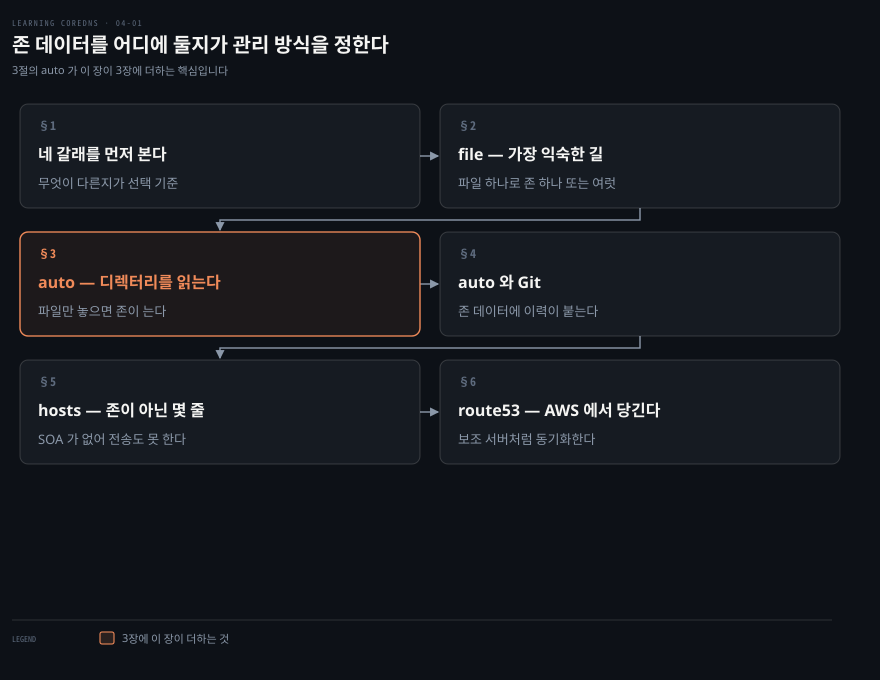
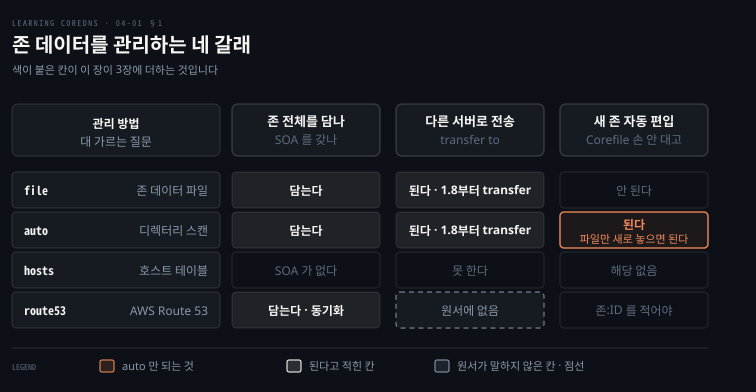
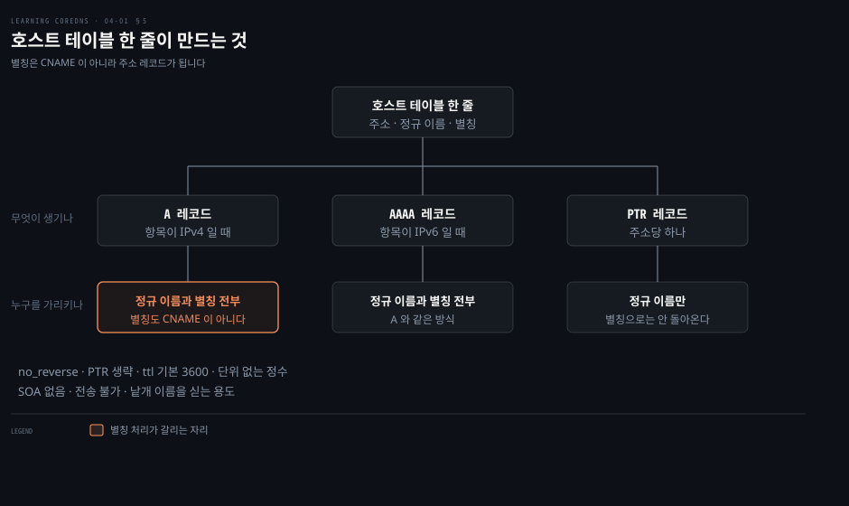

# 존 데이터를 어디에 둘지가 관리 방식을 정한다

---

> CoreDNS 는 존 데이터를 파일에서만 읽지 않습니다. 디렉터리를 통째로 스캔하고, 호스트 테이블을 읽고, AWS Route 53 에서 당겨 옵니다. 어디에 두느냐가 그 데이터를 누가 어떻게 고치는지를 정합니다.

## 핵심 요약

> 이 장 전체가 매달린 하나의 생각은 **존 데이터의 출처를 바꾸면 관리 방식이 통째로 바뀐다**는 것입니다.

3장은 `file` 하나로 주 서버를 세웠습니다. 4장은 그 자리에 놓을 수 있는 것이 셋 더 있다고 말합니다. 디렉터리를 스캔하는 `auto`, 호스트 테이블을 읽는 `hosts`, Route 53 에서 동기화하는 `route53` 입니다.

이 노트는 넷을 세 축으로 갈라 봅니다. 존 전체를 담는지, 다른 서버로 전송할 수 있는지, 새 존이 저절로 들어오는지입니다. 저자가 이렇게 세지는 않지만, 이 셋으로 보면 마지막 것이 `auto` 만의 것이고 그것이 이 장이 3장에 더하는 알맹이라는 게 드러납니다.


## 학습 목표

이 내용을 읽고 나면:

1. 존 데이터 관리 방법 넷을 대고 무엇이 다른지 세 축으로 가를 수 있습니다.
2. 존 데이터 파일 하나를 여러 존에 쓰는 조건과 그 대가를 말할 수 있습니다.
3. `auto` 가 파일 이름에서 존 이름을 어떻게 뽑는지 정규식 예로 설명할 수 있습니다.
4. `hosts` 가 한 줄에서 만드는 레코드 셋과 별칭 처리의 함정을 짚을 수 있습니다.
5. `route53` 이 존을 지정하는 형식과 자격증명을 주는 세 경로를 말할 수 있습니다.

아래는 이 문서 전체를 읽는 순서로 이은 지도입니다. 1절이 네 갈래의 지도입니다. 2절부터 4절까지가 파일 계열이고, 5절과 6절이 파일이 아닌 두 갈래입니다.




## 이 문서가 다루지 않는 것

> 이 장은 존 데이터의 출처만 다룹니다. 그 데이터를 어떻게 응답으로 바꾸는지는 앞뒤 장이 맡습니다.

- Corefile 문법과 서버 블록 라벨 → [Corefile은 라벨로 서버를 가른다](./03-01.Corefile%EC%9D%80%20%EB%9D%BC%EB%B2%A8%EB%A1%9C%20%EC%84%9C%EB%B2%84%EB%A5%BC%20%EA%B0%80%EB%A5%B8%EB%8B%A4.md)
- `forward`·`cache`·`errors`·`log` 를 비롯한 나머지 기본 플러그인 → [플러그인 일곱이면 서버 하나가 선다](./03-02.%ED%94%8C%EB%9F%AC%EA%B7%B8%EC%9D%B8%20%EC%9D%BC%EA%B3%B1%EC%9D%B4%EB%A9%B4%20%EC%84%9C%EB%B2%84%20%ED%95%98%EB%82%98%EA%B0%80%20%EC%84%A0%EB%8B%A4.md)
- 존 데이터 파일 자체의 문법 → [레코드 한 줄을 읽으면 존 파일이 읽힌다](./02-02.%EB%A0%88%EC%BD%94%EB%93%9C%20%ED%95%9C%20%EC%A4%84%EC%9D%84%20%EC%9D%BD%EC%9C%BC%EB%A9%B4%20%EC%A1%B4%20%ED%8C%8C%EC%9D%BC%EC%9D%B4%20%EC%9D%BD%ED%9E%8C%EB%8B%A4.md)
- 서비스 디스커버리와 쿠버네티스 연동 → 원서 5장과 6장

남는 것은 **존 데이터가 어디서 오는가**입니다.


## 1. 네 갈래를 먼저 본다

> 저자가 성격을 붙인 것은 셋입니다. 존 데이터 파일은 익숙하고, Git 은 현대적이며, 호스트 테이블은 대놓고 복고입니다.



무엇을 고를지는 기능이 아니라 **관리 방식**이 정합니다. 넷 다 이름을 주소로 바꿔 주지만, 누가 어떻게 고치고 되돌리는지가 다릅니다. 그 차이를 모르면 나중에 바꾸기 어려운 쪽을 고르게 됩니다.

전통적인 DNS 서버에서는 관리자가 주 존 데이터를 파일로 다뤘습니다. 최근에는 데이터베이스 같은 다른 출처에서 주 존 데이터를 읽는 서버가 나오기 시작했다고 저자는 짚습니다. CoreDNS 는 그 여러 방법을 다 지원합니다.

저자가 각 방법에 붙이는 성격이 선택의 실마리입니다. 호스트 테이블은 존 데이터 파일 하나를 통째로 만들고 유지하는 부담 없이 이름에서 주소로, 주소에서 이름으로 잇는 간단한 길입니다. Git 은 분산 버전 관리를 얹습니다.


## 2. file — 가장 익숙한 길

> 존 데이터 파일을 다뤄 본 사람에게 가장 익숙한 방법입니다. 3장에서 이미 봤지만 여기서 더 자세히 봅니다.

경로를 어떻게 적느냐에서 먼저 걸립니다. 상대 경로가 무엇을 기준으로 풀리는지 모르면 파일을 못 찾는 이유를 못 짚습니다.

```bash
file DBFILE [ZONES...]
```

`DBFILE` 은 리소스 레코드를 담은 존 데이터 파일입니다. 전체 경로로 적어도 되고 상대 경로로 적어도 되는데, 상대 경로는 `root` 지시어로 설정한 경로를 기준으로 풀립니다. `ZONES` 는 그 파일이 기술하는 존 목록이고, 생략하면 설정 블록의 존을 씁니다.

```bash
foo.example {
    file db.foo.example
}
```

> **원문 정오**: 원서가 이 설정과 짝지어 보여 주는 존 파일 Example 4-3 에는 `www IN AAAA 2001:db8:42:1:1` 이 들어 있습니다. 그룹이 다섯뿐이라 유효한 IPv6 주소가 아니며, 같은 파일의 `ns1`·`ns2` 는 `2001:db8:42:1::53` 처럼 `::` 를 제대로 씁니다. 2장 Example 2-6·2-7 에서 나온 것과 같은 부류이고, 이 파일은 그대로는 로드되지 않습니다.

여기서 저자가 짚는 요령이 하나 있습니다. 존 데이터 파일의 레코드가 전부 **상대 도메인 이름**에 붙어 있으면, 곧 점으로 끝나는 완전한 이름이 아니라 `ns1` 이나 `www` 같은 형태이면, 그 파일 하나로 여러 존을 기술할 수 있습니다.

```bash
. {
    file db.foo.example foo.example bar.example
}
```

물론 이것은 `foo.example` 과 `bar.example` 의 내용이 똑같기를 바랄 때 이야기입니다. `www.foo.example` 과 `www.bar.example` 이 둘 다 같은 주소로 가야 한다는 뜻입니다.

자세한 문법은 셋을 더 줍니다.

```bash
file DBFILE [ZONES... ] {
    transfer to ADDRESS...
    reload DURATION
    upstream [ADDRESS...]
}
```

`transfer` 지시어가 없으면 CoreDNS 는 그 존의 전송을 아예 허용하지 않습니다. 특정 보조 서버에 NOTIFY 를 보내면서 전송도 허용하려면 그 보조의 IP 를 적습니다. 보조가 여럿이면 한 지시어에 나열해도 되고 지시어를 여러 번 써도 됩니다. CIDR 표기로 네트워크를 주면 그 대역의 어느 주소에서든 전송할 수 있고, `*` 는 어디서든 허용합니다.

```bash
foo.example {
    file db.foo.example {
        transfer to 10.0.1.53
        transfer to *
    }
}
```

위 두 줄은 보조 서버 둘을 적은 것이 아닙니다. 앞줄은 그 주소에 NOTIFY 를 보내면서 전송도 허용하라는 뜻이고, 뒷줄은 전송 자체는 어디서 요청하든 받아 주라는 뜻입니다. 하나는 알림 대상이고 하나는 허용 범위입니다.

`reload` 는 존 데이터 파일의 `SOA` 시리얼 번호가 바뀌었는지 확인하는 주기입니다. 새 시리얼을 발견하면 파일을 다시 읽고, `transfer` 에 지정된 보조 서버들에 NOTIFY 를 보냅니다. **기본값은 1분**이고 `0` 으로 두면 주기 확인이 꺼집니다. 값은 숫자 뒤에 `s`·`m`·`h` 를 붙입니다.


## 3. auto — 디렉터리를 통째로 읽는다

> `file` 은 존 몇 개짜리에 맞습니다. 수백 개 존의 주 서버가 되려면 `auto` 가 필요합니다.

존이 늘 때마다 Corefile 에 줄을 더하는 방식은 존이 몇 개일 때만 견딥니다. 수백 개가 되면 설정 파일 자체가 관리 대상이 되어 버립니다. 존 하나를 더할 때마다 왜 설정 파일을 열어야 하는지가 이 절의 물음입니다.

`auto` 는 여러 존 데이터 파일에서 많은 존을 한 번에 읽어 들이는 방법입니다. Corefile 의 길이와 복잡도를 줄이고, 새 존의 주 서버로 CoreDNS 를 **자동으로** 설정할 수 있게 해 줍니다.

```bash
auto [ZONES...] {
    directory DIR [REGEXP ORIGIN_TEMPLATE]
    transfer to ADDRESS...
    reload DURATION
}
```

`auto` 는 디렉터리를 스캔해 `db.*` 패턴에 맞는 파일을 찾습니다. 각 파일은 존 데이터 파일로 해석되고, 그 존의 origin 은 `db.` 뒤에 오는 것입니다. 그 origin 은 `ZONES` 를 지정했다면 그 안에 들어야 합니다.

디렉터리에 `db.foo.example` 과 `db.bar.example` 이 있다면 아래 설정 하나가 두 존을 다 읽어 들입니다.

```bash
auto example {
    directory /etc/coredns/zones
}
```

여기가 이 절의 요점입니다. 그 디렉터리에 이름만 제대로 붙인 파일을 새로 만들면 존이 하나 더 생깁니다. Corefile 은 손대지 않습니다. 다만 저자가 괄호로 다는 단서가 있습니다. 새로 생기는 존은 `ZONES` 로 적어 둔 도메인, 위 예제라면 `example` 아래여야 합니다.

파일 이름 규칙이 `db.*` 가 아니어도 됩니다. 정규식과 origin 만드는 법을 함께 줄 수 있습니다. 존 파일을 `<도메인>.zone` 으로 이름 붙였다면 이렇게 씁니다.

```bash
auto example {
    directory /etc/coredns/zones (.*)\.zone {1}
}
```

정규식은 사실상 Perl 캡처 그룹을 담을 것으로 기대됩니다. `.*` 를 감싼 괄호가 origin 이 들어 있는 파일 이름의 구간을 가리키고, 여기서는 `.zone` 앞의 전부입니다. `{1}` 은 그 구간에 대한 역참조입니다. 두 번째 캡처 그룹이 필요하면 `{2}` 처럼 다른 역참조도 쓸 수 있습니다.

`file` 의 `transfer`·`reload`·`upstream` 을 그대로 쓸 수 있습니다. 어느 서버가 이 존들을 전송받고 NOTIFY 를 받을지, 디렉터리를 얼마나 자주 스캔할지, 외부 이름을 풀 때 어느 서버를 쓸지를 정합니다.


## 4. auto와 Git — 존 데이터에 이력이 붙는다

> `auto` 는 디렉터리만 봅니다. 그 디렉터리를 Git 저장소와 동기화해 두면 존 데이터에 버전 관리가 붙습니다.

존 파일을 여럿이 고치기 시작하면 누가 언제 무엇을 바꿨는지가 곧 문제가 됩니다. `auto` 자체는 그 문제를 풀지 않지만, 디렉터리만 보는 구조라 앞단에 무엇을 붙여도 됩니다.

Git 을 즐겨 쓴다면 `auto` 를 `git-sync` 같은 스크립트와 묶으면 됩니다. 주기적으로 Git 저장소에서 존 데이터 파일을 디렉터리로 당겨 오고, CoreDNS 가 그 디렉터리를 스캔해 새 존과 바뀐 존을 읽습니다. 여러 관리자가 버전 관리되는 존 파일 묶음을 함께 관리하면서 변경 이력을 추적할 수 있습니다.

`git-sync` 는 컨테이너로 구현돼 있습니다.

```bash
docker run -d \
   -v /etc/coredns/zone:/tmp/git \
   registry/git-sync \
     --repo=https://github.com/myzonedata \
     --branch=master \
     --wait=30
```

> **원문 정오**: 원서 Example 4-10 은 `--repo`·`--branch`·`--wait` 세 줄에 줄바꿈 이스케이프 `\` 가 없습니다. 그대로 옮겨 붙이면 `--branch=master` 부터가 별도 명령으로 실행돼 동작하지 않습니다. 위 블록에는 채워 두었습니다.

이 명령은 저장소의 파일을 `/etc/coredns/zone` 으로 동기화하고 30초마다 변경을 확인합니다.


## 5. hosts — 존이 아닌 몇 줄

> `hosts` 는 호스트 테이블에서 존 데이터를 만들어 냅니다. 다만 그렇게 만든 것은 온전한 존이 아닙니다.



`auto` 가 푸는 문제의 정반대가 있습니다. 존 데이터 파일을 만드는 부담 없이 레코드 몇 개만 싣고 싶을 때입니다.

호스트 테이블은 표준 형식이어야 합니다.

```bash
<IP address> <canonical name> [aliases...]
```

주소는 IPv4 든 IPv6 든 됩니다. 정규 이름과 별칭은 도메인 이름이어야 합니다. 테이블을 읽고 나면 `hosts` 는 IPv4 항목마다 `A` 레코드를, IPv6 항목마다 `AAAA` 레코드를 만들어 정규 이름과 별칭 전부를 그 주소로 잇습니다. 그리고 주소를 정규 이름으로 되돌리는 `PTR` 을 하나 만듭니다.

저자가 따로 못 박는 것이 여기 있습니다. **별칭은 `A` 나 `AAAA` 가 되지 `CNAME` 이 되지 않습니다.**

```bash
hosts [FILE [ZONES...]] {
    [INLINE]
    ttl SECONDS
    no_reverse
    reload DURATION
    fallthrough [ZONES...]
}
```

`FILE` 은 읽어 파싱할 호스트 파일 이름이고 기본값은 `/etc/hosts` 입니다. 상대 경로면 `root` 지시어의 디렉터리 기준으로 풀립니다. `ZONES` 를 생략하면 감싸는 서버 블록의 존을 씁니다. 도메인 이름은 자기가 속한 존에만 실립니다. 그래서 아래 테이블을 `foo.example` 과 `bar.example` 양쪽으로 읽으면 `host1.foo.example` 은 앞의 존에, `host2.bar.example` 은 뒤의 존에 들어갑니다.

```bash
10.0.0.1 host1.foo.example
10.0.1.1 host2.bar.example
```

이렇게 읽은 존은 **온전한 존이 아닙니다.** `SOA` 레코드가 없어서 다른 DNS 서버로 전송할 수 없습니다. 그래서 `hosts` 는 존 전체를 관리하는 데 쓰지 않고 낱개 도메인 이름을 싣는 데 씁니다. 저자가 드는 실제 용례가 광고에 쓰이는 도메인 이름을 담은 호스트 테이블을 읽어 그것들을 `0.0.0.0` 으로 보내는 것입니다.

`INLINE` 은 호스트 테이블 형식의 줄을 지시어 안에 바로 적게 해 줍니다.

```bash
foo.example {
    hosts {
        10.0.0.1 host1.foo.example
        10.0.1.1 host2.foo.example
    }
}
```

나머지 넷은 이렇습니다. `ttl` 은 합성된 레코드의 TTL 이고 기본값이 3600초인데, 단위를 붙이지 말고 정수로만 적어야 합니다. `no_reverse` 는 `PTR` 생성을 막습니다. `reload` 는 호스트 테이블을 다시 읽는 간격이고 기본값이 5초입니다. 여기서는 단위가 나노초부터 시간까지 여섯입니다. 저자는 5억 나노초 같은 간격을 정말 쓸 일이 있을지 모르겠지만 CoreDNS 로는 된다고 한마디 답니다.

`fallthrough` 는 `hosts` 가 맡은 존의 질의에서 답을 못 찾았을 때 다른 플러그인으로 넘길지 정합니다. 예를 들어 호스트 테이블에 답이 없으면 `file` 플러그인으로 넘기게 할 수 있습니다. 인자 없이 적으면 `hosts` 가 다루는 모든 질의에 대해 넘기고, 일부만 넘기려면 존 목록을 인자로 줍니다.


## 6. route53 — AWS에서 당겨 오기

> `route53` 은 Route 53 의 존 데이터를 동기화합니다. 마스터에서 존을 전송받는 보조 서버와 비슷한 구조입니다.

많은 조직이 AWS 에서 권한 DNS 서비스를 받으려고 Route 53 을 씁니다. 그 존을 클러스터 안에서도 답하게 하려면 데이터를 어떻게든 가져와야 하는데, Route 53 은 일반적인 존 전송을 열어 주지 않습니다.

CoreDNS 는 `route53` 플러그인으로 그 자리를 메웁니다. 동기화가 끝나면 그 존의 이름에 대해 권한 있게 응답합니다.

```bash
route53 [ZONE:HOSTED_ZONE_ID...] {
    [aws_access_key AWS_ACCESS_KEY_ID AWS_SECRET_ACCESS_KEY]
    upstream
    credentials PROFILE [FILENAME]
    fallthrough [ZONES...]
}
```

동기화하려면 셋이 필요합니다. 존의 도메인 이름, AWS 안에서 쓰이는 특별한 Hosted Zone ID, 그리고 CoreDNS 를 Route 53 에 인증할 자격증명입니다. Zone ID 는 AWS 대시보드에서 Route 53 서비스로 가 Hosted zones 를 누르면 나오는 표에 있습니다.

형식이 특히 뻣뻣하다고 저자는 적습니다. 점으로 끝나는 존의 도메인 이름, 콜론, 그다음 Hosted Zone ID 순서입니다.

```bash
route53 foo.example.:Z3CDX6AOCUSMX3 {
    fallthrough
}
```

CoreDNS 가 여러 존을 Route 53 에서 동기화하기를 바란다면 존을 여럿 적으면 됩니다.

Hosted Zone ID 가 왜 따로 필요한지는 각주가 설명합니다. 이 ID 가 AWS 에게 존을 유일하게 식별해 줍니다. 도메인 이름만으로는 늘 충분하지 않은데, AWS 에는 같은 도메인 이름을 가진 Public Hosted Zone 과 Private Hosted Zone 이 함께 있을 수 있기 때문입니다.

자격증명을 주는 경로는 셋입니다. 기본은 환경 변수나 AWS 자격증명 파일에서 알아서 판단하는 것입니다. 플러그인 안에 직접 적을 수도 있고, 기본이 아닌 자격증명 파일을 지정할 수도 있습니다.

```bash
route53 foo.example.:Z3CDX6AOCUSMX3 {
    aws_access_key <ACCESS_KEY_ID> <SECRET_ACCESS_KEY>
}

route53 foo.example.:Z3CDX6AOCUSMX3 {
    credentials default .awscredentials
}
```

> **노트의 읽기**: 원서 Example 4-16 은 자격증명 자리에 실제 형태의 문자열을 그대로 싣습니다. 이 노트는 그 자리를 자리표시자로 바꿨습니다. 공개 저장소에 두는 문서에 자격증명 모양의 문자열을 남기지 않으려는 것이고, 원서의 문법 자체는 위와 같습니다.

마지막 줄의 `default` 는 자격증명 파일 안의 특정 프로파일을 가리킵니다. `hosts` 처럼 `route53` 도 `fallthrough` 를 지원하고, `file` 처럼 외부 이름을 풀 상류 서버를 지정하는 `upstream` 을 지원합니다.


## 심화 학습

> 원서의 `file` 문법 블록은 지금 공식 문서와 꽤 다릅니다. 이 장에서 가장 많이 바뀐 자리라 직접 대조했습니다.

- **`upstream` 은 지금 없습니다.** CoreDNS 공식 `file` 플러그인 문서의 문법 블록은 `reload`·`reload_by_mtime`·`fallthrough` 셋뿐이고 `upstream` 은 페이지 어디에도 나오지 않습니다.[^fileplugin] 원서가 2절과 3절에서 든 `upstream` 은 그 뒤 걷힌 항목입니다.
- **`transfer to` 도 `file` 에서 빠졌습니다.** 같은 문법 블록에 `transfer` 계열 하위 지시어가 없고, 페이지가 직접 `"If you need outgoing zone transfers, take a look at the transfer plugin"` 이라고 가리킵니다.[^fileplugin] 존 전송이 별도 플러그인으로 옮겨 간 것입니다. 원서의 `file { transfer to ... }` 형태를 그대로 쓰면 지금 버전에서는 통하지 않습니다.
- **`reload` 기본값 1분은 그대로입니다.** 공식 문서도 `"interval to perform a reload of the zone if the SOA version changes. Default is one minute"` 라고 적습니다.[^fileplugin]
- **`fallthrough` 와 `reload_by_mtime` 이 새로 붙었습니다.** 뒤엣것은 `SOA` 시리얼 변화 대신 파일 수정 시각으로 다시 읽을지 판단하게 합니다.[^fileplugin] 시리얼을 올리는 것을 자주 잊는 운영에서 쓸모가 있습니다.

- **`auto` 도 같은 폭으로 갈렸습니다.** 현재 `auto` 문법 블록은 `directory` 와 `reload` 둘뿐입니다. 원서 3절이 든 `transfer to` 와 `upstream` 이 둘 다 없습니다.[^autoplugin] 3절 끝에서 "`file` 의 셋을 그대로 쓸 수 있다"고 적은 대목은 지금 기준으로 `reload` 하나만 남습니다.
- **`ZONES` 밖의 존은 로드되되 질의되지 않습니다.** 원서는 origin 이 `ZONES` 안에 들어야 한다고만 적습니다. 공식 문서는 범위 밖 존도 읽기는 읽되 결코 질의되지 않는다고 더 정확히 적습니다.[^autoplugin] 파일은 읽히는데 답이 안 나가는 상황이라 증상만 보면 헷갈리는 자리입니다.

원서를 읽을 때 2절과 3절의 문법 블록은 **2019년의 모습**으로 두고, 실제 설정을 쓸 때는 공식 문서를 다시 여는 편이 안전합니다. `hosts` 와 `route53` 은 이 정도로 크게 갈리지 않았습니다.


## 결정 치트시트

> 네 갈래 중 무엇을 고를지를 상황으로 정리했습니다. 근거는 본문이고, 마지막 두 줄만 심화 학습입니다.

| 상황 | 선택 | 이유 |
|------|------|------|
| 존이 몇 개뿐이고 파일로 관리해 왔다 | `file` | 가장 익숙하고 문법이 짧다 |
| 존이 수백 개다 | `auto` | Corefile 길이와 복잡도를 줄인다 |
| 존이 계속 늘어난다 | `auto` | 파일만 새로 놓으면 존이 는다. 단 `ZONES` 로 적어 둔 도메인 아래여야 한다 |
| 내용이 같은 존 여럿을 두고 싶다 | `file` 한 파일에 존 나열 | 파일이 상대 도메인 이름만 쓰면 된다 |
| 존 변경 이력을 남기고 여럿이 고친다 | `auto` + `git-sync` | 디렉터리만 보므로 앞단에 Git 을 붙일 수 있다 |
| 이름 몇 개만 싣고 싶다 | `hosts` | 존 파일을 만들 필요가 없다 |
| 광고 도메인을 한곳으로 몰고 싶다 | `hosts` | 저자가 든 실제 용례다 |
| 그 데이터를 보조 서버로 전송해야 한다 | `hosts` 는 안 된다 | `SOA` 가 없어 온전한 존이 아니다 |
| Route 53 의 존을 클러스터 안에서 답하게 하고 싶다 | `route53` | 보조 서버처럼 동기화한 뒤 권한 있게 답한다 |
| 원서 문법대로 `file { transfer to ... }` 를 썼는데 안 된다 | 별도 `transfer` 플러그인을 본다 | 현재 `file` 문법에는 `transfer` 계열이 없다 |
| 시리얼 올리는 것을 자꾸 잊는다 | `reload_by_mtime` | 파일 수정 시각으로 다시 읽을지 판단한다 |


## 적용 관점

> 이 장은 손으로 확인하기 좋습니다. 파일 하나를 놓았을 때 존이 늘어나는지 보면 `auto` 의 값어치가 바로 잡힙니다.

**한 가지 실행**: `auto` 로 디렉터리 하나를 걸어 두고, CoreDNS 를 띄운 채로 `db.` 로 시작하는 파일을 하나 더 만들어 봅니다. Corefile 을 손대지 않고 존이 늘어나는지 확인하면 3절이 몸에 붙습니다.

```bash
printf '. {\n    auto example {\n        directory ./zones\n    }\n    log\n}\n' > Corefile
coredns -dns.port 1053
```

쿠버네티스 위의 Spring 애플리케이션 쪽에서 보면 이 장은 클러스터 밖 이름을 클러스터 안에서 답하게 만드는 선택지를 줍니다. 사내 존을 Git 으로 관리하면서 `auto` 로 읽게 하는 구성이 그 예입니다. 다만 클러스터 안 서비스 이름은 이 넷이 아니라 `kubernetes` 플러그인이 맡고, 그것은 원서 6장의 주제입니다.


## 면접에서 받을 만한 질문

> 자답한 뒤 아래 정답과 맞춰 봅니다.

1. 존 데이터 파일 하나로 여러 존을 기술하려면 무엇이 필요합니까.
2. `auto` 가 `file` 에 견줘 더 해 주는 것은 무엇입니까.
3. `auto` 는 파일 이름에서 존 이름을 어떻게 뽑습니까.
4. `hosts` 로 만든 존을 다른 서버로 전송할 수 있습니까.
5. 호스트 테이블의 별칭은 어떤 레코드가 됩니까.
6. `route53` 이 Hosted Zone ID 를 요구하는 이유는 무엇입니까.


## 정답 (자답 후 펼치기)

### 정답 1 — 파일 하나로 여러 존

그 파일의 레코드가 전부 상대 도메인 이름에 붙어 있어야 합니다. 그리고 그 존들의 내용이 같기를 바랄 때만 뜻이 있습니다.

### 정답 2 — `auto` 가 더 해 주는 것

디렉터리를 스캔해 여러 존 데이터 파일을 한 번에 읽습니다. Corefile 의 길이와 복잡도가 줄고, 이름만 제대로 붙인 파일을 새로 놓으면 Corefile 을 고치지 않아도 존이 늘어납니다. 다만 새 존은 `ZONES` 에 적어 둔 도메인 아래여야 합니다.

### 정답 3 — 파일 이름에서 존 이름 뽑기

기본은 `db.*` 패턴이고 `db.` 뒤에 오는 것이 origin 입니다. `directory` 에 정규식과 origin 템플릿을 함께 주면 다른 규칙도 됩니다. 정규식의 캡처 그룹을 `{1}` 같은 역참조로 가리킵니다.

### 정답 4 — `hosts` 존의 전송

할 수 없습니다. `hosts` 로 읽은 존은 온전한 존이 아니라 `SOA` 레코드가 없기 때문입니다. 그래서 존 전체 관리가 아니라 낱개 이름을 싣는 데 씁니다.

### 정답 5 — 별칭이 되는 레코드

`A` 나 `AAAA` 가 됩니다. `CNAME` 이 아닙니다. 다만 주소에서 이름으로 돌아오는 `PTR` 은 정규 이름 하나만 가리킵니다.

### 정답 6 — Hosted Zone ID 가 필요한 이유

그 ID 가 AWS 에게 존을 유일하게 식별해 주기 때문입니다. 도메인 이름만으로는 부족할 수 있습니다. 같은 이름의 Public Hosted Zone 과 Private Hosted Zone 이 함께 있을 수 있습니다.


## 핵심 개념 체크리스트

- [ ] 네 갈래를 세 축으로 갈라 표로 그릴 수 있는가?
- [ ] `file` 의 상대 경로가 무엇을 기준으로 풀리는지 아는가?
- [ ] `auto` 의 기본 파일 패턴과 origin 추출 규칙을 댈 수 있는가?
- [ ] `auto` 와 Git 을 묶었을 때 얻는 것을 한 문장으로 말할 수 있는가?
- [ ] `hosts` 가 만드는 레코드 셋과 별칭 처리의 함정을 짚을 수 있는가?
- [ ] `route53` 의 존 지정 형식을 그대로 쓸 수 있는가?
- [ ] 원서 문법과 현재 공식 문서가 갈리는 자리를 하나 댈 수 있는가?


## 관련 문서

- [Learning CoreDNS 정독 인덱스](./README.md) — 이 책의 장별 진행 상황
- [플러그인 일곱이면 서버 하나가 선다](./03-02.%ED%94%8C%EB%9F%AC%EA%B7%B8%EC%9D%B8%20%EC%9D%BC%EA%B3%B1%EC%9D%B4%EB%A9%B4%20%EC%84%9C%EB%B2%84%20%ED%95%98%EB%82%98%EA%B0%80%20%EC%84%A0%EB%8B%A4.md) — `file` 을 처음 만난 자리
- [레코드 한 줄을 읽으면 존 파일이 읽힌다](./02-02.%EB%A0%88%EC%BD%94%EB%93%9C%20%ED%95%9C%20%EC%A4%84%EC%9D%84%20%EC%9D%BD%EC%9C%BC%EB%A9%B4%20%EC%A1%B4%20%ED%8C%8C%EC%9D%BC%EC%9D%B4%20%EC%9D%BD%ED%9E%8C%EB%8B%A4.md) — 이 장이 읽어 들이는 파일의 문법
- [DNS와 CoreDNS](../../kubernetes/04_networking/04-05.DNS%EC%99%80%20CoreDNS.md) — 쿠버네티스 쪽 존 데이터의 출처


## 참고 자료

- 원서: 《Learning CoreDNS: Configuring DNS for Cloud Native Environments》 4장 Managing Zone Data
- 서지: John Belamaric·Cricket Liu, O'Reilly, 2019년, ISBN 978-1492047964
- [CoreDNS `file` 플러그인 문서](https://coredns.io/plugins/file/) — 현재 문법의 1차 자료
- [CoreDNS `auto` 플러그인 문서](https://coredns.io/plugins/auto/) — `ZONES` 밖 존의 현행 동작

[^autoplugin]: CoreDNS `auto` 플러그인 공식 문서 — 문법 블록은 `auto [ZONES...] { directory DIR [REGEXP ORIGIN_TEMPLATE] / reload DURATION }` 이며 `upstream` 과 `transfer` 계열은 나오지 않습니다. `"Will happily pick up a zone for example.COM, except it will never be queried, because the auto directive only is authoritative for example.ORG."` <https://coredns.io/plugins/auto/> (2026-09-02 조회)

[^fileplugin]: CoreDNS `file` 플러그인 공식 문서 — 문법 블록은 `file DBFILE [ZONES... ] { reload DURATION / reload_by_mtime / fallthrough [ZONES...] }` 이며 `upstream` 과 `transfer` 계열은 나오지 않습니다. `reload` 는 "interval to perform a reload of the zone if the SOA version changes. Default is one minute", `reload_by_mtime` 은 "decision to reload the zone will be based on the zone file modification time, instead of change in the SOA serial". <https://coredns.io/plugins/file/> (2026-09-02 조회)
