# 상태를 밖에 두어야 이름이 초 단위로 바뀐다

---

> 서비스가 1~2초 만에 뜨고 지는데 존 파일을 손으로 고쳐서는 따라갈 수 없습니다. CoreDNS 는 영속 등록 데이터를 etcd 에 맡기고, 질의에 필요한 로컬 캐시만 둘 수 있습니다.

## 핵심 요약

> 이 장 전체가 매달린 하나의 생각은 상태를 서버 밖으로 옮겨야 이름이 빨리 바뀔 수 있다는 것입니다.

2장에서 본 전통적인 존 파일 운영은 사람이 파일을 고치고 시리얼을 올린 뒤 보조 서버로 전송하는 방식입니다. 이 리듬은 이름이 드물게 바뀔 때 맞습니다. 4장의 `auto`·`hosts` 플러그인은 파일을 다시 읽는 수고를 줄였습니다. 그래도 등록 데이터를 누가 빠르게 갱신할지는 여전히 남습니다.

컨테이너는 그 리듬을 깹니다. 저자는 VM 이 수 분 걸리는 기동을 컨테이너는 1~2초에 끝낸다고 적습니다. 그 속도로 IP 가 바뀌면 파일을 고치는 손이 병목이 됩니다.

등록 데이터를 etcd 에 두면 CoreDNS 가 DNS 질의를 받을 때 읽을 수 있습니다. 존 파일을 손으로 바꾸는 단계가 사라집니다. 다만 이것으로 클라이언트의 갱신 지연까지 사라지지는 않습니다. 캐시된 응답을 쓰는 클라이언트는 TTL 이 만료되어 다시 질의할 때 변경을 알게 됩니다.


## 학습 목표

이 내용을 읽고 나면:

1. 서비스 디스커버리가 무엇을 못 해서 생긴 문제인지 구체적인 호출 관계로 설명할 수 있습니다.
2. 인자 전달부터 전용 레지스트리까지 다섯 단계가 각각 무엇을 고치고 무엇을 남기는지 짚을 수 있습니다.
3. 전통 DNS 의 어느 전제가 마이크로서비스에서 깨지는지 TTL 과 관리 방식으로 나눠 말할 수 있습니다.
4. SkyDNS 메시지 하나를 etcd 키로 바꾸는 규칙을 도메인 이름에서 직접 유도하고 응답의 TTL 300 과 가중치 100 이 어디서 오는지 설명할 수 있습니다.
5. 원서의 `etcd` 문법 일곱 항목 중 지금 남은 것·사라진 것·새로 붙은 것을 구분하고 리스가 TTL 에 주는 영향을 예측할 수 있습니다.

아래 지도는 이 장이 다루는 방식들을 한 표에 놓고 주소가 바뀌면 누가 고치는지와 클라이언트가 언제 아는지를 견줍니다. 1절이 문제를 세우고 2절과 3절이 위의 네 행을 차례로 올라갑니다. 4절부터 6절까지가 주황 행인 CoreDNS 의 답이며 7절이 마지막 행의 대안입니다. 고치는 쪽은 아래로 갈수록 빨라지지만 클라이언트가 아는 때는 셋째 행부터 끝까지 TTL 에 묶여 있다는 점을 보며 읽으면 됩니다.

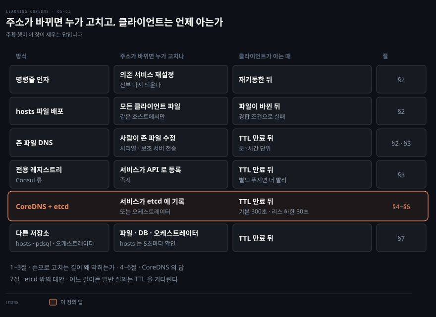


## 이 문서가 다루지 않는 것

> 이 장은 오케스트레이터가 없는 환경의 서비스 디스커버리를 다룹니다. 쿠버네티스는 다음 장이 통째로 맡습니다.

- 쿠버네티스 클러스터 안의 이름 해석과 `kubernetes` 플러그인 → [무엇을 선언했느냐가 레코드 모양을 정한다](./06-01.%EB%AC%B4%EC%97%87%EC%9D%84%20%EC%84%A0%EC%96%B8%ED%96%88%EB%8A%90%EB%83%90%EA%B0%80%20%EB%A0%88%EC%BD%94%EB%93%9C%20%EB%AA%A8%EC%96%91%EC%9D%84%20%EC%A0%95%ED%95%9C%EB%8B%A4.md)부터 6장 노트 넷
- 존 데이터를 파일·디렉터리·호스트 테이블에서 읽는 길 → [존 데이터를 어디에 둘지가 관리 방식을 정한다](./04-01.%EC%A1%B4%20%EB%8D%B0%EC%9D%B4%ED%84%B0%EB%A5%BC%20%EC%96%B4%EB%94%94%EC%97%90%20%EB%91%98%EC%A7%80%EA%B0%80%20%EA%B4%80%EB%A6%AC%20%EB%B0%A9%EC%8B%9D%EC%9D%84%20%EC%A0%95%ED%95%9C%EB%8B%A4.md)
- `SRV` 레코드의 우선순위와 가중치가 무엇을 고르는지 → [레코드 한 줄을 읽으면 존 파일이 읽힌다](./02-02.%EB%A0%88%EC%BD%94%EB%93%9C%20%ED%95%9C%20%EC%A4%84%EC%9D%84%20%EC%9D%BD%EC%9C%BC%EB%A9%B4%20%EC%A1%B4%20%ED%8C%8C%EC%9D%BC%EC%9D%B4%20%EC%9D%BD%ED%9E%8C%EB%8B%A4.md)
- `forward` 로 나머지 질의를 넘기는 방법 → [플러그인 일곱이면 서버 하나가 선다](./03-02.%ED%94%8C%EB%9F%AC%EA%B7%B8%EC%9D%B8%20%EC%9D%BC%EA%B3%B1%EC%9D%B4%EB%A9%B4%20%EC%84%9C%EB%B2%84%20%ED%95%98%EB%82%98%EA%B0%80%20%EC%84%A0%EB%8B%A4.md)

남는 것은 주소가 계속 바뀌는 상대를 어떻게 찾는가입니다.


## 1. Checkout 은 Cart 의 주소를 어떻게 아는가

> 하나였던 애플리케이션을 여섯으로 쪼개면 없던 문제가 생깁니다. 서로를 부르려면 상대의 IP 와 포트를 알아야 합니다.

저자는 온라인 소매 애플리케이션을 예로 듭니다. 사용자 프로필, 상품 카탈로그, 장바구니, 결제(Checkout), 배송비, 지불(Payment)의 여섯으로 나눕니다. 각 조각은 자기 기능과 자기 데이터의 주인입니다.

하지만 결제를 마치려면 조각들이 서로 통신해야 합니다. 결제 서비스가 최종 금액을 계산하려면 세 곳에서 값을 모아야 합니다. 장바구니에서 품목 목록을, 상품 카탈로그에서 각 품목의 가격을, 배송비 서비스에서 배송료를 가져옵니다.

그림으로 보면 호출 관계는 이미 정해져 있는데 상대의 주소 칸만 비어 있습니다.

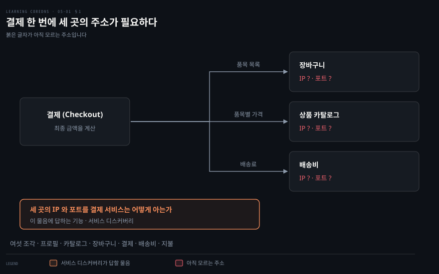

각 조각은 이 데이터를 API 로, 곧 네트워크 서비스로 내놓습니다. 그러면 남는 물음이 하나입니다. 결제 서비스는 이 API 들에 붙을 IP 주소와 포트를 어떻게 알까요? 마이크로서비스 구조에서 이 물음에 답하는 기능이 서비스 디스커버리입니다. 이 장은 그 답을 좁혀 갑니다.

애플리케이션을 마이크로서비스로 쪼개는 방법 자체는 여러 가지입니다. 복잡한 애플리케이션은 수십 개, 때로는 수백 개로 나뉘기도 한다고 저자는 덧붙이며 샘 뉴먼의 《Monolith to Microservices》(O'Reilly)를 가리킵니다.

### DNS-SD 와는 다른 이야기입니다

이름이 겹쳐서 헷갈리는 자리가 하나 더 있습니다. RFC 6763 은 DNS Service Discovery, 줄여서 DNS-SD 라는 메커니즘을 정의합니다. 이 장에서 말하는 서비스 디스커버리는 그 RFC 의 특정 구현이 아니라 더 일반적인 부류의 문제라고 저자는 선을 긋습니다.

초점도 다릅니다. 저자에 따르면 이 절의 초점은 애플리케이션 구성요소가 다른 구성요소를 찾는 쪽에 있지 최종 사용자를 위한 일반 네트워크 서비스를 찾는 쪽에 있지 않습니다. 그리고 CoreDNS 는 현재 DNS-SD 를 위한 전용 지원을 제공하지 않는다고 분명히 밝힙니다.


## 2. 이름으로 가는 사다리를 한 칸씩 올라간다

> 서비스 디스커버리의 답은 한 번에 나오지 않았습니다. 앞 칸이 남긴 문제를 다음 칸이 고치면서 다섯 번 올라갑니다.

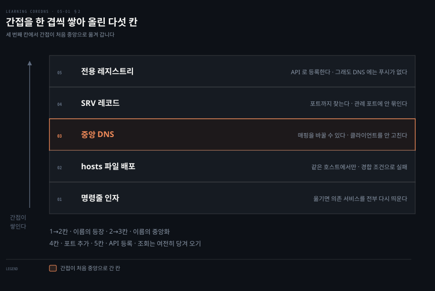

가장 단순한 방법부터 봅니다. 결제 서비스가 기동할 때 IP 주소와 포트를 명령줄 인자로 넘겨받습니다. 서비스 엔드포인트가 절대 안 바뀐다면 이 방법으로 충분합니다.

문제는 바뀔 때 드러납니다. 점검 때문이든 장애 때문이든 다른 이유이든 서비스를 다른 IP 로 옮겨야 하면, 그 서비스에 의존하는 모든 서비스를 다시 설정하고 다시 띄워야 할 수 있습니다.

### 두 번째 칸 — 이름을 넘기고 hosts 파일을 뿌린다

호스트 이름은 처음부터 이런 종류의 문제를 풀려고 만들어졌다고 저자는 짚습니다. IP 주소 대신 이름을 넘기면 됩니다. 그 이름들은 각 클라이언트의 `/etc/hosts` 파일에 담고 파일 자체나 그 안의 이름들을 모든 클라이언트에 배포합니다.

Docker 를 쓰는 컨테이너 환경에서 초기에 택한 방법이 이것입니다. Docker 데몬은 지금은 폐기된 `-link` 명령줄 옵션을 제공했습니다. 이 옵션은 컨테이너의 hosts 파일을 고쳐 이름이 알맞은 IP 를 가리키게 만듭니다.

> **원문 정오**: 원서는 이 옵션을 `-link` 로 적지만 Docker 의 실제 플래그는 하이픈 둘을 쓰는 `--link` 입니다. 조판 과정에서 하이픈 하나가 빠진 것으로 보입니다.

"지금은 폐기된"이라는 수식이 결론입니다. 저자는 이 기법이 효과가 없는 것으로 드러났다고 적고 세 가지 이유를 듭니다.

- 오류를 내기 쉽고 관리 부담이 금세 커집니다.
- 같은 호스트 위의 컨테이너에만 통합니다.
- 고유한 경합 조건이 있어 실패를 일으켰습니다.

### 세 번째 칸 — 이름을 중앙에 둔다

hosts 파일을 배포하거나 고치는 문제를 피하려면 다음 논리적 걸음은 이름과 IP 를 중앙에서 배포하는 것, 즉 DNS 에 저장된 도메인 이름을 쓰는 것입니다.

DNS 를 쓰면 hosts 파일과 같은 수준의 간접 계층을 얻으면서 매핑을 바꿀 수 있다는 점이 더해집니다. 서비스를 옮기더라도 그 서비스의 클라이언트를 하나하나 다시 설정하지 않아도 됩니다.

### 네 번째 칸 — 포트까지 담는 레코드를 쓴다

hosts 파일 대신 DNS 서버를 쓰면 레코드 타입이 풍부해지는 이득도 따라옵니다. `/etc/hosts` 의 호스트와 IP 매핑만이 아니라 더 많은 것을 표현할 수 있습니다. 이름이 `A` 레코드만이 아니라 `SRV` 레코드에 대응할 수 있습니다.

`SRV` 레코드는 포트와 다른 DNS 이름을 함께 담습니다. 그 이름은 다시 IP 주소로 풀립니다. `SRV` 를 쓰면 서비스마다 관례적인 포트 번호를 따를 필요가 없어집니다. 그래서 HTTP 기반 마이크로서비스 API 여럿을 같은 IP 주소에 올릴 수 있습니다.

단순한 컨테이너 환경에서는 이 이득이 더 큽니다. 그런 환경에서는 호스트 IP 주소에만 네트워크에서 닿습니다. 컨테이너에는 호스트 IP 의 포트를 호스트 로컬 컨테이너 IP 로 포워딩해서 닿습니다. IP 주소에 더해 포트 번호까지 찾을 수 없다면 선택지는 둘로 줄어듭니다. HTTP 서비스를 제공하는 컨테이너를 하나만 돌리거나 관리하기 어려운 정적 서비스와 포트 매핑으로 되돌아가야 합니다.

아래 그림은 호스트 IP 하나에 API 둘을 올렸을 때 이름이 컨테이너에 닿기까지의 단계를 예시 값으로 따라갑니다. 주황 열의 포트가 빠지면 뒤의 두 열을 가를 방법이 없습니다.

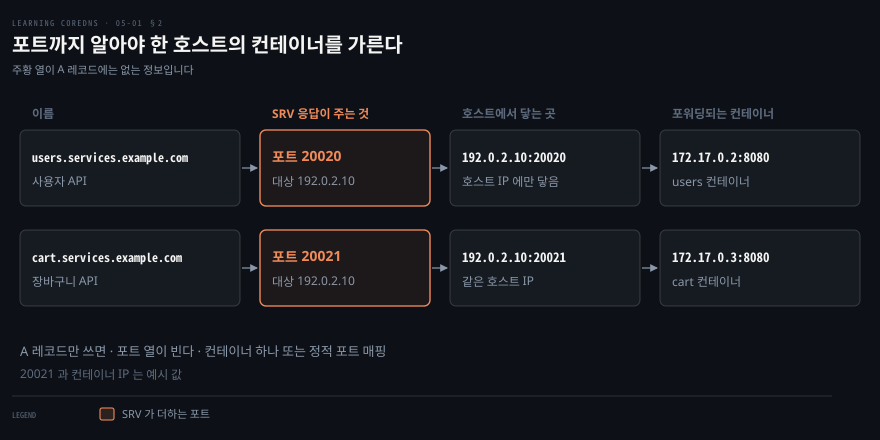

### 다섯 번째 칸으로 넘어가기 전에

여기까지 오면 자연스러운 물음이 생깁니다. 그러면 BIND 서버 하나를 세우고 끝내면 될까요? 저자의 답은 "아직 아니다"입니다. 다섯 번째 칸인 전용 레지스트리는 그 이유를 알아야 왜 필요한지 보입니다. 그래서 다음 절에서 이유와 함께 다룹니다.


## 3. 전통 DNS 는 초 단위로 바뀌는 이름을 전제하지 않는다

> 마이크로서비스 환경은 전통적인 환경과 조금 다릅니다. 그 조금이 DNS 의 설계 전제를 깹니다.

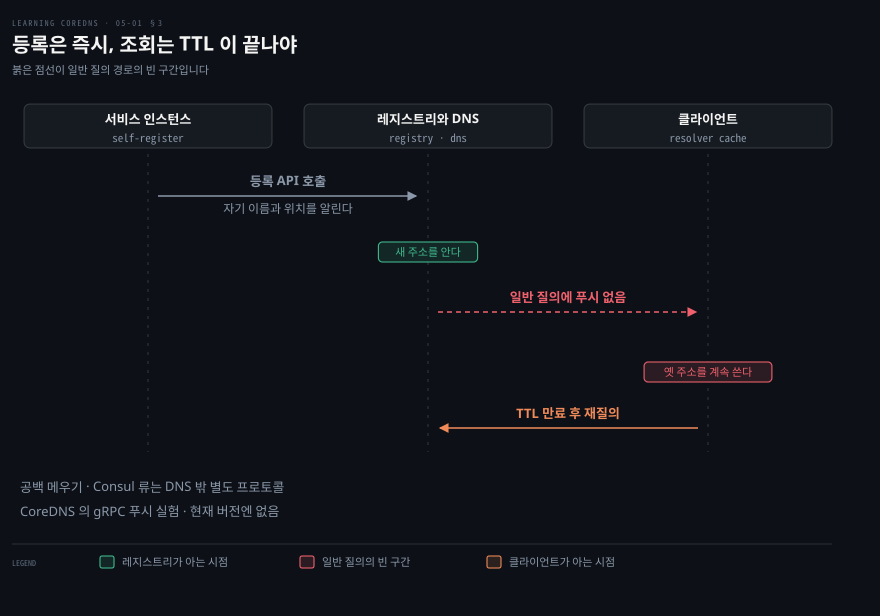

전통적인 환경의 기대는 이렇습니다. `A` 레코드와 그것을 가리키는 `SRV` 레코드는 호스트 이름에 대응하는 비교적 정적인 데이터를 참조합니다. 전통적인 DNS 서버는 전 지구 규모로 데이터를 서빙하도록 설계됐고 TTL 은 분 또는 시간 단위입니다.

데이터를 관리하는 워크플로도 그 전제 위에 있습니다. 대개 수동입니다. 자동화하더라도 파일을 고치고 다시 읽은 다음 보조 DNS 서버로 전파해야 합니다.

마이크로서비스 환경에서는 주어진 서비스의 IP 주소가 전통적인 환경보다 훨씬 빨리 바뀔 수 있습니다. 리눅스 컨테이너를 띄우고 내리는 것으로 스케일이 오르내리기 때문입니다. 이것은 새 VM 을 띄우는 것보다 일반적으로 훨씬 빠릅니다. VM 이 수 분인 데 비해 컨테이너는 1~2초 수준입니다.

서비스 디스커버리 데이터는 그만큼 빨리 낡습니다. 존 파일을 수동으로 설정하는 방식으로는 따라가기 어렵습니다.

### 다섯 번째 칸 — 전용 레지스트리가 채운 자리

HashiCorp 의 Consul 같은 전용 서비스 등록·발견 제품이 이 틈을 메우려고 등장했습니다. 이 제품들은 API 로 서비스를 등록받고 등록된 서비스 위치를 API 와 DNS 양쪽으로 내놓습니다.

전형적인 패턴에서는 서비스가 등록·발견 에이전트에 스스로를 등록합니다. 새 서비스 인스턴스는 뜨면서 API 를 호출해 자기 자신과 위치를 레지스트리에 알립니다. 대안으로는 그 프로세스를 띄우는 컨트롤러나 오케스트레이터가 대신 API 호출을 걸 수도 있습니다. 어느 쪽이든 관리자가 존 파일을 고치고 `named` 를 다시 읽게 하는 것보다 훨씬 빠릅니다.

### 그런데 클라이언트는 여전히 모릅니다

이 동적인 API 기반 등록이 있어도 클라이언트는 서비스 위치가 바뀐 것을 알지 못합니다. 클라이언트는 여전히 TTL 에 기댑니다. 서비스가 옮겨 갔는지 새 인스턴스가 생겼는지는 다시 질의해야 압니다.

이것을 최소화하려고 서비스 디스커버리 솔루션들은 전통적인 DNS 방식의 TTL 대신 데이터를 클라이언트로 밀어 주는 방법을 제공하는 경우가 많습니다. 이렇게 하면 마이크로서비스 인스턴스가 스케일 다운될 때 생기는 실패 요청이 줄고 새 인스턴스로 트래픽도 가능한 한 빠르게 퍼집니다.

원서가 다루는 일반 DNS 질의·응답 경로에는 변경을 클라이언트에 바로 알리는 푸시가 없습니다. 그래서 Consul 같은 목적 특화 제품은 별도 프로토콜을 구현했습니다. 다만 책이 나온 뒤인 2020년에 RFC 8765가 DNS Push Notifications를 정의했습니다. 구독을 지원하는 서버와 클라이언트가 있을 때 쓰는 기능입니다. 여기서 살피는 `etcd` 플러그인과 일반 리졸버의 질의 경로에 자동으로 적용되지는 않습니다.[^dnspush]

비슷한 수준의 기능을 제공하려고 CoreDNS 가 기댄 것이 gRPC 입니다. 구글에서 처음 만든 오픈소스 HTTP/2 기반 원격 프로시저 호출 인터페이스입니다. gRPC 는 여러 원격 호출 의미론을 구현하는데 보통의 동기 요청·응답과 비동기 요청·응답, 그리고 푸시 메커니즘이 거기 들어갑니다.

마지막 것이 이 이야기의 핵심입니다. 일부 버전의 CoreDNS 가 이 푸시 메커니즘으로 실험적인 푸시 기반 서비스 디스커버리를 구현했습니다. 현재 버전의 CoreDNS 는 이 기능을 제공하지 않지만 수요에 따라 다시 붙을 수도 있다고 저자는 여지를 남깁니다.

### DNS-over-gRPC 는 무엇이었나

지금은 사라진 기능의 내력이라 짧게만 짚습니다. CoreDNS 가 정의한 질의용 gRPC 서비스는 DNS 패킷을 Protocol Buffer 메시지 안에 그대로 넣는 단순한 프로토콜입니다. 표준이 아니고 CoreDNS 개발자들이 아는 한 CoreDNS 밖에서는 쓰이지 않으며 푸시 실험의 토대였습니다. 대가는 효율입니다. 저자가 전하는 Infoblox 내부 분석에 따르면 표준 UDP 로 한 패킷을 보내고 한 패킷을 받는 질의가 gRPC 로는 여덟 패킷 교환이 될 수 있습니다.

> **노트의 읽기**: 현재 CoreDNS 에도 `grpc` 플러그인이 있지만 하는 일이 다릅니다. 공식 문서는 이 플러그인을 `"facilitates proxying DNS messages to upstream resolvers via gRPC protocol"` 이라고만 설명하고, 페이지 어디에도 `push`·`watch`·`service discovery` 라는 말이 없고, `stream` 은 `upstream` 의 일부로만 나옵니다.[^grpcplugin] DNS 패킷을 Protobuf 에 싣는 봉투는 살아남았고 그 봉투로 하려던 푸시만 사라진 셈입니다. 원서가 "다시 붙을 수도 있다"고 남긴 여지는 아직 실현되지 않았습니다.


## 4. etcd — 상태를 CoreDNS 밖에 둔다

> CoreDNS 는 스스로 빨라지는 대신 데이터를 남에게 맡깁니다. 그래서 CoreDNS 인스턴스는 몇 개든 늘려도 됩니다.

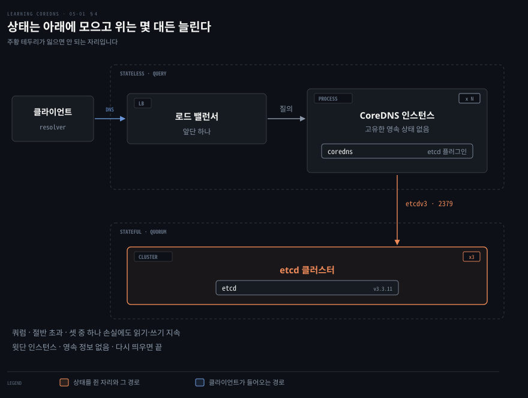

3절이 남긴 물음은 바뀌는 데이터를 어디에 둘 것인가입니다. 저자가 드는 이유는 둘입니다. 구성요소 하나가 죽어도 정보를 잃지 않아야 하고 무상태여야 확장이 단순합니다. 데이터를 인스턴스마다 따로 들고 있으면 어느 대가 답하느냐에 따라 결과가 달라질 수도 있습니다.

그래서 CoreDNS 는 데이터를 자기 안에 두지 않는 쪽을 택합니다. 그 자리를 맡는 것이 etcd 입니다.

etcd 는 CoreOS 가 개발한 분산 키-값 데이터 저장소로, 리눅스 머신 무리의 업그레이드를 조율하는 것을 돕기 위해 만들어졌습니다. 리더 선출과 분산 쓰기를 조율하는 알고리즘 덕분에 어느 인스턴스에서 읽어도 일관된 결과를 얻습니다. 저자는 CoreOS 가 이름이 비슷할 뿐 CoreDNS 와 아무 관계가 없다고 따로 짚어 둡니다. 각주에서는 CoreOS 가 Red Hat 에, 그 Red Hat 이 다시 IBM 에 인수되었다고 덧붙입니다.

### 셋 중 하나를 잃어도 버티는 이유

이 설계로 etcd 는 개별 인스턴스 장애를 견딥니다. 실행 중인 인스턴스들이 쿼럼을 이루는 한, 즉 인스턴스의 절반을 넘는 수가 살아 있고 서로 통신할 수 있는 한 etcd 는 계속 돌면서 읽기와 쓰기를 받습니다. 예를 들어 etcd 인스턴스 셋을 클러스터로 배포했다면 그중 아무거나 하나를 잃어도 시스템은 계속 동작합니다.

세 대에서 과반은 둘입니다. 한 대를 잃으면 둘이 남아 과반을 지키고 두 대를 잃으면 하나만 남아 쿼럼이 깨집니다.

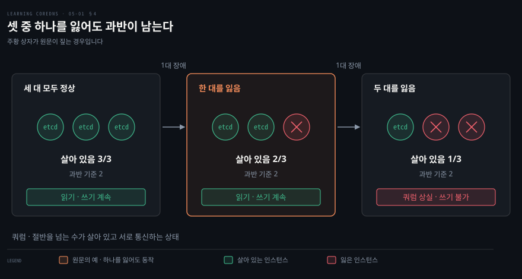

etcd 의 분산되고 회복력 있는 설계는 컨테이너화된 마이크로서비스 환경에 잘 맞습니다. 그 환경도 고도로 분산되어 있기 때문입니다. 그런 환경에서는 구성요소의 장애를 전제로 둡니다. 애플리케이션과 의존 서비스도 가능한 한 많은 장애 상황에서 계속 동작해야 합니다.

### 플러그인이 SkyDNS 를 닮은 이유

CoreDNS 와 etcd 의 통합은 `etcd` 플러그인을 거칩니다. 이 플러그인은 etcdv3 API 로 etcd 데이터를 직접 읽습니다. 목적은 서비스 디스커버리입니다.[^etcdv3]

사실 이 플러그인은 SkyDNS 라는 더 오래된 서비스 디스커버리 애플리케이션과 호환되도록 설계되었습니다. CoreDNS 의 리드 개발자인 Miek Gieben 이 SkyDNS 의 저자이기도 했습니다. CoreDNS 는 부분적으로 SkyDNS 의 "110%" 대체품이 되도록 설계됐습니다. Gieben 본인이 즐겨 쓰는 표현으로는 "SkyDNS 보다 나은 SkyDNS" 입니다.

이 내력 때문에 `etcd` 플러그인은 etcd 를 백엔드로 삼는 범용 DNS 서버를 제공하지 않습니다. 서비스 디스커버리에 초점을 맞췄기에 범용 존 데이터 처리에는 한계가 있습니다.

### 상태를 격리하면 확장이 단순해집니다

CoreDNS 와 etcd 를 서비스 레지스트리와 디스커버리에 쓸 때 영속되는 상태는 전부 etcd 에 저장됩니다. CoreDNS 는 etcd 에 접속해 질의 내용과 캐시 상태에 따라 필요한 만큼 데이터를 읽습니다.

영속 상태를 이중화된 etcd 에 두면 구성요소 하나가 죽어도 정보를 잃지 않습니다. CoreDNS 인스턴스가 영속 등록 상태를 직접 들고 있지 않으니 확장도 단순해집니다. 로드 밸런서 뒤에 많은 인스턴스를 띄워서 트래픽 부하를 감당하면 됩니다.


## 5. 이름을 뒤집으면 etcd 키가 된다

> etcd 는 키를 주면 값을 돌려주는 저장소입니다. 그 키를 도메인 이름에서 만드는 규칙이 이 절의 전부입니다.

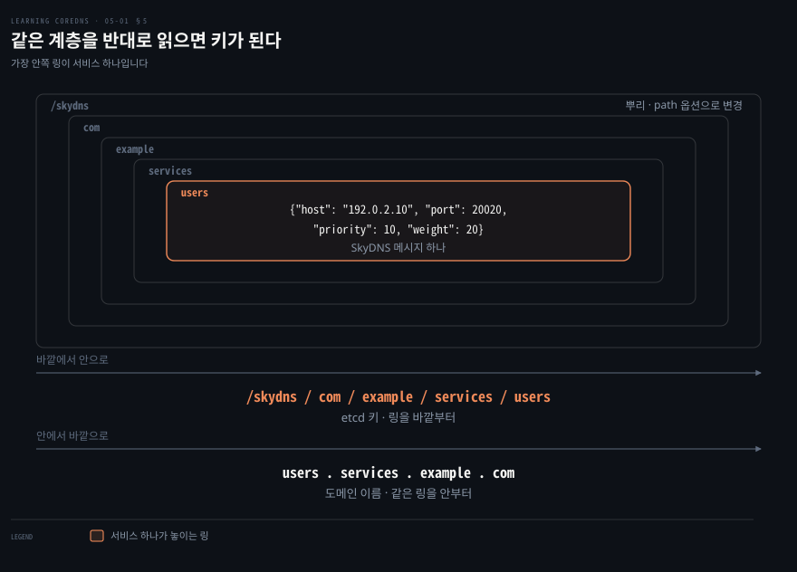

CoreDNS 가 etcd 에서 레코드를 서빙하려면 그 전에 etcd 에 레코드를 채워 넣어야 합니다. SkyDNS 를 위해 개발된 형식을 그대로 씁니다. 키는 서비스 이름에서 유도하고 값에는 SkyDNS 메시지를 담습니다.

SkyDNS 메시지는 JSON 으로 인코딩된 객체입니다.

```json
{
    "host": "192.0.2.10",
    "port": 20020,
    "priority": 10,
    "weight": 20
}
```

`host` 필드는 서비스의 IP 주소를 담습니다. `port`·`priority`·`weight` 는 그 서비스의 `SRV` 레코드를 만들 때 쓰입니다. `host` 말고는 값에 따옴표가 없다는 점을 저자는 짚습니다. 정수이므로 JSON 에도 숫자로 인코딩해야 합니다. 문자열로 넣으면 CoreDNS 가 제대로 읽어 오지 못합니다.

추가 레코드 타입을 만들어 쓸 수 있는 필드가 여럿 더 있습니다. 그중 가장 쓸모 있는 것은 아마 `ttl` 일 텐데 이 서비스 등록 항목이 만들어 내는 여러 레코드의 TTL 을 지정하게 해 줍니다.

### 키는 도메인 이름의 역순입니다

이 객체를 etcd 에 저장할 때 쓰는 키의 형식은 유닉스 디렉터리 경로처럼 생겼습니다. 다만 도메인 이름과 반대 순서로 갑니다. 경로의 뿌리는 기본값이 `/skydns` 이고 설정으로 바꿀 수 있습니다.

예를 들어 이 서비스를 `users.services.example.com` 이라는 이름으로 쓰게 하려면 위 JSON 객체를 `/skydns/com/example/services/users` 키에 넣습니다. DNS 이름이 오른쪽부터 위로 올라가는 계층인 것을 생각하면 자연스러운 대응입니다.

### 실제로 넣어 봅니다

예제를 따라 해 보려면 etcd 를 받아서 돌리면 됩니다. etcd 릴리스 페이지에서 여러 플랫폼용 바이너리를 받을 수 있습니다. 정적으로 링크된 실행 파일이라 별도 의존물 없이 돌아갑니다. 이 연습에서는 인자 없이 실행하면 됩니다. 원서가 보여 주는 실행 로그의 버전은 3.3.11 입니다.

띄운 뒤에는 릴리스 패키지에 함께 들어 있는 `etcdctl` 명령으로 메시지를 채웁니다. 원서 시점의 etcd 3.3 에서 `etcdctl` 은 기본으로 etcdv2 API 를 썼으므로 etcdv3 API 를 쓰도록 환경 변수를 지정해야 했습니다. etcd 3.4 부터는 v3 이 기본이라 `ETCDCTL_API=3` 을 붙이지 않아도 됩니다(`"Make ETCDCTL_API=3 etcdctl default"`).[^etcdctl34] 붙여도 해롭지 않으니 원서를 그대로 따라 해도 결과는 같습니다.

```bash
ETCDCTL_API=3 ./etcdctl put /skydns/com/example/services/users \
    '{"host": "192.0.2.10","port": 20020,"priority": 10,"weight": 20}'
ETCDCTL_API=3 ./etcdctl get /skydns/com/example/services/users
```

넣을 때는 `OK` 가 돌아옵니다. 꺼내면 키 한 줄과 값 한 줄이 그대로 나옵니다.

```bash
/skydns/com/example/services/users
{"host": "192.0.2.10","port": 20020,"priority": 10,"weight": 20}
```

> **원문 정오**: 원서 Example 5-3 의 `put` 명령은 키 이름을 `"port "` 로 적어 닫는 따옴표 앞에 공백이 하나 들어가 있습니다. 바로 아래 `get` 출력과 Example 5-1 은 둘 다 `"port"` 입니다. etcd 는 넣은 바이트를 그대로 돌려주므로 둘이 함께 참일 수 없습니다. 위 코드 블록은 공백을 뺀 형태로 옮겼습니다.

이것이 단순한 조판 실수로 끝나지 않는 이유가 있습니다. CoreDNS 는 JSON 태그 `port` 로 필드를 찾으므로 `"port "` 는 매칭되지 않고 `Port` 가 0 으로 남은 채 `SRV` 레코드가 만들어집니다. 원서대로 타이핑하면 뒤이은 Example 5-7 의 포트 20020 이 나오지 않습니다.

### Corefile 은 한 줄로 끝납니다

가장 단순한 형태에서는 `etcd` 지시어를 넣는 것만으로 플러그인을 쓸 수 있습니다.

```bash
example.com:5300 {
  etcd
}
```

이 Corefile 은 `example.com` 을 5300 포트에서 `etcd` 플러그인으로 서빙합니다. 플러그인은 기본 etcd 포트의 로컬 etcd 인스턴스나 프록시에 gRPC 로 접속합니다. 주소로는 `http://localhost:2379` 입니다.

`etcd` 지시어 뒤에 존 목록을 줘서 특정 존들로 제한할 수도 있습니다. 목록을 주지 않으면 서버 스탠자의 존을 씁니다.

```bash
example.com:5300 {
  log
  etcd services.example.com
  forward example.com /etc/resolv.conf
}
```

이 설정에서 `etcd` 플러그인은 `services.example.com` 만 서빙합니다. 서버 블록의 나머지 질의는 `forward` 플러그인이 처리합니다.

같은 서버 블록에 들어온 두 질의가 어디서 갈리는지 보면 이렇습니다.

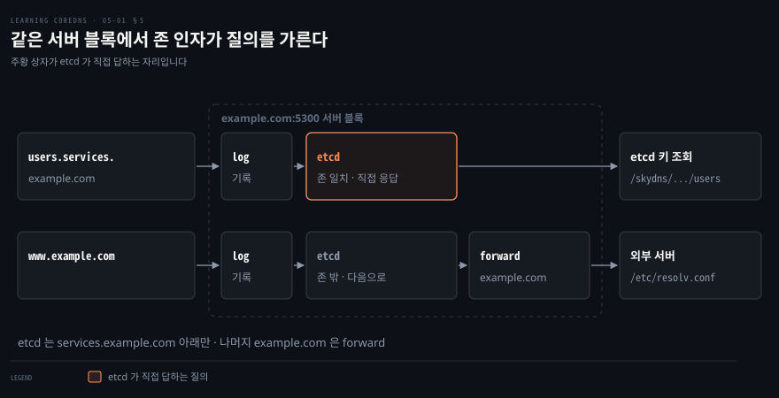

### 한 줄이 레코드 둘이 됩니다

이제 `dig` 로 질의하면 등록한 IP 가 `A` 레코드로 돌아옵니다. 그런데 이 등록 하나는 다른 타입의 레코드도 함께 내놓습니다. 특히 포트를 담은 `SRV` 레코드가 그렇습니다.

```bash
dig -p 5300 users.services.example.com @localhost
dig -p 5300 -t SRV users.services.example.com @localhost
```

두 응답에서 답 구간만 옮기면 이렇습니다. `SRV` 줄의 마지막 열은 원서 지면에서 잘려 있는데 바로 아래 ADDITIONAL 구간의 이름이 곧 그 대상입니다.

```bash
;; ANSWER SECTION:
users.services.example.com. 300 IN  A    192.0.2.10

;; ANSWER SECTION:
users.services.example.com. 300 IN  SRV  10 100 20020 users.services.example...
;; ADDITIONAL SECTION:
users.services.example.com. 300 IN  A    192.0.2.10
```

등록한 값과 응답에 나온 값을 나란히 놓으면 어긋나는 곳이 보입니다. 원서는 출력만 보여 주고 왜 그 값인지는 적지 않으므로 아래 그림의 설명은 노트가 소스에서 찾아 채운 것입니다.

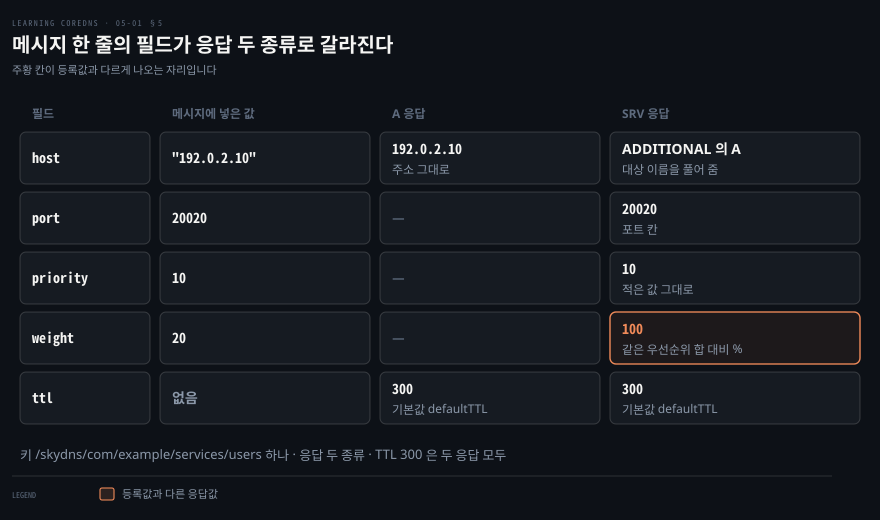

TTL 300 은 메시지에 `ttl` 을 넣지 않아서 붙은 기본값입니다. 소스의 `defaultTTL` 상수가 300 이고 주석이 `"default ttl when nothing is set"` 입니다.[^etcdsrc] 우선순위 10 은 예제가 적은 값인데 빼도 `defaultPriority` 상수 10 이 붙어 결과가 같습니다.[^etcdsrc]

남은 칸 가운데 눈여겨볼 것은 가중치입니다. [레코드 한 줄을 읽으면 존 파일이 읽힌다](./02-02.%EB%A0%88%EC%BD%94%EB%93%9C%20%ED%95%9C%20%EC%A4%84%EC%9D%84%20%EC%9D%BD%EC%9C%BC%EB%A9%B4%20%EC%A1%B4%20%ED%8C%8C%EC%9D%BC%EC%9D%B4%20%EC%9D%BD%ED%9E%8C%EB%8B%A4.md) 에서 본 존 파일은 적은 가중치를 그대로 내보냅니다. `etcd` 플러그인은 다릅니다. `100 ÷ 같은 우선순위의 가중치 합 × 내 가중치` 를 계산한 뒤 소수점 아래를 버립니다.[^srcweight] 대상이 20 하나뿐이면 100 ÷ 20 × 20 이라 100 이 됩니다.

버림 때문에 생기는 차이가 둘 있습니다. 대상이 여럿이면 응답 가중치의 합이 100 보다 작을 수 있습니다. 대상이 하나여도 늘 100 이 나오지는 않습니다. 부동소수 계산에서 100 ÷ 97 × 97 은 99.99999999999999 가 되어 버림 뒤 99 로 내려갑니다. 어느 쪽이든 상대적인 비율은 거의 그대로라 대상 선택에는 영향이 작습니다.

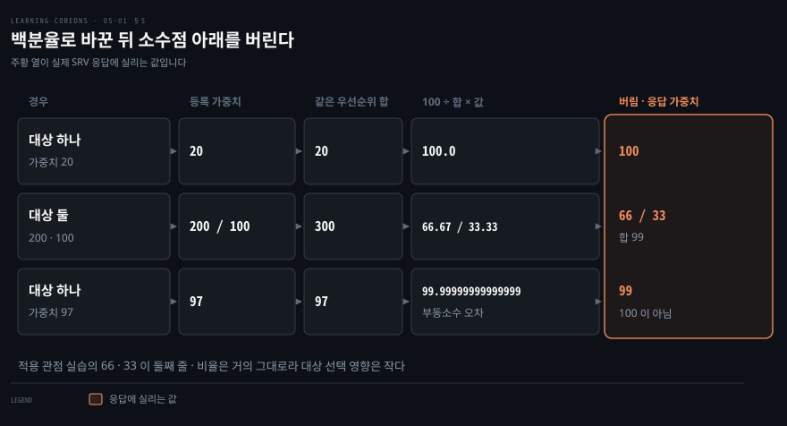

### 이 절에서 만난 원서 정오

결과에 영향이 없는 정오는 실습 흐름을 끊지 않도록 여기 모았습니다. 결과를 바꾸는 `"port "` 공백은 실습 자리에 그대로 두었습니다.

- 철자 넷: 본문의 `ectdv2` 는 `etcdv2`, `etdctl` 은 `etcdctl` 이고, 뒤 문법 설명의 `overide` 는 `override`, 7절에 해당하는 원서 문단의 `descibed` 는 `described` 입니다.
- 파일 이름: 본문은 위 두 번째 Corefile 을 `coredns -conf Corefile-etcd-1` 로 돌리라고 적는데 뒤이은 Example 5-8 의 실행 로그는 `./coredns -conf Corefile-etcd` 입니다.


## 6. 문법 일곱 항목 중 지금 남은 것

> 원서가 적은 `etcd` 문법은 2019년의 모습입니다. 둘은 사라졌고 셋이 새로 붙었습니다.

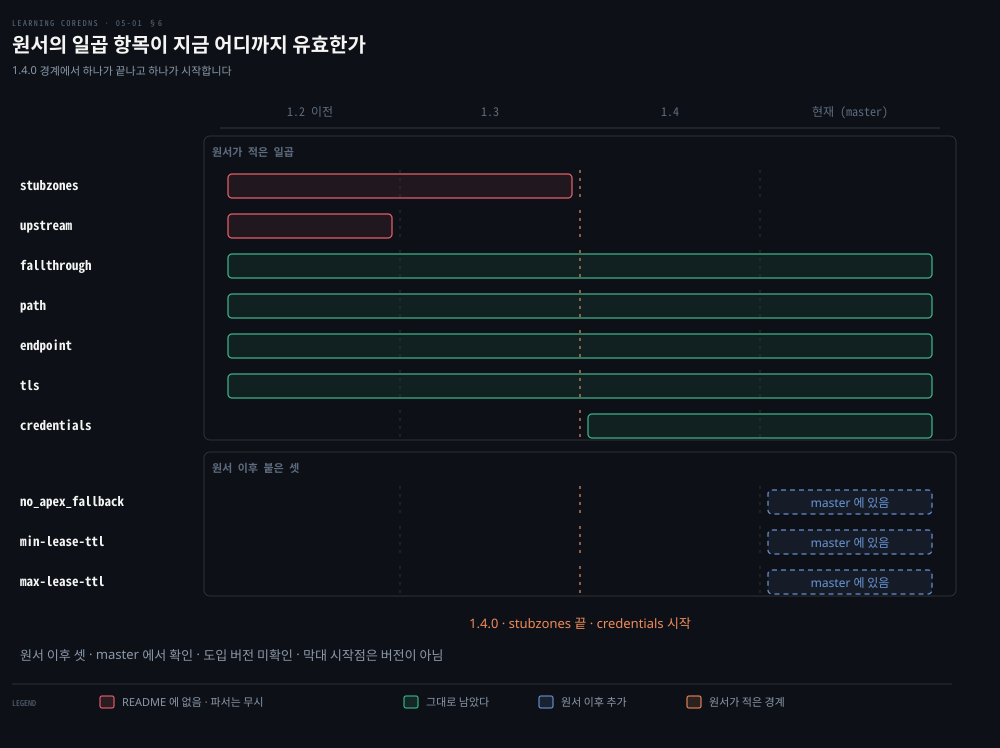

원서의 문법 블록을 그대로 옮겨 적었는데 기대한 동작이 나오지 않는 일이 생깁니다. 책이 2019년의 버전을 기준으로 적혔고 그 뒤로 항목이 들고 났기 때문입니다. 사라진 지시어는 오류를 내지 않고 조용히 무시되므로 이 문제를 알아차리기가 더 어렵습니다. 무엇이 남았는지 알려면 먼저 무엇이 있었는지를 세어 봐야 합니다.

원서가 나열하는 항목은 일곱입니다.

- `stubzones`: SkyDNS 식 스텁 도메인 기능을 켭니다. 여러 도메인의 질의를 다른 네임서버로 전달하게 하고 그 도메인과 네임서버는 etcd 에 저장됩니다. SkyDNS 에서 옮겨 올 때의 하위 호환을 위해서만 제공되며 실제로 CoreDNS 1.4.0 이전 버전에서만 유효합니다.
- `fallthrough`: 나열한 존의 질의를 플러그인 체인의 뒷 플러그인으로 넘깁니다.
- `path`: 기본 `/skydns` 경로를 다른 기준 경로로 바꿉니다.
- `endpoint`: 쓸 etcd API 엔드포인트 목록을 지정합니다. 셋을 적어 두면 그중 어느 것이든 쓰이므로 etcd 접근의 가용성이 올라갑니다.
- `credentials`: etcd 서버의 사용자 이름과 비밀번호를 지정합니다. CoreDNS 1.4.0 부터 쓸 수 있습니다.
- `upstream`: CNAME 레코드에 대응하는 `A` 레코드를 찾는 데 쓰였지만 CoreDNS 1.3.0 부터는 쓸모없어졌습니다.
- `tls`: etcd 에 접속할 TLS 클라이언트 파라미터를 설정합니다.

저자는 `stubzones` 를 두고 대체 경로를 권합니다. 현재 버전에서 같은 결과를 내려면 `forward` 를 `fallthrough` 옵션과 함께 쓰라고 합니다.

### 지금 문법 블록과 대조하면

공식 저장소의 `etcd` 플러그인 문법 블록에는 `fallthrough`·`path`·`endpoint`·`credentials`·`tls`·`no_apex_fallback` 이 들어 있습니다.[^etcdreadme] 원서가 예고한 대로 `stubzones` 와 `upstream` 은 그 블록에도 옵션 설명에도 없습니다. `upstream` 이라는 낱말이 페이지에 한 번 나오기는 합니다. 하지만 `/etc/resolv.conf` 로 질의를 넘기는 설정 예를 설명하는 산문의 일반 영어라 지시어와는 무관합니다.

문서에서 빠졌다고 파서가 거부하지는 않습니다. 설정 파서는 두 지시어를 `case "stubzones": // ignored, remove later.` 와 `case "upstream": // remove soon` 으로 받아 그냥 넘깁니다.[^etcdsetup] 원서의 Corefile 을 옮겨 적어도 CoreDNS 는 오류 없이 뜹니다. 그 지시어가 하던 일만 빠진 채로 뜨므로 스텁 도메인 전달을 기대했다면 질의 결과로 확인해야 합니다.

README 의 문법 코드 블록 밖, 옵션 설명 목록에 두 항목이 더 붙었습니다. 문서에 적힌 자리가 블록 밖일 뿐 Corefile 에서는 다른 옵션처럼 `etcd { … }` 블록 안에 씁니다.[^etcdsetup] `min-lease-ttl` 은 `"the minimum TTL for DNS records based on etcd lease duration"` 이고 기본값이 30초입니다. `max-lease-ttl` 은 같은 설명의 최댓값이고 기본값이 24시간입니다.[^etcdreadme] 원서 시절에는 없던 축입니다.

이 두 항목을 읽으려면 리스부터 알아야 합니다. etcd 의 리스(lease)는 정해진 시간이 지나면 만료되는 대여권입니다. 키를 리스에 묶어 두면 리스가 만료될 때 키도 함께 지워집니다. `etcdctl lease grant 60` 으로 60초짜리 리스를 받고, `etcdctl put --lease=<ID> ...` 로 키에 겁니다. 서비스가 주기적으로 리스를 연장하지 않고 죽으면 등록이 저절로 사라지는 구조입니다.

키에 리스를 걸면 레코드 TTL 은 SkyDNS 메시지의 `ttl` 필드뿐 아니라 etcd 리스의 남은 시간에도 영향을 받습니다. CoreDNS 는 키에 리스가 있으면 남은 시간을 확인합니다. `min-lease-ttl` 과 `max-lease-ttl` 은 그 값을 가둘 하한과 상한을 정합니다.[^etcdsrc]

기본 하한 30초는 리스에서 산출한 TTL 에만 적용됩니다. 리스 만료가 임박해도 리스 유래 값은 30초까지 올라갑니다. 메시지의 `ttl` 이 함께 있으면 둘 중 작은 값을 응답합니다. 따라서 메시지에 `"ttl": 10` 을 적으면 최종 응답 TTL 은 10초입니다.[^etcdsrc] 기본 옵션에서 경우를 나누면 이렇습니다.

| 리스 | 메시지 `ttl` | 응답 TTL | 왜 |
|---|---|---|---|
| 없음 | 없음 | 300 | 둘 다 없어 기본값 `defaultTTL` |
| 없음 | 60 | 60 | 메시지 값 그대로 |
| 남은 시간 10초 | 없음 | 30 | 리스 유래 10 을 하한 30 으로 올림 |
| 남은 시간 10초 | 60 | 30 | 리스 유래 30 과 60 중 작은 값 |
| 남은 시간 10초 | 10 | 10 | 리스 유래 30 과 10 중 작은 값 |

셋째 줄이 운영에서 놓치기 쉬운 경우입니다. 리스가 몇 초 뒤 끝나도 응답 TTL 은 30초입니다. 그래서 키가 지워진 뒤에도 그 응답을 캐시한 클라이언트는 남은 시간 동안 옛 주소를 계속 씁니다. 짧은 리스는 죽은 서비스의 등록을 자동으로 지우지만 클라이언트가 기존 응답을 캐시하는 동안 변경을 즉시 알리지는 못합니다. 3절에서 본 대로 등록이 사라지는 속도와 클라이언트가 알아채는 속도는 따로 움직입니다. 그 차이가 여기서 숫자로 드러납니다.

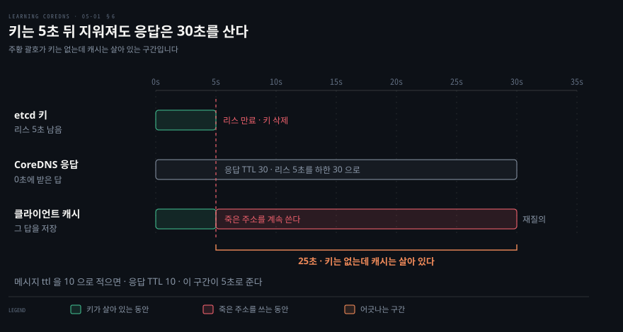

`no_apex_fallback` 은 존 정점에서의 주소 질의 처리를 바꾸는 옵션이라 서비스 디스커버리 용례와는 거리가 있습니다. 원서를 읽는 목적에서는 앞의 둘이 훨씬 중요합니다.


## 7. etcd 말고 다른 길

> etcd 는 서비스 등록을 담을 수 있는 하나의 저장소일 뿐입니다. 저자는 셋을 더 듭니다.

|  | 무엇을 읽나 | 누가 어떻게 등록하나 | 전제 |
|---|---|---|---|
| `etcd` | etcd 의 SkyDNS 메시지 | 서비스나 오케스트레이터가 etcd API 로 즉시. 클라이언트가 아는 시점은 별개 | etcd 클러스터를 따로 운영 |
| `pdsql` | 관계형 데이터베이스 | DB 에 행을 쓰는 쪽 | 외부 플러그인이라 직접 빌드해야 함 |
| `hosts` | `/etc/hosts` 형식 파일 | 파일을 고치는 쪽. CoreDNS 는 5초마다 확인 | 파일을 고칠 수단만 있으면 됨 |
| 오케스트레이터 | 클러스터의 서비스 객체 | 오케스트레이터가 스스로 | 컨테이너 오케스트레이터가 있어야 함 |

CoreDNS 에는 SQL 데이터베이스에서 데이터를 읽는 내장 플러그인이 없습니다. 대신 그것을 가능하게 하는 `pdsql` 이라는 외부 플러그인이 있습니다. 외부 플러그인으로 CoreDNS 를 빌드하는 방법은 원서가 뒤에서 따로 다룹니다. 원서는 여기서 멈추므로 저장소로 채우면 `pdsql` 은 아무 SQL 스키마나 읽지 않습니다. 스스로를 `"Connect CoreDNS to PowerDNS generic sql zone backends"` 라고 설명하므로 PowerDNS 의 generic SQL 백엔드 스키마를 전제합니다.[^pdsql] 임의의 사내 테이블을 그대로 붙일 수 있다는 뜻으로 읽으면 안 됩니다.

조금 덜 동적인 선택지는 `hosts` 플러그인입니다. 표준 `/etc/hosts` 형식의 파일을 읽을 수 있습니다. CoreDNS 가 5초마다 파일의 변경을 확인하므로 간단한 파일을 고치는 것으로 DNS 레코드를 바꿀 수 있습니다. 문법과 한계는 [4장 노트](./04-01.%EC%A1%B4%20%EB%8D%B0%EC%9D%B4%ED%84%B0%EB%A5%BC%20%EC%96%B4%EB%94%94%EC%97%90%20%EB%91%98%EC%A7%80%EA%B0%80%20%EA%B4%80%EB%A6%AC%20%EB%B0%A9%EC%8B%9D%EC%9D%84%20%EC%A0%95%ED%95%9C%EB%8B%A4.md) 에서 다뤘습니다.

### 등록하는 주체는 누구인가

3절에서 서비스가 디스커버리 솔루션에 등록되어야 한다고 했습니다. CoreDNS 와 etcd 를 쓰는 경우 무언가가 etcd 에 항목을 써야 합니다. VM 이 아니라 컨테이너를 쓰는 환경에서는 이 등록을 쿠버네티스 같은 컨테이너 오케스트레이터가 맡는 경우가 이제 더 많습니다.

저자에 따르면 쿠버네티스 1.13 부터 CoreDNS 가 쿠버네티스의 기본 서비스 디스커버리 솔루션입니다. 실제로 그 릴리스 발표문은 `"CoreDNS as the default DNS"` 를 정식 승격 항목으로 올렸습니다.[^k8s113]

오케스트레이터가 레지스트리를 채우는 컨테이너 용례에서도, 이 장에서 설명한 방식의 서비스 디스커버리가 필요한 환경과 애플리케이션은 여전히 많습니다. 애플리케이션이 컨테이너가 아니라 VM 을 띄워야 한다면 이 기법들로 되돌아가야 합니다.

다른 서비스 디스커버리 선택지와 달리 CoreDNS 는 두 시나리오를 모두 다룹니다. 같은 서버 인스턴스 안에서도 함께 지원할 수 있습니다.


## 결정 치트시트

> 서비스 디스커버리 방식을 고를 때 무엇이 결정을 가르는지 정리했습니다. 근거는 모두 본문입니다.

| 상황 | 선택 | 이유 |
|------|------|------|
| 엔드포인트가 사실상 안 바뀐다 | 명령줄 인자 | 가장 단순하고 인프라가 필요 없다 |
| 같은 호스트의 컨테이너 몇 개뿐이다 | 그래도 hosts 파일은 피한다 | 경합 조건과 관리 부담이 이미 검증된 실패다 |
| 서비스를 옮겨도 클라이언트를 안 고치고 싶다 | DNS | 매핑을 바꿀 수 있는 간접 계층을 준다 |
| 한 IP 에 HTTP API 여럿을 올려야 한다 | `SRV` 레코드 | 포트까지 찾을 수 있어 관례 포트에 안 묶인다 |
| IP 가 초 단위로 바뀐다 | `etcd` 플러그인 | 등록은 API 로 갱신할 수 있지만 클라이언트 반영은 TTL 에 묶인다 |
| CoreDNS 를 여러 대로 늘리고 싶다 | `etcd` 플러그인 | 영속 등록 상태를 etcd 에 두므로 인스턴스를 늘리기 쉽다 |
| etcd 를 따로 운영하고 싶지 않다 | `hosts` 플러그인 | 파일 하나면 되고 5초마다 다시 읽는다 |
| 이미 PowerDNS 스키마의 DB 가 있다 | `pdsql` 외부 플러그인 | 그 스키마 전용이므로 조건이 맞을 때만 |
| 컨테이너 오케스트레이터가 있다 | 오케스트레이터에 맡긴다 | 쿠버네티스 1.13 부터 CoreDNS 가 기본이다 |
| VM 과 컨테이너가 섞여 있다 | CoreDNS 한 인스턴스 | 두 방식을 같은 서버에서 동시에 지원한다 |
| 죽은 서비스의 등록을 자동으로 지우고 싶다 | 키에 리스를 건다 | 리스가 만료되면 키가 사라지고, 30초 하한은 리스 유래 TTL 에만 적용되며 메시지 `ttl` 은 더 작을 수 있다 |
| 등록한 가중치와 응답 가중치가 다르다 | 정상 | 같은 우선순위 안에서 백분율로 재계산하고, 정수 절삭으로 합계가 100 보다 작을 수 있다 |


## 적용 관점

> 이 장은 etcd 와 CoreDNS 바이너리 두 개면 손으로 끝까지 따라갈 수 있습니다. 키 규칙과 가중치 재계산이 몸에 붙는 것이 이 절의 목적입니다.

**한 가지 실행**: etcd 를 인자 없이 띄우고, 5절의 `example.com:5300 { etcd }` Corefile 로 CoreDNS 를 띄웁니다. 같은 이름에 대상 둘을 두려면 키를 덮어쓰지 말고 그 아래에 하위 키를 둡니다. `etcd` 플러그인은 `/skydns/com/example/services/users/` 아래를 통째로 훑어 모두 돌려줍니다.[^etcdget]

```bash
etcdctl put /skydns/com/example/services/users/a '{"host":"192.0.2.10","port":20020,"priority":10,"weight":200}'
etcdctl put /skydns/com/example/services/users/b '{"host":"192.0.2.11","port":20020,"priority":10,"weight":100}'
dig -p 5300 -t SRV users.services.example.com @localhost +short
```

`SRV` 두 줄의 가중치가 66 과 33 으로 나오면 5절의 재계산 규칙을 직접 본 것입니다. 합계가 99 인 것은 소수점 아래를 버렸기 때문입니다. 5절에서 넣은 `users` 키 자체가 세 번째 줄로 나오지 않는 것도 확인해 둡니다. 플러그인은 `users/` 접두사로 먼저 찾고, 하나도 없을 때만 `users` 키 하나를 읽습니다.[^etcdget]

이어서 `db.users.services.example.com` 을 가중치 20 으로 등록한다고 해 봅니다. 어느 키에 넣어야 하는지 먼저 예측하고 넣은 뒤 `dig` 로 확인합니다. 그다음 `users` 의 `SRV` 를 다시 물으면 줄 수와 가중치가 어떻게 바뀔지도 예측해 봅니다. 새 키가 `users/` 아래에 들어가는지가 답을 가르며 답은 정답 9 에 있습니다.

Spring 애플리케이션 관점에서 보면 이 장은 Spring Cloud Netflix 의 Eureka 가 하던 일을 DNS 아래로 내리는 선택지입니다. Eureka 클라이언트는 자기 호스트·포트 같은 메타데이터를 레지스트리에 등록합니다. 레지스트리는 인스턴스마다 하트비트를 받다가 정해진 시간 동안 끊긴 인스턴스를 보통 등록에서 지웁니다.[^eureka] 이 구조는 etcd 키에 리스를 걸고 서비스가 리스를 연장하는 방식과 같은 모양입니다.

차이는 조회 쪽에 있습니다. Eureka 에서는 애플리케이션 안의 클라이언트 라이브러리가 레지스트리를 읽지만 `etcd` 플러그인을 쓰면 애플리케이션은 이름만 묻고 CoreDNS 가 대신 읽습니다.

그래서 판단 기준은 애플리케이션 코드에서 레지스트리 클라이언트 의존을 걷어낼 수 있는가입니다. 걷어낼 때 확인할 점이 하나 있습니다. 보통의 HTTP 클라이언트는 이름으로 `A` 레코드만 찾으므로 포트까지 `SRV` 로 받아 쓰려면 `SRV` 를 질의하는 코드가 따로 있어야 합니다. 포트를 고정해 두는 환경이라면 이 문제는 생기지 않습니다.


## 면접에서 받을 만한 질문

1. `/etc/hosts` 배포가 컨테이너 환경에서 실패한 이유를 셋 대 보십시오.
2. 마이크로서비스 환경이 전통적인 DNS 의 어떤 전제를 깨는지 두 가지로 나눠 설명해 보십시오.
3. Consul 같은 제품이 DNS 위에 별도 프로토콜을 얹는 이유는 무엇입니까?
4. CoreDNS 를 로드 밸런서 뒤에 여러 대 띄울 수 있는 이유는 무엇입니까?
5. `users.services.example.com` 을 서빙하려면 어떤 etcd 키에 값을 넣어야 합니까?
6. SkyDNS 메시지에 `"weight": 20` 을 넣었는데 `SRV` 응답의 가중치가 100 으로 나오면 무엇을 의심해야 합니까?
7. Corefile 에 `etcd { path /svc }` 를 적었습니다. `db.users.example.com` 을 등록하려면 어느 키에 넣어야 합니까?
8. Corefile 의 `etcd` 블록에 `min-lease-ttl 60` 을 적고, 남은 시간이 20초인 리스에 키를 걸었습니다. 메시지에 `"ttl"` 이 없을 때, 120일 때, 15일 때 응답 TTL 은 각각 얼마입니까?
9. 적용 관점의 실습에서 `db.users.services.example.com` 을 가중치 20 으로 등록했습니다. 어느 키에 넣어야 하고 그 뒤 `users.services.example.com` 의 `SRV` 응답은 몇 줄에 가중치가 각각 얼마입니까?


## 정답 (자답 후 펼치기)

### 정답 1 — hosts 파일 배포의 실패

오류를 내기 쉬워서 관리 부담이 금세 커졌습니다. 같은 호스트 위의 컨테이너에만 통했습니다. 고유한 경합 조건이 있어 실패를 일으켰습니다. 저자는 이 셋을 hosts 파일을 배포하는 기법이 효과가 없던 이유로 듭니다.

### 정답 2 — 깨지는 전제

첫째는 데이터의 정적성입니다. 전통적인 DNS 는 `A` 레코드가 비교적 안 바뀐다고 보고 TTL 을 분이나 시간 단위로 잡습니다. 둘째는 관리 방식입니다. 파일을 고치고 다시 읽고 보조 서버로 전파하는 워크플로는 대개 수동인데 컨테이너는 1~2초에 뜨고 집니다.

### 정답 3 — 별도 프로토콜을 얹는 이유

원서가 다루는 일반 DNS 질의·응답 경로에서는 서버가 변경을 클라이언트에 밀어 주지 않기 때문입니다. API 등록이 끝나도 캐시된 답을 쓰는 클라이언트는 TTL 이후 다시 질의할 때 변경을 압니다. Consul은 이 간격을 줄이려고 별도 프로토콜을 썼습니다. 이후 RFC 8765가 DNS Push Notifications를 표준화했지만 구독 기능을 지원하는 서버와 클라이언트가 있어야 합니다.[^dnspush]

### 정답 4 — 무상태 확장

영속 상태가 전부 etcd 에 있고 CoreDNS 는 필요할 때 읽기만 하기 때문입니다. 인스턴스마다 고유한 영속 등록 상태가 없으므로 하나가 죽어도 등록 정보를 잃지 않습니다. 로드 밸런서 뒤에 인스턴스를 더 띄우면 됩니다.

### 정답 5 — 키 만들기

`/skydns/com/example/services/users` 입니다. 기본 뿌리 `/skydns` 뒤에 도메인 이름의 라벨을 역순으로 이어 붙입니다. 뿌리는 `path` 옵션으로 바꿀 수 있습니다.

### 정답 6 — 가중치 100

정상 동작입니다. `etcd` 플러그인은 같은 우선순위의 가중치를 백분율로 재계산하고 소수점 아래를 버립니다. 대상이 20 하나라면 응답은 100 입니다. 대상이 여럿이면 버림 때문에 합계가 100 보다 작을 수 있고 대상이 하나여도 97 처럼 부동소수 오차가 나는 값은 99 가 됩니다.

### 정답 7 — `path` 를 바꾼 키

`/svc/com/example/users/db` 입니다. 뿌리만 `/skydns` 에서 `/svc` 로 바뀌고 그 뒤에 라벨을 역순으로 잇는 규칙은 같습니다.

### 정답 8 — 리스와 `ttl` 이 함께 있을 때

차례로 60초, 60초, 15초입니다. 남은 리스 시간 20초는 하한 60 에 걸려 60초가 됩니다. 메시지 `ttl` 이 없으면 이 리스 유래 값을 그대로 쓰고, 있으면 둘 가운데 작은 값을 응답합니다. 그래서 120 이면 60, 15 면 15 입니다. 하한은 리스 유래 값에만 걸리고 메시지의 `ttl` 까지 올리지는 않습니다.[^etcdsrc]

### 정답 9 — 하위 키가 늘면 응답이 늘어난다

키는 `/skydns/com/example/services/users/db` 입니다. 이 키는 `users/` 접두사 아래에 있으므로 `users` 를 물을 때도 함께 읽힙니다.[^etcdget] 응답은 a·b·db 세 줄입니다. 가중치 합 320 을 기준으로 200 은 62, 100 은 31, 20 은 6 이 됩니다(62.5·31.25·6.25 에서 소수점 아래를 버린 값). 하위 키를 이름의 "자식"으로만 생각하면 `users` 응답이 그대로 두 줄일 거라고 예측하기 쉽습니다.


## 핵심 개념 체크리스트

- [ ] 결제 서비스가 장바구니·카탈로그·배송비 서비스를 부르는 관계로, 서비스 디스커버리가 답하는 물음을 설명할 수 있는가?
- [ ] 인자·hosts·DNS·`SRV`·레지스트리 다섯 칸이 각각 무엇을 고치고 무엇을 남겼는지 짚을 수 있는가?
- [ ] 컨테이너 1~2초와 분·시간 단위 TTL, 수동 존 파일 워크플로가 왜 맞지 않는지 TTL 과 관리 방식으로 나눠 말할 수 있는가?
- [ ] 도메인 이름에서 etcd 키를 직접 만들고, TTL 300 과 가중치 100 이 어디서 오는지 말할 수 있는가?
- [ ] 원서 문법 가운데 사라진 `stubzones`·`upstream` 과 새로 붙은 `no_apex_fallback`·`min-lease-ttl`·`max-lease-ttl` 을 가르고, 리스가 걸린 키의 TTL 을 예측할 수 있는가?


## 관련 문서

- [CoreDNS는 무엇을 포기하고 무엇을 얻었는가](./01-01.CoreDNS%EB%8A%94%20%EB%AC%B4%EC%97%87%EC%9D%84%20%ED%8F%AC%EA%B8%B0%ED%95%98%EA%B3%A0%20%EB%AC%B4%EC%97%87%EC%9D%84%20%EC%96%BB%EC%97%88%EB%8A%94%EA%B0%80.md) — 1장이 던진 "컨테이너가 뜨고 지는데 상대를 어떻게 찾나"가 이 장의 출발점입니다
- [레코드 한 줄을 읽으면 존 파일이 읽힌다](./02-02.%EB%A0%88%EC%BD%94%EB%93%9C%20%ED%95%9C%20%EC%A4%84%EC%9D%84%20%EC%9D%BD%EC%9C%BC%EB%A9%B4%20%EC%A1%B4%20%ED%8C%8C%EC%9D%BC%EC%9D%B4%20%EC%9D%BD%ED%9E%8C%EB%8B%A4.md) — `SRV` 의 우선순위와 가중치가 무엇을 고르는지
- [플러그인 일곱이면 서버 하나가 선다](./03-02.%ED%94%8C%EB%9F%AC%EA%B7%B8%EC%9D%B8%20%EC%9D%BC%EA%B3%B1%EC%9D%B4%EB%A9%B4%20%EC%84%9C%EB%B2%84%20%ED%95%98%EB%82%98%EA%B0%80%20%EC%84%A0%EB%8B%A4.md) — `forward` 와 `fallthrough` 의 동작
- [존 데이터를 어디에 둘지가 관리 방식을 정한다](./04-01.%EC%A1%B4%20%EB%8D%B0%EC%9D%B4%ED%84%B0%EB%A5%BC%20%EC%96%B4%EB%94%94%EC%97%90%20%EB%91%98%EC%A7%80%EA%B0%80%20%EA%B4%80%EB%A6%AC%20%EB%B0%A9%EC%8B%9D%EC%9D%84%20%EC%A0%95%ED%95%9C%EB%8B%A4.md) — `hosts` 플러그인의 문법과 한계
- [책 노트 인덱스](./README.md)


## 참고 자료

- 원서: 《Learning CoreDNS: Configuring DNS for Cloud Native Environments》 5장 Service Discovery
- 서지: John Belamaric·Cricket Liu, O'Reilly, 2019년, ISBN 978-1492047964
- [CoreDNS etcd 플러그인 README](https://github.com/coredns/coredns/blob/master/plugin/etcd/README.md)
- [CoreDNS grpc 플러그인 README](https://github.com/coredns/coredns/blob/master/plugin/grpc/README.md)
- [RFC 8765 — DNS Push Notifications](https://www.rfc-editor.org/rfc/rfc8765.html)
- [SkyDNS 저장소](https://github.com/skynetservices/skydns)
- [etcd 릴리스 페이지](https://github.com/etcd-io/etcd/releases)

[^etcdv3]: 원서 5장 각주 3. `"CoreDNS versions prior to 1.2.0 use the older etcdv2 API, but that is not supported in versions after CoreDNS 1.2.0."`

[^dnspush]: IETF, RFC 8765, DNS Push Notifications (2020). 변경 알림을 받으려면 클라이언트가 구독해야 하며 서버도 이를 지원해야 합니다. <https://www.rfc-editor.org/rfc/rfc8765.html>

[^grpcplugin]: CoreDNS — grpc 플러그인 README. `"grpc - facilitates proxying DNS messages to upstream resolvers via gRPC protocol."` <https://github.com/coredns/coredns/blob/master/plugin/grpc/README.md>

[^etcdreadme]: CoreDNS — etcd 플러그인 README 의 Syntax 절. `"min-lease-ttl the minimum TTL for DNS records based on etcd lease duration. ... Default: 30 seconds."` <https://github.com/coredns/coredns/blob/master/plugin/etcd/README.md>

[^etcdsetup]: CoreDNS — `plugin/etcd/setup.go` 의 옵션 파서. `NextBlock` 루프 안에서 `case "stubzones": // ignored, remove later.`, `case "upstream": // remove soon` 으로 받아 넘기고, `min-lease-ttl`·`max-lease-ttl` 도 같은 블록에서 읽습니다. <https://github.com/coredns/coredns/blob/master/plugin/etcd/setup.go>

[^eureka]: Spring Cloud Netflix — Service Discovery: Eureka Clients. `"When a client registers with Eureka, it provides meta-data about itself — such as host, port, health indicator URL, home page, and other details. Eureka receives heartbeat messages from each instance belonging to a service."` <https://docs.spring.io/spring-cloud-netflix/reference/spring-cloud-netflix.html>

[^etcdget]: CoreDNS — `plugin/etcd/etcd.go` 의 `get` 함수. 재귀 조회면 경로 끝에 `/` 를 붙여 `e.Client.Get(ctx, path, etcdcv3.WithPrefix())` 로 그 아래 키를 전부 읽고, 결과가 0건일 때만 끝의 `/` 를 떼어 그 키 하나를 읽습니다. <https://github.com/coredns/coredns/blob/master/plugin/etcd/etcd.go>

[^etcdsrc]: CoreDNS — `plugin/etcd/etcd.go` 의 상수 선언과 `TTL` 함수. 상수 주석은 각각 `"default priority when nothing is set"`·`"default ttl when nothing is set"` 이고, `TTL` 함수는 리스 값을 `"Clamp lease TTL to configured bounds"` 로 가둡니다. <https://github.com/coredns/coredns/blob/master/plugin/etcd/etcd.go>

[^srcweight]: CoreDNS — `plugin/backend_lookup.go` 의 `SRV` 함수. `"w1 := 100.0 / float64(w[serv.Priority])"`. <https://github.com/coredns/coredns/blob/master/plugin/backend_lookup.go>

[^etcdctl34]: etcd — CHANGELOG 3.4. `"Make ETCDCTL_API=3 etcdctl default."` <https://github.com/etcd-io/etcd/blob/main/CHANGELOG/CHANGELOG-3.4.md>

[^pdsql]: wenerme/coredns-pdsql — README. `"pdsql - Connect CoreDNS to PowerDNS generic sql zone backends."` <https://github.com/wenerme/coredns-pdsql>

[^k8s113]: Kubernetes — 1.13 릴리스 발표문. `"Notable features graduating in this release include: simplified cluster management with kubeadm, Container Storage Interface (CSI), and CoreDNS as the default DNS."` <https://kubernetes.io/blog/2018/12/03/kubernetes-1-13-release-announcement/>
