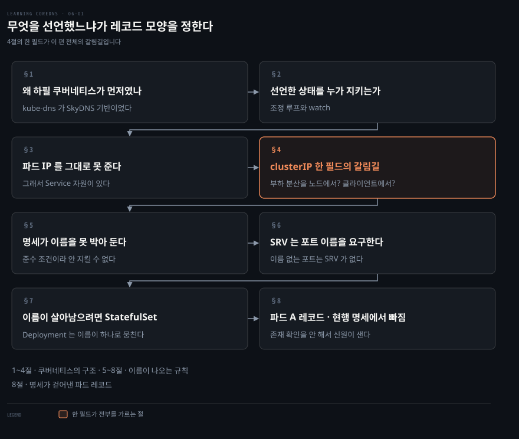
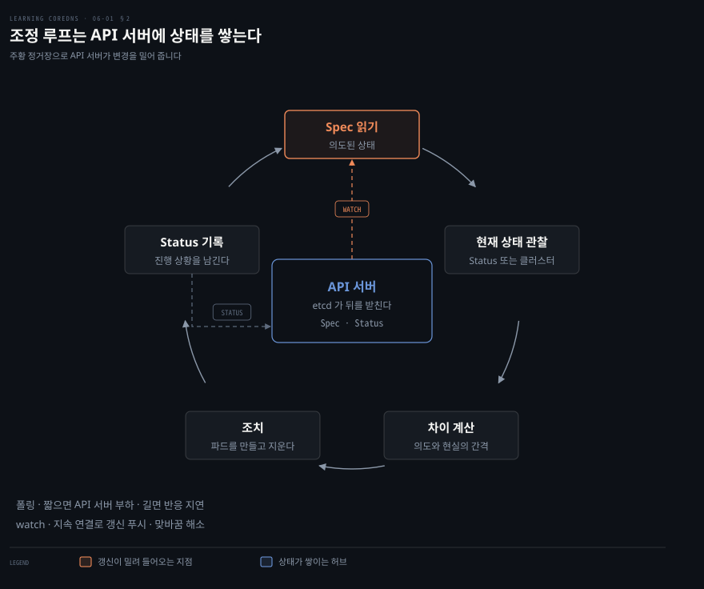
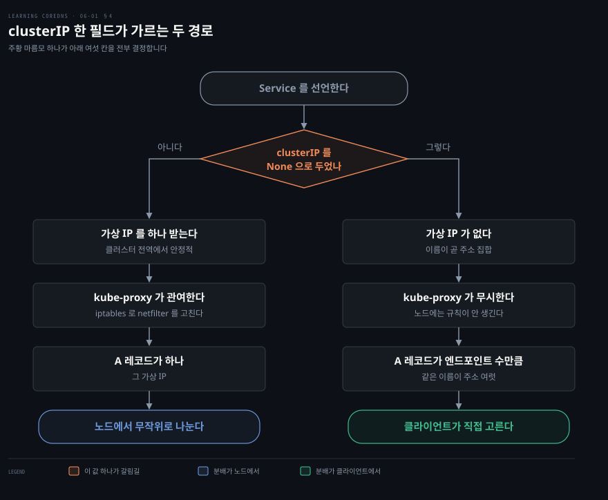
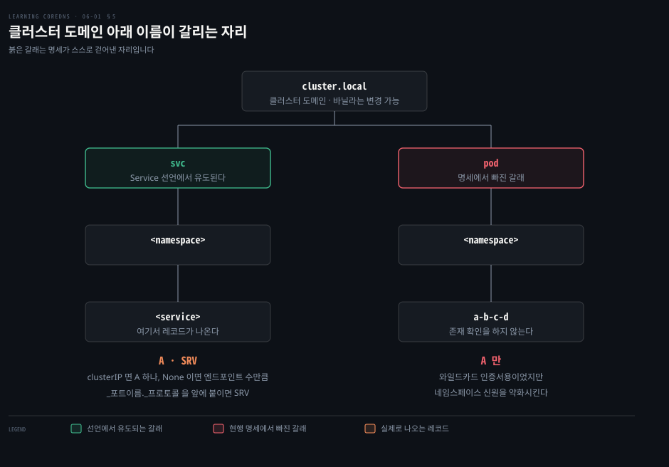
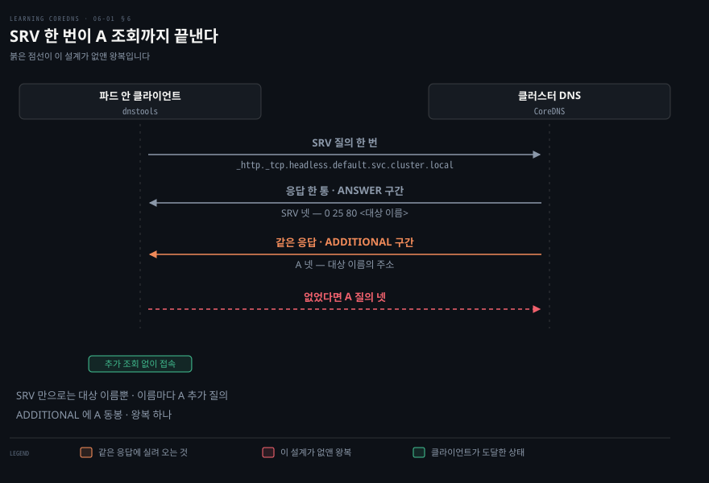
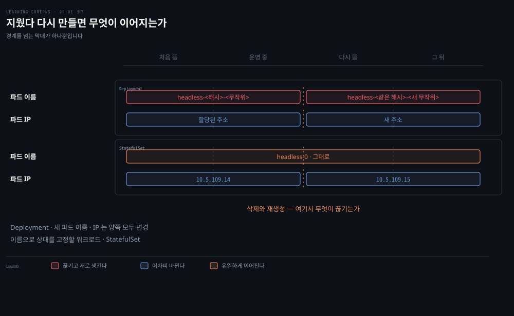

# 무엇을 선언했느냐가 레코드 모양을 정한다

---

> 쿠버네티스의 DNS 는 이름을 마음대로 짓게 두지 않습니다. Service 를 어떻게 선언했고 그 뒤에 무슨 워크로드가 있는지가 어떤 레코드가 생길지를 미리 정해 둡니다.

## 핵심 요약

> 이 편이 매달린 하나의 생각은 **쿠버네티스의 이름은 짓는 것이 아니라 선언에서 유도되는 것**이라는 점입니다.

4장까지의 존 데이터는 사람이 이름을 적어 넣는 것이었습니다. 5장의 etcd 도 키를 손으로 넣었습니다. 쿠버네티스는 그 자리를 없앱니다. Service 리소스 하나를 선언하면 이름과 레코드가 명세에 적힌 대로 따라 나옵니다.

그래서 이 편의 관심은 문법이 아니라 **무엇을 선언하면 무엇이 나오는가**입니다. 갈리는 자리가 셋입니다.

- `clusterIP` 한 필드가 A 레코드의 개수를 가릅니다.
- Deployment 냐 StatefulSet 이냐가 이름의 수명을 가릅니다.
- 포트에 이름을 붙였는지가 `SRV` 의 유무를 가릅니다.

명세가 강제라는 점도 알아 둘 값어치가 있습니다. DNS 는 형식상 add-on 이지만 쿠버네티스 준수 스위트의 일부라서, 이 명세를 따르는 DNS 서비스를 내놓지 못하면 그 배포판은 쿠버네티스라고 주장할 수 없습니다.


## 학습 목표

이 내용을 읽고 나면:

1. 선언형 API 와 명령형 API 의 차이를 프로세스 하나를 띄우는 예로 설명할 수 있습니다.
2. 조정 루프 세 단계와 watch 가 폴링을 대신하는 이유를 말할 수 있습니다.
3. ClusterIP 와 헤드리스 Service 가 부하 분산을 어디서 하는지 구분할 수 있습니다.
4. 서비스 이름 하나에서 A·PTR·SRV 레코드가 각각 어떤 조건으로 생기는지 유도할 수 있습니다.
5. Deployment 와 StatefulSet 이 파드 이름의 수명에서 무엇이 다른지 짚을 수 있습니다.

아래는 이 문서 전체를 읽는 순서로 이은 지도입니다. 원서의 절 경계로는 1절부터 4절까지가 쿠버네티스의 구조와 네트워킹이고, 5절부터 8절까지가 그 위에 얹힌 DNS 명세입니다.




## 이 문서가 다루지 않는 것

> 이 편은 쿠버네티스가 DNS 에 **무엇을 요구하는가**까지만 다룹니다. 그 요구를 CoreDNS 가 어떻게 받는지는 다음 편입니다.

- CoreDNS 의 클러스터 기본 Corefile 과 배포 리소스 → 06-02 (작성 예정)
- `kubernetes` 플러그인 문법과 확장 기능 → 06-03 (작성 예정)
- 쿠버네티스 공식 문서 기준의 DNS 운영 관점 → [DNS와 CoreDNS](../../kubernetes/04_networking/04-05.DNS%EC%99%80%20CoreDNS.md)
- `SRV` 레코드 자체의 우선순위·가중치 의미 → [레코드 한 줄을 읽으면 존 파일이 읽힌다](./02-02.%EB%A0%88%EC%BD%94%EB%93%9C%20%ED%95%9C%20%EC%A4%84%EC%9D%84%20%EC%9D%BD%EC%9C%BC%EB%A9%B4%20%EC%A1%B4%20%ED%8C%8C%EC%9D%BC%EC%9D%B4%20%EC%9D%BD%ED%9E%8C%EB%8B%A4.md)

남는 것은 **선언에서 이름이 유도되는 규칙**입니다.


## 1. 왜 하필 쿠버네티스가 먼저였나

> 오케스트레이터가 여럿이었는데 CoreDNS 는 쿠버네티스부터 붙었습니다. 이유가 둘 있고 둘 다 우연이 아닙니다.

CoreDNS 커뮤니티는 존 데이터 파일 지원을 붙이고 SkyDNS 의 기능을 대체한 뒤, 쿠버네티스와의 통합 작업을 시작했습니다. 로드맵에 있던 다른 시스템은 Mesos/Marathon 과 Docker Swarm 이었습니다.[^roadmap]

그런데도 쿠버네티스를 먼저 고른 이유가 저자들의 설명으로 둘입니다.

- 기존 쿠버네티스 DNS 서비스인 kube-dns 가 SkyDNS 기반이었습니다. 5장에서 본 그 SkyDNS 입니다. 이미 그 코드를 아는 사람들이 개선할 여지를 본 것입니다.
- 쿠버네티스 API 의 개방성 덕분에 다른 오케스트레이터보다 통합이 훨씬 쉬웠습니다.

> **노트의 읽기**: 두 이유는 사실 하나로 이어집니다. 5장에서 CoreDNS 가 "SkyDNS 보다 나은 SkyDNS" 를 표방했는데, kube-dns 를 대체하는 일이 그 표방의 가장 큰 무대였던 셈입니다. 그리고 그 무대에 오를 수 있었던 것은 쿠버네티스 API 가 열려 있었기 때문입니다. 원서가 두 이유를 이렇게 묶어 적지는 않습니다.

두 번째 이유는 다음 절의 주제이기도 합니다. API 가 어떻게 생겼길래 통합이 쉬웠는지를 알아야 CoreDNS 가 그 API 에서 무엇을 읽어 가는지 이해할 수 있습니다.


## 2. 선언한 상태를 누가 지키는가

> 쿠버네티스 API 는 명령을 받지 않고 의도를 받습니다. 그 의도와 현실의 차이를 계속 메우는 것이 컨트롤러입니다.



먼저 뼈대부터 봅니다. 쿠버네티스는 클러스터라 부르는 분산된 기계 집합 위에서 워크로드를 관리하는 소프트웨어 구성요소 묶음입니다. 클러스터에 속한 기계를 노드라 부르고, 노드는 흔히 마스터와 워커로 나뉩니다. 엄격하게 그래야 하는 것은 아닙니다.

워크로드는 파드 집합으로 배포됩니다. 파드는 밀접하게 연관된 컨테이너들과 네트워킹 스택 같은 공유 자원을 함께 묶은 것입니다. 한 파드에서 도는 컨테이너들은 **같은 리눅스 네트워크 네임스페이스**를 공유해서, 컨테이너 입장에서는 전부 같은 네트워크 호스트 위에서 도는 것처럼 보입니다. 파드는 쿠버네티스의 확장 단위이기도 합니다. 애플리케이션을 키우고 싶으면 그 애플리케이션을 서빙하는 파드를 더 붙입니다.

제어 평면의 심장은 API 서버이고 다른 모든 구성요소가 그것을 거쳐 협력합니다. 쿠버네티스 API 는 HTTP 기반의 자원 지향 API 로 REST 관례를 따릅니다. 대부분의 연산은 그저 자원을 만들고 읽고 고치고 지우는 일입니다. API 서버 뒤를 받치는 것은 etcd 분산 키-값 저장소이고, 여러 자원이 거기 저장됩니다.

> **노트의 읽기**: 5장의 etcd 가 여기서 다시 나옵니다. 5장에서는 CoreDNS 가 etcd 를 **직접** 읽었지만, 쿠버네티스에서는 CoreDNS 가 API 서버를 읽고 etcd 는 그 뒤에 숨습니다. 같은 저장소를 두고 접근 경로가 한 겹 늘어난 것입니다. 그 한 겹이 무엇을 주는지가 이 절의 나머지입니다.

### 선언형 API 는 결과를 약속합니다

쿠버네티스 API 는 선언형입니다. 클라이언트는 API 로 클러스터의 **바라는 상태**를 선언하고, 그 상태를 실현하고 유지하는 일은 쿠버네티스의 몫입니다. 한 번의 연산을 실행하고 끝나는 통상적인 명령형 API 와 대비됩니다.

저자가 드는 대비가 명료합니다. 프로세스를 하나 띄우는 가상의 API 를 생각합니다.

- **명령형**: 클라이언트가 실행할 명령을 보내면 서버가 그 명령을 실행하고 돌아옵니다. 프로세스가 죽어도 명령형 구현은 그 사실을 전혀 모릅니다. 이미 끝났고 프로세스의 상태를 추적하지 않기 때문입니다.
- **선언형**: 클라이언트가 "이 명령에 기반한 프로세스가 **항상** 떠 있어야 한다"는 선언을 보냅니다. 그 API 를 구현한 시스템이 프로세스를 띄우고, 감시하고, 죽으면 알아채서 다시 띄웁니다.

의도를 담은 자원이 남아 있는 한 시스템은 그 프로세스가 있도록 보장합니다. 그래서 어떤 문헌은 선언형 API 를 의도 기반 API 라고 부르기도 합니다.

### 조정 루프는 세 걸음입니다

의도한 상태를 보장하는 구성요소를 컨트롤러라 부릅니다. 컨트롤러는 대개 조정 루프를 돌려 관련 자원 집합을 관리합니다. 끝없이 도는 이 루프가 하는 일은 셋입니다.

1. API 서버에서 의도된 자원 상태를 읽습니다. 대개 자원의 `Spec` 필드에 정의돼 있습니다.
2. 자원의 현재 상태를 관찰합니다. 자원의 `Status` 필드를 읽거나, 클러스터를 직접 관찰하거나, 둘을 섞습니다.
3. 바라는 상태와 관찰된 상태의 차이를 알맞은 조치로 메우려 합니다. 상태를 고치면서 진행 상황을 `Status` 필드에 저장해, 사용자나 다른 컨트롤러가 그 과정을 볼 수 있게 합니다.

위 도식의 정거장이 다섯인 것은 셋째 걸음 안에 "차이를 메우려 한다"·"조치한다"·"진행을 `Status` 에 적는다" 셋이 들어 있어 펼친 것입니다. 원서가 세는 단위는 셋입니다.

여기서 곧바로 문제가 하나 생깁니다. 컨트롤러가 바라는 상태의 변화를 알려면 자원을 계속 감시해야 하는데, 루프를 돌 때마다 API 서버를 폴링하면 되기는 합니다. 단순하지만 대가가 있습니다.

사용자가 바라는 상태를 바꿔도 컨트롤러는 다음 폴링 때까지 반응하지 않습니다. 굼뜬 반응을 피하려면 폴링 간격을 아주 짧게 잡아야 합니다. 그런데 잦은 폴링은 API 서버에 큰 부하를 겁니다. 그 부하가 그 자체로 지연을 만들고 자원을 낭비하며 전체 해법의 확장성을 깎습니다.

### watch 가 폴링을 대신합니다

API 서버는 이 문제를 다른 RESTful API 에서 흔히 보기 어려운 watch 기능으로 풉니다. 클라이언트가 특정 자원을 질의할 때 지속 연결을 만든 다음, 그 자원에 갱신이 생기면 그 연결로 **밀어 달라**고 서버에 요청할 수 있습니다. 이 동작이 폴링을 없앱니다. 쿠버네티스 클러스터가 효율적으로 도는 데 결정적인 기능입니다.

> **노트의 읽기**: 5장이 남긴 문제가 여기서 반쯤 풀립니다. 5장의 결론은 "DNS 에는 푸시가 없어서 클라이언트가 TTL 을 기다린다"였는데, 쿠버네티스 API 서버에는 그 푸시가 있습니다. 다만 푸시가 닿는 곳은 CoreDNS 까지입니다. CoreDNS 가 클러스터 변화를 즉시 아는 것과, 파드 안의 리졸버가 그 변화를 즉시 아는 것은 여전히 다른 문제입니다. 이 비대칭이 6장 후반부의 캐시·TTL 설정이 왜 까다로운지의 배경이 됩니다.

마지막 조각이 kubelet 입니다. 컨트롤러는 모든 노드에서 돌지 않고 제어 평면 노드에서만 돕니다. 그러니 어떤 노드에서 조치를 하려면 그 노드에 소프트웨어가 하나 더 있어야 합니다. kubelet 은 모든 노드에서 도는 에이전트로 파드를 띄우고 감시하고 없애며, 노드 수준의 자원을 관리합니다. 노드의 능력과 상태를 API 서버에 보고해서 스케줄러가 새 파드를 놓을 노드를 고를 수 있게 하는 일도 합니다.


## 3. 파드 IP 를 그대로 알려 줄 수는 없다

> 파드마다 IP 가 있고 모든 파드는 서로 닿습니다. 그런데 그 IP 를 클라이언트에게 알려 주는 방식은 오래가지 못합니다.

파드 하나에서 도는 서비스를 클러스터의 다른 클라이언트에게 열고 싶다고 합시다. 파드마다 IP 주소가 있고, 모든 쿠버네티스 클러스터에서 모든 파드는 다른 어떤 파드에도 닿을 수 있어야 합니다.[^netpolicy] 그러니 파드 IP 를 모든 클라이언트에게 알려 주면 닿기는 합니다.

효과적인 방법이 아닌 이유는 5장에서 본 것과 같습니다. 파드는 뜨고 집니다. 특히 Deployment 가 관리하는 파드가 그렇습니다. Deployment 에서 파드들은 서로 같은 복제본으로 취급되어 늘거나 줄고, 죽거나 애플리케이션 업그레이드 때문에 교체됩니다. 파드가 없어졌다 다시 만들어질 때마다 새 IP 주소가 할당됩니다. 이 환경에서 IP 주소가 안정적이기를 기대할 수 없습니다.

문제가 하나 더 있습니다. 서비스를 제공하는 파드가 여럿이면 그 주소 전부를, 그것도 뜨고 지는 대로 알려야 합니다.

쿠버네티스는 이것을 Service 자원으로 풉니다. 이 자원은 셋을 한데 묶습니다. 부하 분산 설정, 그 Service 를 제공하는 파드를 고르는 방법, 그리고 이름입니다. 클러스터의 다른 클라이언트에게 Service 를 알리는 데 관련된 종류는 둘입니다. ClusterIP Service 와 헤드리스 Service 입니다.


## 4. `clusterIP` 한 필드가 부하 분산의 자리를 옮긴다

> 두 Service 는 생김새가 거의 같습니다. `clusterIP` 를 `None` 으로 두느냐 아니냐가 부하 분산을 노드에서 할지 클라이언트에서 할지를 가릅니다.



ClusterIP Service 는 앞 절의 문제를 정확히 풉니다. Service 마다 안정적이고 클러스터 전역에서 통하는 가상 IP 주소를 만들고 이름과 묶습니다.

동작은 이렇습니다. Service 를 제공하는 모든 파드에 특정 라벨을 붙인 다음, Service 에 그 라벨을 고르는 셀렉터를 줍니다. 셀렉터가 파드를 골라 Endpoints 자원으로 묶습니다. 그 자원이 파드들의 주소와 포트를 전부 담습니다.

```yaml
apiVersion: v1
kind: Service
metadata:
  name: hello-world
  namespace: default
spec:
  selector:
    app: hello-world
  type: ClusterIP
  clusterIP: 10.0.0.100
  ports:
  - name: http
    port: 80
    protocol: TCP
```

이 예제에서 `app` 라벨 값이 `hello-world` 인 파드가 서비스의 일부로 선택되고, 그 주소들이 서비스와 같은 이름의 Endpoints 객체에 저장됩니다.

그 파드들에 실제로 트래픽을 나누려면 제어 평면 구성요소가 하나 더 필요합니다. 노드마다 도는 kube-proxy 라는 바이너리입니다. kube-proxy 는 표준 리눅스 `iptables` 로 노드의 netfilter 테이블을 조작해서, 가상 IP 로 가는 트래픽이 엔드포인트 주소 중 하나로 **무작위로** 넘어가게 만듭니다.

### 헤드리스는 그 가상 IP 를 포기합니다

헤드리스 Service 는 ClusterIP Service 와 똑같이 생겼습니다. `clusterIP` 필드가 `None` 인 것만 다릅니다.

```yaml
apiVersion: v1
kind: Service
metadata:
  name: headless
  namespace: default
spec:
  selector:
    app: headless
  type: ClusterIP
  clusterIP: None
  ports:
  - name: http
    port: 80
    protocol: TCP
```

이때는 가상 IP 가 없고 kube-proxy 는 이 서비스를 무시합니다. 대신 부하 분산이 클라이언트 자신에게서 일어나고, 서비스의 모든 IP 주소를 찾는 데 DNS 를 씁니다. gRPC 저자들이 그 프로토콜을 쓸 때 클라이언트 측 부하 분산을 권한다고 저자는 예로 듭니다.

대가는 클라이언트가 집니다. 엔드포인트 집합이 바뀌었는지 알아내려면 클라이언트가 능동적으로 질의를 다시 풀어야 합니다.

> **노트의 읽기**: 이 대가가 곧 5장이 말한 "DNS 에는 푸시가 없다"의 클러스터 안 버전입니다. 헤드리스를 고르면 부하 분산의 자유를 얻는 대신 신선도 관리를 떠안습니다. 2절에서 본 watch 는 CoreDNS 까지만 밀어 주고 파드 안 클라이언트까지는 밀어 주지 않기 때문입니다.

헤드리스에는 쓸모가 하나 더 있습니다. **고정된 동료 집합을 찾아야 하는** 애플리케이션입니다. etcd 클러스터를 돌릴 때 각 인스턴스가 클러스터의 다른 etcd 인스턴스를 찾아야 하는데, 그중 하나가 이름을 바꾸면 etcd 가 문제를 겪을 수 있습니다.

쿠버네티스는 워크로드 집합이 일관된 이름으로 뜨게 하는 문제를 StatefulSet 으로 풉니다. Deployment 가 쓰는 ReplicaSet 과 비슷한 워크로드 관리 자원인데, 자기가 띄우는 파드를 같은 복제본으로 취급하지 않는 점이 다릅니다. 파드마다 서수를 주고 그 순서로 이름 짓고 만들고 늘리며, 파드가 없어졌다 다시 만들어질 때 영구 볼륨을 올바른 파드에 다시 붙입니다. 헤드리스 Service 와 함께 쓰면 파드마다 안정적인 네트워크 신원을 줄 수 있습니다.


## 5. 명세가 이름을 미리 못 박아 둔다

> 쿠버네티스의 DNS 는 형식상 add-on 이지만 명세는 준수 조건입니다. 그 명세는 어떤 이름이 존재해야 하는지를 API 서버의 내용에서 유도합니다.



DNS 는 쿠버네티스에서 add-on 으로 취급되고 클러스터는 DNS 없이도 돕니다. 그런데 DNS 없이 도는 클러스터는 아주 드물고, 쿠버네티스 DNS 명세는 표준 준수 스위트의 일부로 간주됩니다. 명세를 따르는 DNS 서비스를 제공하지 않으면 그 배포판은 준수하는 쿠버네티스 배포판이라고 선언할 수 없습니다.[^windows]

이 명세는 의견이 실린 규정 스키마입니다. API 서버의 내용에 근거해 반드시 존재해야 하는 이름 집합을 정합니다. Service 자원은 사용자가 "서비스를 어떻게 발견하게 할지" 의도를 적어 넣는 주된 통로입니다.

명세의 모든 레코드는 하나의 도메인 아래 들어갑니다. 클러스터 도메인입니다. 온라인 예제에서 흔히 보는 값은 `cluster.local` 입니다. GKE 같은 일부 관리형 솔루션에서는 이 도메인을 바꿀 수 없고, 바닐라 오픈소스 쿠버네티스에서는 아무 도메인이나 고를 수 있습니다.

### ClusterIP 는 A 하나와 PTR 하나

명세는 ClusterIP 마다 그 클러스터 IP 를 담은 A 레코드를 요구합니다. 이름은 서비스 이름과 네임스페이스에서 유도합니다.

```bash
service.namespace.svc.cluster-domain
```

앞 절의 `hello-world` Service 를 클러스터 도메인이 `cluster.example.com` 인 클러스터에 배포했다면 이렇게 답합니다.

```bash
;; ANSWER SECTION:
hello-world.default.svc.cluster.example.com. 5 IN A 10.0.0.100
```

그리고 그 클러스터 IP 에 대응하는 PTR 레코드도 함께 생깁니다.

### 헤드리스는 같은 이름에 A 를 여럿 답니다

헤드리스 Service 에서는 서비스의 **엔드포인트 IP 주소마다** A 레코드가 생깁니다. 이름은 ClusterIP 와 같은 자리입니다. 그래서 클러스터 IP 의 netfilter 기반 부하 분산 대신 클라이언트 측 부하 분산을 쓸 수 있습니다. 같은 이름이 주소를 여럿 돌려준다는 뜻입니다.

```bash
;; ANSWER SECTION:
headless.default.svc.cluster.local. 5 IN A 10.5.88.4
headless.default.svc.cluster.local. 5 IN A 10.5.88.6
headless.default.svc.cluster.local. 5 IN A 10.5.88.7
headless.default.svc.cluster.local. 5 IN A 10.5.88.5
```

한 선언에서 레코드 개수가 갈리는 것이 이 절의 요점입니다. `clusterIP` 를 적으면 A 가 하나, `None` 으로 두면 엔드포인트 수만큼입니다.

> **노트의 읽기**: 위 응답들의 TTL 이 전부 `5` 인데 원서는 그 숫자를 설명하지 않습니다. `kubernetes` 플러그인의 기본 TTL 입니다. 공식 문서가 `"ttl allows you to set a custom TTL for responses. The default is 5 seconds."` 라고 적고, 최소 0초에서 최대 3600초까지 바꿀 수 있으며 0 으로 두면 레코드가 캐시되지 않는다고 덧붙입니다.[^k8sttl] 클러스터 안 이름이 5초 만에 만료되도록 잡혀 있다는 뜻이고, 이 짧은 TTL 이 2절에서 본 watch 의 즉시성을 클라이언트 쪽에서 흉내 내는 장치입니다.

### 예제를 돌려 보려면 파드가 하나 필요합니다

이 장의 예제 상당수는 `infoblox/dnstools` 컨테이너 이미지를 돌리는 파드 안에서 실행됩니다. Docker Hub 에 공개된 이미지로 `host`·`dig`·`dnsperf` 같은 DNS 전용 도구와 `curl`·`tcpdump` 같은 일반 네트워킹 도구가 들어 있습니다.

```bash
kubectl run --restart=Never -it --image infoblox/dnstools dnstools
```

> **원문 정오**: 이 사이드바는 `--restart=Never` 로 파드 하나를 띄우라고 하는데, 뒤의 Example 6-10 은 `dnstools-5c98d9bbf-q9q25` 라는 파드에 `kubectl attach` 합니다. 해시 두 조각이 붙은 이 이름은 Deployment 와 ReplicaSet 이 만드는 형태라, `--restart=Never` 로는 나올 수 없는 이름입니다. 예제들이 서로 다른 방식으로 띄운 파드를 쓰고 있습니다.


## 6. `SRV` 는 포트에 이름을 붙였을 때만 생긴다

> 엔드포인트 주소와 이름 붙은 포트의 조합마다 `SRV` 레코드가 생깁니다. 이름 없는 포트는 `SRV` 를 받지 못합니다.



A 레코드에 더해, 엔드포인트 주소와 이름 붙은 포트의 조합마다 `SRV` 레코드가 있습니다. `SRV` 레코드는 IP 주소만이 아니라 포트도 담고, 질의는 포트 이름과 프로토콜로 합니다.

보통 DNS 이름에는 밑줄이 허용되지 않습니다. 그런데 `SRV` 레코드를 정의한 RFC 2782 는 밑줄을 써서 이 라벨들이 이름의 통상적인 부분이 아니라 포트 이름과 프로토콜 전용으로 예약된 것임을 나타냅니다.

```bash
dig -t srv _http._tcp.headless.default.svc.cluster.local.
```

이름의 첫 라벨 `_http` 는 포트 이름 "http" 에, 두 번째 라벨 `_tcp` 는 프로토콜 필드의 "TCP" 에 대응합니다. 이름 붙은 포트가 여럿이면 엔드포인트와 포트의 조합마다 `SRV` 레코드가 생깁니다. **Service 의 이름 없는 포트는 `SRV` 레코드를 받지 못합니다.**

### 응답 한 번에 A 조회까지 끝납니다

응답의 ANSWER 구간에는 엔드포인트 주소마다 `SRV` 레코드가 들어갑니다. `SRV` 는 우선순위, 가중치, 포트, 그리고 그 엔드포인트 주소에 대응하는 A 레코드의 이름을 담습니다.

```bash
;; ANSWER SECTION:
_http._tcp.headless.default.svc.cluster.local. 5 IN SRV 0 25 80 10-5-104-3...
(엔드포인트마다 한 줄씩, 원서 출력에는 넷)

;; ADDITIONAL SECTION:
10-5-104-3.headless.default.svc.cluster.local. 5 IN A 10.5.104.3
(같은 넷의 A 레코드)
```

`SRV` 질의 결과의 ADDITIONAL 구간에는 `SRV` 레코드의 대상이 가리키는 A 레코드가 담깁니다. 그래서 그 이름들을 위한 추가 조회 없이 곧바로 쓸 수 있습니다.

쿠버네티스 `SRV` 레코드에서 **우선순위와 가중치는 의미가 없다**고 저자는 못 박습니다. 포트는 Service 자원의 이름 붙은 포트를 반영합니다.

> **노트의 읽기**: "의미가 없다"는 말은 운영자의 의도가 실리지 않는다는 뜻으로 읽어야 합니다. 값 자체가 아무렇게나 나오는 것은 아닙니다. 원서 Example 6-5 는 엔드포인트 넷에 전부 가중치 25 를 답았는데, 이것은 [5장에서 본 재계산 규칙](./05-01.%EC%83%81%ED%83%9C%EB%A5%BC%20%EB%B0%96%EC%97%90%20%EB%91%90%EC%96%B4%EC%95%BC%20%EC%9D%B4%EB%A6%84%EC%9D%B4%20%EC%B4%88%20%EB%8B%A8%EC%9C%84%EB%A1%9C%20%EB%B0%94%EB%80%90%EB%8B%A4.md) 대로 같은 우선순위 안에서 합이 100 이 되게 나눈 결과입니다. 넷이니 25 씩입니다. 운영자가 고를 수 없을 뿐 계산은 결정적입니다.
>
> 다만 응답에 보이는 값의 합이 늘 100 인 것은 아닙니다. 7절의 Example 6-7 은 엔드포인트가 넷인데도 `SRV` 를 한 줄만 돌려주고 그 한 줄의 가중치가 25 입니다. 넷이 같은 대상 이름을 갖게 되어 중복 레코드가 걸러진 결과이고, 가중치는 걸러지기 **전** 넷을 기준으로 계산된 뒤 그대로 남습니다. 소스에도 `"This might break because we may drop duplicate SRV records latter on."` 라는 주석이 그 자리에 달려 있습니다.[^srcweight2] 합이 100 인 것은 대상 이름이 서로 다를 때입니다.

### 대상 이름은 PodSpec 이 정합니다

ADDITIONAL 구간 A 레코드의 이름은 그 파드의 PodSpec 설정에 달렸습니다. PodSpec 이 `hostname` 과 `subdomain` 필드를 설정하지 않았거나, `subdomain` 필드가 이 서비스의 이름과 맞지 않으면 첫 라벨은 임의의 고유 식별자가 됩니다.[^podident] 그 조건이 아니라면 `hostname` 값이 여기 쓰입니다.

위 예제의 `10-5-104-3` 이 그 임의 식별자입니다. 명세상으로는 무엇이든 될 수 있습니다. 예전 kube-dns 는 내부 해시를 썼고 CoreDNS 는 파드 IP 주소를 대시로 이어 붙인 형태를 씁니다.[^podident]


## 7. 이름이 살아남으려면 StatefulSet 이어야 한다

> `hostname` 과 `subdomain` 을 Deployment 에 붙이면 이름이 하나로 뭉칩니다. 파드마다 다른 이름을 얻으려면 워크로드 종류를 바꿔야 합니다.



먼저 Deployment 에 `hostname: myhost` 와 `subdomain: headless` 를 붙여 봅니다. Service 는 앞의 헤드리스 그대로 두어도 됩니다. Deployment 의 파드 템플릿을 바꾸는 데 Service 를 고칠 필요는 없습니다.

```bash
;; ANSWER SECTION:
headless.default.svc.cluster.local. 5 IN SRV 0 25 80 myhost.headless.default.svc

;; ADDITIONAL SECTION:
myhost.headless.default.svc.cluster.local. 5 IN A 10.5.105.6
myhost.headless.default.svc.cluster.local. 5 IN A 10.5.105.5
myhost.headless.default.svc.cluster.local. 5 IN A 10.5.105.4
myhost.headless.default.svc.cluster.local. 5 IN A 10.5.105.7
```

저자의 평가가 짧습니다. 별로 쓸모가 없다는 것입니다. Deployment 는 똑같은 파드를 만들기 때문에 엔드포인트 전부가 이름 하나를 갖게 되고, 이것은 그냥 서비스 이름을 쓰는 것과 기능적으로 다르지 않습니다.

### StatefulSet 은 서수를 이름에 박습니다

이 기능이 정말 중요해지는 자리는 Deployment 대신 StatefulSet 을 쓸 때입니다. StatefulSet 은 자기가 만드는 파드마다 같은 호스트 이름을 쓰지 않습니다. 대신 서수(0, 1, 2 …)에 기반해 호스트 이름을 정하고, 파드가 삭제되고 다시 만들어져도 그 이름을 유지합니다. Deployment 라면 이 경우 새 파드 이름을 만들어 냈을 것입니다. 파드에 안정적인 네트워크 신원이 생기는 것입니다.

파드에 붙은 영구 볼륨도 함께 추적해서, 파드가 없어져도(예를 들어 노드가 죽어 다시 스케줄링할 때) 같은 이름의 파드에 같은 볼륨이 마운트되게 합니다.

StatefulSet 자원을 자세히 보면 PodSpec 템플릿에 `hostname` 과 `subdomain` 필드가 아예 없습니다. StatefulSet 을 쓰면 컨트롤러가 파드 이름과 `hostname` 을 자동으로 만들기 때문에 손으로 설정할 필요가 없습니다. 오히려 템플릿에 설정하면 무시되고 컨트롤러가 덮어씁니다. `subdomain` 에 쓸 값은 `serviceName` 필드로 알려 줍니다.

```yaml
apiVersion: apps/v1
kind: StatefulSet
metadata:
  name: headless
  namespace: default
spec:
  replicas: 4
  serviceName: headless
  selector:
    matchLabels:
      app: headless
  template:
    metadata:
      labels:
        app: headless
    spec:
      containers:
      - image: nginx
        name: nginx
        ports:
        - containerPort: 80
          name: http
          protocol: TCP
```

> **노트의 읽기**: 위 YAML 의 들여쓰기는 표준 형태로 옮긴 것입니다. PDF 에서 뽑은 텍스트는 코드 블록의 앞쪽 공백을 원본 그대로 보존한다고 보장할 수 없어서, 원서 지면의 들여쓰기가 실제로 어긋나 있는지는 이 방법으로 확정할 수 없었습니다. 구조가 옳은 쪽으로 적었습니다.

그러면 응답이 이렇게 갈립니다.

```bash
;; ANSWER SECTION:
headless.default.svc.cluster.local. 5 IN SRV 0 25 80 headless-3.headless.default
headless.default.svc.cluster.local. 5 IN SRV 0 25 80 headless-2.headless.default
headless.default.svc.cluster.local. 5 IN SRV 0 25 80 headless-1.headless.default
headless.default.svc.cluster.local. 5 IN SRV 0 25 80 headless-0.headless.default
```

엔드포인트마다 개별 이름이 보입니다. 파드를 지워 컨트롤러가 다시 만들게 해도 같은 이름이 보이고, IP 만 바뀝니다. 원서는 파드 넷을 강제로 지운 뒤 다시 질의해서 이것을 보입니다. 서수 이름 넷이 그대로이고 A 레코드의 주소만 바뀌어 있습니다.

> **원문 정오**: Example 6-10 의 `kubectl get po` 출력 둘이 서로 어긋납니다. 파드를 지우기 **전** 출력에는 `headless-0` 부터 `headless-3` 까지 넷만 있는데, 지운 **뒤** 출력에는 같은 명령의 결과인데도 `coredns-56c94cbf88-5tpvh`·`coredns-56c94cbf88-wcw4j`·`dnstools-5c98d9bbf-q9q25` 가 함께 들어 있습니다. 바로 다음 줄에서 저자가 `kubectl attach` 하는 dnstools 파드가 앞 출력에는 없었던 셈입니다.


## 8. 파드 A 레코드는 명세가 스스로 폐기했다

> 명세에는 파드마다 A 레코드를 두는 규칙도 있습니다. 다만 그 규칙은 폐기 표시가 붙어 있고, 이유가 보안입니다.

명세는 파드마다 A 레코드도 포함하지만 이 레코드는 폐기됐습니다. 명세가 기존 kube-dns 동작을 옮겨 적으며 쓰였기 때문에, 더는 모범 사례로 여겨지지 않는데도 들어갔습니다.

이 레코드가 있으면 DNS 서버는 다음 형태의 질의에 답합니다.

```bash
a-b-c-d.namespace.pod.cluster.local
```

`a`·`b`·`c`·`d` 는 0에서 255 사이의 정수이고, 응답은 `a.b.c.d` 를 담은 A 레코드입니다. 문제는 **그 IP 주소를 가진 파드가 지정된 네임스페이스에 실제로 있는지 확인하지 않는다**는 점입니다.

의도는 와일드카드 인증서(`*.namespace.pod.cluster.local.`)에 쓰는 것이었습니다. 그런데 이것은 DNS 에서 나오는 신원 보장을 약화시키고 따라서 보안을 약화시킵니다. 악의적 행위자가 이 자동 동작을 이용해, 네임스페이스 밖의 파드를 다른 서비스에게 네임스페이스 안의 파드인 것처럼 보이게 만들 수 있습니다. 그래서 명세에서 폐기됐습니다.

> **원문 정오**: 이 대목의 문장이 `"so these records were included even if though they are no longer considered a best practice"` 로 적혀 있습니다. `even if though` 는 `even though` 의 오타입니다.


## 심화 학습

> 원서가 기준으로 삼은 명세와 지금 명세를 대조할 자리를 짚습니다. 6장은 명세 문서가 따로 있어 대조가 비교적 쉬운 장입니다.

- **명세는 별도 저장소에 살아 있습니다.** 쿠버네티스 DNS 명세는 `kubernetes/dns` 저장소의 `docs/specification.md` 가 정본입니다.[^dnsspec] 원서를 읽다 "명세가 요구한다"는 서술을 만나면 이 문서에서 해당 절을 찾아 지금도 같은지 확인하는 편이 안전합니다.
- **"insecure" 라는 이름의 유래는 이 장 뒤쪽에 있습니다.** 원서 각주 9 는 네임스페이스 밖 파드가 네임스페이스 안에 있는 것처럼 보이게 하면 TLS 를 쓸 때 DNS 기반 신원 보장이 약해지고 그래서 "insecure" 라는 별명이 붙었다고 적습니다. 다만 그 각주가 달린 자리는 이 편이 다루는 폐기 문단이 아니라 뒤쪽 Pod Options 절이라, 8절을 읽을 때는 아직 그 이름이 나오지 않습니다.
- **IPv6 는 아직입니다.** 원서 각주 7 은 `"IPv6 is coming to Kubernetes. Any day now."` 라고 적습니다. 2019년 시점의 농담 섞인 서술이라, 지금 기준의 이중 스택 지원 여부는 공식 문서를 따로 봐야 합니다.

이 편의 서술은 원서가 2019년에 본 명세를 옮긴 것입니다. 실제 클러스터를 다룰 때는 위 명세 문서와 쓰는 쿠버네티스 버전의 문서를 함께 여는 편이 안전합니다.


## 결정 치트시트

> 무엇을 선언하면 무엇이 나오는지를 역방향으로 정리했습니다. 원하는 결과에서 선언을 되짚는 표입니다.

| 원하는 것 | 선언 | 나오는 레코드 |
|-----------|------|--------------|
| 이름 하나로 안정적인 주소 하나 | `clusterIP` 에 주소 | A 하나 + 그 IP 의 PTR |
| 이름 하나로 엔드포인트 주소 전부 | `clusterIP: None` | 엔드포인트 수만큼의 A |
| 포트까지 함께 찾기 | `ports` 에 `name` 부여 | `_포트이름._프로토콜.…` 의 `SRV` |
| 추가 조회 없이 곧바로 접속 | (위와 같음) | `SRV` 응답의 ADDITIONAL 에 A 동봉 |
| 파드마다 다른 이름 | 헤드리스 + StatefulSet | 서수 이름 (`headless-0` …) |
| 파드가 죽어도 같은 이름 | StatefulSet | 재생성 후에도 같은 이름, IP 만 변경 |
| 부하 분산을 노드에서 | `clusterIP` 에 주소 | kube-proxy 가 netfilter 로 무작위 분배 |
| 부하 분산을 클라이언트에서 | `clusterIP: None` | kube-proxy 가 무시, 클라이언트가 직접 |
| 이름 없는 포트로 `SRV` | 불가능 | `SRV` 레코드가 생기지 않는다 |


## 적용 관점

> 이 편은 클러스터가 있으면 `dig` 한 번으로 전부 확인됩니다. 선언과 레코드의 대응을 눈으로 보는 것이 목적입니다.

**한 가지 실행**: 같은 Deployment 에 Service 를 둘 붙입니다. 하나는 `clusterIP` 를 비워 두고 하나는 `clusterIP: None` 으로 둡니다. 두 이름을 각각 `dig` 로 물어 A 레코드 개수가 갈리는 것을 봅니다. 4절의 한 필드가 실제로 무엇을 바꾸는지 그때 잡힙니다.

**한 가지 확인**: 헤드리스 Service 를 Deployment 로 한 번, StatefulSet 으로 한 번 받쳐 봅니다. 파드를 전부 지운 뒤 `SRV` 를 다시 물어 이름이 유지되는지 봅니다. 7절의 차이가 여기서 갈립니다.

Spring 애플리케이션 관점에서는 헤드리스 Service 가 판단 지점이 됩니다. gRPC 나 클라이언트 측 부하 분산을 쓰는 구성이라면 헤드리스로 주소 전부를 받는 편이 맞고, 그렇지 않으면 ClusterIP 로 두고 분배를 kube-proxy 에 맡기는 편이 애플리케이션에서 할 일이 적습니다. 헤드리스를 골랐다면 재해석 주기를 누가 관리하는지가 곧 신선도 문제가 됩니다.


## 면접에서 받을 만한 질문

1. 선언형 API 와 명령형 API 를 프로세스 하나를 띄우는 예로 구분해 보십시오.
2. 조정 루프가 폴링 대신 watch 를 쓰는 이유를 둘 이상 대 보십시오.
3. ClusterIP Service 와 헤드리스 Service 는 부하 분산을 각각 어디서 합니까.
4. 헤드리스 Service 를 골랐을 때 클라이언트가 새로 지는 책임은 무엇입니까.
5. `SRV` 레코드가 생기지 않는 포트는 어떤 포트입니까.
6. 파드를 지웠다 다시 만들어도 같은 이름이 유지되게 하려면 무엇을 바꿔야 합니까.
7. `a-b-c-d.namespace.pod.cluster.local` 레코드가 폐기된 이유는 무엇입니까.


## 정답 (자답 후 펼치기)

### 정답 1 — 선언형과 명령형

명령형은 클라이언트가 명령을 보내면 서버가 실행하고 돌아옵니다. 프로세스가 죽어도 구현은 모릅니다. 이미 끝났고 상태를 추적하지 않기 때문입니다. 선언형은 "이 프로세스가 항상 떠 있어야 한다"는 선언을 받고, 구현이 프로세스를 띄우고 감시하고 죽으면 다시 띄웁니다. 의도를 담은 자원이 남아 있는 한 보장이 이어집니다.

### 정답 2 — watch 를 쓰는 이유

폴링으로도 되지만 셋이 걸립니다. 사용자가 의도를 바꿔도 다음 폴링 때까지 반응이 없습니다. 그래서 간격을 줄이면 API 서버에 부하가 걸려 지연이 생깁니다. 그러면서 자원을 낭비하고 전체 확장성을 깎습니다. watch 는 지속 연결로 갱신을 밀어 주므로 이 셋을 한꺼번에 없앱니다.

### 정답 3 — 부하 분산의 자리

ClusterIP 는 노드에서 합니다. kube-proxy 가 `iptables` 로 netfilter 테이블을 조작해 가상 IP 로 오는 트래픽을 엔드포인트 중 하나로 무작위 전달합니다. 헤드리스는 클라이언트에서 합니다. 가상 IP 가 없고 kube-proxy 가 무시하므로, 클라이언트가 DNS 로 주소 전부를 받아 스스로 고릅니다.

### 정답 4 — 헤드리스가 클라이언트에 지우는 책임

엔드포인트 집합의 변화를 알아내려면 클라이언트가 능동적으로 질의를 다시 풀어야 합니다. 밀어 주는 경로가 없으므로 신선도 관리가 클라이언트 몫이 됩니다.

### 정답 5 — `SRV` 가 안 생기는 포트

Service 의 이름 없는 포트입니다. `SRV` 이름의 첫 라벨이 포트 이름에서 오므로, 이름이 없으면 만들 이름이 없습니다.

### 정답 6 — 이름을 유지하려면

워크로드를 Deployment 에서 StatefulSet 으로 바꿉니다. StatefulSet 은 서수 기반 호스트 이름을 붙이고 파드가 삭제·재생성돼도 그 이름을 유지합니다. 파드 템플릿에 `hostname` 을 손으로 넣는 것은 방법이 아닙니다. Deployment 에서는 전부 같은 이름이 되고, StatefulSet 에서는 컨트롤러가 덮어씁니다.

### 정답 7 — 파드 A 레코드가 폐기된 이유

그 IP 를 가진 파드가 해당 네임스페이스에 실제로 있는지 확인하지 않기 때문입니다. 와일드카드 인증서용으로 만들어졌지만, 네임스페이스 밖의 파드가 안에 있는 것처럼 보이게 할 수 있어 DNS 기반 신원 보장을 약화시킵니다.


## 핵심 개념 체크리스트

- [ ] 파드가 리눅스 네트워크 네임스페이스를 공유한다는 말의 뜻을 안다
- [ ] 선언형 API 를 "의도 기반" 이라고도 부르는 이유를 안다
- [ ] 조정 루프 세 걸음을 `Spec`·`Status` 와 함께 말할 수 있다
- [ ] watch 가 어디까지 밀어 주고 어디서 멈추는지 안다
- [ ] 셀렉터 → Endpoints → kube-proxy 의 연결을 설명할 수 있다
- [ ] `clusterIP: None` 이 바꾸는 것 셋을 안다
- [ ] `service.namespace.svc.cluster-domain` 를 외우지 않고 유도할 수 있다
- [ ] `_http._tcp.` 의 밑줄이 RFC 2782 의 규약임을 안다
- [ ] `SRV` 응답의 ADDITIONAL 이 무엇을 아껴 주는지 안다
- [ ] 가중치 25 가 어디서 나온 값인지 5장과 이어 말할 수 있다
- [ ] 응답의 TTL 5 가 어디서 온 값인지 안다
- [ ] Deployment 에 `hostname` 을 붙이면 왜 소용없는지 안다
- [ ] 파드 A 레코드가 폐기된 이유를 보안 관점으로 말할 수 있다


## 관련 문서

- [상태를 밖에 두어야 이름이 초 단위로 바뀐다](./05-01.%EC%83%81%ED%83%9C%EB%A5%BC%20%EB%B0%96%EC%97%90%20%EB%91%90%EC%96%B4%EC%95%BC%20%EC%9D%B4%EB%A6%84%EC%9D%B4%20%EC%B4%88%20%EB%8B%A8%EC%9C%84%EB%A1%9C%20%EB%B0%94%EB%80%90%EB%8B%A4.md) — 5장이 "오케스트레이터가 등록을 맡는다"로 넘긴 자리를 이 편이 받습니다
- [레코드 한 줄을 읽으면 존 파일이 읽힌다](./02-02.%EB%A0%88%EC%BD%94%EB%93%9C%20%ED%95%9C%20%EC%A4%84%EC%9D%84%20%EC%9D%BD%EC%9C%BC%EB%A9%B4%20%EC%A1%B4%20%ED%8C%8C%EC%9D%BC%EC%9D%B4%20%EC%9D%BD%ED%9E%8C%EB%8B%A4.md) — `SRV` 의 우선순위와 가중치가 원래 무엇을 고르는지
- [DNS와 CoreDNS](../../kubernetes/04_networking/04-05.DNS%EC%99%80%20CoreDNS.md) — 쿠버네티스 공식 문서 기준의 운영 관점 SSOT
- [책 노트 인덱스](./README.md)


## 참고 자료

- 원서: 《Learning CoreDNS: Configuring DNS for Cloud Native Environments》 6장 Kubernetes 전반부
- 서지: John Belamaric·Cricket Liu, O'Reilly, 2019년, ISBN 978-1492047964
- [쿠버네티스 DNS 명세](https://github.com/kubernetes/dns/blob/master/docs/specification.md)
- [CoreDNS kubernetes 플러그인 README](https://github.com/coredns/coredns/blob/master/plugin/kubernetes/README.md)
- [RFC 2782 — A DNS RR for specifying the location of services (SRV)](https://www.rfc-editor.org/rfc/rfc2782)
- [infoblox/dnstools 이미지](https://hub.docker.com/r/infoblox/dnstools)

[^roadmap]: 원서 6장 각주 1. `"The other systems on our roadmap were Mesos/Marathon and Docker Swarm."`

[^netpolicy]: 원서 6장 각주 2. `"In some Kubernetes networking implementations, you can control communication between pods by using a network policy feature."`

[^windows]: 원서 6장 각주 3. `"The only current exception to this is that Windows-based workloads cannot use the “short-name” queries, because Windows does not provide the same search path behavior as Linux."`

[^podident]: 원서 6장 각주 4. `"By the specification, this could be anything. The older kube-dns uses an internal hash. CoreDNS uses the dashed version of the pod’s IP address."`

[^dnsspec]: Kubernetes — DNS 명세 원문. <https://github.com/kubernetes/dns/blob/master/docs/specification.md>

[^srcweight2]: CoreDNS — `plugin/backend_lookup.go` 의 `SRV` 함수 첫 루프에 달린 주석. `"Looping twice to get the right weight vs priority. This might break because we may drop duplicate SRV records latter on."` <https://github.com/coredns/coredns/blob/master/plugin/backend_lookup.go>

[^k8sttl]: CoreDNS — kubernetes 플러그인 README 의 `ttl` 항목. `"ttl allows you to set a custom TTL for responses. The default is 5 seconds. The minimum TTL allowed is 0 seconds, and the maximum is capped at 3600 seconds. Setting TTL to 0 will prevent records from being cached."` <https://github.com/coredns/coredns/blob/master/plugin/kubernetes/README.md>
