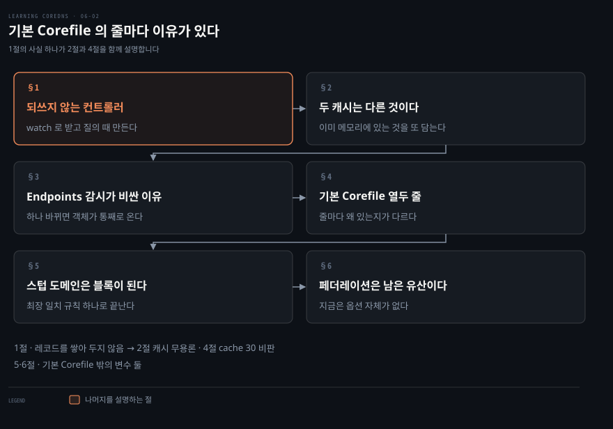
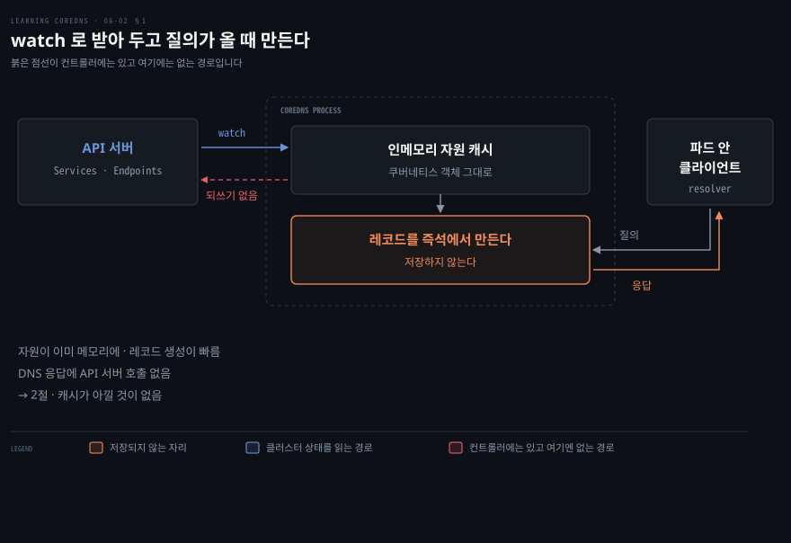
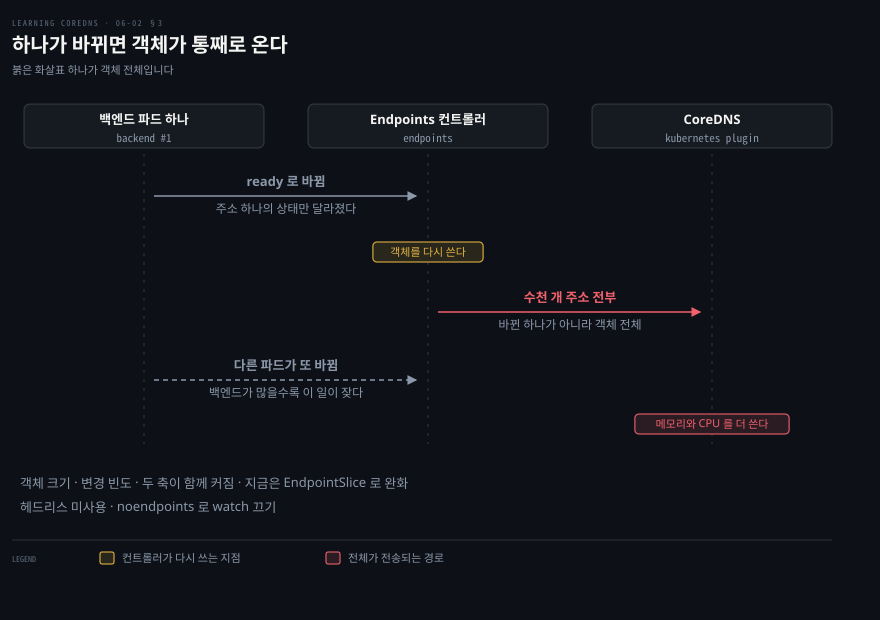
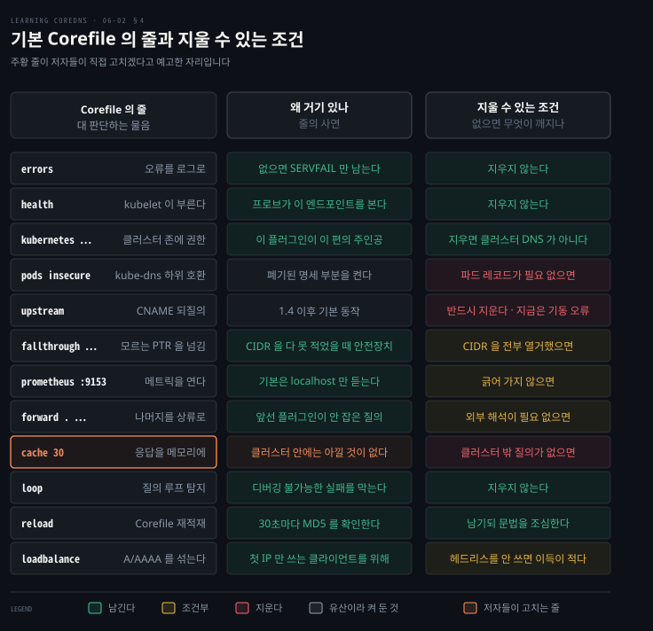

# 기본 Corefile의 줄마다 이유가 있다

---

> 클러스터에 배포되는 CoreDNS 설정은 열두 줄 남짓입니다. 그 줄들이 왜 거기 있는지 알면 어떤 줄을 지워도 되는지가 함께 드러납니다.

## 핵심 요약

> 이 편이 매달린 하나의 생각은 **CoreDNS 가 레코드를 쌓아 두지 않는다**는 것이고, 기본 설정의 어색한 줄들은 대부분 거기서 나옵니다.

`kubernetes` 플러그인은 컨트롤러처럼 동작하되 API 서버에 아무것도 되쓰지 않습니다. Services 와 Endpoints 에 watch 를 걸어 메모리에 들고 있다가, 질의가 오면 그 자리에서 레코드를 만들어 답합니다.

이 사실 하나가 기본 Corefile 을 읽는 열쇠가 됩니다. 저장된 레코드가 없으니 DNS 캐시가 아낄 것도 없고, 그래서 `cache 30` 줄은 클러스터 안 이름에는 거의 값을 못 합니다. 저자들도 그렇게 적고 뒤에서 고칩니다.

나머지 줄들도 저마다 사연이 있습니다.

- `pods insecure` 는 kube-dns 하위 호환입니다.
- `upstream` 은 1.4 이후 불필요해진 유산입니다.
- `fallthrough` 는 역방향 CIDR 을 다 못 적었을 때를 위한 안전장치입니다.

사연을 알면 지울 줄과 남길 줄이 갈립니다.


## 학습 목표

이 내용을 읽고 나면:

1. `kubernetes` 플러그인이 컨트롤러와 무엇이 같고 무엇이 다른지 말할 수 있습니다.
2. 쿠버네티스 인메모리 캐시와 `cache` 플러그인이 왜 별개인지 설명할 수 있습니다.
3. Endpoints 감시가 큰 서비스에서 비싼 이유를 watch 의 동작으로 유도할 수 있습니다.
4. 기본 Corefile 의 각 줄이 무엇을 켜고 왜 거기 있는지 짚을 수 있습니다.
5. 스텁 도메인이 왜 새 서버 블록으로 표현되는지 3장의 최장 일치와 이어 말할 수 있습니다.

아래는 이 문서 전체를 읽는 순서로 이은 지도입니다. 1절부터 3절까지가 플러그인의 동작이고, 4절부터 6절까지가 그 동작 위에 얹힌 설정입니다.




## 이 문서가 다루지 않는 것

> 이 편은 CoreDNS 가 클러스터에서 **어떻게 동작하고 어떻게 설정되는가**까지입니다. 그것을 실제로 띄우는 리소스는 다음 편입니다.

- RBAC·Service·Deployment 매니페스트와 오토스케일링 → 06-03 (작성 예정)
- `kubernetes` 플러그인 전체 문법과 확장 기능 → 06-04 (작성 예정)
- 쿠버네티스가 DNS 에 요구하는 명세 → [무엇을 선언했느냐가 레코드 모양을 정한다](./06-01.%EB%AC%B4%EC%97%87%EC%9D%84%20%EC%84%A0%EC%96%B8%ED%96%88%EB%8A%90%EB%83%90%EA%B0%80%20%EB%A0%88%EC%BD%94%EB%93%9C%20%EB%AA%A8%EC%96%91%EC%9D%84%20%EC%A0%95%ED%95%9C%EB%8B%A4.md)
- `errors`·`cache`·`forward`·`loadbalance` 플러그인 자체의 문법 → [플러그인 일곱이면 서버 하나가 선다](./03-02.%ED%94%8C%EB%9F%AC%EA%B7%B8%EC%9D%B8%20%EC%9D%BC%EA%B3%B1%EC%9D%B4%EB%A9%B4%20%EC%84%9C%EB%B2%84%20%ED%95%98%EB%82%98%EA%B0%80%20%EC%84%A0%EB%8B%A4.md)

남는 것은 **그 줄이 왜 거기 있는가**입니다.


## 1. 되쓰지 않는 컨트롤러

> 앞 편에서 컨트롤러가 읽고 쓰는 루프를 돈다고 했습니다. `kubernetes` 플러그인은 그 루프에서 쓰는 쪽을 통째로 뺀 모양입니다.



앞 편은 쿠버네티스가 어떤 DNS 이름을 요구하는지까지 왔습니다. 그런데 CoreDNS 가 그 답을 내려면 쿠버네티스에 무엇을 어떻게 물어야 하는지는 아직 나오지 않았습니다.

답은 이렇습니다. CoreDNS 의 `kubernetes` 플러그인은 컨트롤러와 아주 비슷하게 동작하되 **API 서버에 데이터를 절대 되쓰지 않습니다.** Services 와 Endpoints 자원에 watch 를 걸고 그 데이터를 캐시합니다. 플러그인이 처리할 요청이 들어오면 그 이름이 자원에 대응하는지 조회하고, 대응하면 알맞은 데이터를 돌려줍니다.

### 응답은 저장되지 않고 만들어집니다

여기서 중요한 사실이 하나 나옵니다. **응답 레코드는 생성되어 어딘가 저장되는 것이 아닙니다.** 들어오는 요청에 따라 그 자리에서 만들어집니다.

쿠버네티스 자원이 인메모리 캐시에 있기 때문에 레코드를 만드는 일은 아주 빠릅니다. API 서버의 watch 기능 덕분에 이 인메모리 레코드는 최신 상태를 유지합니다. 그래서 CoreDNS 는 DNS 질의에 답하려고 API 서버에 직접 질의할 일이 전혀 없고, DNS 응답이 빠르게 유지됩니다.

> **노트의 읽기**: 이 설계가 앞 편 2절의 watch 와 짝을 이룹니다. 조정 루프의 컨트롤러는 읽고 판단하고 되썼지만, `kubernetes` 플러그인은 읽고 들고 있다가 물어보면 답할 뿐입니다. 클러스터 상태를 바꾸지 않는 읽기 전용 소비자라, RBAC 에서도 쓰기 권한을 요구하지 않습니다. 그 권한 목록은 다음 편에서 봅니다.


## 2. 두 캐시는 서로 다른 것이다

> 쿠버네티스 객체의 인메모리 캐시와 `cache` 플러그인의 DNS 캐시는 이름만 같습니다. 이 구분을 놓치면 기본 설정의 `cache 30` 을 잘못 읽습니다.

쿠버네티스 객체의 인메모리 캐시는 DNS 캐시와 **완전히 무관합니다.** DNS 캐시는 CoreDNS 에서 `cache` 플러그인으로 켭니다.

CoreDNS 가 클러스터 안 요청에만 답하고 더 넓은 네트워크로 나가는 클러스터 밖 질의를 다루지 않는다면, `cache` 플러그인을 켜는 이득이 아주 적습니다.

이유를 저자들이 셈해 둡니다. `cache` 플러그인은 `kubernetes` 플러그인이 구성한 리소스 레코드를 DNS 질의에 대한 응답 형태로 메모리에 저장합니다. 그 레코드를 돌려주는 것이 재구성하는 것보다 조금 빠를 수는 있습니다. 그런데 해싱과 데이터 조회에 추가 오버헤드가 있어서 캐시 적중 시의 성능 이득이 줄고, 캐시가 빗나가는 경우에는 오히려 성능이 떨어집니다.

정리하면 **이미 메모리에 있는 것을 한 번 더 메모리에 두는 셈**입니다. 적중하면 여전히 조금 빠르기는 하되 그 이득이 오버헤드에 깎이고, 빗나가면 순손해입니다. 클러스터 밖으로 나가는 질의에는 사정이 다릅니다. 그쪽은 실제로 네트워크를 타야 하므로 캐시가 값을 합니다.


## 3. Endpoints 감시가 큰 서비스에서 비싼 이유

> `kubernetes` 플러그인은 Services 와 Endpoints 를 둘 다 감시합니다. 뒤엣것이 문제를 일으키는데, 이유가 자원의 이름에 이미 들어 있습니다.



플러그인이 Services 와 Endpoints 를 둘 다 감시하는 데는 이유가 있습니다. ClusterIP 서비스 질의에 답하려면 Services 가 필요하고, 헤드리스 서비스 질의에 답하려면 Endpoints 가 필요합니다. 헤드리스를 지원할 필요가 없다면, 플러그인 옵션 `noendpoints` 로 Endpoints watch 를 끌 수 있습니다. 헤드리스는 StatefulSet 과 함께 쓰이는 일이 많다는 점도 판단에 넣을 만합니다.

왜 그렇게 하고 싶어질까요. 저자들의 표현으로 쿠버네티스의 Endpoints 구조는 골칫거리입니다.

### 이름이 복수형인 것이 곧 문제입니다

자원 이름이 Endpoints 로 복수인 이유는, **Endpoints 자원 하나가 서비스 하나의 엔드포인트 주소를 전부 담기 때문**입니다. 준비된 것과 준비되지 않은 것을 가리지 않고 전부입니다. 백엔드가 많은 서비스라면 아주 큰 자료구조가 됩니다.

거기에 watch 의 동작이 겹칩니다. watch 는 자원이 바뀔 때마다 자원 데이터를 보냅니다. Endpoints 의 경우 그 서비스의 파드가 하나 생기거나 없어지거나 준비 상태를 오갈 때마다 **Endpoints 객체 전체가 전송된다**는 뜻입니다.

여기서 두 가지가 같은 방향으로 나빠집니다.

- 서비스의 백엔드가 많을수록 Endpoints 객체가 커집니다. 담긴 주소가 많으니 당연합니다.
- 백엔드가 많을수록 그중 하나가 바뀔 가능성도 높아집니다.

그래서 **큰 Endpoints 가 작은 Endpoints 보다 더 자주 전송됩니다.** 수천 개의 백엔드를 가진 아주 큰 서비스에서는 확장 문제가 됩니다. 큰 서비스는 작은 서비스보다 CoreDNS 의 메모리와 CPU 를 훨씬 많이 쓰게 만듭니다.[^etcdlimit] 헤드리스가 필요 없다면 Endpoints watch 를 끄는 것이 자원 사용을 낮추는 데 도움이 됩니다.

> **노트의 읽기**: 공식 문서는 `noendpoints` 를 켰을 때의 결과를 원서보다 분명하게 적습니다. `"All endpoint queries and headless service queries will result in an NXDOMAIN."` 입니다.[^k8splugin] 조용히 비는 것이 아니라 이름이 없다고 답한다는 뜻이라, 헤드리스를 쓰는 워크로드가 하나라도 남아 있으면 그 워크로드가 깨집니다. 끄기 전에 확인할 것은 "헤드리스를 안 쓴다" 가 아니라 "아무도 안 쓴다" 입니다.


## 4. 기본 Corefile 열두 줄

> 배포 도구가 만들어 넣는 Corefile 은 CoreDNS 팀의 권고를 거의 그대로 씁니다. 줄마다 켜는 것과 그 줄이 있는 이유가 다릅니다.



클러스터에서 도는 CoreDNS 의 Corefile 을 처음 열면 왜 이 줄들이 여기 있는지 알기 어렵습니다. 손으로 쓴 적이 없기 때문입니다.

쿠버네티스 클러스터를 만드는 방법은 여러 가지입니다. CoreDNS 를 포함한 각 구성요소의 정확한 설정은 클러스터를 만드는 사람의 몫입니다. 이것을 쉽게 하려고 `kubeadm`·`kube-spray`·`minikube` 같은 배포 도구가 여럿 있습니다. 각 도구가 클러스터에 필요한 쿠버네티스 자원을 전부 만드는 책임을 집니다. CoreDNS 의 Corefile 도 거기 들어갑니다.

이론상 각 도구가 Corefile 에 무엇을 담을지 스스로 정할 수 있습니다. 그런데 실제로는 대부분 CoreDNS 팀의 권고를 따릅니다. 그 권고는 CoreDNS GitHub 조직의 deployment 저장소 `kubernetes` 디렉터리에 있습니다.

```bash
.:53 {
    errors
    health
    kubernetes CLUSTER_DOMAIN REVERSE_CIDRS {
        pods insecure
        upstream
        fallthrough in-addr.arpa ip6.arpa
    }
    prometheus :9153
    forward . UPSTREAMNAMESERVER
    cache 30
    loop
    reload
    loadbalance
}
```

**대문자로 적힌 값은 변수입니다.** 이 파일을 처리하는 배포 도구가 치환합니다. 쿠버네티스 자체는 이 변수를 이해하지도 않고 아무 일도 하지 않으므로, 이 파일을 그대로 쓰면 클러스터의 CoreDNS 배포가 깨집니다.

### 서버 블록과 로깅

첫 줄 `.:53 {` 은 53번 포트에서 도는 서버의 새 서버 블록을 열고, 루트 도메인과 그 아래 전부의 질의를 풀라고 지시합니다. 즉 더 구체적으로 일치하는 다른 서버 블록이 없는 한 모든 질의가 이 블록의 플러그인 집합을 지납니다.

`errors` 는 질의 처리 중 반환된 오류를 로그로 남깁니다. 상류 네임서버로 가는 네트워크 타임아웃 같은 것이 여기 들어갑니다. 이 플러그인은 오류가 기록되는지에만 영향을 주고 실제 DNS 응답 코드는 바꾸지 않습니다. 없어도 CoreDNS 는 대개 `SERVFAIL` 로 응답하되 아무것도 남기지 않습니다. 오류가 기록되면 문제 추적이 훨씬 쉬워집니다.

`health` 는 kubelet 이 CoreDNS 가 살아서 제대로 도는지 감시할 헬스체크 엔드포인트를 엽니다. 8080 포트에 HTTP 서버를 열고 `/health` 요청에 응답합니다.

### kubernetes 블록 안의 세 줄

셋째 줄 `kubernetes CLUSTER_DOMAIN REVERSE_CIDRS {` 가 `kubernetes` 플러그인을 켜고 `CLUSTER_DOMAIN` 에 대한 권한을 줍니다.

클러스터에서 도는 서비스의 PTR 요청에도 답해야 하므로 `REVERSE_CIDRS` 에는 쿠버네티스 서비스 CIDR 을 채웁니다. 서비스 CIDR 이 `10.7.240.0/20` 이면 그 값을 씁니다. 서비스 엔드포인트의 PTR 질의까지 풀고 싶으면 파드 CIDR 도 전부 이 목록에 넣어야 합니다.

**서비스 CIDR 과 파드 CIDR 은 쿠버네티스 API 로 발견할 수 없어서 CoreDNS 가 스스로 알아낼 수 없습니다.** 대안으로 `in-addr.arpa` 와 `ip6.arpa` 를 적으면 모든 역방향 DNS 요청을 플러그인이 보게 됩니다.

> **원문 정오**: 위 대안을 설명하는 본문이 `ipv6.arpa` 로 적혀 있습니다. IPv6 의 역방향 존 이름은 `ip6.arpa` 이고, 같은 페이지의 Corefile 예제도 `ip6.arpa` 를 씁니다. 조금 뒤 `fallthrough` 를 설명하는 문장에서는 `ip6.arp` 로 마지막 `a` 가 빠집니다. 두 자리 모두 본문 산문 쪽이고 코드 블록 쪽은 맞습니다.

블록 안에서 켜지는 기능이 셋입니다.

`pods insecure` 는 파드 IP 주소를 묻는 특수한 형태의 질의에 답하는, **폐기된 명세 부분**을 지원합니다. 이전 기본 클러스터 DNS 해법이던 kube-dns 와의 하위 호환을 위해 제공됩니다. 필요 없다면 이 줄을 지워야 한다고 저자들이 못 박습니다.

`upstream` 은 CNAME 레코드를 CoreDNS 자신에게 질의를 되보내 풀라고 지시합니다. CNAME 은 서비스가 `type: ClusterIP` 대신 `type: ExternalName` 으로 정의될 때 쓰입니다. `upstream` 옵션은 스텁 도메인을 비롯한 다른 설정이 존중되게 하고, 클러스터 안 서비스로 풀리는 CNAME 도 되게 합니다. **CoreDNS 1.4 이후 버전에서는 이 줄이 불필요합니다.** 그 버전들에서는 기본 동작이기 때문입니다.

`fallthrough in-addr.arpa ip6.arpa` 는 PTR 조회에서 레코드를 못 찾으면 요청을 플러그인 체인 아래로 넘기라고 지시합니다. **서비스와 파드 CIDR 을 Corefile 에 전부 명시하지 않았을 때 특히 중요합니다.** 그 경우 설정상 모든 PTR 요청이 `kubernetes` 플러그인을 지나게 되는데, 이 줄이 없으면 플러그인이 아무 IP 의 PTR 요청이든 삼켜 버립니다. 이 줄이 있으면 모르는 IP 는 체인 아래로 내려가 `forward` 플러그인이 받습니다.

### 나머지 여섯 줄

`prometheus :9153` 은 Prometheus 가 긁어 갈 메트릭을 내보냅니다. 기본적으로 이 플러그인은 localhost 에서만 청취해서 민감할 수 있는 메트릭이 실수로 노출되는 것을 막습니다. `:9153` 을 지정하면 모든 주소의 9153 포트에서 청취하게 됩니다. Prometheus 가 네트워크 너머에서 긁어 가므로 이렇게 해야 접근할 수 있습니다.

`forward . UPSTREAMNAMESERVER` 는 루트 존에 대해 `forward` 플러그인을 켭니다. 이 서버가 받은 질의 중 **앞선 플러그인이 처리하지 않은** 것이 지정된 네임서버로 전달됩니다.

여기서 짚고 갈 것이 하나 있습니다. "앞선" 은 Corefile 에 먼저 적혔다는 뜻이 아닙니다. 3장에서 본 대로 질의는 **컴파일 시점에 정해진 고정된 순서**로 플러그인을 지납니다. Corefile 의 순서는 플러그인 사이에서는 의미가 없습니다. 다만 한 서버 블록 안에 여러 인스턴스를 허용하는 플러그인이라면 그 순서는 의미가 있습니다.

`cache 30` 은 `cache` 플러그인을 켜고 레코드의 TTL 을 30초로 제한합니다. 어떤 레코드에 실제로 쓰이는 TTL 은 레코드에 설정된 TTL 과 캐시에 설정된 TTL 중 **작은 쪽**입니다. 2절에서 본 이유로 여기서 캐시를 쓰는 것은 이상적이지 않습니다. 상류 요청에는 쓸모가 있지만 클러스터 도메인 안쪽 요청은 캐시에서 얻는 값이 크지 않습니다.

`loop` 는 DNS 질의 루프를 탐지하는 방어용 플러그인입니다. 루프가 탐지되면 CoreDNS 는 문제를 설명하는 오류 로그를 남기고 종료합니다. 종료가 가혹해 보일 수 있지만, 그래야 루프가 처리됩니다. 간헐적으로 터지고 원인을 짚기 어려운 DNS 실패를 막아 줍니다.

`reload` 는 프로세스를 재시작하지 않고 Corefile 을 다시 읽게 합니다. `kubectl -n kube-system edit configmap coredns` 로 고치면 변경이 자동으로 반영됩니다. ConfigMap 을 바꾸면 그 변경이 필요한 모든 노드에 전파되는 데 1~2분 걸릴 수 있습니다. CoreDNS 는 MD5 체크섬을 주기적으로 확인하고, 기본은 30초이며, 바뀌었으면 파일을 다시 읽습니다.

여기에 저자들이 경고를 답니다. **변경은 반드시 실험 환경이나 동일한 사본 배포에서 먼저 시험해야 합니다.** Corefile 에 문법 오류가 있으면 CoreDNS 는 오류를 로그에 남기고 원래 Corefile 로 계속 서빙합니다. 문제는 그다음입니다. CoreDNS 파드가 죽거나 나중에 다른 노드로 재스케줄되면, 새로 시작한 프로세스가 그 잘못된 Corefile 을 읽고 뜨지 못합니다.

마지막으로 `loadbalance` 는 응답의 A/AAAA 레코드를 무작위로 섞습니다. 헤드리스 서비스를 쓸 때 클라이언트마다 다른 순서로 레코드를 받는다는 뜻입니다. 많은 클라이언트가 그냥 첫 번째 IP 를 쓰기 때문에, 이것만으로도 부하가 모든 인스턴스에 퍼집니다.

> **원문 정오**: 이 편이 다루는 범위 안에 철자 오류가 둘 더 있습니다. 3절이 옮긴 Endpoints watch 설명의 `"every time a pod for the specific service is create, destroyed"` 에서 `is create` 는 `is created` 입니다. 그리고 위 `kubernetes` 블록을 설명하는 문장이 변수를 `REVERSE_CIDR` 로 적는데 Corefile 의 변수 이름은 `REVERSE_CIDRS` 입니다.


## 5. 스텁 도메인은 서버 블록을 하나 더 만든다

> 특정 도메인만 다른 네임서버로 보내고 싶을 때가 있습니다. CoreDNS 는 그것을 옵션이 아니라 서버 블록으로 표현합니다.

사내 도메인 하나만 다른 네임서버로 보내고 싶습니다. `forward` 는 첫 인자로 매칭할 도메인을 받으니 같은 블록에 한 줄 더 적어도 될 텐데, 배포 도구가 만드는 Corefile 은 왜 그 길을 쓰지 않을까요.

답은 서버 블록마다 플러그인 체인이 독립이라는 데 있습니다. 블록을 나누면 그 도메인의 질의만 다른 캐시 설정과 다른 `loop` 감시를 받게 할 수 있습니다. 한 블록 안에 `forward` 를 한 줄 더 얹으면 그 질의도 클러스터 질의와 같은 체인을 지납니다.

deployment 저장소의 Corefile 을 열어 보면 최종 Corefile 을 만들 때 치환되는 변수가 둘 더 있습니다. `STUBDOMAINS` 와 `FEDERATIONS` 입니다. 더 흔히 쓰이는 변수에 집중하려고 앞 절의 목록에서는 빠져 있었습니다.

원서의 전체 변수 판에서 이 둘이 붙는 자리가 조금 특이합니다. `FEDERATIONS` 는 `kubernetes` 블록을 닫는 중괄호 바로 뒤, `STUBDOMAINS` 는 서버 블록을 닫는 중괄호 바로 뒤입니다.

> **노트의 읽기**: 원서는 이 위치가 무엇을 뜻하는지 설명하지 않습니다. 중괄호 바깥이라는 것만 놓고 읽으면 `FEDERATIONS` 는 서버 블록의 지시어 자리로, `STUBDOMAINS` 는 서버 블록 바깥이므로 **새 서버 블록으로** 치환된다고 읽힙니다. 아래 Example 6-13 이 뒤엣것을 실제로 그렇게 보입니다.

`STUBDOMAINS` 는 `UPSTREAMNAMESERVER` 가 아닌 다른 네임서버로 특정 도메인을 풀고 싶을 때 서버 스탠자를 추가하는 데 쓰입니다. 전형적인 용도는 내부 DNS 서버로 사내 도메인을 푸는 것입니다.

```bash
.:53 {
    errors
    health
    kubernetes cluster.local in-addr.arpa ip6.arpa {
        pods insecure
        upstream
        fallthrough in-addr.arpa ip6.arpa
    }
    prometheus :9153
    forward . /etc/resolv.conf
    cache 30
    loop
    reload
    loadbalance
}

corp.example.com:53 {
    errors
    cache 30
    loop
    forward . 10.0.0.10:53
}
```

`corp.example.com` 아래 무엇이든 질의하면 두 번째 서버 블록을 지납니다. 질의가 **가장 길게 일치하는 서버 블록**으로 향하기 때문입니다. 그리고 그 질의들은 `/etc/resolv.conf` 에 정의된 네임서버가 아니라 `10.0.0.10` 의 사내 네임서버로 전달됩니다.

> **노트의 읽기**: 최장 일치는 [3장에서 본 규칙](./03-01.Corefile%EC%9D%80%20%EB%9D%BC%EB%B2%A8%EB%A1%9C%20%EC%84%9C%EB%B2%84%EB%A5%BC%20%EA%B0%80%EB%A5%B8%EB%8B%A4.md) 그대로입니다. 스텁 도메인이 별도 문법 없이 그냥 서버 블록으로 표현되는 이유가 여기 있습니다. CoreDNS 에는 "스텁 도메인" 이라는 개념이 따로 없고, 라벨이 더 긴 블록이 이기는 규칙 하나로 같은 일이 됩니다. 두 번째 블록이 `cache` 와 `loop` 를 따로 적는 것도 서버 블록마다 플러그인 체인이 독립이기 때문입니다.


## 6. 페더레이션은 남아 있는 유산이다

> `FEDERATIONS` 변수는 이미 개발이 멈춘 기능을 위한 것입니다. 원서도 그렇게 적고, 지금은 그 기능 자체가 사라졌습니다.

`FEDERATIONS` 변수는 쿠버네티스 federation v1 이름을 지원하는 데 쓰입니다. `federation` 플러그인을 켜고 페더레이션 존을 지정하게 합니다.

federation v1 은 여러 클러스터에 걸친 워크로드를 관리하는 제어 평면이었지만 **더 이상 활발히 개발되지 않는다**고 저자들이 적습니다. `federation` 플러그인은 하위 호환을 위해 제공되며 향후 버전에서 제거될 것이라고도 덧붙입니다. 쿠버네티스 커뮤니티가 탐색 중인 다중 클러스터 관리 프로젝트가 federation v2 를 비롯해 여럿 있고, 그에 대한 지원은 외부 플러그인으로 시작할 것이라고 내다봅니다.

> **노트의 읽기**: 저자들의 예고가 그대로 실현됐습니다. 현재 `kubernetes` 플러그인 공식 문서의 문법 블록과 옵션 설명 어디에도 `federation` 이라는 낱말이 없습니다.[^k8splugin] 원서를 읽다 `FEDERATIONS` 를 만나면 지금은 없는 것으로 읽고 넘어가면 됩니다. 다중 클러스터 쪽 자리는 지금 `multicluster` 옵션이 차지하고 있는데, 이것은 federation 의 후계가 아니라 Multi-Cluster Services API 라는 별개 규격에 맞춘 것입니다.[^k8splugin]


## 심화 학습

> 원서가 적은 기본 Corefile 과 지금 공식 문서의 차이를 짚습니다. 이 편에서 가장 많이 갈린 자리가 `kubernetes` 플러그인 문법입니다.

- **`upstream` 은 옵션에서 사라졌습니다.** 현재 `kubernetes` 플러그인의 문법 블록에 `upstream` 이 없습니다.[^k8splugin] 원서가 "1.4 이후에는 불필요하다" 고 적은 그 줄이 그 뒤 아예 걷혔습니다. 원서의 Corefile 을 그대로 옮겨 쓰면 지금은 오류가 납니다.
- **`pods` 의 기본값은 `disabled` 입니다.** 기본 Corefile 이 `insecure` 를 명시하는 것은 그 기능을 켜기 위한 것이지 유지하기 위한 것이 아닙니다. 세 모드의 차이는 아래 표에 있습니다.
- **API 서버 부하를 조절하는 옵션이 새로 생겼습니다.** `apiserver_qps`·`apiserver_burst`·`apiserver_max_inflight` 셋이 플러그인이 API 서버로 보내는 요청의 초당 한도, 순간 폭주 한도, 동시 진행 요청 상한을 각각 정합니다.[^k8splugin] 3절이 말한 Endpoints watch 의 부담을 다루는 손잡이가 원서 시절보다 늘어난 셈입니다.
- **`ignore empty_service` 가 검색 경로와 맞물립니다.** 준비된 엔드포인트 주소가 없는 서비스에 `NXDOMAIN` 을 돌려주어, 질의한 파드가 검색 경로에서 그 서비스를 계속 찾아 나가게 합니다.[^k8splugin] 공식 문서는 그 검색 경로가 다른 쿠버네티스 클러스터를 포함할 수도 있다는 예를 답니다.

`pods` 의 세 모드를 공식 문서 기준으로 정리하면 이렇습니다.[^k8splugin]

| 모드 | 동작 |
|------|------|
| `disabled` | 기본값. 파드 요청을 처리하지 않고 항상 `NXDOMAIN` 을 돌려줍니다 |
| `insecure` | 쿠버네티스에 확인하지 않고 요청의 IP 로 A 를 돌려줍니다. 와일드카드 SSL 인증서와 함께 악용될 수 있습니다 |
| `verified` | 같은 네임스페이스에 그 IP 의 파드가 있을 때만 A 를 돌려줍니다 |

원서 4절의 Corefile 은 **2019년 권고**로 읽고, 실제 클러스터에 넣을 설정은 deployment 저장소와 플러그인 README 를 다시 여는 편이 안전합니다.


## 결정 치트시트

> 기본 Corefile 의 각 줄을 지울 수 있는 조건으로 정리했습니다. 괄호 안의 현재 상태와 마지막 줄만 심화 학습이고 나머지는 본문입니다.

| 줄 | 왜 있나 | 지울 수 있는 조건 |
|----|---------|------------------|
| `errors` | 오류를 로그에 남긴다 | 지우지 않는다 · 문제 추적이 어려워진다 |
| `health` | kubelet 이 감시할 엔드포인트 | 지우지 않는다 · 프로브가 이것을 부른다 |
| `pods insecure` | kube-dns 하위 호환 | 폐기된 파드 레코드가 필요 없으면 지운다 |
| `upstream` | CNAME 을 되질의해 푼다 | CoreDNS 1.4 이상이면 지운다 (지금은 옵션 자체가 없다) |
| `fallthrough in-addr.arpa ip6.arpa` | 모르는 IP 의 PTR 을 체인 아래로 | 서비스·파드 CIDR 을 전부 열거했으면 지울 수 있다 |
| `prometheus :9153` | 메트릭을 네트워크에 연다 | Prometheus 로 긁지 않으면 지운다 |
| `forward . …` | 나머지 질의를 상류로 | 역방향 존을 좁게 잡았고 외부 해석이 필요 없으면 |
| `cache 30` | 응답을 메모리에 둔다 | 클러스터 안 질의만 다루면 값이 거의 없다 |
| `loop` | 질의 루프를 탐지하고 종료 | 지우지 않는다 · 디버깅 불가능한 실패를 막는다 |
| `reload` | Corefile 을 다시 읽는다 | 남기되 문법 오류를 조심한다 |
| `loadbalance` | A/AAAA 를 섞는다 | 헤드리스를 안 쓰면 이득이 적다 |
| 헤드리스를 아무도 안 쓴다 | — | `noendpoints` 로 Endpoints watch 를 끈다 |
| 큰 서비스에서 API 서버가 힘들어한다 | — | `apiserver_qps` 계열로 요청 속도를 조인다 |


## 적용 관점

> 이 편은 도는 클러스터가 있으면 ConfigMap 하나를 열어 대조하는 것으로 끝납니다.

**한 가지 실행**: `kubectl -n kube-system get configmap coredns -o yaml` 로 지금 도는 Corefile 을 꺼내 4절의 열두 줄과 대조합니다. `upstream` 이 남아 있는지, `pods insecure` 가 필요한지, 역방향 CIDR 이 실제 값으로 채워졌는지 셋만 봐도 그 클러스터가 어느 시절의 권고를 쓰는지 드러납니다.

**한 가지 확인**: 그 Corefile 을 고치기 전에 같은 내용의 ConfigMap 을 다른 이름으로 복제해 두고 문법을 시험합니다. 4절 끝의 경고대로, 잘못된 Corefile 은 지금 도는 파드는 살려 두고 다음에 뜨는 파드부터 죽이기 때문에 증상이 늦게 옵니다.

Spring 애플리케이션 관점에서는 `cache 30` 이 판단 지점이 됩니다. 클러스터 안 서비스 이름만 부르는 애플리케이션이라면 이 캐시가 응답 시간에 기여하는 바가 거의 없고, JVM 쪽 DNS 캐시 설정이 훨씬 큰 변수입니다. 외부 API 를 자주 부른다면 반대로 이 캐시가 실제로 일합니다.


## 면접에서 받을 만한 질문

1. `kubernetes` 플러그인이 컨트롤러와 같은 점과 다른 점은 무엇입니까.
2. CoreDNS 가 DNS 질의에 답할 때 API 서버를 부르지 않아도 되는 이유는 무엇입니까.
3. 클러스터 안 질의만 다루는 CoreDNS 에 `cache` 플러그인이 이득이 적은 이유를 설명해 보십시오.
4. Endpoints 감시가 큰 서비스에서 비싸지는 이유를 두 요인으로 나눠 말해 보십시오.
5. `fallthrough in-addr.arpa ip6.arpa` 를 지우면 어떤 일이 생깁니까.
6. Corefile 의 플러그인 순서를 바꾸면 처리 순서가 바뀝니까.
7. 스텁 도메인이 별도 문법 없이 서버 블록으로 표현되는 이유는 무엇입니까.


## 정답 (자답 후 펼치기)

### 정답 1 — 컨트롤러와의 차이

같은 점은 API 서버에 watch 를 걸고 자원 변화를 좇는다는 것입니다. 다른 점은 **API 서버에 아무것도 되쓰지 않는다**는 것입니다. 조정 루프의 3단계 중 `Status` 를 기록하는 부분이 없는 읽기 전용 소비자입니다.

### 정답 2 — API 서버를 안 불러도 되는 이유

Services 와 Endpoints 를 watch 로 받아 인메모리 캐시에 들고 있기 때문입니다. 질의가 오면 그 캐시에서 즉석으로 레코드를 만들어 답합니다. watch 가 그 캐시를 최신으로 유지하므로 API 서버를 부를 일이 없습니다.

### 정답 3 — 캐시 이득이 적은 이유

레코드가 어딘가 저장돼 있는 것이 아니라 인메모리 자원에서 매번 만들어지고, 그 만드는 일이 이미 아주 빠르기 때문입니다. `cache` 를 쓰면 그 위에 해싱과 조회 비용이 얹힙니다. 적중해도 이득이 작고 빗나가면 오히려 느려집니다.

### 정답 4 — Endpoints 가 비싼 두 요인

첫째, Endpoints 자원 하나가 서비스 하나의 모든 엔드포인트 주소를 준비 여부와 무관하게 담아서 백엔드가 많을수록 객체가 커집니다. 둘째, watch 는 자원이 바뀔 때마다 객체를 통째로 보내는데 백엔드가 많을수록 그중 하나가 바뀔 확률이 높습니다. 둘이 같은 방향으로 나빠져서 큰 객체가 더 자주 전송됩니다.

### 정답 5 — `fallthrough` 를 지우면

역방향 존을 넓게(`in-addr.arpa`·`ip6.arpa`) 잡아 둔 경우, `kubernetes` 플러그인이 클러스터와 무관한 IP 의 PTR 요청까지 전부 삼킵니다. 체인 아래의 `forward` 로 내려가지 못하므로 외부 IP 의 역방향 조회가 답을 못 받습니다.

### 정답 6 — Corefile 순서와 처리 순서

바뀌지 않습니다. 플러그인 사이의 처리 순서는 **컴파일 시점에 고정**됩니다. 다만 한 서버 블록 안에 여러 인스턴스를 허용하는 플러그인이라면 그 인스턴스들 사이의 순서는 의미가 있습니다.

### 정답 7 — 스텁 도메인이 서버 블록인 이유

CoreDNS 가 질의를 **가장 길게 일치하는 서버 블록**으로 보내기 때문입니다. `corp.example.com:53` 블록은 `.:53` 블록보다 라벨이 길어서 그 도메인의 질의를 가져갑니다. 스텁 도메인이라는 별도 개념 없이 기존 규칙 하나로 같은 일이 됩니다.


## 핵심 개념 체크리스트

- [ ] `kubernetes` 플러그인이 되쓰지 않는 컨트롤러라는 말의 뜻을 안다
- [ ] 응답 레코드가 저장되지 않고 즉석에서 만들어진다는 것을 안다
- [ ] 쿠버네티스 인메모리 캐시와 `cache` 플러그인을 구분할 수 있다
- [ ] Endpoints 가 복수형인 이유와 그것이 만드는 비용을 안다
- [ ] `noendpoints` 를 켜면 헤드리스 질의가 `NXDOMAIN` 이 된다는 것을 안다
- [ ] 대문자 변수를 그대로 두면 배포가 깨진다는 것을 안다
- [ ] `pods insecure` 가 왜 거기 있는지 kube-dns 와 이어 말할 수 있다
- [ ] `fallthrough` 가 없을 때 무엇이 삼켜지는지 안다
- [ ] Corefile 순서와 실제 처리 순서가 다르다는 것을 안다
- [ ] `reload` 의 문법 오류가 왜 늦게 터지는지 안다
- [ ] 스텁 도메인이 최장 일치 규칙 하나로 되는 이유를 안다


## 관련 문서

- [무엇을 선언했느냐가 레코드 모양을 정한다](./06-01.%EB%AC%B4%EC%97%87%EC%9D%84%20%EC%84%A0%EC%96%B8%ED%96%88%EB%8A%90%EB%83%90%EA%B0%80%20%EB%A0%88%EC%BD%94%EB%93%9C%20%EB%AA%A8%EC%96%91%EC%9D%84%20%EC%A0%95%ED%95%9C%EB%8B%A4.md) — 이 편이 답하는 명세를 앞 편이 세웁니다
- [Corefile은 라벨로 서버를 가른다](./03-01.Corefile%EC%9D%80%20%EB%9D%BC%EB%B2%A8%EB%A1%9C%20%EC%84%9C%EB%B2%84%EB%A5%BC%20%EA%B0%80%EB%A5%B8%EB%8B%A4.md) — 최장 일치와 서버 블록 라벨
- [플러그인 일곱이면 서버 하나가 선다](./03-02.%ED%94%8C%EB%9F%AC%EA%B7%B8%EC%9D%B8%20%EC%9D%BC%EA%B3%B1%EC%9D%B4%EB%A9%B4%20%EC%84%9C%EB%B2%84%20%ED%95%98%EB%82%98%EA%B0%80%20%EC%84%A0%EB%8B%A4.md) — 고정된 플러그인 순서와 `fallthrough`
- [책 노트 인덱스](./README.md)


## 참고 자료

- 원서: 《Learning CoreDNS: Configuring DNS for Cloud Native Environments》 6장 Kubernetes 중반부
- 서지: John Belamaric·Cricket Liu, O'Reilly, 2019년, ISBN 978-1492047964
- [CoreDNS kubernetes 플러그인 README](https://github.com/coredns/coredns/blob/master/plugin/kubernetes/README.md)
- [CoreDNS deployment 저장소 — kubernetes 디렉터리](https://github.com/coredns/deployment/tree/master/kubernetes)

[^etcdlimit]: 원서 6장 각주 5. `"Worse, etcd has a limit to the size of objects that can be stored. If the number of backends grows too high, the list of addresses will be truncated. Because the ordering of the addresses is not deterministic, the truncation might leave out different addresses each time through the reconciliation loop of the Endpoints controller, causing even more churn."`

[^k8splugin]: CoreDNS — kubernetes 플러그인 README 의 Syntax 절. 문법 블록에 `noendpoints`·`pods POD-MODE`·`apiserver_qps`·`ignore empty_service`·`multicluster` 가 있고 `upstream` 과 `federation` 은 없습니다. <https://github.com/coredns/coredns/blob/master/plugin/kubernetes/README.md>
