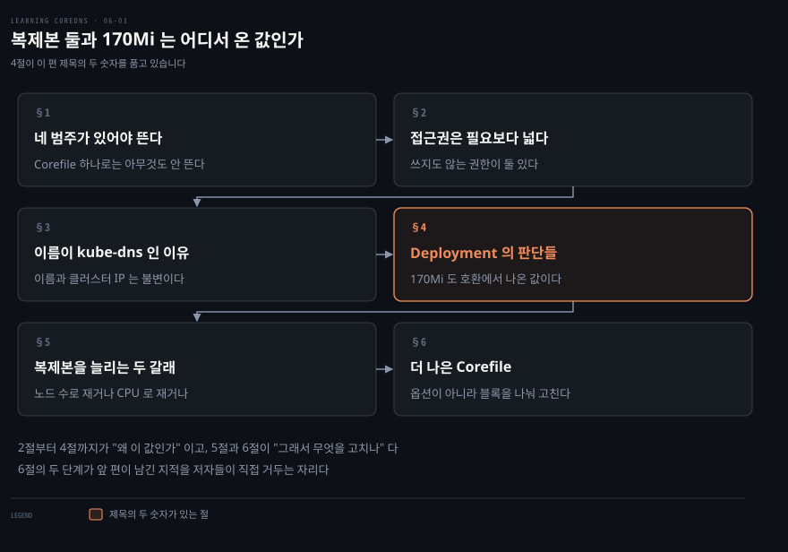
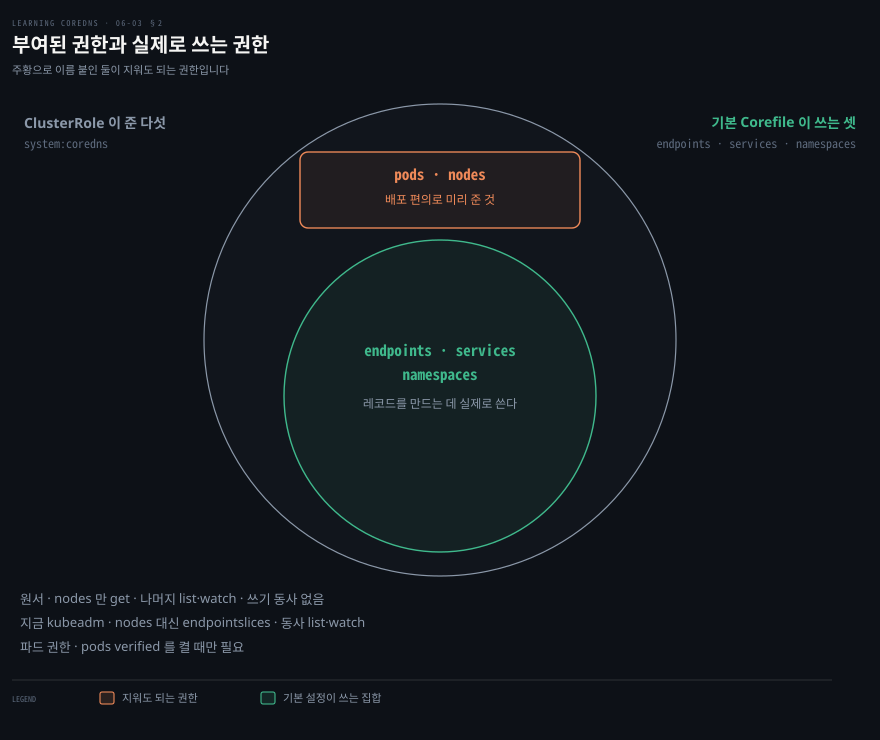
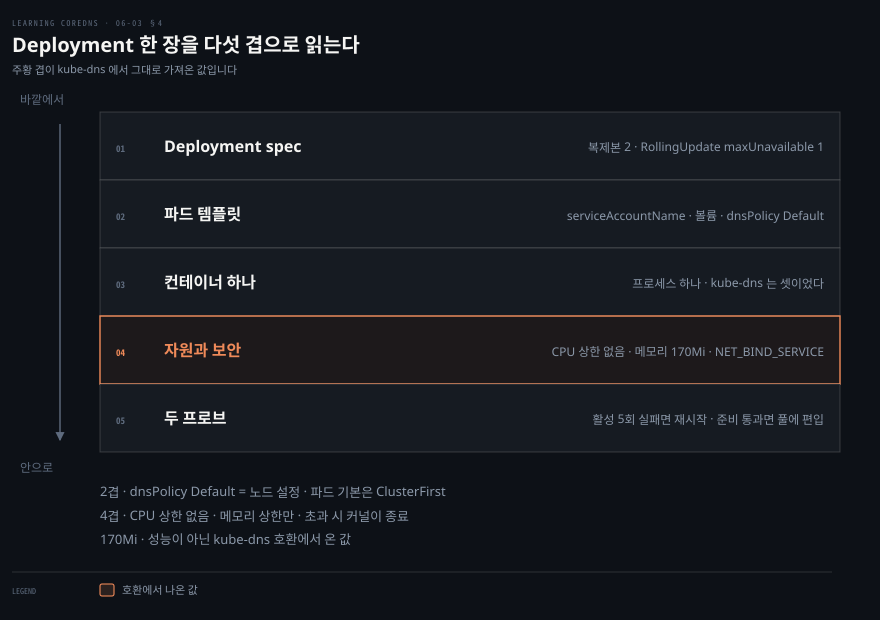
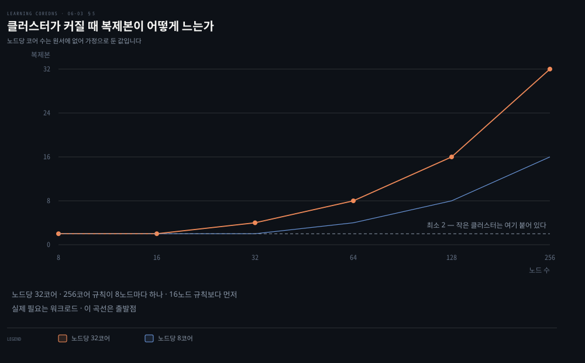
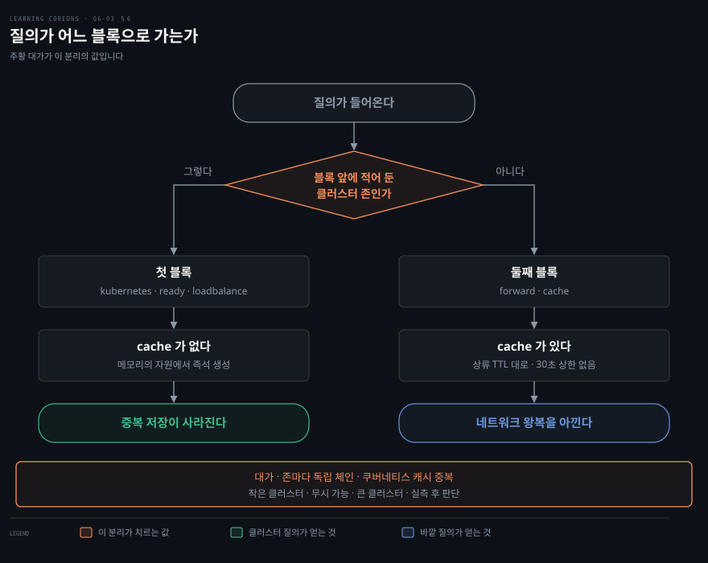

# 복제본 둘과 170Mi는 어디서 온 값인가

---

> CoreDNS 를 클러스터에 띄우는 매니페스트에는 설명 없이 박힌 숫자와 이름이 여럿 있습니다. 대부분은 이전 DNS 서버에서 무중단으로 넘어오려고 정해진 값입니다.

## 핵심 요약

> 이 편이 매달린 하나의 생각은 **기본 매니페스트가 내 클러스터가 아니라 kube-dns 에서 넘어오는 경로에 맞춰져 있다**는 것입니다.

Service 의 이름이 `kube-dns` 인 것도 메모리 상한이 170Mi 인 것도 같은 이유에서 나옵니다. 서비스가 끊기지 않게 이전 서버를 갈아 끼우려면 그 둘이 그대로여야 했습니다. 클러스터 IP 가 자동 할당이 아니라 고정값인 것은 이유가 다릅니다. 그 값을 kubelet 이 파드의 `resolv.conf` 에 써야 해서 미리 알고 있어야 합니다.

넉넉함의 다른 갈래는 배포 편의입니다. ClusterRole 은 기본 설정이라면 아마 쓰지 않을 파드와 노드 읽기 권한을 줍니다. 저자들은 그 이유를 숨기지 않습니다. 기능을 켤 때 역할을 안 고쳐도 되게 하려고 미리 넣었다는 것입니다.

그래서 이 편의 마지막 절이 값어치를 합니다. 각 값이 어디서 왔는지 알고 나면 내 클러스터 사정으로 다시 재서 줄일 수 있고, 저자들이 직접 그 작업을 두 단계로 보여 줍니다.


## 학습 목표

이 내용을 읽고 나면:

1. CoreDNS 가 뜨는 데 필요한 자원 네 범주를 대고 각각이 무엇을 맡는지 말할 수 있습니다.
2. ClusterRole 이 주는 권한 중 무엇이 실제로 필요하고 무엇이 편의인지 가를 수 있습니다.
3. Service 이름과 클러스터 IP 가 왜 고정돼야 했는지 불변 필드로 설명할 수 있습니다.
4. `dnsPolicy: Default` 가 파드의 기본값이 아니라는 것과 CoreDNS 가 그것을 쓰는 이유를 말할 수 있습니다.
5. 복제본을 늘리는 두 방식의 신호가 각각 무엇인지 구분할 수 있습니다.

아래는 이 문서 전체를 읽는 순서로 이은 지도입니다. 1절부터 4절까지가 배포 자원이고, 5절과 6절이 그 위에서 조정하는 일입니다.




## 이 문서가 다루지 않는 것

> 이 편은 CoreDNS 를 **클러스터에 어떻게 세우고 조정하는가**입니다. 플러그인 자체의 문법은 다음 편입니다.

- `kubernetes` 플러그인 전체 문법과 확장 기능 → 06-04 (작성 예정)
- 기본 Corefile 의 각 줄이 무엇을 켜는지 → [기본 Corefile의 줄마다 이유가 있다](./06-02.%EA%B8%B0%EB%B3%B8%20Corefile%EC%9D%98%20%EC%A4%84%EB%A7%88%EB%8B%A4%20%EC%9D%B4%EC%9C%A0%EA%B0%80%20%EC%9E%88%EB%8B%A4.md)
- ClusterIP Service 와 헤드리스의 차이 → [무엇을 선언했느냐가 레코드 모양을 정한다](./06-01.%EB%AC%B4%EC%97%87%EC%9D%84%20%EC%84%A0%EC%96%B8%ED%96%88%EB%8A%90%EB%83%90%EA%B0%80%20%EB%A0%88%EC%BD%94%EB%93%9C%20%EB%AA%A8%EC%96%91%EC%9D%84%20%EC%A0%95%ED%95%9C%EB%8B%A4.md)
- 쿠버네티스 RBAC 자체의 개념과 문법 → 원서 범위 밖

남는 것은 **그 값이 왜 그 값인가**입니다.


## 1. 네 범주가 있어야 CoreDNS 가 뜬다

> Corefile 하나만으로는 아무것도 뜨지 않습니다. deployment 저장소에는 그것 말고 세 범주가 더 있습니다.

앞 편이 다룬 Corefile 은 CoreDNS 가 클러스터 DNS 로 돌 때 **어떻게 행동하는지**를 적은 것입니다. 그런데 그 CoreDNS 를 클러스터에서 관리하고 배포하려면 다른 자원이 여럿 더 필요합니다.

deployment GitHub 저장소에는 CoreDNS 를 띄우고 돌리는 데 필요한 쿠버네티스 자원 정의도 함께 들어 있습니다. API 서버에 어떻게 접근하는지, 어떤 컨테이너 이미지를 쓰는지, 파드를 몇 개 돌리는지 같은 배포 세부가 거기 있습니다.

필요한 자원은 네 범주입니다.

- API 서버 접근 권한을 주는 자원들
- Corefile 을 담을 ConfigMap
- DNS 를 클러스터에 제공할 Service
- 실제로 파드를 띄우고 관리할 Deployment

ConfigMap 은 앞 편에서 다뤘으므로 나머지 셋을 봅니다. API 서버 접근부터 시작합니다.


## 2. 접근권은 필요보다 넓게 잡혀 있다

> ClusterRole 이 여는 자원 다섯 중 CoreDNS 가 기본 설정에서 실제로 쓰는 것은 셋입니다. 나머지 둘이 왜 거기 있는지를 저자들이 밝힙니다.



CoreDNS 는 서비스와 엔드포인트 데이터를 읽으려고 API 서버에 접근해야 합니다. 기본적으로 쿠버네티스의 파드는 API 서버에 질의할 수 있는 서비스 계정 토큰을 받습니다. 그런데 이 기본 토큰은 대개 그 파드가 도는 네임스페이스에만 접근할 수 있습니다.

CoreDNS 가 클러스터 전역의 모든 서비스 데이터를 API 서버에서 읽으려면 더 넓은 접근 권한을 가진 서비스 계정이 필요합니다. 그래서 클러스터 안 DNS 를 배포하는 기본 매니페스트가 RBAC 자원을 만듭니다.

가장 단순한 것이 `coredns` 서비스 계정입니다. 나중에 Deployment 를 만들 때 참조할 이름 붙은 계정을 만드는 일이 전부입니다. PodSpec 이 그 이름 붙은 서비스 계정을 쓰도록 설정됩니다.

권한을 주려면 역할이 필요한데, 여기서는 ClusterRole 을 씁니다. `Role` 과 달리 `ClusterRole` 은 특정 네임스페이스에 묶이지 않습니다. CoreDNS 는 모든 네임스페이스에 걸쳐 데이터를 읽어야 하므로 `ClusterRole` 을 써야 합니다.

```yaml
rules:
- apiGroups:
  - ""
  resources:
  - endpoints
  - services
  - pods
  - namespaces
  verbs:
  - list
  - watch
- apiGroups:
  - ""
  resources:
  - nodes
  verbs:
  - get
```

ClusterRole 만으로는 아무 소용이 없습니다. 서비스 계정과 연결해야 합니다. 그 일을 하는 것이 ClusterRoleBinding 입니다. 역할을 특정 서비스 계정에 할당해서, 그 서비스 계정으로 접속하는 클라이언트에게 쿠버네티스가 역할의 권한을 주게 합니다.

### 왜 네임스페이스를 읽어야 하는가

명세를 놓고 보면 Endpoints 와 Services 를 감시하고 나열하는 권한은 말이 됩니다. ClusterIP 와 헤드리스 서비스의 레코드를 만들려면 그 자원들이 필요합니다. 그런데 파드와 네임스페이스와 노드는 왜 필요할까요.

네임스페이스에는 이유가 둘 있습니다.

첫째는 `namespace.svc.cluster.local` 질의가 들어왔을 때 `NXDOMAIN` 을 돌려줄지, 데이터 없는 SUCCESS 를 돌려줄지 정하기 위해서입니다. DNS 를 제대로 구현하려면 그 서브도메인 안에 이름이 존재할 때, 즉 그 네임스페이스에 서비스가 하나라도 있을 때 이 이름에 `NXDOMAIN` 을 돌려주면 안 됩니다.

둘째는 와일드카드 질의를 쓸 때 네임스페이스 레코드가 필요하기 때문입니다. 와일드카드 질의는 CoreDNS 의 확장 기능이라 다음 편에서 다룹니다.

### 파드와 노드는 "아마 아니다"

파드와 노드가 필요하냐는 물음에 저자들의 답은 **"아마 아니다"** 입니다. 그 접근을 요구하는 선택 기능이 Corefile 에 여럿 있지만, 기본 Corefile 은 그 기능들을 켜지 않습니다.

CoreDNS 저자들이 그 권한을 권고에 넣은 이유는 배포 지침을 복잡하게 만들지 않기 위해서입니다. 이렇게 해 두면 Corefile 에서 기능을 켤 때 클러스터 역할을 고칠 필요가 없습니다. 그 기능을 쓰지 않는다면 여분의 권한을 지워도 됩니다.

파드를 감시할 필요가 생기는 것은 `pods verified` 옵션을 켤 때뿐입니다. 켜지 않는다면 파드 읽기 권한을 남겨 둘 이유가 없습니다.

> **노트의 읽기**: 이 절과 앞 편 1절이 맞물립니다. `kubernetes` 플러그인은 API 서버에 되쓰지 않는 읽기 전용 소비자라, 다섯 자원 어디에도 `create`·`update`·`delete` 가 없습니다. 동사가 `list`·`watch`·`get` 셋뿐인 것이 그 설계의 흔적입니다.


## 3. 서비스 이름이 kube-dns 로 남은 이유

> 이름을 바꾸면 될 것 같은데 못 바꿉니다. 쿠버네티스의 Service 에서 이름과 클러스터 IP 는 불변이기 때문입니다.

CoreDNS 는 표준 ClusterIP 서비스를 씁니다. 그런데 매니페스트를 열면 눈에 걸리는 것이 하나 있습니다. 서비스 이름이 "coredns" 가 아니라 **"kube-dns"** 라는 점입니다.

서비스 이름은 DNS 제공자가 무엇이든 같습니다. 예전 쿠버네티스 버전에서는 kube-dns 가 DNS 서버의 이름이기도 했습니다. 그 서버에서 CoreDNS 로 **서비스 중단 없이 매끄럽게 업그레이드**하려면 서비스 이름을 그대로 두어야 했습니다.

이유는 쿠버네티스의 제약에 있습니다. **Service 의 이름과 `clusterIP` 는 불변입니다.** 따라서 서비스 이름을 바꾸려면 서비스를 지우고 다른 이름으로 다시 만들거나 `clusterIP` 를 바꿔야 했을 것이고, 어느 쪽이든 서비스 중단을 일으켰을 것입니다.

> **원문 정오**: 이 설명이 붙은 Example 6-17 은 캡션이 "The kube-dns service" 이고 산문도 `"the service is named 'kube-dns' instead of 'coredns'"` 라고 적는데, 정작 그 YAML 의 `metadata.name` 은 `coredns` 입니다. 이름이 그대로여야 한다는 이 절의 논지를 예제 자신이 어기고 있습니다.

클러스터 IP 도 마찬가지로 특별합니다. 원서 예제의 값은 `10.7.240.10` 이지만 클러스터마다 다릅니다. 중요한 것은 그 값이 **클러스터 생성 시점에 정해지는 고정값**이고 쿠버네티스가 자동 할당하지 않는다는 점입니다. 같은 IP 주소가 각 kubelet 인스턴스에 전달되고, kubelet 이 자기가 띄우는 파드의 `resolv.conf` 를 만들 때 그 값을 씁니다.

### 메트릭 포트가 서비스에 있는 이유

서비스는 이름 붙은 포트를 셋 정의합니다. 앞의 둘은 예상대로 DNS 의 TCP 와 UDP 포트입니다. 셋째는 메트릭 포트로, Prometheus 가 메트릭을 긁어 갈 때 쓰는 포트를 정의합니다.

여기서 이상한 점이 있습니다. Prometheus 는 CoreDNS 인스턴스마다 따로 긁어야 합니다. 서비스에서 긁는 것은 말이 안 됩니다. 매번 다른 백엔드에서 값이 오기 때문입니다. 그러면 이 포트는 왜 정의돼 있을까요.

답은 이렇습니다. **Prometheus 는 서비스를 긁을 포트를 알아내는 데 쓰고, 실제로는 파드를 직접 긁습니다.** 서비스가 포트의 이름표 노릇만 하는 셈입니다.


## 4. Deployment 한 장에 담긴 판단들

> Deployment YAML 은 길지만 설명이 필요한 자리는 몇 곳뿐입니다. 그 몇 곳이 이 편 제목의 두 숫자를 품고 있습니다.



Deployment YAML 을 끝까지 읽어도 어느 값이 판단이고 어느 값이 관례인지는 알 수 없습니다. 그러면 무엇부터 봐야 할까요.

Deployment 자원의 YAML 정의는 아주 길어서 저자들도 통째로 싣지 않고 조각으로 나눠 봅니다. 물론 표준 필드로 시작합니다. `apps/v1` apiVersion 그룹의 `Deployment` kind 이고 `metadata.name` 이 "coredns" 입니다.

### 바깥 겹 — 몇 개를 어떻게 갈아 끼우나

`spec` 의 첫 부분에 기본 복제본 수 **2** 가 지정됩니다. 대부분의 배포에서 이 수는 cluster-proportional 오토스케일러가 조정합니다. 클러스터의 노드 수에 따라 CoreDNS 복제본 수를 조절하는 별도 Deployment 이고, 5절에서 봅니다.

다음 `strategy` 필드는 파드를 재시작해야 하는 변경이 생겼을 때 파드를 어떻게 갱신할지 정의합니다. CoreDNS 새 버전으로의 이미지 갱신일 수도 있고, 요청 자원이나 자원 상한 같은 다른 파라미터의 변경일 수도 있습니다.

`maxUnavailable` 을 1 로 둔 `RollingUpdate` 전략은 복제본 하나를 내리고 교체한 뒤, 그것이 제대로 뜰 때까지 기다렸다가 다음 복제본으로 넘어갑니다. 마지막으로 `selector` 필드가 Deployment 가 자기 통제 아래 있는 파드를 어떻게 식별하는지 정의합니다.

### 가운데 겹 — 이름이 헷갈리는 DNS 정책

파드 템플릿은 파드에 붙일 라벨을 정의하는 것으로 시작합니다. Deployment 의 셀렉터와 맞아야 하기 때문입니다. 그다음 셋을 지정합니다.

- `serviceAccountName` 을 2절의 `coredns` 서비스 계정으로 둡니다.
- Corefile 을 담은 볼륨 하나를 정의합니다.
- `dnsPolicy` 를 `Default` 로 잡습니다.

여기가 저자들이 "괴롭다" 고 적는 자리입니다. **`Default` 라 불리는 `dnsPolicy` 는 파드의 기본값이 아닙니다.** 파드의 기본값은 `ClusterFirst` 이고, 그것은 kube-dns 서비스를 파드의 DNS 네임서버로 쓴다는 뜻입니다. `Default` 정책은 실제로는 **호스트 노드의 DNS 설정을 쓴다**는 뜻입니다.

CoreDNS 가 이 정책을 쓰는 이유는 분명합니다. 노드에 설정된 상류 네임서버로 외부 이름을 풀어야 하기 때문입니다. 자기 자신을 네임서버로 삼으면 외부 이름을 풀 길이 없습니다.

### 안쪽 겹 — 컨테이너 하나에 담긴 넷

CoreDNS 파드에는 컨테이너가 하나뿐이고 그 컨테이너가 프로세스 하나를 돌립니다. CoreDNS 인스턴스 자신입니다. 캐싱과 헬스와 메트릭은 전부 플러그인으로 구현됩니다. **예전 kube-dns 구현에서는 이 기능들이 별개 프로세스로 돌았습니다.**

컨테이너 명세의 앞부분은 이름과 이미지, ConfigMap 에서 Corefile 을 마운트해 쓰는 방법을 정의합니다. DNS 의 TCP·UDP 포트와 Prometheus 가 긁을 TCP 포트도 여기 있습니다.

그다음이 자원 상한입니다. CoreDNS 는 CPU 를 최소 10분의 1 개 요청하지만 **CPU 소비에 상한을 두지 않습니다.** CoreDNS 는 CPU 에 묶인 프로그램이라, 상한이 없어야 노드에서 쓸 수 있는 CPU 만큼 확장됩니다.

메모리는 반대로 상한을 두는 것이 중요합니다. 노드에서 메모리를 너무 많이 먹는 프로세스는 커널이 프로세스를 죽이기 시작하게 만들 수 있습니다. CPU 를 너무 많이 먹으면 느려질 뿐 크래시를 부르지는 않습니다.

**170Mi 라는 상한은 원래 kube-dns 컨테이너에 설정돼 있던 값과 같습니다.** CoreDNS 로 업그레이드할 때 이 값을 그대로 두면 클러스터가 kube-dns 파드와 같은 수의 CoreDNS 파드를 스케줄할 수 있게 됩니다. 스케일 테스트에서 CoreDNS 는 5,000노드 클러스터를 처리하면서 이 메모리 상한 안에 머물렀습니다.

저자들이 클러스터별 상한을 추정하는 식도 함께 답니다.

```bash
MiB needed = (pods + Services) / 1000 + 54
```

파드 10,000 개와 서비스 6,000 개인 클러스터라면 (10,000 + 6,000) / 1,000 + 54 = 16 + 54 = 70 MiB 로 잡을 수 있습니다. 이 70 이라는 값이 공교롭게도 컨테이너 명세의 메모리 `requests` 와 같습니다.

> **노트의 읽기**: 이 식을 뒤집어 보면 기본값이 얼마나 넉넉한지 드러납니다. 170 = (pods + Services)/1000 + 54 를 풀면 파드와 서비스를 합쳐 **116,000 개**입니다. 원서의 예제 클러스터보다 일곱 배 넘게 큰 규모까지 기본 상한이 감당한다는 뜻입니다. 그런데도 170Mi 를 고른 이유는 그 규모를 노려서가 아니라 kube-dns 와 같은 값이어야 했기 때문이고, 그 사실이 이 절의 요점입니다.

보안 컨텍스트는 `NET_BIND_SERVICE` 를 설정하고 나머지 프로세스 능력을 전부 버립니다. 그래서 CoreDNS 가 비루트 사용자로 돌면서도 1024 미만 포트, 즉 DNS 포트 53 에 바인드할 수 있습니다.

마지막으로 준비성 프로브와 활성 프로브가 정의됩니다. 둘 다 `health` 플러그인을 부르지만 쿠버네티스가 쓰는 목적이 다릅니다. **활성 프로브가 다섯 번 실패하면** CoreDNS 프로세스가 죽고 다시 뜹니다. 실패는 `timeoutSeconds` 를 넘기는 것을 뜻합니다. **준비성 프로브를 통과하면** CoreDNS 프로세스가 clusterIP 부하 분산 풀에 추가되어 트래픽을 받게 됩니다.

저자들은 최신 CoreDNS 에서 `health` 와 `ready` 플러그인이 분리됐다고 덧붙입니다. 그 이야기가 6절에서 다시 나옵니다.


## 5. 복제본을 늘리는 두 갈래

> 기본 둘로는 큰 클러스터를 감당하지 못합니다. 늘리는 방법이 둘이고, 무엇을 신호로 삼느냐가 다릅니다.



앞 절에서 봤듯 기본은 CoreDNS 복제본 둘입니다. 작은 클러스터에는 괜찮지만 큰 클러스터에서는 훨씬 많이 필요합니다.

그래서 많은 배포판이 `dns-autoscaler` 파드를 배포합니다. 범용 cluster-proportional 오토스케일러에 기반한 이 파드는 클러스터의 코어 수나 노드 수가 늘면 복제본을 추가합니다. 기본적으로 항상 최소 둘을 유지하고, **256 코어당 하나 또는 16 노드당 하나 중 큰 쪽**이 되도록 복제본 수를 잡습니다.

문제는 클러스터 크기가 필요한 DNS 인스턴스 수를 재는 아주 거친 잣대라는 점입니다. 실제 필요는 클러스터에서 도는 워크로드에 따라 달라집니다.

> **노트의 읽기**: 위 곡선의 두 계열은 노드당 코어 수를 8과 32로 잡은 것인데, 이 값은 원서에 없는 이 노트의 가정입니다. 원서가 주는 것은 규칙뿐입니다. 두 규칙 중 어느 쪽이 이기는지는 노드가 얼마나 굵으냐에 달렸고, 그것을 보이려면 노드 크기를 하나 정해야 했습니다. 노드당 16코어가 경계입니다. 그보다 굵으면 코어 규칙이, 얇으면 노드 규칙이 이깁니다.

### CPU 를 신호로 삼는 길

이 배포에서 CoreDNS 는 CPU 에 묶여 있습니다. 그러면 표준 쿠버네티스 Horizontal Pod Autoscaler 로 CPU 기반 오토스케일링을 하는 선택지가 생깁니다. 최대 복제본 수는 필수 필드이고, 클러스터에 부담을 주지 않을 값으로 잡아야 합니다.

```yaml
apiVersion: autoscaling/v1
kind: HorizontalPodAutoscaler
metadata:
  name: coredns
  namespace: default
spec:
  maxReplicas: 20
  minReplicas: 2
  scaleTargetRef:
    apiVersion: apps/v1
    kind: Deployment
    name: coredns
  targetCPUUtilizationPercentage: 50
```

> **원문 정오**: 이 예제의 `namespace` 가 `default` 입니다. 그런데 이 장에서 네임스페이스를 적은 자리는 전부 `kube-system` 을 가리킵니다. ServiceAccount 가 `namespace: kube-system` 이고, ClusterRoleBinding 의 `subjects` 도 같으며, 앞 편이 인용한 명령도 `kubectl -n kube-system edit configmap coredns` 입니다. Service 와 Deployment 예제에는 `namespace` 필드 자체가 없습니다. `scaleTargetRef` 에는 네임스페이스 필드가 없어서 같은 네임스페이스의 대상을 가리키므로, 이 HPA 를 그대로 적용하면 `default` 에서 `coredns` Deployment 를 찾다가 실패합니다.

CPU 를 신호로 쓰는 것이 왜 CoreDNS 에서 특히 말이 되는지도 저자들이 짚습니다. kube-dns 는 파드마다 프로세스가 셋 돌아서, 집계된 CPU 수치가 실제 질의 성능과 어떤 관계인지 이해하기가 조금 어려웠습니다. CoreDNS 는 프로세스가 하나뿐이라 **힘들어하면 복제본을 늘리면 된다**는 것이 분명합니다.

50% 를 목표로 잡는 이유는 여유입니다. 오토스케일러가 조정할 시간과 짧은 질의 폭주를 감당할 여유를 남기는 것입니다.

### CPU 말고 다른 신호

쿠버네티스는 CPU 가 아닌 메트릭으로도 스케일할 수 있습니다. CoreDNS 는 `coredns_health_request_duration_seconds` 라는 메트릭을 내보내는데, `health` 플러그인으로 보낸 요청에 CoreDNS 가 응답하는 데 걸린 시간을 잽니다.

`health` 플러그인의 응답은 완전히 내부에서 끝나는 일이라 극히 빨라야 합니다. 그렇지 않다면 CoreDNS 가 질의 부하를 감당하지 못하고 있다는 뜻입니다. 이것을 신호로 삼아 CoreDNS 인스턴스를 늘릴 수 있습니다.

> **노트의 읽기**: 이 메트릭은 지금도 같은 이름으로 있고 설명도 거의 그대로입니다. 공식 문서가 `"As this is a local operation it should be fast. A (large) increase in this duration indicates the CoreDNS process is having trouble keeping up with its query load."` 라고 적습니다.[^healthplugin] 다만 이 메트릭에는 `server` 라벨이 없다는 단서가 붙어 있습니다. 과부하는 특정 서버가 아니라 도는 프로세스의 증상이기 때문이라는 것입니다.[^healthplugin]


## 6. 더 나은 Corefile — 무엇을 지웠나

> 앞 편이 줄마다 짚으면서 남긴 지적들을 저자들이 직접 고칩니다. 고치는 방식이 옵션 조정이 아니라 서버 블록 분리입니다.



표준 설정을 한 줄씩 훑으면서 더 잘할 수 있는 자리를 몇 군데 짚었습니다. 하나는 `cache` 플러그인이 클러스터 안 이름에는 사실상 중복이라는 것입니다. 밑에 깔린 쿠버네티스 자원이 이미 메모리에 있기 때문입니다. 그래도 클러스터 밖 질의에는 캐시가 적용되기를 원합니다.

```bash
CLUSTER_DOMAIN REVERSE_CIDRS {
    errors
    health
    kubernetes {
        pods insecure
        upstream
        fallthrough in-addr.arpa ip6.arpa
    }
    prometheus :9153
    forward . UPSTREAMNAMESERVER
    loop
    reload
    loadbalance
}

. {
    errors
    forward . UPSTREAMNAMESERVER
    prometheus :9153
    cache
    loop
}
```

`CLUSTER_DOMAIN` 과 `REVERSE_CIDRS` 를 서버 블록 앞으로 옮기면, 그 존들의 질의만 이 플러그인 집합으로 보내라고 CoreDNS 에 말하는 것이 됩니다. 그 집합에는 `cache` 가 없습니다. 다른 존의 질의는 두 번째 스탠자를 지나므로 캐시됩니다. 이 서버 블록으로 오는 질의는 클러스터 서비스용이 아니므로 상류 TTL 대로 캐시되게 두면 됩니다. 그래서 30초 상한도 뗐습니다.[^negcache]

### 나누면 메모리를 더 씁니다

이 방식에 대가가 있습니다. **서버 블록 앞에 나열한 존마다 CoreDNS 가 독립적인 플러그인 체인을 만듭니다.** 그러면 쿠버네티스 캐시가 CoreDNS 인스턴스 안에서 중복되어 메모리 소비가 늘어납니다.

큰 클러스터가 아니라면 무시할 만합니다. 큰 클러스터라면 판단이 필요합니다. `cache` 플러그인을 한 번 더 확인하는 데 드는 작은 지연과, `kubernetes` 플러그인이 여러 벌 적재되어 쓰는 메모리 중 어느 쪽을 택할지입니다. 저자들은 이 문제를 푸는 작업이 진행 중이지만 CoreDNS 1.7.0 전에는 끝나지 않을 것 같다고 적습니다.

### 전역인 것과 블록마다인 것

두 번째 서버 블록에 `health` 와 `reload` 가 없다는 점도 눈여겨볼 자리입니다. `reload` 플러그인은 전역 옵션이라 Corefile 어디든 한 번만 적으면 됩니다.

`health` 는 사연이 있습니다. **1.5.0 부터는 `health` 도 전역입니다.** 그 이전 버전은 플러그인마다 건강한지 묻고 집계한 상태를 보고했는데, 그 방식이 프로덕션에서 문제를 일으켜 더 단순한 전역 health 가 채택됐습니다. 같은 1.5.0 에 추가된 `ready` 플러그인이 플러그인별 준비 상태를 허용하고, 쿠버네티스에는 그쪽이 필요합니다.

### 두 번째 단계

여기서 더 줄일 수 있습니다. `ready` 를 첫 서버 블록에만 넣습니다. 쿠버네티스 API 캐시가 차자마자 준비됐다고 알리고 싶기 때문입니다.

파드 레코드는 폐기됐고 앞으로 명세에서 제거될 것이므로 새 배포에서 그 사용을 부추기고 싶지 않습니다. 그래서 특별한 이유가 없다면 `pods insecure` 줄을 뺍니다.

`forward` 는 조건부입니다. `kubernetes` 플러그인이 클러스터 서비스 CIDR 과 파드 CIDR 의 역방향 존을 맡기를 원한다고 합시다. 그 CIDR 을 전부 확실히 나열할 수 없다면 그것들을 포함하는 더 큰 CIDR 을 적거나, `in-addr.arpa` 와 `ip6.arpa` 존 전체를 적어야 합니다. 그런데 그 큰 존을 적으면 쿠버네티스가 관리하지 않는 IP 의 질의까지 이 서버 블록으로 옵니다. `fallthrough` 와 `forward` 를 둘 다 빼면 그 IP 들의 PTR 질의를 `kubernetes` 플러그인이 받아 `NXDOMAIN` 을 돌려주게 됩니다.

CIDR 을 열거할 수 있다면 두 줄을 다 지울 수 있습니다. CoreDNS 1.4 이상을 쓴다고 가정하면 `upstream` 도 기본 동작이라 중복입니다. 그래서 남는 것이 이렇습니다.

```bash
CLUSTER_DOMAIN REVERSE_CIDRS {
    errors
    health
    kubernetes
    ready
    prometheus :9153
    loop
    reload
    loadbalance
}

. {
    errors
    forward . UPSTREAMNAMESERVER
    cache
    loop
}
```

한 걸음 더 나가 `autopath` 플러그인을 켜서 질의 증폭 효과를 줄일 수도 있습니다. 다만 클러스터가 크지 않으면서 외부 DNS 이름을 많이 조회할 때만 말이 됩니다. `autopath` 가 동작하려면 파드 watch, 즉 `pods verified` 모드가 필요한데 그것이 메모리를 많이 쓰고, 파드가 자주 바뀌는 클러스터라면 API 서버에 과한 부하를 겁니다.

> **노트의 읽기**: 2절과 여기가 이어집니다. `pods verified` 를 켜는 순간 ClusterRole 의 파드 읽기 권한이 처음으로 실제 쓰임을 얻습니다. 저자들이 "나중에 기능을 켤 때 역할을 안 고쳐도 되게" 라고 한 그 나중의 한 사례입니다. 저자들이 든 표현은 "선택 기능이 여럿" 이라 다른 사례도 있을 텐데, `nodes` 권한을 쓰는 기능이 무엇인지는 이 장 어디에도 나오지 않습니다.


## 심화 학습

> 원서가 예고한 것들이 지금 어떻게 됐는지 짚습니다. 6장 후반부는 예고가 많은 대목이라 대조할 값어치가 있습니다.

- **`health` 와 `ready` 분리는 그대로 유지됩니다.** `health` 플러그인 공식 문서는 여전히 프로세스 전역 엔드포인트를 8080/health 에 노출한다고 적습니다.[^healthplugin] 원서가 "최신 버전에서는 분리됐다" 고 적은 상태가 지금 기준입니다.
- **`coredns_health_request_duration_seconds` 는 살아 있습니다.** 이름도 설명도 원서 시절과 거의 같고, 문서가 초당 한 번 자체 헬스체크를 수행한다는 주기까지 적습니다.[^healthplugin] 오토스케일링 신호로 쓰려면 이 주기가 곧 표본 간격입니다.
- **1.7.0 예고는 이제 확인할 방법이 다릅니다.** "여러 존을 앞에 나열하면 쿠버네티스 캐시가 중복된다" 는 문제와 그 해결 예고는 원서가 미래형으로 적은 것입니다. CoreDNS 가 그 버전을 한참 지난 지금은 예고의 성패를 릴리스 노트에서 확인해야 하는데, 이 편에서는 확인하지 못했습니다. 큰 클러스터에서 존을 앞에 나열할 계획이라면 실제 메모리를 재 보는 편이 확실합니다.

원서 후반부의 매니페스트는 **2019년 권고**로 읽고, 실제로 적용할 값은 deployment 저장소의 현재 매니페스트와 대조하는 편이 안전합니다.


## 결정 치트시트

> 각 값을 그대로 둘지 고칠지의 기준입니다. 마지막 두 줄만 심화 학습이고 나머지는 본문입니다.

| 값 | 기본 | 왜 그 값인가 | 언제 바꾸나 |
|----|------|-------------|------------|
| Service 이름 | `kube-dns` | kube-dns 에서 무중단 업그레이드 | 바꾸지 않는다 · 불변 필드라 중단이 따른다 |
| `clusterIP` | 고정값 | kubelet 이 `resolv.conf` 에 박는다 | 바꾸지 않는다 |
| ClusterRole 자원 | 다섯 | 배포 지침 단순화 | `pods verified` 를 안 쓰면 파드·노드를 뺀다 |
| `replicas` | 2 | 작은 클러스터 기준 | 오토스케일러에 맡긴다 |
| CPU limit | 없음 | CPU 바운드라 노드만큼 쓰게 | 그대로 둔다 |
| memory limit | 170Mi | kube-dns 와 같은 값 | 식으로 재서 클러스터에 맞춘다 |
| `dnsPolicy` | `Default` | 노드의 상류 네임서버를 써야 한다 | 바꾸지 않는다 · `ClusterFirst` 면 자기를 본다 |
| 오토스케일 신호 | 노드·코어 수 | 거친 잣대지만 단순하다 | 워크로드가 편중되면 CPU 나 지연으로 |
| `cache 30` | 한 블록 | 클러스터 안에는 값이 없다 | 블록을 나눠 밖에만 캐시한다 |
| 존을 블록 앞에 나열 | — | 클러스터 질의만 캐시를 건너뛴다 | 큰 클러스터면 메모리 중복을 잰다 |
| `pods insecure` | 켜짐 | kube-dns 하위 호환 | 새 배포에서는 뺀다 |
| `health` 를 블록마다 | — | 1.5.0 부터 전역이다 | 한 번만 적고 `ready` 를 따로 쓴다 |


## 적용 관점

> 이 편은 도는 클러스터의 매니페스트를 꺼내 대조하는 것으로 끝납니다.

**한 가지 실행**: `kubectl -n kube-system get svc kube-dns -o yaml` 로 서비스 이름을 확인합니다. 이름이 `kube-dns` 인데 그 뒤에 있는 파드가 `coredns-...` 라면 3절의 이야기를 눈으로 본 것입니다.

**한 가지 확인**: `kubectl get clusterrole system:coredns -o yaml` 로 동사 목록을 봅니다. ClusterRole 은 클러스터 스코프라 `-n` 을 붙일 자리가 없습니다. `list`·`watch`·`get` 셋뿐이고 쓰기 동사가 없다면 2절 끝의 노트가 맞는 것입니다. 그리고 `pods` 가 자원 목록에 있는데 Corefile 에 `pods verified` 가 없다면, 그 권한은 지금 아무도 안 쓰고 있습니다.

Spring 애플리케이션 관점에서는 `dnsPolicy` 가 눈여겨볼 자리입니다. 애플리케이션 파드는 기본값 `ClusterFirst` 를 그대로 쓰는 것이 맞습니다. 클러스터 서비스 이름을 풀어야 하기 때문입니다. `Default` 로 바꾸면 노드의 리졸버를 쓰게 되어 클러스터 안 이름이 안 풀립니다. CoreDNS 만 그 반대가 필요한 특수한 경우입니다.


## 면접에서 받을 만한 질문

1. CoreDNS 를 클러스터에 띄우는 데 필요한 자원 네 범주를 대 보십시오.
2. CoreDNS 가 `Role` 이 아니라 `ClusterRole` 을 써야 하는 이유는 무엇입니까.
3. CoreDNS 가 네임스페이스를 읽어야 하는 이유를 하나 이상 말해 보십시오.
4. DNS Service 의 이름이 `kube-dns` 로 남아 있는 이유는 무엇입니까.
5. `dnsPolicy: Default` 는 무엇을 뜻하며 파드의 기본값과 어떻게 다릅니까.
6. CoreDNS 컨테이너에 CPU 상한이 없고 메모리 상한만 있는 이유를 설명해 보십시오.
7. 메모리 상한이 170Mi 인 이유는 무엇입니까.
8. 클러스터 존을 서버 블록 앞으로 옮기면 무엇을 얻고 무엇을 잃습니까.


## 정답 (자답 후 펼치기)

### 정답 1 — 네 범주

API 서버 접근 권한을 주는 자원들, Corefile 을 담을 ConfigMap, DNS 를 클러스터에 제공할 Service, 파드를 띄우고 관리할 Deployment 입니다.

### 정답 2 — ClusterRole 이어야 하는 이유

`Role` 은 특정 네임스페이스에 묶이는데 CoreDNS 는 모든 네임스페이스에 걸쳐 서비스와 엔드포인트 데이터를 읽어야 하기 때문입니다. 파드가 기본으로 받는 서비스 계정 토큰은 대개 자기 네임스페이스에만 접근할 수 있습니다.

### 정답 3 — 네임스페이스가 필요한 이유

첫째, `namespace.svc.cluster.local` 질의에 `NXDOMAIN` 을 줄지 데이터 없는 SUCCESS 를 줄지 정해야 합니다. 그 네임스페이스에 서비스가 하나라도 있으면 `NXDOMAIN` 을 주면 안 됩니다. 둘째, 와일드카드 질의를 쓸 때 네임스페이스 레코드가 필요합니다.

### 정답 4 — 이름이 `kube-dns` 인 이유

Service 의 이름과 `clusterIP` 가 쿠버네티스에서 불변이기 때문입니다. kube-dns 에서 CoreDNS 로 서비스 중단 없이 넘어가려면 이름을 그대로 둬야 했습니다. 바꾸려면 서비스를 지웠다 다시 만들거나 `clusterIP` 를 바꿔야 하고, 둘 다 중단을 일으킵니다.

### 정답 5 — `dnsPolicy: Default`

호스트 노드의 DNS 설정을 쓴다는 뜻입니다. 파드의 실제 기본값은 `ClusterFirst` 이고 그것은 kube-dns 서비스를 네임서버로 쓴다는 뜻입니다. CoreDNS 는 노드에 설정된 상류 네임서버로 외부 이름을 풀어야 해서 `Default` 를 씁니다.

### 정답 6 — CPU 상한이 없는 이유

CoreDNS 는 CPU 에 묶여 있어서 상한이 없어야 노드의 가용 CPU 만큼 확장됩니다. 메모리는 다릅니다. 노드에서 메모리를 너무 먹으면 커널이 프로세스를 죽이기 시작하지만, CPU 를 너무 먹으면 느려질 뿐 크래시로 가지 않습니다.

### 정답 7 — 170Mi 인 이유

원래 kube-dns 컨테이너에 설정돼 있던 값과 같기 때문입니다. 값을 그대로 두면 업그레이드 때 클러스터가 kube-dns 파드와 같은 수의 CoreDNS 파드를 스케줄할 수 있습니다. 성능 계산에서 나온 값이 아니라 호환에서 나온 값입니다.

### 정답 8 — 존을 앞으로 옮기면

얻는 것은 클러스터 질의가 `cache` 없는 플러그인 집합을 지나게 되고, 나머지 질의만 상류 TTL 대로 캐시된다는 것입니다. 잃는 것은 메모리입니다. 블록 앞에 나열한 존마다 독립적인 플러그인 체인이 만들어져 쿠버네티스 캐시가 중복됩니다.


## 핵심 개념 체크리스트

- [ ] CoreDNS 배포에 필요한 네 범주를 댈 수 있다
- [ ] ClusterRole 의 동사가 셋뿐인 것이 무엇의 흔적인지 안다
- [ ] 파드·노드 권한이 왜 거기 있는지 저자들의 이유로 말할 수 있다
- [ ] Service 의 이름과 `clusterIP` 가 불변이라는 것을 안다
- [ ] Prometheus 가 서비스가 아니라 파드를 긁는다는 것을 안다
- [ ] `dnsPolicy: Default` 가 파드 기본값이 아니라는 것을 안다
- [ ] CPU 상한과 메모리 상한을 다르게 두는 이유를 안다
- [ ] 170Mi 가 성능이 아니라 호환에서 온 값임을 안다
- [ ] 오토스케일러의 두 규칙과 최솟값을 안다
- [ ] 존을 블록 앞으로 옮길 때의 대가를 안다
- [ ] `health` 가 1.5.0 부터 전역이고 `ready` 가 그때 생겼음을 안다
- [ ] `pods verified` 가 ClusterRole 의 파드 권한과 이어짐을 안다


## 관련 문서

- [기본 Corefile의 줄마다 이유가 있다](./06-02.%EA%B8%B0%EB%B3%B8%20Corefile%EC%9D%98%20%EC%A4%84%EB%A7%88%EB%8B%A4%20%EC%9D%B4%EC%9C%A0%EA%B0%80%20%EC%9E%88%EB%8B%A4.md) — 이 편이 고치는 그 Corefile 을 앞 편이 한 줄씩 읽습니다
- [무엇을 선언했느냐가 레코드 모양을 정한다](./06-01.%EB%AC%B4%EC%97%87%EC%9D%84%20%EC%84%A0%EC%96%B8%ED%96%88%EB%8A%90%EB%83%90%EA%B0%80%20%EB%A0%88%EC%BD%94%EB%93%9C%20%EB%AA%A8%EC%96%91%EC%9D%84%20%EC%A0%95%ED%95%9C%EB%8B%A4.md) — ClusterIP Service 와 kube-proxy
- [플러그인 일곱이면 서버 하나가 선다](./03-02.%ED%94%8C%EB%9F%AC%EA%B7%B8%EC%9D%B8%20%EC%9D%BC%EA%B3%B1%EC%9D%B4%EB%A9%B4%20%EC%84%9C%EB%B2%84%20%ED%95%98%EB%82%98%EA%B0%80%20%EC%84%A0%EB%8B%A4.md) — 서버 블록마다 독립인 플러그인 체인
- [책 노트 인덱스](./README.md)


## 참고 자료

- 원서: 《Learning CoreDNS: Configuring DNS for Cloud Native Environments》 6장 Kubernetes 후반부
- 서지: John Belamaric·Cricket Liu, O'Reilly, 2019년, ISBN 978-1492047964
- [CoreDNS deployment 저장소 — kubernetes 디렉터리](https://github.com/coredns/deployment/tree/master/kubernetes)
- [CoreDNS health 플러그인 README](https://github.com/coredns/coredns/blob/master/plugin/health/README.md)

[^negcache]: 원서 6장 각주 6. `"In fact, that is really only useful in the original Corefile for making sure negative responses are only cached for 30s, instead of based on the start of authority (SOA) record’s TTL."`

[^healthplugin]: CoreDNS — health 플러그인 README. `"The health is exported, by default, on port 8080/health."` 와 `"coredns_health_request_duration_seconds{} - The health plugin performs a self health check once per second on the /health endpoint. ... As this is a local operation it should be fast. A (large) increase in this duration indicates the CoreDNS process is having trouble keeping up with its query load."` <https://github.com/coredns/coredns/blob/master/plugin/health/README.md>
