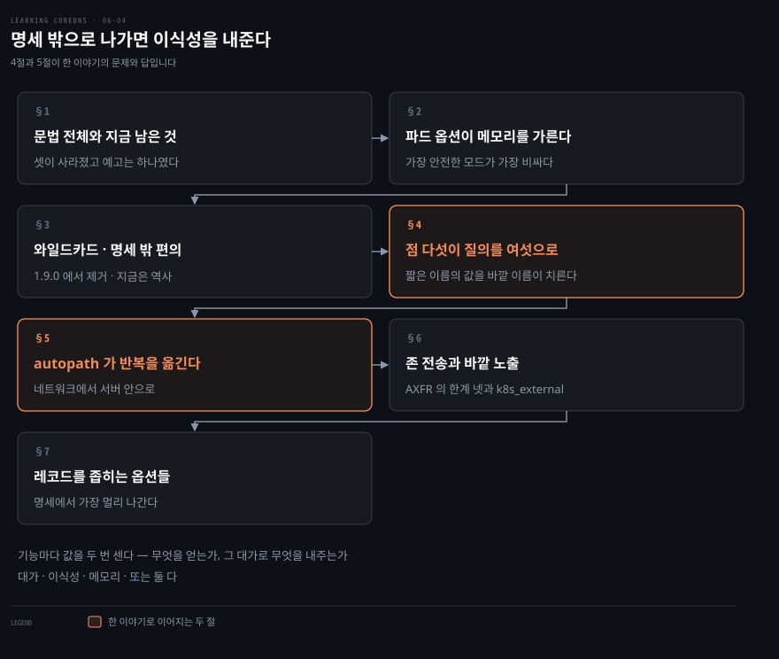
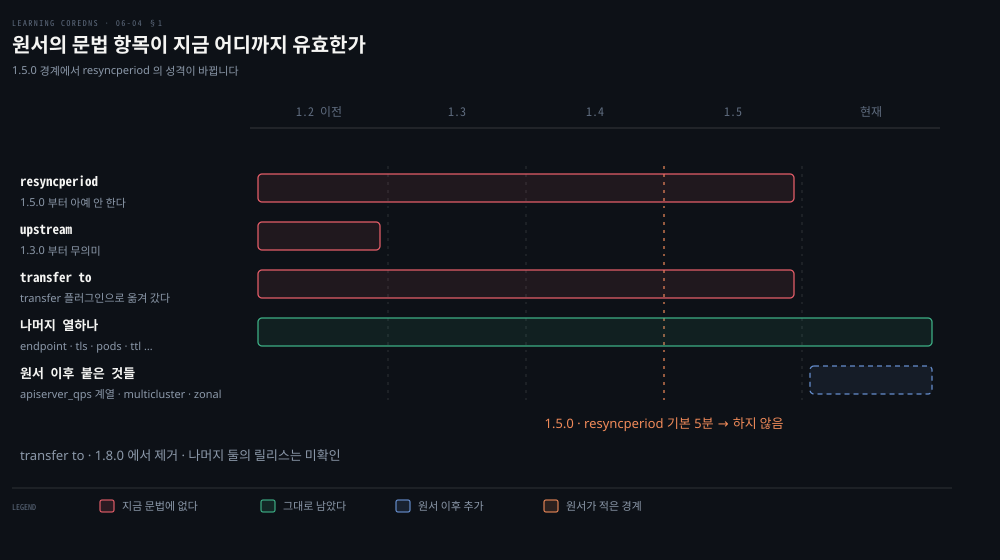
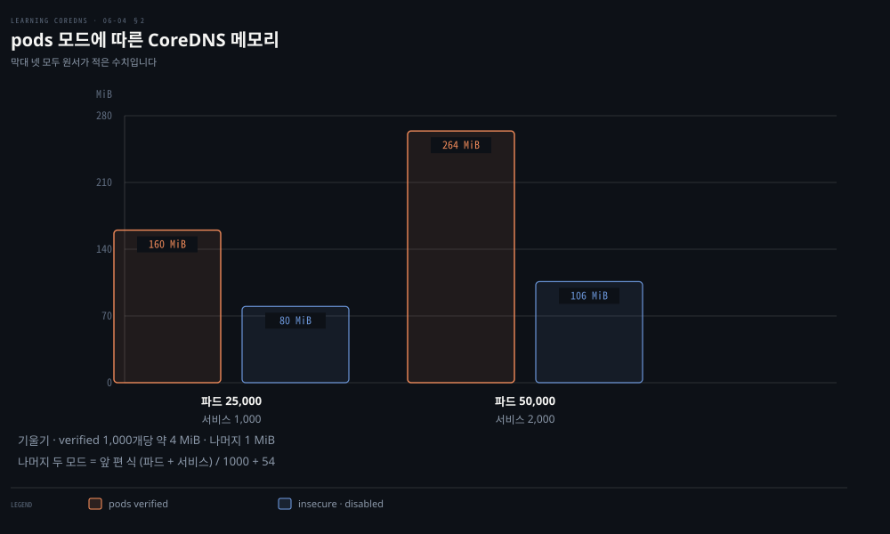
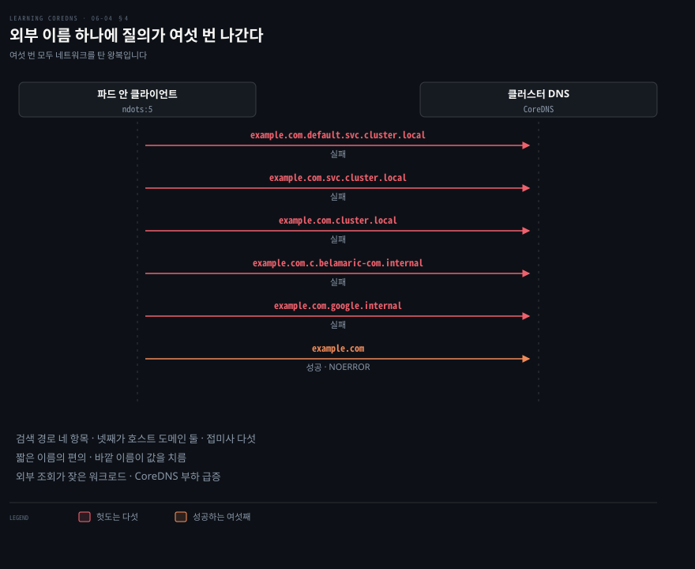
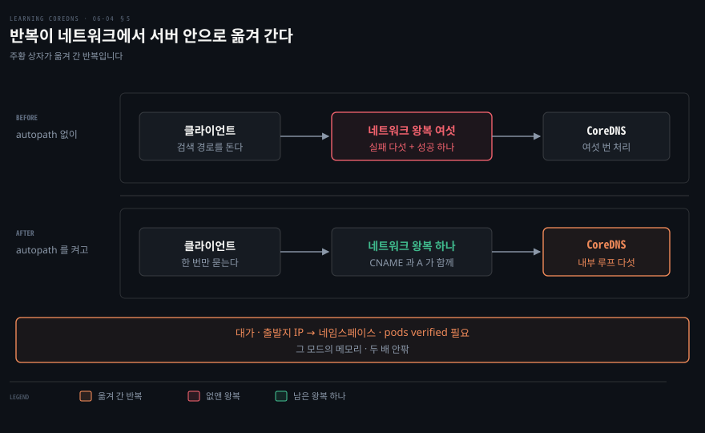

# 명세 밖으로 나가면 이식성을 내준다

---

> `kubernetes` 플러그인에는 쿠버네티스 DNS 명세가 요구하지 않는 기능이 여럿 있습니다. 편리한 만큼 그 클러스터를 표준에서 벗어나게 만듭니다.

## 핵심 요약

> 이 편이 매달린 하나의 생각은 **명세 밖 기능의 값이 편의가 아니라 이식성으로 계산된다**는 것입니다.

저자들이 확장 기능 절을 여는 문장이 그대로 경고입니다. 이 옵션들 중 일부는 클러스터를 준수하지 않는 상태로 만들고 워크로드 이식성에 영향을 줄 수 있으니 조심해서 쓰라는 것입니다.

그래서 이 편의 읽는 법은 기능마다 두 값을 함께 세는 것입니다. 무엇을 얻는가와, 그 대가로 무엇을 내주는가입니다. 대가는 세 종류로 갈립니다. 이식성을 내주거나, 메모리와 API 서버 부하를 내주거나, 둘 다 내줍니다.

가장 값진 것은 `ndots:5` 이야기입니다. 외부 이름 하나를 푸는 데 질의가 여섯 번 나가는 구조적 이유가 여기 있고, `autopath` 가 그 반복을 네트워크에서 서버 안으로 옮깁니다. 다만 그 옮김의 값도 메모리로 치릅니다.


## 학습 목표

이 내용을 읽고 나면:

1. `kubernetes` 플러그인의 전체 문법 항목을 용도별로 묶어 말할 수 있습니다.
2. `pods` 세 모드가 무엇을 바꾸고 메모리를 얼마나 더 쓰는지 수치로 비교할 수 있습니다.
3. `ndots:5` 가 왜 외부 이름 하나에 질의 여섯 번을 만드는지 검색 경로로 유도할 수 있습니다.
4. `autopath` 가 무엇을 어디로 옮기는지와 그 대가를 설명할 수 있습니다.
5. 클러스터 밖에서 서비스에 닿게 하는 두 길을 구분할 수 있습니다.

아래는 이 문서 전체를 읽는 순서로 이은 지도입니다. 1절과 2절이 플러그인 문법이고, 3절부터 7절까지가 명세 밖 기능들입니다.




## 이 문서가 다루지 않는 것

> 이 편은 `kubernetes` 플러그인의 전체 문법과 확장 기능입니다. 6장의 마지막 구간이자 이 책의 쿠버네티스 편 마무리입니다.

- 배포 매니페스트와 오토스케일링 → [복제본 둘과 170Mi는 어디서 온 값인가](./06-03.%EB%B3%B5%EC%A0%9C%EB%B3%B8%20%EB%91%98%EA%B3%BC%20170Mi%EB%8A%94%20%EC%96%B4%EB%94%94%EC%84%9C%20%EC%98%A8%20%EA%B0%92%EC%9D%B8%EA%B0%80.md)
- 기본 Corefile 의 각 줄 → [기본 Corefile의 줄마다 이유가 있다](./06-02.%EA%B8%B0%EB%B3%B8%20Corefile%EC%9D%98%20%EC%A4%84%EB%A7%88%EB%8B%A4%20%EC%9D%B4%EC%9C%A0%EA%B0%80%20%EC%9E%88%EB%8B%A4.md)
- 질의와 응답을 다듬는 `template`·`rewrite` 플러그인 → 원서 7장
- 클라이언트 측 `resolv.conf`·ndots 설정 자체 → [02_os 네트워크 로드맵 §6](../../../02_os/networking/roadmap.md)

남는 것은 **명세 밖으로 나가는 옵션들과 그 값**입니다.


## 1. 플러그인 문법 전체와 지금 남은 것

> 원서가 싣는 문법 항목은 열넷입니다. 그중 셋이 그 뒤 사라졌는데, 저자들이 제거를 예고한 것은 그중 하나뿐입니다.



여기까지의 세 편은 표준 배포 하나만 봤습니다. 그런데 클러스터 밖에서 CoreDNS 를 돌리거나 테넌트별로 레코드를 가려야 한다면 그 설정으로는 안 됩니다.

CoreDNS 와 쿠버네티스 통합의 심장이 `kubernetes` 플러그인입니다. 이 플러그인의 전체 문법은 이 장에서 다룬 표준 배포보다 훨씬 많은 용례를 허용합니다.

저자들이 드는 예가 넷입니다. 클러스터 밖에서 CoreDNS 를 돌리며 API 서버에 외부 클라이언트로 접근하기, 네임스페이스나 라벨 셀렉터로 레코드 거르기, DNS 존 전송, 그리고 레코드를 클라이언트에게 보여 주는 방식을 이런저런 식으로 손보기입니다.

문법 항목은 용도로 묶으면 넷입니다.

- **클러스터 밖에서 붙기**: `endpoint`·`tls`·`kubeconfig`
- **레코드 범위 좁히기**: `namespaces`·`labels`·`noendpoints`·`ignore empty_service`
- **레코드 모양 바꾸기**: `pods`·`endpoint_pod_names`·`ttl`
- **다른 플러그인·서버와 잇기**: `upstream`·`transfer to`·`fallthrough`

여기에 `resyncperiod` 가 하나 더 있습니다. API 서버에서 자원을 다시 맞추는 주기를 정하는데, **1.5.0 이전 버전에서는 기본이 5분이고 1.5.0 이후에는 아예 하지 않습니다.** 그리고 이 옵션은 나중 버전에서 제거될 것이라고 저자들이 적습니다.

### 클러스터 밖에서 붙는 셋

`endpoint` 는 쓸 API 서버 URL 을 직접 지정하게 합니다. 주로 쿠버네티스 밖에서 돌 때 씁니다. `tls` 는 그 `endpoint` 와 함께 TLS 클라이언트 파라미터를 설정합니다.

`kubeconfig` 는 표준 kubeconfig 파일로 API 서버에 인증하게 합니다. 역시 쿠버네티스 밖에서 쓰라고 만든 것이고, 지정한 컨텍스트에 정의된 API 서버로 붙습니다. 1.5.0 부터 클라이언트 인증서, 베어러 토큰, HTTP Basic 인증에 더해 GCP·OpenStack·OIDC 플러그인까지 지원합니다.

### 나머지 항목들

`ttl` 은 클러스터 자원과 관련된 모든 이름의 TTL 을 조절합니다. **상류 네임서버에서 온 레코드의 TTL 에는 영향을 주지 않습니다.**

`ignore empty_service` 는 백엔드가 없는 서비스를 없는 것처럼 다뤄서, 데이터 없는 응답 대신 `NXDOMAIN` 을 돌려줍니다. 저자들이 문법에 대해 한마디 답니다. `ignore` 뒤에 공백이 있는데, 나중에 무엇을 더 무시할지 확장할 수 있게 하려는 것입니다.

`fallthrough` 는 나열한 존의 질의를 플러그인 체인 아래로 넘깁니다. 여기 붙은 설명이 06-02 의 이야기를 다시 확인해 줍니다. 이 옵션은 흔히 `in-addr.arpa` 전체의 PTR 요청을 상류로 넘기는 데 쓰이는데, **엔드포인트의 CIDR 을 전부 프로그램으로 알아낼 방법이 없기 때문**입니다.

`upstream` 은 CNAME 에 대응하는 A 레코드를 찾는 데 쓰였지만 CoreDNS 1.3.0 이후로는 쓸모없습니다. 그 버전들은 A 레코드를 항상 내부에서 찾기 때문입니다.

> **노트의 읽기**: 현재 공식 문법 블록에는 `resyncperiod` 도 `upstream` 도 `transfer to` 도 없습니다.[^k8splugin] 셋 중 저자들이 앞날을 말한 것은 `resyncperiod` 하나입니다. `"This option will be eliminated in later versions."` 라고 적었고 그대로 됐습니다. `upstream` 에 대해서는 이미 쓸모없다는 현재형 서술만 있고 제거 예고는 없으며, `transfer to` 에는 어떤 예고도 없습니다. 존 전송은 4장의 `file` 플러그인과 같은 길을 가 별도 `transfer` 플러그인으로 옮겨 갔습니다. 대신 `apiserver_qps` 계열과 `multicluster`·`zonal`·`startup_timeout` 이 새로 붙었습니다.[^k8splugin]

> **원문 정오**: 이 절의 문장 넷에 철자 오류가 있습니다. `"a number of different uses cases"` 의 `uses cases` 는 `use cases` 이고, `"the way records are presented to client"` 는 `to clients` 이며, `fallthrough` 설명의 `programatically` 는 `programmatically`, 뒤 존 전송 절의 `DNS infastructure` 는 `infrastructure` 입니다.


## 2. 파드 옵션 셋이 메모리를 가른다

> `pods` 는 세 모드가 있고 기본은 아무것도 안 하는 쪽입니다. 가장 안전한 모드가 가장 비싼 모드이기도 합니다.



06-01 에서 봤듯 파드 레코드는 폐기됐습니다. CoreDNS 는 파드 이름 요청을 다루는 선택지를 셋 제공합니다.

**CoreDNS 의 기본값은 `pods disabled` 입니다.** `pods` 옵션을 생략하면 파드 질의는 `NXDOMAIN` 을 돌려받습니다. 그런데 쿠버네티스 기본 설정은 `pods insecure` 를 쓰는데, 이것이 kube-dns 의 폐기됐지만 하위 호환되는 동작을 유지합니다.

셋째 선택지가 `pods verified` 입니다. 이 옵션을 켜면 CoreDNS 가 파드 자원에 watch 를 걸고, `a-b-c-d.namespace.pod.cluster.local` 질의에 대해 **그 네임스페이스에 실제로 `a.b.c.d` 주소의 파드가 있을 때만** IP 를 돌려줍니다. 네임스페이스 밖의 파드가 안에 있는 것처럼 보이는 일을 막아 주므로 보안이 나아집니다.[^insecuremoniker]

### 켜지 않는 이유가 둘

`pods verified` 가 기본이 아닌 이유는 큰 클러스터에서 확장성 문제를 둘 만들기 때문입니다.

첫째는 API 서버 쪽입니다. **CoreDNS 인스턴스마다 API 서버에 별도의 watch 를 겁니다.** 파드가 많을수록 그 watch 하나하나가 API 서버 성능에 주는 영향이 커지고, 동시에 필요한 CoreDNS 인스턴스 수도 늘어납니다. 그래서 파드 수가 늘 때 API 서버 부하가 **비선형으로** 커집니다.

둘째는 메모리입니다. 인스턴스마다 서비스와 엔드포인트에 더해 모든 파드를 캐시해야 합니다. 저자들이 두 규모의 실측을 답니다.

| 클러스터 | `pods verified` | `insecure` 또는 `disabled` |
|---------|----------------|---------------------------|
| 파드 25,000 · 서비스 1,000 | 약 160 MiB | 약 80 MiB |
| 파드 50,000 · 서비스 2,000 | 264 MiB | 106 MiB |

메모리 사용은 파드와 서비스 수에 선형이라고 저자들이 덧붙입니다.

> **노트의 읽기**: 이 네 수치를 앞 편의 추정식과 맞춰 보면 딱 떨어집니다. 앞 편의 식 `(pods + Services) / 1000 + 54` 에 26,000 을 넣으면 80, 52,000 을 넣으면 106 입니다. 즉 **그 식은 `insecure`·`disabled` 모드의 선입니다.** 같은 방식으로 `verified` 두 점에서 기울기를 구하면 객체 1,000개당 약 4 MiB 에 절편 56 이 나옵니다. 한계 비용이 네 배라는 뜻이고, 그래서 이 모드는 클러스터가 클수록 급격히 비싸집니다.

기술적으로 `pods insecure` 를 끄는 것은 쿠버네티스 DNS 명세를 따르지 않는 일입니다. 다만 이 경우에는 이식성을 해칠 위험이 낮다고 저자들은 봅니다. 그 레코드들이 이미 폐기됐기 때문입니다.


## 3. 와일드카드는 명세 밖의 편의다

> `*` 라벨로 질의하면 그 자리에 무엇이 있든 레코드가 돌아옵니다. 쓸모가 있는 자리는 생각보다 좁습니다.

ClusterIP 서비스 뒤에 파드가 몇 개 붙어 있는지를 DNS 로 알아내려 하면 막힙니다. `SRV` 는 헤드리스에서만 동작하고, A 는 가상 IP 하나만 돌려주기 때문입니다.

`kubernetes` 플러그인은 원래의 SkyDNS 와 `etcd` 플러그인과 비슷한 와일드카드 질의를 지원합니다. 이것은 **DNS 의 와일드카드 레코드 개념과 완전히 별개**이고, 서비스 디스커버리를 돕기 위해 더해진 특별 기능입니다.

방법은 단순합니다. 이름의 특정 부분에 라벨로 `*` 또는 `all` 이라는 낱말을 씁니다. 그러면 그 라벨 자리에 무엇이 있든 상관없이 레코드가 돌아옵니다.

```bash
host *.default.svc.cluster.local.
```

돌아온 레코드의 이름이 실제 서비스 이름이 아니라 **질의에 쓴 이름과 같다**는 점을 저자들이 짚습니다. 많은 클라이언트가 응답의 이름이 질의의 이름과 다르면 응답을 거부하기 때문에 알아 둘 값어치가 있습니다.

네임스페이스의 모든 서비스를 이렇게 물으면 결과 해석이 어렵습니다. 서비스가 둘 이상이면 정말 쓸모가 없습니다. 네임스페이스 라벨에 와일드카드를 쓰거나 둘 다 쓸 수도 있지만 응답에서 의미를 찾기 어렵습니다.

### 쓸모가 분명한 자리가 하나

말이 되는 용례가 있습니다. **어떤 서비스의 모든 엔드포인트를 묻는 것**입니다.

```bash
host kube-dns.kube-system.svc.cluster.local.
host *.kube-dns.kube-system.svc.cluster.local.
```

앞 질의는 `kube-dns` 가 ClusterIP 서비스임을 보입니다. 주소가 하나만 돌아옵니다. 그런데 `*.<service>.<namespace>.svc.cluster.local` 로 엔드포인트를 물으면 CoreDNS 가 엔드포인트 레코드 둘을 돌려줍니다.

**이것이 DNS 로 이 정보를 얻는 유일한 길입니다.** 보통 이 용도로 쓰는 `SRV` 질의는 헤드리스 서비스에서만 동작하기 때문입니다.

와일드카드를 쓸 수 있는 자리도 정해져 있습니다. A 레코드 요청에서는 엔드포인트, 서비스 이름, 네임스페이스입니다. `SRV` 레코드 요청에서는 그 셋에 포트와 프로토콜이 더해집니다. 여러 라벨에 동시에 쓸 수도 있습니다.


## 4. 점 다섯 개가 질의를 여섯으로 만든다

> 짧은 이름을 쓰게 해 주는 설정이 외부 이름을 풀 때 대가를 청구합니다. 그 대가가 여섯 배입니다.



쿠버네티스에서 DNS 를 다룰 때 흔히 부딪히는 어려움 하나가 파드의 `resolv.conf` 가 설정되는 방식입니다.

`service.namespace.svc.cluster.local` 대신 `service` 같은 짧은 이름을 쓰게 하려고, kubelet 은 파드의 `resolv.conf` 검색 경로를 다음 도메인들로 이 순서로 설정합니다.

1. `<namespace>.svc.cluster.local` — `<service>` 같은 이름이 통하게 합니다.
2. `svc.cluster.local` — `<service>.<namespace>` 가 통하게 합니다.
3. `cluster.local` — `<service>.<namespace>.svc` 가 통하게 합니다.
4. 호스트의 검색 경로. 보통 도메인 두어 개입니다.

첫 도메인은 클러스터 안 이름을 풀 때 아주 잘 동작합니다. 서비스를 이름만으로 요청하면 자기 네임스페이스의 것을 찾아 줍니다. 애플리케이션을 다른 네임스페이스에 배포해도 설정을 그대로 둘 수 있습니다. 둘째와 셋째도 마찬가지로 클러스터를 옮겨도 이름이 그대로이게 해 줍니다.

### 문제는 바깥 이름입니다

외부 이름을 풀 때 곤란해집니다. 검색 경로가 제대로 동작하게 하려고 kubelet 이 `ndots` 옵션을 **5** 로 설정하기 때문입니다. 그러면 점이 다섯 개보다 적은 도메인 이름은 전부 상대 도메인일 수 있다고 간주되어 검색 경로가 적용됩니다.

```bash
host -v example.com
Trying "example.com.default.svc.cluster.local"
Trying "example.com.svc.cluster.local"
Trying "example.com.cluster.local"
Trying "example.com.c.belamaric-com.internal"
Trying "example.com.google.internal"
Trying "example.com"
```

질의 하나를 풀려고 **실패한 질의 다섯 번이 나간 뒤 여섯 번째가 성공**했습니다. 그리고 이 하나하나가 클라이언트에서 시작되어 네트워크를 타고 CoreDNS 에서 처리되고 응답까지 돌아온 것입니다. 워크로드가 외부 이름을 많이 조회한다면 이것만으로 CoreDNS 부하가 극적으로 늘어납니다.

### 해법이 넷 있습니다

저자들이 네 갈래를 놓고 각각의 한계를 짚습니다.

- **PodSpec 의 `dnsConfig`** 로 자기만의 정책을 설정합니다. 동작하기는 하지만 외부 이름을 많이 쓰는 사람마다 자기 파드 DNS 를 설정해야 합니다. 사용자가 잊지 않고 그렇게 하리라고 기대하기는 어렵습니다.
- **항상 FQDN 을 쓰게** 합니다. 끝의 점까지 붙여서입니다. 저자들은 이것을 "있을 법하지 않은 환상" 이라고 부릅니다.
- **노드 로컬 캐시**를 씁니다. 캐시 전용으로 작게 빌드한 CoreDNS 를 클러스터의 모든 노드에 두고, 캐시에 없는 것은 중앙 CoreDNS 서비스로 TCP 로 넘깁니다. TCP 라 UDP 보다 신뢰성이 높고 5초 타임아웃 가능성을 피합니다.[^nodelocal] 다만 노드마다 자원을 조금씩 더 쓰고, 각 노드의 로컬 캐시는 인스턴스가 하나뿐이라 고가용성이 아닙니다.
- **`autopath`** 를 씁니다. 다음 절이 이것입니다.

> **노트의 읽기**: 노드 로컬 캐시의 성숙도는 원서가 미래형으로 적은 부분입니다. 쿠버네티스 1.15 에서 베타이고 1.16 이나 1.17 에서 GA 가 될 것이라고 적혀 있는데, 이 편에서는 실제로 어느 버전에서 GA 가 됐는지 확인하지 않았습니다. 지금 클러스터에 도입할지 판단한다면 쿠버네티스 공식 문서에서 현재 상태를 먼저 봐야 합니다.


## 5. autopath 는 그 반복을 서버 안으로 옮긴다

> 검색 경로를 클라이언트가 도는 대신 서버가 돕니다. 네트워크 왕복 다섯 번이 내부 루프 다섯 번이 됩니다.



앞 절의 해법 셋은 전부 클라이언트 쪽을 고치라고 합니다. 사용자가 잊지 않으리라 기대하거나 노드마다 자원을 더 써야 합니다. 어느 쪽도 서버만 손봐서 되는 길이 아닙니다.

CoreDNS 의 해법이 `autopath` 플러그인입니다. 이 플러그인을 쓰면 CoreDNS 가 **서버 쪽에서** 검색 경로를 알아냅니다.

동작은 이렇습니다. 검색의 첫 질의처럼 보이는 것을 알아보면, 예를 들어 `example.com.default.svc.cluster.local` 같은 것을 보면, 그 검색 경로를 CoreDNS 가 내부에서 스스로 순회합니다. 네트워크가 끼지 않고 그저 내부 루프라서 훨씬 빠릅니다. 결과를 얻으면 그 결과를 가리키는 CNAME 을 돌려줍니다.

```bash
;; QUESTION SECTION:
;example.com.default.svc.cluster.local. IN A

;; ANSWER SECTION:
example.com.default.svc.cluster.local. 30 IN CNAME example.com.
example.com.                 30       IN       A         93.184.216.34
```

첫 질의 하나에 CNAME 과 A 가 함께 돌아옵니다. 클라이언트가 검색 경로를 더 밟을 이유가 없어집니다.

### 대가는 다시 메모리입니다

`autopath` 의 가장 큰 단점은 확장성입니다. 검색 경로를 알아내려면 CoreDNS 가 **클라이언트 파드의 네임스페이스**를 알아야 합니다.

그런데 CoreDNS 가 클라이언트 파드에 대해 가진 정보는 질의의 출발지 IP 주소뿐입니다. 그 IP 로 클라이언트의 네임스페이스를 알아내야 하는데, 그 일을 하는 것이 바로 `pods verified` 모드입니다. 그리고 2절에서 본 대로 그 모드는 메모리 소비를 늘립니다.

> **노트의 읽기**: 이 절이 이 편의 구조를 요약합니다. `ndots:5` 의 여섯 배 질의는 이식성을 지킨 대가이고, `autopath` 는 그 대가를 메모리로 바꿔 치르는 선택입니다. 어느 쪽도 공짜가 아니고, 클러스터가 작고 외부 조회가 많을 때만 후자가 남는 장사가 됩니다.


## 6. 존 전송과 바깥 노출

> 클러스터의 모든 레코드를 한 번에 보는 방법과, 클러스터 밖 클라이언트가 서비스에 닿게 하는 방법입니다.

CoreDNS 는 `kubernetes` 존의 존 전송(AXFR)을 지원합니다. 요청 한 번으로 클러스터에서 쓸 수 있는 모든 레코드를 볼 수 있어서 훌륭한 디버깅 도구라고 저자들은 적습니다. 조직 안에서 라우팅되는 파드 IP 를 쓴다면 외부 클라이언트가 헤드리스 서비스 엔드포인트에 직접 접근하는 길도 됩니다.

켜려면 `kubernetes` 플러그인에 `transfer to` 옵션을 설정하고, `host -t axfr cluster.local.` 로 시험합니다.

한계가 넷입니다.

- IXFR 은 지원하지 않습니다.
- 폐기된 파드 레코드는 전송되지 않습니다.
- `fallthrough` 를 쓰고 있다면 `cluster.local` 안에서 다른 플러그인이 서빙하는 레코드는 전송되지 않습니다.
- **NS 레코드가 빠지는 버그 때문에 BIND 와 호환되지 않습니다.**

그래서 존 전송은 앞서 말한 제한된 경우에 쓸모가 있을 뿐, 전통적인 DNS 인프라와 온전히 통합되려면 아직 손볼 것이 남았다고 저자들은 정리합니다.

### 클러스터 밖에서 닿게 하기

쿠버네티스 DNS 명세는 헤드리스와 ClusterIP 서비스를 다룹니다. 둘 다 클러스터 **안**에서의 접근을 위한 것입니다. 그런데 클러스터에서 도는 서비스를 조직 전체에서 접근하게 만들고 싶을 때가 많습니다.

쿠버네티스는 그 물음에 답을 여럿 줍니다. External IP, NodePort 서비스, LoadBalancer 서비스, Ingress 자원입니다. 이 방법들은 외부 IP 주소에 도달한 트래픽을 서비스로 보내 줍니다.

**그런데 클라이언트가 그 IP 주소를 어떻게 발견하느냐**에는 표준 답이 없습니다. 쿠버네티스 배포판에 보통 들어 있는 구성요소로는 이 서비스 디스커버리를 제공할 수 없다고 저자들은 적습니다.

길이 둘입니다.

하나는 external DNS 쿠버네티스 인큐베이터 프로젝트입니다. DNS 서버와 상호작용해 이 외부 IP 와 Ingress 의 레코드를 추가하는 선택적 컨트롤러를 제공합니다. 그 서비스의 도메인을 관리하는 외부 DNS 서버를 API 로 고칠 수 있다는 전제가 필요합니다. 열두 가지가 넘는 DNS 서비스를 지원하고, 거기에 Google Cloud DNS·AWS Route 53·Infoblox 와 함께 **etcd 및 `etcd` 플러그인과 함께 도는 CoreDNS** 도 들어 있습니다.

다른 하나는 더 단순한 필요에 맞는 `k8s_external` 플러그인입니다. LoadBalancer 와 External IP 서비스를 `<service>.<namespace>.<zone>` 형태로 노출할 존을 지정하게 합니다.

```bash
k8s_external services.example.com {
    apex services
}
```

이 플러그인은 `kubernetes` 플러그인이 함께 설정돼 있을 때만 동작합니다. 존 정점의 SOA 와 NS 레코드를 처리해서 그 존을 CoreDNS 에 위임할 수 있게 해 줍니다. 레코드의 TTL 을 조절하는 `ttl` 옵션도 있습니다.

저자들이 여기 사이드바로 조언을 답니다. **내부 클러스터 DNS 를 외부 사용자에게 노출하는 대신, 외부 이름 전용으로 CoreDNS 를 하나 더 배포하는 것을 고려하라**는 것입니다. 클러스터 밖에서 오는 서비스 거부 공격으로부터 클러스터 DNS 를 보호하기 위해서입니다. 클러스터 DNS 를 잃으면 대개 클러스터의 서비스 상당수가 함께 내려가므로, 자원을 조금 더 써서 속쓰림을 피하라고 적습니다.

> **노트의 읽기**: `k8s_external` 은 지금도 있고 `apex` 와 `ttl` 도 그대로입니다. 원서 이후 옵션이 둘 붙었는데 목적이 서로 다릅니다. `headless` 는 외부 IP 가 설정된 헤드리스 서비스도 풀게 하고, `fallthrough` 는 질의한 도메인이 없을 때 다음 플러그인으로 넘깁니다.[^k8sexternal] 기본 apex 라벨이 `dns` 라는 것도 공식 문서에 적혀 있습니다.[^k8sexternal] 원서 예제가 `apex services` 로 그것을 바꾸고 있는 것입니다.


## 7. 레코드를 좁히는 옵션들

> 다중 테넌트처럼 특별한 용례에서는 레코드를 덜 보이게 하고 싶어집니다. 그 옵션들이 명세 밖으로 가장 멀리 나갑니다.

`kubernetes` 플러그인의 설정을 손봐서 레코드가 보이는 방식을 특수 용례에 맞출 방법이 여럿 있습니다. 다중 테넌트 용례라면 특정 네임스페이스의 레코드만 내보내는 CoreDNS 를 따로 돌리고 싶을 수 있습니다. 엔드포인트 이름을 조회하기 어려운 프로세스에 먹여야 한다면 이름을 예측 가능하게 만들고 싶을 수도 있습니다.

이 설정 옵션들은 표준 쿠버네티스 DNS 명세를 벗어날 수 있으니 조심해서 쓰라고 저자들은 다시 못 박습니다.

### 엔드포인트 이름을 예측 가능하게

06-01 에서 본 대로 CoreDNS 는 기본적으로 파드 IP 주소의 대시 형태를 파드의 라벨로 씁니다. 그러면 엔드포인트 이름을 미리 알 수 없고, 파드 안의 호스트 이름과 DNS 의 라벨이 서로 맞지 않습니다.

`endpoint_pod_names` 옵션이 이 문제를 덜어 줍니다. `hostname` 과 `subdomain` 을 지정하는 길은 그대로 두면서, PodSpec 에 `hostname` 이 설정돼 있지 않으면 대시 형태 IP 대신 **파드의 이름**을 씁니다. 기술적으로는 이것도 DNS 명세 안이지만, 이 동작에 의존하는 것은 명세 안이 아니라고 저자들은 선을 긋습니다.

### NXDOMAIN 을 신호로 쓰기

1절에서 본 `ignore empty_service` 가 여기서 새 쓰임을 얻습니다. 데이터 없는 성공 응답 대신 `NXDOMAIN` 을 보낸다는 것은 클라이언트가 검색 경로의 다음 항목으로 계속 간다는 뜻입니다. 그 항목을 보조 클러스터를 가리키게 설정해 두면 **트래픽을 다른 클러스터로 넘길** 수 있습니다. 4절의 검색 경로가 짐이 아니라 도구가 되는 유일한 자리입니다.

역시 1절에 나온 `noendpoints` 도 여기서는 자원 절약 수단으로 읽힙니다. 헤드리스를 쓰지 않는다면 Endpoints 자원을 적재하는 비용을 통째로 뺄 수 있습니다.

> **원문 정오**: 원서가 이 옵션을 `nodendpoints` 로 적습니다. 같은 장 앞쪽의 문법 블록과 항목 설명은 `noendpoints` 로 맞게 적혀 있어서, 이 자리만 `d` 가 하나 끼어든 것입니다. 이대로 적으면 CoreDNS 가 모르는 속성이라며 뜨지 않습니다.

### 테넌트별로 잘라 내기

다중 테넌트 같은 특수 용례에서는 사용자에게 보이는 레코드의 범위를 제한할 수 있습니다. `namespaces` 나 `labels` 옵션으로 합니다.

`namespaces` 는 네임스페이스 목록을 받고 그 네임스페이스의 레코드만 적재하고 서빙합니다. 특정 노드와 네임스페이스를 한 테넌트에 전용으로 할당한다면, kubelet 옵션을 고쳐 그 노드가 고르는 네임서버를 전용 CoreDNS 서비스로 지정할 수 있습니다. 그 CoreDNS 는 그 테넌트의 네임스페이스 레코드만 돌려주도록 설정됩니다.

`labels` 는 같은 방식으로 동작하되 네임스페이스 목록 대신 라벨 셀렉터를 줍니다.


## 심화 학습

> 원서 이후 이 구간에서 바뀐 것과, 원서가 미래형으로 남긴 것을 갈라 둡니다.

- **`namespace_labels` 가 새로 생겼습니다.** 공식 문서는 `labels` 와 별개로 `namespace_labels` 를 설명합니다. 라벨 셀렉터에 맞는 쿠버네티스 **네임스페이스**의 레코드만 노출하는 옵션입니다.[^k8splugin] `labels` 가 객체를 고르는 것과 대상이 다릅니다.
- **API 서버 부하를 조이는 손잡이가 생겼습니다.** `apiserver_qps`·`apiserver_burst`·`apiserver_max_inflight` 셋이 플러그인이 API 서버로 보내는 요청의 초당 한도와 순간 폭주 한도와 동시 진행 상한을 각각 정합니다.[^k8splugin] 2절이 말한 `pods verified` 의 비선형 부하를 다룰 수단이 원서 시절보다 늘어난 셈입니다.
- **`startup_timeout` 이 붙었습니다.** 플러그인이 시작할 때 informer 캐시가 동기화되기를 기다리는 시간의 상한이고 기본이 5초입니다.[^k8splugin] 06-03 의 `ready` 플러그인 이야기와 맞물리는 자리입니다.
- **`multicluster` 와 `zonal` 이 새 축입니다.** 앞엣것은 Multi-Cluster Services API 규격의 존을 정의하고, 뒤엣것은 헤드리스 서비스에 존 범위 이름을 켭니다.[^k8splugin] 06-02 에서 본 `federation` 의 자리를 다른 규격이 채운 것입니다.

원서의 문법 블록은 **2019년의 모습**으로 읽는 편이 안전합니다. 이 구간은 6장에서 공식 문서와 가장 크게 갈린 자리입니다.


## 결정 치트시트

> 명세 밖 기능마다 얻는 것과 내주는 것을 나란히 뒀습니다. 마지막 세 줄만 심화 학습입니다.

| 기능 | 얻는 것 | 내주는 것 |
|------|---------|----------|
| `pods insecure` | kube-dns 하위 호환 | 네임스페이스 신원 보장 |
| `pods verified` | 신원 보장 회복 | 메모리 두 배에서 두 배 반 · API 서버 비선형 부하 |
| `pods disabled` | 가장 가볍다 | 파드 질의가 전부 `NXDOMAIN` |
| 와일드카드 질의 | ClusterIP 의 엔드포인트를 볼 유일한 길 | 명세 밖 · 이름 불일치로 거부하는 클라이언트 |
| `autopath` | 외부 이름 질의가 여섯에서 하나로 | `pods verified` 가 필요해 메모리 |
| 노드 로컬 캐시 | 중앙 부하 감소 · TCP 로 타임아웃 회피 | 노드마다 자원 · 로컬 캐시는 단일 인스턴스 |
| `transfer to` | 클러스터 레코드를 한 번에 조망 | IXFR 없음 · BIND 비호환 |
| `k8s_external` | 외부 IP 를 이름으로 노출 | `kubernetes` 플러그인이 함께 있어야 |
| `endpoint_pod_names` | 엔드포인트 이름이 예측 가능 | 의존하면 명세 밖 |
| `ignore empty_service` | 검색 경로로 다른 클러스터에 넘김 | 데이터 없음과 이름 없음의 구분이 사라짐 |
| `namespaces`·`labels` | 테넌트별 격리 | 명세에서 가장 멀리 나간다 |
| 큰 클러스터에서 API 서버가 힘들다 | — | `apiserver_qps` 계열로 요청 속도를 조인다 |
| 네임스페이스 단위로 거르고 싶다 | — | `labels` 말고 `namespace_labels` 를 본다 |
| 시작 직후 빈 응답이 나온다 | — | `startup_timeout` 과 `ready` 를 함께 본다 |


## 적용 관점

> 이 편은 파드 하나만 있으면 `ndots` 이야기를 눈으로 볼 수 있습니다.

**한 가지 실행**: 아무 파드에서 `cat /etc/resolv.conf` 로 `search` 줄과 `ndots:5` 를 확인합니다. 그다음 `host -v example.com` 으로 몇 번 시도하는지 셉니다. 4절의 여섯 줄이 그대로 나오면 그 클러스터가 기본 설정입니다.

**한 가지 확인**: `host *.<네임스페이스>.svc.cluster.local.` 을 물어 봅니다. 주소가 여럿 돌아오는데 이름이 전부 `*.…` 인 것을 보면 3절의 경고가 무슨 뜻인지 잡힙니다.

Spring 애플리케이션 관점에서는 `ndots:5` 가 실제 비용이 되는 자리입니다. 외부 API 를 자주 부르는 서비스라면 호출마다 질의 여섯 번이 나갈 수 있습니다. JVM 의 DNS 캐시가 이것을 어느 정도 가려 주지만, `networkaddress.cache.ttl` 설정에 따라 그 가림막이 얼마나 두꺼운지가 갈립니다. 외부 호스트 이름을 FQDN 으로(끝에 점을 붙여) 적어 두는 것만으로도 검색 경로를 건너뛸 수 있습니다.


## 면접에서 받을 만한 질문

1. `pods` 세 모드의 차이와 각각의 기본값 여부를 말해 보십시오.
2. `pods verified` 가 기본이 아닌 이유를 둘로 나눠 설명해 보십시오.
3. 쿠버네티스 와일드카드 질의가 DNS 와일드카드 레코드와 무엇이 다릅니까.
4. ClusterIP 서비스의 엔드포인트를 DNS 로 알아내는 방법은 무엇입니까.
5. `ndots:5` 가 외부 이름 질의를 여섯 번으로 만드는 과정을 설명해 보십시오.
6. `autopath` 는 무엇을 어디로 옮기며 그 대가는 무엇입니까.
7. 존 전송이 BIND 와 호환되지 않는 이유는 무엇입니까.
8. 클러스터 DNS 를 외부에 직접 노출하지 말라는 조언의 근거는 무엇입니까.


## 정답 (자답 후 펼치기)

### 정답 1 — `pods` 세 모드

`disabled` 가 CoreDNS 의 기본값이고 파드 질의에 `NXDOMAIN` 을 돌려줍니다. `insecure` 는 확인 없이 요청의 IP 로 A 를 돌려주며 kube-dns 하위 호환용이고, 쿠버네티스 기본 설정이 이것을 씁니다. `verified` 는 그 네임스페이스에 실제로 그 IP 의 파드가 있을 때만 답합니다.

### 정답 2 — `verified` 가 기본이 아닌 이유

첫째, API 서버 부하입니다. CoreDNS 인스턴스마다 별도 watch 를 거는데, 파드가 많을수록 watch 하나의 영향도 커지고 필요한 인스턴스 수도 늘어 부하가 비선형으로 커집니다. 둘째, 메모리입니다. 인스턴스마다 서비스와 엔드포인트에 더해 모든 파드를 캐시해야 해서 소비가 대략 두 배가 됩니다.

### 정답 3 — 두 와일드카드의 차이

DNS 의 와일드카드 레코드는 존에 `*` 로 시작하는 레코드를 두어 없는 이름에 답하는 표준 기능입니다. 쿠버네티스 와일드카드 질의는 그것과 완전히 별개로, 질의 이름의 라벨 자리에 `*` 나 `all` 을 써서 그 자리에 무엇이 있든 레코드를 받아 오는 CoreDNS 의 서비스 디스커버리 보조 기능입니다.

### 정답 4 — ClusterIP 의 엔드포인트 알아내기

`*.<service>.<namespace>.svc.cluster.local` 로 와일드카드 질의를 합니다. 이것이 DNS 로 그 정보를 얻는 유일한 길입니다. 보통 쓰는 `SRV` 질의는 헤드리스 서비스에서만 동작하기 때문입니다.

### 정답 5 — `ndots:5` 의 여섯 번

kubelet 이 파드의 검색 경로를 네 항목으로 설정하고 `ndots` 를 5 로 둡니다. 점이 다섯 개보다 적은 이름은 상대 도메인일 수 있다고 보고 검색 경로를 붙여 봅니다. `example.com` 은 점이 하나라 여기 걸리므로 검색 경로 다섯 항목을 차례로 붙여 다섯 번 실패하고, 여섯 번째로 원래 이름을 그대로 물어 성공합니다.

### 정답 6 — `autopath` 가 옮기는 것

검색 경로를 순회하는 반복을 클라이언트와 네트워크에서 CoreDNS 내부로 옮깁니다. 왕복 다섯 번이 내부 루프가 되고 결과를 CNAME 으로 돌려줍니다. 대가는 클라이언트 파드의 네임스페이스를 출발지 IP 로 알아내야 한다는 것입니다. 그래서 `pods verified` 가 필요하고 메모리를 더 씁니다.

### 정답 7 — BIND 비호환

NS 레코드가 빠지는 버그 때문입니다. 그래서 존 전송이 제한된 경우에만 쓸모가 있고, 전통적인 DNS 인프라와 온전히 통합되려면 아직 손볼 것이 남아 있습니다.

### 정답 8 — 외부 노출을 피하라는 근거

클러스터 밖에서 오는 서비스 거부 공격을 막기 위해서입니다. 클러스터 DNS 를 잃으면 대개 클러스터의 서비스 상당수가 함께 내려갑니다. 외부 이름 전용 CoreDNS 를 따로 배포하는 편이 자원을 조금 더 쓰고 그 위험을 피하는 길입니다.


## 핵심 개념 체크리스트

- [ ] `kubernetes` 플러그인 문법을 용도 넷으로 묶어 말할 수 있다
- [ ] `resyncperiod` 가 1.5.0 을 경계로 무엇이 바뀌었는지 안다
- [ ] `ttl` 이 상류 레코드에는 영향을 주지 않는다는 것을 안다
- [ ] `ignore` 뒤 공백의 이유를 안다
- [ ] `pods` 세 모드의 기본값과 쿠버네티스 기본 설정이 다르다는 것을 안다
- [ ] `pods verified` 의 두 비용을 수치로 말할 수 있다
- [ ] 와일드카드 응답의 이름이 질의 이름과 같다는 함정을 안다
- [ ] ClusterIP 엔드포인트를 DNS 로 보는 유일한 길을 안다
- [ ] `ndots:5` 와 검색 경로 네 항목의 관계를 유도할 수 있다
- [ ] `autopath` 가 `pods verified` 를 요구하는 이유를 안다
- [ ] 존 전송의 네 한계를 안다
- [ ] `k8s_external` 이 `kubernetes` 플러그인을 전제한다는 것을 안다


## 관련 문서

- [복제본 둘과 170Mi는 어디서 온 값인가](./06-03.%EB%B3%B5%EC%A0%9C%EB%B3%B8%20%EB%91%98%EA%B3%BC%20170Mi%EB%8A%94%20%EC%96%B4%EB%94%94%EC%84%9C%20%EC%98%A8%20%EA%B0%92%EC%9D%B8%EA%B0%80.md) — 이 편이 재는 메모리 비용의 추정식이 앞 편에 있습니다
- [무엇을 선언했느냐가 레코드 모양을 정한다](./06-01.%EB%AC%B4%EC%97%87%EC%9D%84%20%EC%84%A0%EC%96%B8%ED%96%88%EB%8A%90%EB%83%90%EA%B0%80%20%EB%A0%88%EC%BD%94%EB%93%9C%20%EB%AA%A8%EC%96%91%EC%9D%84%20%EC%A0%95%ED%95%9C%EB%8B%A4.md) — 폐기된 파드 레코드와 엔드포인트 이름 규칙
- [상태를 밖에 두어야 이름이 초 단위로 바뀐다](./05-01.%EC%83%81%ED%83%9C%EB%A5%BC%20%EB%B0%96%EC%97%90%20%EB%91%90%EC%96%B4%EC%95%BC%20%EC%9D%B4%EB%A6%84%EC%9D%B4%20%EC%B4%88%20%EB%8B%A8%EC%9C%84%EB%A1%9C%20%EB%B0%94%EB%80%90%EB%8B%A4.md) — external DNS 가 지원하는 CoreDNS + etcd 조합
- [책 노트 인덱스](./README.md)


## 참고 자료

- 원서: 《Learning CoreDNS: Configuring DNS for Cloud Native Environments》 6장 Kubernetes 마지막 구간
- 서지: John Belamaric·Cricket Liu, O'Reilly, 2019년, ISBN 978-1492047964
- [CoreDNS kubernetes 플러그인 README](https://github.com/coredns/coredns/blob/master/plugin/kubernetes/README.md)
- [CoreDNS k8s_external 플러그인 README](https://github.com/coredns/coredns/blob/master/plugin/k8s_external/README.md)
- [external-dns 프로젝트](https://github.com/kubernetes-sigs/external-dns)

[^insecuremoniker]: 원서 6장 각주 9. `"Allowing it to appear as if a pod outside a namespace is actually in a namespace weakens any DNS-based identity guarantees when using TLS; thus, the “insecure” moniker."`

[^nodelocal]: 원서 6장 각주 10. `"It also allows setting your stub domains (forwarders) up on each node, further reducing strain on the central DNS, and fixes an issue with DNS queries filling up the Linux conntrack table."`

[^k8splugin]: CoreDNS — kubernetes 플러그인 README 의 Syntax 절. 현재 문법 블록에 `apiserver_qps`·`apiserver_burst`·`apiserver_max_inflight`·`multicluster`·`zonal`·`startup_timeout` 이 있고 `resyncperiod`·`upstream`·`transfer to` 는 없습니다. `namespace_labels` 는 문법 블록에는 없고 그 아래 항목 설명에만 나옵니다. <https://github.com/coredns/coredns/blob/master/plugin/kubernetes/README.md>

[^k8sexternal]: CoreDNS — k8s_external 플러그인 README. `"**APEX** is the name (DNS label) to use for the apex records; it defaults to `dns`."` 이고, 원서 이후 `headless` 와 `fallthrough` 옵션이 더해졌습니다. <https://github.com/coredns/coredns/blob/master/plugin/k8s_external/README.md>
