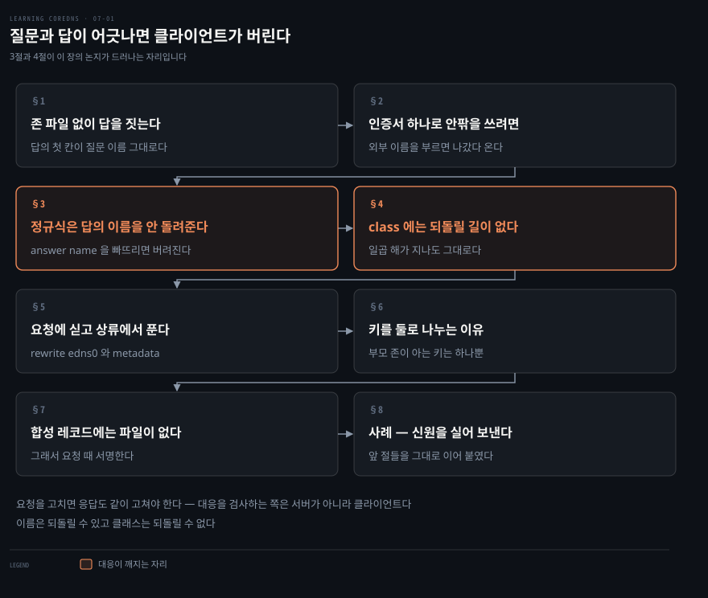
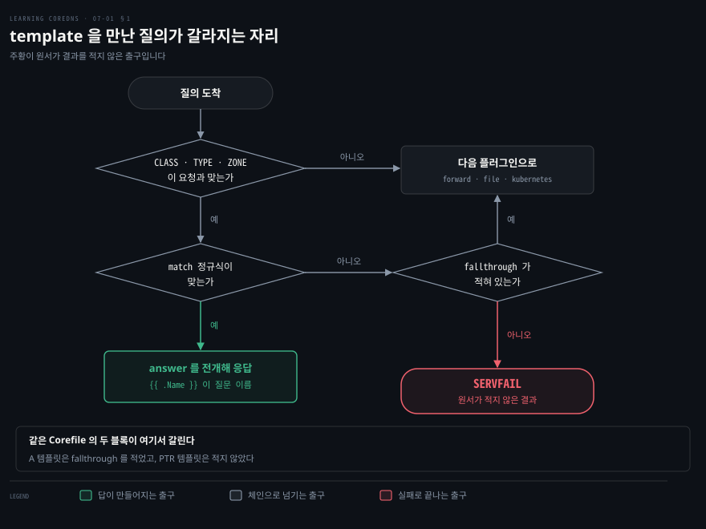
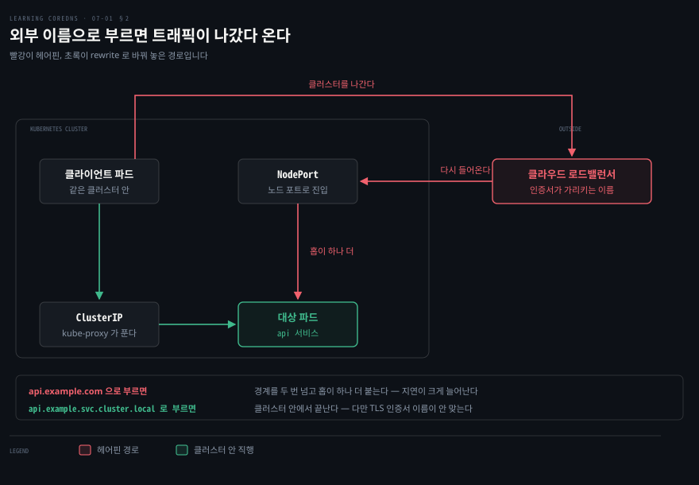
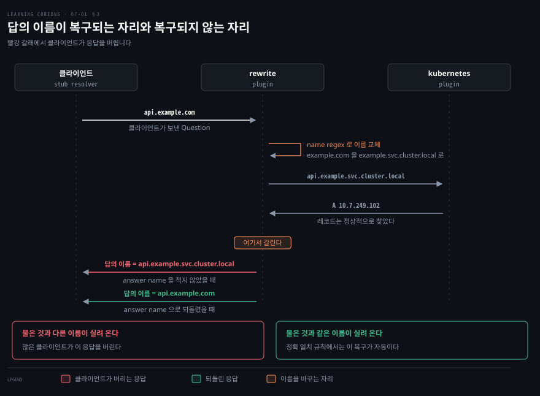
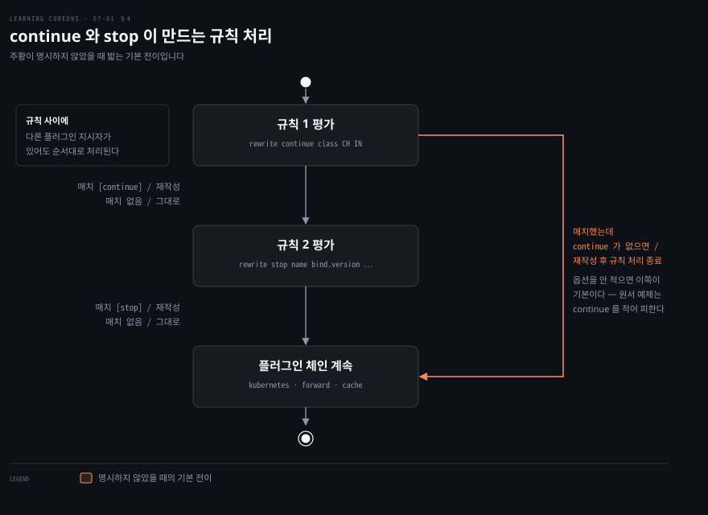
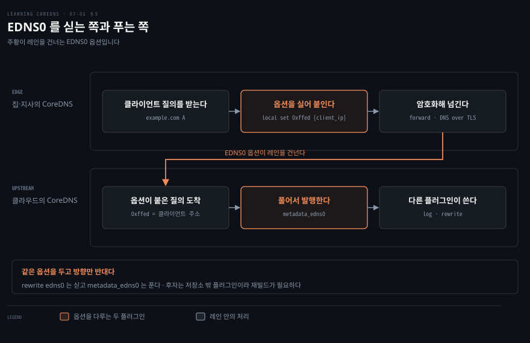
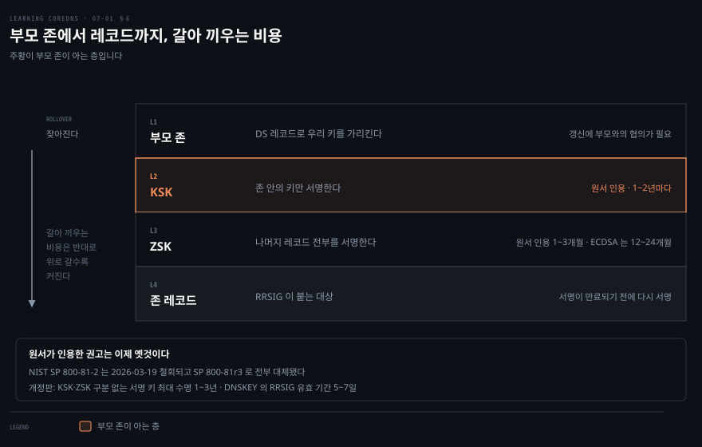
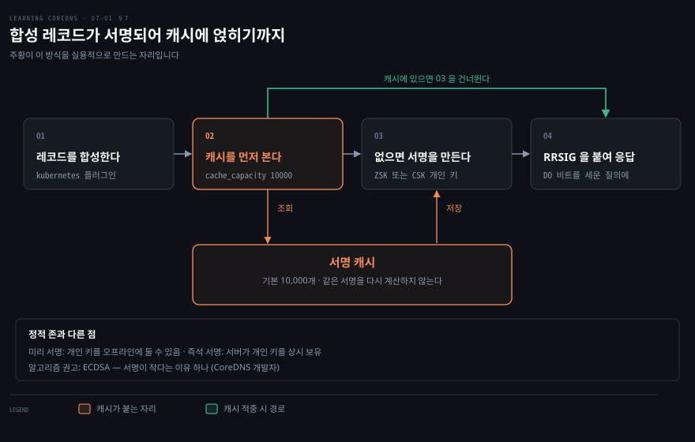
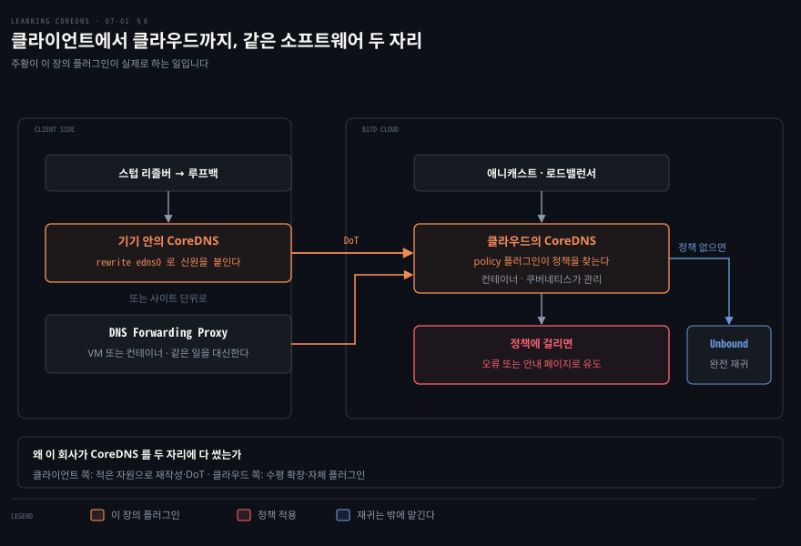

# 질문과 답이 어긋나면 클라이언트가 버린다

---

> 원서 7장은 요청과 응답을 흐르는 중에 고치는 플러그인 넷을 다룹니다. 고치는 힘이 커질수록 질문과 답의 대응이 깨지기 쉬워지고, 그 대응을 검사하는 것은 서버가 아니라 클라이언트입니다.

## 핵심 요약

> 이 편이 매달린 하나의 생각은 **요청을 고치면 응답도 같이 고쳐야 한다**는 것입니다.

클라이언트가 검사하는 것은 답 자체가 아니라 질문과 답의 대응입니다. 저자들이 직접 적습니다. 보안상의 이유로 일부 DNS 리졸버 라이브러리는 응답의 Question 섹션이 자기가 보낸 요청의 Question 섹션과 다르면 그 응답을 거부합니다.

저자들은 이 장을 그렇게 묶지 않습니다. 요청과 응답을 조작하는 데 가장 흔히 쓰이는 플러그인 몇 개를 다룬다고만 적습니다. 위의 한 축은 그 플러그인들을 읽어 낸 이 노트의 구성입니다.

그 축에서 보면 앞의 셋이 나란히 놓입니다. `template` 은 질문에서 답을 지어내므로 대응이 저절로 지켜집니다. `rewrite` 는 질문을 바꾸므로 그 대응을 손으로 복구해야 하고, 복구할 방법이 없는 필드가 하나 있습니다. `metadata` 는 아무것도 고치지 않고 다른 플러그인에 재료만 넘깁니다. 뒤의 `dnssec` 은 다른 문제를 풉니다. 질문과 답의 대응이 아니라 답이 정말 그 존에서 왔는지를 캐시 포이즈닝에 맞서 증명합니다.

가장 값진 것은 정규식 재작성 이야기입니다. 정확히 일치하는 규칙에서는 CoreDNS 가 원래 질문을 자동으로 채워 넣지만 정규식 규칙에서는 그러지 않고, 그 차이 하나가 많은 클라이언트에게 응답을 버리게 만듭니다.


## 학습 목표

이 내용을 읽고 나면:

1. `template` 이 존 파일 없이 답을 만드는 방식과 매칭이 실패했을 때의 행선지를 설명할 수 있습니다.
2. `rewrite name` 의 정확 일치 규칙과 정규식 규칙이 무엇이 다른지, 왜 `answer name` 이 필요한지 말할 수 있습니다.
3. `continue` 와 `stop` 이 규칙 처리 순서를 어떻게 바꾸는지와 `class` 재작성이 남기는 구멍을 설명할 수 있습니다.
4. EDNS0 옵션을 싣고 푸는 두 방향과 `metadata` 의 공급자·소비자 구조를 그릴 수 있습니다.
5. ZSK 와 KSK 를 나누는 이유를 부모 존과 롤오버 비용으로 설명할 수 있습니다.

아래는 이 문서 전체를 읽는 순서로 이은 지도입니다. 1절부터 5절까지가 요청과 응답을 고치는 이야기이고, 6절과 7절이 서명, 8절이 그 둘을 합친 실제 서비스입니다.

절 여덟은 이 노트가 나눈 것입니다. 원서의 상위 절은 다섯이고, 이 노트는 `rewrite` 를 세 절로 펴는 대신 원서가 EDNS0 뒤에 둔 여러 규칙 이야기를 앞으로 당겨 4절에 놓았습니다. 이름 재작성의 함정과 클래스 재작성의 구멍이 한 흐름이기 때문입니다.




## 이 문서가 다루지 않는 것

> 이 편은 원서 7장 전체입니다. 추출 분량이 5,560단어로 6장의 13,804단어에 견주면 40% 수준이라 한 편으로 담았습니다.

- 플러그인 체인이 빌드 때 고정되는 원리 → [플러그인 일곱이면 서버 하나가 선다](./03-02.%ED%94%8C%EB%9F%AC%EA%B7%B8%EC%9D%B8%20%EC%9D%BC%EA%B3%B1%EC%9D%B4%EB%A9%B4%20%EC%84%9C%EB%B2%84%20%ED%95%98%EB%82%98%EA%B0%80%20%EC%84%A0%EB%8B%A4.md)
- `kubernetes` 플러그인이 레코드를 합성하는 방식 → [무엇을 선언했느냐가 레코드 모양을 정한다](./06-01.%EB%AC%B4%EC%97%87%EC%9D%84%20%EC%84%A0%EC%96%B8%ED%96%88%EB%8A%90%EB%83%90%EA%B0%80%20%EB%A0%88%EC%BD%94%EB%93%9C%20%EB%AA%A8%EC%96%91%EC%9D%84%20%EC%A0%95%ED%95%9C%EB%8B%A4.md)
- `ndots:5` 와 검색 경로 → [명세 밖으로 나가면 이식성을 내준다](./06-04.%EB%AA%85%EC%84%B8%20%EB%B0%96%EC%9C%BC%EB%A1%9C%20%EB%82%98%EA%B0%80%EB%A9%B4%20%EC%9D%B4%EC%8B%9D%EC%84%B1%EC%9D%84%20%EB%82%B4%EC%A4%80%EB%8B%A4.md)
- DNSSEC 이론 자체 → 저자들이 《DNS and BIND》 보안 장으로 넘깁니다
- 관측과 문제 진단 → 원서 8장

남는 것은 **요청과 응답이 흐르는 중에 무엇을 고칠 수 있고 그 대가가 무엇인가**입니다.


## 1. 존 파일 없이 답을 짓는 template

> 역방향 존의 PTR 레코드를 손으로 다 적는 일은 규모가 조금만 커져도 불가능해집니다. `template` 은 그것들을 저장하지 않고 요청에서 계산해 냅니다.



주소 하나에 PTR 레코드 하나입니다. `/16` 하나만 해도 65,536 줄이고, 그 줄들은 전부 같은 규칙으로 만들어집니다. 이런 데이터를 파일에 적어 두는 것은 계산할 수 있는 것을 저장하는 일입니다.

`template` 플러그인은 오로지 요청만 보고 답을 지어냅니다. 저자들이 드는 대표 용례가 바로 이 PTR 질의이고, 존 파일에 전부 적지 않고도 답을 낼 수 있게 합니다.

```bash
example.com:5300 in-addr.arpa:5300 {
    # host-a-b-c-d.example.com A 요청을 잡아 a.b.c.d 를 돌려준다
    template IN A example.com {
      match (^|[.])host-(?P<a>[0-9]*)-(?P<b>[0-9]*)-(?P<c>[0-9]*)-(?P<d>[0-9]*)[.]example[.]com[.]$
      answer "{{ .Name }} 60 IN A {{ .Group.a }}.{{ .Group.b }}.{{ .Group.c }}.{{ .Group.d }}"
      fallthrough
    }

    # d.c.b.a.in-addr.arpa PTR 요청을 잡아 host-a-b-c-d.example.com 을 돌려준다
    template IN PTR in-addr.arpa {
      match ^(?P<d>[0-9]*)[.](?P<c>[0-9]*)[.](?P<b>[0-9]*)[.](?P<a>[0-9]*)[.]in-addr[.]arpa[.]$
      answer "{{ .Name }} 60 IN PTR host-{{ .Group.a }}-{{ .Group.b }}-{{ .Group.c }}-{{ .Group.d }}.example.com."
    }
    forward . /etc/resolv.conf
}
```

> **노트의 읽기**: 원서의 이 예제는 긴 줄을 `↵` 로 접어 싣고, 각주에서 그 기호가 실제 Corefile 에는 들어가면 안 된다고 알립니다. 여기서는 접힌 줄을 이어 붙였습니다. 다만 원서에서 `↵` 가 붙은 것은 PTR 블록의 두 줄뿐이고, A 블록의 `match`·`answer` 도 똑같이 접혀 있는데 기호가 없습니다.

읽는 순서는 위에서 아래입니다. 먼저 첫 줄의 `CLASS TYPE ZONE` 이 들어온 요청과 맞는지 봅니다. 그다음 `match` 의 정규식을 검사합니다. 통과하면 `answer` 의 Go 템플릿이 전개되어 응답이 됩니다.

여기서 눈여겨볼 자리가 하나 있습니다. **`answer` 의 첫 칸이 `{{ .Name }}`, 곧 질문 이름 그대로입니다.** 답이 질문에서 만들어지므로 둘의 대응은 지켜질 수밖에 없습니다. 저자들은 이 변수에 아무 무게도 싣지 않고 Go 템플릿 문법으로만 지나가지만, 뒤이어 볼 `rewrite` 가 바로 이 대응을 손으로 지켜야 하는 자리라 대비가 됩니다.

캡처 그룹도 같은 방향으로 씁니다. `(?P<a>[0-9]*)` 처럼 이름을 붙여 잡아 두면 `{{ .Group.a }}` 로 꺼내 쓸 수 있습니다. PTR 쪽 정규식이 `d.c.b.a` 순으로 이름을 붙인 것은 역방향 존의 주소가 뒤집혀 있기 때문이고, 그래서 두 템플릿은 서로의 역함수가 됩니다.

응답 쪽에 놓을 수 있는 항목은 넷입니다.

- `answer`: Answer 섹션에 넣을 레코드
- `additional`: Additional 섹션에 넣을 레코드
- `authority`: Authority 섹션에 넣을 레코드
- `rcode`: 응답 코드

`rcode` 만 쓰면 이름을 막는 데도 쓸 수 있습니다. 저자들이 두 번째 예로 `template IN ANY example.com { rcode NXDOMAIN }` 을 들어 그 도메인 전체를 없는 이름으로 만듭니다. 여기서 `ANY` 는 질의 유형 `ANY` 만 뜻하는 것이 아니라 A·PTR 을 포함한 모든 유형을 뜻한다고 저자들이 각주로 짚어 둡니다.

### 매칭이 안 되면 어디로 가나

이 절에서 가장 조심할 자리입니다. 저자들은 문법을 설명하며 정규식이 조건을 만족하지 않으면 질의가 그냥 넘어간다고 적습니다. 현재 공식 문서는 다르게 적습니다.

> `fallthrough` 없이 `template` 의 ZONE 이 질의 이름과는 맞는데 정규식이 안 맞으면 `SERVFAIL` 응답이 돌아갑니다.[^tmpl]

둘의 차이가 실무에서 큽니다. 위 Corefile 의 A 템플릿에는 `fallthrough` 가 있지만 **PTR 템플릿에는 없습니다.** 그래서 `in-addr.arpa` 안의 이름을 묻는 PTR 질의 중 `d.c.b.a` 꼴이 아닌 것은 아래의 `forward` 로 넘어가지 못하고 `SERVFAIL` 을 받습니다. 첫 줄의 `CLASS TYPE ZONE` 이 먼저 거르므로 다른 유형의 질의는 이 템플릿에 걸리지 않습니다. 원서의 예제가 그 동작을 담고 있는데 원서의 산문은 그것을 말하지 않습니다.

> **노트의 읽기**: 원서 문장과 현재 공식 문서 중 어느 쪽이 1.5 시절의 동작이었는지는 확인하지 못했습니다. 확인한 것은 현재 문서가 `SERVFAIL` 이라고 명시한다는 사실뿐이라, 이 노트는 지금 쓰는 사람 기준으로 적습니다.

> **노트의 읽기**: 문법 블록(Example 7-3)에 실린 `upstream` 은 현재 문법에 없습니다. 3장의 `file`, 6장의 `kubernetes` 와 같은 길입니다. 저자들이 이 옵션의 앞날을 말한 적은 없으므로 원서의 오류가 아니라 그 뒤의 버전 차이입니다. 대신 확장 오류 코드를 붙이는 `ederror` 가 새로 들어왔습니다.[^tmpl]


## 2. 같은 인증서를 쓰려다 트래픽이 밖으로 나갔다 온다

> 클러스터 안의 파드가 자기 클러스터 안 서비스를 외부 이름으로 부르면, 트래픽이 클러스터 밖으로 나갔다가 로드밸런서를 거쳐 되돌아옵니다.



`api.example.com` 이라는 사이트가 쿠버네티스 클러스터 안에서 돌고 있습니다. 이 사이트의 TLS 인증서는 그 이름으로 발급돼 있으므로, 접속하려는 클라이언트는 반드시 그 이름을 써야 사이트의 진위를 확인할 수 있습니다.

문제는 클러스터 **안에서** 접속할 때입니다. 요청이 그 이름을 그대로 따라가면 트래픽이 헤어핀을 그립니다. 클러스터를 나가서 클라우드 로드밸런서를 지나 NodePort 로 되돌아오고, 거기서 요청을 처리할 파드까지 홉이 하나 더 붙기 쉽습니다. 지연이 크게 늘어납니다.

안에서는 클러스터 DNS 이름인 `api.example.svc.cluster.local` 로 닿는 편이 낫습니다. 그러면 인증서 검증이 깨집니다. 인증서에 그 이름을 추가하는 방법이 떠오르지만 저자들이 곧바로 막습니다. 같은 서비스가 개발·테스트·스테이징·운영으로 나뉘거나 리전별로 나뉘어 여러 클러스터에서 돌 수 있고, 클러스터마다 도메인이 다르면 그 이름을 전부 인증서에 넣어야 합니다.

`rewrite` 는 이 문제를 DNS 쪽에서 풉니다. 클라이언트는 `api.example.com` 을 묻고, CoreDNS 가 질의의 Question 섹션을 `api.example.svc.cluster.local` 로 바꿔 처리합니다.

```bash
.:53 {
    errors
    health
    rewrite name api.example.com. api.example.svc.cluster.local.
    kubernetes cluster.local in-addr.arpa ip6.arpa {
      fallthrough in-addr.arpa ip6.arpa
    }
    prometheus :9153
    forward . /etc/resolv.conf
    cache 30
    loop
    reload
    loadbalance
}
```

결과는 두 이름이 같은 주소를 돌려주는 것입니다. 저자들의 표현대로 CNAME 처럼 동작하지만 클라이언트에게는 보이지 않습니다. 클라이언트는 자기가 물은 이름 그대로 답을 받았다고 여깁니다.

`rewrite` 는 CoreDNS 초기에 만들어진 플러그인 중 하나이고, Caddy 의 같은 이름 HTTP 플러그인에서 왔습니다. 고칠 수 있는 것은 요청 쪽에서 질의 레코드 유형·이름·클래스·EDNS0 옵션이고, 응답 쪽에서는 TTL 과 경우에 따라 Answer 섹션 레코드의 도메인 이름입니다.

`FROM` 은 조건입니다. 필드가 무조건 바뀌는 것이 아니라 `FROM` 의 기준에 맞을 때만 바뀝니다. `class` 와 `type` 에서는 그냥 현재 클래스나 유형이고, `name` 과 `ttl` 에서는 `exact`·`suffix`·`prefix`·`substring`·`regex` 중 하나의 한정자와 매칭 표현식이 함께 옵니다. 한정자를 적지 않으면 `exact` 로 봅니다.

> **노트의 읽기**: 원서의 문법 한 줄은 `answer name` 을 인라인 옵션처럼 적고 Example 7-10 은 중괄호 블록으로 씁니다. 처음에는 어긋나 보이지만 둘 다 적법한 표기입니다. 현재 공식 문서가 인라인 한 줄과 블록을 나란히 싣습니다.[^rw] 원서가 요약과 예제에서 다른 표기를 골랐을 뿐입니다.


## 3. 정규식으로 넓히면 질문이 안 돌아온다

> `api` 하나가 아니라 여러 서비스에 같은 동작을 주려면 정규식 규칙으로 넓혀야 합니다. 넓히는 순간 CoreDNS 가 대신 해 주던 복구가 사라집니다.



정규식 규칙은 이렇게 씁니다. `rewrite name regex ^([^\.]*)\.example\.com\.$ {1}.example.svc.cluster.local.` 이면 `example.com` 아래 한 단계 이름 전부가 대상이 됩니다.

돌려 보면 문제가 눈에 띕니다. 물은 것은 `api.example.com` 인데 돌아온 것은 `api.example.svc.cluster.local` 입니다. 이 규칙이 걸린 상태에서 서버가 돌려주는 응답의 Question 섹션에는 클라이언트가 보낸 것과 다른 도메인 이름이 들어 있습니다.

이것이 이 편의 제목입니다. 저자들이 이유를 적습니다. 보안상의 이유로 일부 DNS 리졸버 라이브러리는 응답의 Question 섹션이 자기가 보낸 요청의 Question 섹션과 맞지 않으면 그 응답을 서버로부터 거부합니다. 이 설정에서는 많은 클라이언트가 응답을 버립니다.

앞의 정확 일치 규칙에서는 이런 일이 없었습니다. **`rewrite` 플러그인이 원래 질문을 자동으로 채워 넣었기 때문입니다.** 정규식 규칙에서는 자동으로 하지 않으므로 `answer name` 옵션을 직접 써야 합니다.

```bash
rewrite {
    name regex ^([^\.]*)\.example\.com\.$ {1}.example.svc.cluster.local.
    answer name ^([^\.]*)\.example\.svc\.cluster\.local\.$ {1}.example.com.
}
```

`answer name` 의 정규식은 나가는 쪽 규칙을 거꾸로 세운 것입니다. 들어올 때 `example.com` 을 `example.svc.cluster.local` 로 바꿨으니, 나갈 때는 그 반대로 바꿔 클라이언트가 물은 이름을 되돌려 놓습니다.

세 설정을 나란히 두면 이렇습니다.

| 설정 | 물은 이름 | 응답에 실린 이름 | 클라이언트 |
|------|----------|----------------|-----------|
| `name` 정확 일치 | `api.example.com` | `api.example.com` | 받습니다 |
| `name regex` 만 | `api.example.com` | `api.example.svc.cluster.local` | 상당수가 버립니다 |
| `name regex` + `answer name` | `api.example.com` | `api.example.com` | 받습니다 |

없는 이름을 물으면 그대로 없는 이름입니다. `bar.example.com` 은 `bar.example.svc.cluster.local` 로 번역되고 그런 서비스가 없으므로 `NXDOMAIN` 이 돌아옵니다. 사용자가 처음부터 클러스터 이름을 직접 친 것과 같은 결과입니다.

> **노트의 읽기**: 현재 공식 문법에는 `answer` 가 셋으로 늘어 있습니다.[^rw] 이름을 되돌리는 `answer name` 에 더해, 최선의 노력으로 자동 복구를 시도하는 `answer auto` 와 `CNAME`·`SRV` 같은 레코드의 값 쪽을 고치는 `answer value` 가 있습니다. 원서 시절에는 `answer name` 하나뿐이었습니다.


## 4. 규칙 여럿을 잇는 법과 class 의 구멍

> 기본값은 첫 규칙이 맞으면 거기서 멈추는 것입니다. 여러 규칙이 같은 질의에 걸리게 하려면 `continue` 를 명시해야 하고, 그렇게 이어 붙였을 때 되돌릴 수 없는 필드가 하나 드러납니다.



앞 두 절은 규칙 하나로 끝나는 이야기였습니다. 그런데 클래스도 바꾸고 이름도 바꾸려면 규칙이 둘 필요합니다. 두 줄을 나란히 적어 두면 둘째 줄이 걸리지 않는데, 그 이유가 기본값에 있습니다.

한 서버 블록에 `rewrite` 규칙을 여럿 적을 수 있습니다. 기본 동작은 처음 맞는 규칙 하나를 적용하고 규칙 처리를 끝내는 것입니다. `continue` 를 붙이면 그 규칙을 적용한 뒤 다음 규칙으로 넘어갑니다.

저자들이 드는 예가 두 줄짜리입니다.

```bash
rewrite continue class CH IN
rewrite stop name bind.version dns-version.cluster.local
```

ChaosNet 클래스로 `bind.version` 의 TXT 를 묻는 오래된 관행을, 쿠버네티스 DNS 버전 TXT 레코드로 받아 주려는 설정입니다. 첫 규칙이 클래스를 `CH` 에서 `IN` 으로 바꾸고 `continue` 이므로 처리가 이어집니다. 둘째 규칙이 이름을 바꾸고 `stop` 이므로 거기서 끝납니다.

규칙 사이에 다른 플러그인 지시자가 끼어 있어도 상관없습니다. 서버 블록 안의 `rewrite` 규칙들은 적힌 순서대로 차례차례 처리됩니다.

돌려 보면 세 질의 중 마지막 하나가 경고를 냅니다. `host -t txt -c ch bind.version.` 이 메시지 파서가 잘못된 패킷을 보고했다는 경고와 함께 답을 내놓습니다. **답의 클래스가 질문의 클래스와 맞지 않기 때문입니다.**

여기서 이 장의 논지가 두 번째로, 이번에는 해결책 없이 나타납니다. 저자들이 그대로 적습니다. 안타깝게도 CoreDNS 는 클래스 재작성에 대해서는 `answer name` 옵션에 해당하는 것을 제공하지 않습니다.

이름은 되돌릴 수 있고 클래스는 되돌릴 수 없습니다. 그래서 `class` 재작성은 클라이언트가 관대할 때만 쓸 수 있는 도구입니다. 위 예제의 `host` 는 경고를 내면서도 답을 보여 주지만, 더 엄격한 리졸버 라이브러리라면 같은 응답을 버립니다.

> **노트의 읽기**: 현재 공식 문서에도 클래스 응답을 되돌리는 옵션은 없습니다.[^rw] 일곱 해가 지나도록 이 구멍은 그대로입니다. 대신 고칠 수 있는 필드가 다섯에서 일곱으로 늘어, 응답 코드를 바꾸는 `rcode` 와 CNAME 대상 이름을 바꾸는 `cname` 이 붙었습니다.

> **노트의 읽기**: 원서 출력의 `"1.0.1"` 은 CoreDNS 가 구현한 쿠버네티스 DNS 명세의 판번호입니다. 그 명세는 지금 1.1.0 이고, 명세 자신이 `dns-version.cluster.local. 28800 IN TXT "1.1.0"` 을 예로 싣습니다.[^k8sspec] 이 값을 버전 확인에 쓰고 있다면 클러스터마다 다를 수 있습니다.


## 5. 요청에 정보를 실어 보내고 상류에서 풀어 읽는다

> EDNS0 는 DNS 요청과 응답에 추가 옵션을 실을 수 있게 합니다. `rewrite` 로 그 옵션을 채워 넣고, 상류에서 `metadata` 로 풀어 읽는 왕복이 이 절의 그림입니다.



DNS 메시지 자체에는 누가 물었는지를 알려 주는 자리가 없습니다. 출발지 IP 로 짐작할 수는 있지만 DHCP 로 바뀌거나 NAT 뒤에서 여럿이 공유하면 그 IP 는 사람과 이어지지 않습니다.

RFC 6891 이 정의한 EDNS0 가 그 빈 자리입니다. 요청과 응답에 옵션을 덧붙일 수 있게 하고, `rewrite` 플러그인이 그 옵션을 다룹니다.

```bash
rewrite [continue|stop] edns0 TYPE [set|replace|append] TYPE-FIELDS
```

액션 셋이 서로 다릅니다.

- `set`: 옵션을 지정한 값으로 놓습니다. 없으면 만들고 있으면 덮어씁니다.
- `replace`: 이미 있을 때만 고칩니다. 새로 만들지 않습니다.
- `append`: 이미 있어도 항상 하나 더 붙입니다. 반복 가능한 옵션에 씁니다.

`set` 과 `replace` 의 매칭 기준은 EDNS0 옵션 코드입니다. 현재 문서에는 옵션을 지우는 `unset` 이 하나 더 있어 넷입니다.[^rw]

`TYPE` 은 셋입니다. `subnet` 은 EDNS Client Subnet 옵션을 설정합니다. `rewrite edns0 subnet set 24 64` 라고 쓰면 클라이언트 출발지 IP 의 앞 24비트 또는 64비트를 각각 IPv4·IPv6 에 대해 옵션 값으로 씁니다. 상류 DNS 서버가 그 서브넷을 보고 응답을 달리 줄 수 있고, 이 동작은 RFC 7871 이 정의합니다.

`nsid` 는 서버 식별자이고, `local` 이 가장 자유로운 자리입니다. 옵션 코드와 데이터 두 필드를 받는데, 데이터에 변수를 쓸 수 있습니다.

```bash
rewrite edns0 local set 0xffaa some-value
rewrite edns0 local set 0xffab 0xaabbccdd
rewrite edns0 local set 0xffac {client_ip}
rewrite edns0 local set 0xffad {protocol}
```

쓸 수 있는 변수는 일곱입니다.

- `{qname}`: 질문 이름
- `{qtype}`: 질문 유형
- `{client_ip}`: 클라이언트 출발지 IP 주소
- `{client_port}`: 클라이언트 출발지 포트
- `{protocol}`: 요청에 쓰인 프로토콜
- `{server_ip}`: 요청을 받은 서버의 IP 주소
- `{server_port}`: 요청을 받은 서버의 포트

저자들이 이 기능의 자리를 엣지 배치라고 짚습니다. 집이나 지사에서 지역 기기에 DNS 를 제공하는 배치입니다. EDNS0 규칙을 걸어 두면 상류 네임서버가 그 배치의 위치 정보를 받아 응답을 조정할 수 있습니다.

### metadata 는 아무것도 고치지 않습니다

`metadata` 플러그인은 요청도 응답도 건드리지 않습니다. 대신 **다른 플러그인이 요청에 대한 데이터를 만들어 서로 주고받을 수 있게** 합니다.

켜 두면 체인의 각 플러그인이 요청을 먼저 슬쩍 들여다봅니다. 거기서 무언가를 계산하거나 조회해 다른 플러그인이 쓰도록 발행할 수 있습니다. 발행하는 쪽이 공급자이고 쓰는 쪽이 소비자이며, 한 플러그인이 둘 다일 수 있습니다.

`metadata_edns0` 가 이 절의 왕복을 닫는 조각입니다. CoreDNS 조직 안에 있지만 저장소에 들어 있지도 기본 컴파일되지도 않는 외부 플러그인이고, 하는 일이 `rewrite edns0` 의 정확한 역방향입니다. EDNS0 옵션을 풀어 metadata 값으로 만들어, 로그에 남기거나 다른 재작성에 다시 쓰게 합니다.

```bash
metadata_edns0 {
       client_id 0xffed address
       group_id 0xffee hex 16
}
```

`0xffed` 를 IP 주소로 읽어 `{/metadata_edns0/client_id}` 라는 이름으로 발행하고, `0xffee` 의 16바이트를 16진 문자열로 인코딩해 `{/metadata_edns0/group_id}` 로 내놓습니다.

가장 단순한 용례가 저자들의 예입니다. 엣지 배치의 CoreDNS 에서 사이트를 뜻하는 EDNS0 옵션을 붙이고, 상류 CoreDNS 에서 그것을 풀어 로그에 남기면 질의가 어느 사이트에서 오는지 쉽게 알 수 있습니다.

> **노트의 읽기**: 저자들이 이 절에서 앞날을 넷 말합니다. `trace`·`template` 을 소비자로, `dnstap` 은 "아마도" 소비자로, `kubernetes` 를 공급자로 꼽았습니다. 넷 중 하나는 예고가 아니라 이미 일어난 일입니다. `kubernetes` 공급자화는 저자들이 같은 절의 각주에 1.5.1 이 그것을 넣었다고 적어 뒀고, 지금은 아홉 개 키를 발행하며 클라이언트 파드의 네임스페이스·이름·라벨까지 들어 있습니다.[^k8smeta] `template` 은 `.Meta` 함수로 소비자가 됐고[^tmpl] `dnstap` 은 `EXTRA` 필드에서 다른 플러그인의 metadata 를 쓸 수 있습니다.[^dnstap] 남은 `trace` 는 소비자로 문서화되지 않았고 대신 발행자로 등재됐습니다 — `trace/traceid` 를 내놓습니다.[^trace] 저자들이 마지막에 말한 `firewall` 플러그인도 나왔습니다. CoreDNS 조직의 `policy` 저장소가 그것을 제공하고, Infoblox 의 Themis 와 OPA 를 정책 엔진으로 붙일 수 있습니다.[^policy]

> **원문 정오**: `metadata_edns0` 를 소개하는 문장의 `(i.e,` 는 `i.e.,` 의 오식입니다.


## 6. 키를 둘로 나누는 이유는 부모 존에 있다

> DNSSEC 이 키 쌍을 둘 쓰는 이유는 암호학이 아니라 운영에 있습니다. 자주 갈아야 하는 키와, 갈 때마다 남에게 알려야 하는 키를 분리하는 것입니다.



여기까지 다섯 절은 응답을 지어내고 고치는 이야기였습니다. 그런데 그렇게 만들어 낸 답이 진짜 그 존에서 온 것인지 받는 쪽은 알 수 없습니다. 재귀 서버의 캐시에 가짜 레코드를 물리는 공격, 이를테면 Kaminsky 공격이 노리는 자리가 바로 그 빈틈입니다.

DNSSEC 이 그 빈틈을 메웁니다. 존 관리자가 레코드에 암호로 서명하게 하고, 재귀 DNS 서버 관리자가 그 서명을 검증하도록 설정하게 합니다.

CoreDNS 를 `auto` 나 `file` 플러그인으로 주 서버로 돌린다면 존 데이터 파일은 직접 서명해야 합니다. 서명 도구는 CoreDNS 에 들어 있지 않고, 저자들은 BIND 9 배포판의 `dnssec-keygen` 과 `dnssec-signzone` 을 씁니다.

첫 실행이 ZSK, 곧 존 서명 키 쌍을 만듭니다. 이 쌍의 개인 키가 존의 모든 레코드를 서명하고 공개 키가 그것들을 검증합니다.

```bash
dnssec-keygen -a ECDSAP256SHA256 foo.example
```

```bash
Generating key pair.
Kfoo.example.+013+50136
```

두 번째 실행에 `-f KSK` 를 붙이면 KSK, 곧 키 서명 키 쌍이 나옵니다. KSK 의 개인 키는 존 안의 키만 서명합니다.

여기서 왜 둘인가에 대한 답이 나옵니다. 많은 레코드를 자주 서명하는 키는 정기적으로 갈아 끼워야 합니다. 그런데 **부모 존도 우리 키에 대한 정보를 자기 존에 넣고 있어야 합니다.** ZSK 를 갈 때마다 부모 존에 알리는 것은 번거로운 일입니다. 그래서 키만 서명하는, 따라서 서명하는 데이터가 훨씬 적은 KSK 를 하나 더 두고 부모 존은 그 키만 알게 합니다.

알고리즘은 `ECDSAP256SHA256` 을 씁니다. 서명이 작게 나오기 때문입니다. RSA 계열도 쓸 수 있고 DNSSEC 검증을 하는 대부분의 DNS 서버 구현과의 호환성에는 그쪽이 낫지만 서명이 길어집니다. 저자들이 각주에서 NSEC3 는 CoreDNS 가 지원하지 않으니 고르지 말라고 못 박습니다.

나머지 절차는 세 단계입니다.

1. 두 키 파일에서 DNSKEY 레코드를 꺼내 존 데이터 파일에 붙입니다. 파일 이름은 `dnssec-keygen` 이 찍어 준 기준 이름에 `.key` 를 붙인 것입니다.
2. `dnssec-signzone -o foo.example db.foo.example` 로 서명합니다.
3. 나온 `.signed` 파일을 `file` 플러그인으로 읽힙니다.

결과 파일은 원래 레코드에 DNSKEY 둘과 RRSIG 서명들이 더해진 것이라 훨씬 깁니다.

읽힌 결과는 DNSSEC OK 비트를 세운 질의에 서명과 나머지 DNSSEC 레코드를 함께 돌려주는 것입니다. 저자들이 `dig soa foo.example. +dnssec +norec` 출력을 실어 SOA 와 NS 옆에 RRSIG 이 따라붙은 모습을 보입니다.

> **원문 정오**: 그 출력의 캡션이 `Example 7-24. Hello World in Python` 입니다. 파이썬은 이 장 어디에도 나오지 않고 블록 내용은 `dig` 출력입니다. 다른 예제 캡션을 만들다 남은 자리표시자로 보입니다.

서명을 갱신하는 일과 키를 갈아 끼우는 일은 그다음부터 사용자 몫입니다. 저자들이 분명히 적습니다. 안타깝게도 CoreDNS 는 그 부분을 돕지 않습니다. 다만 문장을 거기서 끊지 않고 대안을 바로 붙입니다. OpenDNSSEC 과 BIND 배포판의 도구가 도울 수 있다는 것입니다.

> **노트의 읽기**: 원서가 서명 전 존 파일(Example 7-17)에 `$TTL` 을 두지 않았고, 그래서 `dnssec-signzone` 이 RFC1035 TTL 의미를 쓴다는 경고를 냅니다. 원서는 이 경고를 설명하지 않습니다. RFC1035 는 SOA 의 MINIMUM 필드를 존의 기본 TTL 로 정의했는데, RFC2308 이 그것을 부정 캐싱 TTL 로 다시 정의하면서 기본 TTL 은 `$TTL` 지시자가 맡게 됐습니다. 다만 인쇄된 파일의 MINIMUM 은 600 인데 서명된 출력의 TTL 은 전부 3600 이라, 실린 파일만으로는 실린 출력이 설명되지 않습니다.

> **원문 정오**: 키 롤오버 사이드바가 NIST 를 `National Institutes of Standards and Technology` 로 적습니다. 공식 명칭은 단수형 `National Institute of Standards and Technology` 이고, 인용된 간행물 자신이 그렇게 적습니다.

인용된 권고 자체도 이제 옛것입니다. 저자들이 KSK 1~2년, ZSK 1~3개월로 소개한 수치는 NIST SP 800-81-2 의 것이 맞습니다. 그 문서의 체크리스트 30번이 그대로 그 두 수를 적습니다.[^nist2] 다만 저자들이 함께 옮기지 않은 단서가 붙어 있습니다. ZSK 는 안정성을 위해서나 키 길이가 충분하다면 더 오래 써도 된다는 조건입니다.

> **노트의 읽기**: 같은 문서의 표 9-1 이 그 단서를 알고리즘별로 구체화해 둡니다.[^nist2] ZSK 의 1~3개월은 **RSA 1024비트** 줄의 값이고, `ECDSA` P-256·P-384 줄은 ZSK 에도 12~24개월을 줍니다. 문서 본문이 그 이유를 적습니다. 타원곡선은 같은 강도를 더 작은 키로 내므로 ZSK 를 KSK 와 같은 크기로 두고 더 긴 주기를 쓸 수 있다는 것입니다. **원서 예제가 고른 알고리즘이 바로 `ECDSAP256SHA256` 입니다.** 인용된 문서 기준으로도 그 예제의 ZSK 에 1~3개월은 해당하지 않습니다.

그리고 그 문서는 **2026년 3월 19일에 철회되어 SP 800-81r3 로 전부 대체됐습니다.**[^nist2] 개정판은 KSK 와 ZSK 를 나눈 주기를 버리고, DNSSEC 서명 키의 권장 최대 수명을 1~3년 하나로 둡니다. 대신 강조점을 RRSIG 유효 기간으로 옮겨, DNSKEY 의 RRSIG 유효 기간을 5~7일처럼 짧게 유지하라고 적습니다.[^nist3] 저자들이 함께 인용한 RFC 4641 도 RFC 6781 로 폐기됐습니다.[^rfc4641]

개정판의 저자 목록에 Cricket Liu 가 들어 있습니다. 이 책의 공저자와 같은 이름입니다.[^nist3]


## 7. 합성한 레코드에는 서명할 존 파일이 없다

> `kubernetes` 플러그인이 만드는 레코드는 어느 파일에도 적혀 있지 않습니다. 미리 서명해 둘 대상이 없으므로 서명을 요청 때 만들어야 합니다.



6절의 절차는 정적인 존 데이터 파일을 전제합니다. 그런데 이 책의 5장과 6장이 보여 준 CoreDNS 의 쓸모는 정반대 쪽에 있었습니다. etcd 의 등록에서, 쿠버네티스의 선언에서 레코드를 그때그때 만들어 내는 것이었습니다. 그런 레코드에는 서명해 둘 파일이 없습니다.

`dnssec` 플러그인이 그 자리를 메웁니다. CoreDNS 가 응답으로 합성한 자원 레코드를 즉석에서 서명합니다.

```bash
dnssec [ZONES...] {
    key file KEY...
    cache_capacity CAPACITY
}
```

`ZONES` 는 즉석 서명할 존입니다. 늘 그렇듯 적지 않으면 그 서버 블록의 모든 존이 서명됩니다. `key file` 은 암호 키를 읽어 올 키 파일 이름이고, CoreDNS 는 그 키가 `dnssec-keygen` 으로 만들어졌기를 기대합니다. 6절에서 그 도구를 먼저 보인 이유가 여기 있습니다. 파일 이름은 기준 이름을 주거나 `.key`·`.private` 중 아무 쪽 이름을 줘도 됩니다.

키를 KSK 와 ZSK 로 둘 다 설정하면 CoreDNS 가 DNSKEY 레코드는 KSK 개인 키로, 나머지 전부는 ZSK 개인 키로 서명합니다. KSK 플래그가 없는 키 하나만 설정하면 그것을 공통 서명 키(CSK)로 보고 모든 레코드를 그 키로 서명합니다.

`cache_capacity` 는 이 플러그인이 만든 서명을 저장하는 캐시 크기입니다. 특정 합성 레코드의 서명을 한 번 만들면 저장해 두었다가 같은 서명을 다시 계산하지 않습니다. 기본값은 서명 10,000개입니다.

```bash
cluster.local {
    kubernetes
    dnssec {
            key file Kcluster.local+013+47746
        }
}
```

이 캐시가 즉석 서명의 실질적인 조건입니다. 서명 연산은 조회 한 번마다 하기에는 비싸고, 합성 레코드는 종류가 유한하므로 캐시가 잘 듣습니다. 알고리즘으로 ECDSA 를 권하는 이유도 같은 줄에 있습니다. 서명이 작아 계산과 응답 크기가 함께 줄어듭니다.

> **원문 정오**: 위 예제의 키 파일 이름 `Kcluster.local+013+47746` 에는 존 이름 뒤의 점이 빠져 있습니다. `dnssec-keygen` 이 실제로 내놓는 이름은 같은 장의 Example 7-18·7-19 출력처럼 `Kfoo.example.+013+50136` 꼴이므로, 여기서는 `Kcluster.local.+013+47746` 이어야 합니다.

> **노트의 읽기**: 현재 공식 문서는 갈림을 반대 방향에서 못 박습니다.[^dnssec] 분리 모드 조건을 좁혀 SEP 비트가 켜진 키와 꺼진 키가 **둘 다** 있을 때만 ZSK/KSK 로 나눠 서명하고, 나머지 전부를 CSK 로 넓혔습니다. 원서의 CSK 는 KSK 플래그 없는 단일 키 하나뿐이었는데, 현재 규칙에서는 KSK 플래그가 켜진 단일 키도 CSK 입니다. 키를 읽어 올 곳으로 `aws_secretsmanager` 도 생겼고, 부재 증명은 NSEC3 대신 NSEC black lies 로 합니다. NSEC3 미지원은 원서 각주 그대로입니다.


## 8. 사례 — 신원을 요청에 실어 보내는 서비스

> Infoblox 의 BloxOne Threat Defense 는 이 장의 조각들을 그대로 이어 붙인 서비스입니다. 클라이언트 쪽 CoreDNS 가 요청에 신원을 싣고, 클라우드 쪽 CoreDNS 가 그것을 읽어 정책을 적용합니다.



문제는 회사 밖으로 나간 직원의 DNS 입니다. 사내에서는 Response Policy Zone 으로 악성 도메인의 해석을 막고 악성 IP 로 가는 응답을 걸러 낼 수 있었습니다. 그런데 재택이나 출장 중인 직원은 대개 DHCP 가 할당해 준 DNS 서버를 쓰고, 그 서버에는 회사가 공들여 세워 둔 RPZ 설정이 없습니다.

B1TD 는 그 보호를 클라우드로 옮긴 재귀 DNS 서비스입니다. 회사가 직원 기기에 해석 정책을 적용하고, 직원이 사내망 밖에 있을 때도 DNS 활동을 볼 수 있게 합니다.

첫 난관이 누가 물었는지 알아내는 일입니다. 기본적으로 DNS 메시지에는 개인을 식별할 정보가 없습니다. 출발지 IP 로 알 수 있을 때도 있지만 DHCP 로 동적으로 배정되거나 NAT 뒤에서 여럿이 하나를 쓰면 그 IP 는 신원과 이어지지 않습니다.

풀이가 5절 그대로입니다. 클라이언트의 스텁 리졸버를 루프백 주소에서 도는 CoreDNS 로 향하게 하고, 그 CoreDNS 가 `rewrite` 플러그인으로 EDNS0 옵션을 붙입니다. 옵션에는 MAC 주소·IP 주소·소속 조직 같은 클라이언트 식별 정보와 사용자 로그인 이름이 들어갑니다.

여기서 한 가지가 더 따라옵니다. **덧붙인 정보가 민감한 개인 데이터이므로 그대로 평문으로 보낼 수 없습니다.** 그래서 `forward` 플러그인의 DNS over TLS 지원으로 전달 경로를 암호화합니다. 한 사이트에서 여러 클라이언트가 붙는 경우에는 VM 이나 컨테이너로 도는 DNS Forwarding Proxy 를 두는데, 이것도 같은 일을 하는 CoreDNS 입니다.

클라우드 쪽에서는 CoreDNS 의 작은 자원 소모가 배치 방식을 정합니다. 로드밸런서 뒤에 인스턴스를 많이 두고 부하에 따라 빠르게 띄우고 내릴 수 있습니다. 저자들의 괄호 표현대로 컨테이너로 돌고 쿠버네티스가 관리합니다.

정책 판단은 `policy` 플러그인이 맡습니다. 질의의 속성, 곧 클라이언트 신원과 있다면 사용자 신원, 조회하는 도메인 이름과 요청 유형을 받아 적용할 정책 집합을 찾습니다. 걸리는 정책이 없으면 CoreDNS 가 완전 재귀를 지원하는 Unbound 인스턴스로 질의를 넘깁니다. 걸리는 정책이 있으면 오류를 돌려주거나 안내 페이지의 도메인 이름 또는 IP 로 유도합니다.

이 구조가 1장의 이야기와 맞물립니다. CoreDNS 는 완전 재귀 해석기가 아닙니다. 그래서 재귀는 Unbound 에 맡기고, 자기는 플러그인 체인으로 요청을 해석하고 응답을 조작하는 일을 맡습니다.

같은 소프트웨어가 두 자리에서 다른 일을 합니다. 클라이언트에서는 자원을 거의 쓰지 않으면서 질의를 재작성하고 TLS 로 전달합니다. 클라우드에서는 쿠버네티스로 수평 확장하며 자체 플러그인으로 기능을 넓힙니다.

> **노트의 읽기**: 이 사례 연구의 주인공 회사에 이 책의 공저자 한 명이 몸담고 있습니다. 6절에서 본 NIST SP 800-81r3 은 Cricket Liu 를 공저자로 올리면서 소속을 Infoblox 로 적습니다.[^nist3] 사례 자체의 기술 내용은 이 장의 다른 절들과 앞뒤가 맞지만, 이 장은 그 관계를 밝히지 않습니다.

> **원문 정오**: RPZ 설명 문장의 `the RPZ configuration the their employer had painstakingly set up` 에 `the their` 라는 중복이 있습니다.


## 심화 학습

> 원서 밖에서 확인하거나 이어 붙인 것들입니다. 공식 문서를 근거로 삼은 자리에는 각주를 달고, 앞 절들에서 이미 확인한 사실을 잇는 자리는 그렇게 밝힙니다.

**`template` 의 매칭 실패가 `SERVFAIL` 이 되는 문제**는 실무에서 조용히 나타납니다. 역방향 존 하나를 `template` 으로 덮으면 그 존 안의 모든 이름이 이 플러그인을 지나게 되고, 정규식이 좁으면 나머지 전부가 실패 응답을 받습니다. `fallthrough` 를 붙일지 정규식을 넓힐지는 그 존을 다른 무엇이 함께 서비스하느냐로 갈립니다.

**EDNS Client Subnet 은 사생활과 맞바꾸는 기능입니다.** RFC 7871 은 「Privacy Note」 절을 따로 두고, 사생활 보호를 위해 IPv4 는 24비트로, IPv6 는 56비트로 자르라고 강하게 권합니다.[^rfc7871] 원서의 `rewrite edns0 subnet set 24 64` 에서 앞의 24 는 그 권고와 같지만 **뒤의 64 는 권고보다 16비트 넓습니다.** 같은 RFC 가 이 기능을 기본으로 꺼 두고 이득이 분명할 때만 켜라고도 적습니다. B1TD 사례처럼 `local` 옵션으로 로그인 이름까지 실어 보내는 설계라면 전송 구간 암호화가 선택이 아니라 조건이 됩니다.

**즉석 서명과 미리 서명은 신뢰 모델이 다릅니다.** 이것은 6절과 7절에서 각각 확인한 사실을 잇는 이 노트의 읽기입니다. 미리 서명하면 개인 키가 `dnssec-signzone` 을 돌리는 순간에만 필요하므로 오프라인에 둘 수 있습니다. 즉석 서명은 서버가 `key file` 로 개인 키를 계속 들고 있어야 하므로, 서버가 뚫리면 키도 함께 뚫립니다. 원서는 이 차이를 말하지 않습니다.

**`dnssec` 플러그인의 부재 증명 방식**도 알아 둘 값이 있습니다. 현재 문서는 NSEC black lies 로 구현했다고만 적습니다.[^dnssec] 이름 자체를 미리 알 수 없는 합성 레코드 환경에서는 존 전체를 훑어 표준 NSEC 체인을 만들 수 없으니, 질의받은 이름 주위만 덮는 NSEC 을 그때그때 지어 답한다는 뜻으로 읽었습니다. 원서에는 이 방식에 대한 서술이 없습니다.


## 결정 치트시트

> 이 장의 도구를 언제 고르는지와 그 대가입니다.

| 하고 싶은 일 | 도구 | 대가와 주의 |
|-------------|------|------------|
| 규칙으로 만들어지는 레코드를 파일에 안 적기 | `template` | 매칭 실패가 `fallthrough` 없으면 `SERVFAIL` · 존을 통째로 가로챕니다 |
| 이름 하나를 다른 이름으로 바꾸기 | `rewrite name` 정확 일치 | 질문 복구가 자동 · 이름 수만큼 규칙이 늘어납니다 |
| 이름 여럿을 한 규칙으로 바꾸기 | `rewrite name regex` | 질문 복구가 안 됨 · `answer name` 을 반드시 짝지어야 합니다 |
| 클래스 바꾸기 | `rewrite class` | 되돌릴 방법 없음 · 관대한 클라이언트에서만 씁니다 |
| 여러 규칙을 같은 질의에 걸기 | `continue` | 기본은 `stop` · 서버 블록 안 적힌 순서대로 처리됩니다 |
| 요청에 위치·신원 싣기 | `rewrite edns0` | 민감 정보면 전송 구간 암호화가 필요합니다 |
| 그 옵션을 상류에서 읽기 | `metadata` + `metadata_edns0` | 후자는 외부 플러그인이라 재빌드가 필요합니다 |
| 정적 존에 서명하기 | `dnssec-signzone` + `file` | 재서명과 롤오버가 전부 사용자 몫입니다 |
| 합성 레코드에 서명하기 | `dnssec` 플러그인 | 서버가 개인 키를 상시 보유 · NSEC3 미지원 |


## 적용 관점

> Spring 애플리케이션을 쿠버네티스에 올려 두고 이 장을 읽는다면 걸리는 자리가 둘입니다.

**첫째는 2절의 헤어핀입니다.** Spring 애플리케이션이 `RestClient` 나 `WebClient` 로 사내 API 를 `https://api.example.com` 으로 부르고 있다면, 같은 클러스터 안에 그 API 가 있어도 트래픽이 밖으로 나갔다 옵니다.

코드에서 호스트를 클러스터 이름으로 바꾸면 TLS 인증서 검증이 깨집니다. 프로파일마다 다른 호스트를 두면 설정이 갈라집니다. `rewrite name` 은 이 선택을 코드 밖으로 빼냅니다. 애플리케이션은 한 이름만 알고, 어디서 도는지는 CoreDNS 가 압니다.

**둘째는 JVM 의 DNS 캐시입니다.** `rewrite ttl` 로 CoreDNS 가 TTL 을 낮춰도 JVM 이 그 값을 무시하면 소용이 없습니다. 공식 문서에 따르면 성공한 이름 조회의 캐시 정책은 `networkaddress.cache.ttl` 보안 속성이 정하고 `-1` 은 영원히 캐시하라는 뜻입니다.[^jvmdns]

기본값은 상황에 따라 갈립니다. 보안 관리자가 설치돼 있으면 영원히 캐시하고, 없으면 구현이 정하는 유한한 기간입니다. 다만 보안 관리자는 최근 JDK 에서 기본으로 꺼져 있어 실무에서 밟는 쪽은 뒤의 가지입니다. 실패한 조회는 `networkaddress.cache.negative.ttl` 이 맡으며 기본이 10초입니다.

같은 문서에 속성이 하나 더 있습니다. `networkaddress.cache.stale.ttl` 은 TTL 이 지난 뒤 재조회가 실패했을 때 낡은 이름을 얼마나 더 쓸지를 정합니다.[^jvmdns] 실패보다 낡은 답이 나은 상황을 위한 것이고, 이 값을 `networkaddress.cache.ttl` 보다 크게 두면 뒤엣것이 갱신 주기로 쓰입니다. 파드 IP 가 자주 흔들리는 환경이라면 짧은 갱신 주기와 넉넉한 낡은 값을 함께 두는 조합이 됩니다.

여기서 주의할 것은 **기본값이 문서에 숫자로 박혀 있지 않다**는 점입니다. 성공 쪽 기본은 구현에 따른다고만 적혀 있으므로, 배포하는 JDK 에서 실제 값을 확인하지 않고 몇 초라고 가정하면 안 됩니다. 파드 IP 가 자주 바뀌는 환경이라면 `java.security` 에서 이 값을 명시하는 편이 안전합니다.


## 면접에서 받을 만한 질문

1. `template` 플러그인이 존 파일 없이 답을 만들 수 있는 이유는 무엇입니까?
2. `rewrite name` 의 정확 일치 규칙과 정규식 규칙은 무엇이 다릅니까?
3. `answer name` 을 빼먹으면 어떤 증상이 나타납니까?
4. `class` 재작성에는 왜 `answer name` 에 해당하는 것이 없습니까?
5. `continue` 를 쓰지 않으면 여러 `rewrite` 규칙은 어떻게 처리됩니까?
6. `metadata` 플러그인은 요청이나 응답을 어떻게 바꿉니까?
7. DNSSEC 에서 키 쌍을 둘로 나누는 이유는 무엇입니까?
8. `dnssec` 플러그인이 필요한 상황은 정적 존 서명과 어떻게 다릅니까?


## 정답 (자답 후 펼치기)

### 정답 1 — 답을 어디서 얻는가

요청 자체가 재료이기 때문입니다. `CLASS TYPE ZONE` 으로 요청을 거르고 `match` 정규식의 캡처 그룹으로 요청 이름을 쪼갠 뒤, `answer` 의 Go 템플릿에서 그 조각들을 다시 조립합니다. 규칙으로 만들어지는 레코드라면 저장할 필요가 없습니다.

### 정답 2 — 두 규칙의 차이

정확 일치 규칙에서는 `rewrite` 플러그인이 응답의 Question 섹션에 원래 질문을 자동으로 채워 넣습니다. 정규식 규칙에서는 그렇게 하지 않습니다.

### 정답 3 — 빠뜨렸을 때의 증상

응답의 Question 섹션에 클라이언트가 보낸 것과 다른 이름이 실려 나갑니다. 보안상의 이유로 요청과 응답의 Question 섹션이 다르면 응답을 거부하는 리졸버 라이브러리가 일부 있고, 그래서 많은 클라이언트가 그 응답을 버립니다.

### 정답 4 — 클래스에 없는 것

CoreDNS 가 그 옵션을 제공하지 않기 때문입니다. 저자들이 그 사실을 그대로 적었고 현재 공식 문서에도 여전히 없습니다. 그래서 클래스를 바꾼 응답은 답의 클래스와 질문의 클래스가 어긋난 채로 나갑니다. `host` 는 잘못된 패킷이라는 경고를 냅니다.

### 정답 5 — 기본 처리 방식

처음 맞는 규칙 하나만 적용하고 규칙 처리를 멈춥니다. 여러 규칙이 같은 질의에 걸리게 하려면 `continue` 를 붙여야 하고, 규칙 사이에 다른 플러그인 지시자가 있어도 적힌 순서대로 처리됩니다.

### 정답 6 — metadata 가 바꾸는 것

아무것도 바꾸지 않습니다. 체인의 각 플러그인이 요청을 미리 들여다보고 계산한 값을 발행하게 해서, 다른 플러그인이 그 값을 쓸 수 있게 할 뿐입니다. 조작은 그 값을 소비하는 쪽이 합니다.

### 정답 7 — 키가 둘인 이유

부모 존 때문입니다. 많은 레코드를 서명하는 ZSK 는 자주 갈아야 하는데, 부모 존이 우리 키 정보를 들고 있으므로 갈 때마다 부모에게 알려야 합니다. 키만 서명해서 서명 데이터가 훨씬 적은 KSK 를 따로 두고 부모에게는 그것만 알리면, ZSK 는 부모와 무관하게 갈 수 있습니다.

### 정답 8 — 즉석 서명이 필요한 자리

서명할 존 데이터 파일이 없을 때입니다. `kubernetes` 플러그인처럼 요청 때마다 레코드를 합성하는 백엔드에서는 미리 서명해 둘 대상이 존재하지 않으므로, 서명을 요청 시점에 만들고 `cache_capacity` 만큼 캐시합니다.


## 핵심 개념 체크리스트

- [ ] `template` 의 `answer` 첫 칸이 `{{ .Name }}` 인 이유를 말할 수 있습니다
- [ ] `fallthrough` 없는 `template` 에서 정규식이 안 맞을 때의 결과를 압니다
- [ ] `rewrite` 가 고칠 수 있는 필드를 요청 쪽과 응답 쪽으로 나눠 말할 수 있습니다
- [ ] 정규식 재작성에 `answer name` 을 짝지어야 하는 이유를 설명할 수 있습니다
- [ ] `continue` 와 `stop` 의 기본값이 어느 쪽인지 압니다
- [ ] `class` 재작성이 남기는 구멍을 압니다
- [ ] EDNS0 의 `set`·`replace`·`append` 를 구분합니다
- [ ] `rewrite edns0` 와 `metadata_edns0` 가 서로 반대 방향임을 압니다
- [ ] ZSK 와 KSK 를 나누는 운영상의 이유를 말할 수 있습니다
- [ ] 정적 존 서명과 즉석 서명이 필요한 상황을 구분합니다


## 관련 문서

- [Learning CoreDNS 정독 인덱스](./README.md)
- [명세 밖으로 나가면 이식성을 내준다](./06-04.%EB%AA%85%EC%84%B8%20%EB%B0%96%EC%9C%BC%EB%A1%9C%20%EB%82%98%EA%B0%80%EB%A9%B4%20%EC%9D%B4%EC%8B%9D%EC%84%B1%EC%9D%84%20%EB%82%B4%EC%A4%80%EB%8B%A4.md) — 이 장의 `rewrite` 가 6장의 `ndots` 문제와 만나는 자리
- [존 데이터를 어디에 둘지가 관리 방식을 정한다](./04-01.%EC%A1%B4%20%EB%8D%B0%EC%9D%B4%ED%84%B0%EB%A5%BC%20%EC%96%B4%EB%94%94%EC%97%90%20%EB%91%98%EC%A7%80%EA%B0%80%20%EA%B4%80%EB%A6%AC%20%EB%B0%A9%EC%8B%9D%EC%9D%84%20%EC%A0%95%ED%95%9C%EB%8B%A4.md) — 6절의 정적 존 서명이 전제하는 `file`·`auto` 플러그인
- [DNS와 CoreDNS](../../kubernetes/04_networking/04-05.DNS%EC%99%80%20CoreDNS.md) — 운영 관점의 클러스터 DNS


## 참고 자료

- 원서: 《Learning CoreDNS: Configuring DNS for Cloud Native Environments》 7장 Manipulating Queries and Responses
- 서지: John Belamaric·Cricket Liu, O'Reilly, 2019년, ISBN 978-1492047964

[^tmpl]: CoreDNS — template 플러그인 문법과 `fallthrough` 동작. <https://coredns.io/plugins/template/>
[^rw]: CoreDNS — rewrite 플러그인 문법, `answer` 세 형태와 고칠 수 있는 필드 목록. <https://coredns.io/plugins/rewrite/>
[^dnssec]: CoreDNS — dnssec 플러그인의 키 판정 규칙, `cache_capacity` 기본값, NSEC black lies. <https://coredns.io/plugins/dnssec/>
[^dnstap]: CoreDNS — dnstap 플러그인의 `EXTRA` 필드가 다른 플러그인의 metadata 를 쓴다. <https://coredns.io/plugins/dnstap/>
[^trace]: CoreDNS — trace 플러그인이 `trace/traceid` 를 발행합니다. <https://coredns.io/plugins/trace/>
[^k8smeta]: CoreDNS — kubernetes 플러그인이 발행하는 metadata 키 아홉. <https://coredns.io/plugins/kubernetes/>
[^policy]: CoreDNS — policy 저장소가 제공하는 `firewall` 플러그인과 themis·opa 엔진. <https://github.com/coredns/policy>
[^k8sspec]: Kubernetes DNS-Based Service Discovery 명세 1.1.0 — `dns-version` TXT 레코드. <https://github.com/kubernetes/dns/blob/master/docs/specification.md>
[^nist2]: NIST SP 800-81-2 체크리스트 30번의 롤오버 권고와 표지의 철회 고지 — "SP 800-81-2 is withdrawn and superseded in its entirety by SP 800-81r3". <https://csrc.nist.gov/pubs/sp/800/81/2/final>
[^nist3]: NIST SP 800-81r3 §3.8 — "recommended maximum lifetime of 1-3 years" 와 RRSIG 유효 기간 권고, 저자 목록. <https://csrc.nist.gov/pubs/sp/800/81/r3/final>
[^rfc4641]: RFC Editor — RFC 4641 은 RFC 6781 로 폐기됐다. <https://www.rfc-editor.org/info/rfc4641>
[^rfc7871]: RFC 7871 §2 Privacy Note — `"Recursive Resolvers are strongly encouraged to conceal part of the user's IP address by truncating IPv4 addresses to 24 bits. 56 bits are recommended for IPv6"`. <https://www.rfc-editor.org/rfc/rfc7871.html>
[^jvmdns]: Java SE 21 API — `InetAddress` 의 이름 조회 캐시와 `networkaddress.cache.ttl`·`networkaddress.cache.negative.ttl`. <https://docs.oracle.com/en/java/javase/21/docs/api/java.base/java/net/InetAddress.html>
