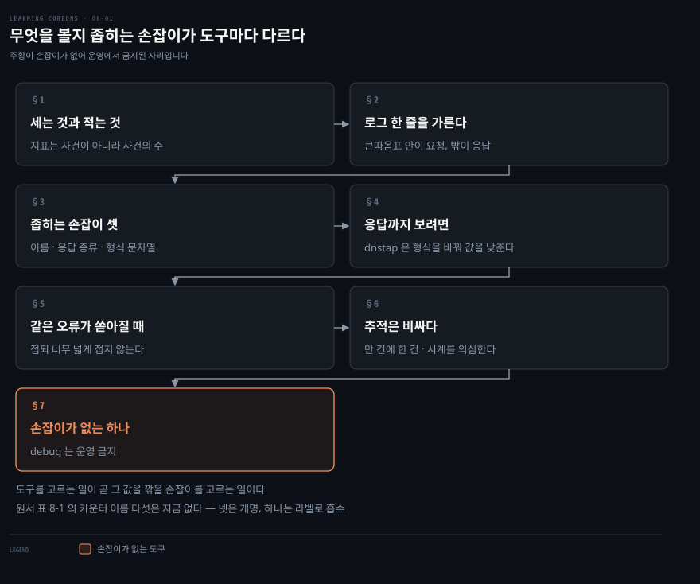
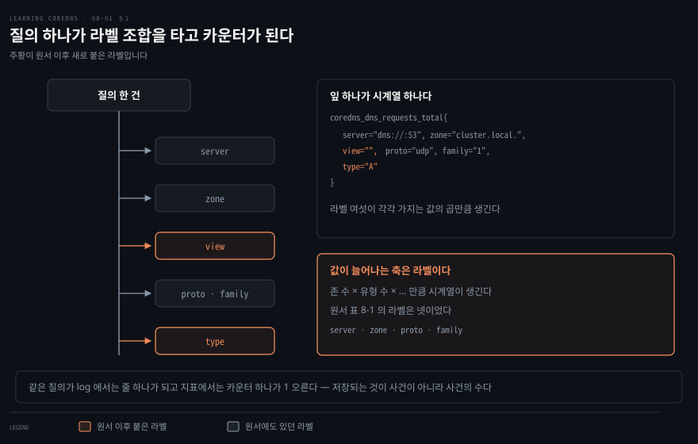
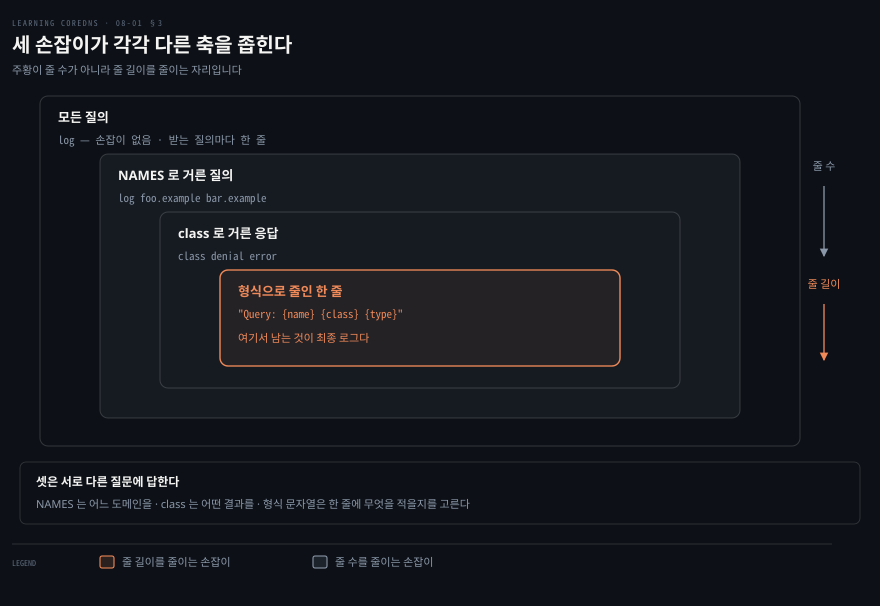
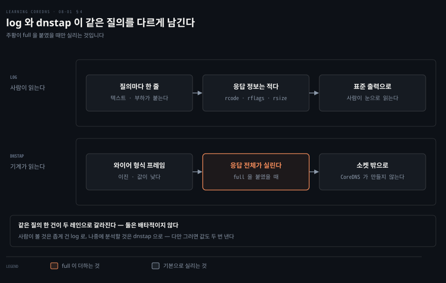
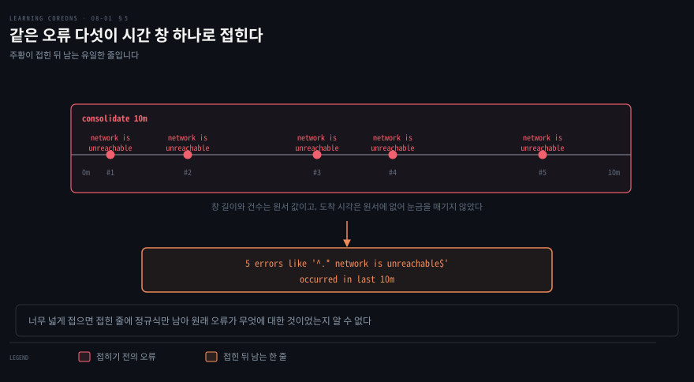
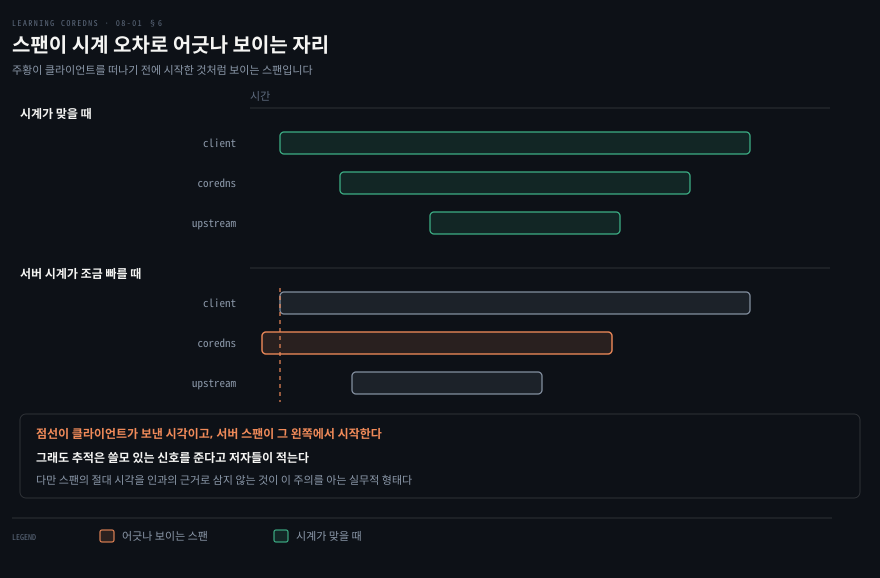
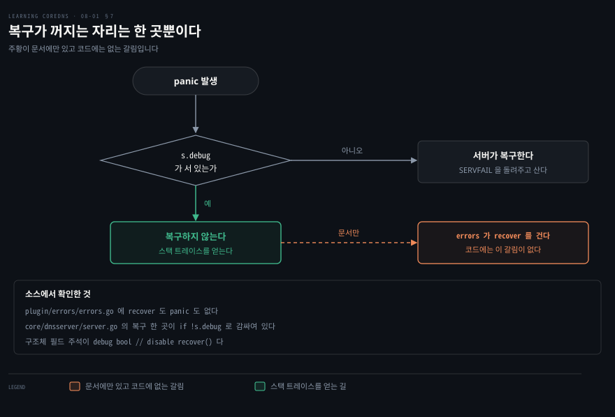

# 무엇을 볼지 좁히는 손잡이가 도구마다 다르다

---

> 원서 8장은 CoreDNS 를 관측하고 진단하는 플러그인 여섯을 다룹니다. 여섯이 보는 것이 다른 만큼 무는 값도 다르고, 그래서 도구마다 값을 깎는 손잡이가 따로 달려 있습니다.

## 핵심 요약

> 이 편이 매달린 하나의 생각은 **관측 도구를 고르는 일이 곧 그 값을 깎을 손잡이를 고르는 일**이라는 것입니다.

저자들은 여섯을 다른 축으로 묶습니다. 장을 닫으며 `log`·`dnstap`·`errors` 는 서버 관리자에게, `trace`·`debug` 는 개발자에게 더 쓸모 있고 `prometheus` 는 양쪽에 쓸 만하다고 적습니다. 위의 손잡이 축은 그 여섯을 읽어 낸 이 노트의 구성입니다.

그 축이 가장 또렷한 곳은 `dnstap` 과 `trace` 입니다. 둘은 저자들이 직접 대가를 말하고 곧바로 줄이는 방법을 붙입니다.

손잡이는 도구마다 다른 축을 잡습니다. `log` 는 도메인과 응답 종류로 남길 줄을 걸러 냅니다. `dnstap` 은 형식을 이진 와이어로 바꿔 값 자체를 낮춥니다. 뒤의 둘은 명시해야 걸립니다. `errors` 는 `consolidate` 를 적어야 접고, `trace` 는 `every` 를 적어야 표본만 뜹니다.

손잡이가 없는 것이 하나 있습니다. `debug` 는 켜고 끄는 것 말고 조절할 자리가 없고, 그래서 원서가 이 장에서 유일하게 상자를 쳐서 경고합니다. 운영에서는 쓰지 말라는 것입니다.

일곱 해가 지나 가장 크게 달라진 곳은 `prometheus` 입니다. **원서 표 8-1 의 CoreDNS 지표 열 중 다섯이 다른 이름이 됐고, 그 다섯이 하필 카운터 계열 전부입니다.** 그 표를 보고 요청 수나 응답 코드 대시보드를 만들면 아무 값도 그려지지 않습니다.


## 학습 목표

이 내용을 읽고 나면:

1. 지표와 로그가 같은 질의를 각각 무엇으로 바꾸는지 설명할 수 있습니다.
2. 기본 로그 한 줄의 칸들을 읽고 무엇이 요청이고 무엇이 응답인지 가를 수 있습니다.
3. `log` 를 좁히는 손잡이 셋을 목적에 맞게 고를 수 있습니다.
4. `log` 대신 `dnstap` 을 쓸 이유를 형식과 값으로 설명할 수 있습니다.
5. `trace` 와 `debug` 를 운영에 켜기 전에 무엇을 확인해야 하는지 말할 수 있습니다.

아래는 이 문서 전체를 읽는 순서로 이은 지도입니다. 1절부터 4절까지가 정상 흐름을 보는 도구이고, 5절부터 7절까지가 잘못됐을 때 쓰는 도구입니다.




## 이 문서가 다루지 않는 것

> 이 편은 원서 8장 전체입니다. 추출 분량이 3,353단어로, 1장(1,360)과 4장(2,457) 다음으로 짧습니다.

- `metadata` 플러그인이 다른 플러그인에 값을 공급하는 구조 → [질문과 답이 어긋나면 클라이언트가 버린다](./07-01.%EC%A7%88%EB%AC%B8%EA%B3%BC%20%EB%8B%B5%EC%9D%B4%20%EC%96%B4%EA%B8%8B%EB%82%98%EB%A9%B4%20%ED%81%B4%EB%9D%BC%EC%9D%B4%EC%96%B8%ED%8A%B8%EA%B0%80%20%EB%B2%84%EB%A6%B0%EB%8B%A4.md)
- 클러스터에서 CoreDNS 가 쓰는 메모리와 복제본 수 → [복제본 둘과 170Mi는 어디서 온 값인가](./06-03.%EB%B3%B5%EC%A0%9C%EB%B3%B8%20%EB%91%98%EA%B3%BC%20170Mi%EB%8A%94%20%EC%96%B4%EB%94%94%EC%84%9C%20%EC%98%A8%20%EA%B0%92%EC%9D%B8%EA%B0%80.md)
- Prometheus 자체의 질의어와 알림 규칙 → 이 장은 CoreDNS 가 무엇을 내놓는지까지만 다룹니다
- 플러그인을 직접 만들어 메트릭을 더하는 법 → 원서 9장

남는 것은 **각 도구가 무엇을 보여 주고 그 값을 어디서 깎는가**입니다.


## 1. 세는 것과 적는 것은 값이 다르다

> 질의가 초당 수만 건 들어오는 서버에서 질의마다 한 줄을 남기면 그 자체가 부하입니다. 지표는 같은 질의를 줄이 아니라 카운터 증가로 바꿔 그 문제를 피합니다.



`prometheus` 플러그인이 그 일을 합니다. 이름이 말하듯 Prometheus 모니터링 시스템이 쓰는 형식으로 지표를 내놓고, Prometheus 나 다른 도구가 주기적으로 긁어 갈 포트를 엽니다.

```bash
prometheus [ ADDRESS ]
```

`ADDRESS` 는 listen 할 IP 와 포트이고, 생략하면 `localhost:9153` 입니다. 플러그인은 `/metrics` 핸들러를 가진 HTTP 서버를 띄우며, 다른 경로로 오면 404 를 돌려줍니다.

지표가 값을 아끼는 방식은 **집계**입니다. 질의 한 건이 로그에서는 줄 하나가 되지만 지표에서는 이미 있던 카운터 하나가 1 올라갈 뿐입니다. 저장되는 것은 사건이 아니라 사건의 수입니다.

다만 공짜는 아닙니다. 카운터가 라벨 조합마다 따로 생기기 때문입니다. `coredns_dns_requests_total` 하나가 `server`·`zone`·`view`·`proto`·`family`·`type` 여섯 라벨을 달고 있으니, 존이 많고 질의 유형이 다양하면 시계열 수가 곱셈으로 늘어납니다.

**이 값에는 CoreDNS 쪽 손잡이가 없습니다.** `prometheus` 플러그인이 받는 것은 주소와 `runtime_metrics` 뿐이고, 뒤엣것은 값을 더하는 쪽입니다. 라벨을 줄이려면 CoreDNS 밖에서, 곧 Prometheus 의 수집 규칙에서 걸러야 합니다. 이 장의 여섯 중 자기 손잡이가 없는 것은 `debug` 만이 아닙니다.

### 원서의 이름표를 그대로 쓰면 안 됩니다

표 8-1 은 `process_`·`go_` 로 시작하는 프로세스와 Go 런타임 지표를 서른다섯 줄 싣고, 그다음 CoreDNS 고유 지표 열 줄을 싣습니다. 그 열 줄 중 **다섯의 이름이 바뀌었습니다.** 하필 대시보드와 경보가 실제로 세는 카운터 계열이 전부 그 다섯에 들어 있습니다.

| 원서 표 8-1 | 현재 | 무슨 일이 있었나 |
|------------|------|----------------|
| `coredns_dns_request_count_total` | `coredns_dns_requests_total` | 개명 |
| `coredns_dns_request_type_count_total` | 없어짐 | `type` 이 위 지표의 라벨로 흡수 |
| `coredns_dns_request_do_count_total` | `coredns_dns_do_requests_total` | 개명 |
| `coredns_dns_response_rcode_count_total` | `coredns_dns_responses_total` | 개명 · `plugin` 라벨 추가 |
| `coredns_panic_count_total` | `coredns_panics_total` | 개명 |
| `coredns_dns_request_duration_seconds` | 그대로 | `type` 라벨 추가 |
| `coredns_dns_request_size_bytes` | 그대로 | `view` 라벨 추가 |
| `coredns_dns_response_size_bytes` | 그대로 | `view` 라벨 추가 |
| `coredns_plugin_enabled` | 그대로 | `view` 라벨 추가 |
| `coredns_build_info` | 그대로 | 변화 없음 |

> **노트의 읽기**: 표 8-1 에서 살아남은 지표에는 원서에 없던 `view` 라벨이 붙었고, `coredns_dns_https_responses_total` 과 `coredns_dns_quic_responses_total` 이 새로 생겼습니다.[^metrics] 1장에서 본 DoH·DoQ 지원이 지표에도 자리를 잡은 것입니다. 문법에도 블록이 생겨 `runtime_metrics` 를 켜면 Go 런타임 지표 전체가 더 붙습니다. 스칼라가 대략 백 개, 히스토그램이 여덟 개 늘고, 한 서버 블록에서 켜면 프로세스 전체에 걸려 재시작 전까지 리로드해도 유지된다고 문서가 적습니다.[^metrics]


## 2. 로그 한 줄에서 요청과 응답을 가른다

> 지표는 몇 건인지 알려 주지만 어느 질의였는지는 알려 주지 않습니다. `log` 플러그인은 그 반대편에 있습니다.

이름이 안 풀린다는 신고를 받았을 때 지표는 도움이 안 됩니다. 실패 건수가 늘었다는 것은 보이지만 그 사용자의 질의가 CoreDNS 에 닿기는 했는지를 답하지 못합니다.

`log` 플러그인이 그 질문에 답합니다. CoreDNS 가 받는 질의마다 메시지 한 줄을 남기고, 그래서 보안 목적으로 처리한 질의를 전부 남겨야 할 때도 씁니다.

```bash
. {
      forward . 8.8.8.8 8.8.4.4
      cache 3600
      log
}
```

문법은 `log` 한 단어가 전부입니다. 저자들이 그 자리에 한 줄 덧붙입니다. 네, 그게 다입니다.

남는 줄은 이렇게 생겼습니다.

```bash
2019-04-26T14:03:32.286-07:00 [INFO] 127.0.0.1:54308 - 31656
"A IN www.nxdomain.com. udp 45 false 4096" NXDOMAIN qr,rd,ra 128 0.172121417s
```

읽는 법이 절반씩 갈립니다. 큰따옴표 안이 **요청**이고 그 뒤가 **응답**입니다.

| 칸 | 값 | 뜻 |
|----|----|-----|
| 시각 | `2019-04-26T14:03:32.286-07:00` | RFC 3339 형식 |
| 심각도 | `[INFO]` | 저자들이 시각 다음 칸으로 명시 |
| 출발지 | `127.0.0.1:54308` | 질의가 온 IP 와 포트 |
| 메시지 ID | `31656` | 질의의 Message ID |
| 질의 | `A IN www.nxdomain.com.` | 유형·클래스·도메인 이름 |
| 전송 | `udp 45` | 프로토콜과 질의 길이 |
| DO 비트 | `false` | DNSSEC OK 비트가 서지 않음 |
| 버퍼 | `4096` | 질의자가 광고한 최대 버퍼 크기 |
| 응답 코드 | `NXDOMAIN` | 그런 도메인 이름이 없다 |
| 플래그 | `qr,rd,ra` | 응답임 · 재귀를 요청함 · 재귀가 가능함 |
| 응답 크기 | `128` | 바이트 |
| 처리 시간 | `0.172121417s` | 질의를 답하는 데 걸린 시간 |

뒤쪽 열한 칸의 순서는 임의가 아니라 **Common Log Format** 이라는 기본 형식이 정한 것입니다. 앞의 두 칸은 다릅니다. 시각과 심각도는 형식 문자열에 없고 로거가 밖에서 붙입니다.

```bash
{remote}:{port} - {>id} "{type} {class} {name} {proto} {size} {>do} {>bufsize}" {rcode} {>rflags} {rsize} {duration}
```

> **노트의 읽기**: 원서 지면의 이 문자열은 `{>bufsize` 에서 잘려 닫는 중괄호와 큰따옴표가 보이지 않습니다. PDF 오른쪽 여백에서 끊긴 것이라 원서의 오류로 보지 않고, 공식 문서의 온전한 문자열로 옮겨 적었습니다.[^log]


## 3. 좁히는 손잡이가 셋 있다

> `log` 를 그냥 켜면 모든 질의가 남습니다. 무엇을 남길지 좁히는 축이 셋이고, 셋은 서로 다른 질문에 답합니다.



첫째는 **어느 이름을 볼 것인가**입니다.

```bash
log [NAMES...]
```

`NAMES` 는 질의를 기록할 도메인 목록이고, 그 목록의 어느 것으로도 끝나지 않는 이름의 질의는 기록되지 않습니다. `log foo.example bar.example` 이라고 적으면 그 둘로 끝나는 질의만 남습니다.

둘째는 **어떤 결과를 볼 것인가**입니다. 응답의 종류로 거를 수 있고, 종류는 넷입니다.

- `success`: 성공한 응답
- `denial`: `NXDOMAIN` 또는 `NODATA` 응답. 앞은 그런 도메인 이름이 없다는 뜻이고, 뒤는 그 이름에 그 유형의 데이터가 없다는 뜻입니다
- `error`: `SERVFAIL`·`NOTIMP`·`REFUSED` 응답. 순서대로 운영상 오류로 답하지 못한 것, 방법을 몰라 처리하지 못한 것, 접근 제어 목록 같은 정책 때문에 답하지 않은 것입니다
- `all`: 모든 응답. 기본값입니다

```bash
log foo.example {
    class denial error
}
```

셋째는 **한 줄에 무엇을 적을 것인가**입니다. 형식 문자열을 직접 줄 수 있고, 쓸 수 있는 칸은 열여덟입니다.

- **질의 쪽**: `{type}` · `{name}` · `{class}` · `{proto}` · `{size}` · `{port}` · `{remote}` · `{local}`
- **응답 쪽**: `{rcode}` · `{rsize}` · `{duration}` · `{>rflags}`
- **EDNS0 와 헤더**: `{>bufsize}` · `{>do}` · `{>id}` · `{>opcode}`
- **단축**: `{common}` · `{combined}`

```bash
log . "Query: {name} {class} {type}" {
     class success
}
```

형식을 지정하려면 `NAMES` 를 반드시 함께 적어야 합니다. 모든 이름을 대상으로 하고 싶으면 `NAMES` 자리에 `.` 를 씁니다.

> **노트의 읽기**: 현재 문서에는 칸이 하나 더 있습니다. `{/LABEL}` 로 metadata 값을 로그에 꺼내 쓸 수 있습니다.[^log] 7장에서 본 `metadata` 플러그인의 소비자가 바로 이 자리입니다. 엣지에서 EDNS0 에 실어 보낸 신원을 상류에서 풀어 로그에 남기는 흐름이 이 한 칸으로 닫힙니다.


## 4. 응답까지 보려면 형식을 바꾼다

> 질의마다 한 줄을 남기는 일에는 값이 붙고, 그 줄에는 응답 이야기가 거의 없습니다. `dnstap` 은 두 문제를 형식을 바꿔 함께 풉니다.



저자들이 `dnstap` 을 소개하며 문제 둘을 함께 듭니다. 질의마다 메시지를 남기는 일이 DNS 서버에 얼마간 부하를 준다는 것이 하나입니다. 질의 로그는 받은 질의 정보가 대부분이라 그 질의에 대한 응답 정보는 많지 않다는 것이 다른 하나입니다.

뒤엣것에는 저자들이 괄호로 단서를 답니다. CoreDNS 의 `log` 플러그인이 응답의 일부 측면은 담을 수 있다는 것이고, 2절 표의 뒤쪽 네 칸이 그것입니다.

저자들이 dnstap 웹사이트의 표현을 빌려 옵니다. DNS 를 위한 유연하고 구조화된 이진 로그 형식이라는 것입니다. 와이어 형식 DNS 메시지를 그대로 인코딩하므로 서버가 받는 응답의 모든 세부를 볼 수 있습니다.

```bash
dnstap SOCKET [full]
```

`SOCKET` 은 CoreDNS 가 dnstap 정보를 쓸 TCP 또는 유닉스 도메인 소켓입니다. **소켓은 CoreDNS 가 만들지 않습니다.** 다른 프로그램이 만들어 놓고 CoreDNS 가 쓰는 것을 듣습니다.

```bash
dnstap /tmp/dnstap.sock
```

듣는 쪽으로는 Go 언어 dnstap 라이브러리에 딸린 `dnstap` 프로그램을 쓸 수 있습니다. 읽는 곳은 파일·TCP 소켓·유닉스 도메인 소켓 셋이고, 쓰는 곳은 표준 출력과 파일 둘입니다. 출력 형식은 JSON·YAML·축약 텍스트 중에 고릅니다.

기본 상태에서 나오는 출력은 시각의 나열입니다. 질의를 언제 받았는지, 상류에 언제 물었는지, 상류가 언제 답했는지, 클라이언트에 언제 응답을 보냈는지가 `CLIENT_QUERY`·`FORWARDER_QUERY`·`FORWARDER_RESPONSE`·`CLIENT_RESPONSE` 네 유형으로 찍힙니다. 메시지 내용은 없습니다.

내용을 보려면 `full` 을 붙여 와이어 형식 DNS 메시지를 포함하게 해야 합니다. 그러면 헤더와 각 섹션이 함께 나옵니다.

```bash
dnstap tcp://127.0.0.1:8053 full
```

**여기가 이 절의 손잡이입니다.** 시각만 볼 때와 메시지 전체를 볼 때의 값이 다르고, `full` 이 그 선택을 한 단어로 만들어 둡니다. 기본이 싼 쪽이라는 점이 `log` 와 다릅니다.

> **원문 정오**: Example 8-12 는 TCP 소켓 지정을 `dnstap tcp://127.0.0.1/8053` 으로 적습니다. 바로 앞 문장이 형식을 `tcp://<IP address>:<port>` 라고 말하고, 같은 장의 Example 8-17 은 `tcp://127.0.0.1:8053 full` 로 콜론을 씁니다. 포트 앞이 슬래시가 아니라 콜론이어야 합니다.

> **노트의 읽기**: 이 플러그인은 원서 이후 크게 자랐습니다.[^dnstap] `identity`·`version`·`extra`·`skipverify` 를 블록으로 받고, `tls://` 스킴이 생겼으며, `dnstap listen SOCKET` 으로 **받는 쪽**이 될 수도 있습니다. `extra` 는 7장에서 본 metadata 를 넣는 자리라고 문서가 직접 적습니다.


## 5. 같은 오류가 쏟아질 때 접는다

> 상류가 끊기면 같은 오류가 초당 수백 줄 쏟아집니다. 오류를 보는 일이 오류를 못 보게 만드는 상황이고, `errors` 의 손잡이는 그것을 겨냥합니다.



`errors` 는 질의를 처리하다 만난 오류를 기록하게 합니다. 서버 블록 안에서 쓰고, **한 서버 블록에 한 번만** 쓸 수 있습니다.

```bash
. {
      forward . 8.8.8.8 8.8.4.4
      errors
}
```

여기까지는 손잡이가 없습니다. 손잡이는 같은 정규식에 맞는 오류 메시지를 하나로 묶는 `consolidate` 입니다. 저자들이 드는 상황이 구체적입니다. 질의를 전달하다 계속 오류가 나는 상황이라면 오류 메시지에 파묻히지 않아도 된다는 것입니다.

```bash
errors {
    consolidate DURATION REGEXP
}
```

`DURATION` 은 `10m` 처럼 숫자와 단위이고, `REGEXP` 는 큰따옴표로 감싼 정규식입니다. 저자들이 `^` 와 `$` 같은 앵커를 쓰라고 권하는데, 성능을 위해서입니다.

아래는 원서 Example 8-21 에 앵커 `^` 를 붙인 수정본입니다. 왜 고쳐 적었는지는 바로 아래 정오 블록에 있습니다.

```bash
. {
      forward . 8.8.8.8 8.8.4.4
      errors {
          consolidate 10m "^.* network is unreachable$"
      }
}
```

접힌 결과는 한 줄입니다.

```bash
5 errors like '^.* network is unreachable$' occurred in last 10m
```

**너무 많이 접지 말라는 경고가 뒤따릅니다.** 접힌 메시지에는 정규식만 남기 때문입니다. `".* unreachable$"` 처럼 넓게 잡으면 원래 오류들이 무엇에 대한 것이었는지 접힌 줄만 보고는 알 수 없습니다. 좁게 잡을수록 덜 접히지만 접힌 것이 무엇인지는 분명해집니다.

> **원문 정오**: Example 8-21 의 정규식은 `".* network is unreachable$"` 인데 바로 뒤에 실린 접힌 출력은 `'^.* network is unreachable$'` 로 `^` 가 붙어 있습니다. 접힌 줄은 설정한 정규식을 그대로 되뇝니다. 소스가 `pattern.String()` 을 그 자리에 넣기 때문입니다.[^src2] 그러니 둘 중 하나가 틀렸고, 위 Corefile 에는 앵커를 쓰라는 저자들 자신의 권고에 맞춰 `^` 를 붙인 쪽으로 적었습니다.

> **노트의 읽기**: 현재 문법은 `consolidate DURATION REGEXP [LEVEL] [show_first]` 로 인자가 둘 늘었고, 다른 `DURATION`·`REGEXP` 를 가진 `consolidate` 를 여러 개 둘 수 있다고 문서가 명시합니다.[^errors] 스택 트레이스를 함께 남기는 `stacktrace` 옵션도 생겼습니다.


## 6. 기본이 전부 추적이라 표본율을 적어야 한다

> `trace` 는 요청 하나가 어디서 시간을 쓰는지 보여 주지만, 저자들의 표현으로 성능에 극적인 영향을 줍니다. 그래서 이 도구의 손잡이는 표본율입니다.



응답이 느린데 지표의 히스토그램은 어느 구간이 느린지 말해 주지 않습니다. 평균이 올라간 것은 보이지만 그 시간이 플러그인 체인 안에서 갔는지 상류를 기다리며 갔는지는 알 수 없습니다.

`trace` 가 그 안을 엽니다. CoreDNS 를 Zipkin·DataDog 같은 분산 추적 도구와 잇는데, 분산 추적은 요청 하나가 코드 구간 사이를, 마이크로서비스 사이를, 심지어 애플리케이션 사이를 옮겨 다니는 것을 따라갑니다.

플러그인을 넣기만 하면 켜집니다. 기본은 Zipkin 이고 `localhost:9411` 로 보냅니다. 그리고 **아무것도 더 적지 않으면 모든 요청을 추적합니다.** 저자들이 그 Corefile 은 모든 요청에 대해 추적을 켠다고 적고, 현재 문서도 `every` 의 기본값이 1 이라고 적습니다.[^trace] 이 도구는 기본이 가장 비싼 쪽입니다.

```bash
.:5300 {
  trace
  log
  errors
  rewrite class CH IN
    forward . /etc/resolv.conf
}
```

gRPC 를 쓰면 추적이 서버를 건너갑니다. 추적 스팬 식별자가 gRPC 연결을 타고 넘어가므로 서로 다른 서비스가 어떻게 맞물리고 어디서 시간이 가장 많이 드는지 볼 수 있습니다. 클라이언트 스팬에 CoreDNS 로 가는 DNS 조회까지 포함해 여러 서비스가 다 나타납니다.

주의할 점이 둘이라고 저자들이 적습니다. 첫째가 값입니다.

```bash
trace {
  every 10000
}
```

만 건에 한 건만 추적하라는 설정이고, 성능 영향이 최소가 되면서도 요청이 어디서 시간을 쓰는지에 대한 데이터는 여전히 얻습니다.

### 둘째 주의는 시계입니다

DNS 요청은 아주 짧아서 흔히 1밀리초에도 한참 못 미칩니다. 요청이 여러 호스트에 걸치면 시계가 몇 나노초만 어긋나도 오해를 부르는 결과가 나옵니다. **클라이언트를 떠나기도 전에 서버에서 시작한 스팬** 같은 것입니다.

이것은 추적을 쓰지 말라는 말이 아닙니다. 저자들이 분명히 적습니다. 추적은 여전히 쓸모 있는 신호를 주지만 이 주의점을 알고 있어야 한다는 것입니다. 스팬의 절대 시각을 인과의 근거로 삼지 않는 것이 그 앎의 실무적 형태입니다.

전체 문법은 이렇습니다.

```bash
trace [TYPE] [ENDPOINT] {
  every AMOUNT
  service NAME
  client_server
}
```

`service` 는 추적 서버에 보고할 서비스 이름이고 기본은 `coredns` 입니다. CoreDNS 인스턴스 여럿이 서로 다른 역할을 하거나 서로 다른 배포가 같은 추적 서비스로 보낼 때 이름을 갈라 둡니다. `client_server` 를 적으면 클라이언트와 서버가 같은 스팬을 공유합니다.

> **노트의 읽기**: 저자들은 이 플러그인이 잇는 도구로 Zipkin·DataDog 과 함께 구글 Stackdriver Trace 를 듭니다. 현재 공식 문서는 **`zipkin` 과 `datadog` 둘만** 지원한다고 적습니다.[^trace] 언제 갈렸는지는 확인하지 못했습니다. 대신 Zipkin 쪽 배치 옵션 셋과 `datadog_analytics_rate` 가 블록에 더해졌고, 엔드포인트가 `http` 로 시작하지 않으면 `http://ENDPOINT/api/v2/spans` 로 바뀐다는 규칙이 명시됐습니다.


## 7. 손잡이가 없는 하나

> `debug` 는 조절할 자리가 없습니다. 크래시에서 복구하는 동작을 막는 것이 이 플러그인의 전부이고, 그래서 원서가 상자를 쳐서 경고합니다.



보통 CoreDNS 는 크래시가 나면 스스로 다시 뜹니다. 그런데 크래시를 일으킨 문제를 디버깅하려면 그 동작이 방해가 됩니다. 스택 트레이스를 손에 쥐기 전에 프로세스가 새로 떠 버리기 때문입니다.

`debug` 는 CoreDNS 가 크래시에서 복구하지 않게 해 스택 트레이스를 얻게 합니다. 곁들여 `log.Debug` 와 `log.Debugf` 메시지를 표준 출력으로 보내는 부수 효과도 있습니다.

```bash
debug
```

원서가 이 장에서 유일하게 상자를 쳐 경고합니다. `debug` 플러그인이 CoreDNS 의 자동 재시작을 막기 때문에 운영에서는 절대 쓰면 안 된다는 것입니다.

### 공식 문서 한 문장이 소스와 어긋납니다

저자들은 디버그 출력을 내고 싶은 서버 블록마다 플러그인을 적으라고 하며 예제를 답니다.

```bash
foo.example {
    file /db.foo.example
      errors
      debug
}

. {
      forward . 8.8.8.8 8.8.4.4
      errors
      debug
}
```

현재 공식 문서를 옆에 두면 이 예제가 걸리는 것처럼 보입니다.

> `errors` 플러그인이 (적재돼 있다면) 마찬가지로 `recover` 를 걸어 이 설정을 무효로 만든다는 점에 유의하십시오.[^debug]

두 블록 모두 `errors` 와 `debug` 를 함께 적고 있으니, 이 문장대로라면 원서의 예제가 자기가 보이려는 플러그인을 끄고 있는 셈이 됩니다.

**그런데 소스를 열어 보면 그렇지 않습니다.** `plugin/errors/errors.go` 에는 `recover` 도 `panic` 도 없습니다. 그 플러그인의 `ServeDNS` 는 `plugin.NextOrFailure` 가 돌려준 오류를 정규식에 물려 기록할 뿐입니다. panic 복구는 서버 본체 한 곳에만 있고, 그 자리가 `debug` 로 꺼집니다.[^src]

```bash
if !s.debug {
    defer func() {
        // In case the user doesn't enable error plugin, we still
        // need to make sure that we stay alive up here
        if rec := recover(); rec != nil {
```

구조체 필드 주석도 `debug bool // disable recover()` 라고 적습니다. 그러니 **`errors` 를 같은 블록에 두어도 `debug` 는 무력화되지 않습니다.**

> **노트의 읽기**: 위 주석의 "사용자가 error 플러그인을 켜지 않은 경우에 대비해" 라는 표현이 단서로 보입니다. 복구가 `errors` 안에 있던 시절의 문장이 서버 쪽으로 옮겨 오며 남은 것이고, 문서 쪽 서술은 그때 함께 고쳐지지 않은 것으로 읽힙니다. 어느 쪽이든 지금 코드 기준으로 원서 Example 8-26 에는 문제가 없습니다.

### 켜는 범위도 갈립니다

저자들은 원하는 서버 블록마다 적으라고 하고, 현재 문서는 이 플러그인을 켜는 일이 프로세스 전체에 걸린다고 적습니다.[^debug] 소스에서는 그 둘이 한 겹씩 다릅니다.

복구를 끄는 `s.debug` 는 같은 리슨 주소를 공유하는 서버 그룹 단위로 섭니다. 그 그룹의 서버 블록 하나에서만 켜도 그룹 전체에 걸립니다. 반면 디버그 로깅을 켜는 `log.D.Set()` 은 패키지 전역이라 프로세스 전체에 걸립니다.[^src] 문서의 "프로세스 전체"는 뒤엣것에 대해 맞습니다.


## 심화 학습

> 원서 밖에서 확인하거나 앞 절들을 이어 붙인 것들입니다. 공식 문서를 근거로 삼은 자리에는 각주를 답니다.

**메트릭 이름이 바뀐 것은 대시보드만의 문제가 아닙니다.** 경보 규칙도 같이 죽습니다. `coredns_dns_response_rcode_count_total` 로 `SERVFAIL` 비율을 재던 규칙은 지표가 사라지면 값을 못 구하고, 값을 못 구하는 규칙은 대개 조용히 발화하지 않습니다. 지표 개명은 무언가 시끄럽게 깨지는 대신 감시가 조용히 없어지는 종류의 변화입니다.

**`type` 라벨의 흡수는 질의어를 바꿉니다.** 원서 시절에는 유형별 요청 수를 `coredns_dns_request_type_count_total` 이라는 별도 지표에서 읽었습니다. 지금은 `coredns_dns_requests_total` 에 붙은 `type` 라벨로 읽습니다.[^metrics] 지표가 줄고 라벨이 느는 방향입니다. 같은 질문을 묻는 질의어가 지표 이름을 고르는 일에서 라벨을 거르는 일로 옮겨 갔습니다.

**`log` 와 `dnstap` 은 배타적이지 않습니다.** 원서가 둘을 차례로 놓아 대안처럼 읽히지만, 목적이 다르면 함께 켤 수 있습니다. 사람이 눈으로 읽을 것은 좁게 건 `log` 로, 나중에 분석할 것은 `dnstap` 으로 보내는 조합입니다. 다만 그렇게 하면 값도 두 번 냅니다.

**공식 문서도 낡습니다.** 7절의 `errors`·`debug` 이야기가 그 사례입니다. 문서 문장만 읽으면 원서 예제가 틀린 것으로 보이는데, 소스를 열면 틀린 쪽은 문서였습니다.

여기서 자료의 등급이 갈립니다. 공식 문서가 1차 자료인 것은 문법과 기본값까지입니다. 플러그인 사이의 상호작용처럼 여러 파일에 걸친 동작은 코드를 봐야 확정됩니다.


## 결정 치트시트

> 무엇을 보고 싶은지에서 시작해 도구와 손잡이를 고릅니다.

| 보고 싶은 것 | 도구 | 값을 깎는 손잡이 | 주의 |
|-------------|------|----------------|------|
| 몇 건인지·얼마나 걸리는지 | `prometheus` | 라벨 축(집계 자체가 압축) | 시계열이 라벨 조합만큼 늘어납니다 |
| 어느 질의가 왔는지 | `log` | `NAMES`·`class`·형식 문자열 | 질의마다 한 줄이라 부하가 붙습니다 |
| 응답 내용까지 | `dnstap` | `full` 을 붙일지 말지 | 소켓은 다른 프로그램이 만들어야 합니다 |
| 처리 중 난 오류 | `errors` | `consolidate DURATION REGEXP` | 너무 넓게 접으면 원인이 사라집니다 |
| 어디서 시간을 쓰는지 | `trace` | `every AMOUNT` | 호스트 간 시계 오차로 스팬 순서가 뒤집힐 수 있습니다 |
| 크래시의 스택 트레이스 | `debug` | **없음** | 운영 금지 · 현재 문서 기준 `errors` 가 무력화합니다 |


## 적용 관점

> Spring 애플리케이션을 쿠버네티스에 올려 두고 이 장을 읽는다면 걸리는 자리가 둘입니다.

**첫째는 DNS 지연을 애플리케이션 지연과 갈라 보는 일입니다.** 애플리케이션 쪽 타임아웃 로그만 보면 상대 서비스가 느린 것인지 이름을 푸는 데서 걸린 것인지 구분되지 않습니다. `coredns_dns_request_duration_seconds` 히스토그램의 상위 분위수를 애플리케이션 지표와 같은 대시보드에 두면 그 갈림이 눈으로 보입니다. 6장에서 본 `ndots:5` 때문에 외부 이름 하나에 질의가 여러 번 나가는 구조라면, 그 여러 번이 전부 이 히스토그램에 쌓입니다.

**둘째는 무엇이 실패하고 있는지입니다.** `coredns_dns_responses_total` 을 `rcode` 라벨로 갈라 보면 `NXDOMAIN` 이 튀는 것과 `SERVFAIL` 이 튀는 것이 전혀 다른 문제라는 사실이 드러납니다. 앞은 대개 이름이나 검색 경로가 틀린 것이고, 뒤는 상류나 백엔드가 답하지 못하는 것입니다.

여기서 주의할 것은 **원서의 지표 이름을 그대로 쓰면 둘 다 안 된다**는 점입니다. 대시보드를 만들기 전에 실제로 도는 CoreDNS 의 `/metrics` 를 한 번 긁어 이름을 확인하는 편이 빠릅니다.

```bash
kubectl -n kube-system port-forward svc/kube-dns 9153:9153
```

```bash
curl -s localhost:9153/metrics | grep '^coredns_' | cut -d'{' -f1 | sort -u
```


## 면접에서 받을 만한 질문

1. 지표와 질의 로그는 같은 질의를 각각 무엇으로 바꿉니까?
2. 기본 로그 한 줄에서 요청과 응답의 경계는 어디입니까?
3. `log` 를 좁히는 축 셋은 각각 무엇을 거릅니까?
4. `dnstap` 이 `log` 의 어떤 두 문제를 겨냥해 만들어졌습니까?
5. `errors` 의 `consolidate` 를 너무 넓게 잡으면 무엇을 잃습니까?
6. `trace` 를 운영에 켤 때 표본율 말고 또 무엇을 의심해야 합니까?
7. `debug` 에는 왜 조절 손잡이가 없습니까?
8. 원서 표 8-1 의 카운터 계열 지표 이름을 지금 그대로 쓰면 무슨 일이 일어납니까?


## 정답 (자답 후 펼치기)

### 정답 1 — 사건과 사건의 수

지표는 질의를 카운터 증가로 바꿉니다. 저장되는 것은 사건이 아니라 사건의 수라 건수가 늘어도 저장량이 비례해 늘지 않습니다. 로그는 질의마다 줄 하나를 남기므로 어느 질의였는지 알 수 있는 대신 건수에 비례해 값이 붙습니다.

### 정답 2 — 큰따옴표

큰따옴표 안이 요청이고 그 뒤가 응답입니다. 안쪽에는 유형·클래스·이름·프로토콜·크기·DO 비트·버퍼 크기가 들어가고, 바깥쪽에는 응답 코드·플래그·응답 크기·처리 시간이 들어갑니다.

### 정답 3 — 세 축

`NAMES` 는 어느 도메인의 질의를 볼지, `class` 는 어떤 결과의 질의를 볼지, 형식 문자열은 한 줄에 무엇을 적을지를 거릅니다. 앞의 둘은 줄 수를 줄이고 마지막은 줄 길이를 줄입니다.

### 정답 4 — 부하와 응답

질의마다 메시지를 남기는 일이 DNS 서버에 부하를 준다는 것이 하나이고, 질의 로그가 받은 질의 정보 위주라 응답 정보는 많지 않다는 것이 다른 하나입니다. 저자들은 뒤엣것에 `log` 가 응답의 일부는 담는다는 단서를 붙입니다. `dnstap` 은 이진 와이어 형식으로 값을 낮추면서 응답 전체를 담아 둘을 함께 겨냥합니다.

### 정답 5 — 무엇에 대한 오류였는지

접힌 메시지에는 정규식과 건수와 기간만 남습니다. 정규식을 넓게 잡으면 서로 다른 원인의 오류들이 한 줄로 묶여, 그 줄만 보고는 원래 오류가 무엇에 대한 것이었는지 알 수 없습니다.

### 정답 6 — 호스트 간 시계

DNS 요청은 1밀리초에도 한참 못 미치는 경우가 흔해서, 요청이 여러 호스트에 걸치면 시계가 몇 나노초만 어긋나도 결과가 오해를 부릅니다. 클라이언트를 떠나기 전에 서버에서 시작한 것처럼 보이는 스팬이 그 예입니다.

### 정답 7 — 켜고 끄는 것이 전부

`debug` 가 하는 일은 크래시 복구를 막는 것 하나뿐이고, 그 동작에는 정도가 없습니다. 절반만 복구하지 않는다는 것이 성립하지 않으므로 조절할 자리가 없고, 그래서 운영 금지가 유일한 안전장치가 됩니다.

### 정답 8 — 조용히 아무것도 안 그려집니다

표 8-1 의 CoreDNS 지표 열 중 다섯이 개명됐고 그 다섯이 카운터 계열입니다. 없는 지표를 묻는 질의는 오류가 아니라 빈 결과를 돌려주므로, 대시보드는 빈 그래프가 되고 경보 규칙은 발화하지 않습니다. 깨진 것이 눈에 띄지 않는 종류의 실패입니다.


## 핵심 개념 체크리스트

- [ ] 지표가 값을 아끼는 방식이 집계라는 것을 말할 수 있습니다
- [ ] 지표의 값이 라벨 조합 수로 늘어난다는 것을 압니다
- [ ] 기본 로그 한 줄의 칸을 요청과 응답으로 가를 수 있습니다
- [ ] `log` 의 세 손잡이가 각각 무엇을 줄이는지 구분합니다
- [ ] `dnstap` 의 `full` 이 무엇을 더하는지 압니다
- [ ] `dnstap` 소켓을 누가 만드는지 압니다
- [ ] `consolidate` 의 정규식 범위와 진단 가능성의 관계를 압니다
- [ ] `trace` 의 두 주의점을 값과 시계로 나눠 말할 수 있습니다
- [ ] `debug` 를 운영에 켜면 안 되는 이유를 압니다
- [ ] 표 8-1 의 카운터 계열 지표 이름이 전부 바뀌었다는 것을 압니다


## 관련 문서

- [Learning CoreDNS 정독 인덱스](./README.md)
- [질문과 답이 어긋나면 클라이언트가 버린다](./07-01.%EC%A7%88%EB%AC%B8%EA%B3%BC%20%EB%8B%B5%EC%9D%B4%20%EC%96%B4%EA%B8%8B%EB%82%98%EB%A9%B4%20%ED%81%B4%EB%9D%BC%EC%9D%B4%EC%96%B8%ED%8A%B8%EA%B0%80%20%EB%B2%84%EB%A6%B0%EB%8B%A4.md) — 3절과 4절의 metadata 가 이 장의 `{/LABEL}` 과 `extra` 로 이어집니다
- [복제본 둘과 170Mi는 어디서 온 값인가](./06-03.%EB%B3%B5%EC%A0%9C%EB%B3%B8%20%EB%91%98%EA%B3%BC%20170Mi%EB%8A%94%20%EC%96%B4%EB%94%94%EC%84%9C%20%EC%98%A8%20%EA%B0%92%EC%9D%B8%EA%B0%80.md) — 기본 Corefile 의 `prometheus :9153` 이 놓인 자리
- [DNS와 CoreDNS](../../kubernetes/04_networking/04-05.DNS%EC%99%80%20CoreDNS.md) — 운영 관점의 클러스터 DNS


## 참고 자료

- 원서: 《Learning CoreDNS: Configuring DNS for Cloud Native Environments》 8장 Monitoring and Troubleshooting
- 서지: John Belamaric·Cricket Liu, O'Reilly, 2019년, ISBN 978-1492047964

[^metrics]: CoreDNS — metrics(prometheus) 플러그인의 문법, 기본 주소, 내보내는 지표 이름과 라벨. <https://coredns.io/plugins/metrics/>
[^log]: CoreDNS — log 플러그인의 클래스 기본값, 형식 칸 목록, Common Log Format 문자열. <https://coredns.io/plugins/log/>
[^dnstap]: CoreDNS — dnstap 플러그인의 현재 문법과 `listen` 모드, `extra` 의 metadata 연결. <https://coredns.io/plugins/dnstap/>
[^errors]: CoreDNS — errors 플러그인의 `consolidate` 인자와 `stacktrace` 옵션. <https://coredns.io/plugins/errors/>
[^src2]: CoreDNS 소스 — `plugin/errors/errors.go` 의 `logPattern` 이 `"%d errors like '%s' occurred in last %s"` 에 `pattern.String()` 을 넣는다. <https://github.com/coredns/coredns/blob/master/plugin/errors/errors.go>
[^trace]: CoreDNS — trace 플러그인이 지원하는 엔드포인트 유형과 블록 옵션. <https://coredns.io/plugins/trace/>
[^src]: CoreDNS 소스 — `plugin/errors/errors.go` 에 `recover` 없음, `core/dnsserver/server.go` 의 `if !s.debug { defer func() { ... recover() ... } }` 와 구조체 필드 `debug bool // disable recover()`, 그리고 `for _, site := range group { if site.Debug { s.debug = true; log.D.Set() } }`. <https://github.com/coredns/coredns/blob/master/core/dnsserver/server.go>
[^debug]: CoreDNS — debug 플러그인. `"Note that the errors plugin (if loaded) will also set a recover, negating this setting."` 와 프로세스 전역 적용. <https://coredns.io/plugins/debug/>
