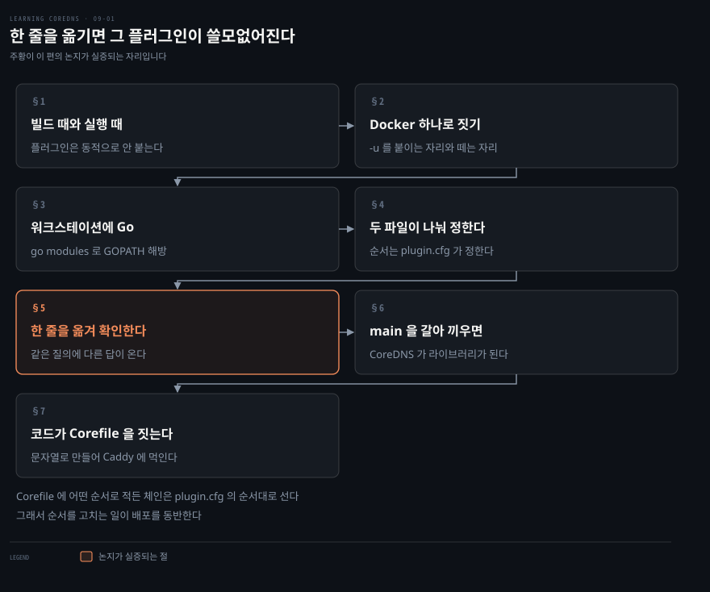
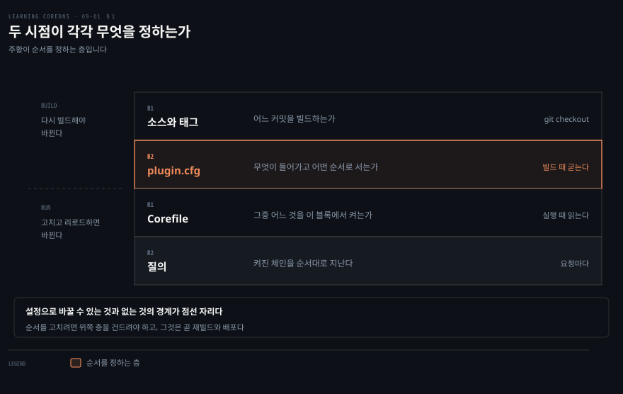
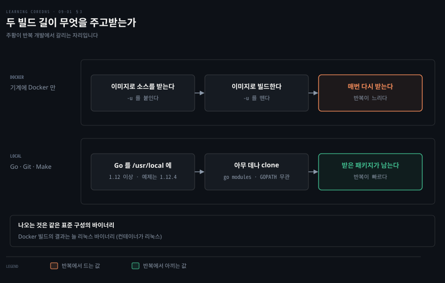
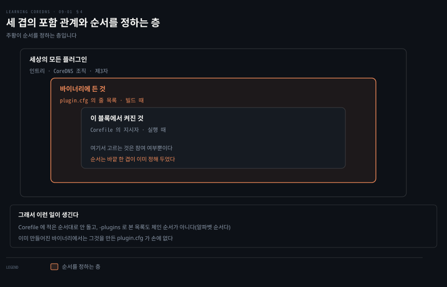
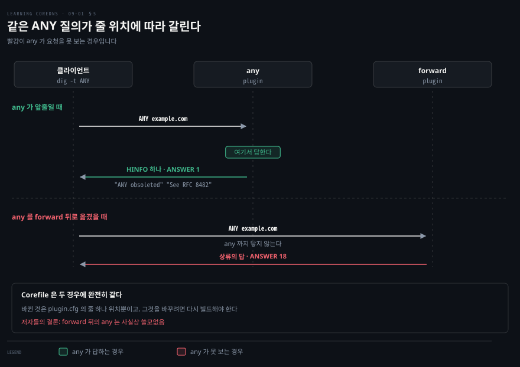
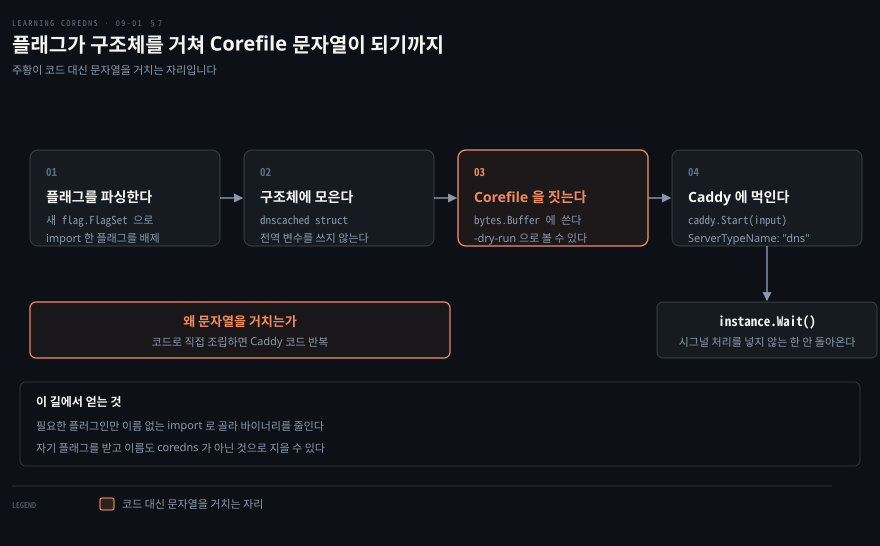

# 한 줄을 옮기면 그 플러그인이 쓸모없어진다

---

> 원서 9장 전반부는 남의 플러그인을 넣어 CoreDNS 를 다시 빌드하는 길과, CoreDNS 를 라이브러리로 삼아 자기 `main` 을 쓰는 길을 다룹니다. 두 길 모두 무엇을 바이너리에 넣을지 빌드 때 정하는 일입니다.

## 핵심 요약

> 이 편이 매달린 하나의 생각은 **체인의 순서가 Corefile 이 아니라 `plugin.cfg` 에서 정해진다**는 것입니다.

저자들이 첫 문단에서 전제를 못 박습니다. 플러그인은 동적으로 적재되지 않고 빌드 때 컴파일해 넣는다는 것입니다. 그래서 남의 플러그인을 쓰려면 CoreDNS 를 다시 빌드해야 합니다.

여기서 따라오는 결과가 이 편의 논지입니다. **Corefile 에 지시자를 어느 순서로 적든 체인은 `plugin.cfg` 의 순서대로 섭니다.** 저자들이 그 사실을 말로만 두지 않고 실험으로 보입니다. `any` 플러그인 한 줄을 파일 위쪽에 두면 ANY 질의를 자기가 답하고, 같은 줄을 `forward` 뒤로 옮기면 앞의 플러그인들이 먼저 가져가 버려 사실상 쓸모가 없어집니다.

`plugin.cfg` 를 고치는 것으로 부족하면 한 층 더 갑니다. CoreDNS 를 라이브러리로 가져다 자기 `main` 을 쓰는 길이고, 그때는 필요한 플러그인만 골라 import 해 바이너리를 줄일 수 있습니다.


## 학습 목표

이 내용을 읽고 나면:

1. 플러그인이 왜 재빌드를 요구하는지와 그것이 순서에 무엇을 뜻하는지 설명할 수 있습니다.
2. Docker 로 빌드하는 길과 워크스테이션에 Go 를 두고 빌드하는 길을 목적에 맞게 고를 수 있습니다.
3. `plugin.cfg` 한 줄의 위치가 체인의 어디에 대응하는지 말할 수 있습니다.
4. Corefile 과 `plugin.cfg` 가 각각 무엇을 정하는지 갈라 말할 수 있습니다.
5. `main` 을 갈아 끼우는 길이 언제 필요한지와 그때 무엇을 얻는지 설명할 수 있습니다.

아래는 이 문서 전체를 읽는 순서로 이은 지도입니다. 1절부터 5절까지가 `plugin.cfg` 를 고치는 길이고, 6절과 7절이 `main` 을 갈아 끼우는 길입니다.




## 이 문서가 다루지 않는 것

> 이 편은 원서 9장의 전반부입니다. 9장은 추출본 기준 약 7,500단어로 6장과 2장 다음으로 커서 둘로 나눴습니다.

- 플러그인을 직접 작성하는 법 → [네 함수를 구현하면 체인의 한 칸이 된다](./09-02.%EB%84%A4%20%ED%95%A8%EC%88%98%EB%A5%BC%20%EA%B5%AC%ED%98%84%ED%95%98%EB%A9%B4%20%EC%B2%B4%EC%9D%B8%EC%9D%98%20%ED%95%9C%20%EC%B9%B8%EC%9D%B4%20%EB%90%9C%EB%8B%A4.md)
- Corefile 문법과 서버 블록의 구조 → [Corefile은 라벨로 서버를 가른다](./03-01.Corefile%EC%9D%80%20%EB%9D%BC%EB%B2%A8%EB%A1%9C%20%EC%84%9C%EB%B2%84%EB%A5%BC%20%EA%B0%80%EB%A5%B8%EB%8B%A4.md)
- 각 플러그인이 하는 일 → 3~8장
- Go 언어 자체 → 저자들은 **커스텀 빌드를 만드는 데는** Go 개발자가 아니어도 된다고 적습니다. 플러그인을 직접 쓰는 후반부는 다릅니다

남는 것은 **바이너리에 무엇이 어떤 순서로 들어가는가**입니다.


## 1. 빌드 때 정해지는 것과 실행 때 정해지는 것

> 플러그인이 동적으로 붙지 않는다는 사실 하나가 이 장 전체의 전제입니다. 그래서 결정이 두 시점으로 갈립니다.



설정 파일을 고쳐 기능을 켜는 데 익숙하다면 여기서 한 번 걸립니다. Corefile 에 지시자를 적었는데 그 플러그인이 없다고 하거나, 적은 순서대로 동작하지 않는 일이 생깁니다.

저자들이 첫 문단에서 이유를 답니다. **플러그인은 동적으로 적재되지 않고 빌드 때 컴파일해 들어갑니다.** 그래서 표준 빌드나 저장소에 없는, 저자들이 외부라고 부르는 플러그인을 쓰려면 CoreDNS 를 다시 빌드해야 합니다.

Go 개발자가 아니어도 됩니다. 다만 Go 빌드가 되는 기계가 필요하고, Docker 가 돌고 있으면 그것만으로도 됩니다. Docker 를 쓰지 않으면 Go 와 Git 과 Make 가 있어야 합니다.

> **노트의 읽기**: 원서는 Go 1.12 이상을 요구합니다. 현재 저장소의 `go.mod` 는 `go 1.25.0` 입니다.[^gomod] 일곱 해 사이에 요구 버전이 열세 단계 올라갔으니, 원서를 따라 하려면 그 시절 태그를 받아야 하고 최신을 빌드하려면 최신 Go 가 있어야 합니다.


## 2. Docker 하나로 짓는 길

> 기계에 Go 도 Git 도 없이 시작할 수 있습니다. 소스를 받는 일까지 컨테이너에 맡기면 됩니다.

빌드하려면 소스가 있어야 하는데, 소스를 받으려면 `git` 이 있어야 합니다. 도구를 갖추자고 도구를 설치하는 일이 시작되면 끝이 없습니다.

한 겹 건너뜁니다. `git` 이 들어 있는 `golang:1.12` 이미지로 저장소를 받아 오면 기계에는 Docker 말고 아무것도 없어도 됩니다.

```bash
docker run --rm -u $(id -u):$(id -g) -v $PWD:/go golang:1.12 \
    /bin/bash -c \
    "git clone https://github.com/coredns/coredns.git && \
    cd coredns && \
    git checkout v1.5.0"
```

현재 작업 디렉터리를 컨테이너의 `/go` 로 마운트하고 `bash` 로 세 명령을 잇습니다. 저장소를 `/go/coredns` 로 복제한 뒤 그 디렉터리로 들어가고, 마지막에 `v1.5.0` 태그로 옮깁니다.

**`-u $(id -u):$(id -g)` 가 이 명령의 요점입니다.** 컨테이너 안의 사용자와 그룹을 바깥의 현재 사용자와 그룹으로 맞추는 것이고, 이것이 없으면 컨테이너가 만든 파일이 전부 `root` 소유가 되어 보통 사용자가 고칠 수 없게 됩니다.

빌드도 같은 이미지로 합니다.

```bash
docker run --rm -v $PWD:/coredns -w /coredns golang:1.12 make
```

여기에는 `-u` 가 없습니다. 저자들이 이유를 답니다. 빌드가 보통 사용자로는 만들 수 없는 자리에 디렉터리를 몇 개 만들기 때문이고, 그래서 나온 실행 파일이 `root` 소유가 되는데 그건 문제가 되지 않는다는 것입니다.

> **노트의 읽기**: 소스를 받을 때는 `-u` 를 붙여 파일을 내 것으로 만들고, 빌드할 때는 떼어 권한을 내주는 셈입니다. 앞엣것은 나중에 고칠 파일이고 뒤엣것은 실행만 할 파일이라는 구분입니다.

만들어지는 것은 리눅스 바이너리입니다. 맥에서 빌드해도 그렇습니다. 빌드를 돌리는 컨테이너가 리눅스이기 때문이라고 저자들이 각주로 짚습니다.


## 3. 워크스테이션에 Go 를 두는 길

> Docker 로도 되지만 고쳐 가며 빌드할 때 느립니다. 반복이 시작되면 로컬 Go 환경이 값을 합니다.



저자들이 Docker 빌드의 단점을 하나로 짚습니다. 반복 개발을 할 때 정말 느리다는 것입니다. 매번 새 컨테이너에서 시작해 패키지를 전부 다시 내려받기 때문입니다.

Go 는 배포판 패키지가 충분히 최신이 아닐 수 있어 직접 받아 `/usr/local` 에 풉니다.

```bash
curl -s https://dl.google.com/go/go1.12.4.linux-amd64.tar.gz \
 | sudo tar -C /usr/local -xz
```

여기서 옛 Go 를 아는 사람이 놀랄 대목이 하나 있습니다. **소스 디렉터리를 `GOPATH` 아래 정해진 자리에 두지 않아도 됩니다.** 예전 Go 에서는 빌드하려면 `GOPATH` 에 맞춰 위치를 잡아야 했지만, CoreDNS 가 의존성 관리를 go modules 로 바꾼 뒤로는 `coredns` 디렉터리를 아무 데나 두어도 빌드됩니다.

```bash
git clone https://github.com/coredns/coredns
```

```bash
cd coredns && git checkout v1.5.0 && make
```

이렇게 만든 바이너리는 아직 아무것도 손대지 않은 표준 바이너리입니다. 고치는 자리는 다음 절입니다.


## 4. 두 파일이 각각 다른 것을 정한다

> Corefile 은 어느 플러그인을 켤지 정하고, `plugin.cfg` 는 무엇이 바이너리에 들어가고 어떤 순서로 서는지를 정합니다.



Corefile 에 지시자를 적었는데 그 순서대로 안 도는 일이 왜 생기는지가 이 절의 질문입니다. 답은 순서를 정하는 파일이 따로 있다는 것입니다.

`plugin.cfg` 는 빌드 때 어떤 플러그인이 CoreDNS 에 컴파일돼 들어갈지 통제하는 단순한 설정 파일입니다. 한 줄에 지시자 하나와 소스 디렉터리 하나가 콜론으로 이어집니다.

```bash
# Directives are registered in the order they should be
# executed.
#
# Ordering is VERY important. Every plugin will
# feel the effects of all other plugin below
# (after) them during a request, but they must not
# care what plugin above them are doing.

# The parser takes the input format of
#     <plugin-name>:<package-name>
# Or
#     <plugin-name>:<fully-qualified-package-name>

metadata:metadata
cancel:cancel
tls:tls
reload:reload
nsid:nsid
root:root
bind:bind
```

파일 머리의 주석이 스스로 경고를 답니다. 지시자는 실행돼야 할 순서로 등록되고, **순서가 아주 중요하다**는 것입니다. 요청이 지나갈 때 모든 플러그인은 자기 아래의 모든 플러그인에게 영향을 받지만 자기 위의 플러그인이 무엇을 하는지는 신경 쓰지 않아야 한다고 적습니다.

그다음 문장이 이 편의 논지입니다. CoreDNS 는 플러그인을 동적으로 재정렬하지 못합니다. **그래서 Corefile 에 지시자를 어떤 순서로 적든 체인은 `plugin.cfg` 의 순서대로 지어집니다.** 요청이 처리될 때 이 파일에 정의된 순서대로 각 플러그인을 지납니다.

앞선 플러그인은 요청을 자기가 처리하고 돌려보낼 수도 있고 다음 플러그인에게 넘길 수도 있습니다. 저자들이 이 구조에 한마디 답니다. 사용자에게 혼란스러울 수 있으니 언젠가 바뀌어야 할지도 모른다는 것입니다.

세 겹으로 정리하면 이렇습니다.

| 층 | 무엇이 정하나 | 언제 |
|----|--------------|------|
| 세상의 모든 플러그인 | 인트리와 외부를 합친 전부 | — |
| 바이너리에 든 것 | `plugin.cfg` 의 줄 목록 | 빌드 때 |
| 이 서버 블록에서 켜진 것 | Corefile 의 지시자 | 실행 때 |

**순서는 가운데 층이 정합니다.** 맨 아래 층은 참여 여부만 고릅니다.

> **노트의 읽기**: 현재 `plugin.cfg` 는 83줄이고 그중 플러그인 엔트리가 61개입니다.[^plugincfg] 80번째 줄이 `on:github.com/coredns/caddy/onevent` 인데, 원서가 실은 같은 줄은 `on:github.com/mholt/caddy/onevent` 였습니다. CoreDNS 가 Caddy 를 자기 조직으로 포크해 간 것이고, 이 변화는 9장 후반부의 코드 예제 전체에 걸립니다.


## 5. 한 줄을 옮겨 그것을 확인한다

> 저자들이 순서 이야기를 말로만 두지 않습니다. `any` 플러그인 한 줄의 위치를 바꿔 같은 질의에 다른 답이 나오는 것을 보입니다.



앞 절의 주장은 말로만 들으면 믿기 어렵습니다. 설정 파일 한 줄의 위치가 응답을 바꾼다는 말이기 때문입니다. 줄 하나를 옮겼을 뿐인데 같은 질의에 다른 답이 나오는 것을 보면 달라집니다.

저자들이 그 실험에 쓰는 것이 `any` 입니다. CoreDNS 조직에 있지만 v1.5.0 에는 기본으로 들어 있지 않은 작은 플러그인입니다. RFC 8482 를 구현해 ANY 질의를 폐기하고 최소한의 응답만 돌려줍니다. 저자들이 그 쓸모를 한 줄로 짚습니다. DNS 증폭 공격에 쓰일 수 있는 공격 방법 하나를 없앤다는 것입니다.

`any:github.com/coredns/any` 를 `cancel:cancel` 바로 다음 줄에 넣고 다시 빌드한 뒤 `./coredns -plugins` 를 실행하면 목록 맨 위에 `dns.any` 가 보입니다. 알파벳 순서로 나오기 때문입니다.

```bash
.:5300 {
  any
  log
  forward . 8.8.8.8
}
```

이 Corefile 로 ANY 질의를 보내면 RFC 를 가리키는 `HINFO` 레코드 하나가 돌아옵니다.

```bash
example.com.    8482    IN    HINFO    "ANY obsoleted" "See RFC 8482"
```

`any` 가 `plugin.cfg` 에서 `forward` 보다 앞에 있으므로 질의를 자기가 가져가 답하고, 체인 아래의 `forward` 에는 넘기지 않습니다.

**이제 그 한 줄을 `forward` 다음으로 옮기고 다시 빌드합니다.** Corefile 은 그대로입니다. 같은 질의에 이번에는 응답이 열여덟 개 실려 돌아옵니다. `forward` 가 먼저 가져가 상류에 묻고 그 답을 그대로 준 것입니다.

저자들이 결론을 한 문장으로 답니다. **이렇게 빌드하면 `any` 는 사실상 쓸모가 없습니다.** 거의 모든 다른 플러그인이 그보다 앞에 오기 때문입니다.

> **노트의 읽기**: `any` 는 지금 인트리입니다. 현재 `plugin.cfg` 의 50번째 줄이 `any:any` 입니다.[^plugincfg] 원서의 지시대로 `cancel:cancel` 다음이 아니라 한참 아래에 자리를 잡았습니다. 저자들이 각주에 v1.5.1 에서 추가됐다고 적었고 그대로 됐으니, 이 실습을 그대로 재현하려면 원서처럼 v1.5.0 태그를 받아야 합니다. 다만 실습의 요점인 **줄 위치를 옮겨 본다**는 절차는 지금 파일에서도 그대로 됩니다.


## 6. main 을 갈아 끼우면 라이브러리가 된다

> `plugin.cfg` 만 고쳐서는 표준 초기화 밖의 일을 할 수 없습니다. 그때는 CoreDNS 를 라이브러리로 가져다 자기 `main` 을 씁니다.

크기와 기능을 최소로 줄인 전용 DNS 서버가 필요하다면 `plugin.cfg` 에 필요한 플러그인만 남겨 빌드하면 됩니다. 그런데 표준 CoreDNS 초기화에 없는 추가 작업이 필요할 때가 있습니다. 그때는 `plugin.cfg` 만으로 부족하고, 자기 `main` 함수를 만들어 그 초기화나 처리를 맡깁니다.

이 경우 CoreDNS 는 그저 라이브러리입니다. 자기 프로그램을 위한 별도 저장소를 만들고 필요한 부분만 다른 Go 패키지처럼 import 하면 됩니다. 자기 명령줄 플래그를 받을 수 있고 이름도 `coredns` 가 아닌 것으로 지을 수 있습니다. 고칠 것이 많다면 CoreDNS 저장소를 통째로 포크하는 것보다 훨씬 편하다고 저자들이 적습니다.

실제 사례가 하나 있습니다. 쿠버네티스의 Node-Local DNS Cache 가 노드마다 작은 전용 DNS 서버를 두는데, 그 서버가 CoreDNS 이면서 이 용례에 필요한 고루틴을 띄우는 자기 `main` 루틴으로 돕니다.

저자들의 예제는 `dnscached` 입니다. 메모리를 적게 쓰는 단순 캐싱 DNS 서버이고, 사용자가 Corefile 형식이나 CoreDNS 를 전혀 몰라도 되게 하는 것이 목표입니다.

```bash
func main() {
        d := parseFlags()
        d.handleVersion()

        input, err := d.corefile()
        if err != nil { ... }

        d.handleDryRun(input)

        instance, err := caddy.Start(input)
        if err != nil { ... }

        instance.Wait()
}
```

`main.go` 는 서른여덟 줄이 전부입니다. 흐름은 넷입니다. 플래그를 파싱해 구조체를 만들고, 그 구조체로 Corefile 을 메모리에 만들고, 그 Corefile 로 서버를 띄우고, 서버가 끝나기를 기다립니다. 마지막은 특별한 시그널 처리를 넣지 않는 한 영영 오지 않습니다.

`init` 함수는 Caddy 가 평소의 시작 출력을 내지 않게 하고 이 프로그램의 이름과 버전을 Caddy 변수에 담아 둡니다. 저자들이 이것을 이런 종류의 바이너리를 만들 때의 단순한 모범 관행이라고 부릅니다.

여기서 CoreDNS 의 뼈대가 다시 드러납니다. **CoreDNS 는 Caddy 프레임워크로 기본 서버 관리를 전부 합니다.** 설정, 시작, 우아한 재시작, 리로드, 종료입니다. 그래서 자기 `main` 을 쓰려면 그 라이브러리의 함수를 몇 개 가져다 써야 합니다.

> **노트의 읽기**: 원서 예제는 `github.com/mholt/caddy` 를 import 하고, 저자들은 각주에 이후 버전의 Caddy 가 `github.com/caddyserver/caddy` 로 옮겼다고 적습니다. **CoreDNS 가 실제로 간 곳은 그쪽이 아닙니다.** 현재 `go.mod` 는 `github.com/coredns/caddy` 를 씁니다.[^gomod] Caddy 본류를 따라가는 대신 자기 조직으로 포크한 것이라, 원서의 import 경로를 그대로 쓰면 지금은 빌드되지 않습니다.


## 7. 플래그를 모아 Corefile 을 코드가 짓는다

> 자기 `main` 을 쓸 때 가장 실용적인 선택은 서버를 코드로 조립하지 않고 Corefile 문자열을 만들어 넘기는 것입니다.



자기 `main` 을 쓰기로 했으면 곧바로 막히는 자리가 있습니다. 서버를 코드로 어떻게 조립하느냐입니다.

`dnscached.go` 가 그 답을 보입니다. 플래그를 다루고 Corefile 을 만드는 백사십 줄쯤의 파일이라 저자들은 요점만 싣습니다.

import 목록이 먼저 눈에 띕니다. 필요한 플러그인을 하나씩 이름 없는 import 로 적습니다. 그것들에 대해 아무것도 호출하지 않기 때문입니다.

```bash
_ "github.com/coredns/coredns/plugin/bind"
_ "github.com/coredns/coredns/plugin/cache"
_ "github.com/coredns/coredns/plugin/errors"
_ "github.com/coredns/coredns/plugin/forward"
_ "github.com/coredns/coredns/plugin/log"
```

이렇게 하면 바이너리에 들어가는 플러그인이 최소가 되고 디스크와 메모리에서의 크기도 줄어듭니다. 기본 `plugin.cfg` 의 플러그인 전부를 원한다면 대신 `github.com/coredns/coredns/core/plugin` 하나를 import 하면 됩니다. 그것이 전부를 참조합니다.

### 플래그를 구조체에 담습니다

`parseFlags` 가 `dnscached` 구조체를 만듭니다. 저자들이 여기서 두 가지를 보인다고 적습니다.

첫째는 플래그 값을 전역 변수가 아니라 구조체에 담는 모범 관행입니다. 그 플래그를 쓰는 테스트를 짓기가 훨씬 쉬워집니다.

둘째가 라이브러리로 가져다 쓸 때 더 중요합니다. `parseFlags` 는 새 `flag.FlagSet` 을 만듭니다. **import 한 코드가 정의해 둔 플래그를 배제하기 위해서입니다.** Caddy 라이브러리나 쿠버네티스 client-go 같은 것들이 자기 플래그를 등록해 두는데, 이렇게 하지 않으면 그 플래그들이 내 플래그와 섞여 혼란을 주거나 프로그램을 죽일 수 있다고 저자들이 적습니다.

`FlagSet` 의 `Usage` 도 직접 설정합니다. `dnscached` 처럼 플래그만이 아니라 위치 인자를 받는 명령이면 특히 중요합니다.

### Corefile 은 문자열로 만듭니다

`corefile` 메서드가 버퍼를 만들어 거기에 Corefile 을 그냥 써 내려갑니다. `-dry-run` 으로 출력할 수 있게 읽기 좋은 형식까지 맞춥니다.

```bash
./dnscached -dry-run
```

```bash
.:5300 {
 errors
 bind 127.0.0.1 ::1
 cache 60 {
  success 9984
  denial 9984
  prefetch 10
 }
 forward . /etc/resolv.conf
}
```

**왜 문자열인가에 대한 답이 있습니다.** 코드로 서버를 직접 짓는 것이 기술적으로는 가능하지만 쉽지 않고 Caddy 코드를 많이 반복하게 된다고 저자들이 적습니다. `caddy.Start` 를 부를 때 Corefile 의 문자열 판을 먹이는 편이 훨씬 단순합니다.

돌려주는 것은 `caddy.CaddyfileInput` 이고 필드가 셋입니다.

- `Contents`: Corefile 의 바이트
- `Filepath`: 고정 문자열 `"<flags>"`. 디버깅용이라 사람이 읽고 출처를 짐작할 수 있으면 됩니다
- `ServerTypeName`: **반드시 `"dns"`** 여야 합니다. Caddy 가 이 값을 보고 CoreDNS 서버를 만듭니다

`dnscached` 디렉터리에는 `Makefile` 이 없습니다. `go build` 하나로 빌드합니다.

> **노트의 읽기**: 저자들이 안내하는 `learning-coredns` 저장소는 지금도 있고, 최상위에 `dnscached` 와 `plugins` 두 디렉터리가 있습니다.[^repo] 그리고 그 코드는 **이미 포크 이후로 옮겨져 있습니다.** `dnscached/main.go` 는 `github.com/coredns/caddy` 를 import 하고 `go.mod` 는 `github.com/coredns/caddy v1.1.1` 과 `github.com/coredns/coredns v1.9.2` 를 요구합니다. 그래서 지면의 코드와 저장소의 코드가 이 지점에서 갈립니다. 저장소 쪽을 받아 쓰면 6절의 import 문제를 만나지 않습니다. `main.go` 가 서른여덟 줄이라는 원서의 말은 지금도 맞습니다.


## 심화 학습

> 원서 밖에서 확인하거나 앞 절들을 이어 붙인 것들입니다. 공식 자료를 근거로 삼은 자리에는 각주를 답니다.

**빌드 때 순서가 박힌다는 것은 운영에서 진단을 바꿉니다.** Corefile 만 보고 "이 플러그인이 저것보다 먼저 도니까" 라고 추론하면 틀립니다. 실제 순서를 알려면 그 바이너리를 만든 `plugin.cfg` 를 봐야 하는데, 이미 만들어진 바이너리에서는 그 파일이 손에 없습니다. `./coredns -plugins` 로 목록은 볼 수 있지만 저자들이 짚듯 그것은 알파벳 순서라 체인 순서가 아닙니다.

**포크는 import 경로만 바꾼 것이 아닙니다.** 6절에서 본 대로 CoreDNS 는 Caddy 를 `github.com/coredns/caddy` 로 포크했습니다. 현재 `go.mod` 의 버전 문자열은 `v1.1.4-0.20250930002214-...` 형태의 의사 버전입니다.[^gomod] 아직 태그가 붙지 않은 커밋을 직접 핀으로 박은 형태입니다. 포크를 자기들이 관리하므로 릴리스 태그를 기다리지 않고 최신 커밋을 물릴 수 있습니다.

**`plugin.cfg` 를 줄이는 것과 `main` 을 갈아 끼우는 것은 목적이 다릅니다.** 앞엣것은 바이너리를 줄이는 일이고 표준 `main` 을 그대로 씁니다. 뒤엣것은 초기화에 내 코드를 끼워 넣는 일입니다. 저자들의 표현대로 바이너리 크기만 목적이라면 `plugin.cfg` 로 충분하고, 표준 초기화 밖의 일이 필요할 때만 한 층 더 갑니다.


## 결정 치트시트

> 무엇을 바꾸고 싶은지에서 시작해 길을 고릅니다.

| 하고 싶은 일 | 길 | 대가 |
|-------------|-----|------|
| 외부 플러그인 하나 추가 | `plugin.cfg` 에 한 줄 넣고 재빌드 | 넣을 줄 위치를 직접 정해야 합니다 |
| 바이너리 줄이기 | `plugin.cfg` 에서 안 쓰는 줄 삭제 | 나중에 필요해지면 다시 빌드해야 합니다 |
| 체인 순서 바꾸기 | `plugin.cfg` 의 줄 순서 변경 | Corefile 로는 안 됩니다 |
| 자기 플래그·초기화 넣기 | 자기 `main` 작성 | Caddy API 를 직접 다뤄야 합니다 |
| Go 없이 빌드 | Docker 이미지로 빌드 | 반복 개발이 느립니다 |
| 반복 빌드 | 워크스테이션에 Go 설치 | 환경을 갖춰야 합니다 |


## 적용 관점

> Spring 개발자에게 이 장이 낯설게 느껴지는 자리가 하나 있고, 익숙하게 느껴지는 자리가 하나 있습니다.

**낯선 쪽은 재빌드입니다.** Spring 에서 기능을 켜는 일은 대개 의존성을 하나 넣고 프로퍼티를 적는 일입니다. 자동 설정이 클래스패스를 보고 붙습니다. CoreDNS 에는 그 층이 없습니다. 클래스패스에 해당하는 것이 `plugin.cfg` 이고, 그것을 바꾸면 반드시 다시 빌드해야 합니다. 이것은 CoreDNS 가 Go 로 정적 링크된 단일 바이너리라는 사실에서 곧장 나옵니다.

**익숙한 쪽은 순서입니다.** Spring Security 의 필터 체인이나 서블릿 필터의 `@Order` 를 다뤄 봤다면 이 장의 논지가 그대로 옮겨집니다. 요청이 체인을 지나며 앞쪽이 가로채면 뒤쪽은 못 본다는 구조가 같습니다.

다른 것은 순서를 어디서 정하느냐입니다. Spring 은 런타임에 애너테이션이나 설정으로 정하고, CoreDNS 는 빌드 때 파일 한 줄의 위치로 정합니다. **그래서 CoreDNS 에서는 순서를 고치는 일이 배포를 동반합니다.**


## 면접에서 받을 만한 질문

1. CoreDNS 에서 외부 플러그인을 쓰려면 왜 재빌드가 필요합니까?
2. Corefile 의 지시자 순서를 바꾸면 체인 순서가 바뀝니까?
3. `plugin.cfg` 한 줄의 위치가 정하는 것은 무엇입니까?
4. `any` 플러그인을 `forward` 뒤에 두면 왜 쓸모가 없어집니까?
5. `./coredns -plugins` 의 출력으로 체인 순서를 알 수 있습니까?
6. `main` 을 갈아 끼우는 길은 `plugin.cfg` 를 줄이는 길과 무엇이 다릅니까?
7. 자기 `main` 에서 새 `flag.FlagSet` 을 만드는 이유는 무엇입니까?
8. `caddy.CaddyfileInput` 의 세 필드 중 반드시 정해진 값이어야 하는 것은 무엇입니까?


## 정답 (자답 후 펼치기)

### 정답 1 — 동적 적재가 없습니다

플러그인은 동적으로 적재되지 않고 빌드 때 컴파일해 들어갑니다. 그래서 표준 빌드에 없는 플러그인을 쓰려면 그것을 포함해 다시 빌드해야 합니다.

### 정답 2 — 바뀌지 않습니다

Corefile 에 어떤 순서로 적든 체인은 `plugin.cfg` 의 순서대로 지어집니다. CoreDNS 는 플러그인을 동적으로 재정렬하지 못합니다.

### 정답 3 — 체인에서의 자리

그 플러그인이 요청을 언제 보는지를 정합니다. 위에 있을수록 먼저 보고, 먼저 본 플러그인이 응답하고 끝내면 아래는 그 요청을 보지 못합니다.

### 정답 4 — 앞의 것들이 먼저 가져갑니다

`forward` 가 먼저 요청을 가져가 상류에 묻고 답을 돌려주므로 `any` 에는 요청이 오지 않습니다. 저자들의 표현대로 거의 모든 다른 플러그인이 그보다 앞에 오게 되어 사실상 쓸모가 없어집니다.

### 정답 5 — 알 수 없습니다

`-plugins` 의 목록은 알파벳 순서입니다. 체인 순서는 `plugin.cfg` 의 줄 순서이고 둘은 다릅니다.

### 정답 6 — 목적이 다릅니다

`plugin.cfg` 를 줄이는 것은 바이너리를 줄이는 일이고 표준 `main` 을 그대로 씁니다. 자기 `main` 을 쓰는 것은 표준 초기화에 없는 작업을 끼워 넣는 일이고, 자기 플래그를 받고 이름을 다르게 지을 수도 있습니다.

### 정답 7 — import 한 코드의 플래그를 배제하려고

Caddy 나 쿠버네티스 client-go 같은 import 한 라이브러리가 자기 플래그를 등록해 둡니다. 새 `FlagSet` 을 만들지 않으면 그것들이 내 플래그와 섞여 혼란을 주거나 프로그램을 죽일 수 있습니다.

### 정답 8 — `ServerTypeName`

`"dns"` 여야 합니다. Caddy 가 이 값을 보고 CoreDNS 서버를 만들기 때문입니다. `Contents` 는 Corefile 바이트이고 `Filepath` 는 디버깅용이라 사람이 읽을 수 있으면 됩니다.


## 핵심 개념 체크리스트

- [ ] 플러그인이 빌드 때 컴파일돼 들어간다는 것을 압니다
- [ ] 체인 순서를 정하는 파일이 무엇인지 압니다
- [ ] Corefile 과 `plugin.cfg` 가 각각 정하는 것을 갈라 말할 수 있습니다
- [ ] `-plugins` 출력이 체인 순서가 아니라는 것을 압니다
- [ ] Docker 빌드에서 `-u` 를 붙이는 자리와 떼는 자리를 구분합니다
- [ ] go modules 이후 `GOPATH` 제약이 없어졌다는 것을 압니다
- [ ] `main` 을 갈아 끼우는 길이 필요한 상황을 말할 수 있습니다
- [ ] 이름 없는 import 로 플러그인을 고르는 이유를 압니다
- [ ] 새 `flag.FlagSet` 을 만드는 이유를 압니다
- [ ] `ServerTypeName` 이 `"dns"` 여야 하는 이유를 압니다


## 관련 문서

- [Learning CoreDNS 정독 인덱스](./README.md)
- [네 함수를 구현하면 체인의 한 칸이 된다](./09-02.%EB%84%A4%20%ED%95%A8%EC%88%98%EB%A5%BC%20%EA%B5%AC%ED%98%84%ED%95%98%EB%A9%B4%20%EC%B2%B4%EC%9D%B8%EC%9D%98%20%ED%95%9C%20%EC%B9%B8%EC%9D%B4%20%EB%90%9C%EB%8B%A4.md) — 9장 후반부, 플러그인을 직접 쓰는 법
- [플러그인 일곱이면 서버 하나가 선다](./03-02.%ED%94%8C%EB%9F%AC%EA%B7%B8%EC%9D%B8%20%EC%9D%BC%EA%B3%B1%EC%9D%B4%EB%A9%B4%20%EC%84%9C%EB%B2%84%20%ED%95%98%EB%82%98%EA%B0%80%20%EC%84%A0%EB%8B%A4.md) — 3장이 먼저 말한 "처리 순서는 빌드 때 고정된다"의 근거가 이 편입니다
- [무엇을 볼지 좁히는 손잡이가 도구마다 다르다](./08-01.%EB%AC%B4%EC%97%87%EC%9D%84%20%EB%B3%BC%EC%A7%80%20%EC%A2%81%ED%9E%88%EB%8A%94%20%EC%86%90%EC%9E%A1%EC%9D%B4%EA%B0%80%20%EB%8F%84%EA%B5%AC%EB%A7%88%EB%8B%A4%20%EB%8B%A4%EB%A5%B4%EB%8B%A4.md)


## 참고 자료

- 원서: 《Learning CoreDNS: Configuring DNS for Cloud Native Environments》 9장 Building a Custom Server 전반부
- 서지: John Belamaric·Cricket Liu, O'Reilly, 2019년, ISBN 978-1492047964

[^gomod]: CoreDNS `go.mod` — `go 1.25.0`, `github.com/coredns/caddy v1.1.4-0.20250930002214-15135a999495`. <https://github.com/coredns/coredns/blob/master/go.mod>
[^plugincfg]: CoreDNS `plugin.cfg` — 파일 83줄에 플러그인 엔트리 61개. `any:any` 는 50번째 줄(엔트리로는 29번째), `on:github.com/coredns/caddy/onevent` 는 80번째 줄, 파일 마지막 줄은 `nomad:nomad`. <https://github.com/coredns/coredns/blob/master/plugin.cfg>
[^repo]: 원서의 예제 저장소 — 설명은 `Examples and code from the O'Reilly "Learning CoreDNS" book.` 이고 최상위에 `dnscached`·`plugins` 두 디렉터리. `dnscached/main.go` 는 38줄이며 `github.com/coredns/caddy` 를 import 합니다. <https://github.com/coredns/learning-coredns>
