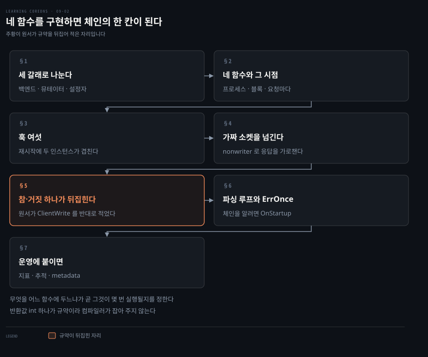
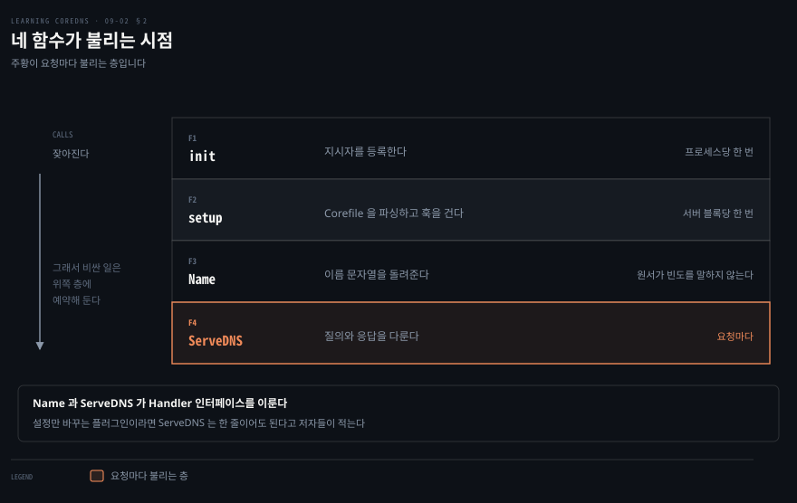
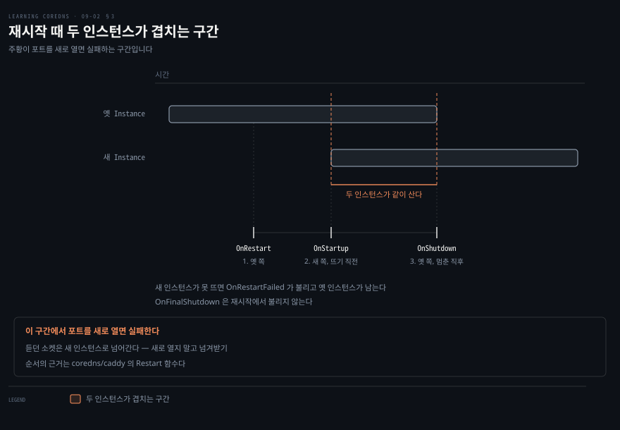
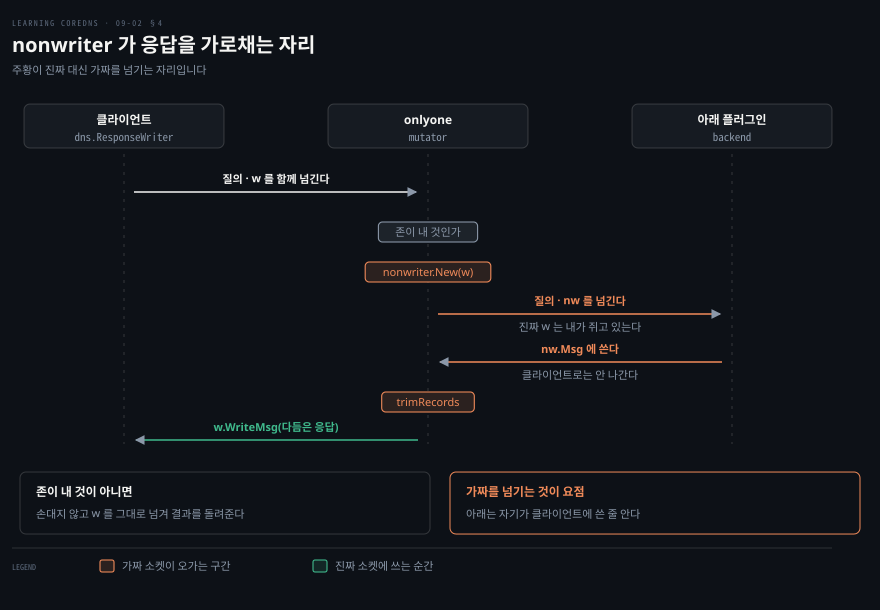
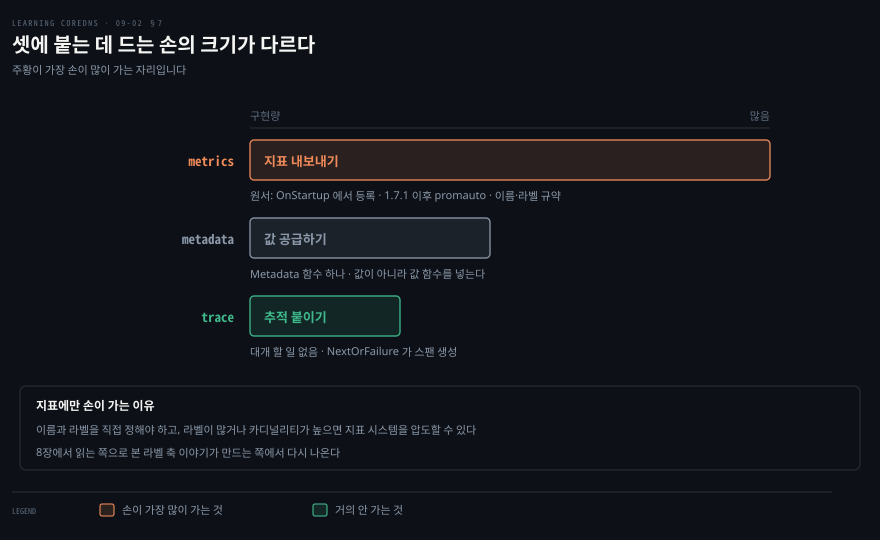

# 네 함수를 구현하면 체인의 한 칸이 된다

---

> 원서 9장 후반부는 플러그인을 직접 작성하는 법을 다룹니다. 구현할 것은 함수 넷뿐이지만, 그 넷이 각각 체인의 다른 시점에 불립니다.

## 핵심 요약

> 이 편이 매달린 하나의 생각은 플러그인을 쓰는 일이 체인의 한 칸이 되어 그 칸의 규약을 지키는 일이라는 것입니다.

저자들이 진입 문턱을 낮게 잡습니다. CoreDNS 플러그인을 쓰는 것은 꽤 단순하고 `init`·`setup`·`Name`·`ServeDNS` 넷만 구현하면 된다는 것입니다. 설정만 바꾸는 플러그인이라면 `ServeDNS` 는 한 줄이어도 됩니다.

넷이 불리는 시점이 다릅니다. `init` 은 프로세스가 뜰 때 한 번, `setup` 은 Corefile 을 파싱하며 서버 블록마다 한 번, `ServeDNS` 는 요청마다입니다. 그래서 무엇을 어느 함수에 둘지가 곧 그것이 몇 번 실행될지를 정합니다.

가장 값진 것은 뒷사람의 응답을 고치는 법입니다. 체인 아래로 요청을 넘길 때 `nonwriter` 라는 가짜 `ResponseWriter` 를 대신 넘기면, 아래가 쓴 응답이 클라이언트로 나가지 않고 내 손에 남습니다. 그것을 고쳐 진짜 소켓에 쓰면 됩니다.

다만 규약을 하나 뒤집어 적은 자리가 원서에 있습니다. `plugin.ClientWrite` 의 참·거짓이 소스와 반대로 설명돼 있어, 그대로 따라 구현하면 응답을 두 번 쓰거나 아예 쓰지 않게 됩니다.


## 학습 목표

이 내용을 읽고 나면:

1. 플러그인이 구현해야 할 네 함수와 각각이 불리는 시점을 말하고, 백엔드·뮤테이터·설정자 중 어느 갈래인지로 구현량을 가늠할 수 있습니다.
2. Caddy 생명주기 훅 여섯 중 재시작에서 무엇이 어떤 순서로 불리는지 구분할 수 있습니다.
3. `nonwriter` 가 왜 필요한지와 어떻게 쓰는지 설명할 수 있습니다.
4. `plugin.ClientWrite` 가 무엇을 뜻하는지 정확히 말할 수 있습니다.
5. 파싱 루프로 지시자 반복을 막는 법과, 체인을 알아야 하는 일을 `OnStartup` 으로 미루는 이유를 설명할 수 있습니다.

아래는 이 문서 전체를 읽는 순서로 이은 지도입니다. 1절부터 3절까지가 뼈대이고, 4절부터 6절까지가 예제 플러그인, 7절이 운영에 붙이는 일입니다.




## 이 문서가 다루지 않는 것

> 이 편은 원서 9장의 후반부입니다.

- 외부 플러그인을 넣어 재빌드하는 법과 `main` 갈아 끼우기 → [한 줄을 옮기면 그 플러그인이 쓸모없어진다](./09-01.%ED%95%9C%20%EC%A4%84%EC%9D%84%20%EC%98%AE%EA%B8%B0%EB%A9%B4%20%EA%B7%B8%20%ED%94%8C%EB%9F%AC%EA%B7%B8%EC%9D%B8%EC%9D%B4%20%EC%93%B8%EB%AA%A8%EC%97%86%EC%96%B4%EC%A7%84%EB%8B%A4.md)
- `metadata` 플러그인을 쓰는 쪽 이야기 → [질문과 답이 어긋나면 클라이언트가 버린다](./07-01.%EC%A7%88%EB%AC%B8%EA%B3%BC%20%EB%8B%B5%EC%9D%B4%20%EC%96%B4%EA%B8%8B%EB%82%98%EB%A9%B4%20%ED%81%B4%EB%9D%BC%EC%9D%B4%EC%96%B8%ED%8A%B8%EA%B0%80%20%EB%B2%84%EB%A6%B0%EB%8B%A4.md)
- Prometheus 지표를 읽는 쪽 → [무엇을 볼지 좁히는 손잡이가 도구마다 다르다](./08-01.%EB%AC%B4%EC%97%87%EC%9D%84%20%EB%B3%BC%EC%A7%80%20%EC%A2%81%ED%9E%88%EB%8A%94%20%EC%86%90%EC%9E%A1%EC%9D%B4%EA%B0%80%20%EB%8F%84%EA%B5%AC%EB%A7%88%EB%8B%A4%20%EB%8B%A4%EB%A5%B4%EB%8B%A4.md)
- Go 문법 전반 → 이 노트는 CoreDNS 쪽 규약만 다루고, 필요한 Go 개념은 2절에서 Java 대응으로 한 줄씩만 짚습니다

남는 것은 체인의 한 칸이 되기 위해 무엇을 지켜야 하는가입니다.


## 1. 세 갈래로 나누고 하나만 잘한다

> 플러그인을 쓰기 전에 자기 것이 어느 갈래인지 정하면 구현할 것이 정해집니다. 갈래마다 `ServeDNS` 가 하는 일이 다릅니다.

플러그인을 바꾸거나 자기 `main` 을 쓰는 것으로 되는 일이 있고 안 되는 일이 있습니다. 저자들이 경계를 긋습니다. DNS 요청과 응답을 조작하려면 자기 플러그인을 써야 합니다.

저자들이 대략 셋으로 나눕니다.

- **백엔드**: 원본에서 데이터를 제공합니다. 파일·외부 데이터베이스·다른 API 일 수도 있고 아예 지어낼 수도 있습니다. `file` 과 `kubernetes` 가 분명한 예입니다
- **뮤테이터**: 들어오는 요청이나 나가는 응답, 또는 둘 다를 고칩니다. `rewrite` 가 분명한 뮤테이터이고, 캐시 계열도 아래쪽 플러그인에서 데이터를 가져오므로 뮤테이터로 볼 수 있습니다
- **설정자**: CoreDNS 의 내부 동작만 바꿉니다. `bind` 와 `log` 가 그렇습니다

저자들이 이 분류를 대략적인 모형이라고 부르고 곧바로 단서를 답니다. 한 플러그인이 이 일들을 다 할 수도 있다는 것입니다. 다만 모범 관행으로는 유닉스 철학대로 한 가지를 잘하는 것을 권합니다. 그래야 최대한 재사용됩니다.

> **노트의 읽기**: 이 분류가 실무에서 값을 하는 자리는 구현량을 가늠할 때입니다. 설정자라면 `ServeDNS` 가 한 줄이어도 되고, 백엔드라면 응답을 짓고 쓰기만 하면 되며, 뮤테이터가 가장 손이 많이 갑니다. 4절의 `nonwriter` 이야기가 뮤테이터에만 필요한 것도 그래서입니다.


## 2. 네 함수가 각각 다른 시점에 불린다

> 구현할 것은 넷뿐입니다. 그런데 그중 셋이 불리는 횟수가 프로세스당 한 번, 서버 블록당 한 번, 요청당 한 번으로 갈립니다.



무엇을 어디에 두어야 하는지 헷갈리는 것이 처음 쓸 때의 문제입니다. 원격 서버에 연결을 여는 코드를 `ServeDNS` 에 두면 요청마다 연결이 열립니다. 판단 기준은 각 함수가 몇 번 불리느냐입니다.

`init` 은 그 이름대로 플러그인의 일회성 초기화를 합니다. Caddy 나 CoreDNS 의 함수가 아니라 표준 Go 패키지 초기화 함수입니다. 플러그인에서는 대개 Caddy 함수를 불러 지시자를 등록하고 그것을 `setup` 함수와 엮는 일만 합니다.

```bash
func init() {
        caddy.RegisterPlugin("onlyone", caddy.Plugin{
                ServerType: "dns",
                Action:     setup,
        })
}
```

`setup` 은 Corefile 에서 플러그인 설정을 파싱합니다. 그 플러그인이 나타나는 서버 블록마다 정확히 한 번씩 불립니다. 저자들이 각주로 단서를 답니다. 한 서버 블록이 존 여럿에 걸치면(`foo.com bar.com { ... }`) 내부적으로 각각이 별도 서버 블록으로 다뤄져 존 수만큼 `setup` 이 불린다는 것입니다. 각 서버 블록은 코드에서 `Config` 객체로 표현되고, `setup` 은 그 객체에 `Handler` 를 더해 플러그인 체인에 자기를 끼워 넣습니다. 원서는 여기에 적어도 백엔드와 뮤테이터 플러그인은 그렇다는 한정을 붙입니다.

> **노트의 읽기**: 각주의 단서는 지금 달라졌습니다. 2021년 CoreDNS 의 Caddy 포크가 서버 블록의 첫 키에 대해서만 지시자를 설정하도록 바뀌었고,[^caddyfirst] CoreDNS 는 나머지 존의 `Config` 에 첫 존의 플러그인과 설정을 복사합니다.[^propagate] 그래서 지금은 존이 여럿인 블록에서도 `setup` 이 블록마다 한 번 불리고, 존들은 같은 플러그인 인스턴스를 나눠 씁니다.

한 서버 블록 안에 같은 지시자가 여러 번 나올 수도 있습니다. 그때 `setup` 은 그 블록에 있는 자기 지시자 전부의 데이터를 받습니다. 다른 블록의 것은 받지 않고 별도 호출로 처리됩니다.

Java 로 옮기면 이렇습니다. Go 의 인터페이스는 `implements` 를 적지 않아도 메서드 모양이 맞으면 구현한 것으로 봅니다. `func (o *onlyone) ServeDNS(...)` 의 `(o *onlyone)` 은 리시버로, Java 메서드의 `this` 를 앞에 드러내 적은 것입니다. `context.Context` 는 요청 하나에 딸린 마감 시각과 취소 신호, 요청 범위 값을 싣고 호출 사슬을 따라 내려가는 인자입니다.

`Name` 과 `ServeDNS` 는 `Handler` 인터페이스를 구현합니다. `Name` 은 이름 문자열 하나를 돌려주는 것이 전부이고, `ServeDNS` 가 백엔드와 뮤테이터의 심장입니다.

> **노트의 읽기**: 현재 인트리 플러그인은 `init` 을 한 줄로 씁니다. `func init() { plugin.Register("template", setupTemplate) }` 꼴입니다.[^register] `plugin.Register` 는 원서의 `caddy.RegisterPlugin(name, caddy.Plugin{ServerType: "dns", Action: action})` 를 그대로 감싼 여섯 줄짜리 함수라 동작은 같습니다. 달라진 것은 import 하는 caddy 가 `github.com/coredns/caddy` 로 바뀐 것 하나입니다. 원서의 코드를 그대로 옮겨 적으면 지금은 빌드되지 않지만, import 경로만 바꾸면 `caddy.RegisterPlugin` 을 직접 부르는 원서의 `init` 도 그대로 동작합니다. `plugin.Register` 로 줄이는 것은 인트리 관례를 따르는 선택입니다.


## 3. 훅 여섯 중 재시작에 불리는 것을 안다

> 원격 연결이나 포트를 여는 플러그인이라면 재시작을 잘못 다루는 순간 포트를 뺏깁니다. `setup` 에서 훅을 걸어 그것을 다룹니다.



원격 연결을 `setup` 안에서 그냥 열면 문제가 생깁니다. `setup` 은 파싱 중에 반복해서 불릴 수 있어서 연결이 몇 개 열릴지 알 수 없습니다.

그래서 저자들은 원격 연결 같은 일회성 준비를 `setup` 에서 하되, 대개 `caddy.Controller` 의 생명주기 훅으로 콜백을 만들어 하라고 적습니다. `setup` 이 연결을 여는 자리이긴 하지만, 실제로 여는 시점은 훅으로 잡는다는 뜻입니다. `setup` 이 Corefile 파싱 중에, 그것도 반복해서 불릴 수 있으므로 훅을 쓰는 편이 부수 자원을 관리하는 데 가장 통제력이 좋다고 저자들이 적습니다.

| 훅 | 언제 불리나 |
|----|------------|
| `OnFirstStartup` | 서버 시작 직전. 프로세스 시작 때 딱 한 번. 첫 인스턴스에만 불리고 재시작으로 만들어지는 인스턴스에는 안 불립니다 |
| `OnStartup` | 서버 시작 직전. 최초 시작과 재시작 모두 |
| `OnRestart` | 서버 시작 직전. 재시작일 때만 |
| `OnRestartFailed` | 재시작이 실패했을 때 |
| `OnShutdown` | 원서 표 기준 서버 정지 직전. 재시작과 프로세스 종료 모두. 코드의 재시작 경로에서는 옛 인스턴스를 멈춘 직후에 불립니다 |
| `OnFinalShutdown` | 서버 정지 직전. 프로세스 종료일 때만 |

### 재시작 때 두 인스턴스가 함께 삽니다

원서는 CoreDNS 가 `SIGUSR1` 이나 `SIGHUP` 을 받으면 Corefile 을 다시 읽고 서버를 우아하게 재시작한다고 적습니다. 지금은 `SIGUSR1` 만 그렇습니다. Caddy 포크의 신호 처리 코드가 `SIGHUP` 을 받으면 사용자가 모르게 보내질 때가 있다는 이유로 무시합니다.[^sighup] 내부에서 새 Corefile 로 새 `caddy.Instance` 가 만들어지고, 듣고 있던 소켓의 파일 디스크립터가 그쪽으로 넘어갑니다.

여기서 저자들이 실무 경고를 답니다. 서버에 연결을 열거나 로컬 포트를 여는 플러그인이라면 재시작 이벤트를 제대로 다뤄야 하고, 열린 포트를 새로 열려고 하지 말고 넘겨받으라는 것입니다. 새로 열면 이미 쓰이는 포트라 실패합니다.

> **노트의 읽기**: 훅 호출 순서를 설명하는 원서 문장은 엉성하게 읽힙니다. 재시작 때 `OnShutdown`·`OnStartup`·`OnRestart` 훅이 불린다고 적은 뒤 곧바로 "이것들은 전부 `OnShutdown` 앞에 불린다" 고 적어, `OnShutdown` 이 자기보다 먼저 불린다는 말처럼 보입니다. 소스를 보면 뜻이 풀립니다. `Restart` 는 옛 인스턴스의 `OnRestart` 를 먼저 부르고, 넘겨받은 소켓으로 새 인스턴스를 띄우며(이때 새 쪽의 `OnStartup` 이 불립니다), 그다음에야 옛 인스턴스를 멈추고 그 `OnShutdown` 을 부릅니다.[^restart] 뒤의 `OnShutdown` 은 옛 인스턴스의 것이고, 그래서 그 사이에 두 인스턴스가 함께 떠 있다는 원서의 결론이 성립합니다. `OnFinalShutdown` 은 재시작에서 불리지 않으므로 이 문장의 자리에 들어갈 수 없습니다.


## 4. 뒷사람의 응답을 고치려면 가짜 소켓을 넘긴다

> 뮤테이터는 자기 뒤 플러그인이 만든 응답을 고쳐야 합니다. 그런데 뒤 플러그인은 응답을 클라이언트 소켓에 그냥 써 버립니다.



`ServeDNS` 는 DNS 요청과 응답 소켓 참조를 받습니다. 그 소켓에 응답을 쓸 수도 있고 요청을 다음 플러그인에게 넘길 수도 있습니다. 백엔드라면 간단합니다. 질의를 보고 레코드를 만들어 넘겨받은 `ResponseWriter` 에 쓰면 됩니다.

뮤테이터는 그렇지 않습니다. 체인 뒤쪽 플러그인이 만든 응답을 고쳐야 하는데, 그냥 넘기면 그 플러그인이 클라이언트에게 직접 써 버려 손댈 기회가 없습니다.

그래서 진짜 소켓 대신 가짜를 넘깁니다. `nonwriter` 라는 `ResponseWriter` 구현이 그것입니다. 아래 플러그인이 거기에 쓴 응답은 밖으로 나가지 않고 그 객체의 `Msg` 필드에 남습니다.

저자들의 예제는 `onlyone` 입니다. 응답에 같은 유형의 레코드가 여럿이면 유형마다 하나씩만 남기고 잘라 내는 뮤테이터입니다. A 레코드가 다섯 개 실린 응답이 오면 클라이언트에게는 A 레코드 하나만 갑니다.

```bash
onlyone [ZONES...] {
    types TYPES
}
```

`types` 는 잘라 낼 유형을 정하고 생략하면 A 와 AAAA 입니다. `ZONES` 를 생략하면 서버 블록의 존을 씁니다.

`ServeDNS` 의 뼈대가 네 걸음입니다.

```bash
state := request.Request{W: w, Req: r}

if plugin.Zones(o.zones).Matches(state.Name()) == "" {
        return plugin.NextOrFailure(o.Name(), o.Next, ctx, w, r)
}

nw := nonwriter.New(w)
rcode, err := plugin.NextOrFailure(o.Name(), o.Next, ctx, nw, r)
if err != nil {
        return rcode, err
}

w.WriteMsg(o.trimRecords(nw.Msg))
return rcode, err
```

먼저 `request.Request` 를 만들어 `state` 라 부릅니다. 편의 메서드가 여럿 달린 구조체이고, 이름을 `state` 로 두는 것이 인트리 플러그인 전부와 맞추는 관행이라고 저자들이 짚습니다.

다음으로 질문의 이름이 이 플러그인이 맡은 존 안에 드는지 봅니다. 안 들면 손대지 않고 `plugin.NextOrFailure` 로 다음 플러그인에게 넘긴 결과를 그대로 돌려줍니다.

> **원문 정오**: 이 검사를 설명하는 산문은 `Matches` 가 이름이 설정한 존 안에 들면 `true` 를 돌려준다고 적습니다. 바로 위의 Example 9-19 코드는 `Matches(state.Name()) == ""` 로 빈 문자열과 비교합니다. `Matches` 는 참·거짓이 아니라 맞은 존 가운데 가장 구체적인 것의 이름을 돌려주고, 맞는 존이 없으면 빈 문자열을 돌려줍니다.[^matches] 같은 쪽의 산문과 코드가 서로 다른 반환형을 말하고 있고, 맞는 쪽은 코드입니다.

드는 경우에만 `nonwriter.New(w)` 로 가짜를 만들어 그것을 다음 플러그인에게 넘깁니다. 그 호출이 오류 없이 돌아오면 응답은 `nw.Msg` 에 있습니다. 그것을 다듬어 원래 넘겨받았던 진짜 `ResponseWriter` 에 `WriteMsg` 로 씁니다.

> **원문 정오**: 저자들이 `nonwriter` 의 패키지 경로를 `github.com/coredns/plugin/pkg/nonwriter` 로 적습니다. 저장소 이름이 빠져 있어 `github.com/coredns/coredns/plugin/pkg/nonwriter` 여야 합니다. 예제 파일을 받아 오라고 안내하는 주소 `https://github.com/coredns/learning-coredns/plugins/only-one` 도 두 군데가 어긋납니다. GitHub 의 디렉터리 주소에 필요한 `/tree/master` 가 없고, 디렉터리 이름도 저장소에서는 `onlyone` 입니다.[^repo2] 원서 안에서도 같은 장의 `replace` 지시문 예시는 `plugins/onlyone` 으로 적어 스스로 어긋납니다. 같은 절에서 플러그인이 등록되는 곳을 `plug-in change` 로 적은 자리도 있습니다. `chain` 의 오식이고, 같은 장에서 `plug-in chain` 이라는 표현이 나오는 다른 다섯 자리는 모두 `chain` 으로 맞게 적습니다.

> **노트의 읽기**: 산문의 `trim Records` 도 눈에 띄지만 정오로 세지 않았습니다. 같은 장의 코드 블록과 각주는 `trimRecords` 로 붙여 적고 있어, 산문에서만 벌어진 공백은 등가폭 서체 구간이 끊길 때 나오는 추출 인공물일 수 있습니다. 인쇄본으로 확인하기 전까지는 원서 오류로 올리지 않습니다.


## 5. 참·거짓 하나가 규약을 뒤집는다

> `ServeDNS` 가 돌려주는 정수는 응답을 이미 썼는지를 앞쪽 플러그인과 서버에게 알리는 신호입니다. 원서의 설명이 그 신호를 반대로 읽습니다.

응답을 이미 쓴 플러그인과 아직 안 쓴 플러그인을 위쪽에서 구분하지 못하면 응답이 두 번 나가거나 아예 안 나갑니다. 그 구분을 반환값 하나가 맡습니다.

`ServeDNS` 는 값을 둘 돌려줍니다. `int` 와 `error` 입니다. 오류는 보통의 Go 오류이고, 오류가 났다면 사용자에게 도움이 되고 `errors` 플러그인이 기록할 정보를 담아 돌려줘야 합니다.

저자들의 표현으로 정수는 `dns.ResponseCode` 값을 가질 수 있습니다. 다만 `github.com/miekg/dns` 에 그런 이름의 타입은 없고 `RcodeSuccess`·`RcodeServerFailure` 같은 타입 없는 `int` 상수가 있을 뿐입니다. 아래 인용하는 `ClientWrite(rcode int) bool` 도 맨 `int` 를 받습니다. 저자들이 그 쓸모를 짚습니다. 응답이 클라이언트 소켓에 이미 쓰였는지를 서버와 앞쪽 플러그인에게 알리는 데 쓰인다는 것입니다. 그 판정에 쓰는 함수가 `plugin.ClientWrite` 입니다.

원서가 그 함수의 참·거짓 규약을 이렇게 적습니다.

> `"If plugin.ClientWrite returns true for the value, a response has not been written so the server or plug-in should write it out."`

옮기면 `true` 가 아직 쓰이지 않았다는 뜻이 됩니다.

소스는 반대로 적습니다.

```bash
// ClientWrite returns true if the response has been written to the client.
// Each plugin to adhere to this protocol.
func ClientWrite(rcode int) bool {
	switch rcode {
	case dns.RcodeServerFailure:
		fallthrough
	case dns.RcodeRefused:
		fallthrough
	case dns.RcodeFormatError:
		fallthrough
	case dns.RcodeNotImplemented:
		return false
	}
	return true
}
```

> **원문 정오**: 함수의 문서 주석이 `"ClientWrite returns true if the response has been written to the client"` 입니다.[^clientwrite] `true` 는 이미 썼다는 뜻입니다. 원서는 그 반대로 적었습니다. 저자들이 함께 실은 예외 목록은 맞습니다. `SERVFAIL`·`REFUSED`·`FORMERR`·`NOTIMP` 넷이 `false` 를 돌려받는 값이고, 그 넷이 바로 응답을 아직 쓰지 않은 경우입니다. 목록은 맞고 그 목록을 설명하는 문장이 뒤집혀 있습니다.

주석만으로도 판정이 서지만 호출부가 더 분명합니다. 서버는 `if !plugin.ClientWrite(rcode)` 일 때만 오류 응답을 씁니다.[^callsite] 원서 문장대로라면 이 조건이 반대여야 합니다.

이 정오가 위험한 것은 조용히 틀리기 때문입니다. 원서 문장대로 구현하면 이미 쓴 응답을 한 번 더 쓰거나, 아직 안 쓴 실패 응답을 아무도 안 쓰게 됩니다. 컴파일은 통과하고 대부분의 정상 질의에서는 티가 나지 않다가 실패 경로에서만 어긋납니다.

> **노트의 읽기**: 저 넷이 왜 하필 그 넷인지도 목록에서 읽힙니다. 전부 플러그인이 답을 만들지 못한 경우입니다. 답을 못 만들었으니 쓸 것도 없고, 그래서 위쪽에 있는 누군가가 대신 오류 응답을 써 줘야 합니다.


## 6. 파싱 루프와 한 번만 쓰이게 하는 법

> `setup` 이 받는 `caddy.Controller` 는 지시자를 훑는 커서입니다. 그 커서를 어떻게 도는지가 같은 지시자를 여러 번 쓸 수 있는지를 정합니다.

Corefile 에서 같은 지시자를 두 번 적으면 어떻게 될까요? 허용해야 하는 플러그인도 있고 막아야 하는 플러그인도 있는데, 그 갈림이 같은 루프를 어떻게 도느냐에 있습니다.

원서 Example 9-18 의 뼈대만 남기면 이렇습니다.

```bash
func parse(c *caddy.Controller) (*onlyone, error) {
        o := &onlyone{types: typeMap{dns.TypeA: true, dns.TypeAAAA: true}, pick: rand.Intn}
        found := false
        for c.Next() {
                // onlyone should just be in the server block once
                if found {
                        return nil, plugin.ErrOnce
                }
                found = true
                args := c.RemainingArgs()
                ...
                for c.NextBlock() {
                        switch c.Val() {
                        case "types":
                                args := c.RemainingArgs()
                                ...
                        default:
                                return nil, fmt.Errorf("invalid option %q", c.Val())
                        }
                }
        }
        return o, nil
}
```

`parse` 함수가 두 겹의 루프를 돕니다. 바깥의 `c.Next` 루프가 이 지시자의 등장을 훑고, 안쪽의 `c.NextBlock` 루프가 중괄호 블록 안의 하위 지시자를 훑습니다.

여기에 까다로운 점이 하나 있다고 저자들이 짚습니다. `c.Next` 는 `true` 를 돌려줄 수 있고 그러면 루프를 한 번 더 돕니다. 서버 블록에 `onlyone` 지시자가 여러 번 나오면 그것들이 다 소비될 때까지 `true` 를 돌려줍니다.

안쪽 `c.NextBlock` 루프는 지시자 뒤에 중괄호 블록이 붙었을 때만 들어갑니다. 들어가면 닫는 중괄호에 닿을 때까지 한 줄씩 도는데, 줄에 남은 토큰을 `c.RemainingArgs` 로 소비해 줘야 그렇게 됩니다.

`onlyone` 을 한 서버 블록에서 여러 번 쓰는 것은 말이 안 되므로 `found` 변수로 막고, 걸리면 표준 오류인 `plugin.ErrOnce` 를 돌려줍니다.

파싱이 끝나면 `setup` 이 `GetConfig(c).AddPlugin` 으로 이 서버 블록의 플러그인 목록에 자기를 넣습니다. 여기서 넘기는 것이 핸들러가 아니라 함수라는 점을 저자들이 짚습니다. 체인의 다음 플러그인을 나중에 꽂아 넣기 위해서입니다.

이유가 시점에 있습니다. 이 설정은 전부 Corefile 을 파싱하는 동안 벌어지고, 실제 플러그인 체인은 내부 `dns.Server` 가 만들어질 때까지 인스턴스화되지 않습니다.

여기서 실무적으로 중요한 결론 하나가 나옵니다. 체인에 어떤 플러그인이 있는지 알아야 하는 플러그인은 `OnStartup` 훅을 써야 합니다. 저자들이 그런 플러그인으로 `metadata`·`metrics`·`ready` 를 듭니다. 훅을 안 쓰면 `plugin.cfg` 에서 자기보다 뒤에 오는 것들을 놓칠 수 있다고 적습니다.

### 직접 돌려 보려면

만든 플러그인을 CoreDNS 에 넣는 절차는 [9장 전반부](./09-01.%ED%95%9C%20%EC%A4%84%EC%9D%84%20%EC%98%AE%EA%B8%B0%EB%A9%B4%20%EA%B7%B8%20%ED%94%8C%EB%9F%AC%EA%B7%B8%EC%9D%B8%EC%9D%B4%20%EC%93%B8%EB%AA%A8%EC%97%86%EC%96%B4%EC%A7%84%EB%8B%A4.md) 의 `any` 와 같습니다. `plugin.cfg` 의 알맞은 자리에 `onlyone:github.com/coredns/learning-coredns/plugins/onlyone` 한 줄을 넣고 다시 빌드합니다. 걸리는 것이 하나 있다고 저자들이 적습니다. 빌드할 때 Go 가 그 모듈을 GitHub 에서 내려받아 버려, 내 워크스테이션에서 고친 코드가 들어가지 않습니다. CoreDNS 의 `go.mod` 에 `replace` 지시문을 더해 로컬 디렉터리를 쓰게 합니다.

```bash
replace github.com/coredns/learning-coredns/plugins/onlyone => /home/learning-coredns/plugins/onlyone
```

경로는 원서의 예시이고, 자기 플러그인이 있는 디렉터리로 바꿔 적습니다. 이렇게 두면 코드를 고치고 다시 빌드하는 것만으로 바뀐 동작을 볼 수 있습니다.

> **노트의 읽기**: 9장 전반부의 논지가 여기서 코드로 다시 나타납니다. 순서가 `plugin.cfg` 에 박혀 있기 때문에 "내 뒤에 무엇이 있는가" 는 파싱 시점에 알 수 없고, 체인이 다 지어진 뒤인 `OnStartup` 에서야 알 수 있습니다. 저자들이 각주로도 같은 것을 상기시킵니다. 이것은 `plugin.cfg` 에 기반한 고정된 컴파일 타임 순서라는 것입니다.


## 7. 운영에 붙이면 인트리와 같아진다

> 지표·추적·metadata 셋에 붙이는 일이 남습니다. 셋 중 둘은 손이 거의 안 갑니다.



여기까지로 동작하는 플러그인은 나왔습니다. 그런데 운영에 올리면 그것이 얼마나 불리는지도 어디서 느린지도 밖에서 보이지 않습니다.

셋에 붙여 그 사각을 없앱니다. 지표는 `prometheus` 플러그인에, 타이밍은 `trace` 플러그인에, 로깅·추적·정책에 쓸 값은 `metadata` 플러그인에 붙입니다.

지표는 손이 갑니다. 표준 Prometheus 클라이언트 라이브러리를 쓰고, 원서 시절에는 `OnStartup` 콜백에서 지표를 등록해야 했습니다.

```bash
templateMatchesCount = prometheus.NewCounterVec(prometheus.CounterOpts{
        Namespace: plugin.Namespace,
        Subsystem: "template",
        Name:      "matches_total",
        Help:      "Counter of template regex matches.",
}, []string{"server", "zone", "class", "type"})
```

규약이 셋입니다.

- `Namespace`: `plugin.Namespace` 를 씁니다
- `Subsystem`: 플러그인 이름을 씁니다
- `Name`: 자유롭게 짓되 Prometheus 프로젝트의 관례를 따릅니다

관례의 요점은 넷입니다.

- 라벨 값이 달라도 같은 것을 재야 합니다
- 단위를 모든 경우에 일관되게 써야 합니다
- 이름 끝에 복수형 단위를 붙이는 편이 좋습니다
- 기본 단위를 쓰는 편이 좋습니다 — 시간은 초, 메모리는 바이트, 누적은 total 입니다

> **노트의 읽기**: 등록 단계는 1.7.1 에서 없어졌습니다. 지표를 만들 때 `promauto` 패키지를 써서 만들면서 곧바로 등록하도록 인트리 플러그인이 바뀌었습니다.[^n171] 지금 `template` 의 지표도 `promauto.NewCounterVec` 으로 선언되고 라벨에 `view` 가 붙어 있습니다.[^tmplmetrics] 새로 쓰는 플러그인이라면 훅 없이 이 방식을 따르면 됩니다.

라벨에 대한 경고가 뒤따릅니다. 라벨이 너무 많거나 카디널리티가 너무 높은 값을 쓰면 저장되는 데이터가 크게 늘어 지표 시스템의 비용을 올리거나 아예 압도할 수 있다는 것입니다. 8장에서 본 라벨 축 이야기가 만드는 쪽에서 다시 나옵니다.

추적은 대부분 아무것도 안 해도 됩니다. 저자들의 표현대로 사실 대부분의 플러그인은 정확히 아무것도 할 필요가 없습니다. 다음 플러그인을 부르는 데 쓰는 `plugin.NextOrFailure` 가 기본 통합을 알아서 하고, 이 함수가 플러그인마다 새 Span 을 만듭니다.

metadata 는 함수 하나입니다. `metadata.Provider` 인터페이스를 구현하면 되고, 그 인터페이스에는 `Metadata` 함수 하나뿐입니다. `context.Context` 와 `request.Request` 를 받아 `context.Context` 를 돌려줍니다.[^provider]

```bash
func (p *myplugin) Metadata(ctx context.Context,
        state request.Request) context.Context {
    metadata.SetValueFunc(ctx, "myplugin/foo", func() string {
         return state.Name()
    })
    return ctx
}
```

> **원문 정오**: 저자들은 `Metadata` 가 `"accepts the same parameters as ServeDNS"` 라고 적습니다. 같지 않습니다. `ServeDNS` 는 `(ctx, w dns.ResponseWriter, r *dns.Msg)` 셋을 받고 `Metadata` 는 `(ctx, state request.Request)` 둘을 받습니다.[^provider] 저자들이 바로 위에 싣는 Example 9-22 의 시그니처가 이미 그 사실을 보이고 있습니다.

여기에 설계 하나가 숨어 있습니다. 원서는 `Metadata` 가 `metadata` 플러그인의 존에 맞는 모든 요청마다 체인의 모든 플러그인에 대해 불린다고 적습니다. 정확히는 `metadata.Provider` 를 구현한 플러그인만입니다. `metadata` 플러그인이 `OnStartup` 에서 체인을 훑어 그 인터페이스를 구현한 것만 공급자 목록에 담기 때문입니다.[^mdsetup] 그래도 요청마다 불리므로 빨라야 합니다. 그래서 값이 아니라 값을 구하는 함수를 `Context` 에 넣습니다. `log` 같은 소비자가 그 metadata 를 끝내 쓰지 않으면 그 함수는 한 번도 불리지 않습니다.

그렇게 넣은 값은 7장에서 본 `{/LABEL}` 로 꺼내 씁니다.

```bash
log foo.example "Query: {name} {class} {type} {/myplugin/foo}"
```

> **노트의 읽기**: 지연 평가를 고른 이유가 호출 횟수에 있습니다. 공급자 수 곱하기 요청 수만큼 불리는 자리라, 값을 미리 만들면 아무도 안 쓰는 값을 요청마다 만들게 됩니다. 7장에서 `metadata` 를 소비자 쪽에서 봤을 때는 안 보이던 비용이 만드는 쪽에서 드러납니다.


## 결정 치트시트

> 무엇을 만들지에서 시작해 구현할 것을 고릅니다.

| 만들려는 것 | `ServeDNS` 가 하는 일 | 더 필요한 것 |
|------------|---------------------|-------------|
| 설정자 | 거의 없음. 한 줄이어도 됩니다 | `setup` 에서 설정만 |
| 백엔드 | 질의로 레코드를 짓고 `w` 에 씁니다 | 데이터 원본 연결은 `OnStartup` 훅에서 |
| 뮤테이터 | `nonwriter` 로 받아 고쳐 진짜 `w` 에 씁니다 | 존 매칭으로 남의 질의는 그냥 넘기기 |
| 같은 블록에 한 번만 | — | `found` 검사 + `plugin.ErrOnce` |
| 체인의 다른 플러그인을 알아야 함 | — | `OnStartup` 훅. 파싱 시점에는 알 수 없습니다 |
| 지표 내보내기 | — | 1.7.1 이후 `promauto` 로 만들면서 등록 · 원서 시절엔 `OnStartup` 에서 등록 |
| metadata 제공 | — | `Metadata` 함수 하나 · 값이 아니라 값 함수를 넣기 |


## 적용 관점

> Spring 으로 미들웨어를 짜 본 사람에게 이 편은 대부분 낯익고, 한 자리만 낯섭니다.

낯익은 쪽은 체인과 래핑입니다. `ServeDNS` 가 다음 것을 부르고 그 결과를 고치는 구조는 서블릿 필터의 `chain.doFilter` 전후에 손대는 것과 같습니다.

짝을 지어 보면 이렇습니다.

- `nonwriter`: `HttpServletResponseWrapper`
- `plugin.ErrOnce`: 같은 필터를 두 번 등록했을 때의 방어
- `OnStartup`: `SmartLifecycle.start()` — 둘 다 시작 단계에서, 요청을 받기 전에 불립니다

`plugin.ClientWrite` 는 이름부터 헷갈림을 부릅니다. 이름만 보면 "클라이언트에 써라" 라는 명령처럼 읽히지만 실제로는 "클라이언트에 이미 썼는가" 를 묻는 함수입니다. 원서가 뒤집어 적은 것도 이 이름 때문일 수 있습니다.

낯선 쪽은 반환값이 규약이라는 점입니다. 서블릿 필터는 응답을 썼는지를 반환값으로 알리지 않습니다. CoreDNS 는 `int` 하나로 그것을 알리고, 그 해석을 `plugin.ClientWrite` 가 맡습니다. 5절의 정오가 위험한 이유가 여기 있습니다. 타입은 그냥 `int` 라서 컴파일러가 아무것도 잡아 주지 않습니다.

플러그인을 쓸 일이 없더라도 이 편이 값을 하는 자리가 하나 있습니다. 남의 외부 플러그인을 가져다 쓸 때 그 코드가 `nonwriter` 를 쓰는지, `ClientWrite` 규약을 지키는지, 존 매칭 없이 모든 질의를 가로채지는 않는지를 볼 수 있게 됩니다.


## 면접에서 받을 만한 질문

1. CoreDNS 플러그인이 구현해야 할 네 함수는 무엇이고 각각 몇 번 불립니까?
2. 백엔드·뮤테이터·설정자는 무엇이 다릅니까?
3. 뮤테이터가 `nonwriter` 를 쓰는 이유는 무엇입니까?
4. `plugin.ClientWrite` 가 `true` 를 돌려주면 무슨 뜻입니까?
5. `ClientWrite` 가 `false` 를 돌려주는 네 응답 코드의 공통점은 무엇입니까?
6. 재시작 때 두 `caddy.Instance` 가 함께 사는 구간에서 무엇을 조심해야 합니까?
7. 체인의 다른 플러그인을 알아야 하는 플러그인은 왜 `OnStartup` 을 써야 합니까?
8. `Metadata` 함수가 값이 아니라 함수를 넣는 이유는 무엇입니까?
9. `foo.com bar.com { onlyone }` 서버 블록 하나에서 `setup` 은 몇 번 불립니까? 원서의 설명과 지금 코드가 다르다면, `setup` 안에서 연결을 하나씩 여는 플러그인은 무엇이 달라집니까?


## 정답 (자답 후 펼치기)

### 정답 1 — 넷과 그 시점

`init` 은 프로세스가 뜰 때 한 번, `setup` 은 그 지시자가 나오는 서버 블록마다 한 번, `Name` 은 이름을 물을 때, `ServeDNS` 는 요청마다 불립니다.

### 정답 2 — 데이터를 주느냐 고치느냐 설정만 바꾸느냐

백엔드는 원본에서 데이터를 제공합니다. 뮤테이터는 요청이나 응답이나 둘 다를 고칩니다. 설정자는 CoreDNS 의 내부 동작만 바꿉니다. 저자들이 이것을 대략적인 모형이라고 부르고 한 플러그인이 다 할 수도 있다는 단서를 답니다.

### 정답 3 — 아래가 클라이언트에게 직접 쓰기 때문

진짜 `ResponseWriter` 를 그대로 넘기면 아래 플러그인이 응답을 클라이언트에게 써 버려 고칠 기회가 없습니다. `nonwriter` 를 대신 넘기면 그 응답이 밖으로 나가지 않고 `Msg` 필드에 남아 손댈 수 있습니다.

### 정답 4 — 이미 썼다는 뜻

소스 주석이 `"ClientWrite returns true if the response has been written to the client"` 입니다. 원서는 이것을 반대로 적었습니다.

### 정답 5 — 답을 만들지 못한 경우

`SERVFAIL`·`REFUSED`·`FORMERR`·`NOTIMP` 넷입니다. 전부 플러그인이 답을 만들지 못한 경우라 쓸 응답도 없고, 그래서 위쪽의 누군가가 대신 오류 응답을 써 줘야 합니다.

### 정답 6 — 포트를 새로 열지 말 것

재시작은 옛 인스턴스의 `OnRestart`, 새 인스턴스의 `OnStartup`, 옛 인스턴스의 `OnShutdown` 순서로 흐르므로 그 사이에 두 인스턴스가 함께 떠 있습니다. 듣고 있던 소켓의 파일 디스크립터가 새 인스턴스로 넘어갑니다. 열린 포트를 새로 열려고 하면 이미 쓰이는 포트라 실패하므로, 넘겨받는 쪽으로 다뤄야 합니다.

### 정답 7 — 파싱 시점에는 체인이 없기 때문

`setup` 은 Corefile 파싱 중에 불리고, 실제 체인은 내부 `dns.Server` 가 만들어질 때까지 인스턴스화되지 않습니다. 그래서 파싱 시점에 물으면 `plugin.cfg` 에서 자기보다 뒤에 오는 것들을 놓칠 수 있습니다.

### 정답 8 — 안 쓰이면 계산하지 않으려고

`Metadata` 는 요청마다 `metadata.Provider` 를 구현한 모든 플러그인에 대해 불리므로 빨라야 합니다. 값 대신 값 함수를 넣어 두면, 소비자가 그 값을 끝내 쓰지 않을 때 함수가 한 번도 불리지 않습니다.

### 정답 9 — 원서는 둘, 지금은 하나

원서의 각주대로라면 존마다 별도 서버 블록으로 다뤄져 `setup` 이 두 번 불립니다. 지금 코드는 블록의 첫 키에 대해서만 지시자를 설정하고 나머지 존에는 그 설정을 복사하므로 한 번만 불립니다. `setup` 안에서 연결을 여는 플러그인이라면 원서 시절에는 연결이 존 수만큼 열렸고, 지금은 하나가 열려 두 존이 나눠 씁니다. 어느 쪽이든 호출 횟수에 기대지 말고 훅으로 여는 시점을 잡는 것이 안전합니다.


## 핵심 개념 체크리스트

- [ ] 네 함수가 각각 몇 번 불리는지 말하고, 만들려는 플러그인이 백엔드·뮤테이터·설정자 중 어디인지로 구현량을 가늠할 수 있는가?
- [ ] 재시작 때 `OnRestart`·`OnStartup`·`OnShutdown` 이 어느 인스턴스에서 어떤 순서로 불리는지, 그래서 왜 포트를 넘겨받아야 하는지 말할 수 있는가?
- [ ] 뮤테이터가 `nonwriter` 를 넘기는 이유와, 존 매칭에 실패한 질의를 그냥 넘기는 이유를 설명할 수 있는가?
- [ ] `plugin.ClientWrite` 의 `true` 가 무엇을 뜻하고 `false` 를 받는 네 응답 코드의 공통점이 무엇인지 말할 수 있는가?
- [ ] `found` 와 `plugin.ErrOnce` 로 반복을 막는 법과, 체인을 알아야 하는 일을 `OnStartup` 으로 미루는 이유를 설명할 수 있는가?


## 관련 문서

- [Learning CoreDNS 정독 인덱스](./README.md)
- [한 줄을 옮기면 그 플러그인이 쓸모없어진다](./09-01.%ED%95%9C%20%EC%A4%84%EC%9D%84%20%EC%98%AE%EA%B8%B0%EB%A9%B4%20%EA%B7%B8%20%ED%94%8C%EB%9F%AC%EA%B7%B8%EC%9D%B8%EC%9D%B4%20%EC%93%B8%EB%AA%A8%EC%97%86%EC%96%B4%EC%A7%84%EB%8B%A4.md) — 9장 전반부. 6절의 `OnStartup` 이야기가 그 편의 논지와 맞물립니다
- [질문과 답이 어긋나면 클라이언트가 버린다](./07-01.%EC%A7%88%EB%AC%B8%EA%B3%BC%20%EB%8B%B5%EC%9D%B4%20%EC%96%B4%EA%B8%8B%EB%82%98%EB%A9%B4%20%ED%81%B4%EB%9D%BC%EC%9D%B4%EC%96%B8%ED%8A%B8%EA%B0%80%20%EB%B2%84%EB%A6%B0%EB%8B%A4.md) — `metadata` 를 쓰는 쪽
- [무엇을 볼지 좁히는 손잡이가 도구마다 다르다](./08-01.%EB%AC%B4%EC%97%87%EC%9D%84%20%EB%B3%BC%EC%A7%80%20%EC%A2%81%ED%9E%88%EB%8A%94%20%EC%86%90%EC%9E%A1%EC%9D%B4%EA%B0%80%20%EB%8F%84%EA%B5%AC%EB%A7%88%EB%8B%A4%20%EB%8B%A4%EB%A5%B4%EB%8B%A4.md) — 라벨 카디널리티를 읽는 쪽


## 참고 자료

- 원서: 《Learning CoreDNS: Configuring DNS for Cloud Native Environments》 9장 Building a Custom Server 후반부
- 서지: John Belamaric·Cricket Liu, O'Reilly, 2019년, ISBN 978-1492047964

[^clientwrite]: CoreDNS 소스 `plugin/plugin.go` — `"// ClientWrite returns true if the response has been written to the client. // Each plugin to adhere to this protocol."` 와 `false` 를 돌려주는 네 rcode. <https://github.com/coredns/coredns/blob/master/plugin/plugin.go>
[^provider]: CoreDNS 소스 `plugin/metadata/provider.go` — `Metadata(ctx context.Context, state request.Request) context.Context`. <https://github.com/coredns/coredns/blob/master/plugin/metadata/provider.go>
[^callsite]: CoreDNS 소스 `core/dnsserver/server.go` — `if !plugin.ClientWrite(rcode) { errorFunc(s.Addr, w, r, rcode) }`. <https://github.com/coredns/coredns/blob/master/core/dnsserver/server.go>
[^repo2]: 원서의 예제 저장소 `plugins/` 아래 실제 디렉터리는 `onlyone` 과 `setupcheck` 이고, 안내된 `plugins/only-one` 은 404 다. <https://github.com/coredns/learning-coredns/tree/master/plugins>
[^register]: CoreDNS 소스 `plugin/register.go` — `func Register(name string, action caddy.SetupFunc) { caddy.RegisterPlugin(name, caddy.Plugin{ServerType: "dns", Action: action}) }`, import 은 `github.com/coredns/caddy`. <https://github.com/coredns/coredns/blob/master/plugin/register.go>
[^caddyfirst]: coredns/caddy `caddy.go` — `// only set up directives for the first key in a block` `if j > 0 { continue }`, 커밋 "init plugins only for first zone in block (#1)"(2021-05-12). <https://github.com/coredns/caddy/blob/master/caddy.go>
[^propagate]: CoreDNS 소스 `core/dnsserver/register.go` — `propagateConfigParams` 가 `c.Plugin = c.firstConfigInBlock.Plugin` 으로 같은 블록의 다른 존에 첫 존의 설정을 복사합니다. <https://github.com/coredns/coredns/blob/master/core/dnsserver/register.go>
[^sighup]: coredns/caddy `sigtrap_posix.go` — `case syscall.SIGHUP: // ignore; this signal is sometimes sent outside of the user's control`. <https://github.com/coredns/caddy/blob/master/sigtrap_posix.go>
[^restart]: coredns/caddy `caddy.go` 의 `Restart` — `for _, fn := range i.OnRestart` → `startWithListenerFds(newCaddyfile, newInst, restartFds)`(그 안에서 `inst.OnStartup` 실행) → `i.Stop()` → `for _, shutdownFunc := range i.OnShutdown`. <https://github.com/coredns/caddy/blob/master/caddy.go>
[^matches]: CoreDNS 소스 `plugin/normalize.go` — `// Matches checks if qname is a subdomain of any of the zones in z. The match will return the most specific zones that matches. The empty string signals a not found condition.` `func (z Zones) Matches(qname string) (zone string)`. <https://github.com/coredns/coredns/blob/master/plugin/normalize.go>
[^n171]: CoreDNS 1.7.1 릴리스 노트 — `"plugins: Using promauto package to ensure all created metrics are properly registered"`. <https://coredns.io/2020/09/21/coredns-1.7.1-release/>
[^tmplmetrics]: CoreDNS 소스 `plugin/template/metrics.go` — `templateMatchesCount = promauto.NewCounterVec(...)`, 라벨 `[]string{"server", "zone", "view", "class", "type"}`. <https://github.com/coredns/coredns/blob/master/plugin/template/metrics.go>
[^mdsetup]: CoreDNS 소스 `plugin/metadata/setup.go` — `if met, ok := p.(Provider); ok { m.Providers = append(m.Providers, met) }`. <https://github.com/coredns/coredns/blob/master/plugin/metadata/setup.go>
