# 네트워크 선수 개념 — 주소·인터페이스·장비

---

> 이 시리즈의 본문은 MAC·인터페이스·DHCP 같은 낱말을 설명 없이 씁니다. 01-03 한 편에서만 MAC이 쉰 번 넘게 나오는데 "그게 무엇인가"는 어디에도 없습니다. 이 편이 그 자리를 채웁니다. 깊이는 각 편에 맡기고, 여기서는 **낱말이 무엇을 가리키는지**까지만 세웁니다.

## 학습 목표

> 이 편을 읽고 나면 다섯 가지를 스스로 해낼 수 있습니다.


1. MAC·IP·포트가 각각 무엇을 가리키는지 구분하고, 왜 셋 다 필요한지 설명할 수 있습니다.
2. 인터페이스가 무엇이고 주소가 어디에 붙는지 말할 수 있습니다.
3. 주소를 손으로 적는 경우와 DHCP로 받아 오는 경우의 차이를 압니다.
4. 허브·스위치·라우터가 각각 어느 층에서 무엇을 읽는지 구분할 수 있습니다.
5. 브로드캐스트가 무엇이고 왜 한 동네를 벗어나지 못하는지 설명할 수 있습니다.

아래는 이 편 전체를 하나의 계층 스택으로 이은 지도입니다. 각 층에 그 층이 쓰는 주소와 그것을 읽는 장비를 짝지어 두었습니다. §1이 주소 축을, §4가 장비 축을 다룹니다.

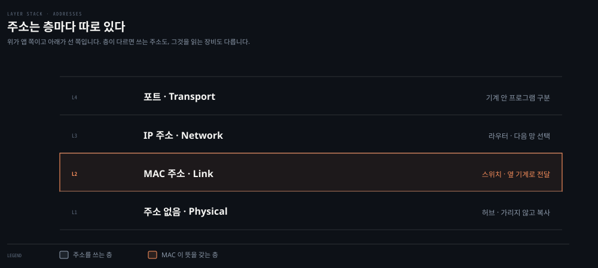

아래는 이 편에서 다루는 것들이 실제 통신 한 번에서 어떻게 맞물리는지 보인 그림입니다. 값 아래에 그 주소의 주인을 함께 적었습니다.

세 줄 중 **목적지 IP 한 줄만** 처음 값 그대로 도착합니다. MAC 은 구간마다 새로 쓰이고, 출발지 IP 는 NAT 지점에서 한 번 바뀝니다.

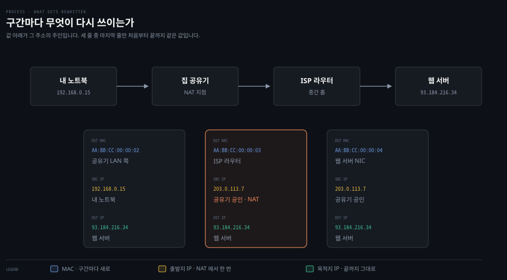


## 1. 주소 세 가지 — MAC · IP · 포트

> 셋은 경쟁 관계가 아니라 서로 다른 질문에 답합니다. 어느 랜카드인지, 어느 기계인지, 어느 프로그램인지가 각각의 몫입니다.

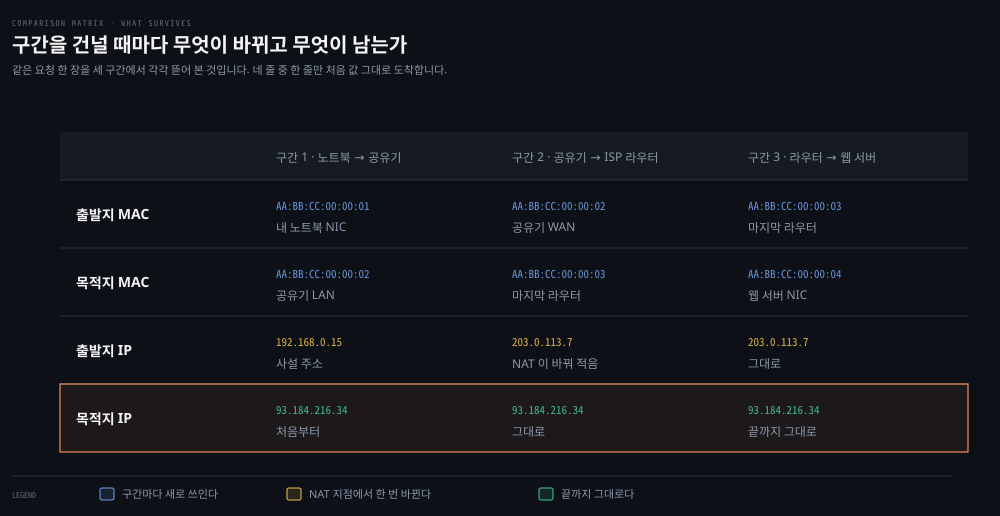

네 줄 중 **목적지 IP 한 줄만** 처음 값 그대로 도착합니다. MAC 두 줄은 구간마다 통째로 새로 쓰이고, 출발지 IP 는 NAT 지점에서 한 번 바뀝니다. "IP 는 안 바뀐다"는 말은 **목적지 IP 에만** 해당합니다.

편지 한 통이 사람 손에 닿으려면 세 가지가 필요합니다. 어느 건물인지, 그 건물의 몇 호인지, 그 집의 누구 앞인지입니다. 네트워크도 같은 구조인데, 다만 세 질문의 주인이 서로 다른 계층에 흩어져 있습니다.

- **MAC 주소**: 랜카드 하나하나에 붙는 48비트 식별자입니다. `2a:4f:1b:8c:d2:e0`처럼 여섯 바이트를 두 자리씩 끊어 적습니다. 앞 3바이트는 IEEE가 제조사에 배정한 조직 식별자이고, 뒤 3바이트는 그 회사가 매긴 고유부입니다.
- **IP 주소**: 기계가 네트워크상 어디에 있는지를 가리킵니다. `192.168.0.10`처럼 적으며, 이사를 가면 바뀝니다.
- **포트**: 한 기계 안에서 어느 프로그램의 트래픽인지를 가릅니다. 16비트 숫자라 0부터 65535까지입니다.

성격이 갈리는 지점을 나란히 놓으면 이렇습니다.

| | MAC 주소 | IP 주소 | 포트 |
|---|---|---|---|
| 답하는 질문 | 어느 랜카드인가 | 어느 기계인가 | 어느 프로그램인가 |
| 통하는 범위 | 같은 동네 안에서만 | 인터넷 전체 | 그 기계 안에서만 |
| 한 여정에서 | 구간마다 새로 쓰임 | 끝까지 그대로 | 끝까지 그대로 |
| 붙는 곳 | 랜카드 | 인터페이스 | 프로그램이 연 소켓 |

같은 요청 한 장을 세 구간에서 각각 뜯어 보면 무엇이 바뀌고 무엇이 남는지가 값으로 드러납니다.

**"구간마다 새로 쓰임"이 가장 자주 어긋나는 감각입니다.** 노트북에서 구글까지 가는 동안 목적지 IP는 한 번도 바뀌지 않지만, 목적지 MAC은 홉을 넘을 때마다 다시 쓰입니다. 지금 이 구간에서 물건을 받을 상대가 매번 달라지기 때문입니다. 이 다시 쓰기가 실제로 어떻게 일어나는지는 [01-03 §4](./01-03.IP·라우팅·Ethernet%20—%20패킷이%20길을%20찾는%20법.md)가 도식과 함께 다룹니다.

### IP는 방향이고 MAC은 배달입니다

앞의 표를 다 읽고도 걸리는 물음이 하나 남습니다. **노트북에서 구글까지 중계를 여러 번 거치는데, 그 중계들의 IP는 어디에 적히는가**입니다. 목적지 IP 칸에는 구글이 적혀 있고 그 값은 끝까지 안 바뀐다고 했으니, 중간 상대를 가리키는 칸이 없어 보입니다.

없는 것이 맞습니다. **중계를 지목하는 일은 IP 칸이 아니라 MAC 칸이 합니다.**

```bash
# 노트북이 첫 프레임을 내보낼 때
출발지 MAC   노트북           # 내 랜카드
목적지 MAC   집 공유기        # 지금 물건을 건넬 상대 ← 중계를 지목하는 칸
출발지 IP    192.168.0.10     # 나
목적지 IP    142.250.x.x      # 구글 ← 최종 목적지, 끝까지 안 바뀜
```

이 프레임이 랜선을 타고 실제로 도착하는 곳은 구글이 아니라 **집 공유기**입니다. 목적지 IP 칸에 구글이 적혀 있어도 그렇습니다. 배달은 MAC 칸이 정하고, IP 칸은 그 배달이 **어느 방향을 향하는지**만 알려 줍니다. 둘은 같은 질문에 답하지 않습니다.

그러면 라우터가 IP를 읽는다는 §4의 서술은 무엇인가 하는 물음이 남습니다. 라우터는 목적지 IP를 읽어 **다음 상대의 MAC을 무엇으로 쓸지 고릅니다.** 읽은 IP를 헤더에 옮겨 적는 것이 아닙니다. 만약 다음 라우터의 IP를 목적지 IP 칸에 옮겨 적는다면, 그 패킷이 도착한 순간 구글이라는 목적지 정보가 사라져 더 갈 곳을 잃습니다.

그래서 전체 여정은 하나로 이어진 이동이 아니라 **L2 구간의 릴레이**입니다. 구간 안에서는 MAC만으로 배달이 끝나고, 구간 경계마다 라우터가 서서 다음 구간의 상대 MAC을 새로 정합니다.

```bash
노트북 ─(1)─ 라우터A ─(2)─ 라우터B ─(3)─ 구글
```

라우터가 둘이면 구간은 셋입니다. **라우터 하나가 늘 때마다 구간이 하나 늘고, MAC 두 칸이 그만큼 더 새로 쓰입니다.** 목적지 IP 칸은 세 구간 내내 같은 값입니다.

한 가지 덧붙이면, 라우터는 두 구간에 양발을 걸치고 있어도 그 둘을 하나로 잇지 않습니다. 받은 프레임을 통과시키는 것이 아니라 **겉봉을 새로 써서 내보냅니다.** 그래서 §5의 브로드캐스트는 라우터에서 멈추고, 표의 "MAC은 같은 동네 안에서만"이 유지됩니다.

### 왜 셋 다 필요한가

IP가 이미 기계를 구분하는데 MAC이 왜 또 필요한지 묻게 됩니다. 답은 **컴퓨터를 막 켰을 때 IP가 없다**는 데 있습니다.

노트북을 켜면 IP가 자동으로 붙습니다. 그런데 그 붙는 절차 자체가 통신입니다. "IP 하나 주세요"라는 요청을 어딘가로 보내야 하는데, 그 시점에 출발지에 적을 IP가 없습니다. MAC은 랜카드에 이미 붙어 있으므로 이때 쓸 수 있습니다. IP만 있는 세계였다면 컴퓨터는 첫 통신을 시작할 방법이 없습니다.

이유는 더 있습니다. 스위치는 IP 헤더를 아예 열지 않으므로 자기 층의 주소가 필요합니다. 그리고 이더넷은 IP만 나르는 것이 아니라 ARP와 IPv6도 나릅니다. IP에 종속된 주소 체계였다면 그것들을 실을 수 없습니다.


## 2. 인터페이스 — 주소가 붙는 자리

> 인터페이스는 주소가 아니라 **주소가 붙는 자리**입니다. 랜카드 한 장에 이름을 붙인 것이고, 그 이름 아래 IP와 MAC이 하나씩 매답니다.

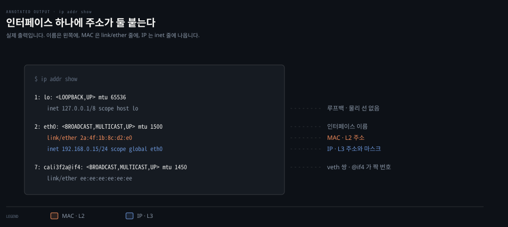

출력의 왼쪽 숫자가 인터페이스 번호이고 그 뒤가 이름입니다. `link/ether` 줄에 MAC 이, `inet` 줄에 IP 와 마스크가 나옵니다. `cali3f2a@if4` 의 `@if4` 는 이 veth 가 몇 번 인터페이스와 짝인지를 가리킵니다.

`eth0`, `en0`, `lo` 같은 이름을 명령 출력에서 보게 됩니다. 이것들은 주소가 아니라 **네트워크 집 ㄱ감인터페이스의 이름**입니다. 인터페이스 하나가 주소를 둘 답니다.

```bash
eth0                        # 인터페이스 이름
  inet  10.244.1.5          # L3 주소
  ether 2a:4f:1b:8c:d2:e0   # L2 주소
```

인터페이스가 전부 물리 랜카드인 것은 아닙니다. 실무에서 만나는 종류가 셋입니다.

- **물리 NIC**: 실제 랜카드입니다. MAC이 제조 시점에 구워져 나옵니다.
- **루프백**: `lo`라는 이름으로 늘 있는 가상 인터페이스입니다. `127.0.0.1`이 여기 붙고, 이 인터페이스로 나간 패킷은 선을 타지 않고 커널 안에서 되돌아옵니다.
- **veth 쌍**: 가상 랜선 한 켤레입니다. 한쪽 끝을 컨테이너 안에, 다른 쪽 끝을 호스트에 두어 둘을 잇습니다. 컨테이너 안에서 보이는 `eth0`이 이 켤레의 한쪽입니다.

**가상 인터페이스도 MAC을 갖습니다.** 제조사가 구운 것이 아니라 커널이 만들어 붙인 값이며, 인터페이스가 사라지면 함께 사라집니다. Pod가 만들어질 때 MAC이 생기고 없어질 때 사라지는 것이 이 때문입니다.

내 기계의 인터페이스는 명령 하나로 확인됩니다.

```bash
ip addr show          # Linux
ifconfig              # macOS
```


## 3. 주소는 어떻게 정해지나 — 고정과 DHCP

> IP를 얻는 길은 둘입니다. 사람이 적어 두거나, 켜질 때 물어서 받아 오거나입니다. 후자가 DHCP이고, 집·사무실의 기본값입니다.

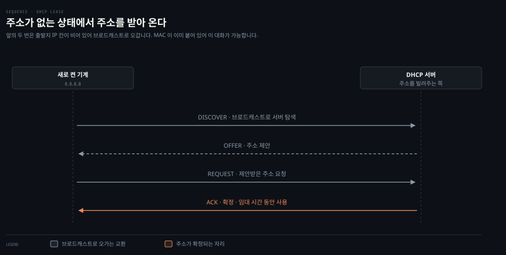

네 번의 교환 중 앞의 둘은 주소가 없는 채로 오갑니다. 서버를 찾는 물음과 그에 대한 제안이고, 뒤의 둘이 그 제안을 받아들여 확정하는 절차입니다.

MAC은 인터페이스에 이미 붙어 있으므로 정할 일이 없습니다. 정해야 하는 것은 IP입니다.

- **고정 할당**: 설정 파일에 IP·마스크·게이트웨이를 사람이 적습니다. 서버처럼 주소가 변하면 곤란한 자리에 씁니다.
- **DHCP(Dynamic Host Configuration Protocol)**: 기계가 켜질 때 네트워크에 물어서 받아 옵니다. 노트북·휴대폰처럼 옮겨 다니는 기기의 기본값입니다.[^dhcp]

DHCP가 흥미로운 것은 **주소가 없는 상태에서 시작하는 통신**이라는 점입니다. 출발지 IP 칸에 적을 값이 없으니 `0.0.0.0`을 넣고, 목적지도 누구인지 모르니 브로드캐스트로 뿌립니다. 이 요청이 성립하는 근거가 §1에서 본 "MAC은 이미 붙어 있다"입니다.

헤더는 길이가 고정이라 칸을 비워 둘 수 없습니다. 그래서 "값이 없음"과 "전원에게"를 뜻하는 예약값을 각 칸에 넣습니다.

```bash
출발지 MAC   2a:4f:1b:8c:d2:e0    # 랜카드에 이미 있는 값 ← 유일하게 확정된 칸
목적지 MAC   ff:ff:ff:ff:ff:ff    # 이 동네 전원에게
출발지 IP    0.0.0.0              # 아직 내 주소가 없음
목적지 IP    255.255.255.255      # 이 동네 전원에게
```

`ff:ff:ff:ff:ff:ff`와 `255.255.255.255`는 같은 뜻을 각 층에서 나타낸 짝입니다. `ff`가 16진수로 255이니 값도 같은 것을 다르게 적은 것입니다. 여기서 실제로 아는 값은 **출발지 MAC 하나뿐**이고, 나머지 세 칸은 모르는 상태를 예약값으로 메운 것입니다. IP만 있는 세계였다면 이 프레임 자체를 만들 수 없다는 §1의 말이 이 네 칸에서 눈에 보입니다.

받아 오는 것은 IP 하나가 아닙니다. 네 가지가 한 묶음으로 옵니다.

- **IP 주소**: 이 기계가 쓸 주소
- **서브넷 마스크**: 어디까지가 같은 동네인지 (§6)
- **기본 게이트웨이**: 동네 밖으로 나갈 때 맡길 상대
- **DNS 서버 주소**: 이름을 IP로 바꿔 줄 곳 (§7)

그래서 노트북을 새 와이파이에 붙이면 네 가지가 한꺼번에 바뀝니다. 주소만 받는 것이 아니라 **그 동네에서 살아가는 데 필요한 정보 일습**을 받는 셈입니다.

빌린 주소에는 기한이 있습니다. 임대 시간이 지나기 전에 기기가 갱신을 요청하고, 요청이 없으면 그 주소는 회수되어 다른 기기에 나갑니다. 인터넷을 해지하면 공인 IP가 사라지는 것도 같은 구조입니다.

### DHCP 서버는 같은 동네에 있어야 합니다

첫 요청이 브로드캐스트로 나간다는 사실이 서버의 위치를 정해 버립니다. §5에서 보듯 브로드캐스트는 라우터를 통과하지 못하므로, **DHCP 서버는 요청하는 기기와 같은 L2 구간 안에 있어야** 그 물음을 들을 수 있습니다. 인터넷 어딘가에 있는 서버는 물음이 닿지 않아 후보가 되지 못합니다.

집에서 그 역할을 하는 것은 공유기입니다. 한 통 안에 §4가 나눠 놓은 기능이 여럿 겹쳐 있습니다.

| 기능 | 하는 일 |
|---|---|
| 스위치 | LAN 포트에 붙은 기기끼리 MAC으로 주고받게 함 |
| 라우터 | LAN과 통신사 망의 경계에서 다음 망을 고름 |
| DHCP 서버 | 켜진 기기에 IP·마스크·게이트웨이·DNS 네 가지를 내줌 |
| NAT | 나가는 패킷의 출발지 사설 IP를 공인 IP로 고쳐 씀 |

"공유기"는 이 묶음을 한 단어로 부르는 이름입니다. 그래서 §4의 장비 구분과 모순되지 않습니다 — 그 표는 **기능** 기준이고, 한 상자가 여러 기능을 겸하는 것은 흔한 일입니다. 사무실·데이터센터로 가면 이 기능들이 각각 다른 장비로 갈라집니다.


## 4. 장비 세 가지 — 허브 · 스위치 · 라우터

> 세 장비의 차이는 성능이 아니라 **어디까지 열어 보는가**입니다. 허브는 아무것도 안 열고, 스위치는 겉봉까지, 라우터는 속까지 엽니다.

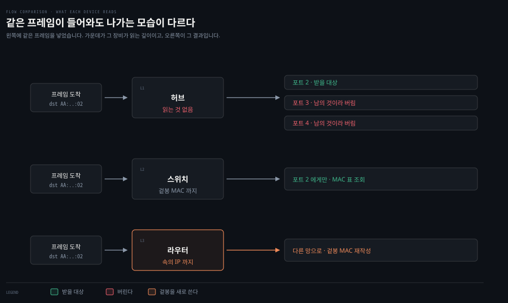

왼쪽에 같은 프레임을 넣고 세 장비를 각각 통과시킨 것입니다. 허브는 모든 포트로 복사해 세 대 중 두 대가 남의 것을 받아 버리고, 스위치는 표에서 찾아 한 포트로만 보냅니다. 겉봉을 고쳐 쓰는 것은 라우터뿐입니다.

프레임 한 장은 겉봉 안에 속이 든 구조입니다. 겉봉에 MAC이 적혀 있고, 그 안의 패킷에 IP가 적혀 있습니다. 세 장비는 이 봉투를 여는 깊이가 다릅니다.

| 장비 | 읽는 것 | 하는 일 | 층 |
|---|---|---|---|
| 허브 | 아무것도 안 읽음 | 들어온 신호를 모든 포트로 복사 | L1 |
| 스위치 | 겉봉의 MAC | 그 MAC이 있는 포트로만 전달 | L2 |
| 라우터 | 속의 IP | 라우팅 표를 보고 다음 망을 고름 | L3 |

**허브는 지금 거의 쓰이지 않습니다.** 모든 포트로 복사하니 20대가 붙어 있으면 19대가 남의 프레임을 받아 버리게 되고, 대역과 보안이 함께 나빠집니다. 스위치가 같은 값에 그 문제를 없애면서 자리를 대체했습니다.

여기서 한 번 짚어 둘 것이 있습니다. 프레임에 목적지 MAC이 적혀 있으니 허브도 그 한 대에게만 보낼 것 같은데, **허브는 그 값을 읽지 않습니다.** 표의 "아무것도 안 읽음"이 그 뜻입니다. 읽지 않으니 20개 포트 중 하나를 고를 근거가 없고, 그래서 전부에 복사합니다.

그러면 골라내는 일은 누가 하는가. **받는 쪽 랜카드가 합니다.** 프레임을 받아 목적지 MAC 칸을 자기 것과 대조하고, 다르면 버립니다. 버린다는 말은 이미 받았다는 뜻입니다 — 오지 않았으면 버릴 것도 없습니다. 그래서 19대가 "받아서 버리는" 일을 매번 하게 됩니다.

이 구조가 두 가지를 함께 나쁘게 만듭니다.

- **대역**: 한 번에 한 대만 말할 수 있어 20대가 20분의 1씩 나눠 씁니다.
- **보안**: 19대의 랜카드가 남의 프레임을 물리적으로 손에 쥡니다. 정상 랜카드는 버리지만 **버리지 않도록 설정할 수도 있습니다.** 허브 시대에 같은 허브에 붙기만 하면 남의 트래픽을 들여다볼 수 있었던 것이 이 때문입니다.

스위치가 허브를 대체한 이유가 속도만이 아니라는 것이 여기서 나옵니다. 스위치는 목적지 MAC을 읽어 해당 포트로만 보내므로, 나머지 기계의 랜카드에는 그 프레임이 아예 도착하지 않습니다.

**스위치는 라우팅을 하지 않습니다.** 어느 포트에 어느 MAC이 있는지를 오가는 프레임에서 스스로 배우기는 하지만, 그것은 학습이지 라우팅이 아닙니다. IP 헤더를 아예 열지 않으므로 스위치 입장에서는 속에 무엇이 들었든 상관이 없습니다.

**ISP(Internet Service Provider)는 장비가 아니라 사업자입니다.** 우리가 요금을 내고 회선을 빌리는 통신사이고, 파는 것은 둘입니다.

- **자기 망에 붙을 자리**: 전국에 깔린 회선과 라우터에 우리 집을 연결해 줍니다.
- **공인 IP 주소 하나**: 밖에서 통하는 주소를 자기 몫에서 떼어 빌려줍니다. 인터넷을 해지하면 회수됩니다.

ISP 도 인터넷 전체를 알지는 못합니다. 확실히 아는 것은 자기가 나눠 준 고객 대역뿐이고, 모르는 목적지는 다시 자기 위쪽으로 넘깁니다. 규모만 다를 뿐 집 공유기가 하는 일과 성격이 같습니다.

**라우터는 네트워크와 네트워크가 만나는 자리마다 놓입니다.** 집 공유기가 이미 라우터이고, 집 안 네트워크와 통신사 망의 경계에 서 있습니다. 라우터가 그 표를 어떻게 채우는지, 표에 없는 목적지가 오면 어떻게 되는지는 [01-03 §3](./01-03.IP·라우팅·Ethernet%20—%20패킷이%20길을%20찾는%20법.md)이 다룹니다.


## 5. 브로드캐스트와 ARP — 모르는 상대를 찾는 법

> 상대의 MAC을 모르면 전원에게 묻습니다. 그 물음이 브로드캐스트이고, 절차의 이름이 ARP입니다. 이 물음은 한 동네를 벗어나지 못합니다.

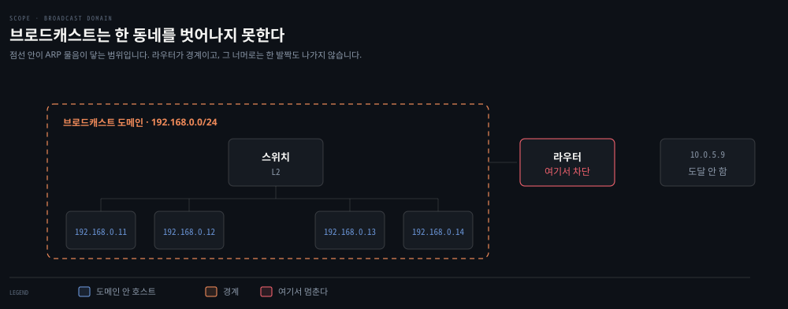

점선 안이 물음이 닿는 범위입니다. 라우터가 경계라, 그 너머의 `10.0.5.9` 는 이 물음을 듣지 못합니다.

프레임을 만들려면 목적지 MAC 칸을 채워야 합니다. 그런데 우리가 아는 것은 대개 IP뿐입니다. 이 간극을 메우는 일이 이 절의 주제이고, 먼저 그 물음을 보내는 방식부터 갈라 놓습니다.

### 유니캐스트와 브로드캐스트 — 다른 것은 한 칸입니다

두 낱말이 다른 프로토콜이나 다른 전송 방식처럼 들리는데, 실제로 갈리는 것은 **목적지 MAC 칸에 무엇을 적었는가** 하나뿐입니다.

| | 목적지 MAC 칸 | 받은 쪽이 하는 일 |
|---|---|---|
| 유니캐스트 | 특정 한 대의 MAC (`2a:4f:1b:8c:d2:e0`) | 그 한 대만 처리, 나머지는 버림 |
| 브로드캐스트 | `ff:ff:ff:ff:ff:ff` (예약값) | 전원이 자기 것으로 받아 처리 |

프레임 구조도 같고, 선을 흐르는 신호도 같습니다. 나머지 세 칸도 그대로입니다.

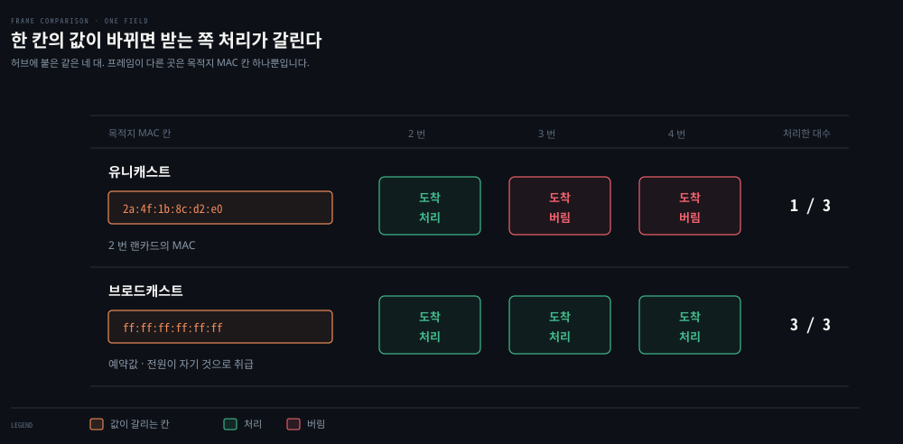

허브에 네 대가 붙은 경우로 두 번 보내 본 것입니다. **도착하는 대수는 두 경우 모두 세 대로 같습니다** — §4에서 본 대로 허브는 아무것도 읽지 않으니 가릴 수가 없습니다. 갈리는 것은 받은 쪽이 처리하는가 버리는가이고, 그 판정은 받는 랜카드가 합니다.

스위치로 바꾸면 유니캐스트 쪽 그림이 달라집니다. 스위치는 목적지 MAC을 읽어 해당 포트로만 보내므로 3번·4번에는 프레임이 도착조차 하지 않습니다. 브로드캐스트는 목적지가 특정 포트로 특정되지 않아 스위치도 전 포트로 내보냅니다.

**그래서 "브로드캐스트가 비싸다"는 말은 스위치 환경에서 나온 말입니다.** 허브에서는 유니캐스트도 어차피 전원에게 갔으니 둘의 비용 차이가 없었습니다. 스위치가 유니캐스트만 한 포트로 좁혀 주면서, 좁혀지지 않는 브로드캐스트가 상대적으로 비싼 쪽이 된 것입니다.

### ARP — IP를 MAC으로 바꾸는 절차

**ARP(Address Resolution Protocol)** 는 아는 IP로 모르는 MAC을 알아내는 절차입니다.[^arp] 이름이 하는 일을 그대로 담고 있습니다 — `Address Resolution`, 주소를 해석해 다른 층의 주소로 바꾼다는 뜻이고, 바꾸는 방향은 **IP → MAC** 입니다.

| | 값 |
|---|---|
| 아는 것 | 목적지 IP (`192.168.0.11`) |
| 모르는 것 | 그 기계의 MAC ← 프레임의 목적지 MAC 칸에 넣어야 함 |
| 쓰는 방식 | 물음은 브로드캐스트, 답은 유니캐스트 |
| 통하는 범위 | 같은 동네 안 (라우터를 넘지 못함) |

방법은 단순합니다. 목적지 MAC 칸에 `ff:ff:ff:ff:ff:ff`을 적어 내보냅니다. 그 동네의 모든 랜카드가 자기 것으로 받아들이므로, 물음을 담아 두면 해당하는 기계만 자기 MAC을 담아 답합니다.

그 "물음"의 정체가 **ARP 메시지**입니다. 겉봉(MAC 두 칸) 안쪽에 실려 나가는 별도 데이터이고, 칸이 넷입니다. 아는 것을 채우고 **모르는 칸을 비워** 보내면, 받은 쪽이 그 칸을 채워 돌려줍니다.

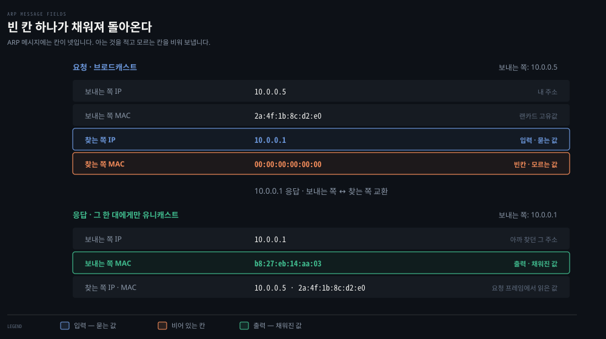

네 칸 중 노트북이 모르는 것은 마지막 하나뿐입니다. **입력은 찾는 쪽 IP 이고 출력은 그 IP 의 MAC** 이라, 방향이 IP → MAC 입니다. 이름의 `Address Resolution` 이 그 변환을 가리킵니다.

응답의 마지막 줄에 요청자의 IP·MAC이 이미 채워져 있다는 점도 눈여겨볼 만합니다. 답하는 쪽이 그 값을 따로 알아본 것이 아니라 **요청 프레임의 출발지 MAC 칸에서 읽은 것**입니다. 그래서 한 번의 교환으로 양쪽이 서로를 알게 됩니다.

프레임 전체에서 이 메시지가 어디 실리는지를 보면 이렇습니다.

```bash
출발지 MAC   2a:4f:1b:8c:d2:e0    # 겉봉
목적지 MAC   ff:ff:ff:ff:ff:ff    # 겉봉 — 전원에게
EtherType    0x0806               # 속에 든 것이 ARP 메시지라는 표시
─────────────────────────────
(속) ARP 메시지 네 칸            # 위 도식의 그 네 칸
```

`EtherType` 이 `0x0806` 이면 ARP, `0x0800` 이면 IPv4 패킷입니다. 받는 쪽은 이 칸을 보고 겉봉 안의 것을 무엇으로 해석할지 정합니다. 이더넷이 IP만 나르는 것이 아니라는 §1의 말이 이 칸에서 실현됩니다.

교환이 실제로 어떤 순서로 오가는지는 아래가 보여 줍니다.


가운데 세로선의 `다른 호스트`에는 응답 화살표가 없습니다. **자기 IP가 아니어서 버릴 뿐이지, 받는 일 자체는 피하지 못합니다.** 이 받고 버리는 몫이 호스트 수만큼 쌓이는 것이 [01-03 §4](./01-03.IP·라우팅·Ethernet%20—%20패킷이%20길을%20찾는%20법.md#4-link-계층--마지막-한-걸음은-mac-주소로)가 VLAN 을 부르는 이유입니다.

여기서 짚어 둘 것이 둘입니다.

**묻는 것은 전원에게, 답하는 것은 한 대에게.** 묻는 쪽은 상대를 모르니 뿌릴 수밖에 없지만, 답하는 쪽은 이미 상대를 알았으니 그 한 대에게만 보냅니다. 브로드캐스트와 유니캐스트가 한 번의 교환 안에서 갈립니다.

답하는 쪽이 요청자의 MAC을 아는 근거는 따로 알아본 것이 아닙니다. **물음이 담긴 프레임의 출발지 MAC 칸에 이미 적혀 있었습니다.** 물음을 받은 순간 상대의 MAC이 손에 들어오므로, 답장에는 그 값을 목적지 MAC 칸에 적을 수 있습니다. 그래서 물음은 브로드캐스트지만 답은 유니캐스트입니다.

**브로드캐스트는 동네를 벗어나지 못합니다.** 라우터가 통과시키지 않기 때문입니다. 그래서 다른 동네에 있는 기계의 MAC은 알아낼 방법이 아예 없고, 그 경우에는 게이트웨이의 MAC을 적어 내보냅니다. §1에서 본 "MAC은 같은 동네 안에서만 통한다"가 이 제약에서 나옵니다.

한 번 알아낸 값은 캐시에 잠시 보관합니다. 지금 내 기계가 알고 있는 이웃 목록은 명령 하나로 보입니다.

```bash
ip neigh              # Linux
arp -a                # macOS
```


## 6. 서브넷 — 어디까지가 한 동네인가

> 서브넷은 라우터를 거치지 않고 서로 닿는 주소들의 묶음입니다. 어디까지가 한 묶음인지는 마스크가 정하고, 그 판정이 곧 "누구의 MAC을 물을지"를 가릅니다.

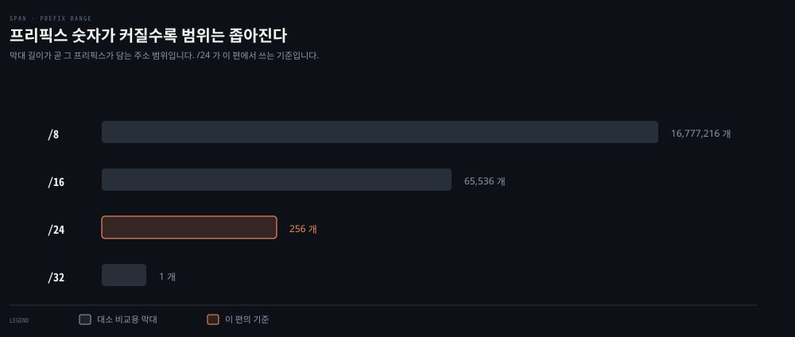

막대 길이가 그 프리픽스가 담는 주소 범위입니다. `/24` 는 앞 24 비트가 고정이고 남은 8 비트가 256 개를 만듭니다.

`192.168.0.10/24`에서 `/24`는 **앞 24비트가 네트워크부**라는 뜻입니다. 그러니 앞 세 마디 `192.168.0`이 같은 주소들이 한 동네이고, `192.168.0.1`부터 `192.168.0.254`까지가 그 범위입니다.

주소 자체는 32비트 중 8비트가 남아 `192.168.0.0`부터 `.255`까지 **256개**입니다. 그런데 기계에 붙일 수 있는 것은 그중 254개입니다. 양 끝 둘이 예약돼 있습니다.

| 주소 | 쓰임 |
|---|---|
| `192.168.0.0` | 네트워크 주소 — 이 동네 자체를 가리키는 이름 |
| `192.168.0.255` | 이 동네의 브로드캐스트 주소 |
| `192.168.0.1` ~ `.254` | 기계에 붙일 수 있는 254개 |

`.255`가 §3에서 본 `255.255.255.255`와 다른 점은 범위입니다. **`255.255.255.255`는 "동네를 특정하지 않은 전원"이고, `192.168.0.255`는 "이 동네의 전원"입니다.** 주소를 아직 못 받은 기기는 자기가 어느 동네인지도 모르니 전자를 쓰고, 주소를 받은 뒤에는 후자를 쓸 수 있습니다.

### 마스크는 목록이 아니라 계산입니다

이 값이 실제로 쓰이는 자리는 하나입니다. 프레임을 내보내기 직전, 호스트는 **목적지가 안인지 밖인지**를 판정합니다.

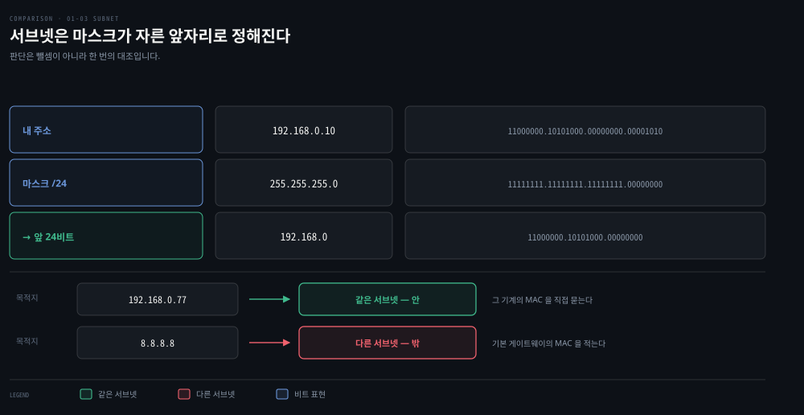

판정은 검색이 아니라 한 번의 대조입니다. 내 주소와 목적지 주소에 각각 마스크를 씌워 앞자리만 남기고, 그 둘이 같은지만 봅니다.

- 같으면 안: 그 기계의 MAC을 ARP로 직접 알아냅니다.
- 다르면 밖: 기본 게이트웨이의 MAC을 적습니다.

`192.168.0.11` 은 앞 24비트가 `192.168.0` 으로 같으니 안이고, `10.244.2.7` 은 `10.244.2` 라 다르니 밖입니다. 이 한 번의 대조가 곧바로 누구의 MAC 을 물을지로 이어집니다.

**호스트는 이웃 목록을 들고 있지 않습니다.** 마스크 하나만 있으면 어떤 주소가 들어와도 즉시 판정됩니다. 이것이 §3에서 DHCP가 IP와 함께 마스크를 반드시 내주는 이유입니다 — 마스크가 없으면 주소를 받아도 어디까지가 자기 동네인지 몰라 첫 판정을 할 수 없습니다.

밖으로 판정되면 목적지 기계의 MAC 은 아예 묻지 않습니다. 물을 방법이 없기 때문입니다 — §5에서 본 대로 브로드캐스트가 그 동네를 벗어나지 못합니다.

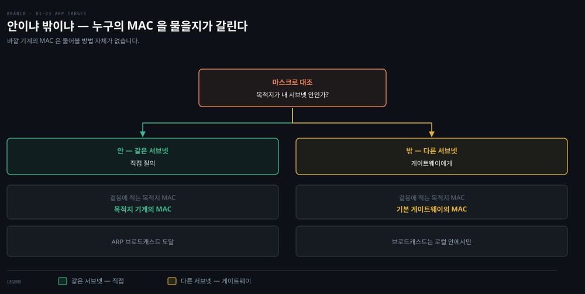

주소 공간을 자르는 규칙과 계산은 이 편의 범위를 넘습니다. 클래스가 사라진 배경과 프리픽스 계산은 [02_os/networking 01-04](../../../02_os/networking/01-04.서브네팅과%20CIDR%20—%20주소%20공간을%20자르는%20법.md)가, 이 시리즈 안에서의 쓰임은 [01-03 §2](./01-03.IP·라우팅·Ethernet%20—%20패킷이%20길을%20찾는%20법.md)가 정본입니다.


## 7. 이름 해석 — DNS

> 사람은 이름을 쓰고 기계는 주소를 씁니다. 그 사이를 잇는 주소록이 DNS이고, 통신이 시작되기 전에 한 번 조회가 끼어듭니다.

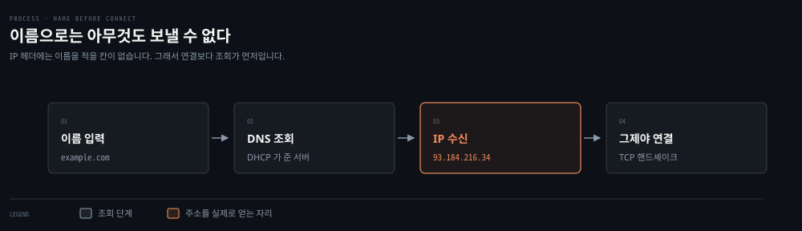

세 번째 칸에서 IP 를 받고 나서야 네 번째 칸이 시작됩니다. 조회는 통신의 일부가 아니라 통신의 앞에 붙는 별도 절차입니다.

브라우저에 `example.com`을 치면 그 이름으로는 아무것도 보낼 수 없습니다. IP 헤더에는 이름을 적을 칸이 없기 때문입니다. 그래서 통신에 앞서 **이름을 IP로 바꾸는 조회**가 먼저 일어납니다.

물어보는 상대는 §3에서 DHCP가 함께 알려 준 DNS 서버입니다. 조회가 실패하면 그 뒤의 모든 것이 시작조차 못 하므로, 연결이 안 될 때 이름 해석부터 확인하는 것이 순서입니다.

**묻는 주체는 라우터가 아니라 내 기계입니다.** DHCP로 DNS 서버 주소를 받은 것이 노트북이므로, 그 주소를 손에 쥔 노트북이 직접 조회를 보냅니다. 라우터는 그 조회 패킷을 다른 패킷과 똑같이 중계할 뿐 조회의 당사자가 아닙니다. 그래서 같은 사이트가 회사에서는 열리고 집에서는 안 열리는 일이 생깁니다 — 두 곳에서 받은 DNS 서버 주소가 다르고, 그 서버들이 다른 답을 주기 때문입니다.

순서를 값으로 적으면 이렇습니다.

```bash
1. 브라우저 입력           example.com
2. 노트북 → DNS 서버        example.com 의 IP 를 묻는다
3. DNS 서버 → 노트북        93.184.216.34            # 여기서 IP 확보
4. 노트북 → 93.184.216.34   TCP 연결 시작            # 그다음에야 시작
```

2번과 3번이 끝나기 전에는 4번을 시작할 수 없습니다. 목적지 IP 칸에 적을 값이 아직 없기 때문입니다. 그래서 조회는 통신의 일부가 아니라 **완결된 별개의 왕복**이고, 4번이 원래 하려던 통신입니다.

```bash
dig example.com +short     # 이름 → IP 만 확인
```

DNS는 그 자체로 한 편 분량입니다. 차단·암호화·우회 같은 실무 주제는 [02_os/networking 01-03](../../../02_os/networking/01-03.DNS%20필터링%20차단%20—%20NXDOMAIN·DoH·우회%20마찰.md)이 다룹니다.


## 다루지 않은 것

> 이 편은 낱말이 무엇을 가리키는지까지만 세웁니다. 깊이가 필요한 주제는 각각 정본이 따로 있어 그쪽으로 넘깁니다.

<!-- no-diagram: 범위 제외 항목과 위임 대상의 목록이라 형태가 없다 -->

이 편은 낱말의 자리를 잡는 데까지만 갑니다. 아래는 의도적으로 뺐고, 각각 정본이 따로 있습니다.

- **TCP·UDP의 동작**: 연결 수립, 재전송, 흐름 제어는 [01-02](./01-02.HTTP에서%20TCP·TLS·UDP까지%20—%20Transport%20계층%20해부.md)가 다룹니다.
- **라우팅 표가 채워지는 절차**: 기본 경로와 BGP는 [01-03 §3](./01-03.IP·라우팅·Ethernet%20—%20패킷이%20길을%20찾는%20법.md)이 정본입니다.
- **NAT**: 사설 주소가 공인 주소로 바뀌는 절차는 [01-03 §2](./01-03.IP·라우팅·Ethernet%20—%20패킷이%20길을%20찾는%20법.md)에 있습니다.
- **컨테이너·Pod 네트워킹**: veth를 여기서 이름만 짚었고, 그것으로 무엇을 만드는지는 3장·4장 문서가 다룹니다.
- **IPv6**: 주소 길이가 늘어난 배경만 [01-03 §2](./01-03.IP·라우팅·Ethernet%20—%20패킷이%20길을%20찾는%20법.md)에 있고, 별도 주소 체계로는 다루지 않습니다.

[^dhcp]: IETF — Dynamic Host Configuration Protocol. <https://datatracker.ietf.org/doc/html/rfc2131>

[^arp]: IETF — An Ethernet Address Resolution Protocol. <https://datatracker.ietf.org/doc/html/rfc826>


## 관련 문서

- [01-01. 네트워킹 역사와 OSI 모델](./01-01.네트워킹%20역사와%20OSI%20모델%20—%20계층으로%20나눈%20이유.md) — 이 편의 계층 그림이 왜 그렇게 나뉘었는지
- [01-03. IP·라우팅·Ethernet](./01-03.IP·라우팅·Ethernet%20—%20패킷이%20길을%20찾는%20법.md) — 여기서 이름만 짚은 것들의 본문
- [00-01. 용어집](./00-01.용어집.md) — 장별 낱말 대조표
- [02_os/networking 01-04. 서브네팅과 CIDR](../../../02_os/networking/01-04.서브네팅과%20CIDR%20—%20주소%20공간을%20자르는%20법.md) — 주소 공간 계산의 정본
