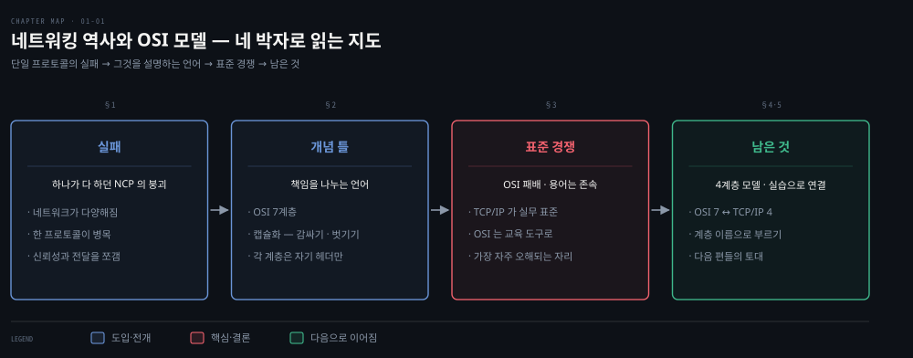
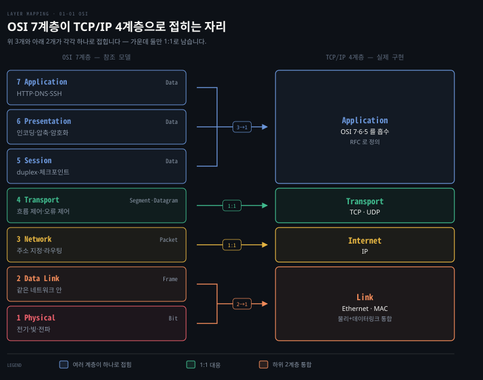

# 네트워킹 역사와 OSI 모델 — 계층으로 나눈 이유

---

> Kubernetes 문서는 독자가 "L3", "L4", "L7" 을 이미 안다고 전제하고 시작합니다. 이 숫자들의 출처가 1984년에 표준 경쟁에서 패배한 모델이라는 사실은 잘 언급되지 않습니다.
>
> 1장은 그 출처를 따라 올라갑니다. 프로토콜 하나가 모든 일을 하던 시절이 왜 끝났는지를 NCP 의 몰락으로 보고, 그 자리를 채운 TCP/IP 가 책임을 어떻게 쪼갰는지를 봅니다. 진 쪽인 OSI 를 그런데도 먼저 배우는 이유, 7계층이 4계층으로 접히는 대응 관계, 그리고 책 전체가 재사용할 Go 서버 한 벌로 마무리합니다.


## 핵심 요약
> 이 장 전체가 매달린 하나의 생각은 "네트워크는 책임을 계층으로 나눠 복잡성을 다스린다"입니다.
> 50년 네트워킹 역사는 단일 프로토콜(NCP)이 다양한 네트워크를 감당하지 못해 무너지고, 책임을 쪼갠 TCP/IP가 표준이 된 이야기입니다. OSI 모델은 표준 경쟁에서 졌지만 계층적 사고를 가르치는 언어로 살아남았습니다. Kubernetes가 "L3 IP", "L4 포트"라고 말할 때 쓰는 언어가 바로 이것입니다.


## 학습 목표

> 계층 모델을 외우는 게 아니라, 계층이 왜 생겼고 어디에 쓰이는지 설명할 수 있는 상태를 목표로 합니다.

이 내용을 읽고 나면:

1. NCP가 TCP/IP로 대체된 이유를 확장성과 모듈성 관점에서 설명할 수 있습니다.
2. RFC가 표준이 되는 두 단계(Proposed Standard, Internet Standard)를 구분할 수 있습니다.
3. OSI 7계층 각각의 책임과 PDU(Protocol Data Unit)를 연결해 말할 수 있습니다.
4. OSI 모델이 실무 표준이 되지 못한 이유와 그럼에도 배우는 이유를 설명할 수 있습니다.
5. OSI 7계층이 TCP/IP 4계층에 어떻게 대응되는지 그림 없이도 재구성할 수 있습니다.

아래는 이 장 전체를 "단일 프로토콜의 실패 → 책임 분리 → 그 분리를 설명하는 언어"의 흐름으로 이은 지도입니다. 각 단계 오른쪽의 절 번호가 본문에서 그것을 다루는 곳입니다. 지도에서 색이 붙은 곳은 4단계 한 군데뿐이고 경고입니다. OSI가 표준 경쟁에서 지고도 용어만 남았다는 사실이 이 장에서 가장 자주 오해되는 대목이라 표시했습니다. 나머지 상자는 전부 같은 회색이라 색을 해석할 일이 없습니다.




## 1. 성공이 곧 몰락이 된 NCP — TCP/IP가 표준이 되기까지

> 하나의 프로토콜이 모든 일을 하던 NCP는 네트워크가 다양해지자 무너졌고, 신뢰성(TCP)과 전달(IP)을 쪼갠 설계가 그 자리를 대신했습니다. 계층 분리는 이론이 아니라 확장 실패에서 나온 대응입니다.

1969년 ARPANET은 UCLA·스탠퍼드 연구소·UC 산타바바라·유타대 4개 노드로 출발했습니다. 노드 간 통신은 1970년 NCP(Network Control Protocol)가 완성한 뒤에야 가능해졌고, NCP 위에서 Telnet·FTP 같은 최초의 컴퓨터 간 프로토콜이 나왔습니다.

저자들은 NCP의 몰락 원인을 성공 그 자체에서 찾습니다. ARPANET이 커지면서 연결되는 네트워크의 종류가 다양해졌는데, NCP는 그 수요와 다양성을 감당하지 못했습니다. 1974년 Vint Cerf·Yogen Dalal·Carl Sunshine이 RFC 675로 TCP 초안을 만들었고, TCP는 서로 다른 종류의 네트워크 사이에서 패킷을 교환할 수 있었습니다.

1981년에는 RFC 791이 IP를 별도 프로토콜로 분리해 TCP의 책임을 덜어 냈습니다. 이 분리가 네트워크의 모듈성을 높였다는 점이 중요합니다. 하나의 거대 프로토콜 대신 "신뢰성은 TCP, 주소와 전달은 IP"로 관심사를 나눈 설계입니다. 1983년 1월 TCP/IP는 ARPANET의 유일한 승인 프로토콜이 되면서 NCP를 완전히 대체했습니다.

| 연도 | 사건 |
|------|------|
| 1969 | ARPANET 첫 연결 테스트, Telnet RFC 15 초안 |
| 1971~1973 | FTP RFC 114·354 초안 |
| 1974 | TCP RFC 675 초안 (Cerf·Dalal·Sunshine) |
| 1980 | OSI 모델 개발 시작 |
| 1981 | IP RFC 760 초안 |
| 1984 | ISO 7498 OSI 모델 발표 |
| 1991 | NII 법안 통과, Linux 첫 버전 |
| 2015 | Kubernetes 첫 버전 |

> 💬 **비유**: NCP에서 TCP/IP로의 전환은 만능 직원 한 명이 하던 일을 부서로 나눈 조직 개편과 비슷합니다. 회사(네트워크)가 작을 때는 한 명이 주문 접수부터 배송까지 다 해도 되지만, 지점이 늘고 거래처마다 방식이 다르면 그 사람이 병목이 됩니다. TCP/IP는 "배송 주소 관리 부서(IP)"와 "배송 확인 부서(TCP)"를 분리해 각자 잘하는 일만 하게 만든 셈입니다.

오늘날 인터넷 표준은 IETF(Internet Engineering Task Force)가 관리합니다. 표준 문서인 RFC는 개인 또는 엔지니어 그룹이 작성하며 두 상태를 가집니다.

- **Proposed Standard**: 커뮤니티 지지를 충분히 받아 표준 후보가 된 명세. 설계가 안정적이고 배포·구현·테스트가 가능하지만 철회될 수도 있습니다.
- **Internet Standard**: RFC 2026 기준으로 안정적이고 기술적으로 충분하며, 독립적이고 상호운용 가능한 구현이 여럿 존재하고 실질적 운영 경험을 갖춘 명세.[^rfc2026]

Draft Standard라는 세 번째 분류는 2011년에 폐지됐습니다. 두 단계를 구분해 두면 실무에서 "이 RFC를 믿고 구현해도 되는가"를 판단할 때 쓸 수 있습니다. Proposed Standard 단계의 명세는 아직 철회 가능성이 남아 있는 반면, Internet Standard는 이미 상호운용 구현이 여럿 존재한다는 뜻이기 때문입니다.


## 2. OSI 7계층 — 책임을 나누는 개념 틀

> 7계층은 캡슐화라는 한 가지 동작으로 이어집니다. 각 계층이 위에서 받은 데이터를 감싸 자기 PDU를 만들기 때문에, 계층은 서로의 내용을 몰라도 자기 일만 하면 됩니다.

OSI 모델은 두 시스템이 네트워크로 통신하는 방법을 설명하는 개념 프레임워크로, ISO 7498(1984)로 발표됐습니다. 원래는 실제 네트워크를 구동할 프로토콜 묶음으로 설계됐지만 TCP/IP에 밀렸습니다. 지금은 계층별 책임 관계를 가르치는 교육 도구로 쓰입니다.

핵심 개념은 캡슐화입니다. 각 계층은 위 계층에서 받은 데이터를 감싸 자기 계층의 PDU(Protocol Data Unit)를 만듭니다. 전송 계층은 포트(같은 호스트 안에서 어느 프로세스의 트래픽인지 가리는 번호, §4에서 상술)로 어느 프로세스의 데이터인지 구분합니다. 네트워크 계층의 PDU인 패킷은 네트워크 사이에서 라우팅됩니다. 데이터 링크 계층은 패킷을 프레임으로 쪼개 오류를 검사한 뒤 로컬 네트워크로 내보내고, 물리 계층은 프레임을 비트로 바꿔 매체에 실어 보냅니다.

이 감싸기는 한 방향으로만 일어나지 않습니다. 송신 측이 계층을 내려가며 헤더를 붙였다면 수신 측은 계층을 올라가며 같은 헤더를 하나씩 벗겨 냅니다. 계층 분리가 실제로 성립하는 지점이 여기입니다. 각 계층은 자기가 붙인 헤더만 읽으면 되고 위아래 계층이 무엇을 담았는지는 몰라도 되기 때문에, 한 계층의 프로토콜을 바꿔도 나머지가 따라 바뀌지 않습니다.

| 계층 | 이름 | PDU | 핵심 책임 |
|------|------|-----|----------|
| 7 | Application | Data | HTTP·DNS·SSH 같은 고수준 프로토콜의 인터페이스 |
| 6 | Presentation | Data | 문자 인코딩 변환, 압축, 암호화 — 두 시스템이 다른 인코딩을 써도 통신하게 하는 문법 계층 |
| 5 | Session | Data | 연결의 duplex(동시 송수신) 관리, 체크포인트·중단·재시작·종료 절차 |
| 4 | Transport | Segment·Datagram | 흐름 제어·분할과 재조립·오류 제어로 연결 신뢰성 관리. TCP/IP에서는 TCP와 UDP |
| 3 | Network | Packet | 주소 지정·라우팅·트래픽 제어. 라우터가 동작하는 계층 |
| 2 | Data Link | Frame | 같은 네트워크 안 호스트 간 전송. 프레임은 로컬 네트워크 경계를 넘지 않음 |
| 1 | Physical | Bit | 디지털 비트를 전기·전파·광 신호로 변환. 케이블·스위치·무선 AP |

계층 이름을 외우는 니모닉으로 저자들은 "All People Seem To Need Data Processing"을 소개합니다. Application부터 Physical까지 첫 글자를 딴 문장입니다.


## 3. OSI는 왜 졌고, 왜 아직 배우는가

> OSI는 프로토콜 경쟁에서 지고 용어 경쟁에서 이겼습니다. 구현체는 사라졌지만 "L3", "L7" 같은 계층 번호는 Kubernetes를 읽는 데 그대로 쓰입니다.

OSI 모델의 프로토콜들은 끝내 보급되지 못했습니다. 저자들에 따르면 당시 대부분의 평가는 ISO 7498에 담긴 구현 세부가 복잡하고 비효율적이며 어느 정도는 구현 불가능하다는 쪽이었습니다. 1980년대 말~1990년대 초 DOD를 비롯한 주요 기관이 TCP/IP를 채택하면서 승부가 갈렸습니다.

그런데도 OSI 모델을 먼저 배우는 이유는 용어 때문입니다. OSI의 계층 용어와 기능 구분은 TCP/IP 모델에 그대로 흘러들었고 결국 Kubernetes 추상화에도 쓰입니다. Kubernetes 서비스는 동작하는 계층에 따라 기능이 갈립니다 — 예를 들어 L3의 IP 주소와 L4의 포트가 각각 다른 서비스 기능의 기반이 됩니다. "L7 로드밸런서", "L4 서비스" 같은 말을 해석하려면 이 지도가 필요합니다.


## 4. TCP/IP 4계층 — OSI와의 대응

> TCP/IP는 OSI의 상위 세 계층을 Application 하나로 합쳐 4계층으로 줄였습니다. 실제로 구현된 쪽이 이 모델이므로, 도구가 보여 주는 계층 이름도 여기를 따릅니다.

TCP/IP는 운영체제와 아키텍처 차이에 독립적인 개방 프로토콜로 이기종 네트워크를 만듭니다. 호스트가 Windows든 Linux든, 웹 서버가 Apache든 Nginx든 통신할 수 있는 이유는 OSI 모델과 유사한 책임 분리 덕분입니다.



각 계층의 요지는 다음과 같습니다.

- Application — IP 네트워크 위 프로세스 간 통신 프로토콜의 자리. 각 애플리케이션 프로토콜은 RFC로 정의되며 책은 HTTP(RFC 7231)를 예제로 씁니다. OSI의 Application·Presentation·Session 세 계층이 여기에 합쳐집니다.
- Transport — TCP와 UDP가 호스트 간 통신 서비스를 제공합니다. 포트가 어느 호스트 프로세스의 트래픽인지 식별하며, 포트 번호 할당은 IANA가 관리하고 총 65,535개입니다.[^iana-ports] 서버는 잘 알려진 포트에서 대기하고(HTTP는 비보안 80, 보안 443), 클라이언트는 자기를 식별할 임시 포트를 로컬에서 하나 만들어 씁니다. 다음 편에서 볼 임시 포트 고갈 문제가 이 비대칭에서 나옵니다.
- Internet — 네트워크 사이의 데이터 전송을 책임집니다. IP는 MTU(최대 전송 단위)에 따라 패킷을 단편화·재조립하지만 패킷의 정상 도착은 보장하지 않습니다. 신뢰성 부담은 네트워크가 아니라 통신 경로의 양 끝(Transport 계층)에 있습니다.
- Link — 호스트가 연결된 로컬 네트워크에서만 동작하는 프로토콜의 자리입니다. Ethernet이 지배적 프로토콜이고 호스트는 NIC의 MAC 주소로 식별됩니다. 비로컬 네트워크로의 라우팅은 Internet 계층의 몫입니다.
- Physical — IEEE 802.3(Ethernet 매체 규격) 같은 하드웨어 표준. RFC 1122 해석에 따라 Link에 포함시키기도 하지만 책은 완결성을 위해 따로 둡니다.


## 5. 책 전체를 관통할 Go 웹 서버

> 책은 20줄짜리 Go 서버 하나를 끝까지 재사용합니다. 예제가 고정돼 있어야 계층을 내려갈 때 변하는 것이 계층뿐이 됩니다.

책은 아래 최소 웹 서버를 예제 기반으로 삼습니다. 이후 tcpdump 같은 도구부터 Kubernetes가 syscall을 추상화하는 방식까지 모두 이 서버로 시연합니다.

```go
package main

import (
	"fmt"
	"net/http"
)

func hello(w http.ResponseWriter, _ *http.Request) {
	fmt.Fprintf(w, "Hello")
}

func main() {
	http.HandleFunc("/", hello)
	http.ListenAndServe("0.0.0.0:8080", nil) // 모든 인터페이스의 8080 포트에서 대기
}
```

`8080` 포트로 들어온 HTTP 요청에 "Hello" 다섯 글자를 돌려주는 전부입니다. 단순해서 좋은 예제입니다 — 요청 하나가 TCP/IP 전 계층을 통과하는 모습을 잡음 없이 관찰할 수 있습니다. 다음 편에서 이 서버에 cURL 요청을 보내며 계층을 하나씩 내려갑니다.


## 심화 학습
> 책 밖에서 보강한 내용입니다. 출처를 함께 남깁니다.

- OSI 대 TCP/IP 표준 전쟁의 전말은 IEEE Spectrum의 [OSI: The Internet That Wasn't](https://spectrum.ieee.org/osi-the-internet-that-wasnt)가 자세합니다. 정부·ISO 주도의 완벽주의 설계가 이미 돌아가는 코드(TCP/IP)를 이기지 못한 사례로, "rough consensus and running code"라는 IETF 문화의 배경이기도 합니다.
- RFC 표준 트랙의 정확한 정의는 [RFC 2026 — The Internet Standards Process](https://datatracker.ietf.org/doc/html/rfc2026)가 원전입니다. 본문의 두 상태 구분도 이 문서에서 나왔습니다.
- 이 폴더의 짝인 『Kubernetes in Action』 정독본은 같은 주제를 오브젝트 관점에서 다룹니다. 계층 용어가 K8s 리소스와 어떻게 만나는지는 [4장 노트](./README.md)가 작성되면 그쪽으로 잇습니다.


## 결정 치트시트
> 장애가 났을 때 "어느 계층 문제인가"를 가르는 1차 판별 규칙입니다. 이 장의 계층 구분을 트러블슈팅 언어로 옮겼습니다.

| 증상 | 의심 계층 | 1차 확인 도구 |
|------|----------|--------------|
| 케이블·링크 자체가 죽음 | L1 Physical | 링크 램프, `ip link` |
| 같은 네트워크 안 호스트끼리 못 찾음 | L2 Link | `arp -a`, `tcpdump arp` |
| 다른 네트워크 호스트에 도달 불가 | L3 Internet | `ping`, 라우팅 테이블(`netstat -r`) |
| 도달은 되는데 특정 포트 연결 거부 | L4 Transport | `netstat -ap TCP`, `tcpdump port N` |
| 연결은 되는데 응답이 이상함 | L7 Application | `curl -vvv`, 애플리케이션 로그 |


## 면접에서 받을 만한 질문

> 먼저 스스로 답을 소리 내어 말해 본 뒤, 아래 §정답 섹션을 펼쳐 맞춰 봅니다.

1. OSI 모델을 한 문장으로 정의하면? 실무 표준을 TCP/IP에 내줬는데도 왜 계속 가르칩니까?
2. NCP는 왜 TCP/IP로 대체됐고, IP 분리(RFC 791)는 무엇을 얻었습니까?
3. 캡슐화가 계층 모델에서 실제로 하는 일은 무엇입니까? PDU는 계층마다 어떻게 바뀝니까?
4. OSI 상위 3계층은 TCP/IP에서 어디로 갑니까?

### 빈칸 채우기 — 계층별 PDU

캡슐화가 진행되며 PDU 이름이 바뀝니다. Application의 `(1)____` → Transport의 `(2)____` → Network의 `(3)____` → Data Link의 `(4)____` → Physical의 `(5)____` 순서입니다.


## 정답 (자답 후 펼치기)

> 위 §면접에서 받을 만한 질문의 4개에 *먼저 자답한 뒤* 아래를 읽으세요. 자답 없이 먼저 읽으면 학습 효과가 0입니다.

### 정답 1 — OSI 정의와 배우는 이유

OSI 모델은 두 시스템 간 네트워크 통신의 책임을 7개 계층으로 나눈 개념 프레임워크입니다. 실무 표준은 TCP/IP에 내줬지만, 계층별 책임을 구분하는 용어 체계가 유용해 여전히 가르칩니다. "L4 로드밸런싱", "L7 라우팅" 같은 실무 용어와 Kubernetes 추상화가 모두 OSI 계층 번호를 씁니다.

### 정답 2 — NCP 대체와 IP 분리

NCP는 네트워크의 다양성과 규모를 감당하지 못해 TCP/IP로 대체됐습니다. 원래 TCP 하나가 신뢰성과 전달을 모두 맡았지만, 1981년 RFC 791이 주소 지정·전달을 IP로 떼어 내 각 프로토콜의 책임을 단순화했습니다. 전달은 IP가 최선을 다하되 보장하지 않고 신뢰성은 양 끝단의 TCP가 책임지는 구조입니다.

### 정답 3 — 캡슐화와 PDU

캡슐화는 위 계층의 데이터 앞뒤에 자기 계층의 헤더(와 푸터)를 붙이는 일입니다. 송신 측은 내려가며 붙이고 수신 측은 올라가며 벗깁니다. 그래서 각 계층은 다른 계층의 내용을 몰라도 자기 일을 합니다. 이 과정에서 PDU가 Data → Segment → Packet → Frame → Bit로 바뀝니다.

### 정답 4 — OSI 상위 3계층

OSI의 Application·Presentation·Session 세 계층이 TCP/IP에서는 Application 하나로 합쳐집니다. OSI는 교육용, TCP/IP는 구현용이라는 차이가 여기서 드러납니다.

### 정답 빈칸 — (1)`Data` (2)`Segment`(TCP)·`Datagram`(UDP) (3)`Packet` (4)`Frame` (5)`Bit`

Application은 `Data`, Transport는 `Segment`(TCP) 또는 `Datagram`(UDP), Network는 `Packet`, Data Link는 `Frame`, Physical은 `Bit`입니다.


## 핵심 개념 체크리스트

> 다섯 항목을 막힘없이 답할 수 있으면 다음 편으로 넘어가도 좋습니다.

- [ ] NCP → TCP/IP 전환의 원인을 한 문장으로 말할 수 있는가?
- [ ] RFC의 Proposed Standard와 Internet Standard를 구분할 수 있는가?
- [ ] OSI 7계층 각각의 PDU를 짝지을 수 있는가?
- [ ] OSI 상위 3계층이 TCP/IP에서 어디로 합쳐지는지 아는가?
- [ ] 증상을 보고 어느 계층부터 확인할지 판단할 수 있는가?


## 참고 자료

- 《Networking and Kubernetes: A Layered Approach》(James Strong·Vallery Lancey, O'Reilly, 2021, ISBN 978-1492081654) Ch1
- [RFC 791 — Internet Protocol](https://datatracker.ietf.org/doc/html/rfc791)
- [RFC 2026 — The Internet Standards Process](https://datatracker.ietf.org/doc/html/rfc2026)
- 다음 편: [01-02. HTTP에서 TCP·TLS·UDP까지](./01-02.HTTP%EC%97%90%EC%84%9C%20TCP%C2%B7TLS%C2%B7UDP%EA%B9%8C%EC%A7%80%20%E2%80%94%20Transport%20%EA%B3%84%EC%B8%B5%20%ED%95%B4%EB%B6%80.md)

[^rfc2026]: IETF — The Internet Standards Process, Revision 3. 표준 트랙 성숙도 단계는 §4.1 Standards Track Maturity Levels 아래에 있으며, Proposed Standard 는 §4.1.1, Internet Standard 는 §4.1.3 입니다.
<https://datatracker.ietf.org/doc/html/rfc2026>

[^iana-ports]: IANA — Service Name and Transport Protocol Port Number Registry. 포트 번호를 위임하는 주체와 well-known·registered·dynamic 세 구간의 경계를 정한 1차 자료입니다.
<https://www.iana.org/assignments/service-names-port-numbers/service-names-port-numbers.xhtml>
