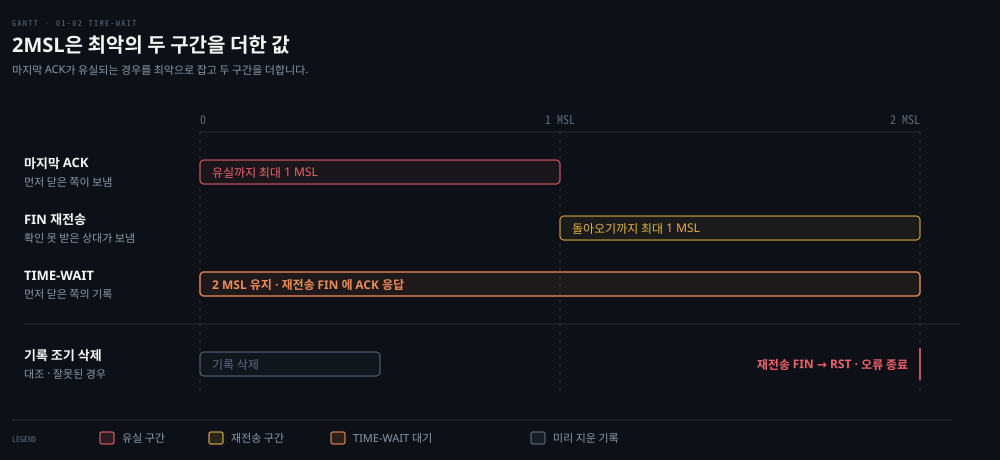
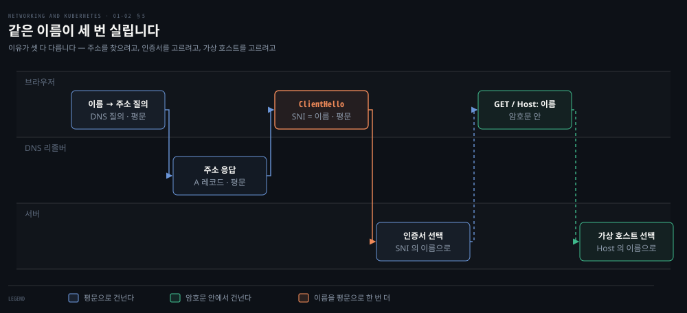

# HTTP에서 TCP·TLS·UDP까지 — Transport 계층 해부

---

## 핵심 요약
> HTTP 요청 하나는 TCP 연결, HTTPS 라면 TLS 합의, 그리고 HTTP 교환이 차례로 성공해야 끝납니다. 새 연결은 이 절차와 그 뒤에 남는 상태를 매번 새로 치르고, 연결 재사용은 그 값을 여러 요청에 나눠 냅니다.

이 편은 프로토콜을 처음부터 다시 설명하지 않고, 기초를 서비스 통신의 판단으로 잇습니다. 연결이 섰다고 요청이 성공한 것은 아니므로 실패를 단계로 가릅니다. 반복 요청에서는 새 연결과 재사용 연결을 가릅니다. 연결을 닫은 뒤 남는 TIME-WAIT 와 CLOSE-WAIT 는 서로 다른 곳을 가리키는 운영 신호로 읽습니다.

헤더 필드·상태 전이·재전송·TLS 메시지 같은 기초의 상세는 `02_os/book` 의 원리 노트(CNTD)와 캡처 해석 노트(PAW)가 맡습니다. 이 편은 필요한 자리에서 그 절로 잇습니다. 원서가 보여 준 "요청 하나에 12패킷, 그중 데이터는 둘"은 저자들이 뜬 캡처 한 번의 관찰입니다. 이 편은 그 숫자보다 새 연결이 거치는 구간과 재사용의 의미를 봅니다.


## 학습 목표
> 프로토콜 이름을 아는 데서 멈추지 않고, 한 요청 아래에서 무엇이 성공하고 무엇이 남는지를 운영 판단으로 옮기는 상태를 목표로 합니다.

이 내용을 읽고 나면:

1. 한 HTTP 요청이 TCP 연결·TLS 합의·HTTP 교환 위에서 오간다는 것을 `curl -v` 출력으로 짚고, 단계별로 성공과 실패를 가를 수 있습니다. (§1 · 질문 1)
2. 새 연결과 재사용 연결이 치르는 절차의 차이를 설명하고, 패킷 수·메시지 수·왕복 수·처리 시간을 서로 다른 값으로 다룰 수 있습니다. (§2 · 질문 2)
3. TIME-WAIT 와 CLOSE-WAIT 가 어느 쪽에 왜 남는지 설명하고, 각각 보였을 때 다음에 확인할 것을 고를 수 있습니다. (§3 · 질문 3)
4. 같은 이름을 DNS 질의·SNI·Host 헤더에 싣는 목적을 구분할 수 있습니다. (§4 · §5 · 질문 4)
5. TCP 와 UDP 를 고를 때 애플리케이션이 떠안는 책임과 Kubernetes Service 의 프로토콜 지정을 설명할 수 있습니다. (§6 · 질문 5)
6. HTTP 클라이언트의 시간 제한이 어느 단계를 재는지 클라이언트마다 확인해야 하는 이유를 말할 수 있습니다. (§1 · 질문 6)

아래 지도는 이 편을 네 칸으로 잇습니다. 가운데 붉은 칸이 중심입니다. 새 연결이 매번 치르는 값을 알아야 셋째 칸의 남는 상태와 넷째 칸의 선택이 같은 축으로 읽힙니다.


## 1. 요청 하나가 지나는 세 단계 — HTTP 아래의 연결
> `curl` 한 줄의 요청은 TCP 연결이 선 뒤에야 나가고, HTTPS 라면 그 사이에 TLS 합의가 끼어듭니다. 단계마다 실패하는 모습이 달라서, 연결이 됐다는 사실과 요청이 성공했다는 사실을 따로 확인합니다.

애플리케이션 로그에 "요청 실패" 한 줄만 남으면 어느 단계에서 멈췄는지 알 수 없습니다. 전편의 Go 웹 서버(`0.0.0.0:8080`)에 cURL 로 요청을 보내 보면 그 단계가 출력에 드러납니다.

```bash
○ → curl localhost:8080 -vvv
* Connected to localhost (::1) port 8080
> GET / HTTP/1.1
> Host: localhost:8080
> User-Agent: curl/7.64.1
> Accept: */*
>
< HTTP/1.1 200 OK
< Date: Sat, 25 Jul 2020 14:57:46 GMT
< Content-Length: 5
< Content-Type: text/plain; charset=utf-8
<
Hello* Closing connection 0
```

`>` 줄이 클라이언트 요청이고 `<` 줄이 서버 응답입니다. 이 편에서 쓰는 자리는 세 곳입니다.

- `* Connected to` 줄이 TCP 연결이 선 시점입니다. 요청 줄과 헤더는 그 연결 위에서 나갑니다.
- `Host` 헤더는 §5 에서 이름이 세 번 실리는 자리 가운데 하나로 다시 나옵니다.
- `HTTP/1.1 200 OK` 의 상태 코드는 서버가 요청을 받아 처리한 결과입니다.

요청·응답 메시지의 형식은 [CNTD 02-02 「3. 메시지는 그냥 텍스트입니다」](../../../02_os/book/cntd_computer-networking-top-down/02-02.%EC%9B%B9%EC%9D%80%20%EC%96%B4%EB%96%BB%EA%B2%8C%20%EC%A3%BC%EA%B3%A0%EB%B0%9B%EB%8A%94%EA%B0%80.md)에서 배울 수 있습니다. 상태 코드가 범위마다 무엇을 뜻하는지는 [PAW 05-02 「4. HTTP 메서드와 상태 코드」](../../../02_os/book/paw_packet-analysis-wireshark/05-02.%EC%9D%B4%EB%A6%84%EA%B3%BC%20%EC%9A%94%EC%B2%AD.md)가 캡처 필터와 함께 정리합니다.

### 연결이 섰다는 것과 요청이 성공했다는 것은 다른 사실입니다

`Connected to` 가 찍혔다는 것은 3-way 핸드셰이크가 끝났다는 뜻일 뿐입니다. 클라이언트는 자기 쪽 세 번째 패킷(ACK)을 보내는 순간 연결을 연 것으로 보고, 요청은 그다음에 나갑니다. 그래서 실패도 단계마다 모습이 다릅니다.

| 단계 | 실패하면 보이는 모습 | 먼저 볼 곳 |
|---|---|---|
| TCP 연결 | 응답 없이 시간을 다 채우는 타임아웃, 또는 즉시 돌아오는 거절 | 경로·방화벽·리슨 여부 |
| TLS 합의 | 연결은 됐는데 Alert 를 받고 끊김 | 인증서 체인·SNI·지원 버전 |
| HTTP 교환 | 연결과 합의는 됐는데 4xx·5xx 응답, 또는 응답이 오지 않음 | 애플리케이션 로그·업스트림 |

타임아웃과 거절이 캡처에서 어떻게 갈리는지는 [nfl 05-01 「1. 실패는 세 단계 중 하나에서 일어납니다」](../../../02_os/book/network-fundamentals-lab/05-01.%EC%97%B0%EA%B2%B0%EC%9D%80%20%EC%96%91%20%EB%81%9D%EB%A7%8C%EC%9D%98%20%EC%9D%BC%EC%9D%B4%20%EC%95%84%EB%8B%88%EB%8B%A4.md)가 재현 실습으로 보여 줍니다. TLS 실패를 캡처의 두 바이트로 읽는 법은 [PAW 04-01 「6. Alert — 실패를 알리는 프로토콜」](../../../02_os/book/paw_packet-analysis-wireshark/04-01.TLS%20%ED%95%B8%EB%93%9C%EC%85%B0%EC%9D%B4%ED%81%AC%20%EC%9D%BD%EA%B8%B0.md)이 다룹니다.

### 적용 — 클라이언트의 시간 제한은 클라이언트마다 재는 구간이 다릅니다

Spring 애플리케이션이 쓰는 HTTP 클라이언트의 시간 제한도 이 단계를 따라 나뉩니다. 다만 어느 설정이 어느 단계를 재는지는 클라이언트마다 다릅니다.

- JDK `URLConnection` 은 connect timeout 을 통신 링크가 열리기까지로, read timeout 을 연결이 선 뒤 읽을 데이터가 생기기까지로 정의합니다. Spring 의 `SimpleClientHttpRequestFactory` 는 이 두 값을 그대로 넘깁니다.[^jdk-timeout]
- `WebClient` 가 흔히 쓰는 Reactor Netty 는 연결 수립(기본 30초)과 TLS 핸드셰이크(기본 10초)를 따로 잽니다. 응답 시간 제한은 기본값이 없습니다.[^rn-timeout]
- Apache HttpClient 5 는 연결 수립, TLS 핸드셰이크, 응답 도착, 소켓 I/O, 풀에서 연결을 빌려 오는 시간을 각각 다른 설정으로 둡니다.[^hc5-timeout]

"connect timeout 은 SYN 부터 SYN-ACK 까지, read timeout 은 응답까지"라는 한 줄은 모든 클라이언트에 옮겨 쓸 수 없습니다. TLS 핸드셰이크가 connect 에 들어가는지 확인합니다. read 가 한 번의 읽기 사이 간격인지 응답 전체의 기한인지도 쓰는 클라이언트의 문서로 확인합니다.

### 직접 해 보기 — 서버를 띄우고 요청 한 번 보내기

위 출력은 읽는 것보다 직접 내 보는 편이 빠릅니다. 전편 §5 의 Go 서버를 그대로 쓰면 준비물은 Go 하나뿐입니다.

```bash
# 1. 전편의 웹 서버를 그대로 저장하고 백그라운드로 띄웁니다
go run main.go &

# 2. 위에서 본 출력을 직접 냅니다
curl localhost:8080 -vvv

# 3. 실습이 끝나면 서버를 내립니다
kill %1
```


`* Connected to` 줄이 `>` 요청 줄보다 먼저 찍히는 순서를 눈으로 확인합니다. 그 사이의 `* Request completely sent off` 가 요청 전송이 끝난 지점이라 요청과 응답의 경계도 가를 수 있습니다. cURL 이 보여 주는 것은 L7 뿐이라, 연결을 세우고 닫는 패킷은 §2 의 tcpdump 로 봅니다.


## 2. 새 연결 하나의 값 — 수립·전송·종료를 한 번에 보기
> 새 TCP 연결은 요청을 보내기 전에 핸드셰이크를, 응답을 받은 뒤에 종료 절차를 치릅니다. 반복 요청에서 연결을 다시 쓰면 이 값을 요청마다 내지 않아도 됩니다.

반복 요청이 느린데 서버도 망도 한가하다면 어디를 봐야 할까요? 요청마다 연결을 새로 여는지부터 의심합니다. 한 요청 아래에서 오가는 절차가 요청 수만큼 곱해지기 때문입니다. 원서가 loopback 에서 뜬 요청 한 번의 캡처로 그 절차를 봅니다.

```bash
sudo tcpdump -i lo0 tcp port 8080 -vvv

# 수립 — [S] SYN, [S.] SYN-ACK, [.] ACK
08:13:55.009899 localhost.50399 > localhost.http-alt: Flags [S],  seq 2784345138, ...
08:13:55.009997 localhost.http-alt > localhost.50399: Flags [S.], seq 195606347, ack 2784345139, ...
08:13:55.010012 localhost.50399 > localhost.http-alt: Flags [.],  seq 1, ack 1, ...
08:13:55.010021 localhost.http-alt > localhost.50399: Flags [.],  seq 1, ack 1, ...

# 전송 — [P.] 데이터와 그 확인
08:13:55.010079 localhost.50399 > localhost.http-alt: Flags [P.], seq 1:79,  length 78: HTTP GET
08:13:55.010102 localhost.http-alt > localhost.50399: Flags [.],  ack 79, ...
08:13:55.010198 localhost.http-alt > localhost.50399: Flags [P.], seq 1:122, length 121: HTTP 200
08:13:55.010219 localhost.50399 > localhost.http-alt: Flags [.],  ack 122, ...

# 종료 — [F.] FIN-ACK 로 시작
08:13:55.010324 localhost.50399 > localhost.http-alt: Flags [F.], seq 79, ...
# （이하 종료 시퀀스 — 총 12 packets captured）
```

읽는 법은 플래그 표기입니다. tcpdump 는 `S` 를 SYN, `F` 를 FIN, `P` 를 PSH 로 찍고 `.` 은 ACK 입니다.[^tcpdump] 캡처를 세 구간으로 나누면 수립·전송·종료가 보입니다.

번호는 셋째 줄부터 `seq 1` 로 바뀌는데, 번호가 줄어든 것이 아니라 tcpdump 가 각 방향의 첫 번호를 0 으로 놓고 상대값으로 찍기 때문입니다. 절대값이 필요하면 `-S` 를 붙입니다.[^tcpdump] `seq 1:79` 와 `ack 79` 는 시퀀스 번호가 패킷이 아니라 바이트를 센다는 것을, 서버 쪽 응답이 다시 `seq 1` 부터 시작하는 것은 방향마다 번호를 따로 센다는 것을 보여 줍니다. 헤더 필드와 플래그 하나하나의 뜻은 [PAW 03-01 「2. 헤더 20바이트가 담는 것」](../../../02_os/book/paw_packet-analysis-wireshark/03-01.TCP%20%EC%97%B0%EA%B2%B0%EC%9D%98%20%EC%83%9D%EC%95%A0.md)이 Wireshark 필터 이름과 함께 정리합니다.

원서의 이 캡처는 12개 패킷으로 끝났고, 저자들은 그중 실제 데이터 전송이 둘뿐이라고 적습니다.[^book-12] 이 숫자는 macOS loopback 에서 뜬 한 번의 관찰입니다. 수립 직후 서버가 한 번 더 보낸 넷째 줄의 ACK, 확인 응답을 몇 개로 묶는지, 종료가 세 패킷인지 네 패킷인지는 운영체제와 타이밍에 따라 달라집니다. 종료 패킷 수가 지연 ACK 에 따라 갈리는 실측은 [PAW 03-03 「4. 20초 뒤에 닫으면 — 종료가 넷이 되고 대기 구간이 드러납니다」](../../../02_os/book/paw_packet-analysis-wireshark/03-03.%EC%8B%A4%EC%8A%B5%20%E2%80%94%20%EC%97%B0%EA%B2%B0%EC%9D%98%20%EC%83%9D%EC%95%A0%EB%A5%BC%20%EC%A7%81%EC%A0%91%20%EC%9E%A1%EA%B8%B0.md)에 있습니다.

### 패킷 수·메시지 수·왕복 수·시간은 서로 다른 값입니다

새 연결의 값을 패킷 수로만 세면 판단이 틀어집니다. 네 가지는 따로 셉니다.

- 패킷 수는 선 위를 지나간 세그먼트의 개수입니다. 위 캡처의 12 가 이것입니다.
- TLS 메시지 수는 TLS 가 주고받는 핸드셰이크 메시지의 개수입니다. 한 레코드나 한 패킷에 여러 메시지가 함께 실리기도 해서 패킷 수와 맞지 않습니다.
- 왕복 수는 보내고 답을 받아야 다음으로 갈 수 있는 기다림의 횟수입니다. 새 TCP 연결은 요청을 보내기 전에 SYN 과 SYN-ACK 의 왕복 한 번을 기다립니다. TLS 1.2 전체 핸드셰이크는 요청 전에 왕복 두 번을, TLS 1.3 은 한 번을 더합니다.[^tls-rtt]
- 시간은 왕복 수에 경로 지연을 곱한 값에 양쪽의 처리 시간을 더한 것입니다.

위 캡처는 첫 SYN 부터 FIN 까지 0.5밀리초가 걸리지 않았습니다. loopback 이라 경로 지연이 거의 없기 때문입니다. 경로가 길어질수록 같은 절차에서 왕복 하나의 값이 커지므로, 실제 네트워크에서 새 연결을 비싸게 만드는 것은 패킷의 개수보다 기다림의 횟수입니다. 객체마다 연결을 새로 열 때 왕복이 얼마나 쌓이는지는 [CNTD 02-02 「2. 연결을 끊느냐 두느냐 — 왕복을 세어 보는 문제」](../../../02_os/book/cntd_computer-networking-top-down/02-02.%EC%9B%B9%EC%9D%80%20%EC%96%B4%EB%96%BB%EA%B2%8C%20%EC%A3%BC%EA%B3%A0%EB%B0%9B%EB%8A%94%EA%B0%80.md)가 셈으로 보여 줍니다.

### 적용 — 반복 요청에서 새 연결과 재사용 연결

HTTP/1.1 은 지속 연결이 기본이라 같은 연결로 여러 요청과 응답을 나를 수 있습니다.[^rfc9112] 재사용 연결은 두 번째 요청부터 핸드셰이크와 TLS 합의를 건너뛰고 곧바로 요청을 보냅니다. 반대로 요청마다 연결을 새로 열면 매번 연결 수립의 왕복을 치릅니다. HTTPS 라면 TLS 합의의 왕복과 서버의 서명·키 교환 계산도 다시 치르고, 닫을 때마다 §3 의 상태가 남습니다.

Spring 에서 이 폭을 정하는 자리가 양쪽에 있습니다. 서버 쪽 내장 Tomcat 은 다음 요청을 기다리는 시간(`server.tomcat.keep-alive-timeout`)과 연결 하나로 받을 요청 수(`server.tomcat.max-keep-alive-requests`)로 재사용 폭을 정합니다.[^sb-tomcat] 클라이언트 쪽 커넥션 풀은 연결을 빌려 쓰고 돌려주는 방식으로 새 연결의 수를 줄입니다.

### 연결 안에서 벌어지는 일 — 재전송·흐름 제어·혼잡 제어

연결이 선 뒤에도 값은 더 붙을 수 있습니다. 유실이 나면 빠진 조각만 다시 보내고, 그 사이 뒤에 도착한 것은 앞이 채워질 때까지 애플리케이션으로 올라가지 못합니다. 그래서 유실 하나가 패킷 수와 시간을 함께 늘립니다. 받는 쪽 애플리케이션이 버퍼를 늦게 비우면 수신 창이 0 이 되어 보내는 쪽이 멈추는데, 이때 병목은 망이 아니라 받는 애플리케이션입니다.

원리는 CNTD 가, 캡처에서 고르는 법은 PAW 가 맡습니다.

- 재전송과 빠른 재전송: [CNTD 03-03 「5. TCP 의 신뢰적 전송」](../../../02_os/book/cntd_computer-networking-top-down/03-03.TCP%20%EB%8A%94%20%EC%96%B4%EB%96%BB%EA%B2%8C%20%EC%84%B8%EA%B3%A0%20%EC%96%B4%EB%96%BB%EA%B2%8C%20%EA%B8%B0%EB%8B%A4%EB%A6%AC%EB%8A%94%EA%B0%80.md)
- 수신 창의 식과 창이 0 일 때의 교착: [CNTD 03-04 「1. 흐름 제어 — 받는 쪽이 못 따라올 때」](../../../02_os/book/cntd_computer-networking-top-down/03-04.%ED%9D%90%EB%A6%84%20%EC%A0%9C%EC%96%B4%EC%99%80%20%EC%97%B0%EA%B2%B0%20%EA%B4%80%EB%A6%AC%2C%20%EA%B7%B8%EB%A6%AC%EA%B3%A0%20%ED%98%BC%EC%9E%A1.md)
- 혼잡 창과 느린 시작: [CNTD 03-05 「2. Classic TCP — 세 국면과 톱니」](../../../02_os/book/cntd_computer-networking-top-down/03-05.%ED%98%BC%EC%9E%A1%EC%9D%84%20%EC%96%B4%EB%96%BB%EA%B2%8C%20%EB%8B%A4%EC%8A%A4%EB%A6%AC%EB%8A%94%EA%B0%80.md)
- 캡처에서 재전송·중복 ACK·ZeroWindow 를 고르는 법: [PAW 03-02 「5. Wireshark 가 붙이는 판정 — 재전송·중복 ACK·ZeroWindow·ZeroWindowProbe」](../../../02_os/book/paw_packet-analysis-wireshark/03-02.TCP%EA%B0%80%20%EC%96%B4%EA%B8%8B%EB%82%A0%20%EB%95%8C.md)

### 직접 해 보기 — 요청 하나를 캡처로 세 구간 가르기

터미널 두 개가 필요합니다. 캡처를 먼저 걸어 두지 않으면 핸드셰이크를 놓칩니다.

```bash
# 터미널 A — 캡처를 먼저 건다. BPF 장치 접근에 관리자 권한이 필요하다
sudo tcpdump -i lo0 tcp port 8080 -vvv

# 터미널 B — 캡처가 돌아가는 상태에서 요청을 한 번 보낸다
curl localhost:8080

# 터미널 A 로 돌아와 Ctrl+C
```

플래그를 순서대로 훑어 세 구간을 가를 수 있으면 이 실습은 끝입니다. `[S]` 에서 `[.]` 까지가 수립입니다. `[P.]` 와 그 확인이 전송이고 `[F.]` 가 섞인 뒤쪽이 종료입니다. 패킷 수나 비율이 원서와 같은지는 성공 기준이 아닙니다. loopback 을 고른 것은 다른 인터페이스 상태와 관계없이 늘 살아 있어 같은 조건으로 다시 돌릴 수 있어서입니다.

실행 장면은 `_assets/01-02.tcpdump-12packets.tape` 로 두었습니다. `/dev/bpf` 가 root 전용이라 GIF 를 미리 굽지 못했으니, 굽는 터미널에서 직접 `sudo -v` 후 `vhs 01-02.tcpdump-12packets.tape` 를 실행합니다. 캡처 결과를 옆에 두고 하나씩 짚어 보는 실습은 [N&K 01-04 「2. 루프백 — 요청 하나의 패킷을 세기」](./01-04.%ED%8C%A8%ED%82%B7%20%EC%BA%A1%EC%B2%98%20%EC%8B%A4%EC%8A%B5%20%E2%80%94%201%EC%9E%A5%20%EA%B0%9C%EB%85%90%EC%9D%84%20%EB%88%88%EC%9C%BC%EB%A1%9C%20%ED%99%95%EC%9D%B8%ED%95%98%EA%B8%B0.md)가 이어받습니다.


## 3. 연결을 닫은 뒤 남는 것 — TIME-WAIT·CLOSE-WAIT와 연결 생성 빈도
> 먼저 닫은 쪽에는 TIME-WAIT 가, 상대의 종료를 받고도 아직 닫지 않은 쪽에는 CLOSE-WAIT 가 남습니다. 앞엣것은 연결을 얼마나 자주 새로 여는지를, 뒤엣것은 애플리케이션이 소켓을 정리하는지를 가리킵니다.

`ss` 로 소켓 상태를 세면 두 이름이 수백·수천 개씩 보일 때가 있습니다. 이름이 비슷해 같은 종류의 문제로 읽기 쉽지만, 남는 쪽도 사라지는 조건도 다음 확인도 다릅니다.

| 상태 | 어느 쪽에 남나 | 무엇을 기다리나 | 사라지는 조건 | 쌓이면 먼저 볼 것 |
|---|---|---|---|---|
| TIME-WAIT | 먼저 닫은 쪽 | 올지 모르는 상대의 FIN 재전송 | 타이머가 끝나면 저절로 | 연결 생성 빈도와 재사용 여부 |
| CLOSE-WAIT | 상대의 FIN 을 받은 쪽 | 우리 애플리케이션의 `close` | `close` 를 부를 때까지 남음 | `close` 가 빠진 코드 경로 |

FIN 은 서버와 클라이언트 어느 쪽이든 먼저 보낼 수 있습니다. 그래서 서버가 keep-alive 시간이 지나 먼저 끊으면 TIME-WAIT 는 서버에 쌓입니다. 이름이 비슷한 LAST-ACK 와 TIME-WAIT 는 같은 마지막 ACK 를 반대편에서 봅니다. LAST-ACK 는 나중에 닫는 쪽이 그 ACK 를 받기를 기다리는 자리이고, TIME-WAIT 는 먼저 닫은 쪽이 그 ACK 를 보낸 뒤 지키는 자리입니다.

11개 상태가 세그먼트마다 양쪽에서 어떻게 바뀌는지는 [CNTD 03-04](../../../02_os/book/cntd_computer-networking-top-down/03-04.%ED%9D%90%EB%A6%84%20%EC%A0%9C%EC%96%B4%EC%99%80%20%EC%97%B0%EA%B2%B0%20%EA%B4%80%EB%A6%AC%2C%20%EA%B7%B8%EB%A6%AC%EA%B3%A0%20%ED%98%BC%EC%9E%A1.md)의 소절 「세그먼트가 오갈 때마다 어느 한쪽의 상태가 바뀝니다」가 양쪽 시간축 그림과 표로 정리합니다. 여는 패킷과 닫는 패킷을 캡처에서 읽는 법은 [PAW 03-01 「3. 연결을 여는 세 번의 왕복」](../../../02_os/book/paw_packet-analysis-wireshark/03-01.TCP%20%EC%97%B0%EA%B2%B0%EC%9D%98%20%EC%83%9D%EC%95%A0.md)과 같은 편 「5. 연결을 닫는 네 번의 왕복」이 맡습니다.

### TIME-WAIT 가 2MSL 인 이유

마지막 ACK 를 보낸 쪽이 곧바로 연결 기록을 지우면 곤란한 경우가 있습니다. 그 ACK 가 도중에 사라지면 상대는 자기 FIN 이 확인받지 못했다고 보고 FIN 을 다시 보냅니다. 그때 기록이 이미 없다면 어느 연결인지 알 수 없어 ACK 대신 `RST` 가 나가고, 상대는 정상 종료가 아니라 오류로 끊긴 것으로 기록합니다. 그래서 기록을 남겨 두는데, 그 시간을 최악의 경우로 잡은 값이 2MSL 입니다.



두 구간이 각각 최대 1MSL 입니다. 내가 보낸 마지막 ACK 가 거의 다 가서 사라지기까지 1MSL, 그것을 못 받은 상대가 FIN 을 다시 보내 내게 닿기까지 다시 1MSL 입니다. 이 합만 버티면 늦게 오는 재전송을 놓치지 않습니다. RFC 9293 은 옛 연결의 늦은 세그먼트가 같은 포트 쌍의 새 연결에 섞이지 않도록, TIME-WAIT 가 연결 재사용의 속도를 제한한다고도 적습니다.[^tw-purpose]

MSL(Maximum Segment Lifetime)은 세그먼트가 망에서 살아 있을 수 있는 최대 시간입니다. RFC 9293 은 이 값을 2분으로 잡되 공학적 선택이라 바뀔 수 있다고 적습니다. 실제 대기 시간은 구현이 정하며, Linux 는 TIME-WAIT 를 60초 고정값으로 둡니다.[^msl] 상한이 성립하는 근거는 [01-03 §1](./01-03.IP%C2%B7%EB%9D%BC%EC%9A%B0%ED%8C%85%C2%B7Ethernet%20%E2%80%94%20%ED%8C%A8%ED%82%B7%EC%9D%B4%20%EA%B8%B8%EC%9D%84%20%EC%B0%BE%EB%8A%94%20%EB%B2%95.md)의 TTL 입니다. 홉마다 줄어 0 이 되면 버려지므로 패킷이 무한정 떠돌 수 없습니다.

### 적용 — TIME-WAIT 는 생성 빈도를, CLOSE-WAIT 는 소켓 정리를 봅니다

TIME-WAIT 가 많다는 것은 먼저 닫은 정상 종료가 그만큼 많았다는 흔적입니다. 문제가 되는 것은 같은 목적지로 짧은 연결을 계속 여는 쪽에서 로컬 포트가 모자랄 때입니다. 임시 포트는 IANA 가 49152~65535 를 동적 포트 범위로 두고 Linux 기본값은 32768~60999 라서, 포트 수와 TIME-WAIT 시간이 새 연결을 만들 수 있는 속도의 한계가 됩니다.[^ports]

그래서 TIME-WAIT 를 보면 다음을 차례로 봅니다. 어느 쪽에 쌓였는지 보면 그쪽이 먼저 닫고 있다는 것을 압니다. 그다음 그 연결들이 재사용되는지, 재사용되지 못한다면 keep-alive 가 꺼졌거나 짧은지를 봅니다. 포트가 실제로 모자라는지는 [SP 10-03](../../../02_os/book/systems-performance/10-03.%EB%84%A4%ED%8A%B8%EC%9B%8C%ED%81%AC%20%E2%80%94%20%EB%B0%A9%EB%B2%95%EB%A1%A0%C2%B7%EC%8B%A4%ED%97%98%C2%B7%ED%8A%9C%EB%8B%9D.md)의 소절 「포트 고갈 — 구분할 축이 하나만 남을 때」가 다룹니다. Linux 의 `tcp_tw_reuse` 처럼 재사용 조건을 넓히는 커널 설정도 있지만, 먼저 줄일 것은 새 연결의 수입니다.[^tw-reuse]

커넥션 풀은 새 연결의 수를 줄여 TIME-WAIT 가 쌓이는 속도를 늦춥니다. 없애지는 못합니다. 풀 안의 연결도 유휴 시간이나 최대 수명이 지나면 닫힙니다. 서버가 keep-alive 시간이 지나 먼저 닫으면 TIME-WAIT 는 서버 쪽에 남습니다.[^rn-pool]

CLOSE-WAIT 는 타이머가 없어 애플리케이션이 `close` 를 부르기 전까지 남습니다. 시간을 두고 두 번 세어 계속 늘면 닫히지 않는 경로가 있다는 뜻입니다. 예외 경로에서 `close` 에 닿지 못하거나, 풀에서 빌린 연결을 돌려주지 않는 경우가 흔합니다. 세는 명령과 고치는 자리는 [PAW 03-02 의 CLOSE_WAIT 절](../../../02_os/book/paw_packet-analysis-wireshark/03-02.TCP%EA%B0%80%20%EC%96%B4%EA%B8%8B%EB%82%A0%20%EB%95%8C.md)가 다룹니다. TIME-WAIT 가 많아 보일 때의 판정은 같은 편의 TIME_WAIT 절에 있습니다. 두 절의 제목은 「2. CLOSE_WAIT」와 「3. TIME_WAIT」로 시작합니다.


## 4. TLS — 연결 위에 한 번 더 치르는 합의
> TCP 연결이 선 뒤 TLS 는 쓸 버전과 암호 조합을 정하고, 서버 인증서를 확인하고, 세션 키를 양쪽에서 각자 만들어 냅니다. 새 연결마다 이 합의를 다시 하므로 연결 재사용이 TLS 의 값도 함께 가릅니다.

HTTPS 요청이 같은 서버의 HTTP 요청보다 느리거나, 연결은 됐는데 요청이 나가기도 전에 끊기는 일이 있습니다. 둘 다 TCP 위에 얹힌 이 합의에서 생깁니다.

합의의 앞부분은 평문입니다. 클라이언트는 ClientHello 에 지원하는 버전과 암호 조합 목록, 난수, 접속할 서버 이름(SNI)을 싣습니다. 서버는 ServerHello 로 그중 하나를 고릅니다. TLS 1.2 에서는 인증서까지 평문으로 오가고 TLS 1.3 에서는 ServerHello 뒤의 핸드셰이크 메시지가 모두 암호화됩니다.[^rfc9846]

세션 키는 선을 건너지 않고 양쪽이 각자 계산합니다. 무엇이 선을 건너는지는 키 교환 방식에 따라 갈립니다. 원서가 설명하는 경로는 클라이언트가 premaster 를 서버 공개키로 잠가 보내는 TLS 1.2 의 RSA 키 교환입니다.[^book-tls] ECDHE 로 붙으면 양쪽의 공개값만 오가고, TLS 1.3 은 정적 RSA 키 교환 자체를 없앴습니다.[^rfc9846] 그래서 premaster 를 공개키로 잠가 보내는 그림을 TLS 의 일반적인 동작으로 외우면 요즘 연결의 대부분과 맞지 않습니다.

상세는 PAW 가 맡습니다. 메시지 순서와 조건부 메시지는 [PAW 04-01 「2. TLS 1.2 전체 흐름과 메시지 번호」](../../../02_os/book/paw_packet-analysis-wireshark/04-01.TLS%20%ED%95%B8%EB%93%9C%EC%85%B0%EC%9D%B4%ED%81%AC%20%EC%9D%BD%EA%B8%B0.md)에 있습니다. RSA 와 ECDHE 에서 각각 무엇이 선을 건너고 세션 키가 어떻게 같아지는지는 [PAW 04-02](../../../02_os/book/paw_packet-analysis-wireshark/04-02.%EC%9D%B8%EC%A6%9D%EC%84%9C%EC%99%80%20%EB%91%90%20%EC%84%9C%EB%AA%85.md)의 소절 「대칭 키는 무엇에 실려 오는가」에 있습니다. 키 교환 방식이 전방 비밀성을 어떻게 가르는지는 [PAW 04-03 「1. 키 교환 방식이 정하는 것」](../../../02_os/book/paw_packet-analysis-wireshark/04-03.%EC%97%B4%EC%87%A0%EC%99%80%20%EC%8B%A4%ED%8C%A8.md)에서, 1.3 이 줄인 것은 [CNTD 08-03 「6. TLS 1.3 이 줄인 것」](../../../02_os/book/cntd_computer-networking-top-down/08-03.%EC%82%B4%EC%95%84%20%EC%9E%88%EB%8A%94%20%EC%83%81%EB%8C%80%EB%A5%BC%20%ED%99%95%EC%9D%B8%ED%95%98%EA%B3%A0%20%EB%A9%94%EC%9D%BC%EA%B3%BC%20TCP%20%EC%97%90%20%EB%B6%99%EC%9E%85%EB%8B%88%EB%8B%A4.md)에서 배웁니다.

서비스 쪽에서 보면 이 합의는 두 가지 판단으로 이어집니다. 첫째, TLS 실패는 TCP 연결이 선 뒤에 Alert 로 드러나므로 §1 의 표처럼 연결 실패와 따로 읽습니다. 둘째, 새 연결마다 합의의 왕복과 서버의 계산을 다시 치르므로 연결 재사용과 세션 재개가 HTTPS 의 값을 크게 가릅니다. 재개 때 요청을 첫 비행에 실어 보내는 0-RTT 는 왕복을 줄이는 대신 재생(replay) 공격에 대한 보호가 약하다고 RFC 9846 이 경고합니다.[^rfc9846] Kubernetes 에서 TLS 를 어디서 끝내는지는 Ingress 와 메시 이야기라 [N&K 05-03](./05-03.Ingress%EC%99%80%20Service%20Mesh%20%E2%80%94%20L7%EC%9D%98%20%EB%91%90%20%EC%B8%B5.md)이 다룹니다.


## 5. 같은 이름이 세 번 실립니다 — DNS·SNI·Host
> 같은 도메인 이름이 한 요청 안에서 세 번 실리고, 셋은 목적이 다릅니다. 주소를 찾으려고, 인증서를 고르려고, 가상 호스트를 고르려고 싣습니다.



- DNS 질의는 이름을 주소로 바꿔 어디로 연결할지를 정합니다.
- SNI 는 TLS 를 끝내는 쪽이 어느 인증서를 내밀지 고르게 합니다.
- Host 헤더는 HTTP 서버가 어느 가상 호스트로 요청을 넘길지 고르게 합니다.

SNI 가 따로 있는 이유는 순서에 있습니다. Host 헤더는 합의가 끝난 뒤의 암호문 안에 있어, 서버가 읽으려면 복호화부터 해야 합니다. 그런데 복호화하려면 어느 사이트의 인증서를 쓸지 먼저 정해야 합니다. 그래서 핸드셰이크 맨 앞의 ClientHello 에 이름을 한 번 더 싣습니다. 그 순서 역전을 그림으로 보는 곳이 [PAW 04-01](../../../02_os/book/paw_packet-analysis-wireshark/04-01.TLS%20%ED%95%B8%EB%93%9C%EC%85%B0%EC%9D%B4%ED%81%AC%20%EC%9D%BD%EA%B8%B0.md)의 소절 「SNI — 인증서를 고르려고 도메인 이름이 먼저, 그것도 평문으로」입니다.

셋이 어긋나면 증상도 다르게 나옵니다. DNS 가 다른 주소를 돌려주면 엉뚱한 서버에 연결됩니다. SNI 에 실린 이름에 맞는 인증서가 없으면 TLS 합의가 인증서 이름 불일치로 실패합니다. Host 가 기대와 다르면 연결과 합의는 되는데 요청이 다른 가상 호스트나 기본 설정으로 처리됩니다. 선을 보는 사람에게 이 이름들이 언제 보이고 언제 가려지는지(DoT·DoH, ECH)는 [PAW 01-01](../../../02_os/book/paw_packet-analysis-wireshark/01-01.%ED%8C%A8%ED%82%B7%20%EB%B6%84%EC%84%9D%EA%B8%B0%EC%99%80%20Wireshark.md)의 소절 「암호화돼도 드러나는 것은 조건에 따라 달라집니다」가 정리합니다. DNS 질의 자체의 구조는 [PAW 05-02 「1. 이름을 주소로」](../../../02_os/book/paw_packet-analysis-wireshark/05-02.%EC%9D%B4%EB%A6%84%EA%B3%BC%20%EC%9A%94%EC%B2%AD.md)에서 배웁니다.


## 6. UDP — 신뢰성을 누가 책임지는가
> UDP 는 연결 수립도 확인 응답도 재전송도 하지 않습니다. 그 일이 사라지는 것이 아니라, 필요한 만큼 애플리케이션으로 넘어옵니다.

TCP 의 절차가 무거우니 UDP 로 바꾸면 빨라질 것 같지만, 판단 기준은 비용이 아니라 요구입니다. 유실을 견디는지, 순서가 필요한지, 늦게 온 데이터가 여전히 쓸모 있는지를 먼저 봅니다. 원서는 UDP 를 음성과 DNS 처럼 유실을 견디는 애플리케이션에 맞는 선택이라고 적습니다.[^book-udp]

UDP 를 고르면 TCP 가 하던 일 가운데 필요한 만큼을 애플리케이션이 맡습니다.

- 신뢰할 수 있는 전달이 필요하면 확인과 재전송을 애플리케이션이 직접 구현해야 합니다.[^rfc8085]
- 중복과 순서 바뀜도 막아 주지 않으므로 필요하면 애플리케이션이 가립니다.
- 혼잡 제어를 하지 않으므로, 많이 보내는 애플리케이션은 혼잡 신호에 맞춰 속도를 줄이는 장치를 갖춰야 합니다.[^rfc8085]

DNS 가 좋은 예입니다. 질의는 보통 UDP 로 가지만, 모든 범용 DNS 구현은 UDP 와 TCP 를 둘 다 지원해야 합니다. 응답이 UDP 한 패킷에 다 들어가지 않을 때 TCP 로 다시 묻기 때문입니다.[^rfc7766] QUIC 은 반대 방향의 예로, UDP 위에서 신뢰성과 혼잡 제어를 애플리케이션 층에 다시 만들었습니다. UDP 를 고르는 네 가지 이유와 그 대가는 [CNTD 03-01 「5. 왜 UDP 를 고르나」](../../../02_os/book/cntd_computer-networking-top-down/03-01.%ED%8A%B8%EB%9E%9C%EC%8A%A4%ED%8F%AC%ED%8A%B8%EB%8A%94%20%EB%AC%B4%EC%97%87%EC%9D%84%20%EB%8D%94%ED%95%98%EB%8A%94%EA%B0%80.md)에서, 헤더 네 필드와 체크섬은 같은 편 「6. UDP 세그먼트와 체크섬」에서 배웁니다.

Kubernetes Service 는 포트마다 전송 프로토콜을 지정합니다. TCP·UDP·SCTP 를 받고 지정하지 않으면 TCP 입니다.[^k8s-proto] UDP 로 도는 서비스는 프로토콜을 명시해야 합니다. DNS 처럼 두 전송을 다 쓰는 서비스는 UDP 포트와 TCP 포트를 각각 적고, 포트가 여럿이면 저마다 이름을 붙여야 합니다.[^k8s-multiport] Service 의 유형과 동작은 [N&K 05-02](./05-02.Service%205%EC%9C%A0%ED%98%95%20%E2%80%94%20ClusterIP%EC%97%90%EC%84%9C%20LoadBalancer%EA%B9%8C%EC%A7%80.md)가 이어받습니다.


## 심화 학습
> 이 편의 새 역할 밖이지만 대체 문서에 같은 깊이가 없어, 옮길 곳이 보강될 때까지 여기 두는 내용입니다.

### tcpdump `-vvv` 가 괄호로 찍는 IP 필드

§2 의 캡처에서 각 줄 끝을 `...` 로 줄인 자리에 `-vvv` 를 붙이면 IP 헤더 필드가 괄호로 묶여 함께 찍힙니다. 아래 표가 그 괄호 안에 나오는 이름들입니다. IP 헤더의 각 필드를 바이트 단위로 읽는 법은 [CNTD 04-03](../../../02_os/book/cntd_computer-networking-top-down/04-03.IP%20%E2%80%94%20%EB%8D%B0%EC%9D%B4%ED%84%B0%EA%B7%B8%EB%9E%A8%EA%B3%BC%20%EC%A3%BC%EC%86%8C.md)의 소절 「실제 헤더 한 개를 뜯어봅니다」에 있지만, tcpdump 의 텍스트 출력으로 읽는 설명은 아직 다른 문서에 없습니다.

| 필드 | 의미 |
|------|------|
| `tos` | Type of Service 필드 |
| `TTL` | 남은 수명. 0이면 출력하지 않습니다 |
| `id` | IP 식별자 필드 |
| `offset` | 단편 오프셋. 단편화된 데이터그램인지와 무관하게 출력합니다 |
| `flags` | `DF`(Don't Fragment)는 이 패킷을 단편화할 수 없다는 표시이고, `MF`(More Fragments)는 뒤에 조각이 더 있다는 표시입니다 |
| `proto` | 프로토콜 ID 필드 |
| `length` | 전체 길이 필드 |
| `options` | IP 옵션 |

체크섬 칸에 `incorrect` 가 찍혀도 NIC 가 체크섬을 계산하는 장비라면 장애 신호가 아닙니다. 보내는 패킷은 NIC 에 넘어가기 전에 잡히기 때문이며, 그 이유는 [PAW 01-01](../../../02_os/book/paw_packet-analysis-wireshark/01-01.%ED%8C%A8%ED%82%B7%20%EB%B6%84%EC%84%9D%EA%B8%B0%EC%99%80%20Wireshark.md)의 소절 「캡처에 남는 프레임은 캡처 지점에서 본 모습입니다」가 다룹니다.

### 왜 열 때는 셋이고 닫을 때는 넷인가

양쪽 다 확인해야 할 것은 넷입니다. 내 말이 갔는지, 그 답이 왔는지, 상대 말이 왔는지, 내 답이 갔는지입니다. 갈린 자리는 가운데 둘이 한 패킷에 실리느냐 하나뿐입니다.


열 때는 합쳐집니다. 서버는 "네 SYN 을 받았다"는 확인과 "내 SYN 도 받아라"는 요청을 SYN-ACK 한 패킷으로 낼 수 있습니다. 닫을 때는 대개 합쳐지지 않습니다. 상대의 FIN 을 받았다는 확인은 곧바로 보내야 하는데, 애플리케이션이 아직 보낼 것을 쥐고 있으면 내 쪽 FIN 을 낼 수 없기 때문입니다. 그 대기 구간이 §3 의 CLOSE-WAIT 입니다. 애플리케이션이 이미 닫아 둔 상태라면 확인과 FIN 이 한 패킷에 실려 셋으로 끝나기도 합니다.


## 결정 치트시트
> 관찰에서 다음 확인으로 가는 표입니다. 기초 개념의 표가 아니라 운영 판단의 순서입니다.

| 관찰 | 가리키는 단계·원인 후보 | 다음에 볼 것 | 절 |
|------|------|------|------|
| 연결 타임아웃, 캡처에 SYN 만 반복 | TCP 수립 전 — 경로나 방화벽 DROP | 서버 쪽 캡처, 중간 장비 | §1 |
| 즉시 거절(refused) | TCP — 닫힌 포트나 REJECT | 리슨 여부, RST 를 누가 보냈는지 | §1 |
| 연결은 됐는데 TLS Alert | TLS 합의 | 인증서 체인·SNI·지원 버전 | §1 · §4 |
| 인증서 이름 불일치 | SNI | 클라이언트가 보낸 이름, TLS 종료 지점 설정 | §5 |
| 연결·합의는 되는데 엉뚱한 응답 | Host | 가상 호스트·라우팅 규칙 | §5 |
| 반복 요청이 느리다 | 요청마다 새 연결 | keep-alive·커넥션 풀 설정, 재사용 여부 | §2 |
| TIME-WAIT 가 많다 | 먼저 닫는 쪽의 정상 흔적 | 연결 생성 빈도, 재사용 여부, 임시 포트 범위 | §3 |
| CLOSE-WAIT 가 계속 늘어난다 | 애플리케이션이 `close` 를 부르지 않음 | 두 번 세기, `close` 가 빠진 경로 | §3 |
| 시간 제한 설정을 정한다 | 클라이언트마다 재는 구간이 다름 | 쓰는 클라이언트 문서의 connect·TLS·응답 구분 | §1 |
| UDP 로 바꾸려 한다 | 요구의 문제 | 유실·순서·재시도·혼잡을 앱이 맡을 수 있는가 | §6 |
| Service 에 프로토콜을 안 적었다 | 기본값 TCP | UDP 서비스라면 명시 | §6 |


## 면접에서 받을 만한 질문

> 먼저 스스로 답을 소리 내어 말해 본 뒤, 아래 §정답 섹션을 펼쳐 맞춰 봅니다.

1. TCP 연결이 성공한 것과 TLS·HTTP 가 성공한 것을 왜 따로 확인합니까? 각각 실패하면 어떻게 보입니까?
2. 같은 서버에 반복해서 요청할 때 새 연결과 재사용 연결은 무엇이 다릅니까? 이 차이를 패킷 수로만 비교하면 무엇을 놓칩니까?
3. 서버에 TIME-WAIT 가 많을 때와 CLOSE-WAIT 가 계속 늘어날 때, 각각 다음에 무엇을 확인합니까?
4. 같은 도메인 이름을 DNS 질의·SNI·Host 헤더에 싣는 목적은 각각 무엇입니까? 셋 중 하나가 어긋나면 어떻게 보입니까?
5. TCP 대신 UDP 를 고르면 애플리케이션이 무엇을 책임져야 합니까? Kubernetes Service 에서는 무엇을 적어야 합니까?
6. "connect timeout 3초, read timeout 5초"라는 설정만 보고 각 값이 어느 단계를 재는지 말할 수 있습니까?


## 정답 (자답 후 펼치기)

> 답을 먼저 떠올려 봐야 어디서 막히는지 드러납니다. 각 해설은 판정, 이유, 다음 확인의 순서입니다.

### 정답 1 — 연결 성공과 요청 성공

따로 확인해야 합니다. TCP 연결은 3-way 핸드셰이크가 끝났다는 사실일 뿐이고, 그 위에서 TLS 합의와 HTTP 교환이 따로 성공해야 요청이 끝납니다. TCP 실패는 타임아웃이나 즉시 거절로, TLS 실패는 연결 뒤의 Alert 로, HTTP 실패는 상태 코드나 무응답으로 드러납니다. 그래서 로그의 "실패" 한 줄을 보면 어느 단계에서 멈췄는지부터 가립니다.

### 정답 2 — 새 연결과 재사용 연결

새 연결은 요청을 보내기 전에 핸드셰이크의 왕복을 치릅니다. HTTPS 라면 TLS 합의의 왕복과 서버 계산까지 치릅니다. 닫을 때는 상태를 남깁니다. 재사용 연결은 두 번째 요청부터 이 값을 건너뜁니다. 패킷 수로만 비교하면 기다림의 횟수를 놓칩니다. 패킷이 몇 개든 실제 네트워크에서 시간을 정하는 것은 왕복 수와 경로 지연이고, 원서의 12패킷도 loopback 에서는 0.5밀리초 안에 끝났습니다.

### 정답 3 — TIME-WAIT 와 CLOSE-WAIT 다음의 확인

TIME-WAIT 는 먼저 닫은 쪽의 정상 흔적이라, 어느 쪽에 쌓였는지와 연결 생성 빈도·재사용 여부를 봅니다. 문제가 되는 것은 임시 포트가 모자랄 때입니다. CLOSE-WAIT 는 타이머 없이 애플리케이션의 `close` 를 기다리므로, 두 번 세어 늘어나는지 보고 `close` 가 빠진 코드 경로나 풀에 돌려주지 않은 연결을 찾습니다. 커넥션 풀은 TIME-WAIT 를 줄이지만 없애지 않고, 잘못 쓰면 CLOSE-WAIT 의 원인이 됩니다.

### 정답 4 — DNS·SNI·Host

세 자리의 목적이 다릅니다. DNS 질의는 주소를 찾으려고 이름을 싣습니다. SNI 는 TLS 를 끝내는 쪽이 인증서를 고르게 하려고 싣습니다. Host 헤더는 HTTP 서버가 가상 호스트를 고르게 하려고 싣습니다. SNI 가 따로 있는 것은 Host 가 암호문 안에 있어 인증서를 고르는 시점에는 읽을 수 없기 때문입니다. 어긋났을 때의 증상도 갈립니다. DNS 가 어긋나면 엉뚱한 서버에 붙습니다. SNI 가 어긋나면 인증서 이름 불일치가 나고, Host 가 어긋나면 다른 가상 호스트가 응답합니다.

### 정답 5 — UDP 를 고를 때의 책임

UDP 는 확인·재전송·순서·혼잡 제어를 하지 않으므로 애플리케이션이 필요한 만큼 직접 맡아야 합니다. 신뢰할 수 있는 전달이 필요하면 확인과 재전송을 구현합니다. 많이 보내는 애플리케이션은 혼잡 신호에 맞춰 속도를 줄입니다. "UDP 는 값이 없다"가 아니라 값을 누가 치르는지가 바뀌는 것입니다. Kubernetes Service 는 기본이 TCP 라서 UDP 서비스는 포트의 프로토콜을 명시하고, DNS 처럼 두 전송을 다 쓰면 둘 다 엽니다.

### 정답 6 — 시간 제한이 재는 구간

설정 이름만으로는 말할 수 없습니다. JDK `URLConnection` 의 read timeout 은 읽을 데이터가 생기기까지의 대기이고, Reactor Netty 는 TLS 핸드셰이크를 연결 수립과 따로 재며 응답 시간 제한은 기본값이 없습니다. Apache HttpClient 5 는 응답 도착과 소켓 I/O 를 다른 값으로 둡니다. 쓰는 클라이언트의 문서에서 TLS 핸드셰이크가 어디에 들어가는지, read 가 간격인지 기한인지부터 확인합니다.


## 핵심 개념 체크리스트
> 여섯 항목을 막힘없이 답할 수 있으면 다음 편으로 넘어가도 좋습니다.
- [ ] `curl -v` 출력에서 TCP 연결이 선 시점과 요청이 나간 시점을 가르고, 단계별 실패의 모습을 말할 수 있는가?
- [ ] 새 연결과 재사용 연결의 차이를 왕복 수로 설명하고, 패킷 수와 시간을 다른 값으로 다룰 수 있는가?
- [ ] TIME-WAIT 와 CLOSE-WAIT 가 어느 쪽에 남는지와, 각각 쌓였을 때 다음에 볼 것을 말할 수 있는가?
- [ ] DNS·SNI·Host 가 같은 이름을 싣는 목적과 어긋났을 때의 증상을 구분할 수 있는가?
- [ ] UDP 를 고를 때 애플리케이션이 맡는 일과 Service 프로토콜 지정을 말할 수 있는가?
- [ ] 쓰는 HTTP 클라이언트의 시간 제한이 어느 단계를 재는지 확인하는 방법을 말할 수 있는가?


## 관련 문서

같은 개념을 여러 문서가 다루지만 맡은 역할이 다릅니다. 이 편은 서비스 통신의 판단을 맡고, 기초의 상세는 아래로 넘깁니다.

- 원리 — [CNTD 02-02 웹은 어떻게 주고받는가](../../../02_os/book/cntd_computer-networking-top-down/02-02.%EC%9B%B9%EC%9D%80%20%EC%96%B4%EB%96%BB%EA%B2%8C%20%EC%A3%BC%EA%B3%A0%EB%B0%9B%EB%8A%94%EA%B0%80.md)(지속 연결과 RTT), [CNTD 03-03](../../../02_os/book/cntd_computer-networking-top-down/03-03.TCP%20%EB%8A%94%20%EC%96%B4%EB%96%BB%EA%B2%8C%20%EC%84%B8%EA%B3%A0%20%EC%96%B4%EB%96%BB%EA%B2%8C%20%EA%B8%B0%EB%8B%A4%EB%A6%AC%EB%8A%94%EA%B0%80.md)·[03-04](../../../02_os/book/cntd_computer-networking-top-down/03-04.%ED%9D%90%EB%A6%84%20%EC%A0%9C%EC%96%B4%EC%99%80%20%EC%97%B0%EA%B2%B0%20%EA%B4%80%EB%A6%AC%2C%20%EA%B7%B8%EB%A6%AC%EA%B3%A0%20%ED%98%BC%EC%9E%A1.md)·[03-05](../../../02_os/book/cntd_computer-networking-top-down/03-05.%ED%98%BC%EC%9E%A1%EC%9D%84%20%EC%96%B4%EB%96%BB%EA%B2%8C%20%EB%8B%A4%EC%8A%A4%EB%A6%AC%EB%8A%94%EA%B0%80.md)(재전송·흐름 제어·상태·혼잡), [CNTD 03-01](../../../02_os/book/cntd_computer-networking-top-down/03-01.%ED%8A%B8%EB%9E%9C%EC%8A%A4%ED%8F%AC%ED%8A%B8%EB%8A%94%20%EB%AC%B4%EC%97%87%EC%9D%84%20%EB%8D%94%ED%95%98%EB%8A%94%EA%B0%80.md)(UDP)
- 캡처 해석 — [PAW 03-01 TCP 연결의 생애](../../../02_os/book/paw_packet-analysis-wireshark/03-01.TCP%20%EC%97%B0%EA%B2%B0%EC%9D%98%20%EC%83%9D%EC%95%A0.md), [PAW 03-02 TCP가 어긋날 때](../../../02_os/book/paw_packet-analysis-wireshark/03-02.TCP%EA%B0%80%20%EC%96%B4%EA%B8%8B%EB%82%A0%20%EB%95%8C.md), [PAW 04-01 TLS 핸드셰이크 읽기](../../../02_os/book/paw_packet-analysis-wireshark/04-01.TLS%20%ED%95%B8%EB%93%9C%EC%85%B0%EC%9D%B4%ED%81%AC%20%EC%9D%BD%EA%B8%B0.md), [PAW 04-02 인증서와 두 서명](../../../02_os/book/paw_packet-analysis-wireshark/04-02.%EC%9D%B8%EC%A6%9D%EC%84%9C%EC%99%80%20%EB%91%90%20%EC%84%9C%EB%AA%85.md)
- 재현 — [nfl 05-01 연결은 양 끝만의 일이 아니다](../../../02_os/book/network-fundamentals-lab/05-01.%EC%97%B0%EA%B2%B0%EC%9D%80%20%EC%96%91%20%EB%81%9D%EB%A7%8C%EC%9D%98%20%EC%9D%BC%EC%9D%B4%20%EC%95%84%EB%8B%88%EB%8B%A4.md)(연결 실패의 세 지문)
- 실습 — [N&K 01-04 패킷 캡처 실습](./01-04.%ED%8C%A8%ED%82%B7%20%EC%BA%A1%EC%B2%98%20%EC%8B%A4%EC%8A%B5%20%E2%80%94%201%EC%9E%A5%20%EA%B0%9C%EB%85%90%EC%9D%84%20%EB%88%88%EC%9C%BC%EB%A1%9C%20%ED%99%95%EC%9D%B8%ED%95%98%EA%B8%B0.md)(12패킷 세기, TIME-WAIT·CLOSE-WAIT 만들기)
- 후속 — [N&K 05-02 Service 5유형](./05-02.Service%205%EC%9C%A0%ED%98%95%20%E2%80%94%20ClusterIP%EC%97%90%EC%84%9C%20LoadBalancer%EA%B9%8C%EC%A7%80.md), [N&K 05-03 Ingress와 Service Mesh](./05-03.Ingress%EC%99%80%20Service%20Mesh%20%E2%80%94%20L7%EC%9D%98%20%EB%91%90%20%EC%B8%B5.md)


## 참고 자료
- 《Networking and Kubernetes: A Layered Approach》(James Strong·Vallery Lancey, O'Reilly, 2021, ISBN 978-1492081654) Ch1
- [RFC 9293 — Transmission Control Protocol](https://www.rfc-editor.org/rfc/rfc9293)
- [RFC 9112 — HTTP/1.1](https://www.rfc-editor.org/rfc/rfc9112) (§9.3 지속 연결)
- [RFC 5246 — TLS 1.2](https://www.rfc-editor.org/rfc/rfc5246) (§7.3 전체 핸드셰이크 흐름)
- [RFC 9846 — TLS 1.3](https://www.rfc-editor.org/rfc/rfc9846) (RFC 8446 을 대체)
- [RFC 8085 — UDP Usage Guidelines](https://www.rfc-editor.org/rfc/rfc8085) · [RFC 7766 — DNS Transport over TCP](https://www.rfc-editor.org/rfc/rfc7766)
- [Kubernetes API — Service](https://kubernetes.io/docs/reference/kubernetes-api/service-resources/service-v1/)
- [Spring Boot 공통 설정 속성](https://docs.spring.io/spring-boot/appendix/application-properties/index.html) · [Reactor Netty HTTP Client](https://projectreactor.io/docs/netty/release/reference/http-client.html)
- 이전 편: [01-01. 네트워킹 역사와 OSI 모델](./01-01.%EB%84%A4%ED%8A%B8%EC%9B%8C%ED%82%B9%20%EC%97%AD%EC%82%AC%EC%99%80%20OSI%20%EB%AA%A8%EB%8D%B8%20%E2%80%94%20%EA%B3%84%EC%B8%B5%EC%9C%BC%EB%A1%9C%20%EB%82%98%EB%88%88%20%EC%9D%B4%EC%9C%A0.md)
- 다음 편: [01-03. IP·라우팅·Ethernet](./01-03.IP%C2%B7%EB%9D%BC%EC%9A%B0%ED%8C%85%C2%B7Ethernet%20%E2%80%94%20%ED%8C%A8%ED%82%B7%EC%9D%B4%20%EA%B8%B8%EC%9D%84%20%EC%B0%BE%EB%8A%94%20%EB%B2%95.md)


## 각주
> 본문의 판단이 기대는 1차 자료의 원문입니다. 조회 날짜가 붙은 것은 그날 받아 대조한 문장입니다.

[^book-12]: 원서 Ch1 — "Of the 12 packets we set, only two were real data transfers." 같은 캡처의 끝 줄은 "12 packets captured, 12062 packets received by filter" 입니다. macOS loopback(`lo0`)에서 `curl localhost:8080` 한 번을 잡은 결과입니다.

[^book-tls]: 원서 Ch1 의 TLS 5단계 — "ClientKeyExchange: Based on the server's random number, our client generates a random premaster secret, encrypts it with the server's public key certificate, and sends it to the server." 원서는 TLS 버전을 적지 않지만, premaster 를 공개키로 암호화해 보내는 것은 TLS 1.2 의 RSA 키 교환입니다(RFC 5246 §7.4.7.1).

[^book-udp]: 원서 Ch1 — "UDP is an excellent choice for applications that can withstand packet loss such as voice and DNS. UDP offers little overhead from a network perspective, only having four fields and no data acknowledgment". 원서의 "overhead" 는 네트워크 쪽의 값이고, 애플리케이션이 떠안는 일은 [^rfc8085] 가 다룹니다.

[^tcpdump]: tcpdump(1) — "Tcpflags are some combination of S (SYN), F (FIN), P (PSH), R (RST), U (URG), W (CWR), E (ECE), e (AE) or `.' (ACK), or `none' if no flags are set." · `-S` "Print absolute, rather than relative, TCP sequence numbers." <https://www.tcpdump.org/manpages/tcpdump.1.html> (2026-09-21 조회). 원서는 TCP 플래그를 NS 를 포함한 아홉 비트로 세지만, RFC 9293 이 정한 제어 비트는 CWR·ECE·URG·ACK·PSH·RST·SYN·FIN 여덟입니다. NS 자리는 RFC 8311 로 쓰이지 않게 된 뒤 RFC 9768 에서 AE 라는 이름을 새로 받았습니다. <https://www.rfc-editor.org/rfc/rfc9293> · <https://www.rfc-editor.org/rfc/rfc9768>

[^tls-rtt]: TLS 1.3 의 전체 핸드셰이크를 RFC 9846 은 "1-RTT handshake" 로 부르고, 재개 때 요청을 첫 비행에 싣는 0-RTT 를 따로 둡니다. TLS 1.2 의 "왕복 두 번"은 RFC 5246 §7.3 Figure 1 의 흐름에서 센 값입니다. 클라이언트가 ClientHello 를 보내고 서버의 첫 비행을 받은 뒤, 다시 ClientKeyExchange·Finished 를 보내고 서버의 Finished 를 받아야 요청을 보낼 수 있습니다. RFC 가 이 수를 문장으로 적어 두지는 않았습니다.

[^rfc9112]: RFC 9112 §9.3 — "HTTP/1.1 defaults to the use of "persistent connections", allowing multiple requests and responses to be carried over a single connection." <https://www.rfc-editor.org/rfc/rfc9112> (2026-09-21 조회)

[^sb-tomcat]: Spring Boot 공통 설정 속성 — `server.tomcat.keep-alive-timeout` "Time to wait for another HTTP request before the connection is closed. When not set the connectionTimeout is used." · `server.tomcat.max-keep-alive-requests` "Maximum number of HTTP requests that can be pipelined before the connection is closed." <https://docs.spring.io/spring-boot/appendix/application-properties/index.html> (2026-09-21 조회)

[^jdk-timeout]: Java 21 `URLConnection.setConnectTimeout` — "Sets a specified timeout value, in milliseconds, to be used when opening a communications link to the resource referenced by this URLConnection." · `setReadTimeout` — "A non-zero value specifies the timeout when reading from Input stream when a connection is established to a resource. If the timeout expires before there is data available for read, a java.net.SocketTimeoutException is raised." · Spring `SimpleClientHttpRequestFactory.setReadTimeout` — "Set the underlying URLConnection's read timeout (in milliseconds)." <https://docs.oracle.com/en/java/javase/21/docs/api/java.base/java/net/URLConnection.html> · <https://docs.spring.io/spring-framework/docs/current/javadoc-api/org/springframework/http/client/SimpleClientHttpRequestFactory.html> (2026-09-21 조회)

[^rn-timeout]: Reactor Netty Reference Guide, HTTP Client — `CONNECT_TIMEOUT_MILLIS` "If the connection establishment attempt to the remote peer does not finish within the configured connect timeout (resolution: ms), the connection establishment attempt fails. Default: 30s." · `handshakeTimeout` "Use this option to configure the SSL handshake timeout (resolution: ms). Default: 10s." · "By default, responseTimeout is not specified." <https://projectreactor.io/docs/netty/release/reference/http-client.html> (2026-09-21 조회)

[^hc5-timeout]: Apache HttpClient 5.6 API — `ConnectionConfig.Builder.setConnectTimeout` "Sets the timeout until a new connection is fully established." · `setSocketTimeout` "Sets the default socket timeout value for I/O operations on connections created by this configuration." · `TlsConfig.Builder.setHandshakeTimeout` "Determines the timeout used by TLS session negotiation exchanges (session handshake)." · `RequestConfig.Builder.setResponseTimeout` "Determines the timeout until arrival of a response from the opposite endpoint." · `setConnectionRequestTimeout` "Returns the connection lease request timeout used when requesting a connection from the connection manager." <https://hc.apache.org/httpcomponents-client-5.6.x/current/httpclient5/apidocs/> (2026-09-21 조회)

[^msl]: RFC 9293 §3.4.2 — "For this specification the MSL is taken to be 2 minutes. This is an engineering choice, and may be changed if experience indicates it is desirable to do so." · Linux `include/net/tcp.h` — `#define TCP_TIMEWAIT_LEN (60*HZ)` <https://www.rfc-editor.org/rfc/rfc9293> · <https://git.kernel.org/pub/scm/linux/kernel/git/torvalds/linux.git/tree/include/net/tcp.h> (2026-09-21 조회)

[^ports]: RFC 6335 §6 — "the Dynamic Ports, also known as the Private or Ephemeral Ports, from 49152-65535 (never assigned)" · Linux ip-sysctl `ip_local_port_range` — "The default values are 32768 and 60999 respectively." <https://www.rfc-editor.org/rfc/rfc6335> · <https://docs.kernel.org/networking/ip-sysctl.html> (2026-09-21 조회)

[^tw-reuse]: Linux ip-sysctl `tcp_tw_reuse` — "Enable reuse of TIME-WAIT sockets for new connections when it is safe from protocol viewpoint." <https://docs.kernel.org/networking/ip-sysctl.html> (2026-09-21 조회)

[^rn-pool]: Reactor Netty Reference Guide, HTTP Client 의 커넥션 풀 설정 — `reactor.netty.pool.maxIdleTime`, `reactor.netty.pool.maxLifeTime` 로 풀의 연결이 유휴 시간·최대 수명을 넘으면 닫히게 둡니다. 풀이 연결을 닫으면 먼저 닫은 쪽에 TIME-WAIT 가 남는다는 것은 [^msl] 의 규칙에서 나온 결론이며, 풀 문서가 직접 적은 문장은 아닙니다. <https://projectreactor.io/docs/netty/release/reference/http-client.html> (2026-09-21 조회)

[^rfc9846]: RFC 9846(TLS 1.3, RFC 8446 을 대체, 2026-07) §1.3 — "All handshake messages after the ServerHello are now encrypted." · "Static RSA and Diffie-Hellman cipher suites have been removed; all public-key based key exchange mechanisms now provide forward secrecy." · §2.3 — "IMPORTANT NOTE: The security properties for 0-RTT data are weaker than those for other kinds of TLS data." <https://www.rfc-editor.org/rfc/rfc9846> (2026-09-21 조회)

[^rfc8085]: RFC 8085 §3.3 — "Applications that do require reliable message delivery MUST implement an appropriate mechanism themselves." · §3.1.5 — "Applications using UDP SHOULD implement a congestion control scheme that provides a prompt reaction to signals indicating congestion" <https://www.rfc-editor.org/rfc/rfc8085> (2026-09-21 조회)

[^rfc7766]: RFC 7766 §5 — "All general-purpose DNS implementations MUST support both UDP and TCP transport." · 같은 절 — "Authoritative server implementations MUST support TCP so that they do not limit the size of responses to what fits in a single UDP packet." <https://www.rfc-editor.org/rfc/rfc7766> (2026-09-21 조회)

[^tw-purpose]: RFC 9293 3.4.1 — "To support this, the TIME-WAIT state limits the rate of connection reuse, while the initial sequence number selection described below further protects against ambiguity about which incarnation of a connection an incoming packet corresponds to." <https://www.rfc-editor.org/rfc/rfc9293> (2026-09-21 조회)

[^k8s-multiport]: Kubernetes 문서 Service, Multi-port Services — "When using multiple ports for a Service, you must give all of your ports names so that these are unambiguous." <https://kubernetes.io/docs/concepts/services-networking/service/> (2026-09-21 조회)

[^k8s-proto]: Kubernetes API, Service `ports.protocol` — "The IP protocol for this port. Supports "TCP", "UDP", and "SCTP". Default is TCP." <https://kubernetes.io/docs/reference/kubernetes-api/service-resources/service-v1/> (2026-09-21 조회)
