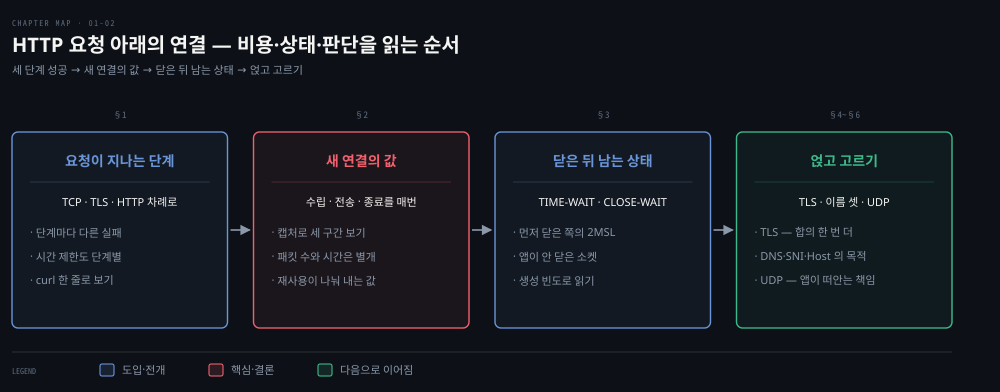
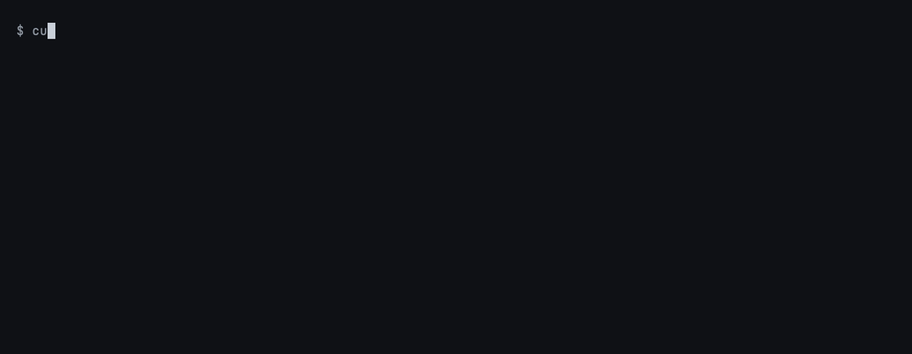
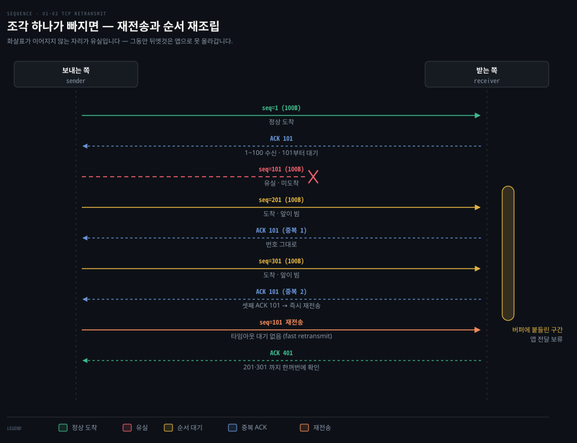
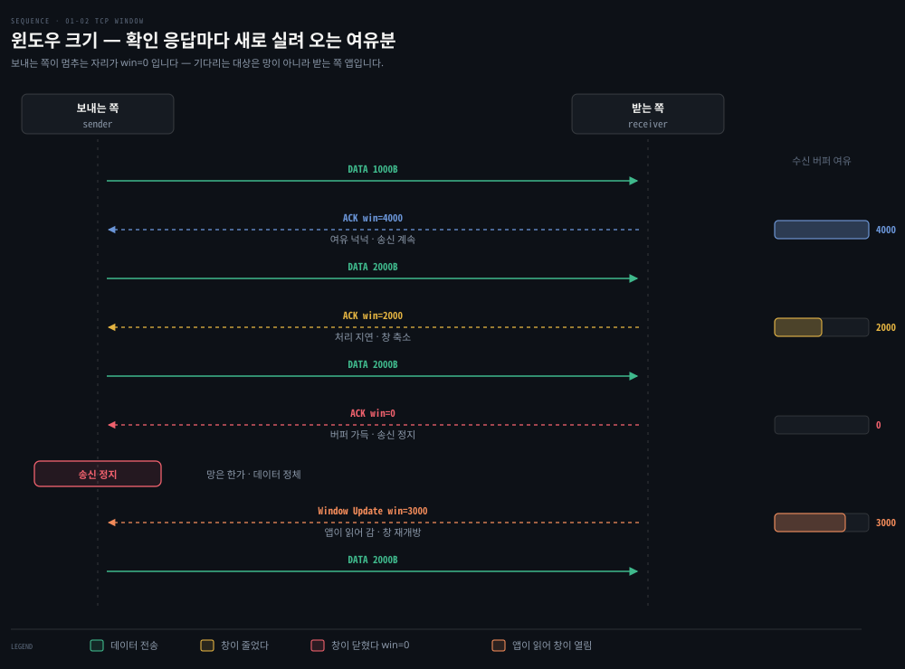
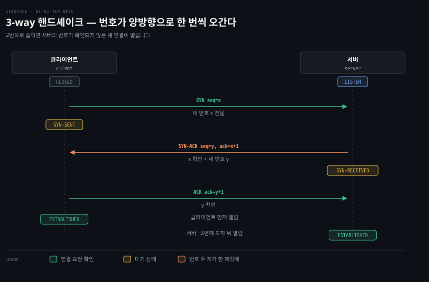
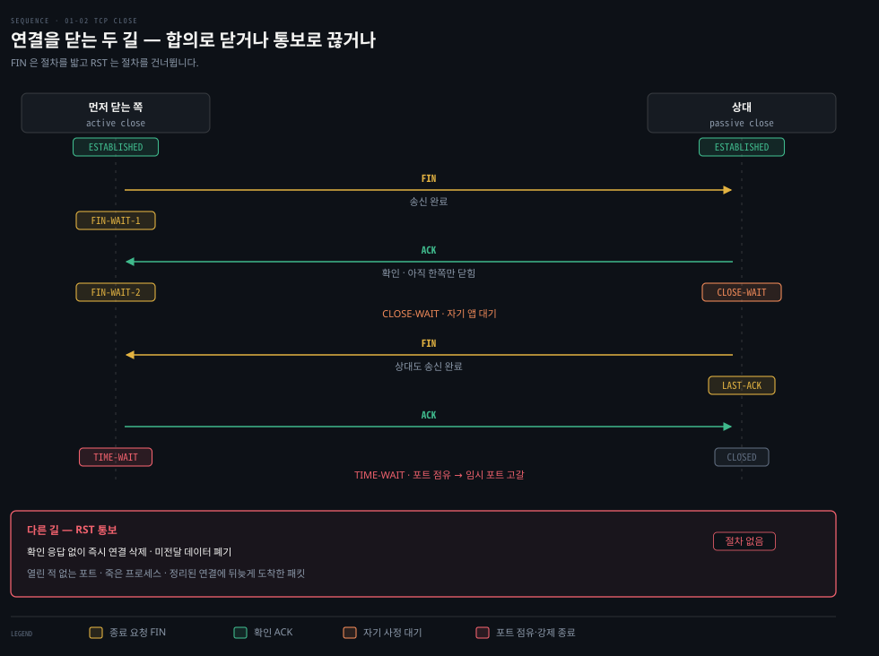
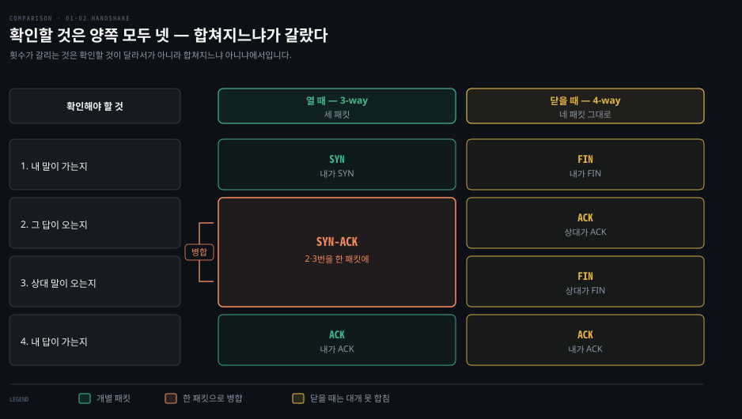
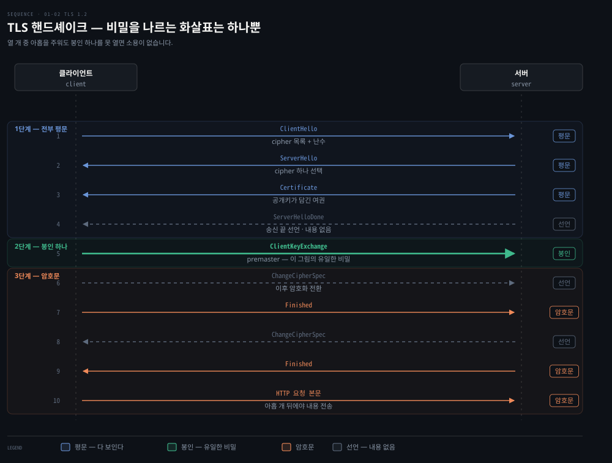
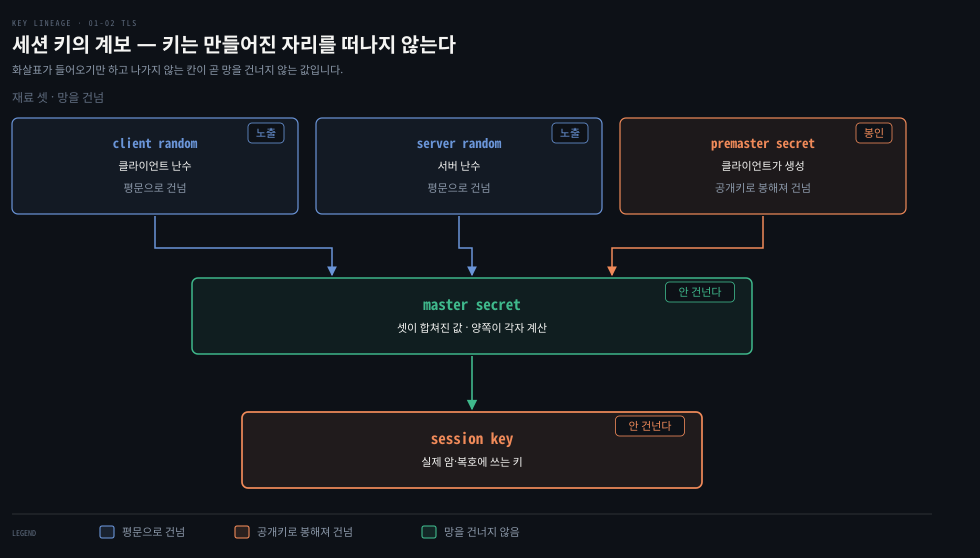

# HTTP에서 TCP·TLS·UDP까지 — Transport 계층 해부

---

## 핵심 요약
> 이 편 전체가 매달린 하나의 생각은 "TCP의 신뢰성은 공짜가 아니다"입니다.
> "Hello" 다섯 글자를 받는 HTTP 요청 하나에 12개 패킷이 오가지만 실제 데이터 전송은 2개뿐입니다. 나머지 10개가 연결 수립·확인 응답·종료라는 신뢰성의 비용입니다. 이 비용을 지불할 가치가 없는 애플리케이션(음성·DNS)을 위해 UDP가 있고, 보안이 필요한 트래픽을 위해 TCP 위에 TLS가 얹힙니다.


## 학습 목표
> 프로토콜 이름을 아는 데서 멈추지 않고, 신뢰성에 얼마가 드는지 세어 보고 그 값을 낼지 판단하는 상태를 목표로 합니다.

이 내용을 읽고 나면:

1. `curl -vvv` 출력에서 HTTP 요청·응답 헤더 각각의 의미를 설명할 수 있습니다.
2. TCP 세그먼트 헤더의 시퀀스·ACK 번호와 9개 플래그의 역할을 구분할 수 있습니다.
3. 3-way 핸드셰이크와 TCP 11개 연결 상태의 전이를 추적할 수 있습니다.
4. tcpdump 캡처에서 핸드셰이크·데이터 전송·연결 종료 구간을 찾아낼 수 있습니다.
5. TCP와 UDP 중 무엇을 쓸지 애플리케이션 특성으로 판단할 수 있습니다.

아래는 이 편 전체를 신뢰성의 비용이라는 하나의 축으로 이은 지도입니다. 무엇이 오가는지 본 다음 연결을 세우고, 비용을 센 뒤 그 값을 낼지 고르는 순서입니다. 각 칸 위의 머리글에 그 대목을 다루는 절 번호가 붙어 있습니다.

붉은색이 칠해진 3단계가 이 편의 결론입니다. "Hello" 하나에 12패킷이 오가는데 데이터는 2개뿐이라는 사실이 거기서 드러납니다. 마지막 칸에서 길이 갈립니다. 그 값을 더 내는 쪽이 TLS이고 안 내는 쪽이 UDP입니다.




## 1. HTTP 요청 해부 — cURL로 보는 Application 계층
> `curl -vvv` 한 줄이면 L7에서 오가는 것이 전부 드러납니다. 여기서 정해지는 것은 요청의 형식과 옵션뿐이고, 실제 전달은 아래 계층이 맡습니다.

전편의 Go 웹 서버(`0.0.0.0:8080`)에 cURL로 요청을 보내면 Application 계층에서 오가는 내용이 전부 드러납니다.

```bash
○ → curl localhost:8080 -vvv
* Connected to localhost (::1) port 8080
> GET / HTTP/1.1
> Host: localhost:8080
> User-Agent: curl/7.64.1
> Accept: */*
>
< HTTP/1.1 200 OK
< Date: Sat, 25 Jul 2020 14:57:46 GMT
< Content-Length: 5
< Content-Type: text/plain; charset=utf-8
<
Hello* Closing connection 0
```

`>` 줄이 클라이언트 요청, `<` 줄이 서버 응답입니다. 짚을 부분은 다섯 가지입니다.

- `GET / HTTP/1.1`: HTTP 메서드 + URL + 버전. GET은 정보를 가져오는 메서드입니다.
- `Host`·`User-Agent`·`Accept` — HTTP 헤더는 `이름: 값` 형식으로 요청·응답에 정보를 실어 나릅니다. `Accept: */*`는 클라이언트가 이해하는 콘텐츠 타입을 서버에 알립니다.
- `HTTP/1.1 200 OK`: 상태 코드. 1XX 정보, 2XX 성공, 3XX 리다이렉트, 4XX 요청 문제, 5XX 서버 문제입니다.
- `Content-Length: 5`: 응답 본문 크기(바이트). "Hello"가 정확히 5바이트입니다.
- `Content-Type: text/plain; charset=utf-8`: 응답 리소스의 미디어 타입. text 외에 application(json·pdf)·image·audio·video·font·model 타입군이 있습니다.

요청의 형식과 옵션은 전부 L7에서 정해지지만, 저자들 표현대로 실제 무거운 일은 그 아래 계층들이 합니다. 이제 한 층 내려갑니다.

### 직접 해 보기 — 서버를 띄우고 요청 한 번 보내기

위 출력은 읽는 것보다 직접 내 보는 편이 빠릅니다. 전편 §5의 Go 서버를 그대로 쓰면 준비물은 Go 하나뿐입니다.

```bash
# 1. 전편의 웹 서버를 그대로 저장하고 백그라운드로 띄웁니다
go run main.go &

# 2. 위에서 본 출력을 직접 냅니다
curl localhost:8080 -vvv

# 3. 실습이 끝나면 서버를 내립니다
kill %1
```



볼 곳은 세 군데입니다. `> ` 로 시작하는 네 줄이 클라이언트가 보낸 요청 헤더이고, `< ` 로 시작하는 줄이 서버 응답입니다. 그 사이의 `* Request completely sent off` 가 요청 전송이 끝난 지점이라 요청과 응답의 경계를 눈으로 가를 수 있습니다. `Content-Length: 5` 가 "Hello" 다섯 글자와 정확히 맞는지도 확인해 봅니다.

`* Connected to localhost (::1) port 8080` 한 줄은 다음 절과 이어집니다. 이 줄이 찍힌 시점에 이미 3-way 핸드셰이크가 끝나 있습니다. cURL이 보여 주는 것은 L7뿐이라 그 아래에서 오간 패킷은 보이지 않고, 그것을 보려면 §4의 tcpdump가 필요합니다.


## 2. TCP 세그먼트 헤더 — 신뢰성을 만드는 필드들
> **TCP의 신뢰성은 헤더 필드에서 나옵니다.** 시퀀스와 확인 응답 번호가 순서와 도착을 보증하고, 윈도우 크기가 흐름을 조절하며, 9비트 플래그가 연결의 상태를 나릅니다.

TCP는 연결 지향적이고 신뢰할 수 있는 프로토콜로, 흐름 제어와 다중화를 제공합니다. 연결의 생애주기 내내 상태를 관리하기 때문에 연결 지향적이라 부릅니다. 상태를 관리한다는 말이 곧 신뢰성의 근거입니다. 어디까지 보냈고 어디까지 받았는지를 양쪽이 기억해야 빠진 것을 다시 보낼 수 있기 때문입니다.

### 조각이 빠질 때 — 재전송과 순서 재조립

시퀀스와 확인 응답 번호가 실제로 무슨 일을 하는지는 조각이 하나 빠질 때 드러납니다. 가운데 줄에서 **화살표가 이어지지 않는 자리**가 유실입니다.



두 가지가 함께 일어납니다. **빠진 조각만 다시 오고**(재전송), 그 사이 **뒤에 도착한 것은 앱으로 올라가지 못합니다**(순서 재조립). 순서를 보장하려면 앞이 채워질 때까지 뒤를 붙들고 있어야 하니까요. 받는 쪽 막대가 그 붙들고 있는 구간입니다.

확인 응답이 같은 번호를 되풀이하는 것도 눈에 띕니다. `ACK 101`은 "101번째부터 기다린다"는 뜻이고, 뒤엣것을 받았어도 앞이 비어 있으면 이 번호가 바뀌지 않습니다. 같은 번호가 세 번 쌓이면 보내는 쪽은 **타임아웃을 기다리지 않고 곧바로** 재전송합니다. 재전송 타이머가 만료되기를 기다리는 것보다 훨씬 빠릅니다.

앞 절의 `Hello` 예제가 12패킷으로 끝난 것은 아무것도 유실되지 않았기 때문입니다. 조각 하나만 빠져도 패킷 수와 걸리는 시간이 함께 늘어납니다.

### 흐름 제어 — 창이 줄었다 늘었다

흐름 제어는 **윈도우 크기**가 담당합니다. 

- 윈도우 크기는 수신 측이 **"지금 이만큼은 더 받아도 된다"고 알리는 버퍼 여유분입니다.** 송신 측은 그 값을 넘겨 보내지 않습니다. 
- 수신 측이 처리에 밀리면 이 값이 줄어들고 0이 되면 송신이 멈춥니다. 느린 수신자가 빠른 송신자에 떠밀리지 않게 하는 장치입니다.

한 줄로 적으면 이 값이 **움직인다**는 점이 드러나지 않습니다. 확인 응답마다 새로 실려 오면서 줄었다 늘었다 하는 것이 흐름 제어의 실제 모습입니다.



보내는 쪽이 멈추는 자리가 `win=0`입니다. 이때 기다리는 대상은 망이 아니라 **받는 쪽 애플리케이션**입니다. 버퍼에 쌓인 것을 읽어 가야 여유분이 생기고 그제야 창이 다시 열립니다. 망은 한가한데 데이터가 흐르지 않는 상황이 여기서 나옵니다.

### 헤더 필드와 9개 플래그

프로세스 식별은 16비트 포트 번호가 맡습니다. 서버는 잘 알려진 포트(HTTP 80, TLS 443)에서 대기하고 클라이언트는 0~65534 범위의 임시 포트를 만들어 자신을 식별합니다.

브라우저가 웹 페이지 하나를 열 때 페이지 본문·이미지·CSS 연결을 각각 열고 서로 다른 가상 포트로 동시에 내려받는 동작이 TCP 다중화의 예입니다. 이를 가능하게 하는 세그먼트 헤더의 주요 필드는 다음과 같습니다.

| 필드 | 크기 | 역할 |
|------|------|------|
| Source·Destination port | 각 16비트 | 송신·수신 포트 식별 |
| Sequence number | 32비트 | SYN이면 초기 시퀀스 번호. 순서가 어긋난 데이터의 재조립에도 사용 |
| Acknowledgment number | 32비트 | ACK가 켜져 있으면 다음에 기대하는 시퀀스 번호. 이전 바이트 전부의 수신 확인 |
| Data offset | 4비트 | TCP 헤더 크기(32비트 워드 단위) |
| Flags | 9비트 | 아래 표 참조 |
| Window size | 16비트 | 수신 윈도우 크기 — 흐름 제어의 핵심 |
| Checksum | 16비트 | TCP 헤더 오류 검사 |
| Options·Padding·Data | 가변 | 옵션(0~320비트), 32비트 경계 정렬용 패딩, 애플리케이션 데이터 |

9개 플래그 중 실무에서 자주 만나는 것은 여섯입니다.

| 플래그 | 원말 | 의미 |
|--------|------|------|
| SYN | **Syn**chronize | 시퀀스 번호를 동기화해 연결을 시작 |
| ACK | **Ack**nowledgment | Acknowledgment 필드가 유효함. 연결 수립 후에는 항상 켜짐 |
| PSH | **Push** | 수신자가 데이터를 가능한 한 빨리 애플리케이션에 전달해야 함 |
| FIN | **Fin**ish | 송신자가 데이터 전송을 마쳤음 |
| RST | **Res**e**t** | 연결 재설정 또는 중단(보통 오류) |
| URG | **Urg**ent | Urgent Pointer 필드가 유효함(드물게 사용) |

나머지 셋은 혼잡 알림(ECN, Explicit Congestion Notification) 관련입니다. NS는 Nonce Sum, CWR은 Congestion Window Reduced, ECE는 ECN-Echo의 줄임말입니다.

이 중 연결을 끝내는 것이 `FIN`과 `RST` 둘인데 성격이 반대입니다. **`FIN`은 절차를 밟고 `RST`는 절차를 건너뜁니다.** 

- `FIN`은 양쪽이 각각 "보낼 것을 다 보냈다"고 알리고 서로 확인하므로 버퍼에 남아 있던 데이터가 전부 전달됩니다. 
- `RST`는 받은 쪽이 확인 응답조차 보내지 않고 그 자리에서 연결을 지우며, 아직 전달되지 않은 데이터는 버려집니다. 
- 합의로 닫는 것과 통보로 끊는 것의 차이이고, 두 길이 갈리는 모습은 §3의 "닫는 쪽" 도식에서 함께 봅니다.

실무에서 `RST`를 만나는 자리는 대개 셋입니다. 

1. 열려 있지 않은 포트로 접속
2. 서버 프로세스가 이미 죽음
3. 상대가 정리해 버린 연결에 패킷이 뒤늦게 도착


## 3. 3-way 핸드셰이크와 11개 연결 상태
> 핸드셰이크가 3번인 이유는 양쪽이 각자의 시퀀스 번호를 보내고 서로 확인해야 하기 때문입니다. 연결은 그 뒤로 11개 상태를 오가며 관리됩니다.


위 그림이 연결 하나의 **전체 일생**입니다. `curl localhost:8080` 한 번에 실제로 오가는 패킷이 열둘이고, 이 절이 다루는 것은 그중 앞의 셋과 뒤의 넷입니다.

- **실선 둘만 실제 내용을 나릅니다.** 나머지 열은 연결을 세우고 확인하고 닫는 데 쓰입니다. 이 비율이 §4의 결론이고, 여기서는 그 열 개가 **어떤 순서로 어떤 상태를 만드는지**를 봅니다.

### 여는 쪽 — 3-way

TCP는 연결을 만들 때 3-way 핸드셰이크로 옵션과 플래그 정보를 교환합니다. 화살표 라벨에 그 패킷이 나르는 번호와 **보낸 직후 놓이는 상태**를 함께 적었습니다.



여기서 짚을 것이 둘입니다.

- **시퀀스 번호가 양방향으로 한 번씩 오갑니다.** 클라이언트가 `x`를 보내면 서버가 `x+1`로 받았음을 알리면서 자기 번호 `y`를 함께 싣고, 클라이언트가 다시 `y+1`로 답합니다. 2번으로 줄이면 서버의 번호가 확인되지 않은 채 연결이 열립니다.
- **`x`와 `y`가 따로인 이유가 여기 있습니다.** 연결 하나 안에 방향이 둘이고, 각 방향이 **자기 바이트 스트림을 따로 셉니다.** 두 사람이 각자 편지에 일련번호를 매기는 것과 같아서, 내 세 번째 편지와 상대의 세 번째 편지는 다른 편지입니다. `ack=x+1`이 "당신이 센 `x` 다음"을 뜻하고 내 번호와 무관한 것도 그래서입니다. 시작값이 0이 아니라 매번 임의값인 것은 이전 연결의 늦은 패킷이 새 연결에 섞이거나 공격자가 번호를 예측해 위조 패킷을 끼워 넣는 것을 막기 위해서입니다.
- **연결이 양쪽에서 동시에 열리지 않습니다.** 클라이언트는 세 번째 패킷을 보내면서 **ESTABLISHED**가 되지만, 서버는 그 패킷이 도착해야 열립니다. 그동안 서버는 SYN-RECEIVED에 머뭅니다.

데이터 전송과 종료까지 합한 전체 흐름은 §4에서 12개 패킷으로 한 번에 봅니다.


- 연결이 수립되면 양쪽 호스트에 이 연결을 추적하는 소켓이 만들어집니다. 
- 소켓은 통신의 논리적 종단점일 뿐이며, Linux가 소켓을 다루는 방식은 2장에서 다룹니다.

TCP는 상태 기계(stateful)입니다. 송신자와 수신자가 연결 흐름의 어디에 있는지 합의해야 하고, 그 상태는 9비트 플래그로 표현됩니다. 11개 상태의 요지는 다음과 같습니다.

| 상태 | 누가 | 의미 |
|------|------|------|
| LISTEN | 서버 | 원격의 연결 요청을 대기 |
| SYN-SENT | 클라이언트 | 연결 요청을 보내고 응답 대기 |
| SYN-RECEIVED | 서버 | 연결 요청을 받고 보낸 뒤 확인 대기 |
| ESTABLISHED | 양쪽 | 열린 연결 — 데이터 전송 단계 |
| FIN-WAIT-1·2 | 양쪽 | 상대의 연결 종료 요청 대기 |
| CLOSE-WAIT | 양쪽 | 로컬 사용자의 종료 요청 대기 |
| CLOSING | 양쪽 | 상대의 종료 확인 대기 |
| LAST-ACK | 양쪽 | 먼저 보낸 종료 요청의 확인 대기 |
| TIME-WAIT | 어느 한쪽 | 상대가 종료 확인을 받았음을 보장할 시간 대기 |
| CLOSED | 양쪽 | 연결 없음 |

### 닫는 쪽 — 4-way와 RST

표만 보면 상태가 나란히 놓인 목록처럼 보이지만, 실무에서 헷갈리는 지점은 **어느 상태가 어느 쪽에 생기는가**입니다. 연결을 닫는 쪽을 마저 보면 그 대응이 드러납니다.



여는 도식에 다섯이, 닫는 도식에 여섯이 나옵니다.

- 여는 쪽: `CLOSED` · `LISTEN` · `SYN-SENT` · `SYN-RECEIVED` · `ESTABLISHED`
- 닫는 쪽: `FIN-WAIT-1` · `CLOSE-WAIT` · `FIN-WAIT-2` · `LAST-ACK` · `TIME-WAIT` · `CLOSED`

표의 11개가 두 장에 나뉘어 다 들어 있습니다. 열한 번째인 `CLOSING`만 드문 경우라 아래에서 따로 다룹니다.

어느 쪽에 생기는지도 이 배치로 갈립니다.

- **서버**만 거치는 것이 `LISTEN`·`SYN-RECEIVED`·`CLOSE-WAIT`·`LAST-ACK` 넷입니다.
- **클라이언트**만 거치는 것은 `SYN-SENT`·`FIN-WAIT-1`·`FIN-WAIT-2`·`TIME-WAIT` 넷입니다.
- `CLOSED`와 `ESTABLISHED`는 양쪽에 다 나타납니다.

닫는 도식의 세 번째 구간이 `CLOSING`입니다. 양쪽이 거의 같은 순간에 `close`를 부르면 서로의 `FIN`이 길에서 엇갈리고, `FIN-WAIT-2`로 가지 못한 채 둘 다 `CLOSING`에 빠집니다. 실무에서 마주칠 일이 드물어 본 흐름과 나란히 두되 구간을 갈라 두었습니다.

가운데 구간은 같은 목적을 `RST` 하나로 끝내는 경우입니다. 위 구간이 네 번을 주고받으며 남은 데이터까지 전달하는 동안, 아래 구간은 한 번의 통보로 끝나고 남은 데이터는 버려집니다. §2에서 본 두 플래그의 차이가 여기서 오가는 패킷 수로 드러납니다.

패킷 하나가 양쪽 상태를 동시에 움직인다는 것이 요점입니다. 클라이언트가 FIN을 보내면 자기는 FIN-WAIT-1이 되고, 그 패킷이 닿은 서버는 CLOSE-WAIT가 됩니다.

서버 쪽을 위에서 아래로 읽어 보면 CLOSE-WAIT와 LAST-ACK 사이가 비어 있습니다. ACK를 돌려보낸 뒤에도 서버는 CLOSE-WAIT에 머물러 있고, 다음 칸으로 넘어가려면 **애플리케이션이 `close`를 호출해야** 합니다. 클라이언트 쪽이 패킷마다 이름이 바뀌는 것과 대비됩니다. 여기서 실무 신호 둘이 나옵니다.

| 상태 | 어느 쪽에 | 무엇을 기다리나 | 쌓이면 |
|------|-----------|-----------------|--------|
| TIME-WAIT | 먼저 닫은 쪽 | **아무도 안 기다립니다.** 2MSL을 그냥 흘려보냅니다 | 포트 쌍을 계속 점유해 임시 포트가 고갈됩니다 |
| CLOSE-WAIT | 나중 닫는 쪽 | 상대가 아니라 **우리 애플리케이션**의 `close` | 상대는 이미 끊었는데 우리 코드가 소켓을 안 닫고 있다는 뜻입니다 |

그래서 서버에 CLOSE-WAIT가 쌓여 있으면 네트워크가 아니라 **커넥션 누수 버그**를 찾아야 합니다.

- CLOSING 구간을 조금 더 풀면 이렇습니다. 내가 FIN을 보내고 ACK를 기다리는 사이에 상대의 FIN이 **먼저** 도착하므로, `FIN-WAIT-2`로 가는 길이 막히고 `CLOSING`으로 빠집니다. 
- 뒤늦게 내 FIN에 대한 ACK를 받으면 그때 `TIME-WAIT`로 합류합니다. 전이 규칙은 RFC 9293 Figure 5의 상태 전이도에 그려져 있습니다.

### 비유로 한 번 더 — 전화를 걸고 끊기

여는 데 세 번, 닫는 데 네 번입니다. 같은 연결인데 횟수가 다른 이유는 **합칠 수 있는 말과 없는 말**이 갈리기 때문입니다. 전화 통화로 옮겨 보면 그 차이가 드러납니다.

**걸 때는 세 마디**입니다. "여보세요, 제 말 들리세요?" 하고 물으면 상대가 "들려요, 제 말도 들리세요?" 하고 답하고, 마지막으로 "들려요" 하면 끝납니다.

**끊을 때는 네 마디**입니다. 내가 "저는 할 말 다 했어요" 하면 상대는 "알겠어요" 하고 답합니다. 여기서 통화가 끝나지 않습니다. 상대에게는 아직 하려던 말이 남아 있을 수 있습니다. 그 말을 마친 뒤에야 "저도 다 했어요" 하고, 내가 "알겠어요" 하면 그제야 끊깁니다.



확인할 것은 **양쪽 모두 넷**입니다. 내 말이 가는지, 그 답이 오는지, 상대 말이 오는지, 내 답이 가는지.

열 때는 상대가 이미 받을 준비를 마친 채 기다리고 있어 **가운데 둘을 한 마디에 실을 수 있습니다.** "들려요"와 "제 말도 들리세요"를 함께 말해도 아무 문제가 없으니 넷이 셋으로 줄어듭니다. 닫을 때는 그러지 못합니다. **"당신 말은 다 들었어요"와 "저도 할 말이 끝났어요"는 다른 말**이기 때문입니다. 앞엣것은 즉시 답할 수 있지만 뒤엣것은 상대 사정이라 얼마나 걸릴지 알 수 없습니다.

**횟수가 갈리는 것은 확인할 것이 달라서가 아니라 합쳐지느냐 아니냐에서입니다.**

이 대비가 앞서 본 두 상태의 성격을 그대로 설명합니다. **CLOSE-WAIT**는 "알겠어요"까지만 말하고 수화기를 든 채 자기 할 말을 정리하는 구간입니다. 상대를 기다리는 것이 아니라 **자기 사정을 기다립니다.** 그래서 정리가 영영 안 끝나면, 다시 말해 애플리케이션이 `close`를 부르지 않으면 그 자리에 계속 머뭅니다.

**TIME-WAIT**는 마지막 "알겠어요"를 말한 뒤 곧바로 수화기를 내려놓지 않고 잠시 들고 서 있는 것입니다. 그 말이 상대에게 닿지 않았다면 상대가 "저도 다 했어요"를 다시 외칠 텐데, 이미 자리를 떠났으면 받아 줄 사람이 없기 때문입니다. 기다리는 대상이 없는데도 시간을 흘려보내는 이 구간이, 전화기를 계속 점유해 다음 통화를 막는 임시 포트 고갈로 이어집니다.

`netstat -ap TCP`를 실행하면 현재 호스트의 모든 TCP 연결과 상태(ESTABLISHED, LISTEN, CLOSE_WAIT 등), 양 끝 주소를 볼 수 있습니다. 대기 중인 서버 소켓은 `*.16587` 같은 LISTEN 행으로, 활성 연결은 로컬·원격 주소 쌍으로 나타납니다. 위 그림의 어느 칸에 연결이 멈춰 있는지를 이 명령으로 확인하는 셈입니다.


## 4. tcpdump로 본 12개 패킷 — 신뢰성의 실제 비용
> 이 편의 결론이 나오는 절입니다. "Hello" 하나를 받는 데 12개 패킷이 오가지만 데이터는 2개뿐이고, 나머지 10개가 신뢰성의 값입니다.

<!-- no-diagram: 열둘이 순서대로 놓인 그림은 §3 맨 앞에 있고, 이 절은 그 그림을 실제 캡처 출력으로 확인하는 자리입니다 -->

tcpdump는 네트워크 인터페이스에서 처리되는 패킷을 잡아 보여 주는 도구입니다. 체크섬을 NIC가 계산하는(checksum offloading) 시스템에서는 `cksum 0xfe34 (incorrect)` 같은 표시가 정상적으로 나타납니다.  그런 시스템에서 IP·TCP·UDP 체크섬은 패킷이 선로에 오르기 직전 NIC에서 계산되는데, tcpdump는 NIC보다 *앞*에서 패킷을 잡습니다. 아직 채워지지 않은 값을 읽고 틀렸다고 보고하는 것이라 장애 신호가 아닙니다.

캡처 대상으로 loopback(`lo0`)을 고른 것도 우연이 아닙니다. loopback은 Ethernet 같은 물리 인터페이스가 아니라 논리 인터페이스라, 호스트의 다른 인터페이스가 죽어 있어도 항상 살아 있습니다. 실습을 언제 다시 돌려도 같은 조건이 보장된다는 뜻입니다.

```bash
sudo tcpdump -i lo0 tcp port 8080 -vvv

# 시각            보낸 쪽 > 받은 쪽                      플래그        번호
08:13:55.009899 localhost.50399 > localhost.http-alt: Flags [S],  seq 2784345138, ...
#  └ 1번 SYN — 클라이언트가 고른 초기 시퀀스 번호(ISN). 0이 아니라 임의값이다

08:13:55.009997 localhost.http-alt > localhost.50399: Flags [S.], seq 195606347, ack 2784345139, ...
#  └ 2번 SYN-ACK — 서버도 자기 ISN 을 따로 고른다. ack 는 클라 ISN + 1

08:13:55.010012 localhost.50399 > localhost.http-alt: Flags [.],  seq 1, ack 1, ...
#  └ 3번 ACK — 여기서부터 seq 가 1 로 보인다. 번호가 바뀐 게 아니라 tcpdump 가 ISN 을 0 으로 놓고 상대값으로 바꿔 찍는다

08:13:55.010021 localhost.http-alt > localhost.50399: Flags [.],  seq 1, ack 1, ...
#  └ 4번 ACK — 수립 직후 서버가 한 번 더 보낸다

08:13:55.010079 localhost.50399 > localhost.http-alt: Flags [P.], seq 1:79,  length 78: HTTP GET
#  └ 5번 데이터 — 1 번째부터 78 번째 바이트까지. seq 가 바이트를 센다는 증거

08:13:55.010102 localhost.http-alt > localhost.50399: Flags [.],  ack 79, ...
#  └ 6번 ACK — "79 번째 바이트부터 기다린다" = 78 까지 다 받았다

08:13:55.010198 localhost.http-alt > localhost.50399: Flags [P.], seq 1:122, length 121: HTTP 200
#  └ 7번 데이터 — 서버 방향은 자기 번호를 따로 세므로 다시 1 부터다

08:13:55.010219 localhost.50399 > localhost.http-alt: Flags [.],  ack 122, ...
08:13:55.010324 localhost.50399 > localhost.http-alt: Flags [F.], seq 79, ...
# （이하 종료 시퀀스 — 총 12 packets captured）
```

읽는 법은 플래그입니다. `[S]`가 SYN, `[S.]`가 SYN-ACK, `[.]`가 ACK, `[P.]`가 데이터 푸시, `[F.]`가 FIN-ACK입니다.

번호를 읽을 때 걸리는 대목이 하나 있습니다. 처음 두 줄은 `seq 2784345138` 같은 큰 수인데 세 번째 줄부터 갑자기 `seq 1`이 됩니다. **번호가 줄어든 것이 아니라 `tcpdump`가 바꿔 찍는 것입니다.** 각 방향의 첫 번호(ISN)를 0으로 놓고 그 뒤를 상대값으로 표시합니다. 27억을 눈으로 빼면서 읽을 수는 없으니까요. 절대값이 필요하면 `-S`를 붙입니다.

`seq 1:79`와 그에 대한 `ack 79`가 §2에서 본 것을 눈으로 확인해 줍니다. 시퀀스 번호는 **패킷이 아니라 바이트를 셉니다.** 78바이트를 보냈으니 1번째부터 78번째까지이고, 받은 쪽은 "79번째부터 기다린다"고 답합니다. 그리고 7번 줄에서 서버가 다시 `seq 1`부터 시작하는 것이 **방향마다 번호를 따로 센다**는 증거입니다.

플래그가 TCP 쪽 정보라면, 같은 줄의 나머지는 대개 IP 쪽 정보입니다. **위 캡처에서 각 줄 끝을 `...` 로 줄여 둔 자리가 그것입니다.** `-vvv` 를 붙이면 그 자리에 IP 헤더 필드가 괄호로 묶여 함께 찍힙니다. 아래 표가 그 괄호 안에 나오는 이름들이고, 다음 편에서 IP 헤더를 볼 때 그대로 다시 나옵니다.

| 필드 | 의미 |
|------|------|
| `tos` | Type of Service 필드 |
| `TTL` | 남은 수명. 0이면 출력하지 않습니다 |
| `id` | IP 식별자 필드 |
| `offset` | 단편 오프셋. 단편화된 데이터그램인지와 무관하게 출력합니다 |
| `flags` | `DF`(Don't Fragment)는 이 패킷을 단편화할 수 없다는 표시이고, 꺼져 있으면 단편화해도 됩니다. `MF`(More Fragments)는 뒤에 조각이 더 있다는 표시이며, 꺼져 있으면 남은 조각이 없다는 뜻입니다 |
| `proto` | 프로토콜 ID 필드 |
| `length` | 전체 길이 필드 |
| `options` | IP 옵션 |

12개 패킷의 구성을 세어 보면 핸드셰이크 3개, 수립 직후 서버의 ACK 1개, HTTP 요청·응답 데이터 2개, 데이터 수신 확인 2개, 종료 시퀀스 4개(최종 ACK 포함)입니다. 저자들이 강조하는 관찰이 여기서 나옵니다 — 12개 중 실제 데이터 전송은 2개뿐이고 나머지는 전부 신뢰성 유지 비용입니다.

위 캡처는 지면 때문에 8번째에서 끊었지만, 열둘이 순서대로 놓인 그림은 §3 맨 앞에 있습니다. **실선 두 줄만 실제 데이터**이고 나머지 열 줄은 점선인 그 대비가 이 절의 결론을 그대로 그린 것입니다.

### 직접 해 보기 — 12패킷을 내 눈으로 세기

이 절의 결론은 직접 세어 볼 때 가장 확실합니다. 터미널 두 개가 필요합니다. 캡처를 먼저 걸어 두지 않으면 핸드셰이크를 놓칩니다.

```bash
# 터미널 A — 캡처를 먼저 건다. BPF 장치 접근에 관리자 권한이 필요하다
sudo tcpdump -i lo0 tcp port 8080 -vvv

# 터미널 B — 캡처가 돌아가는 상태에서 요청을 한 번 보낸다
curl localhost:8080

# 터미널 A 로 돌아와 Ctrl+C — 마지막 줄의 "N packets captured" 를 읽는다
```

이 절의 실행 장면은 `_assets/01-02.tcpdump-12packets.tape`로 두었습니다. 라이브 캡처는 `/dev/bpf`가 root 전용이라 미리 구워 두지 못했습니다. macOS `sudo`는 자격 증명을 tty 단위로 캐시하므로, **굽는 터미널에서 직접** `sudo -v`를 한 뒤 `vhs 01-02.tcpdump-12packets.tape`를 실행하면 캡처부터 `-vvv` 출력까지 한 장면으로 남습니다. 표시 단계에서 `-r`로 파일을 다시 읽는 구성이라 출력 부분은 권한과 무관합니다.

`packets captured` 수가 12에 가까우면 성공입니다. 플래그를 순서대로 훑어 `[S]` → `[S.]` → `[.]` 로 시작하는 핸드셰이크 3개, `[P.]` 가 붙은 데이터 2개, `[F.]` 가 섞인 종료 구간을 각각 짚어 봅니다. 앞서 세어 본 구성과 맞는지 확인하는 것이 이 실습의 목적입니다.

수가 정확히 12가 아닐 수 있습니다. keep-alive 로 연결이 남거나 TCP 옵션 협상이 달라지면 확인 응답 개수가 한둘 달라집니다. 중요한 것은 정확한 숫자가 아니라 **데이터 2개 대 나머지**의 비율이므로, 그 비율이 유지되는지를 봅니다.

> 💬 **비유**: TCP는 등기 우편입니다. 보내기 전에 상대가 받을 준비가 됐는지 확인하고(핸드셰이크), 편지마다 수령 확인 서명을 받으며(ACK), 다 보냈다는 통지도 양쪽이 주고받습니다(FIN). 
>
> 확실하지만 절차가 많습니다. UDP는 전단지 배포입니다 — 우체통에 넣고 끝이며, 받았는지는 확인하지 않습니다. 전단지 몇 장쯤 유실돼도 사업에 지장이 없듯, 음성 통화의 패킷 몇 개 유실은 품질 저하일 뿐 통화 자체를 막지 않습니다.


## 5. TLS — TCP 위에 얹는 암호화
> Transport 계층은 보안을 제공하지 않으므로 암호화가 필요하면 TCP 위에 TLS를 얹습니다. 핸드셰이크가 한 번 더 붙는 만큼 비용도 더 듭니다.



지금까지의 예제는 전부 평문이었습니다. Transport 계층 자체는 보안을 제공하지 않으므로, 은행 로그인 같은 트래픽은 TCP 위에 TLS를 얹습니다. TLS도 TCP처럼 핸드셰이크로 암호화 능력을 확인하고 키를 교환합니다.

위 그림의 핸드셰이크는 메시지 열 개이고, 그 열 개가 노출 상태에 따라 세 구간으로 갈립니다. 화살표마다 이름 옆에 그 메시지가 어떤 상태로 망을 건너는지 붙였습니다. 실선은 내용을 실어 나르는 메시지, 점선은 아무것도 나르지 않는 선언입니다. 굵은 초록 실선 하나만 비밀을 나릅니다. 세로선에 걸친 막대는 그 쪽이 계산하고 있는 구간입니다.

1단계의 네 메시지가 **전부 평문**입니다. cipher 목록도 난수도 인증서도 그대로 흐릅니다. 협상이라는 말이 무색하게, 무엇을 쓸지 정하는 과정은 도청자에게 다 보입니다.

**cipher suite**가 정해지는 자리가 그중 앞의 두 줄입니다. 클라이언트가 자기가 지원하는 목록을 실어 보내면 서버가 그중 하나를 고릅니다. 이름 하나가 키 교환·인증·대칭 암호·무결성 네 가지 알고리즘의 조합을 가리키므로, 이 한 번의 선택으로 나머지 절차의 방식이 전부 확정됩니다.

나머지 둘의 성격은 이렇습니다. `ServerHelloDone`은 보낼 것을 다 보냈다는 표시일 뿐 내용이 없고, `ChangeCipherSpec`과 `Finished`는 한 쌍이 아니라 양쪽이 각각 한 번씩 보냅니다. 그리고 HTTP 요청 본문은 마지막 화살표에 가서야 나갑니다. 앞의 아홉 개는 아직 아무 내용도 나르지 않은 준비 과정입니다.

망을 건너는 비밀은 `ClientKeyExchange`의 **premaster 하나뿐**입니다. 그마저 서버 공개키로 봉해져 있어 개인키를 가진 서버만 열 수 있습니다. 바로 앞에서 클라이언트가 인증서를 검증하는 이유가 여기 있습니다 — 봉인에 쓸 공개키가 진짜 그 서버의 것인지 확인하지 않으면, 중간자에게 비밀을 곱게 포장해 건네는 셈이 됩니다.

세션 키 자체는 망을 건너지 않습니다. 양쪽이 난수 둘과 premaster를 각자 결합해 같은 값을 만들어 냅니다. Finished부터는 그 키로 암호화되므로, 앞의 평문을 전부 모은 도청자라도 premaster를 열지 못하면 이후 트래픽은 읽지 못합니다.

막대는 그 쪽이 계산하는 구간입니다. 다섯 개 중 셋이 서버 쪽이고 길이도 더 깁니다. 인증서를 모아 보내는 일도, 봉인을 개인키로 여는 일도 서버 몫이기 때문입니다. 막대가 한 번도 겹치지 않는다는 점도 눈에 띕니다. 한쪽이 계산하는 동안 다른 쪽은 기다리므로, 핸드셰이크에 드는 시간은 왕복 지연 위에 양쪽의 계산 시간이 차례로 얹힌 값이 됩니다.

구간을 가른 기준은 도청자가 무엇을 얻는가입니다.

1. 1단계에서 얻는 것은 난수 둘과 cipher suite 이름과 인증서인데, 셋 다 공개돼도 무방한 값입니다.
2. 2단계의 화살표 하나를 열지 못하면 3단계는 통째로 읽히지 않습니다. 열 개 중 아홉 개를 주워도 소용이 없다는 뜻이고, 그래서 공격은 늘 그 하나를 노립니다. 인증서 검증을 속여 봉인할 공개키를 바꿔치기하는 쪽입니다.

이 그림은 TLS 1.2의 절차이며 메시지 구성과 순서는 [RFC 5246 §7.3](https://datatracker.ietf.org/doc/html/rfc5246#section-7.3)의 전체 핸드셰이크 흐름을 따랐습니다. 상황에 따라 붙는 `ServerKeyExchange`와 `CertificateRequest`는 뺐습니다. [TLS 1.3](https://datatracker.ietf.org/doc/html/rfc8446)은 왕복을 한 번으로 줄이면서 `ServerHelloDone`과 `ClientKeyExchange`를 없앴고 키 교환 방식도 바꿨으므로, 1.3의 그림은 따로 그려야 합니다.

### 세션 키의 계보 — 재료 셋이 하나로 합쳐진다

시간 순서로는 재료 셋이 하나로 모이는 장면이 보이지 않습니다. 세로선을 따라 내려가는 그림에는 "셋이 하나로 합쳐진다"를 그릴 자리가 없기 때문입니다. 계보만 따로 떼어 보면 이렇습니다.



위 세 칸이 재료이고 각 칸의 아래 줄이 **그 재료가 망을 어떻게 건넜는지**입니다. 난수 둘은 평문으로 그냥 건너갔습니다. premaster 만 공개키로 봉해져 건넜습니다. 셋이 합쳐진 master secret과 거기서 나온 세션 키에는 화살표가 들어오기만 하고 나가지 않습니다. **키는 만들어진 자리를 떠나지 않는다**는 뜻입니다. 그래서 도청자가 위 세 칸을 전부 주워도 봉인 하나를 못 열면 아래 두 칸에 도달하지 못합니다.

### 비유로 한 번 더 — 처음 가는 은행 창구

메시지 이름 아홉 개는 외워지지 않습니다. 대신 각 봉투가 **무슨 일을 대신하는지**로 한 번 더 지나가 보겠습니다. 아래 대응표를 들고 읽으시면 됩니다.

| 실물 | 비유 |
|---|---|
| 서버 공개키 | 눌러 잠그는 **자물쇠** — 잠그는 건 누구나, 여는 건 주인만 |
| 서버 개인키 | 그 자물쇠를 여는 **열쇠** |
| 인증서 | 이름과 자물쇠가 담긴 **여권** |
| CA 서명 / CA 공개키 | 발급 기관 **도장** / 대조용 **인감 대장** |
| 난수 | 각자 굴린 **주사위 눈** |
| premaster | 상자에 담아 보내는 **열쇠 재료** |
| 세션 키 | 양쪽이 깎아 낸 **똑같은 금고 열쇠** |
| cipher suite | 연장과 방식을 적은 **작업 사양서** |

**3-way 핸드셰이크**는 창구에 대고 "말 걸어도 됩니까"를 확인하는 절차입니다. 창구가 "됩니다, 저도 됩니까" 하고 되묻고, 내가 "됩니다" 하고 답하면 끝납니다. 여기까지 확인된 것은 **양쪽으로 말이 닿는다**는 사실 하나뿐입니다. 상대가 누구인지는 아직 모릅니다. 창구 옆에는 낯선 사람이 서서 오가는 말을 다 듣고 있습니다.

**TLS 아홉 번**은 그 낯선 사람 앞에서 둘만의 금고를 만드는 과정입니다.

1. 내가 다룰 줄 아는 **사양서 목록**과 내가 굴린 **주사위 눈**을 큰 소리로 말합니다. 옆 사람도 다 듣습니다.
2. 창구가 그중 사양서 하나를 고르고 자기 **주사위 눈**을 밝힙니다. 이것도 큰 소리입니다.
3. 창구가 **여권**을 내밉니다. 나는 품에서 **인감 대장**을 꺼내 도장을 대조하고, 여권에 적힌 이름이 내가 찾아온 은행 이름과 같은지 확인합니다. 앞엣것은 위조 여권을 걸러내고, 뒤엣것은 남의 진짜 여권을 들고 온 경우를 걸러냅니다.
4. 창구가 "제 쪽은 다 냈습니다" 하고 차례를 넘깁니다.
5. 나는 상자에 **무작위 숫자**를 적어 넣고 여권에서 꺼낸 **자물쇠로 눌러 잠가** 건넵니다. 옆 사람이 낚아채도 열지 못합니다. 창구만 자기 **열쇠**로 엽니다. 이 시점에 양쪽 손에는 주사위 눈 둘과 숫자 하나가 놓이고, 1번에서 합의한 사양서대로 그 셋을 섞어 **똑같은 금고 열쇠**를 각자 깎습니다. 열쇠 자체는 창구 밖으로 나간 적이 없습니다.
6. 나는 "지금부터 제 말은 금고에 넣어 드립니다" 하고 알립니다.
7. 그리고 **여태 오간 말 전부를 한 장으로 요약해** 금고에 넣어 건넵니다.
8. 창구도 같은 선언을 돌려줍니다.
9. 창구도 **자기가 들은 대화의 요약**을 금고에 넣어 건넵니다.

두 요약이 맞으면 1번과 2번에서 옆 사람이 끼어들어 사양서 목록을 손보지 않았다는 뜻입니다. 옆 사람은 이 요약을 흉내 낼 수 없습니다. 상자를 열지 못해 금고 열쇠가 없으니 애초에 금고에 넣을 방법이 없습니다.

여기까지 마치고 나서야 **"제 계좌 잔액 알려 주세요"** 라는 첫 용건이 금고에 담겨 나갑니다.

옆 사람이 들은 것을 세어 보면 사양서 이름, 주사위 눈 둘, 창구 여권 전체입니다. 거의 전부를 들었습니다. 얻지 못한 것은 상자 안의 숫자 하나뿐이고, 그 하나가 없어 금고를 열지 못합니다. **협상의 앞 네 통이 통째로 평문이어도 무너지지 않는 이유**가 여기 있습니다.

Kubernetes에서는 애플리케이션과 컴포넌트가 TLS를 개발자 대신 관리해 주는 경우가 많아, 이 수준의 기본 이해면 출발점으로 충분합니다. TLS와 Kubernetes의 결합은 5장에서 다시 다룹니다.


## 6. UDP — 신뢰성 비용을 낼 필요가 없다면
> 반대 방향의 선택입니다. 확인 응답을 포기하는 대신 헤더 4필드와 지연 없는 전달을 얻습니다. 유실을 견디는 워크로드에서는 이쪽이 맞습니다.


UDP는 TCP의 신뢰성이 필요 없는 애플리케이션의 대안입니다. 헤더 필드가 4개뿐이고 수신 확인이 없습니다.

| 필드 | 크기 | 비고 |
|------|------|------|
| Source port | 2바이트 | 클라이언트 쪽은 임시 포트. DNS 53, DHCP 67/68처럼 잘 알려진 포트 존재 |
| Destination port | 2바이트 | 필수 |
| Length | 2바이트 | 헤더+데이터 길이. 최소 8바이트(헤더만) |
| Checksum | 2바이트 | IPv4에서 선택, IPv6에서 필수 |

위 그림이 두 프로토콜을 나란히 놓은 것입니다. 헤더에 무엇을 두느냐가 무엇을 할 수 있는지를 정하고, 그 능력이 다시 값으로 돌아옵니다.

그림의 윗줄과 아랫줄이 같은 모양으로 이어진다는 점이 요점입니다. TCP는 필드를 갖췄으니 재전송과 순서 재조립을 할 수 있고, 할 수 있으니 그 값을 치릅니다. UDP는 필드가 없어 못 합니다. **안 하니 값도 없습니다.** 어느 쪽이 우월한 것이 아니라 같은 저울의 반대편입니다.

UDP가 맞는 자리는 성격이 뚜렷합니다. 패킷 유실을 견디는 음성·영상 스트리밍, 단순 질의-응답인 DNS·SNMP, 부트스트랩용 DHCP, 터널링(VPN)이 대표적입니다. 재전송이 없다는 약점이 이런 용도에서는 오히려 지연 없는 전달이라는 강점이 됩니다.

Kubernetes는 두 프로토콜을 모두 지원하며 Service에서 개발자가 전송 프로토콜을 지정합니다. 지정하지 않으면 TCP가 기본값입니다.


## 심화 학습
> 책 밖에서 보강한 내용입니다. 출처를 함께 남깁니다.

- TIME-WAIT 상태가 존재하는 이유는 마지막 ACK 유실 시 상대의 FIN 재전송을 받아 주고, 같은 포트 쌍의 새 연결이 이전 연결의 지연 패킷과 섞이지 않게 하기 위해서입니다. 정의는 [RFC 9293 — TCP](https://datatracker.ietf.org/doc/html/rfc9293)(2022년 TCP 명세 통합본)가 원전입니다. 책이 참조하는 원래 명세 RFC 793을 대체한 문서라는 점도 함께 알아 둘 만합니다.
- 책의 TLS 핸드셰이크 9단계는 TLS 1.2 기준입니다. [RFC 8446 — TLS 1.3](https://datatracker.ietf.org/doc/html/rfc8446)은 핸드셰이크 왕복을 2-RTT에서 1-RTT로 줄였고 재연결 시 0-RTT도 지원합니다. 요즘 브라우저·서버 기본값은 1.3이므로 면접에서 단계를 말할 때는 버전을 밝히는 편이 안전합니다.


## 결정 치트시트
> 전송 프로토콜 선택은 "유실을 견딜 수 있는가"로 가릅니다.

| 질문 | Yes | No |
|------|-----|-----|
| 패킷 유실이 곧 장애인가? | TCP | UDP 후보 |
| 순서 보장이 필요한가? | TCP | UDP 후보 |
| 지연이 유실보다 아픈가? (음성·게임·스트리밍) | UDP | TCP |
| 단발 질의-응답인가? (DNS·SNMP) | UDP | TCP |
| K8s Service에 프로토콜을 명시하지 않았다 | 기본값 TCP 적용 | - |


## Spring 앱 개발 관점
> 책에는 Spring 예제가 없어 공식 문서로 보강한 절입니다. 이 편의 TCP 개념이 Spring Boot 설정 어디에서 다시 나타나는지만 짚습니다.

이 편에서 본 TCP 동작은 Spring Boot 애플리케이션에서 타임아웃·keep-alive 설정으로 재등장합니다.

- 연결 타임아웃 = 핸드셰이크의 시간 제한입니다. RestTemplate·WebClient의 connect timeout은 SYN을 보내고 SYN-ACK가 돌아올 때까지 기다리는 시간이고, read timeout은 ESTABLISHED 이후 응답 데이터를 기다리는 시간입니다. 두 값이 다른 단계를 재는 만큼 따로 설정해야 합니다.
- 서버 쪽 keep-alive = 연결 종료 시퀀스를 미루는 장치입니다. HTTP keep-alive는 요청마다 12패킷 중 7개(수립 3+종료 4)를 다시 지불하지 않으려고 연결을 재사용합니다. 내장 Tomcat은 `server.tomcat.keep-alive-timeout`(다음 요청을 기다리는 시간)과 `server.tomcat.max-keep-alive-requests`(연결당 최대 요청 수)로 제어합니다 — [Spring Boot 공통 설정 속성](https://docs.spring.io/spring-boot/appendix/application-properties/index.html) 참조.
- 커넥션 풀 = TIME-WAIT 회피 전략입니다. 요청마다 새 연결을 만들면 닫은 쪽에 TIME-WAIT 소켓이 쌓여 임시 포트가 고갈될 수 있습니다. HTTP 클라이언트 풀(WebClient의 Reactor Netty [ConnectionProvider](https://projectreactor.io/docs/netty/release/reference/index.html))이 연결을 재사용해 이 문제를 구조적으로 없앱니다.


## 면접에서 받을 만한 질문

> 먼저 스스로 답을 소리 내어 말해 본 뒤, 아래 §정답 섹션을 펼쳐 맞춰 봅니다.

1. TCP를 한 문장으로 정의하면? 핸드셰이크가 왜 3-way입니까(2번이면 왜 부족한가)?
2. 연결 종료에 FIN이 양쪽에서 필요한 이유와, TIME-WAIT가 남는 이유는?
3. "Hello" 응답 하나에 12패킷이 오가는데 데이터는 왜 2개뿐입니까? 이 비용이 아까운 워크로드는?
4. 서버에 CLOSE_WAIT가 쌓이면 무엇을 의심합니까?
5. TCP 흐름 제어와 혼잡 제어는 어떻게 다릅니까?

### 빈칸 채우기 — 핸드셰이크와 종료

연결 수립은 `(1)____` → `(2)____` → `(3)____`의 3-way 핸드셰이크입니다. 연결 종료는 양쪽이 각각 `(4)____`를 보내고, 먼저 닫은 쪽은 `(5)____` 상태로 남아 마지막 ACK 유실에 대비합니다.


## 정답 (자답 후 펼치기)

> 위 §면접에서 받을 만한 질문의 5개에 *먼저 자답한 뒤* 아래를 읽으세요. 자답 없이 먼저 읽으면 학습 효과가 0입니다.

### 정답 1 — TCP 정의와 3-way

TCP는 시퀀스 번호와 확인 응답, 9개 플래그로 연결 상태를 관리해 신뢰성·순서·흐름 제어를 제공하는 연결 지향 전송 프로토콜입니다. 핸드셰이크가 3-way인 이유는 양쪽 모두 자기 초기 시퀀스 번호를 보내고(SYN) 상대의 것을 확인(ACK)해야 하기 때문입니다. 2번으로는 클라이언트 시퀀스만 확인되고 서버 시퀀스는 확인되지 않습니다.

### 정답 2 — FIN과 TIME-WAIT

TCP는 양방향 연결이라 각 방향을 따로 닫아야 하므로 FIN이 양쪽에서 한 번씩 필요합니다. 먼저 닫은 쪽은 TIME-WAIT로 남아, 자신이 보낸 마지막 ACK이 유실돼 상대가 FIN을 재전송할 경우에 대비합니다.

### 정답 3 — 12패킷 중 데이터 2개

핸드셰이크와 확인 응답, 연결 종료가 모두 신뢰성의 비용입니다. 그래서 12패킷 중 실제 데이터 전송은 2패킷뿐이고, 나머지 10개가 연결 수립·확인·종료에 쓰입니다. 이 비용이 아까운 워크로드, 즉 음성·DNS처럼 지연이 유실보다 중요한 경우가 UDP의 자리입니다.

### 정답 4 — CLOSE_WAIT 누적

상대가 FIN을 보냈는데 우리 애플리케이션이 소켓을 close하지 않고 있다는 신호입니다. CLOSE-WAIT는 "로컬 사용자의 종료 요청을 대기"하는 상태이므로, 커넥션 누수(close 누락) 버그를 먼저 찾습니다.

### 정답 5 — 흐름 제어 vs 혼잡 제어

흐름 제어는 수신자의 처리 능력을 넘지 않도록 윈도우 크기로 조절하는 것이고, 혼잡 제어는 네트워크 경로의 혼잡에 반응하는 것입니다. 헤더의 CWR·ECE 플래그가 혼잡 알림(ECN)에 쓰입니다.

### 정답 빈칸 — (1)`SYN` (2)`SYN-ACK` (3)`ACK` (4)`FIN` (5)`TIME-WAIT`

연결 수립은 `SYN` → `SYN-ACK` → `ACK`, 종료는 양쪽의 `FIN` 교환이며 먼저 닫은 쪽이 `TIME-WAIT`로 남습니다.


## 핵심 개념 체크리스트
> 다섯 항목을 막힘없이 답할 수 있으면 다음 편으로 넘어가도 좋습니다.
- [ ] `curl -vvv` 출력에서 요청 헤더와 응답 상태 코드를 해석할 수 있는가?
- [ ] SYN·ACK·PSH·FIN·RST 플래그의 역할을 구분할 수 있는가?
- [ ] 3-way 핸드셰이크에서 시퀀스·ACK 번호가 어떻게 교환되는지 말할 수 있는가?
- [ ] TIME-WAIT와 CLOSE-WAIT의 차이를 설명할 수 있는가?
- [ ] TCP 대신 UDP를 고를 판단 기준을 갖고 있는가?


## 참고 자료
- 《Networking and Kubernetes: A Layered Approach》(James Strong·Vallery Lancey, O'Reilly, 2021, ISBN 978-1492081654) Ch1
- [RFC 9293 — Transmission Control Protocol](https://datatracker.ietf.org/doc/html/rfc9293)
- [RFC 5246 — TLS 1.2](https://datatracker.ietf.org/doc/html/rfc5246) (§7.3 전체 핸드셰이크 흐름)
- [RFC 8446 — TLS 1.3](https://datatracker.ietf.org/doc/html/rfc8446)
- 이전 편: [01-01. 네트워킹 역사와 OSI 모델](./01-01.%EB%84%A4%ED%8A%B8%EC%9B%8C%ED%82%B9%20%EC%97%AD%EC%82%AC%EC%99%80%20OSI%20%EB%AA%A8%EB%8D%B8%20%E2%80%94%20%EA%B3%84%EC%B8%B5%EC%9C%BC%EB%A1%9C%20%EB%82%98%EB%88%88%20%EC%9D%B4%EC%9C%A0.md)
- 다음 편: [01-03. IP·라우팅·Ethernet](./01-03.IP%C2%B7%EB%9D%BC%EC%9A%B0%ED%8C%85%C2%B7Ethernet%20%E2%80%94%20%ED%8C%A8%ED%82%B7%EC%9D%B4%20%EA%B8%B8%EC%9D%84%20%EC%B0%BE%EB%8A%94%20%EB%B2%95.md)
