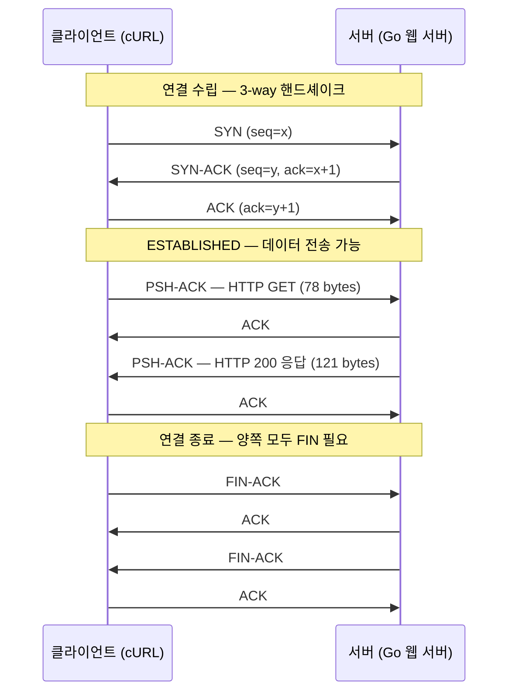
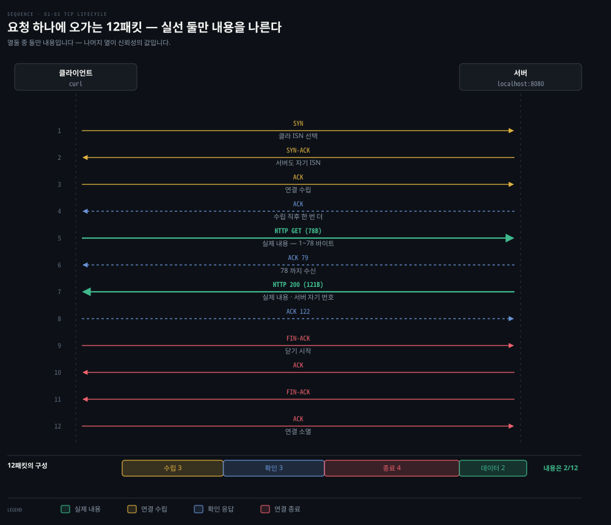
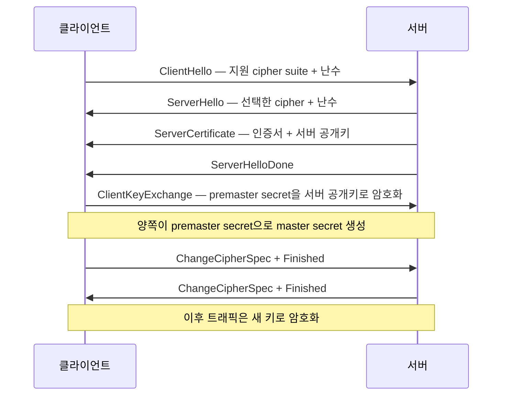

# HTTP에서 TCP·TLS·UDP까지 — Transport 계층 해부

## 핵심 요약
> 이 편 전체가 매달린 하나의 생각은 "TCP의 신뢰성은 공짜가 아니다"입니다.
> "Hello" 다섯 글자를 받는 HTTP 요청 하나에 12개 패킷이 오가지만 실제 데이터 전송은 2개뿐입니다. 나머지 10개가 연결 수립·확인 응답·종료라는 신뢰성의 비용입니다. 이 비용을 지불할 가치가 없는 애플리케이션(음성·DNS)을 위해 UDP가 있고, 보안이 필요한 트래픽을 위해 TCP 위에 TLS가 얹힙니다.

## 학습 목표

이 내용을 읽고 나면:

1. `curl -vvv` 출력에서 HTTP 요청·응답 헤더 각각의 의미를 설명할 수 있습니다.
2. TCP 세그먼트 헤더의 시퀀스·ACK 번호와 9개 플래그의 역할을 구분할 수 있습니다.
3. 3-way 핸드셰이크와 TCP 11개 연결 상태의 전이를 추적할 수 있습니다.
4. tcpdump 캡처에서 핸드셰이크·데이터 전송·연결 종료 구간을 찾아낼 수 있습니다.
5. TCP와 UDP 중 무엇을 쓸지 애플리케이션 특성으로 판단할 수 있습니다.

## 1. HTTP 요청 해부 — cURL로 보는 Application 계층

전편의 Go 웹 서버(`0.0.0.0:8080`)에 cURL로 요청을 보내면 Application 계층에서 오가는 내용이 전부 드러납니다.

```console
○ → curl localhost:8080 -vvv
* Connected to localhost (::1) port 8080
> GET / HTTP/1.1
> Host: localhost:8080
> User-Agent: curl/7.64.1
> Accept: */*
>
< HTTP/1.1 200 OK
< Date: Sat, 25 Jul 2020 14:57:46 GMT
< Content-Length: 5
< Content-Type: text/plain; charset=utf-8
<
Hello* Closing connection 0
```

`>` 줄이 클라이언트 요청, `<` 줄이 서버 응답입니다. 짚을 부분은 다섯 가지입니다.

- `GET / HTTP/1.1` — HTTP 메서드 + URL + 버전. GET은 정보를 가져오는 메서드입니다.
- `Host`·`User-Agent`·`Accept` — HTTP 헤더는 `이름: 값` 형식으로 요청·응답에 정보를 실어 나릅니다. `Accept: */*`는 클라이언트가 이해하는 콘텐츠 타입을 서버에 알립니다.
- `HTTP/1.1 200 OK` — 상태 코드. 1XX 정보, 2XX 성공, 3XX 리다이렉트, 4XX 요청 문제, 5XX 서버 문제입니다.
- `Content-Length: 5` — 응답 본문 크기(바이트). "Hello"가 정확히 5바이트입니다.
- `Content-Type: text/plain; charset=utf-8` — 응답 리소스의 미디어 타입. text 외에 application(json·pdf)·image·audio·video·font·model 타입군이 있습니다.

요청의 형식과 옵션은 전부 L7에서 정해지지만, 저자들 표현대로 실제 무거운 일은 그 아래 계층들이 합니다. 이제 한 층 내려갑니다.

## 2. TCP 세그먼트 헤더 — 신뢰성을 만드는 필드들

TCP는 연결 지향적이고 신뢰할 수 있는 프로토콜로, 흐름 제어와 다중화를 제공합니다. 연결의 생애주기 내내 상태를 관리하기 때문에 연결 지향적이라 부릅니다. 흐름 제어는 윈도우 크기가 담당하고, 프로세스 식별은 16비트 포트 번호가 맡습니다. 서버는 잘 알려진 포트(HTTP 80, TLS 443)에서 대기하고 클라이언트는 0~65534 범위의 임시 포트를 만들어 자신을 식별합니다.

브라우저가 웹 페이지 하나를 열 때 페이지 본문·이미지·CSS 연결을 각각 열고 서로 다른 가상 포트로 동시에 내려받는 동작이 TCP 다중화의 예입니다. 이를 가능하게 하는 세그먼트 헤더의 주요 필드는 다음과 같습니다.

| 필드 | 크기 | 역할 |
|------|------|------|
| Source·Destination port | 각 16비트 | 송신·수신 포트 식별 |
| Sequence number | 32비트 | SYN이면 초기 시퀀스 번호. 순서가 어긋난 데이터의 재조립에도 사용 |
| Acknowledgment number | 32비트 | ACK가 켜져 있으면 다음에 기대하는 시퀀스 번호. 이전 바이트 전부의 수신 확인 |
| Data offset | 4비트 | TCP 헤더 크기(32비트 워드 단위) |
| Flags | 9비트 | 아래 표 참조 |
| Window size | 16비트 | 수신 윈도우 크기 — 흐름 제어의 핵심 |
| Checksum | 16비트 | TCP 헤더 오류 검사 |
| Options·Padding·Data | 가변 | 옵션(0~320비트), 32비트 경계 정렬용 패딩, 애플리케이션 데이터 |

9개 플래그 중 실무에서 자주 만나는 것은 여섯입니다.

| 플래그 | 의미 |
|--------|------|
| SYN | 시퀀스 번호를 동기화해 연결을 시작 |
| ACK | Acknowledgment 필드가 유효함. 연결 수립 후에는 항상 켜짐 |
| PSH | 수신자가 데이터를 가능한 한 빨리 애플리케이션에 전달해야 함 |
| FIN | 송신자가 데이터 전송을 마쳤음 |
| RST | 연결 재설정 또는 중단(보통 오류) |
| URG | Urgent Pointer 필드가 유효함(드물게 사용) |

나머지 셋(NS·CWR·ECE)은 혼잡 알림(ECN) 관련입니다.

## 3. 3-way 핸드셰이크와 11개 연결 상태

TCP는 연결을 만들 때 3-way 핸드셰이크로 옵션과 플래그 정보를 교환합니다.



연결이 수립되면 양쪽 호스트에 이 연결을 추적하는 소켓이 만들어집니다. 소켓은 통신의 논리적 종단점일 뿐이며, Linux가 소켓을 다루는 방식은 2장에서 다룹니다.

TCP는 상태 기계(stateful)입니다. 송신자와 수신자가 연결 흐름의 어디에 있는지 합의해야 하고, 그 상태는 9비트 플래그로 표현됩니다. 11개 상태의 요지는 다음과 같습니다.

| 상태 | 누가 | 의미 |
|------|------|------|
| LISTEN | 서버 | 원격의 연결 요청을 대기 |
| SYN-SENT | 클라이언트 | 연결 요청을 보내고 응답 대기 |
| SYN-RECEIVED | 서버 | 연결 요청을 받고 보낸 뒤 확인 대기 |
| ESTABLISHED | 양쪽 | 열린 연결 — 데이터 전송 단계 |
| FIN-WAIT-1·2 | 양쪽 | 상대의 연결 종료 요청 대기 |
| CLOSE-WAIT | 양쪽 | 로컬 사용자의 종료 요청 대기 |
| CLOSING | 양쪽 | 상대의 종료 확인 대기 |
| LAST-ACK | 양쪽 | 먼저 보낸 종료 요청의 확인 대기 |
| TIME-WAIT | 어느 한쪽 | 상대가 종료 확인을 받았음을 보장할 시간 대기 |
| CLOSED | 양쪽 | 연결 없음 |

`netstat -ap TCP`를 실행하면 현재 호스트의 모든 TCP 연결과 상태(ESTABLISHED, LISTEN, CLOSE_WAIT 등), 양 끝 주소를 볼 수 있습니다. 대기 중인 서버 소켓은 `*.16587` 같은 LISTEN 행으로, 활성 연결은 로컬·원격 주소 쌍으로 나타납니다.

## 4. tcpdump로 본 12개 패킷 — 신뢰성의 실제 비용

tcpdump는 네트워크 인터페이스에서 처리되는 패킷을 잡아 보여 주는 도구입니다. NIC 드라이버와 L2 사이에서 수집하기 때문에, 체크섬을 NIC가 계산하는(checksum offloading) 시스템에서는 `cksum 0xfe34 (incorrect)` 같은 표시가 정상적으로 나타납니다.

```console
○ → sudo tcpdump -i lo0 tcp port 8080 -vvv
08:13:55.009899 localhost.50399 > localhost.http-alt: Flags [S],  seq 2784345138, ...
08:13:55.009997 localhost.http-alt > localhost.50399: Flags [S.], seq 195606347, ack 2784345139, ...
08:13:55.010012 localhost.50399 > localhost.http-alt: Flags [.],  seq 1, ack 1, ...
08:13:55.010079 localhost.50399 > localhost.http-alt: Flags [P.], seq 1:79,  length 78: HTTP GET
08:13:55.010102 localhost.http-alt > localhost.50399: Flags [.],  ack 79, ...
08:13:55.010198 localhost.http-alt > localhost.50399: Flags [P.], seq 1:122, length 121: HTTP 200
08:13:55.010219 localhost.50399 > localhost.http-alt: Flags [.],  ack 122, ...
08:13:55.010324 localhost.50399 > localhost.http-alt: Flags [F.], seq 79, ...
（이하 종료 시퀀스 — 총 12 packets captured）
```

읽는 법은 플래그입니다. `[S]`가 SYN, `[S.]`가 SYN-ACK, `[.]`가 ACK, `[P.]`가 데이터 푸시, `[F.]`가 FIN-ACK입니다. 12개 패킷의 구성을 세어 보면 핸드셰이크 3개, 수립 직후 서버의 ACK 1개, HTTP 요청·응답 데이터 2개, 데이터 수신 확인 2개, 종료 시퀀스 4개(최종 ACK 포함)입니다. 저자들이 강조하는 관찰이 여기서 나옵니다 — 12개 중 실제 데이터 전송은 2개뿐이고 나머지는 전부 신뢰성 유지 비용입니다.



> 💬 **비유**: TCP는 등기 우편입니다. 보내기 전에 상대가 받을 준비가 됐는지 확인하고(핸드셰이크), 편지마다 수령 확인 서명을 받으며(ACK), 다 보냈다는 통지도 양쪽이 주고받습니다(FIN). 확실하지만 절차가 많습니다. UDP는 전단지 배포입니다 — 우체통에 넣고 끝이며, 받았는지는 확인하지 않습니다. 전단지 몇 장쯤 유실돼도 사업에 지장이 없듯, 음성 통화의 패킷 몇 개 유실은 품질 저하일 뿐 통화 자체를 막지 않습니다.

## 5. TLS — TCP 위에 얹는 암호화

지금까지의 예제는 전부 평문이었습니다. Transport 계층 자체는 보안을 제공하지 않으므로, 은행 로그인 같은 트래픽은 TCP 위에 TLS를 얹습니다. TLS도 TCP처럼 핸드셰이크로 암호화 능력을 확인하고 키를 교환합니다.



Kubernetes에서는 애플리케이션과 컴포넌트가 TLS를 개발자 대신 관리해 주는 경우가 많아, 이 수준의 기본 이해면 출발점으로 충분합니다. TLS와 Kubernetes의 결합은 5장에서 다시 다룹니다.

## 6. UDP — 신뢰성 비용을 낼 필요가 없다면

UDP는 TCP의 신뢰성이 필요 없는 애플리케이션의 대안입니다. 헤더 필드가 4개뿐이고 수신 확인이 없습니다.

| 필드 | 크기 | 비고 |
|------|------|------|
| Source port | 2바이트 | 클라이언트 쪽은 임시 포트. DNS 53, DHCP 67/68처럼 잘 알려진 포트 존재 |
| Destination port | 2바이트 | 필수 |
| Length | 2바이트 | 헤더+데이터 길이. 최소 8바이트(헤더만) |
| Checksum | 2바이트 | IPv4에서 선택, IPv6에서 필수 |

UDP가 맞는 자리는 성격이 뚜렷합니다. 패킷 유실을 견디는 음성·영상 스트리밍, 단순 질의-응답인 DNS·SNMP, 부트스트랩용 DHCP, 터널링(VPN)이 대표적입니다. 재전송이 없다는 약점이 이런 용도에서는 오히려 지연 없는 전달이라는 강점이 됩니다.

Kubernetes는 두 프로토콜을 모두 지원하며 Service에서 개발자가 전송 프로토콜을 지정합니다. 지정하지 않으면 TCP가 기본값입니다.

## 심화 학습
> 책 밖에서 보강한 내용입니다. 출처를 함께 남깁니다.

- TIME-WAIT 상태가 존재하는 이유는 마지막 ACK 유실 시 상대의 FIN 재전송을 받아 주고, 같은 포트 쌍의 새 연결이 이전 연결의 지연 패킷과 섞이지 않게 하기 위해서입니다. 정의는 [RFC 9293 — TCP](https://datatracker.ietf.org/doc/html/rfc9293)(2022년 TCP 명세 통합본)가 원전입니다. 책이 참조하는 원래 명세 RFC 793을 대체한 문서라는 점도 함께 알아 둘 만합니다.
- 책의 TLS 핸드셰이크 9단계는 TLS 1.2 기준입니다. [RFC 8446 — TLS 1.3](https://datatracker.ietf.org/doc/html/rfc8446)은 핸드셰이크 왕복을 2-RTT에서 1-RTT로 줄였고 재연결 시 0-RTT도 지원합니다. 요즘 브라우저·서버 기본값은 1.3이므로 면접에서 단계를 말할 때는 버전을 밝히는 편이 안전합니다.

## 결정 치트시트
> 전송 프로토콜 선택은 "유실을 견딜 수 있는가"로 가릅니다.

| 질문 | Yes | No |
|------|-----|-----|
| 패킷 유실이 곧 장애인가? | TCP | UDP 후보 |
| 순서 보장이 필요한가? | TCP | UDP 후보 |
| 지연이 유실보다 아픈가? (음성·게임·스트리밍) | UDP | TCP |
| 단발 질의-응답인가? (DNS·SNMP) | UDP | TCP |
| K8s Service에 프로토콜을 명시하지 않았다 | 기본값 TCP 적용 | - |

## Spring 앱 개발 관점
> 책에는 Spring 예제가 없어 공식 문서로 보강한 절입니다. 이 편의 TCP 개념이 Spring Boot 설정 어디에서 다시 나타나는지만 짚습니다.

이 편에서 본 TCP 동작은 Spring Boot 애플리케이션에서 타임아웃·keep-alive 설정으로 재등장합니다.

- 연결 타임아웃 = 핸드셰이크의 시간 제한입니다. RestTemplate·WebClient의 connect timeout은 SYN을 보내고 SYN-ACK가 돌아올 때까지 기다리는 시간이고, read timeout은 ESTABLISHED 이후 응답 데이터를 기다리는 시간입니다. 두 값이 다른 단계를 재는 만큼 따로 설정해야 합니다.
- 서버 쪽 keep-alive = 연결 종료 시퀀스를 미루는 장치입니다. HTTP keep-alive는 요청마다 12패킷 중 7개(수립 3+종료 4)를 다시 지불하지 않으려고 연결을 재사용합니다. 내장 Tomcat은 `server.tomcat.keep-alive-timeout`(다음 요청을 기다리는 시간)과 `server.tomcat.max-keep-alive-requests`(연결당 최대 요청 수)로 제어합니다 — [Spring Boot 공통 설정 속성](https://docs.spring.io/spring-boot/appendix/application-properties/index.html) 참조.
- 커넥션 풀 = TIME-WAIT 회피 전략입니다. 요청마다 새 연결을 만들면 닫은 쪽에 TIME-WAIT 소켓이 쌓여 임시 포트가 고갈될 수 있습니다. HTTP 클라이언트 풀(WebClient의 Reactor Netty [ConnectionProvider](https://projectreactor.io/docs/netty/release/reference/index.html))이 연결을 재사용해 이 문제를 구조적으로 없앱니다.

## 면접에서 받을 만한 질문

> 먼저 스스로 답을 소리 내어 말해 본 뒤, 아래 §정답 섹션을 펼쳐 맞춰 봅니다.

1. TCP를 한 문장으로 정의하면? 핸드셰이크가 왜 3-way입니까(2번이면 왜 부족한가)?
2. 연결 종료에 FIN이 양쪽에서 필요한 이유와, TIME-WAIT가 남는 이유는?
3. "Hello" 응답 하나에 12패킷이 오가는데 데이터는 왜 2개뿐입니까? 이 비용이 아까운 워크로드는?
4. 서버에 CLOSE_WAIT가 쌓이면 무엇을 의심합니까?
5. TCP 흐름 제어와 혼잡 제어는 어떻게 다릅니까?

### 빈칸 채우기 — 핸드셰이크와 종료

연결 수립은 `①____` → `②____` → `③____`의 3-way 핸드셰이크입니다. 연결 종료는 양쪽이 각각 `④____`를 보내고, 먼저 닫은 쪽은 `⑤____` 상태로 남아 마지막 ACK 유실에 대비합니다.

## 정답 (자답 후 펼치기)

> 위 §면접에서 받을 만한 질문의 5개에 *먼저 자답한 뒤* 아래를 읽으세요. 자답 없이 먼저 읽으면 학습 효과가 0입니다.

### 정답 1 — TCP 정의와 3-way

TCP는 시퀀스 번호와 확인 응답, 9개 플래그로 연결 상태를 관리해 신뢰성·순서·흐름 제어를 제공하는 연결 지향 전송 프로토콜입니다. 핸드셰이크가 3-way인 이유는 양쪽 모두 자기 초기 시퀀스 번호를 보내고(SYN) 상대의 것을 확인(ACK)해야 하기 때문입니다. 2번으로는 클라이언트 시퀀스만 확인되고 서버 시퀀스는 확인되지 않습니다.

### 정답 2 — FIN과 TIME-WAIT

TCP는 양방향 연결이라 각 방향을 따로 닫아야 하므로 FIN이 양쪽에서 한 번씩 필요합니다. 먼저 닫은 쪽은 TIME-WAIT로 남아, 자신이 보낸 마지막 ACK이 유실돼 상대가 FIN을 재전송할 경우에 대비합니다.

### 정답 3 — 12패킷 중 데이터 2개

핸드셰이크와 확인 응답, 연결 종료가 모두 신뢰성의 비용입니다. 그래서 12패킷 중 실제 데이터 전송은 2패킷뿐이고, 나머지 10개가 연결 수립·확인·종료에 쓰입니다. 이 비용이 아까운 워크로드, 즉 음성·DNS처럼 지연이 유실보다 중요한 경우가 UDP의 자리입니다.

### 정답 4 — CLOSE_WAIT 누적

상대가 FIN을 보냈는데 우리 애플리케이션이 소켓을 close하지 않고 있다는 신호입니다. CLOSE-WAIT는 "로컬 사용자의 종료 요청을 대기"하는 상태이므로, 커넥션 누수(close 누락) 버그를 먼저 찾습니다.

### 정답 5 — 흐름 제어 vs 혼잡 제어

흐름 제어는 수신자의 처리 능력을 넘지 않도록 윈도우 크기로 조절하는 것이고, 혼잡 제어는 네트워크 경로의 혼잡에 반응하는 것입니다. 헤더의 CWR·ECE 플래그가 혼잡 알림(ECN)에 쓰입니다.

### 정답 빈칸 — ①`SYN` ②`SYN-ACK` ③`ACK` ④`FIN` ⑤`TIME-WAIT`

연결 수립은 `SYN` → `SYN-ACK` → `ACK`, 종료는 양쪽의 `FIN` 교환이며 먼저 닫은 쪽이 `TIME-WAIT`로 남습니다.

## 핵심 개념 체크리스트
- [ ] `curl -vvv` 출력에서 요청 헤더와 응답 상태 코드를 해석할 수 있는가?
- [ ] SYN·ACK·PSH·FIN·RST 플래그의 역할을 구분할 수 있는가?
- [ ] 3-way 핸드셰이크에서 시퀀스·ACK 번호가 어떻게 교환되는지 말할 수 있는가?
- [ ] TIME-WAIT와 CLOSE-WAIT의 차이를 설명할 수 있는가?
- [ ] TCP 대신 UDP를 고를 판단 기준을 갖고 있는가?

## 참고 자료
- 《Networking and Kubernetes: A Layered Approach》(James Strong·Vallery Lancey, O'Reilly, 2021, ISBN 978-1492081654) Ch1
- [RFC 9293 — Transmission Control Protocol](https://datatracker.ietf.org/doc/html/rfc9293)
- [RFC 8446 — TLS 1.3](https://datatracker.ietf.org/doc/html/rfc8446)
- 이전 편: [01-01. 네트워킹 역사와 OSI 모델](./01-01.%EB%84%A4%ED%8A%B8%EC%9B%8C%ED%82%B9%20%EC%97%AD%EC%82%AC%EC%99%80%20OSI%20%EB%AA%A8%EB%8D%B8%20%E2%80%94%20%EA%B3%84%EC%B8%B5%EC%9C%BC%EB%A1%9C%20%EB%82%98%EB%88%88%20%EC%9D%B4%EC%9C%A0.md)
- 다음 편: [01-03. IP·라우팅·Ethernet](./01-03.IP%C2%B7%EB%9D%BC%EC%9A%B0%ED%8C%85%C2%B7Ethernet%20%E2%80%94%20%ED%8C%A8%ED%82%B7%EC%9D%B4%20%EA%B8%B8%EC%9D%84%20%EC%B0%BE%EB%8A%94%20%EB%B2%95.md)
