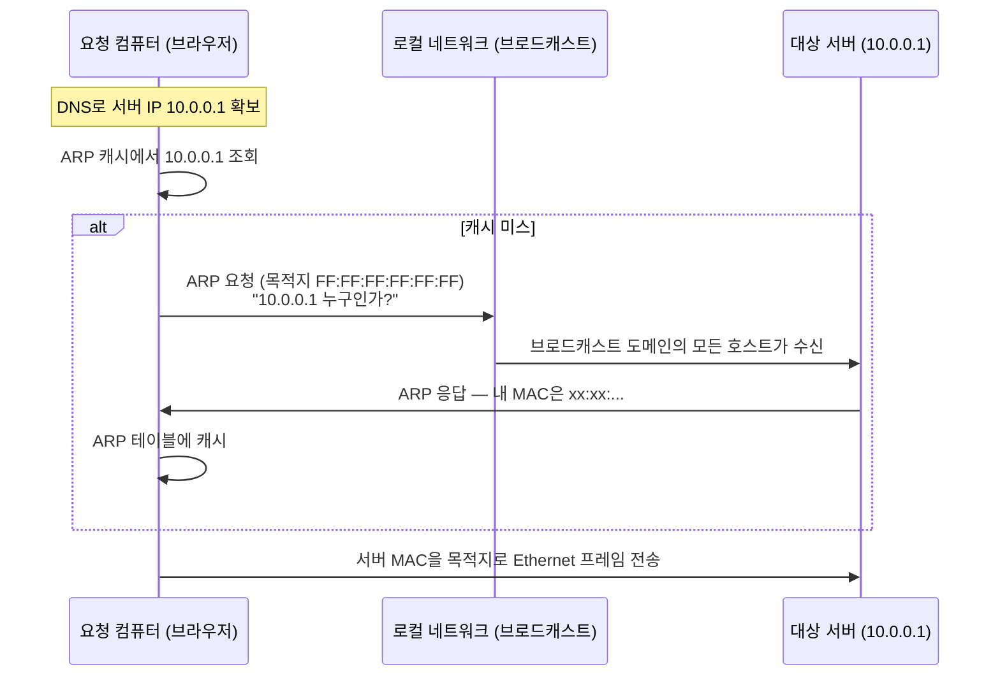

# IP·라우팅·Ethernet — 패킷이 길을 찾는 법

## 핵심 요약
> 이 편 전체가 매달린 하나의 생각은 "패킷은 IP 주소로 목적지 네트워크를 찾고, MAC 주소로 바로 옆 이웃을 찾는다"입니다.
> IP는 배달을 보장하지 않는 최선 노력(best-effort) 프로토콜이고, 네트워크 사이의 길 찾기는 BGP가, 같은 네트워크 안의 마지막 한 걸음은 ARP와 Ethernet이 맡습니다. Kubernetes가 노드 간 라우팅에 BGP(Calico)를 쓰고 오버레이 네트워크에 VXLAN을 쓰는 이유가 이 층에 있습니다.

## 학습 목표

이 내용을 읽고 나면:

1. IP가 신뢰성을 제공하지 않는 이유와 그 책임이 어디로 갔는지 설명할 수 있습니다.
2. 클래스풀 주소 체계가 CIDR로, 다시 IPv6로 진화한 원인을 주소 고갈 관점에서 설명할 수 있습니다.
3. BGP와 ASN이 인터넷 라우팅에서 하는 역할을 Kubernetes CNI와 연결할 수 있습니다.
4. ARP가 IP 주소를 MAC 주소로 해석하는 과정을 단계별로 추적할 수 있습니다.
5. HTTP 요청 하나가 TCP/IP 전 계층을 오르내리는 여정을 처음부터 끝까지 재구성할 수 있습니다.

## 1. IP — 배달을 보장하지 않는 우편 시스템

모든 TCP·UDP 데이터는 Network 계층에서 IP 패킷으로 전송됩니다. 나가는 패킷은 다음 홉(next-hop) 호스트를 골라 Link 계층으로 넘기고, 들어온 패킷은 캡슐화를 벗겨 알맞은 Transport 프로토콜로 올립니다. IP는 MTU(최대 IP 패킷 크기)에 따라 패킷을 단편화·재조립합니다.

IP의 성격을 규정하는 문장은 이것입니다 — IP는 패킷의 정상 도착을 보장하지 않습니다. 다양한 네트워크를 가로지르는 전달은 그 자체로 실패하기 쉬우므로, 그 부담을 네트워크가 아니라 통신 경로의 양 끝(Transport 계층)에 지웠습니다. 헤더 체크섬도 헤더의 정확성만 확인할 뿐 데이터 무결성은 검증하지 않습니다. 캡슐화된 프로토콜(TCP·UDP)이 자기 체크섬으로 데이터 오류를 처리합니다.

RFC 791이 정의한 IPv4 헤더에서 기억할 필드는 다섯입니다.

- Version — IPv4는 항상 4
- TTL — 8비트 수명. 라우터를 지날 때마다 1씩 줄어 패킷이 네트워크를 무한히 돌지 못하게 막습니다. TTL을 낮추면 체크섬도 다시 계산해야 합니다
- Protocol — 데이터부에 실린 프로토콜 번호. ICMP 1, TCP 6, UDP 17, OSPF 89
- Source·Destination address — 송신·수신 IPv4 주소. NAT 장비가 전송 중에 바꿀 수 있습니다
- Flags·Fragment Offset — 단편화 제어(Do not Fragment, More Fragments)와 조각 위치

## 2. 주소의 진화 — 클래스에서 CIDR로, 다시 IPv6로

IPv4 주소는 사람에게는 점 찍은 십진수(192.168.1.2), 컴퓨터에게는 32비트 이진 문자열입니다. 앞부분이 네트워크, 뒷부분이 그 네트워크 안 호스트의 고유 식별자이고, 어디까지가 네트워크인지는 서브넷 마스크(255.255.255.0 = `0xffffff00`)가 정합니다.

초기에는 네트워크와 호스트의 경계를 클래스로 고정했습니다.

| 클래스 | 호스트부 비트 | 호스트 수 | 용도 |
|--------|--------------|-----------|------|
| A | 24비트 | 약 1,678만[^classa] | 대형 네트워크 |
| B | 16비트 | 65,536 | 중형 네트워크 |
| C | 8비트 | 256 | 소형 네트워크 |
| D | — | — | 멀티캐스트(예약) |
| E | — | — | 실험용(예약) |

이 고정 경계는 인터넷 규모에서 확장되지 않았습니다. 300개 호스트가 필요한 조직에 C(256)는 모자라고 B(65,536)는 낭비입니다.

CIDR(Classless Inter-Domain Routing)는 서브넷 경계를 클래스 범위 안 어디로든 옮길 수 있게 해 이 낭비를 줄였습니다. 책의 예시는 `208.130.29.33`의 위임 계보입니다. IANA가 `208.128.0.0/11`을 ARIN(북미 인터넷 레지스트리)에 주고, ARIN이 점점 작은 서브넷으로 쪼개 내려가 최종적으로 단일 호스트 `208.130.29.33/32`에 닿습니다. `/N`은 네트워크부 비트 수이므로 N이 클수록 좁은 범위입니다.

CIDR로도 고갈을 막지 못해 IPv6가 나왔습니다. 차이의 본체는 주소 공간 크기입니다.

| 구분 | 주소 길이 | 주소 개수 |
|------|----------|----------|
| IPv4 | 32비트 | 4,294,967,296 |
| IPv6 | 128비트 | 340,282,366,920,938,463,463,374,607,431,768,211,456 |

IPv6는 표기도 16진수로 줄여 쓰며, 네트워크 접두부와 호스트라는 구조 자체는 IPv4와 비슷합니다.

## 3. BGP — 네트워크 사이의 길 찾기

주소가 정해진 패킷이 지구 반대편 호스트까지 가는 일은 라우팅의 몫입니다. 인터넷은 BGP(Border Gateway Protocol)라는 동적 라우팅 프로토콜에 의존합니다. 인터넷의 각 네트워크는 ASN(autonomous system number)을 할당받는데, 하나의 ASN은 명확한 라우팅 정책을 가진 단일 관리 주체를 대표합니다. BGP와 ASN 덕분에 관리자는 내부 라우팅 통제권을 유지하면서 자기 경로를 요약해 인터넷에 광고할 수 있습니다.

책의 예시로 AS 100의 호스트 `130.10.1.200`이 AS 300의 `150.10.2.300`에 패킷을 보내면, 기본 게이트웨이가 BGP가 계산해 둔 경로표에서 목적지 AS로 가는 선호 인터페이스를 찾아 다음 AS로 넘기고, 이를 반복해 목적지 라우터까지 닿습니다. 로컬 라우팅 테이블에서는 목적지가 같은 네트워크면 라우팅 없이 로컬 링크로, 모르는 네트워크면 기본 경로(default route)로 내보냅니다.

이 내용이 책에 있는 이유는 Kubernetes 때문입니다. Calico 같은 일부 컨테이너 네트워킹 프로젝트가 노드 간 클러스터 트래픽 라우팅에 BGP를 그대로 씁니다. 데이터센터 안에서 각 노드가 작은 라우터처럼 자기 Pod 대역을 광고하는 구조로, 3장에서 다시 다룹니다.

라우터끼리는 BGP로 경로 정보를 계속 교환합니다. 사람이 연결성을 확인할 때는 ICMP를 씁니다. `ping`은 ICMP echo(타입 8)를 보내 echo reply(타입 0)가 돌아오는지, 왕복 시간이 얼마인지 확인하는 도구입니다. 응답이 없으면 타임아웃으로 실패가 드러납니다.

ICMP는 TCP도 UDP도 쓰지 않는 IP 프로토콜 1번이며, 라우팅·진단·오류 통지 기능을 IP에 제공합니다. `ping`의 echo·reply 외에 자주 만나는 메시지는 다음과 같습니다.

| 메시지 | 타입 |
|--------|------|
| Echo request | 8 |
| Echo reply | 0 |
| Destination unreachable | 3 |
| Redirect | 5 |

## 4. Link 계층 — 마지막 한 걸음은 MAC 주소로

라우팅으로 목적지 네트워크까지 왔으면, 이제 같은 네트워크 안에서 정확한 장비에 프레임을 건네야 합니다. TCP/IP의 Link 계층은 MAC과 LLC 두 서브계층으로 이루어져 OSI의 L1·L2를 함께 수행합니다. IEEE 802.3(Ethernet)이 IP 패킷을 캡슐화하는 프레임의 송수신 규약을 정의합니다.

Ethernet 프레임에서 기억할 필드는 다음과 같습니다.

| 필드 | 크기 | 역할 |
|------|------|------|
| 목적지·출발지 MAC | 각 6바이트 | 프레임을 받을·보낼 NIC 식별 |
| VLAN 태그 | 4바이트(선택) | 논리적 네트워크 분리 |
| EtherType | 2바이트 | 페이로드에 실린 프로토콜 표시 |
| CRC (푸터) | 4바이트 | 수신 측에서 프레임 손상 탐지 |

MAC 주소는 제조 시점에 NIC에 부여되며 조직 식별자(OUI)와 NIC 고유부로 나뉩니다. EtherType 값 중 Kubernetes에서 주로 만나는 것은 IPv4용 `0x0800`과 ARP용 `0x0806`입니다.

IP 주소에서 MAC 주소로의 해석은 ARP(Address Resolution Protocol)가 맡습니다.

ARP 요청은 `FF:FF:FF:FF:FF:FF`로 브로드캐스트되므로 같은 브로드캐스트 도메인의 모든 호스트가 받습니다. 호스트가 늘수록 브로드캐스트 트래픽도 함께 늘어나는 구조라, 네트워크 엔지니어는 VLAN 태그로 L2 네트워크를 분할해 브로드캐스트를 가두고 보안·혼잡을 관리합니다.

VLAN을 확장한 것이 VXLAN입니다. L2 프레임을 L4 UDP 패킷에 캡슐화해, IP 네트워크를 가로질러 L2 인접성을 만들고 논리 네트워크를 1,600만 개까지 확장합니다. Kubernetes 오버레이 네트워크가 바로 이 기술 위에 서 있습니다 — 서로 다른 노드의 Pod들이 같은 L2에 있는 것처럼 통신하는 마법의 정체가 VXLAN 캡슐화입니다.

## 5. 웹 서버 재방문 — 요청 하나의 전 계층 여정

이제 1장의 처음으로 돌아가 cURL 요청 하나를 전 계층으로 설명할 수 있습니다.

1. cURL이 URL에서 IP와 포트를 알아내고 TCP 핸드셰이크로 연결을 수립합니다. 서버에는 8080 소켓, 클라이언트에는 임시 포트 소켓이 만들어집니다.
2. HTTP 요청이 Network 계층으로 내려가 출발지·목적지 IP가 패킷 헤더에 붙습니다.
3. Data Link 계층에서 NIC의 출발지 MAC이 프레임에 붙고, 목적지 MAC을 모르면 ARP로 알아낸 뒤 NIC가 프레임을 전송합니다.
4. 서버는 응답 패킷을 만들어 요청 패킷의 출발지 IP로 되돌려 보냅니다.
5. 클라이언트 쪽에서 역순으로 벗겨집니다 — L2에서 MAC 제거, L3에서 IP 확인 후 제거, L4에서 TCP 데이터로 소켓을 판별해 cURL 프로세스에 전달합니다.

여기서 실무 포인트 하나가 나옵니다. IP 주소는 L3에서 제거되므로 애플리케이션이 클라이언트 IP를 알아야 한다면 Application 계층에 저장해야 합니다. HTTP의 `X-Forwarded-For` 헤더가 그 대표 사례입니다 — 프록시·로드밸런서 뒤에서 원 클라이언트 IP를 보존하는 표준적인 방법입니다. Kubernetes의 Ingress 뒤에 선 앱이 클라이언트 IP를 찾을 때 다시 만나게 됩니다.

## 심화 학습
> 책 밖에서 보강한 내용입니다. 출처를 함께 남깁니다.

- VXLAN의 정식 명세는 [RFC 7348](https://datatracker.ietf.org/doc/html/rfc7348)입니다. 24비트 VNI(VXLAN Network Identifier)가 논리 네트워크 1,600만 개(2^24)의 근거입니다. VLAN ID는 12비트라 4,096개가 한계인 점과 대비해 두면 기억하기 쉽습니다.
- Calico가 BGP를 쓰는 방식은 [Calico 공식 문서 — BGP 개요](https://docs.tigera.io/calico/latest/networking/configuring/bgp)에 정리돼 있습니다. 각 노드가 자기 Pod CIDR을 BGP로 광고해 캡슐화 없는(non-overlay) 라우팅을 만들 수 있다는 점이 VXLAN 오버레이와의 근본 차이입니다.
- 클라이언트 IP 보존 문제는 K8s에서 `externalTrafficPolicy`·프록시 프로토콜과 얽혀 더 복잡해집니다. 형제 정독본의 [11-02 외부 노출 — 트래픽 정책](../kubernetes-in-action/11-02.%EC%99%B8%EB%B6%80%20%EB%85%B8%EC%B6%9C%20%E2%80%94%20NodePort%C2%B7LoadBalancer%C2%B7%ED%8A%B8%EB%9E%98%ED%94%BD%20%EC%A0%95%EC%B1%85.md)이 그 이야기를 다룹니다.

## 결정 치트시트
> 이 편의 도구를 "무엇이 안 될 때 무엇을 치는가"로 압축했습니다.

| 확인하고 싶은 것 | 도구 | 보는 것 |
|-----------------|------|--------|
| 상대 호스트까지 도달하는가 | `ping <ip>` | ICMP echo reply 여부·손실률·왕복 시간 |
| 어느 경로로 나가는가 | `netstat -r` (라우팅 테이블) | 목적지별 게이트웨이·인터페이스, 기본 경로 |
| 같은 네트워크 이웃을 아는가 | `arp -a` | IP↔MAC 매핑 캐시 |
| L2에서 무슨 일이 벌어지나 | `sudo tcpdump -i <if> arp` | ARP 요청·응답 흐름 |
| 내 주소·마스크가 무엇인가 | `ifconfig` / `ip addr` | inet 주소, netmask, MAC(ether) |

## 면접에서 받을 만한 질문

> 먼저 스스로 답을 소리 내어 말해 본 뒤, 아래 §정답 섹션을 펼쳐 맞춰 봅니다.

1. CIDR을 한 문장으로 정의하면? 클래스풀 주소 체계의 무엇을 해결했습니까?
2. IP가 best-effort라는 말의 뜻과, 신뢰성 책임이 어디로 갔는지 설명해 보세요.
3. TTL은 왜 필요하고, traceroute는 그것을 어떻게 역이용합니까?
4. 애플리케이션에서 클라이언트 IP가 프록시 IP로 보이는 이유는? 어떻게 원 IP를 보존합니까?
5. Kubernetes에서 BGP는 어디에 쓰이며, VXLAN 오버레이와 무엇이 다릅니까?

### 빈칸 채우기 — L2/L3 주소 역할

패킷은 목적지 *네트워크*를 `①____` 주소로 찾고, 같은 네트워크 안 바로 옆 이웃은 `②____` 주소로 찾습니다. IP를 MAC으로 해석하는 프로토콜은 `③____`입니다. VLAN의 12비트(4,096개)를 24비트(1,600만 개)로 확장한 것이 `④____`입니다.

## 정답 (자답 후 펼치기)

> 위 §면접에서 받을 만한 질문의 5개에 *먼저 자답한 뒤* 아래를 읽으세요. 자답 없이 먼저 읽으면 학습 효과가 0입니다.

### 정답 1 — CIDR 정의

CIDR은 클래스로 고정돼 있던 네트워크-호스트 경계를 임의 비트 위치로 옮겨, 필요한 만큼만 주소 블록을 위임할 수 있게 한 주소 체계입니다. 클래스풀은 300개 호스트에 C(256)는 모자라고 B(65,536)는 낭비하는 식으로 주소를 낭비했는데, CIDR은 `/N` 프리픽스로 경계를 자유롭게 잡아 이 낭비를 줄였습니다.

### 정답 2 — IP best-effort

IP는 패킷의 도착을 보장하지 않고 데이터 무결성도 검증하지 않습니다(헤더 체크섬은 헤더만 확인). 다양한 네트워크를 가로지르는 전달은 그 자체로 실패하기 쉬우므로, 신뢰성 책임을 네트워크가 아니라 통신 경로의 양 끝단(Transport 계층의 TCP)에 지웠습니다.

### 정답 3 — TTL과 traceroute

TTL은 라우팅 루프에 빠진 패킷이 네트워크를 무한히 돌지 못하게 합니다. 라우터를 지날 때마다 1씩 줄고 0이 되면 폐기되며, 그때 발신자에게 ICMP time exceeded가 돌아갑니다. traceroute는 TTL을 1부터 하나씩 올려 보내, 각 홉이 되돌려 주는 ICMP로 경로를 한 홉씩 그려 냅니다.

### 정답 4 — 클라이언트 IP 보존

패킷의 출발지 IP는 홉을 대신 맺는 프록시·로드밸런서의 것으로 바뀌고, 원래 IP는 L3를 벗어나며 사라집니다. 그래서 원 클라이언트 IP는 `X-Forwarded-For`처럼 Application 계층 헤더에 실어 보존합니다. Kubernetes에서는 Ingress 뒤 앱이 클라이언트 IP를 찾을 때 이 문제를 만납니다.

### 정답 5 — K8s에서 BGP vs VXLAN

Calico 같은 CNI가 노드 간 Pod 트래픽 라우팅에 BGP를 씁니다. 각 노드가 자기 Pod 대역을 BGP로 광고하면 캡슐화 오버헤드 없이 순수 라우팅으로 Pod 간 통신이 됩니다. VXLAN 오버레이는 반대로 L2 프레임을 UDP에 캡슐화해 IP 네트워크 위에 L2 인접성을 만드는 방식이라, 캡슐화 오버헤드가 있는 대신 하부 네트워크 제약에서 자유롭습니다.

### 정답 빈칸 — ①`IP` ②`MAC` ③`ARP` ④`VXLAN`

목적지 네트워크는 `IP`(L3), 바로 옆 이웃은 `MAC`(L2)으로 찾고, IP를 MAC으로 해석하는 것이 `ARP`, VLAN을 24비트로 확장한 것이 `VXLAN`입니다.

## 핵심 개념 체크리스트
- [ ] IP가 신뢰성을 제공하지 않는 이유와 책임 소재를 말할 수 있는가?
- [ ] `/24` 같은 CIDR 표기에서 네트워크·호스트 범위를 계산할 수 있는가?
- [ ] ASN과 BGP의 관계를 한 문장으로 설명할 수 있는가?
- [ ] ARP 캐시 미스 시 브로드캐스트 요청 흐름을 그릴 수 있는가?
- [ ] VLAN과 VXLAN의 차이(태그 vs UDP 캡슐화, 4천 vs 1,600만)를 아는가?
- [ ] HTTP 요청 하나의 전 계층 여정을 송신·수신 양방향으로 재구성할 수 있는가?

## 참고 자료
- 《Networking and Kubernetes: A Layered Approach》(James Strong·Vallery Lancey, O'Reilly, 2021, ISBN 978-1492081654) Ch1
- [RFC 791 — Internet Protocol](https://datatracker.ietf.org/doc/html/rfc791)
- [RFC 7348 — VXLAN](https://datatracker.ietf.org/doc/html/rfc7348)
- 이전 편: [01-02. HTTP에서 TCP·TLS·UDP까지](./01-02.HTTP%EC%97%90%EC%84%9C%20TCP%C2%B7TLS%C2%B7UDP%EA%B9%8C%EC%A7%80%20%E2%80%94%20Transport%20%EA%B3%84%EC%B8%B5%20%ED%95%B4%EB%B6%80.md)

[^classa]: Class A 호스트부는 24비트이므로 실제 호스트 수는 2^24 = 16,777,216(약 1,678만)입니다. 책 본문은 이 대목을 "2 to the power of 16"으로 오기했으나(같은 문장에서 결과값은 16,777,216으로 맞게 적음), 정확한 값은 2^24입니다. 노트는 정확한 2^24를 따릅니다.
