# IP·라우팅·Ethernet — 패킷이 길을 찾는 법

----

## 핵심 요약
> 이 편 전체가 매달린 하나의 생각은 **"패킷은 IP 주소로 목적지 네트워크를 찾고, MAC 주소로 바로 옆 이웃을 찾는다"**입니다.
>
> IP는 배달을 보장하지 않는 최선 노력(best-effort) 프로토콜이고, 네트워크 사이의 길 찾기는 BGP가, 같은 네트워크 안의 마지막 한 걸음은 ARP와 Ethernet이 맡습니다. Kubernetes가 노드 간 라우팅에 BGP(Calico)를 쓰고 오버레이 네트워크에 VXLAN을 쓰는 이유가 이 층에 있습니다.


## 학습 목표
> 주소와 라우팅을 따로 외우는 대신, 패킷 하나가 목적지까지 가는 길을 범위별로 이어서 설명할 수 있는 상태를 목표로 합니다.

이 내용을 읽고 나면:

1. IP가 신뢰성을 제공하지 않는 이유와 그 책임이 어디로 갔는지 설명할 수 있습니다.
2. 클래스풀 주소 체계가 CIDR로, 다시 IPv6로 진화한 원인을 주소 고갈 관점에서 설명할 수 있습니다.
3. BGP와 ASN이 인터넷 라우팅에서 하는 역할을 Kubernetes CNI와 연결할 수 있습니다.
4. ARP가 IP 주소를 MAC 주소로 해석하는 과정을 단계별로 추적할 수 있습니다.
5. HTTP 요청 하나가 TCP/IP 전 계층을 오르내리는 여정을 처음부터 끝까지 재구성할 수 있습니다.

아래는 이 편 전체를 한 장으로 이은 지도입니다. 바깥 테두리가 §1의 전제이고 나머지 셋이 그 안에 들어 있습니다. IP가 도착을 보장하지 않기 때문에 주소·길 찾기·이웃 찾기가 비로소 필요해진다는 포함 관계를 그대로 그린 것입니다. 각 칸의 꼬리표가 그 대목을 다루는 절입니다.


### 읽는 순서를 바꿔도 됩니다

절 번호는 책의 순서를 따른 것이지 반드시 지켜야 할 길은 아닙니다. **부분을 쌓아 전체로 가는 것이 이 편의 기본 순서**이고, 반대로 가는 편이 잘 맞는 사람도 있습니다.

- **전체를 먼저 보고 싶다면**: [§5 웹 서버 재방문](#5-웹-서버-재방문--요청-하나의-전-계층-여정)을 훑고 오세요. 요청 하나가 다섯 단계로 오르내리는 모습이 거기 있습니다. 낯선 낱말이 나와도 지금은 넘기고, §1부터 읽으며 그 자리를 채우면 됩니다.
- **낱말부터 막힌다면**: MAC·인터페이스·DHCP·브로드캐스트가 무엇인지는 [00-03 네트워크 선수 개념](./00-03.%EB%84%A4%ED%8A%B8%EC%9B%8C%ED%81%AC%20%EC%84%A0%EC%88%98%20%EA%B0%9C%EB%85%90.md)이 정본입니다. 이 편은 그것들을 안다고 보고 시작합니다.


## 용어 지도 — 낱말마다 사는 레벨이 다르다
> 이 편의 낱말이 헷갈리는 이유는 뜻이 어려워서가 아니라 **서로 다른 레벨에 살기 때문**입니다. 자리를 먼저 정해 두고 읽으면 나머지가 순서대로 들어옵니다.

| 단계 | 용어 | 레벨 | 이때 벌어지는 일 | 자세히 |
|------|------|------|----------------|--------|
| (1) | 내부망 | L2 | 보낼 것이 생기면 먼저 **목적지가 이 안인가**를 가릅니다. 프레임이 혼자 갈 수 있는 최대 범위가 이 테두리입니다 | [§4](#4-link-계층--마지막-한-걸음은-mac-주소로) |
| (2) | 브로드캐스트 | L2 | 상대 MAC을 모르면 테두리 안 전원에게 "이 IP 누구냐"를 뿌립니다. 주인만 답하고 나머지는 받아서 버립니다 | [§4](#4-link-계층--마지막-한-걸음은-mac-주소로) |
| (3) | MAC | L2 | 답으로 받은 주소를 겉봉에 적습니다. 이 겉봉은 **한 구간만** 유효해서 홉마다 새로 쓰입니다 | [§4](#4-link-계층--마지막-한-걸음은-mac-주소로) |
| (3) | 스위치 | L2 | 겉봉의 MAC만 읽고 그 한 대에게 넘깁니다. 안의 IP는 뜯어보지 않습니다 | [§3](#3-bgp--네트워크-사이의-길-찾기) |
| (4) | 게이트웨이 | L2와 L3 | 목적지가 밖이면 겉봉에 **이 장비의 MAC**을 적습니다. 바깥 기계의 MAC은 물어볼 방법이 없기 때문입니다 | [§4](#4-link-계층--마지막-한-걸음은-mac-주소로) |
| (5) | 라우터 | L3 | 겉봉을 뜯고 안의 IP로 다음 망을 고른 뒤, 새 겉봉을 씌워 내보냅니다 | [§3](#3-bgp--네트워크-사이의-길-찾기) |

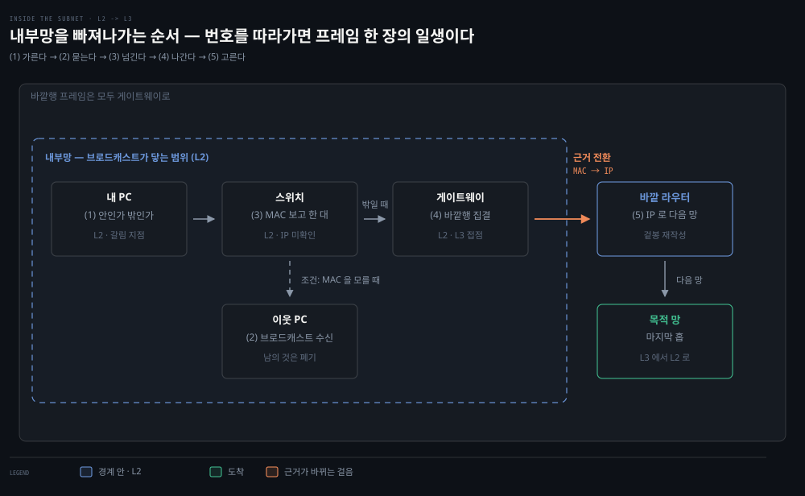

번호를 따라가면 프레임 한 장의 일생이 됩니다. 눈여겨볼 곳은 (4)입니다. 점선 테두리를 벗어나는 길이 게이트웨이 하나뿐이라 **바깥으로 가는 프레임은 예외 없이 그리로 모입니다.**

테두리를 넘는 순간 **무엇을 보고 결정하느냐**가 바뀝니다. (5)의 라우터는 IP를 보고 다음 망을 고르고, MAC은 그렇게 고른 한 칸을 실제로 건너는 데만 씁니다. 이 레벨 차이가 §3과 §4를 가르는 선입니다.


## 1. IP — 배달을 보장하지 않는 우편 시스템
> IP는 배달을 보장하지 않습니다. 신뢰성 부담을 네트워크 중간이 아니라 통신 경로의 양 끝에 지운 설계입니다.

### best-effort — 보장하지 않는 대신 단순해진다

모든 TCP·UDP 데이터는 Network 계층에서 IP 패킷으로 전송됩니다. 나가는 패킷은 다음 홉(next-hop) 호스트를 골라 Link 계층으로 넘기고, 들어온 패킷은 캡슐화를 벗겨 알맞은 Transport 프로토콜로 올립니다. IP는 MTU(최대 IP 패킷 크기)에 따라 패킷을 단편화·재조립합니다.

IP의 성격을 규정하는 문장은 이것입니다 — <u>IP는 패킷의 정상 도착을 보장하지 않습니다.</u> 

- 다양한 네트워크를 가로지르는 전달은 그 자체로 실패하기 쉬우므로, 그 부담을 네트워크가 아니라 통신 경로의 양 끝(Transport 계층)에 지웠습니다. 
- 헤더 체크섬도 헤더의 정확성만 확인할 뿐 데이터 무결성은 검증하지 않습니다. 캡슐화된 프로토콜(TCP·UDP)이 자기 체크섬으로 데이터 오류를 처리합니다.

### IPv4 헤더 — 기억할 여섯 필드

RFC 791이 정의한 **IPv4 헤더**에서 기억할 필드는 여섯입니다.

- Version — IPv4는 항상 4
- TTL — 8비트 수명. 라우터를 지날 때마다 1씩 줄어 패킷이 네트워크를 무한히 돌지 못하게 막습니다. TTL을 낮추면 체크섬도 다시 계산해야 합니다
- Protocol — 데이터부에 실린 프로토콜 번호. ICMP 1, TCP 6, UDP 17, OSPF 89
- Source·Destination address — 송신·수신 IPv4 주소. NAT 장비가 전송 중에 바꿀 수 있습니다
- Flags·Fragment Offset — 단편화 제어(Do not Fragment, More Fragments)와 조각 위치
- Type of Service — 처음에는 ToS였고 지금은 DSCP(Differentiated Services Code Point)로 불리는 차등 서비스 필드입니다. 라우터와 네트워크가 혼잡할 때 어느 패킷을 먼저 보낼지 판단하는 근거이며, VoIP 같은 기술이 통화를 다른 트래픽보다 앞세우는 데 씁니다

### TTL — 영원히 떠돌지 못하게 막는 숫자

여섯 중 `TTL`은 이 절의 성격을 그대로 담고 있습니다. IP는 배달을 보장하지 않지만, **패킷이 영원히 떠도는 것만은 막습니다.**


라우터는 지나는 패킷마다 이 숫자에서 1을 뺍니다. 0이 되면 그 자리에서 버리고 다음 홉으로 넘기지 않습니다. 경로 설정이 잘못돼 고리가 생겨도 패킷이 무한히 도는 대신 예순몇 홉 안에 사라집니다.

### traceroute — 죽여 놓고 항의를 받아 적는다

버릴 때 보내는 쪽에 알려 주는 것이 `ICMP Time Exceeded`(타입 11)입니다. `traceroute`는 이 성질을 뒤집어 씁니다. TTL을 1부터 하나씩 올려 가며 보내면 매번 다른 라우터가 "내가 버렸다"고 답하므로, 그 답들을 모으면 경로가 순서대로 드러납니다.

평소 통신의 TTL은 64처럼 넉넉한 값이지만, traceroute는 **일부러 1부터 시작합니다.** 오래 돌다가 죽은 패킷을 관찰하는 것이 아니라, 죽을 자리를 지정해 놓고 쏘는 것입니다.


- 한 번 쏘면 한 대만 밝혀지므로 홉 수만큼 반복합니다. 여기서 "어느 라우터였는지"는 따로 붙는 식별자가 아니라 **그 답장의 출발지 IP**로 알아냅니다. 답장도 IP 패킷이라 버린 라우터의 주소가 출발지 칸에 찍혀 돌아오기 때문입니다.
- traceroute는 라우터 목록을 조회하는 도구가 아니라 **버려지게 만들고 그 항의를 받아 적는** 도구입니다. 중간에 `* * *`로 뜨는 홉은 답장이 오지 않은 자리인데, 원인은 셋 중 하나입니다. 그 라우터가 ICMP를 아예 안 보내도록 설정됐거나, 중간 방화벽이 막았거나, 되돌아올 경로가 없거나입니다. 셋이 같은 증상으로 보이므로 별표만으로는 구분되지 않습니다. 참고로 답장이 오는 것 자체는 대체로 보장됩니다 — 내 공인 IP가 속한 대역은 인터넷에 광고돼 있고, 모르는 라우터라도 기본 경로로 떠넘기면 되기 때문입니다. 다만 **가는 길과 오는 길이 다른 비대칭 경로**는 흔하므로, traceroute가 보여 주는 것은 왕복 경로가 아니라 가는 쪽 경로입니다.


## 2. 주소의 진화 — 클래스에서 CIDR로, 다시 IPv6로
> 주소 체계의 변화는 전부 고갈이 밀어붙인 것입니다. 클래스의 고정 경계가 낭비를 낳자 CIDR이 경계를 풀었고, 그것으로도 모자라 IPv6가 주소 길이를 늘렸습니다.

IPv4 주소는 사람에게는 점 찍은 십진수(192.168.1.2), 컴퓨터에게는 32비트 이진 문자열입니다. 앞부분이 네트워크, 뒷부분이 그 네트워크 안 호스트의 고유 식별자이고, 어디까지가 네트워크인지는 서브넷 마스크(255.255.255.0 = `0xffffff00`)가 정합니다.

### 클래스풀 — 고정 경계가 낳은 낭비

초기에는 네트워크와 호스트의 경계를 클래스로 고정했습니다.

| 클래스 | 호스트부 비트 | 호스트 수 | 용도 |
|--------|--------------|-----------|------|
| A | 24비트 | 약 1,678만[^classa] | 대형 네트워크 |
| B | 16비트 | 65,536 | 중형 네트워크 |
| C | 8비트 | 256 | 소형 네트워크 |
| D | — | — | 멀티캐스트(예약) |
| E | — | — | 실험용(예약) |

이 고정 경계는 인터넷 규모에서 확장되지 않았습니다. 300개 호스트가 필요한 조직에 C(256)는 모자라고 B(65,536)는 낭비입니다.

### CIDR(Classless Inter-Domain Routing) — 경계를 비트 단위로 옮긴다

**CIDR(Classless Inter-Domain Routing)**는 서브넷 경계를 클래스 범위 안 어디로든 옮길 수 있게 해 이 낭비를 줄였습니다.

책의 예시는 `208.130.29.33`의 위임 계보입니다. IANA가 `208.128.0.0/11`을 ARIN(북미 인터넷 레지스트리)에 주고, ARIN이 점점 작은 서브넷으로 쪼개 내려가 최종적으로 단일 호스트 `208.130.29.33/32`에 닿습니다.


`/N`은 네트워크부 비트 수라 N이 클수록 좁습니다. 

- 맨 왼쪽 `/11`은 호스트부가 21비트라 `208.128.0.0`부터 `208.159.255.255`까지 209만 개를 덮습니다. 
- 맨 오른쪽 `/32`는 0비트라 그 범위 안의 주소 하나입니다. 위임이 몇 단계를 거치든 최종 호스트는 처음 블록 밖으로 나가지 않습니다.

위임이란 넓은 블록을 받은 쪽이 필요한 만큼만 잘라 다시 내주는 일입니다. 몇 단계든 반복될 수 있습니다. 아랫줄의 형제 조각들이 그 갈래입니다. 위임은 한 줄로 내려가지 않고 매 단계 갈라집니다. 윗줄은 그중 하나만 따라간 것입니다.

### NAT(Network Address Translation) — 주소 하나를 여럿이 나눠 쓴다

CIDR이 낭비를 줄였다면 **NAT(Network Address Translation)** 는 같은 주소를 여러 번 쓰게 해 고갈을 미뤘습니다. 인터넷에서 라우팅되지 않는 사설 대역 셋(`10.0.0.0/8` · `172.16.0.0/12` · `192.168.0.0/16`)을 정해 두고, 안에서는 이 주소를 쓰다가 밖으로 나갈 때만 공인 주소로 바꿔 답니다. 그래서 여러 집이 같은 `192.168.0.15`를 써도 부딪히지 않습니다.

그런데 주소만 바꿔서는 응답을 되돌릴 수 없습니다. 한 공인 주소로 나간 기기가 여럿이면 서버가 보기에는 전부 같은 곳에서 온 요청이기 때문입니다. 그래서 공유기는 **포트 번호까지 바꿔 적고** 그 표로 주인을 찾습니다.


그림에서 공유기 막대만 두 구간에 끊기지 않고 이어져 있습니다. 다른 참여자는 자기 차례에만 짧게 켜지는데, 공유기는 나갈 때 적어 둔 매핑을 응답이 돌아올 때까지 **붙들고 있어야** 하기 때문입니다. 그 표가 사라지면 돌아온 응답의 주인을 찾을 방법이 없습니다.

앞 편에서 **한 기계 안의 어느 프로그램인지** 가르는 데 쓰던 포트가, 여기서는 **어느 기계인지** 가르는 데 쓰입니다. Transport 계층의 필드를 Network 계층의 주소 부족을 메우는 데 빌려 쓰는 셈입니다.

이 방식에는 천장이 있습니다. 

- 포트가 16비트라 공인 주소 하나로 유지할 수 있는 연결이 65,536개를 넘지 못합니다. 가정에서는 문제가 되지 않지만 통신사가 여러 가구를 한 주소로 묶으면 실제로 닿습니다. 
- 앞 편의 `TIME-WAIT`이 2MSL 동안 조합을 붙들고 있는 것도 여기서 함께 작용해, 연결을 자주 여닫는 환경일수록 쓸 수 있는 몫이 더 줄어듭니다.

### IPv6 — 주소 길이를 아예 늘린다

CIDR로도 고갈을 막지 못해 IPv6가 나왔습니다. 차이의 본체는 주소 공간 크기입니다.

| 구분 | 주소 길이 | 주소 개수 |
|------|----------|----------|
| IPv4 | 32비트 | 4,294,967,296 |
| IPv6 | 128비트 | 340,282,366,920,938,463,463,374,607,431,768,211,456 |

IPv6는 표기도 16진수로 줄여 쓰며, 네트워크 접두부와 호스트라는 구조 자체는 IPv4와 비슷합니다.


## 3. BGP — 네트워크 사이의 길 찾기
> 네트워크 사이의 길 찾기는 BGP가 ASN 단위로 경로를 광고해 만듭니다. Calico가 이 구조를 클러스터 안으로 그대로 가져옵니다.

### 라우터가 서는 자리 — 스위치와 갈리는 지점

라우터는 특별한 곳에 있는 장비가 아닙니다. **네트워크와 네트워크가 만나는 자리마다** 놓입니다. 

- 집 공유기가 이미 라우터이고, 집 안 네트워크와 ISP 망의 경계에 서 있습니다. ISP 가 무엇을 파는 곳인지는 [00-03 §4](./00-03.%EB%84%A4%ED%8A%B8%EC%9B%8C%ED%81%AC%20%EC%84%A0%EC%88%98%20%EA%B0%9C%EB%85%90.md#4-장비-세-가지--허브--스위치--라우터)에 있습니다. 
- 다만 ISP도 인터넷 전체를 아는 것이 아니라 모르는 목적지는 다시 자기 위쪽으로 넘기므로, 뒤에 나올 떠넘기기 사슬에서 한 칸을 차지할 뿐입니다.

짝이 되는 장비와 나란히 놓으면 역할이 갈립니다. **스위치는 한 네트워크 안에서 MAC을 보고** 전달하고, **라우터는 네트워크 사이에서 IP를 보고** 다음 망을 고릅니다. 앞서 본 두 헤더가 각각 어느 장비의 일인지가 여기서 정해집니다.

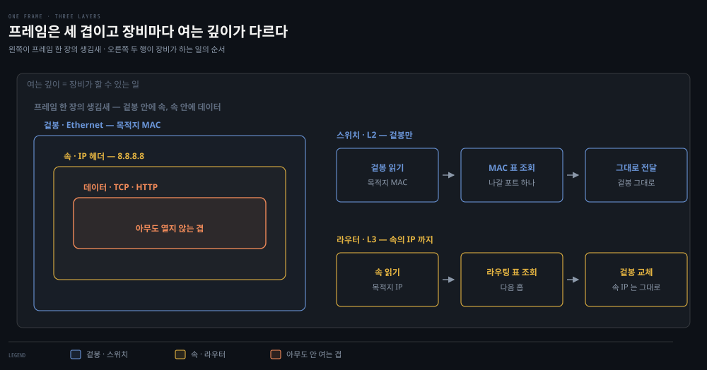

`8.8.8.8`은 내 서브넷 밖이라 그 기계의 MAC은 알아낼 방법이 없습니다. 그래서 겉봉에는 게이트웨이의 MAC을 적고 속에는 `8.8.8.8`을 그대로 둡니다. **겉봉의 받는 사람과 속 편지의 받는 사람이 다르다**는 것이 출발점입니다.

왼쪽 패널이 프레임 한 장의 생김새입니다. 겉봉 안에 속이 있고 속 안에 데이터가 있습니다. 오른쪽 두 행은 그 프레임을 받은 장비가 하는 일입니다.

스위치는 겉봉만 열고 라우터는 속까지 엽니다. 그다음 찾는 표가 갈리고 결과도 갈립니다. **같은 프레임을 받아도 스위치는 아무것도 고치지 않습니다.** 겉봉을 바꾸는 것은 라우터뿐입니다.

둘 다 그 안의 데이터는 열지 않습니다. 그래서 스위칭과 라우팅은 애플리케이션이 무엇을 보내든 똑같이 동작합니다.

헷갈리기 쉬운 것은 집에서 이 둘이 한 상자에 들어 있다는 점입니다. 공유기 뒷면의 LAN 포트가 스위치이고, 같은 상자가 WAN 쪽으로는 라우터입니다. 둘이 서 있는 레벨은 [§용어 지도](#용어-지도--낱말마다-사는-레벨이-다르다)의 도식에서 위아래로 갈라 두었습니다.

### 라우팅 테이블 — 전체 경로가 아니라 다음 문 하나

라우터가 하는 일은 한 문장으로 줄어듭니다. 패킷을 받아 목적지 IP를 보고 **어느 문으로 내보낼지 고르는 것**입니다.

고를 때 보는 것이 라우팅 테이블이고, 그 표에는 "이 대역이면 이 문"이라는 줄이 늘어서 있습니다. 집 공유기의 표를 실제 모양으로 적으면 이렇습니다.

| 목적지 대역 | 다음 홉 | 나갈 문 |
|---|---|---|
| `10.0.0.0/24` | (없음 — 직접 연결) | 집 안 쪽 |
| `0.0.0.0/0` | `203.0.113.1` | ISP 쪽 |

읽는 법이 두 군데서 갈립니다. 왼쪽은 개별 주소가 아니라 **대역**입니다 — 주소마다 한 줄이면 43억 줄이 되니까요. 오른쪽 다음 홉은 최종 목적지가 아니라 **바로 옆 라우터**이고, 직접 연결된 대역은 건너뛸 이웃이 없어 비어 있습니다.

그래서 이 표에는 **전체 경로가 없습니다.** 바로 다음에 밀어낼 방향만 있고, 그 뒤는 라우터도 모릅니다.

### 기본 경로 — 모르면 위로 떠넘긴다

그러면 표에 없는 목적지가 오면 어떻게 될까요? 할 수 있는 일은 두 가지뿐입니다. 버리고 ICMP로 알리거나, 미리 넣어 둔 **기본 경로(default route)** 로 떠넘기거나입니다.

- 기본 경로는 `0.0.0.0/0`으로 적는데, 네트워크부가 0비트라 모든 주소가 여기 걸립니다. 라우터는 여러 줄이 걸리면 가장 좁은 것, 즉 프리픽스 숫자가 큰 것을 고르므로 `0.0.0.0/0`은 언제나 꼴찌입니다 — 다른 게 하나도 안 맞을 때만 쓰입니다.
- 집 공유기가 `8.8.8.8`을 몰라도 구글 DNS에 닿는 이유가 여기 있습니다. 표에 없으면 위로 떠넘기면 그만이니까요. 그런데 이 떠넘기기가 무한히 이어질 수는 없습니다. **언젠가는 누군가 그 주소를 진짜로 알고 있어야** 배달이 끝납니다.

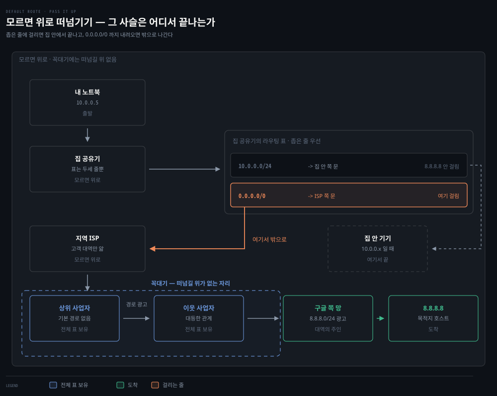

밖으로 나가는 초록 화살표가 **공유기 상자가 아니라 `0.0.0.0/0` 칸에서 출발**한다는 점이 요점입니다. `8.8.8.8`은 첫 줄에 안 걸려 다음 줄로 내려가고, `0.0.0.0/0`에 걸린 **뒤에야** 나갈 문이 정해집니다.

목적지가 `10.0.0.7`이었다면 첫 줄에서 걸려 집 안에서 끝납니다. 걸릴 줄이 하나도 없었다면 그 자리에서 버려집니다.

그러니 떠넘기기는 라우터의 본능이 아닙니다. **표에 `0.0.0.0/0` 한 줄이 적혀 있어서** 일어나는 일이고, 그 줄을 지우면 같은 라우터가 같은 패킷을 버립니다.

그 끝이 인터넷의 꼭대기입니다. 

- 최상위 사업자들에게는 떠넘길 위가 없어 기본 경로를 둘 수 없고, 대신 **서로에게 자기가 책임지는 대역을 미리 알려 주어** 전체 표를 갖춥니다. 
- 그 알려 주는 일이 BGP입니다. BGP를 "길을 찾아 주는 똑똑한 알고리즘"으로 읽으면 어렵기만 한데, **기본 경로가 통하지 않는 자리에서 표를 채우는 방법**으로 읽으면 자리가 분명해집니다.

### AS(Autonomous System)·ASN(AS Number)·BGP(Border Gateway Protocol) — 낱말부터 갈라 놓는다

BGP를 보기 전에 주어부터 정해야 합니다. **AS(autonomous system, 자율 시스템)는 하나의 관리 주체가 자기 정책으로 운영하는 네트워크 덩어리**입니다. KT·SK브로드밴드 같은 통신사, AWS·구글 같은 사업자, 규모가 큰 대학 하나가 각각 AS입니다.

"자율"이라는 말이 핵심입니다. 안에서 어떤 라우팅 프로토콜을 쓰든 어떤 경로를 고르든 그 조직이 알아서 정합니다. 밖에서는 거기에 간섭하지 않습니다. 밖에 알리는 것은 **"우리 쪽으로 넘기면 이 대역까지 닿는다"** 하나뿐입니다([RFC 1930](https://datatracker.ietf.org/doc/html/rfc1930)).

그 덩어리마다 붙는 전 세계 고유 번호가 **ASN(autonomous system number)**입니다. 그리고 덩어리와 덩어리 사이에서 경로를 주고받는 프로토콜이 **BGP(Border Gateway Protocol)**입니다. 셋을 갈라 두면 이렇습니다.

| 무엇 | 정체 |
|------|------|
| AS | 한 관리 주체가 자기 정책으로 굴리는 네트워크 덩어리 |
| ASN | 그 덩어리에 붙는 전 세계 고유 번호 |
| BGP | 덩어리끼리 "우리 쪽으로 오면 여기까지 닿는다"를 주고받는 프로토콜 |

여기서 **광고**는 판촉이 아니라 위 표의 그 알림을 뜻합니다. 영어로는 route advertisement 또는 route announcement이고, 실제로 오가는 것은 BGP의 `UPDATE` 메시지입니다. 받은 쪽은 그 내용을 자기 표에 한 줄로 적고 다시 자기 이웃에게 전달합니다.

이 메시지는 이웃과 미리 맺어 둔 TCP 연결 위로 오갑니다. BGP는 TCP 179번 포트를 씁니다([RFC 4271](https://datatracker.ietf.org/doc/html/rfc4271)). 앞 편의 TCP가 여기서는 라우팅 프로토콜 자신을 실어 나르는 셈입니다.

### 여러 갈래로 올 때 — 무엇을 보고 고르나

같은 대역의 광고가 **여러 이웃에게서 동시에 오는 일은 흔합니다.** 사업자가 상위 사업자 여럿과 계약해 두는 것을 멀티호밍(multi-homing)이라 하고, 한쪽 회선이 끊겨도 다른 쪽으로 계속 나가려고 일부러 그렇게 합니다. 그래서 BGP는 여러 광고 중 하나를 고르는 규칙을 갖고 있어야 합니다.

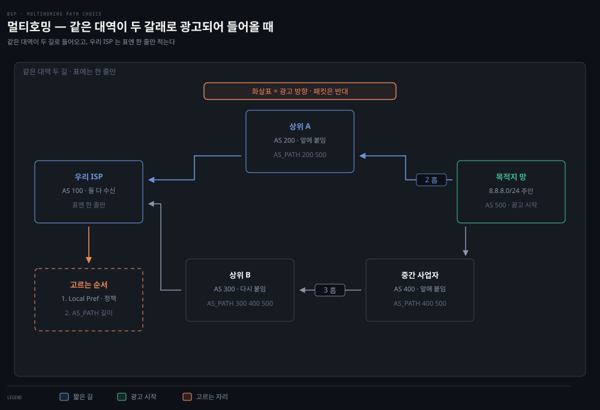

윗길과 아랫길은 같은 대역으로 가지만 거쳐야 할 사업자 수가 다릅니다. 그림의 화살표는 **광고가 퍼지는 방향**이라 패킷이 흐르는 방향과 반대입니다.

광고에는 대역만이 아니라 **거쳐 온 AS 목록**이 붙어 옵니다. 각 AS 가 자기 번호를 맨 앞에 붙이므로 우리 쪽으로 올수록 길어지고, BGP 는 짧은 쪽을 선호합니다.

다만 그보다 먼저 걸리는 기준이 있습니다. Local Preference 라는 자기 정책 값으로, 싼 회선을 주로 쓴다는 결정이 여기 들어갑니다. 순서로는 **돈이 거리보다 앞섭니다.**

오해 하나는 미리 걷어내는 편이 좋습니다. **BGP는 지연도 대역폭도 재지 않습니다.** 목록이 짧다는 것은 거쳐 갈 관리 주체가 적다는 뜻일 뿐이고, AS 하나가 대륙을 가로지르기도 합니다. "가까운 쪽을 고르겠지"라는 직관이 대체로 맞으면서도 보장은 아닌 이유입니다.

### AS 목록의 다른 일 — 고리를 잡아낸다

목록이 하는 일이 하나 더 있습니다. **지나온 조직의 기록**이라 고리를 잡아냅니다.

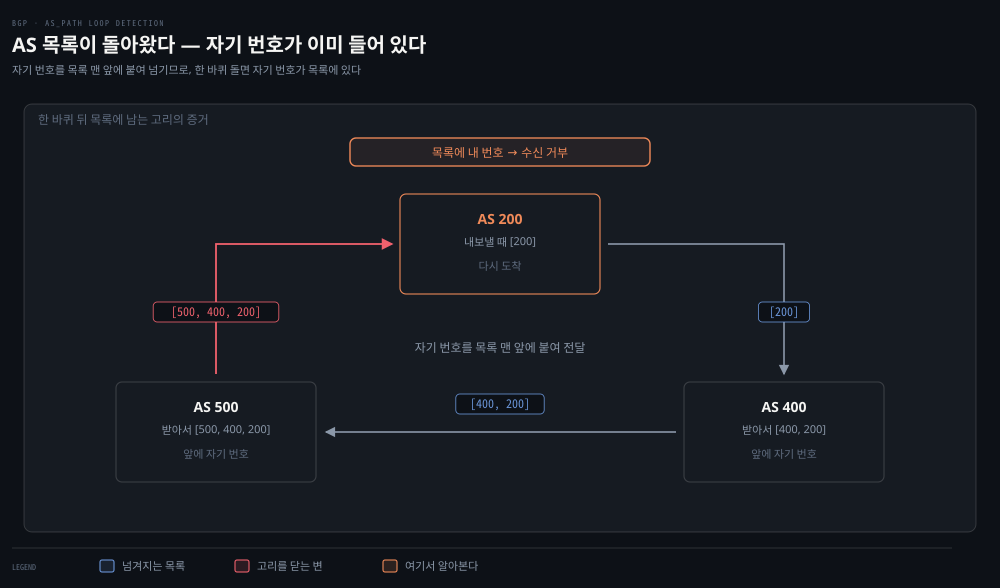

AS 200이 내보낸 광고가 400과 500을 돌아 다시 200에게 왔습니다. 목록에 이미 `200`이 들어 있습니다. 이걸 그대로 표에 적으면 셋이 서로를 가리켜 패킷이 영원히 돌게 됩니다.

그래서 BGP는 **받은 목록에 자기 번호가 들어 있으면 그 광고를 버립니다.** AS_PATH 루프 탐지라 부르고, 규칙 하나로 고리를 원천 차단합니다. §1의 TTL이 **이미 생긴 고리를 끝내는** 장치라면 이쪽은 **고리가 생기지 않게 하는** 장치입니다.

### 번호는 조직에 붙는다 — 경계 라우터와 eBGP·iBGP

여기서 감각이 자주 어긋납니다. **ASN은 라우터 한 대가 아니라 조직 하나에 붙습니다.** 한 사업자가 라우터를 수백 대 굴려도 밖에서 보이는 번호는 하나입니다. 그래서 AS 목록의 길이는 지나온 라우터 수가 아니라 **넘어온 관리 주체의 수**입니다.

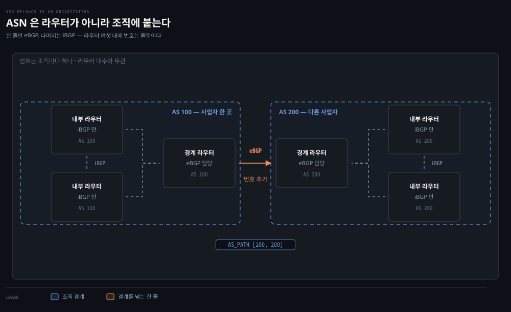

밖과 말을 섞는 것은 각 조직의 **경계 라우터** 한둘뿐이고, 나머지 내부 라우터는 조직 안에서만 씁니다. 

- 그래서 라우터가 여섯 대여도 목록에는 `100`과 `200` 두 개만 남습니다. 밖으로 말을 거는 쪽을 **eBGP**, 조직 안에서 서로 표를 맞추는 쪽을 **iBGP**라 부릅니다. 
- 같은 프로토콜인데 상대가 남이냐 식구냐로 이름이 갈립니다. 경계 라우터는 계급이 높은 라우터가 아니라 **자리가 가장자리인** 라우터입니다. 
- 조직 크기와도 무관해서, 집 안 네트워크와 ISP 망의 경계에 선 집 공유기도 그 집의 경계 라우터입니다.

번호는 재는 값이 아니라 **신청해서 배정받는 값**입니다. 조직이 지역 레지스트리에서 받아 자기 라우터 설정에 적어 두며, IP 주소처럼 전 세계에서 겹치지 않습니다.

원래 16비트(0~65535)였다가 고갈되어 32비트로 넓혔습니다([RFC 6793](https://datatracker.ietf.org/doc/html/rfc6793)). §2의 주소 고갈이 번호 체계에서도 그대로 반복된 셈입니다.

### 광고와 전달은 다른 시간에 일어난다

책의 예시도 같은 구조입니다. AS 100의 호스트가 AS 300의 호스트에 보낼 때, 기본 게이트웨이가 BGP로 채워 둔 표에서 다음 AS를 찾아 넘기고 이를 반복합니다. 광고와 전달을 시간 순서로 나눠 놓으면 그 구조가 드러납니다.

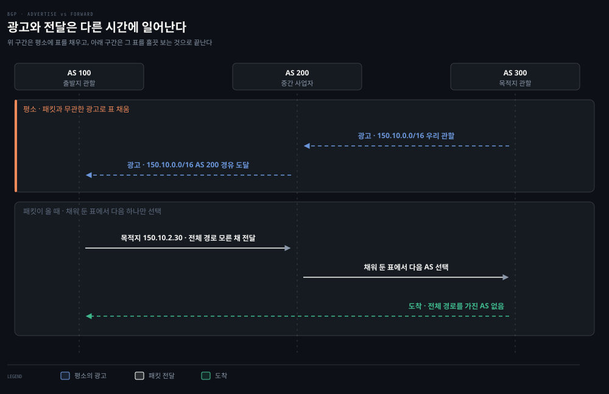

두 시간이 갈린다는 점이 요점입니다. **패킷이 도착한 뒤에 남에게 물어보는 일은 없습니다.** 광고가 평소에 표를 채워 두고, 전달은 그 표를 흘끗 보는 것으로 끝납니다.

초당 수백만 개가 지나가는 자리에서 매번 되물을 수는 없기 때문입니다. 그러니 "떠넘긴다"도 **자기 표가 시키는 대로 옆으로 밀어낸다**는 뜻입니다. 01-01에서 본 "양 끝은 목적지만 적고 중간이 매 홉마다 다음 한 칸을 정한다"가 인터넷 규모에서 이렇게 작동합니다.

### Kubernetes — 노드 하나하나가 작은 라우터가 된다

이 내용이 책에 있는 이유는 Kubernetes 때문입니다. Calico 같은 일부 컨테이너 네트워킹 프로젝트가 노드 간 클러스터 트래픽 라우팅에 BGP를 그대로 씁니다. 데이터센터 안에서 각 노드가 작은 라우터처럼 자기 Pod 대역을 광고하는 구조로, 3장에서 다시 다룹니다.

헷갈리기 쉬운 지점이 하나 있습니다. Calico 기본 설정에서 모든 노드w가 **같은 사설 AS 번호**를 씁니다. 번호가 같으니 서로의 경로를 저절로 알 것 같지만 그렇지 않습니다. **ASN이 같다는 것은 밖에서 하나로 보인다는 뜻이지 안에서 정보가 공유된다는 뜻이 아닙니다.**

노드 A는 자기 Pod 대역만 압니다. 노드 B의 대역은 누가 알려 주지 않으면 모릅니다. 그래서 클러스터 안에서도 노드끼리 이웃을 맺어 각자 자기 대역을 알립니다. 이 이웃 관계는 트리가 아니라 **풀메시**입니다. iBGP에는 *배운 경로를 다른 iBGP 이웃에게 다시 전달하지 않는다*는 규칙이 있어 중계가 성립하지 않기 때문입니다.

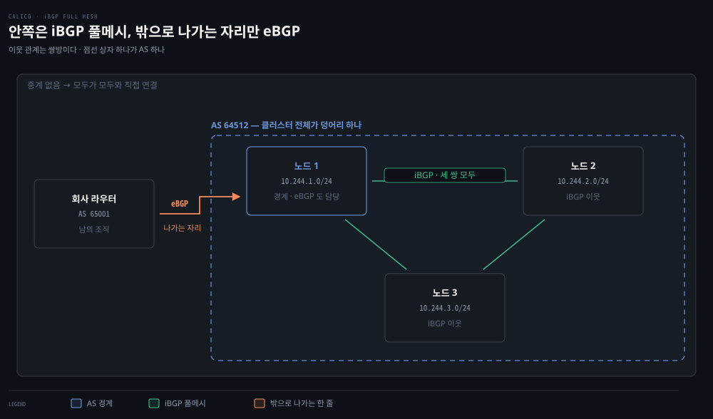

점선 상자 하나가 AS 하나입니다. 상자 안에서 오가는 것이 iBGP이고, 상자 밖 회사 라우터와 말을 섞는 자리만 eBGP입니다. 그 자리를 맡은 노드가 경계 라우터이고 나머지는 내부입니다.

**둘은 같은 프로토콜이고 상대가 누구냐만 다릅니다.** 다만 그 차이에서 동작 두 가지가 갈립니다.

| | 상대 | AS 목록 | 배운 것을 다시 전달 |
|---|---|---|---|
| **eBGP** | 다른 AS | 자기 번호를 앞에 붙여 넘긴다 | 한다 |
| **iBGP** | 같은 AS | 번호를 붙이지 않는다 | **안 한다** |

오른쪽 두 칸이 풀메시의 이유입니다. 안에서는 번호가 같아 목록이 자라지 않으니 고리를 알아볼 수 없고, 그래서 재전달을 아예 금지해 대신 막습니다. 중계가 없으니 모두가 모두와 직접 맺어야 합니다.

노드가 많아 부담이면 몇 대를 **경로 반사기(route reflector)** 로 두고 모읍니다. 금지 규칙의 예외 장치이지 트리로 바뀌는 것은 아닙니다.

조회 순서와는 무관합니다. 라우팅 테이블은 하나뿐이고 고르는 규칙도 하나여서, 어느 쪽으로 배웠든 같은 표에 섞인 뒤 **가장 좁은 줄이 이깁니다.**

노드 안을 열어 보면 역할이 더 분명해집니다.

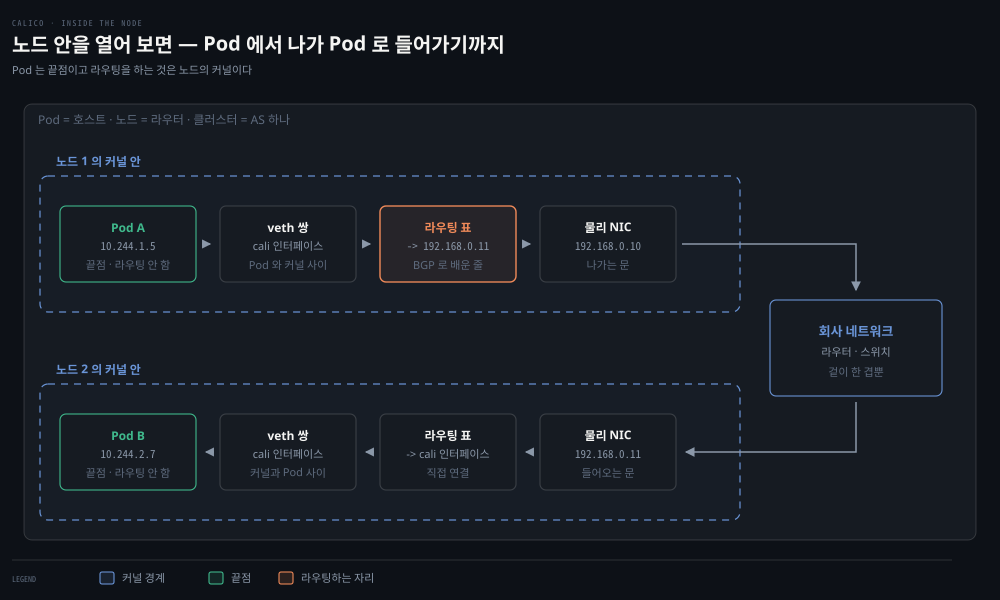

**Pod 는 라우터가 아니라 끝점입니다.**

- 라우팅을 하는 것은 노드의 커널이고, Pod 와 커널은 veth 쌍이라는 가상 인터페이스 한 켤레로 이어집니다. 
- 한쪽 끝이 Pod 안의 `eth0`, 다른 쪽 끝이 노드 쪽 `cali` 인터페이스입니다. 그래서 계층으로 옮기면 **Pod = 호스트, 노드 = 라우터, 클러스터 = AS 하나**가 됩니다.

이 방식에는 조건이 하나 붙습니다. **광고는 이웃으로 맺은 상대에게만 갑니다.** BGP는 방송이 아니라 TCP 179번 위의 1:1 세션이므로, 이웃이 아닌 장비는 광고를 한 글자도 듣지 못합니다.

인터넷에서는 이 일이 생기지 않습니다. eBGP 이웃은 대개 케이블로 직접 이어진 라우터끼리 맺으므로 이웃의 사슬이 곧 물리 경로입니다.

클러스터는 다릅니다. iBGP 는 원격 이웃을 허용하므로 노드 둘이 물리적으로 떨어져 있을 수 있습니다. **이웃의 사슬과 물리 경로가 어긋나고**, 그 틈에 낀 장비가 아무것도 모르는 채 패킷을 받습니다.

받은 장비는 목적지 IP `10.244.2.7`을 보고 자기 표를 뒤집니다. 노드1이 "다음 홉은 노드2"라고 알고 있어도 **그 정보는 노드1의 표에만 있지 패킷에는 적히지 않습니다.** 표에 없으니 버려집니다.

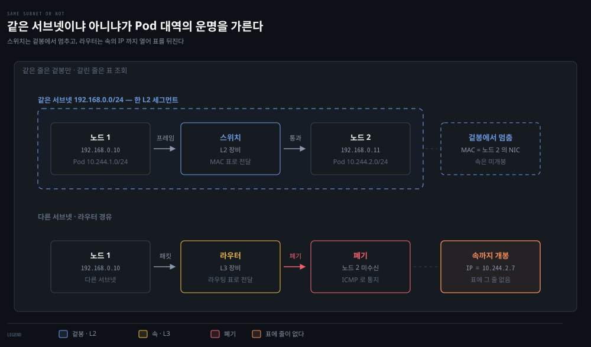

갈림길은 **노드들이 같은 서브넷에 모여 있느냐**입니다. 윗줄처럼 모여 있으면 사이에 스위치만 있고, 스위치는 IP 헤더를 아예 열지 않으므로 `10.244`든 무엇이든 상관없이 날라 줍니다. 아랫줄처럼 흩어져 있으면 라우터가 서고 그때부터 목적지 IP를 뒤집니다. 호스트가 안팎을 가르는 방법과 그 결과로 누구의 MAC을 묻게 되는지는 [§4 안이냐 밖이냐](#안이냐-밖이냐--누구의-mac-을-물을지)가 정본입니다.

정리하면 BGP 방식은 **노드가 한 L2에 모여 있거나, 중간 장비에 광고를 넣을 수 있을 때** 성립합니다. 클라우드처럼 그 장비가 남의 것이면 둘 다 안 됩니다. 남은 수는 **라우터가 아는 주소를 겉에 새로 씌우고 원래 패킷을 그 안에 넣는 것**뿐이고, 그 형태와 헤더 구성은 [§4 VXLAN](#vxlanvirtual-extensible-lan--경계-너머로-잇는-기술)이 정본입니다.

광고가 오가고 나면 중간 장비의 표에 두 대역이 모두 생깁니다. 그러면 `10.244.2.7`로 가는 패킷이 **아무것도 씌우지 않은 채** 평범한 IP 패킷으로 배달됩니다. 겉이 한 겹뿐이라 감싸고 벗기는 비용이 없습니다.

§4의 VXLAN 은 **이 광고를 넣을 수 없을 때** 쓰는 다른 길입니다.

> 💬 **비유**: §1의 우편 비유를 이어 가면 ASN은 나라마다 있는 우편 사업자입니다. 
>
> 각자 자기 관할 구역을 스스로 운영하고 남의 구역 배달 방식에는 관여하지 않습니다. BGP는 그 사업자들이 맺는 협정입니다. 어느 사업자도 전체 경로를 모르지만 각자 다음 사업자만 정확히 고르면 편지는 지구 반대편까지 갑니다.

### ICMP(Internet Control Message Protocol) — 사람이 연결성을 확인하는 도구

라우터끼리는 BGP로 경로 정보를 계속 교환합니다. 사람이 연결성을 확인할 때는 ICMP를 씁니다. **데이터를 나르지 않고 상황만 알리는** 프로토콜입니다. §1에서 본 대로 IP는 배달에 실패해도 아무 말을 하지 않는데, 그 침묵을 깨는 자리가 여기입니다.

아래 숫자는 ICMP 헤더 맨 앞의 **Type 필드** 값입니다. 받는 쪽은 이 한 바이트만 보고 무슨 소식인지 구분합니다. HTTP 상태 코드가 `404`·`500`으로 갈리는 것과 같은 방식입니다.

| 타입 | 이름 | 언제 오는가 |
|---|---|---|
| 8 / 0 | Echo Request / Reply | `ping` 을 쳤을 때 · 왕복 시간을 잰다 |
| 11 | Time Exceeded | TTL 이 0 이 되어 버렸을 때 |
| 3 | Destination Unreachable | 표에 걸릴 줄이 없어 버렸을 때 |
| 5 | Redirect | 더 나은 다음 홉이 있다고 알릴 때 |

ICMP 메시지는 IP 패킷 안에 담겨 오지만 계층으로는 **IP와 같은 Network 계층**으로 봅니다(§1 헤더 표의 프로토콜 번호 1번). TCP·UDP를 쓰지 않는다는 이유로 Transport 계층으로 보는 시각도 있는데, 처리 위치가 근거입니다. 포트가 없고 특정 애플리케이션이 아니라 라우터와 커널이 직접 처리합니다.


## 4. Link 계층 — 마지막 한 걸음은 MAC 주소로
> 라우팅이 목적지 네트워크까지 데려다주면 마지막 한 걸음이 남습니다. 그 한 걸음은 IP가 아니라 MAC 주소로 가고, 둘을 잇는 것이 ARP입니다.

### Ethernet 프레임 — MAC·LLC 와 EtherType

라우팅으로 목적지 네트워크까지 왔으면, 이제 같은 네트워크 안에서 정확한 장비에 프레임을 건네야 합니다. TCP/IP의 Link 계층은 MAC과 LLC 두 서브계층으로 이루어져 OSI의 L1·L2를 함께 수행합니다. IEEE 802.3(Ethernet)이 IP 패킷을 캡슐화하는 프레임의 송수신 규약을 정의합니다.

두 서브계층은 맡은 일이 다릅니다.

- **MAC**: 물리 매체에 접근하는 일을 맡습니다.
- **LLC**: 흐름 제어와 상위 프로토콜의 다중화를 맡습니다. 보낼 때는 여러 상위 프로토콜을 MAC 계층 위로 실어 보내고, 받을 때는 그것을 다시 갈라냅니다.

뒤에 나오는 EtherType이 필요한 이유가 이 갈라내기입니다. 도착한 프레임의 페이로드가 IP인지 ARP인지 알아야 올바른 상위 프로토콜로 올려 보낼 수 있습니다. EtherType이 그 판별 키 역할을 합니다.

Ethernet 프레임에서 기억할 필드는 다음과 같습니다.

| 필드 | 크기 | 역할 |
|------|------|------|
| 목적지·출발지 MAC | 각 6바이트 | 프레임을 받을·보낼 NIC 식별 |
| VLAN 태그 | 4바이트(선택) | 논리적 네트워크 분리 |
| EtherType | 2바이트 | 페이로드에 실린 프로토콜 표시 |
| CRC (푸터) | 4바이트 | 수신 측에서 프레임 손상 탐지 |

MAC 주소가 무엇이고 IP 와 어떻게 다른지는 [00-03 §1 주소 세 가지](./00-03.%EB%84%A4%ED%8A%B8%EC%9B%8C%ED%81%AC%20%EC%84%A0%EC%88%98%20%EA%B0%9C%EB%85%90.md#1-주소-세-가지--mac--ip--포트)가 정본입니다. 여기서는 이 편에 필요한 사실 하나만 씁니다 — **MAC 은 같은 세그먼트 안에서만 뜻이 있고, 한 홉을 넘을 때마다 새로 쓰입니다.** 브로드캐스트 주소 `FF:FF:FF:FF:FF:FF` 도 그 세그먼트를 벗어나지 못합니다.

### 매 홉 겉봉이 새로 쓰인다 — MAC 은 바뀌고 IP 는 남는다

프레임을 내보내기 직전 호스트는 목적지가 같은 서브넷 안인지를 가릅니다. 안이면 그 기계의 MAC 을, 밖이면 기본 게이트웨이의 MAC 을 적습니다. 그 판정과 MAC 을 알아내는 ARP 교환은 [00-03 §5](./00-03.%EB%84%A4%ED%8A%B8%EC%9B%8C%ED%81%AC%20%EC%84%A0%EC%88%98%20%EA%B0%9C%EB%85%90.md#5-브로드캐스트와-arp--모르는-상대를-찾는-법) · [00-03 §6](./00-03.%EB%84%A4%ED%8A%B8%EC%9B%8C%ED%81%AC%20%EC%84%A0%EC%88%98%20%EA%B0%9C%EB%85%90.md#6-서브넷--어디까지가-한-동네인가)이 정본입니다.

이 편에서 볼 것은 그다음입니다. 게이트웨이에게 건넨다고 해서 **IP 목적지가 바뀌는 것은 아닙니다.**

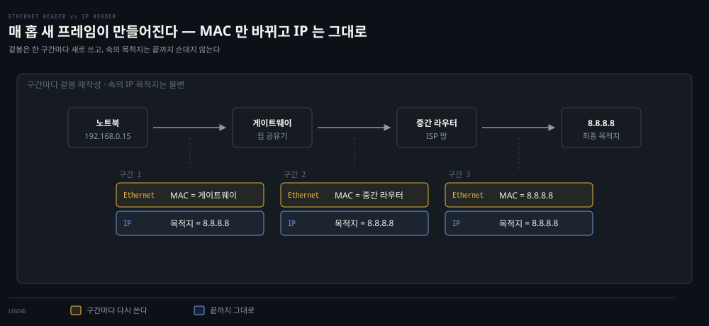

한 구간을 건널 때마다 프레임은 새로 만들어집니다. 겉봉의 MAC 은 매번 다시 쓰이고, 속에 든 IP 목적지는 `8.8.8.8` 그대로입니다.

**IP 헤더는 어디로 가야 하는지를 끝까지 지고 가고, Ethernet 헤더는 지금 한 칸을 누구에게 건넬지만 말합니다.** 01-01의 "양 끝은 목적지만 적고 중간이 매 홉마다 다음 한 칸을 정한다"가 헤더 두 층으로 갈린 모습입니다.

### 브로드캐스트 도메인과 VLAN(Virtual LAN) — 가두는 기술

ARP 요청은 `FF:FF:FF:FF:FF:FF` 로 뿌려지므로 같은 도메인의 모든 호스트가 받습니다. 부담은 ARP 에서 끝나지 않습니다. 도메인 안의 모든 프레임이 모든 노드에 닿고, 각 호스트가 자기 것이 아니면 버립니다. 

받아서 버리는 일 자체가 모든 호스트의 몫이라, 호스트가 늘수록 각자가 처리해야 할 남의 프레임도 함께 늘어납니다. 네트워크 엔지니어가 VLAN 태그로 L2 네트워크를 분할해 브로드캐스트를 가두고 보안·혼잡을 관리하는 이유가 여기 있습니다.

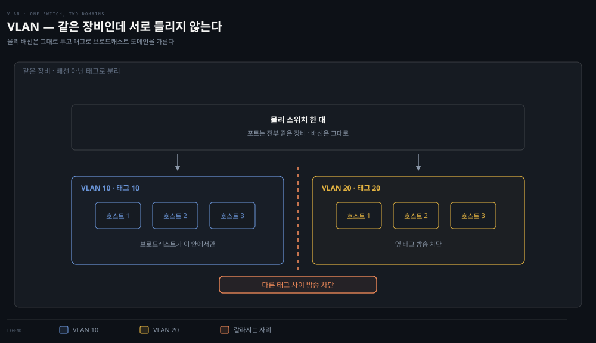

배선은 그대로 두고 태그만으로 도메인을 가릅니다. 같은 스위치에 꽂혀 있어도 태그가 다르면 옆 그룹의 방송이 들리지 않습니다. 받고 버릴 남의 프레임이 줄어드니 혼잡과 노출이 함께 줄어듭니다.

### VXLAN(Virtual eXtensible LAN) — 경계 너머로 잇는 기술

VLAN을 확장한 것이 VXLAN입니다. L2 프레임을 L4 UDP 패킷에 캡슐화해, IP 네트워크를 가로질러 L2 인접성을 만들고 논리 네트워크를 1,600만 개까지 확장합니다. Kubernetes 오버레이 네트워크가 바로 이 기술 위에 서 있습니다 — 서로 다른 노드의 Pod들이 같은 L2에 있는 것처럼 통신하는 마법의 정체가 VXLAN 캡슐화입니다.

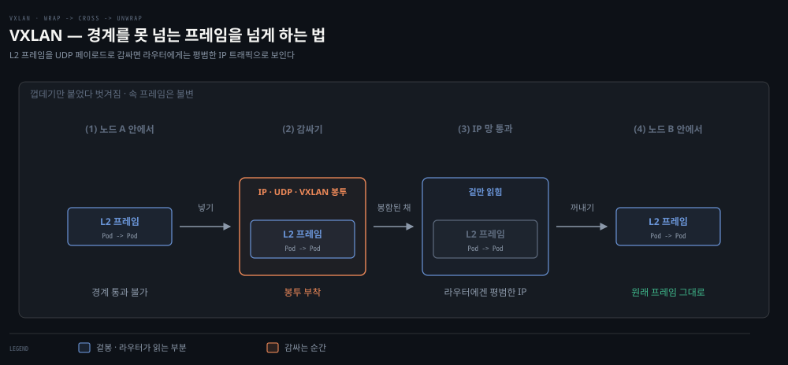

VLAN이 **가두는** 기술이라면 VXLAN은 떨어진 노드의 Pod들을 같은 L2에 있는 것처럼 **잇는** 기술입니다. 그 잇기가 성립하는 이유는 계층 분리에 있습니다.

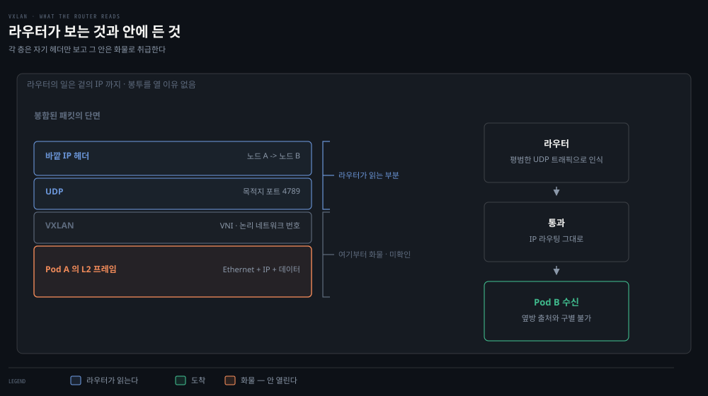

**라우터는 겉의 IP 헤더만 읽고 그 안은 들여다보지 않습니다.** 페이로드 해석은 자기 일이 아니기 때문입니다. 그래서 경계를 못 넘던 L2 프레임도 UDP 페이로드에 넣어 두면 라우터 눈에는 노드 사이의 평범한 트래픽이라 정상적으로 전달됩니다.

각 층이 자기 헤더만 보고 나머지를 화물로 취급한다는 성질이, 여기서는 **한 층의 것을 다른 층의 화물로 위장시키는 수단**이 됩니다. 목적지에서 껍데기를 벗기면 원래 프레임이 그대로 나오고, 받는 Pod는 그것이 옆자리에서 왔는지 다른 노드에서 왔는지 구별하지 못합니다.

> 💬 **비유**: VXLAN은 봉투 안에 봉투를 넣는 일입니다. 안쪽 편지(L2 프레임)에는 "같은 동네 3번지"처럼 동네 안에서만 통하는 주소가 적혀 있어 그대로는 다른 도시로 못 보냅니다. 그 편지를 도시 간 배송이 되는 바깥 봉투(UDP 패킷)에 넣어 부치면 우편망이 문제없이 실어 나르고, 받는 쪽에서 바깥 봉투를 뜯으면 안쪽 편지가 원형 그대로 나옵니다. 받는 사람은 이 편지가 옆집에서 왔는지 다른 도시에서 왔는지 알 수 없습니다.

### 직접 해 보기 — 내 호스트의 L2·L3를 읽기

이 절의 개념은 전부 지금 쓰는 노트북에서 확인됩니다. 세 명령이면 IP·게이트웨이·MAC이 한 번에 드러납니다.

```bash
# 1. 내 주소와 마스크, 그리고 NIC 의 MAC 주소
ifconfig en0        # Linux 는 ip addr show

# 2. 목적지별로 어디로 내보내는가 — 맨 위 default 행이 기본 경로다
netstat -rn         # Linux 는 ip route

# 3. 같은 네트워크에서 이미 알아낸 이웃들의 IP↔MAC 매핑
arp -a
```

읽는 순서가 곧 이 편의 순서입니다. `netstat -rn` 의 `default` 행에 적힌 게이트웨이가 §3에서 말한 "모르는 네트워크로 가는 출구"이고, `arp -a` 에 그 게이트웨이 IP가 MAC과 함께 들어 있으면 §4의 ARP가 이미 한 번 돌았다는 뜻입니다. 두 출력에 같은 IP가 등장하는 것을 확인하면 L3의 다음 홉과 L2의 실제 수신자가 어떻게 이어지는지가 눈에 들어옵니다.

캐시가 비어 있으면 만들어 볼 수도 있습니다. 게이트웨이로 `ping` 을 한 번 보낸 뒤 `arp -a` 를 다시 실행하면 방금 해석된 항목이 새로 들어와 있습니다.


## 5. 웹 서버 재방문 — 요청 하나의 전 계층 여정
> 세 편에서 나눠 본 계층을 하나의 요청으로 다시 잇습니다. 송신은 내려가며 감싸고 수신은 올라가며 벗기며, 그 과정에서 IP가 사라지는 지점이 실무 문제를 만듭니다.

### 요청 하나를 다섯 단계로

이제 1장의 처음으로 돌아가 cURL 요청 하나를 전 계층으로 설명할 수 있습니다.

1. cURL이 URL에서 IP와 포트를 알아내고 TCP 핸드셰이크로 연결을 수립합니다. 서버에는 8080 소켓, 클라이언트에는 임시 포트 소켓이 만들어집니다.
2. HTTP 요청이 Network 계층으로 내려가 출발지·목적지 IP가 패킷 헤더에 붙습니다.
3. Data Link 계층에서 NIC의 출발지 MAC이 프레임에 붙고, 목적지 MAC을 모르면 ARP로 알아낸 뒤 NIC가 프레임을 전송합니다.
4. 서버는 응답 패킷을 만들어 요청 패킷의 출발지 IP로 되돌려 보냅니다.
5. 클라이언트 쪽에서 역순으로 벗겨집니다 — L2에서 MAC 제거, L3에서 IP 확인 후 제거, L4에서 TCP 데이터로 소켓을 판별해 cURL 프로세스에 전달합니다.

마지막 단계를 짚어 둘 만합니다. 서버가 8080 소켓을 열었듯 클라이언트도 연결할 때 임의의 포트로 자기 소켓을 만듭니다.

응답이 돌아오면 커널은 그 포트로 소켓을 찾고, 소켓을 만든 프로세스에 패킷을 넘깁니다. 그래서 도착한 조각들이 다른 프로세스가 아닌 cURL 로 모입니다. §1의 "포트가 어느 프로세스의 트래픽인지 가린다"가 실행되는 자리가 여기입니다.

### 실제 구성 요소로 놓으면

계층 이름 대신 **실제로 존재하는 구성 요소**로 같은 여정을 놓으면 이렇게 됩니다. 앞의 실습에서 `curl localhost:8080`을 쳤을 때 요청이 실제로 지나간 것들입니다.


눈여겨볼 것은 **가운데가 접힌다**는 점입니다. `localhost` 요청이라 패킷이 물리 케이블로 나가지 않고 `lo0`에서 되돌아옵니다. 같은 커널이 송신 경로에서 헤더를 붙이고 수신 경로에서 그것을 벗기며, 실습의 `tcpdump -i lo0`이 잡은 자리도 여기입니다.

### 계층 이름으로 놓으면

같은 여정을 계층 이름으로 다시 보면 아래와 같습니다. 위 그림의 구성 요소가 각각 어느 계층에 해당하는지 짝지어 보면 좋습니다.


가운데 기둥에 Transport·Application 칸이 비어 있는 것이 이 그림의 요점입니다. 라우터는 IP 헤더까지만 읽고 그 위는 화물로 넘기므로 포트도 HTTP도 볼 일이 없습니다. §4에서 본 "MAC은 매 홉 새로, IP는 끝까지 그대로"가 기둥 셋으로 갈려 있는 모습이기도 합니다.

### 클라이언트 IP 는 어디서 사라지나

여기서 실무 포인트가 나옵니다. IP 주소는 L3에서 제거되므로, 애플리케이션이 클라이언트 IP를 알아야 한다면 Application 계층에 실어 보존해야 합니다. HTTP의 `X-Forwarded-For` 헤더가 그 자리이고, Kubernetes 의 Ingress 뒤에 선 앱이 클라이언트 IP를 찾을 때 다시 만납니다.


## 심화 학습
> 책 밖에서 보강한 내용입니다. 출처를 함께 남깁니다.

- VXLAN의 정식 명세는 [RFC 7348](https://datatracker.ietf.org/doc/html/rfc7348)입니다. 24비트 VNI(VXLAN Network Identifier)가 논리 네트워크 1,600만 개(2^24)의 근거입니다. VLAN ID는 12비트라 4,096개가 한계인 점과 대비해 두면 기억하기 쉽습니다.
- Calico가 BGP를 쓰는 방식은 [Calico 공식 문서 — BGP 개요](https://docs.tigera.io/calico/latest/networking/configuring/bgp)에 정리돼 있습니다. 각 노드가 자기 Pod CIDR을 BGP로 광고해 캡슐화 없는(non-overlay) 라우팅을 만들 수 있다는 점이 VXLAN 오버레이와의 근본 차이입니다.
- 클라이언트 IP 보존 문제는 K8s에서 `externalTrafficPolicy`·프록시 프로토콜과 얽혀 더 복잡해집니다. 형제 정독본의 [11-02 외부 노출 — 트래픽 정책](../kubernetes-in-action/11-02.%EC%99%B8%EB%B6%80%20%EB%85%B8%EC%B6%9C%20%E2%80%94%20NodePort%C2%B7LoadBalancer%C2%B7%ED%8A%B8%EB%9E%98%ED%94%BD%20%EC%A0%95%EC%B1%85.md)이 그 이야기를 다룹니다.


## 결정 치트시트
> 이 편의 도구를 "무엇이 안 될 때 무엇을 치는가"로 압축했습니다.

| 확인하고 싶은 것 | 도구 | 보는 것 |
|-----------------|------|--------|
| 상대 호스트까지 도달하는가 | `ping <ip>` | ICMP echo reply 여부·손실률·왕복 시간 |
| 어느 경로로 나가는가 | `netstat -r` (라우팅 테이블) | 목적지별 게이트웨이·인터페이스, 기본 경로 |
| 같은 네트워크 이웃을 아는가 | `arp -a` | IP↔MAC 매핑 캐시 |
| L2에서 무슨 일이 벌어지나 | `sudo tcpdump -i <if> arp` | ARP 요청·응답 흐름 |
| 내 주소·마스크가 무엇인가 | `ifconfig` / `ip addr` | inet 주소, netmask, MAC(ether) |


## 면접에서 받을 만한 질문

> 먼저 스스로 답을 소리 내어 말해 본 뒤, 아래 §정답 섹션을 펼쳐 맞춰 봅니다.

1. CIDR을 한 문장으로 정의하면? 클래스풀 주소 체계의 무엇을 해결했습니까?
2. IP가 best-effort라는 말의 뜻과, 신뢰성 책임이 어디로 갔는지 설명해 보세요.
3. TTL은 왜 필요하고, traceroute는 그것을 어떻게 역이용합니까?
4. 애플리케이션에서 클라이언트 IP가 프록시 IP로 보이는 이유는? 어떻게 원 IP를 보존합니까?
5. Kubernetes에서 BGP는 어디에 쓰이며, VXLAN 오버레이와 무엇이 다릅니까?
6. 브로드캐스트 도메인이 커지면 왜 부담이 되고, VLAN 분할이 그것을 어떻게 줄입니까?

### 빈칸 채우기 — L2/L3 주소 역할

패킷은 목적지 *네트워크*를 `(1)____` 주소로 찾고, 같은 네트워크 안 바로 옆 이웃은 `(2)____` 주소로 찾습니다. IP를 MAC으로 해석하는 프로토콜은 `(3)____`입니다. VLAN의 12비트(4,096개)를 24비트(1,600만 개)로 확장한 것이 `(4)____`입니다.


## 정답 (자답 후 펼치기)

> 위 §면접에서 받을 만한 질문의 6개에 *먼저 자답한 뒤* 아래를 읽으세요. 자답 없이 먼저 읽으면 학습 효과가 0입니다.

### 정답 1 — CIDR 정의

CIDR은 클래스로 고정돼 있던 네트워크-호스트 경계를 임의 비트 위치로 옮겨, 필요한 만큼만 주소 블록을 위임할 수 있게 한 주소 체계입니다. 클래스풀은 300개 호스트에 C(256)는 모자라고 B(65,536)는 낭비하는 식으로 주소를 낭비했는데, CIDR은 `/N` 프리픽스로 경계를 자유롭게 잡아 이 낭비를 줄였습니다.

### 정답 2 — IP best-effort

IP는 패킷의 도착을 보장하지 않고 데이터 무결성도 검증하지 않습니다(헤더 체크섬은 헤더만 확인). 다양한 네트워크를 가로지르는 전달은 그 자체로 실패하기 쉬우므로, 신뢰성 책임을 네트워크가 아니라 통신 경로의 양 끝단(Transport 계층의 TCP)에 지웠습니다.

### 정답 3 — TTL과 traceroute

TTL은 라우팅 루프에 빠진 패킷이 네트워크를 무한히 돌지 못하게 합니다. 라우터를 지날 때마다 1씩 줄고 0이 되면 폐기되며, 그때 발신자에게 ICMP time exceeded가 돌아갑니다. traceroute는 TTL을 1부터 하나씩 올려 보내, 각 홉이 되돌려 주는 ICMP로 경로를 한 홉씩 그려 냅니다.

### 정답 4 — 클라이언트 IP 보존

패킷의 출발지 IP는 홉을 대신 맺는 프록시·로드밸런서의 것으로 바뀌고, 원래 IP는 L3를 벗어나며 사라집니다. 그래서 원 클라이언트 IP는 `X-Forwarded-For`처럼 Application 계층 헤더에 실어 보존합니다. Kubernetes에서는 Ingress 뒤 앱이 클라이언트 IP를 찾을 때 이 문제를 만납니다.

### 정답 5 — K8s에서 BGP vs VXLAN

Calico 같은 CNI가 노드 간 Pod 트래픽 라우팅에 BGP를 씁니다. 각 노드가 자기 Pod 대역을 BGP로 광고하면 캡슐화 오버헤드 없이 순수 라우팅으로 Pod 간 통신이 됩니다. VXLAN 오버레이는 반대로 L2 프레임을 UDP에 캡슐화해 IP 네트워크 위에 L2 인접성을 만드는 방식이라, 캡슐화 오버헤드가 있는 대신 하부 네트워크 제약에서 자유롭습니다.

### 정답 6 — 브로드캐스트 도메인의 부담

부담은 ARP 요청을 모든 호스트가 받는 데서 그치지 않습니다. 도메인 안에서는 모든 프레임이 모든 노드에 전달됩니다. 각 호스트는 목적지 MAC을 자기 것과 대조해 자기 앞이 아니면 버립니다. 받아서 버리는 일 자체를 모든 호스트가 하므로 호스트가 늘수록 각자가 처리할 남의 프레임도 함께 늘어납니다.

VLAN 태그로 L2를 나누면 브로드캐스트가 그 안에 갇힙니다. 각 도메인의 호스트 수가 줄고 그만큼 불필요한 수신·폐기도 줄어듭니다.

### 정답 빈칸 — (1)`IP` (2)`MAC` (3)`ARP` (4)`VXLAN`

목적지 네트워크는 `IP`(L3), 바로 옆 이웃은 `MAC`(L2)으로 찾고, IP를 MAC으로 해석하는 것이 `ARP`, VLAN을 24비트로 확장한 것이 `VXLAN`입니다.


## 핵심 개념 체크리스트
> 일곱 항목을 막힘없이 답할 수 있으면 2장으로 넘어가도 좋습니다.
- [ ] IP가 신뢰성을 제공하지 않는 이유와 책임 소재를 말할 수 있는가?
- [ ] `/24` 같은 CIDR 표기에서 네트워크·호스트 범위를 계산할 수 있는가?
- [ ] ASN과 BGP의 관계를 한 문장으로 설명할 수 있는가?
- [ ] ARP 캐시 미스 시 브로드캐스트 요청 흐름을 그릴 수 있는가?
- [ ] VLAN과 VXLAN의 차이(태그 vs UDP 캡슐화, 4천 vs 1,600만)를 아는가?
- [ ] MAC·LLC 서브계층의 역할과 EtherType이 하는 일을 구분할 수 있는가?
- [ ] HTTP 요청 하나의 전 계층 여정을 송신·수신 양방향으로 재구성할 수 있는가?


## 참고 자료
- 《Networking and Kubernetes: A Layered Approach》(James Strong·Vallery Lancey, O'Reilly, 2021, ISBN 978-1492081654) Ch1
- [RFC 791 — Internet Protocol](https://datatracker.ietf.org/doc/html/rfc791)
- [RFC 7348 — VXLAN](https://datatracker.ietf.org/doc/html/rfc7348)
- 이전 편: [01-02. HTTP에서 TCP·TLS·UDP까지](./01-02.HTTP%EC%97%90%EC%84%9C%20TCP%C2%B7TLS%C2%B7UDP%EA%B9%8C%EC%A7%80%20%E2%80%94%20Transport%20%EA%B3%84%EC%B8%B5%20%ED%95%B4%EB%B6%80.md)
- 다음 편: [01-04. 패킷 캡처 실습](./01-04.%ED%8C%A8%ED%82%B7%20%EC%BA%A1%EC%B2%98%20%EC%8B%A4%EC%8A%B5%20%E2%80%94%201%EC%9E%A5%20%EA%B0%9C%EB%85%90%EC%9D%84%20%EB%88%88%EC%9C%BC%EB%A1%9C%20%ED%99%95%EC%9D%B8%ED%95%98%EA%B8%B0.md) — 이 편의 ARP·Ethernet 을 직접 캡처해 확인하는 실습편

[^classa]: Class A 호스트부는 24비트이므로 실제 호스트 수는 2^24 = 16,777,216(약 1,678만)입니다. 책 본문은 이 대목을 "2 to the power of 16"으로 오기했으나(같은 문장에서 결과값은 16,777,216으로 맞게 적음), 정확한 값은 2^24입니다. 노트는 정확한 2^24를 따릅니다.
