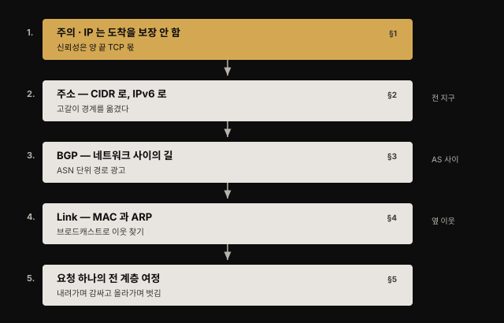
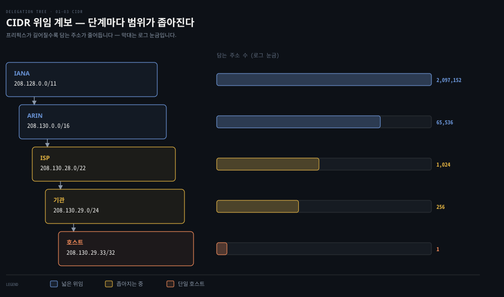
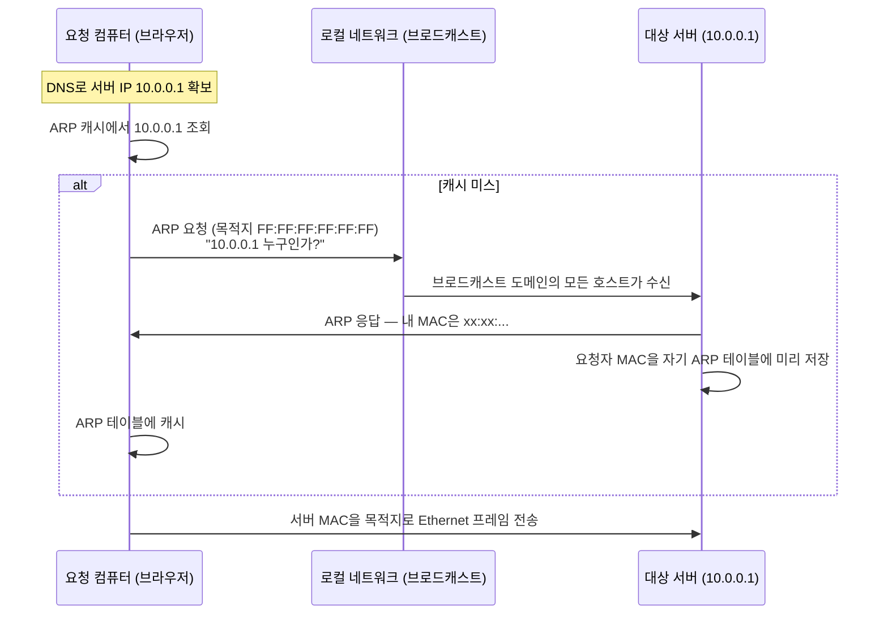
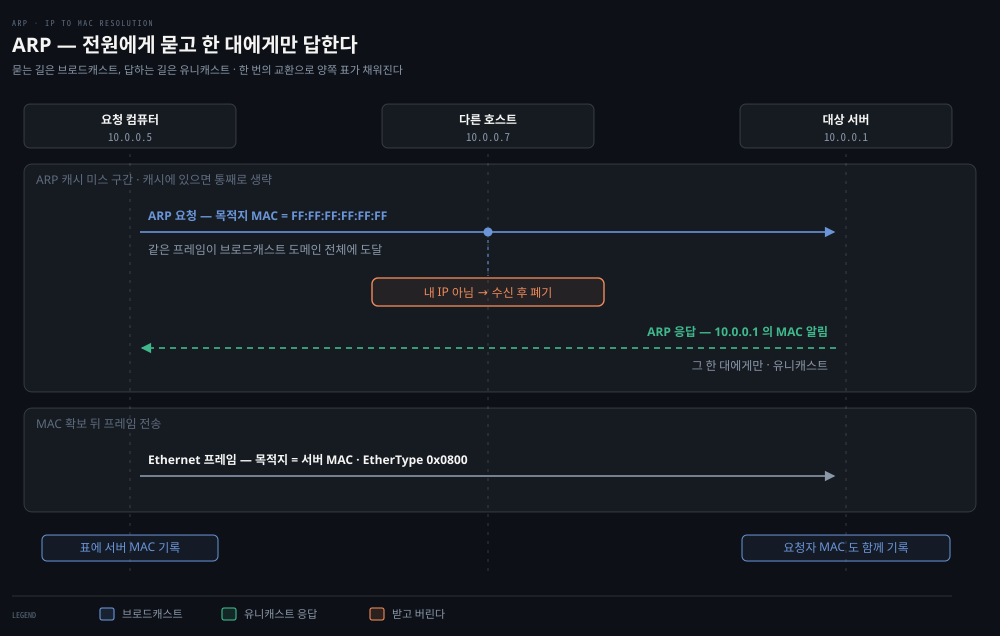
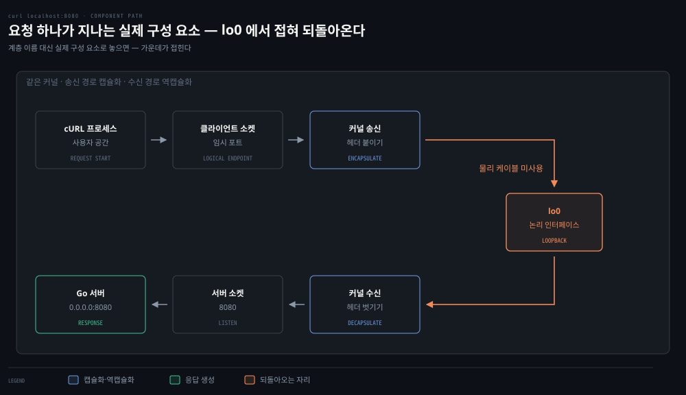
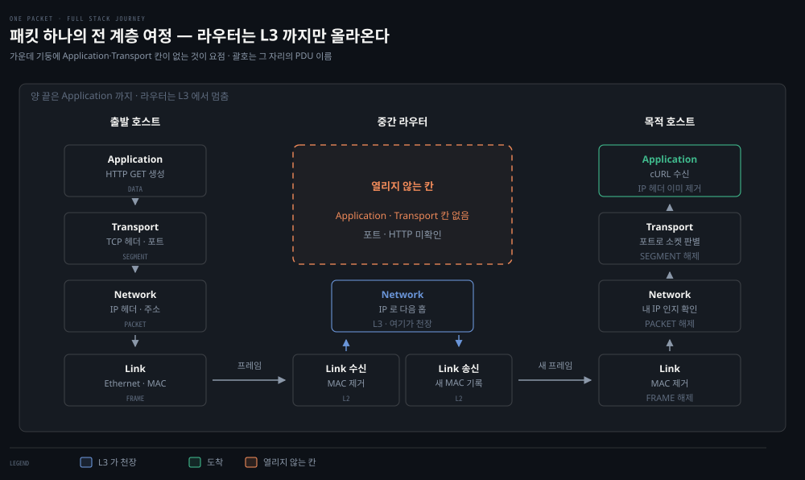

# IP·라우팅·Ethernet — 패킷이 길을 찾는 법

## 핵심 요약
> 이 편 전체가 매달린 하나의 생각은 **"패킷은 IP 주소로 목적지 네트워크를 찾고, MAC 주소로 바로 옆 이웃을 찾는다"**입니다.
>
> IP는 배달을 보장하지 않는 최선 노력(best-effort) 프로토콜이고, 네트워크 사이의 길 찾기는 BGP가, 같은 네트워크 안의 마지막 한 걸음은 ARP와 Ethernet이 맡습니다. Kubernetes가 노드 간 라우팅에 BGP(Calico)를 쓰고 오버레이 네트워크에 VXLAN을 쓰는 이유가 이 층에 있습니다.


## 학습 목표
> 주소와 라우팅을 따로 외우는 대신, 패킷 하나가 목적지까지 가는 길을 범위별로 이어서 설명할 수 있는 상태를 목표로 합니다.

이 내용을 읽고 나면:

1. IP가 신뢰성을 제공하지 않는 이유와 그 책임이 어디로 갔는지 설명할 수 있습니다.
2. 클래스풀 주소 체계가 CIDR로, 다시 IPv6로 진화한 원인을 주소 고갈 관점에서 설명할 수 있습니다.
3. BGP와 ASN이 인터넷 라우팅에서 하는 역할을 Kubernetes CNI와 연결할 수 있습니다.
4. ARP가 IP 주소를 MAC 주소로 해석하는 과정을 단계별로 추적할 수 있습니다.
5. HTTP 요청 하나가 TCP/IP 전 계층을 오르내리는 여정을 처음부터 끝까지 재구성할 수 있습니다.

아래는 이 편 전체를 "범위가 좁혀지는" 순서로 이은 지도입니다. 각 칸 위의 머리글에 그 대목을 다루는 절 번호가 붙어 있습니다. 붉은색이 칠해진 1단계가 나머지 전부를 지배하는 전제입니다. IP가 도착을 보장하지 않는다는 사실이 그것이고, 그래서 신뢰성이 양 끝단의 몫으로 남습니다. 3단계에서 길 찾기가 전 지구(BGP)에서 옆 이웃(ARP)까지 한 칸에 묶여 있는데, 둘은 다루는 거리만 다를 뿐 같은 일을 합니다.




## 1. IP — 배달을 보장하지 않는 우편 시스템
> IP는 배달을 보장하지 않습니다. 이 결정이 이 편 나머지를 지배합니다. 신뢰성 부담을 네트워크 중간이 아니라 통신 경로의 양 끝에 지운 설계입니다.

모든 TCP·UDP 데이터는 Network 계층에서 IP 패킷으로 전송됩니다. 나가는 패킷은 다음 홉(next-hop) 호스트를 골라 Link 계층으로 넘기고, 들어온 패킷은 캡슐화를 벗겨 알맞은 Transport 프로토콜로 올립니다. IP는 MTU(최대 IP 패킷 크기)에 따라 패킷을 단편화·재조립합니다.

IP의 성격을 규정하는 문장은 이것입니다 — IP는 패킷의 정상 도착을 보장하지 않습니다. 다양한 네트워크를 가로지르는 전달은 그 자체로 실패하기 쉬우므로, 그 부담을 네트워크가 아니라 통신 경로의 양 끝(Transport 계층)에 지웠습니다. 헤더 체크섬도 헤더의 정확성만 확인할 뿐 데이터 무결성은 검증하지 않습니다. 캡슐화된 프로토콜(TCP·UDP)이 자기 체크섬으로 데이터 오류를 처리합니다.

RFC 791이 정의한 IPv4 헤더에서 기억할 필드는 여섯입니다.

- Version — IPv4는 항상 4
- TTL — 8비트 수명. 라우터를 지날 때마다 1씩 줄어 패킷이 네트워크를 무한히 돌지 못하게 막습니다. TTL을 낮추면 체크섬도 다시 계산해야 합니다
- Protocol — 데이터부에 실린 프로토콜 번호. ICMP 1, TCP 6, UDP 17, OSPF 89
- Source·Destination address — 송신·수신 IPv4 주소. NAT 장비가 전송 중에 바꿀 수 있습니다
- Flags·Fragment Offset — 단편화 제어(Do not Fragment, More Fragments)와 조각 위치
- Type of Service — 처음에는 ToS였고 지금은 DSCP(Differentiated Services Code Point)로 불리는 차등 서비스 필드입니다. 라우터와 네트워크가 혼잡할 때 어느 패킷을 먼저 보낼지 판단하는 근거이며, VoIP 같은 기술이 통화를 다른 트래픽보다 앞세우는 데 씁니다

마지막 필드를 따로 기억해 둘 만합니다. 흔히 애플리케이션 레벨 관심사로 여기는 QoS가 실제로는 L3 헤더의 한 필드에서 출발하기 때문입니다.


## 2. 주소의 진화 — 클래스에서 CIDR로, 다시 IPv6로
> 주소 체계의 변화는 전부 고갈이 밀어붙인 것입니다. 클래스의 고정 경계가 낭비를 낳자 CIDR이 경계를 풀었고, 그것으로도 모자라 IPv6가 주소 길이를 늘렸습니다.

IPv4 주소는 사람에게는 점 찍은 십진수(192.168.1.2), 컴퓨터에게는 32비트 이진 문자열입니다. 앞부분이 네트워크, 뒷부분이 그 네트워크 안 호스트의 고유 식별자이고, 어디까지가 네트워크인지는 서브넷 마스크(255.255.255.0 = `0xffffff00`)가 정합니다.

초기에는 네트워크와 호스트의 경계를 클래스로 고정했습니다.

| 클래스 | 호스트부 비트 | 호스트 수 | 용도 |
|--------|--------------|-----------|------|
| A | 24비트 | 약 1,678만[^classa] | 대형 네트워크 |
| B | 16비트 | 65,536 | 중형 네트워크 |
| C | 8비트 | 256 | 소형 네트워크 |
| D | — | — | 멀티캐스트(예약) |
| E | — | — | 실험용(예약) |

이 고정 경계는 인터넷 규모에서 확장되지 않았습니다. 300개 호스트가 필요한 조직에 C(256)는 모자라고 B(65,536)는 낭비입니다.

CIDR(Classless Inter-Domain Routing)는 서브넷 경계를 클래스 범위 안 어디로든 옮길 수 있게 해 이 낭비를 줄였습니다. 책의 예시는 `208.130.29.33`의 위임 계보입니다. IANA가 `208.128.0.0/11`을 ARIN(북미 인터넷 레지스트리)에 주고, ARIN이 점점 작은 서브넷으로 쪼개 내려가 최종적으로 단일 호스트 `208.130.29.33/32`에 닿습니다.



`/N`은 네트워크부 비트 수이므로 N이 클수록 좁은 범위입니다. 그림의 왼쪽에서 오른쪽으로 갈수록 프리픽스 숫자가 커지고 담을 수 있는 주소는 줄어듭니다. 맨 왼쪽 `/11`은 호스트부가 21비트라 200만 개가 넘고, 맨 오른쪽 `/32`는 호스트부가 0비트라 주소 하나입니다. 위임이란 넓은 블록을 받은 쪽이 그 안에서 필요한 만큼만 잘라 다시 내주는 일이고, 그 과정이 몇 단계든 반복될 수 있다는 것이 이 계보가 보여 주는 바입니다.

CIDR로도 고갈을 막지 못해 IPv6가 나왔습니다. 차이의 본체는 주소 공간 크기입니다.

| 구분 | 주소 길이 | 주소 개수 |
|------|----------|----------|
| IPv4 | 32비트 | 4,294,967,296 |
| IPv6 | 128비트 | 340,282,366,920,938,463,463,374,607,431,768,211,456 |

IPv6는 표기도 16진수로 줄여 쓰며, 네트워크 접두부와 호스트라는 구조 자체는 IPv4와 비슷합니다.


## 3. BGP — 네트워크 사이의 길 찾기
> 네트워크 사이의 길 찾기는 BGP가 ASN 단위로 경로를 광고해 만듭니다. Calico가 이 구조를 클러스터 안으로 그대로 가져옵니다.

주소가 정해진 패킷이 지구 반대편 호스트까지 가는 일은 라우팅의 몫입니다. 인터넷은 BGP(Border Gateway Protocol)라는 동적 라우팅 프로토콜에 의존합니다. 인터넷의 각 네트워크는 ASN(autonomous system number)을 할당받는데, 하나의 ASN은 명확한 라우팅 정책을 가진 단일 관리 주체를 대표합니다. BGP와 ASN 덕분에 관리자는 내부 라우팅 통제권을 유지하면서 자기 경로를 요약해 인터넷에 광고할 수 있습니다.

책의 예시로 AS 100의 호스트 `130.10.1.200`이 AS 300의 `150.10.2.300`에 패킷을 보낸다고 해 봅니다. 기본 게이트웨이가 BGP로 계산해 둔 경로표에서 목적지 AS로 가는 선호 인터페이스를 찾아 다음 AS로 넘기고, 이를 반복해 목적지 라우터까지 닿습니다. 로컬 라우팅 테이블에서는 목적지가 같은 네트워크면 라우팅 없이 로컬 링크로, 모르는 네트워크면 기본 경로(default route)로 내보냅니다.

이 내용이 책에 있는 이유는 Kubernetes 때문입니다. Calico 같은 일부 컨테이너 네트워킹 프로젝트가 노드 간 클러스터 트래픽 라우팅에 BGP를 그대로 씁니다. 데이터센터 안에서 각 노드가 작은 라우터처럼 자기 Pod 대역을 광고하는 구조로, 3장에서 다시 다룹니다.

> 💬 **비유**: §1의 우편 비유를 이어 가면, ASN은 나라마다 있는 우편 사업자입니다. 각 사업자는 자기 관할 구역을 스스로 정해 운영하고, 남의 구역 배달 방식에는 관여하지 않습니다. BGP는 그 사업자들이 서로에게 "우리 쪽으로 넘기면 이 지역까지는 책임진다"를 계속 통보하는 협정입니다. 그래서 편지 한 통이 지구 반대편까지 가는 동안 어느 사업자도 전체 경로를 알지 못하지만, 각자 다음 사업자만 정확히 고르면 배달은 완성됩니다.

라우터끼리는 BGP로 경로 정보를 계속 교환합니다. 사람이 연결성을 확인할 때는 ICMP를 씁니다. `ping`은 ICMP echo(타입 8)를 보내 echo reply(타입 0)가 돌아오는지, 왕복 시간이 얼마인지 확인하는 도구입니다. 응답이 없으면 타임아웃으로 실패가 드러납니다.

ICMP는 TCP도 UDP도 쓰지 않는 IP 프로토콜 1번이며, 라우팅·진단·오류 통지 기능을 IP에 제공합니다. TCP·UDP를 쓰지 않는다는 이유로 ICMP를 Transport 계층으로 보는 시각도 있습니다. 그래도 IP 계층으로 분류하는 근거는 처리 위치입니다. ICMP 메시지는 IP 데이터그램 안에 캡슐화되지만 그 처리는 통상 IP 계층의 일부로 구현되기 때문입니다. `ping`의 echo·reply 외에 자주 만나는 메시지는 다음과 같습니다.

| 메시지 | 타입 |
|--------|------|
| Echo request | 8 |
| Echo reply | 0 |
| Destination unreachable | 3 |
| Redirect | 5 |


## 4. Link 계층 — 마지막 한 걸음은 MAC 주소로
> 라우팅이 목적지 네트워크까지 데려다주면 마지막 한 걸음이 남습니다. 그 한 걸음은 IP가 아니라 MAC 주소로 가고, 둘을 잇는 것이 ARP입니다.

라우팅으로 목적지 네트워크까지 왔으면, 이제 같은 네트워크 안에서 정확한 장비에 프레임을 건네야 합니다. TCP/IP의 Link 계층은 MAC과 LLC 두 서브계층으로 이루어져 OSI의 L1·L2를 함께 수행합니다. IEEE 802.3(Ethernet)이 IP 패킷을 캡슐화하는 프레임의 송수신 규약을 정의합니다.

두 서브계층은 맡은 일이 다릅니다.

- **MAC**: 물리 매체에 접근하는 일을 맡습니다.
- **LLC**: 흐름 제어와 상위 프로토콜의 다중화를 맡습니다. 보낼 때는 여러 상위 프로토콜을 MAC 계층 위로 실어 보내고, 받을 때는 그것을 다시 갈라냅니다.

뒤에 나오는 EtherType이 필요한 이유가 이 갈라내기입니다. 도착한 프레임의 페이로드가 IP인지 ARP인지 알아야 올바른 상위 프로토콜로 올려 보낼 수 있습니다. EtherType이 그 판별 키 역할을 합니다.

Ethernet 프레임에서 기억할 필드는 다음과 같습니다.

| 필드 | 크기 | 역할 |
|------|------|------|
| 목적지·출발지 MAC | 각 6바이트 | 프레임을 받을·보낼 NIC 식별 |
| VLAN 태그 | 4바이트(선택) | 논리적 네트워크 분리 |
| EtherType | 2바이트 | 페이로드에 실린 프로토콜 표시 |
| CRC (푸터) | 4바이트 | 수신 측에서 프레임 손상 탐지 |

MAC 주소는 제조 시점에 NIC에 부여되며 조직 식별자(OUI)와 NIC 고유부로 나뉩니다. EtherType 값 중 Kubernetes에서 주로 만나는 것은 IPv4용 `0x0800`과 ARP용 `0x0806`입니다.

IP 주소에서 MAC 주소로의 해석은 ARP(Address Resolution Protocol)가 맡습니다.



같은 교환을 오가는 주체와 저장되는 자리까지 펼치면 이렇게 됩니다.



윗줄이 묻는 길이고 아랫줄이 답하는 길입니다. 물을 때는 목적지 MAC을 모르니 `FF:FF:FF:FF:FF:FF`로 **전원에게** 뿌리고, 답할 때는 상대 MAC을 알았으니 **그 한 대에게만** 보냅니다. 브로드캐스트와 유니캐스트가 한 번의 교환 안에서 갈리는 셈입니다. 위 오른쪽의 `다른 호스트`가 하는 일이 §앞에서 본 부담의 실체입니다. 자기 IP가 아니어서 버릴 뿐이지, 받는 일 자체는 피하지 못합니다.

응답하는 쪽도 한 가지 일을 더 합니다. 서버는 응답을 보내면서 요청자의 MAC을 자기 ARP 테이블에 함께 넣어 둘 수 있습니다. 그래서 곧 이어질 응답 트래픽에서는 ARP를 한 번 더 돌리지 않아도 됩니다. 요청은 한쪽 방향으로 가지만 통신은 양방향이므로, 한 번의 교환으로 양쪽이 서로의 MAC을 확보하는 셈입니다.

ARP 요청은 `FF:FF:FF:FF:FF:FF`로 브로드캐스트되므로 같은 브로드캐스트 도메인의 모든 호스트가 받습니다. 부담은 ARP에서 끝나지 않습니다. 브로드캐스트 도메인 안에서는 모든 프레임이 모든 노드에 전달되고, 각 호스트가 목적지 MAC을 자기 것과 대조해 자기 앞으로 온 게 아니면 버립니다. 받아서 버리는 일 자체가 모든 호스트의 몫이라, 호스트가 늘수록 각자가 처리해야 할 남의 프레임도 함께 늘어납니다. 네트워크 엔지니어가 VLAN 태그로 L2 네트워크를 분할해 브로드캐스트를 가두고 보안·혼잡을 관리하는 이유가 여기 있습니다.

VLAN을 확장한 것이 VXLAN입니다. L2 프레임을 L4 UDP 패킷에 캡슐화해, IP 네트워크를 가로질러 L2 인접성을 만들고 논리 네트워크를 1,600만 개까지 확장합니다. Kubernetes 오버레이 네트워크가 바로 이 기술 위에 서 있습니다 — 서로 다른 노드의 Pod들이 같은 L2에 있는 것처럼 통신하는 마법의 정체가 VXLAN 캡슐화입니다.

프레임은 원래 로컬 네트워크 경계를 넘지 못합니다(§4 첫머리의 Data Link 성질). 그런데 그 프레임을 통째로 UDP 패킷의 페이로드로 감싸면, 바깥에서 보기에는 노드와 노드 사이를 오가는 평범한 IP 트래픽이라 라우터가 정상적으로 전달합니다. 목적지 노드에서 껍데기를 벗기면 안에서 원래 프레임이 그대로 나오고, 그것을 받은 Pod 입장에서는 같은 로컬 네트워크에서 온 프레임과 구별되지 않습니다. 건너뛴 구간은 감싸는 동안 없던 일이 되는 셈입니다.

### 직접 해 보기 — 내 호스트의 L2·L3를 읽기

이 절의 개념은 전부 지금 쓰는 노트북에서 확인됩니다. 세 명령이면 IP·게이트웨이·MAC이 한 번에 드러납니다.

```bash
# 1. 내 주소와 마스크, 그리고 NIC 의 MAC 주소
ifconfig en0        # Linux 는 ip addr show

# 2. 목적지별로 어디로 내보내는가 — 맨 위 default 행이 기본 경로다
netstat -rn         # Linux 는 ip route

# 3. 같은 네트워크에서 이미 알아낸 이웃들의 IP↔MAC 매핑
arp -a
```

읽는 순서가 곧 이 편의 순서입니다. `netstat -rn` 의 `default` 행에 적힌 게이트웨이가 §3에서 말한 "모르는 네트워크로 가는 출구"이고, `arp -a` 에 그 게이트웨이 IP가 MAC과 함께 들어 있으면 §4의 ARP가 이미 한 번 돌았다는 뜻입니다. 두 출력에 같은 IP가 등장하는 것을 확인하면 L3의 다음 홉과 L2의 실제 수신자가 어떻게 이어지는지가 눈에 들어옵니다.

캐시가 비어 있으면 만들어 볼 수도 있습니다. 게이트웨이로 `ping` 을 한 번 보낸 뒤 `arp -a` 를 다시 실행하면 방금 해석된 항목이 새로 들어와 있습니다.

> 💬 **비유**: VXLAN은 봉투 안에 봉투를 넣는 일입니다. 안쪽 편지(L2 프레임)에는 "같은 동네 3번지"처럼 동네 안에서만 통하는 주소가 적혀 있어 그대로는 다른 도시로 못 보냅니다. 그 편지를 도시 간 배송이 되는 바깥 봉투(UDP 패킷)에 넣어 부치면 우편망이 문제없이 실어 나르고, 받는 쪽에서 바깥 봉투를 뜯으면 안쪽 편지가 원형 그대로 나옵니다. 받는 사람은 이 편지가 옆집에서 왔는지 다른 도시에서 왔는지 알 수 없습니다.


## 5. 웹 서버 재방문 — 요청 하나의 전 계층 여정
> 세 편에서 나눠 본 계층을 하나의 요청으로 다시 잇습니다. 송신은 내려가며 감싸고 수신은 올라가며 벗기며, 그 과정에서 IP가 사라지는 지점이 실무 문제를 만듭니다.

이제 1장의 처음으로 돌아가 cURL 요청 하나를 전 계층으로 설명할 수 있습니다.

1. cURL이 URL에서 IP와 포트를 알아내고 TCP 핸드셰이크로 연결을 수립합니다. 서버에는 8080 소켓, 클라이언트에는 임시 포트 소켓이 만들어집니다.
2. HTTP 요청이 Network 계층으로 내려가 출발지·목적지 IP가 패킷 헤더에 붙습니다.
3. Data Link 계층에서 NIC의 출발지 MAC이 프레임에 붙고, 목적지 MAC을 모르면 ARP로 알아낸 뒤 NIC가 프레임을 전송합니다.
4. 서버는 응답 패킷을 만들어 요청 패킷의 출발지 IP로 되돌려 보냅니다.
5. 클라이언트 쪽에서 역순으로 벗겨집니다 — L2에서 MAC 제거, L3에서 IP 확인 후 제거, L4에서 TCP 데이터로 소켓을 판별해 cURL 프로세스에 전달합니다.

마지막 단계에서 임시 포트가 어떻게 쓰이는지 짚어 둘 만합니다. 서버가 기동할 때 8080 소켓을 만들었듯, 클라이언트도 연결을 열 때 임의의 포트 번호로 자기 소켓을 만듭니다. 응답이 돌아오면 커널은 TCP 데이터에서 이 소켓을 판별해 그 소켓을 만든 프로세스에 패킷을 넘깁니다. 여기서 소켓 ID는 cURL 프로세스에 대응하는 임의값이었고, 그래서 도착한 패킷들이 다른 프로세스가 아닌 cURL로 모여 하나의 HTTP 응답으로 조립됩니다. §1에서 본 "포트가 어느 프로세스의 트래픽인지 가린다"는 말이 실제로 실행되는 지점이 여기입니다.

계층 이름 대신 **실제로 존재하는 구성 요소**로 같은 여정을 놓으면 이렇게 됩니다. 앞의 실습에서 `curl localhost:8080`을 쳤을 때 요청이 실제로 지나간 것들입니다.



윗줄이 내려가는 길이고 아랫줄이 올라오는 길입니다. 눈여겨볼 것은 **가운데가 접힌다**는 점입니다. `localhost` 요청이라 패킷은 물리 케이블로 나가지 않고 `lo0`에서 그대로 되돌아옵니다. 그래서 같은 커널이 송신 경로에서 헤더를 붙이고 수신 경로에서 그 헤더를 벗기며, 실습에서 `tcpdump -i lo0`으로 잡을 수 있었던 것도 이 지점입니다. 양 끝의 프로세스는 자기 소켓만 알 뿐 그 사이에서 벌어진 일을 모릅니다.

같은 여정을 계층 이름으로 다시 보면 아래와 같습니다. 위 그림의 구성 요소가 각각 어느 계층에 해당하는지 짝지어 보면 좋습니다.



여기서 실무 포인트 하나가 나옵니다. IP 주소는 L3에서 제거되므로 애플리케이션이 클라이언트 IP를 알아야 한다면 Application 계층에 저장해야 합니다. HTTP의 `X-Forwarded-For` 헤더가 그 대표 사례입니다 — 프록시·로드밸런서 뒤에서 원 클라이언트 IP를 보존하는 표준적인 방법입니다. Kubernetes의 Ingress 뒤에 선 앱이 클라이언트 IP를 찾을 때 다시 만나게 됩니다.


## 심화 학습
> 책 밖에서 보강한 내용입니다. 출처를 함께 남깁니다.

- VXLAN의 정식 명세는 [RFC 7348](https://datatracker.ietf.org/doc/html/rfc7348)입니다. 24비트 VNI(VXLAN Network Identifier)가 논리 네트워크 1,600만 개(2^24)의 근거입니다. VLAN ID는 12비트라 4,096개가 한계인 점과 대비해 두면 기억하기 쉽습니다.
- Calico가 BGP를 쓰는 방식은 [Calico 공식 문서 — BGP 개요](https://docs.tigera.io/calico/latest/networking/configuring/bgp)에 정리돼 있습니다. 각 노드가 자기 Pod CIDR을 BGP로 광고해 캡슐화 없는(non-overlay) 라우팅을 만들 수 있다는 점이 VXLAN 오버레이와의 근본 차이입니다.
- 클라이언트 IP 보존 문제는 K8s에서 `externalTrafficPolicy`·프록시 프로토콜과 얽혀 더 복잡해집니다. 형제 정독본의 [11-02 외부 노출 — 트래픽 정책](../kubernetes-in-action/11-02.%EC%99%B8%EB%B6%80%20%EB%85%B8%EC%B6%9C%20%E2%80%94%20NodePort%C2%B7LoadBalancer%C2%B7%ED%8A%B8%EB%9E%98%ED%94%BD%20%EC%A0%95%EC%B1%85.md)이 그 이야기를 다룹니다.


## 결정 치트시트
> 이 편의 도구를 "무엇이 안 될 때 무엇을 치는가"로 압축했습니다.

| 확인하고 싶은 것 | 도구 | 보는 것 |
|-----------------|------|--------|
| 상대 호스트까지 도달하는가 | `ping <ip>` | ICMP echo reply 여부·손실률·왕복 시간 |
| 어느 경로로 나가는가 | `netstat -r` (라우팅 테이블) | 목적지별 게이트웨이·인터페이스, 기본 경로 |
| 같은 네트워크 이웃을 아는가 | `arp -a` | IP↔MAC 매핑 캐시 |
| L2에서 무슨 일이 벌어지나 | `sudo tcpdump -i <if> arp` | ARP 요청·응답 흐름 |
| 내 주소·마스크가 무엇인가 | `ifconfig` / `ip addr` | inet 주소, netmask, MAC(ether) |


## 면접에서 받을 만한 질문

> 먼저 스스로 답을 소리 내어 말해 본 뒤, 아래 §정답 섹션을 펼쳐 맞춰 봅니다.

1. CIDR을 한 문장으로 정의하면? 클래스풀 주소 체계의 무엇을 해결했습니까?
2. IP가 best-effort라는 말의 뜻과, 신뢰성 책임이 어디로 갔는지 설명해 보세요.
3. TTL은 왜 필요하고, traceroute는 그것을 어떻게 역이용합니까?
4. 애플리케이션에서 클라이언트 IP가 프록시 IP로 보이는 이유는? 어떻게 원 IP를 보존합니까?
5. Kubernetes에서 BGP는 어디에 쓰이며, VXLAN 오버레이와 무엇이 다릅니까?
6. 브로드캐스트 도메인이 커지면 왜 부담이 되고, VLAN 분할이 그것을 어떻게 줄입니까?

### 빈칸 채우기 — L2/L3 주소 역할

패킷은 목적지 *네트워크*를 `(1)____` 주소로 찾고, 같은 네트워크 안 바로 옆 이웃은 `(2)____` 주소로 찾습니다. IP를 MAC으로 해석하는 프로토콜은 `(3)____`입니다. VLAN의 12비트(4,096개)를 24비트(1,600만 개)로 확장한 것이 `(4)____`입니다.


## 정답 (자답 후 펼치기)

> 위 §면접에서 받을 만한 질문의 6개에 *먼저 자답한 뒤* 아래를 읽으세요. 자답 없이 먼저 읽으면 학습 효과가 0입니다.

### 정답 1 — CIDR 정의

CIDR은 클래스로 고정돼 있던 네트워크-호스트 경계를 임의 비트 위치로 옮겨, 필요한 만큼만 주소 블록을 위임할 수 있게 한 주소 체계입니다. 클래스풀은 300개 호스트에 C(256)는 모자라고 B(65,536)는 낭비하는 식으로 주소를 낭비했는데, CIDR은 `/N` 프리픽스로 경계를 자유롭게 잡아 이 낭비를 줄였습니다.

### 정답 2 — IP best-effort

IP는 패킷의 도착을 보장하지 않고 데이터 무결성도 검증하지 않습니다(헤더 체크섬은 헤더만 확인). 다양한 네트워크를 가로지르는 전달은 그 자체로 실패하기 쉬우므로, 신뢰성 책임을 네트워크가 아니라 통신 경로의 양 끝단(Transport 계층의 TCP)에 지웠습니다.

### 정답 3 — TTL과 traceroute

TTL은 라우팅 루프에 빠진 패킷이 네트워크를 무한히 돌지 못하게 합니다. 라우터를 지날 때마다 1씩 줄고 0이 되면 폐기되며, 그때 발신자에게 ICMP time exceeded가 돌아갑니다. traceroute는 TTL을 1부터 하나씩 올려 보내, 각 홉이 되돌려 주는 ICMP로 경로를 한 홉씩 그려 냅니다.

### 정답 4 — 클라이언트 IP 보존

패킷의 출발지 IP는 홉을 대신 맺는 프록시·로드밸런서의 것으로 바뀌고, 원래 IP는 L3를 벗어나며 사라집니다. 그래서 원 클라이언트 IP는 `X-Forwarded-For`처럼 Application 계층 헤더에 실어 보존합니다. Kubernetes에서는 Ingress 뒤 앱이 클라이언트 IP를 찾을 때 이 문제를 만납니다.

### 정답 5 — K8s에서 BGP vs VXLAN

Calico 같은 CNI가 노드 간 Pod 트래픽 라우팅에 BGP를 씁니다. 각 노드가 자기 Pod 대역을 BGP로 광고하면 캡슐화 오버헤드 없이 순수 라우팅으로 Pod 간 통신이 됩니다. VXLAN 오버레이는 반대로 L2 프레임을 UDP에 캡슐화해 IP 네트워크 위에 L2 인접성을 만드는 방식이라, 캡슐화 오버헤드가 있는 대신 하부 네트워크 제약에서 자유롭습니다.

### 정답 6 — 브로드캐스트 도메인의 부담

부담은 ARP 요청을 모든 호스트가 받는 데서 그치지 않습니다. 도메인 안에서는 모든 프레임이 모든 노드에 전달됩니다. 각 호스트는 목적지 MAC을 자기 것과 대조해 자기 앞이 아니면 버립니다. 받아서 버리는 일 자체를 모든 호스트가 하므로 호스트가 늘수록 각자가 처리할 남의 프레임도 함께 늘어납니다.

VLAN 태그로 L2를 나누면 브로드캐스트가 그 안에 갇힙니다. 각 도메인의 호스트 수가 줄고 그만큼 불필요한 수신·폐기도 줄어듭니다.

### 정답 빈칸 — (1)`IP` (2)`MAC` (3)`ARP` (4)`VXLAN`

목적지 네트워크는 `IP`(L3), 바로 옆 이웃은 `MAC`(L2)으로 찾고, IP를 MAC으로 해석하는 것이 `ARP`, VLAN을 24비트로 확장한 것이 `VXLAN`입니다.


## 핵심 개념 체크리스트
> 일곱 항목을 막힘없이 답할 수 있으면 2장으로 넘어가도 좋습니다.
- [ ] IP가 신뢰성을 제공하지 않는 이유와 책임 소재를 말할 수 있는가?
- [ ] `/24` 같은 CIDR 표기에서 네트워크·호스트 범위를 계산할 수 있는가?
- [ ] ASN과 BGP의 관계를 한 문장으로 설명할 수 있는가?
- [ ] ARP 캐시 미스 시 브로드캐스트 요청 흐름을 그릴 수 있는가?
- [ ] VLAN과 VXLAN의 차이(태그 vs UDP 캡슐화, 4천 vs 1,600만)를 아는가?
- [ ] MAC·LLC 서브계층의 역할과 EtherType이 하는 일을 구분할 수 있는가?
- [ ] HTTP 요청 하나의 전 계층 여정을 송신·수신 양방향으로 재구성할 수 있는가?


## 참고 자료
- 《Networking and Kubernetes: A Layered Approach》(James Strong·Vallery Lancey, O'Reilly, 2021, ISBN 978-1492081654) Ch1
- [RFC 791 — Internet Protocol](https://datatracker.ietf.org/doc/html/rfc791)
- [RFC 7348 — VXLAN](https://datatracker.ietf.org/doc/html/rfc7348)
- 이전 편: [01-02. HTTP에서 TCP·TLS·UDP까지](./01-02.HTTP%EC%97%90%EC%84%9C%20TCP%C2%B7TLS%C2%B7UDP%EA%B9%8C%EC%A7%80%20%E2%80%94%20Transport%20%EA%B3%84%EC%B8%B5%20%ED%95%B4%EB%B6%80.md)
- 다음 편: [01-04. 패킷 캡처 실습](./01-04.%ED%8C%A8%ED%82%B7%20%EC%BA%A1%EC%B2%98%20%EC%8B%A4%EC%8A%B5%20%E2%80%94%201%EC%9E%A5%20%EA%B0%9C%EB%85%90%EC%9D%84%20%EB%88%88%EC%9C%BC%EB%A1%9C%20%ED%99%95%EC%9D%B8%ED%95%98%EA%B8%B0.md) — 이 편의 ARP·Ethernet 을 직접 캡처해 확인하는 실습편

[^classa]: Class A 호스트부는 24비트이므로 실제 호스트 수는 2^24 = 16,777,216(약 1,678만)입니다. 책 본문은 이 대목을 "2 to the power of 16"으로 오기했으나(같은 문장에서 결과값은 16,777,216으로 맞게 적음), 정확한 값은 2^24입니다. 노트는 정확한 2^24를 따릅니다.
