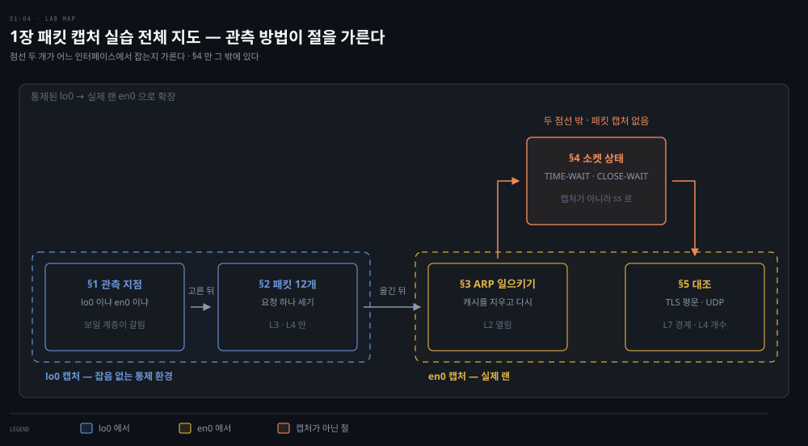
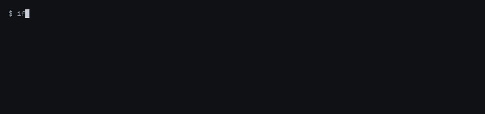
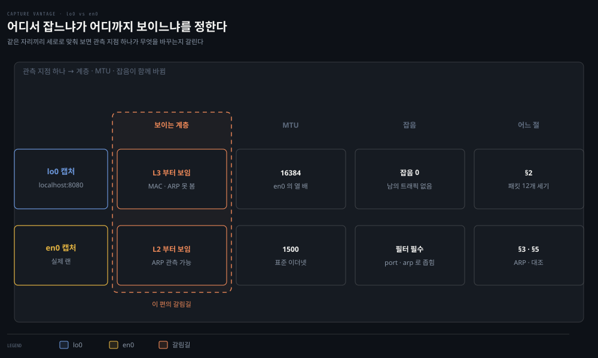
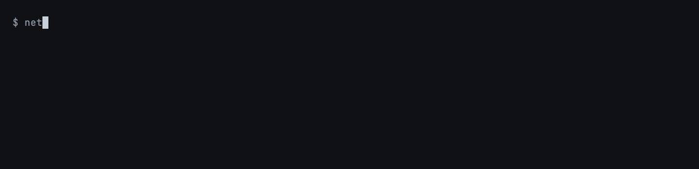

# 패킷 캡처 실습 — 1장 개념을 눈으로 확인하기

> 1장에서 읽은 핸드셰이크·ARP·TLS·UDP를 직접 캡처해 확인하는 실습편입니다. 순서에는 이유가 있습니다. 잡음이 없는 루프백에서 패킷 수를 정확히 센 다음, 루프백이 보여 주지 못하는 Link 계층을 실제 인터페이스에서 봅니다.

## 핵심 요약

> 실습의 결론을 먼저 적습니다. 본문은 이 세 가지를 확인하는 과정입니다.

- **관측 지점이 보이는 계층을 결정합니다**: 루프백에는 MAC 주소가 없어 ARP와 Ethernet 프레임을 볼 수 없습니다. 1장 후반부는 실제 인터페이스에서만 확인됩니다.
- **신뢰성의 비용은 세어서 확인합니다**: "Hello" 하나에 12개 패킷이 오가고 그중 데이터는 2개뿐이라는 계산은, 잡음이 없는 루프백에서만 정확히 재현됩니다.
- **암호화의 경계는 눈에 보입니다**: TLS 핸드셰이크 앞부분은 평문이라 접속 대상 도메인이 그대로 읽힙니다. 어디부터 읽히지 않는지가 곧 ChangeCipherSpec 지점입니다.


## 학습 목표

> 이 편을 마치면 아래 다섯 가지를 스스로 해낼 수 있습니다.

1. 관찰하려는 계층에 맞는 인터페이스를 고르고, 왜 그 인터페이스여야 하는지 설명할 수 있습니다.
2. 루프백에서 요청 한 번의 패킷을 세어 12개라는 계산을 재현하고, 어긋날 때 원인을 좁힐 수 있습니다.
3. ARP 캐시를 지워 주소 해석을 일부러 일으키고, 브로드캐스트 질의와 유니캐스트 응답을 구분해 읽을 수 있습니다.
4. TIME-WAIT와 CLOSE-WAIT를 각각 의도적으로 만들어, 둘이 어느 쪽에 생기는지 확인할 수 있습니다.
5. TLS와 UDP를 같은 방식으로 캡처해, 암호화 비용과 신뢰성 비용을 패킷 수로 비교할 수 있습니다.

아래는 이 편 전체를 실습 순서로 이은 지도입니다. 각 단계 옆의 절 번호가 본문에서 그것을 다루는 곳입니다. 통제된 환경에서 시작해 실제 환경으로 넓히고, 마지막에 다른 프로토콜과 견주는 흐름입니다.




## 1. 준비 — 무엇을 어디서 볼 것인가

> 실습에서 가장 먼저 정할 것은 명령이 아니라 관측 지점입니다. 인터페이스를 잘못 고르면 보려는 계층이 아예 캡처에 나타나지 않습니다.

`tcpdump`는 지정한 인터페이스를 지나는 프레임을 그대로 떠 옵니다. 그래서 그 인터페이스에 없는 것은 어떤 옵션을 붙여도 나오지 않습니다. 루프백과 실제 인터페이스의 차이가 여기서 갈립니다.

```bash
# 1. MAC 주소가 있는지 개수로 봅니다. lo0 은 0, en0 은 1 이 나옵니다
ifconfig lo0 | grep -cE '^[[:space:]]*ether'
ifconfig en0 | grep -cE '^[[:space:]]*ether'

# 2. MTU 를 나란히 비교합니다
ifconfig lo0 | grep -o 'mtu [0-9]*'
ifconfig en0 | grep -o 'mtu [0-9]*'
```



앞의 두 줄이 `0`과 `1`로 갈리는 것이 이 실습의 출발점입니다. MAC 주소값 자체는 볼 필요가 없어 개수만 셌습니다.

작성 시점 환경에서 `lo0`에는 `ether` 줄이 아예 없었고 MTU는 16384였습니다. `en0`에는 `ether` 줄이 있었고 MTU는 1500이었습니다. `ether` 줄이 없다는 것은 그 인터페이스에 MAC 주소가 없다는 뜻입니다. MAC이 없으면 ARP도 Ethernet 프레임도 존재하지 않습니다. 01-03에서 읽은 Link 계층 내용을 루프백에서 확인할 수 없는 이유가 이것입니다.

MTU 차이도 결과를 바꿉니다. 루프백은 한 번에 16KB를 실어 나를 수 있어 웬만한 응답은 분할되지 않지만, 1500바이트로 잘리는 실제 인터페이스에서는 같은 응답이 여러 세그먼트로 나뉩니다. 패킷 수를 세는 실습을 루프백에서 하는 이유가 여기에도 있습니다.



윗줄이 루프백 경로이고 아랫줄이 실제 인터페이스 경로입니다. 오른쪽 끝에서 아래로 내려오는 화살표가 이 실습의 순서를 뜻합니다. 루프백에서 셀 수 있는 것을 먼저 세고, 거기서 보이지 않던 층을 실제 인터페이스에서 봅니다. 대신 아랫줄 왼쪽 끝이 말하듯 실제 인터페이스에는 남의 트래픽이 섞이므로 필터가 필수입니다.

### 캡처 전에 알아 둘 세 가지

- **권한**: 패킷 캡처 장치인 `/dev/bpf0`은 root 전용이라 모든 `tcpdump` 실행에 `sudo`가 필요합니다.
- **필터**: 실제 인터페이스는 잡음이 많습니다. `port 8080`이나 `arp` 같은 필터를 걸지 않으면 찾으려는 패킷이 묻힙니다.
- **저장**: `-w`로 파일에 남기면 `-r`로 몇 번이든 다시 읽을 수 있습니다. 세다가 놓쳤을 때 재캡처가 필요 없습니다.

```bash
# 저장해 두고 나중에 다시 읽는 형태를 기본으로 씁니다
sudo tcpdump -i lo0 -n port 8080 -w /tmp/loop.pcap
```

```bash
# 저장한 캡처를 다시 읽습니다. -n 은 이름 역조회를 꺼 출력을 빠르고 단순하게 합니다
tcpdump -r /tmp/loop.pcap -n
```


## 2. 루프백 — 요청 하나의 패킷을 세기

> 01-02 §4의 12패킷 계산을 재현하는 단계입니다. 잡음이 0이므로 세는 값이 계산과 정확히 맞아야 하고, 어긋나면 그 자체가 단서입니다.

01-01에서 만든 Go 웹 서버를 그대로 씁니다. 터미널을 셋 띄워 캡처와 서버와 클라이언트를 나눕니다.

```bash
# 터미널 A — 캡처 먼저 켭니다. 서버보다 늦게 켜면 핸드셰이크를 놓칩니다
sudo tcpdump -i lo0 -n port 8080 -w /tmp/loop.pcap
```

```bash
# 터미널 B — 1장의 Go 웹 서버를 띄웁니다
go run main.go
```

```bash
# 터미널 C — 요청 한 번만 보내고 바로 끝냅니다
curl localhost:8080
```

요청이 끝나면 터미널 A에서 `Ctrl+C`를 눌러 캡처를 멈춥니다. 마지막 줄의 `packets captured` 값이 1차 결과이고, 이어서 내용을 읽습니다. 저장한 파일을 읽는 것은 root 권한이 필요 없습니다.

```bash
tcpdump -r /tmp/loop.pcap -n
```

이 절의 실행 장면은 `_assets/01-04.loopback-capture.tape`로 두었습니다. 라이브 캡처는 root 권한이 필요해 미리 구워 두지 못했습니다. `sudo -v`로 자격 증명을 캐시한 뒤 `vhs 01-04.loopback-capture.tape`를 실행하면 캡처부터 계수까지 한 장면으로 남습니다.

12개가 나와야 하고, 그 구성은 수립 3개, 수립 직후 서버의 ACK 1개, 데이터 2개, 데이터에 대한 ACK 2개, 종료 4개입니다. 플래그 표기는 `[S]`가 SYN, `[S.]`가 SYN-ACK, `[.]`가 ACK, `[P.]`가 데이터 푸시, `[F.]`가 FIN-ACK입니다.

### 숫자가 어긋날 때 무엇을 의심하나

세어 본 값이 12가 아니어도 실패가 아닙니다. 어긋난 방향이 원인을 가리킵니다.

- **12보다 많다면** 캡처 창에 다른 요청이 섞였을 가능성이 큽니다. `curl`을 한 번만 보냈는지, 브라우저나 다른 터미널이 같은 포트를 건드리지 않았는지 봅니다.
- **12보다 적다면** 캡처를 늦게 켜서 앞쪽 핸드셰이크를 놓쳤거나, `Ctrl+C`가 빨라 종료 4개를 못 받았을 수 있습니다.
- **체크섬이 `incorrect`로 뜬다면** 정상입니다. 송신 패킷의 체크섬은 NIC이 나중에 채우는데 캡처가 그 전에 뜨기 때문이며, 01-02에 적어 둔 그대로입니다.

이 단계에서 확인하려는 것은 12라는 숫자 자체가 아니라 **데이터가 2개뿐**이라는 비율입니다. 나머지 10개가 신뢰성의 값이라는 01-02의 결론을 자기 눈으로 확인하는 자리입니다.


## 3. 실제 인터페이스 — ARP를 일부러 일으키기

> 루프백이 보여 주지 못한 Link 계층을 여는 단계입니다. ARP는 캐시에 답이 있으면 일어나지 않으므로, 관찰하려면 캐시를 비워 일부러 유발해야 합니다.

먼저 대상을 정합니다. 같은 브로드캐스트 도메인 안에 있어야 하므로 기본 게이트웨이가 가장 확실합니다.

```bash
# 기본 게이트웨이 주소를 확인합니다. 아래에서 <GATEWAY_IP> 자리에 넣습니다
netstat -rn -f inet | awk '$1=="default"{print $2}'
```

```bash
# 현재 ARP 캐시를 봅니다. 출력은 "? (IP) at MAC on en0 ifscope [ethernet]" 형태입니다
arp -a
```

캡처를 먼저 켜고 캐시를 지우는 순서가 중요합니다. 반대로 하면 다른 트래픽이 캐시를 즉시 다시 채워 관찰 기회를 놓칩니다.

```bash
# 터미널 A — MAC 주소를 보려면 -e 가 필요합니다. arp 필터로 잡음을 걷어냅니다
sudo tcpdump -i en0 -e -n arp
```

```bash
# 터미널 B — 캐시를 지운 뒤 한 번만 찔러 봅니다
sudo arp -d <GATEWAY_IP>
ping -c 1 <GATEWAY_IP>
```

질의는 목적지 MAC이 `ff:ff:ff:ff:ff:ff`인 브로드캐스트로 나가고, 응답은 게이트웨이의 MAC에서 우리 MAC으로 곧장 돌아옵니다. 01-03에서 그린 ARP 도식의 윗줄과 아랫줄이 이 두 줄에 대응합니다. 묻는 길은 전원에게, 답하는 길은 한 대에게라는 비대칭이 출력에 그대로 드러납니다.

```bash
# 캐시가 다시 채워졌는지 확인합니다
arp -a | grep <GATEWAY_IP>
```

이 절도 테이프를 `_assets/01-04.arp-resolution.tape`에 두었습니다. 다만 구운 GIF는 공개 저장소에 넣지 않습니다. ARP 출력에는 이 랜의 게이트웨이 주소와 양쪽 MAC이 그대로 찍히기 때문입니다. 화면으로 확인한 뒤 지우거나 비공개 경로로 옮깁니다.

### 여기서만 보이는 것

루프백에서는 존재하지 않던 정보가 이 캡처에 붙습니다. `-e`를 붙였을 때 각 줄 앞에 출발지와 목적지 MAC이 나오는데, 이것이 Ethernet 헤더입니다. 같은 명령을 `lo0`에 대고 실행하면 MAC 자리가 비어 있습니다. 두 인터페이스에서 같은 옵션을 써 보고 출력을 비교하면 §1의 관측 지점 이야기가 손에 잡힙니다.


## 4. 상태 기계 — TIME-WAIT와 CLOSE-WAIT를 각각 만들기

> 01-02의 연결 종료 두 경로를 재현합니다. 두 상태는 생기는 쪽이 서로 다르고, 그 차이가 실무에서 진단의 갈림길이 됩니다.

연결 상태는 캡처가 아니라 `netstat`으로 봅니다. 상태 열에 ESTABLISHED, TIME_WAIT, CLOSE_WAIT 같은 값이 그대로 나옵니다.

```bash
# 8080 포트가 붙은 연결만 추립니다
netstat -an -p tcp | grep 8080
```

TIME-WAIT는 먼저 닫는 쪽에 남습니다. `curl`은 응답을 받고 스스로 연결을 끊으므로, 반복해서 호출하면 클라이언트 쪽에 쌓이는 것을 볼 수 있습니다.

```bash
# 짧은 간격으로 여러 번 호출한 뒤 곧바로 상태를 봅니다
for i in $(seq 1 20); do curl -s localhost:8080 > /dev/null; done
netstat -an -p tcp | grep 8080 | grep TIME_WAIT | wc -l
```

이 값이 잠시 뒤 저절로 0으로 돌아가는 것까지 확인하면 좋습니다. TIME-WAIT는 상대의 응답을 기다리는 상태가 아니라 정해진 시간을 흘려보내는 상태라, 아무 일도 하지 않아도 시간이 지나면 사라집니다.

### CLOSE-WAIT는 일부러 만들어야 보입니다

CLOSE-WAIT는 정상적으로 동작하는 서버에서는 거의 관찰되지 않습니다. 상대의 FIN을 받은 뒤 우리 애플리케이션이 `close`를 호출하기 전까지만 머무는 칸이라, 제대로 닫는 코드에서는 순식간에 지나갑니다. 그래서 관찰하려면 닫지 않는 서버가 필요합니다.

```go
// 관찰용으로만 쓰는 서버입니다. 연결을 받고 닫지 않아 CLOSE-WAIT 를 남깁니다
package main

import (
	"fmt"
	"net"
)

func main() {
	ln, _ := net.Listen("tcp", ":9090")
	for {
		conn, err := ln.Accept()
		if err != nil {
			continue
		}
		// 일부러 conn.Close() 를 호출하지 않습니다.
		// 상대가 끊어도 우리 쪽 소켓이 CLOSE-WAIT 에 머뭅니다.
		fmt.Println("accepted:", conn.RemoteAddr())
	}
}
```

이 서버를 띄우고 `nc`로 붙었다 끊은 뒤 상태를 보면 됩니다.

```bash
# 1. 붙기 전 상태를 봅니다. LISTEN 한 줄만 있습니다
netstat -an -p tcp | grep 9090

# 2. 붙었다가 곧바로 끊습니다. 빈 입력을 주어 바로 닫히게 합니다
nc -w1 localhost 9090 < /dev/null

# 3. 다시 봅니다. 한 연결의 양쪽이 서로 다른 칸에 앉아 있습니다
netstat -an -p tcp | grep 9090
```



세 번째 출력이 이 실습의 핵심입니다. 같은 연결의 서버 쪽은 `CLOSE_WAIT`에, 클라이언트 쪽은 `FIN_WAIT_2`에 앉아 있습니다. 01-02의 종료 두 경로 도식에서 위아래로 갈렸던 두 갈래가 한 화면에 나란히 잡힌 것입니다. 클라이언트는 자기 몫을 끝내고 상대의 FIN을 기다리는 중이고, 서버는 그 FIN을 보내 줄 `close` 호출을 기다리는 중입니다.

이 실습의 값어치는 진단 감각에 있습니다. 서버에 CLOSE-WAIT가 쌓여 있다면 상대는 이미 끊었는데 우리 코드가 소켓을 닫지 않고 있다는 뜻입니다. 네트워크가 아니라 커넥션 누수를 찾아야 한다는 신호이며, 방금 만든 서버가 바로 그 버그의 최소 재현입니다. 확인이 끝나면 서버를 반드시 종료합니다.


## 5. 대조 — TLS의 평문 경계와 UDP의 패킷 수

> 마지막은 비교입니다. 같은 방식으로 TLS와 UDP를 캡처해, 앞에서 센 12라는 숫자에 견줍니다.

TLS부터 봅니다. `-A`를 붙이면 페이로드를 아스키로 풀어 보여 주므로, 어디까지 읽히고 어디부터 읽히지 않는지가 눈에 들어옵니다.

```bash
# 터미널 A — 개수를 제한해 캡처가 끝없이 흐르지 않게 합니다
sudo tcpdump -i en0 -n -A port 443 -c 20
```

```bash
# 터미널 B
curl -s https://example.com > /dev/null
```

앞쪽 ClientHello 안에서 접속하려는 도메인 이름이 평문으로 읽힙니다. TLS는 이 이름을 서버 이름 표시(Server Name Indication)라는 확장으로 실어 보내는데, 핸드셰이크 초반이라 아직 암호화되기 전입니다.[^sni] 01-02의 TLS 도식에서 "윗줄 네 칸이 전부 평문"이라고 적은 것이 추상적인 서술이 아님을 확인하는 자리입니다. 그 뒤로 바이트가 깨져 보이기 시작하는 지점이 ChangeCipherSpec 이후입니다.

UDP는 반대편 극단입니다. DNS 질의는 핸드셰이크도 확인 응답도 없이 질의와 응답 두 개로 끝납니다.

TLS 절의 테이프는 `_assets/01-04.tls-plaintext.tape`에 있습니다. 목적지가 공개 도메인이라 화면에 사설 주소가 찍히지 않으므로, 구운 결과를 그대로 문서에 넣어도 됩니다.

UDP는 반대편 극단입니다. 캡처 없이 `dig`의 통계만 봐도 한 번의 왕복으로 끝난다는 것이 드러납니다.

```bash
# 캐시를 타지 않도록 공개 리졸버를 직접 지정합니다
dig @8.8.8.8 example.com +noall +answer +stats
```


`Query time`이 왕복 한 번에 걸린 시간이고 `MSG SIZE rcvd`가 받은 응답의 크기입니다. 핸드셰이크도 확인 응답도 없습니다. 패킷 흐름까지 보려면 같은 요청을 캡처와 함께 돌립니다.

```bash
# 터미널 A
sudo tcpdump -i en0 -n port 53 -c 10
```

패킷 2개와 패킷 12개를 나란히 놓으면 01-02 §6의 결론이 숫자로 잡힙니다. UDP가 빠른 이유는 최적화를 잘해서가 아니라 확인 응답을 포기했기 때문이고, TCP가 무거운 이유는 그 확인 응답을 전부 지불하기 때문입니다. 어느 쪽이 옳은 선택인지는 유실을 견딜 수 있느냐가 정합니다.


## 심화 학습

> 책 밖에서 보강한 내용입니다. 출처를 함께 남깁니다.

- `tcpdump`로는 TLS 안을 볼 수 없습니다. 복호화까지 보려면 Wireshark를 설치하고 `SSLKEYLOGFILE` 환경 변수를 지정해 세션 키를 남긴 뒤 그 파일을 Wireshark에 물립니다. 자세한 절차는 [Wireshark — TLS 복호화 문서](https://wiki.wireshark.org/TLS#tls-decryption)에 있습니다.
- 캡처 파일은 `.pcap` 형식이라 도구를 갈아타도 그대로 읽힙니다. `tcpdump -w`로 뜬 파일을 Wireshark에서 열 수 있으므로, 터미널에서 뜨고 GUI에서 분석하는 조합이 실무에서 흔합니다.
- 이 실습은 한 호스트 안에서 끝나지만, 같은 도구가 Kubernetes에서도 그대로 쓰입니다. 노드에서 `tcpdump`를 떠 Pod 사이 트래픽을 보는 방식이 2장 이후의 진단 실습으로 이어집니다.

### 저자 공식 예제 저장소 — 장마다 쓸 수 있는 정도가 다릅니다

저자 공식 예제는 [strongjz/Networking-and-Kubernetes](https://github.com/strongjz/Networking-and-Kubernetes)에 장별로 나뉘어 있습니다. 로컬에는 `~/study/networking-and-kubernetes`로 받아 두었습니다. 마지막 커밋이 2021-10-27이라 책 출간 시점에서 멈춰 있습니다.

이 시리즈의 실습은 MacBook을 전제로 합니다. 그 조건에서 저장소를 열어 보면 장마다 사정이 다릅니다.

| 장 | 들어 있는 것 | 이 환경에서 |
|----|------------|------------|
| 1 | `web-server.go`, Vagrantfile | Go 코드만 사용 |
| 2 | README 하나, 내용은 0바이트 | 쓸 것이 없음 |
| 3 | Dockerfile, Go, Vagrantfile 2벌 | Dockerfile만 사용 |
| 4 | kind 설정, NetworkPolicy YAML 8개 | 그대로 사용 |
| 5 | Service·Ingress·MetalLB YAML 16개 | 그대로 사용 |
| 6 | AWS YAML 5개, IAM 정책 | AWS 계정 필요 |

막히는 것은 Vagrant 하나입니다. Vagrantfile이 `ubuntu/xenial64`를 지정하는데 x86 전용 박스라 이 환경에서는 뜨지 않습니다. 그래서 1장과 3장은 코드만 꺼내 쓰고 실행 경로는 따로 만듭니다. 이 편이 호스트에서 바로 캡처하는 방식을 택한 이유입니다.

반대로 4장과 5장은 kind 기반이라 그대로 돕니다. `chapter-4/kind-config.yaml`은 컨트롤 플레인 하나에 워커 셋을 두고 `disableDefaultCNI: true`를 준 구성인데, Cilium을 직접 설치해 보라고 기본 CNI를 꺼 둔 것입니다. 이 책의 알맹이인 NetworkPolicy와 Service 5유형, Ingress가 모두 그쪽에 있습니다.

2장만 빈손입니다. README 파일이 0바이트라 Linux 네트워킹 장에 대응하는 코드가 저장소에 없습니다. 02-01부터 02-03까지의 실습은 직접 만들어야 합니다.


## 결정 치트시트

> 실습 중 막혔을 때 무엇을 먼저 볼지 정하는 표입니다.

| 상황 | 먼저 확인할 것 | 이유 |
|------|---------------|------|
| 캡처에 아무것도 안 잡힘 | 인터페이스와 필터 | 관측 지점에 없는 트래픽은 옵션으로 못 부른다 |
| MAC 주소가 안 보임 | `lo0`인지 `en0`인지 | 루프백에는 Ethernet 헤더 자체가 없다 |
| ARP가 안 일어남 | `arp -a`의 캐시 | 캐시에 답이 있으면 질의를 보내지 않는다 |
| 패킷 수가 12보다 많음 | 다른 요청 혼입 | 필터를 좁히거나 캡처 창을 줄인다 |
| 패킷 수가 12보다 적음 | 캡처 시작·종료 시점 | 캡처는 서버보다 먼저 켜고 종료 후에 끈다 |
| 체크섬이 `incorrect` | 정상이므로 무시 | 송신 체크섬은 NIC이 나중에 채운다 |
| TIME-WAIT가 안 보임 | 어느 쪽에서 봤는지 | 먼저 닫은 쪽에만 남는다 |
| CLOSE-WAIT가 안 보임 | 서버가 `close`를 부르는지 | 정상 서버에서는 순식간에 지나간다 |


## 면접에서 받을 만한 질문

> 실습을 마친 사람에게 물을 만한 질문입니다. 먼저 답해 본 뒤 다음 절을 펼칩니다.

1. 같은 요청을 `lo0`와 `en0`에서 각각 캡처하면 무엇이 달라지나요?
2. ARP를 관찰하려는데 아무 패킷도 잡히지 않습니다. 무엇을 먼저 의심하겠습니까?
3. 캡처에서 송신 패킷의 체크섬이 전부 틀렸다고 나옵니다. 이것을 버그로 봐야 합니까?
4. 운영 서버에 CLOSE-WAIT가 수백 개 쌓여 있습니다. 어디를 보겠습니까?
5. HTTPS를 쓰는데도 접속 대상 도메인이 캡처에 그대로 보입니다. 왜 그렇습니까?
6. 빈칸을 채워 보세요. 루프백에는 (1) 주소가 없어 (2) 를 관찰할 수 없고, 루프백의 MTU는 en0보다 (3) 크므로 응답이 (4) 되지 않습니다.


## 정답 (자답 후 펼치기)

> 위 질문에 스스로 답한 뒤 대조합니다.

### 정답 1 — 두 인터페이스의 차이

`lo0`에는 MAC 주소가 없어 Ethernet 헤더와 ARP가 캡처에 나타나지 않고, IP 계층까지만 보입니다. MTU도 16384로 커서 응답이 분할되지 않습니다. `en0`에서는 Link 계층이 함께 보이는 대신 남의 트래픽이 섞이므로 필터가 필요합니다.

### 정답 2 — ARP가 안 잡힐 때

ARP 캐시에 이미 답이 들어 있을 가능성이 가장 큽니다. `arp -a`로 확인하고 `sudo arp -d`로 지운 뒤 다시 시도합니다. 대상이 다른 네트워크에 있으면 그 대상의 MAC이 아니라 게이트웨이의 MAC을 물으므로, 같은 브로드캐스트 도메인 안의 주소를 골라야 합니다.

### 정답 3 — 체크섬 오류 표시

버그가 아닙니다. 체크섬 계산을 NIC에 넘기는 오프로드 때문이며, 캡처가 NIC에 도달하기 전 시점에서 뜨기 때문에 아직 빈 값이 찍힙니다. 수신 패킷에는 이 현상이 나타나지 않으므로 방향으로 구분할 수 있습니다.

### 정답 4 — CLOSE-WAIT가 쌓였을 때

네트워크가 아니라 애플리케이션 코드를 봅니다. 상대는 이미 FIN을 보냈는데 우리 쪽이 `close`를 호출하지 않아 그 칸에 머무는 상태이므로, 커넥션이나 스트림을 닫지 않는 경로를 찾습니다. 커넥션 풀 설정이나 예외 경로에서 닫기가 누락된 자리가 흔한 원인입니다.

### 정답 5 — 도메인이 보이는 이유

TLS 핸드셰이크의 ClientHello는 아직 키가 합의되기 전이라 평문입니다. 접속 대상 도메인은 이 단계에서 서버 이름 표시 확장으로 실려 나가므로 그대로 읽힙니다. 암호화되는 것은 세션 키가 파생된 뒤의 트래픽입니다.

### 정답 빈칸 — (1)`MAC` (2)`ARP` (3)`10배` (4)`분할`


## 핵심 개념 체크리스트

> 다음을 설명할 수 있으면 이 편의 목표를 달성한 것입니다.

- [ ] 관찰하려는 계층에 따라 인터페이스를 고르는 기준을 말할 수 있습니다.
- [ ] 요청 한 번의 패킷 12개를 구성별로 나눠 셀 수 있습니다.
- [ ] 캡처 결과가 12와 어긋날 때 원인을 좁히는 순서를 말할 수 있습니다.
- [ ] ARP 캐시를 지워 주소 해석을 유발하고 질의와 응답의 목적지 MAC 차이를 설명할 수 있습니다.
- [ ] TIME-WAIT와 CLOSE-WAIT가 각각 어느 쪽에 생기는지와 그 진단 의미를 말할 수 있습니다.
- [ ] TLS 캡처에서 평문 구간과 암호문 구간의 경계를 지목할 수 있습니다.
- [ ] TCP 12개와 UDP 2개의 차이를 신뢰성 비용으로 설명할 수 있습니다.


## 참고 자료

[^sni]: IETF — TLS Extensions: Extension Definitions. 서버 이름 표시(SNI)는 §3 Server Name Indication 에 정의되며 ClientHello 확장으로 전달됩니다. <https://datatracker.ietf.org/doc/html/rfc6066>

- 《Networking and Kubernetes: A Layered Approach》(James Strong·Vallery Lancey, O'Reilly, 2021, ISBN 978-1492081654) Ch1
- [저자 공식 예제 저장소 — strongjz/Networking-and-Kubernetes](https://github.com/strongjz/Networking-and-Kubernetes) — 로컬 사본은 `~/study/networking-and-kubernetes`. 장별 실행 가능성은 심화 학습 참조
- [tcpdump 매뉴얼](https://www.tcpdump.org/manpages/tcpdump.1.html) — 필터 문법과 `-e`·`-A`·`-w` 플래그의 정본
- [Wireshark — TLS 복호화](https://wiki.wireshark.org/TLS#tls-decryption) — `SSLKEYLOGFILE`로 세션 키를 남겨 안을 여는 절차
- 이전 편: [01-03. IP·라우팅·Ethernet](./01-03.IP%C2%B7%EB%9D%BC%EC%9A%B0%ED%8C%85%C2%B7Ethernet%20%E2%80%94%20%ED%8C%A8%ED%82%B7%EC%9D%B4%20%EA%B8%B8%EC%9D%84%20%EC%B0%BE%EB%8A%94%20%EB%B2%95.md) — 이 실습의 §3이 확인하는 ARP·Ethernet 개념
- 같은 계열 실습: [03-03. 컨테이너 연결 실습](./03-03.%EC%BB%A8%ED%85%8C%EC%9D%B4%EB%84%88%20%EC%97%B0%EA%B2%B0%20%EC%8B%A4%EC%8A%B5%20%E2%80%94%20%EA%B0%99%EC%9D%80%20%ED%98%B8%EC%8A%A4%ED%8A%B8%2C%20%EB%8B%A4%EB%A5%B8%20%ED%98%B8%EC%8A%A4%ED%8A%B8.md) — 같은 확인을 컨테이너 경계에서 반복하는 편
