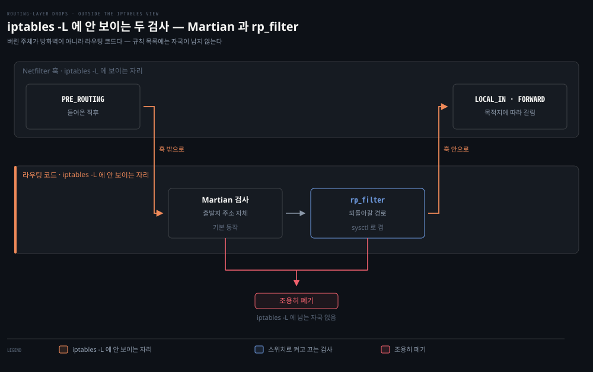

# 커널이 패킷을 다루는 법 — 소켓·Netfilter·Conntrack·라우팅

---

## 핵심 요약
> 이 편 전체가 매달린 하나의 생각은 **"애플리케이션은 파일(소켓)만 보고, 패킷은 전부 커널이 다룬다"**입니다.

웹 서버는 소켓을 만들어 바인딩하고 커널의 알림을 기다릴 뿐입니다. 패킷과 데이터 스트림 사이의 번역은 커널의 몫입니다. 그 번역 길목마다 Netfilter 훅이 걸려 있습니다. Conntrack이 연결 상태를 추적하고 라우팅 테이블이 다음 행선지를 정합니다. Kubernetes의 방화벽·NAT·서비스 로드밸런싱이 전부 이 세 층 위에 서 있습니다.


## 학습 목표
> 커널이 패킷을 다루는 자리를 소켓·훅·연결 추적·라우팅 네 층으로 나눠, 각 층이 무엇을 결정하는지 짚을 수 있는 상태를 목표로 합니다.

이 내용을 읽고 나면:

1. strace 출력에서 서버가 소켓을 만들고 요청을 기다리는 syscall 순서를 짚을 수 있습니다.
2. loopback 인터페이스가 보안 경계가 아닌 이유를 CVE 사례로 설명할 수 있습니다.
3. 브리지와 veth 쌍이 네트워크 네임스페이스를 잇는 방식을 그릴 수 있습니다.
4. Netfilter 훅 5개가 패킷의 출발지·목적지에 따라 어떤 순서로 발화하는지 추적할 수 있습니다.
5. Conntrack의 5-tuple flow와 상태 4종을 방화벽·NAT 동작과 연결할 수 있습니다.

아래는 이 편 전체를 패킷이 지나는 순서로 이은 지도입니다. 점선 안이 커널 공간이고 이 편이 다루는 곳이 거기입니다. 위의 애플리케이션과 아래의 NIC은 그 밖이라, 패킷은 이 편을 지나는 동안 경계를 두 번 넘습니다. 위쪽 애플리케이션은 01장이 다룹니다. 각 칸의 절 번호가 본문에서 그것을 다루는 곳입니다.


## 1. 서버가 요청을 받기까지 — 소켓과 syscall
> 우리가 쓰는 건 `net.Listen` 한 줄이지만, 그 뒤에서 커널은 소켓을 만들고 포트를 예약하고 대기 큐를 겁니다. 이 분업선을 알아야 접속 지연·포트 충돌 같은 문제가 내 코드 탓인지 커널 설정 탓인지 가릅니다.

### 풀려는 문제

웹 서버를 짜면 요청을 받는 코드는 사실상 이게 전부입니다.

```bash
# 내가 쓰는 코드 — 요청을 받는 부분은 이 세 줄뿐입니다
ln, _ := net.Listen("tcp", ":8080")     # 창구를 연다
for {
    conn, _ := ln.Accept()              # 손님을 하나 받는다
    go handle(conn)                     # 그 손님에게 응답한다
}
```

너무 짧아서 그 뒤에 무슨 일이 벌어지는지 볼 일이 없습니다. 그런데 운영에 들어가면 이런 증상을 만납니다. 트래픽이 몰리자 접속이 **거부되진 않는데 느려집니다.** 배포하려니 `Address already in use` 로 뜨질 않습니다. root 로 안 돌렸더니 80번 포트에 못 붙습니다. 이 증상들의 원인은 전부 첫 줄이 커널에 남긴 것들 안에 있는데, 한 줄만 보고는 손댈 곳을 못 찾습니다.

### 애플리케이션은 소켓만, 나머지는 커널

그래서 파고드는 게 이겁니다. 그 한 줄이 커널에 무엇을 시키는가. 여기 원칙이 하나 있습니다. **애플리케이션은 소켓만 보고, 패킷 처리는 전부 커널이 합니다.** 프로그램은 네트워크 카드를 직접 만지지 못하고 커널에게 부탁만 합니다.

두 낱말을 풀어 둡니다. 그 부탁이 **시스템 호출(syscall)** 이고, 부탁의 결과로 받는 번호표가 **파일 디스크립터(fd)** 입니다. 리눅스는 소켓도 파일로 다루므로, 창구를 열면 정수 하나를 돌려주고 이후 그 번호로 창구를 가리킵니다.

### strace 로 들여다보기

그 분업을 눈으로 확인하는 도구가 `strace` 입니다. 프로세스가 커널에 거는 syscall 을 가로채 순서대로 찍어 주므로, "이 프로그램이 커널에 무엇을 부탁했는가"를 시간순으로 보여 줍니다. 앞의 `net.Listen` 한 줄을 strace 로 뜨면 이렇게 나옵니다.

```bash
# net.Listen 한 줄이 커널에 실제로 건 부탁들 (인자 일부는 줄여 적었습니다)
socket(AF_INET6, SOCK_STREAM|SOCK_CLOEXEC|SOCK_NONBLOCK, IPPROTO_IP) = 3   # 창구를 연다 — fd 3
setsockopt(3, SOL_IPV6, IPV6_V6ONLY, [0], 4) = 0                           # IPv4+IPv6 모두 수신
bind(3, {sin6_port=htons(8080), "::" ...}) = 0                             # 8080, 모든 주소에
listen(3, 128)                                                             # 대기 큐를 걸고 연다
epoll_create1(EPOLL_CLOEXEC) = 4                                           # 알림 창구 — fd 4
epoll_ctl(4, EPOLL_CTL_ADD, 3, ...) = 0                                    # fd 3 을 fd 4 에 등록
epoll_wait(4, ...)                                                         # 여기서 잠든다
```

> epoll 세 줄은 인자를 줄여 적었습니다. `epoll_wait` 가 보는 fd 4 가 어디서 왔는지 드러나도록 `epoll_create1` 과 `epoll_ctl` 을 함께 실었고, 이 셋은 go net 패키지의 표준 동작입니다.

각 줄의 인자가 무엇을 정하는지 짚어 둡니다.

- `socket(계열, 방식, 프로토콜)`: 차례로 주소 계열, 통신 방식, 프로토콜입니다. `SOCK_STREAM` 이 TCP 를 뜻하고 `IPPROTO_IP` 는 "방식에 맞는 기본 프로토콜"이라는 의미입니다. 반환값 `3` 이 새로 받은 fd 입니다.
- `setsockopt(fd, 계층, 옵션, 값, 길이)`: fd 3 의 IPv6 계층(`SOL_IPV6`) 옵션 하나를 끕니다. 뒤의 `[0]` 과 `4` 가 설정할 값과 그 값의 바이트 길이입니다.
- `bind(fd, 주소구조체, 길이)`: fd 3 에 주소를 붙입니다. 구조체 안이 포트와 주소이고 `::` 는 어떤 주소로든 받겠다는 와일드카드입니다.
- `listen(fd, 백로그)`: 둘째 인자가 대기 칸 수입니다. 이 값이 뒤에서 접속 지연을 설명합니다.[^somaxconn]
- `epoll_ctl(알림fd, 명령, 대상fd, 관심사건)`: 알림 창구 fd 4 에 듣는 소켓 fd 3 을 등록(`EPOLL_CTL_ADD`)합니다.
- `epoll_wait(알림fd, 사건배열, 최대개수, 대기시간)`: 등록한 fd 중 무엇이든 준비될 때까지 기다립니다. 출력이 여기서 끊긴 것은 프로세스가 이 자리에서 잠들었기 때문입니다.

여기서 strace 는 흐름을 읽으려고 잠깐 붙이는 것입니다. 운영 중인 프로세스에 붙이면 값이 비쌉니다. 현재 구현은 `ptrace(2)` 의 breakpoint 기반이라 모든 syscall 진입·반환에서 멈춥니다. 저자 예에서 `dd` 는 2.7GB/s 에서 37.3MB/s 로, 73배 느려졌습니다. 주요 옵션과 오버헤드가 훨씬 낮은 `perf trace` 는 [05-03. 애플리케이션 (3) — 관측 도구·gotchas](../../../02_os/book/systems-performance/05-03.%EC%95%A0%ED%94%8C%EB%A6%AC%EC%BC%80%EC%9D%B4%EC%85%98%20%283%29%20%E2%80%94%20%EA%B4%80%EC%B8%A1%20%EB%8F%84%EA%B5%AC%C2%B7gotchas.md) §3 이 다룹니다.

### 읽어내기 — 세 부탁이 남기는 것

앞의 두 코드블록을 겹쳐 보면 `net.Listen` 한 줄이 `socket` → `bind` → `listen` 세 부탁으로, `Accept()` 가 `accept4` 로 펼쳐진 게 보입니다. 내가 쓴 건 한 줄인데 커널에는 네 개의 부탁이 들어간 겁니다. 앞의 세 부탁이 커널에 무엇을 남기고, 그게 어떤 증상으로 이어지는지가 아래 그림입니다.


**비유하면 관공서 민원 창구를 여는 일**입니다.

- `socket` — 창구 자리(fd)를 배정받는다
- `bind` — 그 창구에 "8080번 담당" 번호패를 걸어 포트를 예약한다
- `listen` — "줄 서세요" 하고 문을 연다

여기서 앞의 증상 둘이 설명됩니다.

- **`Address already in use`** — `bind` 는 포트를 예약합니다. 한 포트는 임자가 하나뿐이라, 이미 그 포트를 쓰는 프로세스가 있으면 두 번째 `bind` 가 실패합니다. 배포 시 옛 프로세스가 안 죽었거나 포트가 겹친 것이지 코드 버그가 아닙니다.
- **80번 포트에 못 붙음** — 1~1023(well-known port)은 바인딩에 root 권한이 필요합니다. 뚫려도 넘어갈 권한을 줄이려고 보통 8080 같은 비특권 포트에서 듣고 외부용 80·443 은 로드밸런서나 Kubernetes Service 로 넘깁니다. (`0.0.0.0`·`[::]` 은 와일드카드 주소로, 머신이 어떤 IP 를 받을지 미리 모르는 채 노출할 때 씁니다.)

세 번째 증상, **접속 지연**은 `listen` 의 두 번째 인자에 있습니다. 이 값은 **수립이 끝났지만 아직 `accept` 로 받아 가지 않은 연결**을 담아 두는 칸 수로, 위 그림이 accept 큐라고 적은 칸이 그것입니다. 그런데 연결이 거쳐 가는 칸은 하나가 아닙니다. 아래 그림이 두 칸을 시간순으로 폅니다.


> 원서 밖 보강: SYN 큐와 `tcp_max_syn_backlog`·`tcp_abort_on_overflow` 는 책에 없는 내용입니다. 책은 백로그를 한 덩어리로만 다루는데, 그러면 "넘치면 거절"이라는 오해가 남아 정작 실무에서 만나는 접속 지연을 설명하지 못합니다.

SYN 만 받고 3-way 가 안 끝난 반쯤 열린 연결은 **SYN 큐**에 따로 쌓입니다. `listen` 의 두 번째 인자가 정하는 것은 뒤쪽 accept 큐뿐이고, 그나마 실제 칸 수는 그 인자와 `net.core.somaxconn` 중 작은 값입니다. 앞 칸과 뒤 칸을 서로 다른 설정이 정하니, 백로그를 늘렸는데도 나아지지 않으면 어느 칸이 모자란지부터 갈라야 합니다.

accept 큐가 넘칠 때의 동작은 직관과 다릅니다. 커널은 연결을 **거절하지 않고 SYN/ACK 를 조용히 버립니다.** 즉시 RST 로 끊는 건 `net.ipv4.tcp_abort_on_overflow` 를 1로 켠 경우뿐이고 기본값은 0입니다. **그래서 백로그 부족은 "연결 거부"가 아니라 접속 지연으로 먼저 드러납니다.** 에러 로그가 남지 않아서, 원리를 모르면 큐 설정 대신 엉뚱한 곳을 뒤집니다.

### 창구를 연 뒤 — 기다리는 순환

문을 열었으니 이제 손님을 기다립니다. 여기서 하나를 분명히 해야 합니다. **서버가 멈춰 서 있는 자리는 `listen` 이 아닙니다.** `listen` 은 한 번 부르면 곧바로 돌아오는 호출입니다. 문을 열어 두는 설정일 뿐, 거기 머무르지 않습니다.

멈추는 자리는 그다음입니다. 창구를 열어 두고 마냥 서서 지켜보면 CPU 만 태우므로, 커널에게 **"손님이 오면 깨워 줘"** 라고 맡기고 잠듭니다. 그 알림 장치가 `epoll` 이고 실제로 잠드는 자리가 `epoll_wait` 입니다. 앞 strace 에서 출력이 끊긴 곳이 바로 여기입니다.


그림의 세 칸이 서버가 도는 한 바퀴입니다. `epoll_wait` 에서 자다가 accept 큐에 새 연결이 들어오면 커널이 깨웁니다. 서버는 `accept4` 로 연결을 꺼내면서 **그 연결만의 새 fd** 를 받습니다. 이 fd 는 듣는 창구 fd 와 별개입니다. 창구는 계속 열려 있고 손님마다 상담 번호표가 따로 나오는 셈입니다. 응답을 그 fd 에 쓰면 커널이 패킷으로 바꿔 내보내고, 서버는 다시 `epoll_wait` 로 돌아갑니다. 왼쪽 위의 자기 루프가 그 사이 새 연결이 없으면 깨지 않고 계속 자는 경우입니다.

받은 연결에는 KEEPALIVE 를 켜고 프로브 간격을 180초로 두는 것이 보통입니다. KEEPALIVE 는 "이 연결이 아직 살아 있나"를 주기적으로 찔러 보는 장치로, 상대가 조용히 사라진 죽은 연결을 오래 붙들지 않으려는 것입니다.


## 2. 네트워크 인터페이스 — loopback은 보안 경계가 아니다
> `127.0.0.1` 바인딩은 접근 제어가 아닙니다. 라우팅 설정에 따라 원격이 loopback에 닿을 수 있고, CVE-2020-8558이 그 대가를 보여 줬습니다.


### 풀려는 문제

DB 를 `127.0.0.1` 에만 바인딩해 두고 "어차피 이 호스트 안에서만 닿으니 안전하다"고 여기는 관행이 흔합니다. 인증을 느슨하게 두기도 하고요. 이 가정이 **참인가**가 이 절의 물음입니다 — 결론을 먼저 말하면, 라우팅 설정에 따라 밖에서도 `127.0.0.1` 에 닿을 수 있어 참이 아닙니다.

### 인터페이스에 주소가 붙는다

컴퓨터는 네트워크 인터페이스로 외부와 통신합니다. 인터페이스는 물리적(Ethernet 카드)일 수도, 호스트나 하이퍼바이저가 제공하는 가상일 수도 있습니다. IP 주소는 인터페이스에 할당되며 하나의 인터페이스에 여러 주소를 붙일 수 있습니다. `ifconfig` 또는 `ip` 명령으로 전체 인터페이스와 설정(IP·MAC·MTU·RX/TX 통계)을 확인합니다. 컨테이너 런타임은 호스트의 Pod마다 가상 인터페이스를 만들기 때문에, 실제 Kubernetes 노드에서 이 목록은 훨씬 깁니다.

loopback(lo)은 같은 호스트 안 통신 전용 인터페이스로 표준 주소는 `127.0.0.1`입니다. 여기로 보낸 패킷은 호스트를 떠나지 않고, `127.0.0.1`에서 듣는 프로세스는 같은 호스트의 프로세스만 접근할 수 있습니다.

### CVE-2020-8558 — 원격이 127.0.0.1 에 닿은 사건

그런데 저자들은 여기에 경고를 답니다. `127.0.0.1` 바인딩은 보안 경계가 아닙니다. Kubernetes의 과거 취약점 CVE-2020-8558은 kube-proxy가 만든 규칙 탓에 일부 원격 시스템이 `127.0.0.1`에 도달할 수 있었던 사례입니다. 컨트롤 플레인 노드에서 이 구멍이 열리면 같은 네트워크의 머신이 "localhost는 신뢰할 수 있다"는 가정을 악용해 API 서버로 클러스터를 장악할 수 있었습니다.

절 첫머리 그림의 점선 안이 "여기는 로컬 전용"이라고 믿는 구간입니다. 화살표가 그 선을 넘어 들어가는 것이 이 사건의 전부입니다. 인접 호스트가 보낸 패킷은 노드 NIC까지는 평범하게 도착하고, 노드 설정이 로컬 주소로 가는 길을 허용해 둔 탓에 `127.0.0.1`에 닿습니다.

### 접근을 정하는 것은 라우팅과 방화벽이다

**바인딩 주소는 누가 접근할 수 있는지를 정하지 않습니다.** 그것을 정하는 것은 라우팅과 방화벽 규칙입니다. 로컬 전용이 필요하면 주소로 믿지 말고 규칙으로 막아야 합니다.


## 3. 브리지와 veth — 네임스페이스를 잇는 배선
> 격리된 네임스페이스에 네트워크를 공급하는 배선이 veth 쌍이고, 그것들을 한 호스트 안에서 묶는 스위치가 브리지입니다. Kubernetes의 Pod 네트워킹이 이 조합 위에 섭니다.


### 풀려는 문제

한 호스트에서 컨테이너 여럿을 돌린다고 합시다. 각 컨테이너는 자기 인터페이스와 IP 를 가진 채 서로 격리돼야 하고, 그러면서도 밖으로는 나갈 수 있어야 합니다. 그런데 물리 NIC 은 호스트에 하나뿐입니다. 어떻게 하나의 물리 카드를 여럿이 격리된 채 나눠 쓸까요?

답이 두 부품입니다. 격리는 **네트워크 네임스페이스**가 맡고, 격리된 네임스페이스를 밖과 잇는 배선은 **veth 쌍**(소프트웨어 랜선)과 **브리지**(소프트웨어 스위치)가 맡습니다. 이 조합이 곧 컨테이너와 Kubernetes Pod 네트워킹의 뼈대라, 여기서 손으로 만들어 보면 3장 전체가 쉬워집니다.

네트워크 네임스페이스는 인터페이스·라우팅 테이블·방화벽 규칙을 한 벌씩 따로 갖는 격리된 네트워크 공간입니다. 같은 호스트 안에 있어도 네임스페이스가 다르면 서로의 인터페이스가 보이지 않아, 각자 독립된 머신처럼 동작합니다. 이름이 같아 헷갈리지만 Kubernetes의 namespace(리소스를 논리적으로 묶는 이름표)와는 별개 개념입니다. 이 정의 자체는 책에 없고 이해를 돕기 위해 덧붙인 것입니다.

브리지 인터페이스는 한 호스트 안에 L2 네트워크 여러 개를 만들 수 있게 해 줍니다. 호스트 안 인터페이스들 사이에서 네트워크 스위치처럼 동작하며, Pod가 자기 인터페이스를 가진 채 노드의 인터페이스를 거쳐 바깥 네트워크와 통신할 수 있게 잇는 역할입니다.

veth는 로컬 Ethernet 터널로, 항상 쌍으로 만들어집니다. 한쪽 장치로 전송한 패킷은 즉시 반대쪽 장치에 수신되고, 어느 한쪽이 죽으면 쌍 전체의 링크가 내려갑니다. 네임스페이스끼리 또는 네임스페이스와 호스트가 통신해야 할 때 veth를 씁니다.

```bash
# 네임스페이스 둘을 만들고 veth 쌍으로 잇습니다
ip netns add net1
ip netns add net2
ip link add veth1 netns net1 type veth peer name veth2 netns net2
```

위 그림의 점선이 네임스페이스 경계입니다. veth를 상자 두 개로 그리지 않고 경계를 가로지르는 하나로 둔 이유는 실제로 그렇기 때문입니다. 직접 만들어 보면 두 끝이 서로를 이름으로 가리킵니다.

### 직접 해 보기

veth 의 두 끝은 이름에 서로를 답니다. `veth2@veth1` 과 `veth1@veth2` 처럼 `@` 뒤가 상대를 가리키고, 두 끝이 서로 다른 네임스페이스에 있으면 이름 대신 인덱스 번호로 바뀝니다. 브리지에 물리는 것은 그중 한쪽 끝뿐이라 `bridge link` 에는 물린 쪽만 나옵니다.

이 배선을 실제로 지어 보는 절차는 [02-04 실습편](./02-04.%EC%BB%A4%EB%84%90%20%EB%84%A4%ED%8A%B8%EC%9B%8C%ED%82%B9%20%EC%8B%A4%EC%8A%B5%20%E2%80%94%20veth%C2%B7%EB%B8%8C%EB%A6%AC%EC%A7%80%C2%B7%ED%8F%AC%EC%9B%8C%EB%94%A9%EC%9D%84%20%EC%86%90%EC%9C%BC%EB%A1%9C%20%EC%A7%93%EA%B8%B0.md) §2 가 다룹니다. 네임스페이스를 실제로 만들어 두 끝을 갈라 넣으므로, 여기서 말한 "반대쪽은 네임스페이스 안에 남는다"를 눈으로 확인할 수 있습니다. 양쪽에 IP를 할당하면 두 네임스페이스가 ping으로 통신합니다. Kubernetes는 CNI 프로젝트와 함께 정확히 이 방식으로 컨테이너의 네트워크 네임스페이스·인터페이스·IP를 관리합니다 — 3장에서 자세히 다룹니다.


## 4. Netfilter — 커널 속 다섯 개의 검문소
> 패킷이 지나는 훅 조합은 출발지와 목적지가 이 호스트인지 두 질문으로 정해집니다. iptables 체인 5개가 이 훅 5개에 그대로 대응합니다.


### 풀려는 문제

방화벽 규칙("22번은 사내에서만")이나 NAT("서비스 주소를 백엔드로")를 걸고 싶다고 합시다. 그 규칙을 검사하는 코드는 패킷이 커널을 지나는 길 **어딘가**에 끼어들어야 합니다. 문제는 그 길이 하나가 아니라는 점입니다. 나에게 들어오는 패킷, 내가 내보내는 패킷, 나를 거쳐 남에게 가는 중계 패킷이 서로 다른 길을 탑니다.

그래서 "들어오는 것만 막고 싶다", "중계되는 것만 걸러야 한다" 같은 요구를 만족시키려면 검사 지점이 **여러 군데** 필요합니다. 그 지점들이 어디이고 각각 어떤 패킷이 지나는지가 이 절입니다. Netfilter 가 그 지점들을 미리 마련해 둔 프레임워크입니다.

### 훅 다섯과 그것을 정하는 두 질문

Netfilter는 Linux 2.3 개발 커널에서 만들어져 2.4부터 정식 포함된 패킷 처리 프레임워크입니다(2.3 은 개발 브랜치입니다). 핵심은 커널 훅입니다 — 프로그램이 특정 훅에 등록하면, 커널이 해당하는 패킷마다 그 프로그램을 호출합니다. 프로그램은 패킷을 버리라고 지시하거나 수정된 패킷을 돌려줄 수 있어서, 유저스페이스 프로그램이 커널 대신 패킷을 다룰 수 있게 됩니다. Netfilter는 iptables와 함께 설계됐는데, 커널 코드와 유저스페이스 코드를 분리하려는 목적이었습니다.

훅은 다섯 개이고 각각 iptables 체인 이름과 1:1로 대응됩니다. 다만 이 대응은 **이름의 대응이지 개수의 대응이 아닙니다.** 모든 iptables 테이블이 체인 다섯 개를 다 갖지는 않습니다. 어느 테이블이 어느 훅에 붙는지는 [02-02 §1](./02-02.iptables%C2%B7IPVS%C2%B7eBPF%20%E2%80%94%20kube-proxy%EB%A5%BC%20%EC%9D%B4%ED%95%B4%ED%95%98%EB%8A%94%20%EC%84%B8%20%EA%B8%B0%EC%88%A0.md)의 존재 표가 다룹니다.

이 편에서 raw 테이블이 필요한 자리는 §5 의 추적 제외(`NOTRACK`) 하나입니다. raw 는 Conntrack **이전**에 발화하는 유일한 테이블이라, "추적을 시작하지 말라"고 말할 수 있는 곳이 여기밖에 없습니다.

| Netfilter 훅 | iptables 체인 | 발화 시점 |
|--------------|--------------|----------|
| NF_IP_PRE_ROUTING | PREROUTING | 외부 시스템에서 패킷이 도착했을 때 |
| NF_IP_LOCAL_IN | INPUT | 패킷의 목적지 IP가 이 머신일 때 |
| NF_IP_FORWARD | FORWARD | 출발지도 목적지도 이 머신이 아닐 때 (남 대신 라우팅해 주는 패킷) |
| NF_IP_LOCAL_OUT | OUTPUT | 이 머신에서 만들어진 패킷이 나갈 때 |
| NF_IP_POST_ROUTING | POSTROUTING | 출처와 무관하게 패킷이 머신을 떠날 때 |

> 원문 정오: 책의 표 2-1·2-5는 NF_IP_FORWARD의 체인을 "NAT"로 인쇄했지만 같은 장 표 2-7과 `iptables -L` 예시는 FORWARD입니다. Netfilter 훅 이름(NF_IP_FORWARD) 그대로 FORWARD가 맞습니다.

어떤 패킷이 어느 훅을 지나는지는 두 가지 질문으로 정해집니다 — 출발지가 이 호스트인가, 목적지가 이 호스트인가.

위 그림의 점선 경계가 라우팅 판단을 기준으로 앞뒤를 가릅니다. 왼쪽에서는 목적지를 바꿀 수 있고 오른쪽에서는 출발지만 바뀝니다. 장면은 클러스터 밖 클라이언트가 노드의 NodePort 30080 으로 보내는 경우입니다. 순서가 이렇게 정해진 이유가 값으로 드러납니다. PRE_ROUTING에서 목적지가 `노드 IP:30080`에서 Pod 주소 `10.244.1.66:8080`으로 바뀝니다. 라우팅 판단은 **바뀐 뒤의 주소**로 경로를 찾습니다.

목적지가 더 이상 이 노드가 아니게 됐으므로 이 패킷은 INPUT이 아니라 FORWARD로 갑니다. DNAT가 라우팅보다 뒤에 있었다면 이미 정해진 경로로 엉뚱한 곳에 갔을 것입니다. Pod 주소는 kind 클러스터에서 실제로 뽑은 값입니다.

| 출발지 | 목적지 | 훅 순서 |
|--------|--------|--------|
| 로컬 머신 | 로컬 머신 | LOCAL_OUT → LOCAL_IN |
| 로컬 머신 | 외부 머신 | LOCAL_OUT → POST_ROUTING |
| 외부 머신 | 로컬 머신 | PRE_ROUTING → LOCAL_IN |
| 외부 머신 | 외부 머신 | PRE_ROUTING → FORWARD → POST_ROUTING |

> 원문 정오: 첫 행(로컬→로컬)은 책의 표 2-2를 그대로 옮긴 것이지만, 같은 장 본문은 이 경우를 네 훅으로 설명합니다. 패킷이 LOCAL_OUT·POST_ROUTING으로 나갔다가 재진입해 PRE_ROUTING·LOCAL_IN을 다시 지난다는 서술로, 아래 문단이 그 내용입니다. 표가 두 훅만 적은 쪽이 축약이고, 실제로 발화하는 훅은 넷입니다.

두 질문이 만드는 네 갈래를 한 장으로 편 것이 아래 그림입니다. 절 첫머리의 그림이 네 조합 중 "외부→외부" 하나만 따라간 것과 달리, 여기서는 훅 다섯 개가 모두 나오고 어느 갈래가 무엇을 건너뛰는지가 함께 보입니다.


`LOCAL_`이 붙은 두 훅만 주소 한쪽이 고정됩니다. LOCAL_IN은 목적지가, LOCAL_OUT은 출발지가 이 호스트이고 나머지 셋에는 그런 제약이 없습니다. 헷갈리기 쉬운 자리는 `LOCAL`의 뜻입니다. 이것은 *누가 만들었는가*가 아니라 **이 호스트가 종점인가 기점인가**를 가리키므로, 남이 보낸 패킷이라도 목적지가 나이면 LOCAL_IN입니다. 둘이 한 경로에 같이 나타나는 것은 자기 자신에게 보내는 경우뿐이고, 그때만 훅을 넷 지납니다.

> 💬 **비유**: Netfilter 훅은 공항의 검문소입니다. 입국(PREROUTING)·입국 심사(INPUT)·환승(FORWARD)·출국 수속(OUTPUT)·탑승구(POSTROUTING) 중 어디를 지날지는 승객(패킷)의 출발지·목적지가 정합니다. 국내선 환승객이 입국 심사를 건너뛰듯, 남을 대신 라우팅하는 패킷은 INPUT을 지나지 않습니다.

### Martian 검사와 rp_filter — iptables 에 안 보이는 차단

자기 자신에게 보내는 패킷은 LOCAL_OUT과 POST_ROUTING을 지나 인터페이스를 "떠났다가" 재진입해, 외부 패킷처럼 PRE_ROUTING과 LOCAL_IN을 다시 지납니다. 이 재진입 구조와 얽힌 위협이 **Martian packet**, 곧 출발지 주소가 "불가능한" 패킷입니다. 외부에서 왔는데 출발지가 `127.0.0.1`인 패킷이 그 예이고, Linux는 인터페이스에 존재할 수 없는 출발지의 패킷을 기본적으로 걸러 냅니다.

이름이 이어져 나와 하나로 읽히기 쉽지만 **Martian 검사와 reverse path filter는 별개**입니다.



규칙을 아무리 뒤져도 원인이 안 나오는 종류의 차단은 위 그림 아래쪽 레인에서 나옵니다. 두 검사가 각각 무엇을 보는지는 다음 표가 가릅니다.

| 장치 | 무엇을 보는가 | 스위치 |
|------|-------------|--------|
| Martian 검사 | 주소 자체가 그 인터페이스에 있을 수 없는가 (`127.0.0.0/8`이 `eth0`으로 들어옴) | 기본 동작 · 로그는 `log_martians` |
| reverse path filter | 출발지로 라우팅을 거꾸로 조회해 되돌아갈 경로가 들어온 인터페이스와 맞는가 | `net.ipv4.conf.<인터페이스>.rp_filter` |

rp_filter가 받는 값은 셋이고, 둘은 RFC 3704 가 정의한 이름을 그대로 씁니다.

| 값 | 판정 | 커널 문서의 이름 |
|---:|------|----------------|
| `0` | 검사하지 않음 | No source validation |
| `1` | 되돌아가는 **최적** 경로가 들어온 인터페이스와 맞아야 통과 | RFC3704 Strict Reverse Path |
| `2` | 아무 인터페이스로든 출발지에 닿을 수만 있으면 통과 | RFC3704 Loose Reverse Path |

**기본값은 0 입니다.** 다만 커널 문서 자신이 "일부 배포판은 시작 스크립트에서 켠다"고 덧붙입니다. 켠 기억이 없는데 켜져 있는 것이 이상한 상태가 아닙니다.

여기서 끄려다 못 끄는 자리가 하나 나옵니다. **인터페이스에 실제로 적용되는 값은 `conf/all` 과 `conf/<인터페이스>` 중 큰 쪽입니다.**

> "The max value from conf/{all,interface}/rp_filter is used when doing source validation on the {interface}."[^ip-sysctl]

그래서 `conf/eth0/rp_filter` 를 0으로 내려도 `conf/all/rp_filter` 가 1이면 eth0 은 여전히 엄격 모드로 돕니다. 한쪽만 보고 껐다고 판단하면 어긋납니다. 비대칭 라우팅을 쓰는 노드에서 통신이 한 방향만 되는 증상이 이 조합에서 자주 나옵니다.

걸러낸 패킷을 로그로 보려면 `log_martians` 를 켜는데, **이 스위치는 결합 규칙이 다릅니다.** `conf/{all,interface}` 중 하나라도 켜져 있으면 켜집니다. rp_filter 는 최댓값, log_martians 는 OR 입니다. 반대로 이 필터링을 끄면, "localhost발 트래픽은 더 신뢰할 만하다"고 가정하는 서비스가 있는 호스트에서 큰 위험이 됩니다.

짝이 되는 스위치가 하나 더 있습니다. `route_localnet` 을 켜면 커널이 라우팅할 때 loopback 주소를 **출발지로든 목적지로든** martian 으로 보지 않습니다. 기본값은 꺼짐입니다. kube-proxy가 이 값을 켜서 생긴 것이 CVE-2020-8558이고, 경위는 이 편 심화 학습에서 다룹니다.

### 반환값과 타깃 — 층이 둘이다

훅에 등록된 프로그램은 반환값으로 패킷의 운명을 정합니다. 여기서 층을 하나 갈라 둬야 합니다. 아래 표는 **커널이 받는 반환값**이고, 우리가 `iptables`에 적는 `ACCEPT`·`DROP`은 **타깃**입니다.

이름이 겹쳐 같아 보이지만 같은 층이 아닙니다. 타깃 쪽에는 반환값에 짝이 없는 것도 있어서, `RETURN`은 체인을 빠져나오라는 흐름 제어이고 `REJECT`는 동작 여러 개를 묶은 것입니다.


짝이 어긋나는 두 자리를 그림이 가릅니다. `RETURN` 은 커널에 갈 반환값 자체가 없습니다. 체인을 어디까지 읽을지를 정하는 iptables 안쪽의 흐름 제어라 Netfilter 까지 내려가지 않습니다. `REJECT` 는 반대로 반환값 하나에 대응하지 않습니다. 거절을 알리는 패킷을 만들어 보낸 **뒤에** 버리는 두 동작이라, 커널이 받는 것은 결국 `NF_DROP` 입니다.

| 반환값 | 뜻 | 쓰이는 자리 |
|--------|-----|-----------|
| `NF_ACCEPT` | 처리를 계속 진행 | `-j ACCEPT` |
| `NF_DROP` | 더 처리하지 않고 폐기 | `-j DROP`. 상위 비트에 errno를 실을 수 있어(`NF_DROP_ERR`), 로컬에서 나간 패킷이면 소켓에 오류로 돌아간다 |
| `NF_QUEUE` | 유저스페이스 프로그램에 넘김 | `-j NFQUEUE`. 상위 비트가 큐 번호(`NF_QUEUE_NR`)라 큐를 여럿 둘 수 있다 |
| `NF_STOLEN` | 이후 훅을 실행하지 않고 소유권을 가져감 | 커널 안에서 패킷을 붙잡아 두고 나중에 따로 처리할 때. 부른 쪽은 그 패킷을 더 건드리지 않는다 |
| `NF_REPEAT` | 그 훅에 재진입시켜 다시 처리 | 첫 통과에서 패킷을 바꿔 놓고, 바뀐 값으로 다시 판정해야 할 때 |

`-j DROP`과 `-j REJECT`가 갈리는 곳도 여기입니다. DROP은 아무 말 없이 사라져 보낸 쪽이 타임아웃까지 기다리고, REJECT는 ICMP 오류나 TCP RST를 먼저 보낸 뒤 버려서 즉시 실패합니다.

위 값들은 이 환경의 커널 헤더(`/usr/include/linux/netfilter.h`, 커널 7.0.14)에서 확인한 것입니다.

한 가지는 책이 쓰인 뒤에 바뀌었습니다. 요즘 배포판의 `iptables` 명령은 legacy 백엔드가 아니라 nftables 백엔드로 동작합니다. `iptables -V`가 `(nf_tables)`로 답하는 것이 그 표시입니다. 다만 훅 다섯 개는 Netfilter 프레임워크 자체의 것이라 백엔드가 바뀌어도 그대로입니다. nftables의 base chain도 같은 훅에 등록되고, 달라진 것은 규칙을 표현하고 저장하는 방식뿐입니다.

### 한 훅에 여럿이 등록된다 — 순서는 우선순위 숫자가 정한다

앞에서 프로그램이 훅에 등록하면 커널이 그것을 호출한다고 했습니다. 그런데 한 훅에 등록하는 프로그램이 하나뿐이라는 보장은 없습니다. iptables 의 테이블들부터가 각자 따로 등록된 별개의 콜백입니다.

여럿이 등록되면 순서가 필요합니다. 그 순서를 정하는 것이 우선순위 정수입니다. netfilter 프로젝트 위키는 "Within a given hook, Netfilter performs operations in order of increasing numerical priority" 라고 적습니다.[^nfprio] 숫자가 작을수록 먼저 불립니다.

값은 커널 헤더에 상수로 박혀 있습니다. 아래는 이 환경의 `/usr/include/linux/netfilter_ipv4.h` 에서 `enum nf_ip_hook_priorities` 를 그대로 뽑은 것입니다.

| 우선순위 | 상수 | 그 자리에 등록되는 것 |
|---:|---|---|
| -400 | `NF_IP_PRI_CONNTRACK_DEFRAG` | 조각난 패킷 재조립 |
| -300 | `NF_IP_PRI_RAW` | raw 테이블 |
| -200 | `NF_IP_PRI_CONNTRACK` | 연결 추적 |
| -150 | `NF_IP_PRI_MANGLE` | mangle 테이블 |
| -100 | `NF_IP_PRI_NAT_DST` | nat 테이블의 DNAT |
| 0 | `NF_IP_PRI_FILTER` | filter 테이블 |
| 50 | `NF_IP_PRI_SECURITY` | security 테이블 |
| 100 | `NF_IP_PRI_NAT_SRC` | nat 테이블의 SNAT |
| 300 | `NF_IP_PRI_CONNTRACK_HELPER` | 프로토콜 헬퍼 |

이 표가 다음 편의 테이블 순서를 설명합니다. [02-02 §1](./02-02.iptables%C2%B7IPVS%C2%B7eBPF%20%E2%80%94%20kube-proxy%EB%A5%BC%20%EC%9D%B4%ED%95%B4%ED%95%98%EB%8A%94%20%EC%84%B8%20%EA%B8%B0%EC%88%A0.md) 은 한 체인 안에서 Raw → Mangle → NAT → Filter 순으로 평가된다고 말합니다. 그것은 iptables 가 따로 정한 규칙이 아닙니다. 네 테이블이 -300 · -150 · -100 · 0 이라는 서로 다른 숫자로 같은 훅에 등록돼 있고, 커널이 숫자 순으로 부르는 것뿐입니다.

raw 가 Conntrack 이전인 것도 관례가 아니라 숫자 차이입니다. raw 는 -300 이고 연결 추적은 -200 입니다. 100 만큼 앞서 있으므로 raw 에서 `NOTRACK` 을 걸면 추적이 시작되기 전에 말할 수 있습니다. §5 의 추적 제외가 raw 에서만 되는 이유가 이것입니다.

연결 추적이 한 자리가 아니라는 점도 표에 드러납니다. 재조립이 -400 이고 본체가 -200 이며 헬퍼가 300 입니다. 확정 단계인 `NF_IP_PRI_CONNTRACK_CONFIRM` 은 정수 최댓값이라 맨 마지막입니다. 기능 하나가 훅 여러 지점에 나뉘어 등록돼 있습니다.


### iptables 말고 이 프레임워크를 쓰는 것들

Netfilter 는 iptables 전용 장치가 아닙니다. 같은 훅 위에 올라타는 것이 더 있습니다.

**nftables** 는 같은 훅에 base chain 을 등록하는 다른 프론트엔드입니다. 위 표의 자리마다 nftables 키워드(`raw`·`mangle`·`dstnat`·`filter`·`security`·`srcnat`)가 있고 숫자는 iptables 테이블과 같습니다.

**유저스페이스 프로그램**은 `NF_QUEUE` 로 넘어온 패킷을 직접 판정합니다. 그 통로를 여는 라이브러리가 libnetfilter_queue 입니다. 공식 설명은 "a userspace library providing an API to packets that have been queued by the kernel packet filter" 입니다.[^nfqueue] 넘겨받은 프로그램은 판정을 돌려주거나 고친 패킷을 커널에 다시 넣을 수 있습니다. 커널 규칙으로 표현하기 어려운 판정을 밖에서 내리는 길입니다.

**ingress 훅**은 위 다섯 개 목록 밖입니다. Linux 4.2 에서 추가됐고, 다른 훅과 달리 특정 네트워크 인터페이스에 붙습니다.[^nfprio] prerouting 보다도 먼저 걸리므로 아주 이른 필터링에 씁니다. 이 절이 훅을 다섯 개라고 한 것은 iptables 가 쓰는 고전 IPv4 훅을 말한 것입니다. 프레임워크 전체는 그보다 큽니다.

나머지 둘은 다음 편이 맡습니다. IPVS 도 이 훅 위에 올라탄 L4 로드밸런서이고([02-02 §4](./02-02.iptables%C2%B7IPVS%C2%B7eBPF%20%E2%80%94%20kube-proxy%EB%A5%BC%20%EC%9D%B4%ED%95%B4%ED%95%98%EB%8A%94%20%EC%84%B8%20%EA%B8%B0%EC%88%A0.md)), eBPF 만 훅을 거치지 않아 이 계보 밖입니다([02-02 §5](./02-02.iptables%C2%B7IPVS%C2%B7eBPF%20%E2%80%94%20kube-proxy%EB%A5%BC%20%EC%9D%B4%ED%95%B4%ED%95%98%EB%8A%94%20%EC%84%B8%20%EA%B8%B0%EC%88%A0.md)).


## 5. Conntrack — 패킷을 연결로 묶는 눈
> 방화벽의 방향성과 NAT는 둘 다 **Conntrack** 위에 섭니다. 패킷을 연결로 묶어 봐야 "이건 응답인가 새 시도인가"를 가릴 수 있기 때문입니다.


### 풀려는 문제

**Conntrack은 머신을 오가는 연결의 상태를 추적하는 Netfilter 구성 요소입니다.** 왜 필요할까요? **방화벽 관점에서는 응답과 임의 패킷을 구분하게 해 줍니다.** "밖으로 나가는 연결은 허용하되, 기존 연결의 일부가 아닌 인바운드 패킷은 차단"이 가능해지는 근거가 Conntrack입니다.

> 💬 **비유**: 앞 절의 공항을 이어 가면, Conntrack은 검문소 직원이 들고 있는 탑승객 명단입니다. 
>
> 명단이 없으면 직원은 눈앞의 사람만 보고 판단해야 해서 "아까 나간 그 여행객이 돌아온 것"과 "처음 보는 사람"을 구분하지 못합니다. 명단이 있어야 "나가는 사람은 다 보내되 명단에 없이 들어오는 사람은 막는다"는 규칙이 성립합니다.

NAT에는 방향이 둘 있습니다. **출발지 주소를 바꾸는 것이 SNAT**이고 **목적지 주소를 바꾸는 것이 DNAT**입니다. 사설망의 여러 호스트가 공인 IP 하나로 나갈 때 쓰는 것이 SNAT이고, 서비스 주소로 온 패킷을 실제 백엔드로 돌리는 것이 DNAT입니다.

NAT는 아예 Conntrack 위에서 동작합니다. 패킷이 연결에 자동으로 묶이므로 같은 SNAT/DNAT 변환을 일관되게 적용할 수 있고, 로드밸런서가 연결을 특정 백엔드에 고정(pinning)하는 것도 이 덕분입니다. **kube-proxy가 iptables로 서비스 로드밸런싱을 구현할 수 있는 바탕이기도 합니다.** 연결 추적이 없다면 모든 패킷을 결정론적으로 같은 목적지에 재매핑해야 하는데, 백엔드 목록이 변하는 환경에서는 불가능합니다.

Conntrack은 연결을 5-tuple(출발지 주소·출발지 포트·목적지 주소·목적지 포트·L4 프로토콜)로 식별하고 이를 flow라고 부릅니다. flow는 튜플을 키로 해시 테이블에 저장됩니다. 키 공간이 클수록 메모리를 더 쓰는 대신 같은 키에 연결 리스트로 묶이는 flow가 줄어 조회가 빨라집니다.

최대 flow 수는 `net.netfilter.nf_conntrack_max`로, 해시 크기는 `/sys/module/nf_conntrack/parameters/hashsize`로 설정합니다. 공간이 바닥나면 새 연결을 만들 수 없게 됩니다. 인터넷에 직접 노출된 호스트라면 짧거나 불완전한 연결을 쏟아부어 Conntrack을 고갈시키는 것이 손쉬운 DoS 방법이 됩니다.

Conntrack은 커널 모듈(`nf_conntrack`)이 로드되고 관련 규칙이 있을 때 동작합니다. 활성 여부는 보통 `lsmod | grep nf_conntrack`로 봅니다. 다만 `lsmod`가 비어 있다고 기능이 없는 것은 아닙니다. 커널에 빌트인된 경우에는 모듈 목록에 뜨지 않으므로, `/proc/net/nf_conntrack`이나 `conntrack -L`의 응답으로 확인하는 편이 확실합니다.

> 원서 대비 갱신: 책은 `nf_conntrack_ipv4` 모듈을 언급하지만, 커널 4.19에서 이 모듈은 `nf_conntrack`으로 통합됐습니다. sysctl 경로도 `/proc/sys/net/nf_conntrack_max`보다 `net.netfilter.nf_conntrack_max`가 현재 정식 이름입니다.

주로 쓰는 flow 상태는 4종이며, **Conntrack 의 상태는 TCP 의 상태와 별개**라는 점이 중요합니다. 낮은 계층에만 살아서가 아닙니다. Conntrack 은 L3·L4 헤더를 모두 읽고 프로토콜별 상태 기계(TCP 는 `nf_conntrack_proto_tcp`)를 따로 굴립니다. 즉 **자기 상태 기계를 별도로 갖기 때문에** 값이 TCP 상태 기계와 어긋나는 것입니다. 그래서 `ss` 가 보여주는 TCP 상태와 `conntrack -L` 이 보여주는 상태가 같은 연결에서도 다르게 찍힙니다.

| 상태 | 의미 | 예 |
|------|------|-----|
| NEW | 유효한 패킷이 오갔지만 응답은 아직 없음 | TCP SYN 수신 |
| ESTABLISHED | 양방향으로 패킷 관측 | SYN 수신 후 SYN/ACK 송신 |
| RELATED | 기존 연결과 메타데이터로 묶인 추가 연결 | FTP가 데이터 연결을 추가로 여는 경우 |
| INVALID | 패킷 자체가 무효이거나 어떤 상태와도 맞지 않음 | 선행 연결 없는 TCP RST |

위 넷이 주로 쓰는 상태지만 전부는 아닙니다. **UNTRACKED** 가 하나 더 있습니다. raw 테이블에서 `NOTRACK` 으로 추적을 명시적으로 제외한 패킷이 여기에 들어갑니다(아래 Conntrack 고갈 대응이 쓰는 수단입니다). 규칙에서 상태를 매치하는 `iptables -m conntrack --ctstate` 가 받는 값은 다음과 같습니다.

`NEW` · `ESTABLISHED` · `RELATED` · `INVALID` · `UNTRACKED` · `SNAT` · `DNAT`.

표만 보면 상태가 이름처럼 보이지만, 실제로는 테이블에 적힌 한 줄이고 거기에는 남은 수명과 플래그가 함께 붙습니다. 절 첫머리 그림이 그 한 줄의 일생입니다. 위 축이 상태 전이, 아래 축이 플래그가 붙고 떨어지는 시점인데, 축을 둘로 가른 데는 이유가 있습니다. `[UNREPLIED]` 는 상태 전이와 **같은 시점**에 떨어지지만 `[ASSURED]` 는 **그보다 뒤**, TCP 라면 양방향으로 데이터가 실제로 오간 뒤에 붙습니다. 상태 하나에 플래그 하나가 짝지어 있는 것이 아닙니다.

그 간격이 실무에서 갈리는 자리는 테이블이 꽉 찼을 때입니다. 커널이 **`[ASSURED]` 가 없는 항목을 먼저 버리므로**, 아직 데이터가 오가지 않은 연결은 수명을 다 채우지 못하고 축출됩니다.

수명 값은 프로토콜과 상태마다 다릅니다. 그림의 120초와 432000초는 이 환경에서 `sysctl net.netfilter.nf_conntrack_tcp_timeout_*` 로 확인한 값입니다. 각각 `..._syn_sent` 와 `..._established` 이고, 조정은 `net.netfilter.nf_conntrack_*_timeout_*` 계열로 합니다. UDP나 미완성 연결은 훨씬 짧습니다.

RELATED·INVALID·UNTRACKED 는 주 경로의 다음 단계가 아니라 곁가지입니다. 그림에서도 주 경로 위 레인에 따로 두고, 갈라지는 자리에서만 선을 올렸습니다.

### NAT가 걸리면 응답 줄이 달라진다

`conntrack -L`로 현재 flow를 볼 수 있습니다. flow 항목에는 기대 응답 패킷(expected return packet)의 튜플이 함께 실리는데, 보통은 출발·목적지가 뒤집힌 형태지만 NAT 뒤에서는 다를 수 있습니다.

"다를 수 있다"가 이 절에서 가장 중요한 한 줄입니다. 아래 그림이 §4와 같은 장면(클러스터 밖에서 NodePort로 들어오는 요청)에서 그 두 줄이 실제로 어떤 값을 갖는지 폅니다.


가운데 점선 줄이 "단순히 뒤집었다면 이랬을 값"입니다. 맨 아래가 실제로 적히는 값입니다. 두 필드가 모두 어긋나 있는데, 어긋난 이유는 각각 다릅니다.

**DNAT가 응답의 출발지를 정하고 MASQUERADE가 응답의 목적지를 정합니다.** 요청에서 목적지를 Pod로 바꿔 놨으니 응답은 그 Pod에서 옵니다. 요청에서 출발지를 노드로 위장해 놨으니 응답은 노드로 돌아옵니다.

그래서 응답 패킷이 도착하면 커널은 규칙을 다시 고르지 않습니다. 두 번째 줄로 조회해 두 변환을 한 번에 되돌립니다. 로드밸런서의 백엔드 고정(pinning)은 이 한 줄이 실체이고 kube-proxy가 iptables만으로 서비스 로드밸런싱을 하는 것도 여기에 기댑니다.


## 6. 라우팅 — 어디로 보낼지 정하는 마지막 판단
> 경로 선택은 테이블 고르기(`ip rule`) → 구체성 → metric 세 단계입니다. "테이블은 하나"라고만 알면 CNI 가 왜 여러 라우팅 테이블을 만드는지 설명이 안 됩니다.


### 풀려는 문제

**패킷 하나가 도착하면 커널은 "이걸 어느 인터페이스로 내보낼까"를 매번 정해야 합니다.** 틀리면 패킷이 엉뚱한 길로 가거나 버려지는데 라우팅 테이블은 평소 눈에 안 띕니다. "핑은 되는데 특정 대역만 안 닿는다", "CNI 를 깔았더니 경로가 꼬였다" 같은 문제는 이 규칙을 알아야 손댑니다. 그래서 커널이 무엇을 보고 경로를 고르는지가 이 절입니다.

목적지가 같은 네트워크가 아니면 더 가까운 호스트에 넘기는 수밖에 없고, 그 지도가 라우팅 테이블입니다. 알려진 서브넷을 게이트웨이 IP와 인터페이스에 매핑하며 **`ip route`**(= `ip route show`)로 확인합니다.

책이 쓰는 `route -n` 은 net-tools 계열의 deprecated 명령이라 최신 배포판에는 아예 없는 경우가 많습니다. 특정 목적지가 실제로 어느 경로를 타는지는 `ip route get <주소>` 가 커널에게 직접 물어보는 방법입니다. 전형적인 머신에는 로컬 네트워크 경로와 기본 경로(`0.0.0.0/0`) 두 개가 있습니다.

선택 규칙은 세 단계입니다. 흔히 "구체성 → metric" 두 단계로 요약되지만, 그 **앞에 테이블을 고르는 단계**가 있습니다.

1. **정책 라우팅 규칙** — `ip rule` 이 우선순위(priority) 낮은 순으로 평가되며, 어느 라우팅 테이블을 볼지 정합니다. 라우팅 테이블은 하나가 아닙니다(`main`·`local`·사용자 정의). 이 단계가 있어야 "출발지가 이 대역이면 다른 게이트웨이로" 같은 규칙이 성립합니다.
2. **최장 프리픽스 매칭(구체성)** — 고른 테이블 안에서 매칭 서브넷이 가장 좁은 경로를 택합니다. `10.0.0.1`행 패킷은 `0.0.0.0/0` 보다 좁은 `10.0.0.0/24` 경로에 항상 매칭됩니다.
3. **metric** — 구체성이 같으면 가중치가 낮은 쪽을 택합니다.

1번 단계를 빼고 보면 "테이블은 하나"라는 잘못된 그림이 남습니다. 일부 CNI 플러그인은 바로 이 라우팅 테이블과 `ip rule` 을 적극적으로 활용합니다.

이 판단이 **한 번으로 끝나지 않는** 자리도 있습니다. nat OUTPUT 이나 mangle OUTPUT 에서 목적지나 mark 가 바뀌면 커널은 그 뒤에 **재라우팅(reroute)** 을 수행해 경로를 다시 계산합니다. 그래서 로컬에서 나가는 패킷에 DNAT 를 걸어도 새 목적지로 제대로 갈 수 있습니다. 반면 LOCAL_IN 은 이미 "목적지가 나"라는 판단이 끝난 뒤의 훅이라, 그 자리에서 목적지를 바꿔도 되돌릴 경로 계산이 없습니다.

여섯 절을 따로 읽으면 각 층이 무엇을 하는지는 알지만 순서가 잡히지 않습니다. 외부에서 온 요청 하나가 이 편의 네 절을 실제로 어떤 순서로 지나는지가 위 그림의 순서입니다.

각 칸에 붙은 절 번호가 본문에서 그것을 다룬 곳입니다. 점선 밖의 두 칸이 커널 밖입니다. 패킷은 하드웨어에서 커널로 들어와 유저 공간으로 빠져나갑니다.

눈여겨볼 곳은 라우팅 판단의 위치입니다. PRE_ROUTING과 Conntrack을 지난 **뒤에야** 목적지가 나인지 정해지고, 그 결과로 LOCAL_IN을 탈지 FORWARD로 갈지가 갈립니다. §4의 훅 조합이 "출발지·목적지가 이 호스트인가"라는 두 질문으로 정해진다고 한 것이 이 순서 때문입니다. 마지막 두 칸은 다시 §1로 돌아옵니다. 커널이 소켓을 고르고 알림을 주면, 그때부터는 애플리케이션이 파일을 읽는 일이 됩니다.


## 심화 학습
> 책 밖에서 보강한 내용입니다. 출처를 함께 남깁니다.

- CVE-2020-8558의 원인은 kube-proxy가 설정하는 `route_localnet=1` 커널 파라미터였습니다. 상세 경위는 [Kubernetes 이슈 #90259](https://github.com/kubernetes/kubernetes/issues/90259)에 기록돼 있습니다. 다만 책은 문제 패킷이 `127.0.0.1`과 같은 네트워크로 취급되는 loopback 장치에서 왔으니 엄밀히는 "Martian 패킷이 필터링되지 않은 사례"가 아니라고 봅니다.
- Conntrack 고갈은 실제 Kubernetes 운영 장애의 단골입니다. 노드의 `nf_conntrack_max` 초과 시 "nf_conntrack: table full, dropping packet" 커널 로그와 함께 간헐적 연결 실패가 나타납니다. Cloudflare의 [conntrack 튜닝 글](https://blog.cloudflare.com/conntrack-tales-one-thousand-and-one-flows/)이 진단·튜닝 관점을 보여 줍니다.


## 결정 치트시트
> "이 패킷이 어느 훅을 지나는가"는 두 질문으로 끝납니다.

| 출발지가 이 호스트? | 목적지가 이 호스트? | 지나는 훅 |
|--------------------|--------------------|----------|
| 예 | 예 | OUTPUT → POSTROUTING → (재진입) PREROUTING → INPUT |
| 예 | 아니오 | OUTPUT → POSTROUTING |
| 아니오 | 예 | PREROUTING → INPUT |
| 아니오 | 아니오 | PREROUTING → FORWARD → POSTROUTING |

NAT 규칙을 놓을 자리도 여기서 갈립니다 — 목적지를 바꾸는 DNAT 는 **라우팅 판단보다 앞에 있는 훅**, 곧 PREROUTING 과 OUTPUT 에만 놓을 수 있습니다. 이미 경로가 정해진 뒤에 목적지를 바꿔 봐야 패킷은 옛 경로로 갑니다. OUTPUT 뒤에 따라붙는 재라우팅은 §6 이 다룹니다.


## 면접에서 받을 만한 질문

> 먼저 스스로 답을 소리 내어 말해 본 뒤, 아래 §정답 섹션을 펼쳐 맞춰 봅니다.

1. Netfilter를 한 문장으로 정의하면? 패킷이 지나는 훅 조합은 무엇으로 결정됩니까?
2. 방화벽이 "나가는 건 되고 들어오는 건 안 되게" 할 수 있는 원리는 무엇입니까?
3. Conntrack 테이블이 가득 차면 어떤 증상이 나고, 어떻게 대응합니까?
4. loopback(`127.0.0.1`) 바인딩이 보안 경계가 아닌 이유는? (CVE 사례)
5. veth는 왜 항상 쌍으로 만들어집니까?

### 빈칸 채우기 — 훅 순서

패킷 출발지·목적지 조합에 따라 훅 순서가 정해집니다. 외부→로컬은 `(1)____` → `(2)____`, 로컬→외부는 `(3)____` → `(4)____`, 남을 대신 라우팅하는 외부→외부는 PRE_ROUTING → `(5)____` → POST_ROUTING입니다.


## 정답 (자답 후 펼치기)

> 위 §면접에서 받을 만한 질문의 5개에 *먼저 자답한 뒤* 아래를 읽으세요. 자답 없이 먼저 읽으면 학습 효과가 0입니다.

### 정답 1 — Netfilter 정의와 훅 조합

Netfilter는 패킷이 커널을 통과하는 다섯 지점에 훅을 걸어, 유저스페이스 프로그램이 패킷의 통과·폐기·변형을 결정하게 하는 Linux 커널 프레임워크입니다. 지나는 훅 조합은 "출발지가 호스트인가, 목적지가 호스트인가" 두 질문으로 결정됩니다. 로컬에서 로컬로 보내면 나갔다가 재진입해 네 훅을 모두 지납니다.

### 정답 2 — 방화벽 방향성

Conntrack이 패킷을 연결 단위로 추적하기 때문입니다. 인바운드 패킷이 기존 flow의 ESTABLISHED·RELATED 상태에 속하면 응답으로 허용하고, 어떤 flow에도 속하지 않으면 신규 시도로 보고 차단합니다.

### 정답 3 — Conntrack 고갈

새 연결을 만들 수 없게 되어 간헐적 연결 실패가 발생합니다. 짧은 연결을 대량으로 만드는 워크로드나 외부 노출 호스트에서 잘 터지고 `nf_conntrack_max` 상향이나 불필요한 트래픽 추적 제외(Raw 테이블 NOTRACK)로 대응합니다.

### 정답 4 — loopback 비보안경계

`127.0.0.1` 바인딩은 보안 경계가 아닙니다. CVE-2020-8558처럼 라우팅 설정에 따라 원격 머신이 `127.0.0.1`에 닿으면 "localhost는 신뢰할 수 있다"는 가정을 악용해 API 서버까지 장악할 수 있었습니다.

### 정답 5 — veth 쌍

터널의 양 끝이기 때문입니다. 한쪽에 쓴 패킷이 즉시 반대쪽에서 수신되는 구조라, 네임스페이스 안쪽 끝과 바깥쪽(호스트·브리지) 끝을 하나씩 맡아 격리된 네임스페이스에 네트워크를 공급합니다.

### 정답 빈칸 — (1)`PRE_ROUTING` (2)`LOCAL_IN` (3)`LOCAL_OUT` (4)`POST_ROUTING` (5)`FORWARD`

외부→로컬은 PRE_ROUTING → LOCAL_IN, 로컬→외부는 LOCAL_OUT → POST_ROUTING, 포워딩은 PRE_ROUTING → FORWARD → POST_ROUTING입니다.


## 핵심 개념 체크리스트
> 여덟 항목을 막힘없이 답할 수 있으면 다음 편으로 넘어가도 좋습니다.
- [ ] bind→listen→epoll_wait→accept4 흐름에서 각 syscall의 역할을 말할 수 있는가?
- [ ] 비특권 포트 + 인프라 리다이렉트 관행의 보안 근거를 설명할 수 있는가?
- [ ] Netfilter 훅 5개와 iptables 체인의 대응을 외우고 있는가?
- [ ] 패킷 출발지·목적지 조합 4가지의 훅 순서를 재구성할 수 있는가?
- [ ] `LOCAL_IN`과 `LOCAL_OUT`에서 주소의 어느 쪽이 고정되는지 말할 수 있는가?
- [ ] Martian 검사와 rp_filter가 별개이고 둘 다 `iptables -L`에 안 보이는 이유를 아는가?
- [ ] Conntrack 상태 4종과 TCP 상태가 별개인 이유를 아는가?
- [ ] 라우팅 선택이 `ip rule` → 구체성 → metric 세 단계인 것을 예시로 보일 수 있는가?


## 참고 자료
- 《Networking and Kubernetes: A Layered Approach》(James Strong·Vallery Lancey, O'Reilly, 2021, ISBN 978-1492081654) Ch2
- [Netfilter 공식 문서](https://www.netfilter.org/documentation/)
- [Kubernetes 이슈 #90259 — CVE-2020-8558](https://github.com/kubernetes/kubernetes/issues/90259)
- 이전 편: [01-03. IP·라우팅·Ethernet](./01-03.IP%C2%B7%EB%9D%BC%EC%9A%B0%ED%8C%85%C2%B7Ethernet%20%E2%80%94%20%ED%8C%A8%ED%82%B7%EC%9D%B4%20%EA%B8%B8%EC%9D%84%20%EC%B0%BE%EB%8A%94%20%EB%B2%95.md)
- 다음 편: [02-02. iptables·IPVS·eBPF](./02-02.iptables%C2%B7IPVS%C2%B7eBPF%20%E2%80%94%20kube-proxy%EB%A5%BC%20%EC%9D%B4%ED%95%B4%ED%95%98%EB%8A%94%20%EC%84%B8%20%EA%B8%B0%EC%88%A0.md)


## 각주
> 본문에서 숫자 하나를 특정하면 환경이 달라질 때 틀리는 자리입니다. 그 값이 어디서 오는지를 여기 둡니다.

[^somaxconn]: 백로그 값은 환경마다 다릅니다. go1.26 + Ubuntu 26.04 실측은 `listen(4, 4096)` 입니다. Go 가 `net.core.somaxconn` 값을 그대로 넘기고, 그 커널 기본값이 옛 리눅스는 128·요즘 배포판은 4096 이기 때문입니다. 책의 128 은 옛 기본값 기준입니다. `SOCK_NONBLOCK`+`epoll` 과 `IPV6_V6ONLY=0`(dual-stack) 도 go net 패키지의 표준 동작입니다.

[^nfprio]: 우선순위 규칙과 ingress 훅 설명의 출처는 netfilter 프로젝트 위키 [Netfilter hooks](https://wiki.nftables.org/wiki-nftables/index.php/Netfilter_hooks) 입니다. 표의 숫자는 이 환경의 커널 헤더 `/usr/include/linux/netfilter_ipv4.h`(커널 7.0.14, alpine `linux-headers`)에서 `enum nf_ip_hook_priorities` 를 직접 읽어 대조했습니다. 위키의 값(raw -300 · mangle -150 · dstnat -100 · filter 0 · security 50 · srcnat 100)과 헤더 값이 일치합니다.

[^nfqueue]: [libnetfilter_queue](https://www.netfilter.org/projects/libnetfilter_queue/index.html), netfilter.org. 인용한 두 구절은 "a userspace library providing an API to packets that have been queued by the kernel packet filter" 와 "issuing verdicts and/or reinjecting altered packets to the kernel nfnetlink_queue subsystem" 입니다.
