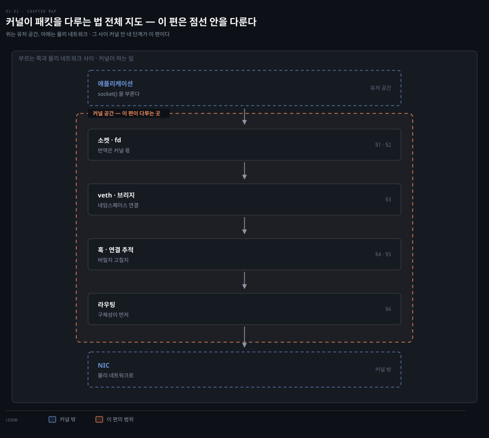
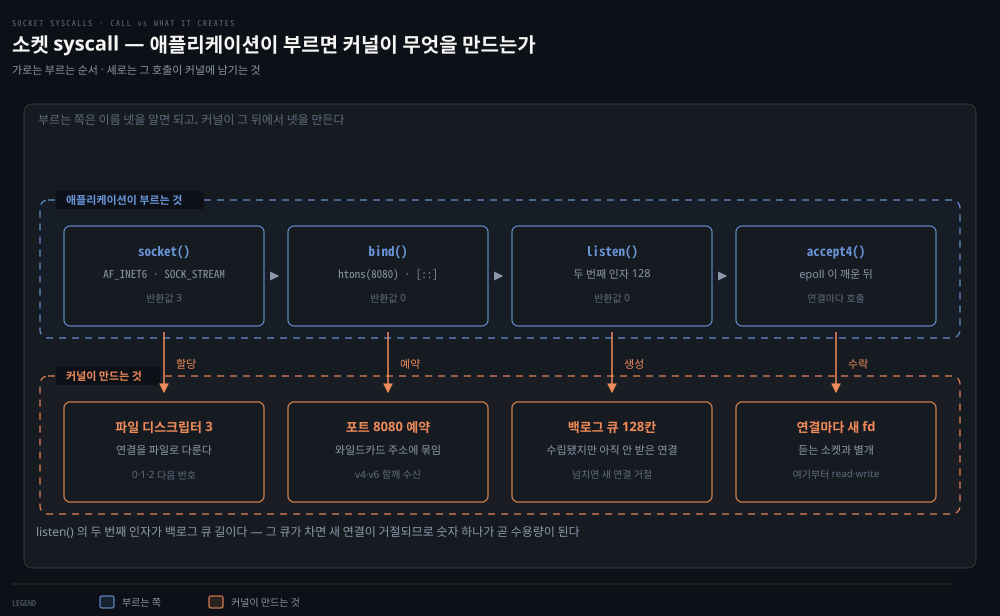
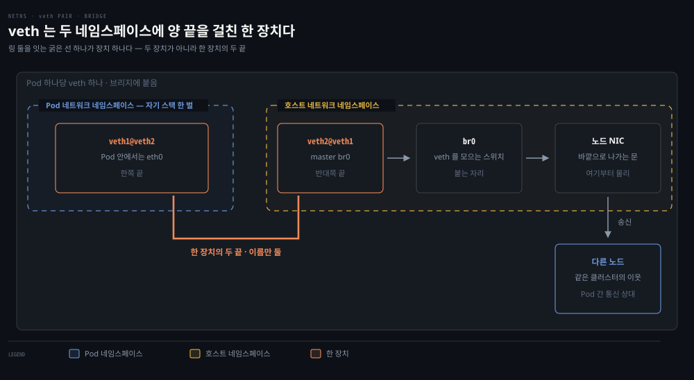
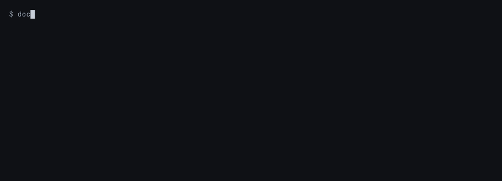
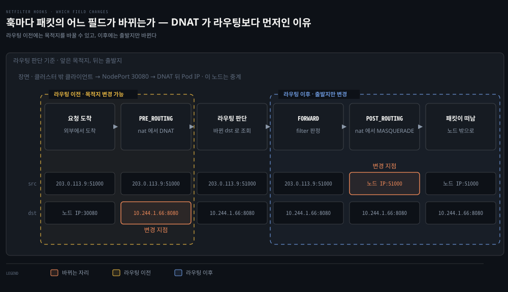
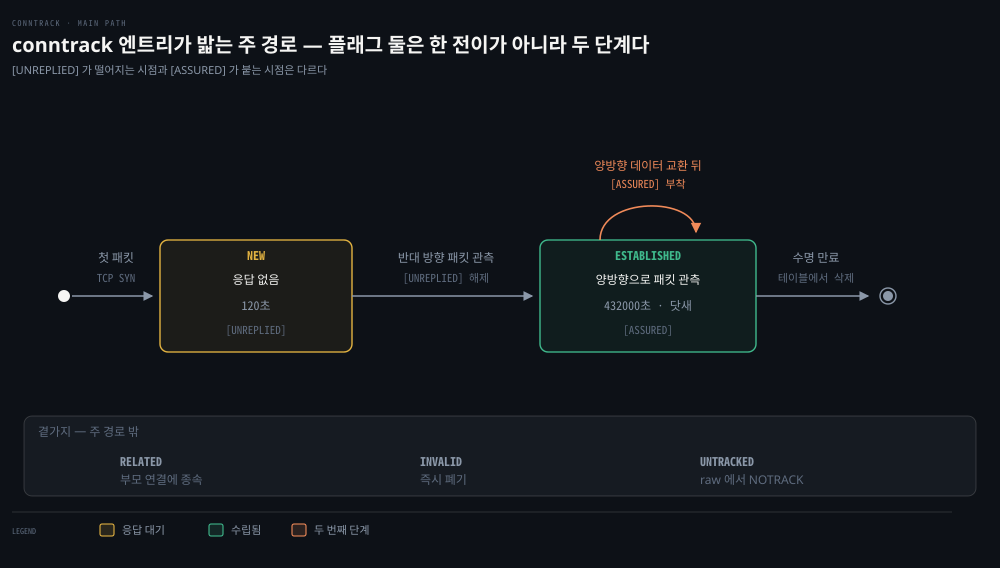
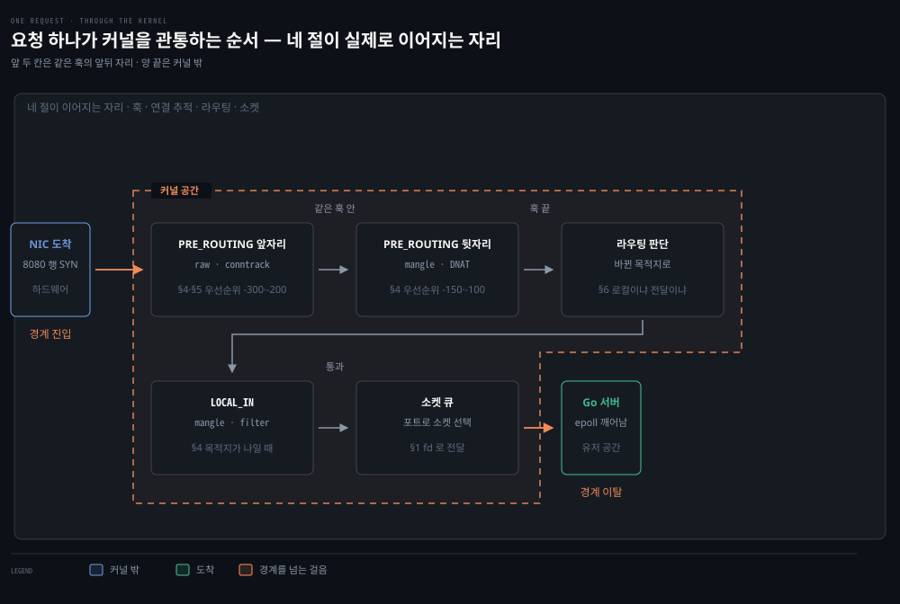

# 커널이 패킷을 다루는 법 — 소켓·Netfilter·Conntrack·라우팅

## 핵심 요약
> 이 편 전체가 매달린 하나의 생각은 "애플리케이션은 파일(소켓)만 보고, 패킷은 전부 커널이 다룬다"입니다.
> 웹 서버는 소켓을 만들어 바인딩하고 커널의 알림을 기다릴 뿐, 패킷과 데이터 스트림 사이의 번역은 커널의 몫입니다. 그 번역 길목마다 Netfilter 훅이 걸려 있고, Conntrack이 연결 상태를 추적하며, 라우팅 테이블이 다음 행선지를 정합니다. Kubernetes의 방화벽·NAT·서비스 로드밸런싱이 전부 이 세 층 위에 서 있습니다.


## 학습 목표
> 커널이 패킷을 다루는 자리를 소켓·훅·연결 추적·라우팅 네 층으로 나눠, 각 층이 무엇을 결정하는지 짚을 수 있는 상태를 목표로 합니다.

이 내용을 읽고 나면:

1. strace 출력에서 서버가 소켓을 만들고 요청을 기다리는 syscall 순서를 짚을 수 있습니다.
2. loopback 인터페이스가 보안 경계가 아닌 이유를 CVE 사례로 설명할 수 있습니다.
3. 브리지와 veth 쌍이 네트워크 네임스페이스를 잇는 방식을 그릴 수 있습니다.
4. Netfilter 훅 5개가 패킷의 출발지·목적지에 따라 어떤 순서로 발화하는지 추적할 수 있습니다.
5. Conntrack의 5-tuple flow와 상태 4종을 방화벽·NAT 동작과 연결할 수 있습니다.

아래는 이 편 전체를 패킷이 내려가는 순서로 이은 지도입니다. 위가 애플리케이션에 가깝고 아래로 갈수록 커널 안쪽이며, 오른쪽 바깥의 유저스페이스·커널 표시가 그 경계입니다. 안쪽의 절 번호가 본문에서 그것을 다루는 곳입니다. 색이 붙은 곳은 2단계 한 군데뿐이고 경고입니다. loopback을 보안 경계로 착각하는 것이 이 편에서 가장 값비싼 오해라 표시했습니다.




## 1. 서버가 요청을 받기까지 — 소켓과 syscall
> 애플리케이션이 하는 일은 소켓을 열어 두고 커널의 알림을 기다리는 것뿐입니다. 패킷과 스트림 사이의 번역은 전부 커널 몫입니다.

1장의 Go 웹 서버가 Linux 위에서 실제로 하는 일을 strace로 따라가면 커널과 애플리케이션의 분업이 드러납니다. strace는 프로세스가 커널에 거는 syscall을 가로채 순서대로 찍어 주는 도구입니다. 애플리케이션 코드를 읽는 대신 "이 프로그램이 커널에 무엇을 부탁했는가"를 시간순으로 보게 해 줍니다. 프로그램은 주소와 포트에 대한 소켓을 만들어 바인딩하고, 커널은 각 패킷을 특정 연결에 대응시키며 내부 상태 기계로 연결 상태를 관리합니다. Linux는 각 연결을 파일로 표현하므로, 연결 수락은 "커널이 프로그램에 알림을 주고 프로그램이 그 파일에 스트림을 읽고 쓰는 일"이 됩니다.

```bash
socket(AF_INET6, SOCK_STREAM|SOCK_CLOEXEC|SOCK_NONBLOCK, IPPROTO_IP) = 3
setsockopt(3, SOL_IPV6, IPV6_V6ONLY, [0], 4) = 0      # IPv4+IPv6 모두 수신
bind(3, {sin6_port=htons(8080), "::" ...}) = 0         # 8080, 모든 주소에 바인딩
listen(3, 128)                                          # 백로그 128로 대기 시작
epoll_wait(4,                                           # 커널 알림 대기 (여기서 멈춤)
```

이 네 줄이 커널에 무엇을 만들게 하는지 짝지어 보면 분업이 분명해집니다. 왼쪽이 애플리케이션이 부르는 것이고 오른쪽이 그 호출로 커널 안에 생기는 것입니다.



반환값 `3`이 파일 디스크립터라는 점이 요점입니다. 표준 입출력이 0·1·2를 쓰므로 그다음 번호가 소켓에 붙습니다. `listen`의 두 번째 인자 128은 수립됐지만 아직 `accept`로 받지 않은 연결을 담아 두는 칸 수이고, 그 칸이 넘치면 새 연결이 거절됩니다.

요청이 도착하면 epoll이 깨어나 `accept4`로 연결을 받고, 서버는 소켓을 점검한 뒤 KEEPALIVE를 켜고 프로브 간격을 180초로 설정합니다. 응답("Hello"를 HTTP로 감싼 것)을 파일 디스크립터에 쓰면, 거기서부터 패킷으로의 번역과 전송은 커널이 처리합니다.

여기서 보안 관행 하나가 나옵니다. 1~1023 포트(well-known port)는 바인딩에 root 권한이 필요합니다. 서비스가 뚫렸을 때 공격자에게 넘어가는 권한을 줄이려면 root로 웹 서비스를 돌리지 말아야 합니다. 그래서 프로그램은 8080 같은 비특권 포트에서 듣고, 외부 노출용 특권 포트는 로드밸런서나 Kubernetes Service 같은 인프라 리다이렉트로 연결하는 방식이 권장됩니다.

`0.0.0.0`(IPv4)과 `[::]`(IPv6)은 와일드카드 주소입니다. 머신이 어떤 IP를 갖게 될지 미리 모르는 채로 서비스를 노출할 때 유용해서, 네트워크에 노출되는 서비스 대부분이 이렇게 바인딩합니다.


## 2. 네트워크 인터페이스 — loopback은 보안 경계가 아니다
> `127.0.0.1` 바인딩은 접근 제어가 아닙니다. 라우팅 설정에 따라 원격이 loopback에 닿을 수 있고, CVE-2020-8558이 그 대가를 보여 줬습니다.

컴퓨터는 네트워크 인터페이스로 외부와 통신합니다. 인터페이스는 물리적(Ethernet 카드)일 수도, 호스트나 하이퍼바이저가 제공하는 가상일 수도 있습니다. IP 주소는 인터페이스에 할당되며 하나의 인터페이스에 여러 주소를 붙일 수 있습니다. `ifconfig` 또는 `ip` 명령으로 전체 인터페이스와 설정(IP·MAC·MTU·RX/TX 통계)을 확인합니다.

loopback(lo)은 같은 호스트 안 통신 전용 인터페이스로 표준 주소는 `127.0.0.1`입니다. 여기로 보낸 패킷은 호스트를 떠나지 않고, `127.0.0.1`에서 듣는 프로세스는 같은 호스트의 프로세스만 접근할 수 있습니다.

그런데 저자들은 여기에 경고를 답니다. `127.0.0.1` 바인딩은 보안 경계가 아닙니다. Kubernetes의 과거 취약점 CVE-2020-8558은 kube-proxy가 만든 규칙 탓에 일부 원격 시스템이 `127.0.0.1`에 도달할 수 있었던 사례입니다. 컨트롤 플레인 노드에서 이 구멍이 열리면, 같은 네트워크의 다른 머신이 "localhost는 신뢰할 수 있다"는 가정을 악용해 API 서버에 붙어 클러스터를 통째로 장악할 수 있었습니다.

컨테이너 런타임은 호스트의 Pod마다 가상 인터페이스를 만들기 때문에, 실제 Kubernetes 노드에서 인터페이스 목록은 훨씬 깁니다.


## 3. 브리지와 veth — 네임스페이스를 잇는 배선
> 격리된 네임스페이스에 네트워크를 공급하는 배선이 veth 쌍이고, 그것들을 한 호스트 안에서 묶는 스위치가 브리지입니다. Kubernetes의 Pod 네트워킹이 이 조합 위에 섭니다.

브리지 인터페이스는 한 호스트 안에 L2 네트워크 여러 개를 만들 수 있게 해 줍니다. 호스트 안 인터페이스들 사이에서 네트워크 스위치처럼 동작하며, Pod가 자기 인터페이스를 가진 채 노드의 인터페이스를 거쳐 바깥 네트워크와 통신할 수 있게 잇는 역할입니다.

veth는 로컬 Ethernet 터널로, 항상 쌍으로 만들어집니다. 한쪽 장치로 전송한 패킷은 즉시 반대쪽 장치에 수신되고, 어느 한쪽이 죽으면 쌍 전체의 링크가 내려갑니다. 네임스페이스끼리 또는 네임스페이스와 호스트가 통신해야 할 때 veth를 씁니다.

```bash
# 네임스페이스 둘을 만들고 veth 쌍으로 잇습니다
ip netns add net1
ip netns add net2
ip link add veth1 netns net1 type veth peer name veth2 netns net2
```



점선이 네임스페이스 경계입니다. veth를 상자 두 개로 그리지 않고 경계를 가로지르는 하나로 둔 이유는 실제로 그렇기 때문입니다. 직접 만들어 보면 두 끝이 서로를 이름으로 가리킵니다.

macOS에는 netns도 veth도 없습니다. Docker Desktop이 띄워 둔 리눅스 커널을 빌려 쓰면 되고, 장치를 만들 권한이 필요하므로 `--privileged`를 줍니다. 임시 컨테이너라 빠져나오면 만든 장치도 함께 사라집니다.

```bash
docker run --rm -it --privileged nicolaka/netshoot
```

```bash
# 1. 브리지와 veth 쌍을 만들고 한쪽 끝만 브리지에 붙입니다
ip link add br0 type bridge
ip link add veth1 type veth peer name veth2
ip link set veth2 master br0

# 2. 쌍이 서로를 가리키는지 봅니다
ip -br link show type veth

# 3. 브리지에 무엇이 붙었는지 봅니다
bridge link
```



`veth2@veth1`과 `veth1@veth2`가 `@` 뒤로 서로의 이름을 답니다. 한 장치의 양 끝이라는 것이 이름에 박혀 있는 셈입니다. `bridge link`의 결과에는 `veth2` 한 줄만 나오고 거기에 `master br0`가 붙어 있습니다. 브리지에 물린 것은 한쪽 끝뿐이고 반대쪽은 네임스페이스 안에 남는다는 뜻입니다.

Pod가 늘면 veth 쌍이 늘고 그 호스트 쪽 끝이 전부 같은 브리지에 붙습니다. 브리지가 스위치라고 불리는 이유입니다.

네트워크 네임스페이스는 인터페이스·라우팅 테이블·방화벽 규칙을 한 벌씩 따로 갖는 격리된 네트워크 공간입니다. 같은 호스트 안에 있어도 네임스페이스가 다르면 서로의 인터페이스가 보이지 않아, 각자 독립된 머신처럼 동작합니다. 이름이 같아 헷갈리지만 Kubernetes의 namespace(리소스를 논리적으로 묶는 이름표)와는 별개 개념입니다. 이 정의 자체는 책에 없고 이해를 돕기 위해 덧붙인 것입니다.

위 명령은 네트워크 네임스페이스 두 개를 만들고 veth 쌍으로 잇습니다. 양쪽에 IP를 할당하면 두 네임스페이스가 ping으로 통신할 수 있습니다. Kubernetes는 CNI 프로젝트와 함께 정확히 이 방식으로 컨테이너의 네트워크 네임스페이스·인터페이스·IP를 관리합니다 — 3장에서 자세히 다룹니다.


## 4. Netfilter — 커널 속 다섯 개의 검문소
> 패킷이 지나는 훅 조합은 출발지와 목적지가 이 호스트인지 두 질문으로 정해집니다. iptables 체인 5개가 이 훅 5개에 그대로 대응합니다.

Netfilter는 Linux 2.3부터 포함된 패킷 처리 프레임워크입니다. 핵심은 커널 훅입니다 — 프로그램이 특정 훅에 등록하면, 커널이 해당하는 패킷마다 그 프로그램을 호출합니다. 프로그램은 패킷을 버리라고 지시하거나 수정된 패킷을 돌려줄 수 있어서, 유저스페이스 프로그램이 커널 대신 패킷을 다룰 수 있게 됩니다. Netfilter는 iptables와 함께 설계됐는데, 커널 코드와 유저스페이스 코드를 분리하려는 목적이었습니다.

훅은 다섯 개이고 각각 iptables 체인과 1:1로 대응됩니다.

| Netfilter 훅 | iptables 체인 | 발화 시점 |
|--------------|--------------|----------|
| NF_IP_PRE_ROUTING | PREROUTING | 외부 시스템에서 패킷이 도착했을 때 |
| NF_IP_LOCAL_IN | INPUT | 패킷의 목적지 IP가 이 머신일 때 |
| NF_IP_FORWARD | FORWARD | 출발지도 목적지도 이 머신이 아닐 때 (남 대신 라우팅해 주는 패킷) |
| NF_IP_LOCAL_OUT | OUTPUT | 이 머신에서 만들어진 패킷이 나갈 때 |
| NF_IP_POST_ROUTING | POSTROUTING | 출처와 무관하게 패킷이 머신을 떠날 때 |

> 원문 정오: 책의 표 2-1·2-5는 NF_IP_FORWARD의 체인 이름을 "NAT"로 인쇄했지만, 같은 장의 표 2-7과 `iptables -L` 실행 예시는 FORWARD로 표기합니다. Netfilter 훅 이름(NF_IP_FORWARD) 그대로 FORWARD가 맞습니다.

어떤 패킷이 어느 훅을 지나는지는 두 가지 질문으로 정해집니다 — 출발지가 이 호스트인가, 목적지가 이 호스트인가.



점선 경계가 라우팅 판단을 기준으로 앞뒤를 가릅니다. 왼쪽에서는 목적지를 바꿀 수 있고 오른쪽에서는 출발지만 바뀝니다. 순서가 이렇게 정해진 이유가 값으로 드러납니다. PRE_ROUTING에서 목적지가 `10.96.192.224:8080`에서 `10.244.1.66:8080`으로 바뀌었고, 라우팅 판단은 **바뀐 뒤의 주소**로 경로를 찾습니다. DNAT가 라우팅보다 뒤에 있었다면 이미 정해진 경로로 엉뚱한 곳에 갔을 것입니다. 위 주소는 kind 클러스터에서 실제로 뽑은 값입니다.

| 출발지 | 목적지 | 훅 순서 |
|--------|--------|--------|
| 로컬 머신 | 로컬 머신 | LOCAL_OUT → LOCAL_IN |
| 로컬 머신 | 외부 머신 | LOCAL_OUT → POST_ROUTING |
| 외부 머신 | 로컬 머신 | PRE_ROUTING → LOCAL_IN |
| 외부 머신 | 외부 머신 | PRE_ROUTING → FORWARD → POST_ROUTING |

> 원문 정오: 첫 행(로컬→로컬)은 책의 표 2-2를 그대로 옮긴 것이지만, 같은 장 본문은 이 경우를 네 훅으로 설명합니다. 패킷이 LOCAL_OUT과 POST_ROUTING을 지나 인터페이스를 떠났다가 재진입해 PRE_ROUTING과 LOCAL_IN을 다시 지난다는 서술이며, 바로 아래 문단이 그 내용입니다. 표가 두 훅만 적은 쪽이 축약이고, 실제로 발화하는 훅은 넷입니다.

> 💬 **비유**: Netfilter 훅은 공항의 검문소입니다. 입국(PREROUTING)·입국 심사(INPUT)·환승(FORWARD)·출국 수속(OUTPUT)·탑승구(POSTROUTING)가 있고, 승객(패킷)의 여정(출발지·목적지)에 따라 지나는 검문소 조합이 정해집니다. 국내선 환승객이 입국 심사를 건너뛰듯, 남을 대신 라우팅하는 패킷은 INPUT을 지나지 않습니다.

자기 자신에게 보내는 패킷은 LOCAL_OUT과 POST_ROUTING을 지나 인터페이스를 "떠났다가" 재진입해 외부 패킷처럼 PRE_ROUTING과 LOCAL_IN을 다시 지납니다. 이 재진입 구조와 얽힌 위협이 Martian packet입니다 — 출발지 주소가 "불가능한" 패킷(예: 외부에서 온 척하는 `127.0.0.1` 출발지)을 말하며, Linux는 인터페이스에 존재할 수 없는 출발지 주소의 패킷을 기본적으로 걸러 냅니다. 이 필터링을 끄면 "localhost발 트래픽은 더 신뢰할 만하다"고 가정하는 서비스가 있는 호스트에서 큰 위험이 됩니다.

훅에 등록된 프로그램은 반환값으로 패킷의 운명을 정합니다.

- Accept — 패킷 처리를 계속 진행
- Drop — 더 처리하지 않고 폐기
- Queue — 유저스페이스 프로그램에 패킷을 넘김
- Stolen — 이후 훅을 실행하지 않고 유저스페이스가 패킷 소유권을 가짐
- Repeat — 패킷을 그 훅에 재진입시켜 다시 처리

훅은 변형된 패킷을 돌려줄 수도 있어서 재라우팅·마스커레이드·TTL 조정 같은 일이 가능해집니다.

한 가지는 책이 쓰인 뒤에 바뀌었습니다. 요즘 배포판의 `iptables` 명령은 legacy 백엔드가 아니라 nftables 백엔드로 동작합니다. `iptables -V`가 `(nf_tables)`로 답하는 것이 그 표시입니다.

다만 여기서 설명한 훅 다섯 개는 Netfilter 프레임워크 자체의 것이라 백엔드가 바뀌어도 그대로입니다. nftables의 base chain도 같은 훅에 등록됩니다. 달라진 것은 규칙을 표현하고 저장하는 방식뿐입니다.


## 5. Conntrack — 패킷을 연결로 묶는 눈
> 방화벽의 방향성과 NAT는 둘 다 Conntrack 위에 섭니다. 패킷을 연결로 묶어 봐야 "이건 응답인가 새 시도인가"를 가릴 수 있기 때문입니다.

Conntrack은 머신을 오가는 연결의 상태를 추적하는 Netfilter 구성 요소입니다. 연결 추적이 없으면 패킷의 흐름은 훨씬 불투명해집니다. 방화벽이나 NAT를 다루는 시스템에서 특히 중요합니다.

왜 필요할까요? 방화벽 관점에서는 응답과 임의 패킷을 구분하게 해 줍니다. "밖으로 나가는 연결은 허용하되, 기존 연결의 일부가 아닌 인바운드 패킷은 차단"이 가능해지는 근거가 Conntrack입니다.

> 💬 **비유**: 앞 절의 공항을 이어 가면, Conntrack은 검문소 직원이 들고 있는 탑승객 명단입니다. 명단이 없으면 직원은 눈앞의 사람만 보고 판단해야 해서 "아까 나간 그 여행객이 돌아온 것"과 "처음 보는 사람"을 구분하지 못합니다. 명단이 있어야 "나가는 사람은 다 보내되 명단에 없이 들어오는 사람은 막는다"는 규칙이 성립합니다.

NAT에는 방향이 둘 있습니다. 출발지 주소를 바꾸는 것이 SNAT이고 목적지 주소를 바꾸는 것이 DNAT입니다. 사설망의 여러 호스트가 공인 IP 하나로 나갈 때 쓰는 것이 SNAT이고, 서비스 주소로 온 패킷을 실제 백엔드로 돌리는 것이 DNAT입니다.

NAT는 아예 Conntrack 위에서 동작합니다. 패킷이 연결에 자동으로 묶이므로 같은 SNAT/DNAT 변환을 일관되게 적용할 수 있고, 로드밸런서가 연결을 특정 백엔드에 고정(pinning)하는 것도 이 덕분입니다. kube-proxy가 iptables로 서비스 로드밸런싱을 구현할 수 있는 바탕이기도 합니다. 연결 추적이 없다면 모든 패킷을 결정론적으로 같은 목적지에 재매핑해야 하는데, 백엔드 목록이 변하는 환경에서는 불가능합니다.

Conntrack은 연결을 5-tuple(출발지 주소·출발지 포트·목적지 주소·목적지 포트·L4 프로토콜)로 식별하고 이를 flow라고 부릅니다. flow는 튜플을 키로 해시 테이블에 저장됩니다. 키 공간이 클수록 메모리를 더 쓰는 대신 같은 키에 연결 리스트로 묶이는 flow가 줄어 조회가 빨라집니다.

최대 flow 수는 `net.netfilter.nf_conntrack_max`로, 해시 크기는 `/sys/module/nf_conntrack/parameters/hashsize`로 설정합니다. 공간이 바닥나면 새 연결을 만들 수 없게 됩니다. 인터넷에 직접 노출된 호스트라면 짧거나 불완전한 연결을 쏟아부어 Conntrack을 고갈시키는 것이 손쉬운 DoS 방법이 됩니다.

Conntrack은 커널 모듈(`nf_conntrack`)이 로드되고 관련 규칙이 있을 때 동작합니다. 활성 여부는 보통 `lsmod | grep nf_conntrack`로 봅니다. 다만 `lsmod`가 비어 있다고 기능이 없는 것은 아닙니다. 커널에 빌트인된 경우에는 모듈 목록에 뜨지 않으므로, `/proc/net/nf_conntrack`이나 `conntrack -L`의 응답으로 확인하는 편이 확실합니다.

> 원서 대비 갱신: 책은 `nf_conntrack_ipv4` 모듈을 언급하지만, 커널 4.19에서 이 모듈은 `nf_conntrack`으로 통합됐습니다. sysctl 경로도 `/proc/sys/net/nf_conntrack_max`보다 `net.netfilter.nf_conntrack_max`가 현재 정식 이름입니다.

flow의 상태는 4종이며, L3 도구인 Conntrack의 상태는 L4(TCP)의 상태와 별개라는 점이 중요합니다.

| 상태 | 의미 | 예 |
|------|------|-----|
| NEW | 유효한 패킷이 오갔지만 응답은 아직 없음 | TCP SYN 수신 |
| ESTABLISHED | 양방향으로 패킷 관측 | SYN 수신 후 SYN/ACK 송신 |
| RELATED | 기존 연결과 메타데이터로 묶인 추가 연결 | FTP가 데이터 연결을 추가로 여는 경우 |
| INVALID | 패킷 자체가 무효이거나 어떤 상태와도 맞지 않음 | 선행 연결 없는 TCP RST |

표만 보면 상태가 이름처럼 보이지만, 실제로는 테이블에 적힌 한 줄이고 거기에는 남은 수명과 플래그가 함께 붙습니다.



수명 차이가 눈에 띕니다. 응답을 못 받은 연결은 120초 뒤 사라지지만 수립된 연결은 432000초, 곧 닷새를 버팁니다. 이 값들은 이 환경에서 `sysctl net.netfilter.nf_conntrack_tcp_timeout_*`로 확인한 것입니다. `[UNREPLIED]`가 `[ASSURED]`로 바뀌는 것도 같은 자리에서 관측됩니다. 앞의 표에 있던 RELATED와 INVALID는 이 주 경로의 다음 단계가 아니라 곁가지라 그림에서 뺐습니다.

flow는 영원히 남지 않습니다. 각 항목에는 남은 수명이 초 단위로 붙어 있고, 그 시간이 지나면 테이블에서 사라집니다. 수명은 프로토콜과 상태마다 달라서 ESTABLISHED TCP는 며칠 단위로 길고 UDP나 미완성 연결은 훨씬 짧습니다. 이 값들은 `net.netfilter.nf_conntrack_*_timeout_*` 계열 sysctl로 조정합니다.

`conntrack -L`로 현재 flow를 볼 수 있습니다. flow 항목에는 기대 응답 패킷(expected return packet)의 튜플이 함께 실리는데, 보통은 출발·목적지가 뒤집힌 형태지만 NAT 뒤에서는 다를 수 있습니다.


## 6. 라우팅 — 어디로 보낼지 정하는 마지막 판단
> 경로 선택은 구체성이 먼저, 같으면 metric입니다. 좁은 서브넷이 기본 경로를 항상 이깁니다.

커널은 패킷을 처리할 때마다 어디로 보낼지 정해야 합니다. 목적지가 같은 네트워크가 아니면 더 가까운 호스트에 넘기는 수밖에 없고, 그 지도가 라우팅 테이블입니다. 알려진 서브넷을 게이트웨이 IP와 인터페이스에 매핑하며 `route`(또는 `route -n`)로 확인합니다. 전형적인 머신에는 로컬 네트워크 경로와 기본 경로(`0.0.0.0/0`) 두 개가 있습니다.

선택 규칙은 두 단계입니다. Linux는 먼저 구체성(매칭 서브넷이 얼마나 좁은가)으로 경로를 고르고, 구체성이 같으면 가중치(metric이 낮은 쪽)로 고릅니다. 예를 들어 `10.0.0.1`행 패킷은 `0.0.0.0/0`보다 좁은 `10.0.0.0/24` 경로에 항상 매칭됩니다. 일부 CNI 플러그인은 이 라우팅 테이블을 적극적으로 활용합니다.

여섯 절을 따로 읽으면 각 층이 무엇을 하는지는 알지만 순서가 잡히지 않습니다. 외부에서 온 요청 하나가 이 편의 네 절을 실제로 어떤 순서로 지나는지 이어 보면 이렇습니다.



각 칸에 붙은 절 번호가 본문에서 그것을 다룬 곳입니다. 눈여겨볼 곳은 라우팅 판단의 위치입니다. PRE_ROUTING과 Conntrack을 지난 **뒤에야** 목적지가 나인지 정해지고, 그 결과로 LOCAL_IN을 탈지 FORWARD로 갈지가 갈립니다. §4의 훅 조합이 "출발지·목적지가 이 호스트인가"라는 두 질문으로 정해진다고 한 것이 이 순서 때문입니다. 마지막 두 칸은 다시 §1로 돌아옵니다. 커널이 소켓을 고르고 알림을 주면, 그때부터는 애플리케이션이 파일을 읽는 일이 됩니다.


## 심화 학습
> 책 밖에서 보강한 내용입니다. 출처를 함께 남깁니다.

- CVE-2020-8558의 원인은 kube-proxy가 설정하는 `route_localnet=1` 커널 파라미터였습니다. 상세 경위는 [Kubernetes 이슈 #90259](https://github.com/kubernetes/kubernetes/issues/90259)에 기록돼 있습니다. 다만 책은 단서를 답니다 — 문제 패킷이 `127.0.0.1`과 같은 네트워크로 취급되는 loopback 장치에서 온 것이라, 엄밀히는 "Martian 패킷이 필터링되지 않은 사례"가 아니라고 구분합니다.
- Conntrack 고갈은 실제 Kubernetes 운영 장애의 단골입니다. 노드의 `nf_conntrack_max` 초과 시 "nf_conntrack: table full, dropping packet" 커널 로그와 함께 간헐적 연결 실패가 나타납니다. Cloudflare의 [conntrack 튜닝 글](https://blog.cloudflare.com/conntrack-tales-one-thousand-and-one-flows/)이 진단·튜닝 관점을 보여 줍니다.
- 네트워크 네임스페이스와 veth로 Pod 네트워킹을 손으로 재현하는 실습은 형제 저장소의 K8s 실습(`~/study/k8s_in_action`) 쪽 주제와 이어집니다. 이 책 3장에서 같은 내용을 컨테이너 맥락으로 다시 만납니다.


## 결정 치트시트
> "이 패킷이 어느 훅을 지나는가"는 두 질문으로 끝납니다.

| 출발지가 이 호스트? | 목적지가 이 호스트? | 지나는 훅 |
|--------------------|--------------------|----------|
| 예 | 예 | OUTPUT → POSTROUTING → (재진입) PREROUTING → INPUT |
| 예 | 아니오 | OUTPUT → POSTROUTING |
| 아니오 | 예 | PREROUTING → INPUT |
| 아니오 | 아니오 | PREROUTING → FORWARD → POSTROUTING |

NAT 규칙을 놓을 자리도 여기서 갈립니다 — 커널은 PREROUTING과 OUTPUT 훅에서만 라우팅 결정 전 주소 변환(DNAT)을 반영할 수 있고, LOCAL_IN 이후에는 라우팅 결정을 다시 하지 않습니다.


## 면접에서 받을 만한 질문

> 먼저 스스로 답을 소리 내어 말해 본 뒤, 아래 §정답 섹션을 펼쳐 맞춰 봅니다.

1. Netfilter를 한 문장으로 정의하면? 패킷이 지나는 훅 조합은 무엇으로 결정됩니까?
2. 방화벽이 "나가는 건 되고 들어오는 건 안 되게" 할 수 있는 원리는 무엇입니까?
3. Conntrack 테이블이 가득 차면 어떤 증상이 나고, 어떻게 대응합니까?
4. loopback(`127.0.0.1`) 바인딩이 보안 경계가 아닌 이유는? (CVE 사례)
5. veth는 왜 항상 쌍으로 만들어집니까?

### 빈칸 채우기 — 훅 순서

패킷 출발지·목적지 조합에 따라 훅 순서가 정해집니다. 외부→로컬은 `(1)____` → `(2)____`, 로컬→외부는 `(3)____` → `(4)____`, 남을 대신 라우팅하는 외부→외부는 PRE_ROUTING → `(5)____` → POST_ROUTING입니다.


## 정답 (자답 후 펼치기)

> 위 §면접에서 받을 만한 질문의 5개에 *먼저 자답한 뒤* 아래를 읽으세요. 자답 없이 먼저 읽으면 학습 효과가 0입니다.

### 정답 1 — Netfilter 정의와 훅 조합

Netfilter는 패킷이 커널을 통과하는 다섯 지점에 훅을 걸어, 유저스페이스 프로그램이 패킷의 통과·폐기·변형을 결정하게 하는 Linux 커널 프레임워크입니다. 지나는 훅 조합은 "출발지가 호스트인가, 목적지가 호스트인가" 두 질문으로 결정됩니다. 로컬에서 로컬로 보내면 나갔다가 재진입해 네 훅을 모두 지납니다.

### 정답 2 — 방화벽 방향성

Conntrack이 패킷을 연결 단위로 추적하기 때문입니다. 인바운드 패킷이 기존 flow의 ESTABLISHED·RELATED 상태에 속하면 응답으로 허용하고, 어떤 flow에도 속하지 않으면 신규 시도로 보고 차단합니다.

### 정답 3 — Conntrack 고갈

새 연결을 만들 수 없게 되어 간헐적 연결 실패가 발생합니다. 짧은 연결을 대량으로 만드는 워크로드나 외부 노출 호스트에서 잘 터지며, `nf_conntrack_max` 상향이나 불필요한 트래픽의 추적 제외(Raw 테이블 NOTRACK)로 대응합니다.

### 정답 4 — loopback 비보안경계

`127.0.0.1` 바인딩은 보안 경계가 아닙니다. CVE-2020-8558처럼 라우팅 설정에 따라 원격 머신이 `127.0.0.1`에 닿을 수 있어, "localhost는 신뢰할 수 있다"는 가정을 악용하면 API 서버 장악까지 이어질 수 있었습니다.

### 정답 5 — veth 쌍

터널의 양 끝이기 때문입니다. 한쪽에 쓴 패킷이 즉시 반대쪽에서 수신되는 구조라, 네임스페이스 안쪽 끝과 바깥쪽(호스트·브리지) 끝을 하나씩 맡아 격리된 네임스페이스에 네트워크를 공급합니다.

### 정답 빈칸 — (1)`PRE_ROUTING` (2)`LOCAL_IN` (3)`LOCAL_OUT` (4)`POST_ROUTING` (5)`FORWARD`

외부→로컬은 PRE_ROUTING → LOCAL_IN, 로컬→외부는 LOCAL_OUT → POST_ROUTING, 외부→외부(포워딩)는 PRE_ROUTING → FORWARD → POST_ROUTING입니다.


## 핵심 개념 체크리스트
> 여섯 항목을 막힘없이 답할 수 있으면 다음 편으로 넘어가도 좋습니다.
- [ ] bind→listen→epoll_wait→accept4 흐름에서 각 syscall의 역할을 말할 수 있는가?
- [ ] 비특권 포트 + 인프라 리다이렉트 관행의 보안 근거를 설명할 수 있는가?
- [ ] Netfilter 훅 5개와 iptables 체인의 대응을 외우고 있는가?
- [ ] 패킷 출발지·목적지 조합 4가지의 훅 순서를 재구성할 수 있는가?
- [ ] Conntrack 상태 4종과 TCP 상태가 별개인 이유를 아는가?
- [ ] 라우팅 선택이 구체성 → metric 순서인 것을 예시로 보일 수 있는가?


## 참고 자료
- 《Networking and Kubernetes: A Layered Approach》(James Strong·Vallery Lancey, O'Reilly, 2021, ISBN 978-1492081654) Ch2
- [Netfilter 공식 문서](https://www.netfilter.org/documentation/)
- [Kubernetes 이슈 #90259 — CVE-2020-8558](https://github.com/kubernetes/kubernetes/issues/90259)
- 이전 편: [01-03. IP·라우팅·Ethernet](./01-03.IP%C2%B7%EB%9D%BC%EC%9A%B0%ED%8C%85%C2%B7Ethernet%20%E2%80%94%20%ED%8C%A8%ED%82%B7%EC%9D%B4%20%EA%B8%B8%EC%9D%84%20%EC%B0%BE%EB%8A%94%20%EB%B2%95.md)
- 다음 편: [02-02. iptables·IPVS·eBPF](./02-02.iptables%C2%B7IPVS%C2%B7eBPF%20%E2%80%94%20kube-proxy%EB%A5%BC%20%EC%9D%B4%ED%95%B4%ED%95%98%EB%8A%94%20%EC%84%B8%20%EA%B8%B0%EC%88%A0.md)
